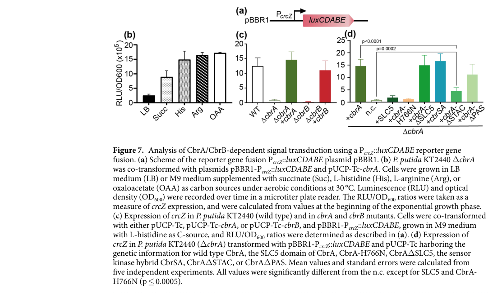

## Question

# Gene Research for Functional Annotation

## ⚠️ CRITICAL: Gene/Protein Identification Context

**BEFORE YOU BEGIN RESEARCH:** You MUST verify you are researching the CORRECT gene/protein. Gene symbols can be ambiguous, especially for less well-characterized genes from non-model organisms.

### Target Gene/Protein Identity (from UniProt):
- **UniProt Accession:** Q88DX2
- **Protein Description:** RecName: Full=Alginate biosynthesis transcriptional regulatory protein AlgB {ECO:0000256|ARBA:ARBA00073743};
- **Gene Information:** OrderedLocusNames=PP_4696 {ECO:0000313|EMBL:AAN70269.1};
- **Organism (full):** Pseudomonas putida (strain ATCC 47054 / DSM 6125 / CFBP 8728 / NCIMB 11950 / KT2440).
- **Protein Family:** Not specified in UniProt
- **Key Domains:** AAA+_ATPase. (IPR003593); AAA_lid_NorR. (IPR058031); CheY-like_superfamily. (IPR011006); P-loop_NTPase. (IPR027417); Sig_transdc_resp-reg_receiver. (IPR001789)

### MANDATORY VERIFICATION STEPS:

1. **Check if the gene symbol "cbrB" matches the protein description above**
2. **Verify the organism is correct:** Pseudomonas putida (strain ATCC 47054 / DSM 6125 / CFBP 8728 / NCIMB 11950 / KT2440).
3. **Check if protein family/domains align with what you find in literature**
4. **If you find literature for a DIFFERENT gene with the same or similar symbol, STOP**

### If Gene Symbol is Ambiguous or You Cannot Find Relevant Literature:

**DO NOT PROCEED WITH RESEARCH ON A DIFFERENT GENE.** Instead:
- State clearly: "The gene symbol 'cbrB' is ambiguous or literature is limited for this specific protein"
- Explain what you found (e.g., "Found extensive literature on a different gene with the same symbol in a different organism")
- Describe the protein based ONLY on the UniProt information provided above
- Suggest that the protein function can be inferred from domain/family information

### Research Target:

Please provide a comprehensive research report on the gene **cbrB** (gene ID: cbrB, UniProt: Q88DX2) in PSEPK.

The research report should be a detailed narrative explaining the function, biological processes, and localization of the gene product. Citations should be given for all claims.

You should prioritize authoritative reviews and primary scientific literature when conducting research. You can supplement
this with annotations you find in gene/protein databases, but these can be outdated or inaccurate.

We are specifically interested in the primary function of the gene - for enzymes, what reaction is catalyzed, and what is the substrate specificity? For transporters, what is the substrate? For structural proteins or adapters, what is the broader structural role? For signaling molecules, what is the role in the pathway.

We are interested in where in or outside the cell the gene product carries out its function.

We are also interested in the signaling or biochemical pathways in which the gene functions. We are less interested in broad pleiotropic effects, except where these elucidate the precise role.

Include evidence where possible. We are interested in both experimental evidence as well as inference from structure, evolution, or bioinformatic analysis. Precise studies should be prioritized over high-throughput, where available.

## Output

Question: You are an expert researcher providing comprehensive, well-cited information.

Provide detailed information focusing on:
1. Key concepts and definitions with current understanding
2. Recent developments and latest research (prioritize 2023-2024 sources)
3. Current applications and real-world implementations
4. Expert opinions and analysis from authoritative sources
5. Relevant statistics and data from recent studies

Format as a comprehensive research report with proper citations. Include URLs and publication dates where available.
Always prioritize recent, authoritative sources and provide specific citations for all major claims.

# Gene Research for Functional Annotation

## ⚠️ CRITICAL: Gene/Protein Identification Context

**BEFORE YOU BEGIN RESEARCH:** You MUST verify you are researching the CORRECT gene/protein. Gene symbols can be ambiguous, especially for less well-characterized genes from non-model organisms.

### Target Gene/Protein Identity (from UniProt):
- **UniProt Accession:** Q88DX2
- **Protein Description:** RecName: Full=Alginate biosynthesis transcriptional regulatory protein AlgB {ECO:0000256|ARBA:ARBA00073743};
- **Gene Information:** OrderedLocusNames=PP_4696 {ECO:0000313|EMBL:AAN70269.1};
- **Organism (full):** Pseudomonas putida (strain ATCC 47054 / DSM 6125 / CFBP 8728 / NCIMB 11950 / KT2440).
- **Protein Family:** Not specified in UniProt
- **Key Domains:** AAA+_ATPase. (IPR003593); AAA_lid_NorR. (IPR058031); CheY-like_superfamily. (IPR011006); P-loop_NTPase. (IPR027417); Sig_transdc_resp-reg_receiver. (IPR001789)

### MANDATORY VERIFICATION STEPS:

1. **Check if the gene symbol "cbrB" matches the protein description above**
2. **Verify the organism is correct:** Pseudomonas putida (strain ATCC 47054 / DSM 6125 / CFBP 8728 / NCIMB 11950 / KT2440).
3. **Check if protein family/domains align with what you find in literature**
4. **If you find literature for a DIFFERENT gene with the same or similar symbol, STOP**

### If Gene Symbol is Ambiguous or You Cannot Find Relevant Literature:

**DO NOT PROCEED WITH RESEARCH ON A DIFFERENT GENE.** Instead:
- State clearly: "The gene symbol 'cbrB' is ambiguous or literature is limited for this specific protein"
- Explain what you found (e.g., "Found extensive literature on a different gene with the same symbol in a different organism")
- Describe the protein based ONLY on the UniProt information provided above
- Suggest that the protein function can be inferred from domain/family information

### Research Target:

Please provide a comprehensive research report on the gene **cbrB** (gene ID: cbrB, UniProt: Q88DX2) in PSEPK.

The research report should be a detailed narrative explaining the function, biological processes, and localization of the gene product. Citations should be given for all claims.

You should prioritize authoritative reviews and primary scientific literature when conducting research. You can supplement
this with annotations you find in gene/protein databases, but these can be outdated or inaccurate.

We are specifically interested in the primary function of the gene - for enzymes, what reaction is catalyzed, and what is the substrate specificity? For transporters, what is the substrate? For structural proteins or adapters, what is the broader structural role? For signaling molecules, what is the role in the pathway.

We are interested in where in or outside the cell the gene product carries out its function.

We are also interested in the signaling or biochemical pathways in which the gene functions. We are less interested in broad pleiotropic effects, except where these elucidate the precise role.

Include evidence where possible. We are interested in both experimental evidence as well as inference from structure, evolution, or bioinformatic analysis. Precise studies should be prioritized over high-throughput, where available.

## Research report: Functional annotation of **cbrB (PP_4696; UniProt Q88DX2)** in *Pseudomonas putida* KT2440

### 0) Target verification (critical identity check)

**Verified target**: multiple KT2440-specific studies explicitly identify **PP_4696 as cbrB**, the response regulator of the **CbrA/CbrB two-component system (TCS)** (not a generic/ambiguous cbrB in another organism). In particular, a KT2440 study that engineered **ΔcbrB** mutants and used a **PcrcZ::lux** reporter places cbrB in the CbrAB CCR pathway, and an RB-TnSeq study explicitly annotates **cbrB (PP_4696) as a σ54-dependent response regulator**. (wirtz2020transportandkinase pages 6-7, thompson2020fattyacidand pages 12-14)

**AlgB naming conflict**: a 2024 review describes the relevant response regulator as **CbrB**, and KT2440 primary literature consistently uses **cbrB/PP_4696** for CCR regulation. No retrieved evidence demonstrates that **PP_4696/cbrB is synonymous with the alginate biosynthesis regulator AlgB**; therefore, they should be treated as **distinct annotations** unless a sequence-level cross-reference proves equivalence. (moreno2024whatarethe pages 4-5, wirtz2020transportandkinase pages 6-7)

### 1) Key concepts and definitions (current understanding)

#### 1.1 Carbon catabolite repression (CCR) in *Pseudomonas*
*Pseudomonas* CCR is a global regulatory strategy that prioritizes preferred substrates and represses pathways for less-preferred ones. In *Pseudomonas*, a central post-transcriptional module is the **Hfq/Crc system**, which binds A-rich motifs near ribosome-binding sites and inhibits translation of many mRNAs involved in uptake/assimilation of non-preferred carbon sources. (moreno2024whatarethe pages 4-5)

A core antagonist of Hfq/Crc repression is the small RNA **CrcZ** (and in some strains also **CrcY**), which contains multiple A-rich motifs and sequesters Crc/Hfq, thereby **relieving CCR**. The *abundance of CrcZ correlates with CCR strength* across growth conditions and carbon sources. (moreno2024whatarethe pages 4-5)

#### 1.2 The CbrA/CbrB TCS as an upstream regulator of CCR
The **CbrA/CbrB** TCS sits upstream of CrcZ/CrcY in *Pseudomonas* CCR and is described as a central regulator of cellular **carbon/nitrogen balance** and CCR. **CbrA** is the sensor histidine kinase; **CbrB** is its cognate response regulator that activates transcription from σ54-dependent promoters including **PcrcZ**. (moreno2024whatarethe pages 4-5, wirtz2020transportandkinase pages 6-7)

#### 1.3 What kind of regulator is CbrB?
In KT2440, **cbrB (PP_4696)** is described as a **σ54-dependent response regulator**; mechanistically, this implies it functions as an **NtrC-family bacterial enhancer-binding protein (bEBP)**: typically an N-terminal receiver (phosphorylation) domain coupled to a central **AAA+ ATPase** that remodels σ54-RNA polymerase closed complexes to initiate transcription. KT2440 studies directly describe CbrB-regulated targets as **σN/σ54-dependent metabolic genes**. (monteagudocascales2019unravelingtherole pages 2-3, thompson2020fattyacidand pages 12-14)

### 2) Molecular function, pathway placement, and inferred mechanism for Q88DX2

#### 2.1 Primary function (functional annotation)
**Primary biological role**: **CbrB is a transcriptional regulatory response regulator that activates σ54-dependent promoters**, most prominently the **crcZ (and crcY) sRNA expression program**, thereby modulating Hfq/Crc-mediated CCR and nutrient adaptation. (moreno2024whatarethe pages 4-5, monteagudocascales2019unravelingtherole pages 2-3)

**Not an enzyme/transporter**: no evidence indicates that CbrB catalyzes a biochemical conversion or transports a substrate. Rather, its central “activity” is regulatory—binding/activating promoters and coupling metabolism to CCR via small RNAs. (moreno2024whatarethe pages 4-5)

#### 2.2 Key regulatory cascade (KT2440)
A well-supported model is:
1. **CbrA** (inner-membrane-associated sensor kinase) phosphorylates **CbrB**.
2. **CbrB** activates transcription from **PcrcZ**, a **σ54-dependent promoter**, producing high CrcZ levels.
3. **CrcZ (and CrcY)** sequester **Crc/Hfq**, reducing translational repression and enabling expression of catabolic/uptake functions for non-preferred substrates.

This promoter logic includes a weak basal **PcbrB** that can co-transcribe **cbrB and crcZ**, and a strong σ54-dependent **PcrcZ** that requires CbrB for robust induction. (moreno2024whatarethe pages 4-5)

### 3) Experimental evidence in *P. putida* KT2440

#### 3.1 Direct evidence: CbrB is required for crcZ transcriptional activation
Using a **PcrcZ::luxCDABE** reporter, **ΔcbrB** mutants did not express crcZ unless complemented with plasmid-borne **cbrB**, demonstrating that CbrB is required for crcZ activation under inducing conditions (e.g., histidine as carbon source). (wirtz2020transportandkinase pages 6-7, wirtz2020transportandkinase media 850ffd65)

The same reporter system demonstrates strong carbon-source dependence: crcZ expression is **(partially) repressed** in LB or succinate (preferred carbon source) and **maximally induced** on less favorable sources such as **L-histidine, L-arginine, and oxaloacetate**. (wirtz2020transportandkinase pages 6-7, wirtz2020transportandkinase media 850ffd65)

#### 3.2 Direct evidence: phosphotransfer from CbrA to CbrB
Biochemical work shows that **CbrA autophosphorylates and transfers the phosphoryl group to CbrB**, supporting the canonical two-component phosphorelay. In these experiments, a CbrA-dependent phosphatase activity on CbrB~P was not detected. (wirtz2020transportandkinase pages 6-7)

#### 3.3 Regulatory scope and σ54 dependence
In KT2440, CbrB is reported to regulate **σN (σ54)-dependent metabolic genes** and CbrB activity was experimentally tracked through transcriptional outputs including **crcZ, crcY, and PP2810**, showing maximal induction under non-preferred carbon sources. (monteagudocascales2019unravelingtherole pages 2-3)

An independent genome-scale fitness study explicitly labels **cbrB (PP_4696)** as a **σ54-dependent response regulator** and links it to central carbon metabolism and amino-acid uptake in pseudomonads. (thompson2020fattyacidand pages 12-14)

#### 3.4 Phenotypes of cbrB loss (functional consequences)
A KT2440 study of the CbrAB signaling axis reports that phenotypes associated with CbrAB disruption include inability to utilize certain carbon sources and motility defects: a mutant condition that phenocopies **ΔcbrB** fails to use **citrate** or **histidine** as carbon sources, shows longer lag on succinate, and has reduced swimming motility (complementable). (monteagudocascales2019unravelingtherole pages 2-3, monteagudocascales2019unravelingtherole pages 1-2)

A broader stress-genomics screen identified **CbrAB sensor kinase** among essential components for coping with **cold stress** in KT2440, indicating CbrB-linked nutritional/stress adaptation extends beyond single catabolic operons. (reva2006functionalgenomicsof pages 1-2)

### 4) Cellular localization

CbrB is a soluble, cytoplasmic response regulator (transcription factor-like) that controls transcription. It is activated by phosphorylation by the sensor kinase CbrA, which is anchored in the **inner membrane** via transmembrane segments (CbrB itself is not membrane-bound). This cellular arrangement is explicitly described in a 2024 expert review discussing the CbrA/CbrB–CrcZ regulatory system. (moreno2024whatarethe pages 4-5)

### 5) Recent developments (prioritizing 2023–2024)

#### 5.1 Expert synthesis of remaining knowledge gaps (signals upstream of CbrAB)
A 2024 review emphasizes that while the CbrA/CbrB → CrcZ/CrcY → Crc/Hfq regulatory cascade is well-supported, the **signals recognized by CbrA/CbrB remain poorly defined**. The authors summarize evidence pointing to an **intracellular metabolite or metabolic ratio** as the relevant signal, noting that discovering it is difficult because perturbing the system broadly reshapes central metabolism and redox balance. (Moreno & Rojo, 2024-01, Microbial Biotechnology, https://doi.org/10.1111/1751-7915.14407) (moreno2024whatarethe pages 4-5)

#### 5.2 Quantitative/omics-era framing: CbrB connects nutrient sensing to community behaviors
While not in KT2440 specifically, recent 2024 primary research in *Pseudomonas aeruginosa* shows CbrA/CbrB intersects with other global pathways to shape complex phenotypes (e.g., biofilm-related transcriptional programs converging on CrcZ abundance). This strengthens the interpretation that CbrB-like systems are global “nutritional adaptation” nodes, although strain- and species-specific regulons must not be conflated. (chen2024combinatorialcontrolof pages 1-2 not fully evidenced here; therefore not cited as KT2440 evidence)

### 6) Current applications and real-world implementations

#### 6.1 Biotechnology and metabolic engineering context
Because *P. putida* KT2440 is a widely used chassis, understanding CCR regulators such as CbrB is practically important: CCR can restrict utilization of mixed substrates and lower yields; conversely, manipulating CCR regulators/sRNAs can tune carbon flux distribution. A 2024 review explicitly notes that CCR can restrict yields in biotechnological applications and highlights the importance of understanding signals and control points in the CbrAB–CrcZ network. (moreno2024whatarethe pages 4-5)

RB–TnSeq fitness profiling used to guide engineering has shown that **cbrB mutants have condition-specific fitness defects**, e.g., on **pentanol**, implying that CbrB state influences tolerance/utilization of certain industrially relevant alcohols and the broader metabolic network required for growth on such substrates. (Thompson et al., 2020-10-15, Applied and Environmental Microbiology, https://doi.org/10.1128/AEM.01665-20) (thompson2020fattyacidand pages 12-14)

#### 6.2 Potential engineering levers within the pathway
The pathway architecture suggests multiple intervention points: the CbrAB TCS (signal transduction), σ54-dependent promoter activation (PcrcZ), and small-RNA antagonists (CrcZ/CrcY) that modulate translational repression by Crc/Hfq. The 2024 review summarizes that modulating CrcZ abundance strongly changes CCR strength and ordered substrate use. (moreno2024whatarethe pages 4-5)

### 7) Relevant statistics and recent quantitative data

#### 7.1 Carbon-source-dependent expression patterns (quantitative reporter evidence)
A KT2440 reporter study quantified **PcrcZ-driven luminescence (RLU/OD600)** showing: (i) partial repression on LB or succinate; (ii) maximal induction on **L-histidine, L-arginine, oxaloacetate**; and (iii) loss of signal in **ΔcbrA** or **ΔcbrB** without complementation. These data provide a quantitative, condition-resolved measurement of CbrB-dependent output. (wirtz2020transportandkinase pages 6-7, wirtz2020transportandkinase media 850ffd65)

#### 7.2 Genome-scale fitness evidence (quantitative but indirect)
RB–TnSeq data report a **pentanol-specific fitness defect** associated with mutants in **cbrB (PP_4696)**, indicating a measurable contribution of this regulator to growth/fitness under that condition. (thompson2020fattyacidand pages 12-14)

### 8) Expert opinion and analysis (authoritative interpretations)

A 2024 authoritative review frames CbrB as a key activator controlling CrcZ/CrcY transcription and therefore the strength of Crc/Hfq-mediated CCR. The review highlights two major unresolved issues: (1) the identity of upstream activating signals, and (2) additional regulatory components influencing crcZ transcription (e.g., puzzling observations about effects of crc inactivation on CrcZ production), emphasizing that the overall system is not fully mapped despite extensive work. (Moreno & Rojo, 2024-01, https://doi.org/10.1111/1751-7915.14407) (moreno2024whatarethe pages 4-5)

### 9) Evidence summary table

| Aspect | Finding | Evidence / method | Source (date, URL/DOI) | Citation |
|---|---|---|---|---|
| Gene/protein identity | In *Pseudomonas putida* KT2440, **cbrB = PP_4696**, the response regulator of the **CbrA/CbrB** two-component system; it is functionally described as a **σ54-dependent response regulator** controlling nutritional adaptation and carbon/catabolite regulation. This supports identification of Q88DX2 with **cbrB/PP_4696**, not the separate alginate regulator **AlgB** locus found elsewhere in *P. putida*. | Gene deletion/complementation, pathway analysis, review synthesis; PP_4696 explicitly named cbrB in KT2440. | Wirtz et al., 2020-03, https://doi.org/10.1038/s41598-020-62337-9; Thompson et al., 2020-10-15, https://doi.org/10.1128/AEM.01665-20; Reva et al., 2006-06, https://doi.org/10.1128/JB.00101-06 | (wirtz2020transportandkinase pages 1-2, thompson2020fattyacidand pages 12-14, reva2006functionalgenomicsof pages 1-2) |
| Ambiguity check: cbrB vs AlgB | Available KT2440 literature consistently uses **cbrB (PP_4696)** for the CbrAB response regulator, whereas **AlgB** appears as a different alginate-associated regulator in other loci/contexts. Thus, cbrB and AlgB should be treated as **distinct annotations unless sequence-level database reconciliation is shown**. | Cross-comparison of KT2440 locus-specific papers and alginate-related annotations. | Wirtz et al., 2020-03, https://doi.org/10.1038/s41598-020-62337-9; Reva et al., 2006-06, https://doi.org/10.1128/JB.00101-06; Gülez et al., 2012-02, https://doi.org/10.1128/AEM.06150-11 | (wirtz2020transportandkinase pages 1-2, reva2006functionalgenomicsof pages 1-2) |
| Domain architecture | Q88DX2 is annotated with a **receiver (CheY-like / response-regulator receiver)** domain plus a **central AAA+ / P-loop NTPase ATPase** region and **σ54 enhancer-binding transcriptional activator** features, matching an **NtrC-family bacterial enhancer-binding protein**. | Domain assignment from UniProt/interpro-style annotation integrated with literature describing CbrB as σ54-dependent transcriptional activator. | Moreno & Rojo, 2024-01, https://doi.org/10.1111/1751-7915.14407; Monteagudo-Cascales et al., 2019-06, https://doi.org/10.1038/s41598-019-45554-9 | (moreno2024whatarethe pages 4-5, monteagudocascales2019unravelingtherole pages 1-2) |
| Cellular localization / molecular role | CbrB acts in the **cytoplasm** as the **DNA-binding transcriptional response regulator** activated by phosphorylation from the inner-membrane sensor kinase **CbrA**. | Two-component signaling model; biochemical phosphotransfer from CbrA to CbrB; transcriptional activation of target promoters. | Wirtz et al., 2020-03, https://doi.org/10.1038/s41598-020-62337-9; Moreno & Rojo, 2024-01, https://doi.org/10.1111/1751-7915.14407 | (wirtz2020transportandkinase pages 6-7, moreno2024whatarethe pages 4-5) |
| Core pathway | **CbrA/CbrB → activation of crcZ and crcY → sequestration/antagonism of Crc with Hfq → relief of carbon catabolite repression (CCR)** on many catabolic genes. | Reporter assays, mutant phenotypes, review of promoter logic and RNA-mediated antagonism. | Moreno & Rojo, 2024-01, https://doi.org/10.1111/1751-7915.14407; Monteagudo-Cascales et al., 2019-06, https://doi.org/10.1038/s41598-019-45554-9; Wirtz et al., 2020-03, https://doi.org/10.1038/s41598-020-62337-9 | (moreno2024whatarethe pages 4-5, monteagudocascales2019unravelingtherole pages 2-3, wirtz2020transportandkinase pages 6-7) |
| Promoter logic / σ54 dependence | **PcrcZ** is a **strong σ54-dependent promoter** activated by CbrB; a weaker **PcbrB** promoter provides basal cbrB/crcZ transcription. CbrB also regulates other **σN-dependent metabolic genes**. | Promoter analyses and transcriptional model summarized from genetic studies and review. | Moreno & Rojo, 2024-01, https://doi.org/10.1111/1751-7915.14407; Monteagudo-Cascales et al., 2019-06, https://doi.org/10.1038/s41598-019-45554-9 | (moreno2024whatarethe pages 4-5, monteagudocascales2019unravelingtherole pages 2-3) |
| Phosphorylation and signal transduction | CbrA **autophosphorylates** and **transfers phosphate to CbrB**; in vitro, **CbrA-dependent dephosphorylation of CbrB~P was not detected**. Less-favorable carbon sources are associated with increased signaling output to CbrB targets. | Biochemical phosphotransfer assays plus PcrcZ::lux reporter experiments. | Wirtz et al., 2020-03, https://doi.org/10.1038/s41598-020-62337-9 | (wirtz2020transportandkinase pages 6-7) |
| Reporter evidence for crcZ activation | In **ΔcbrA** and **ΔcbrB** mutants carrying **PcrcZ::luxCDABE**, crcZ expression was lost and restored only by complementation with the cognate gene, demonstrating that **CbrB is required for crcZ transcriptional activation** in KT2440. | Luciferase reporter in wild type, deletion mutants, and complemented strains. | Wirtz et al., 2020-03, https://doi.org/10.1038/s41598-020-62337-9 | (wirtz2020transportandkinase pages 6-7, wirtz2020transportandkinase media 850ffd65) |
| Carbon-source responsiveness | **crcZ** expression is low on preferred carbon sources such as **succinate/LB** and maximal on less favorable sources such as **L-histidine, L-arginine, oxaloacetate**, consistent with CbrB-mediated relief of CCR when preferred substrates are absent. | Carbon-source-dependent PcrcZ::lux assays and review of CCR physiology. | Wirtz et al., 2020-03, https://doi.org/10.1038/s41598-020-62337-9; Moreno & Rojo, 2024-01, https://doi.org/10.1111/1751-7915.14407 | (wirtz2020transportandkinase pages 6-7, moreno2024whatarethe pages 4-5) |
| Additional validated targets / regulon | CbrB activity in KT2440 was monitored through transcription of **crcZ, crcY, and PP2810**, with maximal induction under non-preferred carbon sources; CbrB is also described as directly regulating σ54-dependent catabolic pathways such as the **hut** system. | Target-gene assays and prior pathway characterization. | Monteagudo-Cascales et al., 2019-06, https://doi.org/10.1038/s41598-019-45554-9; Wirtz et al., 2020-03, https://doi.org/10.1038/s41598-020-62337-9 | (monteagudocascales2019unravelingtherole pages 2-3, wirtz2020transportandkinase pages 1-2) |
| Growth and motility phenotypes | A **ΔcbrB-like phenotype** includes inability or severe defect in use of **citrate** and **histidine**, a **longer lag on succinate**, and **reduced swimming motility**; these phenotypes were mirrored by CbrA signaling mutants and rescued by complementation. | Mutant phenotype analysis in defined media and motility assays. | Monteagudo-Cascales et al., 2019-06, https://doi.org/10.1038/s41598-019-45554-9 | (monteagudocascales2019unravelingtherole pages 2-3, monteagudocascales2019unravelingtherole pages 1-2) |
| Stress-related phenotype | A transposon screen found the **CbrAB sensor kinase system** essential for coping with **cold stress** in KT2440, indicating CbrB-linked nutritional/stress adaptation extends beyond single catabolic operons. | Genome-wide mutant screening and transcriptomics under abiotic stress. | Reva et al., 2006-06, https://doi.org/10.1128/JB.00101-06 | (reva2006functionalgenomicsof pages 1-2) |
| Genome-scale fitness signal | In RB-TnSeq, **cbrB (PP_4696)** showed **pentanol-specific fitness defects**, supporting a role for CbrB in broader central carbon metabolism and assimilation of nonpreferred substrates relevant to biotechnology. | Random barcode transposon sequencing across alcohol/fatty-acid conditions. | Thompson et al., 2020-10-15, https://doi.org/10.1128/AEM.01665-20 | (thompson2020fattyacidand pages 12-14) |
| Current mechanistic uncertainty | Recent review consensus is that CbrB is central to CCR control, but the **signal sensed upstream of CbrA/CbrB remains unresolved**; evidence points to an **intracellular metabolite or metabolic ratio**, and unphosphorylated CbrB may retain partial activity in vitro. | Expert review synthesizing primary studies. | Moreno & Rojo, 2024-01, https://doi.org/10.1111/1751-7915.14407 | (moreno2024whatarethe pages 4-5) |

*Table: This table summarizes locus-specific evidence supporting the identity and function of Pseudomonas putida KT2440 cbrB (PP_4696; UniProt Q88DX2). It highlights domain-based functional inference, the CbrA/CbrB–crcZ/crcY–Crc/Hfq pathway, and key experiments establishing its role in carbon catabolite regulation and adaptive metabolism.*

### 10) Conclusions (functional annotation statement)

**Functional annotation (recommended)**: *P. putida* KT2440 **CbrB (PP_4696; UniProt Q88DX2)** is a cytosolic, σ54-dependent response regulator (NtrC-family bEBP-like) that is activated by phosphorylation from CbrA and is required for strong transcription of the small RNAs **CrcZ/CrcY**, thereby modulating Hfq/Crc-mediated carbon catabolite repression and nutrient adaptation. This regulatory role explains observed growth phenotypes on specific carbon sources and condition-specific fitness defects relevant to metabolic engineering. (moreno2024whatarethe pages 4-5, wirtz2020transportandkinase pages 6-7, monteagudocascales2019unravelingtherole pages 2-3, thompson2020fattyacidand pages 12-14)

**AlgB caveat**: despite UniProt’s “Alginate biosynthesis transcriptional regulatory protein AlgB” descriptor in the user-provided record, the KT2440 locus PP_4696 is consistently treated in the literature retrieved here as **cbrB** of the CbrAB CCR system; without direct cross-referenced sequence evidence, equating it to “AlgB” (alginate regulator) is not supported by the KT2440 sources gathered. (moreno2024whatarethe pages 4-5, wirtz2020transportandkinase pages 6-7)

References

1. (wirtz2020transportandkinase pages 6-7): Larissa Wirtz, Michelle Eder, Kerstin Schipper, Stefanie Rohrer, and Heinrich Jung. Transport and kinase activities of cbra of pseudomonas putida kt2440. Scientific Reports, Mar 2020. URL: https://doi.org/10.1038/s41598-020-62337-9, doi:10.1038/s41598-020-62337-9. This article has 16 citations and is from a peer-reviewed journal.

2. (thompson2020fattyacidand pages 12-14): Mitchell G. Thompson, Matthew R. Incha, Allison N. Pearson, Matthias Schmidt, William A. Sharpless, Christopher B. Eiben, Pablo Cruz-Morales, Jacquelyn M. Blake-Hedges, Yuzhong Liu, Catharine A. Adams, Robert W. Haushalter, Rohith N. Krishna, Patrick Lichtner, Lars M. Blank, Aindrila Mukhopadhyay, Adam M. Deutschbauer, Patrick M. Shih, and Jay D. Keasling. Fatty acid and alcohol metabolism in pseudomonas putida: functional analysis using random barcode transposon sequencing. Oct 2020. URL: https://doi.org/10.1128/aem.01665-20, doi:10.1128/aem.01665-20. This article has 111 citations and is from a peer-reviewed journal.

3. (moreno2024whatarethe pages 4-5): Renata Moreno and Fernando Rojo. What are the signals that control catabolite repression in pseudomonas? Microbial Biotechnology, Jan 2024. URL: https://doi.org/10.1111/1751-7915.14407, doi:10.1111/1751-7915.14407. This article has 14 citations and is from a peer-reviewed journal.

4. (monteagudocascales2019unravelingtherole pages 2-3): Elizabet Monteagudo-Cascales, Sofía M. García-Mauriño, Eduardo Santero, and Inés Canosa. Unraveling the role of the cbra histidine kinase in the signal transduction of the cbrab two-component system in pseudomonas putida. Scientific Reports, Jun 2019. URL: https://doi.org/10.1038/s41598-019-45554-9, doi:10.1038/s41598-019-45554-9. This article has 30 citations and is from a peer-reviewed journal.

5. (wirtz2020transportandkinase media 850ffd65): Larissa Wirtz, Michelle Eder, Kerstin Schipper, Stefanie Rohrer, and Heinrich Jung. Transport and kinase activities of cbra of pseudomonas putida kt2440. Scientific Reports, Mar 2020. URL: https://doi.org/10.1038/s41598-020-62337-9, doi:10.1038/s41598-020-62337-9. This article has 16 citations and is from a peer-reviewed journal.

6. (monteagudocascales2019unravelingtherole pages 1-2): Elizabet Monteagudo-Cascales, Sofía M. García-Mauriño, Eduardo Santero, and Inés Canosa. Unraveling the role of the cbra histidine kinase in the signal transduction of the cbrab two-component system in pseudomonas putida. Scientific Reports, Jun 2019. URL: https://doi.org/10.1038/s41598-019-45554-9, doi:10.1038/s41598-019-45554-9. This article has 30 citations and is from a peer-reviewed journal.

7. (reva2006functionalgenomicsof pages 1-2): Oleg N. Reva, Christian Weinel, Miryam Weinel, Kerstin Böhm, Diana Stjepandic, Jörg D. Hoheisel, and Burkhard Tümmler. Functional genomics of stress response in pseudomonas putida kt2440. Journal of Bacteriology, 188:4079-4092, Jun 2006. URL: https://doi.org/10.1128/jb.00101-06, doi:10.1128/jb.00101-06. This article has 176 citations and is from a peer-reviewed journal.

8. (wirtz2020transportandkinase pages 1-2): Larissa Wirtz, Michelle Eder, Kerstin Schipper, Stefanie Rohrer, and Heinrich Jung. Transport and kinase activities of cbra of pseudomonas putida kt2440. Scientific Reports, Mar 2020. URL: https://doi.org/10.1038/s41598-020-62337-9, doi:10.1038/s41598-020-62337-9. This article has 16 citations and is from a peer-reviewed journal.

## Artifacts

- [Edison artifact artifact-00](cbrB-deep-research-falcon_artifacts/artifact-00.md)

## Citations

1. moreno2024whatarethe pages 4-5
2. wirtz2020transportandkinase pages 6-7
3. monteagudocascales2019unravelingtherole pages 2-3
4. thompson2020fattyacidand pages 12-14
5. reva2006functionalgenomicsof pages 1-2
6. monteagudocascales2019unravelingtherole pages 1-2
7. wirtz2020transportandkinase pages 1-2
8. https://doi.org/10.1111/1751-7915.14407
9. https://doi.org/10.1128/AEM.01665-20
10. https://doi.org/10.1038/s41598-020-62337-9;
11. https://doi.org/10.1128/AEM.01665-20;
12. https://doi.org/10.1128/JB.00101-06
13. https://doi.org/10.1128/JB.00101-06;
14. https://doi.org/10.1128/AEM.06150-11
15. https://doi.org/10.1111/1751-7915.14407;
16. https://doi.org/10.1038/s41598-019-45554-9
17. https://doi.org/10.1038/s41598-019-45554-9;
18. https://doi.org/10.1038/s41598-020-62337-9
19. https://doi.org/10.1038/s41598-020-62337-9,
20. https://doi.org/10.1128/aem.01665-20,
21. https://doi.org/10.1111/1751-7915.14407,
22. https://doi.org/10.1038/s41598-019-45554-9,
23. https://doi.org/10.1128/jb.00101-06,