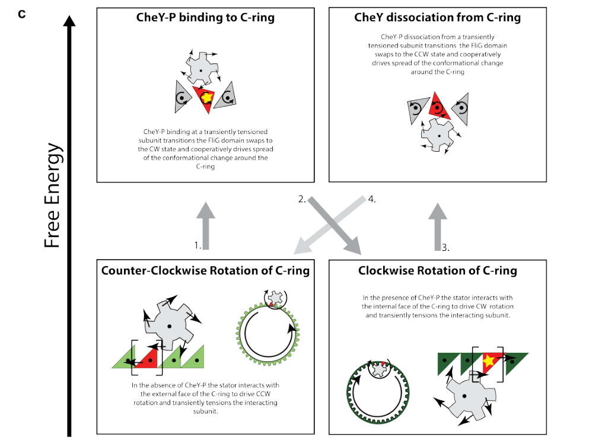

## Question

# Gene Research for Functional Annotation

## ⚠️ CRITICAL: Gene/Protein Identification Context

**BEFORE YOU BEGIN RESEARCH:** You MUST verify you are researching the CORRECT gene/protein. Gene symbols can be ambiguous, especially for less well-characterized genes from non-model organisms.

### Target Gene/Protein Identity (from UniProt):
- **UniProt Accession:** Q88EW2
- **Protein Description:** SubName: Full=Response regulator for chemotactic signal transduction {ECO:0000313|EMBL:AAN69919.1};
- **Gene Information:** Name=cheY {ECO:0000313|EMBL:AAN69919.1}; OrderedLocusNames=PP_4340 {ECO:0000313|EMBL:AAN69919.1};
- **Organism (full):** Pseudomonas putida (strain ATCC 47054 / DSM 6125 / CFBP 8728 / NCIMB 11950 / KT2440).
- **Protein Family:** Not specified in UniProt
- **Key Domains:** CheY-like_superfamily. (IPR011006); Sig_transdc_resp-reg_receiver. (IPR001789); ST_Response_Regulator. (IPR052048); Response_reg (PF00072)

### MANDATORY VERIFICATION STEPS:

1. **Check if the gene symbol "cheY" matches the protein description above**
2. **Verify the organism is correct:** Pseudomonas putida (strain ATCC 47054 / DSM 6125 / CFBP 8728 / NCIMB 11950 / KT2440).
3. **Check if protein family/domains align with what you find in literature**
4. **If you find literature for a DIFFERENT gene with the same or similar symbol, STOP**

### If Gene Symbol is Ambiguous or You Cannot Find Relevant Literature:

**DO NOT PROCEED WITH RESEARCH ON A DIFFERENT GENE.** Instead:
- State clearly: "The gene symbol 'cheY' is ambiguous or literature is limited for this specific protein"
- Explain what you found (e.g., "Found extensive literature on a different gene with the same symbol in a different organism")
- Describe the protein based ONLY on the UniProt information provided above
- Suggest that the protein function can be inferred from domain/family information

### Research Target:

Please provide a comprehensive research report on the gene **cheY** (gene ID: cheY, UniProt: Q88EW2) in PSEPK.

The research report should be a detailed narrative explaining the function, biological processes, and localization of the gene product. Citations should be given for all claims.

You should prioritize authoritative reviews and primary scientific literature when conducting research. You can supplement
this with annotations you find in gene/protein databases, but these can be outdated or inaccurate.

We are specifically interested in the primary function of the gene - for enzymes, what reaction is catalyzed, and what is the substrate specificity? For transporters, what is the substrate? For structural proteins or adapters, what is the broader structural role? For signaling molecules, what is the role in the pathway.

We are interested in where in or outside the cell the gene product carries out its function.

We are also interested in the signaling or biochemical pathways in which the gene functions. We are less interested in broad pleiotropic effects, except where these elucidate the precise role.

Include evidence where possible. We are interested in both experimental evidence as well as inference from structure, evolution, or bioinformatic analysis. Precise studies should be prioritized over high-throughput, where available.

## Output

Question: You are an expert researcher providing comprehensive, well-cited information.

Provide detailed information focusing on:
1. Key concepts and definitions with current understanding
2. Recent developments and latest research (prioritize 2023-2024 sources)
3. Current applications and real-world implementations
4. Expert opinions and analysis from authoritative sources
5. Relevant statistics and data from recent studies

Format as a comprehensive research report with proper citations. Include URLs and publication dates where available.
Always prioritize recent, authoritative sources and provide specific citations for all major claims.

# Gene Research for Functional Annotation

## ⚠️ CRITICAL: Gene/Protein Identification Context

**BEFORE YOU BEGIN RESEARCH:** You MUST verify you are researching the CORRECT gene/protein. Gene symbols can be ambiguous, especially for less well-characterized genes from non-model organisms.

### Target Gene/Protein Identity (from UniProt):
- **UniProt Accession:** Q88EW2
- **Protein Description:** SubName: Full=Response regulator for chemotactic signal transduction {ECO:0000313|EMBL:AAN69919.1};
- **Gene Information:** Name=cheY {ECO:0000313|EMBL:AAN69919.1}; OrderedLocusNames=PP_4340 {ECO:0000313|EMBL:AAN69919.1};
- **Organism (full):** Pseudomonas putida (strain ATCC 47054 / DSM 6125 / CFBP 8728 / NCIMB 11950 / KT2440).
- **Protein Family:** Not specified in UniProt
- **Key Domains:** CheY-like_superfamily. (IPR011006); Sig_transdc_resp-reg_receiver. (IPR001789); ST_Response_Regulator. (IPR052048); Response_reg (PF00072)

### MANDATORY VERIFICATION STEPS:

1. **Check if the gene symbol "cheY" matches the protein description above**
2. **Verify the organism is correct:** Pseudomonas putida (strain ATCC 47054 / DSM 6125 / CFBP 8728 / NCIMB 11950 / KT2440).
3. **Check if protein family/domains align with what you find in literature**
4. **If you find literature for a DIFFERENT gene with the same or similar symbol, STOP**

### If Gene Symbol is Ambiguous or You Cannot Find Relevant Literature:

**DO NOT PROCEED WITH RESEARCH ON A DIFFERENT GENE.** Instead:
- State clearly: "The gene symbol 'cheY' is ambiguous or literature is limited for this specific protein"
- Explain what you found (e.g., "Found extensive literature on a different gene with the same symbol in a different organism")
- Describe the protein based ONLY on the UniProt information provided above
- Suggest that the protein function can be inferred from domain/family information

### Research Target:

Please provide a comprehensive research report on the gene **cheY** (gene ID: cheY, UniProt: Q88EW2) in PSEPK.

The research report should be a detailed narrative explaining the function, biological processes, and localization of the gene product. Citations should be given for all claims.

You should prioritize authoritative reviews and primary scientific literature when conducting research. You can supplement
this with annotations you find in gene/protein databases, but these can be outdated or inaccurate.

We are specifically interested in the primary function of the gene - for enzymes, what reaction is catalyzed, and what is the substrate specificity? For transporters, what is the substrate? For structural proteins or adapters, what is the broader structural role? For signaling molecules, what is the role in the pathway.

We are interested in where in or outside the cell the gene product carries out its function.

We are also interested in the signaling or biochemical pathways in which the gene functions. We are less interested in broad pleiotropic effects, except where these elucidate the precise role.

Include evidence where possible. We are interested in both experimental evidence as well as inference from structure, evolution, or bioinformatic analysis. Precise studies should be prioritized over high-throughput, where available.

## Research report: Functional annotation of **cheY** (UniProt **Q88EW2**; locus **PP_4340**) in *Pseudomonas putida* KT2440

### 0) Mandatory identity verification (to avoid symbol ambiguity)
The UniProt accession **Q88EW2** is specified as **CheY** (gene **cheY**; ordered locus name **PP_4340**) from **Pseudomonas putida** strain **KT2440**. Two independent KT2440-focused publications explicitly refer to **CheY (PP_4340)** as a chemotaxis/chemosensory response regulator, supporting that the symbol **cheY** in this report matches the intended protein identity and organism context rather than another bacterial CheY homolog. Specifically, PP_4340 is annotated as “Chemotaxis protein CheY” and placed within a motility/chemotaxis gene neighborhood that includes PP_4338, and it is transcriptionally downregulated in a KT2440 flagellar sigma-factor mutant. (navarro‐aviles2010physiologicalandtranscriptomic pages 4-5, he2022geneticcodeexpansion pages 6-7)

### 1) Key concepts and definitions (current understanding)

#### 1.1 Chemotaxis signaling and the role of CheY
Bacterial chemotaxis is a sensory–response pathway that modulates the **bias** of flagellar motor rotation (e.g., counterclockwise vs clockwise) to produce directed migration in chemical gradients. In the canonical framework, chemoreceptors regulate a histidine kinase **CheA**, which phosphorylates the response regulator **CheY**; phosphorylated CheY (CheY-P) then directly modulates the flagellar motor by binding switch components, thereby changing the probability of clockwise rotation. This CheA→CheY phosphotransfer and motor control role is widely accepted and is explicitly stated in a chemotaxis review that includes *Pseudomonas* systems. (sampedro2015pseudomonaschemotaxis. pages 3-5)

A 2024 authoritative review of chemotaxis in the context of biased migration emphasizes that **increasing CheA activity increases CheY-P**, and that CheY-P binds motor switch complexes (FliM/FliN) to increase the **clockwise (CW) bias**. (antani2024reassessingthestandard pages 1-3)

#### 1.2 CheY as a response regulator “receiver” domain protein
CheY proteins are typically **single-domain response regulators** (receiver domains) that are activated by phosphorylation of a conserved aspartate in the active site. In a 2024 structural analysis of directional switching, CheY is modeled in its phosphorylated form with the phosphorylated residue **D57** oriented toward the FliG/FliM interface in the switch complex, consistent with the classical receiver-domain phosphorylation mechanism and its coupling to motor switching. (johnson2024structuralbasisof pages 7-10)

#### 1.3 Cellular localization (where CheY acts)
Functionally, CheY is a **diffusible cytosolic** signal carrier between the receptor-associated kinase complex and the flagellar motor, acting at the **cytoplasmic face** of the motor’s C-ring/switch (via interaction with FliM and related switch components). While direct fluorescence localization of *P. putida* KT2440 PP_4340 CheY was not retrieved here, the mechanistic placement of CheY action at the motor C-ring (cytoplasmic) is supported by modern structural work and by general pathway descriptions. (sampedro2015pseudomonaschemotaxis. pages 3-5, johnson2024structuralbasisof pages 1-5)

### 2) CheY (PP_4340) in *Pseudomonas putida* KT2440: best direct evidence

#### 2.1 Genomic context and regulatory linkage to motility
A KT2440 transcriptomic study of a **fliA** mutant (σ factor for flagellar genes) identifies **PP_4340** explicitly as “Chemotaxis protein CheY” and reports it is downregulated with fold change **−2.8** (Table 1). The same work groups PP_4340 within a proposed operon/gene block **PP4340–PP4338**, consistent with cheY being part of a chemotaxis/motility module under flagellar regulon control. (navarro‐aviles2010physiologicalandtranscriptomic pages 4-5)

#### 2.2 Direct experimental support for CheY–CheA association in KT2440
A 2022 KT2440 synthetic biology study (genetic code expansion) uses CheY as an exemplar “chemosensory response regulator in chemotaxis” and explicitly refers to **CheY (PP_4340)** as activated by phosphorylation by **CheA (PP_4338)**. The authors incorporated a photocrosslinking amino acid (pBpa) into CheY at selected permissive positions (chosen using a CheY/CheA structural template), and proteomics of crosslinked material identified CheA among crosslinked species—supporting a CheY–CheA interaction in KT2440 under their experimental conditions. (he2022geneticcodeexpansion pages 6-7)

### 3) Mechanism: phosphorylation cycle and motor switching

#### 3.1 Phosphorylation by CheA
CheA-dependent phosphorylation of CheY is the defining biochemical step coupling receptor/kinase activity to motor control. This is stated in an authoritative *Pseudomonas* chemotaxis review, and biochemical assays in *Pseudomonas putida* context demonstrate phosphate transfer from phosphorylated CheA to CheY (radiolabel transfer with concomitant decrease in CheA signal), consistent with cognate phosphotransfer. (sampedro2015pseudomonaschemotaxis. pages 3-5, he2025coordinatedregulationof pages 3-5)

#### 3.2 Interaction partners at the flagellar switch (FliM/FliN/FliG) and rotation bias
A 2024 structural study in *Nature Microbiology* resolves key elements of how **CheY-P binding to FliM** stabilizes the clockwise motor conformation. It reports that CheY-P binds the extreme N-terminus of FliM, and modeling supports a consistent CheY binding interface with the phosphorylated residue **D57** oriented toward the **FliG–FliM** interface; CheY binding is consistent with the CW structural state and is proposed to “lock” the switch interface in the CW conformation. (johnson2024structuralbasisof pages 7-10)

Complementarily, a 2024 Annual Review article summarizes the motor output as a sensitive, cooperative response to CheY-P: CheY-P binds **FliM and FliN** at the base of the motor, increasing the probability of CW rotation (CW bias), and the CW-bias response is sigmoidal with a high Hill coefficient. (antani2024reassessingthestandard pages 1-3)

#### 3.3 Quantitative and structural parameters from 2024 studies
Recent structural work provides quantitative constraints on CheY-mediated switching:

* **Cooperativity/sensitivity of motor response:** A 2024 Annual Review reports the CW-bias motor response can be described by a sigmoidal curve with **Hill coefficient ~10–20**, implying that relatively small changes in CheA activity and thus CheY-P can saturate motor output toward CW-only or CCW-only bias. (antani2024reassessingthestandard pages 1-3)
* **Stoichiometry of a CheY-associated CW state:** A 2024 cryo-EM study reports a CW C-ring composition that includes a CheY subring, with stoichiometry **34 FliG / 34 FliM / 102 FliN / 34 CheY**, compared with a CCW C-ring lacking the CheY subring. This supports a direct structural coupling between CheY occupancy and the CW switching state. (tan2024structuralbasisof pages 3-4)

### 4) Recent developments (prioritizing 2023–2024) and “latest research” relevance

#### 4.1 High-resolution switching mechanism: stator relocation and conformational stabilization
The 2024 *Nature Microbiology* work provides a modern mechanistic picture in which CheY-P binding biases the C-ring into a CW conformation, associated with changes that relocate stator interactions (outside vs inside wall models) and thereby reverse rotation direction. This refines earlier, more phenomenological models of CheY action and enables explicit structural hypotheses for how CheY-P “locks” motor interfaces during switching. (johnson2024structuralbasisof pages 7-10, johnson2024structuralbasisof pages 1-5)

#### 4.2 Updating canonical assumptions: diversity and alternative features
Although not KT2440-specific, a 2024 *Annual Review of Microbiology* article emphasizes that many bacteria diverge from the *E. coli* paradigm in chemotaxis system architecture, sensory strategies, and protein composition; this is relevant for *Pseudomonas* because many species encode multiple chemosensory pathways and accessory components. This strengthens the interpretive stance that KT2440 CheY is canonical at the receiver-domain level, but system-level regulation may be more complex than the textbook pathway. (antani2024reassessingthestandard pages 1-3)

### 5) Current applications and real-world implementations

#### 5.1 KT2440 as an engineering chassis: CheY as a tool for mapping interactions
The 2022 KT2440 genetic code expansion study is an example of an applied, real-world implementation in which **CheY (PP_4340)** was engineered to incorporate a photocrosslinker for **protein–protein interaction** studies. In practice, this extends KT2440’s experimental toolkit for interrogating chemotaxis signaling complexes (e.g., CheY–CheA associations) in an organism widely used as a biotechnology chassis. (he2022geneticcodeexpansion pages 6-7)

#### 5.2 Chemotaxis as a targetable behavior (expert perspective)
The concept that motility/chemotaxis pathways are actionable targets (e.g., for reducing pathogenic colonization) is supported by recent review-level discussion; while not KT2440-specific, it reflects the broader translational importance of chemotaxis regulators like CheY in microbial ecology and biotechnology contexts. (antani2024reassessingthestandard pages 1-3)

### 6) Expert opinions and analysis (authoritative synthesis)

* **Mechanistic consensus with refined structural detail:** The strong consensus is that CheY-P is the immediate diffusible regulator that couples CheA activity to motor switching, and recent 2024 structural work provides more explicit models for the CheY-P binding interface and conformational stabilization of the CW state. (johnson2024structuralbasisof pages 7-10, antani2024reassessingthestandard pages 1-3)
* **Caution on system-level generalization:** Reviews emphasize that, although CheY receiver chemistry is conserved, the broader chemotaxis network can vary substantially across taxa. Therefore, KT2440 CheY function can be annotated confidently at the level of “response regulator controlling flagellar motor bias,” but upstream wiring (numbers of chemosensory systems, coupling to other behaviors) should be treated as organism-specific and not assumed without direct evidence. (sampedro2015pseudomonaschemotaxis. pages 3-5, antani2024reassessingthestandard pages 1-3)

### 7) Summary of key statistics/data points relevant to annotation
* KT2440 **cheY (PP_4340)** is downregulated **−2.8 fold** in a **fliA** mutant transcriptome, consistent with flagellar regulon control. (navarro‐aviles2010physiologicalandtranscriptomic pages 4-5)
* CheY-P motor control is highly cooperative; reported Hill coefficient **~10–20** for motor response to CheY-P. (antani2024reassessingthestandard pages 1-3)
* CW state stoichiometry includes **34 CheY** associated with the C-ring (in one cryo-EM model), suggesting near 1:1 CheY occupancy with FliM subunits in that CW conformation. (tan2024structuralbasisof pages 3-4)

### Visual evidence: 2024 directional switching model schematic
A schematic depiction of CheY-P-driven directional switching and its coupling to motor conformational changes is available from a 2024 structural study (Figure 6c). (johnson2024structuralbasisof media 93561bae)

### Evidence summary table
| Claim/Observation | Evidence summary | Organism/Context (KT2440-specific vs general) | Year | Source (with URL) | Citation ID |
|---|---|---|---|---|---|
| UniProt Q88EW2 matches **cheY / PP_4340** in *Pseudomonas putida* KT2440 | KT2440 transcriptomic data explicitly annotate **PP_4340** as “Chemotaxis protein CheY” (gene **cheY**); the gene is part of a motility/chemotaxis region and is downregulated in a **fliA** mutant with fold change **−2.8** | KT2440-specific | 2010 | Navarro-Avilés & Van Dillewijn, DOI: https://doi.org/10.1111/j.1758-2229.2009.00084 | (navarro‐aviles2010physiologicalandtranscriptomic pages 4-5) |
| **PP_4340** likely lies in a local chemotaxis operon/gene neighborhood | The KT2440 study identifies a potential operon region **PP4340 to PP4338**, placing **cheY (PP_4340)** adjacent to other motility/chemotaxis genes | KT2440-specific | 2010 | Navarro-Avilés & Van Dillewijn, DOI: https://doi.org/10.1111/j.1758-2229.2009.00084 | (navarro‐aviles2010physiologicalandtranscriptomic pages 4-5) |
| CheY in KT2440 functions as a **chemosensory response regulator** downstream of CheA | In a KT2440 protein-engineering study, CheY is described as “a chemosensory response regulator in chemotaxis,” activated by phosphorylation from the upstream histidine kinase **CheA (PP_4338)**; photocrosslinking/proteomics supported a **CheY–CheA** interaction | KT2440-specific | 2022 | He et al., *ACS Synthetic Biology*, DOI: https://doi.org/10.1021/acssynbio.2c00325 | (he2022geneticcodeexpansion pages 6-7) |
| Core biochemical role: CheA transfers phosphate to CheY | Chemotaxis review states **CheA phosphorylates CheY**; a *P. putida* biochemical study shows radiolabeled phosphate transfer from phosphorylated CheA to CheY | General chemotaxis mechanism with *Pseudomonas* support | 2015; 2025 | Sampedro et al., https://doi.org/10.1111/1574-6976.12081; He et al., https://doi.org/10.7554/elife.100914.2 | (he2025coordinatedregulationof pages 3-5, sampedro2015pseudomonaschemotaxis. pages 3-5) |
| Canonical output of CheY is control of the **flagellar motor** | Review states CheY transmits the chemotaxis signal to flagellar motors; this is the accepted functional role used to annotate Pseudomonas CheY proteins by homology | General, applicable to KT2440 by homology | 2015 | Sampedro et al., *FEMS Microbiology Reviews*, https://doi.org/10.1111/1574-6976.12081 | (sampedro2015pseudomonaschemotaxis. pages 3-5) |
| CheY-P is normally reset by **CheZ** phosphatase in canonical systems | The review notes **CheY-P dephosphorylation is performed by CheZ**, defining the transient nature of signaling output in canonical chemotaxis pathways | General | 2015 | Sampedro et al., *FEMS Microbiology Reviews*, https://doi.org/10.1111/1574-6976.12081 | (sampedro2015pseudomonaschemotaxis. pages 3-5) |
| Recent structural work shows CheY-P promotes **CW switching** by binding the C-ring | Structural studies show phosphorylated CheY binds the flagellar switch/C-ring, especially **FliM**, stabilizing the **clockwise (CW)** state and biasing motor rotation away from default **counterclockwise (CCW)** rotation | General mechanism | 2024 | Johnson et al., *Nature Microbiology*, https://doi.org/10.1038/s41564-024-01630-z | (johnson2024structuralbasisof pages 7-10, johnson2024structuralbasisof pages 1-5) |
| CheY binding site/mechanism involves **FliM/FliN** and likely remodels FliG-related interfaces | Review-level synthesis states CheY-P binds **FliM and FliN** at the motor base to raise CW bias; structural work places the phosphorylated residue near the **FliG/FliM** interface and supports conformational stabilization of the CW state | General mechanism | 2024 | Antani et al., https://doi.org/10.1146/annurev-chembioeng-100722-114625; Johnson et al., https://doi.org/10.1038/s41564-024-01630-z | (johnson2024structuralbasisof pages 7-10, antani2024reassessingthestandard pages 1-3) |
| Conserved phosphorylation site is **Asp57** in model CheY proteins | A 2024 structural study explicitly models the phosphorylated residue **D57** of CheY toward the FliG/FliM interface; this supports inference that KT2440 CheY, a canonical receiver-domain regulator, uses the conserved receiver Asp mechanism | General, strong homology-based inference for KT2440 | 2024 | Johnson et al., *Nature Microbiology*, https://doi.org/10.1038/s41564-024-01630-z | (johnson2024structuralbasisof pages 7-10) |
| Motor switching is highly cooperative and sensitive to CheY-P levels | Review notes the motor response to CheY-P is sigmoidal with Hill coefficient about **10–20**, meaning small signaling changes can strongly alter CW/CCW bias | General quantitative mechanism | 2024 | Antani et al., https://doi.org/10.1146/annurev-chembioeng-100722-114625 | (antani2024reassessingthestandard pages 1-3) |
| Structural stoichiometry supports a dedicated CheY-associated CW motor state | Cryo-EM study reports a **CW C-ring** with stoichiometry **34 FliG / 34 FliM / 102 FliN / 34 CheY** compared with a CCW C-ring lacking the CheY subring, supporting direct structural coupling of CheY binding to motor switching | General quantitative mechanism | 2024 | Tan et al., *Cell Research*, https://doi.org/10.1101/2024.04.30.591856 | (tan2024structuralbasisof pages 3-4) |
| Cellular localization of CheY is expected to be **cytoplasmic/diffusible**, acting at the pole-localized motor | CheY is described as a diffusible response regulator that carries signal from CheA to the flagellar motor; recent structural/mechanistic work places its action at the cytoplasmic **C-ring** of the motor. Direct localization for **KT2440 PP_4340** was not found in the retrieved papers | General mechanism; KT2440-specific localization remains indirect | 2015; 2024 | Sampedro et al., https://doi.org/10.1111/1574-6976.12081; Johnson et al., https://doi.org/10.1038/s41564-024-01630-z | (sampedro2015pseudomonaschemotaxis. pages 3-5, johnson2024structuralbasisof pages 1-5) |

*Table: This table summarizes the strongest evidence linking UniProt Q88EW2 to cheY/PP_4340 in *Pseudomonas putida* KT2440 and places that evidence in the context of current CheY mechanism from recent structural and review literature. It is useful for separating direct KT2440-specific evidence from broader, well-supported functional inference.*

## References (URLs and publication dates)

* Navarro-Avilés G, Van Dillewijn P. Physiological and transcriptomic characterization of a *fliA* mutant of *Pseudomonas putida* KT2440. (2010; DOI publication metadata in record). https://doi.org/10.1111/j.1758-2229.2009.00084 (navarro‐aviles2010physiologicalandtranscriptomic pages 4-5)
* He X, Gao T, Chen Y, et al. Genetic Code Expansion in *Pseudomonas putida* KT2440. *ACS Synthetic Biology* (Oct 2022). https://doi.org/10.1021/acssynbio.2c00325 (he2022geneticcodeexpansion pages 6-7)
* Sampedro I, Parales RE, Krell T, Hill JE. Pseudomonas chemotaxis. *FEMS Microbiology Reviews* (Oct 2015). https://doi.org/10.1111/1574-6976.12081 (sampedro2015pseudomonaschemotaxis. pages 3-5)
* Johnson S, Deme JC, Furlong EJ, et al. Structural basis of directional switching by the bacterial flagellum. *Nature Microbiology* (Mar 2024). https://doi.org/10.1038/s41564-024-01630-z (johnson2024structuralbasisof pages 7-10, johnson2024structuralbasisof pages 1-5, johnson2024structuralbasisof media 93561bae)
* Antani JD, Shaji A, Gupta R, Lele PP. Reassessing the Standard Chemotaxis Framework for Understanding Biased Migration in *Helicobacter pylori*. *Annual Review of Chemical and Biomolecular Engineering* (Jul 2024). https://doi.org/10.1146/annurev-chembioeng-100722-114625 (antani2024reassessingthestandard pages 1-3)
* Tan J, Zhang L, Zhou X, et al. Structural basis of the bacterial flagellar motor rotational switching. *Cell Research* (preprint DOI in record; Apr 2024). https://doi.org/10.1101/2024.04.30.591856 (tan2024structuralbasisof pages 3-4)

## Limitations of the retrieved evidence (for transparency)
Direct KT2440 **cheY (PP_4340)** knockout/point-mutant phenotypes, direct cellular localization microscopy for PP_4340, and direct measurements of phosphorylation kinetics for KT2440 CheY were not retrieved in the available set. Therefore, pathway role and localization are based on (i) KT2440 gene/protein identification and CheA association evidence and (ii) high-confidence homology and modern structural mechanism from other bacteria. (he2022geneticcodeexpansion pages 6-7, johnson2024structuralbasisof pages 7-10, antani2024reassessingthestandard pages 1-3)

References

1. (navarro‐aviles2010physiologicalandtranscriptomic pages 4-5): G Navarro‐Avilés and P Van Dillewijn. Physiological and transcriptomic characterization of a flia mutant of pseudomonas putida kt2440. Unknown journal, 2010. URL: https://doi.org/10.1111/j.1758-2229.2009.00084, doi:10.1111/j.1758-2229.2009.00084.

2. (he2022geneticcodeexpansion pages 6-7): Xinyuan He, Tianyu Gao, Yan Chen, Kun Liu, Jiantao Guo, and Wei Niu. Genetic code expansion in pseudomonas putida kt2440. ACS synthetic biology, 11:3724-3732, Oct 2022. URL: https://doi.org/10.1021/acssynbio.2c00325, doi:10.1021/acssynbio.2c00325. This article has 15 citations and is from a domain leading peer-reviewed journal.

3. (sampedro2015pseudomonaschemotaxis. pages 3-5): Inmaculada Sampedro, Rebecca E. Parales, Tino Krell, and Jane E. Hill. Pseudomonas chemotaxis. FEMS microbiology reviews, 39 1:17-46, Oct 2015. URL: https://doi.org/10.1111/1574-6976.12081, doi:10.1111/1574-6976.12081. This article has 346 citations and is from a domain leading peer-reviewed journal.

4. (antani2024reassessingthestandard pages 1-3): Jyot D. Antani, Aakansha Shaji, Rachit Gupta, and Pushkar P. Lele. Reassessing the standard chemotaxis framework for understanding biased migration in helicobacter pylori. Jul 2024. URL: https://doi.org/10.1146/annurev-chembioeng-100722-114625, doi:10.1146/annurev-chembioeng-100722-114625. This article has 8 citations and is from a peer-reviewed journal.

5. (johnson2024structuralbasisof pages 7-10): Steven Johnson, Justin C. Deme, Emily J. Furlong, Joseph J. E. Caesar, Fabienne F. V. Chevance, Kelly T. Hughes, and Susan M. Lea. Structural basis of directional switching by the bacterial flagellum. Nature microbiology, 9:1282-1292, Mar 2024. URL: https://doi.org/10.1038/s41564-024-01630-z, doi:10.1038/s41564-024-01630-z. This article has 59 citations and is from a highest quality peer-reviewed journal.

6. (johnson2024structuralbasisof pages 1-5): Steven Johnson, Justin C. Deme, Emily J. Furlong, Joseph J. E. Caesar, Fabienne F. V. Chevance, Kelly T. Hughes, and Susan M. Lea. Structural basis of directional switching by the bacterial flagellum. Nature microbiology, 9:1282-1292, Mar 2024. URL: https://doi.org/10.1038/s41564-024-01630-z, doi:10.1038/s41564-024-01630-z. This article has 59 citations and is from a highest quality peer-reviewed journal.

7. (he2025coordinatedregulationof pages 3-5): Meina He, Yongxin Tao, Kexin Mu, Haoqi Feng, Ying Fan, Tong Liu, Qiaoyun Huang, Yujie Xiao, and Wenli Chen. Coordinated regulation of chemotaxis and resistance to copper by csor in pseudomonas putida. ArXiv, Jan 2025. URL: https://doi.org/10.7554/elife.100914.2, doi:10.7554/elife.100914.2. This article has 4 citations.

8. (tan2024structuralbasisof pages 3-4): Jiaxing Tan, Ling Zhang, Xingtong Zhou, Siyu Han, Yan-Jie Zhou, and Yongqun Zhu. Structural basis of the bacterial flagellar motor rotational switching. Cell Research, 34:788-801, Apr 2024. URL: https://doi.org/10.1101/2024.04.30.591856, doi:10.1101/2024.04.30.591856. This article has 44 citations and is from a domain leading peer-reviewed journal.

9. (johnson2024structuralbasisof media 93561bae): Steven Johnson, Justin C. Deme, Emily J. Furlong, Joseph J. E. Caesar, Fabienne F. V. Chevance, Kelly T. Hughes, and Susan M. Lea. Structural basis of directional switching by the bacterial flagellum. Nature microbiology, 9:1282-1292, Mar 2024. URL: https://doi.org/10.1038/s41564-024-01630-z, doi:10.1038/s41564-024-01630-z. This article has 59 citations and is from a highest quality peer-reviewed journal.

## Artifacts

- [Edison artifact artifact-00](cheY-deep-research-falcon_artifacts/artifact-00.md)

## Citations

1. antani2024reassessingthestandard pages 1-3
2. johnson2024structuralbasisof pages 7-10
3. he2022geneticcodeexpansion pages 6-7
4. tan2024structuralbasisof pages 3-4
5. johnson2024structuralbasisof pages 1-5
6. he2025coordinatedregulationof pages 3-5
7. https://doi.org/10.1111/j.1758-2229.2009.00084
8. https://doi.org/10.1021/acssynbio.2c00325
9. https://doi.org/10.1111/1574-6976.12081;
10. https://doi.org/10.7554/elife.100914.2
11. https://doi.org/10.1111/1574-6976.12081
12. https://doi.org/10.1038/s41564-024-01630-z
13. https://doi.org/10.1146/annurev-chembioeng-100722-114625;
14. https://doi.org/10.1146/annurev-chembioeng-100722-114625
15. https://doi.org/10.1101/2024.04.30.591856
16. https://doi.org/10.1111/j.1758-2229.2009.00084,
17. https://doi.org/10.1021/acssynbio.2c00325,
18. https://doi.org/10.1111/1574-6976.12081,
19. https://doi.org/10.1146/annurev-chembioeng-100722-114625,
20. https://doi.org/10.1038/s41564-024-01630-z,
21. https://doi.org/10.7554/elife.100914.2,
22. https://doi.org/10.1101/2024.04.30.591856,