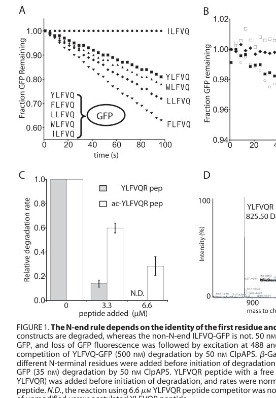

## Question

# Gene Research for Functional Annotation

## ⚠️ CRITICAL: Gene/Protein Identification Context

**BEFORE YOU BEGIN RESEARCH:** You MUST verify you are researching the CORRECT gene/protein. Gene symbols can be ambiguous, especially for less well-characterized genes from non-model organisms.

### Target Gene/Protein Identity (from UniProt):
- **UniProt Accession:** Q88FS4
- **Protein Description:** RecName: Full=ATP-dependent Clp protease adapter protein ClpS {ECO:0000255|HAMAP-Rule:MF_00302};
- **Gene Information:** Name=clpS {ECO:0000255|HAMAP-Rule:MF_00302}; OrderedLocusNames=PP_4009;
- **Organism (full):** Pseudomonas putida (strain ATCC 47054 / DSM 6125 / CFBP 8728 / NCIMB 11950 / KT2440).
- **Protein Family:** Belongs to the ClpS family. {ECO:0000255|HAMAP-
- **Key Domains:** ClpS. (IPR022935); ClpS_core. (IPR003769); Ribosomal_bL12_C/ClpS-like. (IPR014719); ClpS (PF02617)

### MANDATORY VERIFICATION STEPS:

1. **Check if the gene symbol "clpS" matches the protein description above**
2. **Verify the organism is correct:** Pseudomonas putida (strain ATCC 47054 / DSM 6125 / CFBP 8728 / NCIMB 11950 / KT2440).
3. **Check if protein family/domains align with what you find in literature**
4. **If you find literature for a DIFFERENT gene with the same or similar symbol, STOP**

### If Gene Symbol is Ambiguous or You Cannot Find Relevant Literature:

**DO NOT PROCEED WITH RESEARCH ON A DIFFERENT GENE.** Instead:
- State clearly: "The gene symbol 'clpS' is ambiguous or literature is limited for this specific protein"
- Explain what you found (e.g., "Found extensive literature on a different gene with the same symbol in a different organism")
- Describe the protein based ONLY on the UniProt information provided above
- Suggest that the protein function can be inferred from domain/family information

### Research Target:

Please provide a comprehensive research report on the gene **clpS** (gene ID: clpS, UniProt: Q88FS4) in PSEPK.

The research report should be a detailed narrative explaining the function, biological processes, and localization of the gene product. Citations should be given for all claims.

You should prioritize authoritative reviews and primary scientific literature when conducting research. You can supplement
this with annotations you find in gene/protein databases, but these can be outdated or inaccurate.

We are specifically interested in the primary function of the gene - for enzymes, what reaction is catalyzed, and what is the substrate specificity? For transporters, what is the substrate? For structural proteins or adapters, what is the broader structural role? For signaling molecules, what is the role in the pathway.

We are interested in where in or outside the cell the gene product carries out its function.

We are also interested in the signaling or biochemical pathways in which the gene functions. We are less interested in broad pleiotropic effects, except where these elucidate the precise role.

Include evidence where possible. We are interested in both experimental evidence as well as inference from structure, evolution, or bioinformatic analysis. Precise studies should be prioritized over high-throughput, where available.

## Output

Question: You are an expert researcher providing comprehensive, well-cited information.

Provide detailed information focusing on:
1. Key concepts and definitions with current understanding
2. Recent developments and latest research (prioritize 2023-2024 sources)
3. Current applications and real-world implementations
4. Expert opinions and analysis from authoritative sources
5. Relevant statistics and data from recent studies

Format as a comprehensive research report with proper citations. Include URLs and publication dates where available.
Always prioritize recent, authoritative sources and provide specific citations for all major claims.

# Gene Research for Functional Annotation

## ⚠️ CRITICAL: Gene/Protein Identification Context

**BEFORE YOU BEGIN RESEARCH:** You MUST verify you are researching the CORRECT gene/protein. Gene symbols can be ambiguous, especially for less well-characterized genes from non-model organisms.

### Target Gene/Protein Identity (from UniProt):
- **UniProt Accession:** Q88FS4
- **Protein Description:** RecName: Full=ATP-dependent Clp protease adapter protein ClpS {ECO:0000255|HAMAP-Rule:MF_00302};
- **Gene Information:** Name=clpS {ECO:0000255|HAMAP-Rule:MF_00302}; OrderedLocusNames=PP_4009;
- **Organism (full):** Pseudomonas putida (strain ATCC 47054 / DSM 6125 / CFBP 8728 / NCIMB 11950 / KT2440).
- **Protein Family:** Belongs to the ClpS family. {ECO:0000255|HAMAP-
- **Key Domains:** ClpS. (IPR022935); ClpS_core. (IPR003769); Ribosomal_bL12_C/ClpS-like. (IPR014719); ClpS (PF02617)

### MANDATORY VERIFICATION STEPS:

1. **Check if the gene symbol "clpS" matches the protein description above**
2. **Verify the organism is correct:** Pseudomonas putida (strain ATCC 47054 / DSM 6125 / CFBP 8728 / NCIMB 11950 / KT2440).
3. **Check if protein family/domains align with what you find in literature**
4. **If you find literature for a DIFFERENT gene with the same or similar symbol, STOP**

### If Gene Symbol is Ambiguous or You Cannot Find Relevant Literature:

**DO NOT PROCEED WITH RESEARCH ON A DIFFERENT GENE.** Instead:
- State clearly: "The gene symbol 'clpS' is ambiguous or literature is limited for this specific protein"
- Explain what you found (e.g., "Found extensive literature on a different gene with the same symbol in a different organism")
- Describe the protein based ONLY on the UniProt information provided above
- Suggest that the protein function can be inferred from domain/family information

### Research Target:

Please provide a comprehensive research report on the gene **clpS** (gene ID: clpS, UniProt: Q88FS4) in PSEPK.

The research report should be a detailed narrative explaining the function, biological processes, and localization of the gene product. Citations should be given for all claims.

You should prioritize authoritative reviews and primary scientific literature when conducting research. You can supplement
this with annotations you find in gene/protein databases, but these can be outdated or inaccurate.

We are specifically interested in the primary function of the gene - for enzymes, what reaction is catalyzed, and what is the substrate specificity? For transporters, what is the substrate? For structural proteins or adapters, what is the broader structural role? For signaling molecules, what is the role in the pathway.

We are interested in where in or outside the cell the gene product carries out its function.

We are also interested in the signaling or biochemical pathways in which the gene functions. We are less interested in broad pleiotropic effects, except where these elucidate the precise role.

Include evidence where possible. We are interested in both experimental evidence as well as inference from structure, evolution, or bioinformatic analysis. Precise studies should be prioritized over high-throughput, where available.

## Research Report: Functional Annotation of **clpS** (UniProt **Q88FS4**; locus **PP_4009**) in *Pseudomonas putida* KT2440

### 1) Gene/protein identity verification (critical disambiguation)
The UniProt accession **Q88FS4** from *Pseudomonas putida* KT2440 corresponds to the **ATP-dependent Clp protease adapter protein ClpS**, a small bacterial adaptor/N-recognin protein that binds specific N-terminal degrons (N-degrons) and delivers substrates to the **ClpAP** protease (ClpA unfoldase + ClpP peptidase). This identity matches the conserved ClpS architecture described in mechanistic literature: a **folded ClpS core** harboring a hydrophobic N-degron pocket plus an **intrinsically disordered N-terminal extension (NTE)** that engages the ClpA pore loops (kim2022structuralprinciplesof pages 46-50, dougan2010thebacterialn‐end pages 6-8). The clpS gene is commonly genomically linked to **clpA**, consistent with bacterial operon organization for ClpAP-associated factors (kim2022structuralprinciplesof pages 46-50).

### 2) Key concepts and definitions (current understanding)

#### 2.1 The bacterial N-degron (N-end rule) pathway
The N-end rule—now often encompassed by the broader term **N-degron pathways**—links a protein’s metabolic stability to features of its **N-terminus**, frequently the identity of the **N-terminal residue** and its local sequence context. In bacteria, this pathway is implemented through ATP-dependent proteolysis by **ClpAP** and specificity/adaptation by **ClpS** (dougan2010thebacterialn‐end pages 2-3, dougan2010thebacterialn‐end pages 3-5).

A canonical Gram-negative/proteobacterial model includes:
- **ClpAP** (AAA+ unfoldase ClpA + protease ClpP)
- **ClpS** adaptor (N-recognin)
- N-terminal aminoacyl-transferases such as **Aat (LFTR)** and in some taxa **Bpt**, which can convert “secondary” destabilizing N-termini into “primary” ClpS-recognized N-degrons by appending residues such as Leu/Phe (kim2022structuralprinciplesof pages 37-41, dougan2010thebacterialn‐end pages 5-6).

Dougan et al. (2010) emphasize the hierarchical nature of bacterial N-end rule signals and that—despite a strong mechanistic framework—validated natural substrate sets were historically limited, motivating continued discovery work (dougan2010thebacterialn‐end pages 2-3).

#### 2.2 What ClpS is (and is not)
ClpS is not a protease or enzyme catalyzing a chemical transformation; rather it is an **adaptor** that alters substrate selection by the ClpAP degradation machine. Structurally, ClpS is a small (~10–12 kDa) protein with an extended N-terminus and a C-terminal core containing:
- **Region A**: a ClpA-interaction surface required for docking to ClpA N-domains
- **A distal hydrophobic pocket** that binds the N-terminal “type 2” primary destabilizing residues (Leu, Phe, Tyr, Trp) (dougan2010thebacterialn‐end pages 6-8).

### 3) Molecular function and mechanism of action

#### 3.1 Substrate specificity: canonical N-degrons
In the best-characterized Gram-negative system (*E. coli*), ClpS recognizes **primary destabilizing N-terminal residues**—classically **Leu, Phe, Tyr, Trp**—via a hydrophobic pocket that also requires a **free α-amino group** at the N-terminus (ottofuelling2023physiologicalnendrule pages 33-37, wang2008tuningthestrength pages 4-5). The N-degron side chain fits into a ~200 Å\(^3\) pocket whose mouth is lined with residues (e.g., N34, D35/D36, T38, H66 in *E. coli*) that hydrogen bond to the N-terminal backbone and α-amino group, explaining residue-specific affinity and specificity (dougan2010thebacterialn‐end pages 6-8).

Sequence context around the N-terminus strongly modulates effective degradation:
- Adjacent acidic residues can markedly weaken apparent affinity of the degradation reaction (wang2008tuningthestrength pages 4-5).
- An **unstructured N-terminal segment** and additional downstream features are often required for productive engagement by the ClpA pore loops (kim2022structuralprinciplesof pages 37-41, kim2022structuralprinciplesof pages 46-50).

#### 3.2 Active delivery to ClpAP (handoff mechanism)
Modern mechanistic models describe ClpS as an **active delivery factor**, not merely a passive tether. ClpS engages ClpA in two ways:
1) The **ClpS core** contacts ClpA N-domains.
2) The **intrinsically disordered NTE** enters/contacts the ClpA axial channel and is engaged by pore loops (kim2022structuralprinciplesof pages 46-50, kim2022structuralprinciplesof pages 50-53).

ATP-driven pulling on the ClpS NTE is proposed to remodel the ClpS core and promote **substrate handoff** into the ClpA channel, after which ClpA can unfold and translocate the substrate into ClpP for proteolysis (kim2022structuralprinciplesof pages 50-53).

#### 3.3 Dual functional effect: promotes N-degron substrates, inhibits others
A key systems-level concept is that ClpS can **promote** degradation of N-end-rule substrates while **inhibiting** degradation of other substrates (e.g., ssrA-tagged substrates), effectively reprogramming ClpA substrate choice (kim2022structuralprinciplesof pages 46-50, ottofuelling2023physiologicalnendrule pages 33-37).

### 4) Quantitative data and statistics relevant to functional annotation

#### 4.1 Binding/assembly constants for adaptor complexes
A mechanistic synthesis reports that high-affinity delivery complex formation depends on both the ClpS core and NTE: the **ClpA\(_6\)•ClpS•N-degron** assembly can exhibit **KD < 50 nM**, whereas using only the ClpS core yields **KD ~1.5 µM** (≈30-fold weaker), demonstrating the functional importance of the NTE (kim2022structuralprinciplesof pages 46-50).

#### 4.2 Steady-state kinetics: sequence context can shift Km ~50-fold
Wang et al. (2008, *J. Biol. Chem.*, publication month **Sep 2008**, URL: https://doi.org/10.1074/jbc.m802213200) quantified how residues near the N-terminus tune degradation:
- **YLFVQEL-GFP**: **Km ≈ 26 nM**, **Vmax ≈ 1.2 min⁻¹**
- **YEFVQLE-GFP** (acidic substitution near N-terminus): **Km ≈ 1,400 nM**, **Vmax ≈ 1.4 min⁻¹**
Thus, a local acidic context increased Km ~50-fold with little effect on Vmax, indicating a strong effect on effective binding/recognition rather than on catalytic turnover once engaged (wang2008tuningthestrength pages 4-5).

These kinetics are supported visually by the figures extracted from the same study (wang2008tuningthestrength media d2ea2e0e, wang2008tuningthestrength media dc4eaaa1).

#### 4.3 Structural constraint: N-terminal tail length requirements
In the same study, shortening the accessible N-terminal segment reduced or abolished degradation:
- **YA4-GFP** degraded ~5-fold slower than **YA6-GFP**
- **YA3-GFP** showed no detectable degradation unless unfolded
This supports a model where the N-degron must be positioned and spaced so ClpA can engage/unfold effectively (wang2008tuningthestrength pages 5-6).

### 5) Cellular localization and biological process context
For *P. putida* KT2440 ClpS (Q88FS4/PP_4009), the most strongly supported localization is **cytosolic**, consistent with ClpA/ClpP operating as a cytosolic AAA+ protease complex acting on soluble intracellular proteins and adaptors engaging the ClpA axial channel (kim2022structuralprinciplesof pages 46-50, ottofuelling2023physiologicalnendrule pages 33-37). No retrieved evidence indicates periplasmic, extracellular, or membrane localization for ClpS.

Biological processes supported by mechanism-based inference include:
- **ATP-dependent proteolysis / protein quality control** via ClpAP, specifically for proteins bearing ClpS-recognized N-degrons (ottofuelling2023physiologicalnendrule pages 33-37, dougan2010thebacterialn‐end pages 3-5).
- **Proteome remodeling under stress**, via regulated degradation and chaperone/protease networks.

### 6) Pseudomonas-specific evidence (organism-relevant grounding)

#### 6.1 Genomic neighborhood and conservation in Pseudomonas
Although direct KT2440 PP_4009-focused experiments were not retrieved, Pseudomonas-genus comparative evidence supports orthology and conserved pathway placement:
- In *Pseudomonas fluorescens* SS101, **clpS is immediately upstream of clpA** in a conserved neighborhood (“cspD clpS clpA infA …”), matching typical bacterial organization where clpS is in/near the clpA operon (song2015lipopeptidebiosynthesisin pages 1-3, kim2022structuralprinciplesof pages 46-50).
- SS101 ClpS shows **93% amino-acid identity** to a *P. putida* KT2440 homolog (NP_746139.1), implying that KT2440 ClpS (including Q88FS4/PP_4009) is very likely a functional ClpAP adaptor with similar substrate preferences and mechanism (song2015lipopeptidebiosynthesisin pages 3-5).

#### 6.2 Stress response context in *P. putida* KT2440
A quantitative proteomics study of *P. putida* KT2440 under phenol-induced stress (Santos et al., **Sep 2004**, URL: https://doi.org/10.1002/pmic.200300793) did not mention clpS specifically in the retrieved excerpt, but it reported induction of **ClpB** and **GrpE** (chaperone/proteostasis network components) under increasing phenol stress, consistent with stress-linked protein quality control demands in KT2440 (santos2004insightsintopseudomonas pages 5-6). This is supportive background for why Clp-associated functions (including ClpAP/ClpS-mediated degradation) are expected to be relevant during environmental stress in Pseudomonas.

### 7) Recent developments and expert perspectives (2023–2024)

#### 7.1 Updated terminology and broad N-degron perspective (2024)
Varshavsky (2024, **Sep 2024**, PNAS, URL: https://doi.org/10.1073/pnas.2408697121) provides an authoritative, recent synthesis of **N-degron pathway** biology and emphasizes that N-terminal residues and modifications can act as degradation signals; he also notes bacterial N-recognins such as **ClpS** in the broader conceptual landscape (varshavsky2024ndegronpathways pages 2-3). However, he is cautious about the breadth of bacterial N-degron claims and notes that some bacterial aspects remain incompletely verified compared to eukaryotic fMet/N-degron systems (varshavsky2024ndegronpathways pages 3-4).

#### 7.2 Taxon-specific expansion: actinobacterial ClpS (2024 preprint)
Presloid et al. (2024, **Jun 2024**, bioRxiv, URL: https://doi.org/10.1101/2024.06.12.598358) extend N-end rule mechanistic understanding beyond Proteobacteria by demonstrating in *Mycolicibacterium smegmatis* that ClpS binds canonical primary N-degrons and that N-degron binding can increase ClpS–ClpC1 affinity by ~30-fold, suggesting regulated prioritization of N-end rule proteolysis when substrates are abundant (presloid2024clpsdirectsdegradation pages 1-4, presloid2024clpsdirectsdegradation pages 12-14). Importantly, their work suggests **secondary N-degrons may be absent in mycobacteria**, highlighting that the classical Aat/Bpt-mediated hierarchical model may not generalize uniformly across bacteria (presloid2024clpsdirectsdegradation pages 12-14).

### 8) Current applications and real-world implementations

1) **Engineering and synthetic biology**: Because ClpS provides tunable recognition of N-terminal residues and controls degradation, it has been used as a component in engineered “posttranslational proofreading” systems to discriminate incorporation of amino acids by modulating N-end rule stability (conceptually aligned with ClpS’s N-degron recognition role) (wang2008tuningthestrength media 93593c36).

2) **Microbial physiology and biotechnology** (Pseudomonas context): The ClpAP protease system (ClpA/ClpP) has documented regulatory roles in Pseudomonas specialized metabolism and behaviors (e.g., lipopeptide biosynthesis regulation in *P. fluorescens* via ClpAP); given the conserved presence and high identity of ClpS in Pseudomonas, ClpS is expected to contribute to substrate selection for ClpAP in these contexts even when not explicitly tested (song2015lipopeptidebiosynthesisin pages 3-5, song2015lipopeptidebiosynthesisin pages 1-3).

3) **Antibacterial target relevance (broader bacterial Clp systems)**: Clp protease systems—especially in mycobacteria—are being explored as antibacterial targets; work that clarifies adaptor-mediated substrate selection (including ClpS) helps rationalize target engagement and downstream proteostasis effects (presloid2024clpsdirectsdegradation pages 1-4).

### 9) Evidence-based conclusions for *P. putida* KT2440 clpS (PP_4009/Q88FS4)

**Most defensible functional annotation (high confidence by homology + mechanism):**
- **Function:** Cytosolic adaptor/N-recognin that binds canonical bacterial primary N-degrons (L/F/Y/W) and delivers substrates to **ClpA/ClpP (ClpAP)** for ATP-dependent degradation, modulating substrate selection and potentially competing with other ClpA substrates (ottofuelling2023physiologicalnendrule pages 33-37, kim2022structuralprinciplesof pages 46-50).
- **Pathway:** Bacterial **N-end rule/N-degron proteolysis** with potential upstream contribution of aminoacyl-transferases (Aat/LFTR; and in some taxa Bpt) that create/strengthen ClpS-recognized degrons (kim2022structuralprinciplesof pages 37-41, dougan2010thebacterialn‐end pages 5-6).
- **Localization:** Cytosol, interacting with cytosolic ClpA/ClpP (kim2022structuralprinciplesof pages 46-50).
- **Genomic context:** Likely adjacent to/operon-linked with **clpA** in Pseudomonas, supported by Pseudomonas neighborhood data and general bacterial organization (song2015lipopeptidebiosynthesisin pages 1-3, kim2022structuralprinciplesof pages 46-50).

**Key uncertainty (organism-specific gap):**
No retrieved primary study directly tests **PP_4009/Q88FS4** loss-of-function phenotypes, native substrates, or condition-specific regulation in *P. putida* KT2440. Therefore, KT2440-specific claims beyond conserved function should be treated as **inferred** rather than experimentally verified.

---

### Summary Table (functional annotation at a glance)
| Category | Summary |
|---|---|
| Identity/domains | Q88FS4 / PP_4009 matches the bacterial ClpS family: a small (~10–12 kDa) adaptor with a conserved ClpS core plus an N-terminal extension; this aligns with the UniProt description for **Pseudomonas putida** KT2440 clpS rather than an unrelated protein family (kim2022structuralprinciplesof pages 46-50, dougan2010thebacterialn‐end pages 6-8). |
| Molecular function | ClpS is an **adaptor/N-recognin**, not an enzyme: it binds proteins bearing destabilizing N-terminal residues and delivers them to the ATP-dependent **ClpAP** protease for unfolding and degradation (ottofuelling2023physiologicalnendrule pages 33-37, kim2022structuralprinciplesof pages 37-41). |
| Pathway role | It functions in the bacterial **N-degron/N-end rule pathway**, which links protein half-life to N-terminal identity; ClpS acts downstream of N-degron generation and upstream of ClpA/ClpP-mediated proteolysis (dougan2010thebacterialn‐end pages 2-3, dougan2010thebacterialn‐end pages 3-5). |
| Interaction partners | The primary expected partners are **ClpA** (AAA+ unfoldase) and, indirectly via ClpA, **ClpP** (peptidase). ClpS contacts the ClpA N-domain through its core and engages ClpA pore loops via its N-terminal extension (kim2022structuralprinciplesof pages 46-50, kim2022structuralprinciplesof pages 50-53). |
| Substrate specificity (N-degrons) | Canonical bacterial primary N-degrons recognized by ClpS are **Leu, Phe, Tyr, and Trp** at the extreme N terminus; recognition also depends on a free α-amino group and is modulated by nearby sequence features (ottofuelling2023physiologicalnendrule pages 33-37, dougan2010thebacterialn‐end pages 6-8, wang2008tuningthestrength pages 4-5). |
| Mechanistic notes | Efficient delivery usually requires an **unstructured N-terminal segment** plus a downstream hydrophobic element; ClpA is thought to pull on the ClpS N-terminal extension, remodel ClpS, and transfer the bound substrate into the ClpA channel for translocation into ClpP (kim2022structuralprinciplesof pages 46-50, kim2022structuralprinciplesof pages 50-53). |
| Localization | The expected location is the **cytoplasm/cytosol**, consistent with ClpA/ClpP proteostasis machinery acting on soluble intracellular proteins; no evidence suggests secretion or membrane localization for PP_4009 (ottofuelling2023physiologicalnendrule pages 33-37, kim2022structuralprinciplesof pages 46-50). |
| Genomic context | In bacteria, **clpS is usually in the same operon as clpA**; this conserved organization supports assigning PP_4009 as the ClpA-associated adaptor in P. putida KT2440, although a KT2440-specific operon experiment was not retrieved here (kim2022structuralprinciplesof pages 46-50, lo2022expressionandfunction pages 7-9). |
| Regulation/conditions | Direct KT2440-specific regulation of **clpS** was not found. Broader Gram-negative evidence shows clpS/clpA expression can respond to stress/temperature, and P. putida proteomics under phenol stress detected induction of other Clp-network components (e.g., ClpB/GrpE), supporting a role for Clp proteostasis in stress adaptation (lo2022expressionandfunction pages 7-9, santos2004insightsintopseudomonas pages 5-6). |
| Quantitative data points | Relevant mechanistic benchmarks from bacterial systems: ClpA6•ClpS•N-degron complex **KD < 50 nM**, but ~**1.5 µM** for the ClpS core alone; acidic residue substitution near the N terminus can raise apparent **Km ~50-fold** (from ~26 nM to ~1400 nM) with little effect on Vmax; ClpS can reduce ClpAP ATP hydrolysis ~**2-fold** (kim2022structuralprinciplesof pages 46-50, wang2008tuningthestrength pages 4-5). |
| Evidence gaps | The gene symbol is not ambiguous here, but **literature is limited for this specific P. putida KT2440 protein**. No primary study was found directly validating PP_4009 localization, mutant phenotype, native substrates, or regulatory circuitry in KT2440, so much of the annotation is inferred from conserved ClpS-family mechanism in Gram-negative bacteria (ottofuelling2023physiologicalnendrule pages 33-37, santos2004insightsintopseudomonas pages 5-6). |

*Table: This table summarizes the best-supported functional annotation for Pseudomonas putida KT2440 ClpS (Q88FS4/PP_4009), combining conserved mechanistic evidence with the limited organism-specific data available. It is useful for separating direct evidence from inference and highlighting remaining gaps.*

### Key figure evidence (quantitative kinetics)
Figures extracted from Wang et al. (2008) provide visual support for Km/Vmax shifts and degradation constraints driven by N-terminal sequence context (wang2008tuningthestrength media d2ea2e0e, wang2008tuningthestrength media dc4eaaa1).

References

1. (kim2022structuralprinciplesof pages 46-50): S Kim. Structural principles of substrate recognition and unfolding by the clpap and clpxp aaa+ proteases. Unknown journal, 2022.

2. (dougan2010thebacterialn‐end pages 6-8): D. A. Dougan, K. N. Truscott, and K. Zeth. The bacterial n‐end rule pathway: expect the unexpected. Molecular Microbiology, 76:545-558, May 2010. URL: https://doi.org/10.1111/j.1365-2958.2010.07120.x, doi:10.1111/j.1365-2958.2010.07120.x. This article has 127 citations and is from a domain leading peer-reviewed journal.

3. (dougan2010thebacterialn‐end pages 2-3): D. A. Dougan, K. N. Truscott, and K. Zeth. The bacterial n‐end rule pathway: expect the unexpected. Molecular Microbiology, 76:545-558, May 2010. URL: https://doi.org/10.1111/j.1365-2958.2010.07120.x, doi:10.1111/j.1365-2958.2010.07120.x. This article has 127 citations and is from a domain leading peer-reviewed journal.

4. (dougan2010thebacterialn‐end pages 3-5): D. A. Dougan, K. N. Truscott, and K. Zeth. The bacterial n‐end rule pathway: expect the unexpected. Molecular Microbiology, 76:545-558, May 2010. URL: https://doi.org/10.1111/j.1365-2958.2010.07120.x, doi:10.1111/j.1365-2958.2010.07120.x. This article has 127 citations and is from a domain leading peer-reviewed journal.

5. (kim2022structuralprinciplesof pages 37-41): S Kim. Structural principles of substrate recognition and unfolding by the clpap and clpxp aaa+ proteases. Unknown journal, 2022.

6. (dougan2010thebacterialn‐end pages 5-6): D. A. Dougan, K. N. Truscott, and K. Zeth. The bacterial n‐end rule pathway: expect the unexpected. Molecular Microbiology, 76:545-558, May 2010. URL: https://doi.org/10.1111/j.1365-2958.2010.07120.x, doi:10.1111/j.1365-2958.2010.07120.x. This article has 127 citations and is from a domain leading peer-reviewed journal.

7. (ottofuelling2023physiologicalnendrule pages 33-37): Ralf Dieter Ottofuelling. Physiological n-end rule substrates in e. coli and the molecular details of their clps-mediated degradation by clpap. Text, Jan 2023. URL: https://doi.org/10.26181/21845886, doi:10.26181/21845886. This article has 0 citations and is from a peer-reviewed journal.

8. (wang2008tuningthestrength pages 4-5): Kevin H. Wang, Elizabeth S.C. Oakes, Robert T. Sauer, and Tania A. Baker. Tuning the strength of a bacterial n-end rule degradation signal*. Journal of Biological Chemistry, 283:24600-24607, Sep 2008. URL: https://doi.org/10.1074/jbc.m802213200, doi:10.1074/jbc.m802213200. This article has 75 citations and is from a domain leading peer-reviewed journal.

9. (kim2022structuralprinciplesof pages 50-53): S Kim. Structural principles of substrate recognition and unfolding by the clpap and clpxp aaa+ proteases. Unknown journal, 2022.

10. (wang2008tuningthestrength media d2ea2e0e): Kevin H. Wang, Elizabeth S.C. Oakes, Robert T. Sauer, and Tania A. Baker. Tuning the strength of a bacterial n-end rule degradation signal*. Journal of Biological Chemistry, 283:24600-24607, Sep 2008. URL: https://doi.org/10.1074/jbc.m802213200, doi:10.1074/jbc.m802213200. This article has 75 citations and is from a domain leading peer-reviewed journal.

11. (wang2008tuningthestrength media dc4eaaa1): Kevin H. Wang, Elizabeth S.C. Oakes, Robert T. Sauer, and Tania A. Baker. Tuning the strength of a bacterial n-end rule degradation signal*. Journal of Biological Chemistry, 283:24600-24607, Sep 2008. URL: https://doi.org/10.1074/jbc.m802213200, doi:10.1074/jbc.m802213200. This article has 75 citations and is from a domain leading peer-reviewed journal.

12. (wang2008tuningthestrength pages 5-6): Kevin H. Wang, Elizabeth S.C. Oakes, Robert T. Sauer, and Tania A. Baker. Tuning the strength of a bacterial n-end rule degradation signal*. Journal of Biological Chemistry, 283:24600-24607, Sep 2008. URL: https://doi.org/10.1074/jbc.m802213200, doi:10.1074/jbc.m802213200. This article has 75 citations and is from a domain leading peer-reviewed journal.

13. (song2015lipopeptidebiosynthesisin pages 1-3): Chunxu Song, Gustav Sundqvist, Erik Malm, Irene de Bruijn, Aundy Kumar, Judith van de Mortel, Vincent Bulone, and Jos M Raaijmakers. Lipopeptide biosynthesis in pseudomonas fluorescens is regulated by the protease complex clpap. BMC Microbiology, Feb 2015. URL: https://doi.org/10.1186/s12866-015-0367-y, doi:10.1186/s12866-015-0367-y. This article has 23 citations and is from a peer-reviewed journal.

14. (song2015lipopeptidebiosynthesisin pages 3-5): Chunxu Song, Gustav Sundqvist, Erik Malm, Irene de Bruijn, Aundy Kumar, Judith van de Mortel, Vincent Bulone, and Jos M Raaijmakers. Lipopeptide biosynthesis in pseudomonas fluorescens is regulated by the protease complex clpap. BMC Microbiology, Feb 2015. URL: https://doi.org/10.1186/s12866-015-0367-y, doi:10.1186/s12866-015-0367-y. This article has 23 citations and is from a peer-reviewed journal.

15. (santos2004insightsintopseudomonas pages 5-6): Pedro M. Santos, Dirk Benndorf, and Isabel Sá‐Correia. Insights into pseudomonas putida kt2440 response to phenol‐induced stress by quantitative proteomics. PROTEOMICS, 4:2640-2652, Sep 2004. URL: https://doi.org/10.1002/pmic.200300793, doi:10.1002/pmic.200300793. This article has 282 citations and is from a peer-reviewed journal.

16. (varshavsky2024ndegronpathways pages 2-3): Alexander Varshavsky. N-degron pathways. Proceedings of the National Academy of Sciences of the United States of America, Sep 2024. URL: https://doi.org/10.1073/pnas.2408697121, doi:10.1073/pnas.2408697121. This article has 74 citations and is from a highest quality peer-reviewed journal.

17. (varshavsky2024ndegronpathways pages 3-4): Alexander Varshavsky. N-degron pathways. Proceedings of the National Academy of Sciences of the United States of America, Sep 2024. URL: https://doi.org/10.1073/pnas.2408697121, doi:10.1073/pnas.2408697121. This article has 74 citations and is from a highest quality peer-reviewed journal.

18. (presloid2024clpsdirectsdegradation pages 1-4): Christopher J. Presloid, Jialiu Jiang, Pratistha Kandel, Henry R. Anderson, Patrick C. Beardslee, Thomas M. Swayne, and Karl R. Schmitz. Clps directs degradation of primary n-end rule substrates in mycolicibacterium smegmatis. bioRxiv, Jun 2024. URL: https://doi.org/10.1101/2024.06.12.598358, doi:10.1101/2024.06.12.598358. This article has 0 citations.

19. (presloid2024clpsdirectsdegradation pages 12-14): Christopher J. Presloid, Jialiu Jiang, Pratistha Kandel, Henry R. Anderson, Patrick C. Beardslee, Thomas M. Swayne, and Karl R. Schmitz. Clps directs degradation of primary n-end rule substrates in mycolicibacterium smegmatis. bioRxiv, Jun 2024. URL: https://doi.org/10.1101/2024.06.12.598358, doi:10.1101/2024.06.12.598358. This article has 0 citations.

20. (wang2008tuningthestrength media 93593c36): Kevin H. Wang, Elizabeth S.C. Oakes, Robert T. Sauer, and Tania A. Baker. Tuning the strength of a bacterial n-end rule degradation signal*. Journal of Biological Chemistry, 283:24600-24607, Sep 2008. URL: https://doi.org/10.1074/jbc.m802213200, doi:10.1074/jbc.m802213200. This article has 75 citations and is from a domain leading peer-reviewed journal.

21. (lo2022expressionandfunction pages 7-9): Hsueh-Hsia Lo, Hsiao-Ching Chang, Chao-Tsai Liao, and Yi-Min Hsiao. Expression and function of clps and clpa in xanthomonas campestris pv. campestris. Mar 2022. URL: https://doi.org/10.1007/s10482-022-01725-9, doi:10.1007/s10482-022-01725-9. This article has 8 citations.

## Artifacts

- [Edison artifact artifact-00](clpS-deep-research-falcon_artifacts/artifact-00.md)

## Citations

1. kim2022structuralprinciplesof pages 46-50
2. wang2008tuningthestrength pages 4-5
3. kim2022structuralprinciplesof pages 50-53
4. wang2008tuningthestrength pages 5-6
5. song2015lipopeptidebiosynthesisin pages 3-5
6. santos2004insightsintopseudomonas pages 5-6
7. varshavsky2024ndegronpathways pages 2-3
8. varshavsky2024ndegronpathways pages 3-4
9. presloid2024clpsdirectsdegradation pages 12-14
10. presloid2024clpsdirectsdegradation pages 1-4
11. kim2022structuralprinciplesof pages 37-41
12. ottofuelling2023physiologicalnendrule pages 33-37
13. song2015lipopeptidebiosynthesisin pages 1-3
14. lo2022expressionandfunction pages 7-9
15. https://doi.org/10.1074/jbc.m802213200
16. https://doi.org/10.1002/pmic.200300793
17. https://doi.org/10.1073/pnas.2408697121
18. https://doi.org/10.1101/2024.06.12.598358
19. https://doi.org/10.1111/j.1365-2958.2010.07120.x,
20. https://doi.org/10.26181/21845886,
21. https://doi.org/10.1074/jbc.m802213200,
22. https://doi.org/10.1186/s12866-015-0367-y,
23. https://doi.org/10.1002/pmic.200300793,
24. https://doi.org/10.1073/pnas.2408697121,
25. https://doi.org/10.1101/2024.06.12.598358,
26. https://doi.org/10.1007/s10482-022-01725-9,