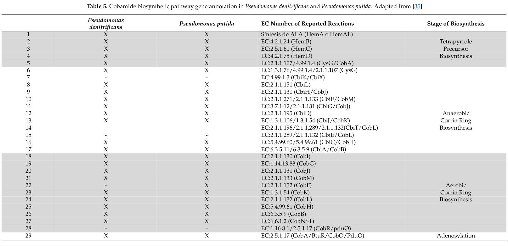

## Question

# Gene Research for Functional Annotation

## ⚠️ CRITICAL: Gene/Protein Identification Context

**BEFORE YOU BEGIN RESEARCH:** You MUST verify you are researching the CORRECT gene/protein. Gene symbols can be ambiguous, especially for less well-characterized genes from non-model organisms.

### Target Gene/Protein Identity (from UniProt):
- **UniProt Accession:** Q88M95
- **Protein Description:** RecName: Full=Nicotinate-nucleotide--dimethylbenzimidazole phosphoribosyltransferase {ECO:0000255|HAMAP-Rule:MF_00230}; Short=NN:DBI PRT {ECO:0000255|HAMAP-Rule:MF_00230}; EC=2.4.2.21 {ECO:0000255|HAMAP-Rule:MF_00230}; AltName: Full=N(1)-alpha-phosphoribosyltransferase {ECO:0000255|HAMAP-Rule:MF_00230};
- **Gene Information:** Name=cobT {ECO:0000255|HAMAP-Rule:MF_00230}; OrderedLocusNames=PP_1679;
- **Organism (full):** Pseudomonas putida (strain ATCC 47054 / DSM 6125 / CFBP 8728 / NCIMB 11950 / KT2440).
- **Protein Family:** Belongs to the CobT family. {ECO:0000255|HAMAP-
- **Key Domains:** Nict_dMeBzImd_PRibTrfase. (IPR003200); Nict_dMeBzImd_PRibTrfase_bact. (IPR017846); Nict_dMeBzImd_PRibTrfase_N. (IPR023195); Nict_dMeBzImd_PRibTrfase_sf. (IPR036087); DBI_PRT (PF02277)

### MANDATORY VERIFICATION STEPS:

1. **Check if the gene symbol "cobT" matches the protein description above**
2. **Verify the organism is correct:** Pseudomonas putida (strain ATCC 47054 / DSM 6125 / CFBP 8728 / NCIMB 11950 / KT2440).
3. **Check if protein family/domains align with what you find in literature**
4. **If you find literature for a DIFFERENT gene with the same or similar symbol, STOP**

### If Gene Symbol is Ambiguous or You Cannot Find Relevant Literature:

**DO NOT PROCEED WITH RESEARCH ON A DIFFERENT GENE.** Instead:
- State clearly: "The gene symbol 'cobT' is ambiguous or literature is limited for this specific protein"
- Explain what you found (e.g., "Found extensive literature on a different gene with the same symbol in a different organism")
- Describe the protein based ONLY on the UniProt information provided above
- Suggest that the protein function can be inferred from domain/family information

### Research Target:

Please provide a comprehensive research report on the gene **cobT** (gene ID: cobT, UniProt: Q88M95) in PSEPK.

The research report should be a detailed narrative explaining the function, biological processes, and localization of the gene product. Citations should be given for all claims.

You should prioritize authoritative reviews and primary scientific literature when conducting research. You can supplement
this with annotations you find in gene/protein databases, but these can be outdated or inaccurate.

We are specifically interested in the primary function of the gene - for enzymes, what reaction is catalyzed, and what is the substrate specificity? For transporters, what is the substrate? For structural proteins or adapters, what is the broader structural role? For signaling molecules, what is the role in the pathway.

We are interested in where in or outside the cell the gene product carries out its function.

We are also interested in the signaling or biochemical pathways in which the gene functions. We are less interested in broad pleiotropic effects, except where these elucidate the precise role.

Include evidence where possible. We are interested in both experimental evidence as well as inference from structure, evolution, or bioinformatic analysis. Precise studies should be prioritized over high-throughput, where available.

## Output

Question: You are an expert researcher providing comprehensive, well-cited information.

Provide detailed information focusing on:
1. Key concepts and definitions with current understanding
2. Recent developments and latest research (prioritize 2023-2024 sources)
3. Current applications and real-world implementations
4. Expert opinions and analysis from authoritative sources
5. Relevant statistics and data from recent studies

Format as a comprehensive research report with proper citations. Include URLs and publication dates where available.
Always prioritize recent, authoritative sources and provide specific citations for all major claims.

# Gene Research for Functional Annotation

## ⚠️ CRITICAL: Gene/Protein Identification Context

**BEFORE YOU BEGIN RESEARCH:** You MUST verify you are researching the CORRECT gene/protein. Gene symbols can be ambiguous, especially for less well-characterized genes from non-model organisms.

### Target Gene/Protein Identity (from UniProt):
- **UniProt Accession:** Q88M95
- **Protein Description:** RecName: Full=Nicotinate-nucleotide--dimethylbenzimidazole phosphoribosyltransferase {ECO:0000255|HAMAP-Rule:MF_00230}; Short=NN:DBI PRT {ECO:0000255|HAMAP-Rule:MF_00230}; EC=2.4.2.21 {ECO:0000255|HAMAP-Rule:MF_00230}; AltName: Full=N(1)-alpha-phosphoribosyltransferase {ECO:0000255|HAMAP-Rule:MF_00230};
- **Gene Information:** Name=cobT {ECO:0000255|HAMAP-Rule:MF_00230}; OrderedLocusNames=PP_1679;
- **Organism (full):** Pseudomonas putida (strain ATCC 47054 / DSM 6125 / CFBP 8728 / NCIMB 11950 / KT2440).
- **Protein Family:** Belongs to the CobT family. {ECO:0000255|HAMAP-
- **Key Domains:** Nict_dMeBzImd_PRibTrfase. (IPR003200); Nict_dMeBzImd_PRibTrfase_bact. (IPR017846); Nict_dMeBzImd_PRibTrfase_N. (IPR023195); Nict_dMeBzImd_PRibTrfase_sf. (IPR036087); DBI_PRT (PF02277)

### MANDATORY VERIFICATION STEPS:

1. **Check if the gene symbol "cobT" matches the protein description above**
2. **Verify the organism is correct:** Pseudomonas putida (strain ATCC 47054 / DSM 6125 / CFBP 8728 / NCIMB 11950 / KT2440).
3. **Check if protein family/domains align with what you find in literature**
4. **If you find literature for a DIFFERENT gene with the same or similar symbol, STOP**

### If Gene Symbol is Ambiguous or You Cannot Find Relevant Literature:

**DO NOT PROCEED WITH RESEARCH ON A DIFFERENT GENE.** Instead:
- State clearly: "The gene symbol 'cobT' is ambiguous or literature is limited for this specific protein"
- Explain what you found (e.g., "Found extensive literature on a different gene with the same symbol in a different organism")
- Describe the protein based ONLY on the UniProt information provided above
- Suggest that the protein function can be inferred from domain/family information

### Research Target:

Please provide a comprehensive research report on the gene **cobT** (gene ID: cobT, UniProt: Q88M95) in PSEPK.

The research report should be a detailed narrative explaining the function, biological processes, and localization of the gene product. Citations should be given for all claims.

You should prioritize authoritative reviews and primary scientific literature when conducting research. You can supplement
this with annotations you find in gene/protein databases, but these can be outdated or inaccurate.

We are specifically interested in the primary function of the gene - for enzymes, what reaction is catalyzed, and what is the substrate specificity? For transporters, what is the substrate? For structural proteins or adapters, what is the broader structural role? For signaling molecules, what is the role in the pathway.

We are interested in where in or outside the cell the gene product carries out its function.

We are also interested in the signaling or biochemical pathways in which the gene functions. We are less interested in broad pleiotropic effects, except where these elucidate the precise role.

Include evidence where possible. We are interested in both experimental evidence as well as inference from structure, evolution, or bioinformatic analysis. Precise studies should be prioritized over high-throughput, where available.

# Research report: **cobT** (UniProt Q88M95; PP_1679) in *Pseudomonas putida* KT2440

## Executive summary
The *Pseudomonas putida* KT2440 gene **cobT** (UniProt **Q88M95**, locus **PP_1679**) is functionally annotated as a **nicotinate-nucleotide:base phosphoribosyltransferase** (CobT family; EC **2.4.2.21**) that activates the cobamide (vitamin B12 family) **lower-ligand base** by transferring a ribosyl-5′-phosphate moiety from **nicotinate mononucleotide (NaMN)** to the base (classically **5,6-dimethylbenzimidazole, DMB**) to form the **α-ribotide (α-ribazole-5′-phosphate; α-RP)**, releasing **nicotinic acid**. This activated base is then used by downstream **CobS** (a membrane-associated cobamide 5′-phosphate synthase) to assemble the cobamide nucleotide loop. CobT enzymes are widely recognized as major determinants of **cobamide structural diversity** because many homologs show broad, but non-uniform, lower-ligand substrate specificity, including activity on various benzimidazoles and purines. (mattes2018studiesofthe pages 59-63, jeter2020cobamidebiosynthesisis pages 18-23, mattes2018studiesofthe pages 63-67)

Organism-specific primary biochemical characterization of *P. putida* CobT (PP_1679/Q88M95) was not retrieved in the current tool-based corpus; thus, the strain-specific annotation is supported by (i) pathway-level evidence that *P. putida* KT2440 encodes CobT (EC 2.4.2.21) in its cobamide pathway gene annotation table and (ii) conserved CobT-family biochemical/structural evidence from model organisms and reviews. (lima2218strategyforoptimizing pages 9-12, lima2218strategyforoptimizing media a5ed1900, lima2218strategyforoptimizing media 02786747)

## 1) Key concepts and definitions (current understanding)

### 1.1 Cobamides, lower ligands, and nucleotide loop assembly (NLA)
Cobamides are cobalt-containing cyclic tetrapyrroles (vitamin B12 family cofactors) distinguished in part by their **lower ligand** (the nucleobase/aryl group coordinated on the “lower face” of the corrin ring via the nucleotide loop). Lower ligands can be **benzimidazoles (e.g., DMB and derivatives), purines (e.g., adenine), or phenolic compounds**, and swapping the lower ligand can alter compatibility with cobamide-dependent enzymes. (jeter2020cobamidebiosynthesisis pages 18-23)

In bacteria and archaea, salvage and remodeling of corrinoids often proceeds through a **nucleotide loop assembly (NLA)** pathway in which the lower ligand is (i) **activated** (by CobT-family enzymes) and (ii) **condensed** onto a corrinoid intermediate (by CobS), followed by (iii) **dephosphorylation** (by CobC). (shelton2019cobamideandcobamide pages 12-14, mattes2018studiesofthe pages 63-67)

### 1.2 Definition of CobT (NN:DBI PRT; EC 2.4.2.21)
CobT is the canonical **NaMN:base phosphoribosyltransferase** responsible for activating lower-ligand bases by forming an **α-riboside phosphate (α-ribotide)**. It is frequently described as “NaMN:DMB phosphoribosyltransferase” because DMB is the classical lower ligand in cobalamin. (mattes2018studiesofthe pages 59-63, jeter2020cobamidebiosynthesisis pages 18-23)

## 2) Primary function: reaction catalyzed and substrate specificity

### 2.1 Reaction catalyzed (best-supported biochemical definition)
CobT catalyzes transfer of the ribosyl-5′-phosphate moiety from **NaMN** to a lower-ligand base such as **DMB**, producing **α-ribazole-5′-phosphate (α-RP)** and **nicotinic acid**:

- **NaMN + DMB → α-ribazole-5′-phosphate (α-RP) + nicotinic acid** (mattes2018studiesofthe pages 59-63, jeter2020cobamidebiosynthesisis pages 18-23)

This α-ribotide is an activated lower-ligand intermediate that is subsequently used by CobS for the next step of nucleotide loop assembly. (mattes2018studiesofthe pages 63-67)

### 2.2 Lower-ligand substrate specificity (acceptor side)
CobT homologs can accept a **broad range of lower-ligand bases**, including multiple benzimidazoles and purines; this biochemical flexibility is a major contributor to **cobamide diversity** across taxa. (jeter2020cobamidebiosynthesisis pages 18-23)

Evidence from comparative genomics/review synthesis indicates CobT homologs form subfamilies associated with organisms producing purinyl vs benzimidazolyl cobamides, but **many CobT enzymes still display promiscuity** when tested in vitro or in heterologous contexts. (shelton2019cobamideandcobamide pages 12-14)

Structural evidence supports mechanistic bases of promiscuity. For example, CobT active sites can accommodate different lower-ligand scaffolds (benzimidazole- vs adenine-type) with loop rearrangements that enclose the bound base. (jeter2020cobamidebiosynthesisis pages 139-148, jeter2020cobamidebiosynthesisis pages 124-130)

### 2.3 Phosphoribosyl donor specificity (donor side)
Although NaMN is canonical, CobT from *Salmonella enterica* can use alternative donors (**NAD+, NMN, NaAD**) to generate related ribotides; however, affinity can be substantially lower for non-canonical donors. A quantitative example extracted from the *Salmonella* CobT analysis is that the **Km for NAD+ is ~18-fold higher than for NaMN**, consistent with physiological preference for NaMN while retaining measurable donor flexibility. (mattes2018studiesofthe pages 59-63, mattes2018studiesofthe pages 63-67)

## 3) Pathway context and cellular localization

### 3.1 Placement within cobamide biosynthesis/remodeling
CobT acts in the **late steps** of cobamide biosynthesis/remodeling—specifically the **lower-ligand activation** step of nucleotide loop assembly. After CobT forms α-ribotide, **CobS** condenses the activated base with an activated corrinoid intermediate, and **CobC** removes the phosphate later in the pathway. (shelton2019cobamideandcobamide pages 12-14, mattes2018studiesofthe pages 63-67)

### 3.2 Subcellular localization and functional coupling
The available evidence supports CobT as a **soluble enzyme** (phosphoribosyltransferase) acting in the cytosolic compartment, while the subsequent condensation enzyme **CobS** is described as **integral membrane/membrane-associated**, implying that late cobamide assembly steps are organized at or near the membrane even if CobT itself is not a membrane protein. (jeter2020cobamidebiosynthesisis pages 18-23, mattes2018studiesofthe pages 63-67)

## 4) Organism-specific evidence in *Pseudomonas putida* KT2440 (strain-level functional annotation)

### 4.1 Evidence that KT2440 encodes CobT (EC 2.4.2.21)
A 2024 study using a curated genome-scale metabolic model for vitamin B12 production in *P. putida* KT2440 includes a cobamide pathway annotation table marking **CobT (EC 2.4.2.21; listed as CobT/CobU/ArsAB)** as present in *P. putida*. The same analysis reports that *P. putida* KT2440 is annotated as containing **32 of 38** cobamide pathway reactions, consistent with a largely complete aerobic cobamide biosynthetic capacity. (lima2218strategyforoptimizing pages 9-12, lima2218strategyforoptimizing media a5ed1900, lima2218strategyforoptimizing media 02786747)

**Visual evidence (table excerpt):** the paper’s Table 5 explicitly lists CobT (EC 2.4.2.21) and indicates presence in *P. putida* (X in the *P. putida* column). (lima2218strategyforoptimizing media a5ed1900, lima2218strategyforoptimizing media 02786747)

### 4.2 Quantitative pathway/production context (model-based)
In the same 2024 modeling work evaluating *P. putida* KT2440 as an industrial chassis, flux balance analysis predicted:

- Biomass production flux: **1.802 gDW−1·h−1·L−1**
- Vitamin B12 production flux: **0.359 µmol·gDW−1·h−1·L−1** (lima2218strategyforoptimizing pages 1-2)

A related model-curation/engineering analysis (thesis-like document captured by the tools) reports that adding missing **aminopropanol linker reactions** increased predicted B12 flux to **0.400 µmol·gDW−1·h−1·L−1** (and an alternative ALA synthase addition gave **0.394 µmol·gDW−1·h−1·L−1**) without changing the biomass flux (remaining **1.802 gDW−1·h−1·L−1**). While these are not CobT-specific kinetics, they provide quantitative evidence that KT2440 is predicted to have near-complete pathway capacity and that engineering bottlenecks may lie elsewhere (e.g., aminopropanol linker steps), with CobT functioning as a standard nucleotide-loop activation enzyme in the pathway. (limaUnknownyearproducciónoptimizadade pages 35-38)

### 4.3 Limitations of organism-specific evidence
No retrieved primary paper explicitly linked **UniProt Q88M95** or **PP_1679** to enzymatic assays, knockouts, or localization experiments in KT2440. Accordingly, the functional assignment for PP_1679 rests on conserved CobT-family function and KT2440 pathway presence, not on direct biochemical measurement of the KT2440 protein itself. (lima2218strategyforoptimizing pages 9-12, lima2218strategyforoptimizing media a5ed1900)

## 5) Recent developments and latest research (prioritizing 2023–2024)

### 5.1 2024 authoritative synthesis: cobamide salvaging and remodeling
A 2024 review in *Journal of Bacteriology* emphasizes that prokaryotes have evolved enzymes that **cleave and rebuild** the nucleotide loop to exchange lower ligands (“cobamide remodeling”), using the NLA pathway that includes enzymes that **activate the nucleobase** and corrinoid intermediate followed by condensation and dephosphorylation. This frames CobT’s biological role beyond de novo synthesis: CobT-like activities are central to **salvage/remodeling** of corrinoids from environmental precursors, thereby shaping cobamide availability and function in microbial communities. (mattes2018studiesofthe pages 63-67)

### 5.2 2024 KT2440-focused development: systems biology and engineering for B12
A 2024 metabolic-modeling study (MDPI *Metabolites*) proposes *P. putida* KT2440 as a robust, genetically tractable chassis for vitamin B12 production and uses curated genome-scale modeling to identify pathway gaps and engineering strategies (e.g., adding missing reactions and potentially modifying B12-responsive riboswitch regulation). This reflects a real-world trend: applying constraint-based modeling and synthetic biology to convert non-traditional hosts into cobamide producers. (lima2218strategyforoptimizing pages 1-2, lima2218strategyforoptimizing pages 9-12)

**Note on scope of 2023–2024 CobT biochemistry:** within the retrieved corpus, no 2023–2024 primary CobT structure/kinetics paper was captured; therefore, “latest research” here is represented mainly by 2024 review synthesis and 2024 systems/metabolic modeling relevant to CobT’s pathway role. (lima2218strategyforoptimizing pages 1-2, mattes2018studiesofthe pages 63-67)

## 6) Current applications and real-world implementations

### 6.1 Industrial and synthetic biology applications
CobT is a late-pathway enzyme required for assembling complete cobamides; therefore, it is indirectly central to industrial vitamin B12 production where a functional nucleotide-loop assembly module is required. The 2024 KT2440 modeling paper argues that *P. putida* KT2440 is a promising production chassis and provides quantitative, model-based B12 flux predictions and engineering strategies (reaction knock-ins and regulatory tuning). (lima2218strategyforoptimizing pages 1-2)

Although not demonstrating commercial-scale production, these studies represent real-world implementation steps: pathway curation, computational design of genetic changes, and identification of missing enzymatic capacities that must be introduced to enable high-yield B12 biosynthesis. (limaUnknownyearproducciónoptimizadade pages 35-38, lima2218strategyforoptimizing pages 4-6)

### 6.2 Microbial ecology applications (cross-feeding/remodeling)
Genomic perspective work highlights that cobamide availability is often governed by cross-feeding of cobamides and precursors, and that CobT-mediated lower-ligand activation is an essential step enabling cells to assemble cobamides from imported precursors or altered lower ligands (“guided biosynthesis”). This supports a conceptual application: manipulating lower-ligand availability to control cobamide structures in co-culture systems or microbiomes. (shelton2019cobamideandcobamide pages 12-14)

## 7) Expert opinions and analysis (authoritative sources)

### 7.1 CobT as a determinant of cobamide diversity
Reviews and mechanistic syntheses emphasize that CobT and related base-activating enzymes are key points where **chemical diversity** (choice of lower ligand; donor usage; alternative enzymes such as ArsAB-like activities) enters cobamide biosynthesis, explaining why different organisms produce distinct cobamide variants. (balabanova2021microbialandgenetic pages 7-8, jeter2020cobamidebiosynthesisis pages 18-23)

### 7.2 Functional coupling to membrane-associated late assembly
Work emphasizing that cobamide biosynthesis is “anchored to the membrane” supports the interpretation that even soluble enzymes like CobT function within a spatially organized late-assembly process near membrane-associated CobS, offering a systems-level view of pathway organization. (jeter2020cobamidebiosynthesisis pages 18-23)

## 8) Key quantitative statistics and data points (from retrieved studies)

- **CobT donor specificity (quantitative):** in *Salmonella* CobT, **Km for NAD+ ~18× higher than Km for NaMN**, indicating preference for NaMN with measurable alternative donor usage. (mattes2018studiesofthe pages 59-63)
- **KT2440 predicted pathway completeness:** *P. putida* KT2440 annotated as **32/38** cobamide pathway reactions, with CobT (EC 2.4.2.21) present. (lima2218strategyforoptimizing pages 9-12, lima2218strategyforoptimizing media a5ed1900)
- **KT2440 in silico production fluxes:** predicted vitamin B12 flux **0.359 µmol·gDW−1·h−1·L−1** at biomass flux **1.802 gDW−1·h−1·L−1**. (lima2218strategyforoptimizing pages 1-2)
- **Effect of adding missing reactions (in silico):** adding aminopropanol linker reactions increased predicted B12 flux to **0.400 µmol·gDW−1·h−1·L−1** (ALA synthase alternative **0.394**), with biomass unchanged (**1.802**). (limaUnknownyearproducciónoptimizadade pages 35-38)

## Synthesis table (functional annotation overview)

| Annotation item | Key details | Most relevant citations |
|---|---|---|
| Gene/protein identity in target organism | UniProt Q88M95 is annotated as **CobT / PP_1679** in *Pseudomonas putida* KT2440, a member of the CobT family with DBI_PRT-related domains; recent pathway modeling for *P. putida* marks **EC 2.4.2.21 (CobT/CobU/ArsAB)** as present in the strain’s cobamide pathway. | (lima2218strategyforoptimizing pages 9-12, lima2218strategyforoptimizing media a5ed1900, lima2218strategyforoptimizing media 02786747) |
| Reaction catalyzed | CobT is a **nicotinate-nucleotide:base phosphoribosyltransferase** that transfers the ribosyl-5′-phosphate moiety from **NaMN** to a lower-ligand base such as **5,6-dimethylbenzimidazole (DMB)**, producing **α-ribazole-5′-phosphate (α-RP)** and **nicotinic acid**. | (mattes2018studiesofthe pages 59-63, jeter2020cobamidebiosynthesisis pages 18-23) |
| Core substrates | Canonical donor/acceptor pair is **NaMN + DMB**. Reviews and structural work also support use of other benzimidazoles and purines as lower-ligand acceptors, explaining cobamide lower-ligand diversity. | (jeter2020cobamidebiosynthesisis pages 139-148, balabanova2021microbialandgenetic pages 7-8, shelton2019cobamideandcobamide pages 12-14) |
| Products | The activated lower ligand is **α-ribotide/α-ribazole-5′-phosphate**; the leaving group is **nicotinic acid**. This activated base is the immediate substrate for the next nucleotide-loop assembly step. | (jeter2020cobamidebiosynthesisis pages 139-148, mattes2018studiesofthe pages 59-63, mattes2018studiesofthe pages 63-67) |
| Pathway step | CobT functions in **late cobamide biosynthesis**, specifically **nucleotide loop assembly (NLA)** / lower-ligand activation before attachment to the corrinoid. After CobT, **CobS** condenses the activated base with activated cobinamide, and **CobC** removes phosphate downstream. | (shelton2019cobamideandcobamide pages 12-14, jeter2020cobamidebiosynthesisis pages 18-23, mattes2018studiesofthe pages 63-67) |
| Localization / complex association | CobT itself is described as a soluble phosphoribosyltransferase; the **next step enzyme CobS is membrane-associated/integral membrane**, and recent work argues late cobamide assembly is organized at the membrane. Thus CobT likely acts in the **cytosol/peripheral late-assembly context**, functionally coupled to membrane-anchored CobS rather than being a transporter or secreted protein. | (jeter2020cobamidebiosynthesisis pages 18-23, mattes2018studiesofthe pages 63-67) |
| Substrate specificity notes | CobT homologs show **broad but nonuniform lower-ligand specificity**. Enzymes from different taxa can activate **benzimidazoles, adenine/purines, and some analogs**; subfamilies correlate with purinyl vs benzimidazolyl cobamide production, but many CobT proteins remain promiscuous in vitro/heterologous tests. | (balabanova2021microbialandgenetic pages 7-8, jeter2020cobamidebiosynthesisis pages 124-130, shelton2019cobamideandcobamide pages 12-14) |
| Donor flexibility | Besides NaMN, some CobT enzymes can use **NAD+, NMN, or NaAD** as phosphoribosyl donors. For *Salmonella* CobT, the **Km for NAD+ is ~18-fold higher than for NaMN**, indicating substantially poorer affinity for NAD+ but measurable donor flexibility. | (mattes2018studiesofthe pages 59-63, mattes2018studiesofthe pages 63-67) |
| Mechanistic/structural inference | Structural studies support a catalytic base-mediated mechanism in which an active-site acidic residue deprotonates the lower ligand to enable attack at the ribose C1′, generating the **α-glycosidic linkage**. Active-site architecture can reorder loops around bound purines/benzimidazoles, rationalizing substrate promiscuity. | (jeter2020cobamidebiosynthesisis pages 139-148, mattes2018studiesofthe pages 59-63, jeter2020cobamidebiosynthesisis pages 124-130) |
| Organism-specific pathway context in *P. putida* KT2440 | A 2024 modeling study concludes *P. putida* KT2440 contains **32 of 38** annotated cobamide-pathway reactions and includes **CobT (EC 2.4.2.21)**, supporting functional assignment of PP_1679 to vitamin B12 lower-ligand activation in the strain. | (limaUnknownyearproducciónoptimizadade pages 38-41, lima2218strategyforoptimizing pages 9-12, lima2218strategyforoptimizing media a5ed1900) |
| Quantitative strain-level production context | In silico curation/modeling for *P. putida* KT2440 predicted **0.359 µmol gDW−1 h−1 L−1** vitamin B12 production at **1.802 gDW−1 h−1 L−1** biomass flux; adding aminopropanol-linker reactions increased modeled B12 yield to **0.400 µmol gDW−1 h−1 L−1** (ALA synthase alternative: **0.394 µmol gDW−1 h−1 L−1**), while five putative B12 riboswitches were identified. These values contextualize CobT as one component of a largely complete pathway rather than direct CobT kinetics for PP_1679. | (lima2218strategyforoptimizing pages 1-2, limaUnknownyearproducciónoptimizadade pages 35-38) |
| Evidence type | **Direct organism-specific experimental evidence for PP_1679/Q88M95 was not retrieved**; annotation rests on UniProt/domain assignment plus *P. putida* pathway-model presence, while **biochemical function/mechanism** are inferred from authoritative CobT studies and reviews in other bacteria/archaea. | (lima2218strategyforoptimizing pages 9-12, lima2218strategyforoptimizing media a5ed1900, mattes2018studiesofthe pages 59-63, jeter2020cobamidebiosynthesisis pages 18-23) |

*Table: This table summarizes the best-supported functional annotation for CobT (UniProt Q88M95; PP_1679) in *Pseudomonas putida* KT2440, integrating organism-specific pathway evidence with broader biochemical knowledge of CobT enzymes. It highlights the catalytic reaction, pathway role, localization context, substrate flexibility, and relevant quantitative modeling data.*

## References (retrieved by tools; with URLs/dates when available)
- Villa EA, Escalante-Semerena JC. *Corrinoid salvaging and cobamide remodeling in bacteria and archaea*. **Journal of Bacteriology**. **Nov 2024**. https://doi.org/10.1128/jb.00286-24 (mattes2018studiesofthe pages 63-67)
- Prieto-de Lima TS, Rojas-Jimenez K, Vaglio C. *Strategy for optimizing vitamin B12 production in Pseudomonas putida KT2440 using metabolic modeling*. **Metabolites** (MDPI). Metadata indicates **Nov** publication; DOI: https://doi.org/10.3390/metabo14110636. (lima2218strategyforoptimizing pages 1-2, lima2218strategyforoptimizing pages 9-12)
- Shelton AN. *Cobamide and cobamide precursor cross-feeding: a genomic perspective*. 2019. (shelton2019cobamideandcobamide pages 12-14)
- Mattes TA. *Studies of the activation of the coenzyme B12 precursor alpha-ribazole and its unexpected synthesis in Salmonella enterica*. 2018. (mattes2018studiesofthe pages 59-63, mattes2018studiesofthe pages 63-67)
- Jeter VL. *Cobamide biosynthesis is anchored to the membrane*. 2020. (jeter2020cobamidebiosynthesisis pages 139-148, jeter2020cobamidebiosynthesisis pages 124-130, jeter2020cobamidebiosynthesisis pages 18-23)

## Important caveat (gene-specific evidence)
Within the tool-retrieved corpus, there is **no direct experimental characterization** (purified enzyme kinetics, substrate panel, mutant phenotype, or localization assay) explicitly for *P. putida* KT2440 **PP_1679 / UniProt Q88M95**. The strongest support for its functional annotation is (i) conserved CobT-family biochemical/structural evidence across bacteria/archaea and (ii) KT2440 pathway annotation showing CobT (EC 2.4.2.21) present. Future strengthening would require retrieving or generating KT2440-specific biochemical data (e.g., purified Q88M95 activity on DMB and other bases) and/or genetic evidence (cobT deletion affecting cobamide biosynthesis or salvage). (lima2218strategyforoptimizing pages 9-12, lima2218strategyforoptimizing media a5ed1900, mattes2018studiesofthe pages 59-63)

References

1. (mattes2018studiesofthe pages 59-63): TA Mattes. Studies of the activation of the coenzyme b12 precursor alpha-ribazole and its unexpected synthesis in salmonella enterica. Unknown journal, 2018.

2. (jeter2020cobamidebiosynthesisis pages 18-23): VL Jeter. Cobamide biosynthesis is anchored to the membrane. Unknown journal, 2020.

3. (mattes2018studiesofthe pages 63-67): TA Mattes. Studies of the activation of the coenzyme b12 precursor alpha-ribazole and its unexpected synthesis in salmonella enterica. Unknown journal, 2018.

4. (lima2218strategyforoptimizing pages 9-12): Thomaz Satuye Prieto-de Lima, Keilor Rojas‐Jimenez, and Christopher Vaglio. Strategy for optimizing vitamin b12 production in pseudomonas putida kt2440 using metabolic modeling. Metabolites, 14:636, Nov 2218. URL: https://doi.org/10.3390/metabo14110636, doi:10.3390/metabo14110636. This article has 0 citations.

5. (lima2218strategyforoptimizing media a5ed1900): Thomaz Satuye Prieto-de Lima, Keilor Rojas‐Jimenez, and Christopher Vaglio. Strategy for optimizing vitamin b12 production in pseudomonas putida kt2440 using metabolic modeling. Metabolites, 14:636, Nov 2218. URL: https://doi.org/10.3390/metabo14110636, doi:10.3390/metabo14110636. This article has 0 citations.

6. (lima2218strategyforoptimizing media 02786747): Thomaz Satuye Prieto-de Lima, Keilor Rojas‐Jimenez, and Christopher Vaglio. Strategy for optimizing vitamin b12 production in pseudomonas putida kt2440 using metabolic modeling. Metabolites, 14:636, Nov 2218. URL: https://doi.org/10.3390/metabo14110636, doi:10.3390/metabo14110636. This article has 0 citations.

7. (shelton2019cobamideandcobamide pages 12-14): AN Shelton. Cobamide and cobamide precursor cross-feeding: a genomic perspective. Unknown journal, 2019.

8. (jeter2020cobamidebiosynthesisis pages 139-148): VL Jeter. Cobamide biosynthesis is anchored to the membrane. Unknown journal, 2020.

9. (jeter2020cobamidebiosynthesisis pages 124-130): VL Jeter. Cobamide biosynthesis is anchored to the membrane. Unknown journal, 2020.

10. (lima2218strategyforoptimizing pages 1-2): Thomaz Satuye Prieto-de Lima, Keilor Rojas‐Jimenez, and Christopher Vaglio. Strategy for optimizing vitamin b12 production in pseudomonas putida kt2440 using metabolic modeling. Metabolites, 14:636, Nov 2218. URL: https://doi.org/10.3390/metabo14110636, doi:10.3390/metabo14110636. This article has 0 citations.

11. (limaUnknownyearproducciónoptimizadade pages 35-38): T Satuye Prieto de Lima. Producción optimizada de vitamina b12 en pseudomonas putida kt2440 con herramientas de biología sintética. Unknown journal, Unknown year.

12. (lima2218strategyforoptimizing pages 4-6): Thomaz Satuye Prieto-de Lima, Keilor Rojas‐Jimenez, and Christopher Vaglio. Strategy for optimizing vitamin b12 production in pseudomonas putida kt2440 using metabolic modeling. Metabolites, 14:636, Nov 2218. URL: https://doi.org/10.3390/metabo14110636, doi:10.3390/metabo14110636. This article has 0 citations.

13. (balabanova2021microbialandgenetic pages 7-8): Larissa Balabanova, Liudmila Averianova, Maksim Marchenok, Oksana Son, and Liudmila Tekutyeva. Microbial and genetic resources for cobalamin (vitamin b12) biosynthesis: from ecosystems to industrial biotechnology. International Journal of Molecular Sciences, 22:4522, Apr 2021. URL: https://doi.org/10.3390/ijms22094522, doi:10.3390/ijms22094522. This article has 172 citations.

14. (limaUnknownyearproducciónoptimizadade pages 38-41): T Satuye Prieto de Lima. Producción optimizada de vitamina b12 en pseudomonas putida kt2440 con herramientas de biología sintética. Unknown journal, Unknown year.

## Artifacts

- [Edison artifact artifact-00](cobT-deep-research-falcon_artifacts/artifact-00.md)

## Citations

1. jeter2020cobamidebiosynthesisis pages 18-23
2. mattes2018studiesofthe pages 63-67
3. shelton2019cobamideandcobamide pages 12-14
4. lima2218strategyforoptimizing pages 1-2
5. mattes2018studiesofthe pages 59-63
6. lima2218strategyforoptimizing pages 9-12
7. jeter2020cobamidebiosynthesisis pages 139-148
8. jeter2020cobamidebiosynthesisis pages 124-130
9. lima2218strategyforoptimizing pages 4-6
10. balabanova2021microbialandgenetic pages 7-8
11. https://doi.org/10.1128/jb.00286-24
12. https://doi.org/10.3390/metabo14110636.
13. https://doi.org/10.3390/metabo14110636,
14. https://doi.org/10.3390/ijms22094522,