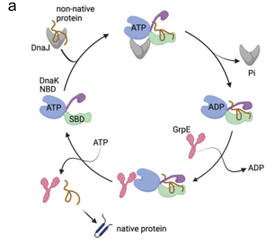

## Question

# Gene Research for Functional Annotation

## ⚠️ CRITICAL: Gene/Protein Identification Context

**BEFORE YOU BEGIN RESEARCH:** You MUST verify you are researching the CORRECT gene/protein. Gene symbols can be ambiguous, especially for less well-characterized genes from non-model organisms.

### Target Gene/Protein Identity (from UniProt):
- **UniProt Accession:** Q88DU2
- **Protein Description:** RecName: Full=Chaperone protein DnaK {ECO:0000255|HAMAP-Rule:MF_00332}; AltName: Full=HSP70 {ECO:0000255|HAMAP-Rule:MF_00332}; AltName: Full=Heat shock 70 kDa protein {ECO:0000255|HAMAP-Rule:MF_00332}; AltName: Full=Heat shock protein 70 {ECO:0000255|HAMAP-Rule:MF_00332};
- **Gene Information:** Name=dnaK {ECO:0000255|HAMAP-Rule:MF_00332}; OrderedLocusNames=PP_4727;
- **Organism (full):** Pseudomonas putida (strain ATCC 47054 / DSM 6125 / CFBP 8728 / NCIMB 11950 / KT2440).
- **Protein Family:** Belongs to the heat shock protein 70 family.
- **Key Domains:** ATPase_NBD. (IPR043129); Chaperone_DnaK. (IPR012725); Heat_shock_70_CS. (IPR018181); HSP70_C_sf. (IPR029048); HSP70_peptide-bd_sf. (IPR029047)

### MANDATORY VERIFICATION STEPS:

1. **Check if the gene symbol "dnaK" matches the protein description above**
2. **Verify the organism is correct:** Pseudomonas putida (strain ATCC 47054 / DSM 6125 / CFBP 8728 / NCIMB 11950 / KT2440).
3. **Check if protein family/domains align with what you find in literature**
4. **If you find literature for a DIFFERENT gene with the same or similar symbol, STOP**

### If Gene Symbol is Ambiguous or You Cannot Find Relevant Literature:

**DO NOT PROCEED WITH RESEARCH ON A DIFFERENT GENE.** Instead:
- State clearly: "The gene symbol 'dnaK' is ambiguous or literature is limited for this specific protein"
- Explain what you found (e.g., "Found extensive literature on a different gene with the same symbol in a different organism")
- Describe the protein based ONLY on the UniProt information provided above
- Suggest that the protein function can be inferred from domain/family information

### Research Target:

Please provide a comprehensive research report on the gene **dnaK** (gene ID: dnaK, UniProt: Q88DU2) in PSEPK.

The research report should be a detailed narrative explaining the function, biological processes, and localization of the gene product. Citations should be given for all claims.

You should prioritize authoritative reviews and primary scientific literature when conducting research. You can supplement
this with annotations you find in gene/protein databases, but these can be outdated or inaccurate.

We are specifically interested in the primary function of the gene - for enzymes, what reaction is catalyzed, and what is the substrate specificity? For transporters, what is the substrate? For structural proteins or adapters, what is the broader structural role? For signaling molecules, what is the role in the pathway.

We are interested in where in or outside the cell the gene product carries out its function.

We are also interested in the signaling or biochemical pathways in which the gene functions. We are less interested in broad pleiotropic effects, except where these elucidate the precise role.

Include evidence where possible. We are interested in both experimental evidence as well as inference from structure, evolution, or bioinformatic analysis. Precise studies should be prioritized over high-throughput, where available.

## Output

Question: You are an expert researcher providing comprehensive, well-cited information.

Provide detailed information focusing on:
1. Key concepts and definitions with current understanding
2. Recent developments and latest research (prioritize 2023-2024 sources)
3. Current applications and real-world implementations
4. Expert opinions and analysis from authoritative sources
5. Relevant statistics and data from recent studies

Format as a comprehensive research report with proper citations. Include URLs and publication dates where available.
Always prioritize recent, authoritative sources and provide specific citations for all major claims.

# Gene Research for Functional Annotation

## ⚠️ CRITICAL: Gene/Protein Identification Context

**BEFORE YOU BEGIN RESEARCH:** You MUST verify you are researching the CORRECT gene/protein. Gene symbols can be ambiguous, especially for less well-characterized genes from non-model organisms.

### Target Gene/Protein Identity (from UniProt):
- **UniProt Accession:** Q88DU2
- **Protein Description:** RecName: Full=Chaperone protein DnaK {ECO:0000255|HAMAP-Rule:MF_00332}; AltName: Full=HSP70 {ECO:0000255|HAMAP-Rule:MF_00332}; AltName: Full=Heat shock 70 kDa protein {ECO:0000255|HAMAP-Rule:MF_00332}; AltName: Full=Heat shock protein 70 {ECO:0000255|HAMAP-Rule:MF_00332};
- **Gene Information:** Name=dnaK {ECO:0000255|HAMAP-Rule:MF_00332}; OrderedLocusNames=PP_4727;
- **Organism (full):** Pseudomonas putida (strain ATCC 47054 / DSM 6125 / CFBP 8728 / NCIMB 11950 / KT2440).
- **Protein Family:** Belongs to the heat shock protein 70 family.
- **Key Domains:** ATPase_NBD. (IPR043129); Chaperone_DnaK. (IPR012725); Heat_shock_70_CS. (IPR018181); HSP70_C_sf. (IPR029048); HSP70_peptide-bd_sf. (IPR029047)

### MANDATORY VERIFICATION STEPS:

1. **Check if the gene symbol "dnaK" matches the protein description above**
2. **Verify the organism is correct:** Pseudomonas putida (strain ATCC 47054 / DSM 6125 / CFBP 8728 / NCIMB 11950 / KT2440).
3. **Check if protein family/domains align with what you find in literature**
4. **If you find literature for a DIFFERENT gene with the same or similar symbol, STOP**

### If Gene Symbol is Ambiguous or You Cannot Find Relevant Literature:

**DO NOT PROCEED WITH RESEARCH ON A DIFFERENT GENE.** Instead:
- State clearly: "The gene symbol 'dnaK' is ambiguous or literature is limited for this specific protein"
- Explain what you found (e.g., "Found extensive literature on a different gene with the same symbol in a different organism")
- Describe the protein based ONLY on the UniProt information provided above
- Suggest that the protein function can be inferred from domain/family information

### Research Target:

Please provide a comprehensive research report on the gene **dnaK** (gene ID: dnaK, UniProt: Q88DU2) in PSEPK.

The research report should be a detailed narrative explaining the function, biological processes, and localization of the gene product. Citations should be given for all claims.

You should prioritize authoritative reviews and primary scientific literature when conducting research. You can supplement
this with annotations you find in gene/protein databases, but these can be outdated or inaccurate.

We are specifically interested in the primary function of the gene - for enzymes, what reaction is catalyzed, and what is the substrate specificity? For transporters, what is the substrate? For structural proteins or adapters, what is the broader structural role? For signaling molecules, what is the role in the pathway.

We are interested in where in or outside the cell the gene product carries out its function.

We are also interested in the signaling or biochemical pathways in which the gene functions. We are less interested in broad pleiotropic effects, except where these elucidate the precise role.

Include evidence where possible. We are interested in both experimental evidence as well as inference from structure, evolution, or bioinformatic analysis. Precise studies should be prioritized over high-throughput, where available.

# Research Report: Functional Annotation of **dnaK** (UniProt **Q88DU2**) in *Pseudomonas putida* KT2440

## 0. Target verification (critical identity check)

### Verified target
The protein described by UniProt accession **Q88DU2** corresponds to **DnaK (bacterial Hsp70)** in *Pseudomonas putida* **KT2440**, and it is explicitly identified as **DnaK (Q88DU2)** in a KT2440 PHA-granule–associated proteomics study. (tarazona2020phasininteractomereveals pages 9-10)

### Avoiding symbol ambiguity
The gene symbol **dnaK** is used broadly across bacteria for Hsp70-family chaperones; therefore, organism-anchored evidence is required. The proteomics identification of **DnaK (Q88DU2)** in *P. putida* KT2440 provides this anchor, ensuring we are not conflating results from other bacteria. (tarazona2020phasininteractomereveals pages 9-10)

## 1. Key concepts and current understanding (definitions and mechanisms)

### 1.1 What is DnaK?
**DnaK** is the canonical bacterial **Hsp70-family** ATP-dependent molecular chaperone that supports **proteostasis** by binding non-native polypeptides and preventing aggregation, assisting folding through repeated ATP-driven binding/release cycles. (rosendahl2021thedisorderedcterminus pages 1-2)

### 1.2 Domain architecture (structure-function mapping)
A widely supported, current bacterial DnaK architecture comprises:
- an N-terminal **nucleotide-binding domain (NBD)** (~45 kDa) that binds/hydrolyzes ATP,
- a **substrate-binding β-domain (SBDβ)** (~15 kDa) that binds peptide segments,
- an **α-helical lid (SBDα)** (~10 kDa) that regulates substrate capture/release,
- and commonly a **short/disordered C-terminal tail** that can modulate substrate/cofactor interactions. (pan2024dnakduplicationand pages 1-2, rosendahl2021thedisorderedcterminus pages 1-2)

### 1.3 ATP-driven chaperone cycle (canonical mechanism)
The DnaK cycle is controlled by allosteric communication between NBD and SBD:
- In the **ATP-bound** state, substrate affinity is low and substrate exchange is fast.
- After **ATP hydrolysis**, substrate affinity increases markedly (reported **~10–50-fold**), while association/dissociation kinetics slow (**~100–1000-fold decreases** in association/dissociation rates), stabilizing client binding.
- Nucleotide exchange (ADP→ATP) promotes substrate release and cycling. (xiao2024structureofthe pages 1-2)

### 1.4 The KJE system (DnaK–DnaJ–GrpE)
In bacteria, DnaK typically functions with:
- **DnaJ (Hsp40/J-domain protein)**, which accelerates DnaK ATP hydrolysis and promotes productive client engagement,
- **GrpE**, a nucleotide exchange factor (NEF) that promotes ADP release and thereby coordinates substrate release and continuation of the cycle. (pan2024dnakduplicationand pages 1-2, rosendahl2021thedisorderedcterminus pages 1-2)

## 2. Recent developments (prioritizing 2023–2024)

### 2.1 2024 cryo-EM: how GrpE couples nucleotide exchange and substrate release
A 2024 cryo-EM study resolved an **asymmetric 1:2 DnaK–GrpE complex** (Mycobacterium tuberculosis system), in which the **GrpE dimer “ratchets”** to modulate both DnaK NBD and SBD. The study reports that:
- the **disordered GrpE N-terminus** is critical for substrate release,
- the **DnaK–GrpE interface** is essential for folding activity in vitro and in vivo,
- and GrpE can allosterically couple **ADP release (NBD)** with **peptide release (SBD)**. (xiao2024structureofthe pages 1-2, xiao2024structureofthe pages 5-7)

Visual support for this cycle/complex is provided in the same paper’s figures (DnaK cycle and complex depictions). (xiao2024structureofthe media 2a623946, xiao2024structureofthe media b1aedc95)

### 2.2 2024 systems biology/genomics: prevalence and diversification of dnaK
A 2024 mSystems study reports genome-scale statistics:
- **dnaK is present in 98.9% of bacterial genomes**,
- **6.4%** of bacterial genomes encode **≥2 DnaK paralogs**.
The same work links dnaK duplication to increased proteome complexity and shows how DnaK paralogs can specialize toward different client subsets (e.g., cytosolic vs membrane-enriched interactomes in a model organism). (pan2024dnakduplicationand pages 1-2)

### 2.3 2024 discovery: DnaK can regulate translation under specific stress
A 2024 PLOS Biology study in *Salmonella* reports a non-canonical role: DnaK can **reduce protein synthesis** during infection-relevant Mg2+ starvation, with quantitative findings including:
- **~3-fold increase** in DnaK ribosome association,
- **~30-fold decrease** in trigger factor ribosome association,
- and a dramatic survival phenotype: C-terminal truncation caused **~10,000-fold loss in viability** under that stress, which could be bypassed by translation inhibition. (chan2024chaperonehsp70helps pages 1-2, chan2024chaperonehsp70helps pages 12-15)

While not *P. putida*-specific, this result is a recent authoritative example of expanded DnaK functional repertoire, relevant to annotation discussions about DnaK’s roles beyond folding.

## 3. Functional annotation for *Pseudomonas putida* KT2440 DnaK (Q88DU2)

### 3.1 Molecular function (what it does)
In *P. putida*, DnaK is described as an ATP-dependent chaperone whose substrate binding is controlled by ATP binding/hydrolysis, acting via repeated cycles of binding/release of unfolded proteins; it operates with co-chaperones **DnaJ** and **GrpE**. (rosendahl2021thedisorderedcterminus pages 1-2)

### 3.2 Biological processes and pathways
**Protein quality control / stress response**: DnaK participates in the bacterial heat-shock/proteostasis network, helping refold or remodel damaged proteins; heat stress increases the demand for chaperone activity and can titrate DnaK away from other interactions. (rosendahl2021thedisorderedcterminus pages 1-2)

**Toxin–antitoxin/translation-linked phenotypes** (GraTA system): In *Pseudomonas putida*, DnaK interacts with the toxin **GraT** and can enhance GraT-associated phenotypes; the proposed interpretation is that DnaK may remodel GraT (which has intrinsically disordered elements) to a functionally active state, linking DnaK chaperoning to toxin-mediated growth phenotypes. (rosendahl2021thedisorderedcterminus pages 6-8, rosendahl2021thedisorderedcterminus pages 1-2)

### 3.3 Cellular localization (where it acts)
**Primary localization expectation**: DnaK is fundamentally a **cytosolic** chaperone consistent with its folding and proteostasis roles. (rosendahl2021thedisorderedcterminus pages 1-2)

**Evidence for association with PHA granules/carbonosomes in KT2440**: In KT2440, **DnaK (Q88DU2)** was detected on the **surface of isolated PHA granules**, alongside other chaperones (e.g., GroL) and folding-related proteins. The authors note this may represent true granule association or contamination during preparation; however, DnaK presence at granules is repeatedly observed in related contexts (e.g., nitrogen-limited/PHA-producing conditions) and is hypothesized to support roles such as enhancing protein folding in the granule milieu. (tarazona2020phasininteractomereveals pages 9-10)

### 3.4 Phenotypes in *Pseudomonas putida* (experimental evidence)
**Essentiality**: Attempts to delete **dnaK** in *P. putida* were unsuccessful, consistent with **essential function** in this organism/strain background. (rosendahl2021thedisorderedcterminus pages 6-8)

**C-terminal motif and fitness**: The DnaK C-terminus is intrinsically disordered and contains a conserved negatively charged motif (e.g., including **DAEFEE**). Mutations in this motif reduce competitive fitness and alter stress-related phenotypes; for example, a motif mutant strain was strongly outcompeted in long-term competition (notably at elevated temperature conditions). (rosendahl2021thedisorderedcterminus pages 10-12, rosendahl2021thedisorderedcterminus pages 14-15)

**GraT-related growth effects and quantitative expression change**: Induced dnaK overexpression increased dnaK mRNA **~2.7-fold** (25°C) and slightly exacerbated GraT-linked growth defects in a GraT-producing background. (rosendahl2021thedisorderedcterminus pages 6-8)

**Salt stress interaction evidence (genetic interaction)**: In a secB-defective background, combining secB deficiency with a DnaK C-terminal motif mutant increased sensitivity to NaCl stress, supporting that DnaK contributes to stress robustness in concert with other chaperone/targeting pathways. (rosendahl2021thedisorderedcterminus pages 10-12)

## 4. Current applications and real-world implementations (2023–2024 emphasis)

### 4.1 High-salinity bioremediation engineering in KT2440 (2024)
A 2024 study engineered *P. putida* KT2440 for improved salt tolerance and pollutant degradation in saline conditions. Key quantitative outcomes include:
- Wild-type KT2440 tolerated a maximum of **4% (w/v) NaCl** in minimal salts medium.
- Engineered co-expression increased tolerance to **5% (w/v) NaCl**, and adding compatible solutes increased tolerance to **6% (w/v) NaCl**.
- Under **4% NaCl**, the engineered strain degraded **56.70% benzoic acid** and **95.64% protocatechuic acid** within **48 h**, whereas the normal strain showed no biodegradation under the same conditions. (fan2024improvementinsalt pages 1-2, fan2024improvementinsalt pages 10-12)

While this paper’s engineering targets include osmoprotection and ion transport, it explicitly frames **molecular chaperones (including dnaK)** as part of stress-response logic for survival under harsh conditions, consistent with DnaK’s proteostasis role in real-world deployment scenarios (high salinity bioremediation). (fan2024improvementinsalt pages 1-2)

### 4.2 Industrial bioproduction under anoxic-electrogenic conditions (bio-electrochemical systems; 2024)
A 2024 Microbial Cell Factories study demonstrates *P. putida* KT2440 can sustain long-duration, non-growth production in an anoxic bio-electrochemical system (anode as terminal electron acceptor). Implementation-relevant quantitative points include:
- Glucose conversion lasting **~380 h** and maintenance of metabolic activity for **weeks**.
- A best-performing mutant accumulated 2-ketogluconate (2KG) **at twice the rate** of wild type and achieved yield **0.96 mol/mol** (i.e., up to ~96% conversion). (weimer2024systemsbiologyof pages 1-2, weimer2024systemsbiologyof pages 14-15)

These studies emphasize global adaptation including shutdown of translation/motility, making recent DnaK-linked insights about translation coordination under stress (even if discovered in other bacteria) particularly relevant for interpreting KT2440’s stress physiology and robustness engineering potential. (chan2024chaperonehsp70helps pages 1-2, weimer2024systemsbiologyof pages 1-2)

### 4.3 DnaK as a therapeutic/diagnostic handle (2024 translational example)
A 2024 Journal of Translational Medicine study reports that bacterial DnaKs can reduce effectiveness of p53-dependent chemotherapies (cisplatin, 5-FU), and that a **DnaK-binding peptide inhibitor (ARV-1502)** can restore drug efficacy in the tested systems, illustrating that bacterial DnaK is actively being explored as a targetable factor in host–microbiome–therapy interactions. ()

## 5. Expert synthesis and analysis (authoritative interpretation)

### 5.1 Most defensible primary function for KT2440 DnaK (Q88DU2)
The weight of evidence supports **ATP-dependent chaperone activity as the primary function**, in the canonical KJE system, enabling folding/maintenance of proteome integrity under normal and stress conditions. This is supported by mechanistic descriptions in *Pseudomonas* DnaK studies and by high-resolution, 2024 structural work clarifying how GrpE couples nucleotide exchange to substrate release (a key step in the foldase cycle). (rosendahl2021thedisorderedcterminus pages 1-2, xiao2024structureofthe pages 1-2)

### 5.2 What the KT2440-specific literature adds beyond “generic Hsp70”
KT2440-adjacent experimental work highlights that **DnaK’s C-terminal disordered region is not merely decorative**: it measurably impacts competitive fitness, toxin-linked phenotypes, and stress interactions, indicating that strain-level robustness traits can hinge on this region. (rosendahl2021thedisorderedcterminus pages 14-15, rosendahl2021thedisorderedcterminus pages 10-12)

### 5.3 Localization nuance: cytosolic core function with condition-dependent association to inclusions
Detection of DnaK (Q88DU2) on isolated PHA granules suggests either:
- a functional association where local chaperoning supports granule proteome integrity under nutrient imbalance, or
- experimental carryover from other compartments.
Because the authors explicitly acknowledge both possibilities, the conservative annotation is: **cytosolic DnaK with reported condition-dependent enrichment/association in PHA granule preparations** under nitrogen limitation. (tarazona2020phasininteractomereveals pages 9-10, kelly2024comprehensiveproteomicsanalysis pages 1-3)

## 6. Quantitative statistics and data highlights (recent)

- **Prevalence**: dnaK in **98.9%** of bacterial genomes; **6.4%** with ≥2 paralogs. (pan2024dnakduplicationand pages 1-2)
- **Mechanistic kinetics**: ATP→ADP transition yields **~10–50×** higher substrate affinity and **~100–1000×** slower association/dissociation rates. (xiao2024structureofthe pages 1-2)
- **KT2440 salt bioremediation performance**: engineered strain degraded **56.70%** benzoic acid and **95.64%** protocatechuic acid in **48 h** at **4% NaCl**, with tolerance improved to **6% NaCl** with solutes. (fan2024improvementinsalt pages 10-12)
- **KT2440 anoxic-electrogenic production**: **0.96 mol/mol** yield and **2×** rate improvement for best mutant; run length **~380 h**. (weimer2024systemsbiologyof pages 1-2, weimer2024systemsbiologyof pages 14-15)
- **DnaK regulation under stress (2024 example in pathogen)**: DnaK ribosome association **~3×** higher, TF association **~30×** lower; truncation caused **~10,000×** viability loss in Mg2+ starvation stress. (chan2024chaperonehsp70helps pages 1-2, chan2024chaperonehsp70helps pages 12-15)

## 7. Visual evidence (mechanism)
A 2024 Nature Communications paper provides visual depictions of (i) the DnaK–DnaJ–GrpE chaperone cycle and (ii) the DnaK–GrpE complex structure. These figures support mechanistic statements about allosteric cycling and GrpE-mediated coupling of nucleotide/substrate release. (xiao2024structureofthe media 2a623946, xiao2024structureofthe media b1aedc95)

## 8. Summary table for functional annotation

| Annotation aspect | Functional annotation summary | Supporting citations |
|---|---|---|
| Identity | UniProt Q88DU2 is DnaK, the canonical bacterial Hsp70 chaperone, in *Pseudomonas putida* KT2440; it was directly identified as DnaK (Q88DU2) in a KT2440 proteomics study. | (tarazona2020phasininteractomereveals pages 9-10) |
| Domains/architecture | DnaK/Hsp70 has the expected bacterial architecture: N-terminal ~45 kDa nucleotide-binding domain (NBD), substrate-binding β-domain (SBDβ), α-helical lid (SBDα), and a short intrinsically disordered C-terminal tail; ATP binding occurs at the NBD and peptide substrates bind the SBD. | (pan2024dnakduplicationand pages 1-2, rosendahl2021thedisorderedcterminus pages 1-2) |
| Mechanism | DnaK is an ATP-dependent molecular chaperone that binds and releases non-native polypeptides through allosterically coupled ATP hydrolysis cycles; ATP-state DnaK has low substrate affinity, whereas after ATP hydrolysis substrate affinity rises ~10–50-fold and association/dissociation rates drop ~100–1000-fold. | (xiao2024structureofthe pages 1-2, rosendahl2021thedisorderedcterminus pages 1-2) |
| Co-chaperones | The core bacterial KJE system comprises DnaK with the J-domain cochaperone DnaJ and nucleotide-exchange factor GrpE; DnaJ stimulates Hsp70 ATPase activity by >1,000-fold, and GrpE promotes ADP release and substrate release. | (chan2024chaperonehsp70helps pages 1-2, pan2024dnakduplicationand pages 1-2, rosendahl2021thedisorderedcterminus pages 1-2) |
| Localization | The primary functional localization is cytosolic, consistent with proteostasis and folding roles; in KT2440, DnaK (Q88DU2) was also detected on the surface of isolated PHA granules/carbonosomes under nitrogen-limiting PHA-producing conditions, though authors note this may reflect true association or preparation carryover. | (tarazona2020phasininteractomereveals pages 9-10, kelly2024comprehensiveproteomicsanalysis pages 1-3) |
| Pathways/biological processes | DnaK participates in the bacterial heat-shock/protein quality-control network, assists co- and post-translational folding, helps prevent aggregation/remodel damaged proteins, and is connected to nutrient-stress responses such as nitrogen limitation/PHA accumulation and osmotic stress adaptation. | (craig2021leveragingpseudomonasstress pages 5-6, rosendahl2021thedisorderedcterminus pages 1-2, tarazona2020phasininteractomereveals pages 9-10, kelly2024comprehensiveproteomicsanalysis pages 1-3) |
| Phenotypes in *P. putida* | In *P. putida*, DnaK appears essential because deletion attempts failed; its disordered C-terminus and especially a negatively charged terminal motif contribute to competitive fitness and facilitate toxicity of the GraT toxin. Overexpression increased dnaK mRNA ~2.7-fold, and C-terminal motif mutants were outcompeted in long-term competition, especially at 34 °C. | (rosendahl2021thedisorderedcterminus pages 6-8, rosendahl2021thedisorderedcterminus pages 10-12, rosendahl2021thedisorderedcterminus pages 1-2) |
| Recent 2024 structural/regulatory insights | Recent 2024 work sharpened DnaK annotation beyond classical folding: bacterial DnaK is present in 98.9% of bacterial genomes, and 6.4% encode ≥2 paralogs; cryo-EM of DnaK–GrpE showed an asymmetric 1:2 complex where GrpE ratchets to couple ADP release and substrate release; a 2024 stress study showed DnaK can also reduce translation independently of J-domain cochaperones under specific stress. | (pan2024dnakduplicationand pages 1-2, xiao2024structureofthe pages 1-2, chan2024chaperonehsp70helps pages 1-2, chan2024chaperonehsp70helps pages 12-15) |
| Applications/implementations | DnaK-related knowledge is being leveraged for biotechnology and stress engineering: KT2440 salt-tolerance engineering identified dnaK/dnaJ/clpB/htpG among stress-responsive chaperones; engineered KT2440 strains tolerated up to 5% NaCl, and up to 6% with compatible solutes, enabling aromatic degradation under 4% NaCl. In broader bacterial engineering, chaperone systems are used to improve robustness under industrial stresses. | (fan2024improvementinsalt pages 1-2, fan2024improvementinsalt pages 10-12, craig2021leveragingpseudomonasstress pages 5-6) |
| Key quantitative data | Representative quantitative findings relevant to annotation: 98.9% of bacterial genomes encode dnaK and 6.4% have multiple paralogs; ATP hydrolysis shifts DnaK substrate affinity by ~10–50-fold; under Mg2+ starvation DnaK-ribosome association increased ~3-fold while Trigger Factor association fell ~30-fold; C-terminal DnaK truncation caused ~10,000-fold viability loss in that stress model; KT2440 salt-tolerance engineering enabled 56.70% benzoic acid and 95.64% protocatechuic acid degradation at 4% NaCl in 48 h. | (pan2024dnakduplicationand pages 1-2, xiao2024structureofthe pages 1-2, chan2024chaperonehsp70helps pages 1-2, chan2024chaperonehsp70helps pages 12-15, fan2024improvementinsalt pages 1-2, fan2024improvementinsalt pages 10-12) |

*Table: This table summarizes the most relevant identity, mechanistic, localization, pathway, phenotype, and application evidence for *Pseudomonas putida* KT2440 DnaK (UniProt Q88DU2). It is designed as a compact annotation aid with direct citation IDs for each major claim.*

## 9. Key references with URLs and publication dates (most relevant)

- Tarazona NA et al. **Aug 2020**. *Environmental Microbiology*. “Phasin interactome…” (KT2440; identifies **DnaK Q88DU2** on PHA granules). https://doi.org/10.1111/1462-2920.15175 (tarazona2020phasininteractomereveals pages 9-10)
- Rosendahl S et al. **Feb 2021**. *Microorganisms*. “Disordered C-terminus of DnaK…” (KT2440-isogenic background; essentiality; fitness; GraT interaction; C-terminal motif). https://doi.org/10.3390/microorganisms9020375 (rosendahl2021thedisorderedcterminus pages 6-8, rosendahl2021thedisorderedcterminus pages 10-12, rosendahl2021thedisorderedcterminus pages 1-2)
- Fan M et al. **Published 1 Jun 2024**. *Biology* (MDPI). “Improvement in Salt Tolerance Ability of *P. putida* KT2440” (NaCl tolerance to 6%; pollutant degradation metrics). https://doi.org/10.3390/biology13060404 (fan2024improvementinsalt pages 1-2, fan2024improvementinsalt pages 10-12)
- Kelly S et al. **May 2024**. *Molecular & Cellular Proteomics*. “Comprehensive Proteomics Analysis of PHA Biology…” (nitrogen limitation; carbonosome proteome/network). https://doi.org/10.1016/j.mcpro.2024.100765 (kelly2024comprehensiveproteomicsanalysis pages 1-3)
- Xiao X et al. **Jan 2024**. *Nature Communications*. “Structure of the M. tuberculosis DnaK–GrpE complex…” (cryo-EM; allostery; substrate release). https://doi.org/10.1038/s41467-024-44933-9 (xiao2024structureofthe pages 1-2, xiao2024structureofthe pages 5-7, xiao2024structureofthe media 2a623946)
- Pan Z et al. **Apr 2024**. *mSystems*. “DnaK duplication and specialization…” (genome prevalence 98.9%; paralogs 6.4%; domain mapping). https://doi.org/10.1128/msystems.01154-23 (pan2024dnakduplicationand pages 1-2)
- Chan C, Groisman EA. **Apr 2024**. *PLOS Biology*. “Chaperone Hsp70 helps Salmonella survive…” (quantitative stress/translation regulation). https://doi.org/10.1371/journal.pbio.3002560 (chan2024chaperonehsp70helps pages 1-2, chan2024chaperonehsp70helps pages 12-15)
- Weimer A et al. **Sep 2024**. *Microbial Cell Factories*. “Systems biology of electrogenic *P. putida*…” (BES; 2KG yield 0.96 mol/mol; 2× rate; ~380 h runs). https://doi.org/10.1186/s12934-024-02509-8 (weimer2024systemsbiologyof pages 1-2, weimer2024systemsbiologyof pages 14-15)

## 10. Limitations and evidence gaps

- Direct biochemical substrate/client specificity for **KT2440 DnaK (Q88DU2)** (i.e., defined endogenous client set in KT2440) is not explicitly resolved in the gathered KT2440 papers; recent mechanistic studies provide general bacterial parameters and structural principles but not KT2440-specific client lists. (pan2024dnakduplicationand pages 1-2, xiao2024structureofthe pages 1-2)
- Granule association evidence is proteomics-based and explicitly flagged by authors as potentially contaminated; careful fractionation/orthogonal microscopy would be required for definitive localization beyond cytosol. (tarazona2020phasininteractomereveals pages 9-10)

References

1. (tarazona2020phasininteractomereveals pages 9-10): Natalia A. Tarazona, Ana M. Hernández‐Arriaga, Ryan Kniewel, and M. Auxiliadora Prieto. Phasin interactome reveals the interplay of<scp>phaf</scp>with the polyhydroxyalkanoate transcriptional regulatory protein<scp>phad</scp>in<i>pseudomonas putida</i>. Environmental Microbiology, 22:3922-3936, Aug 2020. URL: https://doi.org/10.1111/1462-2920.15175, doi:10.1111/1462-2920.15175. This article has 42 citations and is from a domain leading peer-reviewed journal.

2. (rosendahl2021thedisorderedcterminus pages 1-2): Sirli Rosendahl, Andres Ainelo, and Rita Hõrak. The disordered c-terminus of the chaperone dnak increases the competitive fitness of pseudomonas putida and facilitates the toxicity of grat. Microorganisms, 9:375, Feb 2021. URL: https://doi.org/10.3390/microorganisms9020375, doi:10.3390/microorganisms9020375. This article has 8 citations.

3. (pan2024dnakduplicationand pages 1-2): Zhuo Pan, Li Zhuo, Tian-yu Wan, Rui-yun Chen, and Yue-zhong Li. Dnak duplication and specialization in bacteria correlates with increased proteome complexity. Apr 2024. URL: https://doi.org/10.1128/msystems.01154-23, doi:10.1128/msystems.01154-23. This article has 10 citations and is from a peer-reviewed journal.

4. (xiao2024structureofthe pages 1-2): Xiansha Xiao, Allison Fay, Pablo Santos Molina, Amanda Kovach, Michael S. Glickman, and Huilin Li. Structure of the m. tuberculosis dnak−grpe complex reveals how key dnak roles are controlled. Nature Communications, Jan 2024. URL: https://doi.org/10.1038/s41467-024-44933-9, doi:10.1038/s41467-024-44933-9. This article has 31 citations and is from a highest quality peer-reviewed journal.

5. (xiao2024structureofthe pages 5-7): Xiansha Xiao, Allison Fay, Pablo Santos Molina, Amanda Kovach, Michael S. Glickman, and Huilin Li. Structure of the m. tuberculosis dnak−grpe complex reveals how key dnak roles are controlled. Nature Communications, Jan 2024. URL: https://doi.org/10.1038/s41467-024-44933-9, doi:10.1038/s41467-024-44933-9. This article has 31 citations and is from a highest quality peer-reviewed journal.

6. (xiao2024structureofthe media 2a623946): Xiansha Xiao, Allison Fay, Pablo Santos Molina, Amanda Kovach, Michael S. Glickman, and Huilin Li. Structure of the m. tuberculosis dnak−grpe complex reveals how key dnak roles are controlled. Nature Communications, Jan 2024. URL: https://doi.org/10.1038/s41467-024-44933-9, doi:10.1038/s41467-024-44933-9. This article has 31 citations and is from a highest quality peer-reviewed journal.

7. (xiao2024structureofthe media b1aedc95): Xiansha Xiao, Allison Fay, Pablo Santos Molina, Amanda Kovach, Michael S. Glickman, and Huilin Li. Structure of the m. tuberculosis dnak−grpe complex reveals how key dnak roles are controlled. Nature Communications, Jan 2024. URL: https://doi.org/10.1038/s41467-024-44933-9, doi:10.1038/s41467-024-44933-9. This article has 31 citations and is from a highest quality peer-reviewed journal.

8. (chan2024chaperonehsp70helps pages 1-2): Carissa Chan and Eduardo A. Groisman. Chaperone hsp70 helps salmonella survive infection-relevant stress by reducing protein synthesis. PLOS Biology, 22:e3002560, Apr 2024. URL: https://doi.org/10.1371/journal.pbio.3002560, doi:10.1371/journal.pbio.3002560. This article has 13 citations and is from a highest quality peer-reviewed journal.

9. (chan2024chaperonehsp70helps pages 12-15): Carissa Chan and Eduardo A. Groisman. Chaperone hsp70 helps salmonella survive infection-relevant stress by reducing protein synthesis. PLOS Biology, 22:e3002560, Apr 2024. URL: https://doi.org/10.1371/journal.pbio.3002560, doi:10.1371/journal.pbio.3002560. This article has 13 citations and is from a highest quality peer-reviewed journal.

10. (rosendahl2021thedisorderedcterminus pages 6-8): Sirli Rosendahl, Andres Ainelo, and Rita Hõrak. The disordered c-terminus of the chaperone dnak increases the competitive fitness of pseudomonas putida and facilitates the toxicity of grat. Microorganisms, 9:375, Feb 2021. URL: https://doi.org/10.3390/microorganisms9020375, doi:10.3390/microorganisms9020375. This article has 8 citations.

11. (rosendahl2021thedisorderedcterminus pages 10-12): Sirli Rosendahl, Andres Ainelo, and Rita Hõrak. The disordered c-terminus of the chaperone dnak increases the competitive fitness of pseudomonas putida and facilitates the toxicity of grat. Microorganisms, 9:375, Feb 2021. URL: https://doi.org/10.3390/microorganisms9020375, doi:10.3390/microorganisms9020375. This article has 8 citations.

12. (rosendahl2021thedisorderedcterminus pages 14-15): Sirli Rosendahl, Andres Ainelo, and Rita Hõrak. The disordered c-terminus of the chaperone dnak increases the competitive fitness of pseudomonas putida and facilitates the toxicity of grat. Microorganisms, 9:375, Feb 2021. URL: https://doi.org/10.3390/microorganisms9020375, doi:10.3390/microorganisms9020375. This article has 8 citations.

13. (fan2024improvementinsalt pages 1-2): Min Fan, Shuyu Tan, Wei Wang, and Xuehong Zhang. Improvement in salt tolerance ability of pseudomonas putida kt2440. Biology, 13:404, Jun 2024. URL: https://doi.org/10.3390/biology13060404, doi:10.3390/biology13060404. This article has 25 citations.

14. (fan2024improvementinsalt pages 10-12): Min Fan, Shuyu Tan, Wei Wang, and Xuehong Zhang. Improvement in salt tolerance ability of pseudomonas putida kt2440. Biology, 13:404, Jun 2024. URL: https://doi.org/10.3390/biology13060404, doi:10.3390/biology13060404. This article has 25 citations.

15. (weimer2024systemsbiologyof pages 1-2): Anna Weimer, Laura Pause, Fabian Ries, Michael Kohlstedt, Lorenz Adrian, Jens Krömer, Bin Lai, and Christoph Wittmann. Systems biology of electrogenic pseudomonas putida - multi-omics insights and metabolic engineering for enhanced 2-ketogluconate production. Microbial Cell Factories, Sep 2024. URL: https://doi.org/10.1186/s12934-024-02509-8, doi:10.1186/s12934-024-02509-8. This article has 7 citations and is from a peer-reviewed journal.

16. (weimer2024systemsbiologyof pages 14-15): Anna Weimer, Laura Pause, Fabian Ries, Michael Kohlstedt, Lorenz Adrian, Jens Krömer, Bin Lai, and Christoph Wittmann. Systems biology of electrogenic pseudomonas putida - multi-omics insights and metabolic engineering for enhanced 2-ketogluconate production. Microbial Cell Factories, Sep 2024. URL: https://doi.org/10.1186/s12934-024-02509-8, doi:10.1186/s12934-024-02509-8. This article has 7 citations and is from a peer-reviewed journal.

17. (kelly2024comprehensiveproteomicsanalysis pages 1-3): Siobhán Kelly, Jia-Lynn Tham, Kate McKeever, Eugène Dillon, David J. O’Connell, Dimitri Scholz, Jeremy C. Simpson, Kevin E O'Connor, T. Narančić, and Gerard Cagney. Comprehensive proteomics analysis of polyhydroxyalkanoate (pha) biology in pseudomonas putida kt2440: the outer membrane lipoprotein oprl is a newly identified phasin. Molecular &amp; Cellular Proteomics, 23:100765, May 2024. URL: https://doi.org/10.1016/j.mcpro.2024.100765, doi:10.1016/j.mcpro.2024.100765. This article has 11 citations and is from a domain leading peer-reviewed journal.

18. (craig2021leveragingpseudomonasstress pages 5-6): Kelly Craig, Brant R. Johnson, and Amy Grunden. Leveraging pseudomonas stress response mechanisms for industrial applications. Frontiers in Microbiology, May 2021. URL: https://doi.org/10.3389/fmicb.2021.660134, doi:10.3389/fmicb.2021.660134. This article has 67 citations and is from a peer-reviewed journal.

## Artifacts

- [Edison artifact artifact-00](dnaK-deep-research-falcon_artifacts/artifact-00.md)

## Citations

1. tarazona2020phasininteractomereveals pages 9-10
2. rosendahl2021thedisorderedcterminus pages 1-2
3. xiao2024structureofthe pages 1-2
4. pan2024dnakduplicationand pages 1-2
5. rosendahl2021thedisorderedcterminus pages 6-8
6. rosendahl2021thedisorderedcterminus pages 10-12
7. fan2024improvementinsalt pages 1-2
8. fan2024improvementinsalt pages 10-12
9. kelly2024comprehensiveproteomicsanalysis pages 1-3
10. xiao2024structureofthe pages 5-7
11. rosendahl2021thedisorderedcterminus pages 14-15
12. weimer2024systemsbiologyof pages 1-2
13. weimer2024systemsbiologyof pages 14-15
14. craig2021leveragingpseudomonasstress pages 5-6
15. https://doi.org/10.1111/1462-2920.15175
16. https://doi.org/10.3390/microorganisms9020375
17. https://doi.org/10.3390/biology13060404
18. https://doi.org/10.1016/j.mcpro.2024.100765
19. https://doi.org/10.1038/s41467-024-44933-9
20. https://doi.org/10.1128/msystems.01154-23
21. https://doi.org/10.1371/journal.pbio.3002560
22. https://doi.org/10.1186/s12934-024-02509-8
23. https://doi.org/10.1111/1462-2920.15175,
24. https://doi.org/10.3390/microorganisms9020375,
25. https://doi.org/10.1128/msystems.01154-23,
26. https://doi.org/10.1038/s41467-024-44933-9,
27. https://doi.org/10.1371/journal.pbio.3002560,
28. https://doi.org/10.3390/biology13060404,
29. https://doi.org/10.1186/s12934-024-02509-8,
30. https://doi.org/10.1016/j.mcpro.2024.100765,
31. https://doi.org/10.3389/fmicb.2021.660134,