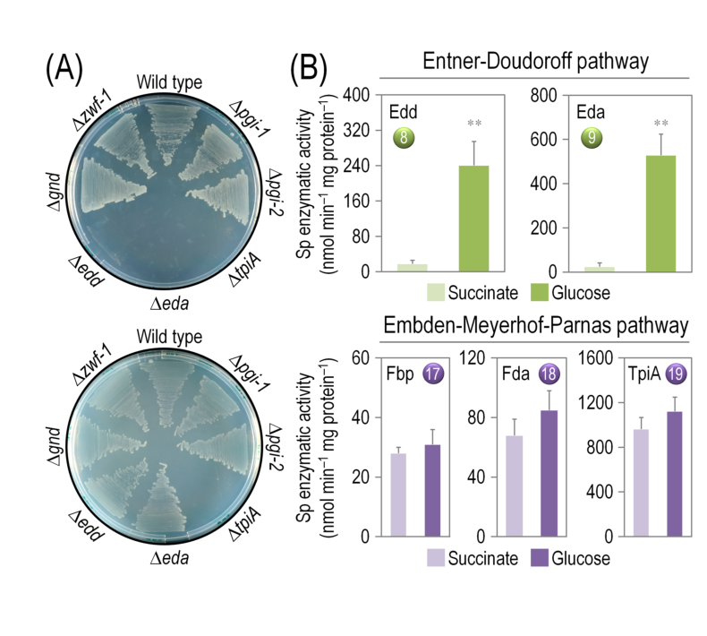

## Question

# Gene Research for Functional Annotation

## ⚠️ CRITICAL: Gene/Protein Identification Context

**BEFORE YOU BEGIN RESEARCH:** You MUST verify you are researching the CORRECT gene/protein. Gene symbols can be ambiguous, especially for less well-characterized genes from non-model organisms.

### Target Gene/Protein Identity (from UniProt):
- **UniProt Accession:** Q88P29
- **Protein Description:** RecName: Full=2-dehydro-3-deoxy-phosphogluconate aldolase {ECO:0000256|ARBA:ARBA00013063}; EC=4.1.2.14 {ECO:0000256|ARBA:ARBA00013063};
- **Gene Information:** Name=eda {ECO:0000313|EMBL:AAN66649.1}; OrderedLocusNames=PP_1024 {ECO:0000313|EMBL:AAN66649.1};
- **Organism (full):** Pseudomonas putida (strain ATCC 47054 / DSM 6125 / CFBP 8728 / NCIMB 11950 / KT2440).
- **Protein Family:** Belongs to the KHG/KDPG aldolase family.
- **Key Domains:** Aldlse_KDPG_KHG. (IPR000887); Aldolase_TIM. (IPR013785); KDPG/KHG_AS_1. (IPR031337); KDPG/KHG_AS_2. (IPR031338); Aldolase (PF01081)

### MANDATORY VERIFICATION STEPS:

1. **Check if the gene symbol "eda" matches the protein description above**
2. **Verify the organism is correct:** Pseudomonas putida (strain ATCC 47054 / DSM 6125 / CFBP 8728 / NCIMB 11950 / KT2440).
3. **Check if protein family/domains align with what you find in literature**
4. **If you find literature for a DIFFERENT gene with the same or similar symbol, STOP**

### If Gene Symbol is Ambiguous or You Cannot Find Relevant Literature:

**DO NOT PROCEED WITH RESEARCH ON A DIFFERENT GENE.** Instead:
- State clearly: "The gene symbol 'eda' is ambiguous or literature is limited for this specific protein"
- Explain what you found (e.g., "Found extensive literature on a different gene with the same symbol in a different organism")
- Describe the protein based ONLY on the UniProt information provided above
- Suggest that the protein function can be inferred from domain/family information

### Research Target:

Please provide a comprehensive research report on the gene **eda** (gene ID: eda, UniProt: Q88P29) in PSEPK.

The research report should be a detailed narrative explaining the function, biological processes, and localization of the gene product. Citations should be given for all claims.

You should prioritize authoritative reviews and primary scientific literature when conducting research. You can supplement
this with annotations you find in gene/protein databases, but these can be outdated or inaccurate.

We are specifically interested in the primary function of the gene - for enzymes, what reaction is catalyzed, and what is the substrate specificity? For transporters, what is the substrate? For structural proteins or adapters, what is the broader structural role? For signaling molecules, what is the role in the pathway.

We are interested in where in or outside the cell the gene product carries out its function.

We are also interested in the signaling or biochemical pathways in which the gene functions. We are less interested in broad pleiotropic effects, except where these elucidate the precise role.

Include evidence where possible. We are interested in both experimental evidence as well as inference from structure, evolution, or bioinformatic analysis. Precise studies should be prioritized over high-throughput, where available.

## Output

Question: You are an expert researcher providing comprehensive, well-cited information.

Provide detailed information focusing on:
1. Key concepts and definitions with current understanding
2. Recent developments and latest research (prioritize 2023-2024 sources)
3. Current applications and real-world implementations
4. Expert opinions and analysis from authoritative sources
5. Relevant statistics and data from recent studies

Format as a comprehensive research report with proper citations. Include URLs and publication dates where available.
Always prioritize recent, authoritative sources and provide specific citations for all major claims.

# Gene Research for Functional Annotation

## ⚠️ CRITICAL: Gene/Protein Identification Context

**BEFORE YOU BEGIN RESEARCH:** You MUST verify you are researching the CORRECT gene/protein. Gene symbols can be ambiguous, especially for less well-characterized genes from non-model organisms.

### Target Gene/Protein Identity (from UniProt):
- **UniProt Accession:** Q88P29
- **Protein Description:** RecName: Full=2-dehydro-3-deoxy-phosphogluconate aldolase {ECO:0000256|ARBA:ARBA00013063}; EC=4.1.2.14 {ECO:0000256|ARBA:ARBA00013063};
- **Gene Information:** Name=eda {ECO:0000313|EMBL:AAN66649.1}; OrderedLocusNames=PP_1024 {ECO:0000313|EMBL:AAN66649.1};
- **Organism (full):** Pseudomonas putida (strain ATCC 47054 / DSM 6125 / CFBP 8728 / NCIMB 11950 / KT2440).
- **Protein Family:** Belongs to the KHG/KDPG aldolase family.
- **Key Domains:** Aldlse_KDPG_KHG. (IPR000887); Aldolase_TIM. (IPR013785); KDPG/KHG_AS_1. (IPR031337); KDPG/KHG_AS_2. (IPR031338); Aldolase (PF01081)

### MANDATORY VERIFICATION STEPS:

1. **Check if the gene symbol "eda" matches the protein description above**
2. **Verify the organism is correct:** Pseudomonas putida (strain ATCC 47054 / DSM 6125 / CFBP 8728 / NCIMB 11950 / KT2440).
3. **Check if protein family/domains align with what you find in literature**
4. **If you find literature for a DIFFERENT gene with the same or similar symbol, STOP**

### If Gene Symbol is Ambiguous or You Cannot Find Relevant Literature:

**DO NOT PROCEED WITH RESEARCH ON A DIFFERENT GENE.** Instead:
- State clearly: "The gene symbol 'eda' is ambiguous or literature is limited for this specific protein"
- Explain what you found (e.g., "Found extensive literature on a different gene with the same symbol in a different organism")
- Describe the protein based ONLY on the UniProt information provided above
- Suggest that the protein function can be inferred from domain/family information

### Research Target:

Please provide a comprehensive research report on the gene **eda** (gene ID: eda, UniProt: Q88P29) in PSEPK.

The research report should be a detailed narrative explaining the function, biological processes, and localization of the gene product. Citations should be given for all claims.

You should prioritize authoritative reviews and primary scientific literature when conducting research. You can supplement
this with annotations you find in gene/protein databases, but these can be outdated or inaccurate.

We are specifically interested in the primary function of the gene - for enzymes, what reaction is catalyzed, and what is the substrate specificity? For transporters, what is the substrate? For structural proteins or adapters, what is the broader structural role? For signaling molecules, what is the role in the pathway.

We are interested in where in or outside the cell the gene product carries out its function.

We are also interested in the signaling or biochemical pathways in which the gene functions. We are less interested in broad pleiotropic effects, except where these elucidate the precise role.

Include evidence where possible. We are interested in both experimental evidence as well as inference from structure, evolution, or bioinformatic analysis. Precise studies should be prioritized over high-throughput, where available.

# Research report: **eda (PP_1024; UniProt Q88P29)** in *Pseudomonas putida* KT2440

## 0) Target verification (mandatory disambiguation)
The gene symbol **eda** can refer to unrelated proteins across organisms. In *Pseudomonas putida* KT2440, **eda is PP_1024** and encodes **2-keto-3-deoxy-6-phosphogluconate (KDPG) aldolase** (EC **4.1.2.14**), consistent with UniProt **Q88P29** and the KHG/KDPG aldolase family annotation. This mapping is explicitly used in KT2440 studies and in operon-level genetic analysis. (petruschka2002analysisofthe pages 1-2, nikel2015pseudomonasputidakt2440 pages 15-17, nikel2014metabolicandregulatory pages 10-12)

## 1) Key concepts and current understanding

### 1.1 Definition and primary biochemical function
**Eda (KDPG aldolase)** catalyzes the defining aldolase step of the Entner–Doudoroff (ED) pathway: **cleavage of KDPG to pyruvate and glyceraldehyde-3-phosphate (GAP/G3P)**. (petruschka2002analysisofthe pages 1-2, fullerton2006mechanismofthe pages 1-2)

This reaction links hexose oxidation (via formation of 6-phosphogluconate and then KDPG) to **central carbon metabolism** by directly generating **pyruvate** and a triose phosphate for lower glycolysis/gluconeogenesis.

### 1.2 Pathway context in *P. putida* KT2440
In KT2440, glucose catabolism is strongly centered on **peripheral oxidation** (periplasmic conversion of glucose to gluconate and 2-ketogluconate with subsequent uptake) feeding into cytosolic metabolism and the ED route. A ^13C-based flux analysis framework described that **>80% of glucose influx** is routed through periplasmic oxidation, and the ED pathway contributes **~50% of the flux to pyruvate formation** under the tested conditions. (nikel2015pseudomonasputidakt2440 pages 6-7)

Thus, Eda (PP_1024) sits at a high-flux node in KT2440’s characteristic glucose-utilization architecture.

### 1.3 Enzyme family, catalytic class, and mechanism (authoritative structural view)
KDPG aldolases occur as **Class I aldolases** (Schiff-base forming) or Class II (metal-dependent). The class I KDPG aldolase mechanism is supported by structural studies showing a **covalent imine (Schiff-base) intermediate** formed by a conserved active-site lysine, with a conserved glutamate acting as the general acid/base via a **water-mediated proton relay**. (fullerton2006mechanismofthe pages 2-3, fullerton2006mechanismofthe pages 1-2, fullerton2006mechanismofthe pages 5-6)

Key mechanistic/structural features of class I KDPG aldolases include:
- **(α/β) barrel (TIM barrel)** fold and **trimeric** assembly. (fullerton2006mechanismofthe pages 2-3)
- Conserved residues and motifs implicated in catalysis/substrate positioning (examples given in the structural work include **Lys129/Lys133**, **Glu40/Glu45**, **Thr156**, **Ser179**, and a highly conserved **Gly157–Gly158 tight-turn motif**). (fullerton2006mechanismofthe pages 3-4, fullerton2006mechanismofthe pages 5-6)
- Structural comparison notes that a **Pseudomonas putida KDPG aldolase** superimposes closely with homologs (reported RMSD ~**1.5 Å**), supporting strong conservation of the catalytic architecture across species. (fullerton2006mechanismofthe pages 2-3)

**Interpretation for annotation:** while these residue numbers derive from specific crystallographic systems in the structural paper, the conserved architecture strongly supports that KT2440 Eda (Q88P29) is a cytosolic class I, lysine-Schiff-base aldolase consistent with its Pfam/InterPro TIM-barrel aldolase family assignment.

## 2) Organism-specific genetics, operon structure, and regulation

### 2.1 Operon structure and carbohydrate induction (classic KT2440 genetics)
In KT2440, **eda is part of the zwf–pgl–eda operon**, and this operon was cloned together with part of the divergently transcribed regulator **hexR**. The operon is **induced by carbohydrates** including glucose, gluconate, fructose, and glycerol. (petruschka2002analysisofthe pages 1-2)

The same study reported that operon transcription in KT2440 was about **3× higher** than in another *P. putida* strain (H), suggesting strain-level differences in expression control of glucose catabolism modules. (petruschka2002analysisofthe pages 1-2)

### 2.2 Carbon-source dependence of eda expression and activity (transcriptomics + enzyme assays)
In KT2440, ED pathway gene expression shows a hierarchy **glucose > glycerol > succinate**. For **eda (PP_1024)** specifically, transcript changes were reported as:
- log2(glycerol/succinate) = **+2.481** (~**5.6×** higher on glycerol than succinate)
- log2(glycerol/glucose) = **−2.852** (glycerol ~0.14 of glucose; glucose ~**7×** higher than glycerol) (nikel2014metabolicandregulatory pages 28-34)

Consistent with transcription, in vitro activities in cell extracts were highest in glucose-grown cells; reported activities included:
- **Eda: 635 ± 141** (activity units reported as “min⁻1 mg protein⁻1” in the excerpt)
- **Edd: 238 ± 46 nmol min⁻1 mg protein⁻1**
and these activities were **2.2-fold (Eda)** and **5.3-fold (Edd)** higher on glucose than on glycerol. (nikel2014metabolicandregulatory pages 10-12)

### 2.3 Latest (2024) regulatory development: GnuR repression of ED/peripheral genes
A 2024 multi-omics study (RNA-seq + ChIP-seq + physiology) identified **GnuR** as a transcriptional repressor that directly represses genes for **glucose/gluconate catabolism**, including genes classified in the ED pathway group such as **eda (PP_1024)**. (chen2024gnurrepressesthe pages 1-3, chen2024gnurrepressesthe pages 4-6)

Key findings relevant to eda include:
- ED genes (including **eda**) were **similarly induced by glucose and gluconate** in RT-qPCR comparisons (vs succinate) and remained in the same induction group even in a **gcd** mutant (used to separate glucose effects from gluconate formed by oxidation). (chen2024gnurrepressesthe pages 4-6)
- ChIP-seq detected binding near eda, with **MACS2 fold enrichment ~1.74** at the eda locus (modest relative to some other loci). (chen2024gnurrepressesthe pages 8-10)
- Physiologically, **ΔgnuR shortened lag time** when switching from rich medium to minimal medium with **22 mM glucose** or **4 mM gluconate**, while exponential growth rates were not significantly changed under those tested conditions. (chen2024gnurrepressesthe pages 8-10)
- The authors propose an **incoherent feedforward loop**, where glucose/gluconate induce both catabolic genes and gnuR, and induced GnuR then represses those genes. (chen2024gnurrepressesthe pages 8-10)

**Interpretation:** This positions eda within a recently clarified regulatory layer coupling substrate availability (glucose/gluconate) to repression dynamics that can shape transitions (lag) rather than steady-state growth rate.

## 3) Cellular localization and site of action
No direct subcellular localization assay for KT2440 Eda was identified in the retrieved evidence snippets. However, the functional placement of Eda in the ED pathway (acting on **KDPG**, a cytosolic phosphorylated intermediate formed from 6-phosphogluconate) and the separation of periplasmic oxidation from cytosolic catabolism in KT2440’s glucose architecture support that Eda operates in the **cytosol** rather than in the periplasm. (nikel2015pseudomonasputidakt2440 pages 6-7, nikel2015pseudomonasputidakt2440 pages 15-17)

## 4) Phenotypes and functional necessity in vivo (KT2440)

### 4.1 eda is required for growth on glucose
A KT2440 **eda::mini-Tn5** mutant **failed to grow on glucose**, consistent with ED pathway indispensability for glucose utilization in this organism. (nikel2014metabolicandregulatory pages 10-12)

### 4.2 Growth on non-glucose substrates
The same eda mutant exhibited slow but detectable growth on other carbon sources:
- **µ = 0.21 ± 0.05 h⁻1** on glycerol
- **µ = 0.34 ± 0.02 h⁻1** on succinate (nikel2014metabolicandregulatory pages 10-12)

This indicates eda is conditionally essential—critical for hexose catabolism via ED, but not universally essential for all growth.

### 4.3 Visual evidence from a key KT2440 study (growth + enzyme activities)
A figure from the KT2440 glucose catabolism cycle study includes the **eda mutant growth comparison** (glycolytic vs gluconeogenic conditions) and **in vitro Eda/Edd activity comparisons** under glucose vs succinate growth conditions, supporting the central role of Eda in glycolytic growth and its measurable activity in extracts. (nikel2015pseudomonasputidakt2440 media e4c6a093)

## 5) Substrate specificity (KDPG vs KHG) and functional annotation caveats
The UniProt/domain context and one KT2440 paper’s annotation terminology reflect that Eda belongs to the **KDPG/KHG aldolase family** (sometimes annotated as ketodeoxyphosphogluconate/ketohydroxyglutarate aldolase). (nikel2014metabolicandregulatory pages 28-34)

However, within the retrieved KT2440-focused evidence, **no direct biochemical specificity measurements** (e.g., Km/kcat comparison for KDPG versus KHG) were captured. The strongest organism-specific functional evidence therefore supports the canonical **KDPG aldolase activity in ED pathway**, while KHG-related activity remains **inference from family membership/annotations** rather than KT2440-specific measured specificity in the currently retrieved sources. (nikel2014metabolicandregulatory pages 28-34, petruschka2002analysisofthe pages 1-2)

## 6) Current applications and real-world implementations (with emphasis on recent work)

### 6.1 Biotechnology chassis relevance
*P. putida* KT2440 is widely used as a metabolic engineering chassis, and its characteristic reliance on the ED route makes enzymes like Eda central control points for carbon routing and redox balance. The flux quantification showing heavy reliance on peripheral oxidation and substantial ED contribution to pyruvate provides the quantitative metabolic rationale for why ED enzymes are often considered important levers in KT2440 engineering. (nikel2015pseudomonasputidakt2440 pages 6-7)

### 6.2 Recent (2024) regulation knowledge as an engineering handle
The identification of **GnuR** as a repressor of ED/peripheral catabolic genes provides a potential regulatory knob for tuning glucose/gluconate catabolism—particularly affecting transition dynamics (lag) upon switching to these substrates. (chen2024gnurrepressesthe pages 8-10)

## 7) Summary of key statistics (recent and classic)
- **Reaction:** KDPG → pyruvate + GAP (petruschka2002analysisofthe pages 1-2)
- **Flux architecture in KT2440 (glucose):** >80% glucose influx via periplasmic oxidation; ED pathway contributes ~50% of flux to pyruvate (nikel2015pseudomonasputidakt2440 pages 6-7)
- **eda transcript carbon-source dependence:** log2(glycerol/succinate)=+2.481 (~5.6×); log2(glycerol/glucose)=−2.852 (glucose ~7× higher than glycerol) (nikel2014metabolicandregulatory pages 28-34)
- **Eda activity (extracts):** 635 ± 141 (reported units as in excerpt); ~2.2× higher on glucose than glycerol (nikel2014metabolicandregulatory pages 10-12)
- **eda mutant phenotype (KT2440):** no growth on glucose; growth on glycerol (µ=0.21±0.05 h⁻1) and succinate (µ=0.34±0.02 h⁻1) (nikel2014metabolicandregulatory pages 10-12)
- **2024 regulation:** GnuR binds near eda (ChIP-seq enrichment ~1.74) and ΔgnuR reduces lag on 22 mM glucose / 4 mM gluconate (chen2024gnurrepressesthe pages 8-10)

## Evidence map (table)
The table below compiles the core claims, quantitative values, and their supporting sources.

| Claim/Aspect | Key finding | Quantitative data (if any) | Source (with year, DOI/URL) |
|---|---|---|---|
| Identity | The target gene in *Pseudomonas putida* KT2440 is **eda = PP_1024**, annotated as **2-keto-3-deoxy-6-phosphogluconate (KDPG) aldolase / 2-keto-3-deoxygluconate-6-P aldolase**, matching UniProt Q88P29. (nikel2014metabolicandregulatory pages 10-12, petruschka2002analysisofthe pages 1-2, nikel2015pseudomonasputidakt2440 pages 15-17) | Locus: **PP_1024** | Nikel et al., 2014, *Environ. Microbiol.*, doi:10.1111/1462-2920.12224, https://doi.org/10.1111/1462-2920.12224; Petruschka et al., 2002, *FEMS Microbiol. Lett.*, doi:10.1016/S0378-1097(02)00923-0, https://doi.org/10.1016/S0378-1097(02)00923-0; Nikel et al., 2015, *J. Biol. Chem.*, doi:10.1074/jbc.M115.687749, https://doi.org/10.1074/jbc.M115.687749 |
| Reaction | Eda catalyzes cleavage of **KDPG** to **pyruvate + glyceraldehyde-3-phosphate (G3P/GAP)**, the defining aldolase step of the Entner–Doudoroff pathway. (petruschka2002analysisofthe pages 1-2, fullerton2006mechanismofthe pages 1-2) | Products formed in equimolar terms from KDPG cleavage: pyruvate and GAP | Petruschka et al., 2002, *FEMS Microbiol. Lett.*, doi:10.1016/S0378-1097(02)00923-0, https://doi.org/10.1016/S0378-1097(02)00923-0; Fullerton et al., 2006, *Bioorg. Med. Chem.*, doi:10.1016/j.bmc.2005.12.022, https://doi.org/10.1016/j.bmc.2005.12.022 |
| Pathway role | In KT2440, Eda is a central **Entner–Doudoroff (ED) pathway** enzyme downstream of Edd; glucose catabolism relies strongly on peripheral oxidation to gluconate/2-ketogluconate feeding the ED route. (nikel2015pseudomonasputidakt2440 pages 6-7, nikel2015pseudomonasputidakt2440 pages 15-17) | **>80%** of glucose influx routed through periplasmic oxidation; ED pathway contributes **~50%** of flux to pyruvate formation. | Nikel et al., 2015, *J. Biol. Chem.*, doi:10.1074/jbc.M115.687749, https://doi.org/10.1074/jbc.M115.687749 |
| Operon/regulation | Early genetic analysis placed **eda** in the **zwf-pgl-eda operon**; the divergently transcribed regulator **hexR** lies nearby. The operon is induced by carbohydrates including glucose, gluconate, fructose, and glycerol. (petruschka2002analysisofthe pages 1-2) | Operon transcription in KT2440 reported about **3-fold higher** than in strain H. | Petruschka et al., 2002, *FEMS Microbiol. Lett.*, doi:10.1016/S0378-1097(02)00923-0, https://doi.org/10.1016/S0378-1097(02)00923-0 |
| Localization | No direct localization experiment for Eda was captured in the gathered snippets, but the pathway context places Eda in the **cytoplasmic ED pathway** after transport/phosphorylation/periplasmic oxidation steps; no evidence supports periplasmic or extracellular localization in the cited snippets. (nikel2015pseudomonasputidakt2440 pages 6-7, nikel2015pseudomonasputidakt2440 pages 15-17) | Not directly quantified | Nikel et al., 2015, *J. Biol. Chem.*, doi:10.1074/jbc.M115.687749, https://doi.org/10.1074/jbc.M115.687749 |
| Mutant phenotype | An **eda::mini-Tn5** mutant in KT2440 **failed to grow on glucose**, but still showed slow growth on glycerol and succinate, supporting essentiality for hexose catabolism through ED. (nikel2014metabolicandregulatory pages 10-12) | Growth rates of mutant: **0.21 ± 0.05 h⁻¹** on glycerol; **0.34 ± 0.02 h⁻¹** on succinate; no growth on glucose. | Nikel et al., 2014, *Environ. Microbiol.*, doi:10.1111/1462-2920.12224, https://doi.org/10.1111/1462-2920.12224 |
| Enzyme activity/expression | Eda activity is highest in glucose-grown cells and lower on glycerol/succinate, consistent with carbon-source-dependent ED pathway usage. Transcript data show **glucose > glycerol > succinate** expression hierarchy for ED genes including **eda**. (nikel2014metabolicandregulatory pages 10-12, nikel2014metabolicandregulatory pages 28-34) | Eda activity in glucose-grown cells: **635 ± 141 min⁻¹ mg protein⁻¹**; **2.2-fold** higher on glucose than glycerol. Transcript change for **eda**: log2(glycerol/succinate) **+2.481** (~**5.6-fold**), log2(glycerol/glucose) **−2.852** (glucose ~**7-fold** higher than glycerol). | Nikel et al., 2014, *Environ. Microbiol.*, doi:10.1111/1462-2920.12224, https://doi.org/10.1111/1462-2920.12224 |
| Recent 2024 regulation | A 2024 multi-omics study identified **GnuR** as a direct **repressor** of glucose/gluconate catabolic genes, including ED-pathway genes such as **eda**. ED genes were induced by both glucose and gluconate, and GnuR participates in an incoherent feedforward loop. (chen2024gnurrepressesthe pages 8-10, chen2024gnurrepressesthe pages 4-6, chen2024gnurrepressesthe pages 3-4, chen2024gnurrepressesthe pages 1-3) | **eda** was among GnuR-bound loci; ChIP-seq MACS2 fold enrichment for **eda = 1.74**. Physiologically, **ΔgnuR** shortened lag time on **22 mM glucose** or **4 mM gluconate**, with no significant change in exponential growth rate. Some glucose/gluconate catabolic genes increased **almost 100-fold** vs succinate. | Chen et al., 2024, *Microbial Biotechnology*, doi:10.1111/1751-7915.70059, https://doi.org/10.1111/1751-7915.70059 |
| Catalytic mechanism / family support | Broader structural work on class I KDPG aldolases supports annotation of Eda as a **Class I Schiff-base aldolase** with a conserved catalytic lysine/glutamate-centered mechanism; *P. putida* enzyme structure superimposes closely with homologs. (fullerton2006mechanismofthe pages 3-4, fullerton2006mechanismofthe pages 2-3, fullerton2006mechanismofthe pages 5-6, fullerton2006mechanismofthe pages 4-5) | *P. putida* enzyme superimposes with homologs at about **1.5 Å RMSD**; key residues discussed include Lys129/Lys133, Glu40/Glu45, Thr156, Ser179, and conserved waters. | Fullerton et al., 2006, *Bioorg. Med. Chem.*, doi:10.1016/j.bmc.2005.12.022, https://doi.org/10.1016/j.bmc.2005.12.022 |

*Table: This table compiles organism-specific and family-level evidence supporting the functional annotation of *Pseudomonas putida* KT2440 eda (PP_1024; UniProt Q88P29). It highlights identity, reaction, pathway placement, regulation, phenotype, and quantitative evidence most relevant for a research report.*

## References (URLs and publication dates)
- Petruschka L. et al. **2002-09**. “Analysis of the zwf-pgl-eda-operon in *Pseudomonas putida* strains H and KT2440.” *FEMS Microbiology Letters*. https://doi.org/10.1016/S0378-1097(02)00923-0 (petruschka2002analysisofthe pages 1-2)
- Nikel P.I. et al. **2014-08**. “Metabolic and regulatory rearrangements underlying glycerol metabolism in *Pseudomonas putida* KT2440.” *Environmental Microbiology*. https://doi.org/10.1111/1462-2920.12224 (nikel2014metabolicandregulatory pages 10-12, nikel2014metabolicandregulatory pages 28-34)
- Nikel P.I. et al. **2015-10**. “*Pseudomonas putida* KT2440 strain metabolizes glucose through a cycle formed by enzymes of the ED, EMP, and PP pathways.” *Journal of Biological Chemistry*. https://doi.org/10.1074/jbc.M115.687749 (nikel2015pseudomonasputidakt2440 pages 6-7, nikel2015pseudomonasputidakt2440 pages 15-17, nikel2015pseudomonasputidakt2440 media e4c6a093)
- Fullerton S.W.B. et al. **2006-05**. “Mechanism of the Class I KDPG aldolase.” *Bioorganic & Medicinal Chemistry*. https://doi.org/10.1016/j.bmc.2005.12.022 (fullerton2006mechanismofthe pages 3-4, fullerton2006mechanismofthe pages 2-3, fullerton2006mechanismofthe pages 5-6, fullerton2006mechanismofthe pages 1-2, fullerton2006mechanismofthe pages 4-5)
- Chen W. et al. **2024-11**. “GnuR Represses the Expression of Glucose and Gluconate Catabolism in *Pseudomonas putida* KT2440.” *Microbial Biotechnology*. https://doi.org/10.1111/1751-7915.70059 (chen2024gnurrepressesthe pages 8-10, chen2024gnurrepressesthe pages 4-6, chen2024gnurrepressesthe pages 3-4, chen2024gnurrepressesthe pages 1-3)

## Limitations of the current retrieval (explicit)
- **Substrate specificity (KDPG vs KHG)**: family membership/annotations suggest possible broader aldolase activity, but **direct KT2440 biochemical specificity constants** (Km/kcat for KDPG vs KHG) were **not present** in the retrieved evidence snippets; additional targeted biochemical literature retrieval would be required to support substrate-specificity claims beyond KDPG cleavage. (nikel2014metabolicandregulatory pages 28-34)

References

1. (petruschka2002analysisofthe pages 1-2): L. Petruschka, K. Adolf, G. Burchhardt, J. Dernedde, Jana Jürgensen, and H. Herrmann. Analysis of the zwf-pgl-eda-operon in pseudomonas putida strains h and kt2440. FEMS Microbiology Letters, 215:89-95, Sep 2002. URL: https://doi.org/10.1016/s0378-1097(02)00923-0, doi:10.1016/s0378-1097(02)00923-0. This article has 30 citations and is from a peer-reviewed journal.

2. (nikel2015pseudomonasputidakt2440 pages 15-17): Pablo I. Nikel, Max Chavarría, Tobias Fuhrer, Uwe Sauer, and Víctor de Lorenzo. Pseudomonas putida kt2440 strain metabolizes glucose through a cycle formed by enzymes of the entner-doudoroff, embden-meyerhof-parnas, and pentose phosphate pathways. Journal of Biological Chemistry, 290:25920-25932, Oct 2015. URL: https://doi.org/10.1074/jbc.m115.687749, doi:10.1074/jbc.m115.687749. This article has 439 citations and is from a domain leading peer-reviewed journal.

3. (nikel2014metabolicandregulatory pages 10-12): Pablo I. Nikel, Juhyun Kim, and Víctor de Lorenzo. Metabolic and regulatory rearrangements underlying glycerol metabolism in pseudomonas putida kt2440. Environmental microbiology, 16 1:239-54, Aug 2014. URL: https://doi.org/10.1111/1462-2920.12224, doi:10.1111/1462-2920.12224. This article has 147 citations and is from a domain leading peer-reviewed journal.

4. (fullerton2006mechanismofthe pages 1-2): Stephen W.B. Fullerton, Jennifer S. Griffiths, Alexandra B. Merkel, Manoj Cheriyan, Nathan J. Wymer, Michael J. Hutchins, Carol A. Fierke, Eric J. Toone, and James H. Naismith. Mechanism of the class i kdpg aldolase. Bioorganic &amp; Medicinal Chemistry, 14:3002-3010, May 2006. URL: https://doi.org/10.1016/j.bmc.2005.12.022, doi:10.1016/j.bmc.2005.12.022. This article has 86 citations and is from a peer-reviewed journal.

5. (nikel2015pseudomonasputidakt2440 pages 6-7): Pablo I. Nikel, Max Chavarría, Tobias Fuhrer, Uwe Sauer, and Víctor de Lorenzo. Pseudomonas putida kt2440 strain metabolizes glucose through a cycle formed by enzymes of the entner-doudoroff, embden-meyerhof-parnas, and pentose phosphate pathways. Journal of Biological Chemistry, 290:25920-25932, Oct 2015. URL: https://doi.org/10.1074/jbc.m115.687749, doi:10.1074/jbc.m115.687749. This article has 439 citations and is from a domain leading peer-reviewed journal.

6. (fullerton2006mechanismofthe pages 2-3): Stephen W.B. Fullerton, Jennifer S. Griffiths, Alexandra B. Merkel, Manoj Cheriyan, Nathan J. Wymer, Michael J. Hutchins, Carol A. Fierke, Eric J. Toone, and James H. Naismith. Mechanism of the class i kdpg aldolase. Bioorganic &amp; Medicinal Chemistry, 14:3002-3010, May 2006. URL: https://doi.org/10.1016/j.bmc.2005.12.022, doi:10.1016/j.bmc.2005.12.022. This article has 86 citations and is from a peer-reviewed journal.

7. (fullerton2006mechanismofthe pages 5-6): Stephen W.B. Fullerton, Jennifer S. Griffiths, Alexandra B. Merkel, Manoj Cheriyan, Nathan J. Wymer, Michael J. Hutchins, Carol A. Fierke, Eric J. Toone, and James H. Naismith. Mechanism of the class i kdpg aldolase. Bioorganic &amp; Medicinal Chemistry, 14:3002-3010, May 2006. URL: https://doi.org/10.1016/j.bmc.2005.12.022, doi:10.1016/j.bmc.2005.12.022. This article has 86 citations and is from a peer-reviewed journal.

8. (fullerton2006mechanismofthe pages 3-4): Stephen W.B. Fullerton, Jennifer S. Griffiths, Alexandra B. Merkel, Manoj Cheriyan, Nathan J. Wymer, Michael J. Hutchins, Carol A. Fierke, Eric J. Toone, and James H. Naismith. Mechanism of the class i kdpg aldolase. Bioorganic &amp; Medicinal Chemistry, 14:3002-3010, May 2006. URL: https://doi.org/10.1016/j.bmc.2005.12.022, doi:10.1016/j.bmc.2005.12.022. This article has 86 citations and is from a peer-reviewed journal.

9. (nikel2014metabolicandregulatory pages 28-34): Pablo I. Nikel, Juhyun Kim, and Víctor de Lorenzo. Metabolic and regulatory rearrangements underlying glycerol metabolism in pseudomonas putida kt2440. Environmental microbiology, 16 1:239-54, Aug 2014. URL: https://doi.org/10.1111/1462-2920.12224, doi:10.1111/1462-2920.12224. This article has 147 citations and is from a domain leading peer-reviewed journal.

10. (chen2024gnurrepressesthe pages 1-3): Wenbo Chen, Rao Ma, Yong Feng, Yunzhu Xiao, Agnieszka Sekowska, Antoine Danchin, and Conghui You. Gnur represses the expression of glucose and gluconate catabolism in pseudomonas putida kt2440. Microbial Biotechnology, Nov 2024. URL: https://doi.org/10.1111/1751-7915.70059, doi:10.1111/1751-7915.70059. This article has 2 citations and is from a peer-reviewed journal.

11. (chen2024gnurrepressesthe pages 4-6): Wenbo Chen, Rao Ma, Yong Feng, Yunzhu Xiao, Agnieszka Sekowska, Antoine Danchin, and Conghui You. Gnur represses the expression of glucose and gluconate catabolism in pseudomonas putida kt2440. Microbial Biotechnology, Nov 2024. URL: https://doi.org/10.1111/1751-7915.70059, doi:10.1111/1751-7915.70059. This article has 2 citations and is from a peer-reviewed journal.

12. (chen2024gnurrepressesthe pages 8-10): Wenbo Chen, Rao Ma, Yong Feng, Yunzhu Xiao, Agnieszka Sekowska, Antoine Danchin, and Conghui You. Gnur represses the expression of glucose and gluconate catabolism in pseudomonas putida kt2440. Microbial Biotechnology, Nov 2024. URL: https://doi.org/10.1111/1751-7915.70059, doi:10.1111/1751-7915.70059. This article has 2 citations and is from a peer-reviewed journal.

13. (nikel2015pseudomonasputidakt2440 media e4c6a093): Pablo I. Nikel, Max Chavarría, Tobias Fuhrer, Uwe Sauer, and Víctor de Lorenzo. Pseudomonas putida kt2440 strain metabolizes glucose through a cycle formed by enzymes of the entner-doudoroff, embden-meyerhof-parnas, and pentose phosphate pathways. Journal of Biological Chemistry, 290:25920-25932, Oct 2015. URL: https://doi.org/10.1074/jbc.m115.687749, doi:10.1074/jbc.m115.687749. This article has 439 citations and is from a domain leading peer-reviewed journal.

14. (chen2024gnurrepressesthe pages 3-4): Wenbo Chen, Rao Ma, Yong Feng, Yunzhu Xiao, Agnieszka Sekowska, Antoine Danchin, and Conghui You. Gnur represses the expression of glucose and gluconate catabolism in pseudomonas putida kt2440. Microbial Biotechnology, Nov 2024. URL: https://doi.org/10.1111/1751-7915.70059, doi:10.1111/1751-7915.70059. This article has 2 citations and is from a peer-reviewed journal.

15. (fullerton2006mechanismofthe pages 4-5): Stephen W.B. Fullerton, Jennifer S. Griffiths, Alexandra B. Merkel, Manoj Cheriyan, Nathan J. Wymer, Michael J. Hutchins, Carol A. Fierke, Eric J. Toone, and James H. Naismith. Mechanism of the class i kdpg aldolase. Bioorganic &amp; Medicinal Chemistry, 14:3002-3010, May 2006. URL: https://doi.org/10.1016/j.bmc.2005.12.022, doi:10.1016/j.bmc.2005.12.022. This article has 86 citations and is from a peer-reviewed journal.

## Artifacts

- [Edison artifact artifact-00](eda-deep-research-falcon_artifacts/artifact-00.md)

## Citations

1. fullerton2006mechanismofthe pages 2-3
2. petruschka2002analysisofthe pages 1-2
3. nikel2014metabolicandregulatory pages 28-34
4. nikel2014metabolicandregulatory pages 10-12
5. chen2024gnurrepressesthe pages 4-6
6. chen2024gnurrepressesthe pages 8-10
7. fullerton2006mechanismofthe pages 1-2
8. fullerton2006mechanismofthe pages 5-6
9. fullerton2006mechanismofthe pages 3-4
10. chen2024gnurrepressesthe pages 1-3
11. chen2024gnurrepressesthe pages 3-4
12. fullerton2006mechanismofthe pages 4-5
13. https://doi.org/10.1111/1462-2920.12224;
14. https://doi.org/10.1016/S0378-1097(02
15. https://doi.org/10.1074/jbc.M115.687749
16. https://doi.org/10.1016/j.bmc.2005.12.022
17. https://doi.org/10.1111/1462-2920.12224
18. https://doi.org/10.1111/1751-7915.70059
19. https://doi.org/10.1016/s0378-1097(02
20. https://doi.org/10.1074/jbc.m115.687749,
21. https://doi.org/10.1111/1462-2920.12224,
22. https://doi.org/10.1016/j.bmc.2005.12.022,
23. https://doi.org/10.1111/1751-7915.70059,