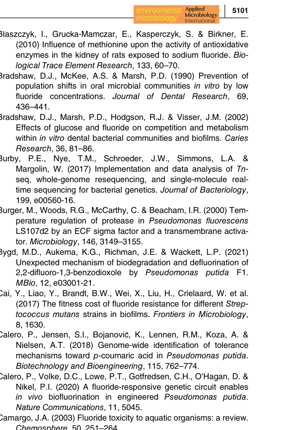

## Question

# Gene Research for Functional Annotation

## ⚠️ CRITICAL: Gene/Protein Identification Context

**BEFORE YOU BEGIN RESEARCH:** You MUST verify you are researching the CORRECT gene/protein. Gene symbols can be ambiguous, especially for less well-characterized genes from non-model organisms.

### Target Gene/Protein Identity (from UniProt):
- **UniProt Accession:** Q88MF9
- **Protein Description:** RecName: Full=Enolase {ECO:0000255|HAMAP-Rule:MF_00318}; EC=4.2.1.11 {ECO:0000255|HAMAP-Rule:MF_00318}; AltName: Full=2-phospho-D-glycerate hydro-lyase {ECO:0000255|HAMAP-Rule:MF_00318}; AltName: Full=2-phosphoglycerate dehydratase {ECO:0000255|HAMAP-Rule:MF_00318};
- **Gene Information:** Name=eno {ECO:0000255|HAMAP-Rule:MF_00318}; OrderedLocusNames=PP_1612;
- **Organism (full):** Pseudomonas putida (strain ATCC 47054 / DSM 6125 / CFBP 8728 / NCIMB 11950 / KT2440).
- **Protein Family:** Belongs to the enolase family. {ECO:0000255|HAMAP-
- **Key Domains:** Enolase. (IPR000941); Enolase-like_C_sf. (IPR036849); Enolase-like_N. (IPR029017); Enolase_C. (IPR020810); Enolase_CS. (IPR020809)

### MANDATORY VERIFICATION STEPS:

1. **Check if the gene symbol "eno" matches the protein description above**
2. **Verify the organism is correct:** Pseudomonas putida (strain ATCC 47054 / DSM 6125 / CFBP 8728 / NCIMB 11950 / KT2440).
3. **Check if protein family/domains align with what you find in literature**
4. **If you find literature for a DIFFERENT gene with the same or similar symbol, STOP**

### If Gene Symbol is Ambiguous or You Cannot Find Relevant Literature:

**DO NOT PROCEED WITH RESEARCH ON A DIFFERENT GENE.** Instead:
- State clearly: "The gene symbol 'eno' is ambiguous or literature is limited for this specific protein"
- Explain what you found (e.g., "Found extensive literature on a different gene with the same symbol in a different organism")
- Describe the protein based ONLY on the UniProt information provided above
- Suggest that the protein function can be inferred from domain/family information

### Research Target:

Please provide a comprehensive research report on the gene **eno** (gene ID: eno, UniProt: Q88MF9) in PSEPK.

The research report should be a detailed narrative explaining the function, biological processes, and localization of the gene product. Citations should be given for all claims.

You should prioritize authoritative reviews and primary scientific literature when conducting research. You can supplement
this with annotations you find in gene/protein databases, but these can be outdated or inaccurate.

We are specifically interested in the primary function of the gene - for enzymes, what reaction is catalyzed, and what is the substrate specificity? For transporters, what is the substrate? For structural proteins or adapters, what is the broader structural role? For signaling molecules, what is the role in the pathway.

We are interested in where in or outside the cell the gene product carries out its function.

We are also interested in the signaling or biochemical pathways in which the gene functions. We are less interested in broad pleiotropic effects, except where these elucidate the precise role.

Include evidence where possible. We are interested in both experimental evidence as well as inference from structure, evolution, or bioinformatic analysis. Precise studies should be prioritized over high-throughput, where available.

## Output

Question: You are an expert researcher providing comprehensive, well-cited information.

Provide detailed information focusing on:
1. Key concepts and definitions with current understanding
2. Recent developments and latest research (prioritize 2023-2024 sources)
3. Current applications and real-world implementations
4. Expert opinions and analysis from authoritative sources
5. Relevant statistics and data from recent studies

Format as a comprehensive research report with proper citations. Include URLs and publication dates where available.
Always prioritize recent, authoritative sources and provide specific citations for all major claims.

# Gene Research for Functional Annotation

## ⚠️ CRITICAL: Gene/Protein Identification Context

**BEFORE YOU BEGIN RESEARCH:** You MUST verify you are researching the CORRECT gene/protein. Gene symbols can be ambiguous, especially for less well-characterized genes from non-model organisms.

### Target Gene/Protein Identity (from UniProt):
- **UniProt Accession:** Q88MF9
- **Protein Description:** RecName: Full=Enolase {ECO:0000255|HAMAP-Rule:MF_00318}; EC=4.2.1.11 {ECO:0000255|HAMAP-Rule:MF_00318}; AltName: Full=2-phospho-D-glycerate hydro-lyase {ECO:0000255|HAMAP-Rule:MF_00318}; AltName: Full=2-phosphoglycerate dehydratase {ECO:0000255|HAMAP-Rule:MF_00318};
- **Gene Information:** Name=eno {ECO:0000255|HAMAP-Rule:MF_00318}; OrderedLocusNames=PP_1612;
- **Organism (full):** Pseudomonas putida (strain ATCC 47054 / DSM 6125 / CFBP 8728 / NCIMB 11950 / KT2440).
- **Protein Family:** Belongs to the enolase family. {ECO:0000255|HAMAP-
- **Key Domains:** Enolase. (IPR000941); Enolase-like_C_sf. (IPR036849); Enolase-like_N. (IPR029017); Enolase_C. (IPR020810); Enolase_CS. (IPR020809)

### MANDATORY VERIFICATION STEPS:

1. **Check if the gene symbol "eno" matches the protein description above**
2. **Verify the organism is correct:** Pseudomonas putida (strain ATCC 47054 / DSM 6125 / CFBP 8728 / NCIMB 11950 / KT2440).
3. **Check if protein family/domains align with what you find in literature**
4. **If you find literature for a DIFFERENT gene with the same or similar symbol, STOP**

### If Gene Symbol is Ambiguous or You Cannot Find Relevant Literature:

**DO NOT PROCEED WITH RESEARCH ON A DIFFERENT GENE.** Instead:
- State clearly: "The gene symbol 'eno' is ambiguous or literature is limited for this specific protein"
- Explain what you found (e.g., "Found extensive literature on a different gene with the same symbol in a different organism")
- Describe the protein based ONLY on the UniProt information provided above
- Suggest that the protein function can be inferred from domain/family information

### Research Target:

Please provide a comprehensive research report on the gene **eno** (gene ID: eno, UniProt: Q88MF9) in PSEPK.

The research report should be a detailed narrative explaining the function, biological processes, and localization of the gene product. Citations should be given for all claims.

You should prioritize authoritative reviews and primary scientific literature when conducting research. You can supplement
this with annotations you find in gene/protein databases, but these can be outdated or inaccurate.

We are specifically interested in the primary function of the gene - for enzymes, what reaction is catalyzed, and what is the substrate specificity? For transporters, what is the substrate? For structural proteins or adapters, what is the broader structural role? For signaling molecules, what is the role in the pathway.

We are interested in where in or outside the cell the gene product carries out its function.

We are also interested in the signaling or biochemical pathways in which the gene functions. We are less interested in broad pleiotropic effects, except where these elucidate the precise role.

Include evidence where possible. We are interested in both experimental evidence as well as inference from structure, evolution, or bioinformatic analysis. Precise studies should be prioritized over high-throughput, where available.

## Research report: Functional annotation of **eno** (enolase; UniProt Q88MF9; locus **PP_1612**) in *Pseudomonas putida* KT2440

### 0) Scope and identity verification (critical)
The UniProt target (**Q88MF9**) is annotated as **enolase** (EC **4.2.1.11**), a member of the **enolase family**, encoded by gene symbol **eno** with ordered locus name **PP_1612** in *Pseudomonas putida* KT2440. The organism context is consistent across *P. putida* KT2440 systems biology studies that explicitly discuss enolase activity and its perturbation in vivo (e.g., under fluoride stress), supporting that the intended target is the canonical central-carbon enolase in this strain rather than a different “eno” gene from another species. (calero2022roleofthe pages 17-19, lorenzo2024pseudomonasputidakt2440 pages 4-7)

### 1) Key concepts and definitions (current understanding)

#### 1.1 Enolase (EC 4.2.1.11): canonical biochemical function
Enolase is a glycolysis/gluconeogenesis enzyme that catalyzes the reversible dehydration of **2-phosphoglycerate (2-PG)** to **phosphoenolpyruvate (PEP)** (2-PG ⇄ PEP). This canonical reaction is explicitly stated in recent literature summaries and experimental studies discussing enolase across taxa. (stockbridge2024thelinkbetween pages 5-6, o’kelly2024moonlightingonthe pages 1-2)

**Reaction and substrate specificity.** The best-supported substrate/product pair for bacterial enolase is 2-PG ⇄ PEP, a highly conserved reaction in carbohydrate metabolism. In *P. putida* KT2440, depletion of **PEP** under fluoride stress is interpreted as consistent with impaired throughput of this exact step. (calero2022roleofthe pages 17-19)

#### 1.2 Central carbon metabolism architecture in *P. putida* KT2440 (EDEMP)
A defining concept for functional interpretation in *P. putida* KT2440 is that glucose catabolism is not a simple linear Embden–Meyerhof–Parnas (EMP) pathway. Instead, KT2440 runs a cyclic architecture merging reactions from **Entner–Doudoroff (ED)**, **pentose phosphate pathway (PPP)**, and parts of EMP—often referred to as the **EDEMP cycle**—which supports high **NADPH** regeneration (redox robustness) at the expense of ATP relative to some organisms. (lorenzo2024pseudomonasputidakt2440 pages 2-4, nikel2014biotechnologicaldomesticationof pages 5-6)

Within this network, the enolase step is part of the lower-glycolytic conversion sequence required to generate PEP (and thereby couple carbohydrate breakdown to pyruvate/acetyl-CoA supply and anabolic precursor routing). This positions **eno (PP_1612)** as a core node influencing PEP availability and downstream flux distribution in a chassis optimized for stress endurance and redox supply. (lorenzo2024pseudomonasputidakt2440 pages 4-7, lorenzo2024pseudomonasputidakt2440 pages 2-4)

#### 1.3 “Moonlighting proteins/enzymes” (definition and why it matters)
“Moonlighting” refers to a single protein carrying out **multiple distinct functions** that are not due to gene fusion, splice variants, or simple catalytic promiscuity alone; the concept is closely related to “gene sharing,” where a gene acquires a second function without losing the original function. (gupta2023moonlightingenzymeswhen pages 2-3)

A recurring caution in functional annotation is that **moonlighting functions are often context- and organism-dependent**. While enolase is a well-known moonlighter in many pathogens (e.g., surface exposure and host-protein binding), such roles should not be assumed for *P. putida* KT2440 without direct evidence. (satala2023therecruitmentand pages 7-8, gupta2023moonlightingenzymeswhen pages 14-15)

### 2) Organism-specific function and pathway role in *P. putida* KT2440

#### 2.1 Primary biological role
In KT2440, **eno/PP_1612** encodes the canonical enolase required for central carbon metabolism, supplying **PEP** from 2-PG in glycolysis/gluconeogenesis. (calero2022roleofthe pages 17-19, lorenzo2024pseudomonasputidakt2440 pages 2-4)

#### 2.2 Cellular localization
No direct KT2440-specific localization experiment for PP_1612 enolase was retrieved in the accessible evidence set. Given the enzyme’s canonical role and the nature of the studies citing its activity, the best-supported annotation for KT2440 is that enolase functions primarily as a **cytosolic metabolic enzyme**. (calero2022roleofthe pages 17-19, lorenzo2024pseudomonasputidakt2440 pages 2-4)

#### 2.3 Essentiality
No KT2440-specific essentiality measurement for **PP_1612/eno** was retrieved in the evidence set, so essentiality should be treated as **unresolved here**. (tokic2020largescalekineticmetabolic pages 1-2)

### 3) Recent developments and latest research (priority 2023–2024)

#### 3.1 Fluoride inhibition of enolase as a mechanistic handle on in vivo function
A major recent theme relevant to functional annotation is that **fluoride (F−)** is a potent metabolic inhibitor that targets key enzymes, including enolase.

A 2024 Nature Communications perspective explicitly highlights enolase (EC 4.2.1.11) as a fluoride-sensitive enzyme; it states that enolase catalyzes **2-PG → PEP** and reports an inhibition constant **Ki ≈ 80 μM** for fluoride inhibition of enolase. (stockbridge2024thelinkbetween pages 5-6, stockbridge2024thelinkbetween pages 6-7)

#### 3.2 KT2440 metabolomics evidence consistent with enolase inhibition under fluoride stress
A KT2440-focused systems biology study of NaF stress reported a metabolomics signature consistent with impaired lower glycolysis at/near enolase: **PEP depleted over time**, while multiple upstream sugar-phosphate intermediates accumulated (e.g., **G6P, S7P, F6P, R5P**), and downstream metabolic perturbations extended to TCA intermediates (e.g., citrate depletion). These patterns were interpreted by the authors as consistent with fluoride’s inhibitory effect on glycolytic enzymes and specifically with enolase inhibition, referencing prior in vitro identification of enolase as a NaF target. (calero2022roleofthe pages 17-19)

Visual evidence from this study (Figure 5) shows the central metabolism map and time-resolved metabolite fold-changes under fluoride exposure, supporting the qualitative claims about PEP depletion and upstream metabolite accumulation.

#### 3.3 Moonlighting: strong literature base, but not established for KT2440
Recent (2023–2024) literature continues to strengthen the concept that enolase can act as a moonlighting protein in pathogenic contexts:

* A 2023 review on bacterial plasminogen recruitment highlights enolase as a well-characterized **plasminogen-binding** protein that is canonically cytosolic but can appear on the bacterial surface and contribute to adhesion and host dissemination. (satala2023therecruitmentand pages 7-8)
* A 2024 primary study in *Streptococcus suis* describes enolase as an **essential glycolytic enzyme** that is also surface-present and binds plasminogen/plasmin; mutating predicted binding sites reduced plasminogen binding and decreased translocation across an endothelial barrier in vitro without affecting bacterial growth. (zhao2024identificationofplasminogenbinding pages 1-2)

These findings inform annotation discipline: they support that enolase **can** moonlight, but they do not demonstrate that **PP_1612 enolase** moonlights in non-pathogenic soil bacterium KT2440.

### 4) Current applications and real-world implementations (KT2440 context)

#### 4.1 KT2440 as a biotechnology chassis (why enolase matters indirectly)
A 2024 minireview describes *P. putida* KT2440 as having consolidated into a synthetic biology platform for industrial and environmental uses, emphasizing robustness, pollutant catabolism history, and suitability for engineering demanding redox chemistries. (Published 8 Jul 2024; URL: https://doi.org/10.1128/jb.00136-24) (lorenzo2024pseudomonasputidakt2440 pages 1-2)

Because enolase lies in the lower-glycolytic conversion to PEP, it affects precursor supply and carbon partitioning—traits that matter for the many industrial processes that depend on central metabolism performance and redox balance in KT2440. (lorenzo2024pseudomonasputidakt2440 pages 4-7, lorenzo2024pseudomonasputidakt2440 pages 2-4)

#### 4.2 Central carbon rewiring to improve yields (examples of implementation)
A 2023 metabolic engineering study implemented a **phosphoketolase shunt** in KT2440 to reduce carbon loss via pyruvate decarboxylation and improve growth and product yields. Reported quantitative outcomes include:

* Growth-rate increase: **+44% on glycerol**, **+167% on xylose**.
* Biomass increase (OD600): **+50% on glycerol**, **+30% on xylose**.
* Product yield increases from glycerol: **+38.5% mevalonate**, **+25.9% flaviolin**.
* Product yield increases from xylose: **+48.7% mevalonate**, **+49.4% flaviolin**.

(Published Jan 2023; URL: https://doi.org/10.1186/s12934-022-02015-9) (bruinsma2023increasingcellularfitness pages 1-2)

While this work does not target enolase directly, it demonstrates how manipulating central carbon flow upstream/downstream of PEP/pyruvate nodes can materially change fitness and productivity—highlighting why accurate functional annotation of core enzymes like enolase is important when interpreting or designing engineering strategies.

### 5) Expert opinions and analysis (authoritative sources)

#### 5.1 Redox-centric metabolism as a chassis advantage
KT2440’s metabolic architecture is described as favoring generation of NAD(P)H (reducing power for stress endurance) over maximal ATP production, which is presented as a key reason pseudomonads—and KT2440 in particular—are well-suited to harsh industrial and environmental conditions. (lorenzo2024pseudomonasputidakt2440 pages 1-2, lorenzo2024pseudomonasputidakt2440 pages 2-4)

This contextualizes enolase’s role: PEP supply and lower glycolysis function must integrate with ED/PPP-driven redox strategies, making enolase an important “interface” between upper sugar-phosphate cycling and downstream precursor generation.

#### 5.2 Fluoride as a strong selective pressure on core metabolism
Recent synthesis argues fluoride “powerfully inhibits metabolism,” highlighting enolase as a key vulnerable enzyme with low Ki (μM range), implying that organisms (including KT2440) require export/detox mechanisms and metabolic rewiring to remain functional under fluoride exposure. (Published May 2024; URL: https://doi.org/10.1038/s41467-024-49018-1) (stockbridge2024thelinkbetween pages 5-6, stockbridge2024thelinkbetween pages 6-7)

### 6) Relevant statistics and data (recent studies)

* **Fluoride inhibition constant for enolase:** Ki ≈ **80 μM** (reported in a 2024 authoritative synthesis). (stockbridge2024thelinkbetween pages 5-6, stockbridge2024thelinkbetween pages 6-7)
* **KT2440 fluoride-stress metabolomics signature:** depletion of **PEP** with accumulation of upstream sugar phosphates (e.g., G6P, S7P, F6P, R5P), and perturbation of downstream intermediates including TCA cycle nodes. (calero2022roleofthe pages 17-19)
* **KT2440 engineered phosphoketolase shunt performance (2023):** growth and yield increases as quantified above (+44%/+167% growth; +38.5% mevalonate, etc.). (bruinsma2023increasingcellularfitness pages 1-2)
* **Scale/model statistics supporting KT2440 systems biology:** a curated GEM iJN1411 includes **2057 metabolites, 2581 reactions, 1411 genes**, and a large-scale kinetic model described **775 reactions and 245 metabolites**, used to capture knockout responses and propose robustness interventions. (Published Feb 2020; URL: https://doi.org/10.1186/s13068-020-1665-7) (tokic2020largescalekineticmetabolic pages 1-2)

### 7) Evidence-grounded functional annotation summary
The table below consolidates the strongest claims about KT2440 enolase (PP_1612) and clearly separates KT2440-supported evidence from general (non-KT2440) moonlighting literature.

| Annotation element | Current best-supported statement for *Pseudomonas putida* KT2440 enolase (Q88MF9; **eno**; PP_1612) | Key evidence/citations |
|---|---|---|
| Target identity | The target matches the canonical bacterial **enolase** annotated in UniProt as **EC 4.2.1.11** and encoded in the KT2440 genome context as **eno / PP_1612**; available KT2440 literature discusses enolase as a central-carbon enzyme in this organism, consistent with the UniProt family/domain assignment. | (tokic2020largescalekineticmetabolic pages 1-2, calero2022roleofthe pages 17-19) |
| Enzyme name / EC | Enolase (2-phospho-D-glycerate hydro-lyase; 2-phosphoglycerate dehydratase), **EC 4.2.1.11**. | (calero2022roleofthe pages 17-19, stockbridge2024thelinkbetween pages 5-6) |
| Reaction | Enolase catalyzes the reversible conversion of **2-phosphoglycerate (2-PG) to phosphoenolpyruvate (PEP)**; this is the standard penultimate glycolytic step. | (stockbridge2024thelinkbetween pages 5-6, stockbridge2024thelinkbetween pages 6-7) |
| Substrates / products | Best-supported substrate/product pair is **2-phosphoglycerate ⇄ phosphoenolpyruvate**; PEP depletion under fluoride stress in KT2440 is consistent with impaired flux through this reaction. | (calero2022roleofthe pages 17-19, stockbridge2024thelinkbetween pages 5-6) |
| Cofactor dependence | Enolase activity is metal-dependent; fluoride toxicity is discussed as likely involving sequestration/interference with **Mg2+/Mn2+**-dependent catalytic function, consistent with known enolase chemistry. | (calero2022roleofthe pages 17-19, calero2022roleofthe pages 2-4) |
| Pathway role | In KT2440, enolase functions in **central carbon metabolism** downstream of upper glycolytic sugar-phosphate pools and upstream of pyruvate-generating steps; this fits the organism’s glucose-processing architecture centered on the **ED/EDEMP network** while retaining the EMP enolase step to generate PEP. | (tokic2020largescalekineticmetabolic pages 1-2, calero2022roleofthe pages 17-19) |
| Organism-specific metabolic context | KT2440 is a stress-tolerant metabolic chassis whose core metabolism is organized to favor redox generation and flexible carbon processing; enolase sits within this highly engineered/engineerable central metabolic backbone. | (lorenzo2024pseudomonasputidakt2440 pages 1-2, tokic2020largescalekineticmetabolic pages 1-2) |
| Cellular localization | No direct KT2440 localization evidence was retrieved here; the best-supported annotation is therefore **cytosolic central-metabolism enzyme**, with no organism-specific evidence in this evidence set for surface exposure in *P. putida* KT2440. | (calero2022roleofthe pages 17-19, stockbridge2024thelinkbetween pages 5-6) |
| Essentiality | No direct experimental essentiality evidence for **PP_1612/eno** in KT2440 was retrieved in the available context; enolase should therefore be described as **likely important for glycolytic flux, but essentiality unresolved in this evidence set**. | (tokic2020largescalekineticmetabolic pages 1-2, calero2022roleofthe pages 17-19) |
| Regulation / stress link: fluoride inhibition | Fluoride is a strong mechanistic link for KT2440 enolase annotation: authoritative recent synthesis cites **Ki ~80 µM** for fluoride inhibition of enolase and KT2440 metabolomics showing **upper-glycolysis metabolite accumulation with depletion of PEP and downstream/TCA intermediates**, consistent with enolase inhibition. | (stockbridge2024thelinkbetween pages 5-6, stockbridge2024thelinkbetween pages 6-7) |
| Organism-specific fluoride phenotype | In KT2440, NaF triggers broad stress and central-metabolism remodeling; metabolomics reported **PEP depletion over time** with accumulation of upstream sugar phosphates (e.g., G6P, S7P, F6P, R5P), supporting impaired lower glycolytic throughput at or near enolase. | (calero2022roleofthe pages 17-19, calero2022roleofthe media a1bc74cd) |
| Omics/proteomics evidence | Enolase was detected in KT2440 proteomic work under carbon/phosphorus limitation during mcl-PHA studies, supporting expression of the enzyme under relevant industrial/physiological conditions even though that study was not a dedicated functional dissection of **eno**. | (mozejkociesielska2019proteomicresponseof pages 10-12) |
| Moonlighting evidence | Enolase has broad **bacterial moonlighting** literature (especially surface plasminogen binding in pathogens), but **no direct evidence was retrieved for moonlighting of KT2440 enolase**; such functions should not be transferred to this strain without organism-specific data. | (stockbridge2024thelinkbetween pages 5-6, stockbridge2024thelinkbetween pages 6-7) |
| Applications / real-world relevance | Because KT2440 is a major **synthetic biology and metabolic-engineering chassis**, enolase matters as a core node in carbon partitioning, stress physiology, and productivity phenotypes relevant to bioproduction, lignin valorization, and central-metabolism rewiring. | (lorenzo2024pseudomonasputidakt2440 pages 1-2, tokic2020largescalekineticmetabolic pages 1-2) |
| PHA / industrial biotechnology relevance | KT2440 is widely used for **mcl-PHA production** and other biotechnological processes; enolase is relevant indirectly as part of the glycolytic/central-carbon supply network that supports growth, redox balance, and polymer/product formation in this chassis. | (mozejkociesielska2019proteomicresponseof pages 10-12, lorenzo2024pseudomonasputidakt2440 pages 1-2) |

*Table: This table condenses the strongest organism-relevant functional annotation points for *Pseudomonas putida* KT2440 enolase (Q88MF9/PP_1612). It highlights verified enzyme identity, reaction chemistry, pathway context, fluoride inhibition evidence, and why the enzyme matters in KT2440 biotechnology.*

### 8) Visualization (metabolomics/pathway evidence)
Calero et al. (Environmental Microbiology, Jul 2022; URL: https://doi.org/10.1111/1462-2920.16110) provide a metabolic map and time-resolved metabolomics (Figure 5) supporting the claim that fluoride stress in KT2440 depletes PEP and perturbs central carbon metabolism consistent with enolase inhibition. (calero2022roleofthe media a1bc74cd, calero2022roleofthe media 0e6db5ce, calero2022roleofthe media bb6937b4)

### 9) Gaps and recommended next steps (to avoid over-annotation)
* **Essentiality:** No KT2440 enolase essentiality dataset was retrieved here; do not label PP_1612 as essential/non-essential without KT2440-specific evidence. (tokic2020largescalekineticmetabolic pages 1-2)
* **Localization/moonlighting:** Strong evidence exists for surface enolase moonlighting in pathogens, but not for KT2440; keep KT2440 annotation primarily cytosolic unless surfaceome/secretome evidence is produced. (satala2023therecruitmentand pages 7-8, zhao2024identificationofplasminogenbinding pages 1-2)
* **Catalytic mechanism/active-site residues in KT2440:** The retrieved evidence supports reaction identity and fluoride inhibition but does not provide KT2440-specific kinetic parameters for enolase beyond the general Ki value cited in a 2024 synthesis; if needed, prioritize primary structural/biochemical enolase papers (e.g., the Qin et al. 2006 enolase–fluoride structure referenced by both 2022/2024 sources). (calero2022roleofthe pages 17-19, stockbridge2024thelinkbetween pages 10-11)

References

1. (calero2022roleofthe pages 17-19): Patricia Calero, Nicolás Gurdo, and Pablo I. Nikel. Role of the <scp>crcb</scp> transporter of <i>pseudomonas putida</i> in the multi‐level stress response elicited by mineral fluoride. Environmental Microbiology, 24:5082-5104, Jul 2022. URL: https://doi.org/10.1111/1462-2920.16110, doi:10.1111/1462-2920.16110. This article has 57 citations and is from a domain leading peer-reviewed journal.

2. (lorenzo2024pseudomonasputidakt2440 pages 4-7): Victor de Lorenzo, Danilo Pérez-Pantoja, and Pablo I. Nikel. <i>pseudomonas putida</i> kt2440: the long journey of a soil-dweller to become a synthetic biology chassis. Journal of Bacteriology, Jul 2024. URL: https://doi.org/10.1128/jb.00136-24, doi:10.1128/jb.00136-24. This article has 78 citations and is from a peer-reviewed journal.

3. (stockbridge2024thelinkbetween pages 5-6): Randy B. Stockbridge and Lawrence P. Wackett. The link between ancient microbial fluoride resistance mechanisms and bioengineering organofluorine degradation or synthesis. Nature Communications, May 2024. URL: https://doi.org/10.1038/s41467-024-49018-1, doi:10.1038/s41467-024-49018-1. This article has 68 citations and is from a highest quality peer-reviewed journal.

4. (o’kelly2024moonlightingonthe pages 1-2): Eve O’Kelly, Krystyna Cwiklinski, Carolina De Marco Verissimo, Nichola Eliza Davies Calvani, Jesús López Corrales, Heather Jewhurst, Andrew Flaus, Richard Lalor, Judit Serrat, John P. Dalton, and Javier González-Miguel. Moonlighting on the fasciola hepatica tegument: enolase, a glycolytic enzyme, interacts with the extracellular matrix and fibrinolytic system of the host. PLOS Neglected Tropical Diseases, 18:e0012069, Aug 2024. URL: https://doi.org/10.1371/journal.pntd.0012069, doi:10.1371/journal.pntd.0012069. This article has 10 citations and is from a domain leading peer-reviewed journal.

5. (lorenzo2024pseudomonasputidakt2440 pages 2-4): Victor de Lorenzo, Danilo Pérez-Pantoja, and Pablo I. Nikel. <i>pseudomonas putida</i> kt2440: the long journey of a soil-dweller to become a synthetic biology chassis. Journal of Bacteriology, Jul 2024. URL: https://doi.org/10.1128/jb.00136-24, doi:10.1128/jb.00136-24. This article has 78 citations and is from a peer-reviewed journal.

6. (nikel2014biotechnologicaldomesticationof pages 5-6): Pablo I. Nikel, Esteban Martínez-García, and Víctor de Lorenzo. Biotechnological domestication of pseudomonads using synthetic biology. Nature Reviews Microbiology, 12:368-379, Apr 2014. URL: https://doi.org/10.1038/nrmicro3253, doi:10.1038/nrmicro3253. This article has 466 citations and is from a highest quality peer-reviewed journal.

7. (gupta2023moonlightingenzymeswhen pages 2-3): Munishwar Nath Gupta and Vladimir N. Uversky. Moonlighting enzymes: when cellular context defines specificity. Cellular and Molecular Life Sciences, 80:1-23, Apr 2023. URL: https://doi.org/10.1007/s00018-023-04781-0, doi:10.1007/s00018-023-04781-0. This article has 67 citations and is from a domain leading peer-reviewed journal.

8. (satala2023therecruitmentand pages 7-8): Dorota Satala, Aneta Bednarek, Andrzej Kozik, Maria Rapala-Kozik, and Justyna Karkowska-Kuleta. The recruitment and activation of plasminogen by bacteria—the involvement in chronic infection development. International Journal of Molecular Sciences, 24:10436, Jun 2023. URL: https://doi.org/10.3390/ijms241310436, doi:10.3390/ijms241310436. This article has 17 citations.

9. (gupta2023moonlightingenzymeswhen pages 14-15): Munishwar Nath Gupta and Vladimir N. Uversky. Moonlighting enzymes: when cellular context defines specificity. Cellular and Molecular Life Sciences, 80:1-23, Apr 2023. URL: https://doi.org/10.1007/s00018-023-04781-0, doi:10.1007/s00018-023-04781-0. This article has 67 citations and is from a domain leading peer-reviewed journal.

10. (tokic2020largescalekineticmetabolic pages 1-2): Milenko Tokic, Vassily Hatzimanikatis, and Ljubisa Miskovic. Large-scale kinetic metabolic models of pseudomonas putida kt2440 for consistent design of metabolic engineering strategies. Biotechnology for Biofuels, Feb 2020. URL: https://doi.org/10.1186/s13068-020-1665-7, doi:10.1186/s13068-020-1665-7. This article has 57 citations.

11. (stockbridge2024thelinkbetween pages 6-7): Randy B. Stockbridge and Lawrence P. Wackett. The link between ancient microbial fluoride resistance mechanisms and bioengineering organofluorine degradation or synthesis. Nature Communications, May 2024. URL: https://doi.org/10.1038/s41467-024-49018-1, doi:10.1038/s41467-024-49018-1. This article has 68 citations and is from a highest quality peer-reviewed journal.

12. (zhao2024identificationofplasminogenbinding pages 1-2): Tiantong Zhao, Alex Gussak, Bart van der Hee, Sylvia Brugman, Peter van Baarlen, and Jerry M. Wells. Identification of plasminogen-binding sites in streptococcus suis enolase that contribute to bacterial translocation across the blood-brain barrier. Frontiers in Cellular and Infection Microbiology, Feb 2024. URL: https://doi.org/10.3389/fcimb.2024.1356628, doi:10.3389/fcimb.2024.1356628. This article has 10 citations.

13. (lorenzo2024pseudomonasputidakt2440 pages 1-2): Victor de Lorenzo, Danilo Pérez-Pantoja, and Pablo I. Nikel. <i>pseudomonas putida</i> kt2440: the long journey of a soil-dweller to become a synthetic biology chassis. Journal of Bacteriology, Jul 2024. URL: https://doi.org/10.1128/jb.00136-24, doi:10.1128/jb.00136-24. This article has 78 citations and is from a peer-reviewed journal.

14. (bruinsma2023increasingcellularfitness pages 1-2): Lyon Bruinsma, Maria Martin-Pascual, Kesi Kurnia, Marieken Tack, Simon Hendriks, Richard van Kranenburg, and Vitor A. P. Martins dos Santos. Increasing cellular fitness and product yields in pseudomonas putida through an engineered phosphoketolase shunt. Microbial Cell Factories, Jan 2023. URL: https://doi.org/10.1186/s12934-022-02015-9, doi:10.1186/s12934-022-02015-9. This article has 15 citations and is from a peer-reviewed journal.

15. (calero2022roleofthe pages 2-4): Patricia Calero, Nicolás Gurdo, and Pablo I. Nikel. Role of the <scp>crcb</scp> transporter of <i>pseudomonas putida</i> in the multi‐level stress response elicited by mineral fluoride. Environmental Microbiology, 24:5082-5104, Jul 2022. URL: https://doi.org/10.1111/1462-2920.16110, doi:10.1111/1462-2920.16110. This article has 57 citations and is from a domain leading peer-reviewed journal.

16. (calero2022roleofthe media a1bc74cd): Patricia Calero, Nicolás Gurdo, and Pablo I. Nikel. Role of the <scp>crcb</scp> transporter of <i>pseudomonas putida</i> in the multi‐level stress response elicited by mineral fluoride. Environmental Microbiology, 24:5082-5104, Jul 2022. URL: https://doi.org/10.1111/1462-2920.16110, doi:10.1111/1462-2920.16110. This article has 57 citations and is from a domain leading peer-reviewed journal.

17. (mozejkociesielska2019proteomicresponseof pages 10-12): Justyna Możejko-Ciesielska and Luísa S. Serafim. Proteomic response of pseudomonas putida kt2440 to dual carbon-phosphorus limitation during mcl-phas synthesis. Biomolecules, 9:796, Nov 2019. URL: https://doi.org/10.3390/biom9120796, doi:10.3390/biom9120796. This article has 20 citations.

18. (calero2022roleofthe media 0e6db5ce): Patricia Calero, Nicolás Gurdo, and Pablo I. Nikel. Role of the <scp>crcb</scp> transporter of <i>pseudomonas putida</i> in the multi‐level stress response elicited by mineral fluoride. Environmental Microbiology, 24:5082-5104, Jul 2022. URL: https://doi.org/10.1111/1462-2920.16110, doi:10.1111/1462-2920.16110. This article has 57 citations and is from a domain leading peer-reviewed journal.

19. (calero2022roleofthe media bb6937b4): Patricia Calero, Nicolás Gurdo, and Pablo I. Nikel. Role of the <scp>crcb</scp> transporter of <i>pseudomonas putida</i> in the multi‐level stress response elicited by mineral fluoride. Environmental Microbiology, 24:5082-5104, Jul 2022. URL: https://doi.org/10.1111/1462-2920.16110, doi:10.1111/1462-2920.16110. This article has 57 citations and is from a domain leading peer-reviewed journal.

20. (stockbridge2024thelinkbetween pages 10-11): Randy B. Stockbridge and Lawrence P. Wackett. The link between ancient microbial fluoride resistance mechanisms and bioengineering organofluorine degradation or synthesis. Nature Communications, May 2024. URL: https://doi.org/10.1038/s41467-024-49018-1, doi:10.1038/s41467-024-49018-1. This article has 68 citations and is from a highest quality peer-reviewed journal.

## Artifacts

- [Edison artifact artifact-00](eno-deep-research-falcon_artifacts/artifact-00.md)

## Citations

1. calero2022roleofthe pages 17-19
2. gupta2023moonlightingenzymeswhen pages 2-3
3. tokic2020largescalekineticmetabolic pages 1-2
4. satala2023therecruitmentand pages 7-8
5. zhao2024identificationofplasminogenbinding pages 1-2
6. bruinsma2023increasingcellularfitness pages 1-2
7. mozejkociesielska2019proteomicresponseof pages 10-12
8. stockbridge2024thelinkbetween pages 5-6
9. nikel2014biotechnologicaldomesticationof pages 5-6
10. gupta2023moonlightingenzymeswhen pages 14-15
11. stockbridge2024thelinkbetween pages 6-7
12. calero2022roleofthe pages 2-4
13. stockbridge2024thelinkbetween pages 10-11
14. https://doi.org/10.1128/jb.00136-24
15. https://doi.org/10.1186/s12934-022-02015-9
16. https://doi.org/10.1038/s41467-024-49018-1
17. https://doi.org/10.1186/s13068-020-1665-7
18. https://doi.org/10.1111/1462-2920.16110
19. https://doi.org/10.1111/1462-2920.16110,
20. https://doi.org/10.1128/jb.00136-24,
21. https://doi.org/10.1038/s41467-024-49018-1,
22. https://doi.org/10.1371/journal.pntd.0012069,
23. https://doi.org/10.1038/nrmicro3253,
24. https://doi.org/10.1007/s00018-023-04781-0,
25. https://doi.org/10.3390/ijms241310436,
26. https://doi.org/10.1186/s13068-020-1665-7,
27. https://doi.org/10.3389/fcimb.2024.1356628,
28. https://doi.org/10.1186/s12934-022-02015-9,
29. https://doi.org/10.3390/biom9120796,