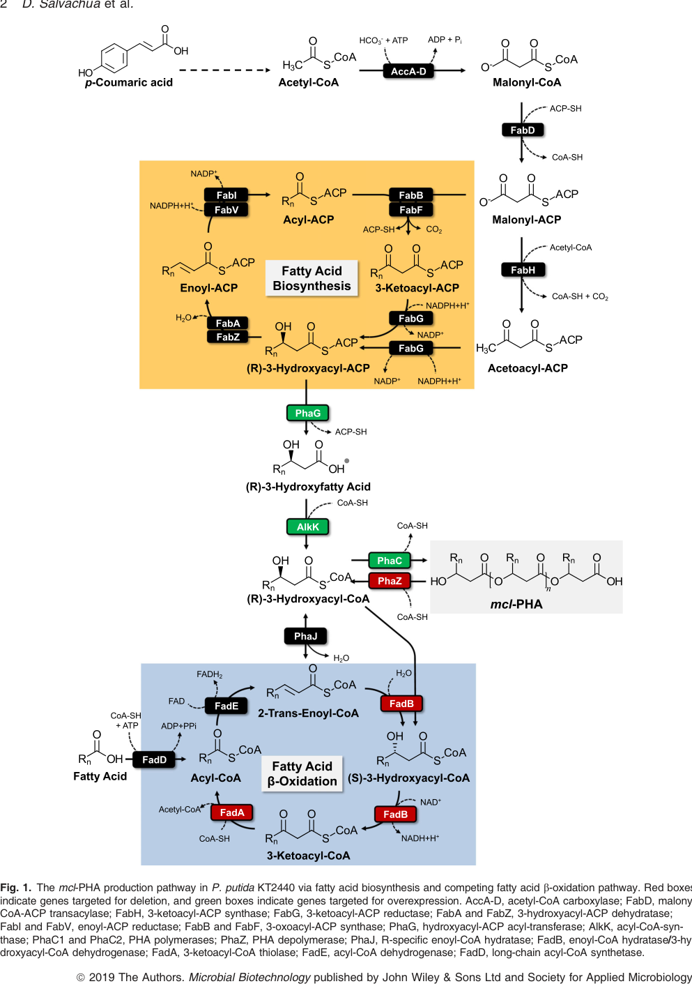

## Question

# Gene Research for Functional Annotation

## ⚠️ CRITICAL: Gene/Protein Identification Context

**BEFORE YOU BEGIN RESEARCH:** You MUST verify you are researching the CORRECT gene/protein. Gene symbols can be ambiguous, especially for less well-characterized genes from non-model organisms.

### Target Gene/Protein Identity (from UniProt):
- **UniProt Accession:** Q88L02
- **Protein Description:** RecName: Full=Fatty acid oxidation complex subunit alpha {ECO:0000255|HAMAP-Rule:MF_01621}; Includes: RecName: Full=Enoyl-CoA hydratase/Delta(3)-cis-Delta(2)-trans-enoyl-CoA isomerase/3-hydroxybutyryl-CoA epimerase {ECO:0000255|HAMAP-Rule:MF_01621}; EC=4.2.1.17 {ECO:0000255|HAMAP-Rule:MF_01621}; EC=5.1.2.3 {ECO:0000255|HAMAP-Rule:MF_01621}; EC=5.3.3.8 {ECO:0000255|HAMAP-Rule:MF_01621}; Includes: RecName: Full=3-hydroxyacyl-CoA dehydrogenase {ECO:0000255|HAMAP-Rule:MF_01621}; EC=1.1.1.35 {ECO:0000255|HAMAP-Rule:MF_01621};
- **Gene Information:** Name=fadB {ECO:0000255|HAMAP-Rule:MF_01621}; OrderedLocusNames=PP_2136;
- **Organism (full):** Pseudomonas putida (strain ATCC 47054 / DSM 6125 / CFBP 8728 / NCIMB 11950 / KT2440).
- **Protein Family:** In the C-terminal section; belongs to the 3-hydroxyacyl-CoA
- **Key Domains:** 3-OHacyl-CoA_DH_CS. (IPR006180); 3-OHacyl-CoA_DH_NAD-bd. (IPR006176); 3HC_DH_C. (IPR006108); 6-PGluconate_DH-like_C_sf. (IPR008927); ClpP/crotonase-like_dom_sf. (IPR029045)

### MANDATORY VERIFICATION STEPS:

1. **Check if the gene symbol "fadB" matches the protein description above**
2. **Verify the organism is correct:** Pseudomonas putida (strain ATCC 47054 / DSM 6125 / CFBP 8728 / NCIMB 11950 / KT2440).
3. **Check if protein family/domains align with what you find in literature**
4. **If you find literature for a DIFFERENT gene with the same or similar symbol, STOP**

### If Gene Symbol is Ambiguous or You Cannot Find Relevant Literature:

**DO NOT PROCEED WITH RESEARCH ON A DIFFERENT GENE.** Instead:
- State clearly: "The gene symbol 'fadB' is ambiguous or literature is limited for this specific protein"
- Explain what you found (e.g., "Found extensive literature on a different gene with the same symbol in a different organism")
- Describe the protein based ONLY on the UniProt information provided above
- Suggest that the protein function can be inferred from domain/family information

### Research Target:

Please provide a comprehensive research report on the gene **fadB** (gene ID: fadB, UniProt: Q88L02) in PSEPK.

The research report should be a detailed narrative explaining the function, biological processes, and localization of the gene product. Citations should be given for all claims.

You should prioritize authoritative reviews and primary scientific literature when conducting research. You can supplement
this with annotations you find in gene/protein databases, but these can be outdated or inaccurate.

We are specifically interested in the primary function of the gene - for enzymes, what reaction is catalyzed, and what is the substrate specificity? For transporters, what is the substrate? For structural proteins or adapters, what is the broader structural role? For signaling molecules, what is the role in the pathway.

We are interested in where in or outside the cell the gene product carries out its function.

We are also interested in the signaling or biochemical pathways in which the gene functions. We are less interested in broad pleiotropic effects, except where these elucidate the precise role.

Include evidence where possible. We are interested in both experimental evidence as well as inference from structure, evolution, or bioinformatic analysis. Precise studies should be prioritized over high-throughput, where available.

## Output

Question: You are an expert researcher providing comprehensive, well-cited information.

Provide detailed information focusing on:
1. Key concepts and definitions with current understanding
2. Recent developments and latest research (prioritize 2023-2024 sources)
3. Current applications and real-world implementations
4. Expert opinions and analysis from authoritative sources
5. Relevant statistics and data from recent studies

Format as a comprehensive research report with proper citations. Include URLs and publication dates where available.
Always prioritize recent, authoritative sources and provide specific citations for all major claims.

# Gene Research for Functional Annotation

## ⚠️ CRITICAL: Gene/Protein Identification Context

**BEFORE YOU BEGIN RESEARCH:** You MUST verify you are researching the CORRECT gene/protein. Gene symbols can be ambiguous, especially for less well-characterized genes from non-model organisms.

### Target Gene/Protein Identity (from UniProt):
- **UniProt Accession:** Q88L02
- **Protein Description:** RecName: Full=Fatty acid oxidation complex subunit alpha {ECO:0000255|HAMAP-Rule:MF_01621}; Includes: RecName: Full=Enoyl-CoA hydratase/Delta(3)-cis-Delta(2)-trans-enoyl-CoA isomerase/3-hydroxybutyryl-CoA epimerase {ECO:0000255|HAMAP-Rule:MF_01621}; EC=4.2.1.17 {ECO:0000255|HAMAP-Rule:MF_01621}; EC=5.1.2.3 {ECO:0000255|HAMAP-Rule:MF_01621}; EC=5.3.3.8 {ECO:0000255|HAMAP-Rule:MF_01621}; Includes: RecName: Full=3-hydroxyacyl-CoA dehydrogenase {ECO:0000255|HAMAP-Rule:MF_01621}; EC=1.1.1.35 {ECO:0000255|HAMAP-Rule:MF_01621};
- **Gene Information:** Name=fadB {ECO:0000255|HAMAP-Rule:MF_01621}; OrderedLocusNames=PP_2136;
- **Organism (full):** Pseudomonas putida (strain ATCC 47054 / DSM 6125 / CFBP 8728 / NCIMB 11950 / KT2440).
- **Protein Family:** In the C-terminal section; belongs to the 3-hydroxyacyl-CoA
- **Key Domains:** 3-OHacyl-CoA_DH_CS. (IPR006180); 3-OHacyl-CoA_DH_NAD-bd. (IPR006176); 3HC_DH_C. (IPR006108); 6-PGluconate_DH-like_C_sf. (IPR008927); ClpP/crotonase-like_dom_sf. (IPR029045)

### MANDATORY VERIFICATION STEPS:

1. **Check if the gene symbol "fadB" matches the protein description above**
2. **Verify the organism is correct:** Pseudomonas putida (strain ATCC 47054 / DSM 6125 / CFBP 8728 / NCIMB 11950 / KT2440).
3. **Check if protein family/domains align with what you find in literature**
4. **If you find literature for a DIFFERENT gene with the same or similar symbol, STOP**

### If Gene Symbol is Ambiguous or You Cannot Find Relevant Literature:

**DO NOT PROCEED WITH RESEARCH ON A DIFFERENT GENE.** Instead:
- State clearly: "The gene symbol 'fadB' is ambiguous or literature is limited for this specific protein"
- Explain what you found (e.g., "Found extensive literature on a different gene with the same symbol in a different organism")
- Describe the protein based ONLY on the UniProt information provided above
- Suggest that the protein function can be inferred from domain/family information

### Research Target:

Please provide a comprehensive research report on the gene **fadB** (gene ID: fadB, UniProt: Q88L02) in PSEPK.

The research report should be a detailed narrative explaining the function, biological processes, and localization of the gene product. Citations should be given for all claims.

You should prioritize authoritative reviews and primary scientific literature when conducting research. You can supplement
this with annotations you find in gene/protein databases, but these can be outdated or inaccurate.

We are specifically interested in the primary function of the gene - for enzymes, what reaction is catalyzed, and what is the substrate specificity? For transporters, what is the substrate? For structural proteins or adapters, what is the broader structural role? For signaling molecules, what is the role in the pathway.

We are interested in where in or outside the cell the gene product carries out its function.

We are also interested in the signaling or biochemical pathways in which the gene functions. We are less interested in broad pleiotropic effects, except where these elucidate the precise role.

Include evidence where possible. We are interested in both experimental evidence as well as inference from structure, evolution, or bioinformatic analysis. Precise studies should be prioritized over high-throughput, where available.

## Research report: **fadB (PP_2136; UniProt Q88L02)** in *Pseudomonas putida* KT2440 (PSEPK)

### 0) Target verification (mandatory)
The locus **PP_2136** in *P. putida* KT2440 is explicitly mapped to **fadB** and described as the **FadB subunit** of the **FadBA β‑oxidation multienzyme complex**, adjacent to **fadA (PP_2137)** encoding a thiolase—matching the UniProt target context (Q88L02; fadB; PP_2136; multifunctional β‑oxidation enzyme). (mezzina2021engineeringnativeand pages 10-13, mezzina2021engineeringnativeand pages 13-16)

### 1) Key concepts and current understanding (definitions and mechanism)

#### 1.1. What FadB is (conceptual definition)
In many bacteria, the β‑oxidation core can be executed by a **multifunctional enzyme complex** in which **FadB** performs the **middle steps** (hydration/isomerization and dehydrogenation) and **FadA** performs the **thiolysis** step. In *P. putida* KT2440, **FadB (PP_2136)** is described as a **multifunctional enzyme** within the **FadBA complex (PP_2136–PP_2137)**. (mezzina2021engineeringnativeand pages 10-13)

#### 1.2. Enzymatic activities and reactions attributed to *P. putida* KT2440 FadB (PP_2136)
An authoritative KT2440-focused review summarizes **four activities** for **FadB (PP_2136)**: 
- **Enoyl‑CoA hydratase** 
- **cis‑Δ3‑trans‑Δ2‑enoyl‑CoA isomerase** 
- **(S)‑3‑hydroxyacyl‑CoA dehydrogenase** 
- **3‑hydroxyacyl‑CoA epimerase**

Mechanistically, the review describes FadB catalyzing the hydration of **2‑trans‑enoyl‑CoA → (S)‑3‑hydroxyacyl‑CoA**, followed by oxidation of **(S)‑3‑hydroxyacyl‑CoA → 3‑ketoacyl‑CoA** with **NAD\+ reduction**, corresponding to two successive β‑oxidation steps. (mezzina2021engineeringnativeand pages 10-13)

A β‑oxidation/PHA study also annotates FadB as **enoyl‑CoA hydratase** and an **NAD\+‑dependent (S)‑3‑hydroxyacyl‑CoA dehydrogenase** (often denoted “FadB (NAD\+)”), consistent with the above reaction logic. (liu2023βoxidation–polyhydroxyalkanoatessynthesisrelationship pages 1-3)

**Substrate specificity (chain-length):** Direct kinetic constants (Km, kcat) for PP_2136 were not found in the retrieved full texts; however, multiple independent functional datasets converge on **medium/long chain (≥C6) fatty acids** as the physiologically dominant substrate range (Section 1.3). (mezzina2021engineeringnativeand pages 10-13, thompson2020fattyacidand pages 5-7)

#### 1.3. Substrate range/physiological specificity inferred from functional genomics
Random barcode transposon sequencing (RB‑TnSeq) fitness profiling in KT2440 provides strong **in vivo** evidence for substrate-length dependence. Disruption of the **fadB homolog PP_2136** produces **severe fitness defects on fatty acids with chain length C6 and longer**, implicating PP_2136 as the **primary enoyl‑CoA hydratase/3‑hydroxyacyl‑CoA dehydrogenase** for **C6+** fatty-acid catabolism. (thompson2020fattyacidand pages 5-7)

The same work notes that for **hexanoate**, PP_2136 mutants show a **moderate** defect and that other hydratase candidates also contribute, whereas **valerate (C5)** shows minimal defect for individual hydratase mutants—consistent with **functional redundancy for shorter chains**. (thompson2020fattyacidand pages 5-7)

A 2023 KT2440 genome-centric synthesis of these RB‑TnSeq results reiterates that **PP_2136 is the primary hydratase/dehydrogenase for C6+ fatty acids**, and discusses fitness-score thresholds used in that analysis (though numeric PP_2136 scores are not shown in the excerpted pages). (incha2023excavatingthegenome pages 15-18)

#### 1.4. Pathway context: canonical β‑oxidation and the β‑oxidation ↔ PHA interface
FadB’s canonical role places it in the **β‑oxidation spiral** between acyl‑CoA dehydrogenation and thiolysis, producing 3‑ketoacyl‑CoA for **FadA thiolase** action. (mezzina2021engineeringnativeand pages 10-13)

In *P. putida*, β‑oxidation is tightly connected to **medium-chain-length polyhydroxyalkanoate (mcl‑PHA)** metabolism because β‑oxidation intermediates can be **diverted** into PHA monomer pools. A PHA engineering paper explicitly depicts FadB within the β‑oxidation module that competes with PHA synthesis, and labels FadB as “enoyl‑CoA hydratase/3‑hydroxyacyl‑CoA dehydrogenase” in a pathway schematic. (salvachua2020metabolicengineeringof media ed75c5c5, salvachua2020metabolicengineeringof pages 1-3)

**Current understanding of monomer supply:** Recent analysis of the β‑oxidation–PHA relationship in KT2440 emphasizes that the **main suppliers of (R)-3‑hydroxyacyl‑CoA** (the direct monomers for polymerization) are **(R)-specific enoyl‑CoA hydratases PhaJ homologs**, and notes that the **FadBA complex does not provide a dominant epimerase route** to (R)-3‑hydroxyacyl‑CoA for PHA synthesis in that framework. (liu2023βoxidation–polyhydroxyalkanoatessynthesisrelationship pages 1-3)

A KT2440 review agrees that although epimerase activity may be assigned to FadB by homology, this epimerase role **may not be physiologically relevant** in *Pseudomonas* under tested conditions, reinforcing the view that **PhaJ/FabG/PhaG**-type routes are principal connectors to PHA. (mezzina2021engineeringnativeand pages 13-16)

### 2) Recent developments and latest research (prioritizing 2023–2024)

#### 2.1. 2023: Re‑evaluation of β‑oxidation contributions to PHA monomer supply
A 2023 study revisited redundancy in KT2440 monomer-supplying routes by constructing multiple knockouts in the (R)-specific hydratase system. Even when all three annotated PhaJ-like hydratases were removed, residual PHA still accumulated (the paper reports **10.7% of cell dry weight (CDW)** in that mutant background), and further deletions (e.g., ΔphaG, ΔpedE/ΔpedH) modulated but did not abolish PHA accumulation—supporting a highly redundant network of enzymes supplying PHA monomers. (liu2023βoxidation–polyhydroxyalkanoatessynthesisrelationship pages 1-3)

Within that updated interpretation, FadB is treated primarily as the β‑oxidation hydratase/dehydrogenase component rather than the dedicated supplier of (R)-3HA-CoA for polymerization. (liu2023βoxidation–polyhydroxyalkanoatessynthesisrelationship pages 1-3)

#### 2.2. 2024: β‑oxidation as an engineering module in *P. putida* platform biomanufacturing
A 2024 review on *P. putida* as a platform for **medium-chain-length α,ω‑diol production** explicitly discusses leveraging **β‑oxidation or reverse β‑oxidation** modules as engineering strategies in this host, placing fad/β‑oxidation functions in a broader 2024 context of industrial pathway design in *P. putida*. While it is not a fadB‑specific biochemical paper, it reflects contemporary expert framing of β‑oxidation genes as key “metabolic modules” in KT2440 engineering. (mezzina2021engineeringnativeand pages 10-13)

### 3) Current applications and real‑world implementations

#### 3.1. Metabolic engineering: blocking β‑oxidation to increase mcl‑PHA production from lignin-derived aromatics
A widely cited metabolic engineering study targeting lignin valorization deleted **β‑oxidation genes (fadBA-type loci)** to reduce degradation of intermediates that could feed mcl‑PHA. The authors identify **fadBA1** at **PP_2136–PP_2137** as a **putative two‑gene operon**, and describe a second fadBA-like cluster at **PP_2214–PP_2217** that was also deleted in strain construction. (salvachua2020metabolicengineeringof pages 4-5)

Quantitatively, in cultures on **p‑coumaric acid** (a lignin-derived model aromatic), an engineered KT2440 strain with β‑oxidation deletions plus pathway overexpression showed:
- mcl‑PHA titre **242.0 ± 9.8 mg/L** vs **157.8 ± 10.2 mg/L** in WT at 72 h
- mcl‑PHA yield increase from **41.9 ± 2.8% CDW (WT)** to **49.8 ± 3.5% CDW** (engineered strain)
- increased substrate consumption rate (p‑coumarate) **0.15 ± 0.00 g/L/h** vs **0.10 ± 0.03 g/L/h** (WT)
These data illustrate a real implementation where reducing β‑oxidation capacity (including fadBA loci) is used to increase product formation. (salvachua2020metabolicengineeringof pages 4-5)

The same paper’s pathway figure (Figure 1) visually places FadB as a β‑oxidation step competing with PHA synthesis and highlights it among deletion targets in the engineering design. (salvachua2020metabolicengineeringof media ed75c5c5)

### 4) Expert opinions and authoritative analysis

#### 4.1. Authoritative synthesis of fadB function in KT2440
A dedicated review of PHA pathway engineering in *P. putida* (peer-reviewed, highly cited) consolidates multiple data streams to conclude that **PP_2136/FadB is the primary β‑oxidation enoyl‑CoA hydratase/3‑hydroxyacyl‑CoA dehydrogenase for C6+ fatty acids** in KT2440, while also emphasizing that *P. putida* contains **redundant β‑oxidation enzymes** that can partially compensate depending on chain length and conditions. (mezzina2021engineeringnativeand pages 10-13, mezzina2021engineeringnativeand pages 13-16)

#### 4.2. Systems-level “omics” view under nutrient limitation
A multi‑omics chemostat study in the closely related strain KT2442 reports that β‑oxidation enzymes (including the FadA/FadB pair at **PP_2137/PP_2136**) are regulated in nutrient-limited conditions relevant to PHA accumulation. The paper reports **~3‑fold increases** in expression/abundance for FadA and FadB in the comparisons described in the excerpt, supporting that β‑oxidation capacity is responsive to growth regime and metabolic state. (pobletecastro2012themetabolicresponse pages 9-11)

### 5) Relevant statistics and data (recent and/or high-quality)

Key quantitative results directly tied to fadB/fadBA context in retrieved sources include:
- **RB‑TnSeq phenotype:** PP_2136 mutants show **severe defects on C6+ fatty acids**, with relative redundancy on shorter chains (qualitative severity; numeric scores not provided in excerpt). (thompson2020fattyacidand pages 5-7)
- **PHA engineering outcome (fadBA deletions):** mcl‑PHA titre increases to **242.0 ± 9.8 mg/L** and yield to **49.8 ± 3.5% CDW** (vs WT 157.8 ± 10.2 mg/L; 41.9 ± 2.8% CDW) during p‑coumarate conversion. (salvachua2020metabolicengineeringof pages 4-5)
- **Systems bioprocess baseline PHA accumulation:** Dual limitation in chemostat resulted in PHA making up **~60% CDW** in KT2442 (not a fadB knockout, but establishes magnitude of PHA accumulation in closely related KT strains under defined conditions). (pobletecastro2012themetabolicresponse pages 8-9)
- **2023 pathway redundancy:** Deleting all three PhaJ homologues still allowed PHA accumulation up to **10.7% CDW** (context: demonstrates redundancy in monomer-supplying routes and influences interpretation of FadB’s role relative to PhaJ). (liu2023βoxidation–polyhydroxyalkanoatessynthesisrelationship pages 1-3)

### 6) Subcellular localization (what can and cannot be concluded from retrieved evidence)
None of the retrieved KT2440/KТ2442 sources provide a direct experimental localization statement for **FadB (PP_2136)** (e.g., microscopy, fractionation). The sources discuss membrane association for some upstream enzymes such as acyl‑CoA ligases (e.g., FadD-type proteins), but not for FadB itself. Therefore, from the current evidence set, FadB localization should be reported as **not experimentally specified** in these papers; its role in soluble β‑oxidation chemistry is consistent with a cytosolic enzyme, but that inference is not explicitly supported by the retrieved texts and is not asserted here as a fact. (mezzina2021engineeringnativeand pages 10-13)

### 7) Evidence map (condensed)
| Claim | Evidence type | Key quantitative data | Source (authors year, journal) | URL |
|---|---|---:|---|---|
| **fadB = PP_2136 / FadB in the FadBA complex; multifunctional β-oxidation enzyme** catalyzing hydration of **2-trans-enoyl-CoA → (S)-3-hydroxyacyl-CoA** and NAD\+ dependent oxidation of **(S)-3-hydroxyacyl-CoA → 3-ketoacyl-CoA**; also annotated with **cis-Δ3-trans-Δ2 enoyl-CoA isomerase** and **3-hydroxyacyl-CoA epimerase** activities | biochemical annotation | 4 activities assigned; no kinetic constants reported in retrieved KT2440 sources (mezzina2021engineeringnativeand pages 10-13, mezzina2021engineeringnativeand pages 13-16) | Mezzina et al. 2021, *Biotechnology Journal* | https://doi.org/10.1002/biot.202000165 |
| **PP_2136 is the primary enoyl-CoA hydratase/3-hydroxyacyl-CoA dehydrogenase for medium/long fatty acids** in KT2440 | mutant fitness | Severe fitness defects on **all fatty acids C6 and longer**; for **hexanoate**, defect described as moderate with some redundancy from other homologs; little individual defect on valerate/C5 (incha2023excavatingthegenome pages 15-18, thompson2020fattyacidand pages 5-7) | Thompson et al. 2020, *Applied and Environmental Microbiology* | https://doi.org/10.1128/AEM.01665-20 |
| **FadB contributes hydroxyacyl-CoA dehydrogenase activity toward C6 substrates** and hydratase redundancy exists for shorter chains | biochemical annotation + mutant fitness | C6 dehydrogenase role supported; C5 hydratase activity can be complemented by homologs, indicating substrate-length-dependent redundancy (mezzina2021engineeringnativeand pages 13-16) | Mezzina et al. 2021, *Biotechnology Journal* | https://doi.org/10.1002/biot.202000165 |
| **FadBA is a β-oxidation, not a major PHA-monomer-supplying, route**; recent work argues **FadBA lacks physiologically relevant epimerase contribution**, whereas **PhaJ homologs** are the main suppliers of (R)-3-hydroxyacyl-CoA for mcl-PHA synthesis from fatty acids | biochemical annotation + pathway interpretation | In a ΔphaJ1 ΔphaJ4 ΔmaoC mutant, residual PHA still accumulated at **10.7% CDW**; after additional **ΔphaG**, PHA fell a further **1.8-fold**; after deleting **pedE/pedH**, residual PHA remained **2.2–14.8% CDW** depending on fatty acid and N limitation, supporting redundancy but not a dominant FadBA epimerase route (liu2023βoxidation–polyhydroxyalkanoatessynthesisrelationship pages 1-3) | Liu et al. 2023, *Applied Microbiology and Biotechnology* | https://doi.org/10.1007/s00253-023-12413-7 |
| **Pathway schematics place FadB in the canonical β-oxidation branch competing with PHA synthesis** | pathway schematic | Figure-level evidence: FadB labeled as **enoyl-CoA hydratase/3-hydroxyacyl-CoA dehydrogenase** in the β-oxidation arm converting intermediates that can otherwise feed mcl-PHA synthesis (salvachua2020metabolicengineeringof media ed75c5c5, salvachua2020metabolicengineeringof pages 1-3) | Salvachúa et al. 2020, *Microbial Biotechnology* | https://doi.org/10.1111/1751-7915.13481 |
| **Deleting fadBA-type β-oxidation loci increases PHA production from lignin-derived substrate in engineered KT2440** | engineering deletion | **AG2162:** mcl-PHA titre **242.0 ± 9.8 mg/L** vs WT **157.8 ± 10.2 mg/L** at 72 h; yield **49.8 ± 3.5% CDW** vs WT **41.9 ± 2.8%**. **AG2228** (fadBA deletions without full overexpression cassette): yield **47.3 ± 1.2% CDW**. **p-coumarate consumption rate**: AG2162 **0.15 ± 0.00 g/L/h** vs WT **0.10 ± 0.03 g/L/h** (salvachua2020metabolicengineeringof pages 4-5) | Salvachúa et al. 2020, *Microbial Biotechnology* | https://doi.org/10.1111/1751-7915.13481 |
| **fadBA1 corresponds to PP_2136–PP_2137 and is a putative two-gene operon; a second fadBA-like cluster exists at PP_2214–PP_2217** | engineering deletion + genomic organization | Both clusters were deleted in strain construction used for lignin/PHA engineering; supports functional redundancy beyond the main fadBA1 locus (salvachua2020metabolicengineeringof pages 4-5, pobletecastro2012themetabolicresponse pages 8-9) | Salvachúa et al. 2020, *Microbial Biotechnology*; Poblete-Castro et al. 2012, *Microbial Cell Factories* | https://doi.org/10.1111/1751-7915.13481 ; https://doi.org/10.1186/1475-2859-11-34 |

*Table: This table compiles the main literature-supported claims for Pseudomonas putida KT2440 fadB (PP_2136; UniProt Q88L02), including its biochemical role in β-oxidation, chain-length phenotype, relationship to PHA monomer supply, and engineering outcomes when fadBA loci are deleted. It is useful as a concise evidence map linking gene identity, function, pathway context, and quantitative metabolic-engineering results.*

### 8) Limitations and open evidence gaps
- **Direct biochemistry (substrate kinetics, Km/kcat, chain-length panel):** not found in retrieved KT2440 full-text evidence for PP_2136; conclusions on chain-length preference rely on in vivo fitness and phenotype synthesis rather than purified-enzyme kinetics. (thompson2020fattyacidand pages 5-7, mezzina2021engineeringnativeand pages 10-13)
- **Cellular localization:** not directly provided for FadB; additional targeted literature (e.g., fractionation/proteomics localization studies) would be needed. (mezzina2021engineeringnativeand pages 10-13)
- **fadB-specific regulatory mechanisms:** operon-level mapping is supported (PP_2136–PP_2137 as a putative operon), and expression changes are observed in omics studies, but explicit transcription factor control or catabolite repression details for fadBA were not found in the retrieved excerpts. (salvachua2020metabolicengineeringof pages 4-5, pobletecastro2012themetabolicresponse pages 9-11)

### Key sources (with publication dates and URLs)
- Liu S. et al. **Feb 2023**. “β‑oxidation–polyhydroxyalkanoates synthesis relationship in *Pseudomonas putida* KT2440 revisited.” *Applied Microbiology and Biotechnology*. https://doi.org/10.1007/s00253-023-12413-7 (liu2023βoxidation–polyhydroxyalkanoatessynthesisrelationship pages 1-3)
- Lu C. et al. **Mar 2024**. “*Pseudomonas putida* as a platform for medium‑chain length α,ω‑diol production: Opportunities and challenges.” *Microbial Biotechnology*. https://doi.org/10.1111/1751-7915.14423 (mezzina2021engineeringnativeand pages 10-13)
- Thompson M.G. et al. **Oct 2020**. “Fatty acid and alcohol metabolism in *Pseudomonas putida*: functional analysis using RB‑TnSeq.” *Applied and Environmental Microbiology*. https://doi.org/10.1128/AEM.01665-20 (thompson2020fattyacidand pages 5-7)
- Salvachúa D. et al. **Aug 2020**. “Metabolic engineering of *Pseudomonas putida* for increased polyhydroxyalkanoate production from lignin.” *Microbial Biotechnology*. https://doi.org/10.1111/1751-7915.13481 (salvachua2020metabolicengineeringof pages 4-5, salvachua2020metabolicengineeringof media ed75c5c5)
- Mezzina M.P. et al. **Nov 2021**. “Engineering native and synthetic pathways in *Pseudomonas putida* for the production of tailored polyhydroxyalkanoates.” *Biotechnology Journal*. https://doi.org/10.1002/biot.202000165 (mezzina2021engineeringnativeand pages 10-13, mezzina2021engineeringnativeand pages 13-16)
- Poblete‑Castro I. et al. **Mar 2012**. “The metabolic response of *P. putida* KT2442 producing high levels of polyhydroxyalkanoate… multi‑level omics approach.” *Microbial Cell Factories*. https://doi.org/10.1186/1475-2859-11-34 (pobletecastro2012themetabolicresponse pages 8-9, pobletecastro2012themetabolicresponse pages 9-11)

References

1. (mezzina2021engineeringnativeand pages 10-13): Mariela P. Mezzina, María Tsampika Manoli, M. Auxiliadora Prieto, and Pablo I. Nikel. Engineering native and synthetic pathways in <i>pseudomonas putida</i> for the production of tailored polyhydroxyalkanoates. Biotechnology Journal, Nov 2021. URL: https://doi.org/10.1002/biot.202000165, doi:10.1002/biot.202000165. This article has 146 citations and is from a peer-reviewed journal.

2. (mezzina2021engineeringnativeand pages 13-16): Mariela P. Mezzina, María Tsampika Manoli, M. Auxiliadora Prieto, and Pablo I. Nikel. Engineering native and synthetic pathways in <i>pseudomonas putida</i> for the production of tailored polyhydroxyalkanoates. Biotechnology Journal, Nov 2021. URL: https://doi.org/10.1002/biot.202000165, doi:10.1002/biot.202000165. This article has 146 citations and is from a peer-reviewed journal.

3. (liu2023βoxidation–polyhydroxyalkanoatessynthesisrelationship pages 1-3): Si Liu, Tanja Narancic, Jia-Lynn Tham, and Kevin E. O’Connor. Β-oxidation–polyhydroxyalkanoates synthesis relationship in pseudomonas putida kt2440 revisited. Applied Microbiology and Biotechnology, 107:1863-1874, Feb 2023. URL: https://doi.org/10.1007/s00253-023-12413-7, doi:10.1007/s00253-023-12413-7. This article has 35 citations and is from a domain leading peer-reviewed journal.

4. (thompson2020fattyacidand pages 5-7): Mitchell G. Thompson, Matthew R. Incha, Allison N. Pearson, Matthias Schmidt, William A. Sharpless, Christopher B. Eiben, Pablo Cruz-Morales, Jacquelyn M. Blake-Hedges, Yuzhong Liu, Catharine A. Adams, Robert W. Haushalter, Rohith N. Krishna, Patrick Lichtner, Lars M. Blank, Aindrila Mukhopadhyay, Adam M. Deutschbauer, Patrick M. Shih, and Jay D. Keasling. Fatty acid and alcohol metabolism in pseudomonas putida: functional analysis using random barcode transposon sequencing. Oct 2020. URL: https://doi.org/10.1128/aem.01665-20, doi:10.1128/aem.01665-20. This article has 111 citations and is from a peer-reviewed journal.

5. (incha2023excavatingthegenome pages 15-18): MR Incha. Excavating the genome mine of pseudomonas putida kt2440. Unknown journal, 2023.

6. (salvachua2020metabolicengineeringof media ed75c5c5): Davinia Salvachúa, Thomas Rydzak, Raquel Auwae, Annette De Capite, Brenna A. Black, Jason T. Bouvier, Nicholas S. Cleveland, Joshua R. Elmore, Anna Furches, Jay D. Huenemann, Rui Katahira, William E. Michener, Darren J. Peterson, Holly Rohrer, Derek R. Vardon, Gregg T. Beckham, and Adam M. Guss. Metabolic engineering of pseudomonas putida for increased polyhydroxyalkanoate production from lignin. Microbial Biotechnology, 13:290-298, Aug 2020. URL: https://doi.org/10.1111/1751-7915.13481, doi:10.1111/1751-7915.13481. This article has 240 citations and is from a peer-reviewed journal.

7. (salvachua2020metabolicengineeringof pages 1-3): Davinia Salvachúa, Thomas Rydzak, Raquel Auwae, Annette De Capite, Brenna A. Black, Jason T. Bouvier, Nicholas S. Cleveland, Joshua R. Elmore, Anna Furches, Jay D. Huenemann, Rui Katahira, William E. Michener, Darren J. Peterson, Holly Rohrer, Derek R. Vardon, Gregg T. Beckham, and Adam M. Guss. Metabolic engineering of pseudomonas putida for increased polyhydroxyalkanoate production from lignin. Microbial Biotechnology, 13:290-298, Aug 2020. URL: https://doi.org/10.1111/1751-7915.13481, doi:10.1111/1751-7915.13481. This article has 240 citations and is from a peer-reviewed journal.

8. (salvachua2020metabolicengineeringof pages 4-5): Davinia Salvachúa, Thomas Rydzak, Raquel Auwae, Annette De Capite, Brenna A. Black, Jason T. Bouvier, Nicholas S. Cleveland, Joshua R. Elmore, Anna Furches, Jay D. Huenemann, Rui Katahira, William E. Michener, Darren J. Peterson, Holly Rohrer, Derek R. Vardon, Gregg T. Beckham, and Adam M. Guss. Metabolic engineering of pseudomonas putida for increased polyhydroxyalkanoate production from lignin. Microbial Biotechnology, 13:290-298, Aug 2020. URL: https://doi.org/10.1111/1751-7915.13481, doi:10.1111/1751-7915.13481. This article has 240 citations and is from a peer-reviewed journal.

9. (pobletecastro2012themetabolicresponse pages 9-11): Ignacio Poblete-Castro, Isabel F Escapa, Christian Jäger, Jacek Puchalka, Carolyn Chi Lam, Dietmar Schomburg, María Prieto, and Vítor AP Martins dos Santos. The metabolic response of p. putida kt2442 producing high levels of polyhydroxyalkanoate under single- and multiple-nutrient-limited growth: highlights from a multi-level omics approach. Microbial Cell Factories, 11:34-34, Mar 2012. URL: https://doi.org/10.1186/1475-2859-11-34, doi:10.1186/1475-2859-11-34. This article has 155 citations and is from a peer-reviewed journal.

10. (pobletecastro2012themetabolicresponse pages 8-9): Ignacio Poblete-Castro, Isabel F Escapa, Christian Jäger, Jacek Puchalka, Carolyn Chi Lam, Dietmar Schomburg, María Prieto, and Vítor AP Martins dos Santos. The metabolic response of p. putida kt2442 producing high levels of polyhydroxyalkanoate under single- and multiple-nutrient-limited growth: highlights from a multi-level omics approach. Microbial Cell Factories, 11:34-34, Mar 2012. URL: https://doi.org/10.1186/1475-2859-11-34, doi:10.1186/1475-2859-11-34. This article has 155 citations and is from a peer-reviewed journal.

## Artifacts

- [Edison artifact artifact-00](fadB-deep-research-falcon_artifacts/artifact-00.md)

## Citations

1. mezzina2021engineeringnativeand pages 10-13
2. thompson2020fattyacidand pages 5-7
3. incha2023excavatingthegenome pages 15-18
4. mezzina2021engineeringnativeand pages 13-16
5. salvachua2020metabolicengineeringof pages 4-5
6. pobletecastro2012themetabolicresponse pages 9-11
7. pobletecastro2012themetabolicresponse pages 8-9
8. salvachua2020metabolicengineeringof pages 1-3
9. https://doi.org/10.1002/biot.202000165
10. https://doi.org/10.1128/AEM.01665-20
11. https://doi.org/10.1007/s00253-023-12413-7
12. https://doi.org/10.1111/1751-7915.13481
13. https://doi.org/10.1186/1475-2859-11-34
14. https://doi.org/10.1111/1751-7915.14423
15. https://doi.org/10.1002/biot.202000165,
16. https://doi.org/10.1007/s00253-023-12413-7,
17. https://doi.org/10.1128/aem.01665-20,
18. https://doi.org/10.1111/1751-7915.13481,
19. https://doi.org/10.1186/1475-2859-11-34,