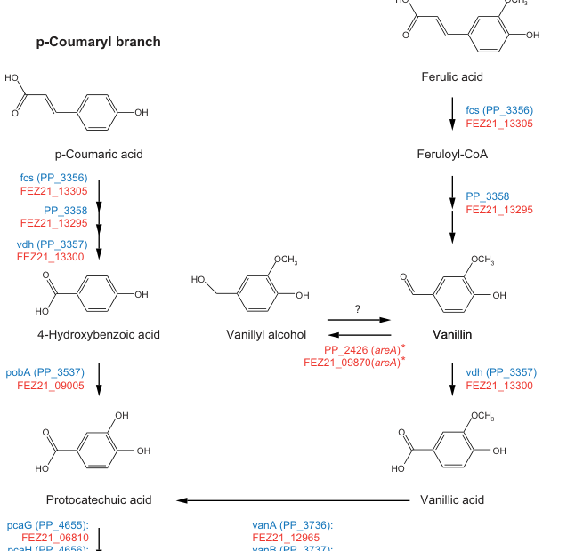

## Question

# Gene Research for Functional Annotation

## ⚠️ CRITICAL: Gene/Protein Identification Context

**BEFORE YOU BEGIN RESEARCH:** You MUST verify you are researching the CORRECT gene/protein. Gene symbols can be ambiguous, especially for less well-characterized genes from non-model organisms.

### Target Gene/Protein Identity (from UniProt):
- **UniProt Accession:** Q88HK0
- **Protein Description:** SubName: Full=Feruloyl-CoA-synthetase {ECO:0000313|EMBL:AAN68960.2}; EC=6.2.1.34 {ECO:0000313|EMBL:AAN68960.2};
- **Gene Information:** Name=fcs {ECO:0000313|EMBL:AAN68960.2}; OrderedLocusNames=PP_3356 {ECO:0000313|EMBL:AAN68960.2};
- **Organism (full):** Pseudomonas putida (strain ATCC 47054 / DSM 6125 / CFBP 8728 / NCIMB 11950 / KT2440).
- **Protein Family:** Not specified in UniProt
- **Key Domains:** AMP-dep_synth/lig_dom. (IPR000873); ANL_N_sf. (IPR042099); AMP-binding (PF00501); AMP-binding_C_3 (PF23562)

### MANDATORY VERIFICATION STEPS:

1. **Check if the gene symbol "fcs" matches the protein description above**
2. **Verify the organism is correct:** Pseudomonas putida (strain ATCC 47054 / DSM 6125 / CFBP 8728 / NCIMB 11950 / KT2440).
3. **Check if protein family/domains align with what you find in literature**
4. **If you find literature for a DIFFERENT gene with the same or similar symbol, STOP**

### If Gene Symbol is Ambiguous or You Cannot Find Relevant Literature:

**DO NOT PROCEED WITH RESEARCH ON A DIFFERENT GENE.** Instead:
- State clearly: "The gene symbol 'fcs' is ambiguous or literature is limited for this specific protein"
- Explain what you found (e.g., "Found extensive literature on a different gene with the same symbol in a different organism")
- Describe the protein based ONLY on the UniProt information provided above
- Suggest that the protein function can be inferred from domain/family information

### Research Target:

Please provide a comprehensive research report on the gene **fcs** (gene ID: fcs, UniProt: Q88HK0) in PSEPK.

The research report should be a detailed narrative explaining the function, biological processes, and localization of the gene product. Citations should be given for all claims.

You should prioritize authoritative reviews and primary scientific literature when conducting research. You can supplement
this with annotations you find in gene/protein databases, but these can be outdated or inaccurate.

We are specifically interested in the primary function of the gene - for enzymes, what reaction is catalyzed, and what is the substrate specificity? For transporters, what is the substrate? For structural proteins or adapters, what is the broader structural role? For signaling molecules, what is the role in the pathway.

We are interested in where in or outside the cell the gene product carries out its function.

We are also interested in the signaling or biochemical pathways in which the gene functions. We are less interested in broad pleiotropic effects, except where these elucidate the precise role.

Include evidence where possible. We are interested in both experimental evidence as well as inference from structure, evolution, or bioinformatic analysis. Precise studies should be prioritized over high-throughput, where available.

## Output

Question: You are an expert researcher providing comprehensive, well-cited information.

Provide detailed information focusing on:
1. Key concepts and definitions with current understanding
2. Recent developments and latest research (prioritize 2023-2024 sources)
3. Current applications and real-world implementations
4. Expert opinions and analysis from authoritative sources
5. Relevant statistics and data from recent studies

Format as a comprehensive research report with proper citations. Include URLs and publication dates where available.
Always prioritize recent, authoritative sources and provide specific citations for all major claims.

# Gene Research for Functional Annotation

## ⚠️ CRITICAL: Gene/Protein Identification Context

**BEFORE YOU BEGIN RESEARCH:** You MUST verify you are researching the CORRECT gene/protein. Gene symbols can be ambiguous, especially for less well-characterized genes from non-model organisms.

### Target Gene/Protein Identity (from UniProt):
- **UniProt Accession:** Q88HK0
- **Protein Description:** SubName: Full=Feruloyl-CoA-synthetase {ECO:0000313|EMBL:AAN68960.2}; EC=6.2.1.34 {ECO:0000313|EMBL:AAN68960.2};
- **Gene Information:** Name=fcs {ECO:0000313|EMBL:AAN68960.2}; OrderedLocusNames=PP_3356 {ECO:0000313|EMBL:AAN68960.2};
- **Organism (full):** Pseudomonas putida (strain ATCC 47054 / DSM 6125 / CFBP 8728 / NCIMB 11950 / KT2440).
- **Protein Family:** Not specified in UniProt
- **Key Domains:** AMP-dep_synth/lig_dom. (IPR000873); ANL_N_sf. (IPR042099); AMP-binding (PF00501); AMP-binding_C_3 (PF23562)

### MANDATORY VERIFICATION STEPS:

1. **Check if the gene symbol "fcs" matches the protein description above**
2. **Verify the organism is correct:** Pseudomonas putida (strain ATCC 47054 / DSM 6125 / CFBP 8728 / NCIMB 11950 / KT2440).
3. **Check if protein family/domains align with what you find in literature**
4. **If you find literature for a DIFFERENT gene with the same or similar symbol, STOP**

### If Gene Symbol is Ambiguous or You Cannot Find Relevant Literature:

**DO NOT PROCEED WITH RESEARCH ON A DIFFERENT GENE.** Instead:
- State clearly: "The gene symbol 'fcs' is ambiguous or literature is limited for this specific protein"
- Explain what you found (e.g., "Found extensive literature on a different gene with the same symbol in a different organism")
- Describe the protein based ONLY on the UniProt information provided above
- Suggest that the protein function can be inferred from domain/family information

### Research Target:

Please provide a comprehensive research report on the gene **fcs** (gene ID: fcs, UniProt: Q88HK0) in PSEPK.

The research report should be a detailed narrative explaining the function, biological processes, and localization of the gene product. Citations should be given for all claims.

You should prioritize authoritative reviews and primary scientific literature when conducting research. You can supplement
this with annotations you find in gene/protein databases, but these can be outdated or inaccurate.

We are specifically interested in the primary function of the gene - for enzymes, what reaction is catalyzed, and what is the substrate specificity? For transporters, what is the substrate? For structural proteins or adapters, what is the broader structural role? For signaling molecules, what is the role in the pathway.

We are interested in where in or outside the cell the gene product carries out its function.

We are also interested in the signaling or biochemical pathways in which the gene functions. We are less interested in broad pleiotropic effects, except where these elucidate the precise role.

Include evidence where possible. We are interested in both experimental evidence as well as inference from structure, evolution, or bioinformatic analysis. Precise studies should be prioritized over high-throughput, where available.

## Research Report: *fcs* (PP_3356; UniProt Q88HK0) in *Pseudomonas putida* KT2440

### 1) Mandatory identity verification (avoid “fcs” ambiguity)
The UniProt-provided target (Q88HK0) is annotated as **feruloyl-CoA synthetase** (EC **6.2.1.34**) encoded by **fcs** with ordered locus name **PP_3356** in *Pseudomonas putida* KT2440. Primary literature pathway mapping in *P. putida* KT2440 explicitly labels **fcs (PP_3356)** at the **ferulic acid → feruloyl-CoA** step and places it alongside neighboring pathway genes (including **vdh (PP_3357)** and **PP_3358**) in the same ferulate/coumarate catabolic branch, matching the intended identity (garciahidalgo2020vanillinproductionin media cfb4b31e, garciahidalgo2020vanillinproductionin pages 10-11). 

### 2) Key concepts, definitions, and current understanding (2023–2024 prioritized)

#### 2.1 Feruloyl-CoA synthetase (Fcs): biochemical role
Feruloyl-CoA synthetase (Fcs) is an **acid-thiol ligase / acyl-CoA synthetase** in the AMP-binding/ANL enzyme superfamily that catalyzes **ATP-dependent CoA thioesterification** of hydroxycinnamic acids, including **ferulate** and **p-coumarate**, yielding the corresponding **CoA thioesters** that are required for downstream catabolism and for some engineered biosyntheses (tramontina2023sustainablebiosyntheticpathways pages 4-6, incha2020leveraginghostmetabolism pages 3-4). In *P. putida* KT2440 specifically, functional work supports that Fcs activates **p-coumarate to coumaroyl-CoA** (coumaroyl-CoA detected in cells expressing *fcs*) (incha2023excavatingthegenome pages 86-90, incha2023excavatingthegenomea pages 86-90) and that **ferulate is converted to vanillin via Fcs + Ech** (ruhl2025productionofvanillin pages 1-3).

*Note on reaction stoichiometry:* The retrieved excerpts consistently describe **ATP-dependent CoA thioesterification** but do **not** provide an explicit balanced equation specifying whether ATP is converted to AMP + PPi vs ADP + Pi for *P. putida* Fcs (tramontina2023sustainablebiosyntheticpathways pages 4-6, goncalves2022applyingbiochemicaland pages 2-4). Therefore, the canonical EC 6.2.1.34 stoichiometry is not quoted verbatim from the retrieved full-text evidence here.

#### 2.2 Pathway context in KT2440: hydroxycinnamate “peripheral” branch into the β-ketoadipate funnel
A KT2440 pathway map places **Fcs (PP_3356)** as the entry step for **ferulate and p-coumarate** catabolism: hydroxycinnamate → CoA-thioester → aromatic aldehyde (vanillin or 4-hydroxybenzaldehyde) → aromatic acid (vanillic acid or 4-hydroxybenzoic acid) → **protocatechuate** → β-ketoadipate pathway (garciahidalgo2020vanillinproductionin media cfb4b31e). More recent systems/engineering studies describe that native KT2440 converts ferulic acid onward toward **protocatechuate** and ultimately central metabolism via the **β-ketoadipate pathway**, and they identify Fcs and Ech as the two key enzymes mediating ferulate-to-vanillin conversion (ruhl2025productionofvanillin pages 1-3).

#### 2.3 Genomic neighborhood and pathway gene set
In *P. putida* KT2440, **fcs (PP_3356)** is shown in close association with **vdh (PP_3357)** and **PP_3358** in the ferulate catabolic branch on a gene/pathway map, supporting a local gene neighborhood for hydroxycinnamate utilization (garciahidalgo2020vanillinproductionin media cfb4b31e, garciahidalgo2020vanillinproductionin pages 10-11). 

### 3) Evidence-based functional annotation of Fcs (Q88HK0)

#### 3.1 Supported substrates and substrate scope
**Organism-specific evidence (KT2440):**
- **p-Coumarate → coumaroyl-CoA:** Coumaroyl-CoA is directly detected by LC–MS/MS (MRM transition 914.16→407.16) from intracellular extracts of *P. putida* expressing pBADT-*fcs*, providing in vivo evidence that Fcs activates p-coumarate to the CoA ester (incha2023excavatingthegenome pages 86-90, incha2023excavatingthegenomea pages 86-90).
- **Ferulate entry into the ferulate → vanillin route:** Multiple studies place Fcs as the initiating activation step for ferulate metabolism toward vanillin in KT2440 (ruhl2025productionofvanillin pages 1-3, garciahidalgo2020vanillinproductionin media cfb4b31e).

**Broader homolog evidence (supporting inference, not KT2440-specific):** Metagenome-derived Fcs homologs experimentally accept **ferulic, p-coumaric, caffeic, and sinapic acids** as substrates, indicating that bacterial Fcs enzymes can exhibit broad hydroxycinnamate specificity (goncalves2022applyingbiochemicaland pages 2-4, goncalves2022applyingbiochemicaland pages 6-9). This supports plausibility of broader substrate scope for Q88HK0 but does not itself prove it in KT2440.

#### 3.2 Functional genomics and phenotypes: why Fcs matters physiologically
RB-TnSeq/fitness analyses and targeted experiments support Fcs as a key determinant of hydroxycinnamate utilization and stress phenotypes:
- A 2024 machine-learning analysis of RB-TnSeq fitness data (ICA) identified a hydroxycinnamate catabolism module (**fModule_14**) that explicitly groups **Fcs:Ech:Vdh** and links hydroxycinnamate utilization to assimilation of **acetyl-CoA** output and glyoxylate shunt dependence (glcB/malate synthase) (borchert2024machinelearninganalysis pages 6-7, borchert2024machinelearninganalysis pages 2-4). 
- Accumulation of the activated CoA intermediate can be inhibitory: engineering work reports that **coumaroyl-CoA production inhibits growth** (increased lag when *fcs* is expressed with coumarate present) and that coumaroyl-CoA peaks transiently after substrate addition, consistent with toxicity if downstream consumption is limiting (incha2020leveraginghostmetabolism pages 3-4, incha2023excavatingthegenomea pages 8-13).

### 4) Localization: where Fcs carries out its function

#### 4.1 Intracellular/cytosolic activity (best-supported)
Fcs produces CoA-thioesters that were extracted and quantified from **cell pellets/intracellular extracts** in KT2440 expressing *fcs* (incha2023excavatingthegenome pages 86-90, incha2023excavatingthegenomea pages 86-90). This supports the conclusion that the primary catalytic activity relevant to hydroxycinnamate activation is **cell-associated (likely cytosolic)**, consistent with CoA metabolism and canonical bacterial acyl-CoA synthetases.

#### 4.2 Outer membrane vesicles (OMVs): emerging spatial biology (uncertain for Fcs specifically)
A 2020 PNAS study showed *P. putida* secretes **outer membrane vesicles (OMVs)** during growth on lignin-rich media; OMV proteomics and functional assays support that OMVs can harbor enzymatically active aromatic catabolic proteins (salvachua2020outermembranevesicles pages 1-2, salvachua2020outermembranevesicles pages 4-6). The study’s β-ketoadipate-pathway heat map/legend lists **Fcs, Ech, and Vdh** among pathway enzymes detected in extracellular fractions/OMV-related analyses (salvachua2020outermembranevesicles pages 6-7). However, the retrieved excerpts do not provide unambiguous protein-by-protein enrichment values for Fcs in OMVs versus vesicle-free supernatant, so **direct OMV localization of Fcs remains unresolved from the currently retrieved text** (salvachua2020outermembranevesicles pages 6-7, salvachua2020outermembranevesicles pages 2-4).

### 5) Regulation and pathway control (recent evidence)
A key 2023 development is experimental evidence that carbon catabolite repression influences the hydroxycinnamate entry branch. In engineered KT2440 derivatives, deleting the global regulator **Crc** increased utilization rates of p-coumarate and ferulate, and this was attributed to **derepression of fcs, ech, and vdh**, which were reported to have putative Crc binding sites near their initiation codons (werner2023ligninconversionto pages 2-4). This connects *fcs* function to a broader regulatory program controlling aromatic assimilation.

### 6) Current applications and real-world implementations (2023–2024 prioritized)

#### 6.1 Lignin-to-β-ketoadipate funneling (Science Advances, 2023)
Werner et al. (published **Sep 2023**) engineered *P. putida* KT2440 to funnel lignin-related aromatics (including hydroxycinnamates) to **β-ketoadipic acid**. They report high, industrially relevant metrics, including **44.5 ± 1.85 g/L** β-ketoadipate at **0.85 ± 0.04 g/L/h** in optimized fed-batch and **25 g/L** at **0.66 g/L/h** from corn stover–derived lignin streams, corresponding to **0.10 g product/g lignin** (https://doi.org/10.1126/sciadv.adj0053) (werner2023ligninconversionto pages 2-4, werner2023ligninconversionto pages 1-2). Because *fcs/ech/vdh* mediate the initial hydroxycinnamate breakdown, pathway derepression via **∆crc** is mechanistically tied to improved conversion of ferulate/p-coumarate into the β-ketoadipate funnel (werner2023ligninconversionto pages 2-4).

#### 6.2 Hydrolysate valorization to protocatechuate (Molecules, 2024)
Jin et al. (published **Mar 2024**) quantified lignin-derived aromatics in corncob hydrolysates, reporting **ferulic acid** and **p-coumaric acid** levels exceeding **160/120 mg/L** and **530/250 mg/L**, respectively, in two hydrolysates. They engineered KT2440 to accumulate protocatechuate by blocking its cleavage and reported PCA titers up to **433.72 mg/L** (https://doi.org/10.3390/molecules29071555) (jin2024biologicalvalorizationof pages 1-2, jin2024biologicalvalorizationof pages 2-4). In degradation assays, KT2440 degraded phenolics (including ferulate and p-coumarate) largely within **24 h**, with H-type aromatics consumed within **12 h** (jin2024biologicalvalorizationof pages 2-4). They also report strong co-substrate effects on p-coumarate consumption (e.g., at 6 h p-CA consumption falling from 73.62% to 41.19% with glucose) (jin2024biologicalvalorizationof pages 4-7). These data are directly relevant to deploying the *fcs* branch in realistic lignocellulosic streams.

#### 6.3 Functional genomics for strain engineering (mSystems, 2024)
Borchert et al. (published **Mar 2024**) provide a data-driven approach to improve hydroxycinnamate processing by identifying functional modules and tolerance genes from RB-TnSeq data. Their hydroxycinnamate module (fModule_14) groups **Fcs:Ech:Vdh**, supporting a systems-level rationale for cofactor/anaplerotic engineering (e.g., glyoxylate shunt via glcB) to improve growth and conversion on ferulate/p-coumarate (https://doi.org/10.1128/msystems.00942-23) (borchert2024machinelearninganalysis pages 6-7, borchert2024machinelearninganalysis pages 2-4).

### 7) Expert interpretation and authoritative synthesis
Recent synthesis of hydroxycinnamate bioconversion highlights Fcs (EC 6.2.1.34) as the **activation gate** for CoA-dependent microbial hydroxycinnamate pathways and as a common starting point for producing value-added compounds such as vanillin (Tramontina et al., **May 2023**, https://doi.org/10.1007/s00253-023-12571-8) (tramontina2023sustainablebiosyntheticpathways pages 4-6). The *P. putida* KT2440 literature further suggests that a major constraint is not merely enzyme presence but **flux balancing** and avoidance of toxic intermediate accumulation (e.g., coumaroyl-CoA), motivating engineering strategies that coordinate Fcs with downstream consumption (incha2020leveraginghostmetabolism pages 3-4).

### 8) Summary evidence map (structured)
The following table consolidates key functional claims, pathway placement, regulation, localization, and application metrics with evidence pointers.

| Aspect | Specific claim for Q88HK0/Fcs | Evidence type | Key sources with year + URL |
|---|---|---|---|
| Gene/protein identity | In *Pseudomonas putida* KT2440, **fcs = PP_3356** and encodes the feruloyl-CoA synthetase in the ferulate/coumarate catabolic branch; this matches UniProt Q88HK0. | Pathway mapping; gene annotation in primary literature | García-Hidalgo et al., 2020, https://doi.org/10.1128/AEM.02442-19 (garciahidalgo2020vanillinproductionin pages 10-11, garciahidalgo2020vanillinproductionin media cfb4b31e) |
| Enzyme class / family | Fcs is an **acid-thiol ligase / acyl-CoA synthetase** of the **ANL/AMP-binding** enzyme superfamily; UniProt domain architecture (AMP-binding / ANL_N) is consistent with this class. | Curated database annotation + review synthesis | UniProt Q88HK0 (provided by user); Tramontina et al., 2023, https://doi.org/10.1007/s00253-023-12571-8 (tramontina2023sustainablebiosyntheticpathways pages 4-6) |
| Reaction description | Fcs catalyzes the **ATP-dependent CoA thioesterification** of hydroxycinnamates, especially **ferulate** and **p-coumarate**, yielding the corresponding CoA esters (feruloyl-CoA or coumaroyl-CoA) as the activation step for downstream catabolism. | Review synthesis + in vivo product detection | Tramontina et al., 2023, https://doi.org/10.1007/s00253-023-12571-8 (tramontina2023sustainablebiosyntheticpathways pages 4-6); Incha et al., 2020, https://doi.org/10.1016/j.mec.2019.e00119 (incha2020leveraginghostmetabolism pages 3-4); Incha, 2023, coumaroyl-CoA LC-MS/MS detection (incha2023excavatingthegenome pages 86-90, incha2023excavatingthegenomea pages 86-90) |
| Substrate scope | For KT2440, literature supports activity in catabolism of both **ferulate** and **p-coumarate**; broader FCS homolog literature supports hydroxycinnamate activation more generally, including caffeate/sinapate in related enzymes, but that broader scope is not directly proven here for Q88HK0. | Direct organism-specific pathway evidence + homolog biochemical inference | García-Hidalgo et al., 2020, https://doi.org/10.1128/AEM.02442-19 (garciahidalgo2020vanillinproductionin pages 10-11, garciahidalgo2020vanillinproductionin media cfb4b31e); Tramontina et al., 2023, https://doi.org/10.1007/s00253-023-12571-8 (tramontina2023sustainablebiosyntheticpathways pages 4-6); Gonçalves et al., 2022, https://doi.org/10.1007/s00253-022-11885-3 (goncalves2022applyingbiochemicaland pages 2-4, goncalves2022applyingbiochemicaland pages 6-9) |
| Pathway position | Fcs is the **entry activation step** in the hydroxycinnamate funnel: **ferulate / p-coumarate → feruloyl-/coumaroyl-CoA → vanillin / 4-hydroxybenzaldehyde → vanillic / 4-hydroxybenzoic acid → protocatechuate → β-ketoadipate pathway**. | Pathway diagrams; systems biology; reviews | García-Hidalgo et al., 2020, https://doi.org/10.1128/AEM.02442-19 (garciahidalgo2020vanillinproductionin media cfb4b31e); Ruhl et al., 2025, https://doi.org/10.1111/1751-7915.70152 (ruhl2025productionofvanillin pages 1-3); Zhou et al., 2025 preprint, https://doi.org/10.1101/2025.03.24.645021 (zhou2025quantitativeanalysisof pages 5-8) |
| Genomic neighborhood | The pathway map places **fcs (PP_3356)** adjacent to **vdh (PP_3357)** and **PP_3358** (the enzyme converting CoA-thioesters toward aromatic aldehydes), supporting a local ferulate catabolic gene neighborhood. | Genomic pathway mapping | García-Hidalgo et al., 2020, https://doi.org/10.1128/AEM.02442-19 (garciahidalgo2020vanillinproductionin pages 10-11, garciahidalgo2020vanillinproductionin media cfb4b31e) |
| Regulation | The global carbon catabolite repression regulator **Crc** likely represses **fcs, ech, and vdh**; deleting **crc** accelerated ferulate and p-coumarate utilization, consistent with **derepression** of this branch. | Genetic perturbation / regulatory inference in engineered strains | Werner et al., 2023, https://doi.org/10.1126/sciadv.adj0053 (werner2023ligninconversionto pages 2-4) |
| Functional module evidence | Machine-learning analysis of RB-TnSeq fitness data grouped **Fcs:Ech:Vdh** into a hydroxycinnamate catabolism module (**fModule_14**), linking this branch to **acetyl-CoA production** and glyoxylate-shunt dependence. | Functional genomics + machine learning + mutant validation | Borchert et al., 2024, https://doi.org/10.1128/msystems.00942-23 (borchert2024machinelearninganalysis pages 6-7, borchert2024machinelearninganalysis pages 2-4) |
| Localization | The best-supported interpretation is that Fcs is **primarily intracellular/cell-associated** because its CoA-ester products were measured from intracellular extracts; however, aromatic-catabolic enzymes as a class can appear in **outer membrane vesicles (OMVs)** during lignin growth, and β-ketoadipate-pathway proteins are OMV-enriched, so extracellular packaging of some pathway enzymes is possible. **Direct OMV-specific evidence for Fcs itself remains uncertain in the retrieved text.** | Intracellular metabolite extraction; OMV proteomics; cautious inference | Incha, 2023 (intracellular CoA-esters), (incha2023excavatingthegenomea pages 86-90); Salvachúa et al., 2020, https://doi.org/10.1073/pnas.1921073117 (salvachua2020outermembranevesicles pages 6-7, salvachua2020outermembranevesicles pages 2-4, salvachua2020outermembranevesicles pages 4-6, salvachua2020outermembranevesicles pages 1-2) |
| Phenotype / toxicity | Overexpression or increased flux through Fcs in the presence of coumarate causes **coumaroyl-CoA accumulation** and **growth inhibition / lag**, indicating the activated CoA-thioester can be toxic when downstream consumption is limiting. | In vivo metabolic engineering phenotype + metabolite measurement | Incha et al., 2020, https://doi.org/10.1016/j.mec.2019.e00119 (incha2020leveraginghostmetabolism pages 3-4); Incha, 2023 (incha2023excavatingthegenome pages 8-13, incha2023excavatingthegenome pages 86-90, incha2023excavatingthegenomea pages 8-13) |
| Engineering relevance | Fcs is repeatedly leveraged for **lignin-derived aromatic valorization**: vanillin accumulation from ferulate, β-ketoadipate production from lignin monomers, and precursor supply for non-native products such as bisdemethoxycurcumin. | Metabolic engineering and bioprocess studies | Werner et al., 2023, https://doi.org/10.1126/sciadv.adj0053 (werner2023ligninconversionto pages 2-4); Jin et al., 2024, https://doi.org/10.3390/molecules29071555 (jin2024biologicalvalorizationof pages 2-4); Incha et al., 2020, https://doi.org/10.1016/j.mec.2019.e00119 (incha2020leveraginghostmetabolism pages 3-4); Ruhl et al., 2025, https://doi.org/10.1111/1751-7915.70152 (ruhl2025productionofvanillin pages 1-3) |
| Quantitative application notes | Recent pathway-centered applications report: **β-ketoadipate up to 44.5 ± 1.85 g/L** and **0.85 ± 0.04 g/L/h** from lignin-related aromatics after pathway/regulatory engineering; engineered KT2440 also accumulated **0.64 g/L vanillin**, increased to **3.35 g/L apparent total recovery** with in situ resin recovery. | Bioprocess performance data | Werner et al., 2023, https://doi.org/10.1126/sciadv.adj0053 (werner2023ligninconversionto pages 2-4); Ruhl et al., 2025, https://doi.org/10.1111/1751-7915.70152 (ruhl2025productionofvanillin pages 1-3) |

*Table: This table summarizes the functional annotation of Pseudomonas putida KT2440 fcs (PP_3356; UniProt Q88HK0), including its enzymatic role, pathway placement, regulation, localization, and engineering relevance. It is useful as a compact evidence map linking gene identity to experimentally supported function and recent applications.*

### 9) Gaps and recommendations for annotation confidence
1. **Explicit balanced reaction stoichiometry** (AMP + PPi) was not found verbatim in the retrieved KT2440 full-text excerpts; if required for strict annotation, it should be extracted from a primary enzymology paper or curated enzyme database entry that explicitly states the stoichiometry for EC 6.2.1.34 in *Pseudomonas* Fcs.
2. **OMV localization of Fcs** is plausible but not definitively established from the retrieved excerpts; confirming whether PP_3356 is enriched in OMVs versus other fractions would require consulting the deposited proteomics datasets and/or the full figure tables from Salvachúa et al. (PXD016114 / MassIVE MSV000084524, MSV000084506) (salvachua2020outermembranevesicles pages 1-2).

### Key URLs (with publication dates)
- Werner et al., **Sep 2023**, *Science Advances*: https://doi.org/10.1126/sciadv.adj0053 (werner2023ligninconversionto pages 2-4)
- Borchert et al., **Mar 2024**, *mSystems*: https://doi.org/10.1128/msystems.00942-23 (borchert2024machinelearninganalysis pages 6-7)
- Jin et al., **Mar 2024**, *Molecules*: https://doi.org/10.3390/molecules29071555 (jin2024biologicalvalorizationof pages 1-2)
- Tramontina et al., **May 2023**, *Applied Microbiology and Biotechnology*: https://doi.org/10.1007/s00253-023-12571-8 (tramontina2023sustainablebiosyntheticpathways pages 4-6)
- Salvachúa et al., **Apr 2020**, *PNAS*: https://doi.org/10.1073/pnas.1921073117 (salvachua2020outermembranevesicles pages 1-2)
- García-Hidalgo et al., **Mar 2020**, *Applied and Environmental Microbiology*: https://doi.org/10.1128/AEM.02442-19 (garciahidalgo2020vanillinproductionin pages 10-11)

References

1. (garciahidalgo2020vanillinproductionin media cfb4b31e): Javier García-Hidalgo, Daniel P. Brink, Krithika Ravi, Catherine J. Paul, Gunnar Lidén, and Marie F. Gorwa-Grauslund. Vanillin production in <i>pseudomonas</i> : whole-genome sequencing of <i>pseudomonas</i> sp. strain 9.1 and reannotation of pseudomonas putida cala as a vanillin reductase. Mar 2020. URL: https://doi.org/10.1128/aem.02442-19, doi:10.1128/aem.02442-19. This article has 43 citations and is from a peer-reviewed journal.

2. (garciahidalgo2020vanillinproductionin pages 10-11): Javier García-Hidalgo, Daniel P. Brink, Krithika Ravi, Catherine J. Paul, Gunnar Lidén, and Marie F. Gorwa-Grauslund. Vanillin production in <i>pseudomonas</i> : whole-genome sequencing of <i>pseudomonas</i> sp. strain 9.1 and reannotation of pseudomonas putida cala as a vanillin reductase. Mar 2020. URL: https://doi.org/10.1128/aem.02442-19, doi:10.1128/aem.02442-19. This article has 43 citations and is from a peer-reviewed journal.

3. (tramontina2023sustainablebiosyntheticpathways pages 4-6): Robson Tramontina, Iara Ciancaglini, Ellen K. B. Roman, Micaela G. Chacón, Thamy L. R. Corrêa, Neil Dixon, Timothy D. H. Bugg, and Fabio Marcio Squina. Sustainable biosynthetic pathways to value-added bioproducts from hydroxycinnamic acids. Applied Microbiology and Biotechnology, 107:4165-4185, May 2023. URL: https://doi.org/10.1007/s00253-023-12571-8, doi:10.1007/s00253-023-12571-8. This article has 20 citations and is from a domain leading peer-reviewed journal.

4. (incha2020leveraginghostmetabolism pages 3-4): Matthew R. Incha, Mitchell G. Thompson, Jacquelyn M. Blake-Hedges, Yuzhong Liu, Allison N. Pearson, Matthias Schmidt, Jennifer W. Gin, Christopher J. Petzold, Adam M. Deutschbauer, and Jay D. Keasling. Leveraging host metabolism for bisdemethoxycurcumin production in pseudomonas putida. Jun 2020. URL: https://doi.org/10.1016/j.mec.2019.e00119, doi:10.1016/j.mec.2019.e00119. This article has 76 citations and is from a peer-reviewed journal.

5. (incha2023excavatingthegenome pages 86-90): MR Incha. Excavating the genome mine of pseudomonas putida kt2440. Unknown journal, 2023.

6. (incha2023excavatingthegenomea pages 86-90): MR Incha. Excavating the genome mine of pseudomonas putida kt2440. Unknown journal, 2023.

7. (ruhl2025productionofvanillin pages 1-3): Ilona A. Ruhl, Sean P. Woodworth, Stefan J. Haugen, Hannah M. Alt, Gregg T. Beckham, and Christopher W. Johnson. Production of vanillin from ferulic acid by pseudomonas putida kt2440 using metabolic engineering and in situ product recovery. Microbial Biotechnology, May 2025. URL: https://doi.org/10.1111/1751-7915.70152, doi:10.1111/1751-7915.70152. This article has 12 citations and is from a peer-reviewed journal.

8. (goncalves2022applyingbiochemicaland pages 2-4): Thiago Augusto Gonçalves, Victoria Sodré, Stephanie Nemesio da Silva, Nathalia Vilela, Geizecler Tomazetto, Juscemácia Nascimento Araujo, João Renato C. Muniz, Taícia Pacheco Fill, André Damasio, Wanius Garcia, and Fabio Marcio Squina. Applying biochemical and structural characterization of hydroxycinnamate catabolic enzymes from soil metagenome for lignin valorization strategies. Applied Microbiology and Biotechnology, 106:2503-2516, Mar 2022. URL: https://doi.org/10.1007/s00253-022-11885-3, doi:10.1007/s00253-022-11885-3. This article has 10 citations and is from a domain leading peer-reviewed journal.

9. (goncalves2022applyingbiochemicaland pages 6-9): Thiago Augusto Gonçalves, Victoria Sodré, Stephanie Nemesio da Silva, Nathalia Vilela, Geizecler Tomazetto, Juscemácia Nascimento Araujo, João Renato C. Muniz, Taícia Pacheco Fill, André Damasio, Wanius Garcia, and Fabio Marcio Squina. Applying biochemical and structural characterization of hydroxycinnamate catabolic enzymes from soil metagenome for lignin valorization strategies. Applied Microbiology and Biotechnology, 106:2503-2516, Mar 2022. URL: https://doi.org/10.1007/s00253-022-11885-3, doi:10.1007/s00253-022-11885-3. This article has 10 citations and is from a domain leading peer-reviewed journal.

10. (borchert2024machinelearninganalysis pages 6-7): Andrew J. Borchert, Alissa C. Bleem, Hyun Gyu Lim, Kevin Rychel, Keven D. Dooley, Zoe A. Kellermyer, Tracy L. Hodges, Bernhard O. Palsson, and Gregg T. Beckham. Machine learning analysis of rb-tnseq fitness data predicts functional gene modules in <i>pseudomonas putida</i> kt2440. mSystems, Mar 2024. URL: https://doi.org/10.1128/msystems.00942-23, doi:10.1128/msystems.00942-23. This article has 13 citations and is from a peer-reviewed journal.

11. (borchert2024machinelearninganalysis pages 2-4): Andrew J. Borchert, Alissa C. Bleem, Hyun Gyu Lim, Kevin Rychel, Keven D. Dooley, Zoe A. Kellermyer, Tracy L. Hodges, Bernhard O. Palsson, and Gregg T. Beckham. Machine learning analysis of rb-tnseq fitness data predicts functional gene modules in <i>pseudomonas putida</i> kt2440. mSystems, Mar 2024. URL: https://doi.org/10.1128/msystems.00942-23, doi:10.1128/msystems.00942-23. This article has 13 citations and is from a peer-reviewed journal.

12. (incha2023excavatingthegenomea pages 8-13): MR Incha. Excavating the genome mine of pseudomonas putida kt2440. Unknown journal, 2023.

13. (salvachua2020outermembranevesicles pages 1-2): Davinia Salvachúa, Allison Z. Werner, Isabel Pardo, Martyna Michalska, Brenna A. Black, Bryon S. Donohoe, Stefan J. Haugen, Rui Katahira, Sandra Notonier, Kelsey J. Ramirez, Antonella Amore, Samuel O. Purvine, Erika M. Zink, Paul E. Abraham, Richard J. Giannone, Suresh Poudel, Philip D. Laible, Robert L. Hettich, and Gregg T. Beckham. Outer membrane vesicles catabolize lignin-derived aromatic compounds in pseudomonas putida kt2440. Proceedings of the National Academy of Sciences, 117:9302-9310, Apr 2020. URL: https://doi.org/10.1073/pnas.1921073117, doi:10.1073/pnas.1921073117. This article has 158 citations and is from a highest quality peer-reviewed journal.

14. (salvachua2020outermembranevesicles pages 4-6): Davinia Salvachúa, Allison Z. Werner, Isabel Pardo, Martyna Michalska, Brenna A. Black, Bryon S. Donohoe, Stefan J. Haugen, Rui Katahira, Sandra Notonier, Kelsey J. Ramirez, Antonella Amore, Samuel O. Purvine, Erika M. Zink, Paul E. Abraham, Richard J. Giannone, Suresh Poudel, Philip D. Laible, Robert L. Hettich, and Gregg T. Beckham. Outer membrane vesicles catabolize lignin-derived aromatic compounds in pseudomonas putida kt2440. Proceedings of the National Academy of Sciences, 117:9302-9310, Apr 2020. URL: https://doi.org/10.1073/pnas.1921073117, doi:10.1073/pnas.1921073117. This article has 158 citations and is from a highest quality peer-reviewed journal.

15. (salvachua2020outermembranevesicles pages 6-7): Davinia Salvachúa, Allison Z. Werner, Isabel Pardo, Martyna Michalska, Brenna A. Black, Bryon S. Donohoe, Stefan J. Haugen, Rui Katahira, Sandra Notonier, Kelsey J. Ramirez, Antonella Amore, Samuel O. Purvine, Erika M. Zink, Paul E. Abraham, Richard J. Giannone, Suresh Poudel, Philip D. Laible, Robert L. Hettich, and Gregg T. Beckham. Outer membrane vesicles catabolize lignin-derived aromatic compounds in pseudomonas putida kt2440. Proceedings of the National Academy of Sciences, 117:9302-9310, Apr 2020. URL: https://doi.org/10.1073/pnas.1921073117, doi:10.1073/pnas.1921073117. This article has 158 citations and is from a highest quality peer-reviewed journal.

16. (salvachua2020outermembranevesicles pages 2-4): Davinia Salvachúa, Allison Z. Werner, Isabel Pardo, Martyna Michalska, Brenna A. Black, Bryon S. Donohoe, Stefan J. Haugen, Rui Katahira, Sandra Notonier, Kelsey J. Ramirez, Antonella Amore, Samuel O. Purvine, Erika M. Zink, Paul E. Abraham, Richard J. Giannone, Suresh Poudel, Philip D. Laible, Robert L. Hettich, and Gregg T. Beckham. Outer membrane vesicles catabolize lignin-derived aromatic compounds in pseudomonas putida kt2440. Proceedings of the National Academy of Sciences, 117:9302-9310, Apr 2020. URL: https://doi.org/10.1073/pnas.1921073117, doi:10.1073/pnas.1921073117. This article has 158 citations and is from a highest quality peer-reviewed journal.

17. (werner2023ligninconversionto pages 2-4): Allison Z. Werner, William T. Cordell, Ciaran W. Lahive, Bruno C. Klein, Christine A. Singer, Eric C. D. Tan, Morgan A. Ingraham, Kelsey J. Ramirez, Dong Hyun Kim, Jacob Nedergaard Pedersen, Christopher W. Johnson, Brian F. Pfleger, Gregg T. Beckham, and Davinia Salvachúa. Lignin conversion to β-ketoadipic acid by <i>pseudomonas putida</i> via metabolic engineering and bioprocess development. Science Advances, Sep 2023. URL: https://doi.org/10.1126/sciadv.adj0053, doi:10.1126/sciadv.adj0053. This article has 88 citations and is from a highest quality peer-reviewed journal.

18. (werner2023ligninconversionto pages 1-2): Allison Z. Werner, William T. Cordell, Ciaran W. Lahive, Bruno C. Klein, Christine A. Singer, Eric C. D. Tan, Morgan A. Ingraham, Kelsey J. Ramirez, Dong Hyun Kim, Jacob Nedergaard Pedersen, Christopher W. Johnson, Brian F. Pfleger, Gregg T. Beckham, and Davinia Salvachúa. Lignin conversion to β-ketoadipic acid by <i>pseudomonas putida</i> via metabolic engineering and bioprocess development. Science Advances, Sep 2023. URL: https://doi.org/10.1126/sciadv.adj0053, doi:10.1126/sciadv.adj0053. This article has 88 citations and is from a highest quality peer-reviewed journal.

19. (jin2024biologicalvalorizationof pages 1-2): Xinzhu Jin, Xiaoxia Li, Lihua Zou, Zhaojuan Zheng, and Jia Ouyang. Biological valorization of lignin-derived aromatics in hydrolysate to protocatechuic acid by engineered pseudomonas putida kt2440. Molecules, 29:1555, Mar 2024. URL: https://doi.org/10.3390/molecules29071555, doi:10.3390/molecules29071555. This article has 15 citations.

20. (jin2024biologicalvalorizationof pages 2-4): Xinzhu Jin, Xiaoxia Li, Lihua Zou, Zhaojuan Zheng, and Jia Ouyang. Biological valorization of lignin-derived aromatics in hydrolysate to protocatechuic acid by engineered pseudomonas putida kt2440. Molecules, 29:1555, Mar 2024. URL: https://doi.org/10.3390/molecules29071555, doi:10.3390/molecules29071555. This article has 15 citations.

21. (jin2024biologicalvalorizationof pages 4-7): Xinzhu Jin, Xiaoxia Li, Lihua Zou, Zhaojuan Zheng, and Jia Ouyang. Biological valorization of lignin-derived aromatics in hydrolysate to protocatechuic acid by engineered pseudomonas putida kt2440. Molecules, 29:1555, Mar 2024. URL: https://doi.org/10.3390/molecules29071555, doi:10.3390/molecules29071555. This article has 15 citations.

22. (zhou2025quantitativeanalysisof pages 5-8): Nanqing Zhou, Rebecca A. Wilkes, Xinyu Chen, Kelly P. Teitel, James A. Belgrave, Gregg T. Beckham, Allison Z. Werner, Yanbao Yu, and Ludmilla Aristilde. Quantitative analysis of coupled carbon and energy metabolism for lignin carbon utilization in pseudomonas putida. bioRxiv, Mar 2025. URL: https://doi.org/10.1101/2025.03.24.645021, doi:10.1101/2025.03.24.645021. This article has 3 citations.

23. (incha2023excavatingthegenome pages 8-13): MR Incha. Excavating the genome mine of pseudomonas putida kt2440. Unknown journal, 2023.

## Artifacts

- [Edison artifact artifact-00](fcs-deep-research-falcon_artifacts/artifact-00.md)

## Citations

1. ruhl2025productionofvanillin pages 1-3
2. salvachua2020outermembranevesicles pages 6-7
3. werner2023ligninconversionto pages 2-4
4. jin2024biologicalvalorizationof pages 2-4
5. jin2024biologicalvalorizationof pages 4-7
6. tramontina2023sustainablebiosyntheticpathways pages 4-6
7. incha2020leveraginghostmetabolism pages 3-4
8. zhou2025quantitativeanalysisof pages 5-8
9. incha2023excavatingthegenomea pages 86-90
10. salvachua2020outermembranevesicles pages 1-2
11. borchert2024machinelearninganalysis pages 6-7
12. jin2024biologicalvalorizationof pages 1-2
13. garciahidalgo2020vanillinproductionin pages 10-11
14. incha2023excavatingthegenome pages 86-90
15. goncalves2022applyingbiochemicaland pages 2-4
16. goncalves2022applyingbiochemicaland pages 6-9
17. borchert2024machinelearninganalysis pages 2-4
18. incha2023excavatingthegenomea pages 8-13
19. salvachua2020outermembranevesicles pages 4-6
20. salvachua2020outermembranevesicles pages 2-4
21. werner2023ligninconversionto pages 1-2
22. incha2023excavatingthegenome pages 8-13
23. https://doi.org/10.1126/sciadv.adj0053
24. https://doi.org/10.3390/molecules29071555
25. https://doi.org/10.1128/msystems.00942-23
26. https://doi.org/10.1007/s00253-023-12571-8
27. https://doi.org/10.1128/AEM.02442-19
28. https://doi.org/10.1016/j.mec.2019.e00119
29. https://doi.org/10.1007/s00253-022-11885-3
30. https://doi.org/10.1111/1751-7915.70152
31. https://doi.org/10.1101/2025.03.24.645021
32. https://doi.org/10.1073/pnas.1921073117
33. https://doi.org/10.1128/aem.02442-19,
34. https://doi.org/10.1007/s00253-023-12571-8,
35. https://doi.org/10.1016/j.mec.2019.e00119,
36. https://doi.org/10.1111/1751-7915.70152,
37. https://doi.org/10.1007/s00253-022-11885-3,
38. https://doi.org/10.1128/msystems.00942-23,
39. https://doi.org/10.1073/pnas.1921073117,
40. https://doi.org/10.1126/sciadv.adj0053,
41. https://doi.org/10.3390/molecules29071555,
42. https://doi.org/10.1101/2025.03.24.645021,