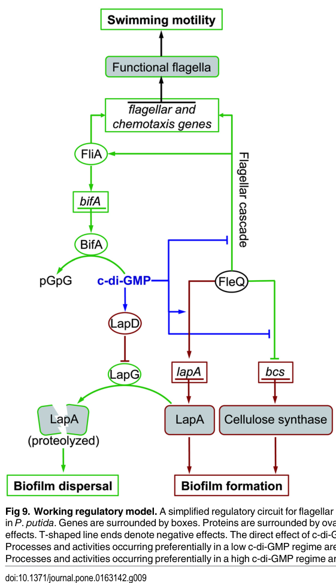

## Question

# Gene Research for Functional Annotation

## ⚠️ CRITICAL: Gene/Protein Identification Context

**BEFORE YOU BEGIN RESEARCH:** You MUST verify you are researching the CORRECT gene/protein. Gene symbols can be ambiguous, especially for less well-characterized genes from non-model organisms.

### Target Gene/Protein Identity (from UniProt):
- **UniProt Accession:** Q88ET0
- **Protein Description:** SubName: Full=Transcriptional regulator FleQ {ECO:0000313|EMBL:AAN69951.1};
- **Gene Information:** Name=fleQ {ECO:0000313|EMBL:AAN69951.1}; OrderedLocusNames=PP_4373 {ECO:0000313|EMBL:AAN69951.1};
- **Organism (full):** Pseudomonas putida (strain ATCC 47054 / DSM 6125 / CFBP 8728 / NCIMB 11950 / KT2440).
- **Protein Family:** Not specified in UniProt
- **Key Domains:** AAA+_ATPase. (IPR003593); AAA_lid_NorR. (IPR058031); CheY-like_superfamily. (IPR011006); FleQ. (IPR010518); Homeodomain-like_sf. (IPR009057)

### MANDATORY VERIFICATION STEPS:

1. **Check if the gene symbol "fleQ" matches the protein description above**
2. **Verify the organism is correct:** Pseudomonas putida (strain ATCC 47054 / DSM 6125 / CFBP 8728 / NCIMB 11950 / KT2440).
3. **Check if protein family/domains align with what you find in literature**
4. **If you find literature for a DIFFERENT gene with the same or similar symbol, STOP**

### If Gene Symbol is Ambiguous or You Cannot Find Relevant Literature:

**DO NOT PROCEED WITH RESEARCH ON A DIFFERENT GENE.** Instead:
- State clearly: "The gene symbol 'fleQ' is ambiguous or literature is limited for this specific protein"
- Explain what you found (e.g., "Found extensive literature on a different gene with the same symbol in a different organism")
- Describe the protein based ONLY on the UniProt information provided above
- Suggest that the protein function can be inferred from domain/family information

### Research Target:

Please provide a comprehensive research report on the gene **fleQ** (gene ID: fleQ, UniProt: Q88ET0) in PSEPK.

The research report should be a detailed narrative explaining the function, biological processes, and localization of the gene product. Citations should be given for all claims.

You should prioritize authoritative reviews and primary scientific literature when conducting research. You can supplement
this with annotations you find in gene/protein databases, but these can be outdated or inaccurate.

We are specifically interested in the primary function of the gene - for enzymes, what reaction is catalyzed, and what is the substrate specificity? For transporters, what is the substrate? For structural proteins or adapters, what is the broader structural role? For signaling molecules, what is the role in the pathway.

We are interested in where in or outside the cell the gene product carries out its function.

We are also interested in the signaling or biochemical pathways in which the gene functions. We are less interested in broad pleiotropic effects, except where these elucidate the precise role.

Include evidence where possible. We are interested in both experimental evidence as well as inference from structure, evolution, or bioinformatic analysis. Precise studies should be prioritized over high-throughput, where available.

## Output

Question: You are an expert researcher providing comprehensive, well-cited information.

Provide detailed information focusing on:
1. Key concepts and definitions with current understanding
2. Recent developments and latest research (prioritize 2023-2024 sources)
3. Current applications and real-world implementations
4. Expert opinions and analysis from authoritative sources
5. Relevant statistics and data from recent studies

Format as a comprehensive research report with proper citations. Include URLs and publication dates where available.
Always prioritize recent, authoritative sources and provide specific citations for all major claims.

# Gene Research for Functional Annotation

## ⚠️ CRITICAL: Gene/Protein Identification Context

**BEFORE YOU BEGIN RESEARCH:** You MUST verify you are researching the CORRECT gene/protein. Gene symbols can be ambiguous, especially for less well-characterized genes from non-model organisms.

### Target Gene/Protein Identity (from UniProt):
- **UniProt Accession:** Q88ET0
- **Protein Description:** SubName: Full=Transcriptional regulator FleQ {ECO:0000313|EMBL:AAN69951.1};
- **Gene Information:** Name=fleQ {ECO:0000313|EMBL:AAN69951.1}; OrderedLocusNames=PP_4373 {ECO:0000313|EMBL:AAN69951.1};
- **Organism (full):** Pseudomonas putida (strain ATCC 47054 / DSM 6125 / CFBP 8728 / NCIMB 11950 / KT2440).
- **Protein Family:** Not specified in UniProt
- **Key Domains:** AAA+_ATPase. (IPR003593); AAA_lid_NorR. (IPR058031); CheY-like_superfamily. (IPR011006); FleQ. (IPR010518); Homeodomain-like_sf. (IPR009057)

### MANDATORY VERIFICATION STEPS:

1. **Check if the gene symbol "fleQ" matches the protein description above**
2. **Verify the organism is correct:** Pseudomonas putida (strain ATCC 47054 / DSM 6125 / CFBP 8728 / NCIMB 11950 / KT2440).
3. **Check if protein family/domains align with what you find in literature**
4. **If you find literature for a DIFFERENT gene with the same or similar symbol, STOP**

### If Gene Symbol is Ambiguous or You Cannot Find Relevant Literature:

**DO NOT PROCEED WITH RESEARCH ON A DIFFERENT GENE.** Instead:
- State clearly: "The gene symbol 'fleQ' is ambiguous or literature is limited for this specific protein"
- Explain what you found (e.g., "Found extensive literature on a different gene with the same symbol in a different organism")
- Describe the protein based ONLY on the UniProt information provided above
- Suggest that the protein function can be inferred from domain/family information

### Research Target:

Please provide a comprehensive research report on the gene **fleQ** (gene ID: fleQ, UniProt: Q88ET0) in PSEPK.

The research report should be a detailed narrative explaining the function, biological processes, and localization of the gene product. Citations should be given for all claims.

You should prioritize authoritative reviews and primary scientific literature when conducting research. You can supplement
this with annotations you find in gene/protein databases, but these can be outdated or inaccurate.

We are specifically interested in the primary function of the gene - for enzymes, what reaction is catalyzed, and what is the substrate specificity? For transporters, what is the substrate? For structural proteins or adapters, what is the broader structural role? For signaling molecules, what is the role in the pathway.

We are interested in where in or outside the cell the gene product carries out its function.

We are also interested in the signaling or biochemical pathways in which the gene functions. We are less interested in broad pleiotropic effects, except where these elucidate the precise role.

Include evidence where possible. We are interested in both experimental evidence as well as inference from structure, evolution, or bioinformatic analysis. Precise studies should be prioritized over high-throughput, where available.

## Research report: FleQ (fleQ / PP_4373; UniProt Q88ET0) in *Pseudomonas putida* KT2440 (PSEPK)

### 0) Mandatory identity verification (avoid gene-symbol ambiguity)
The target protein described in UniProt as **Transcriptional regulator FleQ** with locus **PP_4373** and accession **Q88ET0** corresponds to the *Pseudomonas putida* KT2440 FleQ studied in multiple KT2440-focused primary papers (e.g., ChIP-seq regulon mapping; flagellar/biofilm regulatory studies), which explicitly name **FleQ (PP_4373)** and treat it as the **master flagellar regulator** and a **c-di-GMP–responsive regulator** affecting biofilm determinants such as **lapA** and the **bcs cellulose operon**. (blancoromero2018genomewideanalysisof pages 1-2, navarrete2019transcriptionalorganizationregulation pages 2-3)

### 1) Key concepts and definitions (current understanding)

#### 1.1 FleQ as a σ54-associated bacterial enhancer-binding protein (bEBP)
FleQ is described as an **atypical NtrC-family enhancer-binding protein (EBP)** that functions within the **σ54/RpoN transcription paradigm**, with a tripartite architecture: an **N-terminal REC-like (receiver-like) domain**, a **central AAA+ ATPase domain** (containing the σ54 interaction functionality), and a **C-terminal helix–turn–helix (HTH) DNA-binding domain**. (blancoromero2018genomewideanalysisof pages 1-2, oladosu2024fliptheswitch pages 7-9)

A key noncanonical feature is that FleQ’s receiver-like region **lacks the canonical conserved phospho-acceptor Asp** typical of many NtrC-like response regulators, implying FleQ is not regulated by a cognate sensor kinase in the standard phosphorylation-dependent manner. (oladosu2024fliptheswitch pages 9-11)

#### 1.2 FleQ as a lifestyle switch: motility vs sessility
Across *Pseudomonas* (including strains where this is best mechanistically studied), FleQ is summarized as a regulator that can function as both an **activator and repressor**, inversely regulating **flagellar genes** (planktonic motility) and **biofilm/matrix genes** (sessility). (oladosu2024fliptheswitch pages 1-3, blancoromero2018genomewideanalysisof pages 4-5)

In KT2440 specifically, FleQ is experimentally supported as:
- a **master regulator of the flagellar cascade** (top of hierarchy), and
- a direct regulator of **biofilm determinants** such as **LapA adhesin (lapA)** and the **cellulose biosynthesis machinery (bcs operon)**. (navarrete2019transcriptionalorganizationregulation pages 2-3, jimenezfernandez2016complexinterplaybetween pages 15-17)

### 2) Functional annotation for KT2440 FleQ: biological processes, pathways, and cellular localization

#### 2.1 Biological processes and pathways controlled by FleQ in KT2440

**(A) Flagellar biogenesis / motility transcriptional cascade**
In KT2440-focused work, FleQ activates multiple flagellar promoters and sits at the top of a multi-tier regulatory cascade. In one study using promoter fusions and heterologous expression, FleQ directly activated a subset of σ54-class promoters, including **PflgB, PflhA, and PflgA**, with induction of reporter expression on the order of **~4- to 7-fold**. (jimenezfernandez2016complexinterplaybetween pages 15-17)

**(B) Biofilm matrix and adhesion: LapA and cellulose (bcs)**
FleQ directly modulates biofilm-relevant loci:
- **lapA** (encoding a large surface adhesin) is positively regulated by FleQ in KT2440, and
- **bcsD** (within the cellulose-associated bcs cluster) is negatively regulated by FleQ, with c-di-GMP modulating this output. (jimenezfernandez2016complexinterplaybetween pages 15-17)

#### 2.2 Direct DNA binding and regulon scale (KT2440)

**Promoter binding at lapA and bcs**
Direct binding of FleQ to the promoter regions of **PlapA** and **PbcsD** is supported by motif prediction plus EMSA. In electrophoretic mobility shift assays, promoter fragments predicted to contain FleQ boxes shifted upon incubation with purified FleQ, while control fragments lacking predicted motifs did not. Quantitatively, the EMSA used **0, 0.45, and 4.5 μM** FleQ; **4.5 μM** FleQ fully shifted motif-containing fragments (e.g., PlapA 550 bp and 297 bp fragments; PbcsD 263 bp fragment) but not motif-lacking fragments (e.g., PlapA 152 bp; PbcsD 200 bp). (jimenezfernandez2016complexinterplaybetween pages 17-18)

**Genome-wide direct regulon by ChIP-seq**
A genome-wide ChIP-seq analysis in KT2440 identified FleQ as a **global regulator**. Peak calling initially found **279 peaks** in KT2440; applying a **≥5-fold enrichment** threshold retained **103 peaks**, of which **69.31%** were intergenic and **98%** were upstream of ORFs, leading to assignment of **~160 genes** as likely directly regulated in KT2440. (blancoromero2018genomewideanalysisof pages 2-4)

This dataset supports direct regulation beyond classic motility genes, including adhesion/biofilm-related targets and other cellular functions; importantly, it also provides a statistical, genome-scale basis to distinguish likely direct targets (ChIP peaks near promoters) from indirect effects. (blancoromero2018genomewideanalysisof pages 2-4)

#### 2.3 Modulators and mechanism: c-di-GMP and FleN (KT2440 and transferable ortholog evidence)

**c-di-GMP modulation in KT2440 outputs**
In KT2440, c-di-GMP modulates FleQ’s transcriptional outputs at key biofilm loci:
- For **bcsD**, qRT-PCR reported **~32-fold higher bcsD mRNA** in a fleQ mutant than in wild-type (consistent with FleQ repression). (jimenezfernandez2016complexinterplaybetween pages 15-17)
- For **lapA**, qRT-PCR reported **~2-fold higher lapA mRNA** in wild-type than in a fleQ mutant (consistent with FleQ activation). (jimenezfernandez2016complexinterplaybetween pages 15-17)
- c-di-GMP state reshapes these differences: PlapA activation by FleQ was reported as **~4-fold (low c-di-GMP)** and **~10-fold (high c-di-GMP)** higher in wild-type than in a fleQ mutant, while PbcsD became highly expressed under high c-di-GMP and comparatively FleQ-unresponsive. (jimenezfernandez2016complexinterplaybetween pages 15-17)

**FleN modulation in KT2440**
In KT2440, FleN (also called FlhG/MinD2 in some contexts) antagonizes FleQ-dependent activation of σ54-class flagellar promoters and participates in regulation of adhesion/biofilm loci; in a focused operon/promoter study, promoters driving the flhA–flhF–fleN–fliA region were **positively regulated by FleQ** and **negatively regulated by FleN**, with epistasis suggesting FleN acts as a FleQ antagonist. (navarrete2019transcriptionalorganizationregulation pages 13-15)

**Transferable mechanistic model from 2023–2024 synthesis**
A 2024 authoritative review synthesizes structural and biochemical evidence (primarily from *P. aeruginosa* but presented as conserved across *Pseudomonas*) that **c-di-GMP binds the AAA+ ATPase domain of FleQ** and allosterically **inhibits ATPase activity**, enabling FleQ to switch from flagellar activation to matrix gene activation/repression at a single promoter without dissociation. The review also emphasizes that **FleN is required for full c-di-GMP-dependent activation** at certain matrix promoters and that **ATP hydrolysis is required for flagellar gene expression**, but not necessarily for matrix gene regulation. (oladosu2024fliptheswitch pages 9-11, oladosu2024fliptheswitch pages 7-9)

Because this mechanistic model is tied to conserved FleQ architecture and to c-di-GMP/FleQ behavior that is experimentally observed in KT2440 at lapA/bcs outputs, it provides a strong explanatory framework for how KT2440 FleQ (Q88ET0) integrates c-di-GMP signals with lifestyle decisions. (jimenezfernandez2016complexinterplaybetween pages 15-17, oladosu2024fliptheswitch pages 7-9)

#### 2.4 Cellular localization
FleQ is a **cytoplasmic DNA-binding transcriptional regulator** acting at chromosomal promoter regions (supported by its HTH DNA-binding domain and direct promoter binding in EMSA and promoter-associated ChIP peaks). Its phenotypic effects are executed through transcriptional control of surface/extracellular systems (flagellum, adhesin secretion, cellulose synthesis) rather than by FleQ itself being a surface component. (jimenezfernandez2016complexinterplaybetween pages 17-18, blancoromero2018genomewideanalysisof pages 2-4)

### 3) Recent developments (prioritizing 2023–2024)

#### 3.1 2024 mechanistic/structural synthesis: FleQ as a switchable regulator
A 2024 *Journal of Bacteriology* review (“Flip the switch…”) consolidates current expert understanding of FleQ’s molecular switching: FleQ’s noncanonical REC-like domain (lacking phospho-Asp) and its AAA+ ATPase hexamerization provide a platform for c-di-GMP binding–dependent conformational changes that can convert FleQ from a repressor to an activator at the same promoter, coordinating σ factors, c-di-GMP, and other transcriptional regulators. (oladosu2024fliptheswitch pages 9-11, oladosu2024fliptheswitch pages 7-9)

#### 3.2 2023 KT2440 finding: FleQ links lifestyle regulation to interbacterial competition (T6SS)
A 2023 KT2440 study on the **K1 type VI secretion system (T6SS)** reports that transcription of the K1-T6SS cluster is **repressed by RpoN and by FleQ**, highlighting FleQ as part of a broader regulatory network that extends beyond motility/biofilm to interbacterial competition systems. This matters because KT2440’s K1-T6SS has been connected to **outcompeting phytopathogens** (a biocontrol-relevant trait). (blancoromero2018genomewideanalysisof pages 11-12)

### 4) Current applications and real-world implementations (evidence-based)

#### 4.1 Biocontrol-relevant competitive traits
The KT2440 K1-T6SS has been described as enabling *P. putida* to **outcompete phytopathogens** and thereby help protect plants; since FleQ represses K1-T6SS transcription, FleQ-dependent regulation is positioned as a potential lever to tune this competitive/biocontrol phenotype. (blancoromero2018genomewideanalysisof pages 11-12)

#### 4.2 Biofilm and adhesion control as an engineering handle (analysis grounded in evidence)
Because FleQ directly regulates **LapA-dependent adhesion** and **cellulose-associated matrix production** in KT2440, FleQ is a plausible control node for tuning surface attachment (beneficial for rhizosphere colonization or immobilized bioprocesses) versus motility (beneficial for dispersal). This statement is an inference from the experimentally demonstrated regulatory roles at lapA and bcs and from the mechanistic c-di-GMP switching model. (jimenezfernandez2016complexinterplaybetween pages 15-17, jimenezfernandez2016complexinterplaybetween media f1dcb6dd)

### 5) Statistics and quantitative data highlights (from recent and foundational studies)
Key quantitative findings for KT2440 FleQ include:
- **ChIP-seq direct regulon size/statistics (KT2440):** 20,558,997 reads; 279 initial peaks; 103 peaks retained at ≥5-fold enrichment; 69.31% intergenic; 98% upstream of ORFs; ~160 likely target genes. (blancoromero2018genomewideanalysisof pages 2-4)
- **Flagellar promoter activation:** PflgB/PflhA/PflgA activation by FleQ in heterologous assay **~4–7×**. (jimenezfernandez2016complexinterplaybetween pages 15-17)
- **lapA and bcsD transcription effects:** lapA mRNA **~2× higher** in wild-type than fleQ mutant; bcsD mRNA **~32× higher** in fleQ mutant than wild-type. (jimenezfernandez2016complexinterplaybetween pages 15-17)
- **c-di-GMP dependence of outputs:** PlapA activation by FleQ reported as **~4× (low c-di-GMP)** and **~10× (high c-di-GMP)** higher in wild-type than fleQ mutant; PbcsD showed limited FleQ effect at high c-di-GMP (becomes highly expressed). (jimenezfernandez2016complexinterplaybetween pages 15-17)
- **Direct DNA binding assay concentrations:** EMSA binding/retardation observed at FleQ protein levels **0.45–4.5 μM**, with full shifts at **4.5 μM** for motif-containing fragments. (jimenezfernandez2016complexinterplaybetween pages 17-18)

### 6) Expert synthesis: primary function, pathways, and where the field is going

**Primary function (KT2440, evidence-weighted):** FleQ (Q88ET0) is best annotated as a **global transcriptional regulator** and **master activator of the σ54-dependent flagellar cascade**, while also functioning as a **c-di-GMP–responsive switch** that directly regulates biofilm determinants including **LapA adhesin (lapA)** and **cellulose-associated genes (bcs operon)**. This is supported by KT2440 promoter activation assays, qRT-PCR, direct promoter binding (EMSA), and genome-wide promoter occupancy (ChIP-seq). (jimenezfernandez2016complexinterplaybetween pages 15-17, jimenezfernandez2016complexinterplaybetween pages 17-18, blancoromero2018genomewideanalysisof pages 2-4)

**Where it acts:** FleQ operates **in the cytoplasm at the chromosome** (DNA-binding transcription factor), while its downstream regulated systems act at the **cell envelope/extracellular interface** (flagellar apparatus; LapA secretion/adhesion; cellulose-associated matrix). (jimenezfernandez2016complexinterplaybetween pages 17-18)

**Recent direction (2023–2024):** The main frontier has been clarifying **mechanistic switching** (how c-di-GMP and FleN remodel FleQ activity and promoter architecture) and integrating FleQ into broader regulatory networks (e.g., cross-talk with secretion systems such as T6SS in KT2440). (oladosu2024fliptheswitch pages 9-11, blancoromero2018genomewideanalysisof pages 11-12)

### 7) Visual evidence: regulatory model
A regulatory model figure for KT2440 summarizing the opposing control of **lapA** and **bcs** by FleQ and the influence of **c-di-GMP** is available from the KT2440 study by Jiménez-Fernández et al. (2016). (jimenezfernandez2016complexinterplaybetween media f1dcb6dd)

### Summary table (KT2440 FleQ functional annotation)
| Aspect | Summary | Key quantitative data | Key references (year/URL) |
|---|---|---|---|
| Identity / domains | **Verified target:** FleQ encoded by **fleQ / PP_4373**, UniProt **Q88ET0**, in **Pseudomonas putida KT2440**. Literature for KT2440 matches the UniProt description: FleQ is an **atypical NtrC/NifA-family bacterial enhancer-binding protein (bEBP)** with an **N-terminal REC-like domain** lacking the canonical phospho-Asp, a **central AAA+/ATPase domain** that interfaces with **σ54/RpoN**, and a **C-terminal HTH DNA-binding domain**. FleQ is also described as a **c-di-GMP-binding** multimeric regulator, consistent with AAA+_ATPase, FleQ, and CheY-like/receiver-like domain annotations. (blancoromero2018genomewideanalysisof pages 1-2, oladosu2024fliptheswitch pages 7-9, oladosu2024fliptheswitch pages 9-11) | Domain organization is tripartite; noncanonical REC-like domain lacks conserved phosphoacceptor Asp; oligomerization states reported for FleQ family include **dimers/trimers/tetramers/hexamers**, with spontaneous hexamerization described in recent mechanistic review. (oladosu2024fliptheswitch pages 9-11, oladosu2024fliptheswitch pages 7-9) | Blanco-Romero et al., 2018, https://doi.org/10.1038/s41598-018-31371-z; Oladosu et al., 2024, https://doi.org/10.1128/jb.00365-23 |
| Primary function | FleQ is the **top-level/master regulator of flagellar biogenesis** in P. putida KT2440 and also a major switch controlling the **motile-to-sessile transition** by oppositely regulating **flagellar genes** and **biofilm matrix/adhesion genes**. It activates many **σ54-dependent class II flagellar promoters** and directly controls biofilm determinants such as **lapA** and the **bcs cellulose operon**. (navarrete2019transcriptionalorganizationregulation pages 2-3, jimenezfernandez2016complexinterplaybetween pages 15-17, leal‐morales2022transcriptionalorganizationand pages 7-8) | In heterologous promoter assays, FleQ increased expression from **PflgB, PflhA, and PflgA by ~4- to 7-fold**. Deletion of fleQ caused a **~2-fold drop in lapA mRNA** and a **~32-fold increase in bcsD mRNA**. (jimenezfernandez2016complexinterplaybetween pages 15-17) | Jiménez-Fernández et al., 2016, https://doi.org/10.1371/journal.pone.0163142; Leal-Morales et al., 2022, https://doi.org/10.1111/1462-2920.15857 |
| Regulated pathways / direct targets | Direct and/or strongly supported FleQ targets in KT2440 include **flagellar export and structural genes** (**flhA**, **fliLMNOPQ**, **fliEFG**, **flhF**, **fleN**, **fleSR**), chemotaxis-associated genes, **lapA** and its secretion-linked functions, and **bcs/cellulose** loci. Genome-wide ChIP-seq further indicates a broad direct regulon extending to **adhesion**, **exopolysaccharide production**, and **iron-homeostasis** genes. FleQ acts as a **bifunctional regulator**: typically activating motility/adhesion genes and repressing some EPS genes. (blancoromero2018genomewideanalysisof pages 1-2, blancoromero2018genomewideanalysisof pages 4-5, blancoromero2018genomewideanalysisof pages 2-4) | ChIP-seq in KT2440 identified **279** initial peaks, narrowed to **103** peaks at **≥5-fold enrichment**; **69.31%** of peaks were intergenic and **98%** upstream of ORFs, yielding **~160 likely target genes**. Across P. fluorescens F113 and KT2440, **41** promoter regions overlapped, and **56.1%** of shared targets related to motility, iron homeostasis, or cell wall functions. (blancoromero2018genomewideanalysisof pages 2-4) | Blanco-Romero et al., 2018, https://doi.org/10.1038/s41598-018-31371-z |
| Mechanism & modulators | FleQ is a **σ54-dependent transcriptional activator** for class II flagellar genes but also regulates some **σ70-like promoter** outputs for biofilm genes. **c-di-GMP** binds FleQ’s AAA+ region/Walker A-associated ATPase module and **inhibits ATPase activity**, shifting FleQ from flagellar activation toward biofilm-associated regulation. **FleN** acts as an **antiactivator/modulator** that antagonizes FleQ at flagellar promoters and collaborates with FleQ (plus ATP/c-di-GMP) at biofilm promoters such as **lapA** and **bcs**. In promoter models, low c-di-GMP favors DNA distortion/repression at matrix loci, while high c-di-GMP relieves distortion and promotes activation of selected sessility genes. (blancoromero2018genomewideanalysisof pages 11-12, oladosu2024fliptheswitch pages 7-9, navarrete2019transcriptionalorganizationregulation pages 13-15, jimenezfernandez2016complexinterplaybetween media f1dcb6dd) | At **PlapA**, wild type showed **~4-fold** higher expression than fleQ mutant under low c-di-GMP and **~10-fold** higher under high c-di-GMP; at **PbcsD**, low c-di-GMP caused only **~1.4-fold** higher expression without FleQ, but at high c-di-GMP PbcsD became highly expressed and largely FleQ-unresponsive. Mutation of a critical FleQ motif in PlapA caused **>3-fold** decreased expression; full fleQ deletion caused **~6-fold** reduced PlapA reporter activity in that assay. (jimenezfernandez2016complexinterplaybetween pages 15-17, navarrete2019transcriptionalorganizationregulation pages 13-15) | Navarrete et al., 2019, https://doi.org/10.1371/journal.pone.0214166; Jiménez-Fernández et al., 2016, https://doi.org/10.1371/journal.pone.0163142; Oladosu et al., 2024, https://doi.org/10.1128/jb.00365-23 |
| Localization | FleQ is a **cytoplasmic DNA-binding transcriptional regulator** acting at **promoter regions on the chromosome**. Its biological effects are exerted in the **cytoplasm/nucleoid** through transcriptional control of surface organelles (flagella) and extracellular matrix determinants (LapA secretion/cellulose synthesis), rather than by being a membrane or extracellular protein. This localization is inferred from its domain architecture and DNA-binding/ChIP/EMSA evidence. (blancoromero2018genomewideanalysisof pages 1-2, jimenezfernandez2016complexinterplaybetween pages 17-18, blancoromero2018genomewideanalysisof pages 10-11) | ChIP-seq peak enrichment was overwhelmingly promoter-associated: **98%** of retained KT2440 peaks mapped upstream of ORFs; EMSA confirmed direct binding to promoter fragments containing predicted FleQ boxes. (jimenezfernandez2016complexinterplaybetween pages 17-18, blancoromero2018genomewideanalysisof pages 2-4) | Blanco-Romero et al., 2018, https://doi.org/10.1038/s41598-018-31371-z; Jiménez-Fernández et al., 2016, https://doi.org/10.1371/journal.pone.0163142 |
| Key quantitative data | Experimental evidence for direct DNA interaction includes EMSA with purified native FleQ on **PlapA** and **PbcsD** fragments containing predicted FleQ motifs. FleQ directly bound motif-containing fragments but not control fragments lacking motifs. Reporter and qRT-PCR data support direct activation of **lapA** and repression of **bcsD**, with c-di-GMP changing the output. (jimenezfernandez2016complexinterplaybetween pages 17-18, jimenezfernandez2016complexinterplaybetween pages 15-17) | EMSA used **0, 0.45, and 4.5 μM FleQ**; **4.5 μM** fully shifted the **550 bp** and **297 bp** PlapA fragments and the **263 bp** PbcsD fragment, while a **152 bp** PlapA fragment and **200 bp** PbcsD fragment lacking predicted motifs were not shifted. ChIP-seq used **20,558,997** reads for KT2440 with **70.8%** alignment; peak calling threshold **FDR q=0.01** and **≥5-fold** enrichment. (jimenezfernandez2016complexinterplaybetween pages 17-18, blancoromero2018genomewideanalysisof pages 2-4, blancoromero2018genomewideanalysisof pages 10-11) | Jiménez-Fernández et al., 2016, https://doi.org/10.1371/journal.pone.0163142; Blanco-Romero et al., 2018, https://doi.org/10.1038/s41598-018-31371-z |
| Recent developments / applications | Recent work has mainly refined the **mechanistic model** rather than redefining the core annotation. A **2024 review** synthesizes structural and biochemical evidence that c-di-GMP binding to FleQ’s AAA+ ATPase domain **obstructs the ATP-binding pocket**, destabilizes hexamers, and explains switching between flagellar and biofilm outputs in Pseudomonas; these concepts are considered applicable to **P. putida** orthologs. A **2023 P. putida study** showed FleQ also **represses K1-T6SS expression**, indicating FleQ integrates motility/biofilm decisions with interbacterial competition traits. This is relevant for **biocontrol and chassis engineering**, because KT2440 is used in environmental/biotechnological contexts where motility, adhesion, biofilm formation, and antimicrobial competition affect root colonization and process performance. (oladosu2024fliptheswitch pages 9-11, oladosu2024fliptheswitch pages 1-3, oladosu2024fliptheswitch pages 7-9) | 2023 study reports K1-T6SS transcription is indirectly repressed by **RpoN** and **FleQ**; 2024 review emphasizes FleQ as a central switch between planktonic and sessile modes. No newer 2023–2024 study in the retrieved set overturns the established KT2440 functional annotation. (oladosu2024fliptheswitch pages 1-3, oladosu2024fliptheswitch pages 9-11) | Bernal et al., 2023, https://doi.org/10.1099/mic.0.001295; Oladosu et al., 2024, https://doi.org/10.1128/jb.00365-23 |

*Table: This table summarizes the experimentally supported functional annotation of FleQ (UniProt Q88ET0; PP_4373) in Pseudomonas putida KT2440, including identity, regulatory roles, mechanism, localization, and key quantitative data. It highlights direct evidence from ChIP-seq, reporter assays, qRT-PCR, and DNA-binding experiments, with recent contextual updates from 2023–2024.*

### Key references (publication dates and URLs)
- Blanco-Romero et al. **2018-09**, *Scientific Reports*: “Genome-wide analysis of the FleQ direct regulon in *P. fluorescens* F113 and *P. putida* KT2440.” https://doi.org/10.1038/s41598-018-31371-z (blancoromero2018genomewideanalysisof pages 2-4)
- Jiménez-Fernández et al. **2016-09**, *PLOS ONE*: “Complex interplay between FleQ, cyclic diGMP and multiple σ factors…” https://doi.org/10.1371/journal.pone.0163142 (jimenezfernandez2016complexinterplaybetween pages 15-17)
- Leal-Morales et al. **2022-12**, *Environmental Microbiology*: “Transcriptional organization and regulation of the *P. putida* flagellar system.” https://doi.org/10.1111/1462-2920.15857 (leal‐morales2022transcriptionalorganizationand pages 7-8)
- Bernal et al. **2023-01**, *Microbiology*: “Transcriptional organization and regulation of the *P. putida* K1 type VI secretion system gene cluster.” https://doi.org/10.1099/mic.0.001295 (blancoromero2018genomewideanalysisof pages 11-12)
- Oladosu et al. **2024-03**, *Journal of Bacteriology* (review): “Flip the switch: the role of FleQ…” https://doi.org/10.1128/jb.00365-23 (oladosu2024fliptheswitch pages 9-11)

References

1. (blancoromero2018genomewideanalysisof pages 1-2): Esther Blanco-Romero, Miguel Redondo-Nieto, Francisco Martínez-Granero, Daniel Garrido-Sanz, Maria Isabel Ramos-González, Marta Martín, and Rafael Rivilla. Genome-wide analysis of the fleq direct regulon in pseudomonas fluorescens f113 and pseudomonas putida kt2440. Scientific Reports, Sep 2018. URL: https://doi.org/10.1038/s41598-018-31371-z, doi:10.1038/s41598-018-31371-z. This article has 64 citations and is from a peer-reviewed journal.

2. (navarrete2019transcriptionalorganizationregulation pages 2-3): Blanca Navarrete, Antonio Leal-Morales, Laura Serrano-Ron, Marina Sarrió, Alicia Jiménez-Fernández, Lorena Jiménez-Díaz, Aroa López-Sánchez, and Fernando Govantes. Transcriptional organization, regulation and functional analysis of flhf and flen in pseudomonas putida. PLoS ONE, 14:e0214166, Mar 2019. URL: https://doi.org/10.1371/journal.pone.0214166, doi:10.1371/journal.pone.0214166. This article has 31 citations and is from a peer-reviewed journal.

3. (oladosu2024fliptheswitch pages 7-9): Victoria I. Oladosu, Soyoung Park, and Karin Sauer. Flip the switch: the role of fleq in modulating the transition between the free-living and sessile mode of growth in <i>pseudomonas aeruginosa</i>. Mar 2024. URL: https://doi.org/10.1128/jb.00365-23, doi:10.1128/jb.00365-23. This article has 27 citations and is from a peer-reviewed journal.

4. (oladosu2024fliptheswitch pages 9-11): Victoria I. Oladosu, Soyoung Park, and Karin Sauer. Flip the switch: the role of fleq in modulating the transition between the free-living and sessile mode of growth in <i>pseudomonas aeruginosa</i>. Mar 2024. URL: https://doi.org/10.1128/jb.00365-23, doi:10.1128/jb.00365-23. This article has 27 citations and is from a peer-reviewed journal.

5. (oladosu2024fliptheswitch pages 1-3): Victoria I. Oladosu, Soyoung Park, and Karin Sauer. Flip the switch: the role of fleq in modulating the transition between the free-living and sessile mode of growth in <i>pseudomonas aeruginosa</i>. Mar 2024. URL: https://doi.org/10.1128/jb.00365-23, doi:10.1128/jb.00365-23. This article has 27 citations and is from a peer-reviewed journal.

6. (blancoromero2018genomewideanalysisof pages 4-5): Esther Blanco-Romero, Miguel Redondo-Nieto, Francisco Martínez-Granero, Daniel Garrido-Sanz, Maria Isabel Ramos-González, Marta Martín, and Rafael Rivilla. Genome-wide analysis of the fleq direct regulon in pseudomonas fluorescens f113 and pseudomonas putida kt2440. Scientific Reports, Sep 2018. URL: https://doi.org/10.1038/s41598-018-31371-z, doi:10.1038/s41598-018-31371-z. This article has 64 citations and is from a peer-reviewed journal.

7. (jimenezfernandez2016complexinterplaybetween pages 15-17): Alicia Jiménez-Fernández, Aroa López-Sánchez, Lorena Jiménez-Díaz, Blanca Navarrete, Patricia Calero, Ana Isabel Platero, and Fernando Govantes. Complex interplay between fleq, cyclic diguanylate and multiple σ factors coordinately regulates flagellar motility and biofilm development in pseudomonas putida. PLOS ONE, 11:e0163142, Sep 2016. URL: https://doi.org/10.1371/journal.pone.0163142, doi:10.1371/journal.pone.0163142. This article has 61 citations and is from a peer-reviewed journal.

8. (jimenezfernandez2016complexinterplaybetween pages 17-18): Alicia Jiménez-Fernández, Aroa López-Sánchez, Lorena Jiménez-Díaz, Blanca Navarrete, Patricia Calero, Ana Isabel Platero, and Fernando Govantes. Complex interplay between fleq, cyclic diguanylate and multiple σ factors coordinately regulates flagellar motility and biofilm development in pseudomonas putida. PLOS ONE, 11:e0163142, Sep 2016. URL: https://doi.org/10.1371/journal.pone.0163142, doi:10.1371/journal.pone.0163142. This article has 61 citations and is from a peer-reviewed journal.

9. (blancoromero2018genomewideanalysisof pages 2-4): Esther Blanco-Romero, Miguel Redondo-Nieto, Francisco Martínez-Granero, Daniel Garrido-Sanz, Maria Isabel Ramos-González, Marta Martín, and Rafael Rivilla. Genome-wide analysis of the fleq direct regulon in pseudomonas fluorescens f113 and pseudomonas putida kt2440. Scientific Reports, Sep 2018. URL: https://doi.org/10.1038/s41598-018-31371-z, doi:10.1038/s41598-018-31371-z. This article has 64 citations and is from a peer-reviewed journal.

10. (navarrete2019transcriptionalorganizationregulation pages 13-15): Blanca Navarrete, Antonio Leal-Morales, Laura Serrano-Ron, Marina Sarrió, Alicia Jiménez-Fernández, Lorena Jiménez-Díaz, Aroa López-Sánchez, and Fernando Govantes. Transcriptional organization, regulation and functional analysis of flhf and flen in pseudomonas putida. PLoS ONE, 14:e0214166, Mar 2019. URL: https://doi.org/10.1371/journal.pone.0214166, doi:10.1371/journal.pone.0214166. This article has 31 citations and is from a peer-reviewed journal.

11. (blancoromero2018genomewideanalysisof pages 11-12): Esther Blanco-Romero, Miguel Redondo-Nieto, Francisco Martínez-Granero, Daniel Garrido-Sanz, Maria Isabel Ramos-González, Marta Martín, and Rafael Rivilla. Genome-wide analysis of the fleq direct regulon in pseudomonas fluorescens f113 and pseudomonas putida kt2440. Scientific Reports, Sep 2018. URL: https://doi.org/10.1038/s41598-018-31371-z, doi:10.1038/s41598-018-31371-z. This article has 64 citations and is from a peer-reviewed journal.

12. (jimenezfernandez2016complexinterplaybetween media f1dcb6dd): Alicia Jiménez-Fernández, Aroa López-Sánchez, Lorena Jiménez-Díaz, Blanca Navarrete, Patricia Calero, Ana Isabel Platero, and Fernando Govantes. Complex interplay between fleq, cyclic diguanylate and multiple σ factors coordinately regulates flagellar motility and biofilm development in pseudomonas putida. PLOS ONE, 11:e0163142, Sep 2016. URL: https://doi.org/10.1371/journal.pone.0163142, doi:10.1371/journal.pone.0163142. This article has 61 citations and is from a peer-reviewed journal.

13. (leal‐morales2022transcriptionalorganizationand pages 7-8): Antonio Leal‐Morales, Marta Pulido‐Sánchez, Aroa López‐Sánchez, and Fernando Govantes. Transcriptional organization and regulation of the <i>pseudomonas putida</i> flagellar system. Environmental Microbiology, 24:137-157, Dec 2022. URL: https://doi.org/10.1111/1462-2920.15857, doi:10.1111/1462-2920.15857. This article has 31 citations and is from a domain leading peer-reviewed journal.

14. (blancoromero2018genomewideanalysisof pages 10-11): Esther Blanco-Romero, Miguel Redondo-Nieto, Francisco Martínez-Granero, Daniel Garrido-Sanz, Maria Isabel Ramos-González, Marta Martín, and Rafael Rivilla. Genome-wide analysis of the fleq direct regulon in pseudomonas fluorescens f113 and pseudomonas putida kt2440. Scientific Reports, Sep 2018. URL: https://doi.org/10.1038/s41598-018-31371-z, doi:10.1038/s41598-018-31371-z. This article has 64 citations and is from a peer-reviewed journal.

## Artifacts

- [Edison artifact artifact-00](fleQ-deep-research-falcon_artifacts/artifact-00.md)

## Citations

1. oladosu2024fliptheswitch pages 9-11
2. jimenezfernandez2016complexinterplaybetween pages 15-17
3. jimenezfernandez2016complexinterplaybetween pages 17-18
4. blancoromero2018genomewideanalysisof pages 2-4
5. navarrete2019transcriptionalorganizationregulation pages 13-15
6. blancoromero2018genomewideanalysisof pages 11-12
7. blancoromero2018genomewideanalysisof pages 1-2
8. navarrete2019transcriptionalorganizationregulation pages 2-3
9. oladosu2024fliptheswitch pages 7-9
10. oladosu2024fliptheswitch pages 1-3
11. blancoromero2018genomewideanalysisof pages 4-5
12. blancoromero2018genomewideanalysisof pages 10-11
13. https://doi.org/10.1038/s41598-018-31371-z;
14. https://doi.org/10.1128/jb.00365-23
15. https://doi.org/10.1371/journal.pone.0163142;
16. https://doi.org/10.1111/1462-2920.15857
17. https://doi.org/10.1038/s41598-018-31371-z
18. https://doi.org/10.1371/journal.pone.0214166;
19. https://doi.org/10.1371/journal.pone.0163142
20. https://doi.org/10.1099/mic.0.001295;
21. https://doi.org/10.1099/mic.0.001295
22. https://doi.org/10.1038/s41598-018-31371-z,
23. https://doi.org/10.1371/journal.pone.0214166,
24. https://doi.org/10.1128/jb.00365-23,
25. https://doi.org/10.1371/journal.pone.0163142,
26. https://doi.org/10.1111/1462-2920.15857,