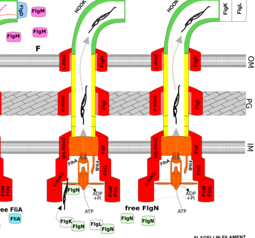

## Question

# Gene Research for Functional Annotation

## ⚠️ CRITICAL: Gene/Protein Identification Context

**BEFORE YOU BEGIN RESEARCH:** You MUST verify you are researching the CORRECT gene/protein. Gene symbols can be ambiguous, especially for less well-characterized genes from non-model organisms.

### Target Gene/Protein Identity (from UniProt):
- **UniProt Accession:** Q88ES2
- **Protein Description:** RecName: Full=Flagellar hook-associated protein 1 {ECO:0000256|ARBA:ARBA00016244};
- **Gene Information:** Name=flgK {ECO:0000313|EMBL:AAN69959.1}; OrderedLocusNames=PP_4381 {ECO:0000313|EMBL:AAN69959.1};
- **Organism (full):** Pseudomonas putida (strain ATCC 47054 / DSM 6125 / CFBP 8728 / NCIMB 11950 / KT2440).
- **Protein Family:** Belongs to the flagella basal body rod proteins family.
- **Key Domains:** Flag_bb_rod_N. (IPR001444); Flagellar_basal_body_rod_CS. (IPR019776); Flg_bb/hook_C_dom. (IPR010930); FlgK. (IPR002371); FlgK_D2-like. (IPR049119)

### MANDATORY VERIFICATION STEPS:

1. **Check if the gene symbol "flgK" matches the protein description above**
2. **Verify the organism is correct:** Pseudomonas putida (strain ATCC 47054 / DSM 6125 / CFBP 8728 / NCIMB 11950 / KT2440).
3. **Check if protein family/domains align with what you find in literature**
4. **If you find literature for a DIFFERENT gene with the same or similar symbol, STOP**

### If Gene Symbol is Ambiguous or You Cannot Find Relevant Literature:

**DO NOT PROCEED WITH RESEARCH ON A DIFFERENT GENE.** Instead:
- State clearly: "The gene symbol 'flgK' is ambiguous or literature is limited for this specific protein"
- Explain what you found (e.g., "Found extensive literature on a different gene with the same symbol in a different organism")
- Describe the protein based ONLY on the UniProt information provided above
- Suggest that the protein function can be inferred from domain/family information

### Research Target:

Please provide a comprehensive research report on the gene **flgK** (gene ID: flgK, UniProt: Q88ES2) in PSEPK.

The research report should be a detailed narrative explaining the function, biological processes, and localization of the gene product. Citations should be given for all claims.

You should prioritize authoritative reviews and primary scientific literature when conducting research. You can supplement
this with annotations you find in gene/protein databases, but these can be outdated or inaccurate.

We are specifically interested in the primary function of the gene - for enzymes, what reaction is catalyzed, and what is the substrate specificity? For transporters, what is the substrate? For structural proteins or adapters, what is the broader structural role? For signaling molecules, what is the role in the pathway.

We are interested in where in or outside the cell the gene product carries out its function.

We are also interested in the signaling or biochemical pathways in which the gene functions. We are less interested in broad pleiotropic effects, except where these elucidate the precise role.

Include evidence where possible. We are interested in both experimental evidence as well as inference from structure, evolution, or bioinformatic analysis. Precise studies should be prioritized over high-throughput, where available.

## Output

Question: You are an expert researcher providing comprehensive, well-cited information.

Provide detailed information focusing on:
1. Key concepts and definitions with current understanding
2. Recent developments and latest research (prioritize 2023-2024 sources)
3. Current applications and real-world implementations
4. Expert opinions and analysis from authoritative sources
5. Relevant statistics and data from recent studies

Format as a comprehensive research report with proper citations. Include URLs and publication dates where available.
Always prioritize recent, authoritative sources and provide specific citations for all major claims.

# Gene Research for Functional Annotation

## ⚠️ CRITICAL: Gene/Protein Identification Context

**BEFORE YOU BEGIN RESEARCH:** You MUST verify you are researching the CORRECT gene/protein. Gene symbols can be ambiguous, especially for less well-characterized genes from non-model organisms.

### Target Gene/Protein Identity (from UniProt):
- **UniProt Accession:** Q88ES2
- **Protein Description:** RecName: Full=Flagellar hook-associated protein 1 {ECO:0000256|ARBA:ARBA00016244};
- **Gene Information:** Name=flgK {ECO:0000313|EMBL:AAN69959.1}; OrderedLocusNames=PP_4381 {ECO:0000313|EMBL:AAN69959.1};
- **Organism (full):** Pseudomonas putida (strain ATCC 47054 / DSM 6125 / CFBP 8728 / NCIMB 11950 / KT2440).
- **Protein Family:** Belongs to the flagella basal body rod proteins family.
- **Key Domains:** Flag_bb_rod_N. (IPR001444); Flagellar_basal_body_rod_CS. (IPR019776); Flg_bb/hook_C_dom. (IPR010930); FlgK. (IPR002371); FlgK_D2-like. (IPR049119)

### MANDATORY VERIFICATION STEPS:

1. **Check if the gene symbol "flgK" matches the protein description above**
2. **Verify the organism is correct:** Pseudomonas putida (strain ATCC 47054 / DSM 6125 / CFBP 8728 / NCIMB 11950 / KT2440).
3. **Check if protein family/domains align with what you find in literature**
4. **If you find literature for a DIFFERENT gene with the same or similar symbol, STOP**

### If Gene Symbol is Ambiguous or You Cannot Find Relevant Literature:

**DO NOT PROCEED WITH RESEARCH ON A DIFFERENT GENE.** Instead:
- State clearly: "The gene symbol 'flgK' is ambiguous or literature is limited for this specific protein"
- Explain what you found (e.g., "Found extensive literature on a different gene with the same symbol in a different organism")
- Describe the protein based ONLY on the UniProt information provided above
- Suggest that the protein function can be inferred from domain/family information

### Research Target:

Please provide a comprehensive research report on the gene **flgK** (gene ID: flgK, UniProt: Q88ES2) in PSEPK.

The research report should be a detailed narrative explaining the function, biological processes, and localization of the gene product. Citations should be given for all claims.

You should prioritize authoritative reviews and primary scientific literature when conducting research. You can supplement
this with annotations you find in gene/protein databases, but these can be outdated or inaccurate.

We are specifically interested in the primary function of the gene - for enzymes, what reaction is catalyzed, and what is the substrate specificity? For transporters, what is the substrate? For structural proteins or adapters, what is the broader structural role? For signaling molecules, what is the role in the pathway.

We are interested in where in or outside the cell the gene product carries out its function.

We are also interested in the signaling or biochemical pathways in which the gene functions. We are less interested in broad pleiotropic effects, except where these elucidate the precise role.

Include evidence where possible. We are interested in both experimental evidence as well as inference from structure, evolution, or bioinformatic analysis. Precise studies should be prioritized over high-throughput, where available.

## Research Report: Functional Annotation of **flgK** (UniProt **Q88ES2**) in *Pseudomonas putida* KT2440

### 1) Mandatory target verification (identity and scope)

**Target specified by user:** UniProt **Q88ES2**, gene **flgK**, ordered locus **PP_4381**, organism *Pseudomonas putida* (strain KT2440). The retrieved literature supports that **flgK** in Gram-negative bacteria and in *Pseudomonas* refers to a **hook–filament junction protein** (also historically termed **HAP1**) that functions together with FlgL to connect the hook to the filament. This matches the UniProt-provided description (“flagellar hook-associated protein 1”) and the functional assignment of **flgK** in a *Pseudomonas* flagella review. (bouteiller2021pseudomonasflagellageneralities pages 2-4)

**Important limitation:** within the documents retrieved in this run, I did **not** find a primary paper explicitly mapping **locus tag PP_4381** to **flgK** by sequence, genetics, or direct annotation transfer. Therefore, **the PP_4381↔flgK mapping is treated here as coming from the user-provided UniProt record**, while the **function** is supported by conserved flagellar biology and authoritative reviews. (bouteiller2021pseudomonasflagellageneralities pages 2-4)

### 2) Key concepts and definitions (current understanding)

#### 2.1 Flagellar architecture and where FlgK fits
The bacterial flagellum is a large macromolecular machine consisting of (i) a basal body/motor embedded in the cell envelope, (ii) a **hook** that acts as a **universal joint**, and (iii) a **filament** that serves as the helical propeller. Assembly is sequential and requires exporting subunits through the **flagellar type III secretion system (fT3SS)** to the distal end, where polymerization occurs. (minamino2023structureassemblyand pages 1-3)

Because the **hook** and **filament** differ in structural properties, **flagellin cannot assemble directly onto the hook tip**. A dedicated **hook–filament junction** is formed to bridge this interface. (nakamura2024structureanddynamics pages 6-8)

#### 2.2 Definition of FlgK function
**FlgK is a structural adapter** at the **hook–filament junction**. In *Pseudomonas* gene-function mapping tables, **flgK** is explicitly annotated as “**hook/filament junction protein**”. (bouteiller2021pseudomonasflagellageneralities pages 2-4)

In *Pseudomonas* (polar flagellates), after hook completion and regulatory transitions, **hook-associated proteins FlgK and FlgL are exported** “to ensure junction protein insertion,” and these proteins are **chaperoned by FlgN** (FlgN is described as not essential for FlgK/L secretion). (bouteiller2021pseudomonasflagellageneralities pages 9-11)

### 3) Mechanistic role in pathway context (flagellar assembly)

#### 3.1 Export timing and assembly checkpoint logic
In the canonical assembly logic summarized in recent reviews, the fT3SS exports substrates in an ordered fashion as the axial structure grows. In the *Pseudomonas* flagellar assembly model, **FlgK/FlgL export occurs after FlgM release** (i.e., after the checkpoint associated with hook completion that frees the alternative sigma factor FliA to activate late genes). (bouteiller2021pseudomonasflagellageneralities pages 9-11, bouteiller2021pseudomonasflagellageneralities pages 11-12)

The broader flagellar assembly review framework emphasizes that subunits are transported to the distal tip through the fT3SS, and that the hook-to-filament transition is a key stage in which specialized components (junction proteins and cap proteins) enable productive filament growth. (minamino2023structureassemblyand pages 1-3)

#### 3.2 Consequences of FlgK loss (functional necessity)
A 2024 review synthesizing high-resolution structural and mechanistic work states that the junction is required because of the hook/filament mismatch; it also reports that **if FlgK, FlgL, or the filament cap FliD is missing, exported flagellin fails to polymerize into the filament and instead leaks into the medium**. (nakamura2024structureanddynamics pages 6-8)

### 4) Structural biology, domains, and localization

#### 4.1 Localization
FlgK functions in the **extracellular axial structure** at the interface between hook and filament, i.e., outside the cytoplasm in the assembled flagellum. Its subunits are exported through the **fT3SS** and incorporated at the growing distal end during the hook-to-filament transition. (minamino2023structureassemblyand pages 1-3, bouteiller2021pseudomonasflagellageneralities pages 9-11)

#### 4.2 Stoichiometry and architecture (recent structural consensus)
A 2024 review reports a quantitative stoichiometry for the junction: it is composed of **11 FlgK subunits and 11 FlgL subunits** forming an adapter that **firmly connects** hook and filament. (nakamura2024structureanddynamics pages 6-8)

That same review provides key quantitative context for the filament: the filament is assembled from **~30,000 flagellin subunits** and uses a **pentameric** filament cap (FliD) to facilitate growth, underscoring the scale of the structure that the FlgK/FlgL junction must mechanically support. (nakamura2024structureanddynamics pages 6-8)

#### 4.3 Visual schematic evidence (Pseudomonas-focused)
The *Pseudomonas* flagella review provides a schematic in which FlgK and FlgL are shown being inserted at the junction after regulatory transitions, supporting the stepwise export-and-assembly model. (bouteiller2021pseudomonasflagellageneralities media bfdc64bd)

It also provides a schematic of the *Pseudomonas* **four-tier transcriptional/assembly hierarchy**, contextualizing when junction proteins appear relative to earlier basal-body/hook steps and later filament steps. (bouteiller2021pseudomonasflagellageneralities media 24df018c)

### 5) Regulation in *Pseudomonas* (expert synthesis)

#### 5.1 Four-tier flagellar gene regulation in *Pseudomonas*
A comprehensive *Pseudomonas* flagella review describes that, unlike enteric bacteria, *Pseudomonas* uses a **four-tier hierarchical transcriptional cascade** (classes I–IV), with **FleQ** as a master regulator and **FliA** controlling late genes. (bouteiller2021pseudomonasflagellageneralities pages 11-12)

In this framework, the release of FlgM inhibition and subsequent export of hook-associated proteins including **FlgK/FlgL** is part of the coordinated progression from hook completion to filament assembly. (bouteiller2021pseudomonasflagellageneralities pages 9-11, bouteiller2021pseudomonasflagellageneralities pages 11-12)

### 6) Recent developments (prioritizing 2023–2024)

#### 6.1 2023–2024 synthesis: moving from parts lists to mechanistic/structural explanations
Two recent authoritative sources illustrate the current state of the field:

* **Minamino & Kinoshita (EcoSal Plus, 2023-12; https://doi.org/10.1128/ecosalplus.esp-0011-2023)** summarizes how ordered export, assembly checkpoints, and distal-tip polymerization generate a mature flagellum, placing the hook–filament junction in the broader assembly logic. (minamino2023structureassemblyand pages 1-3)

* **Nakamura & Minamino (Biomolecules, 2024-11; https://doi.org/10.3390/biom14121488)** provides an updated structural/mechanistic synthesis and explicitly reports **junction stoichiometry (11 FlgK + 11 FlgL)** and the experimentally inferred phenotype that loss of junction/cap components causes **flagellin leakage** due to failed polymerization. (nakamura2024structureanddynamics pages 6-8)

Together, these reflect a 2023–2024 trend: increasingly high-resolution structural knowledge is being integrated with genetics/biophysics to explain not just “what proteins exist” but **why particular adapters like FlgK are required** at specific assembly transitions. (minamino2023structureassemblyand pages 1-3, nakamura2024structureanddynamics pages 6-8)

### 7) Current applications and real-world implementations (flagella-level relevance)

#### 7.1 Environmental fitness, colonization, and engineered strains
Flagella-driven motility is repeatedly framed in authoritative sources as enabling **adhesion, colonization, and competitiveness** in diverse contexts; in *Pseudomonas*, this is intertwined with regulatory switches that coordinate motility versus sessility/biofilm states. (minamino2023structureassemblyand pages 1-3, bouteiller2021pseudomonasflagellageneralities pages 11-12)

Because **FlgK is essential for assembling a functional filament** (and thus a functional propeller), any applied setting that depends on motility—e.g., dispersal toward nutrients, surface colonization dynamics, or transitioning between planktonic and surface-associated states—implicitly depends on intact **flgK** function. This application linkage is therefore **strong at the level of flagellar biology**, but **KT2440 flgK-specific applied studies were not retrieved** in this run. (bouteiller2021pseudomonasflagellageneralities pages 2-4, nakamura2024structureanddynamics pages 6-8)

### 8) Relevant statistics and data points from recent studies/reviews

* **Hook–filament junction stoichiometry:** **11 FlgK + 11 FlgL** subunits. (nakamura2024structureanddynamics pages 6-8)
* **Filament scale:** filament assembled from **~30,000** flagellin subunits; cap is **pentameric** (FliD). (nakamura2024structureanddynamics pages 6-8)
* **Functional dependency:** absence of **FlgK/FlgL/FliD** leads to failure of flagellin polymerization and **leakage into the culture medium**. (nakamura2024structureanddynamics pages 6-8)

### 9) Summary functional annotation (structured)

| Annotation aspect | Summary for FlgK (Q88ES2 / PP_4381) | Evidence type | Citations |
|---|---|---|---|
| Verified identity | Target protein is **FlgK, flagellar hook-associated protein 1** from **Pseudomonas putida KT2440**; the requested annotation (UniProt Q88ES2; ordered locus **PP_4381**) is consistent with the conserved **hook/filament junction protein** role assigned to **flgK** in Pseudomonas flagellar systems. Direct locus-to-function confirmation for **PP_4381** was not found in the retrieved literature, so the PP_4381 mapping here relies on the user-provided UniProt identifier plus Pseudomonas flgK functional annotation from reviews. | Database-linked identity check + review-based functional concordance | (bouteiller2021pseudomonasflagellageneralities pages 2-4, bouteiller2021pseudomonasflagellageneralities pages 11-12) |
| Cellular localization | FlgK acts in the **cell envelope/extracellular axial structure** at the **distal end of the hook**, where it is exported by the **flagellar type III secretion system (fT3SS)** and inserted as part of the hook–filament junction before filament growth. | Review | (minamino2023structureassemblyand pages 1-3, bouteiller2021pseudomonasflagellageneralities pages 9-11) |
| Primary function in flagellar assembly | FlgK is a **structural adapter**, not an enzyme or transporter. Together with FlgL, it forms the **hook–filament junction** that connects the flexible hook to the filament, enabling mechanical continuity and the transition from hook completion to filament assembly. Loss of junction components prevents proper filament polymerization. | Review + structural synthesis | (minamino2023structureassemblyand pages 1-3, bouteiller2021pseudomonasflagellageneralities pages 9-11, nakamura2024structureanddynamics pages 6-8) |
| Key structural / stoichiometry details | Recent structural synthesis reports the hook–filament junction as **11 FlgK subunits + 11 FlgL subunits**, forming a ring-like adapter between hook and filament. This junction buffers the structural mismatch between hook and filament and is essential for productive filament growth. | Cryo-EM-informed review / structural analysis | (nakamura2024structureanddynamics pages 6-8, nakamura2024structureanddynamics pages 8-9, bouteiller2021pseudomonasflagellageneralities media bfdc64bd) |
| Regulation / expression class in Pseudomonas | In **Pseudomonas**, flagellar genes are controlled by a **four-tier transcriptional cascade**. flgK is assigned in review literature to the **late FliA-dependent program (Class III in the review’s Salmonella/Pseudomonas mapping table; functionally late-stage junction assembly before/with filament assembly)**, and junction proteins are exported after hook completion and FlgM release. | Review / regulatory model | (bouteiller2021pseudomonasflagellageneralities pages 2-4, bouteiller2021pseudomonasflagellageneralities pages 9-11, bouteiller2021pseudomonasflagellageneralities pages 11-12) |
| Related pathway context | FlgK functions within the **flagellar biogenesis pathway**, downstream of hook completion and upstream of bulk flagellin polymerization. Its export order is coordinated with chaperones such as **FlgN**, and correct timing is linked to the secretion specificity switch that follows hook completion. | Review | (minamino2023structureassemblyand pages 1-3, bouteiller2021pseudomonasflagellageneralities pages 9-11) |
| Genetics / phenotype relevance | Although no KT2440-specific **flgK** mutant paper was retrieved, broader flagellar genetics in Pseudomonas and enteric models indicate that disruption of **FlgK/FlgL** abolishes normal filament assembly and motility because exported flagellin cannot polymerize efficiently without the junction. | Genetics + comparative inference | (nakamura2024structureanddynamics pages 6-8, bouteiller2021pseudomonasflagellageneralities pages 2-4) |
| Limitations / KT2440-specific evidence gaps | **KT2440-specific primary studies directly testing PP_4381/flgK were not retrieved**. Therefore, the annotation is strong for **conserved molecular function** but weaker for **strain-specific phenotypes, operon mapping, and direct experimental localization** in KT2440. The most reliable claims come from conserved flagellar biology, Pseudomonas reviews, and recent structural work rather than direct PP_4381 experiments. | Evidence-gap assessment | (minamino2023structureassemblyand pages 1-3, bouteiller2021pseudomonasflagellageneralities pages 2-4, nakamura2024structureanddynamics pages 6-8) |

*Table: This table summarizes the best-supported functional annotation for FlgK (UniProt Q88ES2) in Pseudomonas putida KT2440, integrating conserved flagellar biology, Pseudomonas-specific regulatory reviews, and recent structural evidence. It also makes explicit where KT2440-specific evidence for PP_4381 remains limited.*

### 10) Evidence gaps and recommended next steps (to strengthen KT2440-specific annotation)

1. **Strain-specific genetics:** No KT2440 **flgK (PP_4381)** knockout/allelic replacement phenotype paper was retrieved here. A targeted search in KT2440 mutant libraries or genome-scale fitness datasets may provide direct motility phenotypes.
2. **Direct locus mapping:** To fully satisfy “PP_4381 encodes FlgK” using literature alone, an explicit mapping source (e.g., genome annotation paper, locus-tag table, or experimental validation) should be added.

### Key cited sources (with dates and URLs)

* Minamino T, Kinoshita M. **Structure, Assembly, and Function of Flagella Responsible for Bacterial Locomotion.** *EcoSal Plus*. **Dec 2023**. https://doi.org/10.1128/ecosalplus.esp-0011-2023 (minamino2023structureassemblyand pages 1-3)
* Nakamura S, Minamino T. **Structure and Dynamics of the Bacterial Flagellar Motor Complex.** *Biomolecules*. **Nov 2024**. https://doi.org/10.3390/biom14121488 (nakamura2024structureanddynamics pages 6-8)
* Bouteiller M, et al. **Pseudomonas Flagella: Generalities and Specificities.** *Int J Mol Sci*. **Mar 2021**. https://doi.org/10.3390/ijms22073337 (bouteiller2021pseudomonasflagellageneralities pages 2-4, bouteiller2021pseudomonasflagellageneralities pages 9-11, bouteiller2021pseudomonasflagellageneralities pages 11-12, bouteiller2021pseudomonasflagellageneralities media bfdc64bd, bouteiller2021pseudomonasflagellageneralities media 24df018c)

References

1. (bouteiller2021pseudomonasflagellageneralities pages 2-4): Mathilde Bouteiller, Charly Dupont, Yvann Bourigault, Xavier Latour, Corinne Barbey, Yoan Konto-Ghiorghi, and Annabelle Merieau. Pseudomonas flagella: generalities and specificities. International Journal of Molecular Sciences, 22:3337, Mar 2021. URL: https://doi.org/10.3390/ijms22073337, doi:10.3390/ijms22073337. This article has 147 citations.

2. (minamino2023structureassemblyand pages 1-3): Tohru Minamino and Miki Kinoshita. Structure, assembly, and function of flagella responsible for bacterial locomotion. EcoSal Plus, Dec 2023. URL: https://doi.org/10.1128/ecosalplus.esp-0011-2023, doi:10.1128/ecosalplus.esp-0011-2023. This article has 56 citations.

3. (nakamura2024structureanddynamics pages 6-8): Shuichi Nakamura and Tohru Minamino. Structure and dynamics of the bacterial flagellar motor complex. Biomolecules, 14:1488, Nov 2024. URL: https://doi.org/10.3390/biom14121488, doi:10.3390/biom14121488. This article has 25 citations.

4. (bouteiller2021pseudomonasflagellageneralities pages 9-11): Mathilde Bouteiller, Charly Dupont, Yvann Bourigault, Xavier Latour, Corinne Barbey, Yoan Konto-Ghiorghi, and Annabelle Merieau. Pseudomonas flagella: generalities and specificities. International Journal of Molecular Sciences, 22:3337, Mar 2021. URL: https://doi.org/10.3390/ijms22073337, doi:10.3390/ijms22073337. This article has 147 citations.

5. (bouteiller2021pseudomonasflagellageneralities pages 11-12): Mathilde Bouteiller, Charly Dupont, Yvann Bourigault, Xavier Latour, Corinne Barbey, Yoan Konto-Ghiorghi, and Annabelle Merieau. Pseudomonas flagella: generalities and specificities. International Journal of Molecular Sciences, 22:3337, Mar 2021. URL: https://doi.org/10.3390/ijms22073337, doi:10.3390/ijms22073337. This article has 147 citations.

6. (bouteiller2021pseudomonasflagellageneralities media bfdc64bd): Mathilde Bouteiller, Charly Dupont, Yvann Bourigault, Xavier Latour, Corinne Barbey, Yoan Konto-Ghiorghi, and Annabelle Merieau. Pseudomonas flagella: generalities and specificities. International Journal of Molecular Sciences, 22:3337, Mar 2021. URL: https://doi.org/10.3390/ijms22073337, doi:10.3390/ijms22073337. This article has 147 citations.

7. (bouteiller2021pseudomonasflagellageneralities media 24df018c): Mathilde Bouteiller, Charly Dupont, Yvann Bourigault, Xavier Latour, Corinne Barbey, Yoan Konto-Ghiorghi, and Annabelle Merieau. Pseudomonas flagella: generalities and specificities. International Journal of Molecular Sciences, 22:3337, Mar 2021. URL: https://doi.org/10.3390/ijms22073337, doi:10.3390/ijms22073337. This article has 147 citations.

8. (nakamura2024structureanddynamics pages 8-9): Shuichi Nakamura and Tohru Minamino. Structure and dynamics of the bacterial flagellar motor complex. Biomolecules, 14:1488, Nov 2024. URL: https://doi.org/10.3390/biom14121488, doi:10.3390/biom14121488. This article has 25 citations.

## Artifacts

- [Edison artifact artifact-00](flgK-deep-research-falcon_artifacts/artifact-00.md)

## Citations

1. bouteiller2021pseudomonasflagellageneralities pages 2-4
2. minamino2023structureassemblyand pages 1-3
3. nakamura2024structureanddynamics pages 6-8
4. bouteiller2021pseudomonasflagellageneralities pages 9-11
5. bouteiller2021pseudomonasflagellageneralities pages 11-12
6. nakamura2024structureanddynamics pages 8-9
7. https://doi.org/10.1128/ecosalplus.esp-0011-2023
8. https://doi.org/10.3390/biom14121488
9. https://doi.org/10.3390/ijms22073337
10. https://doi.org/10.3390/ijms22073337,
11. https://doi.org/10.1128/ecosalplus.esp-0011-2023,
12. https://doi.org/10.3390/biom14121488,