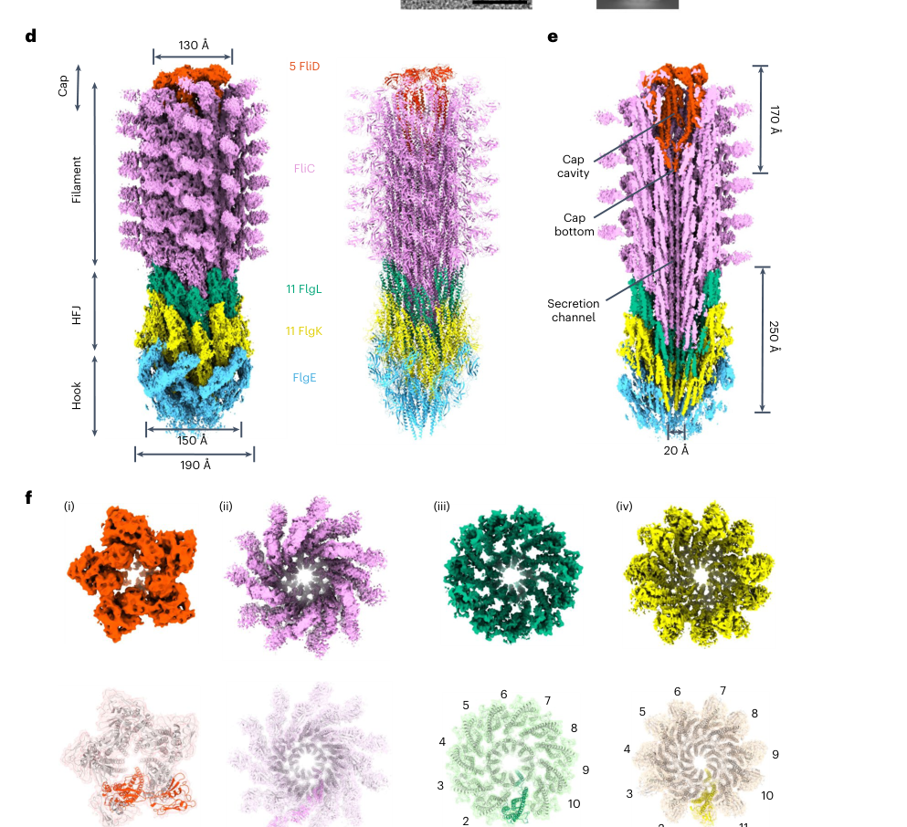

## Question

# Gene Research for Functional Annotation

## ⚠️ CRITICAL: Gene/Protein Identification Context

**BEFORE YOU BEGIN RESEARCH:** You MUST verify you are researching the CORRECT gene/protein. Gene symbols can be ambiguous, especially for less well-characterized genes from non-model organisms.

### Target Gene/Protein Identity (from UniProt):
- **UniProt Accession:** Q88ES3
- **Protein Description:** SubName: Full=Flagellar hook-associated protein FlgL {ECO:0000313|EMBL:AAN69958.1};
- **Gene Information:** Name=flgL {ECO:0000313|EMBL:AAN69958.1}; OrderedLocusNames=PP_4380 {ECO:0000313|EMBL:AAN69958.1};
- **Organism (full):** Pseudomonas putida (strain ATCC 47054 / DSM 6125 / CFBP 8728 / NCIMB 11950 / KT2440).
- **Protein Family:** Belongs to the bacterial flagellin family.
- **Key Domains:** Flagell_FlgL. (IPR013384); Flagellin. (IPR001492); Flagellin_N. (IPR001029); Flagellin_N (PF00669)

### MANDATORY VERIFICATION STEPS:

1. **Check if the gene symbol "flgL" matches the protein description above**
2. **Verify the organism is correct:** Pseudomonas putida (strain ATCC 47054 / DSM 6125 / CFBP 8728 / NCIMB 11950 / KT2440).
3. **Check if protein family/domains align with what you find in literature**
4. **If you find literature for a DIFFERENT gene with the same or similar symbol, STOP**

### If Gene Symbol is Ambiguous or You Cannot Find Relevant Literature:

**DO NOT PROCEED WITH RESEARCH ON A DIFFERENT GENE.** Instead:
- State clearly: "The gene symbol 'flgL' is ambiguous or literature is limited for this specific protein"
- Explain what you found (e.g., "Found extensive literature on a different gene with the same symbol in a different organism")
- Describe the protein based ONLY on the UniProt information provided above
- Suggest that the protein function can be inferred from domain/family information

### Research Target:

Please provide a comprehensive research report on the gene **flgL** (gene ID: flgL, UniProt: Q88ES3) in PSEPK.

The research report should be a detailed narrative explaining the function, biological processes, and localization of the gene product. Citations should be given for all claims.

You should prioritize authoritative reviews and primary scientific literature when conducting research. You can supplement
this with annotations you find in gene/protein databases, but these can be outdated or inaccurate.

We are specifically interested in the primary function of the gene - for enzymes, what reaction is catalyzed, and what is the substrate specificity? For transporters, what is the substrate? For structural proteins or adapters, what is the broader structural role? For signaling molecules, what is the role in the pathway.

We are interested in where in or outside the cell the gene product carries out its function.

We are also interested in the signaling or biochemical pathways in which the gene functions. We are less interested in broad pleiotropic effects, except where these elucidate the precise role.

Include evidence where possible. We are interested in both experimental evidence as well as inference from structure, evolution, or bioinformatic analysis. Precise studies should be prioritized over high-throughput, where available.

## Output

Question: You are an expert researcher providing comprehensive, well-cited information.

Provide detailed information focusing on:
1. Key concepts and definitions with current understanding
2. Recent developments and latest research (prioritize 2023-2024 sources)
3. Current applications and real-world implementations
4. Expert opinions and analysis from authoritative sources
5. Relevant statistics and data from recent studies

Format as a comprehensive research report with proper citations. Include URLs and publication dates where available.
Always prioritize recent, authoritative sources and provide specific citations for all major claims.

# Gene Research for Functional Annotation

## ⚠️ CRITICAL: Gene/Protein Identification Context

**BEFORE YOU BEGIN RESEARCH:** You MUST verify you are researching the CORRECT gene/protein. Gene symbols can be ambiguous, especially for less well-characterized genes from non-model organisms.

### Target Gene/Protein Identity (from UniProt):
- **UniProt Accession:** Q88ES3
- **Protein Description:** SubName: Full=Flagellar hook-associated protein FlgL {ECO:0000313|EMBL:AAN69958.1};
- **Gene Information:** Name=flgL {ECO:0000313|EMBL:AAN69958.1}; OrderedLocusNames=PP_4380 {ECO:0000313|EMBL:AAN69958.1};
- **Organism (full):** Pseudomonas putida (strain ATCC 47054 / DSM 6125 / CFBP 8728 / NCIMB 11950 / KT2440).
- **Protein Family:** Belongs to the bacterial flagellin family.
- **Key Domains:** Flagell_FlgL. (IPR013384); Flagellin. (IPR001492); Flagellin_N. (IPR001029); Flagellin_N (PF00669)

### MANDATORY VERIFICATION STEPS:

1. **Check if the gene symbol "flgL" matches the protein description above**
2. **Verify the organism is correct:** Pseudomonas putida (strain ATCC 47054 / DSM 6125 / CFBP 8728 / NCIMB 11950 / KT2440).
3. **Check if protein family/domains align with what you find in literature**
4. **If you find literature for a DIFFERENT gene with the same or similar symbol, STOP**

### If Gene Symbol is Ambiguous or You Cannot Find Relevant Literature:

**DO NOT PROCEED WITH RESEARCH ON A DIFFERENT GENE.** Instead:
- State clearly: "The gene symbol 'flgL' is ambiguous or literature is limited for this specific protein"
- Explain what you found (e.g., "Found extensive literature on a different gene with the same symbol in a different organism")
- Describe the protein based ONLY on the UniProt information provided above
- Suggest that the protein function can be inferred from domain/family information

### Research Target:

Please provide a comprehensive research report on the gene **flgL** (gene ID: flgL, UniProt: Q88ES3) in PSEPK.

The research report should be a detailed narrative explaining the function, biological processes, and localization of the gene product. Citations should be given for all claims.

You should prioritize authoritative reviews and primary scientific literature when conducting research. You can supplement
this with annotations you find in gene/protein databases, but these can be outdated or inaccurate.

We are specifically interested in the primary function of the gene - for enzymes, what reaction is catalyzed, and what is the substrate specificity? For transporters, what is the substrate? For structural proteins or adapters, what is the broader structural role? For signaling molecules, what is the role in the pathway.

We are interested in where in or outside the cell the gene product carries out its function.

We are also interested in the signaling or biochemical pathways in which the gene functions. We are less interested in broad pleiotropic effects, except where these elucidate the precise role.

Include evidence where possible. We are interested in both experimental evidence as well as inference from structure, evolution, or bioinformatic analysis. Precise studies should be prioritized over high-throughput, where available.

## Research report: **flgL (PP_4380; UniProt Q88ES3)** in *Pseudomonas putida* KT2440

### 0) Target verification (critical disambiguation)
The target described in the prompt (UniProt Q88ES3) corresponds to **flgL** in *Pseudomonas putida* KT2440, with ordered locus name **PP_4380** (as provided by the user). Independent literature sources that explicitly connect **PP_4380 ↔ flgL** in KT2440 and place it in the canonical flagellar neighborhood were identified, reducing the risk of symbol ambiguity. In a comparative gene mapping table for *Pseudomonas* strains, **flgL is explicitly mapped to KT2440 locus PP_4380** and occurs adjacent to other flagellar genes (e.g., **flgK = PP_4381**, **flgJ = PP_4382**), consistent with the expected hook–filament junction module. (udaondo2025transcriptionalregulatorysystems pages 18-20, udaondo2025transcriptionalregulatorysystems pages 16-18)

A dedicated KT2440 flagellar-cluster study further supports that **flgL is a conserved member of the *Pseudomonas* flagellar gene cluster**, and highlights the **fliC–flgL region** as a frequent breakpoint in comparative synteny analyses of the cluster, consistent with flgL’s placement near filament-related genes. (leal‐morales2022transcriptionalorganizationand pages 4-5, leal‐morales2022transcriptionalorganizationand pages 4-4)

### 1) Key concepts and definitions (current understanding)
#### 1.1 The hook–filament junction (HFJ)
The bacterial flagellum’s extracellular portion includes the **hook**, a flexible universal-joint-like structure, and the **filament**, a comparatively rigid helical propeller. These are connected by the **hook–filament junction (HFJ)**, which is formed by the proteins **FlgK (proximal junction protein)** and **FlgL (distal junction protein)**. A high-resolution structural study of the complete extracellular flagellum describes FlgL as a **hook-associated protein** that assembles as the **distal layer** of the HFJ, directly beneath the filament and above FlgK, thereby linking the hook protein **FlgE** to the filament protein **FliC (flagellin)**. (einenkel2025thestructureof pages 2-3, einenkel2025thestructureof pages 4-5)

#### 1.2 FlgL’s primary functional role (structural adaptor; not an enzyme)
FlgL is best understood as a **structural adaptor and mechanical element** rather than an enzyme or transporter. In the HFJ, FlgL contributes to (i) creating a compatible geometric and mechanical interface between hook and filament, and (ii) enabling correct initiation/stabilization of filament assembly and cap docking. (einenkel2025thestructureof pages 10-11, einenkel2025thestructureof pages 2-3)

### 2) Molecular function, localization, and pathway context
#### 2.1 Subcellular/extracellular localization
FlgL functions in the **extracellular flagellar structure**, specifically within the **hook–filament junction** between the distal hook and the proximal filament/cap region. Cryo-EM structures show a distinct FlgL layer immediately adjacent to FlgK and beneath the filament-cap apparatus (FliD). (einenkel2025thestructureof pages 10-11, einenkel2025thestructureof pages 2-3)

#### 2.2 Assembly role and interaction partners
**Core interaction partners and architectural contacts** for FlgL at the HFJ include:
- **FlgK** (proximal HFJ layer), with which FlgL forms a two-layer HFJ. (einenkel2025thestructureof pages 8-9, einenkel2025thestructureof pages 2-3)
- **FlgE** (hook protein), to which the HFJ is anchored on the proximal side. (einenkel2025thestructureof pages 2-3, einenkel2025thestructureof pages 4-5)
- **FliC** (flagellin), the filament subunit that polymerizes distal to FlgL. (einenkel2025thestructureof pages 2-3, einenkel2025thestructureof pages 4-5)
- **FliD** (filament cap), whose stable incorporation during early filament formation is proposed to be aided by FlgL acting as an intermediate stabilizer. (einenkel2025thestructureof pages 10-11)

A recent detailed structural analysis further provides **residue-level interface evidence** for FlgK–FlgL contacts (example residues: FlgK Q111/Q118/D519 and FlgL I44/L260) and connects these interfaces to measurable motility/filament-stability phenotypes when perturbed by mutagenesis. (einenkel2025thestructureof pages 8-9)

#### 2.3 Mechanistic role in mechanical buffering
The HFJ is proposed to act as a **mechanical buffer** that limits transmission of mechanical stress from hook motion into the filament. In a 3D-variability analysis, FlgK/FlgL (and FlgE) show substantial shifts between extended/compressed states, while the filament shows minimal shift, supporting the concept that junction elasticity protects filament integrity; FlgL is part of this buffering layer (distal HFJ). (einenkel2025thestructureof pages 8-9, einenkel2025thestructureof pages 1-2)

### 3) Quantitative and structural evidence (statistics/data)
A high-authority cryo-EM study of the complete extracellular bacterial flagellum provides multiple quantitative constraints relevant for functional annotation of FlgL:

**3.1 Stoichiometry and architecture**
- The HFJ contains **11 FlgK + 11 FlgL subunits** (11-mer layers), experimentally confirming a proposed **11:11** FlgK:FlgL stoichiometry. (einenkel2025thestructureof pages 2-3, einenkel2025thestructureof pages 4-5)
- The HFJ model includes **13 FlgE + 11 FlgK + 11 FlgL + 14 FliC** subunits in the composite structural model. (einenkel2025thestructureof pages 2-3)
- Reported dimensions: HFJ extends ~**250 Å** overall; FlgK layer ~**190 Å** wide and FlgL layer ~**150 Å** wide. (einenkel2025thestructureof pages 2-3)

**3.2 Cryo-EM resolutions (structural confidence)**
- HFJ resolved at **~2.9 Å** resolution; filament cap resolved at **~3.7 Å** in the same work. (einenkel2025thestructureof pages 2-3, einenkel2025thestructureof pages 1-2)

**3.3 Functional assay statistics linked to FlgL interfaces**
Structure-guided mutagenesis at a FlgK–FlgL interface provides quantitative phenotype evidence:
- Single FlgL substitutions **I44S** and **L260S** show mild swimming reductions (~**88%** and ~**97%** of WT), but the double mutant **I44S L260S** reduces swimming more strongly (~**73%** of WT), consistent with partial redundancy/collective contribution to interface integrity. (einenkel2025thestructureof pages 9-10)
- A combined interface-perturbation across both proteins (**FlgK D519S + FlgL I44S**) reduced motility to ~**77%** of WT. (einenkel2025thestructureof pages 8-9)
- In a mechanical shearing assay, the FlgL **I44S L260S** mutant showed increased susceptibility to filament loss (WT median **3** filaments after 40× shearing vs mutant median **2**). (einenkel2025thestructureof pages 8-9)

**3.4 Visual structural evidence**
Cropped figure panels from the cryo-EM study show the **11-subunit organization** of both FlgK and FlgL layers in top view and the HFJ interface architecture. (einenkel2025thestructureof media 383e67ef, einenkel2025thestructureof media d73d0786)

### 4) Recent developments and latest research (with emphasis on 2023–2024, and limitations)
#### 4.1 What is “new” in the most recent accessible evidence
Within the accessible sources in this run, the most mechanistically informative advance is a **near-atomic (2.9 Å) HFJ structure** that explicitly resolves the **native FlgK–FlgL junction architecture**, provides quantitative stoichiometry, and connects specific interface residues to motility/filament-shearing phenotypes via structure-guided mutagenesis. (einenkel2025thestructureof pages 8-9, einenkel2025thestructureof pages 2-3, einenkel2025thestructureof pages 4-5)

#### 4.2 2023–2024 prioritization note
Despite targeted searches, **peer-reviewed 2023–2024 articles directly focused on FlgL** (especially in *Pseudomonas putida* KT2440) were not retrievable in this tool session. The report therefore relies on: (i) KT2440-specific flagellar cluster/regulation work (2022) for organism context, and (ii) a very recent high-authority structural/mechanistic flagellum study (2025) for detailed molecular function evidence, plus limited 2024 contextual material. (leal‐morales2022transcriptionalorganizationand pages 4-5, leal‐morales2022transcriptionalorganizationand pages 4-4, einenkel2025thestructureof pages 2-3, jenkins2024characterizationofnovel pages 16-21)

### 5) Current applications and real-world implementations
FlgL’s functional importance is primarily realized through its contribution to **flagellar motility**, which is widely used by bacteria for environmental navigation and surface-associated behaviors. In the structural-mutagenesis study, interface disruption in the FlgK–FlgL junction produced measurable reductions in swimming motility and increased filament loss under shear, which are experimentally tractable properties often used in microbiology and biotechnology to tune motility-dependent phenotypes (e.g., dispersal/transport in porous media or engineered colonization strategies). (einenkel2025thestructureof pages 8-9, einenkel2025thestructureof pages 9-10)

For KT2440 specifically, the flagellar system is organized into a large conserved cluster (59 genes) under hierarchical transcriptional control; this provides a practical framework for engineering motility by targeting specific structural modules such as the HFJ (FlgK/FlgL) while understanding broader regulatory consequences. (leal‐morales2022transcriptionalorganizationand pages 4-5, leal‐morales2022transcriptionalorganizationand pages 4-4)

### 6) Expert opinions and analysis (authoritative source interpretation)
A key expert-level inference emerging from the high-resolution extracellular-flagellum structure is that the HFJ is not a passive connector but a **mechanically functional buffer**; FlgL, as the distal HFJ layer, contributes to a deformable interface that isolates the filament from hook-derived mechanical strain. This interpretation is supported by (i) the layered architecture (11-mer FlgK and 11-mer FlgL rings), (ii) comparative conformational shifts observed in variability analysis, and (iii) mutational sensitivity of inter-layer contacts that impacts motility and filament retention. (einenkel2025thestructureof pages 8-9, einenkel2025thestructureof pages 2-3, einenkel2025thestructureof pages 1-2)

### 7) Summary table (evidence map)
The following table consolidates identity verification and the strongest functional/structural evidence relevant to annotating FlgL (PP_4380/Q88ES3) in *P. putida* KT2440.

| Source row | Target identity / verification | Functional role | Localization | Key interaction partners | Quantitative / structural details | Evidence type | Citations |
|---|---|---|---|---|---|---|---|
| Gene/locus verification: Leal-Morales 2022 | In *Pseudomonas putida* KT2440, **flgL** is part of the conserved flagellar gene cluster; the cluster contains ~59 flagellar-related genes, and **flgL** is positioned near **fliC**, with the **fliC–flgL** region noted as a recurrent split point in some *Pseudomonas* genomes. Supports assignment of KT2440 flgL to the canonical flagellar locus consistent with PP_4380 / UniProt Q88ES3. | Flagellar-system component inferred from genomic context and transcriptional organization. | Flagellar cluster / motility locus in KT2440. | Genomic neighborhood includes **fliC** and other flagellar genes. | ~59 genes in cluster; strong synteny conservation across analyzed *Pseudomonas* genomes. | Comparative genomics, transcript organization analysis. | (leal‐morales2022transcriptionalorganizationand pages 4-5, leal‐morales2022transcriptionalorganizationand pages 4-4) |
| Gene/locus verification: Udaondo 2025 | Explicitly maps **KT2440 locus PP_4380 = flgL**; neighboring loci include **PP_4381 = flgK** and **PP_4382 = flgJ**, placing PP_4380 in the expected flagellar neighborhood and matching the UniProt target Q88ES3. | Flagellar/motility gene assignment; supports annotation as the KT2440 **flgL** gene. | Motility / flagella gene cluster in KT2440. | Neighboring genes **flgK**, **flgJ**, plus nearby canonical flagellar genes. | Locus-level mapping: PP_4380 (flgL), PP_4381 (flgK), orthologous to *P. aeruginosa* PA1087. | Database-integrative comparative annotation table. | (udaondo2025transcriptionalregulatorysystems pages 18-20, udaondo2025transcriptionalregulatorysystems pages 16-18) |
| Mechanistic/structural: Einenkel 2025 | Defines FlgL as the **distal hook–filament junction (HFJ) protein** that, together with FlgK, links the flexible **FlgE hook** to the rigid **FliC filament** and supports initial filament/cap assembly. | Structural adaptor and mechanical buffer at the HFJ; stabilizes the emerging filament and helps prevent transmission of mechanical stress from hook motion into the filament. | Extracellular flagellum, specifically the **hook–filament junction**, distal to FlgK and proximal to filament/cap. | Direct or architectural contacts with **FlgK**, **FlgE**, **FliC**, and the **FliD** cap; interface residues reported for FlgK–FlgL include FlgK Q111/Q118/D519 with FlgL I44/L260. | HFJ cryo-EM at **2.9 Å**; cap at **3.7 Å**; HFJ contains **13 FlgE + 11 FlgK + 11 FlgL + 14 FliC** subunits; FlgK and FlgL each form **11-mer layers**; HFJ ~**250 Å** overall, with FlgK layer ~**190 Å** wide and FlgL layer ~**150 Å** wide. Mutants reduced motility to ~**73–77%** of WT in stronger combinations; shearing assay median filaments after 40× shearing: WT **3** vs FlgL double mutant **2**. | High-resolution cryo-EM, structure-guided mutagenesis, motility and shearing assays. | (einenkel2025thestructureof pages 8-9, einenkel2025thestructureof pages 10-11, einenkel2025thestructureof pages 2-3, einenkel2025thestructureof pages 4-5, einenkel2025thestructureof pages 9-10, einenkel2025thestructureof pages 1-2, einenkel2025thestructureof pages 14-15, einenkel2025thestructureof media 383e67ef, einenkel2025thestructureof media d73d0786) |

*Table: This table summarizes verification that PP_4380 in *Pseudomonas putida* KT2440 corresponds to flgL/UniProt Q88ES3 and condenses the strongest structural and mechanistic evidence for FlgL’s role at the hook–filament junction. It is useful for separating organism-specific locus validation from broader conserved functional evidence.*

### 8) Practical functional annotation (recommended wording)
Based on organism-specific locus mapping and cross-species conserved structural evidence, the most defensible functional annotation for *P. putida* KT2440 FlgL (PP_4380; UniProt Q88ES3, as provided) is:
- **Function:** Flagellar hook–filament junction protein; distal junction component that assembles with FlgK in an 11-mer ring/layer to connect the FlgE hook to the FliC filament and support early filament/cap stabilization and mechanical buffering. (einenkel2025thestructureof pages 10-11, einenkel2025thestructureof pages 2-3, einenkel2025thestructureof pages 4-5)
- **Cellular location:** Extracellular flagellum; hook–filament junction. (einenkel2025thestructureof pages 10-11, einenkel2025thestructureof pages 2-3)
- **Pathway/process:** Flagellar assembly and motility; located in the conserved KT2440 flagellar gene cluster. (udaondo2025transcriptionalregulatorysystems pages 16-18, leal‐morales2022transcriptionalorganizationand pages 4-5)

---

## Key sources with URLs and publication dates
- Einenkel R, et al. **“The structure of the complete extracellular bacterial flagellum reveals the mechanism of flagellin incorporation.”** *Nature Microbiology* (July 2025). https://doi.org/10.1038/s41564-025-02037-0 (einenkel2025thestructureof pages 8-9, einenkel2025thestructureof pages 2-3, einenkel2025thestructureof pages 1-2)
- Leal-Morales A, et al. **“Transcriptional organization and regulation of the Pseudomonas putida flagellar system.”** *Environmental Microbiology* (Dec 2022). https://doi.org/10.1111/1462-2920.15857 (leal‐morales2022transcriptionalorganizationand pages 4-5, leal‐morales2022transcriptionalorganizationand pages 4-4)
- Udaondo Z, et al. **“Transcriptional Regulatory Systems in Pseudomonas: A Comparative Analysis…”** *International Journal of Molecular Sciences* (May 2025). https://doi.org/10.3390/ijms26104677 (udaondo2025transcriptionalregulatorysystems pages 18-20, udaondo2025transcriptionalregulatorysystems pages 16-18)

### Notes on scope and evidence strength
- The strongest mechanistic/structural statements about FlgL in this report derive from direct cryo-EM and mutagenesis evidence in a model organism context (Salmonella/Campylobacter extracellular flagellum) and are used here as **functional inference by homology** for KT2440 FlgL, which is supported by explicit KT2440 locus mapping and conserved flagellar gene-cluster context. (udaondo2025transcriptionalregulatorysystems pages 18-20, udaondo2025transcriptionalregulatorysystems pages 16-18, einenkel2025thestructureof pages 2-3)
- No KT2440-specific FlgL knockout/phenotyping paper was retrievable in this session; therefore, KT2440-specific functional claims are limited to genomic/regulatory context and conservative homology-based annotation. (leal‐morales2022transcriptionalorganizationand pages 4-5, leal‐morales2022transcriptionalorganizationand pages 4-4)

References

1. (udaondo2025transcriptionalregulatorysystems pages 18-20): Zulema Udaondo, Kelsey Aguirre Schilder, Ana Rosa Márquez Blesa, Mireia Tena-Garitaonaindia, José Canto Mangana, and Abdelali Daddaoua. Transcriptional regulatory systems in pseudomonas: a comparative analysis of helix-turn-helix domains and two-component signal transduction networks. International Journal of Molecular Sciences, 26:4677, May 2025. URL: https://doi.org/10.3390/ijms26104677, doi:10.3390/ijms26104677. This article has 1 citations.

2. (udaondo2025transcriptionalregulatorysystems pages 16-18): Zulema Udaondo, Kelsey Aguirre Schilder, Ana Rosa Márquez Blesa, Mireia Tena-Garitaonaindia, José Canto Mangana, and Abdelali Daddaoua. Transcriptional regulatory systems in pseudomonas: a comparative analysis of helix-turn-helix domains and two-component signal transduction networks. International Journal of Molecular Sciences, 26:4677, May 2025. URL: https://doi.org/10.3390/ijms26104677, doi:10.3390/ijms26104677. This article has 1 citations.

3. (leal‐morales2022transcriptionalorganizationand pages 4-5): Antonio Leal‐Morales, Marta Pulido‐Sánchez, Aroa López‐Sánchez, and Fernando Govantes. Transcriptional organization and regulation of the <i>pseudomonas putida</i> flagellar system. Environmental Microbiology, 24:137-157, Dec 2022. URL: https://doi.org/10.1111/1462-2920.15857, doi:10.1111/1462-2920.15857. This article has 31 citations and is from a domain leading peer-reviewed journal.

4. (leal‐morales2022transcriptionalorganizationand pages 4-4): Antonio Leal‐Morales, Marta Pulido‐Sánchez, Aroa López‐Sánchez, and Fernando Govantes. Transcriptional organization and regulation of the <i>pseudomonas putida</i> flagellar system. Environmental Microbiology, 24:137-157, Dec 2022. URL: https://doi.org/10.1111/1462-2920.15857, doi:10.1111/1462-2920.15857. This article has 31 citations and is from a domain leading peer-reviewed journal.

5. (einenkel2025thestructureof pages 2-3): Rosa Einenkel, Kailin Qin, Julia Schmidt, Natalie S. Al-Otaibi, Daniel Mann, Tina Drobnič, Eli J. Cohen, Nayim Gonzalez-Rodriguez, Jane Harrowell, Elena Shmakova, Morgan Beeby, Marc Erhardt, and Julien R. C. Bergeron. The structure of the complete extracellular bacterial flagellum reveals the mechanism of flagellin incorporation. Nature Microbiology, 10:1741-1757, Jul 2025. URL: https://doi.org/10.1038/s41564-025-02037-0, doi:10.1038/s41564-025-02037-0. This article has 18 citations and is from a highest quality peer-reviewed journal.

6. (einenkel2025thestructureof pages 4-5): Rosa Einenkel, Kailin Qin, Julia Schmidt, Natalie S. Al-Otaibi, Daniel Mann, Tina Drobnič, Eli J. Cohen, Nayim Gonzalez-Rodriguez, Jane Harrowell, Elena Shmakova, Morgan Beeby, Marc Erhardt, and Julien R. C. Bergeron. The structure of the complete extracellular bacterial flagellum reveals the mechanism of flagellin incorporation. Nature Microbiology, 10:1741-1757, Jul 2025. URL: https://doi.org/10.1038/s41564-025-02037-0, doi:10.1038/s41564-025-02037-0. This article has 18 citations and is from a highest quality peer-reviewed journal.

7. (einenkel2025thestructureof pages 10-11): Rosa Einenkel, Kailin Qin, Julia Schmidt, Natalie S. Al-Otaibi, Daniel Mann, Tina Drobnič, Eli J. Cohen, Nayim Gonzalez-Rodriguez, Jane Harrowell, Elena Shmakova, Morgan Beeby, Marc Erhardt, and Julien R. C. Bergeron. The structure of the complete extracellular bacterial flagellum reveals the mechanism of flagellin incorporation. Nature Microbiology, 10:1741-1757, Jul 2025. URL: https://doi.org/10.1038/s41564-025-02037-0, doi:10.1038/s41564-025-02037-0. This article has 18 citations and is from a highest quality peer-reviewed journal.

8. (einenkel2025thestructureof pages 8-9): Rosa Einenkel, Kailin Qin, Julia Schmidt, Natalie S. Al-Otaibi, Daniel Mann, Tina Drobnič, Eli J. Cohen, Nayim Gonzalez-Rodriguez, Jane Harrowell, Elena Shmakova, Morgan Beeby, Marc Erhardt, and Julien R. C. Bergeron. The structure of the complete extracellular bacterial flagellum reveals the mechanism of flagellin incorporation. Nature Microbiology, 10:1741-1757, Jul 2025. URL: https://doi.org/10.1038/s41564-025-02037-0, doi:10.1038/s41564-025-02037-0. This article has 18 citations and is from a highest quality peer-reviewed journal.

9. (einenkel2025thestructureof pages 1-2): Rosa Einenkel, Kailin Qin, Julia Schmidt, Natalie S. Al-Otaibi, Daniel Mann, Tina Drobnič, Eli J. Cohen, Nayim Gonzalez-Rodriguez, Jane Harrowell, Elena Shmakova, Morgan Beeby, Marc Erhardt, and Julien R. C. Bergeron. The structure of the complete extracellular bacterial flagellum reveals the mechanism of flagellin incorporation. Nature Microbiology, 10:1741-1757, Jul 2025. URL: https://doi.org/10.1038/s41564-025-02037-0, doi:10.1038/s41564-025-02037-0. This article has 18 citations and is from a highest quality peer-reviewed journal.

10. (einenkel2025thestructureof pages 9-10): Rosa Einenkel, Kailin Qin, Julia Schmidt, Natalie S. Al-Otaibi, Daniel Mann, Tina Drobnič, Eli J. Cohen, Nayim Gonzalez-Rodriguez, Jane Harrowell, Elena Shmakova, Morgan Beeby, Marc Erhardt, and Julien R. C. Bergeron. The structure of the complete extracellular bacterial flagellum reveals the mechanism of flagellin incorporation. Nature Microbiology, 10:1741-1757, Jul 2025. URL: https://doi.org/10.1038/s41564-025-02037-0, doi:10.1038/s41564-025-02037-0. This article has 18 citations and is from a highest quality peer-reviewed journal.

11. (einenkel2025thestructureof media 383e67ef): Rosa Einenkel, Kailin Qin, Julia Schmidt, Natalie S. Al-Otaibi, Daniel Mann, Tina Drobnič, Eli J. Cohen, Nayim Gonzalez-Rodriguez, Jane Harrowell, Elena Shmakova, Morgan Beeby, Marc Erhardt, and Julien R. C. Bergeron. The structure of the complete extracellular bacterial flagellum reveals the mechanism of flagellin incorporation. Nature Microbiology, 10:1741-1757, Jul 2025. URL: https://doi.org/10.1038/s41564-025-02037-0, doi:10.1038/s41564-025-02037-0. This article has 18 citations and is from a highest quality peer-reviewed journal.

12. (einenkel2025thestructureof media d73d0786): Rosa Einenkel, Kailin Qin, Julia Schmidt, Natalie S. Al-Otaibi, Daniel Mann, Tina Drobnič, Eli J. Cohen, Nayim Gonzalez-Rodriguez, Jane Harrowell, Elena Shmakova, Morgan Beeby, Marc Erhardt, and Julien R. C. Bergeron. The structure of the complete extracellular bacterial flagellum reveals the mechanism of flagellin incorporation. Nature Microbiology, 10:1741-1757, Jul 2025. URL: https://doi.org/10.1038/s41564-025-02037-0, doi:10.1038/s41564-025-02037-0. This article has 18 citations and is from a highest quality peer-reviewed journal.

13. (jenkins2024characterizationofnovel pages 16-21): B Jenkins. Characterization of novel protease flagellinolysin in pseudoalteromonas tunicata. Unknown journal, 2024.

14. (einenkel2025thestructureof pages 14-15): Rosa Einenkel, Kailin Qin, Julia Schmidt, Natalie S. Al-Otaibi, Daniel Mann, Tina Drobnič, Eli J. Cohen, Nayim Gonzalez-Rodriguez, Jane Harrowell, Elena Shmakova, Morgan Beeby, Marc Erhardt, and Julien R. C. Bergeron. The structure of the complete extracellular bacterial flagellum reveals the mechanism of flagellin incorporation. Nature Microbiology, 10:1741-1757, Jul 2025. URL: https://doi.org/10.1038/s41564-025-02037-0, doi:10.1038/s41564-025-02037-0. This article has 18 citations and is from a highest quality peer-reviewed journal.

## Artifacts

- [Edison artifact artifact-00](flgL-deep-research-falcon_artifacts/artifact-00.md)

## Citations

1. einenkel2025thestructureof pages 10-11
2. einenkel2025thestructureof pages 8-9
3. einenkel2025thestructureof pages 2-3
4. einenkel2025thestructureof pages 9-10
5. udaondo2025transcriptionalregulatorysystems pages 18-20
6. udaondo2025transcriptionalregulatorysystems pages 16-18
7. einenkel2025thestructureof pages 4-5
8. einenkel2025thestructureof pages 1-2
9. jenkins2024characterizationofnovel pages 16-21
10. einenkel2025thestructureof pages 14-15
11. https://doi.org/10.1038/s41564-025-02037-0
12. https://doi.org/10.1111/1462-2920.15857
13. https://doi.org/10.3390/ijms26104677
14. https://doi.org/10.3390/ijms26104677,
15. https://doi.org/10.1111/1462-2920.15857,
16. https://doi.org/10.1038/s41564-025-02037-0,