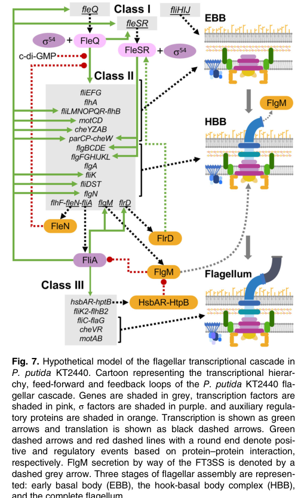

## Question

# Gene Research for Functional Annotation

## ⚠️ CRITICAL: Gene/Protein Identification Context

**BEFORE YOU BEGIN RESEARCH:** You MUST verify you are researching the CORRECT gene/protein. Gene symbols can be ambiguous, especially for less well-characterized genes from non-model organisms.

### Target Gene/Protein Identity (from UniProt):
- **UniProt Accession:** Q88EQ8
- **Protein Description:** RecName: Full=Negative regulator of flagellin synthesis {ECO:0000256|ARBA:ARBA00017823}; AltName: Full=Anti-sigma-28 factor {ECO:0000256|ARBA:ARBA00030117};
- **Gene Information:** Name=flgM {ECO:0000313|EMBL:AAN69973.1}; OrderedLocusNames=PP_4395 {ECO:0000313|EMBL:AAN69973.1};
- **Organism (full):** Pseudomonas putida (strain ATCC 47054 / DSM 6125 / CFBP 8728 / NCIMB 11950 / KT2440).
- **Protein Family:** Belongs to the FlgM family.
- **Key Domains:** Anti-sigma-28_factor_FlgM_sf. (IPR035890); FlgM. (IPR007412); FlgM_C. (IPR031316); FlgM (PF04316)

### MANDATORY VERIFICATION STEPS:

1. **Check if the gene symbol "flgM" matches the protein description above**
2. **Verify the organism is correct:** Pseudomonas putida (strain ATCC 47054 / DSM 6125 / CFBP 8728 / NCIMB 11950 / KT2440).
3. **Check if protein family/domains align with what you find in literature**
4. **If you find literature for a DIFFERENT gene with the same or similar symbol, STOP**

### If Gene Symbol is Ambiguous or You Cannot Find Relevant Literature:

**DO NOT PROCEED WITH RESEARCH ON A DIFFERENT GENE.** Instead:
- State clearly: "The gene symbol 'flgM' is ambiguous or literature is limited for this specific protein"
- Explain what you found (e.g., "Found extensive literature on a different gene with the same symbol in a different organism")
- Describe the protein based ONLY on the UniProt information provided above
- Suggest that the protein function can be inferred from domain/family information

### Research Target:

Please provide a comprehensive research report on the gene **flgM** (gene ID: flgM, UniProt: Q88EQ8) in PSEPK.

The research report should be a detailed narrative explaining the function, biological processes, and localization of the gene product. Citations should be given for all claims.

You should prioritize authoritative reviews and primary scientific literature when conducting research. You can supplement
this with annotations you find in gene/protein databases, but these can be outdated or inaccurate.

We are specifically interested in the primary function of the gene - for enzymes, what reaction is catalyzed, and what is the substrate specificity? For transporters, what is the substrate? For structural proteins or adapters, what is the broader structural role? For signaling molecules, what is the role in the pathway.

We are interested in where in or outside the cell the gene product carries out its function.

We are also interested in the signaling or biochemical pathways in which the gene functions. We are less interested in broad pleiotropic effects, except where these elucidate the precise role.

Include evidence where possible. We are interested in both experimental evidence as well as inference from structure, evolution, or bioinformatic analysis. Precise studies should be prioritized over high-throughput, where available.

## Output

Question: You are an expert researcher providing comprehensive, well-cited information.

Provide detailed information focusing on:
1. Key concepts and definitions with current understanding
2. Recent developments and latest research (prioritize 2023-2024 sources)
3. Current applications and real-world implementations
4. Expert opinions and analysis from authoritative sources
5. Relevant statistics and data from recent studies

Format as a comprehensive research report with proper citations. Include URLs and publication dates where available.
Always prioritize recent, authoritative sources and provide specific citations for all major claims.

# Gene Research for Functional Annotation

## ⚠️ CRITICAL: Gene/Protein Identification Context

**BEFORE YOU BEGIN RESEARCH:** You MUST verify you are researching the CORRECT gene/protein. Gene symbols can be ambiguous, especially for less well-characterized genes from non-model organisms.

### Target Gene/Protein Identity (from UniProt):
- **UniProt Accession:** Q88EQ8
- **Protein Description:** RecName: Full=Negative regulator of flagellin synthesis {ECO:0000256|ARBA:ARBA00017823}; AltName: Full=Anti-sigma-28 factor {ECO:0000256|ARBA:ARBA00030117};
- **Gene Information:** Name=flgM {ECO:0000313|EMBL:AAN69973.1}; OrderedLocusNames=PP_4395 {ECO:0000313|EMBL:AAN69973.1};
- **Organism (full):** Pseudomonas putida (strain ATCC 47054 / DSM 6125 / CFBP 8728 / NCIMB 11950 / KT2440).
- **Protein Family:** Belongs to the FlgM family.
- **Key Domains:** Anti-sigma-28_factor_FlgM_sf. (IPR035890); FlgM. (IPR007412); FlgM_C. (IPR031316); FlgM (PF04316)

### MANDATORY VERIFICATION STEPS:

1. **Check if the gene symbol "flgM" matches the protein description above**
2. **Verify the organism is correct:** Pseudomonas putida (strain ATCC 47054 / DSM 6125 / CFBP 8728 / NCIMB 11950 / KT2440).
3. **Check if protein family/domains align with what you find in literature**
4. **If you find literature for a DIFFERENT gene with the same or similar symbol, STOP**

### If Gene Symbol is Ambiguous or You Cannot Find Relevant Literature:

**DO NOT PROCEED WITH RESEARCH ON A DIFFERENT GENE.** Instead:
- State clearly: "The gene symbol 'flgM' is ambiguous or literature is limited for this specific protein"
- Explain what you found (e.g., "Found extensive literature on a different gene with the same symbol in a different organism")
- Describe the protein based ONLY on the UniProt information provided above
- Suggest that the protein function can be inferred from domain/family information

### Research Target:

Please provide a comprehensive research report on the gene **flgM** (gene ID: flgM, UniProt: Q88EQ8) in PSEPK.

The research report should be a detailed narrative explaining the function, biological processes, and localization of the gene product. Citations should be given for all claims.

You should prioritize authoritative reviews and primary scientific literature when conducting research. You can supplement
this with annotations you find in gene/protein databases, but these can be outdated or inaccurate.

We are specifically interested in the primary function of the gene - for enzymes, what reaction is catalyzed, and what is the substrate specificity? For transporters, what is the substrate? For structural proteins or adapters, what is the broader structural role? For signaling molecules, what is the role in the pathway.

We are interested in where in or outside the cell the gene product carries out its function.

We are also interested in the signaling or biochemical pathways in which the gene functions. We are less interested in broad pleiotropic effects, except where these elucidate the precise role.

Include evidence where possible. We are interested in both experimental evidence as well as inference from structure, evolution, or bioinformatic analysis. Precise studies should be prioritized over high-throughput, where available.

## Research report: Functional annotation of **flgM** (UniProt Q88EQ8; locus **PP_4395**) in *Pseudomonas putida* KT2440

### 0) Mandatory identity verification (correct gene/protein)
The UniProt entry **Q88EQ8** describes **FlgM**, a *negative regulator of flagellin synthesis / anti-σ28 factor* in *Pseudomonas putida* KT2440. This identity is consistent with *P. putida* KT2440 experimental literature: in a KT2440 **fliA (σ28)** mutant transcriptome, the locus **PP_4395** is explicitly annotated as **“Negative regulator of flagellin synthesis FlgM”** and is downregulated when FliA is absent, matching the canonical FliA–FlgM regulatory pair. (navarro‐aviles2010physiologicalandtranscriptomic pages 4-5)

### 1) Key concepts and definitions (current understanding)

#### 1.1 Anti-sigma factors and the σ28 (FliA) regulon
Bacterial RNA polymerase requires σ factors to recognize promoter motifs. **FliA (σ28)** is a flagellar σ factor that activates transcription of late flagellar genes, especially those needed for filament completion and motility functions. **FlgM** is an **anti-σ28 factor** whose primary molecular role is to **bind/sequester FliA**, preventing FliA from associating with RNA polymerase and thereby blocking FliA-dependent transcription until a defined assembly checkpoint is satisfied. (xiao2017expressionofthe pages 1-2)

#### 1.2 The export (assembly) checkpoint: coupling gene expression to flagellum construction
A central concept in flagellar gene regulation in Gram-negative bacteria is the **hook–basal body (HBB) checkpoint**, which ensures that energetically costly late flagellar proteins (notably filament components like flagellin) are synthesized only when the secretion/assembly apparatus is ready. In the canonical model summarized in *Pseudomonas* literature, FlgM represses FliA-dependent transcription **until HBB completion**, and **FlgM export/secretion** via the flagellar type III secretion system (FT3SS) relieves this repression by physically removing FlgM from the cytoplasm, freeing FliA. (xiao2017expressionofthe pages 1-2, oladosu2024fliptheswitch pages 3-4, leal‐morales2022transcriptionalorganizationand pages 14-15)

### 2) flgM (Q88EQ8) function in *P. putida* KT2440

#### 2.1 Primary molecular function
The primary function of *P. putida* KT2440 FlgM (PP_4395; Q88EQ8) is regulatory—not enzymatic: FlgM is a **cytoplasmic anti-σ factor** that antagonizes **FliA (σ28)**, thereby acting as a **negative regulator of late flagellar gene expression** (including flagellin/filament genes). This is the function implied by its annotation and supported by KT2440 pathway models and Pseudomonas mechanistic syntheses. (navarro‐aviles2010physiologicalandtranscriptomic pages 4-5, xiao2017expressionofthe pages 1-2, leal‐morales2022transcriptionalorganizationand pages 14-15)

#### 2.2 Mechanism: sequestration of FliA and relief by export
In KT2440-focused work and related Pseudomonas reviews, the mechanism is described as follows:
- **Before** completion of the hook–basal body, FlgM is **intracellular (cytoplasmic)** and inhibits FliA activity by binding it, preventing transcription of FliA-controlled late genes. (xiao2017expressionofthe pages 1-2)
- **After** hook completion/assembly checkpoint satisfaction, FlgM is **exported** (classically via the flagellar export apparatus/FT3SS), which releases FliA and triggers the final tier of the transcriptional cascade. (leal‐morales2022transcriptionalorganizationand pages 14-15, leal‐morales2022transcriptionalorganizationand pages 14-14)

**Evidence caveat (important for functional annotation):** in the retrieved KT2440 corpus, FlgM export is presented as a conserved checkpoint mechanism for Pseudomonas/Gram-negative flagellar systems and incorporated into KT2440 regulatory models, but a direct KT2440-specific FlgM secretion assay (e.g., immunoblot of supernatant for PP_4395) was not retrieved. (leal‐morales2022transcriptionalorganizationand pages 14-15, leal‐morales2022transcriptionalorganizationand pages 14-14)

### 3) Pathways and regulatory circuitry in which FlgM participates

#### 3.1 Three-tier flagellar transcriptional cascade in *P. putida*
A detailed KT2440 regulatory framework describes a **three-tier cascade**:
- **Class I:** *fleQ* (top-level regulator)
- **Class II:** FleQ- and **σ54 (RpoN)**-dependent genes encoding major structural components and regulatory elements (including **fliA**)
- **Class III (late genes):** **FliA-dependent** genes enabling filament synthesis, one stator complex, and completion of chemotaxis machinery
In this architecture, the **FlgM–FliA interaction** is part of the terminal checkpoint that gates transition into the FliA-driven late program. A KT2440 flagellar-cascade diagram is provided in the cited work (Figure 7). (leal‐morales2022transcriptionalorganizationand pages 14-15, leal‐morales2022transcriptionalorganizationand media 0ce269da)

#### 3.2 Transcriptional organization of flgM in KT2440 (operon and promoters)
In *P. putida* KT2440, **flgM** is not an isolated gene: it is co-transcribed in a **flgM–flgN–pp4397 (flgZ)** tricistronic operon, experimentally supported by RT-PCR. Transcription is driven by:
- a **σFliA-dependent promoter (PflgM)** immediately upstream of flgM, and
- partial contribution from upstream **σ54-dependent** transcription via read-through from the *flgA* region.
This promoter architecture ties FlgM production to the σ28 program while maintaining some upstream coupling to σ54-controlled transcription. (wirebrand2018pp4397flgzprovidesthe pages 2-3)

#### 3.3 Feedback and feed-forward loops
Multiple feedback motifs are consistent with checkpoint logic:
- In KT2440 transcriptomics, PP_4395/flgM is reduced in a **fliA mutant**, consistent with **FliA → flgM** transcriptional activation (negative feedback because FlgM inhibits FliA). (navarro‐aviles2010physiologicalandtranscriptomic pages 4-5)
- The KT2440 flagellar regulation synthesis notes that FliA-dependent transcription can also drive early regulator genes (e.g., *fleQ*/*fleSR* within an operon context), creating positive feedback that reinforces the flagellar program once the FlgM checkpoint is cleared. (leal‐morales2022transcriptionalorganizationand pages 14-14)

### 4) Cellular localization and site of action

#### 4.1 Intracellular site of action
FlgM must access FliA and therefore acts **in the cytoplasm** where σ factors and core RNA polymerase interact. This cytoplasmic mode of action is explicitly described in Pseudomonas-focused mechanistic summaries and used as the basis for the export-checkpoint model. (xiao2017expressionofthe pages 1-2)

#### 4.2 Export as regulatory ‘removal’
Flagellar assembly is coupled to transcription via **export of FlgM**, which removes the inhibitory anti-σ factor from the cytoplasm, thereby enabling FliA activity. This is described in Pseudomonas reviews and incorporated into KT2440-specific regulatory descriptions as a conserved mechanism, but (as noted above) direct KT2440 secretion measurement was not retrieved in this run. (leal‐morales2022transcriptionalorganizationand pages 14-15, leal‐morales2022transcriptionalorganizationand pages 14-14)

### 5) Evidence-based downstream effects and data (statistics)

#### 5.1 Transcriptomic evidence connecting FliA to flgM and late genes
In a KT2440 **fliA mutant** transcriptome, multiple motility/flagellar/chemotaxis genes are downregulated, and **PP_4395 (FlgM)** itself is reported downregulated with a **fold change ≈ −1.8**, with indication of a putative FliA motif upstream—supporting that flgM is part of the σ28-linked regulatory module in KT2440. (navarro‐aviles2010physiologicalandtranscriptomic pages 4-5)

#### 5.2 Motility/c-di-GMP linkage via the FliA regulon
In KT2440, FliA is experimentally shown to partly control transcription of **bifA**, encoding a phosphodiesterase that decreases intracellular **c-di-GMP**, a second messenger generally antagonistic to motility. Deletion of fliA causes an approximately **twofold decrease** in bifA transcription, and σ28 promoter mutation reduces promoter activity in the wild type but not in a fliA mutant. FliA overexpression decreases c-di-GMP in a **BifA-dependent** manner and enhances swimming in wild type but not in a bifA mutant. This places FlgM (as the inhibitor of FliA) upstream of a regulatory connection between the flagellar cascade and c-di-GMP-controlled lifestyle decisions. (xiao2017expressionofthe pages 1-2)

#### 5.3 Promoter-level validation of flgM control
Single-round **in vitro transcription** assays demonstrate that reconstituted **σFliA-RNA polymerase** can drive transcription from **PflgM**, and in vivo reporters show reduced (not abolished) expression in **fliA-null** and **rpoN-null** backgrounds, consistent with dual σ28 and σ54 contributions. (wirebrand2018pp4397flgzprovidesthe pages 2-3)

### 6) Recent developments and “latest research” context (prioritizing 2023–2024)
Direct 2023–2024 experimental studies specifically interrogating **KT2440 FlgM (PP_4395/Q88EQ8)** were not retrieved in this run. However, an authoritative 2024 *Pseudomonas aeruginosa* review synthesizes current understanding of the **FlgM–FliA export checkpoint** and its integration with higher-level regulators (e.g., FleQ) and second-messenger signaling (c-di-GMP): FlgM sequesters FliA until the HBB is assembled, after which FlgM export releases FliA to activate class IV genes (including flagellin and motility genes). The review also describes partner-switching mechanisms that can antagonize FlgM-mediated sequestration in response to upstream cues and emphasizes c-di-GMP-dependent reprogramming between motile and biofilm states. These concepts are considered transferable mechanistic context for environmental pseudomonads such as *P. putida*, consistent with the conservation-based interpretation in KT2440 flagellar cluster analyses. (oladosu2024fliptheswitch pages 3-4)

### 7) Current applications and real-world implementations

#### 7.1 As a functional genetic module for probing σ28 activity
The KT2440 **PflgM promoter** is experimentally validated and used with **in vivo transcriptional fusions** and **in vitro transcription** assays, making the flgM regulatory region (and by extension the FlgM–FliA module) a practical tool to measure σ28/FliA activity during motility studies or chassis engineering where motility impacts performance. (wirebrand2018pp4397flgzprovidesthe pages 2-3)

#### 7.2 Engineering-relevant lever: motility vs sessility via c-di-GMP
Because FliA can modulate c-di-GMP via BifA in KT2440, any upstream modulation of FliA availability (including by FlgM) is mechanistically relevant for tuning swimming motility and potentially the motile-to-sessile transition, which matters for environmental colonization and bioprocess robustness. (xiao2017expressionofthe pages 1-2)

**Limitations:** No retrieved 2023–2024 paper demonstrated an explicit industrial deployment using KT2440 FlgM as a synthetic biology “part” (e.g., orthogonal switch) in the way classical repressors are used; thus applications are reported conservatively as experimentally supported uses in motility regulation/probing and mechanism-informed engineering relevance. (wirebrand2018pp4397flgzprovidesthe pages 2-3, oladosu2024fliptheswitch pages 3-4)

### 8) Expert opinions / authoritative synthesis
A KT2440-centered synthesis emphasizes that the *P. putida* flagellar cluster’s operon architecture and promoter motifs are highly conserved among environmental pseudomonads, supporting the view that the FlgM–FliA export-checkpoint logic is a core organizing principle of the cascade in this lineage. (leal‐morales2022transcriptionalorganizationand pages 14-15)

### 9) Summary table of annotation-relevant facts
The following table consolidates identity, function, mechanism, localization, pathway position, and evidence strength.

| Aspect | Summary | Key references with year and URL |
|---|---|---|
| Identity | **FlgM / PP_4395 / UniProt Q88EQ8** in *Pseudomonas putida* KT2440 matches the canonical **anti-σ28 factor / negative regulator of flagellin synthesis**. In KT2440 transcriptomic annotation, PP_4395 is explicitly labeled **“Negative regulator of flagellin synthesis FlgM”**; this agrees with the UniProt description and FlgM family/domain assignment. (navarro‐aviles2010physiologicalandtranscriptomic pages 4-5) | Navarro-Avilés & Van Dillewijn, 2010, https://doi.org/10.1111/j.1758-2229.2009.00084 |
| Molecular function | FlgM is a **protein anti-sigma factor** that binds the flagellar sigma factor **FliA (σ28)** and inhibits FliA-dependent transcription of late/class III-IV flagellar genes until assembly reaches the proper checkpoint. It is not an enzyme; its primary function is **regulatory sequestration of FliA**. (xiao2017expressionofthe pages 1-2, leal‐morales2022transcriptionalorganizationand pages 14-15, leal‐morales2022transcriptionalorganizationand pages 14-14) | Xiao et al., 2017, https://doi.org/10.1002/mbo3.402; Leal-Morales et al., 2022, https://doi.org/10.1111/1462-2920.15857 |
| Mechanism | Supported model for KT2440/Pseudomonas: FlgM acts in the **cytoplasm** to inhibit FliA; when the **hook-basal body / FT3SS checkpoint** is satisfied, **FlgM is exported/secretion-coupled**, releasing FliA and enabling late flagellar gene transcription. In KT2440 this is presented as the conserved activation logic of the final transcriptional tier. (xiao2017expressionofthe pages 1-2, leal‐morales2022transcriptionalorganizationand pages 14-15, leal‐morales2022transcriptionalorganizationand pages 14-14) | Xiao et al., 2017, https://doi.org/10.1002/mbo3.402; Leal-Morales et al., 2022, https://doi.org/10.1111/1462-2920.15857 |
| Localization | Best-supported localization is **cytoplasmic before export**, where FlgM binds FliA. After completion of the assembly checkpoint, FlgM is proposed to be **exported via the flagellar type III secretion system (FT3SS)**. Direct FlgM export was discussed for *Pseudomonas* and inferred as conserved for KT2440, but the gathered evidence did **not** include a KT2440-specific direct secretion assay for PP_4395. (xiao2017expressionofthe pages 1-2, leal‐morales2022transcriptionalorganizationand pages 14-15, leal‐morales2022transcriptionalorganizationand pages 14-14) | Xiao et al., 2017, https://doi.org/10.1002/mbo3.402; Leal-Morales et al., 2022, https://doi.org/10.1111/1462-2920.15857 |
| Pathway position | FlgM sits in the **late checkpoint of the flagellar transcriptional cascade** downstream of **FleQ/σ54-controlled early-class genes** and immediately upstream of **FliA-dependent late genes**. Figure-level synthesis for KT2440 supports a **three-tier hierarchy** in which FliA activation is the terminal step controlling filament/stator/final chemotaxis functions. (leal‐morales2022transcriptionalorganizationand pages 14-15, leal‐morales2022transcriptionalorganizationand pages 14-14, leal‐morales2022transcriptionalorganizationand media 0ce269da) | Leal-Morales et al., 2022, https://doi.org/10.1111/1462-2920.15857 |
| Regulators / partners | Direct/near-direct partners and regulators supported in KT2440 evidence: **FliA (σ28)** is the cognate sigma factor inhibited by FlgM; **FlgN** and **PP4397/FlgZ** are co-transcribed with flgM in a **flgM-flgN-pp4397 tricistronic operon**; **σFliA** activates the promoter immediately upstream of flgM (**PflgM**); **σ54/RpoN** contributes via readthrough from upstream **flgA** transcription. KT2440 also encodes **HsbA/HsbR/HptB orthologues**, suggesting possible partner-switching regulation, but this was noted as a plausible mechanism rather than directly tested in the cited KT2440 study. (wirebrand2018pp4397flgzprovidesthe pages 2-3, leal‐morales2022transcriptionalorganizationand pages 14-15, leal‐morales2022transcriptionalorganizationand pages 14-14) | Wirebrand et al., 2018, https://doi.org/10.1038/s41598-018-29785-w; Leal-Morales et al., 2022, https://doi.org/10.1111/1462-2920.15857 |
| Downstream genes / outputs | Through inhibition of FliA, FlgM negatively controls **late flagellar outputs**, including **flagellin/filament genes** and motility functions. In KT2440 and related Pseudomonas evidence, FliA-dependent targets include **fliC**, **flaG**, **fliD**, **fliS**, multiple **chemotaxis genes**, and motility-linked functions. FliA also contributes to **bifA** transcription, linking the flagellar cascade to **c-di-GMP lowering** and enhanced swimming. (navarro‐aviles2010physiologicalandtranscriptomic pages 4-5, xiao2017expressionofthe pages 1-2, leal‐morales2022transcriptionalorganizationand pages 14-15, leal‐morales2022transcriptionalorganizationand pages 14-14) | Navarro-Avilés & Van Dillewijn, 2010, https://doi.org/10.1111/j.1758-2229.2009.00084; Xiao et al., 2017, https://doi.org/10.1002/mbo3.402 |
| Experimental evidence / data points | Quantitative and direct evidence in KT2440 includes: **PP_4395/flgM downregulated ~1.8-fold** in a **fliA mutant** transcriptome, with a putative upstream FliA motif; **bifA transcription decreased ~2-fold** in a **fliA deletion** mutant; mutation of the **σ28 promoter** reduced promoter activity in wild type but not in the fliA mutant; **in vitro single-round transcription** confirmed **σFliA-RNAP** can drive **PflgM**; **RT-PCR** showed **flgM-flgN-pp4397** co-transcription; reporter assays in wild type versus **FliA-null** and **RpoN-null** backgrounds showed reduced, but not abolished, flgM operon expression, consistent with dual control. (navarro‐aviles2010physiologicalandtranscriptomic pages 4-5, xiao2017expressionofthe pages 1-2, wirebrand2018pp4397flgzprovidesthe pages 2-3) | Navarro-Avilés & Van Dillewijn, 2010, https://doi.org/10.1111/j.1758-2229.2009.00084; Xiao et al., 2017, https://doi.org/10.1002/mbo3.402; Wirebrand et al., 2018, https://doi.org/10.1038/s41598-018-29785-w |
| Applications / implementation notes | No 2023-2024 KT2440 paper in the gathered evidence used **FlgM itself** as a standalone biotechnology part, but the **FlgM–FliA checkpoint** is functionally relevant to **motility engineering**, **biofilm–planktonic switching**, and **c-di-GMP control** in *Pseudomonas*. In KT2440, FliA-dependent control of **bifA** connects late flagellar regulation to intracellular signaling affecting swimming; more broadly, the cascade is useful for interpreting phenotypes in chassis engineering where motility or surface colonization matters. Because direct PP_4395 perturbation data in KT2440 were limited, implementation conclusions should be considered **mechanism-informed rather than directly engineered demonstrations**. (xiao2017expressionofthe pages 1-2, wirebrand2018pp4397flgzprovidesthe pages 2-3, leal‐morales2022transcriptionalorganizationand pages 14-14, leal‐morales2022transcriptionalorganizationand media 0ce269da) | Xiao et al., 2017, https://doi.org/10.1002/mbo3.402; Wirebrand et al., 2018, https://doi.org/10.1038/s41598-018-29785-w; Leal-Morales et al., 2022, https://doi.org/10.1111/1462-2920.15857 |
| Evidence strength / caveats | Confidence is **high** for identity, anti-σ28 function, operon context, FliA-dependent transcription, and placement in the KT2440 flagellar cascade. Confidence is **moderate** for the exact export behavior of KT2440 FlgM because the gathered evidence mainly presents a **conserved model/inference** rather than a direct KT2440 secretion assay. Claims about partner-switching via **HsbA/HsbR/HptB** are **hypothesis-supported/background-supported** in KT2440, not directly demonstrated for PP_4395 in the cited papers. (wirebrand2018pp4397flgzprovidesthe pages 2-3, leal‐morales2022transcriptionalorganizationand pages 14-15, leal‐morales2022transcriptionalorganizationand pages 14-14) | Wirebrand et al., 2018, https://doi.org/10.1038/s41598-018-29785-w; Leal-Morales et al., 2022, https://doi.org/10.1111/1462-2920.15857 |

*Table: This table summarizes the functional annotation of *Pseudomonas putida* KT2440 FlgM (PP_4395; UniProt Q88EQ8), focusing on experimentally supported identity, mechanism, localization, regulation, and pathway context. It emphasizes what is directly shown in the gathered evidence and flags where conclusions are based on conserved models rather than direct KT2440 assays.*

### 10) Practical functional annotation (recommended wording)
- **Gene/product:** *flgM* (PP_4395; UniProt Q88EQ8), FlgM anti-σ28 factor.
- **Molecular function:** anti-sigma factor; binds/sequesters FliA (σ28) to repress FliA-dependent transcription. (xiao2017expressionofthe pages 1-2)
- **Biological process:** timing/checkpoint control of late flagellar gene expression (filament and motility program) during flagellum biogenesis; integrates into three-tier flagellar transcriptional cascade. (leal‐morales2022transcriptionalorganizationand pages 14-15, leal‐morales2022transcriptionalorganizationand media 0ce269da)
- **Cellular localization:** cytoplasm (site of FliA/RNAP interaction) prior to export; exported via FT3SS after hook-basal body completion in conserved models. (xiao2017expressionofthe pages 1-2, leal‐morales2022transcriptionalorganizationand pages 14-14)
- **Pathway context:** FleQ/σ54 → FliA → late genes; FlgM gates FliA as a checkpoint and participates in negative feedback (FliA induces flgM). (navarro‐aviles2010physiologicalandtranscriptomic pages 4-5, wirebrand2018pp4397flgzprovidesthe pages 2-3, leal‐morales2022transcriptionalorganizationand pages 14-14)

### References (with publication dates and URLs from retrieved sources)
- Navarro-Avilés G, Van Dillewijn P. 2010. *Physiological and transcriptomic characterization of a fliA mutant of Pseudomonas putida KT2440.* https://doi.org/10.1111/j.1758-2229.2009.00084 (navarro‐aviles2010physiologicalandtranscriptomic pages 4-5)
- Xiao Y et al. September 2017. *Expression of the phosphodiesterase BifA facilitating swimming motility is partly controlled by FliA in Pseudomonas putida KT2440.* https://doi.org/10.1002/mbo3.402 (xiao2017expressionofthe pages 1-2)
- Wirebrand L et al. August 2018. *PP4397/FlgZ provides the link between PP2258 c-di-GMP signalling and altered motility in Pseudomonas putida.* https://doi.org/10.1038/s41598-018-29785-w (wirebrand2018pp4397flgzprovidesthe pages 2-3)
- Leal-Morales A et al. December 2022. *Transcriptional organization and regulation of the Pseudomonas putida flagellar system.* https://doi.org/10.1111/1462-2920.15857 (leal‐morales2022transcriptionalorganizationand pages 14-15, leal‐morales2022transcriptionalorganizationand media 0ce269da, leal‐morales2022transcriptionalorganizationand pages 14-14)
- Oladosu VI et al. March 2024. *Flip the switch: the role of FleQ in modulating the transition between the free-living and sessile mode of growth in Pseudomonas aeruginosa.* https://doi.org/10.1128/jb.00365-23 (oladosu2024fliptheswitch pages 3-4)

References

1. (navarro‐aviles2010physiologicalandtranscriptomic pages 4-5): G Navarro‐Avilés and P Van Dillewijn. Physiological and transcriptomic characterization of a flia mutant of pseudomonas putida kt2440. Unknown journal, 2010. URL: https://doi.org/10.1111/j.1758-2229.2009.00084, doi:10.1111/j.1758-2229.2009.00084.

2. (xiao2017expressionofthe pages 1-2): Yujie Xiao, Huizhong Liu, Hailing Nie, Shan Xie, Xuesong Luo, Wenli Chen, and Qiaoyun Huang. Expression of the phosphodiesterase bifa facilitating swimming motility is partly controlled by flia in pseudomonas putida kt2440. MicrobiologyOpen, 6:e00402, Sep 2017. URL: https://doi.org/10.1002/mbo3.402, doi:10.1002/mbo3.402. This article has 16 citations and is from a peer-reviewed journal.

3. (oladosu2024fliptheswitch pages 3-4): Victoria I. Oladosu, Soyoung Park, and Karin Sauer. Flip the switch: the role of fleq in modulating the transition between the free-living and sessile mode of growth in <i>pseudomonas aeruginosa</i>. Mar 2024. URL: https://doi.org/10.1128/jb.00365-23, doi:10.1128/jb.00365-23. This article has 27 citations and is from a peer-reviewed journal.

4. (leal‐morales2022transcriptionalorganizationand pages 14-15): Antonio Leal‐Morales, Marta Pulido‐Sánchez, Aroa López‐Sánchez, and Fernando Govantes. Transcriptional organization and regulation of the <i>pseudomonas putida</i> flagellar system. Environmental Microbiology, 24:137-157, Dec 2022. URL: https://doi.org/10.1111/1462-2920.15857, doi:10.1111/1462-2920.15857. This article has 31 citations and is from a domain leading peer-reviewed journal.

5. (leal‐morales2022transcriptionalorganizationand pages 14-14): Antonio Leal‐Morales, Marta Pulido‐Sánchez, Aroa López‐Sánchez, and Fernando Govantes. Transcriptional organization and regulation of the <i>pseudomonas putida</i> flagellar system. Environmental Microbiology, 24:137-157, Dec 2022. URL: https://doi.org/10.1111/1462-2920.15857, doi:10.1111/1462-2920.15857. This article has 31 citations and is from a domain leading peer-reviewed journal.

6. (leal‐morales2022transcriptionalorganizationand media 0ce269da): Antonio Leal‐Morales, Marta Pulido‐Sánchez, Aroa López‐Sánchez, and Fernando Govantes. Transcriptional organization and regulation of the <i>pseudomonas putida</i> flagellar system. Environmental Microbiology, 24:137-157, Dec 2022. URL: https://doi.org/10.1111/1462-2920.15857, doi:10.1111/1462-2920.15857. This article has 31 citations and is from a domain leading peer-reviewed journal.

7. (wirebrand2018pp4397flgzprovidesthe pages 2-3): Lisa Wirebrand, Sofia Österberg, Aroa López-Sánchez, Fernando Govantes, and Victoria Shingler. Pp4397/flgz provides the link between pp2258 c-di-gmp signalling and altered motility in pseudomonas putida. Scientific Reports, Aug 2018. URL: https://doi.org/10.1038/s41598-018-29785-w, doi:10.1038/s41598-018-29785-w. This article has 14 citations and is from a peer-reviewed journal.

## Artifacts

- [Edison artifact artifact-00](flgM-deep-research-falcon_artifacts/artifact-00.md)

## Citations

1. xiao2017expressionofthe pages 1-2
2. oladosu2024fliptheswitch pages 3-4
3. https://doi.org/10.1111/j.1758-2229.2009.00084
4. https://doi.org/10.1002/mbo3.402;
5. https://doi.org/10.1111/1462-2920.15857
6. https://doi.org/10.1038/s41598-018-29785-w;
7. https://doi.org/10.1111/j.1758-2229.2009.00084;
8. https://doi.org/10.1002/mbo3.402
9. https://doi.org/10.1038/s41598-018-29785-w
10. https://doi.org/10.1128/jb.00365-23
11. https://doi.org/10.1111/j.1758-2229.2009.00084,
12. https://doi.org/10.1002/mbo3.402,
13. https://doi.org/10.1128/jb.00365-23,
14. https://doi.org/10.1111/1462-2920.15857,
15. https://doi.org/10.1038/s41598-018-29785-w,