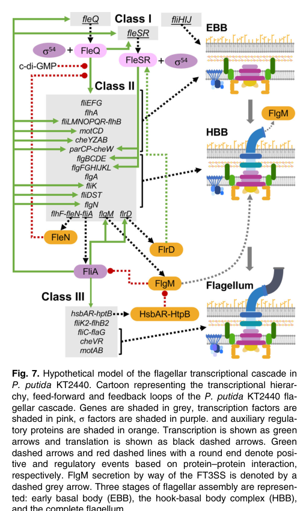

## Question

# Gene Research for Functional Annotation

## ⚠️ CRITICAL: Gene/Protein Identification Context

**BEFORE YOU BEGIN RESEARCH:** You MUST verify you are researching the CORRECT gene/protein. Gene symbols can be ambiguous, especially for less well-characterized genes from non-model organisms.

### Target Gene/Protein Identity (from UniProt):
- **UniProt Accession:** Q88EW1
- **Protein Description:** RecName: Full=RNA polymerase sigma factor FliA {ECO:0000256|HAMAP-Rule:MF_00962}; AltName: Full=RNA polymerase sigma factor for flagellar operon {ECO:0000256|HAMAP-Rule:MF_00962}; AltName: Full=Sigma F {ECO:0000256|HAMAP-Rule:MF_00962}; AltName: Full=Sigma-28 {ECO:0000256|HAMAP-Rule:MF_00962};
- **Gene Information:** Name=fliA {ECO:0000256|HAMAP-Rule:MF_00962, ECO:0000313|EMBL:AAN69920.1}; OrderedLocusNames=PP_4341 {ECO:0000313|EMBL:AAN69920.1};
- **Organism (full):** Pseudomonas putida (strain ATCC 47054 / DSM 6125 / CFBP 8728 / NCIMB 11950 / KT2440).
- **Protein Family:** Belongs to the sigma-70 factor family. FliA subfamily.
- **Key Domains:** RNA_pol_sigma-70_dom. (IPR014284); RNA_pol_sigma70. (IPR000943); RNA_pol_sigma70_r2. (IPR007627); RNA_pol_sigma70_r3. (IPR007624); RNA_pol_sigma70_r4. (IPR007630)

### MANDATORY VERIFICATION STEPS:

1. **Check if the gene symbol "fliA" matches the protein description above**
2. **Verify the organism is correct:** Pseudomonas putida (strain ATCC 47054 / DSM 6125 / CFBP 8728 / NCIMB 11950 / KT2440).
3. **Check if protein family/domains align with what you find in literature**
4. **If you find literature for a DIFFERENT gene with the same or similar symbol, STOP**

### If Gene Symbol is Ambiguous or You Cannot Find Relevant Literature:

**DO NOT PROCEED WITH RESEARCH ON A DIFFERENT GENE.** Instead:
- State clearly: "The gene symbol 'fliA' is ambiguous or literature is limited for this specific protein"
- Explain what you found (e.g., "Found extensive literature on a different gene with the same symbol in a different organism")
- Describe the protein based ONLY on the UniProt information provided above
- Suggest that the protein function can be inferred from domain/family information

### Research Target:

Please provide a comprehensive research report on the gene **fliA** (gene ID: fliA, UniProt: Q88EW1) in PSEPK.

The research report should be a detailed narrative explaining the function, biological processes, and localization of the gene product. Citations should be given for all claims.

You should prioritize authoritative reviews and primary scientific literature when conducting research. You can supplement
this with annotations you find in gene/protein databases, but these can be outdated or inaccurate.

We are specifically interested in the primary function of the gene - for enzymes, what reaction is catalyzed, and what is the substrate specificity? For transporters, what is the substrate? For structural proteins or adapters, what is the broader structural role? For signaling molecules, what is the role in the pathway.

We are interested in where in or outside the cell the gene product carries out its function.

We are also interested in the signaling or biochemical pathways in which the gene functions. We are less interested in broad pleiotropic effects, except where these elucidate the precise role.

Include evidence where possible. We are interested in both experimental evidence as well as inference from structure, evolution, or bioinformatic analysis. Precise studies should be prioritized over high-throughput, where available.

## Output

Question: You are an expert researcher providing comprehensive, well-cited information.

Provide detailed information focusing on:
1. Key concepts and definitions with current understanding
2. Recent developments and latest research (prioritize 2023-2024 sources)
3. Current applications and real-world implementations
4. Expert opinions and analysis from authoritative sources
5. Relevant statistics and data from recent studies

Format as a comprehensive research report with proper citations. Include URLs and publication dates where available.
Always prioritize recent, authoritative sources and provide specific citations for all major claims.

# Gene Research for Functional Annotation

## ⚠️ CRITICAL: Gene/Protein Identification Context

**BEFORE YOU BEGIN RESEARCH:** You MUST verify you are researching the CORRECT gene/protein. Gene symbols can be ambiguous, especially for less well-characterized genes from non-model organisms.

### Target Gene/Protein Identity (from UniProt):
- **UniProt Accession:** Q88EW1
- **Protein Description:** RecName: Full=RNA polymerase sigma factor FliA {ECO:0000256|HAMAP-Rule:MF_00962}; AltName: Full=RNA polymerase sigma factor for flagellar operon {ECO:0000256|HAMAP-Rule:MF_00962}; AltName: Full=Sigma F {ECO:0000256|HAMAP-Rule:MF_00962}; AltName: Full=Sigma-28 {ECO:0000256|HAMAP-Rule:MF_00962};
- **Gene Information:** Name=fliA {ECO:0000256|HAMAP-Rule:MF_00962, ECO:0000313|EMBL:AAN69920.1}; OrderedLocusNames=PP_4341 {ECO:0000313|EMBL:AAN69920.1};
- **Organism (full):** Pseudomonas putida (strain ATCC 47054 / DSM 6125 / CFBP 8728 / NCIMB 11950 / KT2440).
- **Protein Family:** Belongs to the sigma-70 factor family. FliA subfamily.
- **Key Domains:** RNA_pol_sigma-70_dom. (IPR014284); RNA_pol_sigma70. (IPR000943); RNA_pol_sigma70_r2. (IPR007627); RNA_pol_sigma70_r3. (IPR007624); RNA_pol_sigma70_r4. (IPR007630)

### MANDATORY VERIFICATION STEPS:

1. **Check if the gene symbol "fliA" matches the protein description above**
2. **Verify the organism is correct:** Pseudomonas putida (strain ATCC 47054 / DSM 6125 / CFBP 8728 / NCIMB 11950 / KT2440).
3. **Check if protein family/domains align with what you find in literature**
4. **If you find literature for a DIFFERENT gene with the same or similar symbol, STOP**

### If Gene Symbol is Ambiguous or You Cannot Find Relevant Literature:

**DO NOT PROCEED WITH RESEARCH ON A DIFFERENT GENE.** Instead:
- State clearly: "The gene symbol 'fliA' is ambiguous or literature is limited for this specific protein"
- Explain what you found (e.g., "Found extensive literature on a different gene with the same symbol in a different organism")
- Describe the protein based ONLY on the UniProt information provided above
- Suggest that the protein function can be inferred from domain/family information

### Research Target:

Please provide a comprehensive research report on the gene **fliA** (gene ID: fliA, UniProt: Q88EW1) in PSEPK.

The research report should be a detailed narrative explaining the function, biological processes, and localization of the gene product. Citations should be given for all claims.

You should prioritize authoritative reviews and primary scientific literature when conducting research. You can supplement
this with annotations you find in gene/protein databases, but these can be outdated or inaccurate.

We are specifically interested in the primary function of the gene - for enzymes, what reaction is catalyzed, and what is the substrate specificity? For transporters, what is the substrate? For structural proteins or adapters, what is the broader structural role? For signaling molecules, what is the role in the pathway.

We are interested in where in or outside the cell the gene product carries out its function.

We are also interested in the signaling or biochemical pathways in which the gene functions. We are less interested in broad pleiotropic effects, except where these elucidate the precise role.

Include evidence where possible. We are interested in both experimental evidence as well as inference from structure, evolution, or bioinformatic analysis. Precise studies should be prioritized over high-throughput, where available.

## Research report: **fliA (UniProt Q88EW1)** in *Pseudomonas putida* KT2440 (PSEPK)

### Executive summary
The *Pseudomonas putida* KT2440 gene **fliA** encodes **FliA (σ28; sigma-28 / sigma-F)**, an alternative RNA polymerase sigma factor that directs transcription of **late (flagellar/chemotaxis) genes** in the flagellar regulatory cascade. In KT2440, FliA is positioned downstream of the master regulator **FleQ** and **σ54 (RpoN)** and is activated post-translationally by release from the anti-sigma factor **FlgM** after hook–basal body completion. Evidence in KT2440 further supports a role for FliA in coupling motility to the second messenger **c-di-GMP** through partial control of **bifA**, a c-di-GMP phosphodiesterase important for swimming behavior. (leal‐morales2022transcriptionalorganizationand pages 1-1, leal‐morales2022transcriptionalorganizationand pages 14-14, xiao2017expressionofthe pages 5-7)

### 1) Key concepts and definitions (current understanding)

#### 1.1 What is FliA?
**FliA is an alternative sigma factor** that binds core RNA polymerase (RNAP) to alter promoter recognition specificity. In *P. putida* KT2440, this is explicitly described as FliA “conferr[ing] promoter-recognition specificity to core RNA polymerase (RNAP),” consistent with sigma-factor biology. (xiao2017expressionofthe pages 4-5, xiao2017expressionofthe pages 5-7)

#### 1.2 Flagellar transcriptional hierarchy in *P. putida* KT2440
A detailed KT2440 model describes a **three-tier transcriptional cascade**:
- **Class I:** **fleQ** is at the top of the hierarchy. (leal‐morales2022transcriptionalorganizationand pages 1-1)
- **Class II:** **FleQ- and σ54-dependent** genes encode most basal body/structural components and regulatory elements **including fliA**. (leal‐morales2022transcriptionalorganizationand pages 1-1, leal‐morales2022transcriptionalorganizationand media 34a91b68)
- **Class III:** **FliA-dependent** transcription enables synthesis of the **filament**, at least one **stator** complex, and completion of the **chemotaxis apparatus**. (leal‐morales2022transcriptionalorganizationand pages 1-1, leal‐morales2022transcriptionalorganizationand media 34a91b68)

Quantitatively, the KT2440 flagellar cluster is reported to contain **59 genes**, organized into **11 operons** with **22 primary/internal promoters**, highlighting extensive transcriptional complexity that FliA participates in at the late tier. (leal‐morales2022transcriptionalorganizationand pages 1-1)

#### 1.3 Anti-sigma factor control (FlgM–FliA module)
FliA is regulated by the **anti-sigma factor FlgM**, which sequesters FliA until flagellar assembly reaches a checkpoint. In *P. putida*, the “final tier” is triggered when FliA is **released from inactivation by FlgM**, after **FlgM secretion via the flagellar type III secretion system (FT3SS)** upon hook completion. (leal‐morales2022transcriptionalorganizationand pages 14-14)

A 2024 expert review in *Pseudomonas* further frames this as a conserved mechanism in which **hook–basal body completion enables FlgM export and thus FliA activation**. (oladosu2024fliptheswitch pages 3-4)

### 2) Recent developments and latest research (2023–2024 prioritized)

#### 2.1 2024 synthesis of FliA/FlgM logic and target gene examples (authoritative review)
A 2024 review (focused on *P. aeruginosa* but widely used as a mechanistic reference for pseudomonads) summarizes: 
- **FliA (RpoF, σ28) drives Class IV flagellar gene expression** once released from FlgM. (oladosu2024fliptheswitch pages 3-4)
- It lists representative FliA-dependent genes such as **fliC**, **motAB**, and multiple chemotaxis genes (e.g., **cheAB**, **cheW**, **cheVR**, **cheYZ**) and **flgMN**. (oladosu2024fliptheswitch pages 3-4)

Although these named targets are from *P. aeruginosa*, they align with *P. putida* KT2440’s late-tier role for FliA in completing filament/chemotaxis/stator function and provide an expert-curated framework for interpreting the conserved FliA module. (leal‐morales2022transcriptionalorganizationand pages 1-1, oladosu2024fliptheswitch pages 3-4)

#### 2.2 2023 review: FliA’s integration with broader regulatory networks (cross-species, authoritative)
A 2023 review of *P. aeruginosa* transcriptional regulators states that **σFliA (σ28)** controls flagellar biosynthesis genes and is essential for motility, with its activity modulated by **FlgM** and additional partner-switching layers that interface with global signaling (Rsm-related pathways). (sanchezjimenez2023transcriptionalregulatorscontrolling pages 18-19)

The same review reports transcriptomic evidence in *P. aeruginosa* that a **fliA mutant** shows downregulation of multiple secretion-system genes (T2SS/T3SS/T6SS components), suggesting that in some pseudomonads FliA can be a broader node connecting motility and virulence-associated functions. This should be treated as **cross-species** context rather than KT2440-specific annotation. (sanchezjimenez2023transcriptionalregulatorscontrolling pages 19-21)

### 3) Functional annotation of *P. putida* KT2440 fliA: molecular function, processes, and pathways

#### 3.1 Primary molecular function
In KT2440, FliA’s **primary molecular function** is to function as an **RNAP sigma factor** that recognizes **σ28-type promoters** to activate late flagellar/chemotaxis transcription. (leal‐morales2022transcriptionalorganizationand pages 1-1, xiao2017expressionofthe pages 4-5)

#### 3.2 Biological process context: flagellar assembly and chemotaxis
In KT2440 the late output of FliA activity is explicitly described: **filament synthesis**, activation of at least one **stator complex**, and completion of the **chemotaxis apparatus**. (leal‐morales2022transcriptionalorganizationand pages 1-1)

The regulatory logic is consistent with a checkpoint model: completion of the hook triggers secretion of FlgM, which removes inhibition and enables robust transcription of late genes. (leal‐morales2022transcriptionalorganizationand pages 14-14)

#### 3.3 Promoter motifs and direct promoter evidence in KT2440
Leal-Morales et al. (2022) report systematic promoter motif discovery in the KT2440 flagellar cluster, with **21 putative flagellar promoters** and explicit identification of **FliA-dependent promoter motifs** upstream of **fliK2**, **fliC**, and **cheV**, and additional matches upstream of **fliS** and **flgM**. (leal‐morales2022transcriptionalorganizationand pages 6-6)

Promoter-motif alignments and the overall transcriptional cascade schematic are shown in the paper’s figures (promoter motif alignments and tiered cascade). (leal‐morales2022transcriptionalorganizationand media ffe1d522, leal‐morales2022transcriptionalorganizationand media 34a91b68)

#### 3.4 FliA links flagellar output to c-di-GMP via bifA (KT2440 experimental evidence)
A KT2440 targeted mechanistic study demonstrated that **bifA** (encoding a c-di-GMP phosphodiesterase) is **partly controlled by FliA**:
- **fliA deletion** caused an approximately **twofold decrease** in **bifA** transcription/promoter activity and produced a **nonmotile phenotype** that could be complemented by fliA expression. (xiao2017expressionofthe pages 4-5, xiao2017expressionofthe pages 1-2)
- **5′-RACE** identified **two transcription start sites** for bifA (at **103 nt and 40 nt upstream** of the start codon), with upstream **σ70 and σ28** promoter elements, indicating dual control (basal σ70 and enhancing σ28/FliA). (xiao2017expressionofthe pages 5-7)
- Promoter mutagenesis in the σ28 region reduced activity in wild type but not in a fliA mutant, supporting FliA dependence for that promoter component. (xiao2017expressionofthe pages 5-7)

This establishes an experimentally supported mechanistic bridge between the **flagellar sigma factor** and **second-messenger regulation** relevant to motility transitions (swimming vs sessility). (xiao2017expressionofthe pages 5-7, xiao2017expressionofthe pages 8-9)

### 4) Cellular localization and site of action
FliA is not a secreted or membrane-embedded protein; it functions by **associating with cytosolic RNAP** and acting at **chromosomal promoters**. KT2440 literature describes FliA as conferring promoter specificity to core RNAP, implying its functional localization is the cytosol/nucleoid region where RNAP-DNA transcription occurs. (xiao2017expressionofthe pages 4-5, xiao2017expressionofthe pages 5-7)

Its activity is **conditioned by flagellar assembly state** via FlgM sequestration and export, a mechanism that ensures late genes are transcribed primarily after assembly has progressed. (leal‐morales2022transcriptionalorganizationand pages 14-14, xiao2017expressionofthe pages 1-2)

### 5) Relevant statistics and quantitative data (recent/primary)

#### 5.1 Flagellar gene system architecture (KT2440)
- **59 genes** in the flagellar cluster (KT2440). (leal‐morales2022transcriptionalorganizationand pages 1-1)
- **11 flagellar operons** and **22 primary/internal promoters** characterized. (leal‐morales2022transcriptionalorganizationand pages 1-1)
- **21 putative flagellar promoters** reported by motif analysis, with assignments to σ54, σ70, and FliA/σ28 classes. (leal‐morales2022transcriptionalorganizationand pages 6-6)

#### 5.2 FliA-dependent promoter evidence and c-di-GMP measurements (KT2440)
- **~2× decrease** in bifA transcription/promoter activity in a **ΔfliA** mutant. (xiao2017expressionofthe pages 5-7, xiao2017expressionofthe pages 4-5)
- **Two bifA TSS** at **−103** and **−40 nt** upstream of start codon, consistent with **dual σ70/σ28 promoter architecture**. (xiao2017expressionofthe pages 5-7)
- **~5× increase** in bifA promoter activity in an *E. coli* reporter upon FliA expression (heterologous validation of sigma-dependent activation). (xiao2017expressionofthe pages 5-7)
- Intracellular c-di-GMP measurements reported: **23.33 pmol/mg protein** in WT vs **20.13 pmol/mg** in the **fliA mutant** in the cited assay conditions. (xiao2017expressionofthe pages 5-7)

#### 5.3 Upstream regulator quantitative context (FleQ ChIP-seq)
While not FliA itself, upstream master regulation shapes when fliA is expressed: FleQ ChIP-seq in KT2440 identified **103 putative FleQ binding sites**, supporting FleQ as a broad regulator upstream of σ54-dependent class II genes that include fliA. (blancoromero2018genomewideanalysisof pages 1-2)

### 6) Current applications and real-world implementations
Direct industrial applications of *P. putida* KT2440 commonly leverage its metabolism and robustness; however, **motility control** is practically important in environmental and engineered contexts because it affects **surface colonization, biofilm formation, and dispersal**. In the KT2440 system, FliA is a key transcriptional node controlling late motility outputs and also modulates **bifA/c-di-GMP**, meaning that perturbing fliA (deletion or overexpression) can be used experimentally to:
- Disable or enhance **swimming motility** (ΔfliA nonmotile; FliA overexpression enhances swimming in a BifA-dependent manner). (xiao2017expressionofthe pages 4-5, xiao2017expressionofthe pages 8-9)
- Tune expression from **σ28 promoters** (e.g., engineered reporters or synthetic control elements based on σ28 motifs identified in the flagellar cluster). (leal‐morales2022transcriptionalorganizationand pages 6-6, leal‐morales2022transcriptionalorganizationand media ffe1d522)

These applications are most mature as **research and synthetic biology strategies** (motility/biofilm tuning and promoter engineering) rather than direct deployed products.

### 7) Expert analysis and interpretation

1. **Checkpointed transcription ensures cost-effective assembly.** The FlgM-mediated sequestration mechanism ties FliA activity to structural completion of the hook–basal body, preventing premature expression of filament/late genes. This is described explicitly for *P. putida* and synthesized in recent expert reviews for pseudomonads. (leal‐morales2022transcriptionalorganizationand pages 14-14, oladosu2024fliptheswitch pages 3-4)

2. **FliA is a regulatory hub with feedback architecture.** In *P. putida*, FliA promotes expression of **flgM** (negative feedback) and can drive transcription of upstream regulators (e.g., **fleQ** and **fleSR** as part of a larger operon), forming feed-forward/feedback loops that can stabilize a motility program once initiated. (leal‐morales2022transcriptionalorganizationand pages 14-14)

3. **Beyond canonical flagellar genes, FliA can couple motility and second-messenger signaling.** In KT2440, FliA partly controls **bifA**, linking σ28 control to **c-di-GMP turnover** and swimming behavior. (xiao2017expressionofthe pages 5-7, xiao2017expressionofthe pages 8-9)

### Evidence summary table
The following table compiles the most relevant KT2440-specific evidence and recent reviews used to support functional annotation and quantitative claims.

| Source | Year/date | URL / DOI | Evidence type | Main findings | Scope / notes |
|---|---|---|---|---|---|
| Leal-Morales et al., *Environmental Microbiology* | Dec 2022 | https://doi.org/10.1111/1462-2920.15857 | Genetic regulation mapping, promoter architecture, operon analysis | In *P. putida* KT2440, the flagellar cluster contains **59 genes**, organized into **11 operons** with **22 primary/internal promoters**; the system follows a **three-tier cascade** in which FleQ is Class I, FleQ+σ54 control Class II genes including **fliA**, and **FliA (σ28)** activates Class III genes needed for filament synthesis, one stator, and chemotaxis completion (leal‐morales2022transcriptionalorganizationand pages 1-1). Promoter analysis identified **21 putative flagellar promoters** overall, including **FliA-dependent motifs** upstream of **fliK2, fliC, cheV, fliS, flgM**; σ54-type motifs were found upstream of several earlier flagellar operons (leal‐morales2022transcriptionalorganizationand pages 6-6). The paper also describes FliA as central to feed-forward/feedback control: FliA activates late genes and promotes **flgM** expression, while hook completion enables FlgM export and FliA release (leal‐morales2022transcriptionalorganizationand pages 14-14, leal‐morales2022transcriptionalorganizationand media 34a91b68). | **KT2440-specific primary study**; strongest source for operon counts, promoter classes, and regulatory hierarchy. |
| Xiao et al., *MicrobiologyOpen* | Sep 2017 | https://doi.org/10.1002/mbo3.402 | Genetics, promoter-lacZ assays, 5′-RACE, qRT-PCR, c-di-GMP biochemistry | Demonstrated that **FliA partly controls bifA** expression in *P. putida* KT2440: **fliA deletion lowered bifA transcription about twofold** and caused a **nonmotile phenotype** that was complemented by plasmid-borne fliA (xiao2017expressionofthe pages 4-5, xiao2017expressionofthe pages 1-2). **5′-RACE identified two bifA TSSs** at **103 nt** and **40 nt** upstream of the start codon, with upstream **σ70** and **σ28** promoter elements; mutation of the σ28 promoter reduced activity, and FliA overexpression in an *E. coli* reporter increased activity about **fivefold** (xiao2017expressionofthe pages 5-7). Reported intracellular c-di-GMP values were **23.33 pmol/mg protein** in WT vs **20.13 pmol/mg** in the **fliA mutant**; FliA overexpression promoted swimming in a **BifA-dependent** manner (xiao2017expressionofthe pages 5-7, xiao2017expressionofthe pages 8-9). | **KT2440-specific primary study**; strongest source for direct quantitative phenotypes, dual-promoter architecture at **bifA**, and c-di-GMP linkage. |
| Blanco-Romero et al., *Scientific Reports* | Sep 2018 | https://doi.org/10.1038/s41598-018-31371-z | ChIP-seq, regulon mapping (FleQ) | Defined upstream hierarchy around FliA by showing that FleQ is the master regulator of pseudomonad flagellar transcription and identified **103 putative FleQ binding sites** in *P. putida* KT2440. FleQ works with **σ54/RpoN** to activate multiple early flagellar operons, including loci that feed into the layer containing **fliA** (blancoromero2018genomewideanalysisof pages 1-2). | **KT2440-specific primary study**, but focuses on **FleQ**, not direct FliA targets; useful for upstream regulatory context. |
| Oladosu et al., *Journal of Bacteriology* | Mar 2024 | https://doi.org/10.1128/jb.00365-23 | Expert review | Summarizes authoritative current understanding in pseudomonads: **FliA is constitutively expressed but post-translationally sequestered by FlgM**; after hook-basal body completion, **FlgM export frees FliA**, enabling late/class IV transcription such as **fliC, fleL, cheAB, motAB, cheW, cheVR, flgMN, cheYZ**. The review also highlights integration of the FliA/FlgM module with broader signaling and **c-di-GMP**-linked lifestyle regulation (oladosu2024fliptheswitch pages 3-4). | **Cross-species Pseudomonas review** centered on *P. aeruginosa*; used for conserved mechanistic interpretation, not KT2440-specific claims. |
| Lo et al., *PLoS ONE* | May 2016 | https://doi.org/10.1371/journal.pone.0155397 | Transcriptomics, reporter assays, phenotype analysis | Provides cross-species evidence that FliA regulates more than canonical flagellar genes: in *P. aeruginosa*, FliA affected expression of phosphodiesterase genes such as **PA4367/bifA**, linking FliA to **c-di-GMP metabolism**, swarming, and pigment production. The study also notes that excess FliA can trigger feedback through **flgM**, supporting careful dosage control of σ28 activity (lo2016regulationofmotility pages 11-14, lo2016regulationofmotility pages 14-15). | **Cross-species primary study**; not KT2440-specific, but supports broader interpretation of FliA as a motility–c-di-GMP network node. |

*Table: This table compiles the key KT2440-specific and comparative Pseudomonas evidence for FliA (sigma-28), including regulatory hierarchy, promoter architecture, quantitative measurements, and broader expert interpretation. It is useful for separating direct evidence in *P. putida* KT2440 from conserved mechanisms inferred from related pseudomonads.*

### Limitations of this report (important)
- Although the user provided UniProt/InterPro/HAMAP identifiers, **this tool environment did not provide direct access to those databases for citable retrieval**; therefore, database assertions are not independently cited beyond the user’s provided identity context. Functional annotation was grounded in **KT2440 primary literature** and authoritative reviews instead. (leal‐morales2022transcriptionalorganizationand pages 1-1, xiao2017expressionofthe pages 4-5)
- **2023–2024 KT2440-specific primary studies** directly centered on fliA were limited in the retrieved corpus; thus, 2023–2024 sources are primarily **authoritative reviews** and are explicitly labeled as cross-species where applicable. (oladosu2024fliptheswitch pages 3-4, sanchezjimenez2023transcriptionalregulatorscontrolling pages 19-21)

References

1. (leal‐morales2022transcriptionalorganizationand pages 1-1): Antonio Leal‐Morales, Marta Pulido‐Sánchez, Aroa López‐Sánchez, and Fernando Govantes. Transcriptional organization and regulation of the <i>pseudomonas putida</i> flagellar system. Environmental Microbiology, 24:137-157, Dec 2022. URL: https://doi.org/10.1111/1462-2920.15857, doi:10.1111/1462-2920.15857. This article has 31 citations and is from a domain leading peer-reviewed journal.

2. (leal‐morales2022transcriptionalorganizationand pages 14-14): Antonio Leal‐Morales, Marta Pulido‐Sánchez, Aroa López‐Sánchez, and Fernando Govantes. Transcriptional organization and regulation of the <i>pseudomonas putida</i> flagellar system. Environmental Microbiology, 24:137-157, Dec 2022. URL: https://doi.org/10.1111/1462-2920.15857, doi:10.1111/1462-2920.15857. This article has 31 citations and is from a domain leading peer-reviewed journal.

3. (xiao2017expressionofthe pages 5-7): Yujie Xiao, Huizhong Liu, Hailing Nie, Shan Xie, Xuesong Luo, Wenli Chen, and Qiaoyun Huang. Expression of the phosphodiesterase bifa facilitating swimming motility is partly controlled by flia in pseudomonas putida kt2440. MicrobiologyOpen, 6:e00402, Sep 2017. URL: https://doi.org/10.1002/mbo3.402, doi:10.1002/mbo3.402. This article has 16 citations and is from a peer-reviewed journal.

4. (xiao2017expressionofthe pages 4-5): Yujie Xiao, Huizhong Liu, Hailing Nie, Shan Xie, Xuesong Luo, Wenli Chen, and Qiaoyun Huang. Expression of the phosphodiesterase bifa facilitating swimming motility is partly controlled by flia in pseudomonas putida kt2440. MicrobiologyOpen, 6:e00402, Sep 2017. URL: https://doi.org/10.1002/mbo3.402, doi:10.1002/mbo3.402. This article has 16 citations and is from a peer-reviewed journal.

5. (leal‐morales2022transcriptionalorganizationand media 34a91b68): Antonio Leal‐Morales, Marta Pulido‐Sánchez, Aroa López‐Sánchez, and Fernando Govantes. Transcriptional organization and regulation of the <i>pseudomonas putida</i> flagellar system. Environmental Microbiology, 24:137-157, Dec 2022. URL: https://doi.org/10.1111/1462-2920.15857, doi:10.1111/1462-2920.15857. This article has 31 citations and is from a domain leading peer-reviewed journal.

6. (oladosu2024fliptheswitch pages 3-4): Victoria I. Oladosu, Soyoung Park, and Karin Sauer. Flip the switch: the role of fleq in modulating the transition between the free-living and sessile mode of growth in <i>pseudomonas aeruginosa</i>. Journal of Bacteriology, Mar 2024. URL: https://doi.org/10.1128/jb.00365-23, doi:10.1128/jb.00365-23. This article has 27 citations and is from a peer-reviewed journal.

7. (sanchezjimenez2023transcriptionalregulatorscontrolling pages 18-19): Ana Sánchez-Jiménez, María A. Llamas, and Francisco Javier Marcos-Torres. Transcriptional regulators controlling virulence in pseudomonas aeruginosa. International Journal of Molecular Sciences, 24:11895, Jul 2023. URL: https://doi.org/10.3390/ijms241511895, doi:10.3390/ijms241511895. This article has 64 citations.

8. (sanchezjimenez2023transcriptionalregulatorscontrolling pages 19-21): Ana Sánchez-Jiménez, María A. Llamas, and Francisco Javier Marcos-Torres. Transcriptional regulators controlling virulence in pseudomonas aeruginosa. International Journal of Molecular Sciences, 24:11895, Jul 2023. URL: https://doi.org/10.3390/ijms241511895, doi:10.3390/ijms241511895. This article has 64 citations.

9. (leal‐morales2022transcriptionalorganizationand pages 6-6): Antonio Leal‐Morales, Marta Pulido‐Sánchez, Aroa López‐Sánchez, and Fernando Govantes. Transcriptional organization and regulation of the <i>pseudomonas putida</i> flagellar system. Environmental Microbiology, 24:137-157, Dec 2022. URL: https://doi.org/10.1111/1462-2920.15857, doi:10.1111/1462-2920.15857. This article has 31 citations and is from a domain leading peer-reviewed journal.

10. (leal‐morales2022transcriptionalorganizationand media ffe1d522): Antonio Leal‐Morales, Marta Pulido‐Sánchez, Aroa López‐Sánchez, and Fernando Govantes. Transcriptional organization and regulation of the <i>pseudomonas putida</i> flagellar system. Environmental Microbiology, 24:137-157, Dec 2022. URL: https://doi.org/10.1111/1462-2920.15857, doi:10.1111/1462-2920.15857. This article has 31 citations and is from a domain leading peer-reviewed journal.

11. (xiao2017expressionofthe pages 1-2): Yujie Xiao, Huizhong Liu, Hailing Nie, Shan Xie, Xuesong Luo, Wenli Chen, and Qiaoyun Huang. Expression of the phosphodiesterase bifa facilitating swimming motility is partly controlled by flia in pseudomonas putida kt2440. MicrobiologyOpen, 6:e00402, Sep 2017. URL: https://doi.org/10.1002/mbo3.402, doi:10.1002/mbo3.402. This article has 16 citations and is from a peer-reviewed journal.

12. (xiao2017expressionofthe pages 8-9): Yujie Xiao, Huizhong Liu, Hailing Nie, Shan Xie, Xuesong Luo, Wenli Chen, and Qiaoyun Huang. Expression of the phosphodiesterase bifa facilitating swimming motility is partly controlled by flia in pseudomonas putida kt2440. MicrobiologyOpen, 6:e00402, Sep 2017. URL: https://doi.org/10.1002/mbo3.402, doi:10.1002/mbo3.402. This article has 16 citations and is from a peer-reviewed journal.

13. (blancoromero2018genomewideanalysisof pages 1-2): Esther Blanco-Romero, Miguel Redondo-Nieto, Francisco Martínez-Granero, Daniel Garrido-Sanz, Maria Isabel Ramos-González, Marta Martín, and Rafael Rivilla. Genome-wide analysis of the fleq direct regulon in pseudomonas fluorescens f113 and pseudomonas putida kt2440. Scientific Reports, Sep 2018. URL: https://doi.org/10.1038/s41598-018-31371-z, doi:10.1038/s41598-018-31371-z. This article has 64 citations and is from a peer-reviewed journal.

14. (lo2016regulationofmotility pages 11-14): Yi-Ling Lo, Lunda Shen, Chih-Hsuan Chang, Manish Bhuwan, Cheng-Hsun Chiu, and Hwan-You Chang. Regulation of motility and phenazine pigment production by flia is cyclic-di-gmp dependent in pseudomonas aeruginosa pao1. PLoS ONE, 11:e0155397, May 2016. URL: https://doi.org/10.1371/journal.pone.0155397, doi:10.1371/journal.pone.0155397. This article has 46 citations and is from a peer-reviewed journal.

15. (lo2016regulationofmotility pages 14-15): Yi-Ling Lo, Lunda Shen, Chih-Hsuan Chang, Manish Bhuwan, Cheng-Hsun Chiu, and Hwan-You Chang. Regulation of motility and phenazine pigment production by flia is cyclic-di-gmp dependent in pseudomonas aeruginosa pao1. PLoS ONE, 11:e0155397, May 2016. URL: https://doi.org/10.1371/journal.pone.0155397, doi:10.1371/journal.pone.0155397. This article has 46 citations and is from a peer-reviewed journal.

## Artifacts

- [Edison artifact artifact-00](fliA-deep-research-falcon_artifacts/artifact-00.md)

## Citations

1. oladosu2024fliptheswitch pages 3-4
2. sanchezjimenez2023transcriptionalregulatorscontrolling pages 18-19
3. sanchezjimenez2023transcriptionalregulatorscontrolling pages 19-21
4. xiao2017expressionofthe pages 5-7
5. blancoromero2018genomewideanalysisof pages 1-2
6. xiao2017expressionofthe pages 4-5
7. xiao2017expressionofthe pages 1-2
8. xiao2017expressionofthe pages 8-9
9. lo2016regulationofmotility pages 11-14
10. lo2016regulationofmotility pages 14-15
11. ing
12. https://doi.org/10.1111/1462-2920.15857
13. https://doi.org/10.1002/mbo3.402
14. https://doi.org/10.1038/s41598-018-31371-z
15. https://doi.org/10.1128/jb.00365-23
16. https://doi.org/10.1371/journal.pone.0155397
17. https://doi.org/10.1111/1462-2920.15857,
18. https://doi.org/10.1002/mbo3.402,
19. https://doi.org/10.1128/jb.00365-23,
20. https://doi.org/10.3390/ijms241511895,
21. https://doi.org/10.1038/s41598-018-31371-z,
22. https://doi.org/10.1371/journal.pone.0155397,