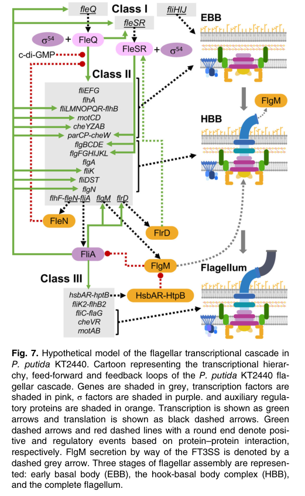

## Question

# Gene Research for Functional Annotation

## ⚠️ CRITICAL: Gene/Protein Identification Context

**BEFORE YOU BEGIN RESEARCH:** You MUST verify you are researching the CORRECT gene/protein. Gene symbols can be ambiguous, especially for less well-characterized genes from non-model organisms.

### Target Gene/Protein Identity (from UniProt):
- **UniProt Accession:** Q88ES5
- **Protein Description:** RecName: Full=Flagellin {ECO:0000256|RuleBase:RU362073};
- **Gene Information:** Name=fliC {ECO:0000313|EMBL:AAN69956.1}; OrderedLocusNames=PP_4378 {ECO:0000313|EMBL:AAN69956.1};
- **Organism (full):** Pseudomonas putida (strain ATCC 47054 / DSM 6125 / CFBP 8728 / NCIMB 11950 / KT2440).
- **Protein Family:** Belongs to the bacterial flagellin family.
- **Key Domains:** Flagellin. (IPR001492); Flagellin_C. (IPR046358); Flagellin_C_sub2. (IPR042187); Flagellin_hook_IN_motif. (IPR010810); Flagellin_N. (IPR001029)

### MANDATORY VERIFICATION STEPS:

1. **Check if the gene symbol "fliC" matches the protein description above**
2. **Verify the organism is correct:** Pseudomonas putida (strain ATCC 47054 / DSM 6125 / CFBP 8728 / NCIMB 11950 / KT2440).
3. **Check if protein family/domains align with what you find in literature**
4. **If you find literature for a DIFFERENT gene with the same or similar symbol, STOP**

### If Gene Symbol is Ambiguous or You Cannot Find Relevant Literature:

**DO NOT PROCEED WITH RESEARCH ON A DIFFERENT GENE.** Instead:
- State clearly: "The gene symbol 'fliC' is ambiguous or literature is limited for this specific protein"
- Explain what you found (e.g., "Found extensive literature on a different gene with the same symbol in a different organism")
- Describe the protein based ONLY on the UniProt information provided above
- Suggest that the protein function can be inferred from domain/family information

### Research Target:

Please provide a comprehensive research report on the gene **fliC** (gene ID: fliC, UniProt: Q88ES5) in PSEPK.

The research report should be a detailed narrative explaining the function, biological processes, and localization of the gene product. Citations should be given for all claims.

You should prioritize authoritative reviews and primary scientific literature when conducting research. You can supplement
this with annotations you find in gene/protein databases, but these can be outdated or inaccurate.

We are specifically interested in the primary function of the gene - for enzymes, what reaction is catalyzed, and what is the substrate specificity? For transporters, what is the substrate? For structural proteins or adapters, what is the broader structural role? For signaling molecules, what is the role in the pathway.

We are interested in where in or outside the cell the gene product carries out its function.

We are also interested in the signaling or biochemical pathways in which the gene functions. We are less interested in broad pleiotropic effects, except where these elucidate the precise role.

Include evidence where possible. We are interested in both experimental evidence as well as inference from structure, evolution, or bioinformatic analysis. Precise studies should be prioritized over high-throughput, where available.

## Output

Question: You are an expert researcher providing comprehensive, well-cited information.

Provide detailed information focusing on:
1. Key concepts and definitions with current understanding
2. Recent developments and latest research (prioritize 2023-2024 sources)
3. Current applications and real-world implementations
4. Expert opinions and analysis from authoritative sources
5. Relevant statistics and data from recent studies

Format as a comprehensive research report with proper citations. Include URLs and publication dates where available.
Always prioritize recent, authoritative sources and provide specific citations for all major claims.

# Gene Research for Functional Annotation

## ⚠️ CRITICAL: Gene/Protein Identification Context

**BEFORE YOU BEGIN RESEARCH:** You MUST verify you are researching the CORRECT gene/protein. Gene symbols can be ambiguous, especially for less well-characterized genes from non-model organisms.

### Target Gene/Protein Identity (from UniProt):
- **UniProt Accession:** Q88ES5
- **Protein Description:** RecName: Full=Flagellin {ECO:0000256|RuleBase:RU362073};
- **Gene Information:** Name=fliC {ECO:0000313|EMBL:AAN69956.1}; OrderedLocusNames=PP_4378 {ECO:0000313|EMBL:AAN69956.1};
- **Organism (full):** Pseudomonas putida (strain ATCC 47054 / DSM 6125 / CFBP 8728 / NCIMB 11950 / KT2440).
- **Protein Family:** Belongs to the bacterial flagellin family.
- **Key Domains:** Flagellin. (IPR001492); Flagellin_C. (IPR046358); Flagellin_C_sub2. (IPR042187); Flagellin_hook_IN_motif. (IPR010810); Flagellin_N. (IPR001029)

### MANDATORY VERIFICATION STEPS:

1. **Check if the gene symbol "fliC" matches the protein description above**
2. **Verify the organism is correct:** Pseudomonas putida (strain ATCC 47054 / DSM 6125 / CFBP 8728 / NCIMB 11950 / KT2440).
3. **Check if protein family/domains align with what you find in literature**
4. **If you find literature for a DIFFERENT gene with the same or similar symbol, STOP**

### If Gene Symbol is Ambiguous or You Cannot Find Relevant Literature:

**DO NOT PROCEED WITH RESEARCH ON A DIFFERENT GENE.** Instead:
- State clearly: "The gene symbol 'fliC' is ambiguous or literature is limited for this specific protein"
- Explain what you found (e.g., "Found extensive literature on a different gene with the same symbol in a different organism")
- Describe the protein based ONLY on the UniProt information provided above
- Suggest that the protein function can be inferred from domain/family information

### Research Target:

Please provide a comprehensive research report on the gene **fliC** (gene ID: fliC, UniProt: Q88ES5) in PSEPK.

The research report should be a detailed narrative explaining the function, biological processes, and localization of the gene product. Citations should be given for all claims.

You should prioritize authoritative reviews and primary scientific literature when conducting research. You can supplement
this with annotations you find in gene/protein databases, but these can be outdated or inaccurate.

We are specifically interested in the primary function of the gene - for enzymes, what reaction is catalyzed, and what is the substrate specificity? For transporters, what is the substrate? For structural proteins or adapters, what is the broader structural role? For signaling molecules, what is the role in the pathway.

We are interested in where in or outside the cell the gene product carries out its function.

We are also interested in the signaling or biochemical pathways in which the gene functions. We are less interested in broad pleiotropic effects, except where these elucidate the precise role.

Include evidence where possible. We are interested in both experimental evidence as well as inference from structure, evolution, or bioinformatic analysis. Precise studies should be prioritized over high-throughput, where available.

## Research Report: Functional Annotation of **fliC** (UniProt **Q88ES5**; locus **PP_4378**) in *Pseudomonas putida* KT2440

### 0. Mandatory identity verification (critical disambiguation)
**Target provided:** UniProt Q88ES5, gene **fliC**, product **Flagellin**, organism ***Pseudomonas putida* KT2440**.

**Verification against literature retrieved here**
1. **Gene symbol ↔ protein description match:** In *Pseudomonas* (including *P. putida* KT2440), **fliC is consistently used for the major flagellin (filament) subunit**; e.g., KT2440 flagellar regulation papers explicitly state that **fliC encodes the major flagellin subunit**. (xiao2017expressionofthe pages 1-2)
2. **Organism match:** KT2440-specific regulatory studies explicitly analyze the *P. putida* KT2440 flagellar cluster and regulation, and place **fliC within the KT2440 flagellar cluster/operons**, consistent with the provided locus context. (leal‐morales2022transcriptionalorganizationand pages 1-1, leal‐morales2022transcriptionalorganizationand media d3e84020)
3. **Family/domain alignment:** While the retrieved primary papers do not enumerate InterPro accessions, they describe fliC/flagellin as the filament subunit and exported structural protein, consistent with membership in the bacterial flagellin family (as in the UniProt-provided domain context). (leal‐morales2022transcriptionalorganizationand pages 1-1, bouteiller2021pseudomonasflagellageneralities pages 9-11)

**Conclusion:** The literature evidence in this corpus is consistent with UniProt Q88ES5 being the **flagellin/filament subunit FliC** of *P. putida* KT2440, and no conflicting fliC meaning was encountered in KT2440-specific sources. (leal‐morales2022transcriptionalorganizationand pages 1-1, xiao2017expressionofthe pages 1-2)

### 1. Key concepts and definitions (current understanding)

#### 1.1 Flagellin (FliC)
**Flagellin** is the principal repeating protein subunit of the **flagellar filament**, the long helical extracellular appendage that functions as the **propeller** of bacterial swimming motility. (leal‐morales2022transcriptionalorganizationand pages 1-1)

In *Pseudomonas*, filament construction follows export of a filament cap (FliD); then **FliC is exported through the flagellar type III secretion system (fT3SS)** with its chaperone (FliS) to enable filament extension. (bouteiller2021pseudomonasflagellageneralities pages 9-11)

#### 1.2 Hierarchical flagellar gene regulation in *Pseudomonas*
Flagellar biogenesis is typically regulated by a **temporal transcriptional hierarchy** aligned with assembly order. In *Pseudomonas putida* KT2440, a genome region (“flagellar cluster”) contains dozens of genes (59 in the cluster analyzed) organized into operons and promoters governing assembly and function. (leal‐morales2022transcriptionalorganizationand pages 1-1)

A KT2440-focused analysis supports a cascade in which a master regulator (FleQ) and σ\N (RpoN/σ54) drive early/middle flagellar genes, including regulatory nodes, culminating in activation of late genes by σ\28 (FliA) that enable **filament (flagellin) synthesis**. (leal‐morales2022transcriptionalorganizationand pages 1-1, leal‐morales2022transcriptionalorganizationand media d3e84020)

#### 1.3 Assembly checkpoint control via FlgM–FliA
A conserved checkpoint mechanism delays expression of late filament genes: the anti-sigma factor **FlgM sequesters FliA** until the hook-basal body is assembled; completion triggers FlgM export and release of FliA-dependent transcription of late genes such as **fliC**. (bouteiller2021pseudomonasflagellageneralities pages 9-11, oladosu2024fliptheswitch pages 3-4)

### 2. Functional annotation of *P. putida* KT2440 **fliC** (Q88ES5)

#### 2.1 Primary molecular function
**FliC is a structural protein (not an enzyme/transport protein):** it polymerizes to form the **flagellar filament**, enabling propulsion during swimming. (leal‐morales2022transcriptionalorganizationand pages 1-1, bouteiller2021pseudomonasflagellageneralities pages 9-11)

A KT2440 study discussing flagellar regulation explicitly identifies **fliC as encoding the major flagellin subunit** and positions its expression among the late flagellar genes requiring FliA/σ\28. (xiao2017expressionofthe pages 1-2)

#### 2.2 Biological processes
**Motility/chemotaxis:** In KT2440, regulatory work describes that FliA activation of late genes enables synthesis of the filament and supports completion of the chemotaxis apparatus, linking filament synthesis (and thus fliC expression) to functional motility and chemotactic behavior. (leal‐morales2022transcriptionalorganizationand pages 1-1)

**Lifestyle transitions:** In *Pseudomonas*, flagellar gene regulation is tightly intertwined with the transition between planktonic motility and sessile/biofilm states through regulators like FleQ and the second messenger c-di-GMP. (blancoromero2018genomewideanalysisof pages 4-5, oladosu2024fliptheswitch pages 4-7)

#### 2.3 Subcellular localization
The filament is described as “a long and thin helical appendage that protrudes from the cells,” placing FliC in an **extracellular, surface-exposed polymer** attached to the flagellar basal body/hook. (leal‐morales2022transcriptionalorganizationand pages 1-1)

Mechanistically, FliC is exported via the fT3SS to the growing tip after cap assembly, consistent with extracellular polymerization. (bouteiller2021pseudomonasflagellageneralities pages 9-11)

### 3. Regulation and pathway context in KT2440 (direct evidence prioritized)

#### 3.1 Operon/genomic context (KT2440)
A KT2440 flagellar-cluster map places fliC in an operon annotated as **fliC–flaG–fliDST–fleQSR**, integrating the filament gene with regulatory components in the same cluster architecture. (leal‐morales2022transcriptionalorganizationand media d3e84020)

#### 3.2 Transcriptional hierarchy controlling fliC
A KT2440 regulatory model figure summarizes a cascade where:
- **FleQ** (master regulator) and **σ\54/RpoN** activate early/middle genes (including regulatory nodes such as **FliA**).
- **FliA (σ\28)** activates late genes, including **fliC**, enabling filament synthesis. (leal‐morales2022transcriptionalorganizationand pages 1-1, leal‐morales2022transcriptionalorganizationand media d3e84020)

KT2440 experimental work on motility regulation reiterates that **FliA is required for transcription of late flagellar genes including fliC**. (xiao2017expressionofthe pages 1-2)

#### 3.3 FleQ direct regulon evidence in *P. putida* KT2440
A ChIP-seq-based genome-wide analysis of **FleQ binding and regulation** in KT2440 reports that FleQ is bifunctional and **activates genes implicated in motility and adhesion**, explicitly including **fliC** (and lapA), while repressing exopolysaccharide-associated genes. (blancoromero2018genomewideanalysisof pages 4-5)

This provides direct evidence that **fliC is under FleQ-dependent transcriptional control** in *P. putida* KT2440. (blancoromero2018genomewideanalysisof pages 4-5)

#### 3.4 Connections to c-di-GMP and biofilm regulation (KT2440 + authoritative cross-Pseudomonas context)
**KT2440 evidence for coupling between flagellar σ-factor and c-di-GMP:** In KT2440, deletion of **fliA** caused an ~**twofold decrease** in transcription of the phosphodiesterase gene **bifA**, and FliA overexpression decreased intracellular c-di-GMP in a BifA-dependent manner and enhanced swimming. (xiao2017expressionofthe pages 1-2)

Because fliC is a canonical late gene requiring FliA, this establishes an organism-specific regulatory connection by which the late flagellar program (including filament synthesis) is coupled to c-di-GMP dynamics and motility. (xiao2017expressionofthe pages 1-2)

**2024 mechanistic review (authoritative synthesis, mainly *P. aeruginosa* but generalized to *Pseudomonas*):** FleQ is an AAA+ ATPase enhancer-binding protein that activates σ\54-dependent flagellar genes; **c-di-GMP binding obstructs the ATP-binding pocket and allosterically inhibits FleQ ATPase activity**, repressing flagellar transcription and favoring biofilm matrix gene expression at high c-di-GMP. (oladosu2024fliptheswitch pages 9-11)

This mechanism provides a current expert framework for interpreting how KT2440 FleQ can coordinate motility genes such as fliC with biofilm-associated transcriptional programs. (oladosu2024fliptheswitch pages 4-7, oladosu2024fliptheswitch pages 9-11)

### 4. Recent developments (prioritizing 2023–2024)

#### 4.1 2024: Updated mechanistic model for FleQ as a motile–sessile “switch”
A 2024 *Journal of Bacteriology* minireview synthesizes evidence that FleQ can act as both activator and repressor and that its promoter-binding configurations and sigma-factor dependencies (σ\54 for flagella; σ\70-like promoters for some matrix genes) allow **inverse regulation of flagella genes (including class IV outputs like fliC via FliA) and biofilm genes**, depending on c-di-GMP. (oladosu2024fliptheswitch pages 3-4, oladosu2024fliptheswitch pages 4-7)

Although this review focuses on *P. aeruginosa*, it explicitly frames the mechanism as relevant across *Pseudomonas* (including *P. putida*), and it provides up-to-date expert interpretation of how upstream regulators modulate late filament/flagellin expression indirectly through the cascade. (oladosu2024fliptheswitch pages 1-3)

#### 4.2 2024: Polar flagellum formation licensing involves FlhF–FipA in *P. putida*
A 2024 *eLife* study identifies **FipA** as a conserved determinant required for normal FlhF function and polar flagellum formation, including in *P. putida*. In *P. putida*, **loss of fipA phenocopies loss of flhF by greatly reducing flagellum number**, linking polar flagellar biogenesis to a conserved licensing factor upstream of filament assembly (and thus upstream of fliC’s structural role). (arroyoperez2024aconservedcellpole pages 14-15)

This represents a recent advance in understanding how *P. putida* coordinates polar flagellum biogenesis, providing context for when and where filament proteins like FliC will be assembled (i.e., at the designated pole). (arroyoperez2024aconservedcellpole pages 14-15)

#### 4.3 2023: Functional divergence of duplicated flagellins and implications for host recognition
A 2023 primary study in *Microbiology Spectrum* shows that in some plant-associated *Pseudomonas* (e.g., *Pseudomonas kilonensis* F113), duplicated flagellins can diverge such that only one contributes to motility and plant immune elicitation. (luo2023duplicatedflagellinsin pages 8-10)

The same work provides quantitative, modern examples of flagellin-derived epitope function: predicted binding stability changes (ΔΔGbind) for Flg22 peptides differed markedly (e.g., Flg22-1 vs Flg22-2), providing a framework for how sequence variation in flagellin N-termini can alter host pattern-recognition outcomes. (luo2023duplicatedflagellinsin pages 8-10)

While not KT2440-specific, this 2023 work is directly relevant for interpreting potential ecological/host-interaction consequences of flagellin sequence variation in environmental *Pseudomonas* like KT2440. (luo2023duplicatedflagellinsin pages 8-10)

### 5. Current applications and real-world implementations (fliC/flagellin-relevant)

#### 5.1 Rhizosphere competitiveness and environmental colonization (motility-centric)
A KT2440/F113 comparative ChIP-seq study motivates flagellar gene regulation as central to **competitiveness and colonization in the rhizosphere** and identifies FleQ as a master regulator controlling motility and adhesion genes, including **fliC**. (blancoromero2018genomewideanalysisof pages 4-5)

This positions fliC-mediated motility as a trait likely important in soil/plant-associated contexts where *Pseudomonas* strains are deployed or studied (e.g., for colonization/competitiveness), even if the paper’s primary outputs are regulatory rather than field trials. (blancoromero2018genomewideanalysisof pages 4-5)

#### 5.2 Biofilm control strategies via c-di-GMP/FleQ axes (mechanism-guided engineering)
Because FleQ integrates c-di-GMP signals to inversely regulate flagella and matrix genes, the 2024 synthesis suggests rational levers for shifting populations between motile and sessile states by manipulating c-di-GMP or FleQ’s activity state. (oladosu2024fliptheswitch pages 4-7, oladosu2024fliptheswitch pages 9-11)

In KT2440 specifically, the demonstrated **FliA→BifA→c-di-GMP** link provides an experimentally supported route by which late flagellar regulation can feed back on a global second messenger known to control motility vs biofilm behaviors. (xiao2017expressionofthe pages 1-2)

### 6. Relevant statistics and quantitative data (recent and authoritative)

*Structural/organizational statistics*
- A Pseudomonas flagella review reports that a filament can contain **~20,000 flagellin subunits**. (bouteiller2021pseudomonasflagellageneralities pages 11-12)
- The same review notes that some *Pseudomonas putida* strains can possess **~5–7 polar flagella** (reported for *P. putida* PRS2000; KT2440 is also described as lophotrichous in KT2440 regulatory mapping). (leal‐morales2022transcriptionalorganizationand pages 2-2, bouteiller2021pseudomonasflagellageneralities pages 9-11)

*Regulatory/phenotypic quantitative data (KT2440)*
- In KT2440, **FliA deletion caused an ~twofold decrease in bifA transcription** (regulatory connection to c-di-GMP), and overexpression of FliA enhanced swimming in a BifA-dependent manner. (xiao2017expressionofthe pages 1-2)

*Host recognition quantitative example (2023, non-KT2440 Pseudomonas)*
- Predicted binding stability changes for Flg22 peptides differed strongly between two flagellins, illustrating potential functional divergence of flagellin epitopes (ΔΔGbind values reported in the study). (luo2023duplicatedflagellinsin pages 8-10)

### 7. Expert opinion / authoritative analysis (how to interpret fliC in KT2440)
The best-supported interpretation is that **fliC (Q88ES5) encodes the polymerizing filament subunit whose primary role is mechanical propulsion**, and that its expression is best understood as the terminal output of a multi-layer regulatory cascade integrating:
- assembly checkpoints (FlgM–FliA), (bouteiller2021pseudomonasflagellageneralities pages 9-11, oladosu2024fliptheswitch pages 3-4)
- master transcriptional control by FleQ with σ\54, (leal‐morales2022transcriptionalorganizationand pages 1-1, blancoromero2018genomewideanalysisof pages 11-12)
- modulation by c-di-GMP that biases the population between motility and biofilm programs. (oladosu2024fliptheswitch pages 4-7, oladosu2024fliptheswitch pages 9-11)

For KT2440 functional annotation, **direct evidence supports regulation (FleQ, FliA) and biological role (filament for motility)**, whereas claims about host immune elicitation should be treated as **inference from related Pseudomonas** unless KT2440-specific flg22/FLS2 or TLR5 assays are consulted separately. (blancoromero2018genomewideanalysisof pages 4-5, luo2023duplicatedflagellinsin pages 8-10)

### Summary table of evidence
The following table consolidates KT2440-direct evidence and clearly marked cross-*Pseudomonas* inference, including URLs and quantitative facts.

| Annotation topic | Claim | Evidence summary | Key citation IDs | Paper citation (year, URL) |
|---|---|---|---|---|
| Protein identity / family / domains | **Q88ES5 = FliC/flagellin of *Pseudomonas putida* KT2440 (PP_4378)**; member of the bacterial flagellin family with N- and C-terminal flagellin domains. | Identity is anchored by the user-provided UniProt record for Q88ES5/PP_4378 and is consistent with retrieved *P. putida* literature placing **fliC** in the filament gene set and in the late flagellar regulon; however, the specific InterPro domain calls were **not directly re-reported in the retrieved papers**. | (leal‐morales2022transcriptionalorganizationand pages 1-1, leal‐morales2022transcriptionalorganizationand media d3e84020) | Leal-Morales A, Pulido-Sánchez M, López-Sánchez A, Govantes F. *Transcriptional organization and regulation of the Pseudomonas putida flagellar system* (2022), https://doi.org/10.1111/1462-2920.15857 |
| Cellular localization / structure | FliC is the **major structural subunit of the flagellar filament**, an **extracellular helical appendage** that protrudes from the cell. | *P. putida* flagellar-system study defines the filament as a long, thin helical appendage protruding from cells and acting as a propeller; broader Pseudomonas review states FliC is exported by the flagellar type III secretion system with chaperone FliS to extend the filament after FliD cap assembly. | (leal‐morales2022transcriptionalorganizationand pages 1-1, bouteiller2021pseudomonasflagellageneralities pages 9-11) | Leal-Morales et al. (2022), https://doi.org/10.1111/1462-2920.15857; Bouteiller M et al. *Pseudomonas Flagella: Generalities and Specificities* (2021), https://doi.org/10.3390/ijms22073337 |
| Role in motility / chemotaxis | FliC provides the **filament required for flagella-driven swimming**, thereby contributing to motility and completion of the chemotaxis apparatus. | The KT2440 transcriptional map states FliA-driven late gene expression enables filament synthesis and completion of the chemotaxis apparatus; a KT2440-focused review/experimental context identifies **fliC** as the major flagellin subunit among class IV/late genes needed for motility. | (leal‐morales2022transcriptionalorganizationand pages 1-1, xiao2017expressionofthe pages 1-2) | Leal-Morales et al. (2022), https://doi.org/10.1111/1462-2920.15857; Xiao Y et al. *Expression of the phosphodiesterase BifA facilitating swimming motility is partly controlled by FliA in Pseudomonas putida KT2440* (2017), https://doi.org/10.1002/mbo3.402 |
| Transcriptional regulation hierarchy | In KT2440, **fliC belongs to the late filament operon** and is regulated through the **FleQ/σ54 → FleSR/FliA → FliA-dependent late genes** hierarchy, with a **FlgM checkpoint** delaying late expression until hook-basal body completion. | Figure/model for KT2440 places the **fliC-flaG-fliDST-fleQSR** operon in the flagellar cluster and shows a three-tier cascade: FleQ with σ54 controls early genes and regulatory nodes; FliA activates late filament genes including **fliC**; broader mechanistic sources describe FlgM anti-sigma-factor control and secretion-dependent release of FliA activity. | (leal‐morales2022transcriptionalorganizationand media d3e84020, leal‐morales2022transcriptionalorganizationand pages 2-2, xiao2017expressionofthe pages 1-2, bouteiller2021pseudomonasflagellageneralities pages 9-11) | Leal-Morales et al. (2022), https://doi.org/10.1111/1462-2920.15857; Xiao et al. (2017), https://doi.org/10.1002/mbo3.402; Bouteiller et al. (2021), https://doi.org/10.3390/ijms22073337 |
| c-di-GMP / biofilm-transition links | Evidence suggests **indirect coupling** of fliC expression to the **motile–sessile switch** via **FleQ/c-di-GMP** and a **FliA→BifA** feedback axis. | FleQ ChIP-seq/regulon analysis in KT2440 identified **fliC** among motility genes activated by FleQ, and the study notes FleQ regulation is influenced by c-di-GMP; separately, in KT2440, **fliA deletion caused an approximately twofold decrease in bifA transcription**, and FliA overexpression decreased intracellular c-di-GMP in a BifA-dependent manner while enhancing swimming. This links the late flagellar sigma factor controlling **fliC** to c-di-GMP control, though not as a direct biochemical role of FliC itself. | (blancoromero2018genomewideanalysisof pages 4-5, xiao2017expressionofthe pages 1-2, xiao2017expressionofthe pages 2-4) | Blanco-Romero E et al. *Genome-wide analysis of the FleQ direct regulon in Pseudomonas fluorescens F113 and Pseudomonas putida KT2440* (2018), https://doi.org/10.1038/s41598-018-31371-z; Xiao et al. (2017), https://doi.org/10.1002/mbo3.402 |
| Quantitative / statistical facts | Useful quantitative facts for annotation context: **KT2440/related *P. putida* strains bear ~5–7 polar flagella**; a filament contains **~20,000 FliC subunits**; **fliA deletion decreases bifA transcription ~2-fold**; in a 2023 Pseudomonas flagellin study, predicted Flg22 binding energies differed strongly between two flagellins (**Flg22-1: ΔΔGbind −0.59 kcal/mol to FLS2 and −1.12 kcal/mol to FLS2/BAK1; Flg22-2: 2.2 and 0.16 kcal/mol**, respectively). | These numbers come from Pseudomonas flagella review (5–7 flagella; ~20,000 filament subunits), KT2440 BifA/FliA study (~2-fold), and a 2023 primary paper on duplicated Pseudomonas flagellins showing divergent plant immune elicitation. The Flg22 values are from a related *Pseudomonas* system, **not KT2440-specific**, but they are relevant to contemporary flagellin-function interpretation. | (bouteiller2021pseudomonasflagellageneralities pages 11-12, xiao2017expressionofthe pages 1-2, luo2023duplicatedflagellinsin pages 8-10) | Bouteiller et al. (2021), https://doi.org/10.3390/ijms22073337; Xiao et al. (2017), https://doi.org/10.1002/mbo3.402; Luo Y et al. *Duplicated Flagellins in Pseudomonas Divergently Contribute to Motility and Plant Immune Elicitation* (2023), https://doi.org/10.1128/spectrum.03621-22 |

*Table: This table summarizes the most relevant functional-annotation evidence for *Pseudomonas putida* KT2440 fliC (UniProt Q88ES5/PP_4378), separating direct KT2440 evidence from broader Pseudomonas context. It is useful as a compact reference for identity, localization, regulation, and quantitative facts.*

### Key cited sources (with dates and URLs)
- Leal-Morales A. et al. **2022-12**. *Environmental Microbiology*. “Transcriptional organization and regulation of the *Pseudomonas putida* flagellar system.” https://doi.org/10.1111/1462-2920.15857 (leal‐morales2022transcriptionalorganizationand pages 1-1, leal‐morales2022transcriptionalorganizationand media d3e84020)
- Blanco-Romero E. et al. **2018-09**. *Scientific Reports*. “Genome-wide analysis of the FleQ direct regulon in *Pseudomonas fluorescens* F113 and *Pseudomonas putida* KT2440.” https://doi.org/10.1038/s41598-018-31371-z (blancoromero2018genomewideanalysisof pages 4-5)
- Xiao Y. et al. **2017-09** (accepted 2016-08-19). *MicrobiologyOpen*. “Expression of the phosphodiesterase BifA facilitating swimming motility is partly controlled by FliA in *P. putida* KT2440.” https://doi.org/10.1002/mbo3.402 (xiao2017expressionofthe pages 1-2)
- Bouteiller M. et al. **2021-03**. *International Journal of Molecular Sciences*. “Pseudomonas Flagella: Generalities and Specificities.” https://doi.org/10.3390/ijms22073337 (bouteiller2021pseudomonasflagellageneralities pages 11-12, bouteiller2021pseudomonasflagellageneralities pages 9-11)
- Luo Y. et al. **2023-02**. *Microbiology Spectrum*. “Duplicated Flagellins in *Pseudomonas* Divergently Contribute to Motility and Plant Immune Elicitation.” https://doi.org/10.1128/spectrum.03621-22 (luo2023duplicatedflagellinsin pages 8-10)
- Oladosu V.I. et al. **2024-03**. *Journal of Bacteriology*. “Flip the switch: the role of FleQ in modulating the transition between free-living and sessile growth in *Pseudomonas aeruginosa*.” https://doi.org/10.1128/jb.00365-23 (oladosu2024fliptheswitch pages 3-4, oladosu2024fliptheswitch pages 9-11)
- Arroyo-Pérez E.E. et al. **2024-12**. *eLife*. “A conserved cell-pole determinant organizes proper polar flagellum formation.” https://doi.org/10.7554/eLife.93004.3 (arroyoperez2024aconservedcellpole pages 14-15)

References

1. (xiao2017expressionofthe pages 1-2): Yujie Xiao, Huizhong Liu, Hailing Nie, Shan Xie, Xuesong Luo, Wenli Chen, and Qiaoyun Huang. Expression of the phosphodiesterase bifa facilitating swimming motility is partly controlled by flia in pseudomonas putida kt2440. MicrobiologyOpen, 6:e00402, Sep 2017. URL: https://doi.org/10.1002/mbo3.402, doi:10.1002/mbo3.402. This article has 16 citations and is from a peer-reviewed journal.

2. (leal‐morales2022transcriptionalorganizationand pages 1-1): Antonio Leal‐Morales, Marta Pulido‐Sánchez, Aroa López‐Sánchez, and Fernando Govantes. Transcriptional organization and regulation of the <i>pseudomonas putida</i> flagellar system. Environmental Microbiology, 24:137-157, Dec 2022. URL: https://doi.org/10.1111/1462-2920.15857, doi:10.1111/1462-2920.15857. This article has 31 citations and is from a domain leading peer-reviewed journal.

3. (leal‐morales2022transcriptionalorganizationand media d3e84020): Antonio Leal‐Morales, Marta Pulido‐Sánchez, Aroa López‐Sánchez, and Fernando Govantes. Transcriptional organization and regulation of the <i>pseudomonas putida</i> flagellar system. Environmental Microbiology, 24:137-157, Dec 2022. URL: https://doi.org/10.1111/1462-2920.15857, doi:10.1111/1462-2920.15857. This article has 31 citations and is from a domain leading peer-reviewed journal.

4. (bouteiller2021pseudomonasflagellageneralities pages 9-11): Mathilde Bouteiller, Charly Dupont, Yvann Bourigault, Xavier Latour, Corinne Barbey, Yoan Konto-Ghiorghi, and Annabelle Merieau. Pseudomonas flagella: generalities and specificities. International Journal of Molecular Sciences, 22:3337, Mar 2021. URL: https://doi.org/10.3390/ijms22073337, doi:10.3390/ijms22073337. This article has 147 citations.

5. (oladosu2024fliptheswitch pages 3-4): Victoria I. Oladosu, Soyoung Park, and Karin Sauer. Flip the switch: the role of fleq in modulating the transition between the free-living and sessile mode of growth in <i>pseudomonas aeruginosa</i>. Mar 2024. URL: https://doi.org/10.1128/jb.00365-23, doi:10.1128/jb.00365-23. This article has 27 citations and is from a peer-reviewed journal.

6. (blancoromero2018genomewideanalysisof pages 4-5): Esther Blanco-Romero, Miguel Redondo-Nieto, Francisco Martínez-Granero, Daniel Garrido-Sanz, Maria Isabel Ramos-González, Marta Martín, and Rafael Rivilla. Genome-wide analysis of the fleq direct regulon in pseudomonas fluorescens f113 and pseudomonas putida kt2440. Scientific Reports, Sep 2018. URL: https://doi.org/10.1038/s41598-018-31371-z, doi:10.1038/s41598-018-31371-z. This article has 64 citations and is from a peer-reviewed journal.

7. (oladosu2024fliptheswitch pages 4-7): Victoria I. Oladosu, Soyoung Park, and Karin Sauer. Flip the switch: the role of fleq in modulating the transition between the free-living and sessile mode of growth in <i>pseudomonas aeruginosa</i>. Mar 2024. URL: https://doi.org/10.1128/jb.00365-23, doi:10.1128/jb.00365-23. This article has 27 citations and is from a peer-reviewed journal.

8. (oladosu2024fliptheswitch pages 9-11): Victoria I. Oladosu, Soyoung Park, and Karin Sauer. Flip the switch: the role of fleq in modulating the transition between the free-living and sessile mode of growth in <i>pseudomonas aeruginosa</i>. Mar 2024. URL: https://doi.org/10.1128/jb.00365-23, doi:10.1128/jb.00365-23. This article has 27 citations and is from a peer-reviewed journal.

9. (oladosu2024fliptheswitch pages 1-3): Victoria I. Oladosu, Soyoung Park, and Karin Sauer. Flip the switch: the role of fleq in modulating the transition between the free-living and sessile mode of growth in <i>pseudomonas aeruginosa</i>. Mar 2024. URL: https://doi.org/10.1128/jb.00365-23, doi:10.1128/jb.00365-23. This article has 27 citations and is from a peer-reviewed journal.

10. (arroyoperez2024aconservedcellpole pages 14-15): Erick Eligio Arroyo-Pérez, John C. Hook, Alejandra Alvarado, Stephan Wimmi, Timo Glatter, K. Thormann, and S. Ringgaard. A conserved cell-pole determinant organizes proper polar flagellum formation. Dec 2024. URL: https://doi.org/10.7554/elife.93004.3, doi:10.7554/elife.93004.3. This article has 6 citations and is from a domain leading peer-reviewed journal.

11. (luo2023duplicatedflagellinsin pages 8-10): Yuan Luo, Jing Wang, Yi-Lin Gu, Li-Qun Zhang, and Hai-Lei Wei. Duplicated flagellins in pseudomonas divergently contribute to motility and plant immune elicitation. Feb 2023. URL: https://doi.org/10.1128/spectrum.03621-22, doi:10.1128/spectrum.03621-22. This article has 22 citations and is from a domain leading peer-reviewed journal.

12. (bouteiller2021pseudomonasflagellageneralities pages 11-12): Mathilde Bouteiller, Charly Dupont, Yvann Bourigault, Xavier Latour, Corinne Barbey, Yoan Konto-Ghiorghi, and Annabelle Merieau. Pseudomonas flagella: generalities and specificities. International Journal of Molecular Sciences, 22:3337, Mar 2021. URL: https://doi.org/10.3390/ijms22073337, doi:10.3390/ijms22073337. This article has 147 citations.

13. (leal‐morales2022transcriptionalorganizationand pages 2-2): Antonio Leal‐Morales, Marta Pulido‐Sánchez, Aroa López‐Sánchez, and Fernando Govantes. Transcriptional organization and regulation of the <i>pseudomonas putida</i> flagellar system. Environmental Microbiology, 24:137-157, Dec 2022. URL: https://doi.org/10.1111/1462-2920.15857, doi:10.1111/1462-2920.15857. This article has 31 citations and is from a domain leading peer-reviewed journal.

14. (blancoromero2018genomewideanalysisof pages 11-12): Esther Blanco-Romero, Miguel Redondo-Nieto, Francisco Martínez-Granero, Daniel Garrido-Sanz, Maria Isabel Ramos-González, Marta Martín, and Rafael Rivilla. Genome-wide analysis of the fleq direct regulon in pseudomonas fluorescens f113 and pseudomonas putida kt2440. Scientific Reports, Sep 2018. URL: https://doi.org/10.1038/s41598-018-31371-z, doi:10.1038/s41598-018-31371-z. This article has 64 citations and is from a peer-reviewed journal.

15. (xiao2017expressionofthe pages 2-4): Yujie Xiao, Huizhong Liu, Hailing Nie, Shan Xie, Xuesong Luo, Wenli Chen, and Qiaoyun Huang. Expression of the phosphodiesterase bifa facilitating swimming motility is partly controlled by flia in pseudomonas putida kt2440. MicrobiologyOpen, 6:e00402, Sep 2017. URL: https://doi.org/10.1002/mbo3.402, doi:10.1002/mbo3.402. This article has 16 citations and is from a peer-reviewed journal.

## Artifacts

- [Edison artifact artifact-00](fliC-deep-research-falcon_artifacts/artifact-00.md)

## Citations

1. xiao2017expressionofthe pages 1-2
2. bouteiller2021pseudomonasflagellageneralities pages 9-11
3. blancoromero2018genomewideanalysisof pages 4-5
4. oladosu2024fliptheswitch pages 9-11
5. oladosu2024fliptheswitch pages 1-3
6. arroyoperez2024aconservedcellpole pages 14-15
7. luo2023duplicatedflagellinsin pages 8-10
8. bouteiller2021pseudomonasflagellageneralities pages 11-12
9. oladosu2024fliptheswitch pages 3-4
10. oladosu2024fliptheswitch pages 4-7
11. blancoromero2018genomewideanalysisof pages 11-12
12. xiao2017expressionofthe pages 2-4
13. https://doi.org/10.1111/1462-2920.15857
14. https://doi.org/10.1111/1462-2920.15857;
15. https://doi.org/10.3390/ijms22073337
16. https://doi.org/10.1002/mbo3.402
17. https://doi.org/10.1002/mbo3.402;
18. https://doi.org/10.1038/s41598-018-31371-z;
19. https://doi.org/10.3390/ijms22073337;
20. https://doi.org/10.1128/spectrum.03621-22
21. https://doi.org/10.1038/s41598-018-31371-z
22. https://doi.org/10.1128/jb.00365-23
23. https://doi.org/10.7554/eLife.93004.3
24. https://doi.org/10.1002/mbo3.402,
25. https://doi.org/10.1111/1462-2920.15857,
26. https://doi.org/10.3390/ijms22073337,
27. https://doi.org/10.1128/jb.00365-23,
28. https://doi.org/10.1038/s41598-018-31371-z,
29. https://doi.org/10.7554/elife.93004.3,
30. https://doi.org/10.1128/spectrum.03621-22,