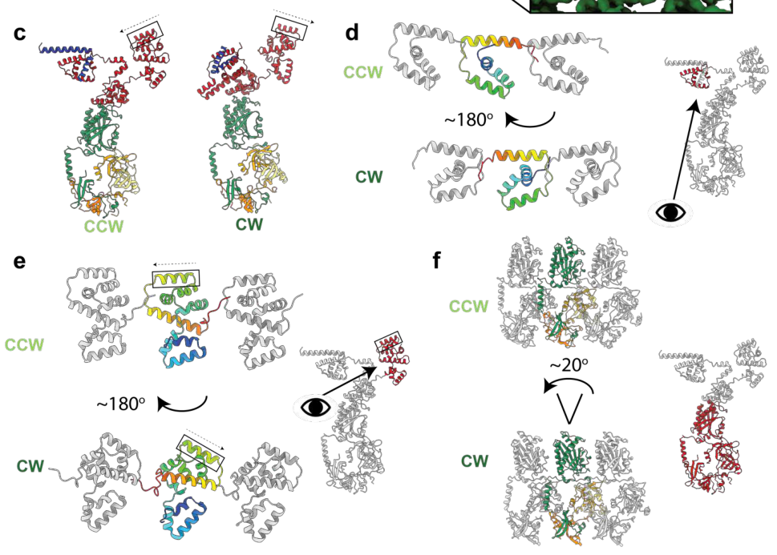

## Question

# Gene Research for Functional Annotation

## ⚠️ CRITICAL: Gene/Protein Identification Context

**BEFORE YOU BEGIN RESEARCH:** You MUST verify you are researching the CORRECT gene/protein. Gene symbols can be ambiguous, especially for less well-characterized genes from non-model organisms.

### Target Gene/Protein Identity (from UniProt):
- **UniProt Accession:** Q88ET5
- **Protein Description:** RecName: Full=Flagellar motor switch protein FliG {ECO:0000256|ARBA:ARBA00021870, ECO:0000256|PIRNR:PIRNR003161};
- **Gene Information:** Name=fliG {ECO:0000313|EMBL:AAN69946.2}; OrderedLocusNames=PP_4368 {ECO:0000313|EMBL:AAN69946.2};
- **Organism (full):** Pseudomonas putida (strain ATCC 47054 / DSM 6125 / CFBP 8728 / NCIMB 11950 / KT2440).
- **Protein Family:** Belongs to the FliG family. {ECO:0000256|ARBA:ARBA00010299,
- **Key Domains:** Flg_Motor_Flig. (IPR000090); Flg_Motor_Flig_C. (IPR023087); FliG_a-hlx. (IPR011002); FliG_M. (IPR032779); FliG_N. (IPR028263)

### MANDATORY VERIFICATION STEPS:

1. **Check if the gene symbol "fliG" matches the protein description above**
2. **Verify the organism is correct:** Pseudomonas putida (strain ATCC 47054 / DSM 6125 / CFBP 8728 / NCIMB 11950 / KT2440).
3. **Check if protein family/domains align with what you find in literature**
4. **If you find literature for a DIFFERENT gene with the same or similar symbol, STOP**

### If Gene Symbol is Ambiguous or You Cannot Find Relevant Literature:

**DO NOT PROCEED WITH RESEARCH ON A DIFFERENT GENE.** Instead:
- State clearly: "The gene symbol 'fliG' is ambiguous or literature is limited for this specific protein"
- Explain what you found (e.g., "Found extensive literature on a different gene with the same symbol in a different organism")
- Describe the protein based ONLY on the UniProt information provided above
- Suggest that the protein function can be inferred from domain/family information

### Research Target:

Please provide a comprehensive research report on the gene **fliG** (gene ID: fliG, UniProt: Q88ET5) in PSEPK.

The research report should be a detailed narrative explaining the function, biological processes, and localization of the gene product. Citations should be given for all claims.

You should prioritize authoritative reviews and primary scientific literature when conducting research. You can supplement
this with annotations you find in gene/protein databases, but these can be outdated or inaccurate.

We are specifically interested in the primary function of the gene - for enzymes, what reaction is catalyzed, and what is the substrate specificity? For transporters, what is the substrate? For structural proteins or adapters, what is the broader structural role? For signaling molecules, what is the role in the pathway.

We are interested in where in or outside the cell the gene product carries out its function.

We are also interested in the signaling or biochemical pathways in which the gene functions. We are less interested in broad pleiotropic effects, except where these elucidate the precise role.

Include evidence where possible. We are interested in both experimental evidence as well as inference from structure, evolution, or bioinformatic analysis. Precise studies should be prioritized over high-throughput, where available.

## Output

Question: You are an expert researcher providing comprehensive, well-cited information.

Provide detailed information focusing on:
1. Key concepts and definitions with current understanding
2. Recent developments and latest research (prioritize 2023-2024 sources)
3. Current applications and real-world implementations
4. Expert opinions and analysis from authoritative sources
5. Relevant statistics and data from recent studies

Format as a comprehensive research report with proper citations. Include URLs and publication dates where available.
Always prioritize recent, authoritative sources and provide specific citations for all major claims.

# Gene Research for Functional Annotation

## ⚠️ CRITICAL: Gene/Protein Identification Context

**BEFORE YOU BEGIN RESEARCH:** You MUST verify you are researching the CORRECT gene/protein. Gene symbols can be ambiguous, especially for less well-characterized genes from non-model organisms.

### Target Gene/Protein Identity (from UniProt):
- **UniProt Accession:** Q88ET5
- **Protein Description:** RecName: Full=Flagellar motor switch protein FliG {ECO:0000256|ARBA:ARBA00021870, ECO:0000256|PIRNR:PIRNR003161};
- **Gene Information:** Name=fliG {ECO:0000313|EMBL:AAN69946.2}; OrderedLocusNames=PP_4368 {ECO:0000313|EMBL:AAN69946.2};
- **Organism (full):** Pseudomonas putida (strain ATCC 47054 / DSM 6125 / CFBP 8728 / NCIMB 11950 / KT2440).
- **Protein Family:** Belongs to the FliG family. {ECO:0000256|ARBA:ARBA00010299,
- **Key Domains:** Flg_Motor_Flig. (IPR000090); Flg_Motor_Flig_C. (IPR023087); FliG_a-hlx. (IPR011002); FliG_M. (IPR032779); FliG_N. (IPR028263)

### MANDATORY VERIFICATION STEPS:

1. **Check if the gene symbol "fliG" matches the protein description above**
2. **Verify the organism is correct:** Pseudomonas putida (strain ATCC 47054 / DSM 6125 / CFBP 8728 / NCIMB 11950 / KT2440).
3. **Check if protein family/domains align with what you find in literature**
4. **If you find literature for a DIFFERENT gene with the same or similar symbol, STOP**

### If Gene Symbol is Ambiguous or You Cannot Find Relevant Literature:

**DO NOT PROCEED WITH RESEARCH ON A DIFFERENT GENE.** Instead:
- State clearly: "The gene symbol 'fliG' is ambiguous or literature is limited for this specific protein"
- Explain what you found (e.g., "Found extensive literature on a different gene with the same symbol in a different organism")
- Describe the protein based ONLY on the UniProt information provided above
- Suggest that the protein function can be inferred from domain/family information

### Research Target:

Please provide a comprehensive research report on the gene **fliG** (gene ID: fliG, UniProt: Q88ET5) in PSEPK.

The research report should be a detailed narrative explaining the function, biological processes, and localization of the gene product. Citations should be given for all claims.

You should prioritize authoritative reviews and primary scientific literature when conducting research. You can supplement
this with annotations you find in gene/protein databases, but these can be outdated or inaccurate.

We are specifically interested in the primary function of the gene - for enzymes, what reaction is catalyzed, and what is the substrate specificity? For transporters, what is the substrate? For structural proteins or adapters, what is the broader structural role? For signaling molecules, what is the role in the pathway.

We are interested in where in or outside the cell the gene product carries out its function.

We are also interested in the signaling or biochemical pathways in which the gene functions. We are less interested in broad pleiotropic effects, except where these elucidate the precise role.

Include evidence where possible. We are interested in both experimental evidence as well as inference from structure, evolution, or bioinformatic analysis. Precise studies should be prioritized over high-throughput, where available.

## Research report: functional annotation of **fliG** (UniProt: **Q88ET5**; locus **PP_4368**) in *Pseudomonas putida* KT2440

### 1) Target identity verification (critical disambiguation)
The target provided (UniProt Q88ET5; gene symbol **fliG**; organism *Pseudomonas putida* strain KT2440) is consistent with the canonical bacterial **flagellar motor switch protein FliG**, a conserved cytoplasmic rotor/switch component of the flagellar basal body. In *P. putida* KT2440, strand-specific RNA-seq shows a continuous transcription unit annotated as **fliEFG**, indicating that **fliE–fliF–fliG** are co-transcribed as an operon within the flagellar gene cluster (supporting that “fliG” here refers to a flagellar motor gene rather than an unrelated protein) (leal‐morales2022transcriptionalorganizationand pages 4-5). Additional transcript mapping/RT-PCR analysis supports an operon boundary/termination at the **fliG–fliH** intergenic region (leal‐morales2022transcriptionalorganizationand pages 5-6). 

### 2) Key concepts and definitions (current understanding)
#### 2.1 What is FliG?
**FliG** is a core subunit of the flagellar **C-ring** (also called the **switch complex**) that controls (i) **torque transmission** from the stator to the rotor and (ii) **directional switching** of flagellar rotation as an output of chemotaxis signaling. In the conserved architecture, **FliG, FliM, and FliN** assemble on the cytoplasmic face of the basal body MS-ring (FliF) and collectively act as the rotor/switch device (minamino2019directionalswitchingmechanism pages 1-2, bouteiller2021pseudomonasflagellageneralities pages 4-5). 

#### 2.2 Cellular localization
FliG is a **cytoplasmic, membrane-proximal** protein localized to the **cell pole** at the flagellar basal body, where it assembles into the C-ring adjacent to the inner membrane/MS-ring (minamino2019directionalswitchingmechanism pages 1-2, bouteiller2021pseudomonasflagellageneralities pages 4-5). 

#### 2.3 Domain organization and conserved functional surfaces
Mechanistic work in model organisms establishes that FliG contains three major domains: an **N-terminal domain (FliG_N)** that interfaces with the MS-ring protein FliF, a **middle domain (FliG_M)** that binds FliM, and a **C-terminal domain (FliG_C)** that contains the “**torque helix**” implicated in stator interactions and torque generation/switching (minamino2019directionalswitchingmechanism pages 2-3). This domain organization is consistent with the user-provided InterPro assignments (FliG_N/M/C and motor-switch-related signatures) and the conserved role of the FliG family in flagellar motors.

### 3) Biological role, pathway context, and interaction partners (with emphasis on *P. putida*)
#### 3.1 Pathway context: flagellar motor + chemotaxis output
The flagellar motor is powered by ion motive force through stator units (e.g., MotA/MotB-type complexes) that interact with the rotor. Reviews summarize that electrostatic interactions between stator components and FliG drive rotation, and the motor’s direction is controlled by chemotaxis signaling via CheY-P binding to C-ring components (nakamura2024structureanddynamics pages 1-3, minamino2019directionalswitchingmechanism pages 1-2). In *Pseudomonas*, motility outputs are further integrated with second-messenger signaling (c-di-GMP) and transcriptional cascades controlling flagellar gene expression (jimenezfernandez2016complexinterplaybetween pages 1-2, wirebrand2018pp4397flgzprovidesthe pages 1-2).

#### 3.2 Direct/likely physical interaction partners of *P. putida* FliG (inference from conserved mechanism)
Based on conserved C-ring architecture and motor mechanics, the principal interaction partners expected for *P. putida* FliG include:
- **FliF (MS-ring)**: FliG is required at the MS/C-ring interface and binds FliF with 1:1 stoichiometry in model systems (minamino2019directionalswitchingmechanism pages 2-3).
- **FliM and FliN (switch complex)**: FliG forms the C-ring together with FliM/FliN and provides the scaffold for switching and chemotaxis output (minamino2019directionalswitchingmechanism pages 1-2, minamino2019directionalswitchingmechanism pages 2-3).
- **MotA/MotB-type stator proteins**: stator–rotor coupling occurs through interactions between MotA cytoplasmic loops/domains and the FliG torque helix (nakamura2024structureanddynamics pages 1-3, minamino2019directionalswitchingmechanism pages 2-3).

In addition, recent work on **polar flagellation** provides a conserved assembly interaction relevant to *P. putida*: FlhF (an SRP-type GTPase implicated in polar flagellum placement) can bind the C-ring protein **FliG** via FlhF’s N-terminus (demonstrated in *Shewanella putrefaciens*), recruiting a FlhF–FliG complex to the cell pole (via HubP) and helping capture FliF to promote MS-ring formation (arroyoperez2024aconservedcellpole pages 2-3). The same study reports relevance across polar-flagellated bacteria including *Pseudomonas putida* (though the specific FlhF–FliG binding experiment in that excerpt is not shown directly for *P. putida*) (arroyoperez2024aconservedcellpole pages 2-3).

#### 3.3 Regulatory context in *P. putida*: transcriptional hierarchy and operon architecture
*P. putida* flagellar genes are organized as a large cluster with multiple operons. RNA-seq-based mapping identifies **fliEFG** as a continuous transcriptional region/operon (leal‐morales2022transcriptionalorganizationand pages 4-5) and supports termination at **fliG–fliH** as an operon boundary (leal‐morales2022transcriptionalorganizationand pages 5-6).

At the systems level, *P. putida* motility and lifestyle switching are governed by a transcriptional network centered on **FleQ** (a master regulator of flagellar biogenesis) and c-di-GMP signaling; disruption of fleQ causes strong defects in flagellar motility and affects biofilm-related phenotypes (jimenezfernandez2016complexinterplaybetween pages 1-2). Screening of promoters in *P. putida* identified multiple FleQ-regulated promoters in the flagellar/chemotaxis cluster, supporting that the flagellar gene cluster (and thus operons such as fliEFG) lie within the FleQ-controlled program (jimenezfernandez2016complexinterplaybetween pages 10-13).

Post-translational regulation relevant to FliG-containing motors is also described for *P. putida*: c-di-GMP signaling can modulate motility via PilZ-domain “motor brake” proteins; in *P. putida* KT2440, PP4397/FlgZ genetically links c-di-GMP signaling (from PP2258) to altered swimming/swarming motility, and general models for PilZ effectors include interactions with **FliG/FliM** and/or stator components to reduce torque (wirebrand2018pp4397flgzprovidesthe pages 1-2).

### 4) Recent developments and latest research (prioritizing 2023–2024)
#### 4.1 Cryo-EM structures resolve how FliG enables bidirectional switching (2024)
High-resolution cryo-EM structures of intact flagellar basal bodies in different rotational conformations provide a modern structural basis for FliG function. A 2024 *Nature Microbiology* study reports large conformational rearrangements during switching, including **~180° movements of both N- and C-terminal domains of FliG** between CCW and CW conformations, and—when integrated with stator structures—supports a model where the stator shifts position (outside vs inside of the C-ring) to accomplish bidirectional rotation with unidirectional ion flow (johnson2024structuralbasisof pages 7-10). The associated figure/model panels showing this domain movement and stator relocation were retrieved for visual confirmation (johnson2024structuralbasisof media e0abbb26).

A second 2024 *Nature Microbiology* study likewise reports conformational changes that include a **~180° shift of FliF/FliG domains** and describes structures in multiple functional states, advancing the mechanistic understanding of torque transmission and switching (singh2024cryoemstructuresreveal pages 9-10).

#### 4.2 Updated motor/switch stoichiometry and remodeling (2023)
A 2023 *mBio* study used fluorescence-based counting with **FliG copy number (34) as a reference** to quantify C-ring remodeling, reporting average **FliM copy numbers of ~45 in CW-locked motors and ~58 in CCW-locked motors** (tao2023precisemeasurementof pages 1-2). The authors interpret this as adaptive remodeling involving “extra” FliM (and linked FliN) subunits, while treating FliG as a stable reference component (tao2023precisemeasurementof pages 1-2).

#### 4.3 Current authoritative synthesis (2023–2024)
Recent authoritative reviews summarize that the flagellar motor consists of a rotor and stators where each stator functions as an ion channel complex converting ion flux to mechanical work, and that chemotaxis signaling (CheY-P binding to the C-ring) regulates directional switching; these reviews highlight that cryo-EM advances have deepened mechanistic insight into assembly, rotation, and switching (nakamura2024structureanddynamics pages 1-3, minamino2019directionalswitchingmechanism pages 1-2, minamino2023structureassemblyand pages 12-13).

### 5) Current applications and real-world implementations (how fliG matters in practice)
Although fliG itself is a structural/mechanical gene rather than a metabolic enzyme, it is central to **motility**, which is widely exploited or targeted in real-world contexts:

1. **Biofilm vs motile lifestyle control (biotechnology and environmental fitness):** In *P. putida*, the transcriptional regulator FleQ and c-di-GMP are described as coordinating the transition between motility and sessility/biofilm development, with FleQ disruption causing strong motility defects and changes in surface colonization traits (jimenezfernandez2016complexinterplaybetween pages 1-2). Because FliG is an essential motor/switch component within the flagellar machinery, it is a key downstream “hardware” determinant of whether these regulatory programs can produce functional motility.

2. **Second-messenger control of motor output (“motor brake” concept):** In *P. putida*, PP4397/FlgZ provides a c-di-GMP-responsive link to altered motility, consistent with broader models where c-di-GMP effectors can reduce motor torque through interactions with motor components including FliG-containing switch machinery (wirebrand2018pp4397flgzprovidesthe pages 1-2). This provides a conceptual basis for engineering or manipulating motility output without deleting core structural genes.

3. **Polar flagellum biogenesis and spatial organization:** Assembly factors that localize to the pole (e.g., FlhF systems) can interface with C-ring components such as FliG to coordinate where the motor forms, which is a key consideration when engineering polar-flagellated bacteria (arroyoperez2024aconservedcellpole pages 2-3).

### 6) Statistics and quantitative data (recent and authoritative)
- **C-ring stoichiometry/remodeling:** FliG copy number used as a reference is **34 per motor** in the 2023 fluorescence-counting study; FliM counts are **~45 (CW-locked)** and **~58 (CCW-locked)**, implying state-dependent remodeling primarily of FliM (tao2023precisemeasurementof pages 1-2).
- **Approximate C-ring composition (review-level):** A Pseudomonas-focused review summarizes the C-ring as composed of approximately **~25 FliG, 34 FliM, and ~110 FliN** subunits (noting these are approximate/legacy values and may differ from newer measurements) (bouteiller2021pseudomonasflagellageneralities pages 4-5).

### 7) Evidence summary table
The following table consolidates the key functional-annotation claims and the best supporting sources.

| Category | Key points | Best supporting citations (pqac ids) | URL/date |
|---|---|---|---|
| Identity | **UniProt Q88ET5 = FliG / PP_4368 in *Pseudomonas putida* KT2440**; annotated as the **flagellar motor switch protein FliG**. In KT2440, **fliE-fliF-fliG are co-transcribed** as the **fliEFG operon**, supporting assignment to the conserved flagellar motor/switch module rather than an unrelated protein family. | (leal‐morales2022transcriptionalorganizationand pages 4-5, leal‐morales2022transcriptionalorganizationand pages 5-6) | Leal-Morales et al., *Environmental Microbiology* (2022-12), https://doi.org/10.1111/1462-2920.15857 |
| Domains | FliG is a conserved **C-ring rotor/switch protein** with **N-, middle-, and C-terminal domains**. The **N-terminus binds FliF/MS-ring**, the **middle domain binds FliM**, and the **C-terminal region contains the torque helix** involved in stator coupling and switching. This matches the UniProt domain architecture for Q88ET5 (FliG family; FliG_N, FliG_M, FliG_C / motor-switch domains). | (minamino2019directionalswitchingmechanism pages 2-3, bouteiller2021pseudomonasflagellageneralities pages 4-5) | Minamino et al., *Computational and Structural Biotechnology Journal* (2019-07), https://doi.org/10.1016/j.csbj.2019.07.020; Bouteiller et al., *IJMS* (2021-03), https://doi.org/10.3390/ijms22073337 |
| Localization | FliG is **cytoplasmic and membrane-proximal**, forming the **cytoplasmic C-ring on the inner face of the MS-ring** at the base of the polar flagellum. Function is therefore at the **cell pole / basal body rotor**, not in the periplasm or extracellular space. | (minamino2019directionalswitchingmechanism pages 1-2, bouteiller2021pseudomonasflagellageneralities pages 4-5) | Minamino et al., *CSBJ* (2019-07), https://doi.org/10.1016/j.csbj.2019.07.020; Bouteiller et al., *IJMS* (2021-03), https://doi.org/10.3390/ijms22073337 |
| Complex membership | FliG is a core component of the **flagellar C-ring / switch complex** together with **FliM and FliN**, functionally linked to **FliF (MS-ring)** and the **MotA/MotB-type stator**. In pseudomonads, this places PP_4368 in the **flagellar motor and chemotaxis output pathway**. | (minamino2019directionalswitchingmechanism pages 1-2, minamino2019directionalswitchingmechanism pages 2-3, wirebrand2018pp4397flgzprovidesthe pages 1-2) | Minamino et al., *CSBJ* (2019-07), https://doi.org/10.1016/j.csbj.2019.07.020; Wirebrand et al., *Scientific Reports* (2018-08), https://doi.org/10.1038/s41598-018-29785-w |
| Key interactions | Conserved interactions inferred from structure/function: **FliG–FliF** (assembly of rotor/MS interface), **FliG–FliM** (C-ring architecture and switching), and **FliG–MotA** electrostatic coupling for torque generation. In polar-flagellated bacteria, **FlhF can bind FliG** during early polar flagellum assembly; this was demonstrated in *Shewanella* and discussed as relevant to *P. putida* polar flagellation. c-di-GMP motor-brake proteins (YcgR/FlgZ-like systems) can target FliG-containing motors. | (minamino2019directionalswitchingmechanism pages 2-3, johnson2024structuralbasisof pages 7-10, arroyoperez2024aconservedcellpole pages 2-3, wirebrand2018pp4397flgzprovidesthe pages 1-2) | Johnson et al., *Nature Microbiology* (2024-03), https://doi.org/10.1038/s41564-024-01630-z; Arroyo-Pérez et al., *eLife* (2024-12), https://doi.org/10.7554/eLife.93004.3; Wirebrand et al., *Scientific Reports* (2018-08), https://doi.org/10.1038/s41598-018-29785-w |
| Regulation/operon | In KT2440, **fliEFG** is a defined transcriptional unit; RNA-seq/RT-PCR support an **operon boundary at the fliG-fliH intergenic region**. The broader flagellar cluster is controlled by a **FleQ/σ54-centered hierarchy** in *P. putida*, so fliG belongs to the **flagellar biogenesis regulon** even though these excerpts do not assign a dedicated promoter directly upstream of fliG alone. | (leal‐morales2022transcriptionalorganizationand pages 4-5, leal‐morales2022transcriptionalorganizationand pages 5-6, jimenezfernandez2016complexinterplaybetween pages 1-2, jimenezfernandez2016complexinterplaybetween pages 10-13) | Leal-Morales et al., *Environmental Microbiology* (2022-12), https://doi.org/10.1111/1462-2920.15857; Jiménez-Fernández et al., *PLOS ONE* (2016-09-16), https://doi.org/10.1371/journal.pone.0163142 |
| Recent structural insights (2023-2024) | 2023–2024 cryo-EM studies strongly refine FliG annotation: **FliG N- and C-terminal domains undergo ~180° movements between CCW and CW states**, and the **stator docking position shifts from the outside to the inside of the C-ring** across switching states. These data support FliG as the key **bidirectional gear/torque-transmission element** of the rotor. | (johnson2024structuralbasisof pages 7-10, singh2024cryoemstructuresreveal pages 9-10, johnson2024structuralbasisof media e0abbb26) | Johnson et al., *Nature Microbiology* (2024-03), https://doi.org/10.1038/s41564-024-01630-z; Singh et al., *Nature Microbiology* (2024-04), https://doi.org/10.1038/s41564-024-01674-1 |
| Quantitative data | Recent quantitative work on the switch complex supports **~34 FliG molecules per C-ring** as a reference stoichiometry in enteric model systems; FliM averages were **45 (CW)** and **58 (CCW)**, indicating adaptive remodeling occurs mainly in FliM/FliN while FliG is comparatively stable. Review sources also summarize older approximate counts of **~25 FliG, 34 FliM, ~110 FliN**, but newer work favors **34 FliG** as the better current estimate. These numbers are not *P. putida*-specific but inform annotation of the conserved FliG family. | (tao2023precisemeasurementof pages 1-2, tao2023precisemeasurementof pages 9-11, bouteiller2021pseudomonasflagellageneralities pages 4-5) | Tao et al., *mBio* (2023-03-22), https://doi.org/10.1128/mbio.00189-23; Bouteiller et al., *IJMS* (2021-03), https://doi.org/10.3390/ijms22073337 |

*Table: This table summarizes the most relevant functional annotation points for *Pseudomonas putida* KT2440 FliG (UniProt Q88ET5; PP_4368), including identity verification, localization, operon context, conserved interactions, and 2023–2024 structural insights. It is useful as a compact evidence map linking species-specific transcriptional data with broader mechanistic knowledge of FliG.*

### 8) Limitations and confidence of the annotation
- **High confidence (conserved function):** FliG’s core role as a C-ring rotor/switch component that couples to stators for torque generation and participates in directional switching is strongly supported by structural and mechanistic literature (including 2023–2024 cryo-EM) (johnson2024structuralbasisof pages 7-10, singh2024cryoemstructuresreveal pages 9-10, minamino2019directionalswitchingmechanism pages 2-3).
- **Moderate confidence (*P. putida*-specific mechanistic details):** The operon context and presence in the *P. putida* flagellar cluster is directly supported by transcriptional mapping (leal‐morales2022transcriptionalorganizationand pages 4-5, leal‐morales2022transcriptionalorganizationand pages 5-6). However, the retrieved *P. putida* papers in this run provide limited direct, gene-specific perturbation phenotypes for **fliG** itself (e.g., a clean deletion mutant phenotype was not captured in the available excerpts), so functional annotation for PP_4368 is chiefly based on conserved mechanism plus *P. putida* cluster/regulatory context (leal‐morales2022transcriptionalorganizationand pages 4-5, jimenezfernandez2016complexinterplaybetween pages 1-2).

### 9) Recommended functional annotation (actionable statement)
**fliG (PP_4368; UniProt Q88ET5)** encodes a **cytoplasmic flagellar motor switch/rotor protein** that assembles with FliM and FliN into the **C-ring** at the **cell pole** basal body, couples electrostatically to stator complexes (Mot proteins) to transmit torque, and undergoes large conformational rearrangements during **CCW↔CW switching** controlled by chemotaxis signaling (CheY-P binding to the C-ring). In *P. putida* KT2440, fliG is expressed as part of the **fliEFG operon** within the flagellar cluster and is embedded in the FleQ/c-di-GMP regulatory architecture that coordinates motility with biofilm-associated lifestyles (leal‐morales2022transcriptionalorganizationand pages 4-5, leal‐morales2022transcriptionalorganizationand pages 5-6, johnson2024structuralbasisof pages 7-10, jimenezfernandez2016complexinterplaybetween pages 1-2).

References

1. (leal‐morales2022transcriptionalorganizationand pages 4-5): Antonio Leal‐Morales, Marta Pulido‐Sánchez, Aroa López‐Sánchez, and Fernando Govantes. Transcriptional organization and regulation of the <i>pseudomonas putida</i> flagellar system. Environmental Microbiology, 24:137-157, Dec 2022. URL: https://doi.org/10.1111/1462-2920.15857, doi:10.1111/1462-2920.15857. This article has 31 citations and is from a domain leading peer-reviewed journal.

2. (leal‐morales2022transcriptionalorganizationand pages 5-6): Antonio Leal‐Morales, Marta Pulido‐Sánchez, Aroa López‐Sánchez, and Fernando Govantes. Transcriptional organization and regulation of the <i>pseudomonas putida</i> flagellar system. Environmental Microbiology, 24:137-157, Dec 2022. URL: https://doi.org/10.1111/1462-2920.15857, doi:10.1111/1462-2920.15857. This article has 31 citations and is from a domain leading peer-reviewed journal.

3. (minamino2019directionalswitchingmechanism pages 1-2): Tohru Minamino, Miki Kinoshita, and Keiichi Namba. Directional switching mechanism of the bacterial flagellar motor. Computational and Structural Biotechnology Journal, 17:1075-1081, Jul 2019. URL: https://doi.org/10.1016/j.csbj.2019.07.020, doi:10.1016/j.csbj.2019.07.020. This article has 72 citations and is from a peer-reviewed journal.

4. (bouteiller2021pseudomonasflagellageneralities pages 4-5): Mathilde Bouteiller, Charly Dupont, Yvann Bourigault, Xavier Latour, Corinne Barbey, Yoan Konto-Ghiorghi, and Annabelle Merieau. Pseudomonas flagella: generalities and specificities. International Journal of Molecular Sciences, 22:3337, Mar 2021. URL: https://doi.org/10.3390/ijms22073337, doi:10.3390/ijms22073337. This article has 148 citations.

5. (minamino2019directionalswitchingmechanism pages 2-3): Tohru Minamino, Miki Kinoshita, and Keiichi Namba. Directional switching mechanism of the bacterial flagellar motor. Computational and Structural Biotechnology Journal, 17:1075-1081, Jul 2019. URL: https://doi.org/10.1016/j.csbj.2019.07.020, doi:10.1016/j.csbj.2019.07.020. This article has 72 citations and is from a peer-reviewed journal.

6. (nakamura2024structureanddynamics pages 1-3): Shuichi Nakamura and Tohru Minamino. Structure and dynamics of the bacterial flagellar motor complex. Biomolecules, 14:1488, Nov 2024. URL: https://doi.org/10.3390/biom14121488, doi:10.3390/biom14121488. This article has 25 citations.

7. (jimenezfernandez2016complexinterplaybetween pages 1-2): Alicia Jiménez-Fernández, Aroa López-Sánchez, Lorena Jiménez-Díaz, Blanca Navarrete, Patricia Calero, Ana Isabel Platero, and Fernando Govantes. Complex interplay between fleq, cyclic diguanylate and multiple σ factors coordinately regulates flagellar motility and biofilm development in pseudomonas putida. PLOS ONE, 11:e0163142, Sep 2016. URL: https://doi.org/10.1371/journal.pone.0163142, doi:10.1371/journal.pone.0163142. This article has 61 citations and is from a peer-reviewed journal.

8. (wirebrand2018pp4397flgzprovidesthe pages 1-2): Lisa Wirebrand, Sofia Österberg, Aroa López-Sánchez, Fernando Govantes, and Victoria Shingler. Pp4397/flgz provides the link between pp2258 c-di-gmp signalling and altered motility in pseudomonas putida. Scientific Reports, Aug 2018. URL: https://doi.org/10.1038/s41598-018-29785-w, doi:10.1038/s41598-018-29785-w. This article has 14 citations and is from a peer-reviewed journal.

9. (arroyoperez2024aconservedcellpole pages 2-3): Erick Eligio Arroyo-Pérez, John C. Hook, Alejandra Alvarado, Stephan Wimmi, Timo Glatter, K. Thormann, and S. Ringgaard. A conserved cell-pole determinant organizes proper polar flagellum formation. Dec 2024. URL: https://doi.org/10.7554/elife.93004.3, doi:10.7554/elife.93004.3. This article has 6 citations and is from a domain leading peer-reviewed journal.

10. (jimenezfernandez2016complexinterplaybetween pages 10-13): Alicia Jiménez-Fernández, Aroa López-Sánchez, Lorena Jiménez-Díaz, Blanca Navarrete, Patricia Calero, Ana Isabel Platero, and Fernando Govantes. Complex interplay between fleq, cyclic diguanylate and multiple σ factors coordinately regulates flagellar motility and biofilm development in pseudomonas putida. PLOS ONE, 11:e0163142, Sep 2016. URL: https://doi.org/10.1371/journal.pone.0163142, doi:10.1371/journal.pone.0163142. This article has 61 citations and is from a peer-reviewed journal.

11. (johnson2024structuralbasisof pages 7-10): Steven Johnson, Justin C. Deme, Emily J. Furlong, Joseph J. E. Caesar, Fabienne F. V. Chevance, Kelly T. Hughes, and Susan M. Lea. Structural basis of directional switching by the bacterial flagellum. Nature microbiology, 9:1282-1292, Mar 2024. URL: https://doi.org/10.1038/s41564-024-01630-z, doi:10.1038/s41564-024-01630-z. This article has 59 citations and is from a highest quality peer-reviewed journal.

12. (johnson2024structuralbasisof media e0abbb26): Steven Johnson, Justin C. Deme, Emily J. Furlong, Joseph J. E. Caesar, Fabienne F. V. Chevance, Kelly T. Hughes, and Susan M. Lea. Structural basis of directional switching by the bacterial flagellum. Nature microbiology, 9:1282-1292, Mar 2024. URL: https://doi.org/10.1038/s41564-024-01630-z, doi:10.1038/s41564-024-01630-z. This article has 59 citations and is from a highest quality peer-reviewed journal.

13. (singh2024cryoemstructuresreveal pages 9-10): Prashant K. Singh, Pankaj Sharma, Oshri Afanzar, Margo H. Goldfarb, Elena Maklashina, Michael Eisenbach, Gary Cecchini, and T. M. Iverson. Cryoem structures reveal how the bacterial flagellum rotates and switches direction. Nature Microbiology, 9:1271-1281, Apr 2024. URL: https://doi.org/10.1038/s41564-024-01674-1, doi:10.1038/s41564-024-01674-1. This article has 53 citations and is from a highest quality peer-reviewed journal.

14. (tao2023precisemeasurementof pages 1-2): Antai Tao, Guangzhe Liu, Rongjing Zhang, and Junhua Yuan. Precise measurement of the stoichiometry of the adaptive bacterial flagellar switch. Apr 2023. URL: https://doi.org/10.1128/mbio.00189-23, doi:10.1128/mbio.00189-23. This article has 2 citations and is from a domain leading peer-reviewed journal.

15. (minamino2023structureassemblyand pages 12-13): Tohru Minamino and Miki Kinoshita. Structure, assembly, and function of flagella responsible for bacterial locomotion. EcoSal Plus, Dec 2023. URL: https://doi.org/10.1128/ecosalplus.esp-0011-2023, doi:10.1128/ecosalplus.esp-0011-2023. This article has 57 citations.

16. (tao2023precisemeasurementof pages 9-11): Antai Tao, Guangzhe Liu, Rongjing Zhang, and Junhua Yuan. Precise measurement of the stoichiometry of the adaptive bacterial flagellar switch. Apr 2023. URL: https://doi.org/10.1128/mbio.00189-23, doi:10.1128/mbio.00189-23. This article has 2 citations and is from a domain leading peer-reviewed journal.

## Artifacts

- [Edison artifact artifact-00](fliG-deep-research-falcon_artifacts/artifact-00.md)

## Citations

1. minamino2019directionalswitchingmechanism pages 2-3
2. arroyoperez2024aconservedcellpole pages 2-3
3. jimenezfernandez2016complexinterplaybetween pages 1-2
4. jimenezfernandez2016complexinterplaybetween pages 10-13
5. johnson2024structuralbasisof pages 7-10
6. singh2024cryoemstructuresreveal pages 9-10
7. tao2023precisemeasurementof pages 1-2
8. bouteiller2021pseudomonasflagellageneralities pages 4-5
9. minamino2019directionalswitchingmechanism pages 1-2
10. nakamura2024structureanddynamics pages 1-3
11. minamino2023structureassemblyand pages 12-13
12. tao2023precisemeasurementof pages 9-11
13. https://doi.org/10.1111/1462-2920.15857
14. https://doi.org/10.1016/j.csbj.2019.07.020;
15. https://doi.org/10.3390/ijms22073337
16. https://doi.org/10.1038/s41598-018-29785-w
17. https://doi.org/10.1038/s41564-024-01630-z;
18. https://doi.org/10.7554/eLife.93004.3;
19. https://doi.org/10.1111/1462-2920.15857;
20. https://doi.org/10.1371/journal.pone.0163142
21. https://doi.org/10.1038/s41564-024-01674-1
22. https://doi.org/10.1128/mbio.00189-23;
23. https://doi.org/10.1111/1462-2920.15857,
24. https://doi.org/10.1016/j.csbj.2019.07.020,
25. https://doi.org/10.3390/ijms22073337,
26. https://doi.org/10.3390/biom14121488,
27. https://doi.org/10.1371/journal.pone.0163142,
28. https://doi.org/10.1038/s41598-018-29785-w,
29. https://doi.org/10.7554/elife.93004.3,
30. https://doi.org/10.1038/s41564-024-01630-z,
31. https://doi.org/10.1038/s41564-024-01674-1,
32. https://doi.org/10.1128/mbio.00189-23,
33. https://doi.org/10.1128/ecosalplus.esp-0011-2023,