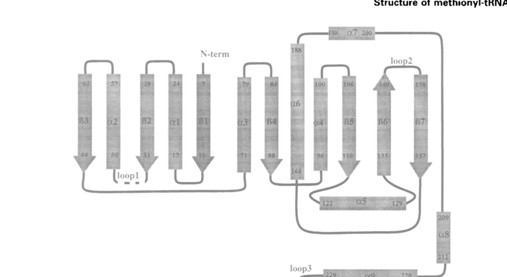

## Question

# Gene Research for Functional Annotation

## ⚠️ CRITICAL: Gene/Protein Identification Context

**BEFORE YOU BEGIN RESEARCH:** You MUST verify you are researching the CORRECT gene/protein. Gene symbols can be ambiguous, especially for less well-characterized genes from non-model organisms.

### Target Gene/Protein Identity (from UniProt):
- **UniProt Accession:** Q88RR2
- **Protein Description:** RecName: Full=Methionyl-tRNA formyltransferase {ECO:0000255|HAMAP-Rule:MF_00182}; EC=2.1.2.9 {ECO:0000255|HAMAP-Rule:MF_00182};
- **Gene Information:** Name=fmt {ECO:0000255|HAMAP-Rule:MF_00182}; OrderedLocusNames=PP_0067;
- **Organism (full):** Pseudomonas putida (strain ATCC 47054 / DSM 6125 / CFBP 8728 / NCIMB 11950 / KT2440).
- **Protein Family:** Belongs to the Fmt family. {ECO:0000255|HAMAP-
- **Key Domains:** Fmt. (IPR005794); Formyl_trans_C. (IPR005793); Formyl_trans_C_sf. (IPR037022); Formyl_transf_N. (IPR002376); Formyl_transf_N_sf. (IPR036477)

### MANDATORY VERIFICATION STEPS:

1. **Check if the gene symbol "fmt" matches the protein description above**
2. **Verify the organism is correct:** Pseudomonas putida (strain ATCC 47054 / DSM 6125 / CFBP 8728 / NCIMB 11950 / KT2440).
3. **Check if protein family/domains align with what you find in literature**
4. **If you find literature for a DIFFERENT gene with the same or similar symbol, STOP**

### If Gene Symbol is Ambiguous or You Cannot Find Relevant Literature:

**DO NOT PROCEED WITH RESEARCH ON A DIFFERENT GENE.** Instead:
- State clearly: "The gene symbol 'fmt' is ambiguous or literature is limited for this specific protein"
- Explain what you found (e.g., "Found extensive literature on a different gene with the same symbol in a different organism")
- Describe the protein based ONLY on the UniProt information provided above
- Suggest that the protein function can be inferred from domain/family information

### Research Target:

Please provide a comprehensive research report on the gene **fmt** (gene ID: fmt, UniProt: Q88RR2) in PSEPK.

The research report should be a detailed narrative explaining the function, biological processes, and localization of the gene product. Citations should be given for all claims.

You should prioritize authoritative reviews and primary scientific literature when conducting research. You can supplement
this with annotations you find in gene/protein databases, but these can be outdated or inaccurate.

We are specifically interested in the primary function of the gene - for enzymes, what reaction is catalyzed, and what is the substrate specificity? For transporters, what is the substrate? For structural proteins or adapters, what is the broader structural role? For signaling molecules, what is the role in the pathway.

We are interested in where in or outside the cell the gene product carries out its function.

We are also interested in the signaling or biochemical pathways in which the gene functions. We are less interested in broad pleiotropic effects, except where these elucidate the precise role.

Include evidence where possible. We are interested in both experimental evidence as well as inference from structure, evolution, or bioinformatic analysis. Precise studies should be prioritized over high-throughput, where available.

## Output

Question: You are an expert researcher providing comprehensive, well-cited information.

Provide detailed information focusing on:
1. Key concepts and definitions with current understanding
2. Recent developments and latest research (prioritize 2023-2024 sources)
3. Current applications and real-world implementations
4. Expert opinions and analysis from authoritative sources
5. Relevant statistics and data from recent studies

Format as a comprehensive research report with proper citations. Include URLs and publication dates where available.
Always prioritize recent, authoritative sources and provide specific citations for all major claims.

# Gene Research for Functional Annotation

## ⚠️ CRITICAL: Gene/Protein Identification Context

**BEFORE YOU BEGIN RESEARCH:** You MUST verify you are researching the CORRECT gene/protein. Gene symbols can be ambiguous, especially for less well-characterized genes from non-model organisms.

### Target Gene/Protein Identity (from UniProt):
- **UniProt Accession:** Q88RR2
- **Protein Description:** RecName: Full=Methionyl-tRNA formyltransferase {ECO:0000255|HAMAP-Rule:MF_00182}; EC=2.1.2.9 {ECO:0000255|HAMAP-Rule:MF_00182};
- **Gene Information:** Name=fmt {ECO:0000255|HAMAP-Rule:MF_00182}; OrderedLocusNames=PP_0067;
- **Organism (full):** Pseudomonas putida (strain ATCC 47054 / DSM 6125 / CFBP 8728 / NCIMB 11950 / KT2440).
- **Protein Family:** Belongs to the Fmt family. {ECO:0000255|HAMAP-
- **Key Domains:** Fmt. (IPR005794); Formyl_trans_C. (IPR005793); Formyl_trans_C_sf. (IPR037022); Formyl_transf_N. (IPR002376); Formyl_transf_N_sf. (IPR036477)

### MANDATORY VERIFICATION STEPS:

1. **Check if the gene symbol "fmt" matches the protein description above**
2. **Verify the organism is correct:** Pseudomonas putida (strain ATCC 47054 / DSM 6125 / CFBP 8728 / NCIMB 11950 / KT2440).
3. **Check if protein family/domains align with what you find in literature**
4. **If you find literature for a DIFFERENT gene with the same or similar symbol, STOP**

### If Gene Symbol is Ambiguous or You Cannot Find Relevant Literature:

**DO NOT PROCEED WITH RESEARCH ON A DIFFERENT GENE.** Instead:
- State clearly: "The gene symbol 'fmt' is ambiguous or literature is limited for this specific protein"
- Explain what you found (e.g., "Found extensive literature on a different gene with the same symbol in a different organism")
- Describe the protein based ONLY on the UniProt information provided above
- Suggest that the protein function can be inferred from domain/family information

### Research Target:

Please provide a comprehensive research report on the gene **fmt** (gene ID: fmt, UniProt: Q88RR2) in PSEPK.

The research report should be a detailed narrative explaining the function, biological processes, and localization of the gene product. Citations should be given for all claims.

You should prioritize authoritative reviews and primary scientific literature when conducting research. You can supplement
this with annotations you find in gene/protein databases, but these can be outdated or inaccurate.

We are specifically interested in the primary function of the gene - for enzymes, what reaction is catalyzed, and what is the substrate specificity? For transporters, what is the substrate? For structural proteins or adapters, what is the broader structural role? For signaling molecules, what is the role in the pathway.

We are interested in where in or outside the cell the gene product carries out its function.

We are also interested in the signaling or biochemical pathways in which the gene functions. We are less interested in broad pleiotropic effects, except where these elucidate the precise role.

Include evidence where possible. We are interested in both experimental evidence as well as inference from structure, evolution, or bioinformatic analysis. Precise studies should be prioritized over high-throughput, where available.

## Research report: **fmt** (UniProt Q88RR2; locus PP_0067) — methionyl‑tRNA formyltransferase in *Pseudomonas putida* KT2440

### Executive summary and scope verification
The UniProt entry provided (Q88RR2; gene **fmt**; locus **PP_0067**) corresponds to **methionyl‑tRNA formyltransferase (Fmt; EC 2.1.2.9)**, an enzyme that formylates the initiator methionyl‑tRNA to produce **fMet‑tRNA\^fMet**, thereby supporting efficient bacterial translation initiation. In the literature retrieved with the tools, **fmt/Fmt consistently refers to this enzyme class** and no alternate “fmt” gene meaning was encountered; however, **no KT2440/PP_0067/Q88RR2 primary experimental study was successfully retrieved**, so organism‑specific phenotypes and kinetics for *P. putida* KT2440 are inferred from conserved bacterial biology and from studies in other bacteria (noted explicitly below). (mazel1994geneticcharacterizationof pages 1-2, cai2017lackofformylated pages 1-2)

| Aspect | Evidence summary | Key citations |
|---|---|---|
| Identity | UniProt Q88RR2 is annotated as **fmt / PP_0067** in *Pseudomonas putida* KT2440 and belongs to the conserved bacterial methionyl-tRNA formyltransferase (Fmt) family; literature on Fmt in other bacteria matches this enzyme class and supports transfer of a conserved core function, but direct biochemical characterization for *P. putida* KT2440 was not found. | (mazel1994geneticcharacterizationof pages 1-2, cai2017lackofformylated pages 1-2) |
| Reaction | Fmt catalyzes formylation of initiator methionyl-tRNA, converting **Met-tRNAfMet to fMet-tRNAfMet** during translation initiation; this is the canonical reaction associated with EC 2.1.2.9. | (mazel1994geneticcharacterizationof pages 1-2, sah2023methionyltrnaformyltransferaseutilizes pages 6-9, sah2023methionyltrnaformyltransferaseutilizes pages 4-6) |
| Substrates | The preferred one-carbon donor is **10-formyl-THF**; 2023 work showed **10-formyl-DHF** can also act as an alternative donor, whereas several other folate species tested were not substrates. | (sah2023methionyltrnaformyltransferaseutilizes pages 6-9, sah2023methionyltrnaformyltransferaseutilizes pages 4-6) |
| Products | The enzymatic products are **fMet-tRNAfMet** plus the corresponding folate by-product, with LC-MS/MS supporting production of **THF** from 10-formyl-THF and **DHF** from 10-formyl-DHF. | (sah2023methionyltrnaformyltransferaseutilizes pages 6-9, sah2023methionyltrnaformyltransferaseutilizes pages 4-6) |
| Pathway role | Fmt acts in the bacterial **translation initiation / N-formylmethionine pathway**, preparing initiator tRNA for efficient entry into the ribosomal P site and thereby improving initiation efficiency and fidelity. | (mazel1994geneticcharacterizationof pages 1-2, cai2017lackofformylated pages 8-9) |
| Coupled enzymes | Fmt is functionally linked to **MetRS** (loads methionine onto initiator tRNA), **FolD/GlyA** and broader folate one-carbon metabolism (supply formyl donor), and **peptide deformylase (Def/PDF)** plus **methionine aminopeptidase** downstream during nascent protein N-terminal processing. | (duroc2009mutationsinthree pages 1-3, cai2017lackofformylated pages 1-2, cai2017lackofformylated pages 9-10) |
| Cellular localization | The relevant activity is expected in the **bacterial cytosol**, where initiator tRNA charging, formylation, and ribosome-mediated translation initiation occur; no evidence was found for alternative localization in *P. putida* KT2440. | (mazel1994geneticcharacterizationof pages 1-2, sah2023methionyltrnaformyltransferaseutilizes pages 6-9) |
| Genetic context | In several bacteria, **fmt** is genetically linked to **def** and may occur in a **def-fmt operon**; this is well documented in *E. coli* and other eubacteria, but equivalent operon structure was not directly verified here for *P. putida* KT2440. | (mazel1994geneticcharacterizationof pages 1-2, duroc2009mutationsinthree pages 1-3) |
| Phenotypes when disrupted | Loss of fmt is generally **not absolutely lethal** but impairs growth and physiology; severity varies by species, from severe growth defects in *E. coli* to a more modest growth-rate defect reported for *Pseudomonas aeruginosa*, with additional pleiotropic defects seen in *Bacillus subtilis*. These cross-species data support a likely important but not necessarily essential role for Q88RR2. | (cai2017lackofformylated pages 1-2, cai2017lackofformylated pages 9-10, cai2017lackofformylated pages 8-9) |
| Drug relevance | Fmt is central to the **Fmt/PDF axis** exploited in antibacterial research: inactivation of fmt can bypass the need for deformylation and confer resistance to peptide deformylase inhibitors, while folate-pathway perturbation can alter Fmt-dependent initiation. This makes Fmt biologically relevant to antibiotic action even when PDF is the direct target. | (duroc2009mutationsinthree pages 1-3, cai2017lackofformylated pages 9-10) |
| Recent findings 2023 | A key 2023 advance showed Fmt can use **10-formyl-DHF** as an alternative substrate in vitro and in vivo, linking folate redox state more directly to translation initiation and explaining aspects of **trimethoprim/antifolate response**. Reported efficiency with 10-formyl-DHF was only about **0.1-1%** of that with 10-formyl-THF. | (sah2023methionyltrnaformyltransferaseutilizes pages 10-12, sah2023methionyltrnaformyltransferaseutilizes pages 6-9) |

*Table: This table summarizes the conserved functional annotation of bacterial methionyl-tRNA formyltransferase and maps it to UniProt Q88RR2 from *Pseudomonas putida* KT2440. It distinguishes direct evidence from cross-species inference where *P. putida*-specific experiments were not found.*

### 1) Key concepts and definitions (current understanding)

#### 1.1 What Fmt does (definition and canonical reaction)
Bacterial translation initiation commonly uses a dedicated initiator tRNA (tRNA\_i / tRNA\^fMet). The initiator tRNA is aminoacylated with methionine and then **Fmt transfers a formyl group onto the amino group of the methionyl moiety**, generating **N‑formyl‑methionyl‑tRNA (fMet‑tRNA\^fMet)**. This formylation step is widely described as a defining feature of eubacterial translation initiation. (mazel1994geneticcharacterizationof pages 1-2, sah2023methionyltrnaformyltransferaseutilizes pages 6-9)

Fmt uses **N\^10‑formyl‑tetrahydrofolate (10‑CHO‑THF)** as the classical formyl donor, linking folate one‑carbon metabolism to translation initiation. (mazel1994geneticcharacterizationof pages 1-2, duroc2009mutationsinthree pages 1-3)

#### 1.2 Pathway context: formylation → deformylation → N‑terminal processing
The N‑terminal formyl group is typically removed co‑translationally by **peptide deformylase (PDF/Def)**, after which **methionine aminopeptidase** can remove the initiator methionine when permitted by the penultimate residue. This coordinated N‑terminal processing has been central to the view that PDF is an attractive antibacterial target, and it explains why perturbations in fmt can modulate susceptibility/resistance to PDF‑targeting antibiotics. (cai2017lackofformylated pages 1-2, duroc2009mutationsinthree pages 1-3)

A key genetic observation is that **def and fmt are often genetically linked**, including operon‑level linkage in *E. coli*, reflecting their functional coupling in N‑terminal processing of nascent proteins. (mazel1994geneticcharacterizationof pages 1-2)

#### 1.3 Why formylation matters mechanistically
Formylation increases the efficiency and specificity of initiation by enhancing interaction of the initiator tRNA with initiation factor 2 (IF2) and disfavoring elongator‑tRNA handling (e.g., EF‑Tu). This provides a mechanistic basis for why formylation improves initiation efficiency even when not strictly essential for viability in some organisms/conditions. (cai2017lackofformylated pages 8-9)

#### 1.4 Expected cellular localization for *P. putida* fmt (Q88RR2)
Fmt functions on cytosolic tRNA and interfaces with ribosome‑mediated initiation; thus, for a Gram‑negative bacterium like *P. putida* KT2440, the expected localization is **cytosolic**. This localization is consistent with how bacterial formylation is described in mechanistic and genetic studies. (mazel1994geneticcharacterizationof pages 1-2, sah2023methionyltrnaformyltransferaseutilizes pages 6-9)

### 2) Recent developments and latest research (prioritizing 2023–2024)

#### 2.1 2023: alternative folate substrate for Fmt and implications for antifolate drugs
A notable 2023 advance (Sah & Varshney, **Feb 2023**, Microbiology; https://doi.org/10.1099/mic.0.001297) demonstrated that *E. coli* Fmt can use **10‑formyl‑dihydrofolate (10‑CHO‑DHF)** as an **alternative formyl donor** in vitro and in vivo, in addition to the canonical 10‑CHO‑THF. LC‑MS/MS supported the expected folate product patterns: **THF** produced from 10‑CHO‑THF and **DHF** produced from 10‑CHO‑DHF during Met‑tRNA\^fMet formylation. (sah2023methionyltrnaformyltransferaseutilizes pages 4-6, sah2023methionyltrnaformyltransferaseutilizes pages 6-9)

Importantly, the alternative‑substrate route is far less efficient: **~0.1–1%** relative to 10‑CHO‑THF under the conditions tested, but it may become relevant when folate pools are shifted by growth phase or by drug pressure. (sah2023methionyltrnaformyltransferaseutilizes pages 6-9)

The same study connected folate redox state and antifolate treatment to translation: under trimethoprim‑linked perturbations, stationary‑phase cells showed **>5‑fold enrichment** of oxidized formylated folate species (including 10‑CHO‑DHF and 10‑CHO‑folic acid) and **>10‑fold depletion** of several reduced folate species, with reported statistical support (multiple P values provided in the study). This provides a mechanistic bridge between antifolate action and initiation capacity mediated by Fmt. (sah2023methionyltrnaformyltransferaseutilizes pages 10-12)

#### 2.2 2024: limited directly relevant bacterial fmt/Fmt updates captured by tool retrieval
Within the retrieved corpus, the most directly relevant recent mechanistic advance for Fmt was the 2023 work above. (sah2023methionyltrnaformyltransferaseutilizes pages 10-12, sah2023methionyltrnaformyltransferaseutilizes pages 6-9)

### 3) Current applications and real‑world implementations

#### 3.1 Antibacterial drug discovery and resistance biology around the Fmt/PDF axis
Because many bacterial proteins are initiated with formyl‑methionine and are subsequently deformylated by PDF, **PDF inhibition** has long been explored as an antibacterial strategy. A recurring real‑world complication is that **inactivation or bypass of Fmt can confer resistance to PDF inhibitors**, because if formylation is blocked, deformylation becomes unnecessary. This resistance logic is experimentally supported by genetic and pharmacological studies: in *Bacillus subtilis*, “Fmt bypass” mutations were repeatedly associated with **high MICs to actinonin**, a natural PDF inhibitor, and these bypass strains exhibited **substantial fitness reduction**. (duroc2009mutationsinthree pages 1-3)

In one set of resistant isolates, the actinonin MIC values reported spanned **48–512 µg/mL**, and the fitness‑cost metric (WT doubling time / mutant doubling time, as defined in the study) was roughly **0.34–0.54** across representative mutants, underscoring that bypassing formylation can be costly even when it provides drug resistance. (duroc2009mutationsinthree pages 1-3)

These principles are relevant to *Pseudomonas* chassis engineering and infection biology because they show how translation initiation chemistry (Fmt) can indirectly control antibiotic susceptibility and global physiology through N‑terminal processing constraints. (cai2017lackofformylated pages 9-10)

#### 3.2 Systems/strain engineering relevance (context for *P. putida* KT2440)
Although no KT2440‑specific fmt perturbation data were retrieved, *P. putida* KT2440 is widely used as an engineering chassis. For chassis optimization, understanding essential translation components and their connections to folate metabolism and drug susceptibility can matter when engineering growth, stress tolerance, and metabolic flux. Mechanistically, Fmt sits at the intersection of folate C1 metabolism and protein synthesis and therefore is a plausible “hidden constraint” in pathway engineering that perturbs folate pools. (sah2023methionyltrnaformyltransferaseutilizes pages 10-12, sah2023methionyltrnaformyltransferaseutilizes pages 6-9)

### 4) Expert opinions and analysis (authoritative interpretations grounded in evidence)

#### 4.1 Is formylation essential?
Authoritative genetic analyses in *E. coli* and other eubacteria support the view that **blocking formylation does not always abolish growth**, though it can reduce growth rate and impose physiological defects. In early operon‑level characterization of the deformylase/formyltransferase system, bacteria impaired in folate formyl donor synthesis or in the transformylase (Fmt) were described as able to “sustain growth, albeit at a reduced rate, using unformylated Met‑tRNA\_i.” (mazel1994geneticcharacterizationof pages 1-2)

Later work highlighted that the consequences of losing formylation are species‑dependent and can be pleiotropic. In *B. subtilis*, lack of formylated initiator methionine impacted adaptive programs (motility/biofilms/sporulation) and stress responses, illustrating that translation initiation chemistry can influence complex phenotypes. (cai2017lackofformylated pages 1-2, cai2017lackofformylated pages 8-9)

#### 4.2 Why Fmt matters even if not strictly essential
Even when viability is possible without formylation, multiple studies support that formylation increases initiation efficiency and thereby can shape growth rate, stress tolerance, and regulatory transitions (especially in changing environments). As a result, in a robust environmental bacterium like *P. putida*, the conserved expectation is that Fmt supports competitive fitness and rapid growth transitions, and that its perturbation would likely be deleterious under at least some conditions. (cai2017lackofformylated pages 8-9, cai2017lackofformylated pages 1-2)

### 5) Relevant statistics and data points from recent and authoritative studies

#### 5.1 Substrate specificity and efficiency (Fmt biochemistry)
* **Primary formyl donor:** 10‑CHO‑THF (canonical). (mazel1994geneticcharacterizationof pages 1-2, sah2023methionyltrnaformyltransferaseutilizes pages 4-6)
* **Alternative donor (2023):** 10‑CHO‑DHF; supported by LC‑MS/MS product validation. (sah2023methionyltrnaformyltransferaseutilizes pages 6-9, sah2023methionyltrnaformyltransferaseutilizes pages 4-6)
* **Relative efficiency:** 10‑CHO‑DHF supports formylation at approximately **0.1–1%** of the 10‑CHO‑THF rate under reported conditions. (sah2023methionyltrnaformyltransferaseutilizes pages 6-9)

#### 5.2 Antifolate‑linked metabolite shifts (2023)
In the 2023 study, antifolate‑linked perturbation resulted in:
* **>5‑fold enrichment** of 10‑CHO‑DHF and 10‑CHO‑folic acid in stationary phase under the examined genetic/drug contexts, and
* **>10‑fold depletion** of multiple reduced folate species (THF, 5,10‑CH\_2‑THF, 5‑CH\_3‑THF, etc.), with multiple reported P values for metabolite differences. (sah2023methionyltrnaformyltransferaseutilizes pages 10-12)

#### 5.3 Drug resistance and fitness tradeoffs (Fmt bypass)
In *B. subtilis*, fmt‑bypass mutants selected for actinonin resistance showed:
* **Actinonin MIC range:** **48–512 µg/mL** across representative isolates (table values), and
* **Fitness‑cost values:** approximately **0.34–0.54** (WT doubling time / mutant doubling time) across representative isolates, described as “robust fitness reduction.” (duroc2009mutationsinthree pages 1-3)

#### 5.4 Physiological consequences (developmental phenotype example)
In *B. subtilis*, fmt loss produced large sporulation defects; for example, a reported comparison at 24 h showed **complete engulfment** of **84% (WT) vs 6% (fmt mutant)**, and spore assays showed an approximately **100‑fold reduction** in heat‑resistant colonies. (cai2017lackofformylated pages 9-10, cai2017lackofformylated pages 8-9)

### Structural evidence and domain architecture (supporting functional inference)
High‑resolution structural work on *E. coli* Fmt provides mechanistic support for conserved function and for the existence of an active‑site crevice accommodating the folate donor. The retrieved figures show (i) overall domain architecture (N‑terminal and C‑terminal domains connected by a linker) and (ii) a close‑up of the putative folate‑binding/active‑site crevice annotated with key residues (e.g., Asn108, His110, Asp146). These structural features support conserved catalytic capability in Fmt family members, including Q88RR2 by homology. (schmitt1996structureofcrystalline media 46b45fec, schmitt1996structureofcrystalline media e86213c1)

### KT2440/Q88RR2‑specific functional annotation (evidence‑constrained)
Because no KT2440‑specific experimental report for PP_0067/Q88RR2 was retrieved, the following annotation is presented as **high‑confidence conserved function inference** rather than strain‑specific experimental proof:

* **Molecular function:** methionyl‑tRNA formyltransferase (Fmt; EC 2.1.2.9), catalyzing Met‑tRNA\^fMet → fMet‑tRNA\^fMet using predominantly 10‑CHO‑THF as a formyl donor (and potentially 10‑CHO‑DHF under conditions that alter folate pools, per 2023 evidence in *E. coli*). (sah2023methionyltrnaformyltransferaseutilizes pages 6-9, sah2023methionyltrnaformyltransferaseutilizes pages 4-6)
* **Biological process:** translation initiation via generation of the formylated initiator tRNA species; functionally connected to folate C1 metabolism supplying formyl donors. (mazel1994geneticcharacterizationof pages 1-2, sah2023methionyltrnaformyltransferaseutilizes pages 6-9)
* **Cellular localization:** cytosol. (mazel1994geneticcharacterizationof pages 1-2)
* **Pathway coupling:** linked to downstream N‑terminal processing by peptide deformylase (Def/PDF); genetic linkage of def and fmt occurs in multiple bacteria and is a plausible genomic neighborhood pattern, though not verified here for KT2440. (mazel1994geneticcharacterizationof pages 1-2, duroc2009mutationsinthree pages 1-3)

### Limitations and recommended next steps (for precise KT2440 annotation)
1. **Strain‑specific evidence gap:** The tool‑retrieved corpus did not yield primary data directly measuring Q88RR2 activity, essentiality, or phenotype in *P. putida* KT2440.
2. **Suggested validation experiments:** (i) targeted deletion/CRISPRi of PP_0067 with growth curves in rich/minimal media; (ii) LC‑MS or tRNA‑Northern assays for fMet‑tRNA\^fMet levels; (iii) sensitivity profiling to folate‑pathway inhibitors and PDF inhibitors to test conserved Fmt/PDF coupling.

### Key sources (with publication dates and URLs)
* Sah S, Varshney U. **Methionyl‑tRNA formyltransferase utilizes 10‑formyldihydrofolate as an alternative substrate and impacts antifolate drug action.** *Microbiology* (Microbiology Society), **Feb 2023**. https://doi.org/10.1099/mic.0.001297 (sah2023methionyltrnaformyltransferaseutilizes pages 10-12, sah2023methionyltrnaformyltransferaseutilizes pages 6-9, sah2023methionyltrnaformyltransferaseutilizes pages 4-6)
* Cai Y, Chandrangsu P, Gaballa A, Helmann JD. **Lack of formylated methionyl‑tRNA has pleiotropic effects on Bacillus subtilis.** *Microbiology*, **Feb 2017**. https://doi.org/10.1099/mic.0.000413 (cai2017lackofformylated pages 1-2, cai2017lackofformylated pages 9-10, cai2017lackofformylated pages 8-9)
* Duroc Y, Giglione C, Meinnel T. **Mutations in three distinct loci cause resistance to peptide deformylase inhibitors in Bacillus subtilis.** *Antimicrobial Agents and Chemotherapy*, **Apr 2009**. https://doi.org/10.1128/aac.01340-08 (duroc2009mutationsinthree pages 1-3)
* Mazel D, Pochet S, Marlière P. **Genetic characterization of polypeptide deformylase, a distinctive enzyme of eubacterial translation.** *EMBO Journal*, **Feb 1994**. https://doi.org/10.1002/j.1460-2075.1994.tb06335.x (mazel1994geneticcharacterizationof pages 1-2)

References

1. (mazel1994geneticcharacterizationof pages 1-2): D. Mazel, S. Pochet, and Philippe Marlibre. Genetic characterization of polypeptide deformylase, a distinctive enzyme of eubacterial translation. The EMBO Journal, 13:914-923, Feb 1994. URL: https://doi.org/10.1002/j.1460-2075.1994.tb06335.x, doi:10.1002/j.1460-2075.1994.tb06335.x. This article has 334 citations.

2. (cai2017lackofformylated pages 1-2): Yanfei Cai, Pete Chandrangsu, Ahmed Gaballa, and John D Helmann. Lack of formylated methionyl-trna has pleiotropic effects on bacillus subtilis. Microbiology, 163 2:185-196, Feb 2017. URL: https://doi.org/10.1099/mic.0.000413, doi:10.1099/mic.0.000413. This article has 24 citations and is from a peer-reviewed journal.

3. (sah2023methionyltrnaformyltransferaseutilizes pages 6-9): Shivjee Sah and Umesh Varshney. Methionyl-trna formyltransferase utilizes 10-formyldihydrofolate as an alternative substrate and impacts antifolate drug action. Feb 2023. URL: https://doi.org/10.1099/mic.0.001297, doi:10.1099/mic.0.001297. This article has 9 citations and is from a peer-reviewed journal.

4. (sah2023methionyltrnaformyltransferaseutilizes pages 4-6): Shivjee Sah and Umesh Varshney. Methionyl-trna formyltransferase utilizes 10-formyldihydrofolate as an alternative substrate and impacts antifolate drug action. Feb 2023. URL: https://doi.org/10.1099/mic.0.001297, doi:10.1099/mic.0.001297. This article has 9 citations and is from a peer-reviewed journal.

5. (cai2017lackofformylated pages 8-9): Yanfei Cai, Pete Chandrangsu, Ahmed Gaballa, and John D Helmann. Lack of formylated methionyl-trna has pleiotropic effects on bacillus subtilis. Microbiology, 163 2:185-196, Feb 2017. URL: https://doi.org/10.1099/mic.0.000413, doi:10.1099/mic.0.000413. This article has 24 citations and is from a peer-reviewed journal.

6. (duroc2009mutationsinthree pages 1-3): Yann Duroc, Carmela Giglione, and Thierry Meinnel. Mutations in three distinct loci cause resistance to peptide deformylase inhibitors in<i>bacillus subtilis</i>. Apr 2009. URL: https://doi.org/10.1128/aac.01340-08, doi:10.1128/aac.01340-08. This article has 24 citations and is from a highest quality peer-reviewed journal.

7. (cai2017lackofformylated pages 9-10): Yanfei Cai, Pete Chandrangsu, Ahmed Gaballa, and John D Helmann. Lack of formylated methionyl-trna has pleiotropic effects on bacillus subtilis. Microbiology, 163 2:185-196, Feb 2017. URL: https://doi.org/10.1099/mic.0.000413, doi:10.1099/mic.0.000413. This article has 24 citations and is from a peer-reviewed journal.

8. (sah2023methionyltrnaformyltransferaseutilizes pages 10-12): Shivjee Sah and Umesh Varshney. Methionyl-trna formyltransferase utilizes 10-formyldihydrofolate as an alternative substrate and impacts antifolate drug action. Feb 2023. URL: https://doi.org/10.1099/mic.0.001297, doi:10.1099/mic.0.001297. This article has 9 citations and is from a peer-reviewed journal.

9. (schmitt1996structureofcrystalline media 46b45fec): E Schmitt, S Blanquet, and Y Mechulam. Structure of crystalline escherichia coli methionyl‐trna (f) met formyltransferase: comparison with glycinamide ribonucleotide formyltransferase. Unknown journal, 1996. URL: https://doi.org/10.1002/j.1460-2075.1996.tb00852, doi:10.1002/j.1460-2075.1996.tb00852.

10. (schmitt1996structureofcrystalline media e86213c1): E Schmitt, S Blanquet, and Y Mechulam. Structure of crystalline escherichia coli methionyl‐trna (f) met formyltransferase: comparison with glycinamide ribonucleotide formyltransferase. Unknown journal, 1996. URL: https://doi.org/10.1002/j.1460-2075.1996.tb00852, doi:10.1002/j.1460-2075.1996.tb00852.

## Artifacts

- [Edison artifact artifact-00](fmt-deep-research-falcon_artifacts/artifact-00.md)

## Citations

1. mazel1994geneticcharacterizationof pages 1-2
2. cai2017lackofformylated pages 8-9
3. sah2023methionyltrnaformyltransferaseutilizes pages 6-9
4. sah2023methionyltrnaformyltransferaseutilizes pages 10-12
5. duroc2009mutationsinthree pages 1-3
6. cai2017lackofformylated pages 9-10
7. cai2017lackofformylated pages 1-2
8. sah2023methionyltrnaformyltransferaseutilizes pages 4-6
9. https://doi.org/10.1099/mic.0.001297
10. https://doi.org/10.1099/mic.0.000413
11. https://doi.org/10.1128/aac.01340-08
12. https://doi.org/10.1002/j.1460-2075.1994.tb06335.x
13. https://doi.org/10.1002/j.1460-2075.1994.tb06335.x,
14. https://doi.org/10.1099/mic.0.000413,
15. https://doi.org/10.1099/mic.0.001297,
16. https://doi.org/10.1128/aac.01340-08,
17. https://doi.org/10.1002/j.1460-2075.1996.tb00852,