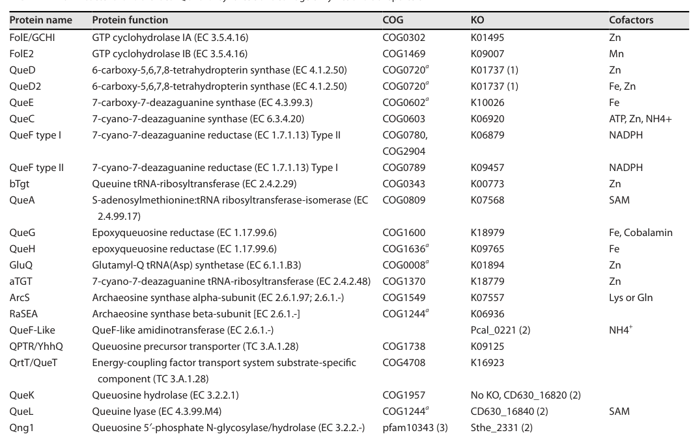

## Question

# Gene Research for Functional Annotation

## ⚠️ CRITICAL: Gene/Protein Identification Context

**BEFORE YOU BEGIN RESEARCH:** You MUST verify you are researching the CORRECT gene/protein. Gene symbols can be ambiguous, especially for less well-characterized genes from non-model organisms.

### Target Gene/Protein Identity (from UniProt):
- **UniProt Accession:** Q88HM9
- **Protein Description:** RecName: Full=GTP cyclohydrolase FolE2 {ECO:0000255|HAMAP-Rule:MF_01527}; EC=3.5.4.16 {ECO:0000255|HAMAP-Rule:MF_01527};
- **Gene Information:** Name=folE2 {ECO:0000255|HAMAP-Rule:MF_01527}; OrderedLocusNames=PP_3324;
- **Organism (full):** Pseudomonas putida (strain ATCC 47054 / DSM 6125 / CFBP 8728 / NCIMB 11950 / KT2440).
- **Protein Family:** Belongs to the GTP cyclohydrolase IV family.
- **Key Domains:** GTP_cyclohydrolase_FolE2. (IPR022838); GTP_cyclohydrolase_FolE2/MptA. (IPR003801); GCHY-1 (PF02649)

### MANDATORY VERIFICATION STEPS:

1. **Check if the gene symbol "folE2" matches the protein description above**
2. **Verify the organism is correct:** Pseudomonas putida (strain ATCC 47054 / DSM 6125 / CFBP 8728 / NCIMB 11950 / KT2440).
3. **Check if protein family/domains align with what you find in literature**
4. **If you find literature for a DIFFERENT gene with the same or similar symbol, STOP**

### If Gene Symbol is Ambiguous or You Cannot Find Relevant Literature:

**DO NOT PROCEED WITH RESEARCH ON A DIFFERENT GENE.** Instead:
- State clearly: "The gene symbol 'folE2' is ambiguous or literature is limited for this specific protein"
- Explain what you found (e.g., "Found extensive literature on a different gene with the same symbol in a different organism")
- Describe the protein based ONLY on the UniProt information provided above
- Suggest that the protein function can be inferred from domain/family information

### Research Target:

Please provide a comprehensive research report on the gene **folE2** (gene ID: folE2, UniProt: Q88HM9) in PSEPK.

The research report should be a detailed narrative explaining the function, biological processes, and localization of the gene product. Citations should be given for all claims.

You should prioritize authoritative reviews and primary scientific literature when conducting research. You can supplement
this with annotations you find in gene/protein databases, but these can be outdated or inaccurate.

We are specifically interested in the primary function of the gene - for enzymes, what reaction is catalyzed, and what is the substrate specificity? For transporters, what is the substrate? For structural proteins or adapters, what is the broader structural role? For signaling molecules, what is the role in the pathway.

We are interested in where in or outside the cell the gene product carries out its function.

We are also interested in the signaling or biochemical pathways in which the gene functions. We are less interested in broad pleiotropic effects, except where these elucidate the precise role.

Include evidence where possible. We are interested in both experimental evidence as well as inference from structure, evolution, or bioinformatic analysis. Precise studies should be prioritized over high-throughput, where available.

## Output

Question: You are an expert researcher providing comprehensive, well-cited information.

Provide detailed information focusing on:
1. Key concepts and definitions with current understanding
2. Recent developments and latest research (prioritize 2023-2024 sources)
3. Current applications and real-world implementations
4. Expert opinions and analysis from authoritative sources
5. Relevant statistics and data from recent studies

Format as a comprehensive research report with proper citations. Include URLs and publication dates where available.
Always prioritize recent, authoritative sources and provide specific citations for all major claims.

# Gene Research for Functional Annotation

## ⚠️ CRITICAL: Gene/Protein Identification Context

**BEFORE YOU BEGIN RESEARCH:** You MUST verify you are researching the CORRECT gene/protein. Gene symbols can be ambiguous, especially for less well-characterized genes from non-model organisms.

### Target Gene/Protein Identity (from UniProt):
- **UniProt Accession:** Q88HM9
- **Protein Description:** RecName: Full=GTP cyclohydrolase FolE2 {ECO:0000255|HAMAP-Rule:MF_01527}; EC=3.5.4.16 {ECO:0000255|HAMAP-Rule:MF_01527};
- **Gene Information:** Name=folE2 {ECO:0000255|HAMAP-Rule:MF_01527}; OrderedLocusNames=PP_3324;
- **Organism (full):** Pseudomonas putida (strain ATCC 47054 / DSM 6125 / CFBP 8728 / NCIMB 11950 / KT2440).
- **Protein Family:** Belongs to the GTP cyclohydrolase IV family.
- **Key Domains:** GTP_cyclohydrolase_FolE2. (IPR022838); GTP_cyclohydrolase_FolE2/MptA. (IPR003801); GCHY-1 (PF02649)

### MANDATORY VERIFICATION STEPS:

1. **Check if the gene symbol "folE2" matches the protein description above**
2. **Verify the organism is correct:** Pseudomonas putida (strain ATCC 47054 / DSM 6125 / CFBP 8728 / NCIMB 11950 / KT2440).
3. **Check if protein family/domains align with what you find in literature**
4. **If you find literature for a DIFFERENT gene with the same or similar symbol, STOP**

### If Gene Symbol is Ambiguous or You Cannot Find Relevant Literature:

**DO NOT PROCEED WITH RESEARCH ON A DIFFERENT GENE.** Instead:
- State clearly: "The gene symbol 'folE2' is ambiguous or literature is limited for this specific protein"
- Explain what you found (e.g., "Found extensive literature on a different gene with the same symbol in a different organism")
- Describe the protein based ONLY on the UniProt information provided above
- Suggest that the protein function can be inferred from domain/family information

### Research Target:

Please provide a comprehensive research report on the gene **folE2** (gene ID: folE2, UniProt: Q88HM9) in PSEPK.

The research report should be a detailed narrative explaining the function, biological processes, and localization of the gene product. Citations should be given for all claims.

You should prioritize authoritative reviews and primary scientific literature when conducting research. You can supplement
this with annotations you find in gene/protein databases, but these can be outdated or inaccurate.

We are specifically interested in the primary function of the gene - for enzymes, what reaction is catalyzed, and what is the substrate specificity? For transporters, what is the substrate? For structural proteins or adapters, what is the broader structural role? For signaling molecules, what is the role in the pathway.

We are interested in where in or outside the cell the gene product carries out its function.

We are also interested in the signaling or biochemical pathways in which the gene functions. We are less interested in broad pleiotropic effects, except where these elucidate the precise role.

Include evidence where possible. We are interested in both experimental evidence as well as inference from structure, evolution, or bioinformatic analysis. Precise studies should be prioritized over high-throughput, where available.

## Comprehensive research report: **folE2** (UniProt Q88HM9; PP_3324) — *Pseudomonas putida* KT2440

### Executive summary (identity verified)
The UniProt target **Q88HM9** is annotated as **FolE2**, an alternative **GTP cyclohydrolase I** enzyme (also termed **GCYH-IB**) belonging to **COG1469** (Pfam **PF02649**) and catalyzing the first committed step of **pterin biosynthesis from GTP** (EC **3.5.4.16**). In the broader bacterial literature, FolE2/GCYH-IB is consistently defined as a non-orthologous replacement for the canonical FolE/GCYH-IA (folE) enzyme family, performing the same net transformation **GTP → 7,8-dihydroneopterin triphosphate (H2NTP; DHN-TP)**. (crecylagard2014variationsinmetabolic pages 2-4, crecylagard2014variationsinmetabolic pages 4-5)

**Important limitation:** Using the available tool-accessible corpus, no primary papers were retrieved that directly mention **P. putida KT2440 PP_3324** or **UniProt Q88HM9** experimentally (phenotypes, essentiality, regulation, localization). Therefore, *P. putida*-specific conclusions are limited to conserved family function and pathway placement, and are flagged as inference where appropriate. (crecylagard2024biosynthesisandfunction pages 5-6, crecylagard2014variationsinmetabolic pages 2-4)

### 1) Key concepts and definitions (current understanding)

#### 1.1 FolE/FolE2 and “GTP cyclohydrolase I” activity
**GTP cyclohydrolase I (EC 3.5.4.16)** catalyzes a complex rearrangement/hydrolysis of **GTP** to generate **7,8-dihydroneopterin triphosphate (H2NTP/DHN-TP)**, the first committed intermediate of the **pterin branch** that supplies **tetrahydrofolate (THF)** biosynthesis. Comparative genomics and biochemical characterization established that many bacteria lacking canonical **folE (GCYH-IA)** instead encode **folE2 (GCYH-IB; COG1469)** as an alternative enzyme family catalyzing the same net reaction. (crecylagard2014variationsinmetabolic pages 2-4, crecylagard2014variationsinmetabolic pages 4-5)

A mechanistic description for the canonical folE-type enzyme emphasizes imidazole ring opening, formate release (C8), and ribose rearrangements leading to the pterin precursor H2NTP. While this description is for FolE (GCYH-IA), FolE2 is treated as a functional replacement for the same step. (crecylagard2007comparativegenomicsof pages 2-4)

#### 1.2 Pathway placement: folate (THF) vs queuosine (Q)
In bacteria, **H2NTP is a metabolic branch point**. It is the first intermediate in **de novo THF biosynthesis**, but it also serves as substrate for **QueD/QueD2** in the **queuosine-tRNA biosynthesis** pathway. Thus, FolE2 is best assigned as an **upstream pterin-entry enzyme**, whose product can be diverted into folate or queuosine-associated routes depending on downstream enzymes and regulation. (capdevila2024bacterialmetallostasismetal pages 38-39)

A recent synthesis of 7-deazaguanine/queuosine biology similarly presents FolE/FolE2 as producing the shared intermediate (depicted as DHN-P3/H2NTP) that then branches toward queuosine/archaeosine versus folate/THF. (crecylagard2024biosynthesisandfunction media e57c1e63)

#### 1.3 Metal dependence and “cambialism” of FolE2
A key modern concept is that FolE-family enzymes sit at the intersection of **metallostasis** and **core metabolism** because their activity can depend strongly on metal availability.

* Canonical **FolE (GCYH-IA)** is described as a **Zn(II) metalloenzyme**. (capdevila2024bacterialmetallostasismetal pages 38-39)
* **FolE2 (GCYH-IB)** has been described as **metal-cambialistic/metal-ambidextrous**, capable of catalyzing the same reaction when metalated with **Zn(II) or other divalent metals**. Structural discussion indicates a distorted tetrahedral metal geometry with an “open” coordination position involved in catalysis. (capdevila2024bacterialmetallostasismetal pages 38-39)
* A 2024 review table focused on deazaguanine/queuosine biology lists **FolE2** with an associated cofactor **Mn**, contrasted against **FolE** with **Zn**. (crecylagard2024biosynthesisandfunction pages 5-6, crecylagard2024biosynthesisandfunction media 0941bfd4)

Taken together, the most conservative interpretation is:
*FolE2 enzymes are typically associated with non-Zn metal usage in vivo (often discussed as Mn-associated), and the family exhibits metal flexibility that can help sustain pterin/THF precursor flux under Zn limitation.* (capdevila2024bacterialmetallostasismetal pages 38-39, crecylagard2024biosynthesisandfunction pages 5-6)

### 2) Recent developments and latest research (prioritize 2023–2024)

#### 2.1 2024: Metallostasis-centric view of FolE2 function
A 2024 **Chemical Reviews** synthesis positions FolE2/GCYH-IB within a broader “metalloproteome remodeling” framework: H2NTP production is essential for folate biosynthesis and also feeds queuosine biosynthesis, making FolE2’s metalation state potentially impactful to multiple pathways. It highlights the Zn-metalloenzyme nature of FolE (GCYH-IA) and describes FolE2 as a **metal-cambialistic paralog** that can remain functional with different metals, implying an adaptive advantage under metal limitation or metal stress. (capdevila2024bacterialmetallostasismetal pages 38-39)

#### 2.2 2024: Updated pathway and cofactor compilation for deazaguanine/queuosine systems
A 2024 **Microbiology and Molecular Biology Reviews** article tabulates FolE vs FolE2 cofactors (Zn vs Mn) in a curated enzyme list and provides a modern systems-level account of how H2NTP-derived chemistry feeds both THF and queuosine/deazaguanine-derived pathways. This review also stresses the difficulty of annotating paralogous enzyme families in these pathways, relevant to functional annotation workflows. (crecylagard2024biosynthesisandfunction pages 5-6, crecylagard2024biosynthesisandfunction media 0941bfd4, crecylagard2024biosynthesisandfunction media e57c1e63)

#### 2.3 2024: Physiological robustness under metal stress (family-level in vivo evidence)
A 2024 **Journal of Bacteriology** study in *Cupriavidus metallidurans* provides direct experimental evidence that multiple FolE_I-type enzymes (Zn-dependent vs metal-promiscuous types) can be required for growth under different environmental conditions, including chelator exposure, oxidative stress, and altered metal availability. While not performed in *P. putida*, it strengthens the interpretation that metal flexibility among FolE-type enzymes can be physiologically important for maintaining THF supply. (schulz2024protectingtheachilles pages 2-5, schulz2024protectingtheachilles pages 18-20)

### 3) Functional annotation for *Pseudomonas putida* FolE2 (Q88HM9): function, pathways, localization

#### 3.1 Primary molecular function (enzyme reaction and substrate specificity)
**Reaction:** FolE2 (GCYH-IB) catalyzes the conversion of **GTP** to **7,8-dihydroneopterin triphosphate (H2NTP/DHN-TP)**. This is the canonical “GTP cyclohydrolase I” entry reaction into pterin biosynthesis. (crecylagard2014variationsinmetabolic pages 2-4, crecylagard2014variationsinmetabolic pages 4-5, capdevila2024bacterialmetallostasismetal pages 38-39)

**Substrate specificity:** The reviewed sources consistently treat the substrate as **GTP**, producing H2NTP; no alternative nucleotide substrate is emphasized in the accessible evidence. (crecylagard2014variationsinmetabolic pages 2-4, capdevila2024bacterialmetallostasismetal pages 38-39)

#### 3.2 Biological process / pathway assignment
**De novo THF biosynthesis:** FolE2 catalyzes the **first committed step** that supplies the THF biosynthesis pathway in organisms that encode FolE2 rather than FolE. (crecylagard2014variationsinmetabolic pages 2-4, crecylagard2014variationsinmetabolic pages 4-5)

**Branch-point context with queuosine biosynthesis (bacteria):** Because H2NTP is a substrate for QueD/QueD2, FolE2 activity can also impact the queuosine-tRNA modification pathway indirectly by determining precursor availability. (capdevila2024bacterialmetallostasismetal pages 38-39, crecylagard2024biosynthesisandfunction media e57c1e63)

#### 3.3 Metal/cofactor requirements
Two complementary summaries exist in recent literature:
* A curated 2024 pathway enzyme table assigns FolE2 (COG1469) with cofactor **Mn**. (crecylagard2024biosynthesisandfunction pages 5-6, crecylagard2024biosynthesisandfunction media 0941bfd4)
* A 2024 mechanistic metallostasis review describes FolE2 as **metal-cambialistic**, able to catalyze the same reaction when loaded with **Zn(II) or another divalent metal**, consistent with an enzyme family that can maintain function across changing metal conditions. (capdevila2024bacterialmetallostasismetal pages 38-39)

For functional annotation of Q88HM9, the safest statement is: **FolE2 is a metalloenzyme whose activity is linked to divalent metal availability; it is commonly discussed as Mn-associated and is less strictly Zn-dependent than FolE (GCYH-IA).** (capdevila2024bacterialmetallostasismetal pages 38-39, crecylagard2024biosynthesisandfunction pages 5-6)

#### 3.4 Subcellular localization (inference)
No direct localization evidence for **P. putida** FolE2 (Q88HM9/PP_3324) was retrieved. However, because FolE2 participates in **core cytosolic metabolism** (pterin/THF precursor synthesis from GTP), the most plausible localization is **cytosolic** (bacterial cytoplasm), consistent with typical localization of soluble folate biosynthetic enzymes. This is a cautious inference rather than a demonstrated fact for PP_3324. (crecylagard2014variationsinmetabolic pages 2-4, capdevila2024bacterialmetallostasismetal pages 38-39)

### 4) Expert opinions and analysis (authoritative synthesis)

#### 4.1 Annotation reliability and non-orthologous displacement
Comparative genomics emphasizes that FolE2 represents a classic example of **non-orthologous displacement**: different enzyme families (FolE vs FolE2) catalyze the **same pathway step**. This is highlighted as a source of errors in automated metabolic reconstructions if enzyme-family context is missed. For annotation, the presence of FolE2 should be interpreted as “GTP cyclohydrolase I activity present” even if canonical folE is absent or divergent. (crecylagard2014variationsinmetabolic pages 2-4)

#### 4.2 Metallostasis as a driver of pathway robustness
Recent 2024 literature frames FolE/FolE2 as part of a systems-level strategy by which bacteria adjust their **metalloproteome** and preserve essential metabolite flux under metal limitation. FolE2’s metal flexibility supports the view that organisms can maintain THF biosynthesis despite Zn scarcity, with potential ripple effects on queuosine-related pathways due to the shared H2NTP intermediate. (capdevila2024bacterialmetallostasismetal pages 38-39, schulz2024protectingtheachilles pages 2-5)

### 5) Relevant statistics and data (recent and/or authoritative)

#### 5.1 Prevalence of FolE2 as an alternative enzyme family
A comparative genomics analysis of THF biosynthesis pathway variation reports that:
* Approximately **20% of bacteria** capable of de novo THF synthesis **lack folE** (canonical GCYH-IA). (crecylagard2014variationsinmetabolic pages 2-4)
* In the cited dataset, **~11% of bacteria** used **COG1469/FolE2 (GCYH-IB)** to catalyze the same initial THF-step reaction (with remaining cases using other solutions). (crecylagard2014variationsinmetabolic pages 2-4)
* Among surveyed THF/Mpt-positive archaea in that analysis, **72% used FolE2-type** versus **28% FolE1-type** enzymes. (crecylagard2014variationsinmetabolic pages 2-4)

These statistics support the conclusion that FolE2 is not rare and is a widely deployed solution for initiating pterin/THF precursor synthesis, consistent with its presence in *P. putida* KT2440. (crecylagard2014variationsinmetabolic pages 2-4)

#### 5.2 Quantitative physiological data (family-level)
A 2024 experimental study in *C. metallidurans* provides quantitative examples of FolE-family enzyme contributions, including measurable enzyme activities and estimated cellular abundance for a Zn-dependent FolEIA enzyme (reported copy number and kinetic parameters). While not directly transferable to *P. putida*, these data illustrate that FolE-family enzymes can be present at relatively low copy number and still be physiologically critical, and that metal availability can shift which paralog is required for growth. (schulz2024protectingtheachilles pages 18-20)

### 6) Applications and real-world implementations

#### 6.1 Antimicrobial relevance of folate-pathway entry steps
Folate biosynthesis is a well-established antimicrobial target area (e.g., DHPS and DHFR inhibitors). A review focused on antimicrobial discovery notes that organisms lacking canonical FolE can encode **folE2** as an alternative GTP cyclohydrolase I activity, highlighting folate-pathway entry enzymes as part of the broader space of antibacterial target discovery and emphasizing prokaryote-specificity of certain steps/variants. (bourne2014utilityofthe pages 3-6)

#### 6.2 Metal-stress biology and engineering implications
Recent 2024 literature indicates THF biosynthesis can be an “Achilles heel” under metal stress because GTP and THF synthesis are mutually dependent and the first step is metal-sensitive; therefore, engineering or selecting strains with appropriate FolE/FolE2 complements may improve robustness under metal limitation/chelation or industrial cultivation conditions where trace-metal composition varies. This is currently supported as a general principle rather than as a published *P. putida* KT2440 FolE2 engineering case study. (schulz2024protectingtheachilles pages 2-5, schulz2024protectingtheachilles pages 18-20)

### Evidence summary table
The following table consolidates the functional annotation evidence for FolE2 and clearly separates family-level knowledge from the lack of *P. putida* KT2440 PP_3324-specific experiments in the retrieved literature.

| Entity | Family / identifiers | Reaction (substrate → product) | EC | Pathway context | Metal / cofactor notes | Evidence type | P. putida KT2440 PP_3324-specific evidence found? | Key citation (year; DOI/URL) |
|---|---|---|---|---|---|---|---|---|
| FolE2 | GCYH-IB; COG1469; KO K09007 | GTP → 7,8-dihydroneopterin triphosphate (H2NTP/DHN-TP) | 3.5.4.16 | First committed step of de novo tetrahydrofolate (THF/folate) biosynthesis; FolE2 can substitute for canonical FolE/GCYH-IA in organisms lacking folE (crecylagard2014variationsinmetabolic pages 2-4, crecylagard2014variationsinmetabolic pages 4-5) | Reported as Mn-associated in a 2024 enzyme table; contrasted with Zn-dependent FolE/GCYH-IA (crecylagard2024biosynthesisandfunction pages 5-6) | Review / comparative genomics | No direct PP_3324-specific study retrieved in available evidence (crecylagard2024biosynthesisandfunction pages 5-6, crecylagard2014variationsinmetabolic pages 2-4) | de Crécy-Lagard 2024; https://doi.org/10.1128/mmbr.00199-23 (crecylagard2024biosynthesisandfunction pages 5-6) |
| FolE2 vs FolE | FolE = GCYH-IA; FolE2 = GCYH-IB | Same net reaction: GTP → H2NTP | 3.5.4.16 | FolE2 is an alternative enzyme family for the same THF-entry reaction, not a distinct downstream step (crecylagard2014variationsinmetabolic pages 2-4, crecylagard2014variationsinmetabolic pages 4-5) | Canonical FolE is a Zn(II) metalloenzyme; FolE2 is described as metal-cambialistic / metal-ambidextrous, active with Zn(II) or other divalent metals (capdevila2024bacterialmetallostasismetal pages 38-39) | Review with structural synthesis | No organism-specific PP_3324 biochemical test found (capdevila2024bacterialmetallostasismetal pages 38-39) | Capdevila et al. 2024; https://doi.org/10.1021/acs.chemrev.4c00264 (capdevila2024bacterialmetallostasismetal pages 38-39) |
| H2NTP product fate | Shared metabolite branch point | H2NTP produced by FolE2 feeds folate pathway enzymes; in bacteria it also serves as substrate for QueD/QueD2 in queuosine-tRNA biosynthesis (capdevila2024bacterialmetallostasismetal pages 38-39) | — | FolE2 itself is best assigned to THF-entry chemistry, but its product lies at a THF/queuosine branch point (capdevila2024bacterialmetallostasismetal pages 38-39, crecylagard2024biosynthesisandfunction pages 5-6) | Downstream queuosine enzyme QueD is Zn-dependent; FolE2 metal usage is distinct from that downstream branch enzyme (crecylagard2024biosynthesisandfunction pages 5-6) | Review | No PP_3324-specific branch assignment experiment found; pathway inference is from family-level reviews (capdevila2024bacterialmetallostasismetal pages 38-39, crecylagard2024biosynthesisandfunction pages 5-6) | Capdevila et al. 2024; https://doi.org/10.1021/acs.chemrev.4c00264; de Crécy-Lagard et al. 2024; https://doi.org/10.1128/mmbr.00199-23 (capdevila2024bacterialmetallostasismetal pages 38-39, crecylagard2024biosynthesisandfunction pages 5-6) |
| Family prevalence / current understanding | Alternative THF-start enzyme in many prokaryotes | Same as above | 3.5.4.16 | Comparative genomics estimated ~20% of THF-synthesizing bacteria lack folE and many instead use FolE2/COG1469; among surveyed THF/Mpt-positive archaea, 72% used FolE2 (crecylagard2014variationsinmetabolic pages 2-4) | Supports adaptive replacement of Zn-requiring FolE in some lineages (crecylagard2014variationsinmetabolic pages 2-4, capdevila2024bacterialmetallostasismetal pages 38-39) | Comparative genomics review | No P. putida-specific prevalence experiment; inference only that FolE2 assignment is compatible with UniProt Q88HM9 family annotation | de Crécy-Lagard 2014; https://doi.org/10.1016/j.csbj.2014.05.008 (crecylagard2014variationsinmetabolic pages 2-4) |
| Recent physiological insight for FolE_IB enzymes | FolE_IB paralogs in bacteria under metal stress | Same as above | 3.5.4.16 | THF synthesis is physiologically sensitive to metal availability; FolE_IB enzymes help sustain growth when Zn-dependent systems are compromised (schulz2024protectingtheachilles pages 2-5, schulz2024protectingtheachilles pages 18-20) | FolE_IB enzymes were described as not dependent on Zn and reactivatable with Fe, Mn, or Co in vitro; supports metal flexibility of the family (schulz2024protectingtheachilles pages 18-20) | Primary study in another bacterium | No direct PP_3324 evidence; relevance is family-level physiological analogy only (schulz2024protectingtheachilles pages 2-5, schulz2024protectingtheachilles pages 18-20) | Schulz et al. 2024; https://doi.org/10.1128/jb.00395-23 (schulz2024protectingtheachilles pages 2-5, schulz2024protectingtheachilles pages 18-20) |

*Table: This table summarizes the current evidence for FolE2/GCYH-IB function, pathway placement, and metal dependence, while clearly separating family-level knowledge from the lack of direct PP_3324-specific literature for Pseudomonas putida KT2440.*

### Figures/tables supporting pathway placement and cofactors
A curated 2024 review includes (i) a **table listing FolE vs FolE2 cofactors (Zn vs Mn)** and (ii) a **pathway schematic** showing the **GTP → H2NTP** step and the branch to **queuosine/archaeosine** vs **folate/THF** pathways. (crecylagard2024biosynthesisandfunction media 0941bfd4, crecylagard2024biosynthesisandfunction media e57c1e63)

### Conclusion (functional annotation recommendation for Q88HM9)
**Recommended primary function annotation:** *GTP cyclohydrolase I, type IB (FolE2/GCYH-IB), EC 3.5.4.16; catalyzes GTP → 7,8-dihydroneopterin triphosphate (H2NTP), providing the entry metabolite to de novo THF biosynthesis and a shared precursor for queuosine-tRNA biosynthesis.* (crecylagard2014variationsinmetabolic pages 2-4, capdevila2024bacterialmetallostasismetal pages 38-39)

**Metal/cofactor note:** *Metalloenzyme; contrasted with Zn-dependent FolE (GCYH-IA), FolE2 is reported as Mn-associated and is described as metal-cambialistic/metal-flexible across divalent metals.* (capdevila2024bacterialmetallostasismetal pages 38-39, crecylagard2024biosynthesisandfunction media 0941bfd4)

**Localization note:** *No direct PP_3324 localization evidence retrieved; likely cytosolic by pathway role (inference).* (crecylagard2014variationsinmetabolic pages 2-4)

**Organism-specific evidence gap:** Further confirmation for *P. putida* KT2440 (PP_3324/Q88HM9)—e.g., gene essentiality, growth phenotypes under metal limitation, transcriptional regulation, and biochemical metal preference—would require targeted *P. putida* experimental studies or direct database resources not retrieved in the present corpus. (crecylagard2024biosynthesisandfunction pages 5-6, crecylagard2014variationsinmetabolic pages 2-4)

References

1. (crecylagard2014variationsinmetabolic pages 2-4): Valérie de Crécy-Lagard. Variations in metabolic pathways create challenges for automated metabolic reconstructions: examples from the tetrahydrofolate synthesis pathway. Computational and Structural Biotechnology Journal, 10:41-50, Jun 2014. URL: https://doi.org/10.1016/j.csbj.2014.05.008, doi:10.1016/j.csbj.2014.05.008. This article has 42 citations and is from a peer-reviewed journal.

2. (crecylagard2014variationsinmetabolic pages 4-5): Valérie de Crécy-Lagard. Variations in metabolic pathways create challenges for automated metabolic reconstructions: examples from the tetrahydrofolate synthesis pathway. Computational and Structural Biotechnology Journal, 10:41-50, Jun 2014. URL: https://doi.org/10.1016/j.csbj.2014.05.008, doi:10.1016/j.csbj.2014.05.008. This article has 42 citations and is from a peer-reviewed journal.

3. (crecylagard2024biosynthesisandfunction pages 5-6): Valérie de Crécy-Lagard, Geoffrey Hutinet, José D. D. Cediel-Becerra, Yifeng Yuan, Rémi Zallot, Marc G. Chevrette, R. M. Madhushi N. Ratnayake, Marshall Jaroch, Samia Quaiyum, and Steven Bruner. Biosynthesis and function of 7-deazaguanine derivatives in bacteria and phages. Microbiology and Molecular Biology Reviews, Mar 2024. URL: https://doi.org/10.1128/mmbr.00199-23, doi:10.1128/mmbr.00199-23. This article has 34 citations and is from a domain leading peer-reviewed journal.

4. (crecylagard2007comparativegenomicsof pages 2-4): Valérie de Crécy-Lagard, Basma El Yacoubi, Rocío de la Garza, Alexandre Noiriel, and Andrew D Hanson. Comparative genomics of bacterial and plant folate synthesis and salvage: predictions and validations. BMC Genomics, 8:245-245, Jul 2007. URL: https://doi.org/10.1186/1471-2164-8-245, doi:10.1186/1471-2164-8-245. This article has 224 citations and is from a peer-reviewed journal.

5. (capdevila2024bacterialmetallostasismetal pages 38-39): Daiana A. Capdevila, Johnma J. Rondón, Katherine A. Edmonds, Joseph S. Rocchio, Matias Villarruel Dujovne, and David P. Giedroc. Bacterial metallostasis: metal sensing, metalloproteome remodeling, and metal trafficking. Chemical Reviews, 124:13574-13659, Dec 2024. URL: https://doi.org/10.1021/acs.chemrev.4c00264, doi:10.1021/acs.chemrev.4c00264. This article has 44 citations and is from a highest quality peer-reviewed journal.

6. (crecylagard2024biosynthesisandfunction media e57c1e63): Valérie de Crécy-Lagard, Geoffrey Hutinet, José D. D. Cediel-Becerra, Yifeng Yuan, Rémi Zallot, Marc G. Chevrette, R. M. Madhushi N. Ratnayake, Marshall Jaroch, Samia Quaiyum, and Steven Bruner. Biosynthesis and function of 7-deazaguanine derivatives in bacteria and phages. Microbiology and Molecular Biology Reviews, Mar 2024. URL: https://doi.org/10.1128/mmbr.00199-23, doi:10.1128/mmbr.00199-23. This article has 34 citations and is from a domain leading peer-reviewed journal.

7. (crecylagard2024biosynthesisandfunction media 0941bfd4): Valérie de Crécy-Lagard, Geoffrey Hutinet, José D. D. Cediel-Becerra, Yifeng Yuan, Rémi Zallot, Marc G. Chevrette, R. M. Madhushi N. Ratnayake, Marshall Jaroch, Samia Quaiyum, and Steven Bruner. Biosynthesis and function of 7-deazaguanine derivatives in bacteria and phages. Microbiology and Molecular Biology Reviews, Mar 2024. URL: https://doi.org/10.1128/mmbr.00199-23, doi:10.1128/mmbr.00199-23. This article has 34 citations and is from a domain leading peer-reviewed journal.

8. (schulz2024protectingtheachilles pages 2-5): Vladislava Schulz, Diana Galea, Martin Herzberg, and Dietrich H. Nies. Protecting the achilles heel: three fole_i-type gtp-cyclohydrolases needed for full growth of metal-resistant <i>cupriavidus metallidurans</i> under a variety of conditions. Feb 2024. URL: https://doi.org/10.1128/jb.00395-23, doi:10.1128/jb.00395-23. This article has 9 citations and is from a peer-reviewed journal.

9. (schulz2024protectingtheachilles pages 18-20): Vladislava Schulz, Diana Galea, Martin Herzberg, and Dietrich H. Nies. Protecting the achilles heel: three fole_i-type gtp-cyclohydrolases needed for full growth of metal-resistant <i>cupriavidus metallidurans</i> under a variety of conditions. Feb 2024. URL: https://doi.org/10.1128/jb.00395-23, doi:10.1128/jb.00395-23. This article has 9 citations and is from a peer-reviewed journal.

10. (bourne2014utilityofthe pages 3-6): Christina Bourne. Utility of the biosynthetic folate pathway for targets in antimicrobial discovery. Antibiotics, 3:1-28, Jan 2014. URL: https://doi.org/10.3390/antibiotics3010001, doi:10.3390/antibiotics3010001. This article has 129 citations.

## Artifacts

- [Edison artifact artifact-00](folE2-deep-research-falcon_artifacts/artifact-00.md)

## Citations

1. crecylagard2007comparativegenomicsof pages 2-4
2. capdevila2024bacterialmetallostasismetal pages 38-39
3. crecylagard2014variationsinmetabolic pages 2-4
4. schulz2024protectingtheachilles pages 18-20
5. bourne2014utilityofthe pages 3-6
6. crecylagard2024biosynthesisandfunction pages 5-6
7. crecylagard2014variationsinmetabolic pages 4-5
8. schulz2024protectingtheachilles pages 2-5
9. https://doi.org/10.1128/mmbr.00199-23
10. https://doi.org/10.1021/acs.chemrev.4c00264
11. https://doi.org/10.1021/acs.chemrev.4c00264;
12. https://doi.org/10.1016/j.csbj.2014.05.008
13. https://doi.org/10.1128/jb.00395-23
14. https://doi.org/10.1016/j.csbj.2014.05.008,
15. https://doi.org/10.1128/mmbr.00199-23,
16. https://doi.org/10.1186/1471-2164-8-245,
17. https://doi.org/10.1021/acs.chemrev.4c00264,
18. https://doi.org/10.1128/jb.00395-23,
19. https://doi.org/10.3390/antibiotics3010001,