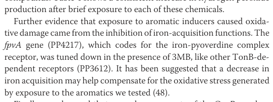

## Question

# Gene Research for Functional Annotation

## ⚠️ CRITICAL: Gene/Protein Identification Context

**BEFORE YOU BEGIN RESEARCH:** You MUST verify you are researching the CORRECT gene/protein. Gene symbols can be ambiguous, especially for less well-characterized genes from non-model organisms.

### Target Gene/Protein Identity (from UniProt):
- **UniProt Accession:** Q88F81
- **Protein Description:** SubName: Full=Outer membrane ferripyoverdine receptor FpvA, TonB-dependent {ECO:0000313|EMBL:AAN69798.1};
- **Gene Information:** Name=fpvA {ECO:0000313|EMBL:AAN69798.1}; OrderedLocusNames=PP_4217 {ECO:0000313|EMBL:AAN69798.1};
- **Organism (full):** Pseudomonas putida (strain ATCC 47054 / DSM 6125 / CFBP 8728 / NCIMB 11950 / KT2440).
- **Protein Family:** Belongs to the TonB-dependent receptor family.
- **Key Domains:** Beta-barrel_TonB. (IPR000531); Beta-barrel_TonB_sf. (IPR036942); Plug_dom. (IPR012910); Plug_dom_sf. (IPR037066); Secretin/TonB_short_N. (IPR011662)

### MANDATORY VERIFICATION STEPS:

1. **Check if the gene symbol "fpvA" matches the protein description above**
2. **Verify the organism is correct:** Pseudomonas putida (strain ATCC 47054 / DSM 6125 / CFBP 8728 / NCIMB 11950 / KT2440).
3. **Check if protein family/domains align with what you find in literature**
4. **If you find literature for a DIFFERENT gene with the same or similar symbol, STOP**

### If Gene Symbol is Ambiguous or You Cannot Find Relevant Literature:

**DO NOT PROCEED WITH RESEARCH ON A DIFFERENT GENE.** Instead:
- State clearly: "The gene symbol 'fpvA' is ambiguous or literature is limited for this specific protein"
- Explain what you found (e.g., "Found extensive literature on a different gene with the same symbol in a different organism")
- Describe the protein based ONLY on the UniProt information provided above
- Suggest that the protein function can be inferred from domain/family information

### Research Target:

Please provide a comprehensive research report on the gene **fpvA** (gene ID: fpvA, UniProt: Q88F81) in PSEPK.

The research report should be a detailed narrative explaining the function, biological processes, and localization of the gene product. Citations should be given for all claims.

You should prioritize authoritative reviews and primary scientific literature when conducting research. You can supplement
this with annotations you find in gene/protein databases, but these can be outdated or inaccurate.

We are specifically interested in the primary function of the gene - for enzymes, what reaction is catalyzed, and what is the substrate specificity? For transporters, what is the substrate? For structural proteins or adapters, what is the broader structural role? For signaling molecules, what is the role in the pathway.

We are interested in where in or outside the cell the gene product carries out its function.

We are also interested in the signaling or biochemical pathways in which the gene functions. We are less interested in broad pleiotropic effects, except where these elucidate the precise role.

Include evidence where possible. We are interested in both experimental evidence as well as inference from structure, evolution, or bioinformatic analysis. Precise studies should be prioritized over high-throughput, where available.

## Output

Question: You are an expert researcher providing comprehensive, well-cited information.

Provide detailed information focusing on:
1. Key concepts and definitions with current understanding
2. Recent developments and latest research (prioritize 2023-2024 sources)
3. Current applications and real-world implementations
4. Expert opinions and analysis from authoritative sources
5. Relevant statistics and data from recent studies

Format as a comprehensive research report with proper citations. Include URLs and publication dates where available.
Always prioritize recent, authoritative sources and provide specific citations for all major claims.

# Gene Research for Functional Annotation

## ⚠️ CRITICAL: Gene/Protein Identification Context

**BEFORE YOU BEGIN RESEARCH:** You MUST verify you are researching the CORRECT gene/protein. Gene symbols can be ambiguous, especially for less well-characterized genes from non-model organisms.

### Target Gene/Protein Identity (from UniProt):
- **UniProt Accession:** Q88F81
- **Protein Description:** SubName: Full=Outer membrane ferripyoverdine receptor FpvA, TonB-dependent {ECO:0000313|EMBL:AAN69798.1};
- **Gene Information:** Name=fpvA {ECO:0000313|EMBL:AAN69798.1}; OrderedLocusNames=PP_4217 {ECO:0000313|EMBL:AAN69798.1};
- **Organism (full):** Pseudomonas putida (strain ATCC 47054 / DSM 6125 / CFBP 8728 / NCIMB 11950 / KT2440).
- **Protein Family:** Belongs to the TonB-dependent receptor family.
- **Key Domains:** Beta-barrel_TonB. (IPR000531); Beta-barrel_TonB_sf. (IPR036942); Plug_dom. (IPR012910); Plug_dom_sf. (IPR037066); Secretin/TonB_short_N. (IPR011662)

### MANDATORY VERIFICATION STEPS:

1. **Check if the gene symbol "fpvA" matches the protein description above**
2. **Verify the organism is correct:** Pseudomonas putida (strain ATCC 47054 / DSM 6125 / CFBP 8728 / NCIMB 11950 / KT2440).
3. **Check if protein family/domains align with what you find in literature**
4. **If you find literature for a DIFFERENT gene with the same or similar symbol, STOP**

### If Gene Symbol is Ambiguous or You Cannot Find Relevant Literature:

**DO NOT PROCEED WITH RESEARCH ON A DIFFERENT GENE.** Instead:
- State clearly: "The gene symbol 'fpvA' is ambiguous or literature is limited for this specific protein"
- Explain what you found (e.g., "Found extensive literature on a different gene with the same symbol in a different organism")
- Describe the protein based ONLY on the UniProt information provided above
- Suggest that the protein function can be inferred from domain/family information

### Research Target:

Please provide a comprehensive research report on the gene **fpvA** (gene ID: fpvA, UniProt: Q88F81) in PSEPK.

The research report should be a detailed narrative explaining the function, biological processes, and localization of the gene product. Citations should be given for all claims.

You should prioritize authoritative reviews and primary scientific literature when conducting research. You can supplement
this with annotations you find in gene/protein databases, but these can be outdated or inaccurate.

We are specifically interested in the primary function of the gene - for enzymes, what reaction is catalyzed, and what is the substrate specificity? For transporters, what is the substrate? For structural proteins or adapters, what is the broader structural role? For signaling molecules, what is the role in the pathway.

We are interested in where in or outside the cell the gene product carries out its function.

We are also interested in the signaling or biochemical pathways in which the gene functions. We are less interested in broad pleiotropic effects, except where these elucidate the precise role.

Include evidence where possible. We are interested in both experimental evidence as well as inference from structure, evolution, or bioinformatic analysis. Precise studies should be prioritized over high-throughput, where available.

# Research report: **fpvA** (UniProt **Q88F81**; locus **PP_4217**) in *Pseudomonas putida* KT2440

## 1) Target verification (critical identity check)

The gene symbol **fpvA** in *Pseudomonas putida* KT2440 is explicitly mapped in primary literature to **locus PP4217** and annotated as the **“iron-pyoverdine complex receptor”** (i.e., the ferri‑pyoverdine outer-membrane receptor). This directly matches the UniProt Q88F81 description “Outer membrane ferripyoverdine receptor FpvA, TonB-dependent”. (dominguezcuevas2006transcriptionaltradeoffbetween pages 7-8, dominguezcuevas2006transcriptionaltradeoffbetween pages 6-7, dominguezcuevas2006transcriptionaltradeoffbetween media a60d2c30)

Because **fpvA** is also widely studied in *P. aeruginosa*, mechanistic/structural literature from *P. aeruginosa* is used below only as **conserved TonB-dependent receptor background** and not as direct KT2440-specific evidence. (folschweiller2000thepyoverdinreceptor pages 1-2, adams2006interactionoftonb pages 4-5)

## 2) Key concepts and current understanding (definitions and mechanism)

### 2.1 What FpvA is (definition)
**FpvA** is a **TonB-dependent outer membrane transporter/receptor (TBDT)** used by Gram-negative bacteria to import scarce, high-affinity nutrient complexes—classically **ferric siderophores**—across the **outer membrane (OM)** into the **periplasm**. In fluorescent pseudomonads, pyoverdines (also written pyoverdins) are secreted **siderophores** that chelate Fe(III) with high affinity; the Fe(III)–pyoverdine complex is then recognized by a cognate OM receptor, historically termed **FpvA** for pyoverdine uptake. (folschweiller2000thepyoverdinreceptor pages 2-3, folschweiller2000thepyoverdinreceptor pages 1-2)

### 2.2 Domain architecture and localization
Authoritative reviews describe TBDTs (including FpvA-class receptors) as **22-stranded β-barrels** in the OM with a luminal **plug domain** that occludes the pore, plus an N-terminal **TonB box** (short conserved motif) in the periplasm that interacts with **TonB**. Some FpvA-like receptors are additionally described as possessing an N-terminal signaling/transducer domain involved in **cell-surface signaling (CSS)** regulation of iron uptake genes. (folschweiller2000thepyoverdinreceptor pages 3-5, braun2024substrateuptakeby pages 6-7, folschweiller2000thepyoverdinreceptor pages 2-3)

Thus, for KT2440 FpvA (Q88F81/PP_4217), the best-supported localization is:
- **Outer membrane** β-barrel receptor exposed to the extracellular milieu for ferri-pyoverdine capture.
- **Periplasmic TonB box** contacting TonB for energy coupling.

### 2.3 Energy coupling: the TonB–ExbB–ExbD “motor”
TBDT transport across the OM is **energy dependent**: the **TonB–ExbB–ExbD** complex in the inner membrane transduces **proton motive force** energy to TonB, which interacts with the receptor TonB box and drives conformational changes enabling translocation through the plug/barrel. Mechanistically, substrate binding is typically rapid and energy independent; the subsequent translocation step is slower and requires TonB-dependent conformational rearrangements of the TonB box and plug. (folschweiller2000thepyoverdinreceptor pages 1-2, braun2024substrateuptakeby pages 6-7)

### 2.4 What FpvA does biochemically
FpvA is a **transporter/receptor**, not an enzyme: its primary biochemical role is **selective recognition and OM translocation of ferri‑pyoverdine (iron–pyoverdine complex)** into the periplasm, initiating iron assimilation. (dominguezcuevas2006transcriptionaltradeoffbetween pages 7-8, folschweiller2000thepyoverdinreceptor pages 2-3, adams2006interactionoftonb pages 4-5)

## 3) KT2440-specific functional annotation: role in iron/pyoverdine biology

### 3.1 Direct KT2440 evidence for function
In *P. putida* KT2440, **fpvA (PP4217)** is explicitly described as encoding the **iron–pyoverdine complex receptor**, and its expression is discussed in the context of **iron-acquisition functions**. (dominguezcuevas2006transcriptionaltradeoffbetween pages 7-8, dominguezcuevas2006transcriptionaltradeoffbetween media a60d2c30)

### 3.2 Genomic and pathway context in KT2440 (pyoverdine system)
A KT2440 genome analysis describes that KT2440 produces **pyoverdine** and that pyoverdine genes are organized in **three clusters**: **PP4243–4246**, **PP4319–4327**, and **PP4219–4223**. The main pyoverdine transcriptional activator is described as **prfI (PP4244)**, an **ECF σ factor** with high identity to regulators in other *Pseudomonas*, including **PvdS** from *P. aeruginosa* (a canonical pyoverdine regulator). (santos2004insightsintothe pages 8-10)

The same KT2440 genome analysis also reports that KT2440 has **29 predicted TonB-dependent outer-membrane siderophore receptors**, consistent with an ecological strategy of broad iron scavenging in soil/rhizosphere environments and supporting the plausibility of PP_4217 as one element of an extensive iron-uptake receptor repertoire. (santos2004insightsintothe pages 10-11)

### 3.3 Regulation in KT2440: iron control and stress cross-talk
**Iron regulation framework:** In pseudomonads, pyoverdine production is described as being chiefly controlled by **Fur**, which modulates expression of ECF σ factors under iron limitation. This regulatory architecture is described in the KT2440 genomic context as well. (santos2004insightsintothe pages 8-10)

**Aromatic stress cross-talk:** In a KT2440 transcriptome study of acute aromatic exposure, the authors report inhibition of iron-acquisition functions and state that **“The fpvA gene (PP4217), which codes for the iron-pyoverdine complex receptor, was tuned down in the presence of 3MB”** (3-methylbenzoate), alongside other TonB-dependent receptors. (dominguezcuevas2006transcriptionaltradeoffbetween pages 7-8, dominguezcuevas2006transcriptionaltradeoffbetween media a60d2c30)

This downregulation is discussed in a broader oxidative-stress context: the same study reports increased hydrogen peroxide (H2O2) accumulation after exposure to aromatics; for example at 30 min: none 0.51, toluene 2.98, o-xylene 4.31, 3MB 4.06 (units as reported). (dominguezcuevas2006transcriptionaltradeoffbetween pages 6-7)

**Interpretation (expert analysis):** The authors suggest decreased iron acquisition may help compensate for aromatic-induced oxidative stress, consistent with the well-established principle that iron uptake can exacerbate oxidative damage (e.g., via iron-catalyzed reactive oxygen chemistry). (dominguezcuevas2006transcriptionaltradeoffbetween pages 7-8)

### 3.4 What remains KT2440-uncertain (limitations)
Within the retrieved corpus, there is **no direct KT2440 fpvA knockout/uptake assay** (e.g., 55Fe-pyoverdine uptake) demonstrating transport activity specifically for PP_4217. Therefore, the highest-confidence KT2440 claims are (i) gene identity/annotation, (ii) genomic context of the pyoverdine system, and (iii) condition-dependent expression changes, while detailed transport kinetics and CSS behavior for KT2440 FpvA remain primarily **inferred from conserved TBDT/FpvA literature**. (dominguezcuevas2006transcriptionaltradeoffbetween pages 7-8, santos2004insightsintothe pages 8-10, braun2024substrateuptakeby pages 6-7)

## 4) Recent developments (2023–2024 priority)

### 4.1 Quantitative regulation of TBDTs as a design constraint (2023)
A 2023 study developed fluorescent promoter reporters to quantify how TonB-dependent transporter genes respond to siderophore concentrations, showing distinct “dose–response” programs. Quantitatively, **maximum transcription for pfeA** was reached at **~3 µM enterobactin**, whereas **foxA** did **not** reach maximum even at **100 µM nocardamine**. This reinforces that TBDT expression can be strongly ligand- and pathway-dependent, relevant when predicting when receptors like FpvA will be expressed and exploitable. (Published 2023-11; URL: https://doi.org/10.1038/s41598-023-46585-z) (hubert2023experimentalandcomputational pages 1-2)

### 4.2 Updated cell-surface signaling (CSS) model for TonB-dependent transducers (2024)
A 2024 PLOS Biology paper revises the prevailing CSS activation model by showing that, in the *P. aeruginosa* Fox system, the TBDT signaling domain can **already interact with the anti-σ factor in the absence of the inducing signal**, protecting it from proteolysis and preventing σECF-dependent transcription. This is relevant to FpvA-like receptors because classic FpvA literature places pyoverdine receptors among TBDTs capable of transducing signals that upregulate uptake/biosynthesis genes; the new model suggests that “pre-formed” receptor–anti-σ interactions and receptor proteolysis can be important control points. (Published 2024-12; URL: https://doi.org/10.1371/journal.pbio.3002920) (wettstadt2024bacterialtonbdependenttransducers pages 1-2)

### 4.3 Large-scale receptor/pyoverdine diversity mapping in *Pseudomonas* (2024)
A 2024 eLife genome-mining study analyzed **1,928 *Pseudomonas* genomes** and predicted **188 chemically distinct pyoverdines** and **94 distinct receptor groups** required for uptake; it reports **151 new** predicted pyoverdine structures and **91 new receptor groups**. This frames FpvA homologs like KT2440 PP_4217 as one member of a vast and recently clarified diversity landscape, implying that receptor specificity and “siderophore matchmaking” are key to ecological fitness and to engineering Trojan-horse strategies. (Published 2024-10; URL: https://doi.org/10.7554/eLife.96719) (graff2024siderophoresastools pages 1-2)

### 4.4 Updated mechanistic synthesis of TonB-dependent transport (2024)
A 2024 review consolidates the current mechanistic view: TonB binding to the TonB box elicits plug movement/reorganization enabling periplasmic passage; “intact receptor context” is critical for high-affinity substrate binding relative to isolated plug fragments; and TonB scarcity relative to receptor abundance implies rapid exchange/cycling. These mechanistic constraints are directly relevant to annotating how FpvA mediates ferri-pyoverdine uptake and why inhibitors/antibiotic conjugates targeting these systems must account for conformational gating and energy-coupled steps. (Published 2024-12; URL: https://doi.org/10.1111/mmi.15332) (braun2024substrateuptakeby pages 6-7)

## 5) Current applications and real-world implementations

### 5.1 Trojan-horse antibiotics and design rules (2024)
A 2024 review focusing on ferric siderophore transport systems highlights “location-aware” design principles for **siderophore–antibiotic conjugates**: match where the siderophore delivers cargo (periplasm vs cytoplasm) to the antibiotic’s target location, avoid disrupting transporter recognition with linker placement, and decide whether a cleavable linker is required depending on the warhead. It also summarizes that susceptibility/potency can fall in ranges such as **MICs ~0.063–1 mg/mL** for certain conjugates across select Gram-negative pathogens in reported examples, and notes that changes in siderophore motifs can markedly reduce activity—consistent with uptake-dependent mechanisms. (Published 2024-08; URL: https://doi.org/10.3390/molecules29163889) (luo2024locationlocationlocation pages 30-31)

### 5.2 Siderophores in translational chemical biology (2024)
A 2024 Biochemistry review connects foundational siderophore uptake biology with translational applications (antibiotic delivery, imaging, novel therapeutic concepts). It highlights rapid uptake of siderophore-based imaging agents (reported uptake “within minutes” in an Aspergillus PET context) and emphasizes that gaps remain in resolving the precise structural relationship between TonB and the plug domain—limiting fully rational inhibitor design. (Published 2024-07; URL: https://doi.org/10.1021/acs.biochem.4c00276) (leblanc2024siderophoresacase pages 11-12)

### 5.3 Siderophores as tools and treatments (2024)
A 2024 npj review synthesizes the use of siderophores as diagnostics and therapeutics and provides quantitative framing important for iron-uptake biology: siderophore iron-binding strengths spanning **logKf ~25.3–49.0** and **pFeIII ~20.0–35.6** (standardized conditions given), and extremely low host bioavailable iron (e.g., ~10^-18 M). These values underscore why high-affinity siderophore systems (and their OM receptors such as FpvA) are such strong evolutionary and translational leverage points. (Published 2024-12; URL: https://doi.org/10.1038/s44259-024-00053-4) (graff2024siderophoresastools pages 1-2)

## 6) Expert opinions and analysis (authoritative perspectives)

### 6.1 Why receptor annotation must be “system-level”
Genome-scale analyses and reviews emphasize that fluorescent pseudomonads often possess **many** TonB-dependent receptors and that receptors can be co-clustered with transmembrane sensors, ECF σ factors, and transcriptional regulators—suggesting tight coupling between environmental detection and receptor expression. This supports annotating KT2440 FpvA not as an isolated transporter, but as part of a regulated iron-scavenging module integrated with Fur/σECF pathways. (santos2004insightsintothe pages 10-11)

### 6.2 Why expression can be context-dependent (stress vs iron demand)
The KT2440 transcriptomics study offers a concrete example of context-dependent suppression: under acute aromatic stress, iron-acquisition functions (including **fpvA**) are downregulated, plausibly as an oxidative stress mitigation strategy. This supports the view that iron uptake systems are subject to multi-objective regulation beyond iron limitation alone. (dominguezcuevas2006transcriptionaltradeoffbetween pages 7-8)

## 7) Statistics and data relevant to fpvA annotation

### 7.1 KT2440-specific statistics
- **29 predicted TonB-dependent outer-membrane siderophore receptors** in KT2440 (genome-based prediction). (Published 2004-12; URL: https://doi.org/10.1111/j.1462-2920.2004.00734.x) (santos2004insightsintothe pages 10-11)
- Aromatic exposure linked to oxidative stress: H2O2 accumulation at 30 min reported as 0.51 (none), 2.98 (toluene), 4.31 (o-xylene), 4.06 (3MB). (Published 2006-04-28; URL: https://doi.org/10.1074/jbc.m509848200) (dominguezcuevas2006transcriptionaltradeoffbetween pages 6-7)

### 7.2 Recent (2023–2024) statistics shaping “current understanding”
- Concentration-dependent regulation: **maximal pfeA transcription at ~3 µM enterobactin**, while **foxA not maximal at 100 µM nocardamine** in *P. aeruginosa* reporter assays, illustrating non-uniform regulatory programs across TBDTs. (Published 2023-11; URL: https://doi.org/10.1038/s41598-023-46585-z) (hubert2023experimentalandcomputational pages 1-2)
- Diversity landscape: **1,928 genomes**, **188 pyoverdines**, **94 receptor groups**, including **151** new structures and **91** new receptor groups predicted. (Published 2024-10; URL: https://doi.org/10.7554/eLife.96719) (graff2024siderophoresastools pages 1-2)
- Siderophore binding strength ranges: **logKf ~25.3–49.0** and **pFeIII ~20.0–35.6** (reviewed values; standardized conditions stated). (Published 2024-12; URL: https://doi.org/10.1038/s44259-024-00053-4) (graff2024siderophoresastools pages 1-2)

## 8) Consolidated functional annotation (narrative)

**fpvA (PP_4217; UniProt Q88F81)** in *P. putida* KT2440 encodes a **TonB-dependent outer membrane receptor** whose primary function is the **uptake of the iron–pyoverdine (ferri‑pyoverdine) complex** into the periplasm as the first dedicated step of pyoverdine-mediated iron acquisition. (dominguezcuevas2006transcriptionaltradeoffbetween pages 7-8, folschweiller2000thepyoverdinreceptor pages 2-3, folschweiller2000thepyoverdinreceptor pages 1-2)

Its cellular localization is best annotated as **outer membrane**, with energy coupling via periplasmic interaction between the receptor’s **TonB box** and TonB, energized by the inner-membrane **ExbB/ExbD** complex; transport proceeds through TonB-dependent conformational changes in the plug/barrel system. (braun2024substrateuptakeby pages 6-7, folschweiller2000thepyoverdinreceptor pages 1-2)

In KT2440, fpvA sits in a broader pyoverdine/iron network whose genes are clustered and regulated by **Fur** and σECF regulators (e.g., prfI/PP4244 described as a key pyoverdine transcriptional activator), consistent with classical pseudomonad iron starvation control. (santos2004insightsintothe pages 8-10)

Transcriptionally, KT2440 fpvA is shown to be downregulated under acute aromatic (3-methylbenzoate) stress conditions associated with oxidative stress and suppression of iron acquisition functions, supporting a regulatory tradeoff between iron scavenging and oxidative stress management. (dominguezcuevas2006transcriptionaltradeoffbetween pages 7-8, dominguezcuevas2006transcriptionaltradeoffbetween pages 6-7, dominguezcuevas2006transcriptionaltradeoffbetween media a60d2c30)

## Summary table (evidence-graded)

| Annotation aspect | Summary for **Pseudomonas putida** KT2440 **fpvA** / **PP_4217** / UniProt **Q88F81** | Evidence / strength |
|---|---|---|
| Identity mapping | KT2440 literature explicitly identifies **fpvA = PP4217** and annotates it as the **iron-pyoverdine complex receptor**; this matches the UniProt entry for Q88F81 and distinguishes it from homologous **fpvA** genes studied in other *Pseudomonas* species (dominguezcuevas2006transcriptionaltradeoffbetween pages 7-8) | **Direct KT2440-specific annotation** from primary literature; high confidence for locus-to-gene mapping (dominguezcuevas2006transcriptionaltradeoffbetween pages 7-8) |
| Protein type / family / domains | FpvA belongs to the **TonB-dependent outer-membrane receptor** family. Canonical architecture includes a **22-stranded β-barrel**, an internal **plug domain**, and an N-terminal **TonB box** required for interaction with TonB; FpvA-class receptors can also include an **additional N-terminal signaling domain** implicated in cell-surface signaling/transduction (folschweiller2000thepyoverdinreceptor pages 3-5, braun2024substrateuptakeby pages 6-7, wettstadt2024bacterialtonbdependenttransducers pages 1-2) | **Indirect for KT2440, strong by homology/family conservation**; domain architecture is well established for FpvA/TBDTs, though mostly from non-KT2440 systems (folschweiller2000thepyoverdinreceptor pages 3-5, braun2024substrateuptakeby pages 6-7, wettstadt2024bacterialtonbdependenttransducers pages 1-2) |
| Primary substrate | Primary inferred substrate is **ferric pyoverdine** (the **iron-pyoverdine / ferri-pyoverdine complex**), consistent with the explicit KT2440 annotation “iron-pyoverdine complex receptor” and with FpvA function across fluorescent pseudomonads (dominguezcuevas2006transcriptionaltradeoffbetween pages 7-8, folschweiller2000thepyoverdinreceptor pages 2-3, adams2006interactionoftonb pages 4-5) | **Direct KT2440 annotation + strong comparative support**; no substrate-switch evidence found for PP_4217 (dominguezcuevas2006transcriptionaltradeoffbetween pages 7-8, folschweiller2000thepyoverdinreceptor pages 2-3) |
| Cellular localization | FpvA is expected to reside in the **outer membrane** as a siderophore receptor. Its **TonB box** engages **TonB** in the periplasmic space, and transport is energized by the **TonB–ExbB–ExbD** complex using inner-membrane proton motive force; substrate first binds extracellular loops/plug, then is translocated to the periplasm (folschweiller2000thepyoverdinreceptor pages 3-5, braun2024substrateuptakeby pages 6-7, folschweiller2000thepyoverdinreceptor pages 1-2, adams2006interactionoftonb pages 4-5) | **Indirect for KT2440 but mechanistically very strong** from TonB-dependent receptor literature and FpvA studies (braun2024substrateuptakeby pages 6-7, folschweiller2000thepyoverdinreceptor pages 1-2, adams2006interactionoftonb pages 4-5) |
| Immediate biochemical role | FpvA mediates the **outer-membrane uptake step** of iron acquisition by recognizing ferri-pyoverdine outside the cell and enabling its transfer into the periplasm; it is therefore a **transporter/receptor**, not an enzyme catalyzing a chemical transformation (folschweiller2000thepyoverdinreceptor pages 2-3, folschweiller2000thepyoverdinreceptor pages 1-2, adams2006interactionoftonb pages 4-5) | **Strong family-level functional evidence**; exact transport cycle in KT2440 inferred from homologous FpvA/TBDT systems (folschweiller2000thepyoverdinreceptor pages 2-3, adams2006interactionoftonb pages 4-5) |
| Pathway context | KT2440 produces **pyoverdine** and carries pyoverdine genes in **three clusters**: **PP4243–4246, PP4319–4327, and PP4219–4223**. The main pyoverdine transcriptional activator **prfI (PP4244)** is an ECF σ factor homologous to **PvdS**; KT2440 also encodes many TonB-dependent siderophore receptors, placing FpvA within a larger iron-scavenging network (santos2004insightsintothe pages 8-10, santos2004insightsintothe pages 10-11, santos2004insightsintothe pages 7-8) | **Direct KT2440 genomic context** for the pyoverdine system, though PP_4217 itself is not deeply characterized genetically in these studies (santos2004insightsintothe pages 8-10, santos2004insightsintothe pages 10-11) |
| Regulation / iron control | In pseudomonads, pyoverdine production and uptake genes are primarily controlled by the global iron regulator **Fur**, which modulates ECF σ-factor pathways under iron limitation; KT2440 pyoverdine circuitry includes **PfrI/PrfI (PvdS homolog)** and **PP_4208 (FpvI)** as regulators in the broader system (santos2004insightsintothe pages 8-10, stein2023navigatingpyoverdineand pages 22-25) | **Direct/near-direct KT2440 systems-level evidence** for regulatory framework; specific promoter-level data for PP_4217 remain limited (santos2004insightsintothe pages 8-10, stein2023navigatingpyoverdineand pages 22-25) |
| Cell-surface signaling concept | FpvA-like receptors can function not only as transporters but also as **cell-surface signaling (CSS) transducers**, where ligand detection at the outer membrane influences transcription of uptake genes through anti-σ / ECF σ pathways. Recent work in *P. aeruginosa* revises CSS models by showing pre-existing receptor–anti-σ interactions and receptor proteolysis effects (folschweiller2000thepyoverdinreceptor pages 2-3, wettstadt2024bacterialtonbdependenttransducers pages 1-2) | **Conceptually relevant but mostly non-KT2440 evidence**; useful for functional inference, not direct proof for PP_4217 behavior in KT2440 (folschweiller2000thepyoverdinreceptor pages 2-3, wettstadt2024bacterialtonbdependenttransducers pages 1-2) |
| Downregulation under aromatic stress | A KT2440 transcriptomics study reports that **fpvA (PP4217)**, annotated as the **iron-pyoverdine complex receptor**, was **“tuned down in the presence of 3MB”** (3-methylbenzoate), alongside other TonB-dependent receptors, during conditions associated with oxidative stress and reduced iron-acquisition functions (dominguezcuevas2006transcriptionaltradeoffbetween pages 7-8) | **Direct KT2440 expression evidence**, but condition-specific and not a dedicated iron-uptake study (dominguezcuevas2006transcriptionaltradeoffbetween pages 7-8) |
| Broader KT2440-specific support | KT2440 devotes major genomic capacity to iron scavenging: reports cite **29 predicted TonB-dependent outer-membrane siderophore receptors** (and another passage notes **18 outer-membrane ferric/ferric-related siderophore receptors**), consistent with ecological adaptation to iron limitation and receptor diversification in rhizosphere/dilute environments (santos2004insightsintothe pages 10-11, santos2004insightsintothe pages 7-8) | **Direct KT2440 genome-based evidence** supporting biological plausibility of fpvA as an iron receptor (santos2004insightsintothe pages 10-11, santos2004insightsintothe pages 7-8) |
| Recent 2023–2024 relevance | Recent work emphasizes that TonB-dependent receptors are dynamically regulated, structurally complex uptake gates and attractive translational targets. Quantitative examples include **sigmoidal vs logarithmic TBDT transcriptional responses**, **maximal pfeA induction at ~3 µM enterobactin**, and receptor diversity across **94 pyoverdine receptor groups** predicted from **1,928 Pseudomonas genomes** with **151 new pyoverdine structures** and **91 new receptor groups** (hubert2023experimentalandcomputational pages 1-2, graff2024siderophoresastools pages 1-2) | **Recent authoritative context**, not KT2440-specific for fpvA function, but highly relevant for current understanding of receptor specificity/evolution/application (hubert2023experimentalandcomputational pages 1-2, graff2024siderophoresastools pages 1-2) |
| Overall functional annotation | **Best-supported annotation:** FpvA (Q88F81/PP_4217) is a **TonB-dependent outer-membrane ferri-pyoverdine receptor** in **P. putida KT2440**, functioning in **iron acquisition** under iron limitation and likely integrated with **Fur/ECF σ-factor regulation** and possibly **cell-surface signaling**. The strongest KT2440-specific evidence is **gene identity/annotation** and **condition-dependent transcriptional downregulation**, whereas detailed transport mechanism is inferred from homologous FpvA/TBDT studies (dominguezcuevas2006transcriptionaltradeoffbetween pages 7-8, santos2004insightsintothe pages 8-10, folschweiller2000thepyoverdinreceptor pages 3-5, braun2024substrateuptakeby pages 6-7, adams2006interactionoftonb pages 4-5) | **High confidence for core function/localization; moderate confidence for detailed regulatory/mechanistic specifics in KT2440 due to limited direct experiments** (dominguezcuevas2006transcriptionaltradeoffbetween pages 7-8, santos2004insightsintothe pages 8-10, folschweiller2000thepyoverdinreceptor pages 3-5, adams2006interactionoftonb pages 4-5) |

*Table: This table summarizes the best-supported functional annotation for Pseudomonas putida KT2440 fpvA (Q88F81/PP_4217), integrating direct KT2440 evidence with mechanistic inference from authoritative TonB-dependent receptor and FpvA literature. It is useful for quickly separating high-confidence organism-specific facts from broader homolog-based functional interpretation.*

## Visual evidence

A cropped excerpt from Domínguez-Cuevas et al. (2006) shows the explicit statement that **fpvA (PP4217) codes for the iron–pyoverdine complex receptor** and notes downregulation under 3MB; this supports the KT2440 locus-to-function mapping and stress-linked regulation. (dominguezcuevas2006transcriptionaltradeoffbetween media a60d2c30)

## References (URLs in-text)

Key cited works include: Dos Santos et al. 2004 (Environmental Microbiology; 2004-12; https://doi.org/10.1111/j.1462-2920.2004.00734.x), Domínguez-Cuevas et al. 2006 (JBC; 2006-04-28; https://doi.org/10.1074/jbc.m509848200), Braun 2024 (Molecular Microbiology; 2024-12; https://doi.org/10.1111/mmi.15332), Hubert et al. 2023 (Scientific Reports; 2023-11; https://doi.org/10.1038/s41598-023-46585-z), Wettstadt et al. 2024 (PLOS Biology; 2024-12; https://doi.org/10.1371/journal.pbio.3002920), Luo & Peczuh 2024 (Molecules; 2024-08; https://doi.org/10.3390/molecules29163889), LeBlanc & Wuest 2024 (Biochemistry; 2024-07; https://doi.org/10.1021/acs.biochem.4c00276), and Gu et al. 2024 (eLife; 2024-10; https://doi.org/10.7554/eLife.96719). (santos2004insightsintothe pages 10-11, dominguezcuevas2006transcriptionaltradeoffbetween pages 7-8, braun2024substrateuptakeby pages 6-7, hubert2023experimentalandcomputational pages 1-2, wettstadt2024bacterialtonbdependenttransducers pages 1-2, luo2024locationlocationlocation pages 30-31, leblanc2024siderophoresacase pages 11-12, graff2024siderophoresastools pages 1-2)

References

1. (dominguezcuevas2006transcriptionaltradeoffbetween pages 7-8): Patricia Domínguez-Cuevas, José-Eduardo González-Pastor, Silvia Marqués, Juan-Luis Ramos, and Víctor de Lorenzo. Transcriptional tradeoff between metabolic and stress-response programs in pseudomonas putida kt2440 cells exposed to toluene*. Journal of Biological Chemistry, 281:11981-11991, Apr 2006. URL: https://doi.org/10.1074/jbc.m509848200, doi:10.1074/jbc.m509848200. This article has 269 citations and is from a domain leading peer-reviewed journal.

2. (dominguezcuevas2006transcriptionaltradeoffbetween pages 6-7): Patricia Domínguez-Cuevas, José-Eduardo González-Pastor, Silvia Marqués, Juan-Luis Ramos, and Víctor de Lorenzo. Transcriptional tradeoff between metabolic and stress-response programs in pseudomonas putida kt2440 cells exposed to toluene*. Journal of Biological Chemistry, 281:11981-11991, Apr 2006. URL: https://doi.org/10.1074/jbc.m509848200, doi:10.1074/jbc.m509848200. This article has 269 citations and is from a domain leading peer-reviewed journal.

3. (dominguezcuevas2006transcriptionaltradeoffbetween media a60d2c30): Patricia Domínguez-Cuevas, José-Eduardo González-Pastor, Silvia Marqués, Juan-Luis Ramos, and Víctor de Lorenzo. Transcriptional tradeoff between metabolic and stress-response programs in pseudomonas putida kt2440 cells exposed to toluene*. Journal of Biological Chemistry, 281:11981-11991, Apr 2006. URL: https://doi.org/10.1074/jbc.m509848200, doi:10.1074/jbc.m509848200. This article has 269 citations and is from a domain leading peer-reviewed journal.

4. (folschweiller2000thepyoverdinreceptor pages 1-2): Nicolas Folschweiller, I. Schalk, H. Celia, B. Kieffer, Mohamed A. Abdallah, and F. Pattus. The pyoverdin receptor fpva, a tonb-dependent receptor involved in iron uptake by pseudomonas aeruginosa (review). Molecular membrane biology, 17 3:123-33, Jul 2000. URL: https://doi.org/10.1080/09687680050197356, doi:10.1080/09687680050197356. This article has 57 citations and is from a peer-reviewed journal.

5. (adams2006interactionoftonb pages 4-5): Hendrik Adams, Gabrielle Zeder-Lutz, Isabelle Schalk, Franc Pattus, and Hervé Celia. Interaction of tonb with the outer membrane receptor fpva of pseudomonas aeruginosa. Journal of Bacteriology, 188:5752-5761, Aug 2006. URL: https://doi.org/10.1128/jb.00435-06, doi:10.1128/jb.00435-06. This article has 55 citations and is from a peer-reviewed journal.

6. (folschweiller2000thepyoverdinreceptor pages 2-3): Nicolas Folschweiller, I. Schalk, H. Celia, B. Kieffer, Mohamed A. Abdallah, and F. Pattus. The pyoverdin receptor fpva, a tonb-dependent receptor involved in iron uptake by pseudomonas aeruginosa (review). Molecular membrane biology, 17 3:123-33, Jul 2000. URL: https://doi.org/10.1080/09687680050197356, doi:10.1080/09687680050197356. This article has 57 citations and is from a peer-reviewed journal.

7. (folschweiller2000thepyoverdinreceptor pages 3-5): Nicolas Folschweiller, I. Schalk, H. Celia, B. Kieffer, Mohamed A. Abdallah, and F. Pattus. The pyoverdin receptor fpva, a tonb-dependent receptor involved in iron uptake by pseudomonas aeruginosa (review). Molecular membrane biology, 17 3:123-33, Jul 2000. URL: https://doi.org/10.1080/09687680050197356, doi:10.1080/09687680050197356. This article has 57 citations and is from a peer-reviewed journal.

8. (braun2024substrateuptakeby pages 6-7): Volkmar Braun. Substrate uptake by tonb‐dependent outer membrane transporters. Molecular Microbiology, 122:929-947, Dec 2024. URL: https://doi.org/10.1111/mmi.15332, doi:10.1111/mmi.15332. This article has 20 citations and is from a domain leading peer-reviewed journal.

9. (santos2004insightsintothe pages 8-10): V. A. P. Martins Dos Santos, S. Heim, E. R. B. Moore, M. Strätz, and K. N. Timmis. Insights into the genomic basis of niche specificity of pseudomonas putida kt2440. Environmental microbiology, 6 12:1264-86, Dec 2004. URL: https://doi.org/10.1111/j.1462-2920.2004.00734.x, doi:10.1111/j.1462-2920.2004.00734.x. This article has 339 citations and is from a domain leading peer-reviewed journal.

10. (santos2004insightsintothe pages 10-11): V. A. P. Martins Dos Santos, S. Heim, E. R. B. Moore, M. Strätz, and K. N. Timmis. Insights into the genomic basis of niche specificity of pseudomonas putida kt2440. Environmental microbiology, 6 12:1264-86, Dec 2004. URL: https://doi.org/10.1111/j.1462-2920.2004.00734.x, doi:10.1111/j.1462-2920.2004.00734.x. This article has 339 citations and is from a domain leading peer-reviewed journal.

11. (hubert2023experimentalandcomputational pages 1-2): Thibaut Hubert, Morgan Madec, and Isabelle J. Schalk. Experimental and computational methods to highlight behavioural variations in tonb-dependent transporter expression in pseudomonas aeruginosa versus siderophore concentration. Scientific Reports, Nov 2023. URL: https://doi.org/10.1038/s41598-023-46585-z, doi:10.1038/s41598-023-46585-z. This article has 4 citations and is from a peer-reviewed journal.

12. (wettstadt2024bacterialtonbdependenttransducers pages 1-2): Sarah Wettstadt, Francisco J. Marcos-Torres, Joaquín R. Otero-Asman, Alicia García-Puente, Álvaro Ortega, and María A. Llamas. Bacterial tonb-dependent transducers interact with the anti-σ factor in absence of the inducing signal protecting it from proteolysis. Dec 2024. URL: https://doi.org/10.1371/journal.pbio.3002920, doi:10.1371/journal.pbio.3002920. This article has 1 citations and is from a highest quality peer-reviewed journal.

13. (graff2024siderophoresastools pages 1-2): Á. Tamás Gräff and Sarah M. Barry. Siderophores as tools and treatments. npj Antimicrobials and Resistance, Dec 2024. URL: https://doi.org/10.1038/s44259-024-00053-4, doi:10.1038/s44259-024-00053-4. This article has 29 citations and is from a peer-reviewed journal.

14. (luo2024locationlocationlocation pages 30-31): Vivien Canran Luo and Mark W. Peczuh. Location, location, location: establishing design principles for new antibacterials from ferric siderophore transport systems. Molecules, 29:3889, Aug 2024. URL: https://doi.org/10.3390/molecules29163889, doi:10.3390/molecules29163889. This article has 11 citations.

15. (leblanc2024siderophoresacase pages 11-12): Andrew R. LeBlanc and William M. Wuest. Siderophores: a case study in translational chemical biology. Biochemistry, 63:1877-1891, Jul 2024. URL: https://doi.org/10.1021/acs.biochem.4c00276, doi:10.1021/acs.biochem.4c00276. This article has 23 citations and is from a peer-reviewed journal.

16. (santos2004insightsintothe pages 7-8): V. A. P. Martins Dos Santos, S. Heim, E. R. B. Moore, M. Strätz, and K. N. Timmis. Insights into the genomic basis of niche specificity of pseudomonas putida kt2440. Environmental microbiology, 6 12:1264-86, Dec 2004. URL: https://doi.org/10.1111/j.1462-2920.2004.00734.x, doi:10.1111/j.1462-2920.2004.00734.x. This article has 339 citations and is from a domain leading peer-reviewed journal.

17. (stein2023navigatingpyoverdineand pages 22-25): Nicola Victoria Maria Stein. Navigating pyoverdine and beyond: the role of tripartite efflux pumps in pseudomonas putida kt2440. Dissertation, Jan 2023. URL: https://doi.org/10.5282/edoc.32605, doi:10.5282/edoc.32605. This article has 1 citations.

## Artifacts

- [Edison artifact artifact-00](fpvA-deep-research-falcon_artifacts/artifact-00.md)

## Citations

1. santos2004insightsintothe pages 8-10
2. santos2004insightsintothe pages 10-11
3. dominguezcuevas2006transcriptionaltradeoffbetween pages 6-7
4. dominguezcuevas2006transcriptionaltradeoffbetween pages 7-8
5. hubert2023experimentalandcomputational pages 1-2
6. wettstadt2024bacterialtonbdependenttransducers pages 1-2
7. graff2024siderophoresastools pages 1-2
8. braun2024substrateuptakeby pages 6-7
9. luo2024locationlocationlocation pages 30-31
10. leblanc2024siderophoresacase pages 11-12
11. folschweiller2000thepyoverdinreceptor pages 1-2
12. adams2006interactionoftonb pages 4-5
13. folschweiller2000thepyoverdinreceptor pages 2-3
14. folschweiller2000thepyoverdinreceptor pages 3-5
15. santos2004insightsintothe pages 7-8
16. stein2023navigatingpyoverdineand pages 22-25
17. https://doi.org/10.1038/s41598-023-46585-z
18. https://doi.org/10.1371/journal.pbio.3002920
19. https://doi.org/10.7554/eLife.96719
20. https://doi.org/10.1111/mmi.15332
21. https://doi.org/10.3390/molecules29163889
22. https://doi.org/10.1021/acs.biochem.4c00276
23. https://doi.org/10.1038/s44259-024-00053-4
24. https://doi.org/10.1111/j.1462-2920.2004.00734.x
25. https://doi.org/10.1074/jbc.m509848200
26. https://doi.org/10.1074/jbc.m509848200,
27. https://doi.org/10.1080/09687680050197356,
28. https://doi.org/10.1128/jb.00435-06,
29. https://doi.org/10.1111/mmi.15332,
30. https://doi.org/10.1111/j.1462-2920.2004.00734.x,
31. https://doi.org/10.1038/s41598-023-46585-z,
32. https://doi.org/10.1371/journal.pbio.3002920,
33. https://doi.org/10.1038/s44259-024-00053-4,
34. https://doi.org/10.3390/molecules29163889,
35. https://doi.org/10.1021/acs.biochem.4c00276,
36. https://doi.org/10.5282/edoc.32605,