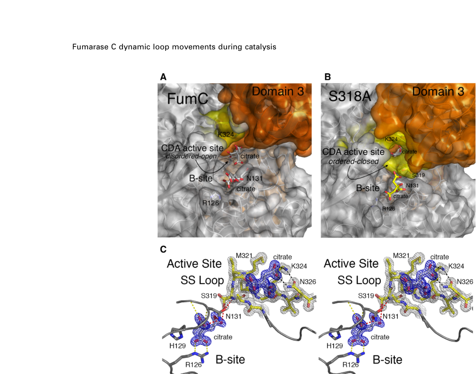

## Question

# Gene Research for Functional Annotation

## ⚠️ CRITICAL: Gene/Protein Identification Context

**BEFORE YOU BEGIN RESEARCH:** You MUST verify you are researching the CORRECT gene/protein. Gene symbols can be ambiguous, especially for less well-characterized genes from non-model organisms.

### Target Gene/Protein Identity (from UniProt):
- **UniProt Accession:** Q88M20
- **Protein Description:** RecName: Full=Fumarate hydratase class II {ECO:0000255|HAMAP-Rule:MF_00743}; Short=Fumarase C {ECO:0000255|HAMAP-Rule:MF_00743}; EC=4.2.1.2 {ECO:0000255|HAMAP-Rule:MF_00743}; AltName: Full=Aerobic fumarase {ECO:0000255|HAMAP-Rule:MF_00743}; AltName: Full=Iron-independent fumarase {ECO:0000255|HAMAP-Rule:MF_00743};
- **Gene Information:** Name=fumC {ECO:0000255|HAMAP-Rule:MF_00743}; Synonyms=fumC-2; OrderedLocusNames=PP_1755;
- **Organism (full):** Pseudomonas putida (strain ATCC 47054 / DSM 6125 / CFBP 8728 / NCIMB 11950 / KT2440).
- **Protein Family:** Belongs to the class-II fumarase/aspartase family. Fumarase
- **Key Domains:** Fum_hydII. (IPR005677); Fumarase/histidase_N. (IPR024083); Fumarase_C_C. (IPR018951); Fumarate_lyase_CS. (IPR020557); Fumarate_lyase_fam. (IPR000362)

### MANDATORY VERIFICATION STEPS:

1. **Check if the gene symbol "fumC" matches the protein description above**
2. **Verify the organism is correct:** Pseudomonas putida (strain ATCC 47054 / DSM 6125 / CFBP 8728 / NCIMB 11950 / KT2440).
3. **Check if protein family/domains align with what you find in literature**
4. **If you find literature for a DIFFERENT gene with the same or similar symbol, STOP**

### If Gene Symbol is Ambiguous or You Cannot Find Relevant Literature:

**DO NOT PROCEED WITH RESEARCH ON A DIFFERENT GENE.** Instead:
- State clearly: "The gene symbol 'fumC' is ambiguous or literature is limited for this specific protein"
- Explain what you found (e.g., "Found extensive literature on a different gene with the same symbol in a different organism")
- Describe the protein based ONLY on the UniProt information provided above
- Suggest that the protein function can be inferred from domain/family information

### Research Target:

Please provide a comprehensive research report on the gene **fumC** (gene ID: fumC, UniProt: Q88M20) in PSEPK.

The research report should be a detailed narrative explaining the function, biological processes, and localization of the gene product. Citations should be given for all claims.

You should prioritize authoritative reviews and primary scientific literature when conducting research. You can supplement
this with annotations you find in gene/protein databases, but these can be outdated or inaccurate.

We are specifically interested in the primary function of the gene - for enzymes, what reaction is catalyzed, and what is the substrate specificity? For transporters, what is the substrate? For structural proteins or adapters, what is the broader structural role? For signaling molecules, what is the role in the pathway.

We are interested in where in or outside the cell the gene product carries out its function.

We are also interested in the signaling or biochemical pathways in which the gene functions. We are less interested in broad pleiotropic effects, except where these elucidate the precise role.

Include evidence where possible. We are interested in both experimental evidence as well as inference from structure, evolution, or bioinformatic analysis. Precise studies should be prioritized over high-throughput, where available.

## Output

Question: You are an expert researcher providing comprehensive, well-cited information.

Provide detailed information focusing on:
1. Key concepts and definitions with current understanding
2. Recent developments and latest research (prioritize 2023-2024 sources)
3. Current applications and real-world implementations
4. Expert opinions and analysis from authoritative sources
5. Relevant statistics and data from recent studies

Format as a comprehensive research report with proper citations. Include URLs and publication dates where available.
Always prioritize recent, authoritative sources and provide specific citations for all major claims.

# Gene Research for Functional Annotation

## ⚠️ CRITICAL: Gene/Protein Identification Context

**BEFORE YOU BEGIN RESEARCH:** You MUST verify you are researching the CORRECT gene/protein. Gene symbols can be ambiguous, especially for less well-characterized genes from non-model organisms.

### Target Gene/Protein Identity (from UniProt):
- **UniProt Accession:** Q88M20
- **Protein Description:** RecName: Full=Fumarate hydratase class II {ECO:0000255|HAMAP-Rule:MF_00743}; Short=Fumarase C {ECO:0000255|HAMAP-Rule:MF_00743}; EC=4.2.1.2 {ECO:0000255|HAMAP-Rule:MF_00743}; AltName: Full=Aerobic fumarase {ECO:0000255|HAMAP-Rule:MF_00743}; AltName: Full=Iron-independent fumarase {ECO:0000255|HAMAP-Rule:MF_00743};
- **Gene Information:** Name=fumC {ECO:0000255|HAMAP-Rule:MF_00743}; Synonyms=fumC-2; OrderedLocusNames=PP_1755;
- **Organism (full):** Pseudomonas putida (strain ATCC 47054 / DSM 6125 / CFBP 8728 / NCIMB 11950 / KT2440).
- **Protein Family:** Belongs to the class-II fumarase/aspartase family. Fumarase
- **Key Domains:** Fum_hydII. (IPR005677); Fumarase/histidase_N. (IPR024083); Fumarase_C_C. (IPR018951); Fumarate_lyase_CS. (IPR020557); Fumarate_lyase_fam. (IPR000362)

### MANDATORY VERIFICATION STEPS:

1. **Check if the gene symbol "fumC" matches the protein description above**
2. **Verify the organism is correct:** Pseudomonas putida (strain ATCC 47054 / DSM 6125 / CFBP 8728 / NCIMB 11950 / KT2440).
3. **Check if protein family/domains align with what you find in literature**
4. **If you find literature for a DIFFERENT gene with the same or similar symbol, STOP**

### If Gene Symbol is Ambiguous or You Cannot Find Relevant Literature:

**DO NOT PROCEED WITH RESEARCH ON A DIFFERENT GENE.** Instead:
- State clearly: "The gene symbol 'fumC' is ambiguous or literature is limited for this specific protein"
- Explain what you found (e.g., "Found extensive literature on a different gene with the same symbol in a different organism")
- Describe the protein based ONLY on the UniProt information provided above
- Suggest that the protein function can be inferred from domain/family information

### Research Target:

Please provide a comprehensive research report on the gene **fumC** (gene ID: fumC, UniProt: Q88M20) in PSEPK.

The research report should be a detailed narrative explaining the function, biological processes, and localization of the gene product. Citations should be given for all claims.

You should prioritize authoritative reviews and primary scientific literature when conducting research. You can supplement
this with annotations you find in gene/protein databases, but these can be outdated or inaccurate.

We are specifically interested in the primary function of the gene - for enzymes, what reaction is catalyzed, and what is the substrate specificity? For transporters, what is the substrate? For structural proteins or adapters, what is the broader structural role? For signaling molecules, what is the role in the pathway.

We are interested in where in or outside the cell the gene product carries out its function.

We are also interested in the signaling or biochemical pathways in which the gene functions. We are less interested in broad pleiotropic effects, except where these elucidate the precise role.

Include evidence where possible. We are interested in both experimental evidence as well as inference from structure, evolution, or bioinformatic analysis. Precise studies should be prioritized over high-throughput, where available.

# Research report: **fumC (fumC2; PP_1755; UniProt Q88M20)** in *Pseudomonas putida* KT2440

## 0) Scope, identity verification, and disambiguation

The target protein **UniProt Q88M20** is annotated as **class II fumarate hydratase (fumarase C), EC 4.2.1.2**, encoded by **fumC** and mapped to the ordered locus **PP_1755** in *Pseudomonas putida* KT2440.

A KT2440-focused study explicitly enumerates **three fumarase loci** in this organism—**fumA (PP_0897)**, **fumC1 (PP_0944)**, and **fumC2 (PP_1755)**—thereby anchoring **PP_1755 as fumC2**, consistent with the UniProt accession provided and disambiguating it from fumC genes in other bacteria. (carvajal2014nuevosaspectosdel pages 144-147)

## 1) Key concepts and current understanding (definitions, reaction, pathway role)

### 1.1 Enzyme class and reaction

**Fumarate hydratase (fumarase; EC 4.2.1.2)** catalyzes the **reversible interconversion** of **fumarate and L-malate (S-malate)**—a canonical step of the **tricarboxylic acid (TCA; Krebs; citrate) cycle**. (stuttgen2020closedfumarasec pages 1-2, vugtlussenburg2013biochemicalsimilaritiesand pages 1-2)

For **class II fumarase (FumC-type)** specifically, structural/biochemical work defines the reaction as **fumarate ↔ S-malate** and places it explicitly in the **Krebs cycle**, with the enzyme functioning as a **homotetramer** in bacteria. (stuttgen2020closedfumarasec pages 1-2, stuttgen2020closedfumarasec pages 7-9)

### 1.2 Class I vs class II fumarases (important for functional annotation)

Bacteria can encode multiple fumarase isoenzymes spanning two biochemical families:

* **Class I fumarases (e.g., FumA/FumB in *E. coli*)** are **[4Fe–4S] cluster-containing** enzymes; they are **oxygen/oxidant sensitive** because their Fe–S cluster can be oxidized/inactivated. (vugtlussenburg2013biochemicalsimilaritiesand pages 1-2, vugtlussenburg2013biochemicalsimilaritiesand pages 2-3)
* **Class II fumarases (FumC-type)** are **iron-independent (no Fe–S cluster)** and are generally **oxygen-stable/oxidant-resistant**, offering robustness when ROS damages Fe–S enzymes. (lu2019aconservedmotif pages 1-2, lu2019aconservedmotif pages 6-7)

This distinction matters biologically because it motivates **isoenzyme switching** under oxidative stress and provides a mechanism for maintaining TCA flux when Fe–S enzymes are compromised. (lu2019aconservedmotif pages 6-7)

### 1.3 Mechanism and structural determinants (substrate specificity / catalysis)

High-resolution structures and kinetics of bacterial **FumC** (used here as mechanistic inference for the KT2440 homolog) show:

* FumC monomers have multiple domains and assemble into a **homotetramer** with **active sites formed by residues from multiple subunits**. (stuttgen2020closedfumarasec pages 1-2)
* The active site contains a dynamic segment termed the **“SS Loop”** with a conserved sequence motif; distinct **open/closed conformations** are observed crystallographically, supporting a conformationally gated catalytic mechanism. (stuttgen2020closedfumarasec pages 1-2, stuttgen2020closedfumarasec pages 5-7)
* The proposed class II mechanism proceeds via an **anti-1,2 addition–elimination** logic for malate/fumarate interconversion; residues in the SS Loop (e.g., **Ser318, Lys324, Asn326** in the studied homolog) contribute primarily to **turnover (kcat)** rather than substrate binding (**Km** relatively unchanged in alanine variants). (stuttgen2020closedfumarasec pages 1-2, stuttgen2020closedfumarasec pages 7-9)
* Substrate preference can be directionally asymmetric; one study reports **higher affinity for fumarate than S-malate** (3.8-fold). (stuttgen2020closedfumarasec pages 7-9)

These mechanistic points support a confident functional annotation of Q88M20 as a **cytosolic TCA-cycle enzyme catalyzing fumarate↔L-malate**, and they contextualize why multiple fumarase isoenzymes may coexist. (stuttgen2020closedfumarasec pages 1-2, stuttgen2020closedfumarasec pages 7-9)

**Structural figure evidence (FumC):** Open/closed SS Loop conformations, tetramer/active-site organization, and residue-level interactions are shown in retrieved figures from Stuttgen et al. (stuttgen2020closedfumarasec media 2ed2f20e, stuttgen2020closedfumarasec media 427f7b9b, stuttgen2020closedfumarasec media b221f39b)

## 2) KT2440-specific functional evidence for fumC2/PP_1755 (Q88M20)

### 2.1 Isoenzyme repertoire and functional redundancy

In a 2024 genome-scale-model (GSMM) guided engineering study in **KT2440**, the fumarase (FUM) reaction is linked to three genes: **PP_0897**, **fumC1/PP_0944**, and **fumC2/PP_1755**, with **PP_1755 (fumC2)** described as **non-essential** under the tested conditions. Specifically, **deletion of PP_1755 and/or PP_0944 had no impact on viability** in rich media or M9 minimal media with **p-coumarate** as carbon source, indicating redundancy at the level of supporting the FUM reaction under these contexts. (banerjee2024bottlenecksinthe pages 3-5)

### 2.2 Stress/perturbation contexts that alter fumarase isoenzyme usage

A KT2440 mutant perturbation study (ΔapaH background) provides direct evidence that **fumC2/PP_1755 is upregulated** and can contribute to compensatory fumarase activity:

* Proteomics: **FumC2 induced ~4-fold**; **FumA mildly repressed (~1.3-fold)**. (carvajal2014nuevosaspectosdel pages 144-147)
* Enzymology: **Total fumarase activity** was similar between wild type and mutant, but **FumC-specific activity** was significantly higher in the mutant, consistent with isoenzyme compensation by a fumC-type enzyme. (carvajal2014nuevosaspectosdel pages 144-147)

Collectively, these observations support the functional role of PP_1755/Q88M20 as an active fumarase isoenzyme in KT2440 and show that its contribution can increase under specific perturbations. (carvajal2014nuevosaspectosdel pages 144-147)

### 2.3 Chemical stress proteomics (herbicide metabolites)

In a quantitative proteomics study of KT2440 responses to chlorophenoxy herbicides and metabolites, a specific metabolite (DCC) caused a distinct proteome response and **fumarase C abundance was notably reduced**. The study used a DCC concentration that produced **~50% growth-rate reduction**, reported as **0.07 mM DCC** for KT2440, and observed fewer proteome changes under DCC than other compounds (35 proteins changed under DCC). (benndorf2006pseudomonasputidakt2440 pages 3-5)

This indicates that fumarase C levels are responsive to chemical stressors in KT2440, though the directionality (decrease here) likely reflects broader physiological constraints (e.g., ATP limitation due to uncoupling) rather than a simple “oxidative stress induction” rule. (benndorf2006pseudomonasputidakt2440 pages 3-5)

### 2.4 Oxidative stress regulation context in *P. putida*

A review focused on oxidative stress in *P. putida* reports that **fumC-1** is induced in KT2440 under **superoxide and nitric oxide** stress, and that this induction appears **independent of SoxR** in KT2440 (contrasting enteric SoxRS paradigms). (kim2014oxidativestressresponse pages 5-6)

This supports a broader interpretation that fumarase C-type isoenzymes are integrated into oxidative/nitrosative stress physiology in *P. putida*; however, the cited review statement refers to **fumC-1 (PP_0944)** rather than fumC2 (PP_1755), and it does not supply fold-changes in the excerpted text. (kim2014oxidativestressresponse pages 5-6)

### 2.5 Regulatory linkage via Fur under phenol stress (indirect)

Under phenol exposure, the Fur regulator is reported as upregulated in KT2440, and the authors note (citing prior work) that Fur **represses** targets including **fumC**. This provides a plausible regulatory link between phenol-induced iron/oxidative stress responses and fumarase isoenzyme expression, but the excerpt does **not** provide direct fumC expression quantitation for phenol exposure. (santos2004insightsintopseudomonas pages 9-10)

## 3) Cellular localization: what can be concluded

Direct KT2440-specific subcellular localization experiments for **FumC2/PP_1755** were not found in the retrieved texts. Nevertheless, the relevant functional context is strongly consistent with a **cytosolic enzyme**:

* FumC is a **central carbon metabolism enzyme** (TCA cycle), which in bacteria is carried out in the **cytosol** (enzymes soluble; metabolites diffuse in cytoplasm). (stuttgen2020closedfumarasec pages 1-2, vugtlussenburg2013biochemicalsimilaritiesand pages 1-2)
* KT2440 proteomics studies detecting fumarase C changes were performed using 2D-gel/MS approaches that predominantly analyze **cellular protein fractions enriched for soluble/cytoplasmic proteins**, consistent with fumarase C being a soluble enzyme; however, explicit fractionation/localization assignments for FumC were not provided in the extracted text. (benndorf2006pseudomonasputidakt2440 pages 3-5)

Thus, the best evidence-supported statement is that **FumC2 functions intracellularly as part of central metabolism**, with localization most consistent with the **cytosol**, but **direct localization evidence is not available in the current corpus**. (stuttgen2020closedfumarasec pages 1-2, benndorf2006pseudomonasputidakt2440 pages 3-5)

## 4) Pathways and biological processes

### 4.1 Core pathway role: the citrate/TCA cycle

FumC catalyzes the fumarate↔malate step of the **TCA cycle**, supporting energy generation, redox balance, and provision of biosynthetic precursors. (stuttgen2020closedfumarasec pages 1-2, vugtlussenburg2013biochemicalsimilaritiesand pages 1-2)

### 4.2 Oxidative-stress resilience and isoenzyme switching (conceptual framework)

Mechanistic work on fumarase families emphasizes that class II fumarases (FumC-type) are **oxidant-resistant** because they lack an Fe–S cluster, whereas class I fumarases are **oxidant-sensitive**; class II fumarases can be **induced by oxidative stress** and thereby serve as a **contingency enzyme** to preserve TCA flux when Fe–S enzymes are damaged by peroxide-related chemistry. (lu2019aconservedmotif pages 1-2, lu2019aconservedmotif pages 6-7)

In KT2440, this conceptual framework is consistent with observed induction of a fumarase C isoenzyme under certain perturbations (ΔapaH) and oxidative/nitrosative stress (fumC-1 induction under superoxide/NO). (carvajal2014nuevosaspectosdel pages 144-147, kim2014oxidativestressresponse pages 5-6)

## 5) Recent developments (prioritizing 2023–2024) and real-world implementations

### 5.1 2024 GSMM-guided strain design for aromatic bioconversion: fumarase as a bottleneck

A 2024 bioRxiv preprint on implementing GSMM-based designs in **P. putida KT2440** (p-coumarate utilization coupled to glutamine/indigoidine production) identifies the **fumarate hydratase (FUM) reaction** as a key **rate-limiting / tightly constrained node** in aromatic catabolism.

Key results (2024):

* **Gene mapping:** The design associates FUM with **PP_0897**, **fumC1/PP_0944**, **fumC2/PP_1755**, with **PP_1755 and PP_0944** described as **non-essential** individually/together under tested conditions. (banerjee2024bottlenecksinthe pages 3-5)
* **Model-derived quantitative flux window:** Proteomics-constrained, context-specific models predict a narrow permissive range for FUM flux: maximal glutamine production at **FUM = 19.88 mmol/gDCW/h** with biomass **0.43 h⁻¹**, maximal biomass at **FUM = 26.44 mmol/gDCW/h** with negligible glutamine; constraining to ~**20 mmol/gDCW/h** yields **~0.45 h⁻¹** biomass and **~8.61 mmol/gDCW/h** glutamine (**0.86 mol/mol**). (banerjee2024bottlenecksinthe pages 7-10)
* **Experimental phenotype:** In the engineered background, **∆PP_0897** strains show severe defects on p-coumarate minimal media (including failure to grow in some conditions), and complementation restores growth, indicating that even with multiple fumarase genes present, specific isoenzymes (and/or their regulation) can dominate in certain metabolic states. (banerjee2024bottlenecksinthe pages 7-10)
* **Proteomics scale:** Perturbing PP_0897 during p-coumarate growth yielded substantial proteome shifts: **47 proteins significantly increased (log2FC > 2.5)** and **142 significantly decreased (log2FC < −2.5)**. (banerjee2024bottlenecksinthe pages 12-14)
* **Engineering outcome:** Promoter replacement to reduce PP_0897 expression could restore growth and improve product performance; one excerpt reports **up to 5-fold higher specific indigoidine productivity per cell** in promoter variants compared with parent. (banerjee2024bottlenecksinthe pages 3-5)

**Implication for fumC2 annotation:** While **fumC2/PP_1755 is non-essential** in these experiments, it is part of a **redundant fumarase repertoire** that determines whether the FUM reaction can be tuned/retained under strong selection pressures in bioproduction settings. (banerjee2024bottlenecksinthe pages 3-5, banerjee2024bottlenecksinthe pages 7-10)

## 6) Expert synthesis and analysis (authoritative interpretation)

### 6.1 What function should be assigned to Q88M20?

Given (i) explicit KT2440 locus mapping of PP_1755 as **fumC2**, (ii) observed compensation and increased FumC-specific activity in a KT2440 mutant, and (iii) consistent biochemical mechanism of class II fumarases, the most evidence-supported functional annotation is:

* **Enzymatic function:** fumarate hydratase (class II fumarase), catalyzing **fumarate + H2O ⇌ L-malate** in the **TCA cycle**. (stuttgen2020closedfumarasec pages 1-2, carvajal2014nuevosaspectosdel pages 144-147)

### 6.2 How should substrate specificity be described?

Within the evidence retrieved here, the most defensible substrate description is specificity for **fumarate and S-malate** in the TCA cycle, with one detailed FumC kinetic/structural study indicating greater affinity for fumarate than malate (3.8-fold), and mutational analyses showing SS Loop residues primarily affect turnover. (stuttgen2020closedfumarasec pages 7-9)

### 6.3 What is the likely physiological “reason” for multiple fumarases?

The strongest mechanistic rationale, supported by authoritative mechanistic work, is that **iron-dependent class I enzymes** are susceptible to **oxidative inactivation**, whereas class II fumarases are **oxidant-resistant** and can sustain metabolic flux during oxidative stress; this is a plausible driver for maintaining fumC-type isoenzymes. KT2440 data are consistent with inducible fumarase C-type behavior under perturbations. (lu2019aconservedmotif pages 6-7, carvajal2014nuevosaspectosdel pages 144-147, kim2014oxidativestressresponse pages 5-6)

### 6.4 Localization and pathway integration

Although direct localization experiments were not retrieved, the combined evidence supports that Q88M20 operates as a **soluble intracellular enzyme** in central metabolism. The presence of the enzyme in 2D-gel proteomic datasets and its role in the cytosolic TCA cycle are consistent with a **cytosolic localization**, but this remains an inference within the current evidence set. (stuttgen2020closedfumarasec pages 1-2, benndorf2006pseudomonasputidakt2440 pages 3-5)

## 7) Evidence summary table

| Evidence type | Key finding | Quantitative details | Experimental context | Source (authors, year, journal, DOI URL) | Citation ID |
|---|---|---|---|---|---|
| Annotation | In *Pseudomonas putida* KT2440, the genome encodes three fumarase isoenzymes: fumA (PP_0897), fumC1 (PP_0944), and fumC2 (PP_1755). This supports identification of UniProt Q88M20 as fumC2/PP_1755. | Three fumarase loci identified | KT2440 gene inventory and isoenzyme assignment in analysis of the ΔapaH mutant | Agulló Carvajal, 2014, thesis/dissertation, DOI URL: not available in retrieved context | (carvajal2014nuevosaspectosdel pages 144-147) |
| Biochemistry | FumC2 (PP_1755) appears able to compensate for altered fumarase function in KT2440, consistent with assignment as a fumarase C-type isoenzyme. | FumC2 induced ~4-fold; FumA repressed ~1.3-fold; total fumarase activity similar between WT and ΔapaH; FumC-specific activity significantly higher in ΔapaH | Proteomic and enzymatic analysis of *P. putida* KT2440 ΔapaH | Agulló Carvajal, 2014, thesis/dissertation, DOI URL: not available in retrieved context | (carvajal2014nuevosaspectosdel pages 144-147) |
| Stress response | A fumC homolog in KT2440 (fumC-1) is induced by superoxide and nitric oxide stress, supporting the broader role of fumarase C isoenzymes in oxidative stress adaptation in *P. putida*. | Qualitative induction reported; no fold-change given in extracted text | Oxidative stress response review summarizing KT2440 gene induction data | Kim and Park, 2014, *Applied Microbiology and Biotechnology*, https://doi.org/10.1007/s00253-014-5883-4 | (kim2014oxidativestressresponse pages 5-6) |
| Stress response | Fumarase C abundance decreases under DCC herbicide-metabolite stress in KT2440, indicating fumarase isoenzymes respond dynamically to chemical stress. | DCC at 0.07 mM caused ~50% growth-rate reduction; 35 proteins changed under DCC; fumarase C among the most conspicuously decreased proteins | Quantitative proteomics of KT2440 exposed to chlorophenoxy herbicides/metabolites | Benndorf et al., 2006, *PROTEOMICS*, https://doi.org/10.1002/pmic.200500781 | (benndorf2006pseudomonasputidakt2440 pages 3-5) |
| Stress response / concept | Class II fumarases such as FumC are iron-independent and oxidant-resistant, providing a mechanistic rationale for fumarase C deployment when Fe–S fumarases are vulnerable. | Class II described as iron-free/oxidant-resistant; no KT2440-specific numeric values | Review/mechanistic framework for bacterial oxidative stress and fumarase class switching | Lu and Imlay, 2019, *Redox Biology*, https://doi.org/10.1016/j.redox.2019.101296 | (lu2019aconservedmotif pages 1-2, lu2019aconservedmotif pages 6-7) |
| Biochemistry / mechanism | FumC catalyzes the reversible conversion fumarate ↔ S-malate in the TCA cycle; class II fumarases are homotetrameric and iron-independent. | Fumarate affinity reported as 3.8-fold greater than for S-malate in the extracted structural/kinetic study | Structural/kinetic analysis of bacterial class II FumC (non-KT2440 homolog used for mechanistic inference) | Stuttgen et al., 2020, *FEBS Letters*, https://doi.org/10.1002/1873-3468.13603 | (stuttgen2020closedfumarasec pages 1-2, stuttgen2020closedfumarasec pages 7-9) |
| Metabolic engineering | In a 2024 KT2440 GSMM-guided engineering study, PP_1755/fumC2 and PP_0944/fumC1 were non-essential individually or together under tested conditions, indicating redundancy among fumarase isoenzymes. | Deletion of PP_1755 and/or PP_0944 had no impact on viability in rich or M9 p-coumarate media | Growth-coupled design for p-coumarate utilization and glutamine/indigoidine production | Banerjee et al., 2024, *bioRxiv*, https://doi.org/10.1101/2024.03.15.585139 | (banerjee2024bottlenecksinthe pages 3-5) |
| Metabolic engineering | The fumarase node is nevertheless critical in KT2440 aromatic carbon bioconversion; severe phenotypes emerge when the remaining dominant fumarase PP_0897 is perturbed, highlighting functional interplay with fumC isoenzymes. | Complete cutset strain failed on M9 p-coumarate agar and showed no detectable indigoidine; promoter tuning of PP_0897 gave up to 5-fold higher specific indigoidine productivity per cell and up to 2.4-fold higher glutamate pools | Genome-scale model implementation and strain engineering for p-coumarate-to-product conversion | Banerjee et al., 2024, *bioRxiv*, https://doi.org/10.1101/2024.03.15.585139 | (banerjee2024bottlenecksinthe pages 3-5, banerjee2024bottlenecksinthe pages 5-7) |
| Metabolic engineering / systems biology | FUM flux is tightly constrained for growth-coupled production from p-coumarate, showing why fumarase activity is a systems-level bottleneck even when PP_1755 itself is non-essential. | Max glutamine state: FUM 19.88 mmol/gDCW/h with 0.43 h^-1 growth; max biomass state: FUM 26.44 mmol/gDCW/h; at ~20 mmol/gDCW/h, ~0.45 h^-1 growth and 8.61 mmol/gDCW/h glutamine (0.86 mol/mol) | Proteomics-constrained modeling and experiments in engineered KT2440 | Banerjee et al., 2024, *bioRxiv*; Banerjee et al., 2025, *NPJ Systems Biology and Applications*, https://doi.org/10.1101/2024.03.15.585139; https://doi.org/10.1038/s41540-024-00480-z | (banerjee2024bottlenecksinthe pages 7-10, banerjee2025addressinggenomescale pages 5-5) |

*Table: This table summarizes the strongest available evidence for fumarase isoenzymes in *Pseudomonas putida* KT2440, emphasizing fumC2/PP_1755 (UniProt Q88M20). It highlights identity verification, biochemical role, stress-response behavior, and recent metabolic engineering findings relevant to functional annotation.*

## 8) Key citations with URLs and publication dates (where available)

* Banerjee et al. **2024-03**. “Bottlenecks in the Implementation of Genome Scale Metabolic Model Based Designs for Bioproduction from Aromatic Carbon Sources.” **bioRxiv**. https://doi.org/10.1101/2024.03.15.585139 (banerjee2024bottlenecksinthe pages 1-3, banerjee2024bottlenecksinthe pages 7-10)
* Stuttgen et al. **2020-01**. “Closed fumarase C active-site structures reveal SS Loop residue contribution in catalysis.” **FEBS Letters**. https://doi.org/10.1002/1873-3468.13603 (stuttgen2020closedfumarasec pages 1-2, stuttgen2020closedfumarasec media 2ed2f20e)
* Lu & Imlay **2019-09**. “A conserved motif liganding the [4Fe–4S] cluster in [4Fe–4S] fumarases…” **Redox Biology**. https://doi.org/10.1016/j.redox.2019.101296 (lu2019aconservedmotif pages 1-2, lu2019aconservedmotif pages 6-7)
* Kim & Park **2014-06**. “Oxidative stress response in *Pseudomonas putida*.” **Applied Microbiology and Biotechnology**. https://doi.org/10.1007/s00253-014-5883-4 (kim2014oxidativestressresponse pages 5-6)
* Benndorf et al. **2006-06**. “*Pseudomonas putida* KT2440 responds specifically to chlorophenoxy herbicides…” **PROTEOMICS**. https://doi.org/10.1002/pmic.200500781 (benndorf2006pseudomonasputidakt2440 pages 3-5)

## 9) Gaps and limitations (what remains uncertain)

* **Direct experimental localization** (e.g., cytosolic vs membrane association) for **FumC2/PP_1755** in KT2440 was not found in the retrieved texts.
* **Direct KT2440 biochemical characterization** (purified PP_1755 kinetics, Km/kcat, substrate range) was not retrieved; mechanistic and kinetic details above rely on well-supported **homolog inference** from bacterial class II fumarases. (stuttgen2020closedfumarasec pages 7-9)
* The KT2440 oxidative stress induction evidence in the retrieved review excerpt refers to **fumC-1 (PP_0944)** rather than **fumC2 (PP_1755)**; fumC2 induction is supported under ΔapaH perturbation, not directly under ROS in the extracted KT2440 datasets. (kim2014oxidativestressresponse pages 5-6, carvajal2014nuevosaspectosdel pages 144-147)

References

1. (carvajal2014nuevosaspectosdel pages 144-147): L Agulló Carvajal. Nuevos aspectos del control del metabolismo en" pseudomonas putida" kt2440: metabolismo del ácido fenilacético y papel del gen apah. Unknown journal, 2014.

2. (stuttgen2020closedfumarasec pages 1-2): Gage M. Stuttgen, Julian D. Grosskopf, Colton R. Berger, John F. May, Basudeb Bhattacharyya, and Todd M. Weaver. Closed fumarase c active‐site structures reveal ss loop residue contribution in catalysis. FEBS Letters, 594:337-357, Jan 2020. URL: https://doi.org/10.1002/1873-3468.13603, doi:10.1002/1873-3468.13603. This article has 8 citations and is from a peer-reviewed journal.

3. (vugtlussenburg2013biochemicalsimilaritiesand pages 1-2): Barbara M. A. van Vugt-Lussenburg, Laura van der Weel, Wilfred R. Hagen, and Peter-Leon Hagedoorn. Biochemical similarities and differences between the catalytic [4fe-4s] cluster containing fumarases fuma and fumb from escherichia coli. PLoS ONE, 8:e55549, Feb 2013. URL: https://doi.org/10.1371/journal.pone.0055549, doi:10.1371/journal.pone.0055549. This article has 45 citations and is from a peer-reviewed journal.

4. (stuttgen2020closedfumarasec pages 7-9): Gage M. Stuttgen, Julian D. Grosskopf, Colton R. Berger, John F. May, Basudeb Bhattacharyya, and Todd M. Weaver. Closed fumarase c active‐site structures reveal ss loop residue contribution in catalysis. FEBS Letters, 594:337-357, Jan 2020. URL: https://doi.org/10.1002/1873-3468.13603, doi:10.1002/1873-3468.13603. This article has 8 citations and is from a peer-reviewed journal.

5. (vugtlussenburg2013biochemicalsimilaritiesand pages 2-3): Barbara M. A. van Vugt-Lussenburg, Laura van der Weel, Wilfred R. Hagen, and Peter-Leon Hagedoorn. Biochemical similarities and differences between the catalytic [4fe-4s] cluster containing fumarases fuma and fumb from escherichia coli. PLoS ONE, 8:e55549, Feb 2013. URL: https://doi.org/10.1371/journal.pone.0055549, doi:10.1371/journal.pone.0055549. This article has 45 citations and is from a peer-reviewed journal.

6. (lu2019aconservedmotif pages 1-2): Zheng Lu and James A. Imlay. A conserved motif liganding the [4fe–4s] cluster in [4fe–4s] fumarases prevents irreversible inactivation of the enzyme during hydrogen peroxide stress. Sep 2019. URL: https://doi.org/10.1016/j.redox.2019.101296, doi:10.1016/j.redox.2019.101296. This article has 35 citations and is from a domain leading peer-reviewed journal.

7. (lu2019aconservedmotif pages 6-7): Zheng Lu and James A. Imlay. A conserved motif liganding the [4fe–4s] cluster in [4fe–4s] fumarases prevents irreversible inactivation of the enzyme during hydrogen peroxide stress. Sep 2019. URL: https://doi.org/10.1016/j.redox.2019.101296, doi:10.1016/j.redox.2019.101296. This article has 35 citations and is from a domain leading peer-reviewed journal.

8. (stuttgen2020closedfumarasec pages 5-7): Gage M. Stuttgen, Julian D. Grosskopf, Colton R. Berger, John F. May, Basudeb Bhattacharyya, and Todd M. Weaver. Closed fumarase c active‐site structures reveal ss loop residue contribution in catalysis. FEBS Letters, 594:337-357, Jan 2020. URL: https://doi.org/10.1002/1873-3468.13603, doi:10.1002/1873-3468.13603. This article has 8 citations and is from a peer-reviewed journal.

9. (stuttgen2020closedfumarasec media 2ed2f20e): Gage M. Stuttgen, Julian D. Grosskopf, Colton R. Berger, John F. May, Basudeb Bhattacharyya, and Todd M. Weaver. Closed fumarase c active‐site structures reveal ss loop residue contribution in catalysis. FEBS Letters, 594:337-357, Jan 2020. URL: https://doi.org/10.1002/1873-3468.13603, doi:10.1002/1873-3468.13603. This article has 8 citations and is from a peer-reviewed journal.

10. (stuttgen2020closedfumarasec media 427f7b9b): Gage M. Stuttgen, Julian D. Grosskopf, Colton R. Berger, John F. May, Basudeb Bhattacharyya, and Todd M. Weaver. Closed fumarase c active‐site structures reveal ss loop residue contribution in catalysis. FEBS Letters, 594:337-357, Jan 2020. URL: https://doi.org/10.1002/1873-3468.13603, doi:10.1002/1873-3468.13603. This article has 8 citations and is from a peer-reviewed journal.

11. (stuttgen2020closedfumarasec media b221f39b): Gage M. Stuttgen, Julian D. Grosskopf, Colton R. Berger, John F. May, Basudeb Bhattacharyya, and Todd M. Weaver. Closed fumarase c active‐site structures reveal ss loop residue contribution in catalysis. FEBS Letters, 594:337-357, Jan 2020. URL: https://doi.org/10.1002/1873-3468.13603, doi:10.1002/1873-3468.13603. This article has 8 citations and is from a peer-reviewed journal.

12. (banerjee2024bottlenecksinthe pages 3-5): Deepanwita Banerjee, Javier Menasalvas, Yan Chen, Jennifer W. Gin, Edward E. K. Baidoo, Christopher J. Petzold, Thomas Eng, and Aindrila Mukhopadhyay. Bottlenecks in the implementation of genome scale metabolic model based designs for bioproduction from aromatic carbon sources. bioRxiv, Mar 2024. URL: https://doi.org/10.1101/2024.03.15.585139, doi:10.1101/2024.03.15.585139. This article has 0 citations.

13. (benndorf2006pseudomonasputidakt2440 pages 3-5): Dirk Benndorf, Markus Thiersch, Norbert Loffhagen, Christfried Kunath, and Hauke Harms. Pseudomonas putida kt2440 responds specifically to chlorophenoxy herbicides and their initial metabolites. PROTEOMICS, 6:3319-3329, Jun 2006. URL: https://doi.org/10.1002/pmic.200500781, doi:10.1002/pmic.200500781. This article has 77 citations and is from a peer-reviewed journal.

14. (kim2014oxidativestressresponse pages 5-6): Jisun Kim and Woojun Park. Oxidative stress response in pseudomonas putida. Applied Microbiology and Biotechnology, 98:6933-6946, Jun 2014. URL: https://doi.org/10.1007/s00253-014-5883-4, doi:10.1007/s00253-014-5883-4. This article has 143 citations and is from a domain leading peer-reviewed journal.

15. (santos2004insightsintopseudomonas pages 9-10): Pedro M. Santos, Dirk Benndorf, and Isabel Sá‐Correia. Insights into pseudomonas putida kt2440 response to phenol‐induced stress by quantitative proteomics. PROTEOMICS, 4:2640-2652, Sep 2004. URL: https://doi.org/10.1002/pmic.200300793, doi:10.1002/pmic.200300793. This article has 282 citations and is from a peer-reviewed journal.

16. (banerjee2024bottlenecksinthe pages 7-10): Deepanwita Banerjee, Javier Menasalvas, Yan Chen, Jennifer W. Gin, Edward E. K. Baidoo, Christopher J. Petzold, Thomas Eng, and Aindrila Mukhopadhyay. Bottlenecks in the implementation of genome scale metabolic model based designs for bioproduction from aromatic carbon sources. bioRxiv, Mar 2024. URL: https://doi.org/10.1101/2024.03.15.585139, doi:10.1101/2024.03.15.585139. This article has 0 citations.

17. (banerjee2024bottlenecksinthe pages 12-14): Deepanwita Banerjee, Javier Menasalvas, Yan Chen, Jennifer W. Gin, Edward E. K. Baidoo, Christopher J. Petzold, Thomas Eng, and Aindrila Mukhopadhyay. Bottlenecks in the implementation of genome scale metabolic model based designs for bioproduction from aromatic carbon sources. bioRxiv, Mar 2024. URL: https://doi.org/10.1101/2024.03.15.585139, doi:10.1101/2024.03.15.585139. This article has 0 citations.

18. (banerjee2024bottlenecksinthe pages 5-7): Deepanwita Banerjee, Javier Menasalvas, Yan Chen, Jennifer W. Gin, Edward E. K. Baidoo, Christopher J. Petzold, Thomas Eng, and Aindrila Mukhopadhyay. Bottlenecks in the implementation of genome scale metabolic model based designs for bioproduction from aromatic carbon sources. bioRxiv, Mar 2024. URL: https://doi.org/10.1101/2024.03.15.585139, doi:10.1101/2024.03.15.585139. This article has 0 citations.

19. (banerjee2025addressinggenomescale pages 5-5): Deepanwita Banerjee, Javier Menasalvas, Yan Chen, Jennifer W. Gin, Edward E. K. Baidoo, Christopher J. Petzold, Thomas Eng, and Aindrila Mukhopadhyay. Addressing genome scale design tradeoffs in pseudomonas putida for bioconversion of an aromatic carbon source. NPJ Systems Biology and Applications, Jan 2025. URL: https://doi.org/10.1038/s41540-024-00480-z, doi:10.1038/s41540-024-00480-z. This article has 13 citations.

20. (banerjee2024bottlenecksinthe pages 1-3): Deepanwita Banerjee, Javier Menasalvas, Yan Chen, Jennifer W. Gin, Edward E. K. Baidoo, Christopher J. Petzold, Thomas Eng, and Aindrila Mukhopadhyay. Bottlenecks in the implementation of genome scale metabolic model based designs for bioproduction from aromatic carbon sources. bioRxiv, Mar 2024. URL: https://doi.org/10.1101/2024.03.15.585139, doi:10.1101/2024.03.15.585139. This article has 0 citations.

## Artifacts

- [Edison artifact artifact-00](fumC-deep-research-falcon_artifacts/artifact-00.md)

## Citations

1. carvajal2014nuevosaspectosdel pages 144-147
2. lu2019aconservedmotif pages 6-7
3. stuttgen2020closedfumarasec pages 1-2
4. stuttgen2020closedfumarasec pages 7-9
5. banerjee2024bottlenecksinthe pages 3-5
6. kim2014oxidativestressresponse pages 5-6
7. santos2004insightsintopseudomonas pages 9-10
8. banerjee2024bottlenecksinthe pages 7-10
9. banerjee2024bottlenecksinthe pages 12-14
10. vugtlussenburg2013biochemicalsimilaritiesand pages 1-2
11. vugtlussenburg2013biochemicalsimilaritiesand pages 2-3
12. lu2019aconservedmotif pages 1-2
13. stuttgen2020closedfumarasec pages 5-7
14. banerjee2024bottlenecksinthe pages 5-7
15. banerjee2025addressinggenomescale pages 5-5
16. banerjee2024bottlenecksinthe pages 1-3
17. 4Fe–4S
18. 4fe-4s
19. 4fe–4s
20. https://doi.org/10.1007/s00253-014-5883-4
21. https://doi.org/10.1002/pmic.200500781
22. https://doi.org/10.1016/j.redox.2019.101296
23. https://doi.org/10.1002/1873-3468.13603
24. https://doi.org/10.1101/2024.03.15.585139
25. https://doi.org/10.1101/2024.03.15.585139;
26. https://doi.org/10.1038/s41540-024-00480-z
27. https://doi.org/10.1002/1873-3468.13603,
28. https://doi.org/10.1371/journal.pone.0055549,
29. https://doi.org/10.1016/j.redox.2019.101296,
30. https://doi.org/10.1101/2024.03.15.585139,
31. https://doi.org/10.1002/pmic.200500781,
32. https://doi.org/10.1007/s00253-014-5883-4,
33. https://doi.org/10.1002/pmic.200300793,
34. https://doi.org/10.1038/s41540-024-00480-z,