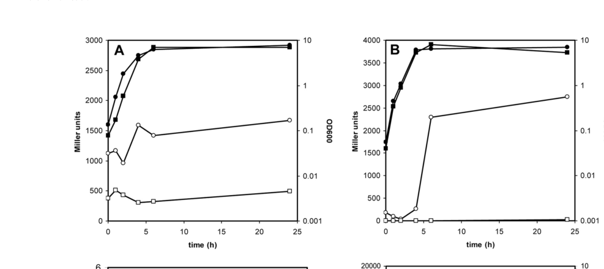

## Question

# Gene Research for Functional Annotation

## ⚠️ CRITICAL: Gene/Protein Identification Context

**BEFORE YOU BEGIN RESEARCH:** You MUST verify you are researching the CORRECT gene/protein. Gene symbols can be ambiguous, especially for less well-characterized genes from non-model organisms.

### Target Gene/Protein Identity (from UniProt):
- **UniProt Accession:** Q88FJ6
- **Protein Description:** RecName: Full=Response regulator GacA {ECO:0000256|ARBA:ARBA00072531}; AltName: Full=Global activator {ECO:0000256|ARBA:ARBA00075064};
- **Gene Information:** Name=uvrY {ECO:0000313|EMBL:AAN69683.1}; OrderedLocusNames=PP_4099 {ECO:0000313|EMBL:AAN69683.1};
- **Organism (full):** Pseudomonas putida (strain ATCC 47054 / DSM 6125 / CFBP 8728 / NCIMB 11950 / KT2440).
- **Protein Family:** Not specified in UniProt
- **Key Domains:** CheY-like_superfamily. (IPR011006); NreC/VraR/RcsB-like_REC. (IPR058245); Sig_transdc_resp-reg_C-effctor. (IPR016032); Sig_transdc_resp-reg_receiver. (IPR001789); Tscrpt_reg_LuxR_C. (IPR000792)

### MANDATORY VERIFICATION STEPS:

1. **Check if the gene symbol "uvrY" matches the protein description above**
2. **Verify the organism is correct:** Pseudomonas putida (strain ATCC 47054 / DSM 6125 / CFBP 8728 / NCIMB 11950 / KT2440).
3. **Check if protein family/domains align with what you find in literature**
4. **If you find literature for a DIFFERENT gene with the same or similar symbol, STOP**

### If Gene Symbol is Ambiguous or You Cannot Find Relevant Literature:

**DO NOT PROCEED WITH RESEARCH ON A DIFFERENT GENE.** Instead:
- State clearly: "The gene symbol 'uvrY' is ambiguous or literature is limited for this specific protein"
- Explain what you found (e.g., "Found extensive literature on a different gene with the same symbol in a different organism")
- Describe the protein based ONLY on the UniProt information provided above
- Suggest that the protein function can be inferred from domain/family information

### Research Target:

Please provide a comprehensive research report on the gene **uvrY** (gene ID: gacA, UniProt: Q88FJ6) in PSEPK.

The research report should be a detailed narrative explaining the function, biological processes, and localization of the gene product. Citations should be given for all claims.

You should prioritize authoritative reviews and primary scientific literature when conducting research. You can supplement
this with annotations you find in gene/protein databases, but these can be outdated or inaccurate.

We are specifically interested in the primary function of the gene - for enzymes, what reaction is catalyzed, and what is the substrate specificity? For transporters, what is the substrate? For structural proteins or adapters, what is the broader structural role? For signaling molecules, what is the role in the pathway.

We are interested in where in or outside the cell the gene product carries out its function.

We are also interested in the signaling or biochemical pathways in which the gene functions. We are less interested in broad pleiotropic effects, except where these elucidate the precise role.

Include evidence where possible. We are interested in both experimental evidence as well as inference from structure, evolution, or bioinformatic analysis. Precise studies should be prioritized over high-throughput, where available.

## Output

Question: You are an expert researcher providing comprehensive, well-cited information.

Provide detailed information focusing on:
1. Key concepts and definitions with current understanding
2. Recent developments and latest research (prioritize 2023-2024 sources)
3. Current applications and real-world implementations
4. Expert opinions and analysis from authoritative sources
5. Relevant statistics and data from recent studies

Format as a comprehensive research report with proper citations. Include URLs and publication dates where available.
Always prioritize recent, authoritative sources and provide specific citations for all major claims.

# Gene Research for Functional Annotation

## ⚠️ CRITICAL: Gene/Protein Identification Context

**BEFORE YOU BEGIN RESEARCH:** You MUST verify you are researching the CORRECT gene/protein. Gene symbols can be ambiguous, especially for less well-characterized genes from non-model organisms.

### Target Gene/Protein Identity (from UniProt):
- **UniProt Accession:** Q88FJ6
- **Protein Description:** RecName: Full=Response regulator GacA {ECO:0000256|ARBA:ARBA00072531}; AltName: Full=Global activator {ECO:0000256|ARBA:ARBA00075064};
- **Gene Information:** Name=uvrY {ECO:0000313|EMBL:AAN69683.1}; OrderedLocusNames=PP_4099 {ECO:0000313|EMBL:AAN69683.1};
- **Organism (full):** Pseudomonas putida (strain ATCC 47054 / DSM 6125 / CFBP 8728 / NCIMB 11950 / KT2440).
- **Protein Family:** Not specified in UniProt
- **Key Domains:** CheY-like_superfamily. (IPR011006); NreC/VraR/RcsB-like_REC. (IPR058245); Sig_transdc_resp-reg_C-effctor. (IPR016032); Sig_transdc_resp-reg_receiver. (IPR001789); Tscrpt_reg_LuxR_C. (IPR000792)

### MANDATORY VERIFICATION STEPS:

1. **Check if the gene symbol "uvrY" matches the protein description above**
2. **Verify the organism is correct:** Pseudomonas putida (strain ATCC 47054 / DSM 6125 / CFBP 8728 / NCIMB 11950 / KT2440).
3. **Check if protein family/domains align with what you find in literature**
4. **If you find literature for a DIFFERENT gene with the same or similar symbol, STOP**

### If Gene Symbol is Ambiguous or You Cannot Find Relevant Literature:

**DO NOT PROCEED WITH RESEARCH ON A DIFFERENT GENE.** Instead:
- State clearly: "The gene symbol 'uvrY' is ambiguous or literature is limited for this specific protein"
- Explain what you found (e.g., "Found extensive literature on a different gene with the same symbol in a different organism")
- Describe the protein based ONLY on the UniProt information provided above
- Suggest that the protein function can be inferred from domain/family information

### Research Target:

Please provide a comprehensive research report on the gene **uvrY** (gene ID: gacA, UniProt: Q88FJ6) in PSEPK.

The research report should be a detailed narrative explaining the function, biological processes, and localization of the gene product. Citations should be given for all claims.

You should prioritize authoritative reviews and primary scientific literature when conducting research. You can supplement
this with annotations you find in gene/protein databases, but these can be outdated or inaccurate.

We are specifically interested in the primary function of the gene - for enzymes, what reaction is catalyzed, and what is the substrate specificity? For transporters, what is the substrate? For structural proteins or adapters, what is the broader structural role? For signaling molecules, what is the role in the pathway.

We are interested in where in or outside the cell the gene product carries out its function.

We are also interested in the signaling or biochemical pathways in which the gene functions. We are less interested in broad pleiotropic effects, except where these elucidate the precise role.

Include evidence where possible. We are interested in both experimental evidence as well as inference from structure, evolution, or bioinformatic analysis. Precise studies should be prioritized over high-throughput, where available.

## Research report: *uvrY/gacA* (UniProt Q88FJ6; locus PP_4099) in *Pseudomonas putida* KT2440

### 1) Target verification (avoid gene-symbol ambiguity)
The UniProt accession Q88FJ6 corresponds to the response regulator **GacA** (also described as **UvrY**-family/BarA-UvrY analog), encoded by **PP_4099** in *Pseudomonas putida* strain KT2440. This identity is explicitly supported by (i) comparative regulatory-system cataloging that lists **gacA = PP_4099** and (ii) functional genomics work that refers to the **GacS–GacA (PP_1650–PP_4099)** two-component system and equates it to **BarA/UvrY** in *E. coli*. (udaondo2025transcriptionalregulatorysystems pages 20-22, eng2021highthroughputfitness pages 1-4)

### 2) Key concepts and current understanding (functional definition)
#### 2.1 Two-component systems and GacA’s role
GacA is the **response regulator** of the **GacS/GacA two-component system (TCS)**. In this canonical architecture, the membrane-associated sensor histidine kinase **GacS** transduces environmental/physiological signals by **phosphorylating** GacA, thereby activating it. (huertasrosales2016selfregulationandinterplay pages 3-5, selin2012regulatorymechanismsunderlying pages 36-42)

Rather than primarily controlling many protein-coding genes directly, activated GacA is best understood as a **master transcriptional activator of small regulatory RNAs (sRNAs)** in the **Gac–Rsm pathway**, which then exerts broad post-transcriptional control through RNA-binding proteins. (huertasrosales2016selfregulationandinterplay pages 3-5, rosales2017…delas pages 54-58)

#### 2.2 Domain architecture, phosphorylation, and DNA-level mechanism
Evidence from pseudomonad GacA-family regulators describes a typical response-regulator architecture with:
- **N-terminal receiver (REC) domain** with a conserved phospho-accepting Asp (reported as **Asp-54** in one Pseudomonas GacA model) and
- **C-terminal helix–turn–helix (HTH) DNA-binding domain**. (selin2012regulatorymechanismsunderlying pages 36-42)

GacS-dependent phosphorelay residues have been reported for one pseudomonad model (His-294, Asp-717, His-863 in GacS → GacA Asp-54), illustrating the multi-step phosphotransfer logic commonly seen in hybrid histidine kinases. (selin2012regulatorymechanismsunderlying pages 36-42)

At GacA-dependent sRNA promoters (shown in *P. fluorescens* and *P. chlororaphis*), a conserved palindromic **upstream activating sequence (UAS)** is required for rsmY/rsmZ activation; a consensus motif was reported as **TGTAAGNNATNNCTTACA** (example: TGTAAGCAAAGGCTTACT). Importantly, promoter activation typically requires **auxiliary factors** (e.g., PsrA; IHF) in addition to the UAS, implying that phosphorylated GacA is necessary but often not sufficient for full transcriptional activation. (humair2010gacacontrolledactivationof pages 1-2, selin2012regulatorymechanismsunderlying pages 116-124)

#### 2.3 Output layer: Rsm sRNAs and RsmA-family proteins (post-transcriptional regulation)
In the Gac–Rsm cascade, GacA-dependent sRNAs (commonly **RsmX/RsmY/RsmZ** in pseudomonads) function as **protein sponges**: they contain repeated **GGA** motifs that bind and sequester **RsmA/CsrA-family RNA-binding proteins**, relieving translational repression on target mRNAs. (humair2010gacacontrolledactivationof pages 1-2, huertasrosales2016selfregulationandinterplay pages 3-5, rosales2017…delas pages 58-63)

Rsm-family proteins thereby act as central post-transcriptional regulators (often by binding near ribosome-binding sites), linking GacA activation to broad shifts in lifestyle and metabolic allocation (e.g., motility vs biofilm; primary vs secondary metabolism). (huertasrosales2016selfregulationandinterplay pages 3-5)

### 3) Biological processes and pathways in *P. putida* KT2440
#### 3.1 Biofilm formation and adhesin control (LapA/LapF)
A well-defined *KT2440-specific* regulatory output of the Gac system is control of the large adhesins **LapA** and **LapF**, which function sequentially in biofilm development (LapA early adhesion; LapF later maturation). Both **lapA and lapF are under GacS/GacA control**. (martinezgil2014rolesofcyclic pages 1-2)

Transcriptional logic reported in KT2440:
- **lapA** promoter activity shows a transient early growth peak plus a second increase in stationary phase that is **RpoS-independent**.
- **lapF** transcription is induced late and is **RpoS-dependent**.
- Gac signaling contributes to this architecture, and **rpoS expression is abolished in a gacS mutant**, supporting an indirect route for Gac → lapF via RpoS. (martinezgil2014rolesofcyclic pages 1-2, martinezgil2014rolesofcyclic pages 6-8)

C-di-GMP integration is strikingly “opposite” for the two adhesins in KT2440:
- high intracellular **c-di-GMP increases lapA** promoter activity,
- but **decreases lapF** expression,
with **FleQ** required for c-di-GMP-dependent modulation of lapA and only minorly affecting lapF. (martinezgil2014rolesofcyclic pages 1-2, martinezgil2014rolesofcyclic pages 6-8)

Evidence from retrieved figure regions in Martínez-Gil et al. supports the qualitative claim that a **gacS mutant reduces lapA/lapF promoter activities (lapF nearly abolished)** and that **c-di-GMP has opposite effects** on lapA vs lapF; the same article provides a summary regulatory model integrating GacS/GacA, RpoS, FleQ, and c-di-GMP. (martinezgil2014rolesofcyclic media 16fac108, martinezgil2014rolesofcyclic media 38269669)

#### 3.2 Lifestyle switching and broader regulon themes
Across pseudomonads, the GacS/GacA–Rsm system is described as mediating a **metabolic switch from primary to secondary metabolism**, affecting enzyme synthesis/secretion, quorum-sensing-linked traits, motility, and biofilm formation/dispersal—consistent with a global “resource allocation” controller operating largely through the sRNA/Rsm post-transcriptional layer. (huertasrosales2016selfregulationandinterplay pages 3-5)

### 4) Cellular localization (where the gene product acts)
Direct subcellular localization experiments for KT2440 GacA were not retrieved in the current evidence set. However, the mechanistic model supported by multiple sources places:
- **GacS** as a **membrane-associated sensor histidine kinase**, and
- **GacA** as a **cytosolic response regulator** that, upon phosphorylation, acts as a DNA-binding transcription factor to activate transcription of sRNA genes. (selin2012regulatorymechanismsunderlying pages 36-42, humair2010gacacontrolledactivationof pages 1-2)

Thus, the most defensible localization statement from the available evidence is that GacA’s primary action occurs **inside the cell**, at the level of **transcriptional regulation (sRNA genes)** and subsequent **post-transcriptional control** mediated by Rsm proteins. (humair2010gacacontrolledactivationof pages 1-2, huertasrosales2016selfregulationandinterplay pages 3-5)

### 5) Recent developments (prioritizing 2023–2024)
#### 5.1 2023: Horizontal/extra-chromosomal modulation of the Rsm layer
A 2023 PLOS Biology study showed that a plasmid-encoded Rsm homolog (**RsmQ**) can (i) bind host **RsmY/RsmZ ncRNAs** and (ii) heterodimerize with host Rsm proteins, illustrating that the **Gac-Rsm output layer** can be rewired by mobile genetic elements and translational cross-talk. Quantitatively, ~50% of proteins differentially regulated by RsmQ had an upstream AnGGA motif and ~25% had a GGA motif; tested oligos showed >50% Rmax binding in SPR assays. Although not in KT2440 specifically, this work provides a modern mechanistic perspective on the modularity and vulnerability of the GacA→Rsm pathway to exogenous regulators. (thompson2023plasmidsmanipulatebacterial pages 10-11)

#### 5.2 2023: GacA as a global regulator of specialized metabolite output with KT2440 used as a chassis
A 2023 Nature Communications paper identified GacA as a positive regulator of the specialized metabolite **pseudoiodinine** in *Pseudomonas mosselii* 923, and demonstrated that the **psdABCDEFG** operon is sufficient to enable pseudoiodinine biosynthesis when expressed in **P. putida KT2440**. The study exemplifies a “KT2440 as production chassis” implementation connected to a GacA-controlled pathway. Quantitative outcomes included a **22.4-fold** improvement in pseudoiodinine production via combined engineering approaches, reaching an average yield of **42.5 mg/L**, and field/greenhouse results showing **>50% biocontrol efficiency** at concentrations **>5 μM**. (yang2023thenaturalpyrazolotriazine pages 9-10)

#### 5.3 2024: Biotechnology-oriented regulatory framing
A 2024 review focused on optimizing Pseudomonas lipopeptide production emphasizes that global regulators (including the Gac/Rsm layer acting through rsm sRNAs) are key “control points” for specialized metabolite yield optimization, strengthening the view that pathway engineering must account for global regulation rather than only biosynthetic genes. (huertasrosales2016selfregulationandinterplay pages 3-5)

### 6) Current applications and real-world implementations
#### 6.1 Industrial bioprocess optimization in KT2440: ΔgacA for improved product yields
A functional genomics/bioprocess study in *P. putida* KT2440 demonstrated that deleting **gacA** can improve production of a heterologous product under bioreactor conditions: indigoidine yield increased from **0.034 to 0.29 g indigoidine/g pCA** (an **8.5-fold** improvement), and the ΔgacA strain reached **29% MTY** under fed-batch. This provides a direct example where removing a global regulator (GacA) can reallocate carbon away from pleiotropic Gac-controlled behaviors (e.g., secondary metabolism/biofilm/iron-sequestration hypotheses) toward industrial product formation. (eng2021highthroughputfitness pages 16-19)

#### 6.2 Biofilm/adhesion control: targeting GacS/GacA to modulate LapA/LapF
Because LapA/LapF are under GacS/GacA control and c-di-GMP exerts opposing transcriptional effects on them, the GacA pathway is a plausible target to tune adhesion/biofilm phenotypes relevant to both environmental colonization and industrial biofouling/bioreactor performance. KT2440 data show that gacS disruption impairs biofilm formation (significant differences except at 24 h in one assay) and abolishes rpoS expression, with downstream consequences for lapF. (martinezgil2014rolesofcyclic pages 6-8)

#### 6.3 Biocontrol metabolites: GacA as a master regulator for antimicrobial pathway expression
Work in related pseudomonads indicates that GacS/GacA positively regulates production of diverse antimicrobial/biocontrol secondary metabolites and secreted enzymes (e.g., phenazines, HCN, PRN, DAPG, and others), typically via the Gac-Rsm cascade and interactions with QS. While this is not KT2440-specific, it is relevant to functional annotation because it connects the pathway to a coherent ecological function: regulating extracellular antagonism and community interactions. (selin2012regulatorymechanismsunderlying pages 36-42)

### 7) Expert analysis: what is the “primary function” of GacA in KT2440?
The most defensible primary function statement, grounded in the above evidence, is:

**GacA is a cytosolic, phosphorylation-activated response regulator that primarily controls gene expression indirectly by activating transcription of Rsm-family small RNAs; these sRNAs sequester RsmA-family translational repressors, thereby implementing a global post-transcriptional switch that reallocates bacterial resources between motile/planktonic growth and sessile/biofilm/secondary-metabolism behaviors.** (huertasrosales2016selfregulationandinterplay pages 3-5, humair2010gacacontrolledactivationof pages 1-2)

In *P. putida* KT2440, a well-supported mechanistic consequence is regulation of the LapA/LapF adhesin program and integration with c-di-GMP signaling and RpoS, linking GacA to biofilm developmental timing and population heterogeneity in adhesin expression. (martinezgil2014rolesofcyclic pages 1-2, martinezgil2014rolesofcyclic pages 6-8, martinezgil2014rolesofcyclic media 16fac108)

### 8) Key statistics and data highlights (from recent and authoritative studies)
- **Bioprocess (KT2440, ΔgacA):** 0.034 → 0.29 g indigoidine/g pCA (8.5×); 29% MTY under fed-batch. (eng2021highthroughputfitness pages 16-19)
- **Specialized metabolite (2023, GacA-regulated; KT2440 as chassis):** pseudoiodinine yield improved 22.4× to 42.5 mg/L via engineering; >50% biocontrol efficiency at >5 μM. (yang2023thenaturalpyrazolotriazine pages 9-10)
- **Regulatory motif:** rsm promoter UAS consensus TGTAAGNNATNNCTTACA; example TGTAAGCAAAGGCTTACT. (selin2012regulatorymechanismsunderlying pages 116-124)
- **Network robustness:** gacS and gacA mutant fitness phenocopy correlation r² = 0.997 in *P. putida* RB-TnSeq meta-analysis. (eng2021highthroughputfitness pages 16-19)

### 9) Summary table of evidence
The following table consolidates identity, mechanism, phenotypes, and applied outcomes.

| Topic | Key findings | Evidence type | Quantitative/statistical data (if any) | Organism/strain | Citation |
|---|---|---|---|---|---|
| Identity | PP_4099 in *Pseudomonas putida* KT2440 is the response regulator GacA, described as the cognate partner of GacS and as the Pseudomonad counterpart of the BarA/UvrY system in *E. coli*; this matches UniProt Q88FJ6 (uvrY/gacA). (udaondo2025transcriptionalregulatorysystems pages 20-22, eng2021highthroughputfitness pages 1-4) | Genome annotation; comparative functional genomics | RB-TnSeq meta-analysis showed strong gacS/gacA phenocopy in *P. putida* (r² = 0.997). (eng2021highthroughputfitness pages 16-19) | *P. putida* KT2440 | *Transcriptional Regulatory Systems in Pseudomonas* (2025) https://doi.org/10.3390/ijms26104677; *High Throughput Fitness Profiling Reveals Loss Of GacS-GacA Regulation Improves Indigoidine Production In Pseudomonas putida* (2021) https://doi.org/10.1101/2021.02.02.429437 |
| Domains | GacA-family proteins are described as having an N-terminal receiver (REC) domain with a conserved phospho-accepting Asp and a C-terminal helix-turn-helix DNA-binding domain; this is consistent with the UniProt/InterPro assignment for Q88FJ6. (selin2012regulatorymechanismsunderlying pages 36-42) | Domain/structure-function analysis; TCS review | Conserved phospho-accepting residue reported as Asp-54 in GacA-family regulator. (selin2012regulatorymechanismsunderlying pages 36-42) | Pseudomonads (applied by homology to KT2440 GacA) | *Regulatory Mechanisms Underlying Biological Control Activity of Pseudomonas chlororaphis PA23* (2012) DOI not available in gathered evidence |
| Activation mechanism | GacS autophosphorylates in response to unknown signals and transfers phosphate to GacA; phosphorylated GacA is proposed to act as a transcription factor, likely via dimerization, to activate downstream sRNA genes. (huertasrosales2016selfregulationandinterplay pages 3-5, humair2010gacacontrolledactivationof pages 1-2, selin2012regulatorymechanismsunderlying pages 36-42) | Genetic/regulatory model; promoter analysis | GacS phosphorelay residues reported in one pseudomonad model: His-294, Asp-717, His-863 → GacA Asp-54. (selin2012regulatorymechanismsunderlying pages 36-42) | *P. putida* KT2440 and related *Pseudomonas* spp. | *Self-Regulation and Interplay of Rsm Family Proteins Modulate the Lifestyle of Pseudomonas putida* (2016) https://doi.org/10.1128/AEM.01724-16; *GacA-Controlled Activation of Promoters for Small RNA Genes in Pseudomonas fluorescens* (2010) https://doi.org/10.1128/AEM.02014-09 |
| Direct regulatory output | Activated GacA primarily induces transcription of small RNAs in the Gac-Rsm pathway rather than controlling a large direct protein-coding regulon; in Pseudomonads these sRNAs are RsmX/RsmY/RsmZ. (huertasrosales2016selfregulationandinterplay pages 3-5, rosales2017…delas pages 54-58, rosales2017…delasa pages 54-58) | Genetic/regulatory cascade analysis | No KT2440-specific fold change available in gathered evidence. | *P. putida* KT2440 and related *Pseudomonas* spp. | *Self-Regulation and Interplay of Rsm Family Proteins Modulate the Lifestyle of Pseudomonas putida* (2016) https://doi.org/10.1128/AEM.01724-16 |
| sRNA promoter control | GacA-dependent rsmY/rsmZ promoters contain a conserved palindromic upstream activating sequence (UAS); the UAS is necessary but not sufficient, and auxiliary factors such as PsrA and IHF contribute to activation. (humair2010gacacontrolledactivationof pages 1-2, selin2012regulatorymechanismsunderlying pages 116-124) | Promoter dissection; in vitro DNA-binding/regulatory analysis | UAS length ~18 bp; consensus reported as TGTAAGNNATNNCTTACA; example rsmZ UAS sequence TGTAAGCAAAGGCTTACT. (selin2012regulatorymechanismsunderlying pages 116-124) | *P. fluorescens* CHA0; *P. chlororaphis* PA23 | *GacA-Controlled Activation of Promoters for Small RNA Genes in Pseudomonas fluorescens* (2010) https://doi.org/10.1128/AEM.02014-09 |
| Downstream post-transcriptional mechanism | RsmX/Y/Z sRNAs contain repeated unpaired GGA motifs and sequester RsmA/E-family RNA-binding proteins, relieving translational repression of target mRNAs; Rsm proteins act near ribosome-binding sites. (huertasrosales2016selfregulationandinterplay pages 3-5, rosales2017…delas pages 58-63, humair2010gacacontrolledactivationof pages 1-2) | RNA-protein regulatory mechanism; genetic analysis | RsmA/CsrA optimal dual-site spacing on RNA reported around ~18 nt in one structural model. (rosales2017…delas pages 58-63) | *P. putida* KT2440 and related *Pseudomonas* spp. | *Self-Regulation and Interplay of Rsm Family Proteins Modulate the Lifestyle of Pseudomonas putida* (2016) https://doi.org/10.1128/AEM.01724-16; *GacA-Controlled Activation of Promoters for Small RNA Genes in Pseudomonas fluorescens* (2010) https://doi.org/10.1128/AEM.02014-09 |
| Lifestyle regulon in KT2440 | In KT2440, GacS/GacA positively regulates both major adhesin genes, *lapA* and *lapF*; *lapA* shows an early transient promoter peak plus a stationary-phase rise, whereas *lapF* is induced late and depends on RpoS. (martinezgil2014rolesofcyclic pages 1-2, martinezgil2014rolesofcyclic pages 6-8) | Reporter fusions; transcriptional time-course; genetics | In a gacS mutant, *rpoS* expression was abolished; biofilm defect was statistically significant at all measured time points except 24 h. (martinezgil2014rolesofcyclic pages 6-8) | *P. putida* KT2440 | *Roles of Cyclic Di-GMP and the Gac System in Transcriptional Control of the Genes Coding for the Pseudomonas putida Adhesins LapA and LapF* (2014) https://doi.org/10.1128/JB.01287-13 |
| Biofilm and motility phenotypes | GacS/GacA-Rsm signaling is a key determinant of the planktonic-to-sessile transition, affecting motility, biofilm formation/dispersal, adhesin expression, exopolysaccharides, and c-di-GMP-linked lifestyle outputs. (huertasrosales2016selfregulationandinterplay pages 3-5, martinezgil2014rolesofcyclic pages 6-8) | Mutant phenotyping; lifestyle regulation analysis | In one related pseudomonad example, gac mutants showed ~150% increased swimming motility; KT2440 gacS mutants were impaired in biofilm formation. (martinezgilUnknownyearexpressionofthe pages 214-217, martinezgil2014rolesofcyclic pages 6-8) | *P. putida* KT2440 and related *Pseudomonas* spp. | *Self-Regulation and Interplay of Rsm Family Proteins Modulate the Lifestyle of Pseudomonas putida* (2016) https://doi.org/10.1128/AEM.01724-16; *Roles of Cyclic Di-GMP and the Gac System... LapA and LapF* (2014) https://doi.org/10.1128/JB.01287-13 |
| Interaction with c-di-GMP network | High intracellular c-di-GMP stimulates *lapA* transcription but represses *lapF*; FleQ is required for c-di-GMP-dependent activation of *lapA* and has only minor effects on *lapF*, placing GacA within a broader lifestyle network. (martinezgil2014rolesofcyclic pages 1-2, martinezgil2014rolesofcyclic pages 6-8) | Reporter analysis; regulatory genetics | Qualitative opposite effects on *lapA* vs *lapF*; no fold changes provided in gathered evidence. | *P. putida* KT2440 | *Roles of Cyclic Di-GMP and the Gac System in Transcriptional Control of the Genes Coding for the Pseudomonas putida Adhesins LapA and LapF* (2014) https://doi.org/10.1128/JB.01287-13 |
| Biotechnology application | Deleting *gacA* in KT2440 improved bioreactor fitness and strongly increased heterologous indigoidine production from p-coumarate, suggesting GacA diverts carbon to secondary metabolism/biofilm/iron-sequestration functions under these conditions. (eng2021highthroughputfitness pages 1-4, eng2021highthroughputfitness pages 16-19) | RB-TnSeq fitness profiling; strain reconstruction; fed-batch bioprocess | Yield improved from 0.034 to 0.29 g indigoidine/g pCA (8.5-fold); 29% MTY in fed-batch. (eng2021highthroughputfitness pages 16-19) | *P. putida* KT2440 | *High Throughput Fitness Profiling Reveals Loss Of GacS-GacA Regulation Improves Indigoidine Production In Pseudomonas putida* (2021) https://doi.org/10.1101/2021.02.02.429437 |
| Biocontrol/specialized metabolites | In a recent 2023 study, GacA positively regulated pseudoiodinine biosynthesis in *P. mosselii*; the full *psdABCDEFG* operon was sufficient for heterologous production in *P. putida* KT2440, illustrating a real implementation of a GacA-linked metabolite pathway in KT2440. (yang2023thenaturalpyrazolotriazine pages 9-10) | Transcriptomics; gene deletion/complementation; heterologous expression; field/greenhouse assays | Engineered strain achieved 22.4-fold higher pseudoiodinine production, 42.5 mg/L average yield; field biocontrol efficiency >50% at >5 μM. (yang2023thenaturalpyrazolotriazine pages 9-10) | *P. mosselii* 923; heterologous production in *P. putida* KT2440 | *The natural pyrazolotriazine pseudoiodinine from Pseudomonas mosselii 923 inhibits plant bacterial and fungal pathogens* (2023) https://doi.org/10.1038/s41467-023-36433-z |
| 2023 network insight | Plasmid-encoded RsmQ can bind host RsmY/RsmZ ncRNAs and heterodimerize with host Rsm proteins, showing that the Gac-Rsm output layer is vulnerable to horizontal regulatory crosstalk; this is relevant to engineered plasmid-bearing Pseudomonads. (thompson2023plasmidsmanipulatebacterial pages 10-11) | Structural modeling; SPR; BACTH interaction assays | ~50% of RsmQ-regulated proteins had upstream AnGGA motifs and ~25% had GGA motifs; five tested oligos showed >50% Rmax binding. (thompson2023plasmidsmanipulatebacterial pages 10-11) | *Pseudomonas fluorescens* SBW25/plasmid context | *Plasmids manipulate bacterial behaviour through translational regulatory crosstalk* (2023) https://doi.org/10.1371/journal.pbio.3001988 |

*Table: This table summarizes verified identity, mechanism, phenotype, and application evidence for GacA/UvrY (PP_4099; UniProt Q88FJ6) in *Pseudomonas putida* KT2440 and closely related pseudomonads. It highlights where evidence is KT2440-specific versus inferred from conserved Gac-Rsm biology.*

### 10) Limitations of this evidence set
- KT2440-specific direct measurements of GacA DNA binding to sRNA promoters (e.g., EMSA/ChIP) and direct subcellular localization experiments were not retrieved here; promoter mechanistic detail is primarily from closely related pseudomonads (e.g., *P. fluorescens*, *P. chlororaphis*) and used as conservation-based inference. (humair2010gacacontrolledactivationof pages 1-2, selin2012regulatorymechanismsunderlying pages 116-124, selin2012regulatorymechanismsunderlying pages 36-42)
- Downstream effects beyond LapA/LapF in KT2440 (e.g., specific metabolite clusters under GacA control) are not comprehensively covered in the retrieved corpus; the report therefore emphasizes the strongest KT2440-supported pathway outputs and uses recent 2023–2024 work for broader system context.

References

1. (udaondo2025transcriptionalregulatorysystems pages 20-22): Zulema Udaondo, Kelsey Aguirre Schilder, Ana Rosa Márquez Blesa, Mireia Tena-Garitaonaindia, José Canto Mangana, and Abdelali Daddaoua. Transcriptional regulatory systems in pseudomonas: a comparative analysis of helix-turn-helix domains and two-component signal transduction networks. International Journal of Molecular Sciences, 26:4677, May 2025. URL: https://doi.org/10.3390/ijms26104677, doi:10.3390/ijms26104677. This article has 1 citations.

2. (eng2021highthroughputfitness pages 1-4): Thomas Eng, Deepanwita Banerjee, Andrew K. Lau, Emily Bowden, Robin A. Herbert, Jessica Trinh, Jan-Philip Prahl, Adam Deutschbauer, Deepti Tanjore, and Aindrila Mukhopadhyay. High throughput fitness profiling reveals loss of gacs-gaca regulation improves indigoidine production in pseudomonas putida. bioRxiv, Feb 2021. URL: https://doi.org/10.1101/2021.02.02.429437, doi:10.1101/2021.02.02.429437. This article has 2 citations.

3. (huertasrosales2016selfregulationandinterplay pages 3-5): Óscar Huertas-Rosales, María Isabel Ramos-González, and Manuel Espinosa-Urgel. Self-regulation and interplay of rsm family proteins modulate the lifestyle of pseudomonas putida. Applied and Environmental Microbiology, 82:5673-5686, Sep 2016. URL: https://doi.org/10.1128/aem.01724-16, doi:10.1128/aem.01724-16. This article has 31 citations and is from a peer-reviewed journal.

4. (selin2012regulatorymechanismsunderlying pages 36-42): CL Selin. Regulatory mechanisms underlying biological control activity of pseudomonas chlororaphis pa23. Unknown journal, 2012.

5. (rosales2017…delas pages 54-58): O Huertas Rosales. … de las proteinas reguladoras de la familia rsm en la señalización mediada por diguanilato cíclico y el modo de vida multicelular de pseudomonas putida kt2440. Unknown journal, 2017.

6. (humair2010gacacontrolledactivationof pages 1-2): Bérénice Humair, Birgit Wackwitz, and Dieter Haas. Gaca-controlled activation of promoters for small rna genes in <i>pseudomonas fluorescens</i>. Mar 2010. URL: https://doi.org/10.1128/aem.02014-09, doi:10.1128/aem.02014-09. This article has 93 citations and is from a peer-reviewed journal.

7. (selin2012regulatorymechanismsunderlying pages 116-124): CL Selin. Regulatory mechanisms underlying biological control activity of pseudomonas chlororaphis pa23. Unknown journal, 2012.

8. (rosales2017…delas pages 58-63): O Huertas Rosales. … de las proteinas reguladoras de la familia rsm en la señalización mediada por diguanilato cíclico y el modo de vida multicelular de pseudomonas putida kt2440. Unknown journal, 2017.

9. (martinezgil2014rolesofcyclic pages 1-2): Marta Martínez-Gil, María Isabel Ramos-González, and Manuel Espinosa-Urgel. Roles of cyclic di-gmp and the gac system in transcriptional control of the genes coding for the pseudomonas putida adhesins lapa and lapf. Journal of Bacteriology, 196:1484-1495, Apr 2014. URL: https://doi.org/10.1128/jb.01287-13, doi:10.1128/jb.01287-13. This article has 102 citations and is from a peer-reviewed journal.

10. (martinezgil2014rolesofcyclic pages 6-8): Marta Martínez-Gil, María Isabel Ramos-González, and Manuel Espinosa-Urgel. Roles of cyclic di-gmp and the gac system in transcriptional control of the genes coding for the pseudomonas putida adhesins lapa and lapf. Journal of Bacteriology, 196:1484-1495, Apr 2014. URL: https://doi.org/10.1128/jb.01287-13, doi:10.1128/jb.01287-13. This article has 102 citations and is from a peer-reviewed journal.

11. (martinezgil2014rolesofcyclic media 16fac108): Marta Martínez-Gil, María Isabel Ramos-González, and Manuel Espinosa-Urgel. Roles of cyclic di-gmp and the gac system in transcriptional control of the genes coding for the pseudomonas putida adhesins lapa and lapf. Journal of Bacteriology, 196:1484-1495, Apr 2014. URL: https://doi.org/10.1128/jb.01287-13, doi:10.1128/jb.01287-13. This article has 102 citations and is from a peer-reviewed journal.

12. (martinezgil2014rolesofcyclic media 38269669): Marta Martínez-Gil, María Isabel Ramos-González, and Manuel Espinosa-Urgel. Roles of cyclic di-gmp and the gac system in transcriptional control of the genes coding for the pseudomonas putida adhesins lapa and lapf. Journal of Bacteriology, 196:1484-1495, Apr 2014. URL: https://doi.org/10.1128/jb.01287-13, doi:10.1128/jb.01287-13. This article has 102 citations and is from a peer-reviewed journal.

13. (thompson2023plasmidsmanipulatebacterial pages 10-11): Catriona M. A. Thompson, James P. J. Hall, Govind Chandra, Carlo Martins, Gerhard Saalbach, Supakan Panturat, Susannah M. Bird, Samuel Ford, Richard H. Little, Ainelen Piazza, Ellie Harrison, Robert W. Jackson, Michael A. Brockhurst, and Jacob G. Malone. Plasmids manipulate bacterial behaviour through translational regulatory crosstalk. Feb 2023. URL: https://doi.org/10.1371/journal.pbio.3001988, doi:10.1371/journal.pbio.3001988. This article has 35 citations and is from a highest quality peer-reviewed journal.

14. (yang2023thenaturalpyrazolotriazine pages 9-10): Ruihuan Yang, Qing Shi, Tingting Huang, Yichao Yan, Shengzhang Li, Yuan Fang, Ying Li, Linlin Liu, Longyu Liu, Xiaozheng Wang, Yongzheng Peng, Jiangbo Fan, Lifang Zou, Shuangjun Lin, and Gongyou Chen. The natural pyrazolotriazine pseudoiodinine from pseudomonas mosselii 923 inhibits plant bacterial and fungal pathogens. Nature Communications, Feb 2023. URL: https://doi.org/10.1038/s41467-023-36433-z, doi:10.1038/s41467-023-36433-z. This article has 107 citations and is from a highest quality peer-reviewed journal.

15. (eng2021highthroughputfitness pages 16-19): Thomas Eng, Deepanwita Banerjee, Andrew K. Lau, Emily Bowden, Robin A. Herbert, Jessica Trinh, Jan-Philip Prahl, Adam Deutschbauer, Deepti Tanjore, and Aindrila Mukhopadhyay. High throughput fitness profiling reveals loss of gacs-gaca regulation improves indigoidine production in pseudomonas putida. bioRxiv, Feb 2021. URL: https://doi.org/10.1101/2021.02.02.429437, doi:10.1101/2021.02.02.429437. This article has 2 citations.

16. (rosales2017…delasa pages 54-58): O Huertas Rosales. … de las proteinas reguladoras de la familia rsm en la señalización mediada por diguanilato cíclico y el modo de vida multicelular de pseudomonas putida kt2440. Unknown journal, 2017.

17. (martinezgilUnknownyearexpressionofthe pages 214-217): M Martínez-Gil. Expression of the large p. putida adhesins lapa and lapf is part of a complex global regulatory network governing biofilm formation. Unknown journal, Unknown year.

## Artifacts

- [Edison artifact artifact-00](gacA-deep-research-falcon_artifacts/artifact-00.md)

## Citations

1. selin2012regulatorymechanismsunderlying pages 36-42
2. huertasrosales2016selfregulationandinterplay pages 3-5
3. martinezgil2014rolesofcyclic pages 1-2
4. thompson2023plasmidsmanipulatebacterial pages 10-11
5. yang2023thenaturalpyrazolotriazine pages 9-10
6. eng2021highthroughputfitness pages 16-19
7. martinezgil2014rolesofcyclic pages 6-8
8. selin2012regulatorymechanismsunderlying pages 116-124
9. udaondo2025transcriptionalregulatorysystems pages 20-22
10. eng2021highthroughputfitness pages 1-4
11. humair2010gacacontrolledactivationof pages 1-2
12. https://doi.org/10.3390/ijms26104677;
13. https://doi.org/10.1101/2021.02.02.429437
14. https://doi.org/10.1128/AEM.01724-16;
15. https://doi.org/10.1128/AEM.02014-09
16. https://doi.org/10.1128/AEM.01724-16
17. https://doi.org/10.1128/JB.01287-13
18. https://doi.org/10.1038/s41467-023-36433-z
19. https://doi.org/10.1371/journal.pbio.3001988
20. https://doi.org/10.3390/ijms26104677,
21. https://doi.org/10.1101/2021.02.02.429437,
22. https://doi.org/10.1128/aem.01724-16,
23. https://doi.org/10.1128/aem.02014-09,
24. https://doi.org/10.1128/jb.01287-13,
25. https://doi.org/10.1371/journal.pbio.3001988,
26. https://doi.org/10.1038/s41467-023-36433-z,