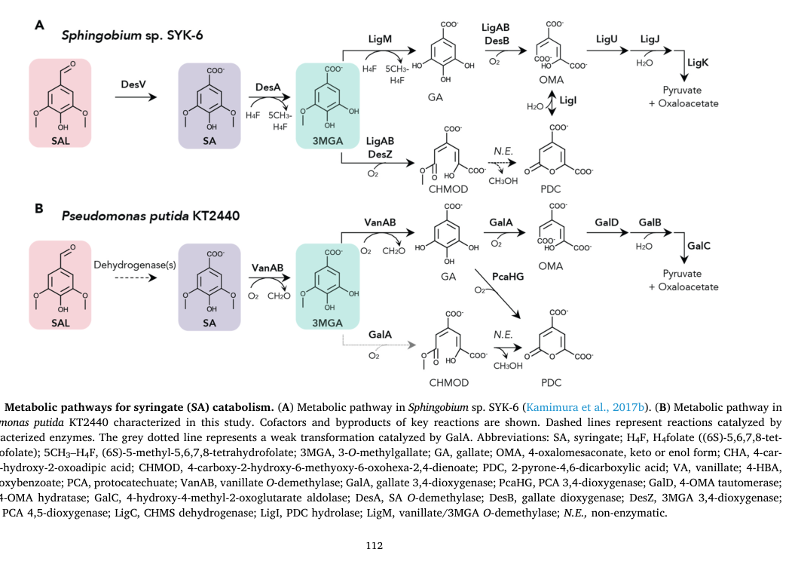

## Question

# Gene Research for Functional Annotation

## ⚠️ CRITICAL: Gene/Protein Identification Context

**BEFORE YOU BEGIN RESEARCH:** You MUST verify you are researching the CORRECT gene/protein. Gene symbols can be ambiguous, especially for less well-characterized genes from non-model organisms.

### Target Gene/Protein Identity (from UniProt):
- **UniProt Accession:** Q88JX5
- **Protein Description:** RecName: Full=Gallate dioxygenase; EC=1.13.11.57; AltName: Full=Gallate degradation protein A;
- **Gene Information:** Name=galA; OrderedLocusNames=PP_2518;
- **Organism (full):** Pseudomonas putida (strain ATCC 47054 / DSM 6125 / CFBP 8728 / NCIMB 11950 / KT2440).
- **Protein Family:** Belongs to the LigB/MhpB extradiol dioxygenase family.
- **Key Domains:** Gallate_dioxygenase_C. (IPR034940); LigA_sf. (IPR036622); Xdiol_dOase_LigA. (IPR011986); Xdiol_dOase_suB. (IPR004183); LigA (PF07746)

### MANDATORY VERIFICATION STEPS:

1. **Check if the gene symbol "galA" matches the protein description above**
2. **Verify the organism is correct:** Pseudomonas putida (strain ATCC 47054 / DSM 6125 / CFBP 8728 / NCIMB 11950 / KT2440).
3. **Check if protein family/domains align with what you find in literature**
4. **If you find literature for a DIFFERENT gene with the same or similar symbol, STOP**

### If Gene Symbol is Ambiguous or You Cannot Find Relevant Literature:

**DO NOT PROCEED WITH RESEARCH ON A DIFFERENT GENE.** Instead:
- State clearly: "The gene symbol 'galA' is ambiguous or literature is limited for this specific protein"
- Explain what you found (e.g., "Found extensive literature on a different gene with the same symbol in a different organism")
- Describe the protein based ONLY on the UniProt information provided above
- Suggest that the protein function can be inferred from domain/family information

### Research Target:

Please provide a comprehensive research report on the gene **galA** (gene ID: galA, UniProt: Q88JX5) in PSEPK.

The research report should be a detailed narrative explaining the function, biological processes, and localization of the gene product. Citations should be given for all claims.

You should prioritize authoritative reviews and primary scientific literature when conducting research. You can supplement
this with annotations you find in gene/protein databases, but these can be outdated or inaccurate.

We are specifically interested in the primary function of the gene - for enzymes, what reaction is catalyzed, and what is the substrate specificity? For transporters, what is the substrate? For structural proteins or adapters, what is the broader structural role? For signaling molecules, what is the role in the pathway.

We are interested in where in or outside the cell the gene product carries out its function.

We are also interested in the signaling or biochemical pathways in which the gene functions. We are less interested in broad pleiotropic effects, except where these elucidate the precise role.

Include evidence where possible. We are interested in both experimental evidence as well as inference from structure, evolution, or bioinformatic analysis. Precise studies should be prioritized over high-throughput, where available.

## Output

Question: You are an expert researcher providing comprehensive, well-cited information.

Provide detailed information focusing on:
1. Key concepts and definitions with current understanding
2. Recent developments and latest research (prioritize 2023-2024 sources)
3. Current applications and real-world implementations
4. Expert opinions and analysis from authoritative sources
5. Relevant statistics and data from recent studies

Format as a comprehensive research report with proper citations. Include URLs and publication dates where available.
Always prioritize recent, authoritative sources and provide specific citations for all major claims.

# Gene Research for Functional Annotation

## ⚠️ CRITICAL: Gene/Protein Identification Context

**BEFORE YOU BEGIN RESEARCH:** You MUST verify you are researching the CORRECT gene/protein. Gene symbols can be ambiguous, especially for less well-characterized genes from non-model organisms.

### Target Gene/Protein Identity (from UniProt):
- **UniProt Accession:** Q88JX5
- **Protein Description:** RecName: Full=Gallate dioxygenase; EC=1.13.11.57; AltName: Full=Gallate degradation protein A;
- **Gene Information:** Name=galA; OrderedLocusNames=PP_2518;
- **Organism (full):** Pseudomonas putida (strain ATCC 47054 / DSM 6125 / CFBP 8728 / NCIMB 11950 / KT2440).
- **Protein Family:** Belongs to the LigB/MhpB extradiol dioxygenase family.
- **Key Domains:** Gallate_dioxygenase_C. (IPR034940); LigA_sf. (IPR036622); Xdiol_dOase_LigA. (IPR011986); Xdiol_dOase_suB. (IPR004183); LigA (PF07746)

### MANDATORY VERIFICATION STEPS:

1. **Check if the gene symbol "galA" matches the protein description above**
2. **Verify the organism is correct:** Pseudomonas putida (strain ATCC 47054 / DSM 6125 / CFBP 8728 / NCIMB 11950 / KT2440).
3. **Check if protein family/domains align with what you find in literature**
4. **If you find literature for a DIFFERENT gene with the same or similar symbol, STOP**

### If Gene Symbol is Ambiguous or You Cannot Find Relevant Literature:

**DO NOT PROCEED WITH RESEARCH ON A DIFFERENT GENE.** Instead:
- State clearly: "The gene symbol 'galA' is ambiguous or literature is limited for this specific protein"
- Explain what you found (e.g., "Found extensive literature on a different gene with the same symbol in a different organism")
- Describe the protein based ONLY on the UniProt information provided above
- Suggest that the protein function can be inferred from domain/family information

### Research Target:

Please provide a comprehensive research report on the gene **galA** (gene ID: galA, UniProt: Q88JX5) in PSEPK.

The research report should be a detailed narrative explaining the function, biological processes, and localization of the gene product. Citations should be given for all claims.

You should prioritize authoritative reviews and primary scientific literature when conducting research. You can supplement
this with annotations you find in gene/protein databases, but these can be outdated or inaccurate.

We are specifically interested in the primary function of the gene - for enzymes, what reaction is catalyzed, and what is the substrate specificity? For transporters, what is the substrate? For structural proteins or adapters, what is the broader structural role? For signaling molecules, what is the role in the pathway.

We are interested in where in or outside the cell the gene product carries out its function.

We are also interested in the signaling or biochemical pathways in which the gene functions. We are less interested in broad pleiotropic effects, except where these elucidate the precise role.

Include evidence where possible. We are interested in both experimental evidence as well as inference from structure, evolution, or bioinformatic analysis. Precise studies should be prioritized over high-throughput, where available.

## Research report: *Pseudomonas putida* KT2440 **galA** (UniProt **Q88JX5**, locus **PP_2518**) — gallate/gallic-acid dioxygenase

### 0) Mandatory target verification (gene/protein identity)
The literature retrieved here consistently maps **GalA** to *Pseudomonas putida* strain **KT2440** locus **PP_2518** and describes it as a **gallate (gallic acid) ring-cleaving dioxygenase** in the gallic-acid utilization pathway. In particular, (i) a 2023 metabolic engineering study explicitly places **GalA** in the **galTAP** operon and calls it the “gallic acid dioxygenase” responsible for the first step of gallic acid degradation, (ii) a 2025 lignin-upgrading study explicitly identifies GalA from *P. putida* KT2440 as a gallate dioxygenase from **PP_2518**, and (iii) a pathway figure in a highly cited 2021 study depicts **GalA (gallate 3,4-dioxygenase)** converting gallate to **4-oxalomesaconate (OMA)** in KT2440. These statements align with the UniProt description provided (Q88JX5; **galA**; **PP_2518**; gallate dioxygenase). (dias2023fromdegraderto pages 4-6, tuomela2025conversionandupgrading pages 4-7, notonier2021metabolismofsyringyl media 3fdc80ac)

### 1) Key concepts and current understanding

#### 1.1 Definitions
- **Gallic acid / gallate**: in the KT2440 literature, gallate is used as the catabolic intermediate derived from plant/lignin aromatics such as **syringate**, often via O-demethylation steps; it is then processed by aromatic-ring cleavage. (notonier2021metabolismofsyringyl pages 1-2, notonier2021metabolismofsyringyl media 3fdc80ac)
- **Extradiol dioxygenase**: GalA is described as an **extradiol (meta-cleavage) ring-fission dioxygenase**, i.e., a non-heme iron-dependent enzyme that cleaves catecholic/aromatic rings adjacent to hydroxyl substituents, initiating funneling into central metabolism. In KT2440, GalA is the **native gallate-cleaving extradiol dioxygenase**. (dumalo2020dioxygenasesinthe pages 66-71, notonier2021metabolismofsyringyl pages 1-2)

#### 1.2 Role of GalA in KT2440 aromatic metabolism
A convergent depiction across studies is that **GalA catalyzes the ring-opening step of gallate/gallic acid catabolism**, generating **4-oxalomesaconate (OMA)**, which is further processed by **GalD/GalB/GalC** to yield **pyruvate** and **oxaloacetate** that enter central metabolism (TCA cycle). (notonier2021metabolismofsyringyl pages 2-3, notonier2021metabolismofsyringyl media 3fdc80ac, ookawa2025catabolicsystemof pages 1-2)

### 2) Biochemical function: reaction, substrate specificity, and mechanism-related evidence

#### 2.1 Primary reaction catalyzed
Pathway-level evidence (including a curated pathway figure) supports that in *P. putida* KT2440:
- **Gallate (GA) → 4-oxalomesaconate (OMA)** catalyzed by **GalA (gallate 3,4-dioxygenase)**. (notonier2021metabolismofsyringyl media 3fdc80ac)

Downstream reactions (not catalyzed by GalA, but essential for functional annotation of the pathway context) include:
- **OMA →** processed via **GalD (OMA tautomerase)**, **GalB (hydratase; sometimes described as KCH hydratase/OMA hydratase depending on nomenclature)**, and **GalC (aldolase acting on downstream ring-opened intermediates)**, yielding **pyruvate and oxaloacetate**. (ookawa2025catabolicsystemof pages 1-2, notonier2021metabolismofsyringyl pages 2-3, notonier2021metabolismofsyringyl media 3fdc80ac)

#### 2.2 Substrate scope and specificity
The best-supported physiological substrate is **gallate (gallic acid; 3,4,5-trihydroxybenzoate)**; in vitro steady-state kinetics and in vivo pathway roles are reported for gallate cleavage. (dumalo2020dioxygenasesinthe pages 66-71, notonier2021metabolismofsyringyl media 3fdc80ac)

GalA shows only **very weak/inefficient activity on 3-O-methylgallate (3-MGA)** in vitro (too slow to measure steady-state parameters), but LC-Q-TOF-MS detected GalA-dependent formation of ring-opened products consistent with formation of **CHMOD** and **PDC** (2-pyrone-4,6-dicarboxylate). (dumalo2020dioxygenasesinthe pages 66-71)

#### 2.3 Cofactor/metal dependence and enzyme performance statistics
A detailed biochemical characterization of KT2440 GalA reported:
- **Apparent kinetic parameters for gallate cleavage**: **kcat ≈ 52 s−1**, **Km ≈ 59 μM**, and **kcat/Km ≈ 9 × 10^5 s−1·M−1**. (dumalo2020dioxygenasesinthe pages 66-71)
- **Iron occupancy after reconstitution**: ~**0.5 Fe2+ per protomer**, consistent with a non-heme Fe2+-dependent extradiol dioxygenase. (dumalo2020dioxygenasesinthe pages 66-71)
- **Turnover-associated oxidative inactivation** with **partition ratio ≈ 1860**, indicating susceptibility to self-inactivation during catalysis (relevant to pathway engineering). (dumalo2020dioxygenasesinthe pages 66-71)

### 3) Pathway context: gallic acid/gallate and syringyl-lignin-derived aromatics

#### 3.1 Upstream steps (example: syringate to gallate)
In KT2440, a prominent lignin-relevant route proceeds through:
- **Syringate → 3-O-methylgallate (3MGA) → gallate (GA)** via **VanAB** (O-demethylation), then gallate is processed by **GalA** to **OMA**. (notonier2021metabolismofsyringyl media 3fdc80ac)

#### 3.2 Relationship to PDC production chemistry
Several sources highlight chemical/enzymatic links between OMA, CHMOD, and **PDC (2-pyrone-4,6-dicarboxylate)**. The KT2440 pathway schematic shows a side route where GalA-mediated transformations can lead to CHMOD, which can non-enzymatically convert to PDC, relevant for lignin-valorization processes targeting PDC as a product. (notonier2021metabolismofsyringyl pages 1-2, notonier2021metabolismofsyringyl media 3fdc80ac)

### 4) Genomic/operon organization and regulation (in vivo functional context)

#### 4.1 Operon context and transport
Multiple sources describe a clustered gene system for gallic acid utilization in KT2440:
- **galTAP operon**: includes **GalA** and transport-associated genes; **galT** encodes an **inner-membrane gallic-acid transporter**, and **galP** encodes an **outer-membrane porin**. GalA is described as the enzyme responsible for the **first step** of gallic acid degradation. (dias2023fromdegraderto pages 4-6)
- A complementary operon, **galBCD**, encodes downstream catabolic enzymes (GalB/GalC/GalD). (ookawa2025catabolicsystemof pages 1-2)

#### 4.2 Transcriptional regulation and the identity of the true inducer
A major recent mechanistic advance (2023) is clarification that GalR-regulated induction by extracellular gallic acid is mediated by a **metabolic intermediate** rather than gallic acid itself:
- **GalR** (a LysR-family regulator) functions as a transcriptional activator of the gal catabolic genes when gallic acid is supplied. (kutraite2023developmentandapplication pages 2-3)
- Activation of GalR-dependent promoters **requires galA activity** and the formation of **4-oxalomesaconate (4-OMA)**; **4-OMA** is identified as the **effector molecule** that interacts with GalR to activate transcription. (kutraite2023developmentandapplication pages 1-2)

This “metabolite-as-inducer” logic is important for functional annotation because it ties GalA’s catalytic output (OMA) directly to transcriptional control, explaining why heterologous hosts require galA for GalR-based sensors to work. (kutraite2023developmentandapplication pages 1-2, kutraite2023developmentandapplication pages 3-4)

### 5) Cellular localization (what is known vs. what is not)
None of the retrieved sources explicitly states a **subcellular compartment** for GalA (e.g., cytosol vs periplasm) or discusses signal peptides. (kutraite2023developmentandapplication pages 1-2, dumalo2020dioxygenasesinthe pages 32-39)

However, the pathway architecture implies that gallic acid is transported into the cell via **GalP (outer membrane)** and **GalT (inner membrane)** and then enzymatically converted by cytosolic catabolic enzymes (GalA/GalBCD). This is an inference from transport and pathway descriptions rather than direct localization experiments. (dias2023fromdegraderto pages 4-6, kutraite2023developmentandapplication pages 2-3)

### 6) Recent developments and latest research (prioritizing 2023–2024)

#### 6.1 2023 — GalA-dependent regulatory effector discovery and biosensor development
Kutraite & Malys (ACS Synthetic Biology; Feb 2023; https://doi.org/10.1021/acssynbio.2c00537) developed GalR-based whole-cell biosensors and demonstrated:
- **galA is required** for GalR-system activation in non-native hosts; without GalA, gallic acid does not induce the system. (kutraite2023developmentandapplication pages 1-2, kutraite2023developmentandapplication pages 4-6)
- **4-OMA is the identified GalR effector**, linking GalA’s enzymatic product to transcriptional activation. (kutraite2023developmentandapplication pages 1-2, kutraite2023developmentandapplication pages 3-4)
- Quantitative biosensor performance includes **limit of detection** of **9.7 μM** (KT2440-based BS1) and **78 μM** (E. coli-based BS2), with tunable response ranges up to ~1.25 mM. (kutraite2023developmentandapplication pages 4-6, kutraite2023developmentandapplication pages 6-7)

#### 6.2 2023 — Reversing gallic-acid catabolism for production
Dias et al. (International Microbiology; 2023 online / print issue Nov 2023; https://doi.org/10.1007/s10123-022-00282-5) engineered KT2440 to *prevent* gallic acid degradation by deleting **galTAPR** and **pcaHG**, enabling **gallic acid production**; they report a final concentration of **346.7 ± 0.004 mg/L gallic acid after 72 h** (shaker assays) from a glycerol-based strategy. (dias2023fromdegraderto pages 4-6)

### 7) Current applications and real-world implementations

#### 7.1 Synthetic biology: whole-cell gallic-acid biosensing (real sample)
The GalR/galA system was implemented as a whole-cell sensor in *P. putida* KT2440 and applied to **green tea (Camellia sinensis) leaf extracts**, quantifying gallic acid and demonstrating that the biosensor could operate at higher dilutions than an HPLC comparison. For example, the reported estimate was **0.148 mM** gallic acid in a **160-fold diluted** extract (equivalent to **2.71 mg/g dry weight** green tea), and the biosensor remained usable up to **1280-fold dilution**. (kutraite2023developmentandapplication pages 6-7)

#### 7.2 Biomanufacturing/lignin valorization: funneling to PDC
Notonier et al. (Metabolic Engineering; May 2021; https://doi.org/10.1016/j.ymben.2021.02.005) demonstrate lignin-related pathway engineering in KT2440 to produce **PDC**. A key engineering rationale was that the native KT2440 **GalA is potently inactivated by 3-O-methylgallate (3MGA)**; using alternative enzyme choices (e.g., LigAB) enabled high conversion, including a reported **93% conversion** of a lignin monomer mixture to PDC in an engineered strain. (notonier2021metabolismofsyringyl pages 1-2)

#### 7.3 Heterologous pathway deployment
KT2440 **galA (PP_2518)** has been used heterologously: expression of GalA in *Acinetobacter baylyi* ADP1 enabled conversion of syringate-derived intermediates toward **PDC**, highlighting GalA as a transferable catalytic module in aromatic upgrading pathways. (tuomela2025conversionandupgrading pages 4-7)

### 8) Physiological evidence from genetics (in vivo functional annotation)
Genetic evidence supports GalA’s central catabolic role:
- Deletion of **galA** in engineered KT2440 backgrounds is reported to **block gallate transformation to central metabolites**, consistent with GalA catalyzing the gateway ring-cleavage step; such deletions are used to divert flux toward PDC accumulation rather than complete mineralization. (dumalo2020dioxygenasesinthe pages 32-39)
- Complementation/overexpression experiments show that plasmid-expressed GalA in a KT2440 background can deplete 3MGA and yield detectable PDC in vivo, even though in vitro turnover of 3MGA is extremely slow—illustrating that cellular context (transport, cofactors, competing reactions) can change effective pathway outcomes. (dumalo2020dioxygenasesinthe pages 32-39)

### 9) Summary of key quantitative data
> GalA from *Pseudomonas putida* KT2440 cleaves gallate with apparent kinetic parameters **kcat ≈ 52 s^-1**, **Km ≈ 59 µM**, and **kcat/Km ≈ 9 × 10^5 s^-1·M^-1**; reconstituted enzyme contained about **0.5 Fe^2+ per protomer**. (dumalo2020dioxygenasesinthe pages 66-71)
>
> During gallate turnover, GalA shows oxidative inactivation with a reported **partition ratio ≈ 1860** and a turnover-dependent inactivation rate noted for **40 nM enzyme with 500 µM gallate** of **2.7 ± 0.2 × 10^-2 s^-1**. (dumalo2020dioxygenasesinthe pages 66-71)
>
> GalA also transforms **3-O-methylgallate (3-MGA)** only very inefficiently; steady-state parameters could not be measured, but LC-Q-TOF-MS detected **CHMOD** and **PDC** formation as products. (dumalo2020dioxygenasesinthe pages 66-71, notonier2021metabolismofsyringyl media 3fdc80ac)
>
> In the 2023 GalR/galA whole-cell biosensor work, the GalR system required **galA-dependent formation of 4-oxalomesaconate (4-OMA)**, identified as the activating effector for GalR. (kutraite2023developmentandapplication pages 1-2, kutraite2023developmentandapplication pages 3-4)
>
> The native *P. putida*-based biosensor (**BS1**) had a reported **limit of detection of 9.7 µM gallic acid** and tunable response ranges reported as **0.312–1.25 mM** and, in a separate summary, **0.039–1.25 mM**; the heterologous *E. coli*-based biosensor (**BS2**) had **LoD 78 µM** and tunable response from **0.078–1.25 mM**. (kutraite2023developmentandapplication pages 4-6, kutraite2023developmentandapplication pages 6-7)
>
> Reported Hill-fit parameters for BS1 were **Km = 1.459 ± 0.44 mM, Hill = 1.381 ± 0.14 (6 h)** and **Km = 0.706 ± 0.09 mM, Hill = 1.394 ± 0.07 (12 h)**; for BS2 they were **Km = 0.868 ± 0.19 mM, Hill = 1.817 ± 0.32 (6 h)** and **Km = 0.525 ± 0.01 mM, Hill = 2.321 ± 0.13 (12 h)**. (kutraite2023developmentandapplication pages 6-7)
>
> Dynamic range values reported for the biosensors included roughly **112-fold and 2138-fold induction for BS1** and **75-fold and 162-fold for BS2** at different sampling times; promoter constructs in minimal medium also showed up to **~72.3-fold** and **~45.6-fold** induction depending on architecture. (kutraite2023developmentandapplication pages 2-3, kutraite2023developmentandapplication pages 4-6)
>
> For a real-sample application, BS1 quantified gallic acid in **green tea extract**: a **160-fold diluted sample** was estimated at **0.148 mM**, corresponding to **23.71 mM undiluted**, **24.2 mg/g dry-weight extract**, or **2.71 mg/g dry-weight green tea**; the biosensor remained usable at up to **1280-fold dilution**, exceeding the dilution range practical for the HPLC comparison. (kutraite2023developmentandapplication pages 6-7)

*Blockquote: This blockquote compiles the main quantitative biochemical and biosensor measurements relevant to GalA in *Pseudomonas putida* KT2440. It is useful as a compact reference for enzyme performance, instability, and recent synthetic-biology applications based on the GalR/galA system.*

### 10) Consolidated functional annotation summary (recommended)
- **Gene/protein**: galA (PP_2518; UniProt Q88JX5) in *Pseudomonas putida* KT2440 encodes **GalA**, a **non-heme Fe2+-dependent extradiol dioxygenase** of the LigB/MhpB family.
- **Primary molecular function**: catalyzes **extradiol ring cleavage of gallate/gallic acid**, forming **4-oxalomesaconate (OMA)** as a key ring-opened intermediate. (notonier2021metabolismofsyringyl media 3fdc80ac, dumalo2020dioxygenasesinthe pages 66-71)
- **Biological process/pathway**: part of the **gallic acid (gallate) catabolic pathway (Gal pathway)** that funnels carbon to **pyruvate and oxaloacetate** via GalD/GalB/GalC. (notonier2021metabolismofsyringyl pages 2-3, notonier2021metabolismofsyringyl media 3fdc80ac)
- **Genomic context and regulation**: associated with **galTAP** and **galBCD** operons; regulated by **GalR** (LysR-type). Recent evidence indicates **4-OMA** is the **true transcriptional effector** for GalR, and GalA activity is required to generate this effector from gallic acid. (kutraite2023developmentandapplication pages 1-2, ookawa2025catabolicsystemof pages 1-2)
- **Cellular location**: not explicitly determined in the retrieved literature; transport architecture indicates gallic acid uptake across outer/inner membranes (GalP/GalT), with enzymatic conversion occurring intracellularly, but direct localization assays were not found. (dias2023fromdegraderto pages 4-6, kutraite2023developmentandapplication pages 1-2)

### 11) Evidence map (quick reference table)
| Category | Summary |
|---|---|
| Identity | **GalA** from *Pseudomonas putida* KT2440 corresponds to **UniProt Q88JX5**, ordered locus **PP_2518**, annotated as **gallate dioxygenase / gallic acid dioxygenase** in the LigB/MhpB extradiol dioxygenase family; heterologous-expression studies also identify PP_2518 as the KT2440 **gallate dioxygenase** gene (dias2023fromdegraderto pages 4-6, notonier2021metabolismofsyringyl pages 2-3, tuomela2025conversionandupgrading pages 4-7) |
| Primary reaction / pathway position | GalA is the native **gallate-cleaving extradiol dioxygenase** in KT2440. In the syringate/gallate route, **syringate → 3-O-methylgallate → gallate (GA)** upstream, then **GalA cleaves gallate to 4-oxalomesaconate (OMA)**; a weaker side route yields **CHMOD**, which can cyclize/nonenzymatically convert to **PDC** (2-pyrone-4,6-dicarboxylate) (notonier2021metabolismofsyringyl pages 2-3, notonier2021metabolismofsyringyl pages 1-2, notonier2021metabolismofsyringyl media 3fdc80ac) |
| Substrate specificity | Best-supported physiological substrate is **gallate/gallic acid (3,4,5-trihydroxybenzoate)**. GalA can also act **very inefficiently on 3-MGA**; LC-Q-TOF-MS detected **CHMOD** and **PDC** from 3-MGA, but turnover was too slow for steady-state kinetic analysis (dumalo2020dioxygenasesinthe pages 66-71, notonier2021metabolismofsyringyl media 3fdc80ac) |
| Downstream enzymes / intermediates | After GalA forms **OMA (4-oxalomesaconate)**, pathway proceeds through **GalD** (OMA tautomerase), **GalB** (OMA/related hydratase), and **GalC** (CHA/HMG aldolase), yielding **pyruvate** and **oxaloacetate** that enter central metabolism; intermediates named include **OMA**, **KCH/CHM**, and **CHA/HMG** depending on notation used (ookawa2025catabolicsystemof pages 1-2, mazurkewich2016…the4carboxy2hydroxymuconate pages 110-116, notonier2021metabolismofsyringyl pages 2-3, notonier2021metabolismofsyringyl media 3fdc80ac) |
| Gene / operon context | KT2440 gallate catabolism is described in **galTAP** and **galBCD** operons. **galT** encodes a gallic-acid transporter, **galP** a porin, and **GalR** is reported as a **LysR-type activator** regulating the system (ookawa2025catabolicsystemof pages 1-2, dias2023fromdegraderto pages 4-6) |
| Quantitative enzymology | For gallate cleavage, reported apparent parameters are **kcat ≈ 52 s^-1**, **Km ≈ 59 µM**, and **kcat/Km ≈ 9 × 10^5 s^-1·M^-1**. Reconstituted enzyme contained about **0.5 Fe2+ per protomer**. GalA undergoes oxidative inactivation during turnover, with **partition ratio ≈ 1860** (dumalo2020dioxygenasesinthe pages 66-71) |
| Stability / inhibition observations | GalA is **susceptible to oxidative inactivation** during gallate turnover, and in pathway engineering work the native KT2440 GalA was reported to be **potently inactivated by 3-O-methylgallate**, limiting flux from syringyl substrates unless alternative enzymes/routes are used (dumalo2020dioxygenasesinthe pages 66-71, notonier2021metabolismofsyringyl pages 1-2) |
| Recent applications / implementations | **Metabolic engineering (2023):** deletion of **galTAPR** and **pcaHG** helped reverse gallic-acid catabolism so KT2440 could produce **346.7 ± 0.004 mg/L gallic acid after 72 h** from glycerol-derived precursors (dias2023fromdegraderto pages 4-6). **Lignin valorization (2021):** GalA-centered pathways were used for convergent production of **PDC** from syringyl lignin-derived compounds (notonier2021metabolismofsyringyl pages 2-3, notonier2021metabolismofsyringyl pages 1-2). **Heterologous implementation (2025 preprint):** PP_2518/GalA expressed in *Acinetobacter baylyi* enabled conversion of syringate-derived intermediates toward **PDC**, a polyester precursor (tuomela2025conversionandupgrading pages 4-7) |

*Table: This table condenses the verified identity, biochemical function, pathway context, quantitative enzymology, and biotechnology relevance of GalA/PP_2518 from *Pseudomonas putida* KT2440. It is useful as a quick reference for distinguishing this specific gallate dioxygenase from unrelated genes named galA in other organisms.*

### References (URLs and publication dates)
- Kutraite I, Malys N. **Development and Application of Whole-Cell Biosensors for the Detection of Gallic Acid**. *ACS Synthetic Biology*. **Feb 2023**. https://doi.org/10.1021/acssynbio.2c00537 (kutraite2023developmentandapplication pages 1-2, kutraite2023developmentandapplication pages 4-6, kutraite2023developmentandapplication pages 6-7)
- Dias FMS, et al. **From degrader to producer: reversing the gallic acid metabolism of Pseudomonas putida KT2440**. *International Microbiology*. **Nov 2023**. https://doi.org/10.1007/s10123-022-00282-5 (dias2023fromdegraderto pages 4-6)
- Notonier S, et al. **Metabolism of syringyl lignin-derived compounds in Pseudomonas putida enables convergent production of 2-pyrone-4,6-dicarboxylic acid**. *Metabolic Engineering*. **May 2021**. https://doi.org/10.1016/j.ymben.2021.02.005 (notonier2021metabolismofsyringyl pages 1-2, notonier2021metabolismofsyringyl media 3fdc80ac)
- Dumalo L. **Dioxygenases in the catabolism of syringols in Pseudomonas putida KT2440**. *UBC thesis / preprint (ArXiv listing)*. **Jan 2020**. https://doi.org/10.14288/1.0394310 (dumalo2020dioxygenasesinthe pages 66-71, dumalo2020dioxygenasesinthe pages 32-39)
- Ookawa Z, et al. **Catabolic System of Syringic Acid… via a Novel Linear Pathway in Pseudomonas sp. NGC7** (includes KT2440 pathway comparisons). *Journal of Agricultural and Food Chemistry*. **Jul 2025**. https://doi.org/10.1021/acs.jafc.5c04544 (ookawa2025catabolicsystemof pages 1-2)
- Tuomela H, et al. **Conversion and upgrading of syringate by Acinetobacter baylyi ADP1** (heterologous galA from KT2440). *Microbial Cell Factories*. **Sep 2025**. https://doi.org/10.1186/s12934-025-02839-1 (tuomela2025conversionandupgradinga pages 15-17)

References

1. (dias2023fromdegraderto pages 4-6): Felipe M. S. Dias, Raoní K. Pantoja, José Gregório C. Gomez, and Luiziana F. Silva. From degrader to producer: reversing the gallic acid metabolism of pseudomonas putida kt2440. International Microbiology, 26:243-255, Nov 2023. URL: https://doi.org/10.1007/s10123-022-00282-5, doi:10.1007/s10123-022-00282-5. This article has 7 citations and is from a peer-reviewed journal.

2. (tuomela2025conversionandupgrading pages 4-7): Heidi Tuomela, Johanna Koivisto, Elena Efimova, and Suvi Santala. Conversion and upgrading of s-lignin related syringate by acinetobacter baylyi adp1. Mar 2025. URL: https://doi.org/10.21203/rs.3.rs-6218493/v1, doi:10.21203/rs.3.rs-6218493/v1.

3. (notonier2021metabolismofsyringyl media 3fdc80ac): Sandra Notonier, Allison Z. Werner, Eugene Kuatsjah, Linda Dumalo, Paul E. Abraham, E. Anne Hatmaker, Caroline B. Hoyt, Antonella Amore, Kelsey J. Ramirez, Sean P. Woodworth, Dawn M. Klingeman, Richard J. Giannone, Adam M. Guss, Robert L. Hettich, Lindsay D. Eltis, Christopher W. Johnson, and Gregg T. Beckham. Metabolism of syringyl lignin-derived compounds in pseudomonas putida enables convergent production of 2-pyrone-4,6-dicarboxylic acid. Metabolic Engineering, 65:111-122, May 2021. URL: https://doi.org/10.1016/j.ymben.2021.02.005, doi:10.1016/j.ymben.2021.02.005. This article has 114 citations and is from a domain leading peer-reviewed journal.

4. (notonier2021metabolismofsyringyl pages 1-2): Sandra Notonier, Allison Z. Werner, Eugene Kuatsjah, Linda Dumalo, Paul E. Abraham, E. Anne Hatmaker, Caroline B. Hoyt, Antonella Amore, Kelsey J. Ramirez, Sean P. Woodworth, Dawn M. Klingeman, Richard J. Giannone, Adam M. Guss, Robert L. Hettich, Lindsay D. Eltis, Christopher W. Johnson, and Gregg T. Beckham. Metabolism of syringyl lignin-derived compounds in pseudomonas putida enables convergent production of 2-pyrone-4,6-dicarboxylic acid. Metabolic Engineering, 65:111-122, May 2021. URL: https://doi.org/10.1016/j.ymben.2021.02.005, doi:10.1016/j.ymben.2021.02.005. This article has 114 citations and is from a domain leading peer-reviewed journal.

5. (dumalo2020dioxygenasesinthe pages 66-71): Linda Dumalo. Dioxygenases in the catabolism of syringols in pseudomonas putida kt2440. ArXiv, Jan 2020. URL: https://doi.org/10.14288/1.0394310, doi:10.14288/1.0394310. This article has 0 citations.

6. (notonier2021metabolismofsyringyl pages 2-3): Sandra Notonier, Allison Z. Werner, Eugene Kuatsjah, Linda Dumalo, Paul E. Abraham, E. Anne Hatmaker, Caroline B. Hoyt, Antonella Amore, Kelsey J. Ramirez, Sean P. Woodworth, Dawn M. Klingeman, Richard J. Giannone, Adam M. Guss, Robert L. Hettich, Lindsay D. Eltis, Christopher W. Johnson, and Gregg T. Beckham. Metabolism of syringyl lignin-derived compounds in pseudomonas putida enables convergent production of 2-pyrone-4,6-dicarboxylic acid. Metabolic Engineering, 65:111-122, May 2021. URL: https://doi.org/10.1016/j.ymben.2021.02.005, doi:10.1016/j.ymben.2021.02.005. This article has 114 citations and is from a domain leading peer-reviewed journal.

7. (ookawa2025catabolicsystemof pages 1-2): Zen Ookawa, Yudai Higuchi, Masaya Fujita, Tomonori Sonoki, Naofumi Kamimura, and Eiji Masai. Catabolic system of syringic acid, a key intermediate of lignin-derived aromatic compounds, via a novel linear pathway in pseudomonas sp. ngc7. Journal of Agricultural and Food Chemistry, 73:18899-18913, Jul 2025. URL: https://doi.org/10.1021/acs.jafc.5c04544, doi:10.1021/acs.jafc.5c04544. This article has 6 citations and is from a highest quality peer-reviewed journal.

8. (kutraite2023developmentandapplication pages 2-3): Ingrida Kutraite and Naglis Malys. Development and application of whole-cell biosensors for the detection of gallic acid. ACS Synthetic Biology, 12:533-543, Feb 2023. URL: https://doi.org/10.1021/acssynbio.2c00537, doi:10.1021/acssynbio.2c00537. This article has 35 citations and is from a domain leading peer-reviewed journal.

9. (kutraite2023developmentandapplication pages 1-2): Ingrida Kutraite and Naglis Malys. Development and application of whole-cell biosensors for the detection of gallic acid. ACS Synthetic Biology, 12:533-543, Feb 2023. URL: https://doi.org/10.1021/acssynbio.2c00537, doi:10.1021/acssynbio.2c00537. This article has 35 citations and is from a domain leading peer-reviewed journal.

10. (kutraite2023developmentandapplication pages 3-4): Ingrida Kutraite and Naglis Malys. Development and application of whole-cell biosensors for the detection of gallic acid. ACS Synthetic Biology, 12:533-543, Feb 2023. URL: https://doi.org/10.1021/acssynbio.2c00537, doi:10.1021/acssynbio.2c00537. This article has 35 citations and is from a domain leading peer-reviewed journal.

11. (dumalo2020dioxygenasesinthe pages 32-39): Linda Dumalo. Dioxygenases in the catabolism of syringols in pseudomonas putida kt2440. ArXiv, Jan 2020. URL: https://doi.org/10.14288/1.0394310, doi:10.14288/1.0394310. This article has 0 citations.

12. (kutraite2023developmentandapplication pages 4-6): Ingrida Kutraite and Naglis Malys. Development and application of whole-cell biosensors for the detection of gallic acid. ACS Synthetic Biology, 12:533-543, Feb 2023. URL: https://doi.org/10.1021/acssynbio.2c00537, doi:10.1021/acssynbio.2c00537. This article has 35 citations and is from a domain leading peer-reviewed journal.

13. (kutraite2023developmentandapplication pages 6-7): Ingrida Kutraite and Naglis Malys. Development and application of whole-cell biosensors for the detection of gallic acid. ACS Synthetic Biology, 12:533-543, Feb 2023. URL: https://doi.org/10.1021/acssynbio.2c00537, doi:10.1021/acssynbio.2c00537. This article has 35 citations and is from a domain leading peer-reviewed journal.

14. (mazurkewich2016…the4carboxy2hydroxymuconate pages 110-116): S Mazurkewich. … the 4-carboxy-2-hydroxymuconate hydratase and the 4-carboxy-4-hydroxy-2-oxoadipate/4-hydroxy-4-methyl-2-oxoglutarate aldolase from pseudomonas putida. Unknown journal, 2016.

15. (tuomela2025conversionandupgradinga pages 15-17): Heidi Tuomela, Johanna Koivisto, Elena Efimova, and Suvi Santala. Conversion and upgrading of syringate by acinetobacter baylyi adp1. Microbial Cell Factories, Sep 2025. URL: https://doi.org/10.1186/s12934-025-02839-1, doi:10.1186/s12934-025-02839-1. This article has 1 citations and is from a peer-reviewed journal.

## Artifacts

- [Edison artifact artifact-00](galA-deep-research-falcon_artifacts/artifact-00.md)
- [Edison artifact artifact-01](galA-deep-research-falcon_artifacts/artifact-01.md)

## Citations

1. dumalo2020dioxygenasesinthe pages 66-71
2. dias2023fromdegraderto pages 4-6
3. ookawa2025catabolicsystemof pages 1-2
4. kutraite2023developmentandapplication pages 2-3
5. kutraite2023developmentandapplication pages 1-2
6. kutraite2023developmentandapplication pages 6-7
7. notonier2021metabolismofsyringyl pages 1-2
8. tuomela2025conversionandupgrading pages 4-7
9. dumalo2020dioxygenasesinthe pages 32-39
10. tuomela2025conversionandupgradinga pages 15-17
11. notonier2021metabolismofsyringyl pages 2-3
12. kutraite2023developmentandapplication pages 3-4
13. kutraite2023developmentandapplication pages 4-6
14. https://doi.org/10.1021/acssynbio.2c00537
15. https://doi.org/10.1007/s10123-022-00282-5
16. https://doi.org/10.1016/j.ymben.2021.02.005
17. https://doi.org/10.14288/1.0394310
18. https://doi.org/10.1021/acs.jafc.5c04544
19. https://doi.org/10.1186/s12934-025-02839-1
20. https://doi.org/10.1007/s10123-022-00282-5,
21. https://doi.org/10.21203/rs.3.rs-6218493/v1,
22. https://doi.org/10.1016/j.ymben.2021.02.005,
23. https://doi.org/10.14288/1.0394310,
24. https://doi.org/10.1021/acs.jafc.5c04544,
25. https://doi.org/10.1021/acssynbio.2c00537,
26. https://doi.org/10.1186/s12934-025-02839-1,