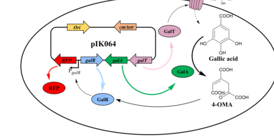

## Question

# Gene Research for Functional Annotation

## ⚠️ CRITICAL: Gene/Protein Identification Context

**BEFORE YOU BEGIN RESEARCH:** You MUST verify you are researching the CORRECT gene/protein. Gene symbols can be ambiguous, especially for less well-characterized genes from non-model organisms.

### Target Gene/Protein Identity (from UniProt):
- **UniProt Accession:** Q88JY0
- **Protein Description:** RecName: Full=4-oxalomesaconate tautomerase; EC=5.3.2.8; AltName: Full=Gallate degradation protein D;
- **Gene Information:** Name=galD; OrderedLocusNames=PP_2513;
- **Organism (full):** Pseudomonas putida (strain ATCC 47054 / DSM 6125 / CFBP 8728 / NCIMB 11950 / KT2440).
- **Protein Family:** Belongs to the PrpF family. .
- **Key Domains:** OMA_tautomer-like. (IPR047687); PrpF-like. (IPR007400); PrpF (PF04303)

### MANDATORY VERIFICATION STEPS:

1. **Check if the gene symbol "galD" matches the protein description above**
2. **Verify the organism is correct:** Pseudomonas putida (strain ATCC 47054 / DSM 6125 / CFBP 8728 / NCIMB 11950 / KT2440).
3. **Check if protein family/domains align with what you find in literature**
4. **If you find literature for a DIFFERENT gene with the same or similar symbol, STOP**

### If Gene Symbol is Ambiguous or You Cannot Find Relevant Literature:

**DO NOT PROCEED WITH RESEARCH ON A DIFFERENT GENE.** Instead:
- State clearly: "The gene symbol 'galD' is ambiguous or literature is limited for this specific protein"
- Explain what you found (e.g., "Found extensive literature on a different gene with the same symbol in a different organism")
- Describe the protein based ONLY on the UniProt information provided above
- Suggest that the protein function can be inferred from domain/family information

### Research Target:

Please provide a comprehensive research report on the gene **galD** (gene ID: galD, UniProt: Q88JY0) in PSEPK.

The research report should be a detailed narrative explaining the function, biological processes, and localization of the gene product. Citations should be given for all claims.

You should prioritize authoritative reviews and primary scientific literature when conducting research. You can supplement
this with annotations you find in gene/protein databases, but these can be outdated or inaccurate.

We are specifically interested in the primary function of the gene - for enzymes, what reaction is catalyzed, and what is the substrate specificity? For transporters, what is the substrate? For structural proteins or adapters, what is the broader structural role? For signaling molecules, what is the role in the pathway.

We are interested in where in or outside the cell the gene product carries out its function.

We are also interested in the signaling or biochemical pathways in which the gene functions. We are less interested in broad pleiotropic effects, except where these elucidate the precise role.

Include evidence where possible. We are interested in both experimental evidence as well as inference from structure, evolution, or bioinformatic analysis. Precise studies should be prioritized over high-throughput, where available.

## Output

Question: You are an expert researcher providing comprehensive, well-cited information.

Provide detailed information focusing on:
1. Key concepts and definitions with current understanding
2. Recent developments and latest research (prioritize 2023-2024 sources)
3. Current applications and real-world implementations
4. Expert opinions and analysis from authoritative sources
5. Relevant statistics and data from recent studies

Format as a comprehensive research report with proper citations. Include URLs and publication dates where available.
Always prioritize recent, authoritative sources and provide specific citations for all major claims.

# Gene Research for Functional Annotation

## ⚠️ CRITICAL: Gene/Protein Identification Context

**BEFORE YOU BEGIN RESEARCH:** You MUST verify you are researching the CORRECT gene/protein. Gene symbols can be ambiguous, especially for less well-characterized genes from non-model organisms.

### Target Gene/Protein Identity (from UniProt):
- **UniProt Accession:** Q88JY0
- **Protein Description:** RecName: Full=4-oxalomesaconate tautomerase; EC=5.3.2.8; AltName: Full=Gallate degradation protein D;
- **Gene Information:** Name=galD; OrderedLocusNames=PP_2513;
- **Organism (full):** Pseudomonas putida (strain ATCC 47054 / DSM 6125 / CFBP 8728 / NCIMB 11950 / KT2440).
- **Protein Family:** Belongs to the PrpF family. .
- **Key Domains:** OMA_tautomer-like. (IPR047687); PrpF-like. (IPR007400); PrpF (PF04303)

### MANDATORY VERIFICATION STEPS:

1. **Check if the gene symbol "galD" matches the protein description above**
2. **Verify the organism is correct:** Pseudomonas putida (strain ATCC 47054 / DSM 6125 / CFBP 8728 / NCIMB 11950 / KT2440).
3. **Check if protein family/domains align with what you find in literature**
4. **If you find literature for a DIFFERENT gene with the same or similar symbol, STOP**

### If Gene Symbol is Ambiguous or You Cannot Find Relevant Literature:

**DO NOT PROCEED WITH RESEARCH ON A DIFFERENT GENE.** Instead:
- State clearly: "The gene symbol 'galD' is ambiguous or literature is limited for this specific protein"
- Explain what you found (e.g., "Found extensive literature on a different gene with the same symbol in a different organism")
- Describe the protein based ONLY on the UniProt information provided above
- Suggest that the protein function can be inferred from domain/family information

### Research Target:

Please provide a comprehensive research report on the gene **galD** (gene ID: galD, UniProt: Q88JY0) in PSEPK.

The research report should be a detailed narrative explaining the function, biological processes, and localization of the gene product. Citations should be given for all claims.

You should prioritize authoritative reviews and primary scientific literature when conducting research. You can supplement
this with annotations you find in gene/protein databases, but these can be outdated or inaccurate.

We are specifically interested in the primary function of the gene - for enzymes, what reaction is catalyzed, and what is the substrate specificity? For transporters, what is the substrate? For structural proteins or adapters, what is the broader structural role? For signaling molecules, what is the role in the pathway.

We are interested in where in or outside the cell the gene product carries out its function.

We are also interested in the signaling or biochemical pathways in which the gene functions. We are less interested in broad pleiotropic effects, except where these elucidate the precise role.

Include evidence where possible. We are interested in both experimental evidence as well as inference from structure, evolution, or bioinformatic analysis. Precise studies should be prioritized over high-throughput, where available.

# Research Report: Functional Annotation of **galD** (PP_2513; UniProt **Q88JY0**) in *Pseudomonas putida* KT2440

## Executive summary
The *Pseudomonas putida* KT2440 gene **galD** (locus **PP_2513**, UniProt **Q88JY0**) encodes **4-oxalomesaconate tautomerase** (also called **gallate degradation protein D**; **EC 5.3.2.8**), a cytosolic enzyme in the **gallic acid (gallate) catabolic pathway** that manages interconversion among **4-oxalomesaconate (4-OMA) isomers (keto/enol)** formed immediately after aromatic ring cleavage. This tautomer-management step is positioned between **GalA (gallate dioxygenase)** and **GalB (OMAenol hydratase)** and supports downstream funneling to central metabolism (via GalC aldolase). Pathway intermediates (notably **4-OMA**) also serve as **regulatory effectors** for the LysR-family transcriptional regulator **GalR**, enabling synthetic biology applications such as **whole-cell biosensors**. (kutraite2023developmentandapplication pages 1-2, kutraite2023developmentandapplication pages 3-4, kutraite2023developmentandapplication media add12c8d)

## 1. Target verification (avoiding symbol ambiguity)
### Confirmed identity
Recent primary literature on *P. putida* KT2440 gallic-acid metabolism explicitly labels **GalD** as **“4-oxalomesaconic acid (4-OMA) tautomerase”** within the KT2440 gallate catabolic pathway and gene cluster (Figure 1A/B). (kutraite2023developmentandapplication pages 1-2, kutraite2023developmentandapplication media add12c8d)

### Mapping to the provided UniProt context
The literature-described function (4-OMA tautomerase in gallate degradation) matches the UniProt description you provided for **Q88JY0** (“4-oxalomesaconate tautomerase; gallate degradation protein D; PrpF family/OMA_tautomer-like domains”). Within the tool-retrieved corpus, no alternative *P. putida* KT2440 “galD” conflicting identity was encountered; “GalD” is consistently discussed as the 4-OMA tautomerase in this pathway context. (kutraite2023developmentandapplication pages 1-2, kutraite2023developmentandapplication media add12c8d)

## 2. Key concepts and definitions (current understanding)
### Gallic acid (gallate) catabolism and the role of 4-OMA
**Gallic acid (3,4,5-trihydroxybenzoic acid)** is a plant-derived aromatic compound whose microbial degradation begins with **extradiol ring cleavage**. In *P. putida* KT2440, the first committed step is catalyzed by **GalA (gallate dioxygenase)** converting gallic acid into **4-oxalomesaconic acid (4-OMA)**, which exists as multiple tautomers/isomers (e.g., **OMAketo** and **OMAenol**). (kutraite2023developmentandapplication pages 3-4, kutraite2023developmentandapplication pages 1-2, kutraite2023developmentandapplication media add12c8d)

### Definition: 4-oxalomesaconate tautomerase (GalD; EC 5.3.2.8)
A **tautomerase** catalyzes intramolecular rearrangements (e.g., keto–enol interconversions) without net addition/removal of atoms. In the KT2440 pathway map, **GalD** is specifically annotated as the enzyme responsible for **interconversion of 4-OMA tautomers** (OMAketo ↔ OMAenol), enabling efficient progression to the next enzymatic step. (kutraite2023developmentandapplication pages 3-4, kutraite2023developmentandapplication pages 1-2, kutraite2023developmentandapplication media add12c8d)

### Downstream enzymes define functional coupling and substrate “hand-off”
The pathway depiction and accompanying discussion define **GalB** as an **OMAenol hydratase** (downstream of GalD), indicating that the metabolic flow depends on maintaining the correct 4-OMA isomeric form for hydration chemistry. (kutraite2023developmentandapplication pages 3-4, kutraite2023developmentandapplication pages 1-2, kutraite2023developmentandapplication media add12c8d)

### Gene cluster/operon concept in catabolic pathways
Genes for uptake, ring cleavage, and lower-pathway metabolism frequently cluster together in bacterial genomes. In KT2440, the 2023 pathway/gene-cluster figure shows GalD within a conserved **gal** gene cluster alongside transport components (**GalP**, **GalT**) and enzymes (**GalA**, **GalB**, **GalC**), supporting its functional assignment in gallate catabolism. (kutraite2023developmentandapplication pages 1-2, kutraite2023developmentandapplication media add12c8d)

## 3. Primary function and reaction details for **GalD**
### Reaction and substrate specificity (what GalD acts on)
**Assigned reaction:** **4-oxalomesaconate (4-OMA) tautomerization** (keto ↔ enol forms; management of OMA isomers produced after ring cleavage). (kutraite2023developmentandapplication pages 3-4, kutraite2023developmentandapplication pages 1-2, kutraite2023developmentandapplication media add12c8d)

**Substrate context:** 4-OMA is the immediate product of **GalA**-catalyzed ring cleavage of gallic acid in KT2440. (kutraite2023developmentandapplication pages 3-4, kutraite2023developmentandapplication pages 1-2)

### Mechanistic/biochemical support and expert analysis
Direct biochemical characterization of *P. putida* KT2440 GalD itself (purified enzyme kinetics/structure) was not present in the retrieved 2023–2025 corpus; however, mechanistic plausibility is strengthened by:

1) **Pathway logic and enzyme coupling**: GalB is described as **OMAenol hydratase**, and the authors note that removing GalD from the “reaction order” implies only **OMAenol** is used as GalB substrate—supporting GalD’s role in maintaining/producing the necessary tautomeric substrate pool. (kutraite2023developmentandapplication pages 3-4)

2) **Homology-based reasoning**: homologs annotated as 4-oxalomesaconate tautomerases exist in *E. coli* (b0769) and *Cupriavidus necator* (H16_RS33685) with ~45–48% identity to *P. putida* GalD, consistent with a conserved tautomerase function for this protein family. (kutraite2023developmentandapplication pages 3-4)

3) **Comparative enzymology in related pathways**: work on the lignin-derived aromatic catabolic network in *Sphingobium* identifies LigU as homologous to *P. putida* GalD and experimentally demonstrates OMA isomerization chemistry (1,3-allylic isomerization of OMA) using NMR, supporting that GalD-family proteins act on OMA-like intermediates in aromatic degradation pathways. (hogancamp2018functionalannotationof pages 1-5)

### Pathway position (biochemical pathway integration)
A concise KT2440 pathway map places the proteins as:
- **Transport**: GalP (outer membrane porin), GalT (inner membrane transporter)
- **Ring cleavage**: GalA (gallate dioxygenase): gallic acid → 4-OMA
- **Tautomer management**: **GalD**: 4-OMA keto/enol interconversion
- **Hydration/cleavage**: GalB (OMAenol hydratase) and GalC (CHA aldolase) producing central metabolites (pyruvate and oxaloacetate). (kutraite2023developmentandapplication pages 1-2, kutraite2023developmentandapplication media add12c8d)

## 4. Cellular localization and where the protein acts
### Localization inference
Although the retrieved sources do not provide direct subcellular localization experiments for GalD, the pathway context strongly supports **cytosolic localization**:
- Substrates (4-OMA and subsequent ring-cleavage intermediates) are small polar metabolites produced after uptake and intracellular dioxygenase action.
- The pathway explicitly includes dedicated transporters (GalP/GalT) to bring gallic acid into the cell, after which GalA/GalD/GalB/GalC act on intracellular intermediates.

Thus, GalD is best interpreted as a **soluble cytosolic enzyme** in aromatic catabolism. (kutraite2023developmentandapplication pages 1-2, dias2023fromdegraderto pages 4-6, kutraite2023developmentandapplication media add12c8d)

## 5. Regulation and signaling links (GalR and 4-OMA)
### 4-OMA as an effector molecule (regulatory signaling)
A key 2023 development is the demonstration that **gallic acid itself does not directly induce** a GalR-based transcriptional response in non-native hosts; rather, activation requires **GalA activity**, implicating **4-OMA** (produced from gallic acid by GalA) as the effector that binds **GalR** and drives transcription from promoter **PPP_RS13150**. (kutraite2023developmentandapplication pages 1-2, kutraite2023developmentandapplication pages 3-4)

This establishes an important concept: **a GalD-pathway intermediate (4-OMA) is not just a metabolic intermediate, but also a signaling molecule** controlling gene expression in this catabolic module. (kutraite2023developmentandapplication pages 1-2)

### Regulatory DNA architecture (expert interpretation)
Analysis of the intergenic region near the GalR-controlled promoter identified motifs resembling LysR-type regulator binding sites (RBS/ABS), supporting a canonical LysR mechanism in which effector binding enables productive RNA polymerase interaction and transcriptional activation. (kutraite2023developmentandapplication pages 3-4)

## 6. Recent developments and latest research (prioritizing 2023–2024)
### 2023: Whole-cell biosensors leveraging the GalA–4-OMA–GalR axis
Kutraite & Malys (published **2023-02-01**) developed and characterized a **GalR/PPP_RS13150** inducible system responding to extracellular gallic acid in *P. putida* KT2440 and showed that activation depends on **GalA** and is mediated by the **4-OMA effector**. They further demonstrated portability to **E. coli** and **C. necator** by introducing **galA** together with **galR**. (kutraite2023developmentandapplication pages 1-2, kutraite2023developmentandapplication pages 3-4)

### 2023: Metabolic engineering to reverse gallate degradation (block native catabolism)
Dias et al. (online **2022-11-11**, in **2023** issue) reversed *P. putida* KT2440’s native role as a gallate degrader into a **gallic acid producer** by deleting native degradation modules including **galTAPR** (linked to gallate uptake and the first degradation step) and **pcaHG** (to prevent degradation of protocatechuate), enabling gallic acid accumulation when a synthetic production operon was introduced. (dias2023fromdegraderto pages 4-6, dias2023fromdegraderto pages 1-2)

### 2024 coverage limitation
Within the tool-retrieved corpus, no 2024 primary papers specifically interrogating *P. putida* KT2440 **GalD** biochemistry were retrieved. Accordingly, GalD-specific “latest research” is best represented here by the 2023 pathway/regulatory studies that explicitly annotate GalD in vivo and highlight its coupling to downstream steps and regulation. (kutraite2023developmentandapplication pages 3-4, kutraite2023developmentandapplication pages 1-2, kutraite2023developmentandapplication media add12c8d)

## 7. Current applications and real-world implementations
### 7.1 Whole-cell biosensors for gallic acid detection
A practical implementation is a **whole-cell biosensor** that uses GalR-mediated transcriptional activation (via 4-OMA effector generation) to drive reporter expression. The system was demonstrated for detecting and measuring gallic acid in **Camellia sinensis (tea) leaf extracts**, illustrating real-sample analytical utility beyond lab media. (kutraite2023developmentandapplication pages 1-2)

In *E. coli*, inclusion of **galT** (a *P. putida* transporter absent in *E. coli*) improved reporter output, consistent with GalT enhancing gallic acid uptake in the heterologous chassis—an engineering detail relevant to real-world sensor performance. (kutraite2023developmentandapplication pages 3-4)

### 7.2 Bioproduction of gallic acid using engineered *P. putida*
Dias et al. report a *P. putida* KT2440 engineered strain (including deletions **ΔgalTAPR ΔpcaHG**) that produced **346.7 ± 0.004 mg/L gallic acid after 72 h** in shaker assays when fed glycerol, demonstrating a quantitative, experimentally validated bioproduction outcome. (dias2023fromdegraderto pages 1-2)

## 8. Relevant statistics and quantitative data
- **Gallic acid market demand (contextual statistic):** annual demand valued at **$74 million (2020)** with expected growth to **$125.6 million by 2026** (reported as market context in the biosensor paper). (kutraite2023developmentandapplication pages 1-2)
- **Bioproduction titer:** **346.7 ± 0.004 mg/L** gallic acid at **72 h** in engineered *P. putida* KT2440. (dias2023fromdegraderto pages 1-2)
- **Inducible system performance (reported range):** a GalR/PPP_RS13150 system variant in *P. putida* is reported to mediate **~45- to 248-fold** activation in one construct comparison (single time-point fluorescence response). (kutraite2023developmentandapplication pages 3-4)

## 9. Authoritative synthesis: what is well supported vs. still uncertain
### Well supported (high confidence)
- **GalD’s pathway role** as a **4-OMA tautomerase** in *P. putida* KT2440 gallate catabolism is explicitly annotated and depicted in peer-reviewed 2023 literature, including gene-cluster context. (kutraite2023developmentandapplication pages 1-2, kutraite2023developmentandapplication media add12c8d)
- **4-OMA is a regulatory effector** for GalR-mediated transcriptional activation (a key insight that links metabolism to gene regulation and enables biosensor engineering). (kutraite2023developmentandapplication pages 1-2, kutraite2023developmentandapplication pages 3-4)

### Remaining uncertainties / opportunities for future work
- The retrieved 2023 sources explicitly state that further research is needed to establish whether the **keto form, enol form, or both** of 4-OMA serve as the active **GalR effector**, indicating an open mechanistic question with direct relevance to GalD’s tautomer interconversion. (kutraite2023developmentandapplication pages 3-4)
- Direct biochemical parameters for *P. putida* KT2440 GalD (e.g., kcat/KM, structure) were not retrieved here; mechanistic interpretation relies on pathway depiction, regulatory logic, and homology/comparative enzymology. (kutraite2023developmentandapplication pages 3-4, hogancamp2018functionalannotationof pages 1-5)

## 10. Summary table (evidence-linked)
The following table consolidates the functional annotation of **galD** in KT2440 and its immediate pathway/regulatory context.

| Item (gene/protein) | Evidence type | Catalyzed step (substrate->product names) | Pathway position | Notes on regulation/localization | Key recent sources (with year) and DOI URL |
|---|---|---|---|---|---|
| **galD / PP_2513 / Q88JY0** (4-oxalomesaconate tautomerase; gallate degradation protein D) | Curated pathway; biochemical inference; sequence homology | **4-oxalomesaconate keto/enol isomer interconversion** (OMAketo ↔ OMAenol; proposed OMA → CHM in older pathway descriptions) | Immediately **downstream of GalA** ring cleavage and functionally coupled to **GalB** hydratase step in gallate catabolism | Assigned in the **P. putida KT2440 gal cluster**; cytosolic soluble enzyme is most consistent with role in small-molecule aromatic catabolism; homologs in *E. coli* and *C. necator* share 48% and 45% identity to P. putida GalD; omission of GalD in pathway logic leaves only OMAenol available to GalB, supporting a tautomer-management role (kutraite2023developmentandapplication pages 1-2, kutraite2023developmentandapplication pages 3-4, dumalo2020dioxygenasesinthe pages 32-39, hogancamp2018functionalannotationof pages 1-5, kutraite2023developmentandapplication media add12c8d) | Kutraite & Malys 2023, ACS Synth Biol, https://doi.org/10.1021/acssynbio.2c00537; Hogancamp & Raushel 2018, Biochemistry, https://doi.org/10.1021/acs.biochem.8b00295 |
| **galA** (gallate dioxygenase) | Experimental genetics; curated pathway | **Gallic acid (gallate) → 4-oxalomesaconate (4-OMA)** | **First committed catabolic step** of gallate degradation | Required for activation of the GalR-based inducible system because 4-OMA, not gallic acid itself, acts as the signaling effector; deletion of **galTAPR** used to block gallate degradation during metabolic engineering; enzyme acts in the cytosol after substrate uptake (kutraite2023developmentandapplication pages 1-2, kutraite2023developmentandapplication pages 3-4, dias2023fromdegraderto pages 4-6, dias2023fromdegraderto pages 1-2, kutraite2023developmentandapplication media add12c8d) | Kutraite & Malys 2023, https://doi.org/10.1021/acssynbio.2c00537; Dias et al. 2023, https://doi.org/10.1007/s10123-022-00282-5 |
| **galB** (OMAenol hydratase / downstream hydratase) | Experimental pathway assignment; structural/biochemical literature; curated pathway | **OMAenol (or downstream tautomerized 4-OMA intermediate) → hydrated product en route to CHA** | **Directly downstream of GalD** in lower gallate pathway | Divergently transcribed adjacent to **galR**; proposed GalR target promoter lies upstream of **galB** with LysR-type RBS/ABS motifs; function is cytosolic; GalB availability helped infer that 4-OMA is the GalR effector and that GalD manages the tautomer presented to GalB (kutraite2023developmentandapplication pages 3-4, hogancamp2018functionalannotationof pages 1-5, kutraite2023developmentandapplication pages 1-2, kutraite2023developmentandapplication media add12c8d) | Kutraite & Malys 2023, https://doi.org/10.1021/acssynbio.2c00537; Hogancamp & Raushel 2018, https://doi.org/10.1021/acs.biochem.8b00295 |
| **galC** (CHA aldolase) | Curated pathway; pathway conservation in related systems | **4-carboxy-4-hydroxy-2-oxoadipate (CHA) → pyruvate + oxaloacetate** | **Terminal cleavage step** feeding central metabolism | Located in the gallic acid catabolic gene cluster with **galB/galD**; expected cytosolic enzyme completing lower pathway carbon entry into the TCA-linked network (kutraite2023developmentandapplication pages 1-2, ookawa2025catabolicsystemof pages 1-2, kutraite2023developmentandapplication media add12c8d) | Kutraite & Malys 2023, https://doi.org/10.1021/acssynbio.2c00537; Ookawa et al. 2025, https://doi.org/10.1021/acs.jafc.5c04544 |
| **galR** (LysR-type transcriptional regulator) | Experimental regulatory analysis; biosensor implementation | **Regulatory step, not catalytic:** 4-OMA-bound GalR activates transcription from promoter **PPP_RS13150** controlling gallate-catabolic expression/reporter output | Regulatory node linked to **galB-adjacent promoter** | 4-OMA identified as the likely effector molecule; predicted LysR RBS/ABS motifs upstream of **galB**-side promoter; used to build whole-cell biosensors in *P. putida*, *E. coli*, and *C. necator* when paired with **galA**; establishes that a GalD-pathway intermediate has signaling relevance (kutraite2023developmentandapplication pages 1-2, kutraite2023developmentandapplication pages 3-4, kutraite2023developmentandapplication media 7a147fd5) | Kutraite & Malys 2023, https://doi.org/10.1021/acssynbio.2c00537 |
| **galT / galP** (inner-membrane MFS transporter / outer-membrane porin) | Experimental genetics; transport inference from gene-cluster context; biosensor engineering | **Gallic acid uptake across cell envelope** (extracellular gallate → periplasm/cytosol) | **Entry step upstream of GalA** | **galT** deletion was part of the **ΔgalTAPR** strategy to prevent gallate degradation during production engineering; **GalT** improved gallic acid response in heterologous *E. coli* biosensors, supporting transporter function; **GalP** is annotated as outer-membrane porin in the same pathway map (kutraite2023developmentandapplication pages 3-4, kutraite2023developmentandapplication pages 1-2, dias2023fromdegraderto pages 4-6, dias2023fromdegraderto pages 1-2, kutraite2023developmentandapplication media add12c8d) | Kutraite & Malys 2023, https://doi.org/10.1021/acssynbio.2c00537; Dias et al. 2023, https://doi.org/10.1007/s10123-022-00282-5 |
| **Pathway/application context for galD** | Experimental metabolic engineering; applied synthetic biology | Blocking native degradation (**ΔgalTAPR ΔpcaHG**) enabled **gallic acid accumulation** from glycerol; reporter systems exploit **4-OMA/GalR** signaling | Biotechnology context rather than single enzymatic step | Demonstrates real-world importance of correct GalD-pathway annotation: engineered *P. putida* produced **346.7 ± 0.004 mg/L gallic acid after 72 h**, and GalR/4-OMA modules enabled extracellular gallic acid biosensing including detection in **Camellia sinensis** extracts (kutraite2023developmentandapplication pages 1-2, dias2023fromdegraderto pages 1-2) | Dias et al. 2023, https://doi.org/10.1007/s10123-022-00282-5; Kutraite & Malys 2023, https://doi.org/10.1021/acssynbio.2c00537 |

*Table: This table summarizes the functional annotation of Pseudomonas putida KT2440 galD in its gallate catabolic context, including related enzymes, transporters, and regulator. It highlights the specific reaction assignments, pathway position, regulatory context, localization inference, and recent supporting sources with DOI links.*

## Key sources (with URLs and publication dates where available)
1. Kutraite I, Malys N. **Development and Application of Whole-Cell Biosensors for the Detection of Gallic Acid.** *ACS Synthetic Biology*. **Published 2023-02-01**. https://doi.org/10.1021/acssynbio.2c00537 (kutraite2023developmentandapplication pages 1-2)
2. Dias FMS, Pantoja RK, Gomez JGC, Silva LF. **From degrader to producer: reversing the gallic acid metabolism of Pseudomonas putida KT2440.** *International Microbiology*. **Published online 2022-11-11**; 2023 issue. https://doi.org/10.1007/s10123-022-00282-5 (dias2023fromdegraderto pages 1-2)
3. Hogancamp TN, Raushel FM. **Functional Annotation of LigU as a 1,3-Allylic Isomerase…** *Biochemistry*. **2018-04**. https://doi.org/10.1021/acs.biochem.8b00295 (hogancamp2018functionalannotationof pages 1-5)

References

1. (kutraite2023developmentandapplication pages 1-2): Ingrida Kutraite and Naglis Malys. Development and application of whole-cell biosensors for the detection of gallic acid. ACS Synthetic Biology, 12:533-543, Feb 2023. URL: https://doi.org/10.1021/acssynbio.2c00537, doi:10.1021/acssynbio.2c00537. This article has 35 citations and is from a domain leading peer-reviewed journal.

2. (kutraite2023developmentandapplication pages 3-4): Ingrida Kutraite and Naglis Malys. Development and application of whole-cell biosensors for the detection of gallic acid. ACS Synthetic Biology, 12:533-543, Feb 2023. URL: https://doi.org/10.1021/acssynbio.2c00537, doi:10.1021/acssynbio.2c00537. This article has 35 citations and is from a domain leading peer-reviewed journal.

3. (kutraite2023developmentandapplication media add12c8d): Ingrida Kutraite and Naglis Malys. Development and application of whole-cell biosensors for the detection of gallic acid. ACS Synthetic Biology, 12:533-543, Feb 2023. URL: https://doi.org/10.1021/acssynbio.2c00537, doi:10.1021/acssynbio.2c00537. This article has 35 citations and is from a domain leading peer-reviewed journal.

4. (hogancamp2018functionalannotationof pages 1-5): Tessily N. Hogancamp and Frank M. Raushel. Functional annotation of ligu as a 1,3-allylic isomerase during the degradation of lignin in the protocatechuate 4,5-cleavage pathway from the soil bacterium sphingobium sp. syk-6. Biochemistry, 57 19:2837-2845, Apr 2018. URL: https://doi.org/10.1021/acs.biochem.8b00295, doi:10.1021/acs.biochem.8b00295. This article has 21 citations and is from a peer-reviewed journal.

5. (dias2023fromdegraderto pages 4-6): Felipe M. S. Dias, Raoní K. Pantoja, José Gregório C. Gomez, and Luiziana F. Silva. From degrader to producer: reversing the gallic acid metabolism of pseudomonas putida kt2440. International Microbiology, 26:243-255, Nov 2023. URL: https://doi.org/10.1007/s10123-022-00282-5, doi:10.1007/s10123-022-00282-5. This article has 7 citations and is from a peer-reviewed journal.

6. (dias2023fromdegraderto pages 1-2): Felipe M. S. Dias, Raoní K. Pantoja, José Gregório C. Gomez, and Luiziana F. Silva. From degrader to producer: reversing the gallic acid metabolism of pseudomonas putida kt2440. International Microbiology, 26:243-255, Nov 2023. URL: https://doi.org/10.1007/s10123-022-00282-5, doi:10.1007/s10123-022-00282-5. This article has 7 citations and is from a peer-reviewed journal.

7. (dumalo2020dioxygenasesinthe pages 32-39): Linda Dumalo. Dioxygenases in the catabolism of syringols in pseudomonas putida kt2440. ArXiv, Jan 2020. URL: https://doi.org/10.14288/1.0394310, doi:10.14288/1.0394310. This article has 0 citations.

8. (ookawa2025catabolicsystemof pages 1-2): Zen Ookawa, Yudai Higuchi, Masaya Fujita, Tomonori Sonoki, Naofumi Kamimura, and Eiji Masai. Catabolic system of syringic acid, a key intermediate of lignin-derived aromatic compounds, via a novel linear pathway in pseudomonas sp. ngc7. Journal of Agricultural and Food Chemistry, 73:18899-18913, Jul 2025. URL: https://doi.org/10.1021/acs.jafc.5c04544, doi:10.1021/acs.jafc.5c04544. This article has 6 citations and is from a highest quality peer-reviewed journal.

9. (kutraite2023developmentandapplication media 7a147fd5): Ingrida Kutraite and Naglis Malys. Development and application of whole-cell biosensors for the detection of gallic acid. ACS Synthetic Biology, 12:533-543, Feb 2023. URL: https://doi.org/10.1021/acssynbio.2c00537, doi:10.1021/acssynbio.2c00537. This article has 35 citations and is from a domain leading peer-reviewed journal.

## Artifacts

- [Edison artifact artifact-00](galD-deep-research-falcon_artifacts/artifact-00.md)

## Citations

1. kutraite2023developmentandapplication pages 3-4
2. hogancamp2018functionalannotationof pages 1-5
3. kutraite2023developmentandapplication pages 1-2
4. dias2023fromdegraderto pages 1-2
5. dias2023fromdegraderto pages 4-6
6. dumalo2020dioxygenasesinthe pages 32-39
7. ookawa2025catabolicsystemof pages 1-2
8. https://doi.org/10.1021/acssynbio.2c00537;
9. https://doi.org/10.1021/acs.biochem.8b00295
10. https://doi.org/10.1007/s10123-022-00282-5
11. https://doi.org/10.1021/acs.jafc.5c04544
12. https://doi.org/10.1021/acssynbio.2c00537
13. https://doi.org/10.1007/s10123-022-00282-5;
14. https://doi.org/10.1021/acssynbio.2c00537,
15. https://doi.org/10.1021/acs.biochem.8b00295,
16. https://doi.org/10.1007/s10123-022-00282-5,
17. https://doi.org/10.14288/1.0394310,
18. https://doi.org/10.1021/acs.jafc.5c04544,