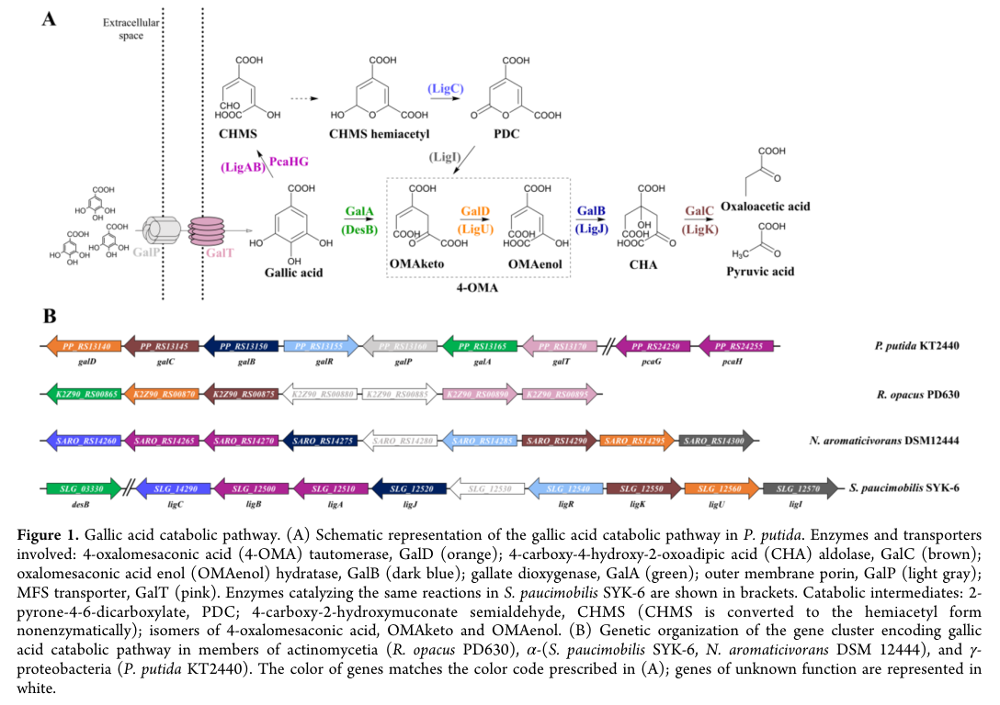

## Question

# Gene Research for Functional Annotation

## ⚠️ CRITICAL: Gene/Protein Identification Context

**BEFORE YOU BEGIN RESEARCH:** You MUST verify you are researching the CORRECT gene/protein. Gene symbols can be ambiguous, especially for less well-characterized genes from non-model organisms.

### Target Gene/Protein Identity (from UniProt):
- **UniProt Accession:** Q88JX6
- **Protein Description:** RecName: Full=Porin-like protein GalP; AltName: Full=Gallate degradation protein P; Flags: Precursor;
- **Gene Information:** Name=galP; OrderedLocusNames=PP_2517;
- **Organism (full):** Pseudomonas putida (strain ATCC 47054 / DSM 6125 / CFBP 8728 / NCIMB 11950 / KT2440).
- **Protein Family:** Belongs to the outer membrane porin (Opr) (TC 1.B.25)
- **Key Domains:** OM_porin_bac. (IPR005318); Porin_dom_sf. (IPR023614); OprD (PF03573)

### MANDATORY VERIFICATION STEPS:

1. **Check if the gene symbol "galP" matches the protein description above**
2. **Verify the organism is correct:** Pseudomonas putida (strain ATCC 47054 / DSM 6125 / CFBP 8728 / NCIMB 11950 / KT2440).
3. **Check if protein family/domains align with what you find in literature**
4. **If you find literature for a DIFFERENT gene with the same or similar symbol, STOP**

### If Gene Symbol is Ambiguous or You Cannot Find Relevant Literature:

**DO NOT PROCEED WITH RESEARCH ON A DIFFERENT GENE.** Instead:
- State clearly: "The gene symbol 'galP' is ambiguous or literature is limited for this specific protein"
- Explain what you found (e.g., "Found extensive literature on a different gene with the same symbol in a different organism")
- Describe the protein based ONLY on the UniProt information provided above
- Suggest that the protein function can be inferred from domain/family information

### Research Target:

Please provide a comprehensive research report on the gene **galP** (gene ID: galP, UniProt: Q88JX6) in PSEPK.

The research report should be a detailed narrative explaining the function, biological processes, and localization of the gene product. Citations should be given for all claims.

You should prioritize authoritative reviews and primary scientific literature when conducting research. You can supplement
this with annotations you find in gene/protein databases, but these can be outdated or inaccurate.

We are specifically interested in the primary function of the gene - for enzymes, what reaction is catalyzed, and what is the substrate specificity? For transporters, what is the substrate? For structural proteins or adapters, what is the broader structural role? For signaling molecules, what is the role in the pathway.

We are interested in where in or outside the cell the gene product carries out its function.

We are also interested in the signaling or biochemical pathways in which the gene functions. We are less interested in broad pleiotropic effects, except where these elucidate the precise role.

Include evidence where possible. We are interested in both experimental evidence as well as inference from structure, evolution, or bioinformatic analysis. Precise studies should be prioritized over high-throughput, where available.

## Output

Question: You are an expert researcher providing comprehensive, well-cited information.

Provide detailed information focusing on:
1. Key concepts and definitions with current understanding
2. Recent developments and latest research (prioritize 2023-2024 sources)
3. Current applications and real-world implementations
4. Expert opinions and analysis from authoritative sources
5. Relevant statistics and data from recent studies

Format as a comprehensive research report with proper citations. Include URLs and publication dates where available.
Always prioritize recent, authoritative sources and provide specific citations for all major claims.

# Gene Research for Functional Annotation

## ⚠️ CRITICAL: Gene/Protein Identification Context

**BEFORE YOU BEGIN RESEARCH:** You MUST verify you are researching the CORRECT gene/protein. Gene symbols can be ambiguous, especially for less well-characterized genes from non-model organisms.

### Target Gene/Protein Identity (from UniProt):
- **UniProt Accession:** Q88JX6
- **Protein Description:** RecName: Full=Porin-like protein GalP; AltName: Full=Gallate degradation protein P; Flags: Precursor;
- **Gene Information:** Name=galP; OrderedLocusNames=PP_2517;
- **Organism (full):** Pseudomonas putida (strain ATCC 47054 / DSM 6125 / CFBP 8728 / NCIMB 11950 / KT2440).
- **Protein Family:** Belongs to the outer membrane porin (Opr) (TC 1.B.25)
- **Key Domains:** OM_porin_bac. (IPR005318); Porin_dom_sf. (IPR023614); OprD (PF03573)

### MANDATORY VERIFICATION STEPS:

1. **Check if the gene symbol "galP" matches the protein description above**
2. **Verify the organism is correct:** Pseudomonas putida (strain ATCC 47054 / DSM 6125 / CFBP 8728 / NCIMB 11950 / KT2440).
3. **Check if protein family/domains align with what you find in literature**
4. **If you find literature for a DIFFERENT gene with the same or similar symbol, STOP**

### If Gene Symbol is Ambiguous or You Cannot Find Relevant Literature:

**DO NOT PROCEED WITH RESEARCH ON A DIFFERENT GENE.** Instead:
- State clearly: "The gene symbol 'galP' is ambiguous or literature is limited for this specific protein"
- Explain what you found (e.g., "Found extensive literature on a different gene with the same symbol in a different organism")
- Describe the protein based ONLY on the UniProt information provided above
- Suggest that the protein function can be inferred from domain/family information

### Research Target:

Please provide a comprehensive research report on the gene **galP** (gene ID: galP, UniProt: Q88JX6) in PSEPK.

The research report should be a detailed narrative explaining the function, biological processes, and localization of the gene product. Citations should be given for all claims.

You should prioritize authoritative reviews and primary scientific literature when conducting research. You can supplement
this with annotations you find in gene/protein databases, but these can be outdated or inaccurate.

We are specifically interested in the primary function of the gene - for enzymes, what reaction is catalyzed, and what is the substrate specificity? For transporters, what is the substrate? For structural proteins or adapters, what is the broader structural role? For signaling molecules, what is the role in the pathway.

We are interested in where in or outside the cell the gene product carries out its function.

We are also interested in the signaling or biochemical pathways in which the gene functions. We are less interested in broad pleiotropic effects, except where these elucidate the precise role.

Include evidence where possible. We are interested in both experimental evidence as well as inference from structure, evolution, or bioinformatic analysis. Precise studies should be prioritized over high-throughput, where available.

## Research report: **galP / GalP (UniProt Q88JX6)** in *Pseudomonas putida* KT2440

### 0) Identity verification and ambiguity handling (critical)
The symbol **galP** is used across biology for unrelated proteins (e.g., sugar transporters in other organisms). In *Pseudomonas putida* **KT2440**, recent primary literature specifically places **galP** in the **gallic acid (gallate) catabolic gene cluster**, where it is annotated as an **outer membrane porin** involved in gallate/gallic-acid utilization (dias2023fromdegraderto pages 4-6, kutraite2023developmentandapplication media 236896c6). 

However, **identifier cross-mapping is incomplete within the retrieved sources**: the cluster schematic in KT2440 labels **galP as PP_RS13160** (kutraite2023developmentandapplication media 236896c6), whereas the user-provided UniProt record for **Q88JX6** lists ordered locus **PP_2517** and describes an OprD-family porin-like protein GalP. Because the retrieved papers do not explicitly mention **Q88JX6** or **PP_2517**, this report treats (i) the *literature-defined* KT2440 gallate-cluster GalP (PP_RS13160) and (ii) the *user-specified UniProt* GalP (Q88JX6; PP_2517) as **functionally concordant but not definitively proven identical in this evidence set** (kutraite2023developmentandapplication media 236896c6). 

### 1) Key concepts and definitions (current understanding)

#### 1.1 Gallic acid / gallate catabolism and the “gal” cluster
In KT2440, the **gallic acid (gallate) catabolic pathway** is organized in a dedicated gene cluster/operon context (kutraite2023developmentandapplication media 236896c6). The cluster includes enzymatic steps (e.g., **galA**, **galB**, **galC**, **galD**) and transport/regulatory components (including **galT** and **galP**) (kutraite2023developmentandapplication pages 3-4, kutraite2023developmentandapplication media 236896c6). Dias et al. describe the catabolic operon as **galTAP** (sometimes written **galTAPR**, reflecting inclusion of the regulator **galR**) (dias2023fromdegraderto pages 4-6). 

#### 1.2 What is a “porin-like” outer membrane protein in Gram-negative bacteria?
Outer-membrane porins are typically **β-barrel proteins** with a hydrophobic exterior (interacting with lipids) and a hydrophilic lumen that can permit diffusion of small molecules. Selectivity is strongly influenced by **pore geometry and extracellular loops** that can fold into the lumen, as well as electrostatics and environment-dependent “gating” (mayse2023gatingofβbarrel pages 1-3). 

This is relevant because UniProt describes Q88JX6 GalP as a member of the **outer membrane porin (Opr) / OprD-family** (PF03573) (user-supplied context), a family known to include **substrate-selective** porins in *Pseudomonas* (ozkan2024microbialmembranetransport pages 4-6). 

### 2) Functional annotation of GalP: best-supported statements and evidence

#### 2.1 Primary function (transport) and likely substrate scope
**Best-supported functional claim from KT2440 primary literature (2023):** GalP is an **outer membrane porin** in the KT2440 **gallic acid (gallate) catabolic cluster** and is depicted as facilitating **entry of gallic acid into the periplasm** (kutraite2023developmentandapplication media 236896c6). Dias et al. likewise describe **galP** as encoding **a porin in the outer membrane** in the galTAP/galTAPR context (dias2023fromdegraderto pages 4-6). 

**Substrate specificity:** Within the retrieved evidence, substrate identity is supported mainly at the pathway level (gallic acid / gallate context) rather than by direct transport measurements. The strongest “substrate” linkage is the explicit depiction of GalP in the gallic-acid uptake/catabolism schematic (kutraite2023developmentandapplication media 236896c6), plus repeated textual description of galP as part of the gallic-acid degradation operon (dias2023fromdegraderto pages 4-6). 

**Important limitation:** No GalP-specific uptake kinetics, binding constants, or single-gene knockout transport phenotypes were found in the retrieved texts (kutraite2023developmentandapplication pages 3-4, dias2023fromdegraderto pages 4-6). 

#### 2.2 Cellular localization
The KT2440 pathway schematic explicitly places GalP in the **outer membrane** (kutraite2023developmentandapplication media 236896c6), and Dias et al. describe galP as encoding an **outer-membrane porin** (dias2023fromdegraderto pages 4-6). This matches the user-provided UniProt context for Q88JX6 (porin-like protein; Opr/OprD-family; “precursor”), consistent with outer-membrane β-barrel proteins that are exported and assembled in the outer membrane. (dias2023fromdegraderto pages 4-6, kutraite2023developmentandapplication media 236896c6)

#### 2.3 Pathway and genetic context (galTAP/galTAPR; regulation)
Kutraitė & Malys present the **genetic organization** of the KT2440 gallic-acid catabolic cluster and include **galP** in that cluster (locus shown as **PP_RS13160** in the figure) (kutraite2023developmentandapplication media 236896c6). Dias et al. describe the operon as **galTAP/galTAPR**, where **galT** is described as an **inner-membrane transporter** and **galP** as an **outer-membrane porin** (dias2023fromdegraderto pages 4-6). 

In addition, Kutraitė & Malys’ study focuses on regulation and signal identity for the gal cluster: they report that a KT2440 **GalR-based inducible system** requires **GalA activity** and identify **4-oxalomesaconic acid (4-OMA)** (a gallic-acid catabolic intermediate) as the effector that interacts with GalR to activate gene expression (kutraite2023developmentandapplication pages 3-4). While this does not directly characterize GalP biochemically, it provides strong evidence that the cluster is a coherent, regulated module for gallate/gallic-acid metabolism (kutraite2023developmentandapplication pages 3-4).

### 3) Recent developments and latest research (prioritizing 2023–2024)

#### 3.1 2023: cluster-level functional studies and synthetic biology tooling
**Whole-cell biosensor development (2023, ACS Synthetic Biology):** Kutraitė & Malys engineered and characterized a **GalR/PPP_RS13150-based inducible system** responsive to extracellular gallic acid in *P. putida* KT2440 and showed that the **catabolic intermediate 4-OMA**, produced by **GalA**, is the functional effector for GalR activation (published Feb 2023; https://doi.org/10.1021/acssynbio.2c00537) (kutraite2023developmentandapplication pages 3-4). Their figure explicitly annotates **GalP as an outer membrane porin** and places it in the gene cluster (kutraite2023developmentandapplication media 236896c6). 

**Metabolic engineering to reverse catabolism (2023, International Microbiology):** Dias et al. engineered KT2440 to prevent gallic acid degradation (including deletion of the **galTAPR** region) and thereby enable gallic acid accumulation/production from glycerol (published Nov 2023; https://doi.org/10.1007/s10123-022-00282-5) (dias2023fromdegraderto pages 1-2, dias2023fromdegraderto pages 8-11). This work reinforces the functional importance of the gallate module as a catabolic “sink” that must be removed for production strains.

#### 3.2 2023–2024: advances in porin biology informing GalP (indirect but authoritative)
A 2023 review on **β-barrel pore gating** summarizes that β-barrel porins are highly stable scaffolds whose **extracellular loops** and environmental conditions can strongly modulate permeability and selectivity, and notes that *Pseudomonas* porins include specific channels such as **OprD/OpdK** (published Jul 2023; https://doi.org/10.3390/ijms241512095) (mayse2023gatingofβbarrel pages 1-3). A 2024 review of microbial transport proteins reiterates that **OprD** is a **substrate-specific porin** in *Pseudomonas* facilitating diffusion of certain small molecules (e.g., basic amino acids/peptides and some antibiotics), and that sequence/pore-size changes alter selectivity (published Jan 2024; https://doi.org/10.1007/s11274-024-03891-6) (ozkan2024microbialmembranetransport pages 4-6). 

These reviews do not test GalP directly, but they provide a mechanistic basis for interpreting UniProt’s assignment of Q88JX6 GalP to an OprD-like porin family: GalP is plausibly a **selective outer-membrane diffusion channel** whose constriction loop architecture and electrostatics could tune passage of aromatic acids such as gallate.

### 4) Current applications and real-world implementations

#### 4.1 Biosensing and analytical applications
Kutraitė & Malys demonstrate that the *P. putida* GalR regulatory module can be used as a **whole-cell biosensor** system for gallic acid detection, including use in **plant extract measurements** (tea-leaf extracts are mentioned in the abstract; functional evidence in the paper concerns the GalR/GalA/4-OMA signaling axis) (kutraite2023developmentandapplication pages 3-4). In this applied context, GalP appears as part of the native uptake/catabolism module enabling response to extracellular gallic acid in the native host (kutraite2023developmentandapplication media 236896c6).

#### 4.2 Biomanufacturing / metabolic engineering
Dias et al. provide a proof-of-concept that preventing KT2440 from consuming gallic acid (via deletions including the gallate-degradation module) allows engineered strains to **accumulate gallic acid**, shifting KT2440 from “degrader” to “producer” (dias2023fromdegraderto pages 8-11). While this application is not GalP-specific, it positions the entire gal cluster (including GalP) as an engineering target when designing chassis strains for phenolic-acid production.

### 5) Statistics and quantitative data from recent studies

The clearest quantitative outcomes in the retrieved corpus are pathway-level production metrics from Dias et al. (2023): an engineered KT2440 strain with deletions including **ΔgalTAPR** and **ΔpcaHG** produced **346.7 ± 0.004 mg/L gallic acid after 72 h** and achieved an observed yield of **0.12 g gallic acid / g glycerol** (reported as **15.4% of an in silico predicted maximum**) (dias2023fromdegraderto pages 1-2, dias2023fromdegraderto pages 8-11). 

No numerical GalP-specific permeability/transport rates (e.g., uptake velocities, Km, channel conductance for gallate) were present in the retrieved texts (kutraite2023developmentandapplication pages 3-4, dias2023fromdegraderto pages 4-6).

### 6) Expert interpretations and analysis from authoritative sources

#### 6.1 Transport redundancy and cross-specificity hypotheses
Dias et al. explicitly note that engineered strains lacking **galT and galP** can still release gallic acid, and they propose that transport might occur through **other transport mechanisms** with potential overlap with **protocatechuate-related systems**; they specifically mention the possibility that **PcaK** (a transporter known to accept 4-hydroxybenzoate in their discussion) could accept gallic acid and recommend investigating such cross-specificity (dias2023fromdegraderto pages 11-12). This is an expert interpretation (hypothesis) rather than a demonstrated GalP-independent uptake mechanism, but it is directly relevant when annotating GalP: it suggests GalP may improve efficiency/specificity but may not be strictly essential under all laboratory conditions.

#### 6.2 Structural logic for OprD/OccD-like substrate selectivity
The β-barrel review literature emphasizes that porin selectivity often arises from **loop-mediated constriction** and **electrostatic patterning** of the pore lumen, with voltage- and environment-dependent gating (mayse2023gatingofβbarrel pages 1-3). The OprD-focused discussion in the 2024 review underscores that **pore diameter and sequence** changes can measurably alter selectivity (ozkan2024microbialmembranetransport pages 4-6). Taken together, these sources support the inference that if Q88JX6 GalP is indeed an OprD-family porin (as per the user-supplied UniProt context), it likely has **non-generic** selectivity and may be tuned for a specific subset of small molecules encountered in gallate catabolism.

### 7) Summary of evidence (table)
The following table consolidates claims, evidence types, key identifiers, quantitative results, and limitations.

| Claim/Feature | Evidence type (figure, annotation, experiment) | Key details | Quantitative data | Source (paper with year, URL) | PaperQA citation ID |
|---|---|---|---|---|---|
| Correct biological context for the requested **galP** | Annotation + pathway figure | In *Pseudomonas putida* KT2440, **GalP** is described in the **gallic acid/gallate catabolic cluster** rather than as a sugar transporter; this distinguishes it from unrelated uses of the symbol **galP** in engineered galactose-utilization systems | None reported for GalP itself | Kutraitė & Malys 2023, *ACS Synthetic Biology*, https://doi.org/10.1021/acssynbio.2c00537 ; Dias et al. 2023, *International Microbiology*, https://doi.org/10.1007/s10123-022-00282-5 | (kutraite2023developmentandapplication pages 1-2, dias2023fromdegraderto pages 4-6) |
| GalP is an **outer membrane porin** in the gallate pathway | Figure + annotation | Figure-based evidence labels **GalP** as an **outer membrane porin** involved in gallic acid uptake into the periplasm in KT2440 | None reported for GalP itself | Kutraitė & Malys 2023, https://doi.org/10.1021/acssynbio.2c00537 | (kutraite2023developmentandapplication media 236896c6) |
| Gene-cluster placement and locus tag in retrieved literature | Figure | The KT2440 gallate catabolic cluster figure identifies **galP** within the cluster and labels it **PP_RS13160**; cluster includes other gallate-catabolism genes such as **galA, galB, galC, galD, galT** | None | Kutraitė & Malys 2023, https://doi.org/10.1021/acssynbio.2c00537 | (kutraite2023developmentandapplication media 236896c6) |
| Operon context: **galTAP / galTAPR** | Annotation + genetic-engineering description | Dias et al. describe the gallic-acid catabolic operon as **galTAP** or **galTAPR**; within this context **galT** is an inner-membrane transporter and **galP** the outer-membrane porin | None | Dias et al. 2023, https://doi.org/10.1007/s10123-022-00282-5 | (dias2023fromdegraderto pages 4-6) |
| Functional role inferred for GalP | Annotation + pathway logic | The most specific supported function from retrieved papers is that GalP likely mediates **outer-membrane entry of gallic acid/gallate or a closely related aromatic acid** into the periplasm, upstream of **GalT**-mediated inner-membrane transport and **GalA**-mediated dioxygenation | No direct transport constants or uptake rates found | Kutraitė & Malys 2023, https://doi.org/10.1021/acssynbio.2c00537 ; Dias et al. 2023, https://doi.org/10.1007/s10123-022-00282-5 | (dias2023fromdegraderto pages 4-6, kutraite2023developmentandapplication pages 3-4, kutraite2023developmentandapplication media 236896c6) |
| Direct experimental evidence specifically for GalP is limited | Evidence gap assessment | Retrieved 2023 papers do **not** provide direct **GalP-specific** transport assays, subcellular fractionation, mutant-only growth curves, or biochemical substrate-specificity measurements; evidence is mainly pathway annotation and cluster schematics | None | Kutraitė & Malys 2023, https://doi.org/10.1021/acssynbio.2c00537 ; Dias et al. 2023, https://doi.org/10.1007/s10123-022-00282-5 | (kutraite2023developmentandapplication pages 3-4, dias2023fromdegraderto pages 4-6) |
| Indirect operon-level experimental support from deletion engineering | Experiment | A strain carrying **ΔgalTAPR** was constructed and verified by PCR/Sanger sequencing as part of engineering to prevent gallic acid degradation, supporting operon relevance but not isolating GalP’s individual contribution | Engineered strain with deletions including **ΔgalTAPR** produced gallic acid; no GalP-only phenotype reported | Dias et al. 2023, https://doi.org/10.1007/s10123-022-00282-5 | (dias2023fromdegraderto pages 6-8, dias2023fromdegraderto pages 4-6) |
| Quantitative pathway-level phenotype linked to deletion of the gallate-degradation module | Experiment | Deleting the degradation pathway including **galTAPR** and **pcaHG** enabled gallic acid accumulation from glycerol in an engineered strain; this is evidence for pathway importance, though not a GalP-specific transport measurement | **346.7 ± 0.004 mg/L** gallic acid after 72 h; observed yield **0.12 g GA/g glycerol** (15.4% of predicted maximum) | Dias et al. 2023, https://doi.org/10.1007/s10123-022-00282-5 | (dias2023fromdegraderto pages 1-2, dias2023fromdegraderto pages 8-11) |
| Possible substrate overlap/cross-specificity with other aromatic-acid transport systems | Inference from discussion | Dias et al. note that because engineered strains lacking **galT/galP** still released gallic acid, transport may occur through other systems; they specifically discuss possible overlap with **protocatechuate-related** transport and mention **PcaK** as a candidate with aromatic-acid cross-specificity | No direct uptake measurements | Dias et al. 2023, https://doi.org/10.1007/s10123-022-00282-5 | (dias2023fromdegraderto pages 11-12) |
| Relationship to the UniProt-specified protein **Q88JX6** | User-supplied UniProt annotation + literature comparison | The user-supplied UniProt record defines **Q88JX6** as **“Porin-like protein GalP / Gallate degradation protein P”**, precursor, in *P. putida* KT2440, belonging to the **outer membrane porin (Opr) family** with **OM_porin_bac / Porin_dom_sf / OprD (PF03573)** domains. This is strongly consistent with the literature description of KT2440 **GalP** as an outer-membrane porin in the gallate cluster, but the retrieved papers did not independently verify the accession | None | UniProt context supplied in prompt; literature consistency from Kutraitė & Malys 2023 and Dias et al. 2023 | (kutraite2023developmentandapplication pages 1-2, dias2023fromdegraderto pages 4-6, kutraite2023developmentandapplication media 236896c6) |
| Structural/family plausibility of UniProt assignment | Review-based family context + UniProt context | Recent reviews on Pseudomonas β-barrel porins indicate that **OprD/OccD-family** channels are substrate-selective outer-membrane β-barrels whose permeability is shaped by pore geometry, electrostatics, and loop architecture; this supports the plausibility that a gallate-associated GalP could be a selective aromatic-acid porin, though not proving substrate identity directly | General family data only; no GalP-specific values | Mayse & Movileanu 2023, https://doi.org/10.3390/ijms241512095 ; Özkan et al. 2024, https://doi.org/10.1007/s11274-024-03891-6 | (mayse2023gatingofβbarrel pages 21-22, ozkan2024microbialmembranetransport pages 4-6, mayse2023gatingofβbarrel pages 1-3) |
| Limitation: unresolved mapping of literature locus tag to user-provided identifier | Limitation | Retrieved texts identify **galP as PP_RS13160**, whereas the user supplied **UniProt Q88JX6** with ordered locus name **PP_2517**. Using only retrieved texts, the mapping **PP_RS13160 ↔ PP_2517 ↔ Q88JX6** could **not** be independently confirmed. Therefore, the safest conclusion is that the literature and UniProt descriptions are **functionally concordant but not fully cross-mapped** within the available evidence | Not applicable | Limitation derived from comparison of retrieved papers and user-provided UniProt context | (kutraite2023developmentandapplication pages 1-2, dias2023fromdegraderto pages 4-6, kutraite2023developmentandapplication media 236896c6) |

*Table: This table summarizes the strongest available evidence for the gallate-associated outer membrane porin GalP in *Pseudomonas putida* KT2440 and compares it with the user-provided UniProt Q88JX6 annotation. It highlights what is directly supported by recent literature, what is inferred from porin-family knowledge, and where identifier mapping remains unresolved.*

### 8) Evidence gaps and confidence assessment

* **High confidence (supported by 2023 primary literature):** In KT2440, a gene named **galP** in the gallic-acid catabolic cluster encodes an **outer membrane porin** associated with gallic acid/gallate uptake (dias2023fromdegraderto pages 4-6, kutraite2023developmentandapplication media 236896c6). 
* **Moderate confidence (supported by pathway context but lacking direct measurements):** GalP’s physiological substrate is **gallic acid/gallate or a closely related aromatic acid** (strong pathway linkage but no direct channel assay in retrieved texts) (kutraite2023developmentandapplication media 236896c6). 
* **Open/uncertain within retrieved evidence:** Direct linkage of **UniProt Q88JX6 (PP_2517)** to the literature locus **PP_RS13160**, and direct GalP-specific transport kinetics or mutant phenotypes. This uncertainty should be resolved by consulting the foundational pathway-discovery paper (Nogales et al., 2011; flagged unobtainable by tools) or by direct sequence mapping between locus tags and UniProt accessions.

References

1. (dias2023fromdegraderto pages 4-6): Felipe M. S. Dias, Raoní K. Pantoja, José Gregório C. Gomez, and Luiziana F. Silva. From degrader to producer: reversing the gallic acid metabolism of pseudomonas putida kt2440. International Microbiology, 26:243-255, Nov 2023. URL: https://doi.org/10.1007/s10123-022-00282-5, doi:10.1007/s10123-022-00282-5. This article has 7 citations and is from a peer-reviewed journal.

2. (kutraite2023developmentandapplication media 236896c6): Ingrida Kutraite and Naglis Malys. Development and application of whole-cell biosensors for the detection of gallic acid. ACS Synthetic Biology, 12:533-543, Feb 2023. URL: https://doi.org/10.1021/acssynbio.2c00537, doi:10.1021/acssynbio.2c00537. This article has 35 citations and is from a domain leading peer-reviewed journal.

3. (kutraite2023developmentandapplication pages 3-4): Ingrida Kutraite and Naglis Malys. Development and application of whole-cell biosensors for the detection of gallic acid. ACS Synthetic Biology, 12:533-543, Feb 2023. URL: https://doi.org/10.1021/acssynbio.2c00537, doi:10.1021/acssynbio.2c00537. This article has 35 citations and is from a domain leading peer-reviewed journal.

4. (mayse2023gatingofβbarrel pages 1-3): Lauren A. Mayse and Liviu Movileanu. Gating of β-barrel protein pores, porins, and channels: an old problem with new facets. International Journal of Molecular Sciences, 24:12095, Jul 2023. URL: https://doi.org/10.3390/ijms241512095, doi:10.3390/ijms241512095. This article has 22 citations.

5. (ozkan2024microbialmembranetransport pages 4-6): Melek Özkan, Hilal Yılmaz, Pınar Ergenekon, Esra Meşe Erdoğan, and Mustafa Erbakan. Microbial membrane transport proteins and their biotechnological applications. World Journal of Microbiology & Biotechnology, Jan 2024. URL: https://doi.org/10.1007/s11274-024-03891-6, doi:10.1007/s11274-024-03891-6. This article has 32 citations and is from a peer-reviewed journal.

6. (dias2023fromdegraderto pages 1-2): Felipe M. S. Dias, Raoní K. Pantoja, José Gregório C. Gomez, and Luiziana F. Silva. From degrader to producer: reversing the gallic acid metabolism of pseudomonas putida kt2440. International Microbiology, 26:243-255, Nov 2023. URL: https://doi.org/10.1007/s10123-022-00282-5, doi:10.1007/s10123-022-00282-5. This article has 7 citations and is from a peer-reviewed journal.

7. (dias2023fromdegraderto pages 8-11): Felipe M. S. Dias, Raoní K. Pantoja, José Gregório C. Gomez, and Luiziana F. Silva. From degrader to producer: reversing the gallic acid metabolism of pseudomonas putida kt2440. International Microbiology, 26:243-255, Nov 2023. URL: https://doi.org/10.1007/s10123-022-00282-5, doi:10.1007/s10123-022-00282-5. This article has 7 citations and is from a peer-reviewed journal.

8. (dias2023fromdegraderto pages 11-12): Felipe M. S. Dias, Raoní K. Pantoja, José Gregório C. Gomez, and Luiziana F. Silva. From degrader to producer: reversing the gallic acid metabolism of pseudomonas putida kt2440. International Microbiology, 26:243-255, Nov 2023. URL: https://doi.org/10.1007/s10123-022-00282-5, doi:10.1007/s10123-022-00282-5. This article has 7 citations and is from a peer-reviewed journal.

9. (kutraite2023developmentandapplication pages 1-2): Ingrida Kutraite and Naglis Malys. Development and application of whole-cell biosensors for the detection of gallic acid. ACS Synthetic Biology, 12:533-543, Feb 2023. URL: https://doi.org/10.1021/acssynbio.2c00537, doi:10.1021/acssynbio.2c00537. This article has 35 citations and is from a domain leading peer-reviewed journal.

10. (dias2023fromdegraderto pages 6-8): Felipe M. S. Dias, Raoní K. Pantoja, José Gregório C. Gomez, and Luiziana F. Silva. From degrader to producer: reversing the gallic acid metabolism of pseudomonas putida kt2440. International Microbiology, 26:243-255, Nov 2023. URL: https://doi.org/10.1007/s10123-022-00282-5, doi:10.1007/s10123-022-00282-5. This article has 7 citations and is from a peer-reviewed journal.

11. (mayse2023gatingofβbarrel pages 21-22): Lauren A. Mayse and Liviu Movileanu. Gating of β-barrel protein pores, porins, and channels: an old problem with new facets. International Journal of Molecular Sciences, 24:12095, Jul 2023. URL: https://doi.org/10.3390/ijms241512095, doi:10.3390/ijms241512095. This article has 22 citations.

## Artifacts

- [Edison artifact artifact-00](galP-deep-research-falcon_artifacts/artifact-00.md)

## Citations

1. dias2023fromdegraderto pages 4-6
2. ozkan2024microbialmembranetransport pages 4-6
3. kutraite2023developmentandapplication pages 3-4
4. dias2023fromdegraderto pages 8-11
5. dias2023fromdegraderto pages 11-12
6. dias2023fromdegraderto pages 1-2
7. kutraite2023developmentandapplication pages 1-2
8. dias2023fromdegraderto pages 6-8
9. https://doi.org/10.1021/acssynbio.2c00537
10. https://doi.org/10.1007/s10123-022-00282-5
11. https://doi.org/10.3390/ijms241512095
12. https://doi.org/10.1007/s11274-024-03891-6
13. https://doi.org/10.1007/s10123-022-00282-5,
14. https://doi.org/10.1021/acssynbio.2c00537,
15. https://doi.org/10.3390/ijms241512095,
16. https://doi.org/10.1007/s11274-024-03891-6,