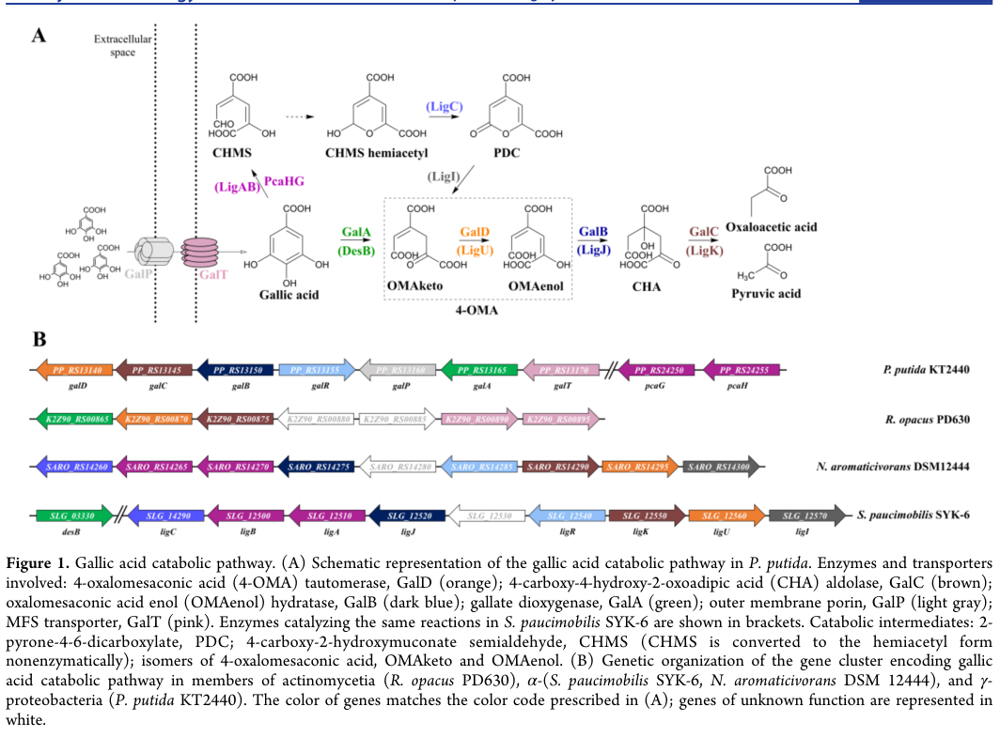

## Question

# Gene Research for Functional Annotation

## ⚠️ CRITICAL: Gene/Protein Identification Context

**BEFORE YOU BEGIN RESEARCH:** You MUST verify you are researching the CORRECT gene/protein. Gene symbols can be ambiguous, especially for less well-characterized genes from non-model organisms.

### Target Gene/Protein Identity (from UniProt):
- **UniProt Accession:** Q88JX7
- **Protein Description:** RecName: Full=HTH-type transcriptional regulator GalR; AltName: Full=Gallate degradation protein R;
- **Gene Information:** Name=galR; OrderedLocusNames=PP_2516;
- **Organism (full):** Pseudomonas putida (strain ATCC 47054 / DSM 6125 / CFBP 8728 / NCIMB 11950 / KT2440).
- **Protein Family:** Belongs to the LysR transcriptional regulatory family.
- **Key Domains:** HTH-type_LysR_regulators. (IPR050950); LysR_HTH_N. (IPR000847); LysR_subst-bd. (IPR005119); WH-like_DNA-bd_sf. (IPR036388); WH_DNA-bd_sf. (IPR036390)

### MANDATORY VERIFICATION STEPS:

1. **Check if the gene symbol "galR" matches the protein description above**
2. **Verify the organism is correct:** Pseudomonas putida (strain ATCC 47054 / DSM 6125 / CFBP 8728 / NCIMB 11950 / KT2440).
3. **Check if protein family/domains align with what you find in literature**
4. **If you find literature for a DIFFERENT gene with the same or similar symbol, STOP**

### If Gene Symbol is Ambiguous or You Cannot Find Relevant Literature:

**DO NOT PROCEED WITH RESEARCH ON A DIFFERENT GENE.** Instead:
- State clearly: "The gene symbol 'galR' is ambiguous or literature is limited for this specific protein"
- Explain what you found (e.g., "Found extensive literature on a different gene with the same symbol in a different organism")
- Describe the protein based ONLY on the UniProt information provided above
- Suggest that the protein function can be inferred from domain/family information

### Research Target:

Please provide a comprehensive research report on the gene **galR** (gene ID: galR, UniProt: Q88JX7) in PSEPK.

The research report should be a detailed narrative explaining the function, biological processes, and localization of the gene product. Citations should be given for all claims.

You should prioritize authoritative reviews and primary scientific literature when conducting research. You can supplement
this with annotations you find in gene/protein databases, but these can be outdated or inaccurate.

We are specifically interested in the primary function of the gene - for enzymes, what reaction is catalyzed, and what is the substrate specificity? For transporters, what is the substrate? For structural proteins or adapters, what is the broader structural role? For signaling molecules, what is the role in the pathway.

We are interested in where in or outside the cell the gene product carries out its function.

We are also interested in the signaling or biochemical pathways in which the gene functions. We are less interested in broad pleiotropic effects, except where these elucidate the precise role.

Include evidence where possible. We are interested in both experimental evidence as well as inference from structure, evolution, or bioinformatic analysis. Precise studies should be prioritized over high-throughput, where available.

## Output

Question: You are an expert researcher providing comprehensive, well-cited information.

Provide detailed information focusing on:
1. Key concepts and definitions with current understanding
2. Recent developments and latest research (prioritize 2023-2024 sources)
3. Current applications and real-world implementations
4. Expert opinions and analysis from authoritative sources
5. Relevant statistics and data from recent studies

Format as a comprehensive research report with proper citations. Include URLs and publication dates where available.
Always prioritize recent, authoritative sources and provide specific citations for all major claims.

# Gene Research for Functional Annotation

## ⚠️ CRITICAL: Gene/Protein Identification Context

**BEFORE YOU BEGIN RESEARCH:** You MUST verify you are researching the CORRECT gene/protein. Gene symbols can be ambiguous, especially for less well-characterized genes from non-model organisms.

### Target Gene/Protein Identity (from UniProt):
- **UniProt Accession:** Q88JX7
- **Protein Description:** RecName: Full=HTH-type transcriptional regulator GalR; AltName: Full=Gallate degradation protein R;
- **Gene Information:** Name=galR; OrderedLocusNames=PP_2516;
- **Organism (full):** Pseudomonas putida (strain ATCC 47054 / DSM 6125 / CFBP 8728 / NCIMB 11950 / KT2440).
- **Protein Family:** Belongs to the LysR transcriptional regulatory family.
- **Key Domains:** HTH-type_LysR_regulators. (IPR050950); LysR_HTH_N. (IPR000847); LysR_subst-bd. (IPR005119); WH-like_DNA-bd_sf. (IPR036388); WH_DNA-bd_sf. (IPR036390)

### MANDATORY VERIFICATION STEPS:

1. **Check if the gene symbol "galR" matches the protein description above**
2. **Verify the organism is correct:** Pseudomonas putida (strain ATCC 47054 / DSM 6125 / CFBP 8728 / NCIMB 11950 / KT2440).
3. **Check if protein family/domains align with what you find in literature**
4. **If you find literature for a DIFFERENT gene with the same or similar symbol, STOP**

### If Gene Symbol is Ambiguous or You Cannot Find Relevant Literature:

**DO NOT PROCEED WITH RESEARCH ON A DIFFERENT GENE.** Instead:
- State clearly: "The gene symbol 'galR' is ambiguous or literature is limited for this specific protein"
- Explain what you found (e.g., "Found extensive literature on a different gene with the same symbol in a different organism")
- Describe the protein based ONLY on the UniProt information provided above
- Suggest that the protein function can be inferred from domain/family information

### Research Target:

Please provide a comprehensive research report on the gene **galR** (gene ID: galR, UniProt: Q88JX7) in PSEPK.

The research report should be a detailed narrative explaining the function, biological processes, and localization of the gene product. Citations should be given for all claims.

You should prioritize authoritative reviews and primary scientific literature when conducting research. You can supplement
this with annotations you find in gene/protein databases, but these can be outdated or inaccurate.

We are specifically interested in the primary function of the gene - for enzymes, what reaction is catalyzed, and what is the substrate specificity? For transporters, what is the substrate? For structural proteins or adapters, what is the broader structural role? For signaling molecules, what is the role in the pathway.

We are interested in where in or outside the cell the gene product carries out its function.

We are also interested in the signaling or biochemical pathways in which the gene functions. We are less interested in broad pleiotropic effects, except where these elucidate the precise role.

Include evidence where possible. We are interested in both experimental evidence as well as inference from structure, evolution, or bioinformatic analysis. Precise studies should be prioritized over high-throughput, where available.

## Research report: functional annotation of **GalR** (UniProt **Q88JX7**; gene **galR**; ordered locus **PP_2516**) in *Pseudomonas putida* KT2440

### 1) Target verification (critical disambiguation)
The symbol **galR** is highly ambiguous across bacteria (often used for galactose regulon regulators), so functional annotation must be tied to the specified accession/organism. UniProt **Q88JX7** is described as an **HTH-type LysR-family transcriptional regulator** annotated as “gallate degradation protein R / GalR” in *P. putida* KT2440. A recent primary study on *P. putida* KT2440 describes a **LysR-family transcriptional regulator named GalR** that activates the **gallic acid (gallate) catabolic gene cluster** (the “gal operon/cluster”) (kutraite2023developmentandapplication pages 2-3). 

Evidence gap: the 2023 study uses KT2440 locus tags in the **PP_RS…** namespace (e.g., **PP_RS13155** for galR), whereas UniProt Q88JX7 lists the ordered locus as **PP_2516**; a direct cross-reference between these locus-tag systems was not retrieved in this run, so the mapping **Q88JX7/PP_2516 ↔ PP_RS13155** is **very likely but not formally demonstrated here** (kutraite2023developmentandapplication pages 2-3).

### 2) Key concepts and definitions (current understanding)

#### LysR-type transcriptional regulators (LTTRs)
**LysR-type transcriptional regulators (LTTRs)** are among the most abundant bacterial transcription factors. They typically:
- bind DNA via an N-terminal **helix–turn–helix (HTH)** domain,
- recognize promoter-proximal motifs that often include an LTTR core (commonly described as a **T–N11–A** pattern),
- respond to a small-molecule **effector/inducer**, frequently a pathway intermediate, and
- modulate RNA polymerase engagement through promoter architecture that can involve a **regulatory binding site (RBS)** and **activation binding site (ABS)** (kutraite2023developmentandapplication pages 3-4, kutraite2023developmentandapplication pages 2-3).

#### Gallate/gallic acid degradation and the “gal” cluster
In *P. putida* KT2440, gallic acid (gallate; 3,4,5-trihydroxybenzoate) is degraded via a gene cluster/operon including **galA, galB, galC, galD**, with associated transport genes **galT** and **galP** (kutraite2023developmentandapplication pages 2-3, kutraite2023developmentandapplication pages 1-2, kutraite2023developmentandapplication media 003d80a5). The pathway produces the ring-cleavage intermediate **4-oxalomesaconate (4-OMA)**, which is central both to metabolism and regulation (kutraite2023developmentandapplication pages 1-2, kutraite2023developmentandapplication media 003d80a5).

### 3) Primary function of GalR (molecular function, targets, effector, mechanism)

#### 3.1 Molecular function: transcriptional activation of gallate catabolism genes
GalR is experimentally supported to function as a **transcriptional activator** controlling expression from promoters associated with the gallic-acid utilization cluster when cultures are supplemented with gallic acid (kutraite2023developmentandapplication pages 2-3). In reporter constructs, providing an additional copy of **galR** increased activation, consistent with GalR acting as the positive regulator for these promoters (kutraite2023developmentandapplication pages 2-3).

#### 3.2 Regulon/targets (supported at the operon/cluster level)
The 2023 study frames GalR regulation at the level of the **gal operon/cluster**, consisting of **galA/galB/galC/galD** (catabolic enzymes) and linked with **galT/galP** (transport functions) (kutraite2023developmentandapplication pages 2-3, kutraite2023developmentandapplication pages 1-2). This is reinforced by the pathway/cluster schematic (Figure 1) retrieved from the same study (kutraite2023developmentandapplication media 003d80a5).

Important limitation: while the study provides promoter-level evidence and a cluster model, it explicitly notes that **GalR DNA target binding sites have not been experimentally characterized to date** (kutraite2023developmentandapplication pages 2-3).

#### 3.3 Effector/ligand: **4-oxalomesaconate (4-OMA)** is the primary effector required for activation
A key recent advance is that GalR does **not** appear to respond directly to extracellular gallic acid; instead, the system requires **GalA activity** and the pathway intermediate **4-oxalomesaconate (4-OMA)**. The authors identify 4-OMA as the **primary effector required** for activation of the inducible system, and show that induction in non-native hosts requires co-introduction of **galA** to generate the effector (kutraite2023developmentandapplication pages 1-2, kutraite2023developmentandapplication pages 3-4, kutraite2023developmentandapplication pages 4-6). A biosensor mechanism schematic consistent with “gallic acid uptake → GalA → 4-OMA → GalR activation” was also retrieved (kutraite2023developmentandapplication media 003d80a5).

Open mechanistic question: the study highlights uncertainty about whether the **keto** and/or **enol** form of OMA is the active effector, noting the need for further work (kutraite2023developmentandapplication pages 3-4).

#### 3.4 Proposed DNA-binding mechanism (inference anchored by sequence analysis)
Based on comparative sequence analysis of the intergenic promoter region (PP_RS13150/PP_RS13155), the authors describe conserved motifs upstream of **galB** consistent with canonical LTTR promoter architectures, including an extended motif consistent with a LysR-like core (e.g., **CTATA–N9–TATAG**) and a putative activation-site motif near the RNAP −35 region (kutraite2023developmentandapplication pages 3-4). However, these motifs are presented as **predictions**, not confirmed by direct binding assays (kutraite2023developmentandapplication pages 2-3).

### 4) Biological process and pathway placement (what GalR “does for the cell”)

#### 4.1 Pathway overview (gallic acid → central metabolism)
Within the *P. putida* “gal” pathway, **GalA** is the initiating dioxygenase step producing **4-OMA**, after which downstream enzymes (GalB/GalC/GalD in the cluster model) transform intermediates toward central metabolism (kutraite2023developmentandapplication pages 1-2, kutraite2023developmentandapplication media 003d80a5). A synthetic-biology-focused thesis summarizes this pathway as producing central metabolites (reported as pyruvate and oxaloacetate) (rojas2020developmentofsynthetic pages 28-33), but this thesis is not a peer-reviewed primary characterization and should be treated as secondary synthesis.

More broadly, aromatic ring cleavage and downstream assimilation of lignin-derived aromatics is a major theme in environmental/industrial microbiology; classic reviews emphasize bacterial roles in mineralization of lignin-derived low-molecular-weight aromatics and the importance of elucidating enzyme systems for carbon cycling and industrial conversion (masai2007geneticandbiochemical pages 1-3).

#### 4.2 Functional logic of regulation
The emerging regulatory logic is:
1) transporter functions (GalP/GalT) help bring gallic acid into the cell,
2) GalA converts it to **4-OMA**, 
3) **4-OMA** activates GalR, 
4) GalR activates promoter(s) driving the catabolic/transport genes, reinforcing the system when substrate is present (kutraite2023developmentandapplication pages 1-2, kutraite2023developmentandapplication pages 2-3, kutraite2023developmentandapplication pages 4-6, kutraite2023developmentandapplication media 003d80a5).

This “intermediate-as-effector” logic is common in bacterial catabolic regulation and helps prevent unnecessary pathway expression unless flux into the pathway is occurring.

### 5) Cellular localization (where the gene product acts)
No direct subcellular localization experiments for GalR were retrieved. Given that GalR is a DNA-binding LTTR regulating transcription from chromosomal promoters, its functional location is best inferred as **cytosolic/nucleoid-associated** (i.e., acting at DNA in the cytoplasm), rather than membrane or extracellular (kutraite2023developmentandapplication pages 2-3, kutraite2023developmentandapplication pages 3-4).

### 6) Recent developments (prioritize 2023–2024)

#### 6.1 2023: effector identification and tool-building around GalR
A major 2023 development is the explicit identification of **4-OMA** as the **primary effector** for the *P. putida* GalR system and the demonstration that **GalA is required** to generate this effector (kutraite2023developmentandapplication pages 1-2, kutraite2023developmentandapplication pages 4-6). In addition to advancing pathway understanding, the work operationalizes the system as a **tunable transcription-factor-based sensor/inducible system** (kutraite2023developmentandapplication pages 4-6).

#### 6.2 2024: gallate→OMA appears as a recurring node in lignin-related aromatic metabolism
A 2024 Nature Communications study on lignin-related aromatic metabolism in *Xanthomonas citri* references the conversion of **gallate to 4-OMA** as a plausible step in lignin-derived aromatic processing frameworks and uses *P. putida* KT2440 as one of the model organisms in this broader space (martim2024resolvingthemetabolism pages 3-5). While not GalR-specific, this highlights that gallate/OMA chemistry is a recognized node in contemporary aromatic-metabolism research.

### 7) Current applications and real-world implementations

#### 7.1 Whole-cell biosensors for gallic acid (implementation in native and heterologous hosts)
The GalR-controlled promoter systems (**PPP_RS13150** and **PPP_RS13170**) have been implemented as **whole-cell biosensors** and inducible expression systems. In *P. putida*, both promoters are activated by exogenous gallic acid, and activation is enhanced by providing an additional copy of **galR** (kutraite2023developmentandapplication pages 2-3). 

The same study demonstrates that the system can be ported to non-native hosts, but only works robustly when the host is engineered to generate the true effector 4-OMA (i.e., requires **galA**, and benefits from transport such as **GalT**), enabling biosensing in organisms such as *E. coli* and *Cupriavidus necator* (kutraite2023developmentandapplication pages 1-2, kutraite2023developmentandapplication pages 3-4).

#### 7.2 Demonstrated real-world sample measurement
The *P. putida* biosensor was applied to estimate gallic acid in **green tea extracts**, demonstrating a practical analytical use case beyond pure lab standards (kutraite2023developmentandapplication pages 4-6).

### 8) Quantitative statistics and data (from recent studies)

#### 8.1 Promoter and induction performance
In *P. putida* reporter assays (6 h after inducer addition), GalR-dependent systems showed strong induction, with the **PpGalR/PPP_RS13150** system reported as mediating **~45-fold or ~248-fold** induction (depending on construct/conditions) (kutraite2023developmentandapplication pages 3-4). Both **PPP_RS13150** and **PPP_RS13170** promoter regions were activated by exogenous gallic acid, with example reported inductions of approximately **9.7-/2.5-fold** or **72.3-/45.6-fold** depending on medium/construct (kutraite2023developmentandapplication pages 2-3). A promoter-only construct showed only minor induction (**1.7-fold or 6.3-fold**), consistent with GalR being required for robust activation (kutraite2023developmentandapplication pages 2-3).

#### 8.2 Biosensor detection limits and tunable range
Reported sensitivity metrics include:
- prior/native host system detection down to **~0.5–1 µM** gallic acid (as cited in the 2023 study) (kutraite2023developmentandapplication pages 2-3),
- engineered biosensor limits of detection (LOD): **~9.7 µM** for the *P. putida* biosensor (BS1) and **~78 µM** for the *E. coli* biosensor (BS2) (kutraite2023developmentandapplication pages 4-6),
- tunable response range reported at approximately **0.312–1.25 mM** extracellular gallic acid (kutraite2023developmentandapplication pages 4-6).

Dynamic ranges (fold induction) were reported as high, including examples up to **~2,138-fold** (BS1) and **~162-fold** (BS2), with some alternate values in supplementary reporting noted by the authors (kutraite2023developmentandapplication pages 4-6).

### 9) Expert opinions / authoritative synthesis (interpretation)
A long-standing view in aromatic catabolism is that bacteria are major contributors to mineralization of lignin-derived, low-molecular-weight aromatics in soils and that elucidating pathway genes/enzymes provides tools for industrially useful bioconversion (masai2007geneticandbiochemical pages 1-3). The 2023 GalR study exemplifies this dual scientific/biotechnological value: it clarifies an unusual regulatory feature (intermediate-driven induction via 4-OMA) and immediately deploys it as a biosensing/inducible-expression platform (kutraite2023developmentandapplication pages 1-2, kutraite2023developmentandapplication pages 4-6).

### 10) Comparative notes (to avoid misannotation)
Because “galR” is used for unrelated regulators in other organisms, it is important not to generalize findings across taxa without evidence. For instance, a *Lactobacillus plantarum* LysR-family regulator (TanR) is required for gene induction in response to methyl gallate/gallic acid, illustrating convergent regulatory logic, but it is not the same gene/protein and should not be conflated with *Pseudomonas* GalR (reveron2017differentialgeneexpression pages 13-15).

### 11) Consolidated evidence table
The table below consolidates experimentally supported claims versus inference and highlights evidence gaps.

| Claim about GalR | Evidence type | Key details / quantitative data | Source |
|---|---|---|---|
| **Identity is consistent with a LysR-family transcriptional regulator involved in gallate/gallic acid catabolism in *Pseudomonas putida* KT2440** | Experimental pathway context + bioinformatic family assignment | 2023 study describes **GalR** as a **LysR family TR** controlling the **gal operon** in *P. putida* KT2440; UniProt Q88JX7 description as an HTH-type LysR regulator is consistent with this functional context. The precise **PP_2516 ↔ PP_RS13155** locus-tag crosswalk was not directly shown in retrieved contexts, so synonymy should be treated as probable rather than fully demonstrated here. (kutraite2023developmentandapplication pages 2-3, rojas2020developmentofsynthetic pages 28-33) | Kutraite & Malys, 2023, ACS Synth. Biol., DOI: 10.1021/acssynbio.2c00537, https://doi.org/10.1021/acssynbio.2c00537; Rojas, 2020, thesis/preprint, DOI: 10.11606/d.17.2020.tde-19082020-091727, https://doi.org/10.11606/d.17.2020.tde-19082020-091727 |
| **Primary molecular function: transcriptional activator of the gal operon** | Experimental | GalR was reported to act as a **transcriptional activator** of the **gal operon** when gallic acid is present. Extra plasmid-borne **galR** increased reporter activation from both tested promoters, supporting an activator role. (kutraite2023developmentandapplication pages 2-3) | Kutraite & Malys, 2023, https://doi.org/10.1021/acssynbio.2c00537 |
| **Likely regulon includes genes for gallate degradation and uptake** | Experimental + pathway inference | The *gal* operon comprises **galA, galB, galC, galD** (catabolic enzymes) and is linked with transport genes **galT** and **galP** that aid gallic-acid uptake. This places GalR upstream of both degradation and transport functions. (kutraite2023developmentandapplication pages 2-3, kutraite2023developmentandapplication pages 1-2, rojas2020developmentofsynthetic pages 28-33) | Kutraite & Malys, 2023, https://doi.org/10.1021/acssynbio.2c00537; Rojas, 2020, https://doi.org/10.11606/d.17.2020.tde-19082020-091727 |
| **Pathway role: GalR controls entry of gallic acid into a ring-cleavage pathway feeding central metabolism** | Experimental pathway characterization + background review | Retrieved contexts place GalR at the head of a pathway where **GalA** performs gallate ring cleavage to **4-oxalomesaconate (4-OMA)**, followed by **GalD/GalB/GalC** reactions that yield metabolites entering central metabolism (reported as pyruvate and oxaloacetate in the thesis summary). (kutraite2023developmentandapplication pages 1-2, rojas2020developmentofsynthetic pages 28-33) | Kutraite & Malys, 2023, https://doi.org/10.1021/acssynbio.2c00537; Rojas, 2020, https://doi.org/10.11606/d.17.2020.tde-19082020-091727 |
| **Effector is not gallic acid itself, but the pathway intermediate 4-oxalomesaconate (4-OMA)** | Experimental | 2023 functional analysis showed induction requires **galA** activity and identified **4-OMA** as the **primary effector** interacting with GalR. In non-native hosts, gallic acid did not trigger induction unless **galA** was also supplied, supporting 4-OMA dependence. (kutraite2023developmentandapplication pages 1-2, kutraite2023developmentandapplication pages 3-4, kutraite2023developmentandapplication pages 4-6, kutraite2023developmentandapplication pages 2-3) | Kutraite & Malys, 2023, https://doi.org/10.1021/acssynbio.2c00537 |
| **Mechanism is consistent with canonical LysR-family activation at paired DNA sites** | Bioinformatic inference supported by reporter experiments | A conserved ~40-nt region upstream of **galB** contains motifs resembling LysR **RBS/ABS** elements, including a LysR-like **T-N11-A** core in an extended **CTATA-N9-TATAG** motif; GalR is proposed to bind regulatory and activation sites near the RNAP −35 region. However, the study explicitly notes that **GalR target binding sites have not yet been experimentally characterized**. (kutraite2023developmentandapplication pages 3-4, kutraite2023developmentandapplication pages 2-3) | Kutraite & Malys, 2023, https://doi.org/10.1021/acssynbio.2c00537 |
| **Promoters responsive to GalR include PPP_RS13150 and PPP_RS13170** | Experimental | Both promoter regions were activated by exogenous gallic acid in *P. putida*. Reported fold induction values included approximately **45- or 248-fold** for **PpGalR/PPP_RS13150** and approximately **9.7-/2.5-fold** or **72.3-/45.6-fold** for constructs involving **PPP_RS13170** depending on medium/construct configuration. A promoter-only variant showed only minor induction (**1.7- or 6.3-fold**), consistent with GalR dependence. (kutraite2023developmentandapplication pages 2-3, kutraite2023developmentandapplication pages 3-4, kutraite2023developmentandapplication media 003d80a5) | Kutraite & Malys, 2023, https://doi.org/10.1021/acssynbio.2c00537 |
| **Quantitative biosensor implementations confirm strong GalR-dependent responsiveness** | Experimental / real-world implementation | GalR-based biosensors were built in *P. putida* and *E. coli*. Reported engineered-system metrics include **LOD ~9.7 μM** for BS1 (*P. putida*) and **78 μM** for BS2 (*E. coli*), tunable response over about **0.312–1.25 mM** extracellular gallic acid, and dynamic ranges reported as up to **~112- and ~2,138-fold** (BS1) and **~75- and ~162-fold** (BS2), with some alternate values in supplementary reporting. Earlier native detection was noted as **0.5–1 μM**. (kutraite2023developmentandapplication pages 4-6, kutraite2023developmentandapplication pages 2-3, kutraite2023developmentandapplication media 003d80a5) | Kutraite & Malys, 2023, https://doi.org/10.1021/acssynbio.2c00537 |
| **Transport contributes to GalR system output via GalT/GalP-mediated uptake** | Experimental + inference | The 2023 study linked GalR-regulated sensing to **GalA**, **GalT**, and likely **GalP**. In *E. coli*, which lacks GalT homologs, adding **GalT** improved reporter output, supporting a role for transport in supplying substrate for conversion to the true effector 4-OMA. (kutraite2023developmentandapplication pages 3-4, kutraite2023developmentandapplication pages 4-6) | Kutraite & Malys, 2023, https://doi.org/10.1021/acssynbio.2c00537 |
| **Subcellular localization is most consistent with a cytosolic DNA-binding regulator, but this was not directly tested** | Bioinformatic/functional inference | No retrieved paper provided direct localization experiments for GalR. Because GalR is a LysR-family HTH transcription factor acting on chromosomal promoters, its functional localization is best inferred as **cytosolic/nucleoid-associated** rather than membrane or extracellular. This remains an inference, not direct evidence. (kutraite2023developmentandapplication pages 2-3, kutraite2023developmentandapplication pages 3-4) | Kutraite & Malys, 2023, https://doi.org/10.1021/acssynbio.2c00537 |
| **Comparative precedent supports inducer-dependent activation as a plausible regulatory logic for gallate-responsive LysR regulators** | Comparative experimental precedent (different organism) | In *Lactobacillus plantarum*, the LysR-family regulator **TanR** is required for gene induction in response to **methyl gallate/gallic acid**, and transporter **GacP** participates in gallate uptake/export. This does **not** prove the *P. putida* mechanism, but supports a broader theme of gallate-responsive LysR regulation coupled to transport/metabolism. (reveron2017differentialgeneexpression pages 13-15) | Reverón et al., 2017, Appl. Environ. Microbiol., DOI: 10.1128/AEM.03387-16, https://doi.org/10.1128/AEM.03387-16 |
| **Broader application context: the GalR-controlled pathway is relevant to lignin-aromatic valorization and biosensing** | Background review + direct implementation | Reviews and recent aromatic-catabolism studies place gallate/4-OMA chemistry within bacterial conversion of lignin-derived aromatics. In practice, the GalR system has already been implemented as a **whole-cell biosensor** for gallic acid detection, including application to **green tea extracts**. (masai2007geneticandbiochemical pages 1-3, martim2024resolvingthemetabolism pages 3-5, kutraite2023developmentandapplication media 003d80a5) | Masai et al., 2007, Biosci. Biotechnol. Biochem., DOI: 10.1271/bbb.60437, https://doi.org/10.1271/bbb.60437; Martim et al., 2024, Nat. Commun., DOI: 10.1038/s41467-024-52367-6, https://doi.org/10.1038/s41467-024-52367-6; Kutraite & Malys, 2023, https://doi.org/10.1021/acssynbio.2c00537 |

*Table: This table consolidates the main functional-annotation claims for Pseudomonas putida KT2440 GalR, separating direct experimental support from bioinformatic inference. It highlights what is well supported for GalR (activator role, 4-OMA effector, target pathway context, biosensor performance) and where evidence gaps remain.*

### 12) Evidence gaps and recommended next steps for stronger annotation
1) **Definitive identifier crosswalk**: explicitly map **UniProt Q88JX7 / PP_2516** to the **PP_RS13155** identifier used in recent literature via genome annotations or UniProt/NCBI cross-references (gap noted in this run) (kutraite2023developmentandapplication pages 2-3).
2) **Direct GalR–DNA interaction evidence**: confirm predicted RBS/ABS sites by **EMSA, DNase I footprinting, ChIP-seq**, and/or promoter mutagenesis targeted to the predicted motifs (kutraite2023developmentandapplication pages 2-3, kutraite2023developmentandapplication pages 3-4).
3) **Effector chemistry**: resolve whether **OMAketo** vs **OMAenol** (or both) binds GalR and determine binding constants (kutraite2023developmentandapplication pages 3-4).
4) **Regulon breadth**: determine whether GalR regulates additional genes beyond the immediate gal cluster under relevant environmental conditions.

### Key primary sources (with publication dates and URLs)
- Kutraite I, Malys N. **“Development and Application of Whole-Cell Biosensors for the Detection of Gallic Acid”**. *ACS Synthetic Biology* (published **Feb 2023**). https://doi.org/10.1021/acssynbio.2c00537 (kutraite2023developmentandapplication pages 1-2, kutraite2023developmentandapplication pages 2-3, kutraite2023developmentandapplication pages 4-6)
- Martim DB et al. **“Resolving the metabolism of monolignols and other lignin-related aromatic compounds in Xanthomonas citri”**. *Nature Communications* (published **Sep 2024**). https://doi.org/10.1038/s41467-024-52367-6 (martim2024resolvingthemetabolism pages 3-5)
- Masai E et al. **“Genetic and Biochemical Investigations on Bacterial Catabolic Pathways for Lignin-Derived Aromatic Compounds”**. *Bioscience, Biotechnology, and Biochemistry* (online publication **Jan 7, 2007**). https://doi.org/10.1271/bbb.60437 (masai2007geneticandbiochemical pages 1-3)

References

1. (kutraite2023developmentandapplication pages 2-3): Ingrida Kutraite and Naglis Malys. Development and application of whole-cell biosensors for the detection of gallic acid. ACS Synthetic Biology, 12:533-543, Feb 2023. URL: https://doi.org/10.1021/acssynbio.2c00537, doi:10.1021/acssynbio.2c00537. This article has 35 citations and is from a domain leading peer-reviewed journal.

2. (kutraite2023developmentandapplication pages 3-4): Ingrida Kutraite and Naglis Malys. Development and application of whole-cell biosensors for the detection of gallic acid. ACS Synthetic Biology, 12:533-543, Feb 2023. URL: https://doi.org/10.1021/acssynbio.2c00537, doi:10.1021/acssynbio.2c00537. This article has 35 citations and is from a domain leading peer-reviewed journal.

3. (kutraite2023developmentandapplication pages 1-2): Ingrida Kutraite and Naglis Malys. Development and application of whole-cell biosensors for the detection of gallic acid. ACS Synthetic Biology, 12:533-543, Feb 2023. URL: https://doi.org/10.1021/acssynbio.2c00537, doi:10.1021/acssynbio.2c00537. This article has 35 citations and is from a domain leading peer-reviewed journal.

4. (kutraite2023developmentandapplication media 003d80a5): Ingrida Kutraite and Naglis Malys. Development and application of whole-cell biosensors for the detection of gallic acid. ACS Synthetic Biology, 12:533-543, Feb 2023. URL: https://doi.org/10.1021/acssynbio.2c00537, doi:10.1021/acssynbio.2c00537. This article has 35 citations and is from a domain leading peer-reviewed journal.

5. (kutraite2023developmentandapplication pages 4-6): Ingrida Kutraite and Naglis Malys. Development and application of whole-cell biosensors for the detection of gallic acid. ACS Synthetic Biology, 12:533-543, Feb 2023. URL: https://doi.org/10.1021/acssynbio.2c00537, doi:10.1021/acssynbio.2c00537. This article has 35 citations and is from a domain leading peer-reviewed journal.

6. (rojas2020developmentofsynthetic pages 28-33): Maria Juliana Rolon Rojas. Development of synthetic biology tools by methods in silico and in vivo applied to bacteria of biotechnology importance. ArXiv, Mar 2020. URL: https://doi.org/10.11606/d.17.2020.tde-19082020-091727, doi:10.11606/d.17.2020.tde-19082020-091727. This article has 0 citations.

7. (masai2007geneticandbiochemical pages 1-3): Eiji MASAI, Yoshihiro KATAYAMA, and Masao FUKUDA. Genetic and biochemical investigations on bacterial catabolic pathways for lignin-derived aromatic compounds. Bioscience, Biotechnology, and Biochemistry, 71:1-15, Jan 2007. URL: https://doi.org/10.1271/bbb.60437, doi:10.1271/bbb.60437. This article has 635 citations.

8. (martim2024resolvingthemetabolism pages 3-5): Damaris B. Martim, Anna J. V. C. Brilhante, Augusto R. Lima, Douglas A. A. Paixão, Joaquim Martins-Junior, Fernanda M. Kashiwagi, Lucia D. Wolf, Mariany S. Costa, Fabrícia F. Menezes, Rafaela Prata, Matheus C. Gazolla, Juliana A. Aricetti, Gabriela F. Persinoti, George J. M. Rocha, and Priscila O. Giuseppe. Resolving the metabolism of monolignols and other lignin-related aromatic compounds in xanthomonas citri. Nature Communications, Sep 2024. URL: https://doi.org/10.1038/s41467-024-52367-6, doi:10.1038/s41467-024-52367-6. This article has 14 citations and is from a highest quality peer-reviewed journal.

9. (reveron2017differentialgeneexpression pages 13-15): Inés Reverón, Natalia Jiménez, José Antonio Curiel, Elena Peñas, Félix López de Felipe, Blanca de las Rivas, and Rosario Muñoz. Differential gene expression by lactobacillus plantarum wcfs1 in response to phenolic compounds reveals new genes involved in tannin degradation. Applied and Environmental Microbiology, Apr 2017. URL: https://doi.org/10.1128/aem.03387-16, doi:10.1128/aem.03387-16. This article has 66 citations and is from a peer-reviewed journal.

## Artifacts

- [Edison artifact artifact-00](galR-deep-research-falcon_artifacts/artifact-00.md)

## Citations

1. kutraite2023developmentandapplication pages 2-3
2. kutraite2023developmentandapplication pages 3-4
3. rojas2020developmentofsynthetic pages 28-33
4. masai2007geneticandbiochemical pages 1-3
5. kutraite2023developmentandapplication pages 4-6
6. martim2024resolvingthemetabolism pages 3-5
7. reveron2017differentialgeneexpression pages 13-15
8. kutraite2023developmentandapplication pages 1-2
9. https://doi.org/10.1021/acssynbio.2c00537;
10. https://doi.org/10.11606/d.17.2020.tde-19082020-091727
11. https://doi.org/10.1021/acssynbio.2c00537
12. https://doi.org/10.1128/AEM.03387-16
13. https://doi.org/10.1271/bbb.60437;
14. https://doi.org/10.1038/s41467-024-52367-6;
15. https://doi.org/10.1038/s41467-024-52367-6
16. https://doi.org/10.1271/bbb.60437
17. https://doi.org/10.1021/acssynbio.2c00537,
18. https://doi.org/10.11606/d.17.2020.tde-19082020-091727,
19. https://doi.org/10.1271/bbb.60437,
20. https://doi.org/10.1038/s41467-024-52367-6,
21. https://doi.org/10.1128/aem.03387-16,