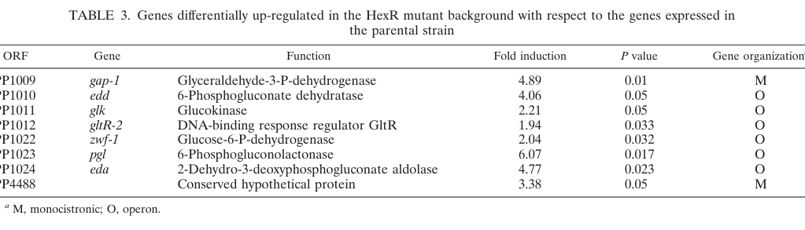

## Question

# Gene Research for Functional Annotation

## ⚠️ CRITICAL: Gene/Protein Identification Context

**BEFORE YOU BEGIN RESEARCH:** You MUST verify you are researching the CORRECT gene/protein. Gene symbols can be ambiguous, especially for less well-characterized genes from non-model organisms.

### Target Gene/Protein Identity (from UniProt):
- **UniProt Accession:** Q88P44
- **Protein Description:** RecName: Full=Glyceraldehyde-3-phosphate dehydrogenase {ECO:0000256|RuleBase:RU361160}; EC=1.2.1.- {ECO:0000256|RuleBase:RU361160};
- **Gene Information:** Name=gapA {ECO:0000313|EMBL:AAN66634.1}; OrderedLocusNames=PP_1009 {ECO:0000313|EMBL:AAN66634.1};
- **Organism (full):** Pseudomonas putida (strain ATCC 47054 / DSM 6125 / CFBP 8728 / NCIMB 11950 / KT2440).
- **Protein Family:** Belongs to the glyceraldehyde-3-phosphate dehydrogenase
- **Key Domains:** GlycerAld/Erythrose_P_DH. (IPR020831); GlycerAld_3-P_DH_AS. (IPR020830); GlycerAld_3-P_DH_cat. (IPR020829); GlycerAld_3-P_DH_NAD(P)-bd. (IPR020828); Glyceraldehyde-3-P_DH_1. (IPR006424)

### MANDATORY VERIFICATION STEPS:

1. **Check if the gene symbol "gapA" matches the protein description above**
2. **Verify the organism is correct:** Pseudomonas putida (strain ATCC 47054 / DSM 6125 / CFBP 8728 / NCIMB 11950 / KT2440).
3. **Check if protein family/domains align with what you find in literature**
4. **If you find literature for a DIFFERENT gene with the same or similar symbol, STOP**

### If Gene Symbol is Ambiguous or You Cannot Find Relevant Literature:

**DO NOT PROCEED WITH RESEARCH ON A DIFFERENT GENE.** Instead:
- State clearly: "The gene symbol 'gapA' is ambiguous or literature is limited for this specific protein"
- Explain what you found (e.g., "Found extensive literature on a different gene with the same symbol in a different organism")
- Describe the protein based ONLY on the UniProt information provided above
- Suggest that the protein function can be inferred from domain/family information

### Research Target:

Please provide a comprehensive research report on the gene **gapA** (gene ID: gapA, UniProt: Q88P44) in PSEPK.

The research report should be a detailed narrative explaining the function, biological processes, and localization of the gene product. Citations should be given for all claims.

You should prioritize authoritative reviews and primary scientific literature when conducting research. You can supplement
this with annotations you find in gene/protein databases, but these can be outdated or inaccurate.

We are specifically interested in the primary function of the gene - for enzymes, what reaction is catalyzed, and what is the substrate specificity? For transporters, what is the substrate? For structural proteins or adapters, what is the broader structural role? For signaling molecules, what is the role in the pathway.

We are interested in where in or outside the cell the gene product carries out its function.

We are also interested in the signaling or biochemical pathways in which the gene functions. We are less interested in broad pleiotropic effects, except where these elucidate the precise role.

Include evidence where possible. We are interested in both experimental evidence as well as inference from structure, evolution, or bioinformatic analysis. Precise studies should be prioritized over high-throughput, where available.

## Output

Question: You are an expert researcher providing comprehensive, well-cited information.

Provide detailed information focusing on:
1. Key concepts and definitions with current understanding
2. Recent developments and latest research (prioritize 2023-2024 sources)
3. Current applications and real-world implementations
4. Expert opinions and analysis from authoritative sources
5. Relevant statistics and data from recent studies

Format as a comprehensive research report with proper citations. Include URLs and publication dates where available.
Always prioritize recent, authoritative sources and provide specific citations for all major claims.

# Gene Research for Functional Annotation

## ⚠️ CRITICAL: Gene/Protein Identification Context

**BEFORE YOU BEGIN RESEARCH:** You MUST verify you are researching the CORRECT gene/protein. Gene symbols can be ambiguous, especially for less well-characterized genes from non-model organisms.

### Target Gene/Protein Identity (from UniProt):
- **UniProt Accession:** Q88P44
- **Protein Description:** RecName: Full=Glyceraldehyde-3-phosphate dehydrogenase {ECO:0000256|RuleBase:RU361160}; EC=1.2.1.- {ECO:0000256|RuleBase:RU361160};
- **Gene Information:** Name=gapA {ECO:0000313|EMBL:AAN66634.1}; OrderedLocusNames=PP_1009 {ECO:0000313|EMBL:AAN66634.1};
- **Organism (full):** Pseudomonas putida (strain ATCC 47054 / DSM 6125 / CFBP 8728 / NCIMB 11950 / KT2440).
- **Protein Family:** Belongs to the glyceraldehyde-3-phosphate dehydrogenase
- **Key Domains:** GlycerAld/Erythrose_P_DH. (IPR020831); GlycerAld_3-P_DH_AS. (IPR020830); GlycerAld_3-P_DH_cat. (IPR020829); GlycerAld_3-P_DH_NAD(P)-bd. (IPR020828); Glyceraldehyde-3-P_DH_1. (IPR006424)

### MANDATORY VERIFICATION STEPS:

1. **Check if the gene symbol "gapA" matches the protein description above**
2. **Verify the organism is correct:** Pseudomonas putida (strain ATCC 47054 / DSM 6125 / CFBP 8728 / NCIMB 11950 / KT2440).
3. **Check if protein family/domains align with what you find in literature**
4. **If you find literature for a DIFFERENT gene with the same or similar symbol, STOP**

### If Gene Symbol is Ambiguous or You Cannot Find Relevant Literature:

**DO NOT PROCEED WITH RESEARCH ON A DIFFERENT GENE.** Instead:
- State clearly: "The gene symbol 'gapA' is ambiguous or literature is limited for this specific protein"
- Explain what you found (e.g., "Found extensive literature on a different gene with the same symbol in a different organism")
- Describe the protein based ONLY on the UniProt information provided above
- Suggest that the protein function can be inferred from domain/family information

### Research Target:

Please provide a comprehensive research report on the gene **gapA** (gene ID: gapA, UniProt: Q88P44) in PSEPK.

The research report should be a detailed narrative explaining the function, biological processes, and localization of the gene product. Citations should be given for all claims.

You should prioritize authoritative reviews and primary scientific literature when conducting research. You can supplement
this with annotations you find in gene/protein databases, but these can be outdated or inaccurate.

We are specifically interested in the primary function of the gene - for enzymes, what reaction is catalyzed, and what is the substrate specificity? For transporters, what is the substrate? For structural proteins or adapters, what is the broader structural role? For signaling molecules, what is the role in the pathway.

We are interested in where in or outside the cell the gene product carries out its function.

We are also interested in the signaling or biochemical pathways in which the gene functions. We are less interested in broad pleiotropic effects, except where these elucidate the precise role.

Include evidence where possible. We are interested in both experimental evidence as well as inference from structure, evolution, or bioinformatic analysis. Precise studies should be prioritized over high-throughput, where available.

## Research report: **gapA / PP_1009 (UniProt Q88P44)** in *Pseudomonas putida* KT2440

### 0) Target verification (mandatory disambiguation)
The UniProt target Q88P44 is annotated as **glyceraldehyde-3-phosphate dehydrogenase (GAPDH)** in *Pseudomonas putida* KT2440, gene **gapA**, ordered locus **PP_1009**. In primary KT2440 literature, open reading frame **PP1009** is explicitly annotated as **gap-1 (gapA-like)** encoding glyceraldehyde-3-phosphate dehydrogenase, and it is described as **monocistronic**. This directly matches the UniProt-provided identity and function and rules out ambiguity with unrelated “gapA” symbols in other organisms. (castillo2008asetof pages 5-6, castillo2008asetof pages 4-5)

A schematic in the same work places this locus within the peripheral glucose catabolic gene clusters under central regulators (HexR/PtxS/GnuR), supporting that PP_1009 is part of the canonical glucose catabolic/regulatory landscape in KT2440. (castillo2008asetof media 9c82fbd7, castillo2008asetof media 584b5e53)

### 1) Key concepts and current functional definition
#### 1.1 Canonical biochemical role (GAPDH reaction)
GapA (GAPDH) catalyzes the oxidative phosphorylation step of lower glycolysis:

- **D-glyceraldehyde-3-phosphate + phosphate → 3-phospho-D-glyceroyl phosphate (1,3-bisphosphoglycerate) + NADH**

This explicitly indicates production of **NADH** (i.e., NAD+ is the electron acceptor) in the described reaction. (geiger2019investigationofrnabased pages 102-105)

A broader enzymology note reports that GAPDH “is known to act slowly on other aldehydes” and that “phosphates can be replaced by thiols,” consistent with known promiscuity/side reactivities described for GAPDH family enzymes (important when interpreting in vitro assays and stress conditions). (geiger2019investigationofrnabased pages 102-105)

#### 1.2 Substrate/cofactor specificity—what is known vs unknown for KT2440
- **Directly supported for KT2440 PP_1009:** NAD-linked activity is supported by the explicit **NADH** product in the reaction description. (geiger2019investigationofrnabased pages 102-105)
- **Not found in retrieved KT2440 sources:** quantitative **kinetic constants (Km/kcat)**, experimentally demonstrated **NAD vs NADP preference**, and measured **oligomeric state** for *KT2440* GapA were not present in the retrieved full texts.

Because of this, any finer-grained claims (e.g., “strictly NAD-specific” vs “dual NAD(P)”) cannot be asserted here for Q88P44 beyond NADH-forming activity, without consulting dedicated biochemical characterization studies.

#### 1.3 Cellular localization
No KT2440-specific experimental localization evidence (e.g., fractionation) was retrieved. However, gapA/GAPDH in bacteria is generally considered a **cytosolic enzyme** and, consistent with this, a closely related *Pseudomonas* GapA is predicted cytoplasmic in a comparative analysis; this is supportive but **inferential** for KT2440 Q88P44. (sun2025theroleof pages 4-6)

### 2) Pathway context in *P. putida* KT2440
#### 2.1 ED/EMP integration and the GAP node
*P. putida* KT2440 is widely described as using a hybrid central carbon architecture in which the **Entner–Doudoroff (ED)** pathway and portions of **EMP (glycolysis)** are integrated and interact with the pentose phosphate network. (lorenzo2024pseudomonasputidakt2440 pages 4-7)

Within the KT2440 glucose catabolic program:
- **Glyceraldehyde-3-phosphate (GAP)** is described as the end product of the **ED pathway** and is converted to **3-phosphoglycerate (3-PG)** by glyceraldehyde-3-phosphate dehydrogenase, encoded by **gapA** or an isozyme (**PP_3443**) acting in the “lower EMP” segment. (chen2024gnurrepressesthe pages 4-6)

This positions GapA at a key junction that couples ED-derived triose phosphate to lower glycolytic outputs and ultimately to TCA-cycle entry.

#### 2.2 Role in channeling carbon to the TCA cycle
In a foundational KT2440 study on peripheral glucose pathways and their regulators, glyceraldehyde-3-phosphate dehydrogenase is described as acting on “the final product of glucose metabolism” and helping “to channel glucose to Krebs cycle intermediates,” consistent with its functional placement at the end of the ED-derived glucose breakdown pipeline. (castillo2008asetof pages 5-6)

### 3) Regulation and control: what controls gapA/PP_1009 in KT2440?
#### 3.1 HexR repression (experimentally supported; quantitative)
In KT2440, **HexR** is demonstrated to repress PP_1009 (gap-1/gapA-like): in a **hexR mutant**, expression of **PP1009 (gap-1)** increased **4.89-fold** (P = 0.01). (castillo2008asetof pages 5-6, castillo2008asetof pages 4-5)

This result is also captured in the study’s Table 3 (image evidence). (castillo2008asetof media 9c82fbd7)

The same study provides broader context that HexR coordinates repression of multiple steps that lead to and through ED metabolism, consistent with coordinated control of glucose catabolism. (castillo2008asetof pages 1-2)

#### 3.2 GnuR and other regulators (2024 update)
A 2024 multi-omics study focused on **GnuR** reports that **gapA** is among catabolic genes “similarly induced” by both **glucose and gluconate**, along with ED and PP pathway genes, placing gapA within the substrate-responsive glucose/gluconate catabolic response. (chen2024gnurrepressesthe pages 4-6)

The same work states that the “primary role of GnuR” is to directly repress expression of catabolic genes functioning in ED and peripheral glucose/gluconate metabolism pathways, providing a contemporary regulatory model in which gapA participates as part of a coordinated regulon responding to glucose/gluconate availability. (chen2024gnurrepressesthe pages 3-4)

While the excerpt indicates that “several” genes in these pathways can increase “almost 100-fold” under glucose/gluconate versus succinate, the provided text does not report a gapA-specific fold-change, so this should be interpreted as **regulon-level** rather than gapA-specific quantitative evidence. (chen2024gnurrepressesthe pages 3-4)

#### 3.3 Genomic organization and regulatory schematics (visual evidence)
The del Castillo et al. work includes a schematic of peripheral glucose catabolic gene clusters and associated regulators (HexR/PtxS/GnuR), and Table 3 lists PP1009 (gap-1) among genes derepressed in the hexR mutant. These visuals support both genomic-context and regulatory claims. (castillo2008asetof media 9c82fbd7, castillo2008asetof media 584b5e53)

### 4) Recent developments (prioritizing 2023–2024)
#### 4.1 2024: multi-omics regulatory mapping of glucose/gluconate catabolism
Chen et al. (Microbial Biotechnology, **Nov 2024**) integrate physiological studies and multi-omics to define a regulatory mode for glucose/gluconate catabolism, emphasizing clustered catabolic genes and transcription factors, and explicitly placing **gapA** among the induced, central catabolic genes connected to ED/PP/EMP functions. (chen2024gnurrepressesthe pages 4-6)

#### 4.2 2024: systems biology—proteomics and flux interpretation at the GAP node
Mendonca et al. (Environmental Science & Technology, **Jun 2024**) provide proteomics evidence that *P. putida* has two GAPDH isozymes (GAPA and GAPB) and report condition-dependent regulation:
- GAPA abundance decreased **twofold** (p < 0.01) in glucose:ferulate mixed-substrate growth versus glucose-only; GAPB did not significantly change (p > 0.392). (mendonca2024disproportionatecarbondioxide pages 6-8)

They discuss functional partitioning (GAPA for lower glycolysis; GAPB for gluconeogenesis) and interpret that even with reduced GAPA, glycolytic flux downstream of GAP can remain favored, highlighting the GAP node as a key interface for coordinating carbon flux between glycolytic and gluconeogenic regimes under complex substrate mixtures. (mendonca2024disproportionatecarbondioxide pages 6-8)

### 5) Current applications and real-world implementations (with emphasis on 2024)
#### 5.1 KT2440 as an industrial/synthetic biology chassis—why the gapA node matters
A 2024 Journal of Bacteriology synthesis describes KT2440’s central metabolism (ED/EMP hybrid and triose/hexose recycling) as producing high reducing power (NAD(P)H) relative to ATP, a property linked to stress tolerance and suitability for engineering high-redox-demand bioprocesses; GapA is positioned at the triose-phosphate processing node that couples ED output to downstream metabolism and cofactor generation. (lorenzo2024pseudomonasputidakt2440 pages 4-7, lorenzo2024pseudomonasputidakt2440 pages 2-4)

The same 2024 source highlights real-world application areas enabled by this metabolism, including production of **polyhydroxyalkanoates (PHAs)** and multiple chemicals (e.g., cis,cis-muconate and others) and use in **bioremediation** of pollutants, as well as integration with **bioelectrochemical hardware** for biosensing and electron-assisted biodegradation/biocatalysis/CO2 reduction. (lorenzo2024pseudomonasputidakt2440 pages 4-7, lorenzo2024pseudomonasputidakt2440 pages 2-4)

#### 5.2 2024 bioelectrochemical implementation (explicitly dated)
Within the 2024 glucose/gluconate regulation paper’s cited application landscape, a concrete 2024 implementation is referenced: “Anaerobic glucose uptake in *Pseudomonas putida* KT2440 in a **bioelectrochemical system**” (Pause et al., 2024), indicating ongoing development of KT2440 in electro-biotechnology contexts where central carbon metabolism—and therefore GAPDH node capacity—can be limiting or targeted. (chen2024gnurrepressesthe pages 12-13, lorenzo2024pseudomonasputidakt2440 pages 12-12)

### 6) Key quantitative statistics (selected)
- **HexR repression strength:** PP1009/gap-1 expression increases **4.89-fold** in a hexR mutant (P = 0.01). (castillo2008asetof pages 5-6, castillo2008asetof pages 4-5)
- **Growth/uptake robustness in regulator mutants:** regulator mutants (including hexR) show similar growth rates (**~0.57–0.60 h−1**) and glucose consumption rates (**~6.84–9.7 mmol glucose·g cell biomass−1·h−1**) to parental strain under tested conditions. (castillo2008asetof pages 5-6, castillo2008asetof pages 4-5)
- **Proteomics regulation at the GAPDH node (2024):** GAPA decreases **twofold** (p < 0.01) in glucose:ferulate vs glucose-only; GAPB unchanged (p > 0.392). (mendonca2024disproportionatecarbondioxide pages 6-8)
- **Regulon-scale induction (2024):** multiple glucose catabolism genes can increase “almost **100-fold**” under glucose/gluconate vs succinate (note: not gapA-specific in excerpt). (chen2024gnurrepressesthe pages 3-4)

### 7) Evidence summary table
The following table consolidates key evidence items (identity, reaction, pathway placement, regulation, and quantitative results) with URLs and dates where available:

| Aspect | Key finding | Evidence source (first author year) | Publication date | URL | Citation id(s) |
|---|---|---|---|---|---|
| identity/locus | The target in *Pseudomonas putida* KT2440 is PP1009 (PP_1009), annotated as **gap-1 / gapA-like**, encoding glyceraldehyde-3-phosphate dehydrogenase; it is reported as **monocistronic** in the PP1009–PP1024 chromosomal region. | del Castillo 2008 | Apr 2008 | https://doi.org/10.1128/jb.01726-07 | (castillo2008asetof pages 5-6, castillo2008asetof pages 4-5) |
| reaction | GapA/GAPDH catalyzes oxidation/phosphorylation of D-glyceraldehyde-3-phosphate with inorganic phosphate to 3-phospho-D-glyceroyl phosphate (1,3-bisphosphoglycerate), producing **NADH**; one source notes the enzyme can act slowly on other aldehydes and thiols can substitute for phosphate. | Geiger 2019 | 2019 | not available | (geiger2019investigationofrnabased pages 102-105) |
| cofactor specificity | Available evidence supports **NAD-linked** GAPDH activity through explicit NADH formation in the reaction description. No KT2440-specific experimental evidence for NADP preference was retrieved in the gathered sources, so cofactor specificity beyond NAD-linked activity remains unresolved here. | Geiger 2019 | 2019 | not available | (geiger2019investigationofrnabased pages 102-105) |
| pathway role | In KT2440 glucose catabolism, GAP is the **end product of the Entner–Doudoroff (ED) pathway** and is converted to **3-phosphoglycerate (3-PG)** by GapA or the isozyme PP_3443 in the **lower EMP pathway**. HexR-regulated glucose pathways funnel carbon to the central intermediate 6-phosphogluconate and onward to GAP/pyruvate. | Chen 2024; del Castillo 2008 | Nov 2024; Apr 2008 | https://doi.org/10.1111/1751-7915.70059 ; https://doi.org/10.1128/jb.01726-07 | (chen2024gnurrepressesthe pages 3-4, chen2024gnurrepressesthe pages 4-6, castillo2008asetof pages 1-2) |
| regulation | **HexR represses gapA/gap-1**: in a **hexR** mutant, PP1009/gap-1 expression increased **4.89-fold** (**P = 0.01**). More recent work places gapA among catabolic genes induced by glucose and gluconate; several glucose-catabolism genes increased **almost 100-fold** under these conditions, although a gapA-specific fold-change was not given in the excerpt. | del Castillo 2008; Chen 2024 | Apr 2008; Nov 2024 | https://doi.org/10.1128/jb.01726-07 ; https://doi.org/10.1111/1751-7915.70059 | (castillo2008asetof pages 5-6, castillo2008asetof pages 4-5, chen2024gnurrepressesthe pages 3-4, chen2024gnurrepressesthe pages 4-6, castillo2008asetof media 9c82fbd7) |
| quantitative data | In the **hexR** mutant, overall physiology remained near wild type under tested conditions despite transcriptional derepression: growth rates were about **0.57 ± 0.01 to 0.60 ± 0.02 h−1**, and glucose consumption rates about **6.84 to 9.7 mmol glucose g cell biomass−1 h−1**. | del Castillo 2008 | Apr 2008 | https://doi.org/10.1128/jb.01726-07 | (castillo2008asetof pages 5-6, castillo2008asetof pages 4-5) |
| isozyme context | KT2440 has at least **two GAPDH isozymes, GAPA and GAPB**. Proteomics in 2024 showed **GAPA decreased twofold** (**p < 0.01**) in glucose+ferulate versus glucose alone, while **GAPB was unchanged** (**p > 0.392**). The authors interpret prior work as functional partitioning in which **GAPA supports lower glycolysis** and **GAPB supports gluconeogenesis**. | Mendonca 2024 | Jun 2024 | https://doi.org/10.1021/acs.est.4c01328 | (mendonca2024disproportionatecarbondioxide pages 6-8) |
| pathway/physiology context | During glucose or gluconate feeding, gapA grouped with ED/PP/EMP catabolic genes induced by both substrates. During mixed-substrate growth with ferulate, ED pathway usage remained prominent and glycolytic flux downstream of GAP was favored despite lower GAPA abundance. | Chen 2024; Mendonca 2024 | Nov 2024; Jun 2024 | https://doi.org/10.1111/1751-7915.70059 ; https://doi.org/10.1021/acs.est.4c01328 | (chen2024gnurrepressesthe pages 4-6, mendonca2024disproportionatecarbondioxide pages 6-8) |

*Table: This table compiles evidence-based findings for *Pseudomonas putida* KT2440 gapA/PP_1009, including identity, enzymatic function, regulation, pathway placement, and quantitative observations. It highlights what is directly supported by retrieved sources and where evidence remains inferential or incomplete.*

### 8) Evidence gaps and interpretation notes (important for functional annotation)
1. **KT2440 GapA kinetics and NADP usage:** No retrieved KT2440 primary biochemical characterization (Km/kcat, NAD vs NADP preference) was available in the accessed corpus; current statements are therefore limited to the explicit NADH-forming reaction description. (geiger2019investigationofrnabased pages 102-105)
2. **Localization:** No direct KT2440 localization experiment was retrieved; cytosolic localization is a reasonable inference for bacterial GAPDH and is supported by predictions in closely related *Pseudomonas* GapA analyses, but remains inferential for Q88P44 without KT2440-specific experiments. (sun2025theroleof pages 4-6)
3. **Isozyme mapping to PP_1009:** The 2024 proteomics/flux paper discusses GAPA/GAPB isozymes; the gathered excerpts do not explicitly map “GAPA” to the locus tag PP_1009, so isozyme nomenclature should be reconciled against genome annotations when producing a definitive functional annotation. (mendonca2024disproportionatecarbondioxide pages 6-8)

### 9) Annotated primary function statement (for database-style functional annotation)
**gapA (PP_1009; UniProt Q88P44)** encodes a glyceraldehyde-3-phosphate dehydrogenase that catalyzes the NAD-linked oxidative phosphorylation of glyceraldehyde-3-phosphate to 1,3-bisphosphoglycerate (NADH-producing), operating at the ED-to-lower-EMP interface in KT2440 glucose metabolism and contributing to routing ED-derived triose-phosphate toward downstream metabolism/TCA-cycle intermediates; its expression is negatively regulated by HexR and is induced as part of glucose/gluconate catabolic programs that include ED/PP/EMP genes. (geiger2019investigationofrnabased pages 102-105, chen2024gnurrepressesthe pages 4-6, castillo2008asetof pages 5-6)

References

1. (castillo2008asetof pages 5-6): Teresa del Castillo, Estrella Duque, and Juan L. Ramos. A set of activators and repressors control peripheral glucose pathways in <i>pseudomonas putida</i> to yield a common central intermediate. Journal of Bacteriology, 190:2331-2339, Apr 2008. URL: https://doi.org/10.1128/jb.01726-07, doi:10.1128/jb.01726-07. This article has 130 citations and is from a peer-reviewed journal.

2. (castillo2008asetof pages 4-5): Teresa del Castillo, Estrella Duque, and Juan L. Ramos. A set of activators and repressors control peripheral glucose pathways in <i>pseudomonas putida</i> to yield a common central intermediate. Journal of Bacteriology, 190:2331-2339, Apr 2008. URL: https://doi.org/10.1128/jb.01726-07, doi:10.1128/jb.01726-07. This article has 130 citations and is from a peer-reviewed journal.

3. (castillo2008asetof media 9c82fbd7): Teresa del Castillo, Estrella Duque, and Juan L. Ramos. A set of activators and repressors control peripheral glucose pathways in <i>pseudomonas putida</i> to yield a common central intermediate. Journal of Bacteriology, 190:2331-2339, Apr 2008. URL: https://doi.org/10.1128/jb.01726-07, doi:10.1128/jb.01726-07. This article has 130 citations and is from a peer-reviewed journal.

4. (castillo2008asetof media 584b5e53): Teresa del Castillo, Estrella Duque, and Juan L. Ramos. A set of activators and repressors control peripheral glucose pathways in <i>pseudomonas putida</i> to yield a common central intermediate. Journal of Bacteriology, 190:2331-2339, Apr 2008. URL: https://doi.org/10.1128/jb.01726-07, doi:10.1128/jb.01726-07. This article has 130 citations and is from a peer-reviewed journal.

5. (geiger2019investigationofrnabased pages 102-105): S Geiger. Investigation of rna-based regulation of gene expression in proteobacterial energy metabolism. Unknown journal, 2019.

6. (sun2025theroleof pages 4-6): Lei Sun, Dao-Jiao Tang, Qian-Nan Zhang, Lu-Lu Li, Lei Zhang, Xin-Yi Zan, Feng-Jie Cui, Ling Sun, and Wen-Jing Sun. The role of glyceraldehyde-3-phosphate dehydrogenase in 2-ketogluconic acid industrial production strain pseudomonas plecoglossicida juim01. Foods, 14:3830, Nov 2025. URL: https://doi.org/10.3390/foods14223830, doi:10.3390/foods14223830. This article has 0 citations.

7. (lorenzo2024pseudomonasputidakt2440 pages 4-7): Victor de Lorenzo, Danilo Pérez-Pantoja, and Pablo I. Nikel. <i>pseudomonas putida</i> kt2440: the long journey of a soil-dweller to become a synthetic biology chassis. Journal of Bacteriology, Jul 2024. URL: https://doi.org/10.1128/jb.00136-24, doi:10.1128/jb.00136-24. This article has 78 citations and is from a peer-reviewed journal.

8. (chen2024gnurrepressesthe pages 4-6): Wenbo Chen, Rao Ma, Yong Feng, Yunzhu Xiao, Agnieszka Sekowska, Antoine Danchin, and Conghui You. Gnur represses the expression of glucose and gluconate catabolism in pseudomonas putida kt2440. Microbial Biotechnology, Nov 2024. URL: https://doi.org/10.1111/1751-7915.70059, doi:10.1111/1751-7915.70059. This article has 2 citations and is from a peer-reviewed journal.

9. (castillo2008asetof pages 1-2): Teresa del Castillo, Estrella Duque, and Juan L. Ramos. A set of activators and repressors control peripheral glucose pathways in <i>pseudomonas putida</i> to yield a common central intermediate. Journal of Bacteriology, 190:2331-2339, Apr 2008. URL: https://doi.org/10.1128/jb.01726-07, doi:10.1128/jb.01726-07. This article has 130 citations and is from a peer-reviewed journal.

10. (chen2024gnurrepressesthe pages 3-4): Wenbo Chen, Rao Ma, Yong Feng, Yunzhu Xiao, Agnieszka Sekowska, Antoine Danchin, and Conghui You. Gnur represses the expression of glucose and gluconate catabolism in pseudomonas putida kt2440. Microbial Biotechnology, Nov 2024. URL: https://doi.org/10.1111/1751-7915.70059, doi:10.1111/1751-7915.70059. This article has 2 citations and is from a peer-reviewed journal.

11. (mendonca2024disproportionatecarbondioxide pages 6-8): Caroll M. Mendonca, Lichun Zhang, Jacob R. Waldbauer, and Ludmilla Aristilde. Disproportionate carbon dioxide efflux in bacterial metabolic pathways for different organic substrates leads to variable contribution to carbon-use efficiency. Environmental Science & Technology, 58:11041-11052, Jun 2024. URL: https://doi.org/10.1021/acs.est.4c01328, doi:10.1021/acs.est.4c01328. This article has 17 citations and is from a domain leading peer-reviewed journal.

12. (lorenzo2024pseudomonasputidakt2440 pages 2-4): Victor de Lorenzo, Danilo Pérez-Pantoja, and Pablo I. Nikel. <i>pseudomonas putida</i> kt2440: the long journey of a soil-dweller to become a synthetic biology chassis. Journal of Bacteriology, Jul 2024. URL: https://doi.org/10.1128/jb.00136-24, doi:10.1128/jb.00136-24. This article has 78 citations and is from a peer-reviewed journal.

13. (chen2024gnurrepressesthe pages 12-13): Wenbo Chen, Rao Ma, Yong Feng, Yunzhu Xiao, Agnieszka Sekowska, Antoine Danchin, and Conghui You. Gnur represses the expression of glucose and gluconate catabolism in pseudomonas putida kt2440. Microbial Biotechnology, Nov 2024. URL: https://doi.org/10.1111/1751-7915.70059, doi:10.1111/1751-7915.70059. This article has 2 citations and is from a peer-reviewed journal.

14. (lorenzo2024pseudomonasputidakt2440 pages 12-12): Victor de Lorenzo, Danilo Pérez-Pantoja, and Pablo I. Nikel. <i>pseudomonas putida</i> kt2440: the long journey of a soil-dweller to become a synthetic biology chassis. Journal of Bacteriology, Jul 2024. URL: https://doi.org/10.1128/jb.00136-24, doi:10.1128/jb.00136-24. This article has 78 citations and is from a peer-reviewed journal.

## Artifacts

- [Edison artifact artifact-00](gapA-deep-research-falcon_artifacts/artifact-00.md)

## Citations

1. geiger2019investigationofrnabased pages 102-105
2. sun2025theroleof pages 4-6
3. chen2024gnurrepressesthe pages 4-6
4. castillo2008asetof pages 5-6
5. castillo2008asetof pages 1-2
6. chen2024gnurrepressesthe pages 3-4
7. mendonca2024disproportionatecarbondioxide pages 6-8
8. castillo2008asetof pages 4-5
9. chen2024gnurrepressesthe pages 12-13
10. https://doi.org/10.1128/jb.01726-07
11. https://doi.org/10.1111/1751-7915.70059
12. https://doi.org/10.1021/acs.est.4c01328
13. https://doi.org/10.1128/jb.01726-07,
14. https://doi.org/10.3390/foods14223830,
15. https://doi.org/10.1128/jb.00136-24,
16. https://doi.org/10.1111/1751-7915.70059,
17. https://doi.org/10.1021/acs.est.4c01328,