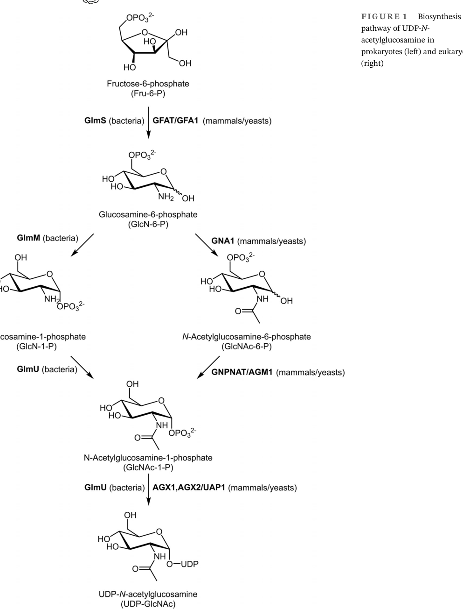

## Question

# Gene Research for Functional Annotation

## ⚠️ CRITICAL: Gene/Protein Identification Context

**BEFORE YOU BEGIN RESEARCH:** You MUST verify you are researching the CORRECT gene/protein. Gene symbols can be ambiguous, especially for less well-characterized genes from non-model organisms.

### Target Gene/Protein Identity (from UniProt):
- **UniProt Accession:** Q88BX6
- **Protein Description:** RecName: Full=Bifunctional protein GlmU {ECO:0000255|HAMAP-Rule:MF_01631}; Includes: RecName: Full=UDP-N-acetylglucosamine pyrophosphorylase {ECO:0000255|HAMAP-Rule:MF_01631}; EC=2.7.7.23 {ECO:0000255|HAMAP-Rule:MF_01631}; AltName: Full=N-acetylglucosamine-1-phosphate uridyltransferase {ECO:0000255|HAMAP-Rule:MF_01631}; Includes: RecName: Full=Glucosamine-1-phosphate N-acetyltransferase {ECO:0000255|HAMAP-Rule:MF_01631}; EC=2.3.1.157 {ECO:0000255|HAMAP-Rule:MF_01631};
- **Gene Information:** Name=glmU {ECO:0000255|HAMAP-Rule:MF_01631}; OrderedLocusNames=PP_5411;
- **Organism (full):** Pseudomonas putida (strain ATCC 47054 / DSM 6125 / CFBP 8728 / NCIMB 11950 / KT2440).
- **Protein Family:** In the C-terminal section; belongs to the transferase
- **Key Domains:** Bifunctional_GlmU. (IPR005882); GlmU-like. (IPR050065); GlmU_C_LbH. (IPR038009); GMPPB_C. (IPR056729); Hexapep. (IPR001451)

### MANDATORY VERIFICATION STEPS:

1. **Check if the gene symbol "glmU" matches the protein description above**
2. **Verify the organism is correct:** Pseudomonas putida (strain ATCC 47054 / DSM 6125 / CFBP 8728 / NCIMB 11950 / KT2440).
3. **Check if protein family/domains align with what you find in literature**
4. **If you find literature for a DIFFERENT gene with the same or similar symbol, STOP**

### If Gene Symbol is Ambiguous or You Cannot Find Relevant Literature:

**DO NOT PROCEED WITH RESEARCH ON A DIFFERENT GENE.** Instead:
- State clearly: "The gene symbol 'glmU' is ambiguous or literature is limited for this specific protein"
- Explain what you found (e.g., "Found extensive literature on a different gene with the same symbol in a different organism")
- Describe the protein based ONLY on the UniProt information provided above
- Suggest that the protein function can be inferred from domain/family information

### Research Target:

Please provide a comprehensive research report on the gene **glmU** (gene ID: glmU, UniProt: Q88BX6) in PSEPK.

The research report should be a detailed narrative explaining the function, biological processes, and localization of the gene product. Citations should be given for all claims.

You should prioritize authoritative reviews and primary scientific literature when conducting research. You can supplement
this with annotations you find in gene/protein databases, but these can be outdated or inaccurate.

We are specifically interested in the primary function of the gene - for enzymes, what reaction is catalyzed, and what is the substrate specificity? For transporters, what is the substrate? For structural proteins or adapters, what is the broader structural role? For signaling molecules, what is the role in the pathway.

We are interested in where in or outside the cell the gene product carries out its function.

We are also interested in the signaling or biochemical pathways in which the gene functions. We are less interested in broad pleiotropic effects, except where these elucidate the precise role.

Include evidence where possible. We are interested in both experimental evidence as well as inference from structure, evolution, or bioinformatic analysis. Precise studies should be prioritized over high-throughput, where available.

## Output

Question: You are an expert researcher providing comprehensive, well-cited information.

Provide detailed information focusing on:
1. Key concepts and definitions with current understanding
2. Recent developments and latest research (prioritize 2023-2024 sources)
3. Current applications and real-world implementations
4. Expert opinions and analysis from authoritative sources
5. Relevant statistics and data from recent studies

Format as a comprehensive research report with proper citations. Include URLs and publication dates where available.
Always prioritize recent, authoritative sources and provide specific citations for all major claims.

# Gene Research for Functional Annotation

## ⚠️ CRITICAL: Gene/Protein Identification Context

**BEFORE YOU BEGIN RESEARCH:** You MUST verify you are researching the CORRECT gene/protein. Gene symbols can be ambiguous, especially for less well-characterized genes from non-model organisms.

### Target Gene/Protein Identity (from UniProt):
- **UniProt Accession:** Q88BX6
- **Protein Description:** RecName: Full=Bifunctional protein GlmU {ECO:0000255|HAMAP-Rule:MF_01631}; Includes: RecName: Full=UDP-N-acetylglucosamine pyrophosphorylase {ECO:0000255|HAMAP-Rule:MF_01631}; EC=2.7.7.23 {ECO:0000255|HAMAP-Rule:MF_01631}; AltName: Full=N-acetylglucosamine-1-phosphate uridyltransferase {ECO:0000255|HAMAP-Rule:MF_01631}; Includes: RecName: Full=Glucosamine-1-phosphate N-acetyltransferase {ECO:0000255|HAMAP-Rule:MF_01631}; EC=2.3.1.157 {ECO:0000255|HAMAP-Rule:MF_01631};
- **Gene Information:** Name=glmU {ECO:0000255|HAMAP-Rule:MF_01631}; OrderedLocusNames=PP_5411;
- **Organism (full):** Pseudomonas putida (strain ATCC 47054 / DSM 6125 / CFBP 8728 / NCIMB 11950 / KT2440).
- **Protein Family:** In the C-terminal section; belongs to the transferase
- **Key Domains:** Bifunctional_GlmU. (IPR005882); GlmU-like. (IPR050065); GlmU_C_LbH. (IPR038009); GMPPB_C. (IPR056729); Hexapep. (IPR001451)

### MANDATORY VERIFICATION STEPS:

1. **Check if the gene symbol "glmU" matches the protein description above**
2. **Verify the organism is correct:** Pseudomonas putida (strain ATCC 47054 / DSM 6125 / CFBP 8728 / NCIMB 11950 / KT2440).
3. **Check if protein family/domains align with what you find in literature**
4. **If you find literature for a DIFFERENT gene with the same or similar symbol, STOP**

### If Gene Symbol is Ambiguous or You Cannot Find Relevant Literature:

**DO NOT PROCEED WITH RESEARCH ON A DIFFERENT GENE.** Instead:
- State clearly: "The gene symbol 'glmU' is ambiguous or literature is limited for this specific protein"
- Explain what you found (e.g., "Found extensive literature on a different gene with the same symbol in a different organism")
- Describe the protein based ONLY on the UniProt information provided above
- Suggest that the protein function can be inferred from domain/family information

### Research Target:

Please provide a comprehensive research report on the gene **glmU** (gene ID: glmU, UniProt: Q88BX6) in PSEPK.

The research report should be a detailed narrative explaining the function, biological processes, and localization of the gene product. Citations should be given for all claims.

You should prioritize authoritative reviews and primary scientific literature when conducting research. You can supplement
this with annotations you find in gene/protein databases, but these can be outdated or inaccurate.

We are specifically interested in the primary function of the gene - for enzymes, what reaction is catalyzed, and what is the substrate specificity? For transporters, what is the substrate? For structural proteins or adapters, what is the broader structural role? For signaling molecules, what is the role in the pathway.

We are interested in where in or outside the cell the gene product carries out its function.

We are also interested in the signaling or biochemical pathways in which the gene functions. We are less interested in broad pleiotropic effects, except where these elucidate the precise role.

Include evidence where possible. We are interested in both experimental evidence as well as inference from structure, evolution, or bioinformatic analysis. Precise studies should be prioritized over high-throughput, where available.

## Research report: functional annotation of **glmU** (UniProt **Q88BX6**) in *Pseudomonas putida* KT2440

### 0) Identity verification and scope control (critical disambiguation)
The target protein is UniProt **Q88BX6**, annotated as **bifunctional GlmU** (UDP-*N*-acetylglucosamine pyrophosphorylase / glucosamine-1-phosphate *N*-acetyltransferase) encoded by **glmU** in *Pseudomonas putida* KT2440. In the literature retrieved for this report, **no source explicitly names UniProt Q88BX6 or locus tag PP_5411**; therefore, statements about the KT2440 enzyme’s molecular function are **homology-based inferences from conserved bacterial GlmU studies**, while *Pseudomonas*-specific physiological context is supported by direct *P. putida* experiments on connected cell-wall precursor pools. This avoids conflating results from unrelated “glmU” genes in other organisms.

---

### 1) Key concepts and definitions (current understanding)

#### 1.1 What GlmU is
**GlmU** is the canonical bacterial **bifunctional** enzyme that catalyzes the **two terminal steps** in biosynthesis of the nucleotide sugar **UDP-*N*-acetylglucosamine (UDP-GlcNAc)**. It contains two catalytic activities housed in distinct domains: a **glucosamine-1-phosphate *N*-acetyltransferase** activity and a **GlcNAc-1-phosphate uridyltransferase (pyrophosphorylase)** activity (EC **2.7.7.23** for the uridyltransferase reaction). (wyllie2022biosynthesisofuridine pages 1-2, wyllie2022biosynthesisofuridine pages 10-13)

#### 1.2 Reactions catalyzed and substrate specificity
Authoritative review synthesis indicates the two reactions occur sequentially:
1) **Acetyltransferase step:** glucosamine-1-phosphate (GlcN-1-P) + acetyl-CoA → **GlcNAc-1-P** + CoA.
2) **Utidyltransferase step:** GlcNAc-1-P + UTP → **UDP-GlcNAc** + PPi. (wyllie2022biosynthesisofuridine pages 10-13, wyllie2022biosynthesisofuridine pages 1-2)

Experimental genetics/biochemistry linking *glmU* to formation of UDP-GlcNAc is long-standing: cloned bacterial glmU homologs produce enzyme activity converting **GlcNAc-1-P to UDP-GlcNAc**, and complementation with *E. coli* glmU supports functional equivalence of the enzymatic step. (ullrich1995identificationofthe pages 1-2)

Substrate scope is narrow but not absolute: review-level synthesis reports highest efficiency for **GlcN-1-P**, with lower activity for related amino-sugar phosphates such as **galactosamine-1-phosphate** and **N-acetylgalactosamine-1-phosphate**. (wyllie2022biosynthesisofuridine pages 10-13)

#### 1.3 Pathway placement: UDP-GlcNAc biosynthesis
UDP-GlcNAc is produced from fructose-6-phosphate through a short enzymatic pathway in which **GlmU is the final enzyme**, acting after GlmS and GlmM. (wyllie2022biosynthesisofuridine pages 1-2, wyllie2022biosynthesisofuridine media 350aa152)

A pathway schematic extracted from a recent, authoritative review is available and shows the GlmS/GlmM/GlmU steps leading to UDP-GlcNAc. (wyllie2022biosynthesisofuridine media 350aa152)

#### 1.4 Biological role of UDP-GlcNAc: cell envelope biogenesis
UDP-GlcNAc is a central precursor for **peptidoglycan (PG)** biosynthesis and also contributes to broader envelope glycans, including (in Gram-negatives) **lipopolysaccharide (LPS)**-linked processes. A classic primary study explicitly states UDP-GlcNAc is a key intermediate in biosynthesis of **LPS** and **peptidoglycan**, linking glmU to these pathways via its product. (ullrich1995identificationofthe pages 1-2)

In peptidoglycan precursor flow, **UDP-MurNAc** (the first “dedicated” PGN sugar nucleotide) is synthesized from **UDP-GlcNAc** by **MurA/MurB**, anchoring GlmU upstream of committed peptidoglycan synthesis. (hottmann2021peptidoglycansalvageenables pages 4-6)

---

### 2) Protein architecture and catalytic mechanism (evidence-supported)

#### 2.1 Domain architecture and oligomerization
GlmU is structurally described as a **two-domain** enzyme joined by a connecting element (review synthesis describes a long α-helical arm connecting domains), comprising:
- an **N-terminal uridyltransferase** domain (contains conserved “pyrophosphorylase fingerprint” motifs), and
- a **C-terminal LβH-type acetyltransferase** domain.
GlmU forms a **homotrimer**, and trimer formation is important for acetyltransferase activity. (wyllie2022biosynthesisofuridine pages 10-13, mochalkin2007characterizationofsubstrate pages 2-4)

A structural/domain depiction (from the same authoritative review source) is available as a cropped figure illustrating the **N-terminal uridyltransferase** and **C-terminal acetyltransferase** arrangement. (wyllie2022biosynthesisofuridine media c32620ff)

#### 2.2 Ordered bi-bi behavior, conformational change, and lack of obligate channeling
Primary structural/enzymology work (Protein Science) supports an ordered catalytic picture:
- acetyltransferase acts first and **releases GlcNAc-1-P**, which then binds the uridyltransferase site (i.e., **no obligate substrate channeling**), and
- in the uridyltransferase step, **UTP binds before GlcNAc-1-P**, and product binding (UDP-GlcNAc) induces a pronounced **open→closed** conformational change at the uridyltransferase active site. (mochalkin2007characterizationofsubstrate pages 2-4)

#### 2.3 Kinetic comparison of the two steps (quantitative)
A recent pathway review reports that, under typical experimental conditions, the acetyltransferase step proceeds at an approximately **4× higher turnover** than the uridyltransferase step (approximately **~80 s⁻¹ vs ~20 s⁻¹**), supporting the view that acetylation generally precedes uridylation in vivo and in vitro. (wyllie2022biosynthesisofuridine pages 10-13)

---

### 3) Cellular localization and where the reaction occurs
Direct experimental localization for *P. putida* KT2440 GlmU (Q88BX6) was not found in the retrieved sources. However, the pathway intermediates (sugar phosphates and nucleotide sugars) are **intracellular/cytosolic metabolites**, and multiple studies assay UDP-GlcNAc and UDP-MurNAc from **cytosolic fractions** in *P. putida* (in the context of peptidoglycan recycling and precursor pool measurements), which is consistent with GlmU functioning in the **cytoplasm**. (borisova2017thenacetylmuramic pages 4-7)

---

### 4) *Pseudomonas putida* context: envelope precursor homeostasis and pathway coupling
Although direct biochemical characterization of KT2440 GlmU (Q88BX6) was not available in the retrieved corpus, *P. putida*-specific experiments demonstrate that UDP-GlcNAc is a metabolite whose cellular abundance is tightly coupled to peptidoglycan precursor metabolism.

A *P. putida* study of peptidoglycan recycling (mBio, 2017) measured nucleotide-sugar pools in cytosolic extracts and found that disrupting a recycling step (ΔmupP) reduced precursor pools, including **UDP-GlcNAc** and **UDP-MurNAc**, by **~4-fold** and **~6-fold**, respectively, relative to wild type. This shows that in *Pseudomonas* physiology the UDP-GlcNAc node (which requires GlmU for de novo synthesis) is central to maintaining PGN precursor pools. (borisova2017thenacetylmuramic pages 7-9)

---

### 5) Applications and real-world implementations

#### 5.1 Antibacterial targeting of GlmU / UDP-GlcNAc synthesis
Because UDP-GlcNAc is essential for peptidoglycan synthesis, and because parts of the pathway include **prokaryote-specific enzymatic steps**, GlmU is widely discussed as a potential antibacterial target and is repeatedly considered in “underexploited antibiotic target” reviews of UDP-GlcNAc biosynthesis. (wyllie2022biosynthesisofuridine pages 1-2, agarwal2024depletionofessential pages 1-2)

#### 5.2 Recent (2023–2024) examples of translational relevance
- **MRSA cell-envelope inhibition study (2024):** Prodigiosin showed an MIC of **2.5 mg/L** against MRSA; **1.25 mg/L** inhibited biofilm formation by **76.24%**. Transcriptomics at subinhibitory exposure found peptidoglycan-related genes including **glmU** among **downregulated** genes, consistent with suppression of cell-envelope precursor pathways under treatment. (liu2024transcriptomicanalysisof pages 1-2)
- **In silico antimicrobial lead identification (2023):** A subtractive proteomics and docking/MD study prioritized **glmU** in Burkholderia cepacia complex and screened **12,000** ZINC compounds; **ZINC06055530** emerged as a top in silico hit after docking and **200 ns** molecular dynamics. The authors explicitly note the need for wet-lab validation. (hassan2023subtractivesequenceanalysis pages 1-3)

These examples illustrate two distinct real-world application modes: (i) expression-level perturbation of PGN biosynthetic genes during antimicrobial treatment, and (ii) target-centric computational lead identification pipelines.

---

### 6) Expert synthesis and authoritative interpretation
Across authoritative sources, the consensus functional interpretation is that GlmU is a **core housekeeping enzyme** required to sustain the UDP-GlcNAc supply needed for **cell envelope biogenesis**, especially peptidoglycan. The enzyme’s bifunctionality, separable active sites, trimeric architecture, and ordered mechanism are repeatedly emphasized as key biochemical features that can be exploited for inhibitor discovery (e.g., distinct binding sites and conformational transitions at the uridyltransferase domain). (wyllie2022biosynthesisofuridine pages 1-2, mochalkin2007characterizationofsubstrate pages 2-4)

---

### 7) Summary table for functional annotation
The following evidence table consolidates the key functional-annotation points and the most direct supporting sources.

| Aspect | Key points | Best supporting citations (context IDs) | Key source metadata (first author year, journal, DOI URL) |
|---|---|---|---|
| Reaction 1 acetyltransferase | GlmU catalyzes acetylation of glucosamine-1-phosphate (GlcN-1-P) using acetyl-CoA to form N-acetylglucosamine-1-phosphate (GlcNAc-1-P); this is the first of the two terminal UDP-GlcNAc pathway steps and is generally faster than the uridyltransferase step. Review data report approximate turnover rates of ~80 s^-1 for acetyltransferase versus ~20 s^-1 for uridyltransferase under typical conditions. | (wyllie2022biosynthesisofuridine pages 10-13, wyllie2022biosynthesisofuridine pages 1-2) | Wyllie 2022, IUBMB Life, https://doi.org/10.1002/iub.2664 |
| Reaction 2 uridyltransferase | GlmU catalyzes transfer of UMP from UTP to GlcNAc-1-P to yield UDP-GlcNAc + PPi; classic bacterial glmU studies experimentally verified conversion of GlcNAc-1-P into UDP-GlcNAc. | (wyllie2022biosynthesisofuridine pages 10-13, ullrich1995identificationofthe pages 1-2, ullrich1995identificationofthe pages 6-7) | Wyllie 2022, IUBMB Life, https://doi.org/10.1002/iub.2664; Ullrich 1995, Journal of Bacteriology, https://doi.org/10.1128/jb.177.23.6902-6909.1995 |
| Pathway role | GlmU performs the final two steps of bacterial UDP-GlcNAc biosynthesis downstream of GlmS and GlmM, making a core amino-sugar nucleotide essential for cell-envelope precursor production. | (wyllie2022biosynthesisofuridine pages 1-2, wyllie2022biosynthesisofuridine media 350aa152) | Wyllie 2022, IUBMB Life, https://doi.org/10.1002/iub.2664 |
| Downstream processes | UDP-GlcNAc is a key precursor for peptidoglycan biosynthesis and also contributes to lipopolysaccharide/cell-envelope glycan pathways; UDP-MurNAc is synthesized from UDP-GlcNAc via MurA/MurB. | (hottmann2021peptidoglycansalvageenables pages 4-6, ullrich1995identificationofthe pages 1-2, wyllie2022biosynthesisofuridine pages 1-2) | Hottmann 2021, Microbial Physiology, https://doi.org/10.1159/000516751; Ullrich 1995, Journal of Bacteriology, https://doi.org/10.1128/jb.177.23.6902-6909.1995; Wyllie 2022, IUBMB Life, https://doi.org/10.1002/iub.2664 |
| Domain architecture / oligomerization | Canonical bacterial GlmU is bifunctional, with an N-terminal uridyltransferase domain, a C-terminal LβH-type acetyltransferase domain, and a connecting α-helical arm; the enzyme forms a trimer, and trimerization is important for acetyltransferase activity. | (wyllie2022biosynthesisofuridine pages 10-13, mochalkin2007characterizationofsubstrate pages 2-4, wyllie2022biosynthesisofuridine media 350aa152) | Wyllie 2022, IUBMB Life, https://doi.org/10.1002/iub.2664; Mochalkin 2007, Protein Science, https://doi.org/10.1110/ps.073135107 |
| Mechanism / kinetics | Mechanistic studies support ordered catalysis: acetyltransferase acts first, GlcNAc-1-P is released, then binds the uridyltransferase site; no obligate substrate channeling was observed. For uridyltransferase, UTP binds before GlcNAc-1-P, and UDP-GlcNAc binding induces an open→closed conformational change. Substrate scope is highest for GlcN-1-P, with lower efficiency reported for galactosamine-1-P and N-acetylgalactosamine-1-P. | (wyllie2022biosynthesisofuridine pages 10-13, mochalkin2007characterizationofsubstrate pages 2-4, mochalkin2007characterizationofsubstrate pages 1-2) | Wyllie 2022, IUBMB Life, https://doi.org/10.1002/iub.2664; Mochalkin 2007, Protein Science, https://doi.org/10.1110/ps.073135107 |
| Localization (if available) | Direct localization data for P. putida KT2440 Q88BX6 were not found in the retrieved literature. Available evidence consistently treats GlmU as a soluble intracellular enzyme acting on cytosolic nucleotide-sugar intermediates; related Pseudomonas metabolite studies measured UDP-GlcNAc in cytosolic fractions, consistent with cytoplasmic function. | (zhang2008expressionessentialityand pages 1-2, borisova2017thenacetylmuramic pages 4-7) | Zhang 2008, Int. J. Biochem. Cell Biol., https://doi.org/10.1016/j.biocel.2008.05.003; Borisova 2017, mBio, https://doi.org/10.1128/mBio.00092-17 |
| Pseudomonas-specific context | Direct primary-literature evidence specifically naming PP_5411 or UniProt Q88BX6 was not retrieved, so annotation for the exact KT2440 entry should be considered strong homology-based inference rather than directly organism-specific biochemistry. In Pseudomonas, UDP-GlcNAc sits upstream of PGN precursor formation, and perturbation of related PGN recycling in P. putida lowered intracellular UDP-GlcNAc ~4-fold and UDP-MurNAc ~6-fold, underscoring the pathway’s importance to envelope homeostasis. | (borisova2017thenacetylmuramic pages 7-9, borisova2017thenacetylmuramic pages 1-2) | Borisova 2017, mBio, https://doi.org/10.1128/mBio.00092-17 |
| Recent 2023–2024 developments / applications | Recent work continues to position GlmU/UDP-GlcNAc synthesis as an antimicrobial target. In MRSA, prodigiosin had MIC 2.5 mg/L; at 1.25 mg/L it inhibited biofilm formation by 76.24%, and transcriptomics showed glmU among downregulated peptidoglycan genes. A 2023 subtractive-proteomics study prioritized glmU in Burkholderia cepacia complex and screened 12,000 ZINC compounds, highlighting ZINC06055530 with 200 ns MD follow-up. Reviews and pathway-target studies in 2024 further emphasize prokaryote-specificity of the pathway as drug-target rationale. | (liu2024transcriptomicanalysisof pages 1-2, hassan2023subtractivesequenceanalysis pages 1-3, agarwal2024depletionofessential pages 1-2) | Liu 2024, Frontiers in Microbiology, https://doi.org/10.3389/fmicb.2024.1333526; Hassan 2023, Molecular Diversity, https://doi.org/10.1007/s11030-022-10584-5; Agarwal 2024, Communications Biology, https://doi.org/10.1038/s42003-024-06620-9 |

*Table: This table summarizes the strongest evidence supporting functional annotation of Pseudomonas putida KT2440 glmU (UniProt Q88BX6), while clearly separating direct species-specific evidence from broader conserved bacterial GlmU knowledge. It is useful as a compact reference for reaction chemistry, pathway placement, structural mechanism, and recent translational relevance.*

---

### 8) Practical functional annotation for *P. putida* KT2440 glmU (Q88BX6)

**Recommended primary molecular function (most supported):**
Bifunctional enzyme catalyzing (1) acetylation of **GlcN-1-P** to **GlcNAc-1-P** using **acetyl-CoA**, and (2) UTP-dependent uridyltransfer producing **UDP-GlcNAc** + PPi. (wyllie2022biosynthesisofuridine pages 10-13, wyllie2022biosynthesisofuridine pages 1-2)

**Biological process:**
UDP-GlcNAc biosynthesis (final two steps), feeding peptidoglycan precursor production and, in Gram-negatives, broader envelope glycan metabolism (including LPS-associated pathways). (wyllie2022biosynthesisofuridine pages 1-2, ullrich1995identificationofthe pages 1-2)

**Cellular component / localization (best-supported inference):**
Likely **cytoplasmic** (soluble intracellular enzyme acting on cytosolic metabolites); direct localization experiments for KT2440 Q88BX6 were not retrieved. (borisova2017thenacetylmuramic pages 4-7)

**Pathway coupling in *Pseudomonas* (organism-context evidence):**
Perturbing PGN recycling in *P. putida* decreases cytosolic UDP-GlcNAc (~4×) and UDP-MurNAc (~6×), consistent with tight control of cell-wall precursor pools in this organism and underscoring the centrality of UDP-GlcNAc production (and thus GlmU activity) to envelope homeostasis. (borisova2017thenacetylmuramic pages 7-9)

---

### References (URLs embedded in cited sources)
Key sources used here include: Wyllie et al., 2022 (IUBMB Life; published July 2022; https://doi.org/10.1002/iub.2664), Ullrich & van Putten, 1995 (J. Bacteriol.; published Dec 1995; https://doi.org/10.1128/jb.177.23.6902-6909.1995), Mochalkin et al., 2007 (Protein Science; published Dec 2007; https://doi.org/10.1110/ps.073135107), Borisova et al., 2017 (mBio; published 28 Mar 2017; https://doi.org/10.1128/mBio.00092-17), Liu et al., 2024 (Frontiers in Microbiology; published Jan 2024; https://doi.org/10.3389/fmicb.2024.1333526), and Hassan et al., 2023 (Molecular Diversity; published Dec 2023; https://doi.org/10.1007/s11030-022-10584-5). (wyllie2022biosynthesisofuridine pages 10-13, ullrich1995identificationofthe pages 1-2, mochalkin2007characterizationofsubstrate pages 2-4, borisova2017thenacetylmuramic pages 1-2, liu2024transcriptomicanalysisof pages 1-2, hassan2023subtractivesequenceanalysis pages 1-3)

References

1. (wyllie2022biosynthesisofuridine pages 1-2): Jessica A. Wyllie, Mirrin V. McKay, Andrew S. Barrow, and Tatiana P. Soares da Costa. Biosynthesis of uridine diphosphate n‐acetylglucosamine: an underexploited pathway in the search for novel antibiotics? Iubmb Life, 74:1232-1252, Jul 2022. URL: https://doi.org/10.1002/iub.2664, doi:10.1002/iub.2664. This article has 20 citations and is from a peer-reviewed journal.

2. (wyllie2022biosynthesisofuridine pages 10-13): Jessica A. Wyllie, Mirrin V. McKay, Andrew S. Barrow, and Tatiana P. Soares da Costa. Biosynthesis of uridine diphosphate n‐acetylglucosamine: an underexploited pathway in the search for novel antibiotics? Iubmb Life, 74:1232-1252, Jul 2022. URL: https://doi.org/10.1002/iub.2664, doi:10.1002/iub.2664. This article has 20 citations and is from a peer-reviewed journal.

3. (ullrich1995identificationofthe pages 1-2): J. Ullrich and J. V. van Putten. Identification of the gonococcal glmu gene encoding the enzyme n-acetylglucosamine 1-phosphate uridyltransferase involved in the synthesis of udp-glcnac. Journal of Bacteriology, 177:6902-6909, Dec 1995. URL: https://doi.org/10.1128/jb.177.23.6902-6909.1995, doi:10.1128/jb.177.23.6902-6909.1995. This article has 20 citations and is from a peer-reviewed journal.

4. (wyllie2022biosynthesisofuridine media 350aa152): Jessica A. Wyllie, Mirrin V. McKay, Andrew S. Barrow, and Tatiana P. Soares da Costa. Biosynthesis of uridine diphosphate n‐acetylglucosamine: an underexploited pathway in the search for novel antibiotics? Iubmb Life, 74:1232-1252, Jul 2022. URL: https://doi.org/10.1002/iub.2664, doi:10.1002/iub.2664. This article has 20 citations and is from a peer-reviewed journal.

5. (hottmann2021peptidoglycansalvageenables pages 4-6): Isabel Hottmann, Marina Borisova, C. Schäffer, and C. Mayer. Peptidoglycan salvage enables the periodontal pathogen tannerella forsythia to survive within the oral microbial community. Microbial Physiology, 31:123-134, Jun 2021. URL: https://doi.org/10.1159/000516751, doi:10.1159/000516751. This article has 17 citations.

6. (mochalkin2007characterizationofsubstrate pages 2-4): Igor Mochalkin, Sandra Lightle, Yaqi Zhu, Jeffrey F. Ohren, Cindy Spessard, Nickolay Y. Chirgadze, Craig Banotai, Michael Melnick, and Laura McDowell. Characterization of substrate binding and catalysis in the potential antibacterial target n‐acetylglucosamine‐1‐phosphate uridyltransferase (glmu). Protein Science, 16:2657-2666, Dec 2007. URL: https://doi.org/10.1110/ps.073135107, doi:10.1110/ps.073135107. This article has 57 citations and is from a peer-reviewed journal.

7. (wyllie2022biosynthesisofuridine media c32620ff): Jessica A. Wyllie, Mirrin V. McKay, Andrew S. Barrow, and Tatiana P. Soares da Costa. Biosynthesis of uridine diphosphate n‐acetylglucosamine: an underexploited pathway in the search for novel antibiotics? Iubmb Life, 74:1232-1252, Jul 2022. URL: https://doi.org/10.1002/iub.2664, doi:10.1002/iub.2664. This article has 20 citations and is from a peer-reviewed journal.

8. (borisova2017thenacetylmuramic pages 4-7): Marina Borisova, Jonathan Gisin, and Christoph Mayer. The <i>n</i> -acetylmuramic acid 6-phosphate phosphatase mupp completes the <i>pseudomonas</i> peptidoglycan recycling pathway leading to intrinsic fosfomycin resistance. mBio, May 2017. URL: https://doi.org/10.1128/mbio.00092-17, doi:10.1128/mbio.00092-17. This article has 41 citations and is from a domain leading peer-reviewed journal.

9. (borisova2017thenacetylmuramic pages 7-9): Marina Borisova, Jonathan Gisin, and Christoph Mayer. The <i>n</i> -acetylmuramic acid 6-phosphate phosphatase mupp completes the <i>pseudomonas</i> peptidoglycan recycling pathway leading to intrinsic fosfomycin resistance. mBio, May 2017. URL: https://doi.org/10.1128/mbio.00092-17, doi:10.1128/mbio.00092-17. This article has 41 citations and is from a domain leading peer-reviewed journal.

10. (agarwal2024depletionofessential pages 1-2): Meetu Agarwal, Ashima Bhaskar, Biplab Singha, Suparba Mukhopadhyay, Isha Pahuja, Archna Singh, Shivam Chaturvedi, Nisheeth Agarwal, Ved Prakash Dwivedi, and Vinay Kumar Nandicoori. Depletion of essential mycobacterial gene glmm reduces pathogen survival and induces host-protective immune responses against tuberculosis. Communications Biology, Aug 2024. URL: https://doi.org/10.1038/s42003-024-06620-9, doi:10.1038/s42003-024-06620-9. This article has 1 citations and is from a peer-reviewed journal.

11. (liu2024transcriptomicanalysisof pages 1-2): Xiaoxia Liu, Zonglin Wang, Zhongyu You, Wei Wang, Yujie Wang, Wenjing Wu, Yongjia Peng, Suping Zhang, Yinan Yun, and Jin Zhang. Transcriptomic analysis of cell envelope inhibition by prodigiosin in methicillin-resistant staphylococcus aureus. Frontiers in Microbiology, Jan 2024. URL: https://doi.org/10.3389/fmicb.2024.1333526, doi:10.3389/fmicb.2024.1333526. This article has 8 citations and is from a peer-reviewed journal.

12. (hassan2023subtractivesequenceanalysis pages 1-3): Syed Shah Hassan, Rida Shams, Ihosvany Camps, Zarrin Basharat, Saman Sohail, Yasmin Khan, Asad Ullah, Muhammad Irfan, Javed Ali, Muhammad Bilal, and Carlos M. Morel. Subtractive sequence analysis aided druggable targets mining in burkholderia cepacia complex and finding inhibitors through bioinformatics approach. Molecular Diversity, 27:1-25, Dec 2023. URL: https://doi.org/10.1007/s11030-022-10584-5, doi:10.1007/s11030-022-10584-5. This article has 13 citations and is from a peer-reviewed journal.

13. (ullrich1995identificationofthe pages 6-7): J. Ullrich and J. V. van Putten. Identification of the gonococcal glmu gene encoding the enzyme n-acetylglucosamine 1-phosphate uridyltransferase involved in the synthesis of udp-glcnac. Journal of Bacteriology, 177:6902-6909, Dec 1995. URL: https://doi.org/10.1128/jb.177.23.6902-6909.1995, doi:10.1128/jb.177.23.6902-6909.1995. This article has 20 citations and is from a peer-reviewed journal.

14. (mochalkin2007characterizationofsubstrate pages 1-2): Igor Mochalkin, Sandra Lightle, Yaqi Zhu, Jeffrey F. Ohren, Cindy Spessard, Nickolay Y. Chirgadze, Craig Banotai, Michael Melnick, and Laura McDowell. Characterization of substrate binding and catalysis in the potential antibacterial target n‐acetylglucosamine‐1‐phosphate uridyltransferase (glmu). Protein Science, 16:2657-2666, Dec 2007. URL: https://doi.org/10.1110/ps.073135107, doi:10.1110/ps.073135107. This article has 57 citations and is from a peer-reviewed journal.

15. (zhang2008expressionessentialityand pages 1-2): Wenli Zhang, Victoria C. Jones, Michael S. Scherman, Sebabrata Mahapatra, Dean Crick, Suresh Bhamidi, Yi Xin, Michael R. McNeil, and Yufang Ma. Expression, essentiality, and a microtiter plate assay for mycobacterial glmu, the bifunctional glucosamine-1-phosphate acetyltransferase and n-acetylglucosamine-1-phosphate uridyltransferase. The International Journal of Biochemistry &amp; Cell Biology, 40(11):2560-2571, Jan 2008. URL: https://doi.org/10.1016/j.biocel.2008.05.003, doi:10.1016/j.biocel.2008.05.003. This article has 91 citations.

16. (borisova2017thenacetylmuramic pages 1-2): Marina Borisova, Jonathan Gisin, and Christoph Mayer. The <i>n</i> -acetylmuramic acid 6-phosphate phosphatase mupp completes the <i>pseudomonas</i> peptidoglycan recycling pathway leading to intrinsic fosfomycin resistance. mBio, May 2017. URL: https://doi.org/10.1128/mbio.00092-17, doi:10.1128/mbio.00092-17. This article has 41 citations and is from a domain leading peer-reviewed journal.

## Artifacts

- [Edison artifact artifact-00](glmU-deep-research-falcon_artifacts/artifact-00.md)

## Citations

1. ullrich1995identificationofthe pages 1-2
2. wyllie2022biosynthesisofuridine pages 10-13
3. hottmann2021peptidoglycansalvageenables pages 4-6
4. mochalkin2007characterizationofsubstrate pages 2-4
5. borisova2017thenacetylmuramic pages 4-7
6. borisova2017thenacetylmuramic pages 7-9
7. liu2024transcriptomicanalysisof pages 1-2
8. hassan2023subtractivesequenceanalysis pages 1-3
9. wyllie2022biosynthesisofuridine pages 1-2
10. agarwal2024depletionofessential pages 1-2
11. ullrich1995identificationofthe pages 6-7
12. mochalkin2007characterizationofsubstrate pages 1-2
13. zhang2008expressionessentialityand pages 1-2
14. borisova2017thenacetylmuramic pages 1-2
15. https://doi.org/10.1002/iub.2664
16. https://doi.org/10.1002/iub.2664;
17. https://doi.org/10.1128/jb.177.23.6902-6909.1995
18. https://doi.org/10.1159/000516751;
19. https://doi.org/10.1128/jb.177.23.6902-6909.1995;
20. https://doi.org/10.1110/ps.073135107
21. https://doi.org/10.1016/j.biocel.2008.05.003;
22. https://doi.org/10.1128/mBio.00092-17
23. https://doi.org/10.3389/fmicb.2024.1333526;
24. https://doi.org/10.1007/s11030-022-10584-5;
25. https://doi.org/10.1038/s42003-024-06620-9
26. https://doi.org/10.3389/fmicb.2024.1333526
27. https://doi.org/10.1007/s11030-022-10584-5
28. https://doi.org/10.1002/iub.2664,
29. https://doi.org/10.1128/jb.177.23.6902-6909.1995,
30. https://doi.org/10.1159/000516751,
31. https://doi.org/10.1110/ps.073135107,
32. https://doi.org/10.1128/mbio.00092-17,
33. https://doi.org/10.1038/s42003-024-06620-9,
34. https://doi.org/10.3389/fmicb.2024.1333526,
35. https://doi.org/10.1007/s11030-022-10584-5,
36. https://doi.org/10.1016/j.biocel.2008.05.003,