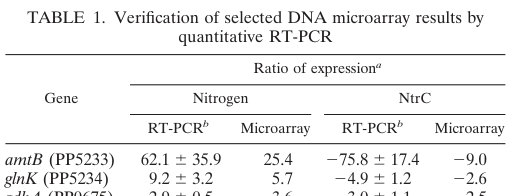

## Question

# Gene Research for Functional Annotation

## ⚠️ CRITICAL: Gene/Protein Identification Context

**BEFORE YOU BEGIN RESEARCH:** You MUST verify you are researching the CORRECT gene/protein. Gene symbols can be ambiguous, especially for less well-characterized genes from non-model organisms.

### Target Gene/Protein Identity (from UniProt):
- **UniProt Accession:** Q88CE7
- **Protein Description:** SubName: Full=Activator of NRII(GlnL/NtrB) phosphatase {ECO:0000313|EMBL:AAN70799.1};
- **Gene Information:** Name=glnK {ECO:0000313|EMBL:AAN70799.1}; OrderedLocusNames=PP_5234 {ECO:0000313|EMBL:AAN70799.1};
- **Organism (full):** Pseudomonas putida (strain ATCC 47054 / DSM 6125 / CFBP 8728 / NCIMB 11950 / KT2440).
- **Protein Family:** Belongs to the P(II) protein family.
- **Key Domains:** N-reg_PII. (IPR002187); N-reg_PII-like_a/b. (IPR011322); N-reg_PII/ATP_PRibTrfase_C. (IPR015867); N-reg_PII_CS. (IPR017918); N-reg_PII_urydylation_site. (IPR002332)

### MANDATORY VERIFICATION STEPS:

1. **Check if the gene symbol "glnK" matches the protein description above**
2. **Verify the organism is correct:** Pseudomonas putida (strain ATCC 47054 / DSM 6125 / CFBP 8728 / NCIMB 11950 / KT2440).
3. **Check if protein family/domains align with what you find in literature**
4. **If you find literature for a DIFFERENT gene with the same or similar symbol, STOP**

### If Gene Symbol is Ambiguous or You Cannot Find Relevant Literature:

**DO NOT PROCEED WITH RESEARCH ON A DIFFERENT GENE.** Instead:
- State clearly: "The gene symbol 'glnK' is ambiguous or literature is limited for this specific protein"
- Explain what you found (e.g., "Found extensive literature on a different gene with the same symbol in a different organism")
- Describe the protein based ONLY on the UniProt information provided above
- Suggest that the protein function can be inferred from domain/family information

### Research Target:

Please provide a comprehensive research report on the gene **glnK** (gene ID: glnK, UniProt: Q88CE7) in PSEPK.

The research report should be a detailed narrative explaining the function, biological processes, and localization of the gene product. Citations should be given for all claims.

You should prioritize authoritative reviews and primary scientific literature when conducting research. You can supplement
this with annotations you find in gene/protein databases, but these can be outdated or inaccurate.

We are specifically interested in the primary function of the gene - for enzymes, what reaction is catalyzed, and what is the substrate specificity? For transporters, what is the substrate? For structural proteins or adapters, what is the broader structural role? For signaling molecules, what is the role in the pathway.

We are interested in where in or outside the cell the gene product carries out its function.

We are also interested in the signaling or biochemical pathways in which the gene functions. We are less interested in broad pleiotropic effects, except where these elucidate the precise role.

Include evidence where possible. We are interested in both experimental evidence as well as inference from structure, evolution, or bioinformatic analysis. Precise studies should be prioritized over high-throughput, where available.

## Output

Question: You are an expert researcher providing comprehensive, well-cited information.

Provide detailed information focusing on:
1. Key concepts and definitions with current understanding
2. Recent developments and latest research (prioritize 2023-2024 sources)
3. Current applications and real-world implementations
4. Expert opinions and analysis from authoritative sources
5. Relevant statistics and data from recent studies

Format as a comprehensive research report with proper citations. Include URLs and publication dates where available.
Always prioritize recent, authoritative sources and provide specific citations for all major claims.

# Gene Research for Functional Annotation

## ⚠️ CRITICAL: Gene/Protein Identification Context

**BEFORE YOU BEGIN RESEARCH:** You MUST verify you are researching the CORRECT gene/protein. Gene symbols can be ambiguous, especially for less well-characterized genes from non-model organisms.

### Target Gene/Protein Identity (from UniProt):
- **UniProt Accession:** Q88CE7
- **Protein Description:** SubName: Full=Activator of NRII(GlnL/NtrB) phosphatase {ECO:0000313|EMBL:AAN70799.1};
- **Gene Information:** Name=glnK {ECO:0000313|EMBL:AAN70799.1}; OrderedLocusNames=PP_5234 {ECO:0000313|EMBL:AAN70799.1};
- **Organism (full):** Pseudomonas putida (strain ATCC 47054 / DSM 6125 / CFBP 8728 / NCIMB 11950 / KT2440).
- **Protein Family:** Belongs to the P(II) protein family.
- **Key Domains:** N-reg_PII. (IPR002187); N-reg_PII-like_a/b. (IPR011322); N-reg_PII/ATP_PRibTrfase_C. (IPR015867); N-reg_PII_CS. (IPR017918); N-reg_PII_urydylation_site. (IPR002332)

### MANDATORY VERIFICATION STEPS:

1. **Check if the gene symbol "glnK" matches the protein description above**
2. **Verify the organism is correct:** Pseudomonas putida (strain ATCC 47054 / DSM 6125 / CFBP 8728 / NCIMB 11950 / KT2440).
3. **Check if protein family/domains align with what you find in literature**
4. **If you find literature for a DIFFERENT gene with the same or similar symbol, STOP**

### If Gene Symbol is Ambiguous or You Cannot Find Relevant Literature:

**DO NOT PROCEED WITH RESEARCH ON A DIFFERENT GENE.** Instead:
- State clearly: "The gene symbol 'glnK' is ambiguous or literature is limited for this specific protein"
- Explain what you found (e.g., "Found extensive literature on a different gene with the same symbol in a different organism")
- Describe the protein based ONLY on the UniProt information provided above
- Suggest that the protein function can be inferred from domain/family information

### Research Target:

Please provide a comprehensive research report on the gene **glnK** (gene ID: glnK, UniProt: Q88CE7) in PSEPK.

The research report should be a detailed narrative explaining the function, biological processes, and localization of the gene product. Citations should be given for all claims.

You should prioritize authoritative reviews and primary scientific literature when conducting research. You can supplement
this with annotations you find in gene/protein databases, but these can be outdated or inaccurate.

We are specifically interested in the primary function of the gene - for enzymes, what reaction is catalyzed, and what is the substrate specificity? For transporters, what is the substrate? For structural proteins or adapters, what is the broader structural role? For signaling molecules, what is the role in the pathway.

We are interested in where in or outside the cell the gene product carries out its function.

We are also interested in the signaling or biochemical pathways in which the gene functions. We are less interested in broad pleiotropic effects, except where these elucidate the precise role.

Include evidence where possible. We are interested in both experimental evidence as well as inference from structure, evolution, or bioinformatic analysis. Precise studies should be prioritized over high-throughput, where available.

## Research report: **glnK (PP_5234; UniProt Q88CE7)** in *Pseudomonas putida* KT2440

### Executive summary (identity-verified)
The UniProt target **Q88CE7** corresponds to **glnK / PP_5234** in *Pseudomonas putida* KT2440 and is described in the KT2440 nitrogen-regulatory literature as the organism’s **single PII-like signal transduction protein** (i.e., not an enzyme/transport protein). In KT2440, **glnK transcription is directly activated by the nitrogen regulator NtrC** at a σ\N (σ54)-dependent promoter and requires IHF for open-complex formation, placing glnK within the canonical nitrogen-starvation regulatory program. Quantitative transcriptomics show strong glnK induction under nitrogen limitation. Direct KT2440-specific biochemical evidence for GlnK post-translational modification, interaction with AmtB, or subcellular localization was not found in retrieved texts; these aspects can be inferred at the **PII-family** level but should be treated explicitly as inference, not direct strain-specific proof. (hervas2009ntrcdependentregulatorynetwork pages 1-2, hervas2008transcriptomeanalysisof pages 2-3, hervas2008transcriptomeanalysisof pages 1-2)

| Claim/Aspect | Evidence summary | Organism/Context | Source (with year) | URL/DOI |
|---|---|---|---|---|
| Identity | Target matches **glnK / PP_5234 / UniProt Q88CE7** in *Pseudomonas putida* KT2440; described as the strain’s **single PII-like protein** and nitrogen-regulated gene, avoiding confusion with glnK homologs from other species. (hervas2009ntrcdependentregulatorynetwork pages 1-2, hervas2008transcriptomeanalysisof pages 1-2) | *P. putida* KT2440 | Hervás et al. 2009; Hervás et al. 2008 | https://doi.org/10.1128/jb.00744-09 ; https://doi.org/10.1128/jb.01230-07 |
| Family/domains | The protein belongs to the **PII/GlnK family**, whose canonical properties include a homotrimeric architecture, flexible **T-loops**, and sensing of **ATP, ADP, and 2-oxoglutarate**; these features are consistent with the UniProt domain assignment to the PII family. (ormeno2024structuralandfunctional pages 32-35) | Conserved bacterial/archaeal PII proteins; used to interpret KT2440 GlnK | Ormeno 2024; Ensinck et al. 2024 | https://doi.org/10.6094/unifr/255197 ; https://doi.org/10.3389/fmicb.2024.1366111 |
| Regulation by NtrC | In *P. putida* KT2440, **glnK transcription is directly activated by NtrC**. Footprinting identified **two contiguous NtrC-binding sites** upstream of the glnK promoter, and promoter opening additionally required **IHF**. This places glnK in an NtrC-controlled nitrogen-starvation response. (hervas2009ntrcdependentregulatorynetwork pages 1-2) | Nitrogen-regulated transcription in KT2440 | Hervás et al. 2009 | https://doi.org/10.1128/jb.00744-09 |
| Operon / neighboring transporter context | The adjacent ammonium transporter gene **amtB (PP_5233)** is reported as being in the same functional context and is presumed to form an operon with upstream **glnK**, linking GlnK to ammonium uptake control. (hervas2008transcriptomeanalysisof pages 2-3) | *P. putida* KT2440 nitrogen assimilation locus | Hervás et al. 2008 | https://doi.org/10.1128/jb.01230-07 |
| Pathway role | KT2440 GlnK is placed in the canonical **GlnD → GlnK → NtrB → NtrC** signaling cascade controlling nitrogen assimilation genes: **GlnD modulates GlnK**, **GlnK activates NtrB**, and NtrB changes **NtrC phosphorylation state**. (incha2023excavatingthegenome pages 53-60, schmidt2022nitrogenmetabolismin pages 4-6) | Nitrogen-starvation signaling in KT2440 | Schmidt et al. 2022; Incha 2023 | https://doi.org/10.1128/aem.02430-21 ; source URL not available in retrieved metadata |
| Functional class / primary role | GlnK is **not an enzyme or transporter**; it is a **signal-transduction/adaptor protein** that couples intracellular nitrogen/energy status to regulation of NtrB/NtrC and likely ammonium transport-related functions, matching the UniProt description “activator of NRII (GlnL/NtrB) phosphatase” at the family level. (hervas2009ntrcdependentregulatorynetwork pages 1-2, atkinson2002contextdependentfunctionsof pages 1-2, ormeno2024structuralandfunctional pages 32-35) | Interpreted from KT2440 data plus conserved PII mechanism | Hervás et al. 2009; Atkinson et al. 2002; Ormeno 2024 | https://doi.org/10.1128/jb.00744-09 ; https://doi.org/10.1128/jb.184.19.5364-5375.2002 ; https://doi.org/10.6094/unifr/255197 |
| PTM | Direct PTM evidence for **KT2440 GlnK** was not found in the retrieved organism-specific literature, but the KT2440 pathway explicitly includes **GlnD**, and conserved PII biology indicates reversible **uridylylation/deuridylylation** as the expected nitrogen-responsive modification controlling NtrB/NtrC signaling. This should be treated as strong family-based inference rather than direct strain-specific biochemical proof. (incha2023excavatingthegenome pages 53-60, schmidt2022nitrogenmetabolismin pages 4-6, ormeno2024structuralandfunctional pages 32-35) | KT2440 inference from pathway membership plus conserved PII mechanism | Schmidt et al. 2022; Incha 2023; Ormeno 2024 | https://doi.org/10.1128/aem.02430-21 ; source URL not available in retrieved metadata ; https://doi.org/10.6094/unifr/255197 |
| Localization | No direct localization experiment for KT2440 GlnK was identified. Given PII-family biology, the default localization is **cytosolic**, with possible condition-dependent association with membrane transport systems such as AmtB inferred from homologous systems, but not directly demonstrated here for KT2440. (ensinck2024thepiiprotein pages 1-2, ensinck2024thepiiprotein pages 14-15) | Inference from conserved GlnK/Amt systems | Ensinck et al. 2024 | https://doi.org/10.3389/fmicb.2024.1366111 |
| Quantitative expression | **Hervás et al. 2008 Table 1** reports glnK expression ratios **9.2, 3.2, 5.7, 4.9, 1.2, 2.6**, from RT-PCR/microarray comparisons across nitrogen and NtrC conditions, supporting strong induction under nitrogen limitation and NtrC responsiveness. (hervas2008transcriptomeanalysisof pages 2-3, hervas2008transcriptomeanalysisof media 7d483848) | *P. putida* KT2440 transcriptomics / validation table | Hervás et al. 2008 | https://doi.org/10.1128/jb.01230-07 |
| Additional transcriptomic context | In a later KT2440 study, **glnK was described as upregulated** under the tested nitrogen/stationary-phase-related conditions, while **NtrC** showed strong activation (**8.8-fold**), reinforcing that glnK participates in nitrogen stress signaling. A specific numeric fold-change for glnK was not given in the excerpt. (mozejkociesielska2017mediumchainlengthpolyhydroxyalkanoatessynthesis pages 9-10) | KT2440 transcriptome under stationary phase / nitrogen-linked response | Możejko-Ciesielska et al. 2017 | https://doi.org/10.1186/s13568-017-0396-z |
| Fitness data | In the KT2440 **RB-TnSeq** resource, the transposon library had **no insertions in glnK**, so **no direct fitness value/phenotype** could be assigned to PP_5234 from that dataset. This is an important limitation for current functional-genetics evidence. (incha2023excavatingthegenome pages 53-60, schmidt2022nitrogenmetabolismin pages 4-6) | *P. putida* KT2440 pooled mutant fitness assays | Schmidt et al. 2022; Incha 2023 | https://doi.org/10.1128/aem.02430-21 ; source URL not available in retrieved metadata |
| Recent developments relevant to annotation | Recent 2024 PII research reinforces the modern view of GlnK/PII proteins as **allosteric metabolite sensors** whose partner binding is remodeled by ATP/ADP/2-OG and can regulate transport complexes; this supports annotation of KT2440 GlnK as a dynamic nitrogen-sensing regulator rather than a static structural protein. (li2024allostericregulationof pages 1-2, rozbeh2024invivodetection pages 1-2) | General PII field update, relevant by homology | Li et al. 2024; Rozbeh & Forchhammer 2024 | https://doi.org/10.1073/pnas.2318320121 ; https://doi.org/10.3390/ijms25063409 |

*Table: This table summarizes the evidence base for functional annotation of *Pseudomonas putida* KT2440 GlnK (PP_5234; UniProt Q88CE7). It highlights identity verification, pathway placement, quantitative transcript data, and the current limits of direct experimental evidence such as fitness and localization.*

### 1. Key concepts and definitions (current understanding)

#### 1.1 What is GlnK/PII?
**GlnK (a PII-family protein)** is a small signal-transduction hub typically forming a **homotrimer** and using a flexible **T-loop** to engage partner proteins. PII proteins act as **integrators of cellular nitrogen and energy status** via direct binding of metabolites and nucleotides—most canonically **ATP, ADP, and 2‑oxoglutarate (2‑OG)**—which remodels PII conformation and thereby changes partner binding and downstream regulation. (ormeno2024structuralandfunctional pages 32-35, li2024allostericregulationof pages 1-2)

A modern mechanistic model emphasizes:
- **ATP/ADP ratio** as an energy readout and switch for target binding. (ormeno2024structuralandfunctional pages 32-35)
- **2‑OG** as a nitrogen/carbon-balance signal; in several systems, **ATP + 2‑OG** shifts PII toward partner release while **ADP-bound** forms preferentially engage targets. (li2024allostericregulationof pages 1-2)

#### 1.2 Canonical NtrBC (NRII/NRI) control by PII proteins
In the classic Gram-negative nitrogen regulation scheme, a PII protein can bind the sensor kinase/phosphatase **NtrB (NRII/GlnL)** and bias its kinase/phosphatase output to control the phosphorylation state of **NtrC (NRI)**, a σ54-dependent enhancer-binding transcriptional activator. In *E. coli*, this coupling is strongly modulated by **GlnD-mediated uridylylation** of PII proteins in response to nitrogen status (glutamine signal). Uridylylation prevents productive binding to NtrB; deuridylylation restores it. (atkinson2002contextdependentfunctionsof pages 1-2, ormeno2024structuralandfunctional pages 32-35)

For KT2440 specifically, functional genomics and regulatory network descriptions place **glnK in a GlnD→GlnK→NtrB→NtrC cascade** (see §2.2), consistent with UniProt’s “activator of NRII phosphatase” description at the family/mechanism level. (incha2023excavatingthegenome pages 53-60, schmidt2022nitrogenmetabolismin pages 4-6)

### 2. KT2440-specific function, pathway role, and regulation

#### 2.1 Gene/protein identity and “single-PII” architecture
Unlike enterobacteria that can encode both **glnB (PII)** and **glnK (PII-like)**, *P. putida* KT2440 is described as encoding **only a single PII homologue designated glnK**. This reduces ambiguity of the gene symbol in this organism and implies that KT2440 GlnK may consolidate functions that are partitioned between PII paralogs in other taxa. (hervas2008transcriptomeanalysisof pages 1-2, hervas2009ntrcdependentregulatorynetwork pages 1-2)

#### 2.2 Transcriptional control: direct NtrC activation of glnK (and requirement for IHF)
A key KT2440-specific mechanistic result is that **glnK transcription is directly NtrC-activated**:
- **Two contiguous NtrC binding sites** were identified upstream of the NtrC-dependent glnK promoter by footprinting.
- In vitro transcription/open-complex formation at the glnK promoter required both **NtrC** and **IHF (integration host factor)**.
- Authors propose an **indirect feedback autoregulation** architecture involving glnK and NtrC. (hervas2009ntrcdependentregulatorynetwork pages 1-2)

This provides strong primary evidence that glnK is embedded in the **σ54-dependent nitrogen stress regulon** in KT2440. (hervas2009ntrcdependentregulatorynetwork pages 1-2)

#### 2.3 Genetic context with ammonium uptake (amtB)
Transcriptome validation work notes that **amtB (PP_5233)** is presumed to be in an operon with upstream **glnK**, and that amtB is **NtrC activated** under nitrogen-responsive conditions. This links KT2440 glnK to ammonium acquisition physiology, even though a KT2440-specific physical GlnK–AmtB interaction assay was not retrieved here. (hervas2008transcriptomeanalysisof pages 2-3)

#### 2.4 Placement in the nitrogen-starvation signaling cascade (GlnD→GlnK→NtrB→NtrC)
Functional genomics resources for KT2440 nitrogen metabolism explicitly describe the canonical cascade:
- **GlnD (PP_1589)** modulates GlnK activity.
- GlnK then **activates NtrB** (PP_5047).
- NtrB controls the **phosphorylation state of NtrC** (PP_5048), which in turn regulates nitrogen assimilation genes. (incha2023excavatingthegenome pages 53-60, schmidt2022nitrogenmetabolismin pages 4-6)

This cascade is consistent with the widely conserved PII/NtrBC control logic described in classical models. (atkinson2002contextdependentfunctionsof pages 1-2, ormeno2024structuralandfunctional pages 32-35)

### 3. Quantitative evidence and statistics

#### 3.1 Quantitative transcript induction of glnK under nitrogen limitation
In KT2440, Table 1 of Hervás et al. (2008; **publication date: Jan 2008**; URL: https://doi.org/10.1128/jb.01230-07) reports glnK (PP_5234) expression ratios across nitrogen and NtrC-dependent comparisons.

The glnK row in Table 1 reports the numeric values:
**9.2, 3.2, 5.7, 4.9, 1.2, 2.6** (RT‑PCR and microarray comparisons across nitrogen and NtrC conditions), supporting strong nitrogen-responsive induction and NtrC-dependent regulation in vivo. (hervas2008transcriptomeanalysisof pages 2-3, hervas2008transcriptomeanalysisof media 7d483848)

#### 3.2 Additional transcriptomic context
In a KT2440 relA/spoT mutant transcriptome/bioprocess study (**May 2017**; URL: https://doi.org/10.1186/s13568-017-0396-z), **glnK is described as upregulated**, and **NtrC** is reported as strongly activated in stationary phase (**8.8-fold**). This is consistent with glnK being an NtrC-regulated nitrogen-stress gene, though a numeric glnK fold-change is not provided in the retrieved excerpt. (mozejkociesielska2017mediumchainlengthpolyhydroxyalkanoatessynthesis pages 9-10)

#### 3.3 Fitness/phenotype statistics: current limitation
A major limitation for gene-essentiality/phenotype quantification is that the KT2440 RB-TnSeq library used in a systematic nitrogen substrate study had **no transposon insertions in glnK**, preventing direct pooled-fitness estimation for PP_5234 in that dataset. (schmidt2022nitrogenmetabolismin pages 4-6)

### 4. Cellular localization and post-translational modification (evidence vs inference)

#### 4.1 Localization
No KT2440-specific localization experiment (e.g., cell fractionation, microscopy, fluorescent fusion) was retrieved.

At the family level, PII proteins are generally **cytosolic** and can form condition-dependent complexes with membrane transporters (classically **AmtB**) in other systems; 2024 work in mycobacteria demonstrates a PII protein can interact with the C-terminal domain of an **Amt ammonium transporter** and that loss of PII can impair growth on nitrate/nitrite. These results support the plausibility of transporter-associated regulation, but do **not** directly establish localization/complex formation for KT2440 GlnK. (ensinck2024thepiiprotein pages 1-2, ensinck2024thepiiprotein pages 14-15)

#### 4.2 Post-translational modification (PTM)
No direct KT2440 biochemical measurement of GlnK uridylylation (or other PTMs) was retrieved.

However, KT2440 is described as encoding the upstream regulator **GlnD**, and the KT2440 cascade description (GlnD→GlnK→NtrB→NtrC) aligns with the widely conserved mechanism where **GlnD-mediated uridylylation/deuridylylation** transduces nitrogen sufficiency signals to PII proteins, controlling NtrB/NtrC output (classic evidence from *E. coli* and general mechanistic summaries). For KT2440, this should be treated as **strong mechanistic inference** based on pathway membership and conservation, not direct strain-specific proof. (ormeno2024structuralandfunctional pages 32-35, incha2023excavatingthegenome pages 53-60, schmidt2022nitrogenmetabolismin pages 4-6)

### 5. Recent developments (prioritizing 2023–2024) relevant to functional annotation
Although KT2440-specific glnK work in the retrieved corpus is largely pre-2020, several 2023–2024 advances sharpen the field’s mechanistic understanding of PII/PII-like proteins and therefore strengthen evidence-based inference for GlnK function.

#### 5.1 2024 structural biology: PII as an allosteric regulator of an ABC nitrate transporter
A 2024 PNAS study (**Mar 2024**; URL: https://doi.org/10.1073/pnas.2318320121) reports cryo-EM structures showing PII can bind the nitrate transporter complex (NrtBCD) and **narrow the substrate translocation channel** to lock an inhibited transporter conformation. Importantly, this work highlights a mechanistic nuance: PII regulation can occur via binding surfaces beyond the canonical T-loop and can yield **asymmetric allosteric inhibition**. This expands the set of plausible PII-mediated regulatory modes beyond classical NtrBC and AmtB paradigms. (li2024allostericregulationof pages 1-2)

#### 5.2 2024 in vivo interaction dynamics: NanoBiT PII sensors
An IJMS 2024 study (**Mar 2024**; URL: https://doi.org/10.3390/ijms25063409) implements NanoBiT protein-fragment complementation to monitor PII–partner interactions in vivo and demonstrates that a PII-based interaction pair can sensitively report metabolic shifts associated with nitrogen upshift/depletion in real time. This supports the expert view of PII proteins as **dynamic interaction switches** whose binding equilibria can track metabolic state on short timescales—relevant when reasoning about GlnK’s role as an adaptor rather than an enzyme. (rozbeh2024invivodetection pages 1-2)

#### 5.3 2024 physiology: PII–Amt interaction and nitrogen assimilation phenotypes
A 2024 Frontiers in Microbiology paper (**Mar 2024**; URL: https://doi.org/10.3389/fmicb.2024.1366111) provides experimental evidence that a mycobacterial PII protein can interact with an ammonium transporter domain and that deletion of PII can cause growth defects on nitrate/nitrite with nitrite accumulation. While taxonomically distinct from *Pseudomonas*, it strengthens the generality of **PII-linked control of nitrogen uptake/assimilation** and highlights that single-PII organisms can exhibit multi-pathway nitrogen phenotypes. (ensinck2024thepiiprotein pages 1-2)

### 6. Current applications and real-world implementations (and why glnK matters)

#### 6.1 *P. putida* KT2440 as a chassis strain
KT2440 is widely used as a **biotechnological chassis** (bioremediation/biotransformation) and as a model for biodegradation processes. Nitrogen regulation is practically important because **NtrC** can activate alternative nitrogen assimilation pathways and can also repress carbon catabolism under nitrogen limitation, potentially diverting resources away from product formation or degradation pathways depending on cultivation conditions. NtrC has been implicated in nitrogen regulation of **atrazine biodegradation**, showing that nitrogen regulatory state can directly alter biodegradation phenotypes. Since KT2440 glnK is NtrC-controlled and upstream of NtrBC control logic, it is part of the regulatory layer that can influence these process outcomes. (hervas2008transcriptomeanalysisof pages 1-2, hervas2009ntrcdependentregulatorynetwork pages 1-2)

#### 6.2 Nitrogen metabolism knowledge for engineering nitrogenous products
A systematic KT2440 nitrogen-metabolism functional genomics study emphasizes that many products/precursors contain nitrogen and that understanding nitrogen assimilation genetics can help redirect flux toward desired products; it also lists multiple applied contexts for KT2440 in metabolic engineering and biosensing (e.g., lactam biosensors, pathway rewiring at scale). Although these applications are not glnK-specific in the retrieved excerpt, they frame nitrogen regulation—including NtrBC/PII logic—as a design constraint for robust production phenotypes across media and scales. (schmidt2022nitrogenmetabolismin pages 1-2)

### 7. Expert synthesis and functional annotation for Q88CE7 (PP_5234)

#### 7.1 Primary function (most evidence-supported)
**GlnK (PP_5234; UniProt Q88CE7) is best annotated as a PII-family nitrogen/energy status signaling adaptor** that participates in the nitrogen-starvation regulatory cascade and couples metabolic state to NtrBC-controlled transcription.

Evidence directly in KT2440 supports:
- **Direct transcriptional activation of glnK by NtrC**, requiring mapped NtrC binding sites and IHF for promoter opening. (hervas2009ntrcdependentregulatorynetwork pages 1-2)
- **Strong induction of glnK under nitrogen limitation** with reported expression ratios in validated transcriptomics. (hervas2008transcriptomeanalysisof pages 2-3, hervas2008transcriptomeanalysisof media 7d483848)
- Placement in the canonical **GlnD→GlnK→NtrB→NtrC** pathway (functional genomics narrative). (incha2023excavatingthegenome pages 53-60, schmidt2022nitrogenmetabolismin pages 4-6)

#### 7.2 Biochemical activity and substrate specificity
GlnK is **not an enzyme** with a catalytic reaction; its “substrates” are effectively its **bound effectors** (ATP/ADP/2‑OG; likely glutamine state via upstream GlnD control in many bacteria). These effectors tune GlnK conformation and partner interactions, consistent with the PII-family definition. (ormeno2024structuralandfunctional pages 32-35, li2024allostericregulationof pages 1-2)

#### 7.3 Likely cellular site of action
The most conservative evidence-based statement for KT2440 is that GlnK acts in the **cytoplasmic regulatory network** controlling NtrBC-dependent transcription. Membrane-associated regulation via AmtB is plausible by gene neighborhood and broad PII biology but remains **not directly demonstrated** for KT2440 in the retrieved texts. (hervas2008transcriptomeanalysisof pages 2-3, ensinck2024thepiiprotein pages 1-2)

### 8. Evidence figure/table
Hervás et al. (2008) Table 1 provides the quantitative glnK expression ratios used above. (hervas2008transcriptomeanalysisof media 7d483848)

### 9. Key references (with publication dates and URLs)
- Hervás AB, Canosa I, Santero E. **Transcriptome analysis of *Pseudomonas putida* in response to nitrogen availability.** *J Bacteriol.* **Jan 2008**. https://doi.org/10.1128/jb.01230-07 (hervas2008transcriptomeanalysisof pages 2-3, hervas2008transcriptomeanalysisof media 7d483848)
- Hervás AB, Canosa I, Little R, Dixon R, Santero E. **NtrC-dependent regulatory network for nitrogen assimilation in *Pseudomonas putida*.** *J Bacteriol.* **Oct 2009**. https://doi.org/10.1128/jb.00744-09 (hervas2009ntrcdependentregulatorynetwork pages 1-2)
- Schmidt M, et al. **Nitrogen metabolism in *P. putida*: functional analysis using RB-TnSeq.** *Appl Environ Microbiol.* **Apr 2022**. https://doi.org/10.1128/aem.02430-21 (schmidt2022nitrogenmetabolismin pages 4-6)
- Li B, et al. **Allosteric regulation of nitrate transporter Nrt via the signaling protein PII.** *PNAS.* **Mar 2024**. https://doi.org/10.1073/pnas.2318320121 (li2024allostericregulationof pages 1-2)
- Rozbeh R, Forchhammer K. **In vivo detection of metabolic fluctuations… based on PII signalling protein interactions.** *IJMS.* **Mar 2024**. https://doi.org/10.3390/ijms25063409 (rozbeh2024invivodetection pages 1-2)
- Ensinck D, et al. **PII protein interacts with Amt ammonium transport and modulates nitrate/nitrite assimilation in mycobacteria.** *Front Microbiol.* **Mar 2024**. https://doi.org/10.3389/fmicb.2024.1366111 (ensinck2024thepiiprotein pages 1-2)

### 10. Explicit limitations and gaps (for functional annotation confidence)
- **KT2440-specific PTM evidence** (e.g., direct uridylylation mapping of PP_5234) was not retrieved; statements about uridylylation are therefore mechanistic inference from the GlnD→GlnK→NtrBC framework and canonical models. (ormeno2024structuralandfunctional pages 32-35, incha2023excavatingthegenome pages 53-60)
- **KT2440-specific localization** and **direct GlnK–AmtB binding assays** were not retrieved; the amtB neighborhood supports functional linkage but not proven complex formation in this strain in the present evidence set. (hervas2008transcriptomeanalysisof pages 2-3)
- **Direct fitness/phenotype** from pooled mutant assays is currently unavailable in the cited RB-TnSeq dataset because **no insertions** were recovered in glnK. (schmidt2022nitrogenmetabolismin pages 4-6)

References

1. (hervas2009ntrcdependentregulatorynetwork pages 1-2): Ana B. Hervás, Inés Canosa, Richard Little, Ray Dixon, and Eduardo Santero. Ntrc-dependent regulatory network for nitrogen assimilation in <i>pseudomonas putida</i>. Oct 2009. URL: https://doi.org/10.1128/jb.00744-09, doi:10.1128/jb.00744-09. This article has 94 citations and is from a peer-reviewed journal.

2. (hervas2008transcriptomeanalysisof pages 2-3): Ana B. Hervás, Inés Canosa, and Eduardo Santero. Transcriptome analysis of <i>pseudomonas putida</i> in response to nitrogen availability. Journal of Bacteriology, 190:416-420, Jan 2008. URL: https://doi.org/10.1128/jb.01230-07, doi:10.1128/jb.01230-07. This article has 114 citations and is from a peer-reviewed journal.

3. (hervas2008transcriptomeanalysisof pages 1-2): Ana B. Hervás, Inés Canosa, and Eduardo Santero. Transcriptome analysis of <i>pseudomonas putida</i> in response to nitrogen availability. Journal of Bacteriology, 190:416-420, Jan 2008. URL: https://doi.org/10.1128/jb.01230-07, doi:10.1128/jb.01230-07. This article has 114 citations and is from a peer-reviewed journal.

4. (ormeno2024structuralandfunctional pages 32-35): Fernando Jose Ormeno. Structural and functional characterization of the amt2-glnk2 complex from archaeoglobus fulgidus. Jan 2024. URL: https://doi.org/10.6094/unifr/255197, doi:10.6094/unifr/255197. This article has 0 citations.

5. (incha2023excavatingthegenome pages 53-60): MR Incha. Excavating the genome mine of pseudomonas putida kt2440. Unknown journal, 2023.

6. (schmidt2022nitrogenmetabolismin pages 4-6): Matthias Schmidt, Allison N. Pearson, Matthew R. Incha, Mitchell G. Thompson, Edward E. K. Baidoo, Ramu Kakumanu, Aindrila Mukhopadhyay, Patrick M. Shih, Adam M. Deutschbauer, Lars M. Blank, and Jay D. Keasling. Nitrogen metabolism in pseudomonas putida: functional analysis using random barcode transposon sequencing. Applied and Environmental Microbiology, Apr 2022. URL: https://doi.org/10.1128/aem.02430-21, doi:10.1128/aem.02430-21. This article has 36 citations and is from a peer-reviewed journal.

7. (atkinson2002contextdependentfunctionsof pages 1-2): Mariette R. Atkinson, Timothy A. Blauwkamp, and Alexander J. Ninfa. Context-dependent functions of the pii and glnk signal transduction proteins in escherichia coli. Journal of Bacteriology, 184:5364-5375, Oct 2002. URL: https://doi.org/10.1128/jb.184.19.5364-5375.2002, doi:10.1128/jb.184.19.5364-5375.2002. This article has 72 citations and is from a peer-reviewed journal.

8. (ensinck2024thepiiprotein pages 1-2): Delfina Ensinck, Edileusa C. M. Gerhardt, Lara Rollan, Luciano F. Huergo, Hugo Gramajo, and Lautaro Diacovich. The pii protein interacts with the amt ammonium transport and modulates nitrate/nitrite assimilation in mycobacteria. Frontiers in Microbiology, Mar 2024. URL: https://doi.org/10.3389/fmicb.2024.1366111, doi:10.3389/fmicb.2024.1366111. This article has 6 citations and is from a peer-reviewed journal.

9. (ensinck2024thepiiprotein pages 14-15): Delfina Ensinck, Edileusa C. M. Gerhardt, Lara Rollan, Luciano F. Huergo, Hugo Gramajo, and Lautaro Diacovich. The pii protein interacts with the amt ammonium transport and modulates nitrate/nitrite assimilation in mycobacteria. Frontiers in Microbiology, Mar 2024. URL: https://doi.org/10.3389/fmicb.2024.1366111, doi:10.3389/fmicb.2024.1366111. This article has 6 citations and is from a peer-reviewed journal.

10. (hervas2008transcriptomeanalysisof media 7d483848): Ana B. Hervás, Inés Canosa, and Eduardo Santero. Transcriptome analysis of <i>pseudomonas putida</i> in response to nitrogen availability. Journal of Bacteriology, 190:416-420, Jan 2008. URL: https://doi.org/10.1128/jb.01230-07, doi:10.1128/jb.01230-07. This article has 114 citations and is from a peer-reviewed journal.

11. (mozejkociesielska2017mediumchainlengthpolyhydroxyalkanoatessynthesis pages 9-10): Justyna Mozejko-Ciesielska, Dorota Dabrowska, Agnieszka Szalewska-Palasz, and Slawomir Ciesielski. Medium-chain-length polyhydroxyalkanoates synthesis by pseudomonas putida kt2440 rela/spot mutant: bioprocess characterization and transcriptome analysis. AMB Express, May 2017. URL: https://doi.org/10.1186/s13568-017-0396-z, doi:10.1186/s13568-017-0396-z. This article has 34 citations and is from a peer-reviewed journal.

12. (li2024allostericregulationof pages 1-2): Bo Li, Xiao-Qian Wang, Qin-Yao Li, Da Xu, Jing Li, Wen-Tao Hou, Yuxing Chen, Yong-Liang Jiang, and Cong-Zhao Zhou. Allosteric regulation of nitrate transporter nrt via the signaling protein pii. Proceedings of the National Academy of Sciences of the United States of America, Mar 2024. URL: https://doi.org/10.1073/pnas.2318320121, doi:10.1073/pnas.2318320121. This article has 16 citations and is from a highest quality peer-reviewed journal.

13. (rozbeh2024invivodetection pages 1-2): Rokhsareh Rozbeh and Karl Forchhammer. In vivo detection of metabolic fluctuations in real time using the nanobit technology based on pii signalling protein interactions. International Journal of Molecular Sciences, 25:3409, Mar 2024. URL: https://doi.org/10.3390/ijms25063409, doi:10.3390/ijms25063409. This article has 8 citations.

14. (schmidt2022nitrogenmetabolismin pages 1-2): Matthias Schmidt, Allison N. Pearson, Matthew R. Incha, Mitchell G. Thompson, Edward E. K. Baidoo, Ramu Kakumanu, Aindrila Mukhopadhyay, Patrick M. Shih, Adam M. Deutschbauer, Lars M. Blank, and Jay D. Keasling. Nitrogen metabolism in pseudomonas putida: functional analysis using random barcode transposon sequencing. Applied and Environmental Microbiology, Apr 2022. URL: https://doi.org/10.1128/aem.02430-21, doi:10.1128/aem.02430-21. This article has 36 citations and is from a peer-reviewed journal.

## Artifacts

- [Edison artifact artifact-00](glnK-deep-research-falcon_artifacts/artifact-00.md)

## Citations

1. ormeno2024structuralandfunctional pages 32-35
2. hervas2009ntrcdependentregulatorynetwork pages 1-2
3. hervas2008transcriptomeanalysisof pages 2-3
4. mozejkociesielska2017mediumchainlengthpolyhydroxyalkanoatessynthesis pages 9-10
5. li2024allostericregulationof pages 1-2
6. schmidt2022nitrogenmetabolismin pages 4-6
7. rozbeh2024invivodetection pages 1-2
8. ensinck2024thepiiprotein pages 1-2
9. schmidt2022nitrogenmetabolismin pages 1-2
10. hervas2008transcriptomeanalysisof pages 1-2
11. incha2023excavatingthegenome pages 53-60
12. atkinson2002contextdependentfunctionsof pages 1-2
13. ensinck2024thepiiprotein pages 14-15
14. https://doi.org/10.1128/jb.00744-09
15. https://doi.org/10.1128/jb.01230-07
16. https://doi.org/10.6094/unifr/255197
17. https://doi.org/10.3389/fmicb.2024.1366111
18. https://doi.org/10.1128/aem.02430-21
19. https://doi.org/10.1128/jb.184.19.5364-5375.2002
20. https://doi.org/10.1186/s13568-017-0396-z
21. https://doi.org/10.1073/pnas.2318320121
22. https://doi.org/10.3390/ijms25063409
23. https://doi.org/10.1128/jb.00744-09,
24. https://doi.org/10.1128/jb.01230-07,
25. https://doi.org/10.6094/unifr/255197,
26. https://doi.org/10.1128/aem.02430-21,
27. https://doi.org/10.1128/jb.184.19.5364-5375.2002,
28. https://doi.org/10.3389/fmicb.2024.1366111,
29. https://doi.org/10.1186/s13568-017-0396-z,
30. https://doi.org/10.1073/pnas.2318320121,
31. https://doi.org/10.3390/ijms25063409,