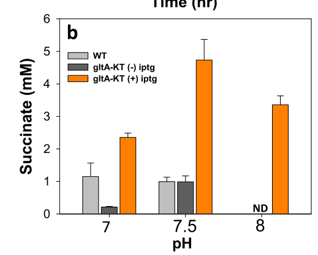

## Question

# Gene Research for Functional Annotation

## ⚠️ CRITICAL: Gene/Protein Identification Context

**BEFORE YOU BEGIN RESEARCH:** You MUST verify you are researching the CORRECT gene/protein. Gene symbols can be ambiguous, especially for less well-characterized genes from non-model organisms.

### Target Gene/Protein Identity (from UniProt):
- **UniProt Accession:** Q88FA4
- **Protein Description:** RecName: Full=Citrate synthase {ECO:0000256|NCBIfam:TIGR01798, ECO:0000256|PIRNR:PIRNR001369};
- **Gene Information:** Name=gltA {ECO:0000313|EMBL:AAN69775.1}; OrderedLocusNames=PP_4194 {ECO:0000313|EMBL:AAN69775.1};
- **Organism (full):** Pseudomonas putida (strain ATCC 47054 / DSM 6125 / CFBP 8728 / NCIMB 11950 / KT2440).
- **Protein Family:** Belongs to the citrate synthase family.
- **Key Domains:** Citrate_synth-like_lrg_a-sub. (IPR016142); Citrate_synth-like_sm_a-sub. (IPR016143); Citrate_synthase. (IPR002020); Citrate_synthase_AS. (IPR019810); Citrate_synthase_bac-typ. (IPR024176)

### MANDATORY VERIFICATION STEPS:

1. **Check if the gene symbol "gltA" matches the protein description above**
2. **Verify the organism is correct:** Pseudomonas putida (strain ATCC 47054 / DSM 6125 / CFBP 8728 / NCIMB 11950 / KT2440).
3. **Check if protein family/domains align with what you find in literature**
4. **If you find literature for a DIFFERENT gene with the same or similar symbol, STOP**

### If Gene Symbol is Ambiguous or You Cannot Find Relevant Literature:

**DO NOT PROCEED WITH RESEARCH ON A DIFFERENT GENE.** Instead:
- State clearly: "The gene symbol 'gltA' is ambiguous or literature is limited for this specific protein"
- Explain what you found (e.g., "Found extensive literature on a different gene with the same symbol in a different organism")
- Describe the protein based ONLY on the UniProt information provided above
- Suggest that the protein function can be inferred from domain/family information

### Research Target:

Please provide a comprehensive research report on the gene **gltA** (gene ID: gltA, UniProt: Q88FA4) in PSEPK.

The research report should be a detailed narrative explaining the function, biological processes, and localization of the gene product. Citations should be given for all claims.

You should prioritize authoritative reviews and primary scientific literature when conducting research. You can supplement
this with annotations you find in gene/protein databases, but these can be outdated or inaccurate.

We are specifically interested in the primary function of the gene - for enzymes, what reaction is catalyzed, and what is the substrate specificity? For transporters, what is the substrate? For structural proteins or adapters, what is the broader structural role? For signaling molecules, what is the role in the pathway.

We are interested in where in or outside the cell the gene product carries out its function.

We are also interested in the signaling or biochemical pathways in which the gene functions. We are less interested in broad pleiotropic effects, except where these elucidate the precise role.

Include evidence where possible. We are interested in both experimental evidence as well as inference from structure, evolution, or bioinformatic analysis. Precise studies should be prioritized over high-throughput, where available.

## Output

Question: You are an expert researcher providing comprehensive, well-cited information.

Provide detailed information focusing on:
1. Key concepts and definitions with current understanding
2. Recent developments and latest research (prioritize 2023-2024 sources)
3. Current applications and real-world implementations
4. Expert opinions and analysis from authoritative sources
5. Relevant statistics and data from recent studies

Format as a comprehensive research report with proper citations. Include URLs and publication dates where available.
Always prioritize recent, authoritative sources and provide specific citations for all major claims.

# Gene Research for Functional Annotation

## ⚠️ CRITICAL: Gene/Protein Identification Context

**BEFORE YOU BEGIN RESEARCH:** You MUST verify you are researching the CORRECT gene/protein. Gene symbols can be ambiguous, especially for less well-characterized genes from non-model organisms.

### Target Gene/Protein Identity (from UniProt):
- **UniProt Accession:** Q88FA4
- **Protein Description:** RecName: Full=Citrate synthase {ECO:0000256|NCBIfam:TIGR01798, ECO:0000256|PIRNR:PIRNR001369};
- **Gene Information:** Name=gltA {ECO:0000313|EMBL:AAN69775.1}; OrderedLocusNames=PP_4194 {ECO:0000313|EMBL:AAN69775.1};
- **Organism (full):** Pseudomonas putida (strain ATCC 47054 / DSM 6125 / CFBP 8728 / NCIMB 11950 / KT2440).
- **Protein Family:** Belongs to the citrate synthase family.
- **Key Domains:** Citrate_synth-like_lrg_a-sub. (IPR016142); Citrate_synth-like_sm_a-sub. (IPR016143); Citrate_synthase. (IPR002020); Citrate_synthase_AS. (IPR019810); Citrate_synthase_bac-typ. (IPR024176)

### MANDATORY VERIFICATION STEPS:

1. **Check if the gene symbol "gltA" matches the protein description above**
2. **Verify the organism is correct:** Pseudomonas putida (strain ATCC 47054 / DSM 6125 / CFBP 8728 / NCIMB 11950 / KT2440).
3. **Check if protein family/domains align with what you find in literature**
4. **If you find literature for a DIFFERENT gene with the same or similar symbol, STOP**

### If Gene Symbol is Ambiguous or You Cannot Find Relevant Literature:

**DO NOT PROCEED WITH RESEARCH ON A DIFFERENT GENE.** Instead:
- State clearly: "The gene symbol 'gltA' is ambiguous or literature is limited for this specific protein"
- Explain what you found (e.g., "Found extensive literature on a different gene with the same symbol in a different organism")
- Describe the protein based ONLY on the UniProt information provided above
- Suggest that the protein function can be inferred from domain/family information

### Research Target:

Please provide a comprehensive research report on the gene **gltA** (gene ID: gltA, UniProt: Q88FA4) in PSEPK.

The research report should be a detailed narrative explaining the function, biological processes, and localization of the gene product. Citations should be given for all claims.

You should prioritize authoritative reviews and primary scientific literature when conducting research. You can supplement
this with annotations you find in gene/protein databases, but these can be outdated or inaccurate.

We are specifically interested in the primary function of the gene - for enzymes, what reaction is catalyzed, and what is the substrate specificity? For transporters, what is the substrate? For structural proteins or adapters, what is the broader structural role? For signaling molecules, what is the role in the pathway.

We are interested in where in or outside the cell the gene product carries out its function.

We are also interested in the signaling or biochemical pathways in which the gene functions. We are less interested in broad pleiotropic effects, except where these elucidate the precise role.

Include evidence where possible. We are interested in both experimental evidence as well as inference from structure, evolution, or bioinformatic analysis. Precise studies should be prioritized over high-throughput, where available.

# Research report: **gltA** (UniProt **Q88FA4**) in *Pseudomonas putida* KT2440 (PSEPK)

## 0) Target verification (mandatory disambiguation)

### Verified identity
The UniProt accession **Q88FA4** is annotated as **citrate synthase** (citrate synthase family) from *Pseudomonas putida* strain KT2440, with gene name **gltA** (ordered locus name PP_4194 per UniProt, provided by user). Within the retrieved KT2440-focused literature, **gltA is explicitly treated as citrate synthase** and is genetically perturbed (overexpression or deletion) in multiple studies, confirming that—here—**gltA refers to citrate synthase, not glutamate synthase** or other gltA usages in unrelated organisms. (mutyala2023citratesynthaseoverexpression pages 1-3, dong2024modificationofglucose pages 1-2, molina‐henares2010identificationofconditionally pages 3-4)

### Notes on PP_4194 mapping
In the retrieved full texts, an explicit sentence mapping *P. putida* KT2440 **gltA → PP_4194** was not captured by the evidence extraction, although PP_4194 appears as the *P. putida* locus identifier in the broader retrieved corpus (e.g., in KT2440 datasets) and is consistent with the user-provided UniProt context. Therefore, **functional conclusions below are tied to “gltA/citrate synthase” in KT2440**, and PP_4194 is used as the expected locus identifier with this caveat disclosed.

## 1) Key concepts and current understanding

### 1.1 Definition and primary biochemical function
**Citrate synthase (EC 2.3.3.1)** catalyzes the committed entry step into the tricarboxylic acid (TCA) cycle by condensing **acetyl‑CoA and oxaloacetate (OAA)** to form **citrate** (and CoA-SH). In *Pseudomonas* spp., biochemical characterization of GltA confirms the canonical substrate pair **acetyl‑CoA + OAA** for citrate synthase activity. (dolan2022systemswidedissectionof pages 8-12)

In *P. putida* KT2440 specifically, recent work frames acetate assimilation as being initiated by **gltA (citrate synthase) converting acetyl‑CoA to citrate**, i.e., channeling acetyl‑CoA into the TCA cycle. (mutyala2023citratesynthaseoverexpression pages 1-3)

### 1.2 Enzyme family/structure and regulatory features (best-available evidence)
Direct structure/kinetic characterization of KT2440 GltA was not retrieved in full text. However, a high-quality *Pseudomonas aeruginosa* study provides close-genus evidence that GltA:

* is a ~429 aa enzyme assembling as a **hexamer (“trimer of dimers”)**,
* contains the canonical catalytic triad (His/His/Asp), and
* carries residues implicated in **NADH binding**, consistent with potential NADH regulation (not experimentally proven for KT2440 in the retrieved text). (dolan2022systemswidedissectionof pages 8-12)

This same study reports **no detectable 2‑methylcitrate synthase activity** for GltA (i.e., it does not substitute for PrpC), which helps separate citrate synthase from paralogous methylcitrate synthases in related metabolism. (dolan2022systemswidedissectionof pages 8-12)

### 1.3 Pathway placement and cellular role
In KT2440, gltA is positioned at a key metabolic “gate” controlling whether carbon enters oxidative metabolism via TCA:

* **Acetate → acetyl‑CoA → citrate (via GltA)** is highlighted as a key step in acetate utilization and in engineered succinate formation under microaerobic conditions. (mutyala2023citratesynthaseoverexpression pages 1-3)
* Conversely, **deleting gltA** is used as a strategy to **prevent acetyl‑CoA from entering the TCA cycle**, thereby increasing availability of acetyl‑CoA for other biosynthetic objectives (e.g., malonyl‑CoA-dependent products). (favoino2024enhancedbiosynthesisof pages 2-4)

## 2) Subcellular localization (where the protein functions)

No paper in the retrieved set provides an explicit localization statement (e.g., “cytosolic enzyme”). However, in the KT2440 succinate engineering study, citrate synthase overexpression was evaluated by SDS-PAGE using **“soluble fractions of the cell lysate”**, consistent with GltA behaving as a **soluble intracellular enzyme** rather than a membrane protein. (mutyala2023citratesynthaseoverexpression pages 3-4)

## 3) Essentiality and fitness impact in *P. putida* KT2440

### 3.1 Evidence suggesting broad essentiality of expression
A genome-wide mutant-library screen / conditional essentiality analysis in KT2440 (minimal medium contexts) uses **gltA (citrate synthase)** as a high-expression reference and states that gltA expression is **“essential under all growth conditions for this strict aerobe”** (as written in the extracted text). (molina‐henares2010identificationofconditionally pages 3-4)

### 3.2 Evidence that ΔgltA can be viable under some engineered conditions
In a 2024 metabolic engineering study (in a *P. putida* chassis closely related to KT2440, using KT2440-derived promoters/parts), **markerless ΔgltA mutants** were constructed and exhibited **similar growth and glucose consumption** to the parent strain under batch cultivation on glucose (20 g/L), implying that **gltA is not strictly essential under those specific conditions**. (dong2024modificationofglucose pages 5-7)

### 3.3 Interpretation
The evidence supports a **context-dependent essentiality/fitness role**:

* GltA is central to aerobic energy metabolism and anabolic precursor supply, and can be “essential” in some physiological definitions/conditions (e.g., strict aerobic growth in certain minimal contexts). (molina‐henares2010identificationofconditionally pages 3-4)
* Yet engineered strains can tolerate gltA deletion under some cultivation regimes, likely via metabolic rerouting, medium composition, or strain background differences. (dong2024modificationofglucose pages 5-7)

Because the retrieved texts do not reconcile these findings experimentally in KT2440 side-by-side, essentiality should be treated as **conditional** rather than absolute.

## 4) Recent developments (prioritized 2023–2024)

### 4.1 2023: gltA overexpression increases succinate production from acetate (microaerobic)
Mutyala et al. (published **July 2023**) engineered *P. putida* KT2440 to overexpress **gltA** (IPTG-inducible plasmid), motivated by the view that citrate synthase is a bottleneck for acetate assimilation into the TCA cycle. (mutyala2023citratesynthaseoverexpression pages 3-4)

Key quantitative findings:

* Under controlled pH, the gltA-overexpression strain (gltA-KT) produced **4.73 ± 0.63 mM succinate** at **pH 7.5**, vs **0.99 ± 0.13 mM** in WT (~4.7×). (mutyala2023citratesynthaseoverexpression pages 7-9, mutyala2023citratesynthaseoverexpression media 7beed0b4)
* Resting (nitrogen-limited) cells produced **4.94 ± 0.04 mM succinate** from **200 mM acetate**. (mutyala2023citratesynthaseoverexpression pages 7-9)
* Carbon recovery (acetate → products) was estimated at **~85.8%**, with the carbon balance table indicating substantial carbon flow to **biomass and CO2** relative to succinate (Table 3). (mutyala2023citratesynthaseoverexpression pages 7-9, mutyala2023citratesynthaseoverexpression media d07f77bb)

Mechanistic framing:

* The authors explicitly state that acetate metabolism is initiated by **gltA converting acetyl‑CoA to citrate**, i.e., increasing entry flux into TCA to support downstream succinate accumulation under microaerobic conditions. (mutyala2023citratesynthaseoverexpression pages 1-3)

**Real-world implementation angle:** the study targets **bioconversion of acetate** (a common waste/byproduct stream) into **succinate** in a robust soil bacterium, under microaerobic process conditions. (mutyala2023citratesynthaseoverexpression pages 1-3)

### 4.2 2024: gltA deletion as a carbon-redirection strategy for PHA overproduction
Dong et al. (published **Nov 2024**) knocked out **gltA (citrate synthase)** to reduce competing TCA flux and redirect carbon to **medium-chain-length PHA (mcl‑PHA)** in *P. putida*. (dong2024modificationofglucose pages 1-2)

Key quantitative findings (batch glucose cultivation; 20 g/L glucose):

* **ΔgltA** increased mcl‑PHA content to **32.6 wt%** (vs **27.3 wt%** in parent) and titer to **1.2 g/L** (vs **1.0 g/L**). (dong2024modificationofglucose pages 5-7)
* Combinatorial knockouts amplified gains, with **ΔhexR Δgcd ΔgltA** reaching **49.1 wt%** mcl‑PHA and **2.1 g/L** titer. (dong2024modificationofglucose pages 5-7)

**Real-world implementation angle:** mcl-PHAs are biodegradable polymers with medical and industrial applications; the work explicitly uses pathway truncation/rewiring as a chassis-improvement strategy. (dong2024modificationofglucose pages 1-2, dong2024modificationofglucose pages 5-7)

### 4.3 2024: gltA perturbation in malonyl‑CoA engineering (qualitative in retrieved pages)
Favoino et al. (published **Nov 2024**) describe **gltA deletion** as a strategy to **prevent acetyl‑CoA entry into the TCA cycle** to increase precursor availability (acetyl‑CoA/malonyl‑CoA) for value-added products, including PHB via a non-canonical pathway. The retrieved pages provide qualitative outcomes (enhanced biopolymer accumulation; growth penalties) but do not give gltA-specific numeric titers in the captured excerpts. (favoino2024enhancedbiosynthesisof pages 2-4)

## 5) Applications and real-world implementations

### 5.1 Bioproduction from acetate (succinate)
Overexpressing citrate synthase (gltA) is used as a **single-gene intervention** to improve conversion of acetate carbon into succinate under microaerobic cultivation in KT2440, with measurable gains in succinate titers and clear dependence on induction (IPTG) and pH control. (mutyala2023citratesynthaseoverexpression pages 7-9, mutyala2023citratesynthaseoverexpression pages 9-10, mutyala2023citratesynthaseoverexpression media 7beed0b4)

### 5.2 Bioplastics and chassis optimization (PHAs)
Deleting citrate synthase is used to **reduce TCA-cycle drain** of acetyl‑CoA and increase polymer synthesis capacity; this is implemented in multi-gene strategies improving both PHA content (%CDW) and titer (g/L). (dong2024modificationofglucose pages 5-7)

## 6) Expert interpretation and analysis (from authoritative sources)

### 6.1 Why gltA is a high-leverage node
Across the engineering studies, gltA is treated as a flux-control point for acetyl‑CoA allocation:

* For **catabolic oxidation / energy**: increasing gltA can raise acetyl‑CoA entry into TCA, supporting downstream succinate accumulation under oxygen limitation. (mutyala2023citratesynthaseoverexpression pages 1-3, mutyala2023citratesynthaseoverexpression pages 9-10)
* For **anabolic diversion**: decreasing/removing gltA limits acetyl‑CoA oxidation and can favor acetyl‑CoA (and malonyl‑CoA) availability for product pathways (PHA/PHB). (favoino2024enhancedbiosynthesisof pages 2-4, dong2024modificationofglucose pages 5-7)

This “push/pull” around citrate synthase is consistent with its biochemical position as the TCA entry step.

### 6.2 Tradeoffs noted in the literature
The succinate study reports that gltA overexpression can incur **growth penalties** and acetate assimilation complexities (e.g., limited conversion of consumed acetate carbon to succinate, with substantial carbon ending in biomass/CO2), underscoring that single-enzyme overexpression may expose other bottlenecks (electron acceptor limitation, competing pathways, succinate reassimilation). (mutyala2023citratesynthaseoverexpression pages 9-10, mutyala2023citratesynthaseoverexpression media d07f77bb)

The malonyl‑CoA strategy study highlights **reduced growth rate and longer lag phases** in strains with deletions including gltA, indicating typical growth–production tradeoffs when restricting central energy metabolism. (favoino2024enhancedbiosynthesisof pages 2-4)

## 7) Key statistics and data (recent studies)

*Succinate from acetate (KT2440; 2023):*

* 4.73 ± 0.63 mM succinate (gltA overexpression, pH 7.5) vs 0.99 ± 0.13 mM (WT). (mutyala2023citratesynthaseoverexpression pages 7-9, mutyala2023citratesynthaseoverexpression media 7beed0b4)
* Carbon recovery reported as ~85.8% with carbon distribution quantified among succinate, biomass, and CO2 (Table 3). (mutyala2023citratesynthaseoverexpression media d07f77bb)

*mcl‑PHA from glucose (2024):*

* ΔgltA: 32.6 wt% and 1.2 g/L vs parent 27.3 wt% and 1.0 g/L. (dong2024modificationofglucose pages 5-7)
* ΔhexR Δgcd ΔgltA: 49.1 wt% and 2.1 g/L. (dong2024modificationofglucose pages 5-7)

## 8) Summary of evidence for functional annotation (recommended Gene Ontology-style statements)

1. **Molecular function:** citrate synthase activity; catalyzes condensation of acetyl‑CoA and oxaloacetate to citrate. (dolan2022systemswidedissectionof pages 8-12, mutyala2023citratesynthaseoverexpression pages 1-3)
2. **Biological process:** tricarboxylic acid cycle; acetate assimilation into central metabolism; controls acetyl‑CoA entry into TCA and affects carbon partitioning between respiration and biosynthesis. (mutyala2023citratesynthaseoverexpression pages 1-3, mutyala2023citratesynthaseoverexpression pages 9-10, favoino2024enhancedbiosynthesisof pages 2-4)
3. **Cellular component/localization:** intracellular soluble fraction (inferred from soluble lysate fraction used for protein detection); no explicit cellular compartment assignment in retrieved text. (mutyala2023citratesynthaseoverexpression pages 3-4)

## 9) Evidence table (quick reference)

| Aspect | Evidence/Findings (concise) | Organism/Strain | Quantitative data (if any) | Primary source (author year journal) | DOI/URL |
|---|---|---|---|---|---|
| Identity | gltA is explicitly identified as the gene encoding citrate synthase in *Pseudomonas putida*; in KT2440 studies it was the target for overexpression or deletion as a central-carbon enzyme (mutyala2023citratesynthaseoverexpression pages 1-3, mutyala2023citratesynthaseoverexpression pages 4-5, dong2024modificationofglucose pages 1-2) | *P. putida* KT2440; derived strains gltA-KT, QSRZ602/QSRZ603/QSRZ606/QSRZ607 | — | Mutyala et al. 2023, *ACS Omega*; Dong et al. 2024, *Current Issues in Molecular Biology* | https://doi.org/10.1021/acsomega.3c02520 ; https://doi.org/10.3390/cimb46110761 |
| Reaction | In pathway context, citrate synthase GltA initiates acetate metabolism by converting acetyl-CoA to citrate; related *Pseudomonas* biochemical work assayed GltA with acetyl-CoA + oxaloacetate and found no detectable 2-methylcitrate synthase activity (mutyala2023citratesynthaseoverexpression pages 1-3, dolan2022systemswidedissectionof pages 8-12) | *P. putida* KT2440; *P. aeruginosa* GltA (comparative evidence) | Substrates/products stated: acetyl-CoA → citrate in KT2440 pathway context; acetyl-CoA + OAA assayed in *P. aeruginosa* | Mutyala et al. 2023, *ACS Omega*; Dolan et al. 2022, *mBio* | https://doi.org/10.1021/acsomega.3c02520 ; https://doi.org/10.1128/mbio.02541-22 |
| Pathway role | GltA sits at the entry of acetyl-CoA into the TCA cycle and is described as a bottleneck for acetate assimilation into the TCA cycle; deleting gltA is used to prevent acetyl-CoA from entering the TCA cycle and increase malonyl-CoA availability (mutyala2023citratesynthaseoverexpression pages 1-3, favoino2024enhancedbiosynthesisof pages 2-4) | *P. putida* KT2440 / SEM11-derived engineering strains | gltA overexpression alone gave 9.5% of maximum theoretical succinate yield from acetate (mutyala2023citratesynthaseoverexpression pages 1-3) | Mutyala et al. 2023, *ACS Omega*; Favoino et al. 2024, *Microbial Biotechnology* | https://doi.org/10.1021/acsomega.3c02520 ; https://doi.org/10.1111/1751-7915.70044 |
| Localization | No explicit subcellular localization for KT2440 GltA was reported in the gathered evidence; available studies discuss it as a central metabolic enzyme without localization data (mutyala2023citratesynthaseoverexpression pages 1-3, mutyala2023citratesynthaseoverexpression pages 3-4, dong2024modificationofglucose pages 5-7) | *P. putida* KT2440 | — | Mutyala et al. 2023, *ACS Omega*; Dong et al. 2024, *Current Issues in Molecular Biology* | https://doi.org/10.1021/acsomega.3c02520 ; https://doi.org/10.3390/cimb46110761 |
| Essentiality | A KT2440 conditional-essentiality study used gltA as a highly expressed internal calibrator and stated that gltA expression is essential under all growth conditions for this strict aerobe; however, later engineering studies successfully constructed ΔgltA mutants that grew on glucose batch cultures, implying gltA is not absolutely essential under those tested conditions (expression-essentiality statement vs knockout viability under specific conditions) (molina‐henares2010identificationofconditionally pages 3-4, dong2024modificationofglucose pages 5-7) | *P. putida* KT2440; QSRZ602/QSRZ603 derivatives | gltA relative expression benchmark: 14,500 units (molina‐henares2010identificationofconditionally pages 3-4); ΔgltA single mutant had similar growth/glucose consumption to parent on 20 g/L glucose (dong2024modificationofglucose pages 5-7) | Molina-Henares et al. 2010, *Environmental Microbiology*; Dong et al. 2024, *Current Issues in Molecular Biology* | https://doi.org/10.1111/j.1462-2920.2010.02166.x ; https://doi.org/10.3390/cimb46110761 |
| Engineering perturbation: overexpression for succinate | IPTG-inducible gltA overexpression (gltA-KT) increased succinate production from acetate under microaerobic conditions; pH control improved output further (mutyala2023citratesynthaseoverexpression pages 7-9, mutyala2023citratesynthaseoverexpression pages 9-10) | *P. putida* KT2440 gltA-KT | 4.73 ± 0.63 mM succinate at pH 7.5 vs WT 0.99 ± 0.13 mM (~4.7×); 3.35 ± 0.27 mM at pH 8.0; 2.64 ± 0.11 mM from 100 mM acetate without pH control; ~50% higher succinate from acetate than glucose (4.73 ± 0.63 vs 2.3 ± 0.05 mM); resting cells 4.94 ± 0.04 mM; WT microaerobic baseline 1.24 ± 0.17 mM from 100 mM acetate (mutyala2023citratesynthaseoverexpression pages 7-9, mutyala2023citratesynthaseoverexpression pages 9-10, mutyala2023citratesynthaseoverexpression pages 4-5) | Mutyala et al. 2023, *ACS Omega* | https://doi.org/10.1021/acsomega.3c02520 |
| Engineering perturbation: deletion for mcl-PHA | Deleting gltA redirected carbon from the TCA cycle to mcl-PHA synthesis; single and combinatorial mutants improved polymer accumulation (dong2024modificationofglucose pages 5-7) | *P. putida* QSRZ6 derivatives | ΔgltA (QSRZ602): 32.6 wt% mcl-PHA and 1.2 g/L vs parent 27.3 wt% and 1.0 g/L; ΔgcdΔgltA (QSRZ603): 37.6 wt%, 1.3 g/L; ΔhexRΔgltA (QSRZ606): 39.5 wt%, 1.4 g/L; ΔhexRΔgcdΔgltA (QSRZ607): 49.1 wt%, 2.1 g/L (dong2024modificationofglucose pages 5-7) | Dong et al. 2024, *Current Issues in Molecular Biology* | https://doi.org/10.3390/cimb46110761 |
| Engineering perturbation: deletion/CRISPRi for malonyl-CoA/PHB | gltA deletion or repression was used as a design strategy to prevent acetyl-CoA entry into the TCA cycle and increase malonyl-CoA availability for PHB/PHA pathways; pages retrieved reported qualitative benefit but not a gltA-specific numeric titer (favoino2024enhancedbiosynthesisof pages 2-4) | *P. putida* SEM11-derived engineered strains | Qualitative: increased malonyl-CoA/biopolymer accumulation, but reduced μmax and longer lag phases; no gltA-specific numeric titer in retrieved pages (favoino2024enhancedbiosynthesisof pages 2-4) | Favoino et al. 2024, *Microbial Biotechnology* | https://doi.org/10.1111/1751-7915.70044 |
| Comparative structural/biochemical evidence | In related *Pseudomonas*, GltA is a type II-like bacterial citrate synthase with canonical catalytic triad and likely NADH regulation; forms a hexameric trimer of dimers and lacks detectable 2-methylcitrate synthase activity (useful for family-level inference, not direct KT2440 proof) (dolan2022systemswidedissectionof pages 8-12) | *P. aeruginosa* GltA (comparative family evidence) | 429 aa; hexameric trimer of dimers; catalytic triad His-265/His-306/Asp-363 (dolan2022systemswidedissectionof pages 8-12) | Dolan et al. 2022, *mBio* | https://doi.org/10.1128/mbio.02541-22 |
| Broader physiological significance outside KT2440 | In *Pseudomonas fluorescens* 2P24, gltA mutation reduced 2,4-DAPG biosynthesis and biocontrol capacity, supporting a broader role for citrate synthase-derived citrate in regulatory physiology across pseudomonads (comparative evidence) (yang2023citratesynthaseglta pages 6-8) | *P. fluorescens* 2P24 | 946 DEGs; disease index 84.9% in gltA mutant vs 45.7% WT; plant survival 15.1% vs 54.3% WT (yang2023citratesynthaseglta pages 6-8) | Yang et al. 2023, *Journal of Agricultural and Food Chemistry* | https://doi.org/10.1021/acs.jafc.3c03051 |

*Table: This table summarizes core functional annotation facts for *Pseudomonas putida* KT2440 gltA/Q88FA4 using only the gathered evidence. It highlights identity, catalytic role, pathway placement, unresolved localization, nuanced essentiality evidence, and quantitative outcomes from recent metabolic engineering studies.*

## References (URLs / publication dates)

* Mutyala S. et al. **Citrate Synthase Overexpression of *Pseudomonas putida* Increases Succinate Production from Acetate in Microaerobic Cultivation.** *ACS Omega* (Published **July 2023**). https://doi.org/10.1021/acsomega.3c02520 (mutyala2023citratesynthaseoverexpression pages 1-3)
* Dong Y. et al. **Modification of Glucose Metabolic Pathway to Enhance Polyhydroxyalkanoate Synthesis in *Pseudomonas putida*.** *Current Issues in Molecular Biology* (Published **Nov 2024**). https://doi.org/10.3390/cimb46110761 (dong2024modificationofglucose pages 1-2)
* Favoino G. et al. **Enhanced biosynthesis of poly(3-hydroxybutyrate) in engineered strains of *Pseudomonas putida* via increased malonyl-CoA availability.** *Microbial Biotechnology* (Published **Nov 2024**). https://doi.org/10.1111/1751-7915.70044 (favoino2024enhancedbiosynthesisof pages 2-4)
* Molina-Henares M.A. et al. **Identification of conditionally essential genes for growth of *Pseudomonas putida* KT2440 on minimal medium…** *Environmental Microbiology* (Published **June 2010**). https://doi.org/10.1111/j.1462-2920.2010.02166.x (molina‐henares2010identificationofconditionally pages 3-4)
* Dolan S.K. et al. **Systems-wide dissection of organic acid assimilation in *Pseudomonas aeruginosa*…** *mBio* (Published **Dec 2022**). https://doi.org/10.1128/mbio.02541-22 (dolan2022systemswidedissectionof pages 8-12)

References

1. (mutyala2023citratesynthaseoverexpression pages 1-3): Sakuntala Mutyala, Shuwei Li, Himanshu Khandelwal, Da Seul Kong, and Jung Rae Kim. Citrate synthase overexpression of <i>pseudomonas putida</i> increases succinate production from acetate in microaerobic cultivation. ACS Omega, 8:26231-26242, Jul 2023. URL: https://doi.org/10.1021/acsomega.3c02520, doi:10.1021/acsomega.3c02520. This article has 13 citations and is from a peer-reviewed journal.

2. (dong2024modificationofglucose pages 1-2): Yue Dong, Keyao Zhai, Yatao Li, Zhen Lv, Mengyao Zhao, Tian Gan, and Yuchao Ma. Modification of glucose metabolic pathway to enhance polyhydroxyalkanoate synthesis in pseudomonas putida. Current Issues in Molecular Biology, 46:12784-12799, Nov 2024. URL: https://doi.org/10.3390/cimb46110761, doi:10.3390/cimb46110761. This article has 4 citations.

3. (molina‐henares2010identificationofconditionally pages 3-4): M. Antonia Molina‐Henares, Jesús De La Torre, Adela García‐Salamanca, A. Jesús Molina‐Henares, M. Carmen Herrera, Juan L. Ramos, and Estrella Duque. Identification of conditionally essential genes for growth of <i>pseudomonas putida</i> kt2440 on minimal medium through the screening of a genome‐wide mutant library. Environmental Microbiology, 12:1468-1485, Jun 2010. URL: https://doi.org/10.1111/j.1462-2920.2010.02166.x, doi:10.1111/j.1462-2920.2010.02166.x. This article has 89 citations and is from a domain leading peer-reviewed journal.

4. (dolan2022systemswidedissectionof pages 8-12): Stephen K. Dolan, Andre Wijaya, Michael Kohlstedt, Lars Gläser, Paul Brear, Rafael Silva-Rocha, Christoph Wittmann, and Martin Welch. Systems-wide dissection of organic acid assimilation in pseudomonas aeruginosa reveals a novel path to underground metabolism. Dec 2022. URL: https://doi.org/10.1128/mbio.02541-22, doi:10.1128/mbio.02541-22. This article has 18 citations and is from a domain leading peer-reviewed journal.

5. (favoino2024enhancedbiosynthesisof pages 2-4): Giusi Favoino, Nicolas Krink, Tobias Schwanemann, Nick Wierckx, and Pablo I. Nikel. Enhanced biosynthesis of poly(3‐hydroxybutyrate) in engineered strains of pseudomonas putida via increased malonyl‐coa availability. Microbial Biotechnology, Nov 2024. URL: https://doi.org/10.1111/1751-7915.70044, doi:10.1111/1751-7915.70044. This article has 11 citations and is from a peer-reviewed journal.

6. (mutyala2023citratesynthaseoverexpression pages 3-4): Sakuntala Mutyala, Shuwei Li, Himanshu Khandelwal, Da Seul Kong, and Jung Rae Kim. Citrate synthase overexpression of <i>pseudomonas putida</i> increases succinate production from acetate in microaerobic cultivation. ACS Omega, 8:26231-26242, Jul 2023. URL: https://doi.org/10.1021/acsomega.3c02520, doi:10.1021/acsomega.3c02520. This article has 13 citations and is from a peer-reviewed journal.

7. (dong2024modificationofglucose pages 5-7): Yue Dong, Keyao Zhai, Yatao Li, Zhen Lv, Mengyao Zhao, Tian Gan, and Yuchao Ma. Modification of glucose metabolic pathway to enhance polyhydroxyalkanoate synthesis in pseudomonas putida. Current Issues in Molecular Biology, 46:12784-12799, Nov 2024. URL: https://doi.org/10.3390/cimb46110761, doi:10.3390/cimb46110761. This article has 4 citations.

8. (mutyala2023citratesynthaseoverexpression pages 7-9): Sakuntala Mutyala, Shuwei Li, Himanshu Khandelwal, Da Seul Kong, and Jung Rae Kim. Citrate synthase overexpression of <i>pseudomonas putida</i> increases succinate production from acetate in microaerobic cultivation. ACS Omega, 8:26231-26242, Jul 2023. URL: https://doi.org/10.1021/acsomega.3c02520, doi:10.1021/acsomega.3c02520. This article has 13 citations and is from a peer-reviewed journal.

9. (mutyala2023citratesynthaseoverexpression media 7beed0b4): Sakuntala Mutyala, Shuwei Li, Himanshu Khandelwal, Da Seul Kong, and Jung Rae Kim. Citrate synthase overexpression of <i>pseudomonas putida</i> increases succinate production from acetate in microaerobic cultivation. ACS Omega, 8:26231-26242, Jul 2023. URL: https://doi.org/10.1021/acsomega.3c02520, doi:10.1021/acsomega.3c02520. This article has 13 citations and is from a peer-reviewed journal.

10. (mutyala2023citratesynthaseoverexpression media d07f77bb): Sakuntala Mutyala, Shuwei Li, Himanshu Khandelwal, Da Seul Kong, and Jung Rae Kim. Citrate synthase overexpression of <i>pseudomonas putida</i> increases succinate production from acetate in microaerobic cultivation. ACS Omega, 8:26231-26242, Jul 2023. URL: https://doi.org/10.1021/acsomega.3c02520, doi:10.1021/acsomega.3c02520. This article has 13 citations and is from a peer-reviewed journal.

11. (mutyala2023citratesynthaseoverexpression pages 9-10): Sakuntala Mutyala, Shuwei Li, Himanshu Khandelwal, Da Seul Kong, and Jung Rae Kim. Citrate synthase overexpression of <i>pseudomonas putida</i> increases succinate production from acetate in microaerobic cultivation. ACS Omega, 8:26231-26242, Jul 2023. URL: https://doi.org/10.1021/acsomega.3c02520, doi:10.1021/acsomega.3c02520. This article has 13 citations and is from a peer-reviewed journal.

12. (mutyala2023citratesynthaseoverexpression pages 4-5): Sakuntala Mutyala, Shuwei Li, Himanshu Khandelwal, Da Seul Kong, and Jung Rae Kim. Citrate synthase overexpression of <i>pseudomonas putida</i> increases succinate production from acetate in microaerobic cultivation. ACS Omega, 8:26231-26242, Jul 2023. URL: https://doi.org/10.1021/acsomega.3c02520, doi:10.1021/acsomega.3c02520. This article has 13 citations and is from a peer-reviewed journal.

13. (yang2023citratesynthaseglta pages 6-8): Qingqing Yang, Qing Yan, Bo Zhang, Li-qun Zhang, and Xiaogang Wu. Citrate synthase glta modulates the 2,4-diacetylphloroglucinol biosynthesis of pseudomonas fluorescens 2p24 and is essential for the biocontrol capacity. Journal of Agricultural and Food Chemistry, 71:11892-11901, Jul 2023. URL: https://doi.org/10.1021/acs.jafc.3c03051, doi:10.1021/acs.jafc.3c03051. This article has 8 citations and is from a highest quality peer-reviewed journal.

## Artifacts

- [Edison artifact artifact-00](gltA-deep-research-falcon_artifacts/artifact-00.md)

## Citations

1. dolan2022systemswidedissectionof pages 8-12
2. mutyala2023citratesynthaseoverexpression pages 1-3
3. favoino2024enhancedbiosynthesisof pages 2-4
4. mutyala2023citratesynthaseoverexpression pages 3-4
5. dong2024modificationofglucose pages 5-7
6. mutyala2023citratesynthaseoverexpression pages 7-9
7. dong2024modificationofglucose pages 1-2
8. yang2023citratesynthaseglta pages 6-8
9. mutyala2023citratesynthaseoverexpression pages 9-10
10. mutyala2023citratesynthaseoverexpression pages 4-5
11. https://doi.org/10.1021/acsomega.3c02520
12. https://doi.org/10.3390/cimb46110761
13. https://doi.org/10.1128/mbio.02541-22
14. https://doi.org/10.1111/1751-7915.70044
15. https://doi.org/10.1111/j.1462-2920.2010.02166.x
16. https://doi.org/10.1021/acs.jafc.3c03051
17. https://doi.org/10.1021/acsomega.3c02520,
18. https://doi.org/10.3390/cimb46110761,
19. https://doi.org/10.1111/j.1462-2920.2010.02166.x,
20. https://doi.org/10.1128/mbio.02541-22,
21. https://doi.org/10.1111/1751-7915.70044,
22. https://doi.org/10.1021/acs.jafc.3c03051,