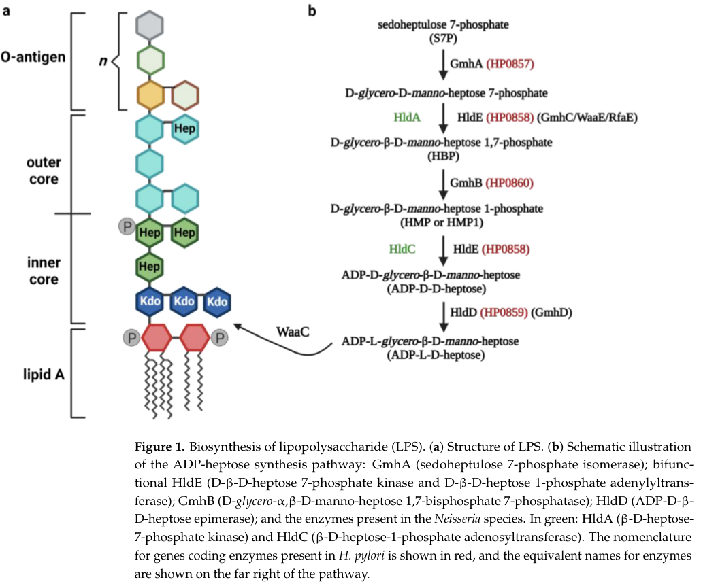

## Question

# Gene Research for Functional Annotation

## ⚠️ CRITICAL: Gene/Protein Identification Context

**BEFORE YOU BEGIN RESEARCH:** You MUST verify you are researching the CORRECT gene/protein. Gene symbols can be ambiguous, especially for less well-characterized genes from non-model organisms.

### Target Gene/Protein Identity (from UniProt):
- **UniProt Accession:** Q88RS0
- **Protein Description:** RecName: Full=D-glycero-beta-D-manno-heptose-1,7-bisphosphate 7-phosphatase {ECO:0000250|UniProtKB:P63228}; EC=3.1.3.82 {ECO:0000269|PubMed:25848029}; AltName: Full=D,D-heptose 1,7-bisphosphate phosphatase {ECO:0000255|PIRNR:PIRNR004682}; Short=HBP phosphatase {ECO:0000250|UniProtKB:P63228};
- **Gene Information:** Name=gmhB {ECO:0000250|UniProtKB:P63228}; OrderedLocusNames=PP_0059 {ECO:0000312|EMBL:AAN65693.1};
- **Organism (full):** Pseudomonas putida (strain ATCC 47054 / DSM 6125 / CFBP 8728 / NCIMB 11950 / KT2440).
- **Protein Family:** Belongs to the gmhB family.
- **Key Domains:** HAD-like_sf. (IPR036412); HAD-SF_hydro_IIIA. (IPR006549); HAD_sf. (IPR023214); Heptose_bisP_phosphatase. (IPR004446); Histidinol-phos. (IPR006543)

### MANDATORY VERIFICATION STEPS:

1. **Check if the gene symbol "gmhB" matches the protein description above**
2. **Verify the organism is correct:** Pseudomonas putida (strain ATCC 47054 / DSM 6125 / CFBP 8728 / NCIMB 11950 / KT2440).
3. **Check if protein family/domains align with what you find in literature**
4. **If you find literature for a DIFFERENT gene with the same or similar symbol, STOP**

### If Gene Symbol is Ambiguous or You Cannot Find Relevant Literature:

**DO NOT PROCEED WITH RESEARCH ON A DIFFERENT GENE.** Instead:
- State clearly: "The gene symbol 'gmhB' is ambiguous or literature is limited for this specific protein"
- Explain what you found (e.g., "Found extensive literature on a different gene with the same symbol in a different organism")
- Describe the protein based ONLY on the UniProt information provided above
- Suggest that the protein function can be inferred from domain/family information

### Research Target:

Please provide a comprehensive research report on the gene **gmhB** (gene ID: gmhB, UniProt: Q88RS0) in PSEPK.

The research report should be a detailed narrative explaining the function, biological processes, and localization of the gene product. Citations should be given for all claims.

You should prioritize authoritative reviews and primary scientific literature when conducting research. You can supplement
this with annotations you find in gene/protein databases, but these can be outdated or inaccurate.

We are specifically interested in the primary function of the gene - for enzymes, what reaction is catalyzed, and what is the substrate specificity? For transporters, what is the substrate? For structural proteins or adapters, what is the broader structural role? For signaling molecules, what is the role in the pathway.

We are interested in where in or outside the cell the gene product carries out its function.

We are also interested in the signaling or biochemical pathways in which the gene functions. We are less interested in broad pleiotropic effects, except where these elucidate the precise role.

Include evidence where possible. We are interested in both experimental evidence as well as inference from structure, evolution, or bioinformatic analysis. Precise studies should be prioritized over high-throughput, where available.

## Output

Question: You are an expert researcher providing comprehensive, well-cited information.

Provide detailed information focusing on:
1. Key concepts and definitions with current understanding
2. Recent developments and latest research (prioritize 2023-2024 sources)
3. Current applications and real-world implementations
4. Expert opinions and analysis from authoritative sources
5. Relevant statistics and data from recent studies

Format as a comprehensive research report with proper citations. Include URLs and publication dates where available.
Always prioritize recent, authoritative sources and provide specific citations for all major claims.

# Gene Research for Functional Annotation

## ⚠️ CRITICAL: Gene/Protein Identification Context

**BEFORE YOU BEGIN RESEARCH:** You MUST verify you are researching the CORRECT gene/protein. Gene symbols can be ambiguous, especially for less well-characterized genes from non-model organisms.

### Target Gene/Protein Identity (from UniProt):
- **UniProt Accession:** Q88RS0
- **Protein Description:** RecName: Full=D-glycero-beta-D-manno-heptose-1,7-bisphosphate 7-phosphatase {ECO:0000250|UniProtKB:P63228}; EC=3.1.3.82 {ECO:0000269|PubMed:25848029}; AltName: Full=D,D-heptose 1,7-bisphosphate phosphatase {ECO:0000255|PIRNR:PIRNR004682}; Short=HBP phosphatase {ECO:0000250|UniProtKB:P63228};
- **Gene Information:** Name=gmhB {ECO:0000250|UniProtKB:P63228}; OrderedLocusNames=PP_0059 {ECO:0000312|EMBL:AAN65693.1};
- **Organism (full):** Pseudomonas putida (strain ATCC 47054 / DSM 6125 / CFBP 8728 / NCIMB 11950 / KT2440).
- **Protein Family:** Belongs to the gmhB family.
- **Key Domains:** HAD-like_sf. (IPR036412); HAD-SF_hydro_IIIA. (IPR006549); HAD_sf. (IPR023214); Heptose_bisP_phosphatase. (IPR004446); Histidinol-phos. (IPR006543)

### MANDATORY VERIFICATION STEPS:

1. **Check if the gene symbol "gmhB" matches the protein description above**
2. **Verify the organism is correct:** Pseudomonas putida (strain ATCC 47054 / DSM 6125 / CFBP 8728 / NCIMB 11950 / KT2440).
3. **Check if protein family/domains align with what you find in literature**
4. **If you find literature for a DIFFERENT gene with the same or similar symbol, STOP**

### If Gene Symbol is Ambiguous or You Cannot Find Relevant Literature:

**DO NOT PROCEED WITH RESEARCH ON A DIFFERENT GENE.** Instead:
- State clearly: "The gene symbol 'gmhB' is ambiguous or literature is limited for this specific protein"
- Explain what you found (e.g., "Found extensive literature on a different gene with the same symbol in a different organism")
- Describe the protein based ONLY on the UniProt information provided above
- Suggest that the protein function can be inferred from domain/family information

### Research Target:

Please provide a comprehensive research report on the gene **gmhB** (gene ID: gmhB, UniProt: Q88RS0) in PSEPK.

The research report should be a detailed narrative explaining the function, biological processes, and localization of the gene product. Citations should be given for all claims.

You should prioritize authoritative reviews and primary scientific literature when conducting research. You can supplement
this with annotations you find in gene/protein databases, but these can be outdated or inaccurate.

We are specifically interested in the primary function of the gene - for enzymes, what reaction is catalyzed, and what is the substrate specificity? For transporters, what is the substrate? For structural proteins or adapters, what is the broader structural role? For signaling molecules, what is the role in the pathway.

We are interested in where in or outside the cell the gene product carries out its function.

We are also interested in the signaling or biochemical pathways in which the gene functions. We are less interested in broad pleiotropic effects, except where these elucidate the precise role.

Include evidence where possible. We are interested in both experimental evidence as well as inference from structure, evolution, or bioinformatic analysis. Precise studies should be prioritized over high-throughput, where available.

## Comprehensive Research Report: **gmhB** (UniProt Q88RS0; PP_0059) in *Pseudomonas putida* KT2440

### 0) Scope, identity verification, and evidence limitations
The target protein is UniProt **Q88RS0**, annotated in *Pseudomonas putida* KT2440 as **GmhB**, a **D-glycero-β-D-manno-heptose-1,7-bisphosphate 7-phosphatase** (HBP phosphatase), EC **3.1.3.82** (sometimes reported as 3.1.3.82/83). In the retrieved literature, **GmhB** is consistently used for the enzyme that dephosphorylates **HBP** in the **ADP-heptose** biosynthesis pathway that supplies **heptose residues to the LPS inner core**. This functional identity is explicitly stated in multiple sources, including a Pseudomonas-focused genetics study that also lists the EC number. (yang2022analysisofthe pages 5-7, sidor2023abittersweetkiss pages 2-3)

**Critical limitation (organism-specificity):** within the available retrieved sources, I did **not** obtain a primary article that directly studies **Q88RS0 / PP_0059 in *P. putida* KT2440**. Therefore, KT2440-specific statements below are limited to (i) the UniProt-provided identity you supplied and (ii) **carefully qualified inference by homology** supported by experimental work in other Gram-negative bacteria, including *Pseudomonas aeruginosa* and Enterobacterales. (yang2022analysisofthe pages 5-7, mobley2024fitnessfactorgenes pages 24-25)

---

### 1) Key concepts and definitions (current understanding)

#### 1.1 Lipopolysaccharide (LPS) core and heptose metabolism
Gram-negative LPS consists of **lipid A**, a **core oligosaccharide** (inner + outer core), and often an **O-antigen** polysaccharide. The **inner core** is relatively conserved and commonly includes **Kdo** and **heptose** sugars; disruption of LPS core assembly can increase sensitivity to hostile conditions (e.g., detergents/antibiotics) and alter bacterial fitness. (sidor2023abittersweetkiss pages 1-2, sidor2023abittersweetkiss pages 2-3)

#### 1.2 ADP-heptose biosynthesis pathway
**ADP-heptose** (and related ADP-heptose stereoisomers) are activated sugar donors used to build **LPS heptose-containing core structures**. A widely conserved **five-step pathway** is described for *E. coli* and many other Gram-negative bacteria: **GmhA** converts sedoheptulose-7-phosphate (S7P) to heptose-7-phosphate; **HldE** (or in some taxa HldA/HldC) generates **HBP**; **GmhB** dephosphorylates **HBP** to **HMP/HMP1**; **HldE** adenylates HMP to ADP-D,D-heptose; and **HldD** epimerizes to ADP-L,D-heptose. The heptose is then transferred into LPS core by a heptosyltransferase (e.g., WaaC in the summarized pathway). (sidor2023abittersweetkiss pages 2-3, sidor2023abittersweetkiss pages 3-5)

#### 1.3 GmhB definition
**GmhB** is defined as **D-glycero-β-D-manno-heptose 1,7-bisphosphate 7-phosphatase**, i.e., an enzyme that **removes the 7-phosphate from HBP** to produce **heptose-1-phosphate (HMP/HMP1)**. (sidor2023abittersweetkiss pages 2-3, faass2023innatehumancell pages 22-24)

---

### 2) Primary biochemical function of GmhB (reaction, substrate specificity, pathway role)

#### 2.1 Catalyzed reaction and substrate
The key biochemical step is:

**D-glycero-β-D-manno-heptose 1,7-bisphosphate (HBP) → D-glycero-β-D-manno-heptose 1-phosphate (HMP/HMP1) + Pi**

This reaction is described as **dephosphorylation at the C-7 position** of HBP by GmhB. (sidor2023abittersweetkiss pages 2-3, faass2023innatehumancell pages 22-24)

#### 2.2 Pathway positioning and functional consequence
GmhB acts **upstream of ADP-heptose formation**: after HBP is generated by upstream heptose-kinase activity, dephosphorylation to HMP allows subsequent **adenylation** (by HldE in the canonical scheme) to yield **ADP-heptose**, which is then incorporated into the LPS core. Thus, GmhB is best annotated as an enzyme of **LPS inner-core heptose donor biosynthesis**, rather than a signaling enzyme. (sidor2023abittersweetkiss pages 2-3, sidor2023abittersweetkiss pages 3-5)

A pathway schematic showing the GmhB-catalyzed step (HBP → HMP/HMP1) is provided in the review figure extracted here. (sidor2023abittersweetkiss media cc0be430)

#### 2.3 Evidence for conserved enzymatic function (2024 biochemical study)
A 2024 enzyme-characterization study in *Vibrio cholerae* and *Vibrio parahaemolyticus* explicitly treats **GmhB homologs as HBP phosphatases** and shows that reconstituted enzyme sets (GmhA + GmhB + HldE) convert **S7P → ADP-D,D-manno-heptose**, and that hybrid combinations with *E. coli* enzymes also work with **comparable efficiencies**, supporting strong conservation of function across Proteobacteria. (shi2024characterizationofthe pages 6-7)

**Quantitative data from the reconstitution:** with **200 µM S7P**, about **64–80 µM ADP-D,D-manno-heptose** was produced after **2 h at 30°C, pH 8.0**, depending on the enzyme set (Vibrio vs *E. coli*). While this measurement is for the multi-enzyme pathway output (not a purified kinetic constant for GmhB alone), it provides experimental support that the phosphatase step is functional and interchangeable in the pathway context. (shi2024characterizationofthe pages 6-7)

**Substrate specificity/kinetics:** The retrieved corpus did **not** provide Km/kcat values specifically for GmhB (most kinetic effort in the 2024 study excerpt is reported for HldE). Therefore, substrate-specificity beyond HBP (and the required pathway role) cannot be quantified here without additional primary sources. (shi2024characterizationofthe pages 6-7)

---

### 3) Cellular localization and where the function is carried out
The ADP-heptose pathway intermediates described (S7P, HBP, HMP/HMP1, ADP-heptose) are **soluble sugar phosphates / nucleotide sugars**, which are generated prior to transfer into LPS. This strongly implies that GmhB acts in the **cytosolic** compartment where these metabolites are made and processed, with downstream glycosyltransfer steps contributing to envelope assembly. However, **no direct subcellular localization experiment** for *P. putida* KT2440 GmhB (Q88RS0) is present in the retrieved evidence set, so localization in KT2440 should be treated as pathway-based inference rather than proven for this strain. (sidor2023abittersweetkiss pages 2-3, sidor2023abittersweetkiss pages 3-5)

---

### 4) Genetic and physiological evidence relevant to *Pseudomonas* (closest homolog evidence)

#### 4.1 *Pseudomonas aeruginosa* PA0006 is a functional homolog of gmhB
A 2022 *Applied and Environmental Microbiology* study on a conditional lethal allele of **PA0006** in *P. aeruginosa* provides the most directly relevant Pseudomonas evidence available here.

Key findings:
- *E. coli* **gmhB** (annotated there as **D-glycero-β-D-manno-heptose 1,7-bisphosphate 7-phosphatase**, EC 3.1.3.82/83) is stated to participate in the **ADP-heptose** pathway used for LPS inner core precursor biosynthesis. (yang2022analysisofthe pages 5-7)
- *E. coli* **GmhB** shares **32.4% identity over 191 residues** with PA0006p, and **induced expression of *E. coli* gmhB rescues lethality** of the PA0006(Ts) mutant at restrictive temperature, functionally validating homology at the level of physiological role. (yang2022analysisofthe pages 5-7)
- At restrictive temperature, PA0006(Ts) shows **loss of wild-type-like core oligosaccharide** and diminished/absent **B-band O-antigen**; overexpression of *E. coli* gmhB restores **wild-type-like core LPS and O-antigen attachment**, consistent with a conserved role in core LPS biogenesis. (yang2022analysisofthe pages 5-7)

**Interpretation for *P. putida* KT2440 Q88RS0:** While not direct evidence for KT2440, this Pseudomonas-to-*E. coli* complementation is strong support that a Pseudomonas GmhB-family enzyme performs a **core LPS/ADP-heptose biosynthetic function** and can be physiologically important. (yang2022analysisofthe pages 5-7)

---

### 5) Recent developments (prioritizing 2023–2024)

#### 5.1 ADP-heptose pathway as a host–pathogen interface (2023)
A 2023 review emphasizes that ADP-heptose is now recognized as a **conserved PAMP** that can activate innate immune signaling (ALPK1/TIFA axis) and frames the ADP-heptose/LPS-core pathway as relevant to both bacterial fitness and therapeutic targeting strategies. This context matters for gmhB annotation because it highlights that intermediates and flux through the pathway can influence infection biology and immune sensing. (sidor2023abittersweetkiss pages 1-2)

#### 5.2 Expanded biochemical characterization across taxa (2024)
The 2024 Vibrio enzyme study demonstrates modern enzyme-toolbox work: heterologous expression in a “clean chassis” *E. coli* with pathway knockouts, reconstitution of multi-step reactions, and quantitative HPLC-based product measurements. This supports cross-species functional inference for enzymes like GmhB in less-studied organisms (including environmental Pseudomonads), and provides a foundation for engineered biosynthesis applications. (shi2024characterizationofthe pages 6-7)

#### 5.3 In vivo fitness validation in bloodstream infection models (2024)
A 2024 *PLOS Pathogens* study positions **gmhB** as a conserved, experimentally validated **bacteremia fitness factor** across multiple Enterobacterales species. Even though this is not *Pseudomonas*, it is a 2024 high-authority dataset demonstrating that disrupting this step in core LPS-related metabolism can produce measurable, organ-specific attenuation in vivo. (mobley2024fitnessfactorgenes pages 24-25)

---

### 6) Current applications and real-world implementations

#### 6.1 Antimicrobial/anti-virulence target rationale via envelope integrity
The ADP-heptose pathway (including enzymes such as GmhB) is discussed as a potential drug-targeting candidate in the context of antimicrobial resistance: disrupting heptose-core biosynthesis can yield “deep-rough” or otherwise defective LPS, increasing sensitivity to hostile environments and potentially to antibiotics, motivating interest in core-oligosaccharide pathway inhibition strategies. (sidor2023abittersweetkiss pages 3-5)

#### 6.2 Fitness/virulence attenuation phenotypes (2024 evidence)
Mobley et al. (2024) discuss that **gmhB mutants** produce **mixed full-length and stunted LPS molecules**, and that some lower molecular weight LPS components may be absent. The paper also notes gmhB mutants can show increased susceptibility to antimicrobial peptides and competitive disadvantage in host-relevant conditions, supporting a real-world rationale for targeting LPS-core biosynthesis determinants in systemic infection contexts. (mobley2024fitnessfactorgenes pages 24-25)

---

### 7) Expert opinions / authoritative analysis (from retrieved sources)

- The 2023 review explicitly frames **core-oligosaccharide/ADP-heptose biosynthesis** as an “alternative strategy” target area in the context of rising drug resistance in Gram-negative bacteria, arguing that deeper study of this pathway is needed to enable inhibitor development. (sidor2023abittersweetkiss pages 3-5)
- The 2024 bacteremia fitness study argues that conserved fitness factors (including those involved in envelope structures like LPS) “may represent future targets of therapy” against bloodstream infections, and it situates gmhB within a model of bacteremia pathogenesis where intact surface structures contribute to defense against complement and antimicrobial peptides. (mobley2024fitnessfactorgenes pages 24-25)

---

### 8) Statistics and data points from recent studies (2023–2024 prioritized)

- **Biochemical output (2024):** In an in vitro multi-enzyme reconstitution (GmhA + GmhB + HldE), **64–80 µM** ADP-D,D-manno-heptose was generated from **200 µM S7P** after **2 h at 30°C, pH 8.0**, depending on the organism’s enzyme set tested (*Vibrio* vs *E. coli*). (shi2024characterizationofthe pages 6-7)

- **In vivo fitness generalization (2024):** In a multi-species Enterobacterales comparison in murine bacteremia, **gmhB** was described as validated across species (in the liver for all five species and in the spleen for 4/5) and linked to LPS defects and susceptibility phenotypes, supporting the concept that this pathway contributes to bloodstream fitness. (mobley2024fitnessfactorgenes pages 24-25)

- **Sequence identity (Pseudomonas genetics, 2022):** *P. aeruginosa* PA0006p and *E. coli* GmhB share **32.4% identity** across **191** residues, but nonetheless show functional complementation across species. (yang2022analysisofthe pages 5-7)

---

### 9) Functional annotation summary for *P. putida* KT2440 gmhB (Q88RS0)

**Most supported annotation:** Q88RS0 is best annotated as a **cytosolic HBP 7-phosphatase (GmhB)** that participates in **ADP-heptose donor biosynthesis**, enabling **LPS inner-core heptose incorporation** and thereby contributing to outer membrane/envelope integrity.

**Evidence basis:** pathway definition and GmhB step (review + dissertation excerpts), biochemical conservation across Proteobacteria (2024 enzyme reconstitution), and Pseudomonas-adjacent functional genetics showing gmhB can restore core LPS/O-antigen phenotypes in a Pseudomonas conditional mutant. (sidor2023abittersweetkiss pages 2-3, shi2024characterizationofthe pages 6-7, yang2022analysisofthe pages 5-7)

**What cannot be concluded from retrieved sources:** KT2440-specific phenotypes (growth, stress sensitivity), operon context, essentiality, and direct localization experiments for Q88RS0 were not found in the retrieved corpus; additional targeted retrieval (e.g., KT2440 genome-scale essentiality or envelope phenotyping papers) would be needed for strain-specific confirmation. (mobley2024fitnessfactorgenes pages 24-25)

---

### Evidence summary table
| Claim / Functional detail | Evidence type (biochemical, genetic, in vivo fitness, review) | Organism(s) studied | Key quantitative/statistical data (if any) | Interpretation for *P. putida* KT2440 | Primary citation (include DOI URL and year) |
|---|---|---|---|---|---|
| GmhB catalyzes dephosphorylation of D-glycero-β-D-manno-heptose 1,7-bisphosphate (HBP) at C-7 to form D-glycero-β-D-manno-heptose 1-phosphate (HMP/HMP1). | Review / pathway synthesis | Primarily *E. coli* pathway summarized for Gram-negative bacteria | No kinetic values given in the review excerpt; reaction defined as HBP → HMP/HMP1 (sidor2023abittersweetkiss pages 2-3, faass2023innatehumancell pages 22-24) | Supports annotation of Q88RS0 as an HBP 7-phosphatase rather than a generic phosphatase; consistent with UniProt name for PP_0059. | Sidor & Skirecki 2023, *Microorganisms*, DOI: https://doi.org/10.3390/microorganisms11051316 (2023) (sidor2023abittersweetkiss pages 2-3, faass2023innatehumancell pages 22-24) |
| GmhB occupies the third step of the conserved five-step ADP-heptose biosynthesis pathway supplying heptose for LPS inner-core assembly; it acts between HldE kinase-generated HBP and HldE adenylyltransferase conversion to ADP-D,D-heptose, followed by HldD epimerization and WaaC transfer into LPS core. | Review / pathway synthesis | Gram-negative bacteria; pathway described using *E. coli* nomenclature | Five-step pathway explicitly described; no direct numeric enzyme constants in excerpt (sidor2023abittersweetkiss pages 2-3, sidor2023abittersweetkiss pages 3-5, sidor2023abittersweetkiss media cc0be430) | Strongly supports placing *P. putida* KT2440 GmhB in cytosolic ADP-heptose/LPS inner-core biosynthesis rather than in signaling or transport. | Sidor & Skirecki 2023, *Microorganisms*, DOI: https://doi.org/10.3390/microorganisms11051316 (2023) (sidor2023abittersweetkiss pages 2-3, sidor2023abittersweetkiss pages 3-5, sidor2023abittersweetkiss media cc0be430) |
| *E. coli* gmhB functionally complements *Pseudomonas aeruginosa* PA0006(Ts); induced gmhB expression rescues lethality at 42°C and restores wild-type-like core LPS plus B-band O-antigen attachment, indicating PA0006 is a functional GmhB homolog in *Pseudomonas*. | Genetic / functional complementation | *P. aeruginosa* PAO1, *E. coli* K-12 | PA0006p and *E. coli* GmhB share 32.4% identity across 191 aligned residues; complementation restores growth and LPS/O-antigen phenotypes at nonpermissive temperature (yang2022analysisofthe pages 5-7, yang2022analysisofthe pages 1-2) | Closest organism-specific evidence for annotating *P. putida* KT2440 Q88RS0: strongly suggests a conserved GmhB role in core LPS biosynthesis in *Pseudomonas*, though not yet directly tested in KT2440. | Yang et al. 2022, *Applied and Environmental Microbiology*, DOI: https://doi.org/10.1128/aem.00480-22 (2022) (yang2022analysisofthe pages 5-7, yang2022analysisofthe pages 1-2) |
| Vibrio GmhB homologs are biochemically validated HBP phosphatases in reconstituted ADP-D,D-manno-heptose synthesis; cognate and hybrid enzyme sets convert sedoheptulose-7-phosphate (S7P) to ADP-D,D-manno-heptose, showing pathway conservation and interchangeability. | Biochemical / in vitro pathway reconstitution | *Vibrio cholerae*, *Vibrio parahaemolyticus*, *E. coli* comparator | With 200 μM S7P, about 72 μM (*V. cholerae*), 64 μM (*V. parahaemolyticus*), and 80 μM (*E. coli*) ADP-D,D-manno-heptose were produced after 2 h at 30°C, pH 8.0; Vibrio enzymes show >60% identity to *E. coli* homologs (shi2024characterizationofthe pages 6-7, shi2024characterizationofthe pages 2-5) | Reinforces that Q88RS0 likely performs the same conserved biochemical step in *P. putida* KT2440; however, no KT2440-specific kinetic values are available from the retrieved corpus. | Shi et al. 2024, *Applied Microbiology and Biotechnology*, DOI: https://doi.org/10.1007/s00253-024-13108-3 (2024) (shi2024characterizationofthe pages 6-7, shi2024characterizationofthe pages 2-5) |
| gmhB is a conserved in vivo fitness factor for bacteremia; mutants show mixed full-length/stunted LPS, loss of some lower-molecular-weight LPS components, antimicrobial-peptide susceptibility, and organ-specific attenuation in spleen/liver across Enterobacterales. | In vivo fitness / pathogenesis | Five Enterobacterales species in murine bacteremia; supporting context includes *Klebsiella pneumoniae* | Validated in all five species in liver and 4/5 in spleen; gmhB mutants are outcompeted by wild type in vivo and in murine spleen homogenates; phenotype complemented in trans (mobley2024fitnessfactorgenes pages 24-25, mobley2024fitnessfactorgenes pages 21-22, mobley2024fitnessfactorgenes pages 25-27) | Although not a direct *P. putida* study, these data argue that preserving GmhB-dependent core LPS biogenesis can materially affect envelope integrity and host-associated fitness, supporting high-confidence functional annotation of Q88RS0 in LPS biogenesis. | Mobley et al. 2024, *PLOS Pathogens*, DOI: https://doi.org/10.1371/journal.ppat.1012495 (2024) (mobley2024fitnessfactorgenes pages 24-25, mobley2024fitnessfactorgenes pages 21-22, mobley2024fitnessfactorgenes pages 25-27) |

*Table: This table summarizes the most relevant evidence supporting annotation of *Pseudomonas putida* KT2440 Q88RS0 as GmhB, an HBP phosphatase in ADP-heptose/LPS inner-core biosynthesis. It distinguishes direct organism-specific evidence from cross-species biochemical and in vivo evidence used for cautious functional inference.*

### Key visual evidence (pathway position)
The extracted pathway schematic indicates the GmhB step (HBP → HMP/HMP1) in ADP-heptose synthesis. (sidor2023abittersweetkiss media cc0be430)

---

### References (URLs and publication dates)
- Sidor K, Skirecki T. *A Bittersweet Kiss of Gram-Negative Bacteria: The Role of ADP-Heptose in the Pathogenesis of Infection.* **Microorganisms**. Published **17 May 2023**. https://doi.org/10.3390/microorganisms11051316 (sidor2023abittersweetkiss pages 1-2)
- Shi Z, Tang Y, Wang Z, et al. *Characterization of the ADP-β-D-manno-heptose biosynthetic enzymes from two pathogenic Vibrio strains.* **Applied Microbiology and Biotechnology**. **Mar 2024**. https://doi.org/10.1007/s00253-024-13108-3 (shi2024characterizationofthe pages 6-7)
- Mobley HLT, Anderson MT, Moricz BS, et al. *Fitness factor genes conserved within the multi-species core genome of Gram-negative Enterobacterales species contribute to bacteremia pathogenesis.* **PLOS Pathogens**. Published **23 Aug 2024**. https://doi.org/10.1371/journal.ppat.1012495 (mobley2024fitnessfactorgenes pages 24-25)
- Yang Z, Zhang Z, Zhu J, et al. *Analysis of the plasmid-based ts allele of pa0006 reveals its function in regulation of cell morphology and biosynthesis of core lipopolysaccharide in Pseudomonas aeruginosa.* **Applied and Environmental Microbiology**. **Jul 2022**. https://doi.org/10.1128/aem.00480-22 (yang2022analysisofthe pages 5-7)
- Faaß L. *Innate human cell activation by bacterial lipopolysaccharide core heptose metabolites and Helicobacter pylori.* Dissertation. **Jan 2023**. https://doi.org/10.5282/edoc.32966 (faass2023innatehumancell pages 22-24)

References

1. (yang2022analysisofthe pages 5-7): Zhili Yang, Zengping Zhang, Jiaqi Zhu, Yunhao Ma, Jianxin Wang, and Jianhua Liu. Analysis of the plasmid-based <i>ts</i> allele of <i>pa0006</i> reveals its function in regulation of cell morphology and biosynthesis of core lipopolysaccharide in pseudomonas aeruginosa. Jul 2022. URL: https://doi.org/10.1128/aem.00480-22, doi:10.1128/aem.00480-22. This article has 7 citations and is from a peer-reviewed journal.

2. (sidor2023abittersweetkiss pages 2-3): Karolina Sidor and Tomasz Skirecki. A bittersweet kiss of gram-negative bacteria: the role of adp-heptose in the pathogenesis of infection. Microorganisms, 11:1316, May 2023. URL: https://doi.org/10.3390/microorganisms11051316, doi:10.3390/microorganisms11051316. This article has 11 citations.

3. (mobley2024fitnessfactorgenes pages 24-25): Harry L. T. Mobley, Mark T. Anderson, Bridget S. Moricz, Geoffrey B. Severin, Caitlyn L. Holmes, Elizabeth N. Ottosen, Tad Eichler, Surbhi Gupta, Santosh Paudel, Ritam Sinha, Sophia Mason, Stephanie D. Himpsl, Aric N. Brown, Margaret Gaca, Christina M. Kiser, Thomas H. Clarke, Derrick E. Fouts, Victor J. DiRita, and Michael A. Bachman. Fitness factor genes conserved within the multi-species core genome of gram-negative enterobacterales species contribute to bacteremia pathogenesis. PLOS Pathogens, 20:e1012495, Aug 2024. URL: https://doi.org/10.1371/journal.ppat.1012495, doi:10.1371/journal.ppat.1012495. This article has 9 citations and is from a highest quality peer-reviewed journal.

4. (sidor2023abittersweetkiss pages 1-2): Karolina Sidor and Tomasz Skirecki. A bittersweet kiss of gram-negative bacteria: the role of adp-heptose in the pathogenesis of infection. Microorganisms, 11:1316, May 2023. URL: https://doi.org/10.3390/microorganisms11051316, doi:10.3390/microorganisms11051316. This article has 11 citations.

5. (sidor2023abittersweetkiss pages 3-5): Karolina Sidor and Tomasz Skirecki. A bittersweet kiss of gram-negative bacteria: the role of adp-heptose in the pathogenesis of infection. Microorganisms, 11:1316, May 2023. URL: https://doi.org/10.3390/microorganisms11051316, doi:10.3390/microorganisms11051316. This article has 11 citations.

6. (faass2023innatehumancell pages 22-24): Larissa Faaß. Innate human cell activation by bacterial lipopolysaccharide core heptose metabolites and helicobacter pylori. Dissertation, Jan 2023. URL: https://doi.org/10.5282/edoc.32966, doi:10.5282/edoc.32966. This article has 0 citations.

7. (sidor2023abittersweetkiss media cc0be430): Karolina Sidor and Tomasz Skirecki. A bittersweet kiss of gram-negative bacteria: the role of adp-heptose in the pathogenesis of infection. Microorganisms, 11:1316, May 2023. URL: https://doi.org/10.3390/microorganisms11051316, doi:10.3390/microorganisms11051316. This article has 11 citations.

8. (shi2024characterizationofthe pages 6-7): Zhaoxiang Shi, Yue Tang, Zhenyi Wang, Min Wang, Zijian Zhong, Jingming Jia, and Yihua Chen. Characterization of the adp-β-d-manno-heptose biosynthetic enzymes from two pathogenic vibrio strains. Applied Microbiology and Biotechnology, Mar 2024. URL: https://doi.org/10.1007/s00253-024-13108-3, doi:10.1007/s00253-024-13108-3. This article has 5 citations and is from a domain leading peer-reviewed journal.

9. (yang2022analysisofthe pages 1-2): Zhili Yang, Zengping Zhang, Jiaqi Zhu, Yunhao Ma, Jianxin Wang, and Jianhua Liu. Analysis of the plasmid-based <i>ts</i> allele of <i>pa0006</i> reveals its function in regulation of cell morphology and biosynthesis of core lipopolysaccharide in pseudomonas aeruginosa. Jul 2022. URL: https://doi.org/10.1128/aem.00480-22, doi:10.1128/aem.00480-22. This article has 7 citations and is from a peer-reviewed journal.

10. (shi2024characterizationofthe pages 2-5): Zhaoxiang Shi, Yue Tang, Zhenyi Wang, Min Wang, Zijian Zhong, Jingming Jia, and Yihua Chen. Characterization of the adp-β-d-manno-heptose biosynthetic enzymes from two pathogenic vibrio strains. Applied Microbiology and Biotechnology, Mar 2024. URL: https://doi.org/10.1007/s00253-024-13108-3, doi:10.1007/s00253-024-13108-3. This article has 5 citations and is from a domain leading peer-reviewed journal.

11. (mobley2024fitnessfactorgenes pages 21-22): Harry L. T. Mobley, Mark T. Anderson, Bridget S. Moricz, Geoffrey B. Severin, Caitlyn L. Holmes, Elizabeth N. Ottosen, Tad Eichler, Surbhi Gupta, Santosh Paudel, Ritam Sinha, Sophia Mason, Stephanie D. Himpsl, Aric N. Brown, Margaret Gaca, Christina M. Kiser, Thomas H. Clarke, Derrick E. Fouts, Victor J. DiRita, and Michael A. Bachman. Fitness factor genes conserved within the multi-species core genome of gram-negative enterobacterales species contribute to bacteremia pathogenesis. PLOS Pathogens, 20:e1012495, Aug 2024. URL: https://doi.org/10.1371/journal.ppat.1012495, doi:10.1371/journal.ppat.1012495. This article has 9 citations and is from a highest quality peer-reviewed journal.

12. (mobley2024fitnessfactorgenes pages 25-27): Harry L. T. Mobley, Mark T. Anderson, Bridget S. Moricz, Geoffrey B. Severin, Caitlyn L. Holmes, Elizabeth N. Ottosen, Tad Eichler, Surbhi Gupta, Santosh Paudel, Ritam Sinha, Sophia Mason, Stephanie D. Himpsl, Aric N. Brown, Margaret Gaca, Christina M. Kiser, Thomas H. Clarke, Derrick E. Fouts, Victor J. DiRita, and Michael A. Bachman. Fitness factor genes conserved within the multi-species core genome of gram-negative enterobacterales species contribute to bacteremia pathogenesis. PLOS Pathogens, 20:e1012495, Aug 2024. URL: https://doi.org/10.1371/journal.ppat.1012495, doi:10.1371/journal.ppat.1012495. This article has 9 citations and is from a highest quality peer-reviewed journal.

## Artifacts

- [Edison artifact artifact-00](gmhB-deep-research-falcon_artifacts/artifact-00.md)

## Citations

1. shi2024characterizationofthe pages 6-7
2. yang2022analysisofthe pages 5-7
3. sidor2023abittersweetkiss pages 1-2
4. mobley2024fitnessfactorgenes pages 24-25
5. sidor2023abittersweetkiss pages 3-5
6. faass2023innatehumancell pages 22-24
7. sidor2023abittersweetkiss pages 2-3
8. yang2022analysisofthe pages 1-2
9. shi2024characterizationofthe pages 2-5
10. mobley2024fitnessfactorgenes pages 21-22
11. mobley2024fitnessfactorgenes pages 25-27
12. https://doi.org/10.3390/microorganisms11051316
13. https://doi.org/10.1128/aem.00480-22
14. https://doi.org/10.1007/s00253-024-13108-3
15. https://doi.org/10.1371/journal.ppat.1012495
16. https://doi.org/10.5282/edoc.32966
17. https://doi.org/10.1128/aem.00480-22,
18. https://doi.org/10.3390/microorganisms11051316,
19. https://doi.org/10.1371/journal.ppat.1012495,
20. https://doi.org/10.5282/edoc.32966,
21. https://doi.org/10.1007/s00253-024-13108-3,