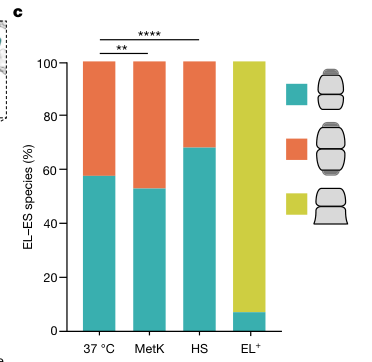

## Question

# Gene Research for Functional Annotation

## ⚠️ CRITICAL: Gene/Protein Identification Context

**BEFORE YOU BEGIN RESEARCH:** You MUST verify you are researching the CORRECT gene/protein. Gene symbols can be ambiguous, especially for less well-characterized genes from non-model organisms.

### Target Gene/Protein Identity (from UniProt):
- **UniProt Accession:** Q88N55
- **Protein Description:** RecName: Full=Chaperonin GroEL {ECO:0000255|HAMAP-Rule:MF_00600}; EC=5.6.1.7 {ECO:0000255|HAMAP-Rule:MF_00600}; AltName: Full=60 kDa chaperonin {ECO:0000255|HAMAP-Rule:MF_00600}; AltName: Full=Chaperonin-60 {ECO:0000255|HAMAP-Rule:MF_00600}; Short=Cpn60 {ECO:0000255|HAMAP-Rule:MF_00600};
- **Gene Information:** Name=groEL {ECO:0000255|HAMAP-Rule:MF_00600}; Synonyms=groL {ECO:0000255|HAMAP-Rule:MF_00600}; OrderedLocusNames=PP_1361;
- **Organism (full):** Pseudomonas putida (strain ATCC 47054 / DSM 6125 / CFBP 8728 / NCIMB 11950 / KT2440).
- **Protein Family:** Belongs to the chaperonin (HSP60) family.
- **Key Domains:** Chaperonin_Cpn60_CS. (IPR018370); Cpn60/GroEL. (IPR001844); Cpn60/GroEL/TCP-1. (IPR002423); GroEL-like_apical_dom_sf. (IPR027409); GROEL-like_equatorial_sf. (IPR027413)

### MANDATORY VERIFICATION STEPS:

1. **Check if the gene symbol "groEL" matches the protein description above**
2. **Verify the organism is correct:** Pseudomonas putida (strain ATCC 47054 / DSM 6125 / CFBP 8728 / NCIMB 11950 / KT2440).
3. **Check if protein family/domains align with what you find in literature**
4. **If you find literature for a DIFFERENT gene with the same or similar symbol, STOP**

### If Gene Symbol is Ambiguous or You Cannot Find Relevant Literature:

**DO NOT PROCEED WITH RESEARCH ON A DIFFERENT GENE.** Instead:
- State clearly: "The gene symbol 'groEL' is ambiguous or literature is limited for this specific protein"
- Explain what you found (e.g., "Found extensive literature on a different gene with the same symbol in a different organism")
- Describe the protein based ONLY on the UniProt information provided above
- Suggest that the protein function can be inferred from domain/family information

### Research Target:

Please provide a comprehensive research report on the gene **groEL** (gene ID: groEL, UniProt: Q88N55) in PSEPK.

The research report should be a detailed narrative explaining the function, biological processes, and localization of the gene product. Citations should be given for all claims.

You should prioritize authoritative reviews and primary scientific literature when conducting research. You can supplement
this with annotations you find in gene/protein databases, but these can be outdated or inaccurate.

We are specifically interested in the primary function of the gene - for enzymes, what reaction is catalyzed, and what is the substrate specificity? For transporters, what is the substrate? For structural proteins or adapters, what is the broader structural role? For signaling molecules, what is the role in the pathway.

We are interested in where in or outside the cell the gene product carries out its function.

We are also interested in the signaling or biochemical pathways in which the gene functions. We are less interested in broad pleiotropic effects, except where these elucidate the precise role.

Include evidence where possible. We are interested in both experimental evidence as well as inference from structure, evolution, or bioinformatic analysis. Precise studies should be prioritized over high-throughput, where available.

## Output

Question: You are an expert researcher providing comprehensive, well-cited information.

Provide detailed information focusing on:
1. Key concepts and definitions with current understanding
2. Recent developments and latest research (prioritize 2023-2024 sources)
3. Current applications and real-world implementations
4. Expert opinions and analysis from authoritative sources
5. Relevant statistics and data from recent studies

Format as a comprehensive research report with proper citations. Include URLs and publication dates where available.
Always prioritize recent, authoritative sources and provide specific citations for all major claims.

# Gene Research for Functional Annotation

## ⚠️ CRITICAL: Gene/Protein Identification Context

**BEFORE YOU BEGIN RESEARCH:** You MUST verify you are researching the CORRECT gene/protein. Gene symbols can be ambiguous, especially for less well-characterized genes from non-model organisms.

### Target Gene/Protein Identity (from UniProt):
- **UniProt Accession:** Q88N55
- **Protein Description:** RecName: Full=Chaperonin GroEL {ECO:0000255|HAMAP-Rule:MF_00600}; EC=5.6.1.7 {ECO:0000255|HAMAP-Rule:MF_00600}; AltName: Full=60 kDa chaperonin {ECO:0000255|HAMAP-Rule:MF_00600}; AltName: Full=Chaperonin-60 {ECO:0000255|HAMAP-Rule:MF_00600}; Short=Cpn60 {ECO:0000255|HAMAP-Rule:MF_00600};
- **Gene Information:** Name=groEL {ECO:0000255|HAMAP-Rule:MF_00600}; Synonyms=groL {ECO:0000255|HAMAP-Rule:MF_00600}; OrderedLocusNames=PP_1361;
- **Organism (full):** Pseudomonas putida (strain ATCC 47054 / DSM 6125 / CFBP 8728 / NCIMB 11950 / KT2440).
- **Protein Family:** Belongs to the chaperonin (HSP60) family.
- **Key Domains:** Chaperonin_Cpn60_CS. (IPR018370); Cpn60/GroEL. (IPR001844); Cpn60/GroEL/TCP-1. (IPR002423); GroEL-like_apical_dom_sf. (IPR027409); GROEL-like_equatorial_sf. (IPR027413)

### MANDATORY VERIFICATION STEPS:

1. **Check if the gene symbol "groEL" matches the protein description above**
2. **Verify the organism is correct:** Pseudomonas putida (strain ATCC 47054 / DSM 6125 / CFBP 8728 / NCIMB 11950 / KT2440).
3. **Check if protein family/domains align with what you find in literature**
4. **If you find literature for a DIFFERENT gene with the same or similar symbol, STOP**

### If Gene Symbol is Ambiguous or You Cannot Find Relevant Literature:

**DO NOT PROCEED WITH RESEARCH ON A DIFFERENT GENE.** Instead:
- State clearly: "The gene symbol 'groEL' is ambiguous or literature is limited for this specific protein"
- Explain what you found (e.g., "Found extensive literature on a different gene with the same symbol in a different organism")
- Describe the protein based ONLY on the UniProt information provided above
- Suggest that the protein function can be inferred from domain/family information

### Research Target:

Please provide a comprehensive research report on the gene **groEL** (gene ID: groEL, UniProt: Q88N55) in PSEPK.

The research report should be a detailed narrative explaining the function, biological processes, and localization of the gene product. Citations should be given for all claims.

You should prioritize authoritative reviews and primary scientific literature when conducting research. You can supplement
this with annotations you find in gene/protein databases, but these can be outdated or inaccurate.

We are specifically interested in the primary function of the gene - for enzymes, what reaction is catalyzed, and what is the substrate specificity? For transporters, what is the substrate? For structural proteins or adapters, what is the broader structural role? For signaling molecules, what is the role in the pathway.

We are interested in where in or outside the cell the gene product carries out its function.

We are also interested in the signaling or biochemical pathways in which the gene functions. We are less interested in broad pleiotropic effects, except where these elucidate the precise role.

Include evidence where possible. We are interested in both experimental evidence as well as inference from structure, evolution, or bioinformatic analysis. Precise studies should be prioritized over high-throughput, where available.

# Research Report: groEL (UniProt Q88N55; PP_1361) in *Pseudomonas putida* KT2440

## 0. Target verification (mandatory)

The requested target is the **GroEL (Cpn60/Hsp60) chaperonin** encoded by **groEL (syn. groL)** in *Pseudomonas putida* strain KT2440, with ordered locus name **PP_1361** (UniProt **Q88N55**). In a KT2440 transcriptome dataset, **PP_1361 is explicitly annotated as “chaperonin 60 kDa (groEL)”** and is co-induced with its cognate cochaperonin **groES (PP_1360)** under stress-response categories, which matches the UniProt-provided identity and domain/family expectations for bacterial GroEL. (follonier2013newinsightson pages 5-6)

## 1. Key concepts and definitions (current understanding)

### 1.1 What GroEL is

GroEL is a **Group I bacterial chaperonin** (EC **5.6.1.7**) that assists folding of non-native proteins in an **ATP-dependent reaction cycle** with its obligate co-chaperonin **GroES**. Structurally, GroEL is a ~**800 kDa** complex formed by **two back-to-back heptameric rings (a tetradecamer)**; GroES is a **heptameric “lid”** that caps one end of GroEL. (wagner2024visualizingchaperoninfunction pages 1-2)

### 1.2 Mechanistic definition of the GroEL/GroES cycle

GroEL recognizes non-native substrates primarily via **hydrophobic binding sites in apical domains**, whereas the **equatorial domains bind and hydrolyze ATP**. ATP binding promotes major conformational changes that allow GroES to bind and cap the substrate-containing ring (the **cis** ring), displacing the client into a now **hydrophilic, enclosed folding chamber** where folding proceeds during ATP hydrolysis. The opposite (**trans**) ring can bind a new substrate; ATP binding to the trans ring triggers **cis-chamber opening and GroES dissociation** through **negative inter-ring allostery**, releasing the folded product to the cytosol. (wagner2024visualizingchaperoninfunction pages 1-2, wagner2024visualizingchaperoninfunction pages 5-6)

### 1.3 Substrate/client scope and size constraints

A recent cryo-EM study summarized that the GroEL–GroES chamber can accommodate proteins up to approximately **~60–70 kDa**; many canonical bacterial clients are in the **20–40 kDa** range with a sharp drop above **~50 kDa**. In cells, GroEL–GroES is estimated to assist folding of roughly **~10% of newly synthesized proteins** (noting this is a general bacterial estimate rather than KT2440-specific). (gardner2023structuralbasisof pages 1-2, wagner2024visualizingchaperoninfunction pages 1-2)

### 1.4 Subcellular localization in bacteria

GroEL is an **intracellular (cytosolic) chaperonin machine**. In situ cryo-electron tomography directly visualized GroEL–GroES complexes **inside bacterial cells**, consistent with a cytosolic protein-folding role rather than a periplasmic or extracellular localization. (wagner2024visualizingchaperoninfunction pages 1-2, wagner2024visualizingchaperoninfunction pages 3-4)

## 2. groEL in *Pseudomonas putida* KT2440: function, pathways, and regulation

### 2.1 Primary function in KT2440

For KT2440, groEL (PP_1361) encodes the **60 kDa chaperonin GroEL**, functioning as the core ATP-dependent folding machine in the GroEL/GroES proteostasis module. Its primary biological role is expected to be **assisting folding/refolding of stress-labile or newly synthesized cytosolic proteins**, preventing aggregation and enabling recovery from proteotoxic stress. This is supported by its placement among induced “stress response (chaperones)” genes under multiple stress conditions in KT2440 datasets. (follonier2013newinsightson pages 5-6)

### 2.2 Operon/functional partner: groES (PP_1360)

groEL is functionally coupled to **groES (PP_1360)**, and KT2440 datasets show co-induction of groES and groEL under the same perturbations, consistent with the canonical groESL module. (dominguezcuevas2006transcriptionaltradeoffbetween pages 7-8, follonier2013newinsightson pages 5-6)

### 2.3 Regulatory context: heat-shock sigma factor RpoH (σ32)

In *P. putida* KT strains, groEL is part of the **RpoH/σ32 heat-shock response (HSR)**. Upon temperature upshift, the expression of classical hsp genes (including **groEL**) increases rapidly (within **~10 min**) and correlates with the cellular level of σ32; notably, groEL mRNA can remain elevated longer than some other heat-shock transcripts (remaining high at **~30 min** in one study). Additionally, GroEL/GroES participate in **negative-feedback control** of σ32 activity under non-stress conditions by helping bind/inactivate σ32. Under prolonged high-temperature treatment (e.g., **45°C**), **AlgU** becomes important for controlling rpoH, linking envelope stress control to the cytosolic heat-shock program. (ito2014geneticandphenotypic pages 6-8, ito2014geneticandphenotypic pages 2-3)

## 3. KT2440 stress responses involving groEL (quantitative evidence)

### 3.1 Aromatic/solvent stress (toluene, o-xylene, 3-methylbenzoate)

A proteomic study of KT2440 exposed for **15 minutes** to aromatics found that groES and groEL are induced as members of the **RpoH regulon**, with a stronger response to the more toxic solvents. Reported fold changes (Table 5) were:

- **groES (PP_1360):** 1.00 (toluene), 1.50 (o-xylene), 1.45 (3MB)
- **groEL (PP_1361):** 1.10 (toluene), 1.83 (o-xylene), 1.24 (3MB)

These data support a role for GroEL in acute solvent-proteotoxic stress tolerance, consistent with solvent challenge triggering σ32-mediated chaperone induction. (dominguezcuevas2006transcriptionaltradeoffbetween pages 7-8)

### 3.2 Elevated pressure and elevated pressure + oxygen tension

In a KT2440 microarray study relevant to bioprocess/industrial reactor conditions, groES and groEL were significantly upregulated under **elevated pressure** and under **combined elevated pressure + elevated oxygen tension**:

- **groES (PP_1360):** +1.61 (Pressure), +1.77 (Pressure+Oxygen)
- **groEL (PP_1361):** +1.78 (Pressure), +2.19 (Pressure+Oxygen)

The heat-shock sigma factor **rpoH (PP_5108)** was also upregulated (+1.49 and +1.57, respectively), supporting a heat-shock-like regulatory linkage under these industrially relevant stresses. (follonier2013newinsightson pages 5-6)

### 3.3 Phenol stress (proteomics; qualitative link)

Quantitative proteomics of KT2440 under phenol stress reported induction of multiple heat-shock/chaperone components and described GroEL among **RpoH-dependent proteins** involved in the phenol stress response, although the excerpted data do not provide a groEL-specific fold-change value. (santos2004insightsintopseudomonas pages 6-7)

## 4. Recent developments (prioritizing 2023–2024): updated GroEL mechanism and in situ cycle

### 4.1 2023 cryo-EM structural snapshots refine the nucleotide/substrate cycle

A 2023 cryo-EM study resolved multiple GroEL states with a model substrate (Rubisco) and provided structural answers to how GroEL couples nucleotide binding to substrate encapsulation. Key findings include a strongly **asymmetric ATP-bound ring** in which **four subunits** remain in a substrate-engaged state while **three subunits** adopt a GroES-accepting conformation even before GroES binds, providing a mechanistic basis for GroES recruitment without premature substrate release. The study also supports a model in which apical domains undergo large motions (swing/rotation) that can **stretch/force-unfold** multivalently bound substrates, and it emphasizes a deeper contribution of the **C-terminal tails** to substrate interactions after ATP binding. (gardner2023structuralbasisof pages 7-8, gardner2023structuralbasisof pages 1-2)

### 4.2 2024 in situ cryo-electron tomography quantifies native GroEL–GroES states in cells

A 2024 Nature study directly visualized GroEL–GroES complexes **in situ** and quantified the distributions of functional states. Across growth conditions, approximately **55–70%** of GroEL complexes were **asymmetric (EL–ES1)** with GroES bound to one ring and substrate bound to the opposite ring (substrate-acceptor state), while the remainder were **symmetric (EL–ES2)**. At **37°C**, EL–ES1:EL–ES2 was approximately **60:40**, and after heat stress EL–ES1 rose to ~**70%**. The study also quantified cellular abundance relative to ribosomes (median **GroEL:ribosome ≈ 1:23 at 37°C** and ≈ **1:10 after heat stress**), consistent with roughly a **threefold induction** of GroEL relative to ribosomes after heat stress. These “native state” constraints are highly relevant when interpreting groEL induction in proteomics/transcriptomics of environmental Gram-negative bacteria like *P. putida*. (wagner2024visualizingchaperoninfunction pages 2-3, wagner2024visualizingchaperoninfunction media 7cb5f370, wagner2024visualizingchaperoninfunction pages 1-2)

## 5. Current applications and real-world implementations

### 5.1 Interpreting groEL as a process-stress biomarker in *P. putida* bioprocessing

Because groEL (with groES) is induced under industrially relevant perturbations—e.g., solvent exposure (toluene/o-xylene) and **pressure/oxygen tension shifts**—its transcription/protein abundance is commonly used as part of a **stress-response readout** when diagnosing process limitations or engineering tolerance in *P. putida* platforms. The pressure/oxygen dataset was explicitly designed to mimic bioreactor-relevant conditions and identifies groESL induction within a broader stress-response reprogramming. (follonier2013newinsightson pages 5-6, dominguezcuevas2006transcriptionaltradeoffbetween pages 7-8)

### 5.2 Chaperonin state quantification informs engineering strategies (general bacterial insights)

The 2024 in situ quantification provides actionable guidance for synthetic biology and antimicrobial concepts targeting GroEL: the system operates predominantly in an **asymmetric EL–ES1 cycle** in vivo and changes its state distribution and abundance under stress. This can influence strategies that attempt to modulate proteostasis capacity (e.g., by tuning groESL expression levels) because imbalances between GroEL and GroES can bias the cycling mode. (wagner2024visualizingchaperoninfunction pages 2-3, wagner2024visualizingchaperoninfunction pages 5-6)

## 6. Expert interpretation and synthesis (evidence-based)

1. **Functional annotation confidence:** groEL (PP_1361; Q88N55) in KT2440 is strongly supported as the canonical GroEL chaperonin based on direct KT2440 annotation and conserved stress co-regulation with groES. (follonier2013newinsightson pages 5-6)
2. **Primary role:** The most precise role supported by the retrieved literature is **ATP-dependent folding/refolding of cytosolic proteins**, especially under proteotoxic stresses that destabilize proteins (solvents, pressure/oxygen, heat). (dominguezcuevas2006transcriptionaltradeoffbetween pages 7-8, follonier2013newinsightson pages 5-6, wagner2024visualizingchaperoninfunction pages 1-2)
3. **Pathway placement:** In KT strains, groEL belongs to the **RpoH/σ32 heat-shock regulon** and participates in feedback control of σ32; this provides a mechanistic link between environmental stress sensing and proteostasis capacity. (ito2014geneticandphenotypic pages 2-3, ito2014geneticandphenotypic pages 6-8)
4. **Mechanistic nuance (2023–2024):** The GroEL cycle is better understood as a continuum of asymmetric nucleotide/substrate states, with ATP-bound rings showing intrinsic structural asymmetry and in vivo cycles dominated by EL–ES1, rather than a purely symmetric two-ring model. (gardner2023structuralbasisof pages 7-8, wagner2024visualizingchaperoninfunction pages 2-3)

## 7. Evidence summary table

| Aspect | Summary | Evidence/Citation |
|---|---|---|
| Verified identity / annotation | **groEL / groL**, locus **PP_1361**, encodes the **60 kDa chaperonin GroEL (Cpn60/Hsp60 family)** in *Pseudomonas putida* KT2440; in KT2440 transcriptomics tables it is explicitly annotated as **"chaperonin 60 kDa"** and co-listed with **groES (PP_1360)** under stress-response chaperones, matching UniProt Q88N55. | Direct KT2440 annotation and co-listing with groES under stress-response category (follonier2013newinsightson pages 5-6) |
| Primary molecular function | GroEL is the **bacterial Group I chaperonin** that assists folding of non-native proteins in an **ATP-dependent GroEL/GroES cycle**. GroEL is a **double-ring tetradecamer**; apical domains bind non-native substrates, equatorial domains bind/hydrolyze ATP, and ATP-driven GroES capping creates a protected folding chamber. The system can also promote **forced unfolding/stretching** of misfolded intermediates before productive encapsulation. | Mechanistic and structural synthesis from 2023–2024 structural studies (wagner2024visualizingchaperoninfunction pages 1-2, gardner2023structuralbasisof pages 1-2, gardner2023structuralbasisof pages 7-8) |
| Subcellular localization | Functional localization is **cytosolic**: GroEL forms a soluble intracellular chaperonin complex that binds client proteins in the cytosol and encapsulates them inside the GroEL/GroES chamber before release back to the cytosol. In situ work visualized GroEL–GroES directly inside bacterial cells. | In situ intracellular visualization and chamber-based folding cycle (wagner2024visualizingchaperoninfunction pages 1-2, wagner2024visualizingchaperoninfunction pages 3-4) |
| Operon / obligate partner | **groES (PP_1360)** is the cognate co-chaperonin partner immediately associated with **groEL (PP_1361)** in KT2440 datasets; both genes are induced together in multiple stress conditions, consistent with the canonical **groESL** module. | Co-induction of PP_1360 groES and PP_1361 groEL in KT2440 stress datasets (dominguezcuevas2006transcriptionaltradeoffbetween pages 7-8, follonier2013newinsightson pages 5-6) |
| Regulation | In *P. putida*, groEL/groES belong to the **RpoH/σ32 heat-shock regulon**. Heat shock increases **σ32 (RpoH)** and hsp-gene expression, with groEL induction persisting longer than several other hsps. GroEL/GroES also participate in **negative-feedback control** by helping bind/inactivate σ32 under non-stress conditions. At prolonged **45°C** treatment, **AlgU** contributes importantly to rpoH control. | RpoH linkage, sustained groEL induction, and AlgU involvement in prolonged heat stress (ito2014geneticandphenotypic pages 6-8, ito2014geneticandphenotypic pages 2-3) |
| KT2440 stress response: aromatic stress | **15 min aromatic challenge** in KT2440 induces groES/groEL as part of the RpoH heat-shock response. Reported fold changes: **groES** = **1.00** (toluene), **1.50** (o-xylene), **1.45** (3MB); **groEL** = **1.10** (toluene), **1.83** (o-xylene), **1.24** (3MB). Induction strength followed toxicity order **o-xylene > toluene > 3MB** in this dataset. | Quantitative KT2440 protein fold changes after aromatic exposure (dominguezcuevas2006transcriptionaltradeoffbetween pages 7-8) |
| KT2440 stress response: elevated pressure / oxygen | Under elevated pressure, KT2440 upregulated **groES** **+1.61** and **groEL** **+1.78**; under combined elevated pressure + elevated oxygen, **groES** **+1.77** and **groEL** **+2.19**. **rpoH** also increased (**+1.49** and **+1.57**, respectively), supporting heat-shock-like regulation of groESL. | KT2440 microarray data under industrially relevant pressure/oxygen conditions (follonier2013newinsightson pages 5-6) |
| KT2440 stress response: heat shock time course | In *P. putida* KT strains, hsp genes including **groEL** increase within **10 min** after temperature upshift and correlate with rising **σ32**. Unlike some other hsp transcripts, **groEL mRNA remained high after 30 min**, indicating a relatively sustained response. | Heat-shock kinetics in *P. putida* (ito2014geneticandphenotypic pages 6-8) |
| KT2440 stress response: phenol | Phenol stress in KT2440 induces a broader chaperone/heat-shock program; GroEL is described as among the **RpoH-dependent proteins upregulated** after phenol exposure, though the excerpted evidence does **not** provide a groEL-specific fold change. | Phenol-triggered chaperone response with GroEL noted qualitatively (santos2004insightsintopseudomonas pages 6-7) |
| 2023–2024 mechanistic update: asymmetric ATP-bound state | Cryo-EM showed a strongly **asymmetric ATP-bound GroEL ring** in which **4 subunits** remain in a substrate-engaged state while **3 subunits** adopt a GroES-accepting conformation, explaining how GroEL can recruit GroES without losing substrate prematurely. | Structural basis of substrate progression through the cycle (gardner2023structuralbasisofa pages 15-17, gardner2023structuralbasisof pages 7-8) |
| 2024 in situ quantification | In cells, **~55–70%** of GroEL complexes are **asymmetric EL–ES1** (single-GroES-capped), with the remainder symmetric **EL–ES2**. At **37°C**, EL–ES1:EL–ES2 is about **60:40**; after heat stress, EL–ES1 rises to about **70%**. | In situ cryo-ET figure/table quantification (wagner2024visualizingchaperoninfunction pages 1-2, wagner2024visualizingchaperoninfunction pages 2-3, wagner2024visualizingchaperoninfunction media 7cb5f370) |
| 2024 abundance / stoichiometry in cells | The **GroEL:ribosome ratio** in tomograms was about **1:23** at 37°C and about **1:10** after heat stress, indicating roughly **3-fold induction** of GroEL relative to ribosomes. Heat stress also caused about **3-fold increases** in GroEL and GroES abundance. | In situ cellular quantification under normal vs heat-stress conditions (wagner2024visualizingchaperoninfunction pages 2-3, wagner2024visualizingchaperoninfunction media 7cb5f370) |
| Client scope / pathway role | GroEL–GroES is estimated to assist folding of about **~10% of newly synthesized proteins** in bacteria. The folding chamber generally accommodates proteins up to **~60–70 kDa**; most canonical clients are **20–40 kDa**, with a marked drop above **~50 kDa**. | Client fraction and chamber-size/client-size constraints (wagner2024visualizingchaperoninfunction pages 1-2, gardner2023structuralbasisof pages 1-2) |

*Table: This table condenses the verified identity, core function, regulation, localization, KT2440-specific stress responses, and 2023–2024 mechanistic insights for groEL (Q88N55/PP_1361). It is useful as a compact evidence map for functional annotation and biological interpretation.*

## 8. Key source URLs (with publication dates)

- Wagner et al. **“Visualizing chaperonin function in situ by cryo-electron tomography.”** *Nature* (Aug **2024**). https://doi.org/10.1038/s41586-024-07843-w (wagner2024visualizingchaperoninfunction pages 1-2)
- Gardner et al. **“Structural basis of substrate progression through the bacterial chaperonin cycle.”** *PNAS* (Dec **2023**). https://doi.org/10.1073/pnas.2308933120 (gardner2023structuralbasisof pages 1-2)
- Follonier et al. **“New insights on the reorganization of gene transcription in Pseudomonas putida KT2440 at elevated pressure.”** *Microbial Cell Factories* (Mar **2013**). https://doi.org/10.1186/1475-2859-12-30 (follonier2013newinsightson pages 5-6)
- Domínguez-Cuevas et al. **“Transcriptional Tradeoff between Metabolic and Stress-response Programs in Pseudomonas putida KT2440 Cells Exposed to Toluene.”** *J. Biol. Chem.* (Apr **2006**). https://doi.org/10.1074/jbc.m509848200 (dominguezcuevas2006transcriptionaltradeoffbetween pages 7-8)
- Ito et al. **“Genetic and phenotypic characterization of the heat shock response in Pseudomonas putida.”** *MicrobiologyOpen* (Oct **2014**). https://doi.org/10.1002/mbo3.217 (ito2014geneticandphenotypic pages 6-8)
- Santos et al. **“Insights into Pseudomonas putida KT2440 response to phenol-induced stress by quantitative proteomics.”** *Proteomics* (Sep **2004**). https://doi.org/10.1002/pmic.200300793 (santos2004insightsintopseudomonas pages 6-7)

References

1. (follonier2013newinsightson pages 5-6): Stéphanie Follonier, Isabel F Escapa, Pilar M Fonseca, Bernhard Henes, Sven Panke, Manfred Zinn, and María Auxiliadora Prieto. New insights on the reorganization of gene transcription in pseudomonas putida kt2440 at elevated pressure. Microbial Cell Factories, 12:30-30, Mar 2013. URL: https://doi.org/10.1186/1475-2859-12-30, doi:10.1186/1475-2859-12-30. This article has 46 citations and is from a peer-reviewed journal.

2. (wagner2024visualizingchaperoninfunction pages 1-2): Jonathan Wagner, Alonso I. Carvajal, Andreas Bracher, Florian Beck, William Wan, Stefan Bohn, Roman Körner, Wolfgang Baumeister, Ruben Fernandez-Busnadiego, and F. Ulrich Hartl. Visualizing chaperonin function in situ by cryo-electron tomography. Nature, 633:459-464, Aug 2024. URL: https://doi.org/10.1038/s41586-024-07843-w, doi:10.1038/s41586-024-07843-w. This article has 32 citations and is from a highest quality peer-reviewed journal.

3. (wagner2024visualizingchaperoninfunction pages 5-6): Jonathan Wagner, Alonso I. Carvajal, Andreas Bracher, Florian Beck, William Wan, Stefan Bohn, Roman Körner, Wolfgang Baumeister, Ruben Fernandez-Busnadiego, and F. Ulrich Hartl. Visualizing chaperonin function in situ by cryo-electron tomography. Nature, 633:459-464, Aug 2024. URL: https://doi.org/10.1038/s41586-024-07843-w, doi:10.1038/s41586-024-07843-w. This article has 32 citations and is from a highest quality peer-reviewed journal.

4. (gardner2023structuralbasisof pages 1-2): Scott Gardner, Michele C. Darrow, Natalya Lukoyanova, Konstantinos Thalassinos, and Helen R. Saibil. Structural basis of substrate progression through the bacterial chaperonin cycle. Proceedings of the National Academy of Sciences of the United States of America, Dec 2023. URL: https://doi.org/10.1073/pnas.2308933120, doi:10.1073/pnas.2308933120. This article has 15 citations and is from a highest quality peer-reviewed journal.

5. (wagner2024visualizingchaperoninfunction pages 3-4): Jonathan Wagner, Alonso I. Carvajal, Andreas Bracher, Florian Beck, William Wan, Stefan Bohn, Roman Körner, Wolfgang Baumeister, Ruben Fernandez-Busnadiego, and F. Ulrich Hartl. Visualizing chaperonin function in situ by cryo-electron tomography. Nature, 633:459-464, Aug 2024. URL: https://doi.org/10.1038/s41586-024-07843-w, doi:10.1038/s41586-024-07843-w. This article has 32 citations and is from a highest quality peer-reviewed journal.

6. (dominguezcuevas2006transcriptionaltradeoffbetween pages 7-8): Patricia Domínguez-Cuevas, José-Eduardo González-Pastor, Silvia Marqués, Juan-Luis Ramos, and Víctor de Lorenzo. Transcriptional tradeoff between metabolic and stress-response programs in pseudomonas putida kt2440 cells exposed to toluene*. Journal of Biological Chemistry, 281:11981-11991, Apr 2006. URL: https://doi.org/10.1074/jbc.m509848200, doi:10.1074/jbc.m509848200. This article has 269 citations and is from a domain leading peer-reviewed journal.

7. (ito2014geneticandphenotypic pages 6-8): Fumihiro Ito, Takayuki Tamiya, Iwao Ohtsu, Makoto Fujimura, and Fumiyasu Fukumori. Genetic and phenotypic characterization of the heat shock response in pseudomonas putida. MicrobiologyOpen, 3:922-936, Oct 2014. URL: https://doi.org/10.1002/mbo3.217, doi:10.1002/mbo3.217. This article has 28 citations and is from a peer-reviewed journal.

8. (ito2014geneticandphenotypic pages 2-3): Fumihiro Ito, Takayuki Tamiya, Iwao Ohtsu, Makoto Fujimura, and Fumiyasu Fukumori. Genetic and phenotypic characterization of the heat shock response in pseudomonas putida. MicrobiologyOpen, 3:922-936, Oct 2014. URL: https://doi.org/10.1002/mbo3.217, doi:10.1002/mbo3.217. This article has 28 citations and is from a peer-reviewed journal.

9. (santos2004insightsintopseudomonas pages 6-7): Pedro M. Santos, Dirk Benndorf, and Isabel Sá‐Correia. Insights into pseudomonas putida kt2440 response to phenol‐induced stress by quantitative proteomics. PROTEOMICS, 4:2640-2652, Sep 2004. URL: https://doi.org/10.1002/pmic.200300793, doi:10.1002/pmic.200300793. This article has 282 citations and is from a peer-reviewed journal.

10. (gardner2023structuralbasisof pages 7-8): Scott Gardner, Michele C. Darrow, Natalya Lukoyanova, Konstantinos Thalassinos, and Helen R. Saibil. Structural basis of substrate progression through the bacterial chaperonin cycle. Proceedings of the National Academy of Sciences of the United States of America, Dec 2023. URL: https://doi.org/10.1073/pnas.2308933120, doi:10.1073/pnas.2308933120. This article has 15 citations and is from a highest quality peer-reviewed journal.

11. (wagner2024visualizingchaperoninfunction pages 2-3): Jonathan Wagner, Alonso I. Carvajal, Andreas Bracher, Florian Beck, William Wan, Stefan Bohn, Roman Körner, Wolfgang Baumeister, Ruben Fernandez-Busnadiego, and F. Ulrich Hartl. Visualizing chaperonin function in situ by cryo-electron tomography. Nature, 633:459-464, Aug 2024. URL: https://doi.org/10.1038/s41586-024-07843-w, doi:10.1038/s41586-024-07843-w. This article has 32 citations and is from a highest quality peer-reviewed journal.

12. (wagner2024visualizingchaperoninfunction media 7cb5f370): Jonathan Wagner, Alonso I. Carvajal, Andreas Bracher, Florian Beck, William Wan, Stefan Bohn, Roman Körner, Wolfgang Baumeister, Ruben Fernandez-Busnadiego, and F. Ulrich Hartl. Visualizing chaperonin function in situ by cryo-electron tomography. Nature, 633:459-464, Aug 2024. URL: https://doi.org/10.1038/s41586-024-07843-w, doi:10.1038/s41586-024-07843-w. This article has 32 citations and is from a highest quality peer-reviewed journal.

13. (gardner2023structuralbasisofa pages 15-17): Scott Gardner, Michele C. Darrow, Natasha Lukyanova, Konstantinos Thalassinos, and Helen R. Saibil. Structural basis of substrate progression through the chaperonin cycle. bioRxiv, May 2023. URL: https://doi.org/10.1101/2023.05.29.542693, doi:10.1101/2023.05.29.542693. This article has 0 citations.

## Artifacts

- [Edison artifact artifact-00](groEL-deep-research-falcon_artifacts/artifact-00.md)

## Citations

1. follonier2013newinsightson pages 5-6
2. wagner2024visualizingchaperoninfunction pages 1-2
3. dominguezcuevas2006transcriptionaltradeoffbetween pages 7-8
4. santos2004insightsintopseudomonas pages 6-7
5. ito2014geneticandphenotypic pages 6-8
6. gardner2023structuralbasisof pages 1-2
7. wagner2024visualizingchaperoninfunction pages 5-6
8. wagner2024visualizingchaperoninfunction pages 3-4
9. ito2014geneticandphenotypic pages 2-3
10. gardner2023structuralbasisof pages 7-8
11. wagner2024visualizingchaperoninfunction pages 2-3
12. gardner2023structuralbasisofa pages 15-17
13. https://doi.org/10.1038/s41586-024-07843-w
14. https://doi.org/10.1073/pnas.2308933120
15. https://doi.org/10.1186/1475-2859-12-30
16. https://doi.org/10.1074/jbc.m509848200
17. https://doi.org/10.1002/mbo3.217
18. https://doi.org/10.1002/pmic.200300793
19. https://doi.org/10.1186/1475-2859-12-30,
20. https://doi.org/10.1038/s41586-024-07843-w,
21. https://doi.org/10.1073/pnas.2308933120,
22. https://doi.org/10.1074/jbc.m509848200,
23. https://doi.org/10.1002/mbo3.217,
24. https://doi.org/10.1002/pmic.200300793,
25. https://doi.org/10.1101/2023.05.29.542693,