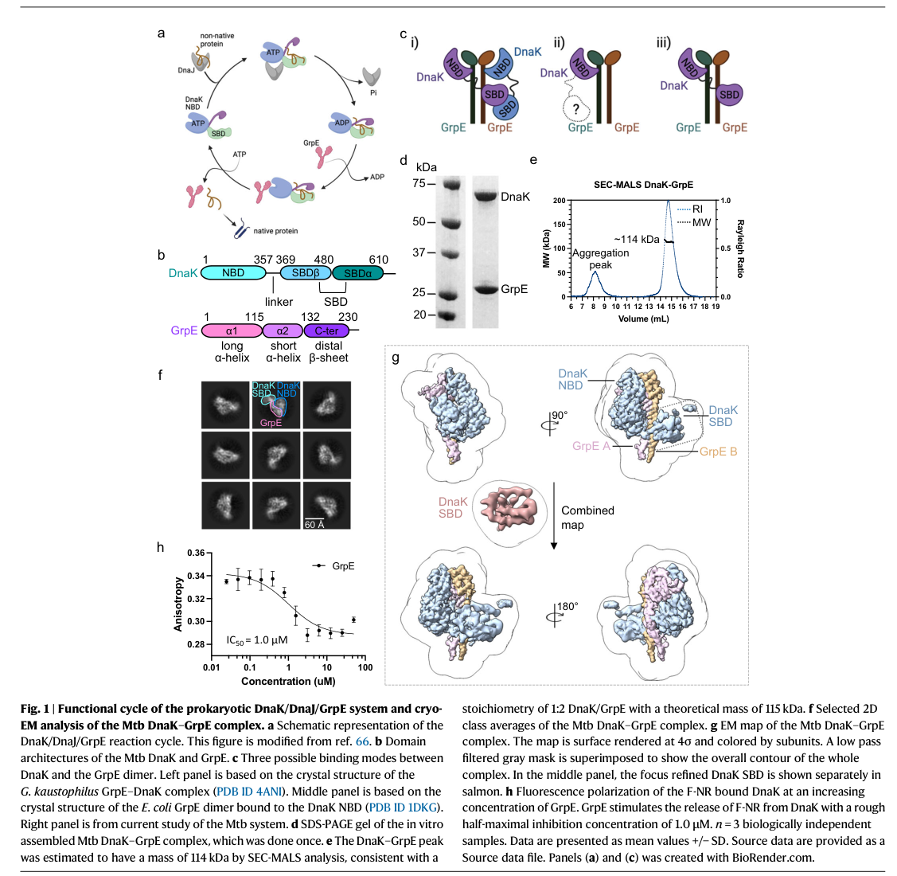

## Question

# Gene Research for Functional Annotation

## ⚠️ CRITICAL: Gene/Protein Identification Context

**BEFORE YOU BEGIN RESEARCH:** You MUST verify you are researching the CORRECT gene/protein. Gene symbols can be ambiguous, especially for less well-characterized genes from non-model organisms.

### Target Gene/Protein Identity (from UniProt):
- **UniProt Accession:** Q88DU1
- **Protein Description:** RecName: Full=Protein GrpE {ECO:0000255|HAMAP-Rule:MF_01151}; AltName: Full=HSP-70 cofactor {ECO:0000255|HAMAP-Rule:MF_01151};
- **Gene Information:** Name=grpE {ECO:0000255|HAMAP-Rule:MF_01151}; OrderedLocusNames=PP_4728;
- **Organism (full):** Pseudomonas putida (strain ATCC 47054 / DSM 6125 / CFBP 8728 / NCIMB 11950 / KT2440).
- **Protein Family:** Belongs to the GrpE family. {ECO:0000255|HAMAP-
- **Key Domains:** GrpE. (IPR000740); GrpE_CC. (IPR013805); GrpE_head. (IPR009012); GrpE (PF01025)

### MANDATORY VERIFICATION STEPS:

1. **Check if the gene symbol "grpE" matches the protein description above**
2. **Verify the organism is correct:** Pseudomonas putida (strain ATCC 47054 / DSM 6125 / CFBP 8728 / NCIMB 11950 / KT2440).
3. **Check if protein family/domains align with what you find in literature**
4. **If you find literature for a DIFFERENT gene with the same or similar symbol, STOP**

### If Gene Symbol is Ambiguous or You Cannot Find Relevant Literature:

**DO NOT PROCEED WITH RESEARCH ON A DIFFERENT GENE.** Instead:
- State clearly: "The gene symbol 'grpE' is ambiguous or literature is limited for this specific protein"
- Explain what you found (e.g., "Found extensive literature on a different gene with the same symbol in a different organism")
- Describe the protein based ONLY on the UniProt information provided above
- Suggest that the protein function can be inferred from domain/family information

### Research Target:

Please provide a comprehensive research report on the gene **grpE** (gene ID: grpE, UniProt: Q88DU1) in PSEPK.

The research report should be a detailed narrative explaining the function, biological processes, and localization of the gene product. Citations should be given for all claims.

You should prioritize authoritative reviews and primary scientific literature when conducting research. You can supplement
this with annotations you find in gene/protein databases, but these can be outdated or inaccurate.

We are specifically interested in the primary function of the gene - for enzymes, what reaction is catalyzed, and what is the substrate specificity? For transporters, what is the substrate? For structural proteins or adapters, what is the broader structural role? For signaling molecules, what is the role in the pathway.

We are interested in where in or outside the cell the gene product carries out its function.

We are also interested in the signaling or biochemical pathways in which the gene functions. We are less interested in broad pleiotropic effects, except where these elucidate the precise role.

Include evidence where possible. We are interested in both experimental evidence as well as inference from structure, evolution, or bioinformatic analysis. Precise studies should be prioritized over high-throughput, where available.

## Output

Question: You are an expert researcher providing comprehensive, well-cited information.

Provide detailed information focusing on:
1. Key concepts and definitions with current understanding
2. Recent developments and latest research (prioritize 2023-2024 sources)
3. Current applications and real-world implementations
4. Expert opinions and analysis from authoritative sources
5. Relevant statistics and data from recent studies

Format as a comprehensive research report with proper citations. Include URLs and publication dates where available.
Always prioritize recent, authoritative sources and provide specific citations for all major claims.

# Gene Research for Functional Annotation

## ⚠️ CRITICAL: Gene/Protein Identification Context

**BEFORE YOU BEGIN RESEARCH:** You MUST verify you are researching the CORRECT gene/protein. Gene symbols can be ambiguous, especially for less well-characterized genes from non-model organisms.

### Target Gene/Protein Identity (from UniProt):
- **UniProt Accession:** Q88DU1
- **Protein Description:** RecName: Full=Protein GrpE {ECO:0000255|HAMAP-Rule:MF_01151}; AltName: Full=HSP-70 cofactor {ECO:0000255|HAMAP-Rule:MF_01151};
- **Gene Information:** Name=grpE {ECO:0000255|HAMAP-Rule:MF_01151}; OrderedLocusNames=PP_4728;
- **Organism (full):** Pseudomonas putida (strain ATCC 47054 / DSM 6125 / CFBP 8728 / NCIMB 11950 / KT2440).
- **Protein Family:** Belongs to the GrpE family. {ECO:0000255|HAMAP-
- **Key Domains:** GrpE. (IPR000740); GrpE_CC. (IPR013805); GrpE_head. (IPR009012); GrpE (PF01025)

### MANDATORY VERIFICATION STEPS:

1. **Check if the gene symbol "grpE" matches the protein description above**
2. **Verify the organism is correct:** Pseudomonas putida (strain ATCC 47054 / DSM 6125 / CFBP 8728 / NCIMB 11950 / KT2440).
3. **Check if protein family/domains align with what you find in literature**
4. **If you find literature for a DIFFERENT gene with the same or similar symbol, STOP**

### If Gene Symbol is Ambiguous or You Cannot Find Relevant Literature:

**DO NOT PROCEED WITH RESEARCH ON A DIFFERENT GENE.** Instead:
- State clearly: "The gene symbol 'grpE' is ambiguous or literature is limited for this specific protein"
- Explain what you found (e.g., "Found extensive literature on a different gene with the same symbol in a different organism")
- Describe the protein based ONLY on the UniProt information provided above
- Suggest that the protein function can be inferred from domain/family information

### Research Target:

Please provide a comprehensive research report on the gene **grpE** (gene ID: grpE, UniProt: Q88DU1) in PSEPK.

The research report should be a detailed narrative explaining the function, biological processes, and localization of the gene product. Citations should be given for all claims.

You should prioritize authoritative reviews and primary scientific literature when conducting research. You can supplement
this with annotations you find in gene/protein databases, but these can be outdated or inaccurate.

We are specifically interested in the primary function of the gene - for enzymes, what reaction is catalyzed, and what is the substrate specificity? For transporters, what is the substrate? For structural proteins or adapters, what is the broader structural role? For signaling molecules, what is the role in the pathway.

We are interested in where in or outside the cell the gene product carries out its function.

We are also interested in the signaling or biochemical pathways in which the gene functions. We are less interested in broad pleiotropic effects, except where these elucidate the precise role.

Include evidence where possible. We are interested in both experimental evidence as well as inference from structure, evolution, or bioinformatic analysis. Precise studies should be prioritized over high-throughput, where available.

# Research report: **grpE (UniProt Q88DU1; locus PP_4728)** in *Pseudomonas putida* KT2440

## 0. Target verification (critical disambiguation)
The UniProt-provided target **Q88DU1** from *Pseudomonas putida* strain **KT2440** is annotated as **Protein GrpE**, an **Hsp70 (DnaK) cofactor / nucleotide exchange factor (NEF)** and member of the conserved **GrpE family**. The retrieved scientific literature consistently uses “GrpE” to denote the bacterial DnaK NEF (a dimeric co-chaperone with coiled-coil and head domains), matching the UniProt description and the listed GrpE-family domains (GrpE, GrpE_CC, GrpE_head). No conflicting “grpE” gene identity (unrelated function) was found in the retrieved corpus. (rossi2024newinsightsinto pages 1-2, xiao2024structureofthe pages 1-2)

## 1. Key concepts and definitions (current understanding)

### 1.1 What GrpE is
**GrpE** is the canonical **bacterial nucleotide exchange factor (NEF)** for **DnaK (Hsp70)**. In the bacterial DnaK chaperone cycle, **DnaJ (Hsp40)** stimulates DnaK ATP hydrolysis to an **ADP-bound, high-substrate-affinity** state; **GrpE then promotes ADP release** so ATP can rebind, shifting DnaK to an **ATP-bound, low-substrate-affinity** conformation that favors **client/substrate release** and chaperone recycling. (craig2021leveragingpseudomonasstress pages 6-7, rossi2024newinsightsinto pages 1-2, xiao2024structureofthe pages 1-2)

### 1.2 Structural architecture and domain logic
Recent structural synthesis describes GrpE as a **dimeric “cruciform/crucifix” protein** comprising a **long coiled-coil** plus a globular **C-terminal head domain** (with β-bundles and α-helices), with **dimerization essential for function**. This architecture maps naturally to the UniProt-listed GrpE family domains for Q88DU1 (coiled-coil and head). (rossi2024newinsightsinto pages 1-2)

### 1.3 Thermosensor behavior (conceptual definition)
GrpE is widely discussed as a **thermosensor-like co-chaperone**: in *E. coli* models, GrpE’s coiled-coil is thermolabile (melting around **~48°C**) and elevated temperature can weaken NEF function, biasing DnaK toward the ADP/high-affinity state. (rossi2024newinsightsinto pages 1-2)

## 2. Molecular function and mechanism (what reaction is catalyzed?)
GrpE is not an enzyme that catalyzes a substrate-to-product chemical transformation; instead its **primary molecular function** is **allosteric regulation** of DnaK’s nucleotide state.

### 2.1 Mechanism of nucleotide exchange (ADP release)
Two 2024 studies provide updated mechanistic detail on how GrpE accelerates nucleotide exchange:

* **Opening the DnaK nucleotide-binding cleft (NBD):** GrpE binds DnaK’s nucleotide-binding domain and induces conformational changes (notably involving **NBD subdomain IIB movement/rotation**) that open the nucleotide-binding cleft and increase the **ADP off-rate**. This explains GrpE’s NEF activity in structural terms. (rossi2024newinsightsinto pages 1-2)
* **Quantified conformational control in a full-length complex:** Cryo-EM analysis of a bacterial DnaK–GrpE complex shows that GrpE binding “ratchets” and drives coordinated motions in DnaK domains; these motions separate nucleotide-contacting residues and promote ADP release, while also influencing substrate-binding-domain conformations. (xiao2024structureofthe pages 7-8)

### 2.2 Coupling nucleotide exchange to substrate release
A major refinement from 2024 cryo-EM work is that GrpE’s role is not limited to ADP release: the **GrpE dimer engages DnaK in an asymmetric 1:2 complex** and its motions are proposed to **concomitantly couple ADP release (NBD) with client release (SBD)**. The same work reports functional dependence on the GrpE N-terminus for efficient substrate release. (xiao2024structureofthe pages 1-2, xiao2024structureofthe pages 8-9)

## 3. Cellular localization and biological processes in *P. putida* KT2440

### 3.1 Expected localization
The key functional interaction partners (DnaK/DnaJ) are cytosolic chaperones, and GrpE is a canonical DnaK cofactor; thus, GrpE is best annotated as an **intracellular/cytosolic protein**.

Direct KT2440 proteomics under phenol stress identified many **cytoplasmic or periplasmic** proteins, and GrpE was among the induced stress proteins detected in that dataset, consistent with an intracellular role in proteostasis. (santos2004insightsintopseudomonas pages 1-2)

### 3.2 Biological processes: proteostasis, heat-shock, and chemical stress
**Heat-shock response network context in *Pseudomonas*:** In *P. putida*, the heat-shock response is described as similar to *E. coli*, and the chaperone systems **DnaK/DnaJ/GrpE** and **GroEL/GroES** participate in regulating the heat-shock sigma factor **σ32/RpoH** by binding/inactivating it in non-stress conditions (a central feedback logic in bacterial heat-shock control). This places GrpE in a core **stress-response and proteostasis pathway**, even though GrpE itself is not a transcription factor. (ito2014geneticandphenotypic pages 2-3)

**Chemical/solvent stress in KT2440:** Quantitative proteomics of phenol-induced stress in *P. putida* KT2440 reported that, after **1 hour** of sudden phenol exposure (e.g., **600 mg/L** sublethal phenol), **68 proteins increased** and **13 decreased**, and GrpE was explicitly among the upregulated “general stress” proteins. This provides direct KT2440 evidence that GrpE participates in the **early solvent/toxicant stress response** through proteostasis maintenance. (santos2004insightsintopseudomonas pages 1-2)

## 4. Genomic/operon context and regulation (evidence and limitations)

### 4.1 Operon/genomic neighborhood (best available evidence)
Within a closely related *P. putida* strain (PCL1445), **grpE**, **dnaK**, and **dnaJ** are genomically linked such that **dnaK lies downstream of grpE and upstream of dnaJ**. This supports a conserved *Pseudomonas* genomic organization for the KJE chaperone system (GrpE–DnaK–DnaJ) and is consistent with the expectation that KT2440 PP_4728 (grpE) is part of a heat-shock chaperone locus. (dubern2005theheatshock pages 1-2)

**Limitation:** In the retrieved corpus, no paper explicitly mapped **KT2440 PP_4728**’s operon boundaries/promoters (e.g., transcription start sites, co-transcription assays). Therefore, KT2440-specific operon structure is inferred from conservation and strain-level evidence rather than directly shown here.

### 4.2 Regulatory integration and downstream phenotypes (indirect effects)
In *P. putida* PCL1445, mutations in the heat-shock genes **dnaK/dnaJ/grpE** affected transcriptional output of a secondary-metabolite pathway (putisolvin biosynthesis), supporting that proteostasis modules can have broad regulatory consequences through stress physiology and folding-dependent control, but these are most parsimoniously interpreted as **indirect** outcomes of chaperone-network perturbation rather than a dedicated, pathway-specific role for GrpE. (dubern2005theheatshock pages 1-2)

## 5. Recent developments (prioritizing 2023–2024)

### 5.1 2024: cryo-EM structure of a full DnaK–GrpE complex (functional coupling)
A 2024 cryo-EM study reported an **asymmetric 1:2 DnaK:GrpE** complex and described multi-body motions (“ratcheting”) of the GrpE dimer that modulate both DnaK’s nucleotide-binding and substrate-binding domains; the study also reports that GrpE’s N-terminus is critical for substrate release in functional assays and that the DnaK–GrpE interface is essential for folding activity in vitro and in vivo. (xiao2024structureofthe pages 1-2, xiao2024structureofthe pages 8-9)

Figure evidence from this study (structure and stoichiometry; domain motions) is shown in the retrieved image panels. (xiao2024structureofthe media aae0080b, xiao2024structureofthe media 6cad8a4d)

### 5.2 2024: improved structural model for how GrpE opens the NBD cleft
A 2024 Journal of Biological Chemistry paper synthesizes newer structural/functional insights for the *E. coli* DnaK–GrpE complex, emphasizing a larger GrpE-associated movement of NBD subdomain IIB and a more open nucleotide-binding cleft consistent with GrpE-induced increases in ADP off-rate; it also reiterates GrpE’s **dimeric cruciform architecture** and its **thermolability (~48°C melting)** as part of its physiological behavior. (rossi2024newinsightsinto pages 1-2)

## 6. Current applications and real-world implementations
Although GrpE itself is not typically engineered as a standalone “product enzyme,” its function is central to **stress robustness and protein folding capacity**, which are key constraints in microbial biotechnology.

A review focusing on *Pseudomonas* stress responses highlights the DnaK/DnaJ/GrpE system as a core chaperone module preventing aggregation and aiding refolding under stress, and frames such stress physiology as something that can be **leveraged for industrial applications** (e.g., improving strain robustness in harsh process conditions). (craig2021leveragingpseudomonasstress pages 6-7)

In KT2440 specifically, induction of GrpE under phenol stress provides a concrete example of how the KJE system is engaged during toxicant exposure relevant to bioprocessing and biodegradation contexts. (santos2004insightsintopseudomonas pages 1-2)

## 7. Expert interpretation and annotation-ready conclusions

### 7.1 Primary function (what to annotate)
For UniProt Q88DU1 / PP_4728 in *P. putida* KT2440, the best-supported primary annotation is:

* **Molecular function:** DnaK **nucleotide exchange factor** (promotes ADP release / ATP rebinding cycle progression). (rossi2024newinsightsinto pages 1-2, xiao2024structureofthe pages 1-2)
* **Biological process:** **Protein folding and proteostasis**, particularly in **stress/heat-shock response** and chemical stress recovery. (ito2014geneticandphenotypic pages 2-3, santos2004insightsintopseudomonas pages 1-2)
* **Cellular component:** **Cytosol/intracellular**, consistent with DnaK system function; KT2440 proteomics context is consistent with intracellular stress-induced chaperone deployment. (santos2004insightsintopseudomonas pages 1-2)

### 7.2 KT2440-specific evidence strength
*Direct KT2440 evidence* in this corpus is strongest for **stress-responsive expression at the protein level** (phenol stress proteomics) and supports the assignment of GrpE to **solvent/toxicant stress proteostasis**. (santos2004insightsintopseudomonas pages 1-2)

*Regulatory/operon context* for KT2440 PP_4728 is not directly documented in the retrieved KT2440 papers; the best available evidence is a closely related *P. putida* strain showing **grpE–dnaK–dnaJ** linkage. (dubern2005theheatshock pages 1-2)

## 8. Key statistics and data points (recent studies emphasized where possible)
* **KT2440 phenol stress proteomics:** After 1 h exposure to phenol (sublethal 600 mg/L described), **68 proteins increased** and **13 decreased**, and **GrpE** is among the upregulated general-stress proteins detected by 2-DE/MALDI-TOF MS. (santos2004insightsintopseudomonas pages 1-2)
* **2024 structural stoichiometry:** SEC-MALS and cryo-EM support an **asymmetric 1:2 DnaK:GrpE** complex (a DnaK bound to a GrpE dimer). (xiao2024structureofthe pages 7-8, xiao2024structureofthe media aae0080b)

## Evidence summary table
| Claim/Topic | Key findings (1-2 sentences) | Organism/strain | Evidence type | Publication (year, journal) | URL | Notes for annotation (localization/pathway) |
|---|---|---|---|---|---|---|
| Target identity verification for Q88DU1 / PP_4728 | The requested protein is annotated as GrpE, the bacterial Hsp70 cofactor/nucleotide-exchange factor of the DnaK system. Available literature on GrpE in Pseudomonas and broader bacteria matches this family-level role, so functional annotation should center on the DnaK/DnaJ/GrpE chaperone cycle rather than any unrelated “grpE” usage in other taxa. (craig2021leveragingpseudomonasstress pages 6-7, dubern2005theheatshock pages 1-2, ito2014geneticandphenotypic pages 2-3, rossi2024newinsightsinto pages 1-2) | *Pseudomonas putida* KT2440 / related *Pseudomonas* strains / bacteria broadly | Comparative annotation plus literature synthesis | Craig et al. 2021, *Frontiers in Microbiology*; Dubern et al. 2005, *Journal of Bacteriology*; Ito et al. 2014, *MicrobiologyOpen*; Rossi et al. 2024, *Journal of Biological Chemistry* | https://doi.org/10.3389/fmicb.2021.660134; https://doi.org/10.1128/jb.187.17.5967-5976.2005; https://doi.org/10.1002/mbo3.217; https://doi.org/10.1016/j.jbc.2023.105574 | Annotate as a **cytosolic co-chaperone** in the **DnaK/DnaJ/GrpE proteostasis and heat-shock pathway**; not an enzyme or transporter. |
| Primary molecular function of GrpE | GrpE is the nucleotide-exchange factor (NEF) for DnaK/Hsp70: after DnaJ-stimulated ATP hydrolysis converts DnaK to the ADP-bound high-affinity substrate state, GrpE promotes ADP release so ATP can rebind, reopening DnaK and enabling substrate release. This is the core conserved function most relevant to Q88DU1 annotation. (craig2021leveragingpseudomonasstress pages 6-7, ito2014geneticandphenotypic pages 2-3, rossi2024newinsightsinto pages 1-2, xiao2024structureofthe pages 1-2) | Bacteria broadly; conserved relevance to *P. putida* KT2440 | Review plus structural/mechanistic primary studies | Craig et al. 2021, *Frontiers in Microbiology*; Ito et al. 2014, *MicrobiologyOpen*; Rossi et al. 2024, *Journal of Biological Chemistry*; Xiao et al. 2024, *Nature Communications* | https://doi.org/10.3389/fmicb.2021.660134; https://doi.org/10.1002/mbo3.217; https://doi.org/10.1016/j.jbc.2023.105574; https://doi.org/10.1038/s41467-024-44933-9 | GO-style annotation: **nucleotide exchange factor activity**, **protein folding**, **response to heat/protein damage**; acts on **DnaK-bound polypeptides**, not on a small-molecule substrate. |
| Cellular role in proteostasis / heat-shock biology | The DnaK/DnaJ/GrpE system is a major bacterial chaperone module involved in folding nascent and stress-damaged proteins and in recovery from protein aggregation. In *Pseudomonas*, this system is part of the heat-shock response network and contributes to survival under thermal and chemical stress. (craig2021leveragingpseudomonasstress pages 6-7, ito2014geneticandphenotypic pages 2-3) | *Pseudomonas* spp.; *P. putida* KT2442-related heat-shock studies | Review and genetics/physiology | Craig et al. 2021, *Frontiers in Microbiology*; Ito et al. 2014, *MicrobiologyOpen* | https://doi.org/10.3389/fmicb.2021.660134; https://doi.org/10.1002/mbo3.217 | Annotate to **protein quality control/proteostasis**, **heat-shock response**, and cooperation with **ClpB** in disaggregation pathways. |
| KT2440-specific stress responsiveness of GrpE | Quantitative proteomics in *P. putida* KT2440 showed GrpE among proteins upregulated after 1 h phenol exposure at sublethal concentrations; the study identified 68 induced proteins and 13 decreased proteins, placing GrpE in the early solvent/general stress response. (santos2004insightsintopseudomonas pages 1-2) | *P. putida* KT2440 | 2-DE proteomics + MALDI-TOF MS | Santos et al. 2004, *PROTEOMICS* | https://doi.org/10.1002/pmic.200300793 | Direct KT2440 evidence supports annotation to **phenol/solvent stress response** and likely **cytosolic stress-induced chaperone activity**. |
| Localization inference for KT2440 GrpE | The KT2440 phenol-stress proteome largely identified cytoplasmic and periplasmic proteins, while GrpE is a canonical DnaK cofactor functioning on cytosolic DnaK/Hsp70. Combined family knowledge strongly supports a **cytosolic intracellular localization** for PP_4728. (santos2004insightsintopseudomonas pages 1-2, rossi2024newinsightsinto pages 1-2) | *P. putida* KT2440; bacteria broadly | Proteomics context plus conserved mechanism | Santos et al. 2004, *PROTEOMICS*; Rossi et al. 2024, *Journal of Biological Chemistry* | https://doi.org/10.1002/pmic.200300793; https://doi.org/10.1016/j.jbc.2023.105574 | Recommended annotation: **cellular component = cytosol**; no evidence here for secretion, membrane insertion, or periplasmic residence. |
| Pseudomonas regulatory/operon context | In *P. putida* PCL1445, **grpE-dnaK-dnaJ** are genomically linked, with dnaK located downstream of grpE and upstream of dnaJ, supporting a conserved heat-shock chaperone gene cluster in *Pseudomonas*. Although this is not KT2440-specific proof for PP_4728 operon structure, it is strong genus-level context for annotation. (dubern2005theheatshock pages 1-2) | *P. putida* PCL1445 | Strain-specific genetics/regulatory analysis | Dubern et al. 2005, *Journal of Bacteriology* | https://doi.org/10.1128/jb.187.17.5967-5976.2005 | Useful for annotation notes: likely part of a **tricistronic/clustered heat-shock locus** with **dnaK** and **dnaJ** in *Pseudomonas*. |
| Broader *Pseudomonas putida* regulatory relevance | In PCL1445, dnaK/dnaJ/grpE positively influenced putisolvin biosynthesis, but low-temperature induction required dnaK and dnaJ more clearly than grpE, indicating that GrpE can have regulatory consequences through chaperone-network effects rather than acting as a dedicated transcription factor. (dubern2005theheatshock pages 1-2, craig2021leveragingpseudomonasstress pages 6-7) | *P. putida* PCL1445 / *Pseudomonas* spp. | Mutant phenotype and review synthesis | Dubern et al. 2005, *Journal of Bacteriology*; Craig et al. 2021, *Frontiers in Microbiology* | https://doi.org/10.1128/jb.187.17.5967-5976.2005; https://doi.org/10.3389/fmicb.2021.660134 | Annotation should prioritize **chaperone/cofactor role**; downstream effects on metabolite production are likely indirect consequences of proteostasis control. |
| Heat-shock sigma-factor control context | The *P. putida* heat-shock response is described as similar to *E. coli*, where DnaK/DnaJ/GrpE and GroEL/GroES contribute to regulation of the σ32/RpoH heat-shock system by binding/inactivating σ32 and helping tune heat-shock gene expression. This supports placing GrpE in a central heat-shock regulatory feedback loop. (ito2014geneticandphenotypic pages 2-3) | *P. putida* KT2442-related work; bacterial model extrapolation to KT2440 | Physiology/genetic context | Ito et al. 2014, *MicrobiologyOpen* | https://doi.org/10.1002/mbo3.217 | Notes for annotation: **heat-shock response**, **RpoH/σ32-linked proteostasis network**; mechanism is indirect through the DnaK machine. |
| 2024 structural advance: architecture of DnaK–GrpE | New 2024 work describes GrpE as a dimeric “cruciform” protein with a long coiled-coil and globular C-terminal head; dimerization is essential for function. This architecture aligns with the expected GrpE domains in Q88DU1 family annotations (GrpE, GrpE_CC, GrpE_head). (rossi2024newinsightsinto pages 1-2) | Bacterial GrpE (primarily *E. coli* model) | Structural/mechanistic primary study | Rossi et al. 2024, *Journal of Biological Chemistry* | https://doi.org/10.1016/j.jbc.2023.105574 | Supports domain-based annotation: **GrpE family NEF with coiled-coil thermosensor and head domain contacting DnaK NBD**. |
| 2024 structural advance: stoichiometry and conformational control | Cryo-EM of the *M. tuberculosis* DnaK–GrpE complex revealed an asymmetric **1:2 DnaK:GrpE** complex and showed that the GrpE dimer “ratchets” to remodel both the nucleotide-binding domain and substrate-binding domain of DnaK. SEC-MALS supported an apparent mass of ~114 kDa consistent with this stoichiometry. (xiao2024structureofthe pages 7-8, xiao2024structureofthe media aae0080b) | *Mycobacterium tuberculosis* | Cryo-EM + SEC-MALS | Xiao et al. 2024, *Nature Communications* | https://doi.org/10.1038/s41467-024-44933-9 | For annotation, GrpE should be viewed as a **dimeric allosteric cofactor** acting in a **DnaK–GrpE complex**, not as a standalone catalyst. |
| 2024 structural advance: mechanism of nucleotide exchange | 2024 structural studies quantified GrpE-induced opening motions in DnaK NBD subdomains, including rotations in subdomains IB/IIB that separate nucleotide-contacting residues and lower ADP affinity. This provides current mechanistic support for annotating GrpE specifically as a **DnaK ADP-release factor**. (xiao2024structureofthe pages 7-8, rossi2024newinsightsinto pages 1-2) | Bacterial models (*M. tuberculosis*, *E. coli*) | Cryo-EM / structural modeling | Xiao et al. 2024, *Nature Communications*; Rossi et al. 2024, *Journal of Biological Chemistry* | https://doi.org/10.1038/s41467-024-44933-9; https://doi.org/10.1016/j.jbc.2023.105574 | Notes for annotation: molecular role is **promotion of ADP dissociation from DnaK** to reset the Hsp70 cycle. |
| 2024 structural advance: coupling nucleotide and substrate release | The 2024 *M. tuberculosis* structure and accompanying functional analyses indicate that GrpE does more than exchange nucleotide: its N-terminal region and dimer motions help couple ADP release in the NBD to substrate release in the SBD. This refines annotation from a simple NEF to an **allosteric co-chaperone coordinating DnaK reset and client release**. (xiao2024structureofthe pages 1-2, xiao2024structureofthe pages 8-9, xiao2024structureofthe media aae0080b) | *Mycobacterium tuberculosis* | Cryo-EM + fluorescence polarization + in vivo/in vitro functional assays | Xiao et al. 2024, *Nature Communications* | https://doi.org/10.1038/s41467-024-44933-9 | Pathway note: GrpE acts in the **final/reset phase of the DnaK cycle**, promoting **substrate dissociation and chaperone recycling**. |
| Thermosensor behavior of GrpE family | Recent structural synthesis emphasizes that GrpE’s coiled-coil is thermolabile (reported melting around ~48 °C in *E. coli* models), giving GrpE thermosensor behavior: elevated temperature weakens NEF activity and can bias DnaK toward an ADP-bound high-substrate-affinity state. (maqtedar2026thenucleotideexchange pages 1-5, rossi2024newinsightsinto pages 1-2) | Bacterial GrpE family | Structural/biophysical analysis | Rossi et al. 2024, *Journal of Biological Chemistry*; supporting mechanistic synthesis in Maqtedar et al. 2026 preprint | https://doi.org/10.1016/j.jbc.2023.105574; https://doi.org/10.1101/2025.10.21.683677 | Useful note for annotation: GrpE is part of **temperature-responsive proteostasis control** rather than a constitutively static exchange factor. |

*Table: This table compiles organism-specific and family-level evidence relevant to functional annotation of GrpE (UniProt Q88DU1; PP_4728) in *Pseudomonas putida* KT2440. It highlights direct KT2440 proteomics evidence, *Pseudomonas* regulatory context, and recent 2024 structural findings that clarify GrpE’s role in the DnaK/DnaJ/GrpE chaperone cycle.*

## Figure evidence (structural context)
Cropped figure panels from Xiao et al. 2024 illustrate the 1:2 DnaK–GrpE cryo-EM architecture and associated conformational motions that mechanistically underpin GrpE’s NEF function and coupling to substrate release. (xiao2024structureofthe media aae0080b, xiao2024structureofthe media 6cad8a4d)

## References (URLs and publication dates)
* Santos PM, Benndorf D, Sá-Correia I. **Insights into *Pseudomonas putida* KT2440 response to phenol-induced stress by quantitative proteomics.** *PROTEOMICS* (Sep 2004). https://doi.org/10.1002/pmic.200300793 (santos2004insightsintopseudomonas pages 1-2)
* Ito F, et al. **Genetic and phenotypic characterization of the heat shock response in *Pseudomonas putida*.** *MicrobiologyOpen* (Oct 2014). https://doi.org/10.1002/mbo3.217 (ito2014geneticandphenotypic pages 2-3)
* Craig K, Johnson BR, Grunden A. **Leveraging *Pseudomonas* Stress Response Mechanisms for Industrial Applications.** *Frontiers in Microbiology* (May 2021). https://doi.org/10.3389/fmicb.2021.660134 (craig2021leveragingpseudomonasstress pages 6-7)
* Dubern J-F, et al. **The Heat Shock Genes dnaK, dnaJ, and grpE Are Involved in Regulation of Putisolvin Biosynthesis in *Pseudomonas putida* PCL1445.** *Journal of Bacteriology* (Sep 2005). https://doi.org/10.1128/jb.187.17.5967-5976.2005 (dubern2005theheatshock pages 1-2)
* Rossi M-A, et al. **New insights into the structure and function of the complex between the *Escherichia coli* Hsp70, DnaK, and its nucleotide-exchange factor, GrpE.** *Journal of Biological Chemistry* (Jan 2024). https://doi.org/10.1016/j.jbc.2023.105574 (rossi2024newinsightsinto pages 1-2)
* Xiao X, et al. **Structure of the *M. tuberculosis* DnaK−GrpE complex reveals how key DnaK roles are controlled.** *Nature Communications* (Jan 2024). https://doi.org/10.1038/s41467-024-44933-9 (xiao2024structureofthe pages 7-8, xiao2024structureofthe pages 1-2)

References

1. (rossi2024newinsightsinto pages 1-2): Maria-Agustina Rossi, Alexandra K. Pozhidaeva, Eugenia M. Clerico, Constantine Petridis, and Lila M. Gierasch. New insights into the structure and function of the complex between the escherichia coli hsp70, dnak, and its nucleotide-exchange factor, grpe. Journal of Biological Chemistry, 300:105574, Jan 2024. URL: https://doi.org/10.1016/j.jbc.2023.105574, doi:10.1016/j.jbc.2023.105574. This article has 8 citations and is from a domain leading peer-reviewed journal.

2. (xiao2024structureofthe pages 1-2): Xiansha Xiao, Allison Fay, Pablo Santos Molina, Amanda Kovach, Michael S. Glickman, and Huilin Li. Structure of the m. tuberculosis dnak−grpe complex reveals how key dnak roles are controlled. Nature Communications, Jan 2024. URL: https://doi.org/10.1038/s41467-024-44933-9, doi:10.1038/s41467-024-44933-9. This article has 31 citations and is from a highest quality peer-reviewed journal.

3. (craig2021leveragingpseudomonasstress pages 6-7): Kelly Craig, Brant R. Johnson, and Amy Grunden. Leveraging pseudomonas stress response mechanisms for industrial applications. Frontiers in Microbiology, May 2021. URL: https://doi.org/10.3389/fmicb.2021.660134, doi:10.3389/fmicb.2021.660134. This article has 67 citations and is from a peer-reviewed journal.

4. (xiao2024structureofthe pages 7-8): Xiansha Xiao, Allison Fay, Pablo Santos Molina, Amanda Kovach, Michael S. Glickman, and Huilin Li. Structure of the m. tuberculosis dnak−grpe complex reveals how key dnak roles are controlled. Nature Communications, Jan 2024. URL: https://doi.org/10.1038/s41467-024-44933-9, doi:10.1038/s41467-024-44933-9. This article has 31 citations and is from a highest quality peer-reviewed journal.

5. (xiao2024structureofthe pages 8-9): Xiansha Xiao, Allison Fay, Pablo Santos Molina, Amanda Kovach, Michael S. Glickman, and Huilin Li. Structure of the m. tuberculosis dnak−grpe complex reveals how key dnak roles are controlled. Nature Communications, Jan 2024. URL: https://doi.org/10.1038/s41467-024-44933-9, doi:10.1038/s41467-024-44933-9. This article has 31 citations and is from a highest quality peer-reviewed journal.

6. (santos2004insightsintopseudomonas pages 1-2): Pedro M. Santos, Dirk Benndorf, and Isabel Sá‐Correia. Insights into pseudomonas putida kt2440 response to phenol‐induced stress by quantitative proteomics. PROTEOMICS, 4:2640-2652, Sep 2004. URL: https://doi.org/10.1002/pmic.200300793, doi:10.1002/pmic.200300793. This article has 282 citations and is from a peer-reviewed journal.

7. (ito2014geneticandphenotypic pages 2-3): Fumihiro Ito, Takayuki Tamiya, Iwao Ohtsu, Makoto Fujimura, and Fumiyasu Fukumori. Genetic and phenotypic characterization of the heat shock response in pseudomonas putida. MicrobiologyOpen, 3:922-936, Oct 2014. URL: https://doi.org/10.1002/mbo3.217, doi:10.1002/mbo3.217. This article has 28 citations and is from a peer-reviewed journal.

8. (dubern2005theheatshock pages 1-2): Jean-Frédéric Dubern, Ellen L. Lagendijk, Ben J. J. Lugtenberg, and Guido V. Bloemberg. The heat shock genes dnak, dnaj, and grpe are involved in regulation of putisolvin biosynthesis in pseudomonas putida pcl1445. Journal of Bacteriology, 187:5967-5976, Sep 2005. URL: https://doi.org/10.1128/jb.187.17.5967-5976.2005, doi:10.1128/jb.187.17.5967-5976.2005. This article has 102 citations and is from a peer-reviewed journal.

9. (xiao2024structureofthe media aae0080b): Xiansha Xiao, Allison Fay, Pablo Santos Molina, Amanda Kovach, Michael S. Glickman, and Huilin Li. Structure of the m. tuberculosis dnak−grpe complex reveals how key dnak roles are controlled. Nature Communications, Jan 2024. URL: https://doi.org/10.1038/s41467-024-44933-9, doi:10.1038/s41467-024-44933-9. This article has 31 citations and is from a highest quality peer-reviewed journal.

10. (xiao2024structureofthe media 6cad8a4d): Xiansha Xiao, Allison Fay, Pablo Santos Molina, Amanda Kovach, Michael S. Glickman, and Huilin Li. Structure of the m. tuberculosis dnak−grpe complex reveals how key dnak roles are controlled. Nature Communications, Jan 2024. URL: https://doi.org/10.1038/s41467-024-44933-9, doi:10.1038/s41467-024-44933-9. This article has 31 citations and is from a highest quality peer-reviewed journal.

11. (maqtedar2026thenucleotideexchange pages 1-5): Akshitha Maqtedar, Maria-Agustina Rossi, Eugenia M. Clerico, Robert V. Williams, and Lila M. Gierasch. The nucleotide exchange factor, grpe, modulates substrate affinity by interaction of its n-terminal tails with the dnak substrate-binding domain. BioRxiv, Oct 2026. URL: https://doi.org/10.1101/2025.10.21.683677, doi:10.1101/2025.10.21.683677. This article has 0 citations.

## Artifacts

- [Edison artifact artifact-00](grpE-deep-research-falcon_artifacts/artifact-00.md)

## Citations

1. rossi2024newinsightsinto pages 1-2
2. xiao2024structureofthe pages 7-8
3. santos2004insightsintopseudomonas pages 1-2
4. ito2014geneticandphenotypic pages 2-3
5. dubern2005theheatshock pages 1-2
6. craig2021leveragingpseudomonasstress pages 6-7
7. xiao2024structureofthe pages 1-2
8. xiao2024structureofthe pages 8-9
9. maqtedar2026thenucleotideexchange pages 1-5
10. https://doi.org/10.3389/fmicb.2021.660134;
11. https://doi.org/10.1128/jb.187.17.5967-5976.2005;
12. https://doi.org/10.1002/mbo3.217;
13. https://doi.org/10.1016/j.jbc.2023.105574
14. https://doi.org/10.1016/j.jbc.2023.105574;
15. https://doi.org/10.1038/s41467-024-44933-9
16. https://doi.org/10.1002/mbo3.217
17. https://doi.org/10.1002/pmic.200300793
18. https://doi.org/10.1002/pmic.200300793;
19. https://doi.org/10.1128/jb.187.17.5967-5976.2005
20. https://doi.org/10.3389/fmicb.2021.660134
21. https://doi.org/10.1038/s41467-024-44933-9;
22. https://doi.org/10.1101/2025.10.21.683677
23. https://doi.org/10.1016/j.jbc.2023.105574,
24. https://doi.org/10.1038/s41467-024-44933-9,
25. https://doi.org/10.3389/fmicb.2021.660134,
26. https://doi.org/10.1002/pmic.200300793,
27. https://doi.org/10.1002/mbo3.217,
28. https://doi.org/10.1128/jb.187.17.5967-5976.2005,
29. https://doi.org/10.1101/2025.10.21.683677,