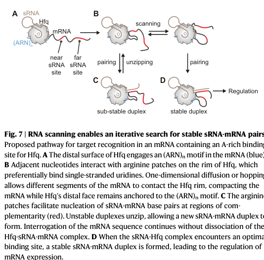

## Question

# Gene Research for Functional Annotation

## ⚠️ CRITICAL: Gene/Protein Identification Context

**BEFORE YOU BEGIN RESEARCH:** You MUST verify you are researching the CORRECT gene/protein. Gene symbols can be ambiguous, especially for less well-characterized genes from non-model organisms.

### Target Gene/Protein Identity (from UniProt):
- **UniProt Accession:** Q88DD3
- **Protein Description:** RecName: Full=RNA-binding protein Hfq {ECO:0000255|HAMAP-Rule:MF_00436};
- **Gene Information:** Name=hfq {ECO:0000255|HAMAP-Rule:MF_00436}; OrderedLocusNames=PP_4894;
- **Organism (full):** Pseudomonas putida (strain ATCC 47054 / DSM 6125 / CFBP 8728 / NCIMB 11950 / KT2440).
- **Protein Family:** Belongs to the Hfq family. {ECO:0000255|HAMAP-
- **Key Domains:** Hfq. (IPR005001); LSM_dom_sf. (IPR010920); Sm. (IPR047575); Hfq (PF17209)

### MANDATORY VERIFICATION STEPS:

1. **Check if the gene symbol "hfq" matches the protein description above**
2. **Verify the organism is correct:** Pseudomonas putida (strain ATCC 47054 / DSM 6125 / CFBP 8728 / NCIMB 11950 / KT2440).
3. **Check if protein family/domains align with what you find in literature**
4. **If you find literature for a DIFFERENT gene with the same or similar symbol, STOP**

### If Gene Symbol is Ambiguous or You Cannot Find Relevant Literature:

**DO NOT PROCEED WITH RESEARCH ON A DIFFERENT GENE.** Instead:
- State clearly: "The gene symbol 'hfq' is ambiguous or literature is limited for this specific protein"
- Explain what you found (e.g., "Found extensive literature on a different gene with the same symbol in a different organism")
- Describe the protein based ONLY on the UniProt information provided above
- Suggest that the protein function can be inferred from domain/family information

### Research Target:

Please provide a comprehensive research report on the gene **hfq** (gene ID: hfq, UniProt: Q88DD3) in PSEPK.

The research report should be a detailed narrative explaining the function, biological processes, and localization of the gene product. Citations should be given for all claims.

You should prioritize authoritative reviews and primary scientific literature when conducting research. You can supplement
this with annotations you find in gene/protein databases, but these can be outdated or inaccurate.

We are specifically interested in the primary function of the gene - for enzymes, what reaction is catalyzed, and what is the substrate specificity? For transporters, what is the substrate? For structural proteins or adapters, what is the broader structural role? For signaling molecules, what is the role in the pathway.

We are interested in where in or outside the cell the gene product carries out its function.

We are also interested in the signaling or biochemical pathways in which the gene functions. We are less interested in broad pleiotropic effects, except where these elucidate the precise role.

Include evidence where possible. We are interested in both experimental evidence as well as inference from structure, evolution, or bioinformatic analysis. Precise studies should be prioritized over high-throughput, where available.

## Output

Question: You are an expert researcher providing comprehensive, well-cited information.

Provide detailed information focusing on:
1. Key concepts and definitions with current understanding
2. Recent developments and latest research (prioritize 2023-2024 sources)
3. Current applications and real-world implementations
4. Expert opinions and analysis from authoritative sources
5. Relevant statistics and data from recent studies

Format as a comprehensive research report with proper citations. Include URLs and publication dates where available.
Always prioritize recent, authoritative sources and provide specific citations for all major claims.

# Gene Research for Functional Annotation

## ⚠️ CRITICAL: Gene/Protein Identification Context

**BEFORE YOU BEGIN RESEARCH:** You MUST verify you are researching the CORRECT gene/protein. Gene symbols can be ambiguous, especially for less well-characterized genes from non-model organisms.

### Target Gene/Protein Identity (from UniProt):
- **UniProt Accession:** Q88DD3
- **Protein Description:** RecName: Full=RNA-binding protein Hfq {ECO:0000255|HAMAP-Rule:MF_00436};
- **Gene Information:** Name=hfq {ECO:0000255|HAMAP-Rule:MF_00436}; OrderedLocusNames=PP_4894;
- **Organism (full):** Pseudomonas putida (strain ATCC 47054 / DSM 6125 / CFBP 8728 / NCIMB 11950 / KT2440).
- **Protein Family:** Belongs to the Hfq family. {ECO:0000255|HAMAP-
- **Key Domains:** Hfq. (IPR005001); LSM_dom_sf. (IPR010920); Sm. (IPR047575); Hfq (PF17209)

### MANDATORY VERIFICATION STEPS:

1. **Check if the gene symbol "hfq" matches the protein description above**
2. **Verify the organism is correct:** Pseudomonas putida (strain ATCC 47054 / DSM 6125 / CFBP 8728 / NCIMB 11950 / KT2440).
3. **Check if protein family/domains align with what you find in literature**
4. **If you find literature for a DIFFERENT gene with the same or similar symbol, STOP**

### If Gene Symbol is Ambiguous or You Cannot Find Relevant Literature:

**DO NOT PROCEED WITH RESEARCH ON A DIFFERENT GENE.** Instead:
- State clearly: "The gene symbol 'hfq' is ambiguous or literature is limited for this specific protein"
- Explain what you found (e.g., "Found extensive literature on a different gene with the same symbol in a different organism")
- Describe the protein based ONLY on the UniProt information provided above
- Suggest that the protein function can be inferred from domain/family information

### Research Target:

Please provide a comprehensive research report on the gene **hfq** (gene ID: hfq, UniProt: Q88DD3) in PSEPK.

The research report should be a detailed narrative explaining the function, biological processes, and localization of the gene product. Citations should be given for all claims.

You should prioritize authoritative reviews and primary scientific literature when conducting research. You can supplement
this with annotations you find in gene/protein databases, but these can be outdated or inaccurate.

We are specifically interested in the primary function of the gene - for enzymes, what reaction is catalyzed, and what is the substrate specificity? For transporters, what is the substrate? For structural proteins or adapters, what is the broader structural role? For signaling molecules, what is the role in the pathway.

We are interested in where in or outside the cell the gene product carries out its function.

We are also interested in the signaling or biochemical pathways in which the gene functions. We are less interested in broad pleiotropic effects, except where these elucidate the precise role.

Include evidence where possible. We are interested in both experimental evidence as well as inference from structure, evolution, or bioinformatic analysis. Precise studies should be prioritized over high-throughput, where available.

## Research report: *Pseudomonas putida* KT2440 **hfq** (UniProt Q88DD3; locus PP_4894)

### 1) Target verification (critical identity check)
The UniProt accession **Q88DD3** (gene **hfq**, locus **PP_4894**) corresponds to the canonical bacterial **RNA-binding protein Hfq**, a conserved **Sm/LSM-family (Sm-like) RNA-binding protein** that forms a **homohexameric ring** and functions as a global post-transcriptional regulator through interactions with small RNAs (sRNAs) and mRNAs. This identity is consistent with *Pseudomonas* literature describing Hfq as a conserved **Sm-like** RNA chaperone and with KT2440-specific studies describing Hfq as a **hexameric RNA-binding protein** involved in global regulation and carbon catabolite repression (CCR). (pusic2021specificandglobal pages 20-21, huber2021identificationandfunctional pages 26-29, hernandezarranz2016effectofcrc pages 1-2)

### 2) Key concepts, definitions, and current understanding (functional annotation)

#### 2.1 What Hfq is (definition)
Hfq is a bacterial RNA chaperone (“host factor for phage Qβ replication” historically) that mediates post-transcriptional gene regulation by binding sRNAs and mRNAs and promoting formation of regulatory RNA–RNA duplexes. Mechanistically, Hfq provides multiple RNA-binding surfaces (commonly summarized as **proximal**, **distal**, **rim**, plus contributions from a **C-terminal region/tail**) that allow it to bind different RNA sequence features and facilitate RNA–RNA pairing, RNA stabilization, and targeted RNA decay. (huber2021identificationandfunctional pages 26-29, pusic2021specificandglobal pages 20-21)

#### 2.2 Core molecular function in bacteria (RNA chaperone / “matchmaker”)
General mechanistic roles attributed to Hfq (supported by authoritative synthesis in the retrieved sources) include:
- **Facilitating sRNA–mRNA base pairing** (accelerating annealing, often by bringing RNAs into proximity and remodeling RNA structure). (huber2021identificationandfunctional pages 26-29, rodgers2023smallrnasand pages 1-3)
- **Stabilizing sRNAs** by protecting them from nucleases and/or forming protective ribonucleoprotein complexes. (huber2021identificationandfunctional pages 26-29, hernandezarranz2016effectofcrc pages 1-2)
- **Influencing mRNA translation and decay**, including recruitment of RNase activities in some contexts and direct repression by binding near translation initiation regions. (huber2021identificationandfunctional pages 26-29, hernandezarranz2016effectofcrc pages 1-2)

These concepts form the basis for functional annotation of *P. putida* KT2440 Hfq as a cytoplasmic RNA-binding post-transcriptional regulator.

### 3) *P. putida* KT2440-specific pathways and mechanisms

#### 3.1 Hfq as a central component of CCR via the Hfq/Crc/sRNA axis
A well-characterized, KT2440-relevant primary function of Hfq is its participation in **carbon catabolite repression (CCR)** in *Pseudomonas*, where Hfq cooperates with the translational co-repressor **Crc**.

**Mechanism (KT2440 evidence):**
- In *P. putida* KT2440, **Hfq and Crc form complexes** on target RNAs to inhibit translation; these target RNAs often contain A-rich motifs. A commonly cited consensus motif in this system is **AAnAAnAA** (also referred to as a catabolite activity motif in later applied work). (hernandezarranz2016effectofcrc pages 1-2, che2025thelinkof pages 1-2)
- The repression mediated by Hfq/Crc is **antagonized by sRNAs CrcZ and CrcY**, whose levels vary with growth conditions. These sRNAs act (conceptually) as **decoys/sponges** that sequester the Hfq/Crc complex away from repressed mRNAs, thereby relieving translational repression. (hernandezarranz2016effectofcrc pages 1-2, hernandezarranz2016effectofcrc pages 12-13, bharwad2019rewiringthefunctional pages 4-5)

**Hfq-dependent processing/stability of the decoy sRNA CrcZ (KT2440 evidence):**
- In KT2440, crcZ can be produced from a strong RpoN/CbrB-dependent promoter but can also arise through transcriptional readthrough and **processing** of a cbrB-crcZ transcript into a functional CrcZ-like product (CrcZ*). The **processed form of CrcZ is not observed in the absence of Hfq**, linking Hfq to the biogenesis/accumulation of the functional antagonist RNA. (hernandezarranz2016effectofcrc pages 1-2)
- **Crc and Hfq increase CrcZ stability**, consistent with formation of protective ribonucleoprotein complexes that reduce RNase-mediated degradation. (hernandezarranz2016effectofcrc pages 1-2)
- Quantitatively, one KT2440 study reports that after TEX treatment (enriching for primary transcripts by degrading 5′-monophosphate RNAs), crcZ signal decreased by ~**20%**, supporting the presence of processed species; and crcZ-containing transcripts were ~**10-fold** more abundant than cbrB in wild type (and **16-fold** in an RpoN-null strain) in qRT-PCR assays. (hernandezarranz2016effectofcrc pages 5-6)

**Dynamic RNA competition and cycling:**
Hfq binds RNA with high affinity and can redistribute among RNAs (“actively cycle” among targets) depending on the abundance of competing RNAs, which is conceptually important in CCR where the regulatory outcome depends on the relative levels of Hfq/Crc, target mRNAs, and the decoy sRNAs CrcZ/CrcY. (hernandezarranz2016effectofcrc pages 12-13)

#### 3.2 Biological processes influenced (scope in *Pseudomonas*)
Reviews and mechanistic summaries in *Pseudomonas* emphasize that Hfq functions as a **global post-transcriptional regulator** impacting multiple systems including metabolism, stress tolerance, quorum sensing/virulence-associated behaviors in pathogenic *Pseudomonas*, and iron-related regulation in the broader Hfq/Crc regulatory context; however, the KT2440-specific primary mechanism most directly supported in the retrieved evidence is CCR via Hfq/Crc and decoy sRNAs. (hernandezarranz2016effectofcrc pages 1-2, pusic2021specificandglobal pages 9-11)

### 4) Subcellular localization
The retrieved evidence supports Hfq as an **intracellular RNA-binding protein** acting on sRNAs and mRNAs, i.e., consistent with a **cytoplasmic post-transcriptional regulator**. However, in the evidence retrieved for this report, there is **no KT2440-specific microscopy or biochemical fractionation** that directly assigns Hfq to a specific subcellular compartment beyond its RNA-level function. Thus, localization should be annotated conservatively as **cytoplasmic / RNA-associated** by functional inference, pending KT2440-specific localization experiments. (huber2021identificationandfunctional pages 26-29, hernandezarranz2016effectofcrc pages 1-2)

### 5) Recent developments (prioritizing 2023–2024): refined mechanism of Hfq-mediated target search
Although these mechanistic studies are in *E. coli* (not *P. putida*), they represent high-confidence, generalizable advances in how Hfq functions and are directly relevant to annotating Hfq’s molecular mechanism.

#### 5.1 Co-transcriptional capture of transient/unfolded target sites (2023)
Rodgers et al. (2023) used a single-molecule co-localization co-transcriptional assembly approach to show that an Hfq•sRNA complex can **sample nascent mRNA during transcription** and often binds in proximity to RNA polymerase, enabling capture of a target site **before it folds**. This provides a mechanistic basis for how sRNA regulation can occur on fast cellular timescales and highlights the coupling between transcription kinetics, RNA folding, and Hfq-dependent regulation. (rodgers2023smallrnasand pages 1-3)

Publication: Rodgers ML et al., *Molecular Cell*, May 2023. DOI/URL: https://doi.org/10.1016/j.molcel.2023.04.003 (rodgers2023smallrnasand pages 1-3)

#### 5.2 RNA compaction and iterative 1D scanning/transfer (2024)
Małecka & Woodson (2024) provide quantitative single-molecule evidence that Hfq can **compact flexible mRNA segments** and enable an **iterative scanning mechanism** that brings sRNAs to distal target sites, including **transfer (“shuttling”) between sites on a single mRNA without dissociation**.

Key quantitative findings (selected):
- For tandem target sites separated by 13 nt, ~**39%** of encounters showed shuttling with **2.8 transitions** per dynamic event on average; with 35 nt spacing, shuttling dropped to **23%** with **1.6 transitions/event**. (małecka2024rnacompactionand pages 8-9)
- A rim arginine mutant (R16A) caused the sRNA to spend **about half as much time** on a distant site compared with WT Hfq, supporting a role for rim arginines in long-range scanning. (małecka2024rnacompactionand pages 8-9)
- The authors propose diffusion-limited recruitment of Hfq to (ARN)n motifs (kon ~ **1–10×10^7 M−1 s−1**) as a first step that restricts the search space. (małecka2024rnacompactionand pages 9-10)

Publication: Małecka EM, Woodson SA. *Nature Communications*, Mar 2024. DOI/URL: https://doi.org/10.1038/s41467-024-46316-6 (małecka2024rnacompactionand pages 1-2)

**Visual evidence:** Figure model of Hfq-mediated scanning/iterative search and schematic of Hfq surfaces were retrieved from this paper. (małecka2024rnacompactionand media c450eb26, małecka2024rnacompactionand media b5d6895d)

### 6) Current applications and real-world implementations

#### 6.1 Metabolic engineering in *P. putida* KT2440: tuning CCR decoy sRNAs to improve bioplastic (PHA) production
Che et al. (2025) demonstrate a concrete KT2440 implementation that leverages the **Hfq/Crc/CrcY/CrcZ** CCR axis to improve **medium-chain-length polyhydroxyalkanoate (mcl-PHA)** production and tune polymer properties.

**Mechanistic framing:** The study explicitly ties outcomes to CCR: Hfq binds CA-motif-containing mRNAs and (with Crc) represses translation, while **CrcY/CrcZ sequester Hfq/Crc** to relieve repression; the authors note that the sRNAs’ role in PHA metabolism requires **Hfq and Crc**. (che2025thelinkof pages 1-2, che2025thelinkof pages 2-5)

**Quantitative outcomes (selected):**
- Under glucose conditions, strains overexpressing CrcY or CrcZ produced **>2×** more PHA in one condition: **0.34 g/L vs 0.15 g/L**. (che2025thelinkof pages 2-5)
- Under octanoate conditions: control accumulated **0.51 g/L** PHA, while pCrcY and pCrcZ accumulated **0.67 g/L** and **0.77 g/L**, respectively; the study also reports **2.7-fold** higher PHA at 48 h in a comparison. (che2025thelinkof pages 2-5)
- Under octanoate with nitrogen limitation, pCrcY reached **63% CDW (0.57 g/L)** vs control **33% CDW (0.17 g/L)** (a **3.5-fold** increase), and yields increased (e.g., **0.07 g PHA/g glucose** vs **0.03 g/g** control; and **0.17 g/g** under another condition). (che2025thelinkof pages 5-7)
- Polymer properties: molecular weight decreased substantially in one overexpression condition (e.g., **Mw** from **2.228×10^5** to **9.468×10^4 g/mol**). (che2025thelinkof pages 5-7)

Publication: Che Y et al., *Biotechnology for Biofuels and Bioproducts*, Oct 2025. DOI/URL: https://doi.org/10.1186/s13068-025-02707-5 (che2025thelinkof pages 5-7)

#### 6.2 Broader applied contexts (review-level)
A review focused on the Crc/Hfq/sRNA network highlights that CCR tuning can influence catabolic pathways relevant to bioremediation and that modifications to crc/hfq can impact antibiotic susceptibility phenotypes in *Pseudomonas* spp., motivating engineering strategies that modulate this post-transcriptional regulatory layer in applied strains. (bharwad2019rewiringthefunctional pages 7-8, bharwad2019rewiringthefunctional pages 5-7)

Publication: Bharwad K, Rajkumar S. *World Journal of Microbiology and Biotechnology*, Aug 2019. DOI/URL: https://doi.org/10.1007/s11274-019-2717-7 (bharwad2019rewiringthefunctional pages 2-4)

### 7) Expert opinions / authoritative synthesis
Authoritative synthesis across *Pseudomonas* emphasizes that:
- Hfq is a conserved Sm-like chaperone mediating RNA–RNA interactions and global riboregulation, and in *Pseudomonas* CCR specifically, **Crc acts as a translational co-repressor** that promotes/stabilizes Hfq-mediated repression on target mRNAs, while **CrcZ/Y antagonize** by binding/sequestering Hfq. (pusic2021specificandglobal pages 9-11, pusic2021specificandglobal pages 20-21)
- Hfq’s multiple binding surfaces and RNA competition for limiting Hfq can shape regulatory outcomes. (huber2021identificationandfunctional pages 26-29, paris2025machinerymechanismand pages 6-8)

### 8) Summary of functional annotation (what to put in a gene/protein functional annotation)
**Gene/product:** hfq → RNA-binding protein Hfq (Sm-like RNA chaperone).

**Primary molecular function:** RNA chaperone facilitating sRNA–mRNA annealing and post-transcriptional regulation of translation and RNA stability. (huber2021identificationandfunctional pages 26-29, rodgers2023smallrnasand pages 1-3)

**Key KT2440 pathway role:** CCR via cooperative action with Crc on A-rich CA motifs (AAnAAnAA) in target mRNAs; antagonism by decoy sRNAs CrcZ/CrcY; Hfq contributes to CrcZ stability/processing. (hernandezarranz2016effectofcrc pages 1-2, hernandezarranz2016effectofcrc pages 5-6, bharwad2019rewiringthefunctional pages 4-5)

**Cellular localization:** intracellular/cytoplasmic RNA-associated (inferred; no KT2440-specific localization experiment in retrieved evidence). (hernandezarranz2016effectofcrc pages 1-2, huber2021identificationandfunctional pages 26-29)

**Applied relevance:** CCR/Hfq axis can be engineered via CrcY/CrcZ to increase mcl-PHA production and tune polymer molecular weight in KT2440. (che2025thelinkof pages 5-7)

### Evidence table
| Topic | Key takeaways | Most relevant paper | DOI URL |
|---|---|---|---|
| Identity/domains | UniProt Q88DD3 corresponds to **Hfq** in *Pseudomonas putida* KT2440 (gene **hfq**, locus **PP_4894**). Hfq is a conserved **bacterial Sm/Lsm-family** RNA-binding protein with a conserved **Sm domain**, typically forming a **homohexameric ring** with proximal, distal, rim, and C-terminal RNA-interaction regions; in *Pseudomonas*, Hfq is described as a **hexameric RNA-binding protein** central to post-transcriptional regulation. (pusic2021specificandglobal pages 20-21, huber2021identificationandfunctional pages 26-29, hernandezarranz2016effectofcrc pages 1-2) | Huber, 2021, Dissertation; Pusic et al., 2021, *Int. J. Mol. Sci.*; Hernández-Arranz et al., 2016, *RNA* | https://doi.org/10.5282/edoc.27581; https://doi.org/10.3390/ijms22168632; https://doi.org/10.1261/rna.058313.116 |
| Core molecular function | Hfq is an **RNA chaperone / molecular matchmaker** that stabilizes sRNAs, accelerates **sRNA–mRNA base pairing**, can directly repress translation near RBSs, and can recruit or facilitate RNase-mediated decay; in *Pseudomonas*, it is a global post-transcriptional regulator affecting metabolism and stress-related functions. (hernandezarranz2016effectofcrc pages 1-2, pusic2021specificandglobal pages 20-21, huber2021identificationandfunctional pages 26-29) | Huber, 2021, Dissertation; Hernández-Arranz et al., 2016, *RNA* | https://doi.org/10.5282/edoc.27581; https://doi.org/10.1261/rna.058313.116 |
| CCR with Crc/CrcZ/CrcY | In *P. putida*, Hfq cooperates with **Crc** to form repressive complexes on target mRNAs carrying **A-rich CA motifs** (consensus **AAnAAnAA**), inhibiting translation of catabolic genes. **CrcZ** and **CrcY** antagonize repression by sequestering Hfq/Crc; **Crc and Hfq increase CrcZ stability**, and processed **CrcZ\*** can relieve hyperrepression in a ΔcrcZΔcrcY background. (hernandezarranz2016effectofcrc pages 1-2, hernandezarranz2016effectofcrc pages 12-13, hernandezarranz2016effectofcrc pages 5-6, bharwad2019rewiringthefunctional pages 4-5) | Hernández-Arranz et al., 2016, *RNA* | https://doi.org/10.1261/rna.058313.116 |
| RNA cycling/scanning mechanisms | Recent mechanistic work (not KT2440-specific, but on conserved Hfq action) shows Hfq binds **(ARN)n** motifs with diffusion-limited on-rates, compacts RNA, and uses **rim arginines** to support iterative **1D scanning/hopping** and transfer of sRNAs between sites without dissociation, enabling kinetic selection of optimal duplexes. This refines current understanding of how Hfq accelerates target search. (małecka2024rnacompactionand pages 8-9, małecka2024rnacompactionand pages 9-10, małecka2024rnacompactionand pages 1-2, rodgers2023smallrnasand pages 1-3) | Małecka & Woodson, 2024, *Nature Communications*; Rodgers et al., 2023, *Molecular Cell* | https://doi.org/10.1038/s41467-024-46316-6; https://doi.org/10.1016/j.molcel.2023.04.003 |
| Localization | The current evidence snippets support Hfq as a **cytoplasmic RNA-binding/post-transcriptional regulator** acting on mRNAs and sRNAs; however, **no KT2440-specific subcellular localization experiment** is provided in the retrieved evidence. Thus, localization should be annotated conservatively as **intracellular/cytoplasmic RNA-associated**, inferred from mechanism rather than direct KT2440 localization data. (hernandezarranz2016effectofcrc pages 1-2, pusic2021specificandglobal pages 20-21, huber2021identificationandfunctional pages 26-29) | Huber, 2021, Dissertation; Hernández-Arranz et al., 2016, *RNA* | https://doi.org/10.5282/edoc.27581; https://doi.org/10.1261/rna.058313.116 |
| Applications/engineering | The Hfq-linked CCR network has practical value in **metabolic engineering** of *P. putida*. Overexpressing **CrcY/CrcZ** in KT2440 boosts **medium-chain-length PHA** production and alters polymer molecular weight, showing that tuning Hfq/Crc decoy sRNAs can reprogram carbon flux for bioproduct formation. Broader reviews also point to impacts on bioremediation-relevant catabolism. (che2025thelinkof pages 1-2, che2025thelinkof pages 2-5, che2025thelinkof pages 5-7, bharwad2019rewiringthefunctional pages 7-8, bharwad2019rewiringthefunctional pages 5-7) | Che et al., 2025, *Biotechnology for Biofuels and Bioproducts* | https://doi.org/10.1186/s13068-025-02707-5 |
| Quantitative data | Reported figures include: Hfq has **~5–20-fold higher affinity for CrcZ than for amiE mRNA**; in WT, ~**20%** of crcZ signal was TEX-sensitive, indicating processed forms; overexpressing CrcY/CrcZ increased PHA titers by **1.3–3.5-fold**, with examples including **0.34 vs 0.15 g/L**, **0.67–0.77 vs 0.51 g/L**, and **63% CDW (0.57 g/L) vs 33% CDW (0.17 g/L)**; deleting both sRNAs caused a **2.5-fold decrease** in PHA; polymer **Mw** decreased from **2.228×10^5 to 9.468×10^4 g/mol** in one overexpression condition. Conserved Hfq mechanism studies measured **39%** shuttling events for N=13 vs **23%** for N=35 spacers and **2.8** vs **1.6** transitions/event. (hernandezarranz2016effectofcrc pages 5-6, pusic2021specificandglobal pages 9-11, che2025thelinkof pages 1-2, che2025thelinkof pages 2-5, che2025thelinkof pages 5-7, małecka2024rnacompactionand pages 8-9) | Pusic et al., 2021, *Int. J. Mol. Sci.*; Che et al., 2025, *Biotechnology for Biofuels and Bioproducts*; Małecka & Woodson, 2024, *Nature Communications* | https://doi.org/10.3390/ijms22168632; https://doi.org/10.1186/s13068-025-02707-5; https://doi.org/10.1038/s41467-024-46316-6 |

*Table: This table summarizes identity, mechanism, CCR function, localization, applications, and key quantitative findings for *Pseudomonas putida* KT2440 Hfq (hfq/PP_4894; UniProt Q88DD3). It is designed as a concise evidence-backed insert for the research report.*

References

1. (pusic2021specificandglobal pages 20-21): Petra Pusic, Elisabeth Sonnleitner, and Udo Bläsi. Specific and global rna regulators in pseudomonas aeruginosa. International Journal of Molecular Sciences, 22:8632, Aug 2021. URL: https://doi.org/10.3390/ijms22168632, doi:10.3390/ijms22168632. This article has 39 citations.

2. (huber2021identificationandfunctional pages 26-29): Identification and functional characterization of bacterial small RNAs associating with the RNA chaperone Hfq This article has 0 citations.

3. (hernandezarranz2016effectofcrc pages 1-2): Sofía Hernández-Arranz, Dione Sánchez-Hevia, Fernando Rojo, and Renata Moreno. Effect of crc and hfq proteins on the transcription, processing, and stability of the pseudomonas putida crcz srna. RNA, 22:1902-1917, Dec 2016. URL: https://doi.org/10.1261/rna.058313.116, doi:10.1261/rna.058313.116. This article has 30 citations and is from a domain leading peer-reviewed journal.

4. (rodgers2023smallrnasand pages 1-3): Margaret L. Rodgers, Brett O’Brien, and Sarah A. Woodson. Small rnas and hfq capture unfolded rna target sites during transcription. Molecular Cell, 83:1489-1501.e5, May 2023. URL: https://doi.org/10.1016/j.molcel.2023.04.003, doi:10.1016/j.molcel.2023.04.003. This article has 28 citations and is from a highest quality peer-reviewed journal.

5. (che2025thelinkof pages 1-2): Yixin Che, Dominic Harris-Jukes, Elizabeth Sitko, Moya Brady, William Casey, Michael P. Shaver, Kevin O’Connor, and Tanja Narancic. The link of carbon catabolite repression elements, small rnas crcy and crcz and polyhydroxyalkanoate metabolism in pseudomonas putida kt2440. Biotechnology for Biofuels and Bioproducts, Oct 2025. URL: https://doi.org/10.1186/s13068-025-02707-5, doi:10.1186/s13068-025-02707-5. This article has 0 citations and is from a domain leading peer-reviewed journal.

6. (hernandezarranz2016effectofcrc pages 12-13): Sofía Hernández-Arranz, Dione Sánchez-Hevia, Fernando Rojo, and Renata Moreno. Effect of crc and hfq proteins on the transcription, processing, and stability of the pseudomonas putida crcz srna. RNA, 22:1902-1917, Dec 2016. URL: https://doi.org/10.1261/rna.058313.116, doi:10.1261/rna.058313.116. This article has 30 citations and is from a domain leading peer-reviewed journal.

7. (bharwad2019rewiringthefunctional pages 4-5): Krishna Bharwad and Shalini Rajkumar. Rewiring the functional complexity between crc, hfq and srnas to regulate carbon catabolite repression in pseudomonas. World Journal of Microbiology and Biotechnology, Aug 2019. URL: https://doi.org/10.1007/s11274-019-2717-7, doi:10.1007/s11274-019-2717-7. This article has 31 citations and is from a peer-reviewed journal.

8. (hernandezarranz2016effectofcrc pages 5-6): Sofía Hernández-Arranz, Dione Sánchez-Hevia, Fernando Rojo, and Renata Moreno. Effect of crc and hfq proteins on the transcription, processing, and stability of the pseudomonas putida crcz srna. RNA, 22:1902-1917, Dec 2016. URL: https://doi.org/10.1261/rna.058313.116, doi:10.1261/rna.058313.116. This article has 30 citations and is from a domain leading peer-reviewed journal.

9. (pusic2021specificandglobal pages 9-11): Petra Pusic, Elisabeth Sonnleitner, and Udo Bläsi. Specific and global rna regulators in pseudomonas aeruginosa. International Journal of Molecular Sciences, 22:8632, Aug 2021. URL: https://doi.org/10.3390/ijms22168632, doi:10.3390/ijms22168632. This article has 39 citations.

10. (małecka2024rnacompactionand pages 8-9): Ewelina M. Małecka and Sarah A. Woodson. Rna compaction and iterative scanning for small rna targets by the hfq chaperone. Nature Communications, Mar 2024. URL: https://doi.org/10.1038/s41467-024-46316-6, doi:10.1038/s41467-024-46316-6. This article has 17 citations and is from a highest quality peer-reviewed journal.

11. (małecka2024rnacompactionand pages 9-10): Ewelina M. Małecka and Sarah A. Woodson. Rna compaction and iterative scanning for small rna targets by the hfq chaperone. Nature Communications, Mar 2024. URL: https://doi.org/10.1038/s41467-024-46316-6, doi:10.1038/s41467-024-46316-6. This article has 17 citations and is from a highest quality peer-reviewed journal.

12. (małecka2024rnacompactionand pages 1-2): Ewelina M. Małecka and Sarah A. Woodson. Rna compaction and iterative scanning for small rna targets by the hfq chaperone. Nature Communications, Mar 2024. URL: https://doi.org/10.1038/s41467-024-46316-6, doi:10.1038/s41467-024-46316-6. This article has 17 citations and is from a highest quality peer-reviewed journal.

13. (małecka2024rnacompactionand media c450eb26): Ewelina M. Małecka and Sarah A. Woodson. Rna compaction and iterative scanning for small rna targets by the hfq chaperone. Nature Communications, Mar 2024. URL: https://doi.org/10.1038/s41467-024-46316-6, doi:10.1038/s41467-024-46316-6. This article has 17 citations and is from a highest quality peer-reviewed journal.

14. (małecka2024rnacompactionand media b5d6895d): Ewelina M. Małecka and Sarah A. Woodson. Rna compaction and iterative scanning for small rna targets by the hfq chaperone. Nature Communications, Mar 2024. URL: https://doi.org/10.1038/s41467-024-46316-6, doi:10.1038/s41467-024-46316-6. This article has 17 citations and is from a highest quality peer-reviewed journal.

15. (che2025thelinkof pages 2-5): Yixin Che, Dominic Harris-Jukes, Elizabeth Sitko, Moya Brady, William Casey, Michael P. Shaver, Kevin O’Connor, and Tanja Narancic. The link of carbon catabolite repression elements, small rnas crcy and crcz and polyhydroxyalkanoate metabolism in pseudomonas putida kt2440. Biotechnology for Biofuels and Bioproducts, Oct 2025. URL: https://doi.org/10.1186/s13068-025-02707-5, doi:10.1186/s13068-025-02707-5. This article has 0 citations and is from a domain leading peer-reviewed journal.

16. (che2025thelinkof pages 5-7): Yixin Che, Dominic Harris-Jukes, Elizabeth Sitko, Moya Brady, William Casey, Michael P. Shaver, Kevin O’Connor, and Tanja Narancic. The link of carbon catabolite repression elements, small rnas crcy and crcz and polyhydroxyalkanoate metabolism in pseudomonas putida kt2440. Biotechnology for Biofuels and Bioproducts, Oct 2025. URL: https://doi.org/10.1186/s13068-025-02707-5, doi:10.1186/s13068-025-02707-5. This article has 0 citations and is from a domain leading peer-reviewed journal.

17. (bharwad2019rewiringthefunctional pages 7-8): Krishna Bharwad and Shalini Rajkumar. Rewiring the functional complexity between crc, hfq and srnas to regulate carbon catabolite repression in pseudomonas. World Journal of Microbiology and Biotechnology, Aug 2019. URL: https://doi.org/10.1007/s11274-019-2717-7, doi:10.1007/s11274-019-2717-7. This article has 31 citations and is from a peer-reviewed journal.

18. (bharwad2019rewiringthefunctional pages 5-7): Krishna Bharwad and Shalini Rajkumar. Rewiring the functional complexity between crc, hfq and srnas to regulate carbon catabolite repression in pseudomonas. World Journal of Microbiology and Biotechnology, Aug 2019. URL: https://doi.org/10.1007/s11274-019-2717-7, doi:10.1007/s11274-019-2717-7. This article has 31 citations and is from a peer-reviewed journal.

19. (bharwad2019rewiringthefunctional pages 2-4): Krishna Bharwad and Shalini Rajkumar. Rewiring the functional complexity between crc, hfq and srnas to regulate carbon catabolite repression in pseudomonas. World Journal of Microbiology and Biotechnology, Aug 2019. URL: https://doi.org/10.1007/s11274-019-2717-7, doi:10.1007/s11274-019-2717-7. This article has 31 citations and is from a peer-reviewed journal.

20. (paris2025machinerymechanismand pages 6-8): Giulia Paris, Kai Katsuya-Gaviria, and Ben F. Luisi. Machinery, mechanism, and information in post-transcription control of gene expression, from the perspective of unstable rna. Quarterly Reviews of Biophysics, 58:1-42, Feb 2025. URL: https://doi.org/10.1017/s0033583525000022, doi:10.1017/s0033583525000022. This article has 5 citations and is from a peer-reviewed journal.

## Artifacts

- [Edison artifact artifact-00](hfq-deep-research-falcon_artifacts/artifact-00.md)

## Citations

1. hernandezarranz2016effectofcrc pages 1-2
2. hernandezarranz2016effectofcrc pages 5-6
3. hernandezarranz2016effectofcrc pages 12-13
4. rodgers2023smallrnasand pages 1-3
5. che2025thelinkof pages 2-5
6. che2025thelinkof pages 5-7
7. bharwad2019rewiringthefunctional pages 2-4
8. pusic2021specificandglobal pages 20-21
9. huber2021identificationandfunctional pages 26-29
10. che2025thelinkof pages 1-2
11. bharwad2019rewiringthefunctional pages 4-5
12. pusic2021specificandglobal pages 9-11
13. bharwad2019rewiringthefunctional pages 7-8
14. bharwad2019rewiringthefunctional pages 5-7
15. paris2025machinerymechanismand pages 6-8
16. https://doi.org/10.1016/j.molcel.2023.04.003
17. https://doi.org/10.1038/s41467-024-46316-6
18. https://doi.org/10.1186/s13068-025-02707-5
19. https://doi.org/10.1007/s11274-019-2717-7
20. https://doi.org/10.5282/edoc.27581;
21. https://doi.org/10.3390/ijms22168632;
22. https://doi.org/10.1261/rna.058313.116
23. https://doi.org/10.1038/s41467-024-46316-6;
24. https://doi.org/10.1186/s13068-025-02707-5;
25. https://doi.org/10.3390/ijms22168632,
26. https://doi.org/10.1261/rna.058313.116,
27. https://doi.org/10.1016/j.molcel.2023.04.003,
28. https://doi.org/10.1186/s13068-025-02707-5,
29. https://doi.org/10.1007/s11274-019-2717-7,
30. https://doi.org/10.1038/s41467-024-46316-6,
31. https://doi.org/10.1017/s0033583525000022,