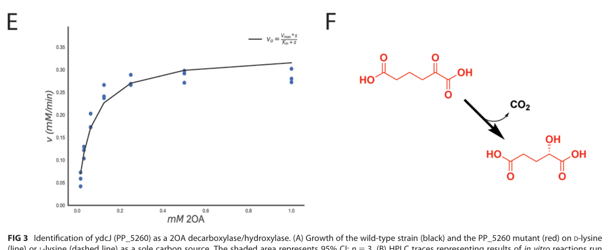

## Question

# Gene Research for Functional Annotation

## ⚠️ CRITICAL: Gene/Protein Identification Context

**BEFORE YOU BEGIN RESEARCH:** You MUST verify you are researching the CORRECT gene/protein. Gene symbols can be ambiguous, especially for less well-characterized genes from non-model organisms.

### Target Gene/Protein Identity (from UniProt):
- **UniProt Accession:** Q88CC1
- **Protein Description:** RecName: Full=2-oxoadipate dioxygenase/decarboxylase {ECO:0000305}; EC=1.13.11.93 {ECO:0000269|PubMed:31064836}; AltName: Full=2-hydroxyglutarate synthase {ECO:0000303|PubMed:31064836};
- **Gene Information:** Name=hglS {ECO:0000303|PubMed:31064836}; Synonyms=ydcJ {ECO:0000303|PubMed:31064836}; OrderedLocusNames=PP_5260 {ECO:0000312|EMBL:AAN70825.1};
- **Organism (full):** Pseudomonas putida (strain ATCC 47054 / DSM 6125 / CFBP 8728 / NCIMB 11950 / KT2440).
- **Protein Family:** Belongs to the 2-oxoadipate dioxygenase/decarboxylase
- **Key Domains:** HGLS. (IPR009770); YdcJ_bac-like. (IPR047869); HGLS (PF07063)

### MANDATORY VERIFICATION STEPS:

1. **Check if the gene symbol "hglS" matches the protein description above**
2. **Verify the organism is correct:** Pseudomonas putida (strain ATCC 47054 / DSM 6125 / CFBP 8728 / NCIMB 11950 / KT2440).
3. **Check if protein family/domains align with what you find in literature**
4. **If you find literature for a DIFFERENT gene with the same or similar symbol, STOP**

### If Gene Symbol is Ambiguous or You Cannot Find Relevant Literature:

**DO NOT PROCEED WITH RESEARCH ON A DIFFERENT GENE.** Instead:
- State clearly: "The gene symbol 'hglS' is ambiguous or literature is limited for this specific protein"
- Explain what you found (e.g., "Found extensive literature on a different gene with the same symbol in a different organism")
- Describe the protein based ONLY on the UniProt information provided above
- Suggest that the protein function can be inferred from domain/family information

### Research Target:

Please provide a comprehensive research report on the gene **hglS** (gene ID: hglS, UniProt: Q88CC1) in PSEPK.

The research report should be a detailed narrative explaining the function, biological processes, and localization of the gene product. Citations should be given for all claims.

You should prioritize authoritative reviews and primary scientific literature when conducting research. You can supplement
this with annotations you find in gene/protein databases, but these can be outdated or inaccurate.

We are specifically interested in the primary function of the gene - for enzymes, what reaction is catalyzed, and what is the substrate specificity? For transporters, what is the substrate? For structural proteins or adapters, what is the broader structural role? For signaling molecules, what is the role in the pathway.

We are interested in where in or outside the cell the gene product carries out its function.

We are also interested in the signaling or biochemical pathways in which the gene functions. We are less interested in broad pleiotropic effects, except where these elucidate the precise role.

Include evidence where possible. We are interested in both experimental evidence as well as inference from structure, evolution, or bioinformatic analysis. Precise studies should be prioritized over high-throughput, where available.

## Output

Question: You are an expert researcher providing comprehensive, well-cited information.

Provide detailed information focusing on:
1. Key concepts and definitions with current understanding
2. Recent developments and latest research (prioritize 2023-2024 sources)
3. Current applications and real-world implementations
4. Expert opinions and analysis from authoritative sources
5. Relevant statistics and data from recent studies

Format as a comprehensive research report with proper citations. Include URLs and publication dates where available.
Always prioritize recent, authoritative sources and provide specific citations for all major claims.

# Gene Research for Functional Annotation

## ⚠️ CRITICAL: Gene/Protein Identification Context

**BEFORE YOU BEGIN RESEARCH:** You MUST verify you are researching the CORRECT gene/protein. Gene symbols can be ambiguous, especially for less well-characterized genes from non-model organisms.

### Target Gene/Protein Identity (from UniProt):
- **UniProt Accession:** Q88CC1
- **Protein Description:** RecName: Full=2-oxoadipate dioxygenase/decarboxylase {ECO:0000305}; EC=1.13.11.93 {ECO:0000269|PubMed:31064836}; AltName: Full=2-hydroxyglutarate synthase {ECO:0000303|PubMed:31064836};
- **Gene Information:** Name=hglS {ECO:0000303|PubMed:31064836}; Synonyms=ydcJ {ECO:0000303|PubMed:31064836}; OrderedLocusNames=PP_5260 {ECO:0000312|EMBL:AAN70825.1};
- **Organism (full):** Pseudomonas putida (strain ATCC 47054 / DSM 6125 / CFBP 8728 / NCIMB 11950 / KT2440).
- **Protein Family:** Belongs to the 2-oxoadipate dioxygenase/decarboxylase
- **Key Domains:** HGLS. (IPR009770); YdcJ_bac-like. (IPR047869); HGLS (PF07063)

### MANDATORY VERIFICATION STEPS:

1. **Check if the gene symbol "hglS" matches the protein description above**
2. **Verify the organism is correct:** Pseudomonas putida (strain ATCC 47054 / DSM 6125 / CFBP 8728 / NCIMB 11950 / KT2440).
3. **Check if protein family/domains align with what you find in literature**
4. **If you find literature for a DIFFERENT gene with the same or similar symbol, STOP**

### If Gene Symbol is Ambiguous or You Cannot Find Relevant Literature:

**DO NOT PROCEED WITH RESEARCH ON A DIFFERENT GENE.** Instead:
- State clearly: "The gene symbol 'hglS' is ambiguous or literature is limited for this specific protein"
- Explain what you found (e.g., "Found extensive literature on a different gene with the same symbol in a different organism")
- Describe the protein based ONLY on the UniProt information provided above
- Suggest that the protein function can be inferred from domain/family information

### Research Target:

Please provide a comprehensive research report on the gene **hglS** (gene ID: hglS, UniProt: Q88CC1) in PSEPK.

The research report should be a detailed narrative explaining the function, biological processes, and localization of the gene product. Citations should be given for all claims.

You should prioritize authoritative reviews and primary scientific literature when conducting research. You can supplement
this with annotations you find in gene/protein databases, but these can be outdated or inaccurate.

We are specifically interested in the primary function of the gene - for enzymes, what reaction is catalyzed, and what is the substrate specificity? For transporters, what is the substrate? For structural proteins or adapters, what is the broader structural role? For signaling molecules, what is the role in the pathway.

We are interested in where in or outside the cell the gene product carries out its function.

We are also interested in the signaling or biochemical pathways in which the gene functions. We are less interested in broad pleiotropic effects, except where these elucidate the precise role.

Include evidence where possible. We are interested in both experimental evidence as well as inference from structure, evolution, or bioinformatic analysis. Precise studies should be prioritized over high-throughput, where available.

## Research Report: Functional Annotation of **hglS (PP_5260/ydcJ)** in *Pseudomonas putida* KT2440 (UniProt **Q88CC1**)

### Executive summary (identity verified)
The UniProt target **Q88CC1** corresponds to *Pseudomonas putida* KT2440 locus **PP_5260**, annotated in the primary literature as **ydcJ** and provisionally named **2-hydroxyglutarate synthase (hglS)**. Experimental genetics and enzymology show that HglS is an **Fe(II)-dependent metalloenzyme** that converts **2-oxoadipate (2OA)** to **D-2-hydroxyglutarate (D-2HG)**, providing a key missing step connecting lysine catabolism to central metabolism (TCA entry via 2-ketoglutarate). (thompson2019massivelyparallelfitness pages 4-7, thompson2019massivelyparallelfitness pages 9-12, thompson2019massivelyparallelfitness pages 1-2)

### 1) Key concepts and definitions (current understanding)

#### 1.1. What is HglS?
HglS (PP_5260/ydcJ; UniProt Q88CC1) is a DUF1338/HGLS-family enzyme discovered via genome-wide fitness profiling in *P. putida* lysine metabolism and biochemically validated as a **metalloenzyme** acting on the lysine-catabolic intermediate 2OA. (thompson2019massivelyparallelfitness pages 1-2, thompson2019massivelyparallelfitness pages 7-9)

#### 1.2. Reaction catalyzed and enzymatic classification
**Biochemical function (experimentally supported):** HglS catalyzes direct conversion of **2-oxoadipate (2OA) → D-2-hydroxyglutarate (D-2HG)**. (thompson2019massivelyparallelfitness pages 4-7, thompson2019asongof pages 20-26, thompson2019massivelyparallelfitness media 83745ba4)

**Cofactor:** activity depends on a divalent metal and is specifically restored by **Fe(II)** following EDTA treatment, supporting an Fe(II)-dependent metalloenzyme mechanism. (thompson2019massivelyparallelfitness pages 4-7, thompson2019massivelyparallelfitness pages 14-15)

**Mechanistic interpretation:** the transformation is described as an unusual decarboxylation/hydroxylation-like chemistry; associated mechanistic evidence indicates **O2 is consumed stoichiometrically with substrate** and isotopic labeling under **18O2** yields product containing **two 18O atoms**, consistent with incorporation from molecular oxygen. (thompson2019massivelyparallelfitness pages 9-12, thompson2019asongof pages 99-102)

*Note on EC number:* UniProt lists EC **1.13.11.93** for this protein; however, the accessible primary paper excerpts providing direct biochemical validation do not explicitly state the EC number in the captured text. The functional assignment nonetheless aligns with an oxygenase/decarboxylase-like metalloenzyme chemistry described above. (thompson2019massivelyparallelfitness pages 4-7, thompson2019asongof pages 99-102)

### 2) Primary literature evidence for function and substrate specificity

#### 2.1. Genetics and physiology (in vivo evidence)
A **ΔPP_5260 (ΔhglS)** deletion mutant **cannot grow on either lysine isomer**, establishing that HglS is necessary for lysine utilization in vivo and is not a minor side reaction. (thompson2019massivelyparallelfitness pages 4-7, thompson2019asongof pages 20-26)

#### 2.2. In vitro enzymology and product identification
Purified PP_5260 incubated with 2OA shows strong substrate depletion (~**92% decrease** in 2OA versus controls), and short-time reactions show **~1:1 stoichiometry** between 2OA consumption and 2HG formation (e.g., **~200 µM 2HG formed** with **~800 µM 2OA remaining** after 5 min from a 1 mM pool). (thompson2019massivelyparallelfitness pages 4-7, thompson2019asongof pages 20-26)

Product identity was confirmed by LC-TOF/HPLC matching to 2HG standards, and the stereochemistry was assigned using an **enzyme-coupled assay specific for D-2HG**, demonstrating formation of **D-2HG**. (thompson2019massivelyparallelfitness pages 4-7, thompson2019asongof pages 20-26)

#### 2.3. Kinetic parameters (quantitative data)
Michaelis–Menten kinetics for 2OA are reported with **Km = 0.06 mM (±0.03)**, **Vmax = 0.33 mM/min (±0.08)**, and **kcat = 330 min⁻¹** (as reported), with the kinetic plot and reaction depiction provided in Figure 3 (panels E/F). (thompson2019massivelyparallelfitness pages 4-7, thompson2019massivelyparallelfitness media 83745ba4)

### 3) Pathway context, biological processes, and cellular localization

#### 3.1. Pathway placement: lysine → 2OA → D-2HG → central metabolism
HglS functions in the *P. putida* lysine catabolic network at the step converting **2OA to D-2HG**, linking lysine degradation to downstream processing toward **2-ketoglutarate** and the TCA cycle. (thompson2019massivelyparallelfitness pages 4-7, thompson2019massivelyparallelfitness pages 1-2)

A key conceptual point is **stereochemical separation**: HglS generates **D-2HG**, which is proposed to be processed by **PP_4493** (rather than the L-2HG-specific oxidase **LhgO**), preventing mixing with the L-lysine branch that yields L-2HG. (thompson2019massivelyparallelfitness pages 9-12, thompson2019asongof pages 99-102)

Comparative genomics further supports a catabolic role for DUF1338/HglS homologs: these proteins are broadly distributed and frequently located near other amino-acid catabolic enzymes (transaminases, dehydrogenases/oxidoreductases), consistent with pathway coupling to central metabolism. (thompson2019massivelyparallelfitness pages 7-9)

#### 3.2. Regulation and expression signals
Targeted proteomics reported that PP_5260/YdcJ abundance is increased when *P. putida* is grown on **L-lysine, D-lysine, or 2-aminoadipate** relative to glucose, consistent with induction by lysine-pathway metabolites. (thompson2019asongof pages 29-34, thompson2019massivelyparallelfitness pages 9-12)

Fitness profiling also implicated the sigma factor **RpoX** as being required for fitness on D-lysine, suggesting pathway-level transcriptional regulation associated with D-lysine utilization (not necessarily direct regulation of hglS, but consistent with a regulated catabolic module). (thompson2019massivelyparallelfitness pages 9-12)

#### 3.3. Cellular localization
No direct subcellular localization experiments for HglS were found in the retrieved evidence. Given that (i) the substrates/products (2OA, D-2HG) are soluble central metabolites and (ii) the enzyme was purified and assayed as a soluble Fe(II)-dependent metalloenzyme, the most defensible functional localization is **cytosolic** (inference, not direct experimental localization). (thompson2019massivelyparallelfitness pages 4-7, thompson2019massivelyparallelfitness pages 14-15)

### 4) Recent developments (2023–2024) and current applications

#### 4.1. 2024 method development: proteome-wide target engagement workflows
A 2024 ACS *Infectious Diseases* study introduced/validated **integral solvent-induced protein precipitation (iSPP)** coupled to quantitative LC–MS/MS to measure ligand/drug target engagement in bacterial lysates. In *E. coli* validation experiments, the authors reported significant stabilization of **2-hydroxyglutarate synthase (HGLS)** following **ampicillin** treatment (along with PBPs), noting HGLS involvement in D-lysine metabolism (Figure 2C). The study reports, across conditions, identification of an average of **2,163 proteins**, using **10 µM drug** and **n = 3** replicates; volcano-plot thresholds included |log2 fold change| > 0.5 and p < 0.05. (bizzarri2024studyingtarget–engagementof pages 6-8)

This is not a functional characterization of *P. putida* HglS, but it is a concrete example of a **real-world implementation** where HGLS-type proteins appear as measurable, condition-responsive proteins in modern chemoproteomic workflows. (bizzarri2024studyingtarget–engagementof pages 6-8)

#### 4.2. Gap in 2023–2024 direct HglS biochemistry literature retrieved
Within the tool-accessible search results, no additional 2023–2024 primary articles directly extending the biochemical mechanism, structure, or engineering of *P. putida* KT2440 HglS/PP_5260 were retrieved beyond the 2024 iSPP methodological mention. Therefore, the core mechanistic/kinetic evidence base available here remains anchored in 2019 primary work, supplemented by mechanistic/structural evidence in an associated 2019 dissertation excerpt. (thompson2019massivelyparallelfitness pages 4-7, thompson2019asongof pages 99-102, bizzarri2024studyingtarget–engagementof pages 6-8)

### 5) Expert interpretation and analysis (authoritative sources)

#### 5.1. Why HglS was notable as a discovery
The 2019 study frames PP_5260/HglS as a solution to a longstanding gap connecting lysine catabolism to central metabolism in *P. putida*, discovered via RB-TnSeq and then validated by targeted biochemistry. The work also emphasizes that DUF1338 proteins were previously uncharacterized despite broad phylogenetic distribution, making HglS a representative “first function” assignment for a widespread family. (thompson2019massivelyparallelfitness pages 1-2, thompson2019massivelyparallelfitness pages 7-9)

#### 5.2. Mechanistic implications
The authors’ comparison to hydroxymandelate synthase and the additional evidence of O2 consumption and incorporation of oxygen from O2 into product support interpretation of HglS as an Fe(II)-dependent enzyme performing a coupled decarboxylation/oxygenation chemistry rather than a simple non-oxidative decarboxylase. This provides a mechanistic rationale for the UniProt-style naming “2-oxoadipate dioxygenase/decarboxylase.” (thompson2019massivelyparallelfitness pages 9-12, thompson2019asongof pages 99-102)

### Summary artifacts
The tables below consolidate the enzyme’s biochemical function and pathway context into citable, audit-friendly summaries.

| Claim | Key quantitative details | Evidence type | Source |
|---|---|---|---|
| **Identity/function:** PP_5260 (also called **ydcJ**; tentatively named **hglS**) from *Pseudomonas putida* KT2440 is a DUF1338/HGLS-family metalloenzyme that catalyzes conversion of **2-oxoadipate (2OA)** to **D-2-hydroxyglutarate (D-2HG)** | Figure-localized kinetic/reaction panels identify PP_5260 with the 2OA→D-2HG reaction; family/domain assignment is DUF1338/HGLS-like (thompson2019massivelyparallelfitness pages 1-2, thompson2019massivelyparallelfitness media 83745ba4) | RB-TnSeq-guided pathway discovery; in vitro enzymology; family/domain inference | Thompson et al., **2019-06**, mBio, DOI: 10.1128/mBio.02577-18, https://doi.org/10.1128/mbio.02577-18 (thompson2019massivelyparallelfitness pages 1-2, thompson2019massivelyparallelfitness media 83745ba4) |
| **Reaction/product:** HglS directly converts **2OA** to **D-2HG** | Short-time assays showed **1:1 stoichiometry**: about **200 µM 2HG formed** with **800 µM 2OA remaining** after 5 min from a 1 mM starting substrate pool; long assays showed ~**92% decrease** in 2OA versus boiled/EDTA controls (thompson2019massivelyparallelfitness pages 4-7, thompson2019asongof pages 20-26) | In vitro enzymology; substrate/product quantification | Thompson et al., **2019-06**, mBio, DOI: 10.1128/mBio.02577-18, https://doi.org/10.1128/mbio.02577-18 (thompson2019massivelyparallelfitness pages 4-7, thompson2019asongof pages 20-26) |
| **Stereochemistry:** the product is specifically **D-2HG**, not L-2HG | Product identity matched **2HG standards** by LC-TOF/HPLC, and stereochemistry was assigned by an **enzyme-coupled assay specific for D-2HG** (thompson2019massivelyparallelfitness pages 4-7, thompson2019asongof pages 20-26) | LC-TOF/HPLC product identification; stereospecific coupled assay | Thompson et al., **2019-06**, mBio, DOI: 10.1128/mBio.02577-18, https://doi.org/10.1128/mbio.02577-18 (thompson2019massivelyparallelfitness pages 4-7, thompson2019asongof pages 20-26) |
| **Cofactor requirement:** HglS is an **Fe(II)-dependent metalloenzyme** | EDTA treatment abolished activity; after apo-enzyme preparation, **only Fe(II)** reconstituted catalysis. Standard assay conditions reported included **5 mM 2OA**, **10 µM purified enzyme**, **50 mM HEPES**, **16 h at 30°C** for endpoint assays (thompson2019massivelyparallelfitness pages 4-7, thompson2019massivelyparallelfitness pages 14-15) | Metal-dependence assay; reconstitution biochemistry | Thompson et al., **2019-06**, mBio, DOI: 10.1128/mBio.02577-18, https://doi.org/10.1128/mbio.02577-18 (thompson2019massivelyparallelfitness pages 4-7, thompson2019massivelyparallelfitness pages 14-15) |
| **Kinetics with 2OA substrate:** HglS shows measurable Michaelis-Menten behavior on 2OA | **Km = 0.06 mM ± 0.03**, **Vmax = 0.33 mM/min ± 0.08**, **kcat = 330 min⁻¹** (as reported); kinetic plot shown in Fig. 3E and reaction scheme in Fig. 3F (thompson2019massivelyparallelfitness pages 4-7, thompson2019massivelyparallelfitness media 83745ba4) | Enzyme kinetics | Thompson et al., **2019-06**, mBio, DOI: 10.1128/mBio.02577-18, https://doi.org/10.1128/mbio.02577-18 (thompson2019massivelyparallelfitness pages 4-7, thompson2019massivelyparallelfitness media 83745ba4) |
| **Physiological role:** HglS is required for lysine catabolism feeding into central metabolism | A **ΔPP_5260** mutant **cannot grow on either lysine isomer**; RB-TnSeq identified PP_5260 as important in lysine utilization, placing the enzyme in the 2OA catabolic segment of the pathway (thompson2019massivelyparallelfitness pages 4-7, thompson2019asongof pages 20-26, thompson2019massivelyparallelfitness pages 1-2) | Genetics; fitness profiling; growth phenotype | Thompson et al., **2019-06**, mBio, DOI: 10.1128/mBio.02577-18, https://doi.org/10.1128/mbio.02577-18 (thompson2019massivelyparallelfitness pages 4-7, thompson2019asongof pages 20-26, thompson2019massivelyparallelfitness pages 1-2) |
| **Mechanistic description:** the chemistry is an unusual decarboxylative/hydroxylative transformation of 2OA to D-2HG | Authors describe the transformation as an unusual route of **decarboxylation** with **hydroxylation-like** chemistry; later structural/mechanistic evidence indicates **O2 consumption in 1:1 stoichiometry with substrate** and incorporation of oxygen from O2 into product (thompson2019massivelyparallelfitness pages 9-12, thompson2019asongof pages 99-102) | Biochemical interpretation; O2-consumption/isotope evidence | Thompson dissertation/associated mechanistic work, **2019**, excerpted evidence with structural/biochemical data (thompson2019asongof pages 99-102); Thompson et al., **2019-06**, mBio, https://doi.org/10.1128/mbio.02577-18 (thompson2019massivelyparallelfitness pages 9-12) |

*Table: This table compiles the experimentally supported biochemical claims for *P. putida* KT2440 HglS/PP_5260, including reaction, stereochemistry, Fe(II) dependence, kinetics, and assay conditions. It is useful for linking UniProt annotation of Q88CC1 to the primary enzymology and physiological evidence in the literature.*

| Aspect | Finding | Evidence/interpretation |
|---|---|---|
| Gene/protein identity | HglS in *Pseudomonas putida* KT2440 corresponds to PP_5260, also called YdcJ; it is a DUF1338/HGLS-family enzyme assigned as 2-hydroxyglutarate synthase / 2-oxoadipate dioxygenase-decarboxylase (thompson2019massivelyparallelfitness pages 4-7, thompson2019massivelyparallelfitness pages 1-2) | Identity matches the UniProt target context and the primary 2019 biochemical/genetic study (thompson2019massivelyparallelfitness pages 4-7, thompson2019massivelyparallelfitness pages 1-2) |
| Immediate substrate | HglS acts on 2-oxoadipate (2OA), an intermediate in lysine catabolism downstream of L-2-aminoadipate transamination (thompson2019massivelyparallelfitness pages 4-7, thompson2019asongof pages 20-26) | In vitro enzyme assays and pathway reconstruction place 2OA directly upstream of HglS (thompson2019massivelyparallelfitness pages 4-7, thompson2019asongof pages 20-26, thompson2019massivelyparallelfitness media 83745ba4) |
| Immediate product | HglS converts 2OA to D-2-hydroxyglutarate (D-2HG), preserving stereochemical separation from L-2HG generated in the L-lysine branch (thompson2019massivelyparallelfitness pages 4-7, thompson2019massivelyparallelfitness pages 9-12, thompson2019asongof pages 99-102) | Product identity and D-stereochemistry were supported by LC-TOF/HPLC comparison to standards and a D-2HG-specific coupled assay (thompson2019massivelyparallelfitness pages 4-7, thompson2019asongof pages 20-26) |
| Downstream metabolism | D-2HG produced by HglS is proposed to be oxidized by PP_4493 en route to central metabolism / the TCA cycle, whereas LhgO is noted as L-2HG-specific and therefore not the appropriate downstream enzyme for HglS product (thompson2019massivelyparallelfitness pages 9-12, thompson2019asongof pages 99-102) | This is a key pathway-disambiguation point: HglS feeds the D-2HG branch, not the L-2HG/LhgO branch (thompson2019massivelyparallelfitness pages 9-12, thompson2019asongof pages 99-102) |
| Pathway role | HglS links 2OA catabolism to lysine utilization, functioning in the D-lysine/L-lysine catabolic network that connects lysine degradation to central metabolism (thompson2019massivelyparallelfitness pages 4-7, thompson2019massivelyparallelfitness pages 1-2) | The study describes HglS as filling a missing step in *P. putida* lysine metabolism (thompson2019massivelyparallelfitness pages 4-7, thompson2019massivelyparallelfitness pages 1-2) |
| Phenotype of loss | A ΔPP_5260 mutant cannot grow on either lysine isomer, indicating HglS is required for efficient lysine catabolism in vivo (thompson2019massivelyparallelfitness pages 4-7, thompson2019asongof pages 20-26) | Strong genetic evidence that the enzyme is functionally important rather than merely redundant (thompson2019massivelyparallelfitness pages 4-7, thompson2019asongof pages 20-26) |
| Omics/regulation: proteomics | PP_5260/YdcJ abundance increases when cells are grown on L-lysine, D-lysine, or 2-aminoadipate relative to glucose, consistent with metabolite-responsive regulation of the lysine catabolic module (thompson2019asongof pages 29-34, thompson2019massivelyparallelfitness pages 9-12, thompson2019massivelyparallelfitness pages 1-2) | Supports inducible expression tied to pathway substrates/intermediates rather than constitutive housekeeping expression (thompson2019asongof pages 29-34, thompson2019massivelyparallelfitness pages 9-12) |
| Omics/regulation: broader network | The lysine-catabolic genes were reported to be highly sensitive to pathway metabolites, and sigma factor RpoX was required for fitness on D-lysine, suggesting higher-level regulatory control connected to this pathway (thompson2019massivelyparallelfitness pages 9-12, thompson2019massivelyparallelfitness pages 1-2) | RpoX is not shown to directly regulate *hglS*, but the phenotype implicates pathway-level transcriptional regulation during D-lysine use (thompson2019massivelyparallelfitness pages 9-12) |
| Genomic/phylogenetic context | DUF1338/HglS homologs often colocalize with amino-acid catabolic enzymes in bacterial genomes, supporting a catabolic metabolic role beyond *P. putida* (thompson2019massivelyparallelfitness pages 7-9) | Comparative genomics strengthens the pathway assignment, although it does not replace direct biochemistry (thompson2019massivelyparallelfitness pages 7-9) |
| Cellular localization | No direct localization experiment was reported in the extracted evidence; because HglS acts on soluble metabolic intermediates (2OA, D-2HG) and was purified as a metal-dependent enzyme without membrane features, the most defensible assignment is a cytosolic enzyme (inference) (thompson2019massivelyparallelfitness pages 4-7, thompson2019asongof pages 20-26, thompson2019massivelyparallelfitness pages 14-15) | This should be treated as a bioinformatic/biochemical inference rather than direct localization evidence (thompson2019massivelyparallelfitness pages 14-15) |

*Table: This table summarizes the metabolic context, downstream connections, phenotypes, regulatory signals, and localization inference for HglS (PP_5260/YdcJ) in *Pseudomonas putida* KT2440. It is useful for tying the enzyme’s biochemical activity to its physiological role in lysine catabolism.*

### Key primary sources (with publication dates and URLs)
- Thompson MG et al. **2019-06**. “Massively Parallel Fitness Profiling Reveals Multiple Novel Enzymes in *Pseudomonas putida* Lysine Metabolism.” *mBio* 10(3). DOI: **10.1128/mBio.02577-18**. URL: https://doi.org/10.1128/mbio.02577-18 (thompson2019massivelyparallelfitness pages 4-7, thompson2019massivelyparallelfitness pages 1-2, thompson2019massivelyparallelfitness media 83745ba4)
- Bizzarri L et al. **2024-11**. “Studying Target–Engagement of Anti-Infectives by Solvent-Induced Protein Precipitation and Quantitative Mass Spectrometry.” *ACS Infectious Diseases* 10(12):4087–4102. DOI: **10.1021/acsinfecdis.4c00417**. URL: https://doi.org/10.1021/acsinfecdis.4c00417 (bizzarri2024studyingtarget–engagementof pages 6-8)

### Evidence-based functional annotation (concise)
**hglS (PP_5260/ydcJ)** encodes a likely **cytosolic, Fe(II)-dependent metalloenzyme** that catalyzes **2-oxoadipate → D-2-hydroxyglutarate**, a key step in *P. putida* lysine catabolism required for growth on lysine isomers, with reported kinetics **Km ~0.06 mM**, **Vmax ~0.33 mM/min**, **kcat ~330 min⁻¹** on 2OA and evidence consistent with **O2-dependent oxygen incorporation**. (thompson2019massivelyparallelfitness pages 4-7, thompson2019asongof pages 99-102, thompson2019massivelyparallelfitness media 83745ba4)

References

1. (thompson2019massivelyparallelfitness pages 4-7): Mitchell G. Thompson, Jacquelyn M. Blake-Hedges, Pablo Cruz-Morales, Jesus F. Barajas, Samuel C. Curran, Christopher B. Eiben, Nicholas C. Harris, Veronica T. Benites, Jennifer W. Gin, William A. Sharpless, Frederick F. Twigg, Will Skyrud, Rohith N. Krishna, Jose Henrique Pereira, Edward E. K. Baidoo, Christopher J. Petzold, Paul D. Adams, Adam P. Arkin, Adam M. Deutschbauer, and Jay D. Keasling. Massively parallel fitness profiling reveals multiple novel enzymes in <i>pseudomonas putida</i> lysine metabolism. mBio, Jun 2019. URL: https://doi.org/10.1128/mbio.02577-18, doi:10.1128/mbio.02577-18. This article has 83 citations and is from a domain leading peer-reviewed journal.

2. (thompson2019massivelyparallelfitness pages 9-12): Mitchell G. Thompson, Jacquelyn M. Blake-Hedges, Pablo Cruz-Morales, Jesus F. Barajas, Samuel C. Curran, Christopher B. Eiben, Nicholas C. Harris, Veronica T. Benites, Jennifer W. Gin, William A. Sharpless, Frederick F. Twigg, Will Skyrud, Rohith N. Krishna, Jose Henrique Pereira, Edward E. K. Baidoo, Christopher J. Petzold, Paul D. Adams, Adam P. Arkin, Adam M. Deutschbauer, and Jay D. Keasling. Massively parallel fitness profiling reveals multiple novel enzymes in <i>pseudomonas putida</i> lysine metabolism. mBio, Jun 2019. URL: https://doi.org/10.1128/mbio.02577-18, doi:10.1128/mbio.02577-18. This article has 83 citations and is from a domain leading peer-reviewed journal.

3. (thompson2019massivelyparallelfitness pages 1-2): Mitchell G. Thompson, Jacquelyn M. Blake-Hedges, Pablo Cruz-Morales, Jesus F. Barajas, Samuel C. Curran, Christopher B. Eiben, Nicholas C. Harris, Veronica T. Benites, Jennifer W. Gin, William A. Sharpless, Frederick F. Twigg, Will Skyrud, Rohith N. Krishna, Jose Henrique Pereira, Edward E. K. Baidoo, Christopher J. Petzold, Paul D. Adams, Adam P. Arkin, Adam M. Deutschbauer, and Jay D. Keasling. Massively parallel fitness profiling reveals multiple novel enzymes in <i>pseudomonas putida</i> lysine metabolism. mBio, Jun 2019. URL: https://doi.org/10.1128/mbio.02577-18, doi:10.1128/mbio.02577-18. This article has 83 citations and is from a domain leading peer-reviewed journal.

4. (thompson2019massivelyparallelfitness pages 7-9): Mitchell G. Thompson, Jacquelyn M. Blake-Hedges, Pablo Cruz-Morales, Jesus F. Barajas, Samuel C. Curran, Christopher B. Eiben, Nicholas C. Harris, Veronica T. Benites, Jennifer W. Gin, William A. Sharpless, Frederick F. Twigg, Will Skyrud, Rohith N. Krishna, Jose Henrique Pereira, Edward E. K. Baidoo, Christopher J. Petzold, Paul D. Adams, Adam P. Arkin, Adam M. Deutschbauer, and Jay D. Keasling. Massively parallel fitness profiling reveals multiple novel enzymes in <i>pseudomonas putida</i> lysine metabolism. mBio, Jun 2019. URL: https://doi.org/10.1128/mbio.02577-18, doi:10.1128/mbio.02577-18. This article has 83 citations and is from a domain leading peer-reviewed journal.

5. (thompson2019asongof pages 20-26): MG Thompson. A song of lysine and pseudomonas putida. Unknown journal, 2019.

6. (thompson2019massivelyparallelfitness media 83745ba4): Mitchell G. Thompson, Jacquelyn M. Blake-Hedges, Pablo Cruz-Morales, Jesus F. Barajas, Samuel C. Curran, Christopher B. Eiben, Nicholas C. Harris, Veronica T. Benites, Jennifer W. Gin, William A. Sharpless, Frederick F. Twigg, Will Skyrud, Rohith N. Krishna, Jose Henrique Pereira, Edward E. K. Baidoo, Christopher J. Petzold, Paul D. Adams, Adam P. Arkin, Adam M. Deutschbauer, and Jay D. Keasling. Massively parallel fitness profiling reveals multiple novel enzymes in <i>pseudomonas putida</i> lysine metabolism. mBio, Jun 2019. URL: https://doi.org/10.1128/mbio.02577-18, doi:10.1128/mbio.02577-18. This article has 83 citations and is from a domain leading peer-reviewed journal.

7. (thompson2019massivelyparallelfitness pages 14-15): Mitchell G. Thompson, Jacquelyn M. Blake-Hedges, Pablo Cruz-Morales, Jesus F. Barajas, Samuel C. Curran, Christopher B. Eiben, Nicholas C. Harris, Veronica T. Benites, Jennifer W. Gin, William A. Sharpless, Frederick F. Twigg, Will Skyrud, Rohith N. Krishna, Jose Henrique Pereira, Edward E. K. Baidoo, Christopher J. Petzold, Paul D. Adams, Adam P. Arkin, Adam M. Deutschbauer, and Jay D. Keasling. Massively parallel fitness profiling reveals multiple novel enzymes in <i>pseudomonas putida</i> lysine metabolism. mBio, Jun 2019. URL: https://doi.org/10.1128/mbio.02577-18, doi:10.1128/mbio.02577-18. This article has 83 citations and is from a domain leading peer-reviewed journal.

8. (thompson2019asongof pages 99-102): MG Thompson. A song of lysine and pseudomonas putida. Unknown journal, 2019.

9. (thompson2019asongof pages 29-34): MG Thompson. A song of lysine and pseudomonas putida. Unknown journal, 2019.

10. (bizzarri2024studyingtarget–engagementof pages 6-8): Lorenzo Bizzarri, Dominik Steinbrunn, Thibaut Quennesson, Antoine Lacour, Gabriella Ines Bianchino, Patricia Bravo, Philippe Chaignon, Jonas Lohse, Pascal Mäser, Myriam Seemann, Serge Van Calenbergh, Anna K. H. Hirsch, and Hannes Hahne. Studying target–engagement of anti-infectives by solvent-induced protein precipitation and quantitative mass spectrometry. ACS Infectious Diseases, 10:4087-4102, Nov 2024. URL: https://doi.org/10.1021/acsinfecdis.4c00417, doi:10.1021/acsinfecdis.4c00417. This article has 7 citations and is from a peer-reviewed journal.

## Artifacts

- [Edison artifact artifact-00](hglS-deep-research-falcon_artifacts/artifact-00.md)
- [Edison artifact artifact-01](hglS-deep-research-falcon_artifacts/artifact-01.md)

## Citations

1. thompson2019massivelyparallelfitness pages 7-9
2. thompson2019massivelyparallelfitness pages 9-12
3. thompson2019asongof pages 99-102
4. thompson2019massivelyparallelfitness pages 14-15
5. thompson2019massivelyparallelfitness pages 4-7
6. thompson2019massivelyparallelfitness pages 1-2
7. thompson2019asongof pages 20-26
8. thompson2019asongof pages 29-34
9. https://doi.org/10.1128/mbio.02577-18
10. https://doi.org/10.1021/acsinfecdis.4c00417
11. https://doi.org/10.1128/mbio.02577-18,
12. https://doi.org/10.1021/acsinfecdis.4c00417,