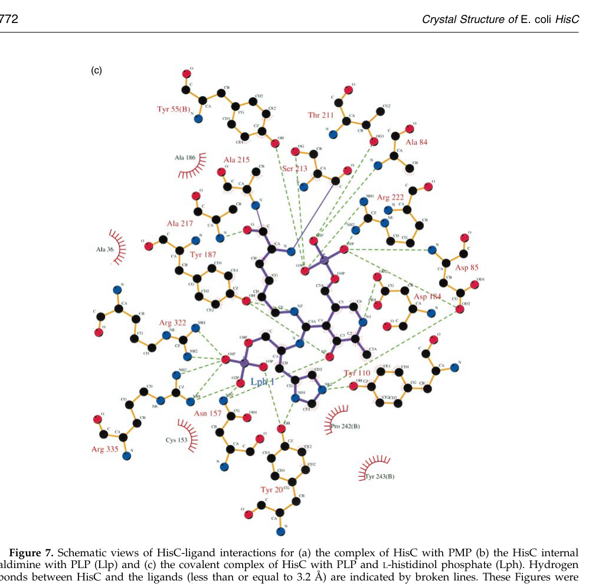

## Question

# Gene Research for Functional Annotation

## ⚠️ CRITICAL: Gene/Protein Identification Context

**BEFORE YOU BEGIN RESEARCH:** You MUST verify you are researching the CORRECT gene/protein. Gene symbols can be ambiguous, especially for less well-characterized genes from non-model organisms.

### Target Gene/Protein Identity (from UniProt):
- **UniProt Accession:** Q88P86
- **Protein Description:** RecName: Full=Histidinol-phosphate aminotransferase {ECO:0000255|HAMAP-Rule:MF_01023}; EC=2.6.1.9 {ECO:0000255|HAMAP-Rule:MF_01023}; AltName: Full=Imidazole acetol-phosphate transaminase {ECO:0000255|HAMAP-Rule:MF_01023};
- **Gene Information:** Name=hisC {ECO:0000255|HAMAP-Rule:MF_01023}; OrderedLocusNames=PP_0967;
- **Organism (full):** Pseudomonas putida (strain ATCC 47054 / DSM 6125 / CFBP 8728 / NCIMB 11950 / KT2440).
- **Protein Family:** Belongs to the class-II pyridoxal-phosphate-dependent
- **Key Domains:** Aminotrans_II_pyridoxalP_BS. (IPR001917); Aminotransferase_I/II_large. (IPR004839); HisP_aminotrans. (IPR005861); HistidinolP_aminotransfase. (IPR050106); PyrdxlP-dep_Trfase. (IPR015424)

### MANDATORY VERIFICATION STEPS:

1. **Check if the gene symbol "hisC" matches the protein description above**
2. **Verify the organism is correct:** Pseudomonas putida (strain ATCC 47054 / DSM 6125 / CFBP 8728 / NCIMB 11950 / KT2440).
3. **Check if protein family/domains align with what you find in literature**
4. **If you find literature for a DIFFERENT gene with the same or similar symbol, STOP**

### If Gene Symbol is Ambiguous or You Cannot Find Relevant Literature:

**DO NOT PROCEED WITH RESEARCH ON A DIFFERENT GENE.** Instead:
- State clearly: "The gene symbol 'hisC' is ambiguous or literature is limited for this specific protein"
- Explain what you found (e.g., "Found extensive literature on a different gene with the same symbol in a different organism")
- Describe the protein based ONLY on the UniProt information provided above
- Suggest that the protein function can be inferred from domain/family information

### Research Target:

Please provide a comprehensive research report on the gene **hisC** (gene ID: hisC, UniProt: Q88P86) in PSEPK.

The research report should be a detailed narrative explaining the function, biological processes, and localization of the gene product. Citations should be given for all claims.

You should prioritize authoritative reviews and primary scientific literature when conducting research. You can supplement
this with annotations you find in gene/protein databases, but these can be outdated or inaccurate.

We are specifically interested in the primary function of the gene - for enzymes, what reaction is catalyzed, and what is the substrate specificity? For transporters, what is the substrate? For structural proteins or adapters, what is the broader structural role? For signaling molecules, what is the role in the pathway.

We are interested in where in or outside the cell the gene product carries out its function.

We are also interested in the signaling or biochemical pathways in which the gene functions. We are less interested in broad pleiotropic effects, except where these elucidate the precise role.

Include evidence where possible. We are interested in both experimental evidence as well as inference from structure, evolution, or bioinformatic analysis. Precise studies should be prioritized over high-throughput, where available.

## Output

Question: You are an expert researcher providing comprehensive, well-cited information.

Provide detailed information focusing on:
1. Key concepts and definitions with current understanding
2. Recent developments and latest research (prioritize 2023-2024 sources)
3. Current applications and real-world implementations
4. Expert opinions and analysis from authoritative sources
5. Relevant statistics and data from recent studies

Format as a comprehensive research report with proper citations. Include URLs and publication dates where available.
Always prioritize recent, authoritative sources and provide specific citations for all major claims.

# Gene Research for Functional Annotation

## ⚠️ CRITICAL: Gene/Protein Identification Context

**BEFORE YOU BEGIN RESEARCH:** You MUST verify you are researching the CORRECT gene/protein. Gene symbols can be ambiguous, especially for less well-characterized genes from non-model organisms.

### Target Gene/Protein Identity (from UniProt):
- **UniProt Accession:** Q88P86
- **Protein Description:** RecName: Full=Histidinol-phosphate aminotransferase {ECO:0000255|HAMAP-Rule:MF_01023}; EC=2.6.1.9 {ECO:0000255|HAMAP-Rule:MF_01023}; AltName: Full=Imidazole acetol-phosphate transaminase {ECO:0000255|HAMAP-Rule:MF_01023};
- **Gene Information:** Name=hisC {ECO:0000255|HAMAP-Rule:MF_01023}; OrderedLocusNames=PP_0967;
- **Organism (full):** Pseudomonas putida (strain ATCC 47054 / DSM 6125 / CFBP 8728 / NCIMB 11950 / KT2440).
- **Protein Family:** Belongs to the class-II pyridoxal-phosphate-dependent
- **Key Domains:** Aminotrans_II_pyridoxalP_BS. (IPR001917); Aminotransferase_I/II_large. (IPR004839); HisP_aminotrans. (IPR005861); HistidinolP_aminotransfase. (IPR050106); PyrdxlP-dep_Trfase. (IPR015424)

### MANDATORY VERIFICATION STEPS:

1. **Check if the gene symbol "hisC" matches the protein description above**
2. **Verify the organism is correct:** Pseudomonas putida (strain ATCC 47054 / DSM 6125 / CFBP 8728 / NCIMB 11950 / KT2440).
3. **Check if protein family/domains align with what you find in literature**
4. **If you find literature for a DIFFERENT gene with the same or similar symbol, STOP**

### If Gene Symbol is Ambiguous or You Cannot Find Relevant Literature:

**DO NOT PROCEED WITH RESEARCH ON A DIFFERENT GENE.** Instead:
- State clearly: "The gene symbol 'hisC' is ambiguous or literature is limited for this specific protein"
- Explain what you found (e.g., "Found extensive literature on a different gene with the same symbol in a different organism")
- Describe the protein based ONLY on the UniProt information provided above
- Suggest that the protein function can be inferred from domain/family information

### Research Target:

Please provide a comprehensive research report on the gene **hisC** (gene ID: hisC, UniProt: Q88P86) in PSEPK.

The research report should be a detailed narrative explaining the function, biological processes, and localization of the gene product. Citations should be given for all claims.

You should prioritize authoritative reviews and primary scientific literature when conducting research. You can supplement
this with annotations you find in gene/protein databases, but these can be outdated or inaccurate.

We are specifically interested in the primary function of the gene - for enzymes, what reaction is catalyzed, and what is the substrate specificity? For transporters, what is the substrate? For structural proteins or adapters, what is the broader structural role? For signaling molecules, what is the role in the pathway.

We are interested in where in or outside the cell the gene product carries out its function.

We are also interested in the signaling or biochemical pathways in which the gene functions. We are less interested in broad pleiotropic effects, except where these elucidate the precise role.

Include evidence where possible. We are interested in both experimental evidence as well as inference from structure, evolution, or bioinformatic analysis. Precise studies should be prioritized over high-throughput, where available.

## Research report: **hisC (PP_0967; UniProt Q88P86)** in *Pseudomonas putida* KT2440

### Executive summary
The *Pseudomonas putida* KT2440 gene **hisC** (annotated as **PP_0967**) encodes **histidinol-phosphate aminotransferase** (also called **imidazole acetol-phosphate transaminase**), an enzyme of **histidine biosynthesis** that catalyzes a **pyridoxal-5′-phosphate (PLP)-dependent** transamination step (EC **2.6.1.9**). In KT2440, hisC is part of a histidine-biosynthesis gene cluster annotated **hisGDC (PP_0965–PP_0967)** and is supported as an operon by RT-PCR co-transcription assays (data referenced but not shown). Although KT2440 gene-level quantitative fitness for **hisC** was not found in the retrieved texts, histidine biosynthesis is conditionally essential for minimal-medium growth, and multiple other **his** genes yield histidine auxotrophy in a genome-wide mutant screen. The enzyme is expected to be **cytosolic**, consistent with its role in core amino-acid biosynthesis.

### Mandatory target verification (avoid symbol ambiguity)
**Target identity required by the prompt:** UniProt **Q88P86**, gene **hisC**, locus **PP_0967**, organism *P. putida* KT2440.

**Strain-specific verification from KT2440 literature:** A genome-wide KT2440 study explicitly lists histidine-biosynthesis genes as organized into four clusters and identifies **PP0965–PP0967 as the “hisGDC” cluster**, placing **PP_0967 as hisC** within that cluster. The same source reports co-transcription assays indicating the clusters form independent operons, supporting operon organization for this region (molina‐henares2010identificationofconditionally pages 7-9). In parallel, an authoritative histidine-biosynthesis review defines **HisC** as **histidinol aminotransferase** with EC **2.6.1.9** (winkler2009biosynthesisofhistidine pages 46-47).

**Limitations of verification:** The tools in this run did not directly retrieve the UniProt record for **Q88P86**, so the UniProt accession-to-locus mapping is **indirect** (PP_0967 ↔ hisC) rather than confirmed by UniProt text in context.

### 1) Key concepts, definitions, and current understanding

#### 1.1 Histidine biosynthesis context
Histidine is synthesized in bacteria via a conserved multi-step pathway; **HisC** performs a late aminotransferase step (often described as the **7th step** in bacteria) in which an amino group is installed on the histidine precursor (sivaraman2001crystalstructureof pages 1-2, winkler2009biosynthesisofhistidine pages 12-13).

#### 1.2 Enzymatic function (reaction, EC number, substrates/products)
Primary biochemical role of HisC (EC **2.6.1.9**):
- **Amino donor:** typically **L-glutamate**
- **Amino acceptor:** **imidazole acetol-phosphate** (also described as **3-(imidazol-4-yl)-2-oxo-propyl phosphate**, or imidazoleacetol-phosphate)
- **Products:** **L-histidinol phosphate** + **2-oxoglutarate (α-ketoglutarate)**

This reaction is explicitly described in structural/enzymology studies and reviews (sivaraman2001crystalstructureof pages 1-2, matte2003contributionofstructural pages 2-3, fernandez2004structuralstudiesof pages 1-2).

#### 1.3 Cofactor dependence and enzyme class
HisC is a **PLP-dependent aminotransferase**. Structural work shows the canonical PLP chemistry: PLP is covalently linked to an active-site lysine as an **internal aldimine**, cycles through **pyridoxamine-5′-phosphate (PMP)**, and catalysis proceeds via a **ping-pong (double-displacement)** mechanism characteristic of aminotransferases (sivaraman2001crystalstructureof pages 1-2, sivaraman2001crystalstructureof pages 7-9, winkler2009biosynthesisofhistidine pages 12-13).

#### 1.4 Mechanism and structural determinants (expert-level structural biology)
High-resolution crystallography on bacterial HisC (not KT2440-specific) provides mechanistic anchors useful for functional annotation:
- **Oligomerization:** HisC is **dimeric**, and the active sites lie at the **dimer interface** (sivaraman2001crystalstructureof pages 1-2, sivaraman2001crystalstructureof pages 7-9, sivaraman2001crystalstructureof pages 2-4).
- **Active-site lysine:** in *E. coli* HisC, **Lys214** forms the internal aldimine with PLP (sivaraman2001crystalstructureof pages 13-14).
- **Captured intermediates:** structures include PLP internal aldimine, PMP state, and an unusual **covalent tetrahedral/gem-diamine–like intermediate** involving PLP + L-histidinol phosphate + active-site Lys, supporting the transimination mechanism (sivaraman2001crystalstructureof pages 1-2, matte2003contributionofstructural pages 2-3, winkler2009biosynthesisofhistidine pages 12-13).
- **Conserved PLP-contact residues:** residues such as Tyr55, Asn157, Asp184, Tyr187, Ser213, Lys214, Arg222 (numbering from *E. coli*) are described as conserved PLP-interacting positions (sivaraman2001crystalstructureof pages 1-2, matte2003contributionofstructural pages 2-3).

**Image evidence:** Sivaraman et al. provide figures schematizing (i) the covalent PLP–L-histidinol phosphate complex interactions and (ii) the transimination mechanism states (internal aldimine → gem-diamine intermediates → external aldimine), which directly support the mechanistic model (sivaraman2001crystalstructureof media 1b7db48c, sivaraman2001crystalstructureof media 8b8302fc).

### 2) KT2440-specific biology: gene context, pathway integration, phenotypes, localization

#### 2.1 Genomic organization and operon context (KT2440)
In *P. putida* KT2440, histidine-biosynthesis genes are described as distributed in **four genomic clusters**, including **PP0965–PP0967 (“hisGDC”)**. Co-transcription assays by RT-PCR are reported to show that the clusters form **independent operons**, supporting that **PP_0965–PP_0967 are co-transcribed** (molina‐henares2010identificationofconditionally pages 7-9).

#### 2.2 Functional genetics: minimal-medium conditional essentiality and auxotrophy
A genome-wide KT2440 mutant-library screen on glucose minimal medium provides quantitative and phenotype-level evidence that histidine biosynthesis is crucial under nutrient limitation:
- Library size: **7,760** independent clones screened.
- Minimal-medium growth defects: **79** mutants unable to grow on glucose minimal medium.
- Unique genes implicated: **47** independent knockout genes mapped from those mutants.
- Histidine auxotroph-associated hits recovered include **hisB (PP0289; 1 hit), hisF (PP0293; 2 hits), hisH (PP0290; 2 hits), and hisZ (PP4890; 1 hit)** (molina‐henares2010identificationofconditionally pages 2-3).

Notably, **hisC was not recovered as a mutant hit** in that screen, despite being in a cluster predicted by in silico models to yield histidine auxotrophy (molina‐henares2010identificationofconditionally pages 7-9, molina‐henares2010identificationofconditionally pages 2-3). This is consistent with the broader point made by the authors that transposon mutagenesis screens can miss some predicted conditionally essential loci due to library coverage and gene organization effects (molina‐henares2010identificationofconditionally pages 2-3).

#### 2.3 Cellular localization (KT2440)
No retrieved KT2440 paper provided an explicit subcellular localization statement for HisC. Given HisC’s role in **core amino-acid biosynthesis** and the absence of any membrane/periplasmic context in the KT2440 evidence presented here, the most defensible statement from the present evidence base is that HisC functions in the **intracellular (cytosolic) metabolic network** that supplies histidine for translation and metabolism (sivaraman2001crystalstructureof pages 1-2, molina‐henares2010identificationofconditionally pages 2-3).

### 3) Quantitative biochemical data relevant to functional annotation
Direct biochemical kinetics for KT2440 HisC were not retrieved in this run. However, quantitative parameters from well-studied bacterial homologs provide a calibrated expectation for activity and specificity (with appropriate caution about species differences).

#### 3.1 Kinetic constants and specificity (Thermotoga maritima HisC homolog)
A hyperthermophilic HisC (tmHspAT) study reported kinetic constants (measured at **20°C**) for multiple substrates:
- Histidinol phosphate (Hsp): **Km 0.8 mM; kcat 2.8 min⁻¹; kcat/Km 3.5 min⁻¹·mM⁻¹**
- Tyrosine: **Km 2.3 mM; kcat 2.6 min⁻¹; kcat/Km 1.13**
- Tryptophan: **Km 3.4 mM; kcat 0.85 min⁻¹; kcat/Km 0.25**
- Phenylalanine: **Km 38.0 mM; kcat 0.52 min⁻¹; kcat/Km 0.014**

The same study reports no measurable activity with L-histidine and notes temperature dependence with maximal activity above **60°C** (fernandez2004structuralstudiesof pages 9-10).

These data illustrate a key annotation nuance: some HisC homologs can display **broadened substrate ranges** (e.g., aromatic amino acids), while still functioning in histidine biosynthesis (fernandez2004structuralstudiesof pages 1-2, fernandez2004structuralstudiesof pages 9-10).

#### 3.2 Spectral signatures of PLP/PMP states (E. coli HisC)
UV–visible spectroscopy provides quantitative cofactor-state signatures:
- A peak around **327 nm** (assigned to PMP form)
- Conversion to PLP internal aldimine yields peaks at **338 nm** and **427 nm**; addition of α-ketoglutarate drives this conversion, with an observed shift above **15 mM** α-ketoglutarate (sivaraman2001crystalstructureof pages 7-9).

#### 3.3 Structural/biophysical quantitative descriptors (E. coli HisC)
Reported measurements include:
- Dimer in solution, with dynamic light scattering Mr ≈ **60 kDa** and monomer ≈ **40 kDa**
- Dimer dimensions ≈ **94 × 55 × 54 Å**
- PLP–PLP phosphate distance across the dimer: **22.6 Å**
- Soaking concentration for L-histidinol phosphate in crystallography: **4 mM**
- A PLP ring rotation ~**20°** and Lys movement ~**1 Å** upon covalent complex formation (sivaraman2001crystalstructureof pages 2-4, sivaraman2001crystalstructureof pages 9-10).

### 4) Recent developments (prioritizing 2023–2024) and current applications

#### 4.1 Recent advances in KT2440 functional annotation workflows (2024)
A 2024 **mSystems** paper demonstrates use of **independent component analysis (ICA)** on a large RB-TnSeq fitness compendium to identify “functional modules” (fModules) in *P. putida* KT2440 and links these to regulatory iModulons. The retrieved excerpt specifically notes histidine-related signals (e.g., **hisA** in a histidine/purine-related module and a “His metabolism” connection via HutC) as part of this modern data-driven annotation strategy (borchert2024machinelearninganalysis pages 11-13). While this excerpt does not provide hisC-specific values, it reflects a current trend: integrating high-throughput fitness and transcriptomics with machine learning to refine gene-function relationships.

#### 4.2 Real-world implementation: KT2440 as a biotechnological chassis (2023)
A 2023 **Science Advances** study reports metabolic engineering and bioprocess development of *P. putida* KT2440 for lignin-related aromatic conversion to **β-ketoadipic acid**, achieving titers of **44.5 g/L** (model LRCs) and **25 g/L** (corn stover-derived LRCs), and predicted a minimum selling price of **$2.01/kg** (Werner et al., 2023; URL in retrieved metadata). This positions KT2440 as an industrially relevant chassis; although the retrieved text segments did not connect this directly to histidine biosynthesis, such chassis optimization depends on robust central metabolism including amino acid supply and PLP-dependent enzyme networks (paper metadata retrieved; no direct in-text hisC evidence found here).

#### 4.3 Broader (non-KT2440) translational relevance of HisC
While outside the KT2440 scope, recent microbiology frequently treats HisC and histidine biosynthesis as potential antimicrobial or host-adaptation nodes because humans lack de novo histidine biosynthesis. This supports the general relevance of accurate HisC functional annotation, but pathogen-specific claims should not be transferred to KT2440 without direct evidence.

### 5) Expert interpretation and annotation confidence

#### 5.1 Primary function and substrate specificity (best-supported statements)
Across authoritative reviews and structural enzymology, HisC is best described as a PLP-dependent aminotransferase that transfers the amino group from glutamate to imidazole acetol-phosphate, producing L-histidinol phosphate and α-ketoglutarate (sivaraman2001crystalstructureof pages 1-2, matte2003contributionofstructural pages 2-3, fernandez2004structuralstudiesof pages 1-2). This is the strongest functional basis for annotating PP_0967/Q88P86 as histidinol-phosphate aminotransferase.

#### 5.2 KT2440 context strengthens pathway assignment but lacks direct hisC phenotyping
KT2440 operon context (PP_0965–PP_0967 annotated as hisGDC; RT-PCR co-transcription) places PP_0967 within histidine biosynthesis at the genomic level (molina‐henares2010identificationofconditionally pages 7-9). However, currently retrieved KT2440 genetic screens did not directly yield a PP_0967/hisC mutant phenotype, so essentiality/auxotrophy for hisC remains an inference from pathway logic plus operon annotation rather than directly demonstrated in these sources (molina‐henares2010identificationofconditionally pages 2-3).

### Consolidated evidence table
| Category | Key facts | Organism/Scope | Evidence source (with DOI URL and year) |
|---|---|---|---|
| Verified identity | User-specified target is **hisC / PP_0967 / UniProt Q88P86** in *Pseudomonas putida* KT2440. KT2440 histidine-biosynthesis genes are organized in four clusters, and **PP0965–PP0967** is annotated as the **hisGDC** cluster, placing **PP_0967 as hisC** in this strain-specific genomic context; this matches the expected role of histidinol-phosphate aminotransferase in histidine biosynthesis. Generic histidine-pathway references also identify **HisC = histidinol aminotransferase, EC 2.6.1.9**. (molina‐henares2010identificationofconditionally pages 7-9, winkler2009biosynthesisofhistidine pages 46-47) | *P. putida* KT2440 for locus/operon context; broad bacterial annotation for enzyme name/EC | Molina-Henares et al., 2010, *Environmental Microbiology*, DOI: https://doi.org/10.1111/j.1462-2920.2010.02166.x; Winkler & Ramos-Montañez, 2009, *EcoSal Plus*, DOI: https://doi.org/10.1128/ecosalplus.3.6.1.9 |
| Catalyzed reaction and pathway step | **HisC (EC 2.6.1.9)** catalyzes the **7th step of histidine biosynthesis**: amino-group transfer from **L-glutamate** to **imidazole acetol-phosphate / 3-(imidazol-4-yl)-2-oxo-propyl phosphate**, producing **L-histidinol phosphate** and **2-oxoglutarate (α-ketoglutarate)**. The transferred amino group becomes the product’s α-amino group. (sivaraman2001crystalstructureof pages 1-2, matte2003contributionofstructural pages 2-3, winkler2009biosynthesisofhistidine pages 12-13, fernandez2004structuralstudiesof pages 1-2) | Broad bacterial HisC biochemistry and structural enzymology | Sivaraman et al., 2001, *J. Mol. Biol.*, DOI: https://doi.org/10.1006/jmbi.2001.4882; Matte et al., 2003, *J. Bacteriol.*, DOI: https://doi.org/10.1128/jb.185.14.3994-4002.2003; Winkler & Ramos-Montañez, 2009, *EcoSal Plus*, DOI: https://doi.org/10.1128/ecosalplus.3.6.1.9; Fernandez et al., 2004, *J. Biol. Chem.*, DOI: https://doi.org/10.1074/jbc.m400291200 |
| Mechanistic/structural features | HisC is a **PLP-dependent aminotransferase** that follows a **ping-pong (double-displacement)** mechanism. Structural work shows a **dimeric enzyme (~80 kDa total in *E. coli*)**, with each monomer containing a **large PLP-binding domain**, a **smaller domain**, and an **N-terminal arm** involved in dimerization/active-site shielding. The catalytic **Lys214** (numbering from *E. coli* HisC) forms the **internal aldimine** with PLP; crystallography captured **PMP**, **internal aldimine**, and a **covalent tetrahedral/gem-diamine-like intermediate** with PLP and L-histidinol phosphate. Conserved PLP-interacting residues include **Tyr55, Asn157, Asp184, Tyr187, Ser213, Lys214, Arg222**. (sivaraman2001crystalstructureof pages 1-2, sivaraman2001crystalstructureof pages 7-9, matte2003contributionofstructural pages 2-3, winkler2009biosynthesisofhistidine pages 12-13, sivaraman2001crystalstructureof pages 13-14, fernandez2004structuralstudiesof pages 5-7, sivaraman2001crystalstructureof media 1b7db48c) | Broad bacterial HisC structural mechanism; residue numbering from *E. coli* and *Thermotoga maritima* homologs used for functional inference | Sivaraman et al., 2001, *J. Mol. Biol.*, DOI: https://doi.org/10.1006/jmbi.2001.4882; Matte et al., 2003, *J. Bacteriol.*, DOI: https://doi.org/10.1128/jb.185.14.3994-4002.2003; Fernandez et al., 2004, *J. Biol. Chem.*, DOI: https://doi.org/10.1074/jbc.m400291200 |
| KT2440 genomic context / operon evidence | In *P. putida* KT2440, histidine biosynthesis genes occur in **four genomic clusters**. One cluster is **PP0965–PP0967 (hisGDC)**, and RT-PCR evidence indicated these histidine clusters form **independent operons**, supporting that **hisC/PP_0967 is cotranscribed with neighboring histidine-biosynthesis genes** in this region. A separate monocistronic **hisZ** locus is **PP4890**. (molina‐henares2010identificationofconditionally pages 7-9) | *P. putida* KT2440 | Molina-Henares et al., 2010, *Environmental Microbiology*, DOI: https://doi.org/10.1111/j.1462-2920.2010.02166.x |
| KT2440 functional genomics / essentiality | In a genome-wide miniTn5 screen of **7,760** KT2440 mutants, **79** mutants failed to grow on glucose minimal medium, mapping to **47–48 conditionally essential genes**; histidine auxotrophs were recovered, including **hisB (PP0289), hisF (PP0293), hisH (PP0290), and hisZ (PP4890)**, but **no hisC mutant was recovered**, so this study supports histidine-pathway importance in minimal medium without direct knockout evidence for **PP_0967**. A 2024 RB-TnSeq/ICA reanalysis identified histidine-related functional modules (e.g., **hisA in fModule_71**, “His metabolism” connection to **HutC** iModulon), but the cited text provides **no quantitative hisC-specific fitness value or essentiality call**. (molina‐henares2010identificationofconditionally pages 11-12, molina‐henares2010identificationofconditionally pages 2-3, borchert2024machinelearninganalysis pages 11-13) | *P. putida* KT2440 functional genomics | Molina-Henares et al., 2010, *Environmental Microbiology*, DOI: https://doi.org/10.1111/j.1462-2920.2010.02166.x; Borchert et al., 2024, *mSystems*, DOI: https://doi.org/10.1128/msystems.00942-23 |

*Table: This table consolidates strain-specific identity and operon evidence for PP_0967/hisC in Pseudomonas putida KT2440 with core biochemical and structural knowledge for HisC enzymes. It also distinguishes direct KT2440 evidence from broader homolog-based inference and notes current limits of hisC-specific functional-genomics data.*

### Key primary sources (publication dates and URLs)
- **Molina-Henares et al.** “Identification of conditionally essential genes for growth of *Pseudomonas putida* KT2440 on minimal medium…” *Environmental Microbiology* (Jun **2010**). https://doi.org/10.1111/j.1462-2920.2010.02166.x (molina‐henares2010identificationofconditionally pages 2-3)
- **Borchert et al.** “Machine learning analysis of RB-TnSeq fitness data predicts functional gene modules in *Pseudomonas putida* KT2440.” *mSystems* (Mar **2024**). https://doi.org/10.1128/msystems.00942-23 (borchert2024machinelearninganalysis pages 11-13)
- **Winkler & Ramos-Montañez** “Biosynthesis of Histidine.” *EcoSal Plus* (Dec **2009**). https://doi.org/10.1128/ecosalplus.3.6.1.9 (winkler2009biosynthesisofhistidine pages 12-13)
- **Sivaraman et al.** “Crystal structure of histidinol phosphate aminotransferase (HisC) from *Escherichia coli*…” *Journal of Molecular Biology* (Aug **2001**). https://doi.org/10.1006/jmbi.2001.4882 (sivaraman2001crystalstructureof pages 1-2)
- **Fernandez et al.** “Structural Studies of the Catalytic Reaction Pathway of a Hyperthermophilic Histidinol-phosphate Aminotransferase.” *Journal of Biological Chemistry* (May **2004**). https://doi.org/10.1074/jbc.m400291200 (fernandez2004structuralstudiesof pages 1-2)

### Notes on evidence gaps and recommendations
1. **UniProt Q88P86 record not retrieved in-tool:** to fully satisfy accession-level verification, the UniProt entry should be programmatically retrieved and cross-checked for sequence features (PLP-lysine motif, domain architecture) and any curated experimental evidence.
2. **KT2440 hisC quantitative fitness/essentiality:** Borchert et al. point to supplemental files for fitness metrics; extracting PP_0967 values would require retrieval of those supplements.
3. **Subcellular localization:** direct localization experiments for HisC in KT2440 were not found here; targeted proteomics or fractionation references would improve this section.

References

1. (molina‐henares2010identificationofconditionally pages 7-9): M. Antonia Molina‐Henares, Jesús De La Torre, Adela García‐Salamanca, A. Jesús Molina‐Henares, M. Carmen Herrera, Juan L. Ramos, and Estrella Duque. Identification of conditionally essential genes for growth of <i>pseudomonas putida</i> kt2440 on minimal medium through the screening of a genome‐wide mutant library. Environmental Microbiology, 12:1468-1485, Jun 2010. URL: https://doi.org/10.1111/j.1462-2920.2010.02166.x, doi:10.1111/j.1462-2920.2010.02166.x. This article has 89 citations and is from a domain leading peer-reviewed journal.

2. (winkler2009biosynthesisofhistidine pages 46-47): Malcolm E. Winkler and Smirla Ramos-Montañez. Biosynthesis of histidine. Dec 2009. URL: https://doi.org/10.1128/ecosalplus.3.6.1.9, doi:10.1128/ecosalplus.3.6.1.9. This article has 247 citations.

3. (sivaraman2001crystalstructureof pages 1-2): J Sivaraman, Yunge Li, Robert Larocque, Joseph D Schrag, Miroslaw Cygler, and Allan Matte. Crystal structure of histidinol phosphate aminotransferase (hisc) from escherichia coli, and its covalent complex with pyridoxal-5'-phosphate and l-histidinol phosphate. Journal of molecular biology, 311 4:761-76, Aug 2001. URL: https://doi.org/10.1006/jmbi.2001.4882, doi:10.1006/jmbi.2001.4882. This article has 90 citations and is from a domain leading peer-reviewed journal.

4. (winkler2009biosynthesisofhistidine pages 12-13): Malcolm E. Winkler and Smirla Ramos-Montañez. Biosynthesis of histidine. Dec 2009. URL: https://doi.org/10.1128/ecosalplus.3.6.1.9, doi:10.1128/ecosalplus.3.6.1.9. This article has 247 citations.

5. (matte2003contributionofstructural pages 2-3): Allan Matte, J. Sivaraman, Irena Ekiel, Kalle Gehring, Zongchao Jia, and Miroslaw Cygler. Contribution of structural genomics to understanding the biology of escherichia coli. Journal of Bacteriology, 185:3994-4002, Jul 2003. URL: https://doi.org/10.1128/jb.185.14.3994-4002.2003, doi:10.1128/jb.185.14.3994-4002.2003. This article has 24 citations and is from a peer-reviewed journal.

6. (fernandez2004structuralstudiesof pages 1-2): Francisco J. Fernandez, M. Cristina Vega, Frank Lehmann, Erika Sandmeier, Heinz Gehring, Philipp Christen, and Matthias Wilmanns. Structural studies of the catalytic reaction pathway of a hyperthermophilic histidinol-phosphate aminotransferase*. Journal of Biological Chemistry, 279:21478-21488, May 2004. URL: https://doi.org/10.1074/jbc.m400291200, doi:10.1074/jbc.m400291200. This article has 54 citations and is from a domain leading peer-reviewed journal.

7. (sivaraman2001crystalstructureof pages 7-9): J Sivaraman, Yunge Li, Robert Larocque, Joseph D Schrag, Miroslaw Cygler, and Allan Matte. Crystal structure of histidinol phosphate aminotransferase (hisc) from escherichia coli, and its covalent complex with pyridoxal-5'-phosphate and l-histidinol phosphate. Journal of molecular biology, 311 4:761-76, Aug 2001. URL: https://doi.org/10.1006/jmbi.2001.4882, doi:10.1006/jmbi.2001.4882. This article has 90 citations and is from a domain leading peer-reviewed journal.

8. (sivaraman2001crystalstructureof pages 2-4): J Sivaraman, Yunge Li, Robert Larocque, Joseph D Schrag, Miroslaw Cygler, and Allan Matte. Crystal structure of histidinol phosphate aminotransferase (hisc) from escherichia coli, and its covalent complex with pyridoxal-5'-phosphate and l-histidinol phosphate. Journal of molecular biology, 311 4:761-76, Aug 2001. URL: https://doi.org/10.1006/jmbi.2001.4882, doi:10.1006/jmbi.2001.4882. This article has 90 citations and is from a domain leading peer-reviewed journal.

9. (sivaraman2001crystalstructureof pages 13-14): J Sivaraman, Yunge Li, Robert Larocque, Joseph D Schrag, Miroslaw Cygler, and Allan Matte. Crystal structure of histidinol phosphate aminotransferase (hisc) from escherichia coli, and its covalent complex with pyridoxal-5'-phosphate and l-histidinol phosphate. Journal of molecular biology, 311 4:761-76, Aug 2001. URL: https://doi.org/10.1006/jmbi.2001.4882, doi:10.1006/jmbi.2001.4882. This article has 90 citations and is from a domain leading peer-reviewed journal.

10. (sivaraman2001crystalstructureof media 1b7db48c): J Sivaraman, Yunge Li, Robert Larocque, Joseph D Schrag, Miroslaw Cygler, and Allan Matte. Crystal structure of histidinol phosphate aminotransferase (hisc) from escherichia coli, and its covalent complex with pyridoxal-5'-phosphate and l-histidinol phosphate. Journal of molecular biology, 311 4:761-76, Aug 2001. URL: https://doi.org/10.1006/jmbi.2001.4882, doi:10.1006/jmbi.2001.4882. This article has 90 citations and is from a domain leading peer-reviewed journal.

11. (sivaraman2001crystalstructureof media 8b8302fc): J Sivaraman, Yunge Li, Robert Larocque, Joseph D Schrag, Miroslaw Cygler, and Allan Matte. Crystal structure of histidinol phosphate aminotransferase (hisc) from escherichia coli, and its covalent complex with pyridoxal-5'-phosphate and l-histidinol phosphate. Journal of molecular biology, 311 4:761-76, Aug 2001. URL: https://doi.org/10.1006/jmbi.2001.4882, doi:10.1006/jmbi.2001.4882. This article has 90 citations and is from a domain leading peer-reviewed journal.

12. (molina‐henares2010identificationofconditionally pages 2-3): M. Antonia Molina‐Henares, Jesús De La Torre, Adela García‐Salamanca, A. Jesús Molina‐Henares, M. Carmen Herrera, Juan L. Ramos, and Estrella Duque. Identification of conditionally essential genes for growth of <i>pseudomonas putida</i> kt2440 on minimal medium through the screening of a genome‐wide mutant library. Environmental Microbiology, 12:1468-1485, Jun 2010. URL: https://doi.org/10.1111/j.1462-2920.2010.02166.x, doi:10.1111/j.1462-2920.2010.02166.x. This article has 89 citations and is from a domain leading peer-reviewed journal.

13. (fernandez2004structuralstudiesof pages 9-10): Francisco J. Fernandez, M. Cristina Vega, Frank Lehmann, Erika Sandmeier, Heinz Gehring, Philipp Christen, and Matthias Wilmanns. Structural studies of the catalytic reaction pathway of a hyperthermophilic histidinol-phosphate aminotransferase*. Journal of Biological Chemistry, 279:21478-21488, May 2004. URL: https://doi.org/10.1074/jbc.m400291200, doi:10.1074/jbc.m400291200. This article has 54 citations and is from a domain leading peer-reviewed journal.

14. (sivaraman2001crystalstructureof pages 9-10): J Sivaraman, Yunge Li, Robert Larocque, Joseph D Schrag, Miroslaw Cygler, and Allan Matte. Crystal structure of histidinol phosphate aminotransferase (hisc) from escherichia coli, and its covalent complex with pyridoxal-5'-phosphate and l-histidinol phosphate. Journal of molecular biology, 311 4:761-76, Aug 2001. URL: https://doi.org/10.1006/jmbi.2001.4882, doi:10.1006/jmbi.2001.4882. This article has 90 citations and is from a domain leading peer-reviewed journal.

15. (borchert2024machinelearninganalysis pages 11-13): Andrew J. Borchert, Alissa C. Bleem, Hyun Gyu Lim, Kevin Rychel, Keven D. Dooley, Zoe A. Kellermyer, Tracy L. Hodges, Bernhard O. Palsson, and Gregg T. Beckham. Machine learning analysis of rb-tnseq fitness data predicts functional gene modules in <i>pseudomonas putida</i> kt2440. Mar 2024. URL: https://doi.org/10.1128/msystems.00942-23, doi:10.1128/msystems.00942-23. This article has 13 citations and is from a peer-reviewed journal.

16. (fernandez2004structuralstudiesof pages 5-7): Francisco J. Fernandez, M. Cristina Vega, Frank Lehmann, Erika Sandmeier, Heinz Gehring, Philipp Christen, and Matthias Wilmanns. Structural studies of the catalytic reaction pathway of a hyperthermophilic histidinol-phosphate aminotransferase*. Journal of Biological Chemistry, 279:21478-21488, May 2004. URL: https://doi.org/10.1074/jbc.m400291200, doi:10.1074/jbc.m400291200. This article has 54 citations and is from a domain leading peer-reviewed journal.

17. (molina‐henares2010identificationofconditionally pages 11-12): M. Antonia Molina‐Henares, Jesús De La Torre, Adela García‐Salamanca, A. Jesús Molina‐Henares, M. Carmen Herrera, Juan L. Ramos, and Estrella Duque. Identification of conditionally essential genes for growth of <i>pseudomonas putida</i> kt2440 on minimal medium through the screening of a genome‐wide mutant library. Environmental Microbiology, 12:1468-1485, Jun 2010. URL: https://doi.org/10.1111/j.1462-2920.2010.02166.x, doi:10.1111/j.1462-2920.2010.02166.x. This article has 89 citations and is from a domain leading peer-reviewed journal.

## Artifacts

- [Edison artifact artifact-00](hisC-deep-research-falcon_artifacts/artifact-00.md)

## Citations

1. winkler2009biosynthesisofhistidine pages 46-47
2. sivaraman2001crystalstructureof pages 13-14
3. fernandez2004structuralstudiesof pages 9-10
4. sivaraman2001crystalstructureof pages 7-9
5. borchert2024machinelearninganalysis pages 11-13
6. winkler2009biosynthesisofhistidine pages 12-13
7. sivaraman2001crystalstructureof pages 1-2
8. fernandez2004structuralstudiesof pages 1-2
9. matte2003contributionofstructural pages 2-3
10. sivaraman2001crystalstructureof pages 2-4
11. sivaraman2001crystalstructureof pages 9-10
12. fernandez2004structuralstudiesof pages 5-7
13. https://doi.org/10.1111/j.1462-2920.2010.02166.x;
14. https://doi.org/10.1128/ecosalplus.3.6.1.9
15. https://doi.org/10.1006/jmbi.2001.4882;
16. https://doi.org/10.1128/jb.185.14.3994-4002.2003;
17. https://doi.org/10.1128/ecosalplus.3.6.1.9;
18. https://doi.org/10.1074/jbc.m400291200
19. https://doi.org/10.1111/j.1462-2920.2010.02166.x
20. https://doi.org/10.1128/msystems.00942-23
21. https://doi.org/10.1006/jmbi.2001.4882
22. https://doi.org/10.1111/j.1462-2920.2010.02166.x,
23. https://doi.org/10.1128/ecosalplus.3.6.1.9,
24. https://doi.org/10.1006/jmbi.2001.4882,
25. https://doi.org/10.1128/jb.185.14.3994-4002.2003,
26. https://doi.org/10.1074/jbc.m400291200,
27. https://doi.org/10.1128/msystems.00942-23,