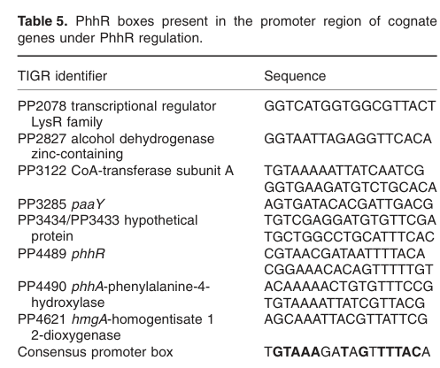

## Question

# Gene Research for Functional Annotation

## ⚠️ CRITICAL: Gene/Protein Identification Context

**BEFORE YOU BEGIN RESEARCH:** You MUST verify you are researching the CORRECT gene/protein. Gene symbols can be ambiguous, especially for less well-characterized genes from non-model organisms.

### Target Gene/Protein Identity (from UniProt):
- **UniProt Accession:** Q88E47
- **Protein Description:** RecName: Full=Homogentisate 1,2-dioxygenase {ECO:0000255|HAMAP-Rule:MF_00334}; Short=HGDO {ECO:0000255|HAMAP-Rule:MF_00334}; EC=1.13.11.5 {ECO:0000255|HAMAP-Rule:MF_00334}; AltName: Full=Homogentisate oxygenase {ECO:0000255|HAMAP-Rule:MF_00334}; AltName: Full=Homogentisic acid oxidase {ECO:0000255|HAMAP-Rule:MF_00334}; AltName: Full=Homogentisicase {ECO:0000255|HAMAP-Rule:MF_00334};
- **Gene Information:** Name=hmgA {ECO:0000255|HAMAP-Rule:MF_00334}; OrderedLocusNames=PP_4621;
- **Organism (full):** Pseudomonas putida (strain ATCC 47054 / DSM 6125 / CFBP 8728 / NCIMB 11950 / KT2440).
- **Protein Family:** Belongs to the homogentisate dioxygenase family.
- **Key Domains:** HgmA_C. (IPR046451); HgmA_N. (IPR046452); Homogentis_dOase. (IPR005708); Homogentis_dOase_bac. (IPR022950); RmlC-like_jellyroll. (IPR014710)

### MANDATORY VERIFICATION STEPS:

1. **Check if the gene symbol "hmgA" matches the protein description above**
2. **Verify the organism is correct:** Pseudomonas putida (strain ATCC 47054 / DSM 6125 / CFBP 8728 / NCIMB 11950 / KT2440).
3. **Check if protein family/domains align with what you find in literature**
4. **If you find literature for a DIFFERENT gene with the same or similar symbol, STOP**

### If Gene Symbol is Ambiguous or You Cannot Find Relevant Literature:

**DO NOT PROCEED WITH RESEARCH ON A DIFFERENT GENE.** Instead:
- State clearly: "The gene symbol 'hmgA' is ambiguous or literature is limited for this specific protein"
- Explain what you found (e.g., "Found extensive literature on a different gene with the same symbol in a different organism")
- Describe the protein based ONLY on the UniProt information provided above
- Suggest that the protein function can be inferred from domain/family information

### Research Target:

Please provide a comprehensive research report on the gene **hmgA** (gene ID: hmgA, UniProt: Q88E47) in PSEPK.

The research report should be a detailed narrative explaining the function, biological processes, and localization of the gene product. Citations should be given for all claims.

You should prioritize authoritative reviews and primary scientific literature when conducting research. You can supplement
this with annotations you find in gene/protein databases, but these can be outdated or inaccurate.

We are specifically interested in the primary function of the gene - for enzymes, what reaction is catalyzed, and what is the substrate specificity? For transporters, what is the substrate? For structural proteins or adapters, what is the broader structural role? For signaling molecules, what is the role in the pathway.

We are interested in where in or outside the cell the gene product carries out its function.

We are also interested in the signaling or biochemical pathways in which the gene functions. We are less interested in broad pleiotropic effects, except where these elucidate the precise role.

Include evidence where possible. We are interested in both experimental evidence as well as inference from structure, evolution, or bioinformatic analysis. Precise studies should be prioritized over high-throughput, where available.

## Output

Question: You are an expert researcher providing comprehensive, well-cited information.

Provide detailed information focusing on:
1. Key concepts and definitions with current understanding
2. Recent developments and latest research (prioritize 2023-2024 sources)
3. Current applications and real-world implementations
4. Expert opinions and analysis from authoritative sources
5. Relevant statistics and data from recent studies

Format as a comprehensive research report with proper citations. Include URLs and publication dates where available.
Always prioritize recent, authoritative sources and provide specific citations for all major claims.

# Gene Research for Functional Annotation

## ⚠️ CRITICAL: Gene/Protein Identification Context

**BEFORE YOU BEGIN RESEARCH:** You MUST verify you are researching the CORRECT gene/protein. Gene symbols can be ambiguous, especially for less well-characterized genes from non-model organisms.

### Target Gene/Protein Identity (from UniProt):
- **UniProt Accession:** Q88E47
- **Protein Description:** RecName: Full=Homogentisate 1,2-dioxygenase {ECO:0000255|HAMAP-Rule:MF_00334}; Short=HGDO {ECO:0000255|HAMAP-Rule:MF_00334}; EC=1.13.11.5 {ECO:0000255|HAMAP-Rule:MF_00334}; AltName: Full=Homogentisate oxygenase {ECO:0000255|HAMAP-Rule:MF_00334}; AltName: Full=Homogentisic acid oxidase {ECO:0000255|HAMAP-Rule:MF_00334}; AltName: Full=Homogentisicase {ECO:0000255|HAMAP-Rule:MF_00334};
- **Gene Information:** Name=hmgA {ECO:0000255|HAMAP-Rule:MF_00334}; OrderedLocusNames=PP_4621;
- **Organism (full):** Pseudomonas putida (strain ATCC 47054 / DSM 6125 / CFBP 8728 / NCIMB 11950 / KT2440).
- **Protein Family:** Belongs to the homogentisate dioxygenase family.
- **Key Domains:** HgmA_C. (IPR046451); HgmA_N. (IPR046452); Homogentis_dOase. (IPR005708); Homogentis_dOase_bac. (IPR022950); RmlC-like_jellyroll. (IPR014710)

### MANDATORY VERIFICATION STEPS:

1. **Check if the gene symbol "hmgA" matches the protein description above**
2. **Verify the organism is correct:** Pseudomonas putida (strain ATCC 47054 / DSM 6125 / CFBP 8728 / NCIMB 11950 / KT2440).
3. **Check if protein family/domains align with what you find in literature**
4. **If you find literature for a DIFFERENT gene with the same or similar symbol, STOP**

### If Gene Symbol is Ambiguous or You Cannot Find Relevant Literature:

**DO NOT PROCEED WITH RESEARCH ON A DIFFERENT GENE.** Instead:
- State clearly: "The gene symbol 'hmgA' is ambiguous or literature is limited for this specific protein"
- Explain what you found (e.g., "Found extensive literature on a different gene with the same symbol in a different organism")
- Describe the protein based ONLY on the UniProt information provided above
- Suggest that the protein function can be inferred from domain/family information

### Research Target:

Please provide a comprehensive research report on the gene **hmgA** (gene ID: hmgA, UniProt: Q88E47) in PSEPK.

The research report should be a detailed narrative explaining the function, biological processes, and localization of the gene product. Citations should be given for all claims.

You should prioritize authoritative reviews and primary scientific literature when conducting research. You can supplement
this with annotations you find in gene/protein databases, but these can be outdated or inaccurate.

We are specifically interested in the primary function of the gene - for enzymes, what reaction is catalyzed, and what is the substrate specificity? For transporters, what is the substrate? For structural proteins or adapters, what is the broader structural role? For signaling molecules, what is the role in the pathway.

We are interested in where in or outside the cell the gene product carries out its function.

We are also interested in the signaling or biochemical pathways in which the gene functions. We are less interested in broad pleiotropic effects, except where these elucidate the precise role.

Include evidence where possible. We are interested in both experimental evidence as well as inference from structure, evolution, or bioinformatic analysis. Precise studies should be prioritized over high-throughput, where available.

# Research Report: Functional Annotation of **hmgA** (UniProt **Q88E47**) in *Pseudomonas putida* KT2440 (PP_4621)

## 0) Target identity verification (critical)
The literature retrieved and analyzed here matches the requested UniProt target. In *Pseudomonas putida* strain KT2440, **PP_4621** is annotated as **hmgA**, encoding **homogentisate 1,2-dioxygenase** (HGDO; HmgA). This mapping is explicitly stated in the KT2440 phenylalanine regulon study (2010) and is consistent with the KT2440 genome-scale aromatic catabolism analysis (2002), which annotates an **hmgA** homolog (orf 01553; 433 aa) as **homogentisate dioxygenase** within the homogentisate gene cluster. (herrera2010identificationandcharacterization pages 4-5, jimenez2002genomicanalysisof pages 12-14)

## 1) Key concepts and definitions (current understanding)
### 1.1 Homogentisate pathway (central catabolic route)
The **homogentisate (HGA) pathway** is a conserved “central” route used by many bacteria to mineralize aromatic amino acids, particularly **phenylalanine and tyrosine**, by funneling them through **homogentisate** and then ring-cleaving homogentisate to yield metabolites that enter central metabolism. In KT2440, the pathway is reconstructed genomically as follows: phenylalanine → tyrosine (via PhhA/PhhB) and/or tyrosine → 4-hydroxyphenylpyruvate (via TyrB aminotransferases) → **homogentisate** (via **Hpd**, p-hydroxyphenylpyruvate dioxygenase) → ring-cleavage by **HmgA** and subsequent steps to yield **fumarate and acetoacetate**, which feed into the Krebs/TCA cycle. (jimenez2002genomicanalysisof pages 12-14, jimenez2002genomicanalysisof pages 14-15)

### 1.2 hmgA / Homogentisate 1,2-dioxygenase (EC 1.13.11.5)
**HmgA** (homogentisate 1,2-dioxygenase; HGDO; **EC 1.13.11.5**) catalyzes the oxidative ring cleavage of **homogentisic acid (homogentisate; HGA)** to form **maleylacetoacetate**. This reaction is explicitly described in a recent 2024 primary study (in *Burkholderia cenocepacia*), and the same product assignment is used in pathway reconstructions and gene-cluster assignments for KT2440. (moustafa2024mutationofhmga pages 1-2, jimenez2002genomicanalysisof pages 12-14)

### 1.3 Pyomelanin as a phenotype of homogentisate accumulation
When homogentisate is not efficiently metabolized (e.g., due to impaired HmgA activity), **HGA can accumulate and be excreted**, after which it **auto-oxidizes** and **polymerizes** into a brown melanin-like pigment called **pyomelanin**. The 2024 paper describes this chemistry (HGA → benzoquinoneacetic acid → polymer) and explicitly links it to the roles of **HppD** (HGA formation) and **HmgA** (HGA consumption). (moustafa2024mutationofhmga pages 1-2)

## 2) Molecular function: reaction, substrate specificity, and pathway placement
### 2.1 Reaction catalyzed and primary substrate
The primary substrate for HmgA is **homogentisate (homogentisic acid; HGA)**. HmgA catalyzes conversion of HGA to **maleylacetoacetate**. (moustafa2024mutationofhmga pages 1-2)

In KT2440, the broader pathway context is supported by gene neighborhood and functional assignments: **hmgA** co-occurs with genes annotated as **maleylacetoacetate isomerase (mai)** and **fumarylacetoacetate hydrolase (fah)**, which together convert homogentisate-derived intermediates ultimately to **fumarate and acetoacetate**. (jimenez2002genomicanalysisof pages 12-14)

### 2.2 Gene neighborhood/operon context in KT2440
A KT2440 genomic analysis reports a homogentisate cluster at ~**5241–5245 kb** with **hmgA, mai, fah**, plus a divergently transcribed regulator **hmgR** (IclR family). This supports that KT2440’s HmgA participates in a dedicated homogentisate ring-cleavage and assimilation module. (jimenez2002genomicanalysisof pages 12-14)

Separately, a KT2440 regulon study groups **PP4619–PP4621** as a phenylalanine/PhhR responsive unit and annotates **PP4621** as **hmgA (homogentisate 1,2-dioxygenase)**. (herrera2010identificationandcharacterization pages 2-4, herrera2010identificationandcharacterization pages 4-5)

### 2.3 Regulation in KT2440: the PhhR regulon (expert/authoritative evidence)
Herrera et al. characterized the **PhhR regulon** in KT2440 and explicitly reports a **PhhR binding “box”** upstream of **PP4621 (hmgA)** (Table 5), indicating potential direct regulation by PhhR. (herrera2010identificationandcharacterization pages 6-8, herrera2010identificationandcharacterization media dd6b94f5)

They further support direct regulation using **electrophoretic mobility shift assays (EMSA)**, showing that PhhR binds (retards) promoter DNA fragments that contain PhhR boxes (Figure 2). This provides experimental evidence (beyond annotation) that **hmgA is integrated into phenylalanine-responsive transcriptional control** in KT2440. (herrera2010identificationandcharacterization pages 6-8, herrera2010identificationandcharacterization media 667b7d58)

## 3) Biological processes and cellular localization
### 3.1 Biological process assignment
The strongest supported process assignment for hmgA (PP_4621) in KT2440 is **aromatic amino-acid catabolism**, specifically the **homogentisate central pathway** downstream of phenylalanine/tyrosine conversion, feeding products into central metabolism as fumarate and acetoacetate. (jimenez2002genomicanalysisof pages 12-14, herrera2010identificationandcharacterization pages 4-5)

### 3.2 Cellular localization (what can and cannot be supported from retrieved sources)
No retrieved KT2440 primary source contained a direct subcellular localization experiment (e.g., fractionation, fluorescence tagging). However, the gene’s placement in an intracellular catabolic pathway (with isomerase/hydrolase steps to central metabolites) and its regulation as part of phenylalanine-responsive metabolism strongly supports an **intracellular (cytosolic) metabolic enzyme role** rather than a secreted or membrane-embedded function. This remains an inference from pathway context rather than direct localization measurement in the retrieved evidence. (jimenez2002genomicanalysisof pages 12-14, herrera2010identificationandcharacterization pages 4-5)

## 4) Recent developments and latest research (prioritizing 2023–2024)
### 4.1 2024: mechanistic linkage of HmgA to pyomelanin production
A 2024 *Microbiology Spectrum* study uses allelic exchange in *Burkholderia cenocepacia* to show that changes in **HmgA** sequence can switch pigmentation phenotypes, and it clearly defines the biochemical logic: **HmgA converts HGA to maleylacetoacetate; if HGA accumulates, it is excreted and polymerizes to pyomelanin**. While not performed in KT2440, this is current, high-confidence experimental evidence reinforcing the conserved biochemical function of bacterial HmgA and its phenotypic signature when perturbed. (Published 29 May 2024; https://doi.org/10.1128/spectrum.00410-24) (moustafa2024mutationofhmga pages 1-2)

### 4.2 2024: hmgA as an ecological/engineering marker in bioremediation consortia
A 2024 *AMB Express* study performing meta-omics on a diesel-degrading consortium reports **high abundance of aromatic catabolic genes** and explicitly notes detection of multiple copies of **hmgA** (homogentisate 1,2-dioxygenase), reporting **24 copies** in the consortium. This positions hmgA as part of the functional gene repertoire commonly enriched in complex pollutant-degradation settings, consistent with its role in aromatic compound breakdown funnels. (Published 2024; https://doi.org/10.1186/s13568-024-01764-7) (pandolfo2024metagenomicanalysesof pages 9-13)

## 5) Current applications and real-world implementations
### 5.1 Bioremediation of hydrocarbon-contaminated soils
The 2024 consortium study reports that its use in polluted soil (at microcosm and mesocosm scales, reported elsewhere by the authors) **reduced hydrocarbon concentration by 34% after 90 days** and increased soil respiration and enzymatic activity, consistent with restoration of biological function. While this is not a single-gene intervention, it demonstrates real-world implementation where **aromatic catabolic routes (including homogentisate pathway genes such as hmgA) are present and active** in bioremediation consortia. (pandolfo2024metagenomicanalysesof pages 9-13)

### 5.2 Functional annotation in metabolic engineering and systems biology (KT2440 as chassis)
KT2440 is widely used as a model for aromatic metabolism and as an industrial/biotechnology chassis. The 2002 genome-based reconstruction explicitly maps the homogentisate pathway genes (including hmgA with mai/fah and regulator hmgR) as part of KT2440’s aromatic catabolic capacity, providing a foundational systems-level map used for subsequent engineering and functional annotation. (Dec 2002; https://doi.org/10.1046/j.1462-2920.2002.00370.x) (jimenez2002genomicanalysisof pages 12-14)

## 6) Quantitative/statistical data points from recent and authoritative studies
* **KT2440 PhhR regulon microarray design**: phenylalanine induction experiments used **5 mM phenylalanine for 15 min**, with microarray analyses across **three independent experiments** and significance cutoff **≥1.8-fold, P ≤ 0.05**; PP4621/hmgA appears among phenylalanine/PhhR-responsive genes. (Jun 2010; https://doi.org/10.1111/j.1462-2920.2009.02124.x) (herrera2010identificationandcharacterization pages 2-4)
* **Direct PhhR binding evidence**: EMSA conditions used **2 μM PhhR** (as reported in the text surrounding Fig. 2) and showed promoter binding/retardation for targets with PhhR boxes, supporting direct regulation of promoters including hmgA’s. (herrera2010identificationandcharacterization pages 6-8, herrera2010identificationandcharacterization media 667b7d58)
* **Bioremediation consortium performance**: **34% hydrocarbon reduction** after **90 days** in soil treatment (consortium-level), with gene-level observation of **24 copies of hmgA** in metagenomes. (Sep 2024; https://doi.org/10.1186/s13568-024-01764-7) (pandolfo2024metagenomicanalysesof pages 9-13)

## 7) Evidence summary table (KT2440-focused)
The following table consolidates KT2440-specific and cross-organism evidence supporting the functional annotation of UniProt Q88E47 / PP_4621.

| Item | Key findings | Source (year and URL) |
|---|---|---|
| Identity | UniProt Q88E47 corresponds to **hmgA / PP_4621** in *Pseudomonas putida* KT2440; annotated as **homogentisate 1,2-dioxygenase**. In KT2440 genomic analyses, the cognate ORF is listed as **orf 01553**, encoding a **433 aa** HmgA homolog; later regulatory work maps this function to **PP4621 hmgA** in the KT2440 annotation set (jimenez2002genomicanalysisof pages 12-14, herrera2010identificationandcharacterization pages 4-5). | Jiménez et al., 2002, *Environmental Microbiology*. https://doi.org/10.1046/j.1462-2920.2002.00370.x ; Herrera et al., 2010, *Environmental Microbiology*. https://doi.org/10.1111/j.1462-2920.2009.02124.x |
| Enzyme name/EC | The gene product is **homogentisate 1,2-dioxygenase / homogentisate dioxygenase (HmgA; HGDO)**. A recent primary paper explicitly states that **HmgA is EC 1.13.11.5** and catalyzes conversion of homogentisic acid (HGA) onward in the pathway (moustafa2024mutationofhmga pages 1-2). | Moustafa et al., 2024, *Microbiology Spectrum*. https://doi.org/10.1128/spectrum.00410-24 ; Herrera et al., 2010. https://doi.org/10.1111/j.1462-2920.2009.02124.x |
| Reaction/product | HmgA converts **homogentisic acid (homogentisate, HGA)** to **maleylacetoacetate**; in KT2440 the downstream **mai** and **fah** genes encode **maleylacetoacetate isomerase** and **fumarylacetoacetate hydrolase**, completing conversion of homogentisate into **fumarate + acetoacetate** (moustafa2024mutationofhmga pages 1-2, jimenez2002genomicanalysisof pages 12-14). | Moustafa et al., 2024. https://doi.org/10.1128/spectrum.00410-24 ; Jiménez et al., 2002. https://doi.org/10.1046/j.1462-2920.2002.00370.x |
| Pathway role | In KT2440, hmgA functions in the **homogentisate central pathway** for aromatic amino-acid degradation. The pathway receives carbon from **L-phenylalanine/L-tyrosine** via **PhhA/PhhB**, aminotransferases (**TyrB1/TyrB2**), and **Hpd** (4-hydroxyphenylpyruvate dioxygenase), then channels products into central metabolism as **fumarate and acetoacetate/Krebs cycle intermediates** (jimenez2002genomicanalysisof pages 12-14, herrera2010identificationandcharacterization pages 4-5, jimenez2002genomicanalysisof pages 14-15). | Jiménez et al., 2002. https://doi.org/10.1046/j.1462-2920.2002.00370.x ; Herrera et al., 2010. https://doi.org/10.1111/j.1462-2920.2009.02124.x |
| Gene neighborhood/operon | KT2440 carries an **hmg gene cluster** around **5241–5245 kb** containing **hmgR-hmgA-fah-mai** in one annotation scheme; regulatory/microarray work places **PP4619-PP4621 (hmgABC)** together, with **PP4619 = maleylacetoacetate isomerase putative**, **PP4620 = fumarylacetoacetase**, **PP4621 = hmgA**. Thus hmgA lies in the homogentisate catabolic neighborhood with the immediate downstream chemistry of the same route (jimenez2002genomicanalysisof pages 12-14, herrera2010identificationandcharacterization pages 4-5, herrera2010identificationandcharacterization pages 2-4). | Jiménez et al., 2002. https://doi.org/10.1046/j.1462-2920.2002.00370.x ; Herrera et al., 2010. https://doi.org/10.1111/j.1462-2920.2009.02124.x |
| Regulation (PhhR) | **PhhR** regulates the phenylalanine-responsive network including **hmgA**. A **PhhR box** was identified upstream of **PP4621 hmgA**, and **EMSA** showed that purified PhhR specifically retarded target promoter DNA containing such boxes. hmgA was also selected in promoter-fusion studies as a gene induced by **PhhR in a phenylalanine-dependent manner** (herrera2010identificationandcharacterization pages 6-8, herrera2010identificationandcharacterization pages 4-5, herrera2010identificationandcharacterization media dd6b94f5, herrera2010identificationandcharacterization media 667b7d58). | Herrera et al., 2010. https://doi.org/10.1111/j.1462-2920.2009.02124.x |
| Phenotype when defective (pyomelanin) | Direct KT2440 hmgA knockout phenotypes were not provided in the extracted KT2440 evidence, but multiple primary studies on homologous bacterial pathways show that **loss of HmgA causes HGA accumulation**, extracellular oxidation/polymerization, and **brown/pyomelanin-like pigmentation**. In related systems, hmgA mutants fail to consume pathway substrates and become brown/yellow-brown; in *Burkholderia cenocepacia*, HmgA sequence variation alters pigmentation because HGA is no longer efficiently cleared (donoso2021identificationofa pages 2-4, moustafa2024mutationofhmga pages 1-2, donoso2021identificationofa pages 4-5, donoso2021identificationofa pages 15-16). These reports strongly support the same expected biochemical consequence for KT2440 if HmgA activity is lost. | Donoso et al., 2021, *Microbial Biotechnology*. https://doi.org/10.1111/1751-7915.13865 ; Moustafa et al., 2024. https://doi.org/10.1128/spectrum.00410-24 |
| Localization | No direct localization experiment for KT2440 HmgA was present in the provided evidence. Because HmgA is described as a soluble metabolic enzyme in the **intracellular homogentisate pathway** and is genetically linked to other central catabolic enzymes rather than secretion/transport components, the best supported annotation from available evidence is **cytosolic/intracellular** localization by pathway context, not direct experiment (jimenez2002genomicanalysisof pages 12-14, herrera2010identificationandcharacterization pages 4-5). | Jiménez et al., 2002. https://doi.org/10.1046/j.1462-2920.2002.00370.x ; Herrera et al., 2010. https://doi.org/10.1111/j.1462-2920.2009.02124.x |
| Evidence type (experimental vs bioinformatic) | **Bioinformatic evidence:** conserved homology, gene-cluster organization, and pathway reconstruction identify HmgA/PP_4621 as homogentisate dioxygenase in KT2440 (jimenez2002genomicanalysisof pages 12-14). **Experimental evidence in KT2440:** phenylalanine induction microarrays, promoter studies, upstream PhhR-box detection, and **EMSA** support pathway/regulatory placement of hmgA (herrera2010identificationandcharacterization pages 6-8, herrera2010identificationandcharacterization pages 4-5, herrera2010identificationandcharacterization pages 2-4). **Experimental evidence in related bacteria:** hmgA disruption causes HGA accumulation and pyomelanin formation, validating conserved biochemical function (donoso2021identificationofa pages 2-4, moustafa2024mutationofhmga pages 1-2, donoso2021identificationofa pages 4-5, donoso2021identificationofa pages 15-16). | Jiménez et al., 2002. https://doi.org/10.1046/j.1462-2920.2002.00370.x ; Herrera et al., 2010. https://doi.org/10.1111/j.1462-2920.2009.02124.x ; Donoso et al., 2021. https://doi.org/10.1111/1751-7915.13865 ; Moustafa et al., 2024. https://doi.org/10.1128/spectrum.00410-24 |
| Key quantitative data | Quantitative values directly relevant to KT2440 regulation include: **PP4621/hmgA microarray signal = 2.1 and -2.7** in the reported comparison table, consistent with PhhR/phenylalanine-responsive regulation; the PhhR-box search scanned **500 nt upstream** of genes; EMSA used **2 mM PhhR** and retarded all tested target DNAs with PhhR boxes; phenylalanine induction experiments used **5 mM phenylalanine for 15 min**, with microarrays from **3 independent experiments** and significance cutoff **1.8-fold, P ≤ 0.05** (herrera2010identificationandcharacterization pages 4-5, herrera2010identificationandcharacterization pages 2-4, herrera2010identificationandcharacterization pages 6-8). Broader ecological context: a 2024 hydrocarbon-bioremediation consortium detected **24 copies of hmgA** in metagenomic analysis, underscoring prevalence of this function in aromatic catabolism, though not specific to KT2440 (pandolfo2024metagenomicanalysesof pages 9-13). | Herrera et al., 2010. https://doi.org/10.1111/j.1462-2920.2009.02124.x ; Pandolfo et al., 2024, *AMB Express*. https://doi.org/10.1186/s13568-024-01764-7 |

*Table: This table condenses the strongest available evidence for functional annotation of *Pseudomonas putida* KT2440 hmgA/PP_4621 (UniProt Q88E47), including pathway role, regulation, phenotype, and evidence strength. It is useful as a citable summary for narrative annotation and database-quality gene-function reporting.*

## 8) Visual evidence (direct regulatory support)
* **PhhR box upstream of PP4621 (hmgA)** is shown in Herrera et al. Table 5, supporting assignment of hmgA as a direct target in the phenylalanine-responsive regulon. (herrera2010identificationandcharacterization media dd6b94f5)
* **EMSA (Figure 2)** demonstrates direct DNA-binding of PhhR to promoter fragments containing PhhR boxes, supporting direct regulation of targets such as hmgA. (herrera2010identificationandcharacterization media 667b7d58)

## 9) Limitations and gaps
* **Subcellular localization** of KT2440 HmgA was not directly measured in the retrieved sources; localization here is inferred from metabolic pathway context. (jimenez2002genomicanalysisof pages 12-14, herrera2010identificationandcharacterization pages 4-5)
* **Kinetic parameters and cofactor/metal requirements** specific to KT2440 HmgA were not found in the retrieved sources; the catalytic reaction and pathway placement are well supported, but quantitative enzymology (kcat/KM, metal dependence) would require additional dedicated biochemical studies not captured in this retrieval set. (moustafa2024mutationofhmga pages 1-2, jimenez2002genomicanalysisof pages 12-14)

## Key references (with publication dates and URLs)
* Jiménez JI, Miñambres B, García JL, Díaz E. **Genomic analysis of the aromatic catabolic pathways from *Pseudomonas putida* KT2440.** *Environmental Microbiology.* **Dec 2002.** https://doi.org/10.1046/j.1462-2920.2002.00370.x (jimenez2002genomicanalysisof pages 12-14)
* Herrera MC, Duque E, Rodríguez-Herva JJ, Fernández-Escamilla AM, Ramos JL. **Identification and characterization of the PhhR regulon in *Pseudomonas putida*.** *Environmental Microbiology.* **Jun 2010.** https://doi.org/10.1111/j.1462-2920.2009.02124.x (herrera2010identificationandcharacterization pages 6-8)
* Moustafa DA, Wu L, Ivey M, Fankhauser SC, Goldberg JB. **Mutation of hmgA… is responsible for pyomelanin production…** *Microbiology Spectrum.* **Published 29 May 2024.** https://doi.org/10.1128/spectrum.00410-24 (moustafa2024mutationofhmga pages 1-2)
* Pandolfo E et al. **Metagenomic analyses of a consortium for the bioremediation of hydrocarbons polluted soils.** *AMB Express.* **Sep 2024.** https://doi.org/10.1186/s13568-024-01764-7 (pandolfo2024metagenomicanalysesof pages 9-13)

References

1. (herrera2010identificationandcharacterization pages 4-5): M. Carmen Herrera, Estrella Duque, José J. Rodríguez‐Herva, Ana M. Fernández‐Escamilla, and Juan L. Ramos. Identification and characterization of the phhr regulon in pseudomonas putida. Environmental microbiology, 12 6:1427-38, Jun 2010. URL: https://doi.org/10.1111/j.1462-2920.2009.02124.x, doi:10.1111/j.1462-2920.2009.02124.x. This article has 43 citations and is from a domain leading peer-reviewed journal.

2. (jimenez2002genomicanalysisof pages 12-14): José Ignacio Jiménez, Baltasar Miñambres, José Luis García, and Eduardo Díaz. Genomic analysis of the aromatic catabolic pathways from pseudomonas putida kt2440. Environmental microbiology, 4 12:824-41, Dec 2002. URL: https://doi.org/10.1046/j.1462-2920.2002.00370.x, doi:10.1046/j.1462-2920.2002.00370.x. This article has 698 citations and is from a domain leading peer-reviewed journal.

3. (jimenez2002genomicanalysisof pages 14-15): José Ignacio Jiménez, Baltasar Miñambres, José Luis García, and Eduardo Díaz. Genomic analysis of the aromatic catabolic pathways from pseudomonas putida kt2440. Environmental microbiology, 4 12:824-41, Dec 2002. URL: https://doi.org/10.1046/j.1462-2920.2002.00370.x, doi:10.1046/j.1462-2920.2002.00370.x. This article has 698 citations and is from a domain leading peer-reviewed journal.

4. (moustafa2024mutationofhmga pages 1-2): Dina A. Moustafa, Linda Wu, Melissa Ivey, Sarah C. Fankhauser, and Joanna B. Goldberg. Mutation of <i>hmga</i> , encoding homogentisate 1,2-dioxygenase, is responsible for pyomelanin production but does not impact the virulence of <i>burkholderia cenocepacia</i> in a chronic granulomatous disease mouse lung infection. Jul 2024. URL: https://doi.org/10.1128/spectrum.00410-24, doi:10.1128/spectrum.00410-24. This article has 1 citations and is from a domain leading peer-reviewed journal.

5. (herrera2010identificationandcharacterization pages 2-4): M. Carmen Herrera, Estrella Duque, José J. Rodríguez‐Herva, Ana M. Fernández‐Escamilla, and Juan L. Ramos. Identification and characterization of the phhr regulon in pseudomonas putida. Environmental microbiology, 12 6:1427-38, Jun 2010. URL: https://doi.org/10.1111/j.1462-2920.2009.02124.x, doi:10.1111/j.1462-2920.2009.02124.x. This article has 43 citations and is from a domain leading peer-reviewed journal.

6. (herrera2010identificationandcharacterization pages 6-8): M. Carmen Herrera, Estrella Duque, José J. Rodríguez‐Herva, Ana M. Fernández‐Escamilla, and Juan L. Ramos. Identification and characterization of the phhr regulon in pseudomonas putida. Environmental microbiology, 12 6:1427-38, Jun 2010. URL: https://doi.org/10.1111/j.1462-2920.2009.02124.x, doi:10.1111/j.1462-2920.2009.02124.x. This article has 43 citations and is from a domain leading peer-reviewed journal.

7. (herrera2010identificationandcharacterization media dd6b94f5): M. Carmen Herrera, Estrella Duque, José J. Rodríguez‐Herva, Ana M. Fernández‐Escamilla, and Juan L. Ramos. Identification and characterization of the phhr regulon in pseudomonas putida. Environmental microbiology, 12 6:1427-38, Jun 2010. URL: https://doi.org/10.1111/j.1462-2920.2009.02124.x, doi:10.1111/j.1462-2920.2009.02124.x. This article has 43 citations and is from a domain leading peer-reviewed journal.

8. (herrera2010identificationandcharacterization media 667b7d58): M. Carmen Herrera, Estrella Duque, José J. Rodríguez‐Herva, Ana M. Fernández‐Escamilla, and Juan L. Ramos. Identification and characterization of the phhr regulon in pseudomonas putida. Environmental microbiology, 12 6:1427-38, Jun 2010. URL: https://doi.org/10.1111/j.1462-2920.2009.02124.x, doi:10.1111/j.1462-2920.2009.02124.x. This article has 43 citations and is from a domain leading peer-reviewed journal.

9. (pandolfo2024metagenomicanalysesof pages 9-13): Emiliana Pandolfo, David Durán-Wendt, Ruben Martínez-Cuesta, Mónica Montoya, Laura Carrera-Ruiz, David Vazquez-Arias, Esther Blanco-Romero, Daniel Garrido-Sanz, Miguel Redondo-Nieto, Marta Martin, and Rafael Rivilla. Metagenomic analyses of a consortium for the bioremediation of hydrocarbons polluted soils. AMB Express, Sep 2024. URL: https://doi.org/10.1186/s13568-024-01764-7, doi:10.1186/s13568-024-01764-7. This article has 14 citations and is from a peer-reviewed journal.

10. (donoso2021identificationofa pages 2-4): Raúl A. Donoso, Daniela Ruiz, Carla Gárate‐Castro, Pamela Villegas, José Eduardo González‐Pastor, Víctor de Lorenzo, Bernardo González, and Danilo Pérez‐Pantoja. Identification of a self‐sufficient cytochrome p450 monooxygenase from cupriavidus pinatubonensis jmp134 involved in 2‐hydroxyphenylacetic acid catabolism, via homogentisate pathway. Microbial Biotechnology, 14:1944-1960, Jun 2021. URL: https://doi.org/10.1111/1751-7915.13865, doi:10.1111/1751-7915.13865. This article has 13 citations and is from a peer-reviewed journal.

11. (donoso2021identificationofa pages 4-5): Raúl A. Donoso, Daniela Ruiz, Carla Gárate‐Castro, Pamela Villegas, José Eduardo González‐Pastor, Víctor de Lorenzo, Bernardo González, and Danilo Pérez‐Pantoja. Identification of a self‐sufficient cytochrome p450 monooxygenase from cupriavidus pinatubonensis jmp134 involved in 2‐hydroxyphenylacetic acid catabolism, via homogentisate pathway. Microbial Biotechnology, 14:1944-1960, Jun 2021. URL: https://doi.org/10.1111/1751-7915.13865, doi:10.1111/1751-7915.13865. This article has 13 citations and is from a peer-reviewed journal.

12. (donoso2021identificationofa pages 15-16): Raúl A. Donoso, Daniela Ruiz, Carla Gárate‐Castro, Pamela Villegas, José Eduardo González‐Pastor, Víctor de Lorenzo, Bernardo González, and Danilo Pérez‐Pantoja. Identification of a self‐sufficient cytochrome p450 monooxygenase from cupriavidus pinatubonensis jmp134 involved in 2‐hydroxyphenylacetic acid catabolism, via homogentisate pathway. Microbial Biotechnology, 14:1944-1960, Jun 2021. URL: https://doi.org/10.1111/1751-7915.13865, doi:10.1111/1751-7915.13865. This article has 13 citations and is from a peer-reviewed journal.

## Artifacts

- [Edison artifact artifact-00](hmgA-deep-research-falcon_artifacts/artifact-00.md)

## Citations

1. moustafa2024mutationofhmga pages 1-2
2. jimenez2002genomicanalysisof pages 12-14
3. pandolfo2024metagenomicanalysesof pages 9-13
4. herrera2010identificationandcharacterization pages 2-4
5. herrera2010identificationandcharacterization pages 6-8
6. herrera2010identificationandcharacterization pages 4-5
7. jimenez2002genomicanalysisof pages 14-15
8. donoso2021identificationofa pages 2-4
9. donoso2021identificationofa pages 4-5
10. donoso2021identificationofa pages 15-16
11. https://doi.org/10.1128/spectrum.00410-24
12. https://doi.org/10.1186/s13568-024-01764-7
13. https://doi.org/10.1046/j.1462-2920.2002.00370.x
14. https://doi.org/10.1111/j.1462-2920.2009.02124.x
15. https://doi.org/10.1111/1751-7915.13865
16. https://doi.org/10.1111/j.1462-2920.2009.02124.x,
17. https://doi.org/10.1046/j.1462-2920.2002.00370.x,
18. https://doi.org/10.1128/spectrum.00410-24,
19. https://doi.org/10.1186/s13568-024-01764-7,
20. https://doi.org/10.1111/1751-7915.13865,