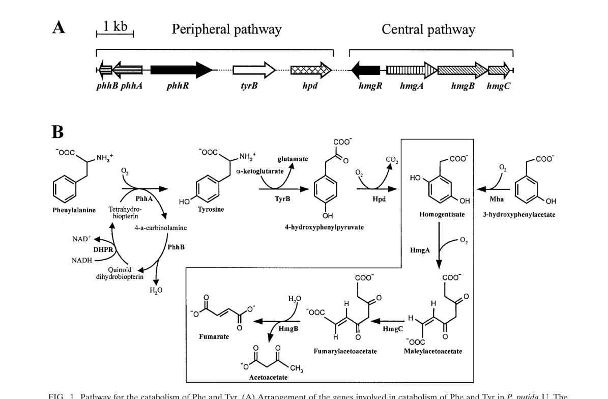

## Question

# Gene Research for Functional Annotation

## ⚠️ CRITICAL: Gene/Protein Identification Context

**BEFORE YOU BEGIN RESEARCH:** You MUST verify you are researching the CORRECT gene/protein. Gene symbols can be ambiguous, especially for less well-characterized genes from non-model organisms.

### Target Gene/Protein Identity (from UniProt):
- **UniProt Accession:** Q88HC7
- **Protein Description:** SubName: Full=4-hydroxyphenylpyruvate dioxygenase {ECO:0000313|EMBL:AAN69035.1}; EC=1.13.11.27 {ECO:0000313|EMBL:AAN69035.1};
- **Gene Information:** Name=hpd {ECO:0000313|EMBL:AAN69035.1}; OrderedLocusNames=PP_3433 {ECO:0000313|EMBL:AAN69035.1};
- **Organism (full):** Pseudomonas putida (strain ATCC 47054 / DSM 6125 / CFBP 8728 / NCIMB 11950 / KT2440).
- **Protein Family:** Belongs to the 4HPPD family.
- **Key Domains:** 4OHPhenylPyrv_dOase. (IPR005956); 4OHPhenylPyrv_dOase_C. (IPR041735); 4OHPhenylPyrv_dOase_N. (IPR041736); Glyas_Bleomycin-R_OHBP_Dase. (IPR029068); Glyas_Fos-R_dOase_dom. (IPR004360)

### MANDATORY VERIFICATION STEPS:

1. **Check if the gene symbol "hpd" matches the protein description above**
2. **Verify the organism is correct:** Pseudomonas putida (strain ATCC 47054 / DSM 6125 / CFBP 8728 / NCIMB 11950 / KT2440).
3. **Check if protein family/domains align with what you find in literature**
4. **If you find literature for a DIFFERENT gene with the same or similar symbol, STOP**

### If Gene Symbol is Ambiguous or You Cannot Find Relevant Literature:

**DO NOT PROCEED WITH RESEARCH ON A DIFFERENT GENE.** Instead:
- State clearly: "The gene symbol 'hpd' is ambiguous or literature is limited for this specific protein"
- Explain what you found (e.g., "Found extensive literature on a different gene with the same symbol in a different organism")
- Describe the protein based ONLY on the UniProt information provided above
- Suggest that the protein function can be inferred from domain/family information

### Research Target:

Please provide a comprehensive research report on the gene **hpd** (gene ID: hpd, UniProt: Q88HC7) in PSEPK.

The research report should be a detailed narrative explaining the function, biological processes, and localization of the gene product. Citations should be given for all claims.

You should prioritize authoritative reviews and primary scientific literature when conducting research. You can supplement
this with annotations you find in gene/protein databases, but these can be outdated or inaccurate.

We are specifically interested in the primary function of the gene - for enzymes, what reaction is catalyzed, and what is the substrate specificity? For transporters, what is the substrate? For structural proteins or adapters, what is the broader structural role? For signaling molecules, what is the role in the pathway.

We are interested in where in or outside the cell the gene product carries out its function.

We are also interested in the signaling or biochemical pathways in which the gene functions. We are less interested in broad pleiotropic effects, except where these elucidate the precise role.

Include evidence where possible. We are interested in both experimental evidence as well as inference from structure, evolution, or bioinformatic analysis. Precise studies should be prioritized over high-throughput, where available.

## Output

Question: You are an expert researcher providing comprehensive, well-cited information.

Provide detailed information focusing on:
1. Key concepts and definitions with current understanding
2. Recent developments and latest research (prioritize 2023-2024 sources)
3. Current applications and real-world implementations
4. Expert opinions and analysis from authoritative sources
5. Relevant statistics and data from recent studies

Format as a comprehensive research report with proper citations. Include URLs and publication dates where available.
Always prioritize recent, authoritative sources and provide specific citations for all major claims.

# Gene Research for Functional Annotation

## ⚠️ CRITICAL: Gene/Protein Identification Context

**BEFORE YOU BEGIN RESEARCH:** You MUST verify you are researching the CORRECT gene/protein. Gene symbols can be ambiguous, especially for less well-characterized genes from non-model organisms.

### Target Gene/Protein Identity (from UniProt):
- **UniProt Accession:** Q88HC7
- **Protein Description:** SubName: Full=4-hydroxyphenylpyruvate dioxygenase {ECO:0000313|EMBL:AAN69035.1}; EC=1.13.11.27 {ECO:0000313|EMBL:AAN69035.1};
- **Gene Information:** Name=hpd {ECO:0000313|EMBL:AAN69035.1}; OrderedLocusNames=PP_3433 {ECO:0000313|EMBL:AAN69035.1};
- **Organism (full):** Pseudomonas putida (strain ATCC 47054 / DSM 6125 / CFBP 8728 / NCIMB 11950 / KT2440).
- **Protein Family:** Belongs to the 4HPPD family.
- **Key Domains:** 4OHPhenylPyrv_dOase. (IPR005956); 4OHPhenylPyrv_dOase_C. (IPR041735); 4OHPhenylPyrv_dOase_N. (IPR041736); Glyas_Bleomycin-R_OHBP_Dase. (IPR029068); Glyas_Fos-R_dOase_dom. (IPR004360)

### MANDATORY VERIFICATION STEPS:

1. **Check if the gene symbol "hpd" matches the protein description above**
2. **Verify the organism is correct:** Pseudomonas putida (strain ATCC 47054 / DSM 6125 / CFBP 8728 / NCIMB 11950 / KT2440).
3. **Check if protein family/domains align with what you find in literature**
4. **If you find literature for a DIFFERENT gene with the same or similar symbol, STOP**

### If Gene Symbol is Ambiguous or You Cannot Find Relevant Literature:

**DO NOT PROCEED WITH RESEARCH ON A DIFFERENT GENE.** Instead:
- State clearly: "The gene symbol 'hpd' is ambiguous or literature is limited for this specific protein"
- Explain what you found (e.g., "Found extensive literature on a different gene with the same symbol in a different organism")
- Describe the protein based ONLY on the UniProt information provided above
- Suggest that the protein function can be inferred from domain/family information

### Research Target:

Please provide a comprehensive research report on the gene **hpd** (gene ID: hpd, UniProt: Q88HC7) in PSEPK.

The research report should be a detailed narrative explaining the function, biological processes, and localization of the gene product. Citations should be given for all claims.

You should prioritize authoritative reviews and primary scientific literature when conducting research. You can supplement
this with annotations you find in gene/protein databases, but these can be outdated or inaccurate.

We are specifically interested in the primary function of the gene - for enzymes, what reaction is catalyzed, and what is the substrate specificity? For transporters, what is the substrate? For structural proteins or adapters, what is the broader structural role? For signaling molecules, what is the role in the pathway.

We are interested in where in or outside the cell the gene product carries out its function.

We are also interested in the signaling or biochemical pathways in which the gene functions. We are less interested in broad pleiotropic effects, except where these elucidate the precise role.

Include evidence where possible. We are interested in both experimental evidence as well as inference from structure, evolution, or bioinformatic analysis. Precise studies should be prioritized over high-throughput, where available.

# Research Report: Functional Annotation of **hpd (PP_3433; UniProt Q88HC7)** in *Pseudomonas putida* KT2440

## 1. Target verification (critical disambiguation)
The UniProt target **Q88HC7** corresponds to **hpd / PP_3433** in *Pseudomonas putida* KT2440 and is annotated as **4-hydroxyphenylpyruvate dioxygenase** (HPPD; **EC 1.13.11.27**). Independent KT2440-focused sources explicitly identify **hpd** as an HPPD-family enzyme acting in aromatic amino-acid catabolism (tyrosine/phenylalanine → homogentisate), including genome-based pathway analysis and pathway-specific genetic studies. (jimenez2002genomicanalysisof pages 12-14, ariasbarrau2004thehomogentisatepathway pages 1-2)

Early KT2440 genome annotation also identifies the **hpd** product as a ~**358 aa** protein (ORF03099) with high similarity to other bacterial HPPDs, supporting that the retrieved literature is about the correct protein family (4HPPD/HPPD family) and not an unrelated “hpd” symbol in a different pathway/organism. (jimenez2002genomicanalysisof pages 12-14)

## 2. Key concepts and definitions (current understanding)

### 2.1 Enzyme definition and primary reaction
**4-hydroxyphenylpyruvate dioxygenase (HPPD/Hpd)** catalyzes the oxidative transformation of **4-hydroxyphenylpyruvate (4-HPP)** to **homogentisate (HGA)**. This step links peripheral tyrosine/phenylalanine transformations to the **homogentisate central pathway**. (ariasbarrau2004thehomogentisatepathway pages 1-2, neuckermans2019arobustbacterial pages 1-2)

In *P. putida*, this function is specifically attributed to **hpd (PP_3433)**, with pathway schematics showing Hpd acting upstream of homogentisate ring-cleavage and downstream β-ketoacid steps. (ariasbarrau2004thehomogentisatepathway media 6c561743)

### 2.2 Enzyme class, cofactors, and catalytic mechanism
HPPD is a **non-heme Fe(II)-dependent oxygenase**. Structural/mechanistic literature describes a conserved active-site metal-binding motif with **two histidines and one glutamate** coordinating Fe(II), and an oxidative chemistry that couples **O2 activation**, **oxidative decarboxylation**, **aromatic hydroxylation**, and an unusual **1,2 side-chain migration** to yield homogentisate. (santucci20174hydroxyphenylpyruvatedioxygenaseand pages 6-7, santucci20174hydroxyphenylpyruvatedioxygenaseand pages 7-8)

Although these mechanistic studies focus heavily on plant/animal enzymes, the same catalytic logic and cofactor requirements apply broadly across HPPD homologs (including bacteria) and support functional inference for *P. putida* Hpd. (santucci20174hydroxyphenylpyruvatedioxygenaseand pages 2-3, trezza2024molecularandevolution pages 1-2)

### 2.3 Pathway context in *Pseudomonas*: homogentisate as a convergent node
In *P. putida*, the **homogentisate pathway** is described as a central catabolic route for degradation of **L-tyrosine**, **L-phenylalanine**, and related aromatics, converging on homogentisate and yielding central metabolites (e.g., **fumarate and acetoacetate**) via downstream enzymes (HmgA/HmgC/HmgB). (ariasbarrau2004thehomogentisatepathway pages 1-2, ariasbarrau2004thehomogentisatepathway pages 5-6)

A pathway figure from Arias-Barrau et al. shows (i) the genetic organization of peripheral/central modules and (ii) the biochemical steps with Hpd converting 4-HPP to homogentisate, which then enters the boxed “central” homogentisate pathway. (ariasbarrau2004thehomogentisatepathway media 6c561743)

## 3. *P. putida* KT2440-specific functional evidence

### 3.1 Genomic context supports pathway assignment
In KT2440 genome reconstructions, **hpd** is colocated in a broader aromatic catabolic region that includes genes for homogentisate processing (e.g., **hmgA**) and downstream steps (e.g., maleylacetoacetate isomerase, fumarylacetoacetate hydrolase family enzymes), consistent with the role of hpd as a gateway into homogentisate metabolism. (jimenez2002genomicanalysisof pages 12-14)

### 3.2 Proteomics: induction during aromatic amino-acid catabolism
Proteomic profiling of KT2440 under aromatic-catabolic conditions found that **Hpd** and **HmgA** are induced in response to **phenylalanine**, consistent with active use of the homogentisate route for aromatic amino-acid assimilation. (kim2006analysisofaromatic pages 1-2)

### 3.3 Genetics/physiology: requirement for growth on Phe/Tyr
Disruption of **hpd** in *Pseudomonas putida* strains tested in the homogentisate-pathway study caused a strong utilization phenotype: **hpd mutants were unable to grow on minimal medium with phenylalanine or tyrosine as sole carbon/energy source**, consistent with Hpd being essential for routing these substrates into central metabolism. (ariasbarrau2004thehomogentisatepathway pages 8-10)

### 3.4 Global regulation: Crc-mediated catabolic repression
The global regulator **Crc** controls catabolic gene expression in *P. putida*; proteomic comparison of WT versus **crc** mutant strains indicates that Crc mediates catabolite repression affecting **hpd** and **hmgA** among other aromatic-catabolic pathway components. (morales2004thepseudomonasputida pages 1-2)

## 4. Recent developments and latest research (prioritizing 2023–2024)

### 4.1 Functional genomics + machine learning refines modules for aromatic amino-acid catabolism (2024)
A 2024 *mSystems* study analyzed a compendium of **RB-TnSeq fitness** data from *P. putida* KT2440 across **179 conditions**, applying independent component analysis to infer functional gene modules (“fModules”). In this dataset-driven framework, **hpd** clustered with phenylalanine/tyrosine catabolism genes and showed **substantial growth defects upon transposon disruption during growth on L-phenylalanine**, providing modern, high-throughput functional confirmation that hpd is critical for aromatic amino-acid utilization in KT2440. (borchert2024machinelearninganalysis pages 7-11)

This approach also highlights how integrated fitness-genomics can drive annotation improvements: the same study reports reannotation logic for a related aminotransferase (AmaC) based on essentiality patterns on L-Phe/L-Tyr, illustrating the direction of current functional-annotation practice in *Pseudomonas* (data compendia + ML + targeted validation). (borchert2024machinelearninganalysis pages 7-11)

### 4.2 Current biochemical understanding of HPPD gating/active-site integrity (2024)
A 2024 in silico/mechanistic analysis emphasizes the role of the **C-terminal gating element** and water exclusion in maintaining productive catalysis in HPPD-family enzymes. While focused on human HPPD, the work summarizes features with cross-lineage relevance (Fe(II)-dependent catalysis, conserved coordination triad, and gating that helps exclude water from the active site), providing a contemporary mechanistic lens that can inform interpretation of bacterial HPPDs and inhibitor responses. (trezza2024molecularandevolution pages 1-2)

## 5. Current applications and real-world implementations

### 5.1 Metabolic engineering: increasing product yields by blocking tyrosine loss via hpd
Because hpd initiates a major tyrosine-degradation route, it can compete with engineered pathways that require tyrosine as a precursor.

In an engineered *P. putida* S12 background producing **p-hydroxybenzoate**, targeted disruption of **hpd** increased titers and yields in shake-flask cultures (mineral medium, 20 mM glucose):
- Titer increased from **1.8 mM → 2.3 mM**
- Carbon yield **Yps** increased **10.5 → 13.4 C-mol%** (reported as **22%** relative improvement)
- Specific production rate **qp** increased **1.6 → 2.3 μmol (g CDW·min)−1**
- **qp,max** increased **3.8 → 4.4 μmol (g CDW·min)−1**
These data show hpd is a practical engineering target to reduce tyrosine drain into catabolism and increase aromatic-product yields. (verhoef2010comparativetranscriptomicsand pages 9-11)

### 5.2 Production physiology: timing shifts upon hpd knockout
In a phenol-production context in *P. putida* S12 derivatives, an **hpd knockout** substantially changed the temporal production profile: **62%** of phenol was produced after growth in the hpd mutant versus **28%** in the parent strain. This supports that Hpd impacts carbon partitioning and overflow metabolism during aromatic-product formation. (wierckx2008transcriptomeanalysisof pages 5-7)

### 5.3 Chemical biology relevance: HPPD is a well-characterized inhibitor target
HPPD enzymes are inhibited by **β-triketones** (e.g., nitisinone/NTBC), which chelate the active-site Fe(II) and block HPP→HGA conversion; in bacterial assay systems, HPPD inhibition reduces HGA formation and downstream pigment formation, providing a convenient functional readout. While these examples are not KT2440-specific, they are directly relevant to designing experiments probing *P. putida* Hpd activity and susceptibility. (neuckermans2019arobustbacterial pages 1-2, santucci20174hydroxyphenylpyruvatedioxygenaseand pages 7-8)

## 6. Cellular localization and site of action
The retrieved KT2440-focused literature does not report a direct experimental subcellular localization for PP_3433/Hpd (e.g., cytosolic vs. periplasmic fractionation). Therefore, localization should be treated as **inference** rather than established fact in KT2440 based on the current evidence set. (ariasbarrau2004thehomogentisatepathway pages 8-10, jimenez2002genomicanalysisof pages 12-14)

Functionally, Hpd acts in intracellular aromatic amino-acid catabolism as part of the enzymatic chain converting L-Tyr/L-Phe-derived intermediates into central metabolism, as depicted in pathway schematics. (ariasbarrau2004thehomogentisatepathway media 6c561743)

## 7. Quantitative summary of key statistics
- **Growth requirement:** hpd mutants cannot grow with **L-Phe or L-Tyr as sole carbon source** in minimal medium in the homogentisate-pathway genetics work. (ariasbarrau2004thehomogentisatepathway pages 8-10)
- **Engineering impact (Δhpd):** p-hydroxybenzoate **1.8→2.3 mM**, **Yps 10.5→13.4 C-mol%**, **qp 1.6→2.3 μmol gCDW−1 min−1**, **qp,max 3.8→4.4 μmol gCDW−1 min−1**. (verhoef2010comparativetranscriptomicsand pages 9-11)
- **Transcriptomics:** hpd (PP3433) reported as upregulated (e.g., **2.8-fold** in one engineered strain comparison; additional table values reported as “1.5 below threshold” in another comparison context). (wierckx2008transcriptomeanalysisof pages 4-5, verhoef2010comparativetranscriptomicsand pages 8-9)
- **Functional genomics (2024):** RB-TnSeq compendium across **179 conditions** supports strong fitness association of **hpd** with L-phenylalanine utilization in KT2440 (qualitative growth defect of transposon mutants on L-Phe). (borchert2024machinelearninganalysis pages 7-11)

## 8. Evidence table (curated)
The following table consolidates the main functional-annotation claims and supporting evidence.

| Claim/Aspect | Key finding (with quantitative values where available) | Organism/strain | Evidence type | Source (author year journal) | URL | Citation ID |
|---|---|---|---|---|---|---|
| Reaction / primary function | **hpd / PP_3433** encodes **4-hydroxyphenylpyruvate dioxygenase (EC 1.13.11.27)**, catalyzing **4-hydroxyphenylpyruvate → homogentisate** in tyrosine catabolism; HPPD is a **non-heme Fe(II)-dependent oxygenase** | *Pseudomonas putida* KT2440; broader HPPD family | Pathway genetics; biochemical review | Arias-Barrau et al. 2004 *J Bacteriol*; Santucci et al. 2017 *J Med Chem* | https://doi.org/10.1128/jb.186.15.5062-5077.2004 ; https://doi.org/10.1021/acs.jmedchem.6b01395 | (ariasbarrau2004thehomogentisatepathway pages 1-2, santucci20174hydroxyphenylpyruvatedioxygenaseand pages 2-3) |
| Pathway role | Hpd performs the **peripheral step feeding the homogentisate central pathway**; downstream HmgA/HmgC/HmgB convert homogentisate to **fumarate + acetoacetate** | *P. putida* KT2440 / *P. putida* U | Genetics; pathway reconstruction | Arias-Barrau et al. 2004 *J Bacteriol* | https://doi.org/10.1128/jb.186.15.5062-5077.2004 | (ariasbarrau2004thehomogentisatepathway pages 1-2, ariasbarrau2004thehomogentisatepathway media 6c561743) |
| Genomic context / identity verification | Early KT2440 genome annotation identifies **ORF03099 / hpd**, a **358-aa Hpd** with **88% aa identity** to *P. fluorescens* HPPD; located in a chromosomal region containing **hmgA, mai, fah** and related aromatic-amino-acid catabolic genes | *P. putida* KT2440 | Genomics / comparative annotation | Jiménez et al. 2002 *Environ Microbiol* | https://doi.org/10.1046/j.1462-2920.2002.00370.x | (jimenez2002genomicanalysisof pages 12-14) |
| Regulation | The **Crc global regulator represses/catabolically controls** expression of **hpd** and **hmgA** in the homogentisate pathway during growth in rich medium | *P. putida* | Proteomics; regulatory genetics | Morales et al. 2004 *J Bacteriol* | https://doi.org/10.1128/jb.186.5.1337-1344.2004 | (morales2004thepseudomonasputida pages 1-2) |
| Omics evidence in KT2440 | Proteomics showed **Hpd and HmgA are induced by phenylalanine**, supporting assignment of Hpd to the phenylalanine/tyrosine → homogentisate route | *P. putida* KT2440 | Proteomics | Kim et al. 2006 *PROTEOMICS* | https://doi.org/10.1002/pmic.200500329 | (kim2006analysisofaromatic pages 1-2) |
| Mutant phenotype / carbon utilization | **hpd mutants were unable to grow on minimal medium with phenylalanine or tyrosine as sole carbon/energy source**; mutants accumulated a colored oxidation product consistent with pathway blockage upstream of homogentisate utilization | *P. putida* derivatives; pathway validated against KT2440 homologous locus | Genetics / growth phenotype | Arias-Barrau et al. 2004 *J Bacteriol* | https://doi.org/10.1128/jb.186.15.5062-5077.2004 | (ariasbarrau2004thehomogentisatepathway pages 8-10) |
| Engineering phenotype | Targeted **hpd disruption** increased p-hydroxybenzoate production from **1.8 to 2.3 mM**; **Yps 10.5 → 13.4 C-mol%** (**22% improvement**); **qp 1.6 → 2.3 μmol gCDW⁻¹ min⁻¹**; **qp,max 3.8 → 4.4 μmol gCDW⁻¹ min⁻¹** | *P. putida* S12palB1 → S12palB2 (Δhpd) | Metabolic engineering; phenotype | Verhoef et al. 2010 *Appl Microbiol Biotechnol* | https://doi.org/10.1007/s00253-010-2626-z | (verhoef2010comparativetranscriptomicsand pages 9-11) |
| Transcriptomic signal during production strain engineering | In a p-hydroxybenzoate-producing strain, **hpd (PP3433)** was upregulated with reported table values **1.5 (below threshold)** and **2.8**, consistent with tyrosine degradation competing with product formation | *P. putida* S12palB1 | Transcriptomics / proteomics | Verhoef et al. 2010 *Appl Microbiol Biotechnol* | https://doi.org/10.1007/s00253-010-2626-z | (verhoef2010comparativetranscriptomicsand pages 8-9) |
| Related production phenotype | In phenol-production engineering, **hpd** was upregulated **2.8-fold**; an **hpd knockout** shifted phenol production post-growth, with **62%** of phenol formed after growth versus **28%** in the parent strain | *P. putida* S12-derived strains | Transcriptomics; knockout phenotype | Wierckx et al. 2008 *J Bacteriol* | https://doi.org/10.1128/jb.01379-07 | (wierckx2008transcriptomeanalysisof pages 5-7, wierckx2008transcriptomeanalysisof pages 4-5) |
| Recent 2024 RB-TnSeq findings | Machine-learning analysis of **RB-TnSeq fitness data (179 conditions)** placed **hpd** in a module for **L-phenylalanine/tyrosine catabolism**; **hpd transposon knockouts showed substantial growth defects on L-Phe**, supporting a direct role in aromatic amino-acid assimilation | *P. putida* KT2440 | RB-TnSeq fitness genomics / ML analysis | Borchert et al. 2024 *mSystems* | https://doi.org/10.1128/msystems.00942-23 | (borchert2024machinelearninganalysis pages 7-11) |
| Mechanistic annotation support | HPPD enzymes are typically **tetrameric in bacteria**, use a conserved **His/His/Glu metal-binding triad**, and catalysis requires **substrate-bound Fe(II) plus O2**; these features support inference for PP_3433 as a canonical bacterial HPPD-family enzyme | Bacterial HPPDs broadly | Structural / mechanistic review | Santucci et al. 2017 *J Med Chem*; Trezza et al. 2024 *Biomedicines* | https://doi.org/10.1021/acs.jmedchem.6b01395 ; https://doi.org/10.3390/biomedicines12061196 | (santucci20174hydroxyphenylpyruvatedioxygenaseand pages 6-7, trezza2024molecularandevolution pages 1-2) |

*Table: This table summarizes the main evidence supporting functional annotation of Pseudomonas putida KT2440 hpd (PP_3433; UniProt Q88HC7), including its enzymatic reaction, pathway placement, regulation, phenotypes, and recent 2024 functional-genomics support.*

## 9. Visual evidence
A pathway/genetic schematic demonstrating Hpd’s placement and reaction within the homogentisate pathway in *P. putida* is shown in Arias-Barrau et al. (Figure 1), including Hpd-mediated conversion of 4-hydroxyphenylpyruvate to homogentisate and entry into the central homogentisate pathway. (ariasbarrau2004thehomogentisatepathway media 6c561743)

## 10. Conclusions (authoritative synthesis)
Collectively, KT2440 genomic context, proteomic induction, genetic growth phenotypes, and modern RB-TnSeq fitness analysis converge on a consistent functional annotation: **hpd (PP_3433; UniProt Q88HC7)** encodes a canonical **Fe(II)-dependent 4-hydroxyphenylpyruvate dioxygenase (EC 1.13.11.27)** that performs the key gateway step **4-HPP → homogentisate** in the **homogentisate pathway**, enabling assimilation of aromatic amino acids into central metabolism. (jimenez2002genomicanalysisof pages 12-14, kim2006analysisofaromatic pages 1-2, ariasbarrau2004thehomogentisatepathway pages 8-10, borchert2024machinelearninganalysis pages 7-11)

From an application standpoint, **hpd is a validated metabolic-engineering knob**: disabling it can increase availability of tyrosine-derived precursors and improve yields/titers of aromatic products in engineered *Pseudomonas*. (verhoef2010comparativetranscriptomicsand pages 9-11)

References

1. (jimenez2002genomicanalysisof pages 12-14): José Ignacio Jiménez, Baltasar Miñambres, José Luis García, and Eduardo Díaz. Genomic analysis of the aromatic catabolic pathways from pseudomonas putida kt2440. Environmental microbiology, 4 12:824-41, Dec 2002. URL: https://doi.org/10.1046/j.1462-2920.2002.00370.x, doi:10.1046/j.1462-2920.2002.00370.x. This article has 699 citations and is from a domain leading peer-reviewed journal.

2. (ariasbarrau2004thehomogentisatepathway pages 1-2): Elsa Arias-Barrau, Elías R. Olivera, José M. Luengo, Cristina Fernández, Beatriz Galán, José L. García, Eduardo Díaz, and Baltasar Miñambres. The homogentisate pathway: a central catabolic pathway involved in the degradation of l-phenylalanine, l-tyrosine, and 3-hydroxyphenylacetate in pseudomonas putida. Journal of Bacteriology, 186:5062-5077, Aug 2004. URL: https://doi.org/10.1128/jb.186.15.5062-5077.2004, doi:10.1128/jb.186.15.5062-5077.2004. This article has 317 citations and is from a peer-reviewed journal.

3. (neuckermans2019arobustbacterial pages 1-2): Jessie Neuckermans, Alan Mertens, Dinja De Win, Ulrich Schwaneberg, and Joery De Kock. A robust bacterial assay for high-throughput screening of human 4-hydroxyphenylpyruvate dioxygenase inhibitors. Scientific Reports, Oct 2019. URL: https://doi.org/10.1038/s41598-019-50533-1, doi:10.1038/s41598-019-50533-1. This article has 32 citations and is from a peer-reviewed journal.

4. (ariasbarrau2004thehomogentisatepathway media 6c561743): Elsa Arias-Barrau, Elías R. Olivera, José M. Luengo, Cristina Fernández, Beatriz Galán, José L. García, Eduardo Díaz, and Baltasar Miñambres. The homogentisate pathway: a central catabolic pathway involved in the degradation of l-phenylalanine, l-tyrosine, and 3-hydroxyphenylacetate in pseudomonas putida. Journal of Bacteriology, 186:5062-5077, Aug 2004. URL: https://doi.org/10.1128/jb.186.15.5062-5077.2004, doi:10.1128/jb.186.15.5062-5077.2004. This article has 317 citations and is from a peer-reviewed journal.

5. (santucci20174hydroxyphenylpyruvatedioxygenaseand pages 6-7): Annalisa Santucci, Giulia Bernardini, Daniela Braconi, Elena Petricci, and Fabrizio Manetti. 4-hydroxyphenylpyruvate dioxygenase and its inhibition in plants and animals: small molecules as herbicides and agents for the treatment of human inherited diseases. Journal of medicinal chemistry, 60 10:4101-4125, Feb 2017. URL: https://doi.org/10.1021/acs.jmedchem.6b01395, doi:10.1021/acs.jmedchem.6b01395. This article has 116 citations and is from a highest quality peer-reviewed journal.

6. (santucci20174hydroxyphenylpyruvatedioxygenaseand pages 7-8): Annalisa Santucci, Giulia Bernardini, Daniela Braconi, Elena Petricci, and Fabrizio Manetti. 4-hydroxyphenylpyruvate dioxygenase and its inhibition in plants and animals: small molecules as herbicides and agents for the treatment of human inherited diseases. Journal of medicinal chemistry, 60 10:4101-4125, Feb 2017. URL: https://doi.org/10.1021/acs.jmedchem.6b01395, doi:10.1021/acs.jmedchem.6b01395. This article has 116 citations and is from a highest quality peer-reviewed journal.

7. (santucci20174hydroxyphenylpyruvatedioxygenaseand pages 2-3): Annalisa Santucci, Giulia Bernardini, Daniela Braconi, Elena Petricci, and Fabrizio Manetti. 4-hydroxyphenylpyruvate dioxygenase and its inhibition in plants and animals: small molecules as herbicides and agents for the treatment of human inherited diseases. Journal of medicinal chemistry, 60 10:4101-4125, Feb 2017. URL: https://doi.org/10.1021/acs.jmedchem.6b01395, doi:10.1021/acs.jmedchem.6b01395. This article has 116 citations and is from a highest quality peer-reviewed journal.

8. (trezza2024molecularandevolution pages 1-2): Alfonso Trezza, Ancuta Birgauan, Michela Geminiani, Anna Visibelli, and Annalisa Santucci. Molecular and evolution in silico studies unlock the h4-hppd c-terminal tail gating mechanism. Biomedicines, 12:1196, May 2024. URL: https://doi.org/10.3390/biomedicines12061196, doi:10.3390/biomedicines12061196. This article has 4 citations.

9. (ariasbarrau2004thehomogentisatepathway pages 5-6): Elsa Arias-Barrau, Elías R. Olivera, José M. Luengo, Cristina Fernández, Beatriz Galán, José L. García, Eduardo Díaz, and Baltasar Miñambres. The homogentisate pathway: a central catabolic pathway involved in the degradation of l-phenylalanine, l-tyrosine, and 3-hydroxyphenylacetate in pseudomonas putida. Journal of Bacteriology, 186:5062-5077, Aug 2004. URL: https://doi.org/10.1128/jb.186.15.5062-5077.2004, doi:10.1128/jb.186.15.5062-5077.2004. This article has 317 citations and is from a peer-reviewed journal.

10. (kim2006analysisofaromatic pages 1-2): Young Hwan Kim, Kun Cho, Sung‐Ho Yun, Jin Young Kim, Kyung‐Hoon Kwon, Jong Shin Yoo, and Seung Il Kim. Analysis of aromatic catabolic pathways in pseudomonas putida kt 2440 using a combined proteomic approach: 2‐de/ms and cleavable isotope‐coded affinity tag analysis. PROTEOMICS, 6:1301-1318, Feb 2006. URL: https://doi.org/10.1002/pmic.200500329, doi:10.1002/pmic.200500329. This article has 210 citations and is from a peer-reviewed journal.

11. (ariasbarrau2004thehomogentisatepathway pages 8-10): Elsa Arias-Barrau, Elías R. Olivera, José M. Luengo, Cristina Fernández, Beatriz Galán, José L. García, Eduardo Díaz, and Baltasar Miñambres. The homogentisate pathway: a central catabolic pathway involved in the degradation of l-phenylalanine, l-tyrosine, and 3-hydroxyphenylacetate in pseudomonas putida. Journal of Bacteriology, 186:5062-5077, Aug 2004. URL: https://doi.org/10.1128/jb.186.15.5062-5077.2004, doi:10.1128/jb.186.15.5062-5077.2004. This article has 317 citations and is from a peer-reviewed journal.

12. (morales2004thepseudomonasputida pages 1-2): Gracia Morales, Juan Francisco Linares, Ana Beloso, Juan Pablo Albar, José Luis Martínez, and Fernando Rojo. The pseudomonas putida crc global regulator controls the expression of genes from several chromosomal catabolic pathways for aromatic compounds. Journal of Bacteriology, 186:1337-1344, Mar 2004. URL: https://doi.org/10.1128/jb.186.5.1337-1344.2004, doi:10.1128/jb.186.5.1337-1344.2004. This article has 171 citations and is from a peer-reviewed journal.

13. (borchert2024machinelearninganalysis pages 7-11): Andrew J. Borchert, Alissa C. Bleem, Hyun Gyu Lim, Kevin Rychel, Keven D. Dooley, Zoe A. Kellermyer, Tracy L. Hodges, Bernhard O. Palsson, and Gregg T. Beckham. Machine learning analysis of rb-tnseq fitness data predicts functional gene modules in <i>pseudomonas putida</i> kt2440. Mar 2024. URL: https://doi.org/10.1128/msystems.00942-23, doi:10.1128/msystems.00942-23. This article has 13 citations and is from a peer-reviewed journal.

14. (verhoef2010comparativetranscriptomicsand pages 9-11): Suzanne Verhoef, Hendrik Ballerstedt, Rita J. M. Volkers, Johannes H. de Winde, and Harald J. Ruijssenaars. Comparative transcriptomics and proteomics of p-hydroxybenzoate producing pseudomonas putida s12: novel responses and implications for strain improvement. Applied Microbiology and Biotechnology, 87:679-690, May 2010. URL: https://doi.org/10.1007/s00253-010-2626-z, doi:10.1007/s00253-010-2626-z. This article has 91 citations and is from a domain leading peer-reviewed journal.

15. (wierckx2008transcriptomeanalysisof pages 5-7): Nick J. P. Wierckx, Hendrik Ballerstedt, Jan A. M. de Bont, Johannes H. de Winde, Harald J. Ruijssenaars, and Jan Wery. Transcriptome analysis of a phenol-producing <i>pseudomonas putida</i> s12 construct: genetic and physiological basis for improved production. Apr 2008. URL: https://doi.org/10.1128/jb.01379-07, doi:10.1128/jb.01379-07. This article has 70 citations and is from a peer-reviewed journal.

16. (wierckx2008transcriptomeanalysisof pages 4-5): Nick J. P. Wierckx, Hendrik Ballerstedt, Jan A. M. de Bont, Johannes H. de Winde, Harald J. Ruijssenaars, and Jan Wery. Transcriptome analysis of a phenol-producing <i>pseudomonas putida</i> s12 construct: genetic and physiological basis for improved production. Apr 2008. URL: https://doi.org/10.1128/jb.01379-07, doi:10.1128/jb.01379-07. This article has 70 citations and is from a peer-reviewed journal.

17. (verhoef2010comparativetranscriptomicsand pages 8-9): Suzanne Verhoef, Hendrik Ballerstedt, Rita J. M. Volkers, Johannes H. de Winde, and Harald J. Ruijssenaars. Comparative transcriptomics and proteomics of p-hydroxybenzoate producing pseudomonas putida s12: novel responses and implications for strain improvement. Applied Microbiology and Biotechnology, 87:679-690, May 2010. URL: https://doi.org/10.1007/s00253-010-2626-z, doi:10.1007/s00253-010-2626-z. This article has 91 citations and is from a domain leading peer-reviewed journal.

## Artifacts

- [Edison artifact artifact-00](hpd-deep-research-falcon_artifacts/artifact-00.md)

## Citations

1. jimenez2002genomicanalysisof pages 12-14
2. kim2006analysisofaromatic pages 1-2
3. ariasbarrau2004thehomogentisatepathway pages 8-10
4. morales2004thepseudomonasputida pages 1-2
5. borchert2024machinelearninganalysis pages 7-11
6. trezza2024molecularandevolution pages 1-2
7. verhoef2010comparativetranscriptomicsand pages 9-11
8. wierckx2008transcriptomeanalysisof pages 5-7
9. verhoef2010comparativetranscriptomicsand pages 8-9
10. ariasbarrau2004thehomogentisatepathway pages 1-2
11. neuckermans2019arobustbacterial pages 1-2
12. ariasbarrau2004thehomogentisatepathway pages 5-6
13. wierckx2008transcriptomeanalysisof pages 4-5
14. https://doi.org/10.1128/jb.186.15.5062-5077.2004
15. https://doi.org/10.1021/acs.jmedchem.6b01395
16. https://doi.org/10.1046/j.1462-2920.2002.00370.x
17. https://doi.org/10.1128/jb.186.5.1337-1344.2004
18. https://doi.org/10.1002/pmic.200500329
19. https://doi.org/10.1007/s00253-010-2626-z
20. https://doi.org/10.1128/jb.01379-07
21. https://doi.org/10.1128/msystems.00942-23
22. https://doi.org/10.3390/biomedicines12061196
23. https://doi.org/10.1046/j.1462-2920.2002.00370.x,
24. https://doi.org/10.1128/jb.186.15.5062-5077.2004,
25. https://doi.org/10.1038/s41598-019-50533-1,
26. https://doi.org/10.1021/acs.jmedchem.6b01395,
27. https://doi.org/10.3390/biomedicines12061196,
28. https://doi.org/10.1002/pmic.200500329,
29. https://doi.org/10.1128/jb.186.5.1337-1344.2004,
30. https://doi.org/10.1128/msystems.00942-23,
31. https://doi.org/10.1007/s00253-010-2626-z,
32. https://doi.org/10.1128/jb.01379-07,