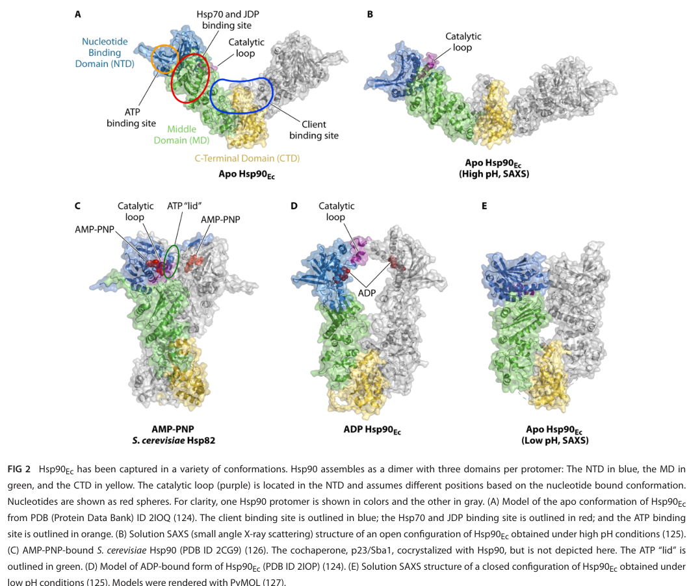

## Question

# Gene Research for Functional Annotation

## ⚠️ CRITICAL: Gene/Protein Identification Context

**BEFORE YOU BEGIN RESEARCH:** You MUST verify you are researching the CORRECT gene/protein. Gene symbols can be ambiguous, especially for less well-characterized genes from non-model organisms.

### Target Gene/Protein Identity (from UniProt):
- **UniProt Accession:** Q88FB9
- **Protein Description:** RecName: Full=Chaperone protein HtpG {ECO:0000255|HAMAP-Rule:MF_00505}; AltName: Full=Heat shock protein HtpG {ECO:0000255|HAMAP-Rule:MF_00505}; AltName: Full=High temperature protein G {ECO:0000255|HAMAP-Rule:MF_00505};
- **Gene Information:** Name=htpG {ECO:0000255|HAMAP-Rule:MF_00505}; OrderedLocusNames=PP_4179;
- **Organism (full):** Pseudomonas putida (strain ATCC 47054 / DSM 6125 / CFBP 8728 / NCIMB 11950 / KT2440).
- **Protein Family:** Belongs to the heat shock protein 90 family.
- **Key Domains:** HATPase_C_sf. (IPR036890); HATPase_dom. (IPR003594); Heat_shock_protein_90_CS. (IPR019805); HSP90_C. (IPR037196); Hsp90_fam. (IPR001404)

### MANDATORY VERIFICATION STEPS:

1. **Check if the gene symbol "htpG" matches the protein description above**
2. **Verify the organism is correct:** Pseudomonas putida (strain ATCC 47054 / DSM 6125 / CFBP 8728 / NCIMB 11950 / KT2440).
3. **Check if protein family/domains align with what you find in literature**
4. **If you find literature for a DIFFERENT gene with the same or similar symbol, STOP**

### If Gene Symbol is Ambiguous or You Cannot Find Relevant Literature:

**DO NOT PROCEED WITH RESEARCH ON A DIFFERENT GENE.** Instead:
- State clearly: "The gene symbol 'htpG' is ambiguous or literature is limited for this specific protein"
- Explain what you found (e.g., "Found extensive literature on a different gene with the same symbol in a different organism")
- Describe the protein based ONLY on the UniProt information provided above
- Suggest that the protein function can be inferred from domain/family information

### Research Target:

Please provide a comprehensive research report on the gene **htpG** (gene ID: htpG, UniProt: Q88FB9) in PSEPK.

The research report should be a detailed narrative explaining the function, biological processes, and localization of the gene product. Citations should be given for all claims.

You should prioritize authoritative reviews and primary scientific literature when conducting research. You can supplement
this with annotations you find in gene/protein databases, but these can be outdated or inaccurate.

We are specifically interested in the primary function of the gene - for enzymes, what reaction is catalyzed, and what is the substrate specificity? For transporters, what is the substrate? For structural proteins or adapters, what is the broader structural role? For signaling molecules, what is the role in the pathway.

We are interested in where in or outside the cell the gene product carries out its function.

We are also interested in the signaling or biochemical pathways in which the gene functions. We are less interested in broad pleiotropic effects, except where these elucidate the precise role.

Include evidence where possible. We are interested in both experimental evidence as well as inference from structure, evolution, or bioinformatic analysis. Precise studies should be prioritized over high-throughput, where available.

## Output

Question: You are an expert researcher providing comprehensive, well-cited information.

Provide detailed information focusing on:
1. Key concepts and definitions with current understanding
2. Recent developments and latest research (prioritize 2023-2024 sources)
3. Current applications and real-world implementations
4. Expert opinions and analysis from authoritative sources
5. Relevant statistics and data from recent studies

Format as a comprehensive research report with proper citations. Include URLs and publication dates where available.
Always prioritize recent, authoritative sources and provide specific citations for all major claims.

# Gene Research for Functional Annotation

## ⚠️ CRITICAL: Gene/Protein Identification Context

**BEFORE YOU BEGIN RESEARCH:** You MUST verify you are researching the CORRECT gene/protein. Gene symbols can be ambiguous, especially for less well-characterized genes from non-model organisms.

### Target Gene/Protein Identity (from UniProt):
- **UniProt Accession:** Q88FB9
- **Protein Description:** RecName: Full=Chaperone protein HtpG {ECO:0000255|HAMAP-Rule:MF_00505}; AltName: Full=Heat shock protein HtpG {ECO:0000255|HAMAP-Rule:MF_00505}; AltName: Full=High temperature protein G {ECO:0000255|HAMAP-Rule:MF_00505};
- **Gene Information:** Name=htpG {ECO:0000255|HAMAP-Rule:MF_00505}; OrderedLocusNames=PP_4179;
- **Organism (full):** Pseudomonas putida (strain ATCC 47054 / DSM 6125 / CFBP 8728 / NCIMB 11950 / KT2440).
- **Protein Family:** Belongs to the heat shock protein 90 family.
- **Key Domains:** HATPase_C_sf. (IPR036890); HATPase_dom. (IPR003594); Heat_shock_protein_90_CS. (IPR019805); HSP90_C. (IPR037196); Hsp90_fam. (IPR001404)

### MANDATORY VERIFICATION STEPS:

1. **Check if the gene symbol "htpG" matches the protein description above**
2. **Verify the organism is correct:** Pseudomonas putida (strain ATCC 47054 / DSM 6125 / CFBP 8728 / NCIMB 11950 / KT2440).
3. **Check if protein family/domains align with what you find in literature**
4. **If you find literature for a DIFFERENT gene with the same or similar symbol, STOP**

### If Gene Symbol is Ambiguous or You Cannot Find Relevant Literature:

**DO NOT PROCEED WITH RESEARCH ON A DIFFERENT GENE.** Instead:
- State clearly: "The gene symbol 'htpG' is ambiguous or literature is limited for this specific protein"
- Explain what you found (e.g., "Found extensive literature on a different gene with the same symbol in a different organism")
- Describe the protein based ONLY on the UniProt information provided above
- Suggest that the protein function can be inferred from domain/family information

### Research Target:

Please provide a comprehensive research report on the gene **htpG** (gene ID: htpG, UniProt: Q88FB9) in PSEPK.

The research report should be a detailed narrative explaining the function, biological processes, and localization of the gene product. Citations should be given for all claims.

You should prioritize authoritative reviews and primary scientific literature when conducting research. You can supplement
this with annotations you find in gene/protein databases, but these can be outdated or inaccurate.

We are specifically interested in the primary function of the gene - for enzymes, what reaction is catalyzed, and what is the substrate specificity? For transporters, what is the substrate? For structural proteins or adapters, what is the broader structural role? For signaling molecules, what is the role in the pathway.

We are interested in where in or outside the cell the gene product carries out its function.

We are also interested in the signaling or biochemical pathways in which the gene functions. We are less interested in broad pleiotropic effects, except where these elucidate the precise role.

Include evidence where possible. We are interested in both experimental evidence as well as inference from structure, evolution, or bioinformatic analysis. Precise studies should be prioritized over high-throughput, where available.

## Research report: **htpG (UniProt Q88FB9; PP_4179)** in *Pseudomonas putida* KT2440

### 0) Target verification (critical identity check)
The UniProt accession **Q88FB9** is annotated as **HtpG (bacterial Hsp90 family chaperone)** in *Pseudomonas putida* strain **KT2440**, with locus tag **PP_4179**. Independent primary transcriptomics studies in *P. putida* KT2440 explicitly refer to **PP_4179 = htpG = heat shock protein HtpG** and place it in stress-response/chaperone categories, confirming that the gene symbol and function match the requested target context (i.e., bacterial Hsp90/HtpG rather than unrelated “htpG” usages in other organisms). (bojanovic2017globaltranscriptionalresponses pages 8-10, follonier2013newinsightson pages 5-6)

### 1) Key concepts and definitions (current understanding)

#### 1.1 What HtpG is
**HtpG** is the bacterial homolog of eukaryotic **Hsp90**, a highly conserved ATP-dependent molecular chaperone that supports **proteostasis** (protein folding/activation, prevention of aggregation, disaggregation/rehabilitation of damaged proteins, and influencing degradation decisions). In bacteria, these activities are typically executed **in collaboration with the Hsp70 system** (DnaK plus J-domain proteins and nucleotide exchange factors) rather than through the large dedicated Hsp90 cochaperone network seen in eukaryotes. (wickramaratne2024hsp90ateam pages 1-2, wickramaratne2024hsp90ateam pages 6-8)

#### 1.2 Domain architecture and catalytic principle
Bacterial HtpG/Hsp90 is a **constitutive homodimer** (dimerized via its C-terminal domain) with three conserved domains per protomer:
- **NTD** (N-terminal domain): ATP binding pocket (GHKL ATPase family) and conformational “lid” elements
- **MD** (middle domain): contributes to ATP hydrolysis catalysis and binds Hsp70/DnaK
- **CTD** (C-terminal domain): stable homodimerization interface; contributes to client binding
Client-binding surfaces in bacterial Hsp90 are emphasized in the **MD/CTD region**, and the chaperone undergoes an **ATP-driven conformational cycle** with open and more closed nucleotide-dependent states. (wickramaratne2024hsp90ateam pages 4-6, wickramaratne2024hsp90ateam pages 6-8, wickramaratne2024hsp90ateam media 6f0b9c8f)

A key “current understanding” nuance is that the relationship between nucleotide state (ATP/ADP) and global conformational transitions is **dynamic and species/paralog dependent**; conformations exist in equilibrium, and coupling between nucleotide binding/hydrolysis and global structural change can be relatively weak compared with simplified textbook depictions. (wickramaratne2024hsp90ateam pages 6-8)

#### 1.3 Cochaperones and partner systems (what bacteria do and do not have)
In contrast to eukaryotic Hsp90 (which uses many dedicated cochaperones), an authoritative 2024 bacterial Hsp90 review emphasizes that there is **no evidence for bacterial homologs of canonical eukaryotic Hsp90 cochaperones**; instead, bacterial HtpG functionally collaborates with **Hsp70 (DnaK)** and **Hsp70 cochaperones** (J-domain proteins such as DnaJ/CbpA and NEFs such as GrpE). (wickramaratne2024hsp90ateam pages 4-6, wickramaratne2024hsp90ateam pages 6-8)

Quantitatively, the **HtpG–DnaK interaction** is described as **weak (low-micromolar affinity)** and can be stabilized by client proteins and J-domain cochaperones; ATP binding/hydrolysis by both systems is important for remodeling/refolding of certain denatured substrates in vitro. (wickramaratne2024hsp90ateam pages 8-10)

#### 1.4 Subcellular localization
The bacterial HtpG/Hsp90 described in the cited bacterial literature is a **cytosolic** chaperone that acts on intracellular protein substrates as part of the cytosolic proteostasis network. (grudniak2018effectsofnull pages 1-2, wickramaratne2024hsp90ateam pages 1-2)

### 2) Species-specific biology in *P. putida* KT2440: regulation and stress responsiveness

#### 2.1 Heat-shock inducibility (time-resolved regulation)
In a focused heat-shock response study using *Pseudomonas putida* (KT background), **htpG mRNA is heat inducible**, with increased expression detectable **within 10 minutes** after temperature upshift. Importantly, even a **mild shift** (reported at 33°C) triggers a rapid but **transient** induction pattern, while stronger heat shifts (40–45°C) sustain elevated expression longer (remaining high after 30 minutes). The induction pattern is reported to correlate with the heat-shock sigma factor **RpoH (σ32)** behavior (σ32 levels increase within ~10 minutes after upshift). (ito2014geneticandphenotypic pages 6-8)

Interpretation for annotation: in *P. putida*, **htpG is part of the canonical heat-shock regulon**, consistent with a primary role in **stress-adaptive protein quality control**. (ito2014geneticandphenotypic pages 6-8)

#### 2.2 Osmotic stress (NaCl) induces strong htpG upregulation
A global transcriptomics study of *P. putida* KT2440 reported **PP_4179 (htpG)** among “stress proteins” and found it **upregulated 10.1-fold** at **60 minutes** after osmotic challenge (NaCl). (Publication date: Apr 2017; URL in citation.) (bojanovic2017globaltranscriptionalresponses pages 8-10)

#### 2.3 Elevated pressure (and pressure + oxygen) induces htpG transcription
A microarray study of *P. putida* KT2440 grown under elevated pressure conditions identified **PP_4179 (htpG)** as significantly induced:
- **Pressure**: +1.65 fold change (adjusted P = 1.0×10⁻²)
- **Pressure + elevated dissolved oxygen tension**: +1.92 fold change (adjusted P = 2.0×10⁻²)
(Publication date: Mar 2013; URL in citation.) (follonier2013newinsightson pages 5-6)

Interpretation: these data support the view that *P. putida* htpG is mobilized by **multiple stressors**, including physicochemical stresses relevant to industrial cultivation (pressure, oxygen transfer regimes) and osmotic stress, consistent with HtpG as a proteostasis component buffering stress-induced protein damage. (bojanovic2017globaltranscriptionalresponses pages 8-10, follonier2013newinsightson pages 5-6)

### 3) Mechanism and pathways: where HtpG fits in bacterial proteostasis
Bacterial HtpG/Hsp90 participates in a broader proteostasis pathway that includes:
- **Hsp70 system (DnaK + J-domain proteins + GrpE)** for ATP-driven binding/release cycles on unfolded substrates
- **Chaperonins (GroEL/ES)** and ribosome-associated factors (trigger factor)
- **Disaggregation machinery** (e.g., Clp/Hsp100 family) and proteases (Clp, Lon) for terminal handling of irreversibly misfolded proteins
HtpG is described as contributing to folding and quality control both by **ATP-independent holdase activity** (binding non-native proteins to prevent aggregation) and, in collaboration with Hsp70 and cochaperones, by participating in **client remodeling/refolding** workflows. (wickramaratne2024hsp90ateam pages 1-2, wickramaratne2024hsp90ateam pages 6-8, wickramaratne2024hsp90ateam pages 8-10)

For functional annotation in *P. putida* KT2440, the most defensible pathway placement is therefore: **cytosolic stress-response chaperone within the Hsp70-centered protein quality control network**, inducible by RpoH/heat-shock signals and by additional environmental stresses. (ito2014geneticandphenotypic pages 6-8, bojanovic2017globaltranscriptionalresponses pages 8-10, follonier2013newinsightson pages 5-6)

### 4) Recent developments (prioritizing 2023–2024)

#### 4.1 2024 authoritative synthesis of bacterial Hsp90/HtpG
A 2024 review in *Microbiology and Molecular Biology Reviews* consolidates current bacterial Hsp90 knowledge, emphasizing: (i) conserved three-domain dimeric architecture; (ii) ATPase-driven conformational cycling with dynamic equilibria; (iii) collaboration with Hsp70 systems; (iv) lack of evidence for bacterial homologs of canonical eukaryotic cochaperones; and (v) a relatively small but growing set of validated bacterial clients and roles that can be **species dependent**. (Publication date: Jun 2024; URL in citation.) (wickramaratne2024hsp90ateam pages 6-8, wickramaratne2024hsp90ateam pages 4-6, wickramaratne2024hsp90ateam pages 8-10)

Relevance to Q88FB9 annotation: because HtpG is conserved and Q88FB9 is assigned to the Hsp90 family, the mechanistic principles (domain function, ATPase cycle, Hsp70 collaboration) are strongly transferable as **high-confidence inference**, while species-dependent phenotypes require organism-specific evidence (see Sections 2–3). (wickramaratne2024hsp90ateam pages 6-8, wickramaratne2024hsp90ateam pages 4-6)

#### 4.2 2024 structural visualization of bacterial Hsp90 conformational states
The same 2024 review includes a figure summarizing **bacterial Hsp90 domain architecture and conformational cycle states** captured under different nucleotide/condition regimes, supporting a mechanistic model for ATP-driven structural transitions. (wickramaratne2024hsp90ateam media 6f0b9c8f)

#### 4.3 2023–2024 work relevant to applications and translational interest (contextual, not *P. putida* specific)
Recent literature continues to highlight bacterial HtpG’s potential as a **therapeutic/anti-virulence target** and as a node in complex stress/virulence factor biogenesis, although these are typically organism-specific. For example, studies/reviews discuss HtpG roles in virulence-associated biosynthetic outputs in some pathogens and the consequences of perturbing HtpG in infection contexts. These sources are informative for general function but should not be directly mapped onto *P. putida* without validation. (wickramaratne2024hsp90ateam pages 4-6, berisio2024htpg—amajorvirulence pages 2-4)

### 5) Current applications and real-world implementations

#### 5.1 Industrial/bioprocess relevance in *P. putida*
*P. putida* KT2440 is widely used in industrial biotechnology, where cells encounter stresses such as **osmotic shocks**, **oxygen transfer/oxidative regimes**, and **pressure-related effects** in large bioreactors. The measured induction of **htpG/PP_4179** under osmotic stress (10.1-fold) and elevated pressure/pressure+oxygen (1.65–1.92-fold; significant adjusted P values) directly supports htpG as part of the stress-adaptation toolkit relevant to industrial cultivation and robustness engineering. (bojanovic2017globaltranscriptionalresponses pages 8-10, follonier2013newinsightson pages 5-6)

A practical implementation implication: monitoring or engineering the heat-shock/stress response (including htpG regulation) is a plausible lever to improve process tolerance, though this report does not identify a *P. putida* KT2440 study directly engineering htpG itself. (bojanovic2017globaltranscriptionalresponses pages 8-10, ito2014geneticandphenotypic pages 6-8)

#### 5.2 Anti-virulence/targeting concepts (general bacterial context)
Although not an application in *P. putida*, bacterial HtpG is under discussion as a potential antimicrobial/anti-virulence target in other organisms, and perturbation can affect complex phenotypes (biofilm, motility, virulence factor production). Such observations support the broader principle that HtpG can influence systems-level phenotypes via proteostasis control of key regulatory/enzymatic “client” proteins. (grudniak2018effectsofnull pages 1-2, wickramaratne2024hsp90ateam pages 4-6)

### 6) Expert opinions and analysis (authoritative sources)
The 2024 *MMBR* review provides several expert-level conclusions relevant to annotation:
- Bacterial HtpG should be understood primarily as a **team player** in proteostasis, with **Hsp70 systems** central to its functional output in vivo and in reconstitution experiments. (wickramaratne2024hsp90ateam pages 6-8, wickramaratne2024hsp90ateam pages 8-10)
- The extent to which HtpG is required for growth, thermal survival, or specialized functions is often **species dependent**, underscoring the need to separate “conserved molecular role” from “organism-specific phenotypes” in annotation. (wickramaratne2024hsp90ateam pages 6-8, wickramaratne2024hsp90ateam pages 13-14)

### 7) Relevant statistics and quantitative data (recent and/or primary)
Key quantitative, strain-relevant values extracted from the evidence include:
- **10.1-fold induction** of *P. putida* KT2440 **PP_4179/htpG** transcript at **60 min after NaCl osmotic stress**. (bojanovic2017globaltranscriptionalresponses pages 8-10)
- **+1.65 FC (adj. P=1.0×10⁻²)** under elevated pressure; **+1.92 FC (adj. P=2.0×10⁻²)** under elevated pressure + elevated oxygen tension (microarray, *P. putida* KT2440). (follonier2013newinsightson pages 5-6)
- **Low-micromolar-range affinity** for the **HtpG(Hsp90)–DnaK** interaction (general bacterial mechanistic evidence). (wickramaratne2024hsp90ateam pages 8-10)

### 8) Functional annotation summary for UniProt Q88FB9 (PP_4179, *htpG*)

**Primary function:** ATP-dependent molecular chaperone of the Hsp90 family (HtpG) that supports **protein quality control** under stress and non-stress conditions, primarily by preventing aggregation and collaborating with the Hsp70/DnaK system to remodel/refold client proteins. (wickramaratne2024hsp90ateam pages 1-2, wickramaratne2024hsp90ateam pages 6-8, wickramaratne2024hsp90ateam pages 8-10)

**Biological processes (supported in *P. putida*):** stress response/heat-shock response, including strong induction under osmotic stress and significant induction under elevated pressure/pressure+oxygen, and rapid heat-inducible transcription consistent with a canonical heat-shock regulon member. (bojanovic2017globaltranscriptionalresponses pages 8-10, follonier2013newinsightson pages 5-6, ito2014geneticandphenotypic pages 6-8)

**Cellular localization:** cytosolic (bacterial HtpG/Hsp90 family). (grudniak2018effectsofnull pages 1-2, wickramaratne2024hsp90ateam pages 1-2)

**Pathway context:** component of the cytosolic proteostasis network, working in concert with DnaK/JDPs/GrpE and other quality-control elements (chaperonins, disaggregases, proteases). (wickramaratne2024hsp90ateam pages 1-2, wickramaratne2024hsp90ateam pages 8-10)

### Evidence summary table
| Claim/Topic | Organism/Context | Key finding | Quantitative data (if any) | Source (authors, year, journal) | URL | Evidence strength (direct *P. putida* vs inferred from other bacteria/review) |
|---|---|---|---|---|---|---|
| htpG induction under NaCl osmotic stress | *Pseudomonas putida* KT2440; transcriptomics after osmotic challenge | PP_4179 (*htpG*) is strongly upregulated as a stress-protein transcript during osmotic stress. | 10.1-fold increase at T2 (60 min) after NaCl stress (bojanovic2017globaltranscriptionalresponses pages 8-10) | Bojanovič, D'Arrigo, Long, 2017, *Applied and Environmental Microbiology* (bojanovic2017globaltranscriptionalresponses pages 8-10) | https://doi.org/10.1128/AEM.03236-16 | Direct *P. putida* evidence |
| htpG induction under elevated pressure / pressure + oxygen | *Pseudomonas putida* KT2440; microarray stress-response study | PP_4179 is induced under elevated pressure and further induced under pressure plus elevated dissolved oxygen, consistent with heat-shock/chaperone stress response. | Pressure: +1.65 FC, adj. P = 1.0E-02; Pressure + oxygen: +1.92 FC, adj. P = 2.0E-02 (follonier2013newinsightson pages 5-6, follonier2013newinsightson pages 6-8) | Follonier et al., 2013, *Microbial Cell Factories* (follonier2013newinsightson pages 5-6) | https://doi.org/10.1186/1475-2859-12-30 | Direct *P. putida* evidence |
| Heat-induction kinetics (qRT-PCR time course) | *Pseudomonas putida* KT/KT2440 heat-shock response | *htpG* mRNA is heat inducible; induction is detectable within 10 min after temperature upshift, including mild 33°C shift. At 33°C the response is transient, whereas at 40–45°C expression remains high after 30 min; pattern correlates with σ32/RpoH induction. | Time-resolved response: induction within 10 min; at 33°C transient peak then decline then rebound by 30 min; at 40–45°C sustained high levels after 30 min (ito2014geneticandphenotypic pages 6-8) | Ito et al., 2014, *MicrobiologyOpen* (ito2014geneticandphenotypic pages 6-8) | https://doi.org/10.1002/mbo3.217 | Direct *P. putida* evidence |
| Domain architecture and dimerization | General bacterial HtpG/Hsp90; structural review with *E. coli* Hsp90 as model | Bacterial HtpG is a constitutive homodimer with three conserved domains: N-terminal ATP-binding domain (NTD), middle domain (MD), and C-terminal dimerization domain (CTD). Client-binding surfaces span MD/CTD in bacterial Hsp90. | Dimeric state; three-domain architecture explicitly defined (wickramaratne2024hsp90ateam pages 6-8, wickramaratne2024hsp90ateam pages 4-6, wickramaratne2024hsp90ateam media 6f0b9c8f) | Wickramaratne, Wickner, Kravats, 2024, *Microbiology and Molecular Biology Reviews* (wickramaratne2024hsp90ateam pages 6-8, wickramaratne2024hsp90ateam pages 4-6, wickramaratne2024hsp90ateam media 6f0b9c8f) | https://doi.org/10.1128/MMBR.00176-22 | Inferred for *P. putida* from conserved bacterial HtpG/Hsp90 family/review |
| Interaction with DnaK and micromolar affinity | General bacterial HtpG/Hsp90, especially *E. coli* model | HtpG collaborates with Hsp70/DnaK and its cochaperones in client remodeling/refolding; Hsp90 and DnaK directly interact through the Hsp90 middle domain. | Hsp90–DnaK interaction reported as weak, in the low micromolar affinity range (wickramaratne2024hsp90ateam pages 8-10) | Wickramaratne, Wickner, Kravats, 2024, *Microbiology and Molecular Biology Reviews* (wickramaratne2024hsp90ateam pages 8-10) | https://doi.org/10.1128/MMBR.00176-22 | Inferred for *P. putida* from conserved bacterial HtpG/Hsp90 mechanism/review |
| No known bacterial Hsp90 cochaperone homologs | General bacterial HtpG/Hsp90 comparative review | Unlike eukaryotic Hsp90 systems, bacteria lack confirmed homologs of canonical Hsp90 cochaperones; instead, HtpG functionally collaborates with Hsp70/J-domain proteins/GrpE systems. | Qualitative claim; no bacterial homologs of eukaryotic Hsp90 cochaperones identified in the review (wickramaratne2024hsp90ateam pages 6-8, wickramaratne2024hsp90ateam pages 4-6) | Wickramaratne, Wickner, Kravats, 2024, *Microbiology and Molecular Biology Reviews* (wickramaratne2024hsp90ateam pages 6-8, wickramaratne2024hsp90ateam pages 4-6) | https://doi.org/10.1128/MMBR.00176-22 | Inferred for *P. putida* from authoritative bacterial Hsp90 review |
| ΔhtpG phenotypes relevant to stress/virulence | *Pseudomonas aeruginosa* mutant study | Loss of *htpG* affects multiple physiological and virulence-related traits, supporting a role for HtpG in stress-adaptive proteostasis beyond simple heat tolerance. | Decreased LasA protease activity, reduced biofilm formation, decreased motility, and reduced rhamnolipid/pyoverdine/pyocyanin production; defects most evident at 42°C (grudniak2018effectsofnull pages 1-2) | Grudniak, Klecha, Wolska, 2018, *Future Microbiology* (grudniak2018effectsofnull pages 1-2) | https://doi.org/10.2217/fmb-2017-0111 | Indirect for *P. putida*; evidence from related *Pseudomonas* species |
| Cytosolic stress chaperone role in bacteria | General bacterial HtpG/Hsp90 background | HtpG is a conserved cytosolic chaperone involved in protein folding, anti-aggregation, disaggregation, and proteostasis, especially during stress; in bacteria it works with Hsp70 systems rather than an extensive eukaryotic cochaperone network. | Hsp90-family proteins can comprise ~1–2% of cytosolic proteins in bacteria/eukaryotes discussed in review/background (grudniak2018effectsofnull pages 1-2, wickramaratne2024hsp90ateam pages 1-2, singh2024heatshockresponse pages 9-11) | Grudniak et al., 2018, *Future Microbiology*; Wickramaratne et al., 2024, *MMBR*; Singh et al., 2024, *IJMS* (grudniak2018effectsofnull pages 1-2, wickramaratne2024hsp90ateam pages 1-2, singh2024heatshockresponse pages 9-11) | https://doi.org/10.2217/fmb-2017-0111 ; https://doi.org/10.1128/MMBR.00176-22 ; https://doi.org/10.3390/ijms25084209 | Inferred for *P. putida* from conserved family biology and reviews |

*Table: This table compiles direct evidence for *Pseudomonas putida* KT2440 htpG/PP_4179 stress responsiveness and key conserved mechanistic features of bacterial HtpG/Hsp90. It separates species-specific observations from broader family-level inferences useful for functional annotation of UniProt Q88FB9.*

### Figure support (domain architecture and conformational cycle)
A schematic figure summarizing the bacterial Hsp90(HtpG) domain architecture (NTD/MD/CTD) and representative nucleotide-dependent conformational states is available from the 2024 *MMBR* review and is cited here to support the mechanistic description. (wickramaratne2024hsp90ateam media 6f0b9c8f)

### Limitations of the current evidence base (scope control)
Within the retrieved sources, **direct knockout/overexpression phenotypes for htpG specifically in *P. putida* KT2440** were not available. Phenotypic consequences of htpG deletion are therefore best treated as **inference** from related bacteria and general mechanistic understanding rather than as confirmed *P. putida* traits. For example, an *htpG* null mutant in *Pseudomonas aeruginosa* affects biofilm, motility, and virulence factor production, with stronger defects at 42°C; this supports functional importance of HtpG in *Pseudomonas* stress physiology but is not direct evidence for KT2440. (grudniak2018effectsofnull pages 1-2)

### Key cited sources (with publication dates and URLs)
- Wickramaratne AC, Wickner S, Kravats AN. **2024-06**. *Hsp90, a team player in protein quality control and the stress response in bacteria*. **Microbiology and Molecular Biology Reviews**. https://doi.org/10.1128/mmbr.00176-22 (wickramaratne2024hsp90ateam pages 6-8, wickramaratne2024hsp90ateam pages 4-6, wickramaratne2024hsp90ateam pages 8-10, wickramaratne2024hsp90ateam media 6f0b9c8f)
- Bojanovič K, D'Arrigo I, Long KS. **2017-04**. *Global transcriptional responses to osmotic, oxidative, and imipenem stress conditions in Pseudomonas putida*. **Applied and Environmental Microbiology**. https://doi.org/10.1128/aem.03236-16 (bojanovic2017globaltranscriptionalresponses pages 8-10)
- Follonier S et al. **2013-03**. *New insights on the reorganization of gene transcription in Pseudomonas putida KT2440 at elevated pressure*. **Microbial Cell Factories**. https://doi.org/10.1186/1475-2859-12-30 (follonier2013newinsightson pages 5-6)
- Ito F et al. **2014-10**. *Genetic and phenotypic characterization of the heat shock response in Pseudomonas putida*. **MicrobiologyOpen**. https://doi.org/10.1002/mbo3.217 (ito2014geneticandphenotypic pages 6-8)
- Grudniak AM, Klecha B, Wolska KI. **2018-12**. *Effects of null mutation of the heat-shock gene htpG on the production of virulence factors by Pseudomonas aeruginosa*. **Future Microbiology**. https://doi.org/10.2217/fmb-2017-0111 (grudniak2018effectsofnull pages 1-2)

References

1. (bojanovic2017globaltranscriptionalresponses pages 8-10): Klara Bojanovič, Isotta D'Arrigo, and Katherine S. Long. Global transcriptional responses to osmotic, oxidative, and imipenem stress conditions in pseudomonas putida. Applied and Environmental Microbiology, Apr 2017. URL: https://doi.org/10.1128/aem.03236-16, doi:10.1128/aem.03236-16. This article has 83 citations and is from a peer-reviewed journal.

2. (follonier2013newinsightson pages 5-6): Stéphanie Follonier, Isabel F Escapa, Pilar M Fonseca, Bernhard Henes, Sven Panke, Manfred Zinn, and María Auxiliadora Prieto. New insights on the reorganization of gene transcription in pseudomonas putida kt2440 at elevated pressure. Microbial Cell Factories, 12:30-30, Mar 2013. URL: https://doi.org/10.1186/1475-2859-12-30, doi:10.1186/1475-2859-12-30. This article has 46 citations and is from a peer-reviewed journal.

3. (wickramaratne2024hsp90ateam pages 1-2): Anushka C. Wickramaratne, Sue Wickner, and Andrea N. Kravats. Hsp90, a team player in protein quality control and the stress response in bacteria. Microbiology and Molecular Biology Reviews, Jun 2024. URL: https://doi.org/10.1128/mmbr.00176-22, doi:10.1128/mmbr.00176-22. This article has 17 citations and is from a domain leading peer-reviewed journal.

4. (wickramaratne2024hsp90ateam pages 6-8): Anushka C. Wickramaratne, Sue Wickner, and Andrea N. Kravats. Hsp90, a team player in protein quality control and the stress response in bacteria. Microbiology and Molecular Biology Reviews, Jun 2024. URL: https://doi.org/10.1128/mmbr.00176-22, doi:10.1128/mmbr.00176-22. This article has 17 citations and is from a domain leading peer-reviewed journal.

5. (wickramaratne2024hsp90ateam pages 4-6): Anushka C. Wickramaratne, Sue Wickner, and Andrea N. Kravats. Hsp90, a team player in protein quality control and the stress response in bacteria. Microbiology and Molecular Biology Reviews, Jun 2024. URL: https://doi.org/10.1128/mmbr.00176-22, doi:10.1128/mmbr.00176-22. This article has 17 citations and is from a domain leading peer-reviewed journal.

6. (wickramaratne2024hsp90ateam media 6f0b9c8f): Anushka C. Wickramaratne, Sue Wickner, and Andrea N. Kravats. Hsp90, a team player in protein quality control and the stress response in bacteria. Microbiology and Molecular Biology Reviews, Jun 2024. URL: https://doi.org/10.1128/mmbr.00176-22, doi:10.1128/mmbr.00176-22. This article has 17 citations and is from a domain leading peer-reviewed journal.

7. (wickramaratne2024hsp90ateam pages 8-10): Anushka C. Wickramaratne, Sue Wickner, and Andrea N. Kravats. Hsp90, a team player in protein quality control and the stress response in bacteria. Microbiology and Molecular Biology Reviews, Jun 2024. URL: https://doi.org/10.1128/mmbr.00176-22, doi:10.1128/mmbr.00176-22. This article has 17 citations and is from a domain leading peer-reviewed journal.

8. (grudniak2018effectsofnull pages 1-2): Anna M Grudniak, Barbara Klecha, and Krystyna I Wolska. Effects of null mutation of the heat-shock gene htpg on the production of virulence factors by pseudomonas aeruginosa. Future microbiology, 13:69-80, Dec 2018. URL: https://doi.org/10.2217/fmb-2017-0111, doi:10.2217/fmb-2017-0111. This article has 36 citations and is from a peer-reviewed journal.

9. (ito2014geneticandphenotypic pages 6-8): Fumihiro Ito, Takayuki Tamiya, Iwao Ohtsu, Makoto Fujimura, and Fumiyasu Fukumori. Genetic and phenotypic characterization of the heat shock response in pseudomonas putida. MicrobiologyOpen, 3:922-936, Oct 2014. URL: https://doi.org/10.1002/mbo3.217, doi:10.1002/mbo3.217. This article has 28 citations and is from a peer-reviewed journal.

10. (berisio2024htpg—amajorvirulence pages 2-4): Rita Berisio, Giovanni Barra, Valeria Napolitano, Mario Privitera, Maria Romano, Flavia Squeglia, and Alessia Ruggiero. Htpg—a major virulence factor and a promising vaccine antigen against mycobacterium tuberculosis. Biomolecules, 14:471, Apr 2024. URL: https://doi.org/10.3390/biom14040471, doi:10.3390/biom14040471. This article has 6 citations.

11. (wickramaratne2024hsp90ateam pages 13-14): Anushka C. Wickramaratne, Sue Wickner, and Andrea N. Kravats. Hsp90, a team player in protein quality control and the stress response in bacteria. Microbiology and Molecular Biology Reviews, Jun 2024. URL: https://doi.org/10.1128/mmbr.00176-22, doi:10.1128/mmbr.00176-22. This article has 17 citations and is from a domain leading peer-reviewed journal.

12. (follonier2013newinsightson pages 6-8): Stéphanie Follonier, Isabel F Escapa, Pilar M Fonseca, Bernhard Henes, Sven Panke, Manfred Zinn, and María Auxiliadora Prieto. New insights on the reorganization of gene transcription in pseudomonas putida kt2440 at elevated pressure. Microbial Cell Factories, 12:30-30, Mar 2013. URL: https://doi.org/10.1186/1475-2859-12-30, doi:10.1186/1475-2859-12-30. This article has 46 citations and is from a peer-reviewed journal.

13. (singh2024heatshockresponse pages 9-11): Manish Kumar Singh, Yoonhwa Shin, Songhyun Ju, Sunhee Han, Wonchae Choe, Kyung-Sik Yoon, Sung Soo Kim, and Insug Kang. Heat shock response and heat shock proteins: current understanding and future opportunities in human diseases. International Journal of Molecular Sciences, 25:4209, Apr 2024. URL: https://doi.org/10.3390/ijms25084209, doi:10.3390/ijms25084209. This article has 221 citations.

## Artifacts

- [Edison artifact artifact-00](htpG-deep-research-falcon_artifacts/artifact-00.md)

## Citations

1. ito2014geneticandphenotypic pages 6-8
2. bojanovic2017globaltranscriptionalresponses pages 8-10
3. follonier2013newinsightson pages 5-6
4. grudniak2018effectsofnull pages 1-2
5. follonier2013newinsightson pages 6-8
6. singh2024heatshockresponse pages 9-11
7. https://doi.org/10.1128/AEM.03236-16
8. https://doi.org/10.1186/1475-2859-12-30
9. https://doi.org/10.1002/mbo3.217
10. https://doi.org/10.1128/MMBR.00176-22
11. https://doi.org/10.2217/fmb-2017-0111
12. https://doi.org/10.3390/ijms25084209
13. https://doi.org/10.1128/mmbr.00176-22
14. https://doi.org/10.1128/aem.03236-16
15. https://doi.org/10.1128/aem.03236-16,
16. https://doi.org/10.1186/1475-2859-12-30,
17. https://doi.org/10.1128/mmbr.00176-22,
18. https://doi.org/10.2217/fmb-2017-0111,
19. https://doi.org/10.1002/mbo3.217,
20. https://doi.org/10.3390/biom14040471,
21. https://doi.org/10.3390/ijms25084209,