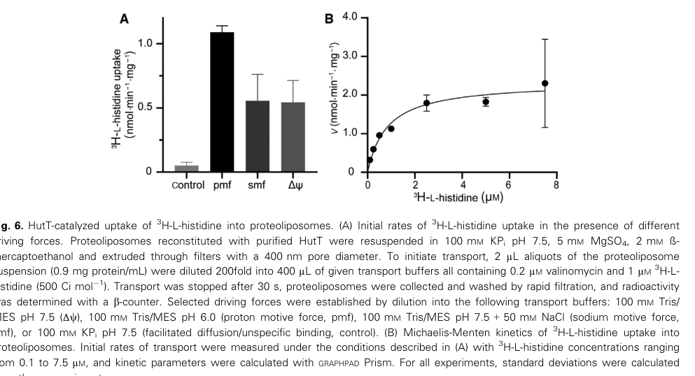

## Question

# Gene Research for Functional Annotation

## ⚠️ CRITICAL: Gene/Protein Identification Context

**BEFORE YOU BEGIN RESEARCH:** You MUST verify you are researching the CORRECT gene/protein. Gene symbols can be ambiguous, especially for less well-characterized genes from non-model organisms.

### Target Gene/Protein Identity (from UniProt):
- **UniProt Accession:** Q88CZ8
- **Protein Description:** RecName: Full=L-histidine transporter HutT {ECO:0000305};
- **Gene Information:** Name=hutT {ECO:0000303|PubMed:34245008}; OrderedLocusNames=PP_5031 {ECO:0000312|EMBL:AAN70596.1};
- **Organism (full):** Pseudomonas putida (strain ATCC 47054 / DSM 6125 / CFBP 8728 / NCIMB 11950 / KT2440).
- **Protein Family:** Belongs to the amino acid-polyamine-organocation (APC)
- **Key Domains:** AA-permease/SLC12A_dom. (IPR004841); Amino_acid_permease_CS. (IPR004840); AA_permease (PF00324)

### MANDATORY VERIFICATION STEPS:

1. **Check if the gene symbol "hutT" matches the protein description above**
2. **Verify the organism is correct:** Pseudomonas putida (strain ATCC 47054 / DSM 6125 / CFBP 8728 / NCIMB 11950 / KT2440).
3. **Check if protein family/domains align with what you find in literature**
4. **If you find literature for a DIFFERENT gene with the same or similar symbol, STOP**

### If Gene Symbol is Ambiguous or You Cannot Find Relevant Literature:

**DO NOT PROCEED WITH RESEARCH ON A DIFFERENT GENE.** Instead:
- State clearly: "The gene symbol 'hutT' is ambiguous or literature is limited for this specific protein"
- Explain what you found (e.g., "Found extensive literature on a different gene with the same symbol in a different organism")
- Describe the protein based ONLY on the UniProt information provided above
- Suggest that the protein function can be inferred from domain/family information

### Research Target:

Please provide a comprehensive research report on the gene **hutT** (gene ID: hutT, UniProt: Q88CZ8) in PSEPK.

The research report should be a detailed narrative explaining the function, biological processes, and localization of the gene product. Citations should be given for all claims.

You should prioritize authoritative reviews and primary scientific literature when conducting research. You can supplement
this with annotations you find in gene/protein databases, but these can be outdated or inaccurate.

We are specifically interested in the primary function of the gene - for enzymes, what reaction is catalyzed, and what is the substrate specificity? For transporters, what is the substrate? For structural proteins or adapters, what is the broader structural role? For signaling molecules, what is the role in the pathway.

We are interested in where in or outside the cell the gene product carries out its function.

We are also interested in the signaling or biochemical pathways in which the gene functions. We are less interested in broad pleiotropic effects, except where these elucidate the precise role.

Include evidence where possible. We are interested in both experimental evidence as well as inference from structure, evolution, or bioinformatic analysis. Precise studies should be prioritized over high-throughput, where available.

## Output

Question: You are an expert researcher providing comprehensive, well-cited information.

Provide detailed information focusing on:
1. Key concepts and definitions with current understanding
2. Recent developments and latest research (prioritize 2023-2024 sources)
3. Current applications and real-world implementations
4. Expert opinions and analysis from authoritative sources
5. Relevant statistics and data from recent studies

Format as a comprehensive research report with proper citations. Include URLs and publication dates where available.
Always prioritize recent, authoritative sources and provide specific citations for all major claims.

# Gene Research for Functional Annotation

## ⚠️ CRITICAL: Gene/Protein Identification Context

**BEFORE YOU BEGIN RESEARCH:** You MUST verify you are researching the CORRECT gene/protein. Gene symbols can be ambiguous, especially for less well-characterized genes from non-model organisms.

### Target Gene/Protein Identity (from UniProt):
- **UniProt Accession:** Q88CZ8
- **Protein Description:** RecName: Full=L-histidine transporter HutT {ECO:0000305};
- **Gene Information:** Name=hutT {ECO:0000303|PubMed:34245008}; OrderedLocusNames=PP_5031 {ECO:0000312|EMBL:AAN70596.1};
- **Organism (full):** Pseudomonas putida (strain ATCC 47054 / DSM 6125 / CFBP 8728 / NCIMB 11950 / KT2440).
- **Protein Family:** Belongs to the amino acid-polyamine-organocation (APC)
- **Key Domains:** AA-permease/SLC12A_dom. (IPR004841); Amino_acid_permease_CS. (IPR004840); AA_permease (PF00324)

### MANDATORY VERIFICATION STEPS:

1. **Check if the gene symbol "hutT" matches the protein description above**
2. **Verify the organism is correct:** Pseudomonas putida (strain ATCC 47054 / DSM 6125 / CFBP 8728 / NCIMB 11950 / KT2440).
3. **Check if protein family/domains align with what you find in literature**
4. **If you find literature for a DIFFERENT gene with the same or similar symbol, STOP**

### If Gene Symbol is Ambiguous or You Cannot Find Relevant Literature:

**DO NOT PROCEED WITH RESEARCH ON A DIFFERENT GENE.** Instead:
- State clearly: "The gene symbol 'hutT' is ambiguous or literature is limited for this specific protein"
- Explain what you found (e.g., "Found extensive literature on a different gene with the same symbol in a different organism")
- Describe the protein based ONLY on the UniProt information provided above
- Suggest that the protein function can be inferred from domain/family information

### Research Target:

Please provide a comprehensive research report on the gene **hutT** (gene ID: hutT, UniProt: Q88CZ8) in PSEPK.

The research report should be a detailed narrative explaining the function, biological processes, and localization of the gene product. Citations should be given for all claims.

You should prioritize authoritative reviews and primary scientific literature when conducting research. You can supplement
this with annotations you find in gene/protein databases, but these can be outdated or inaccurate.

We are specifically interested in the primary function of the gene - for enzymes, what reaction is catalyzed, and what is the substrate specificity? For transporters, what is the substrate? For structural proteins or adapters, what is the broader structural role? For signaling molecules, what is the role in the pathway.

We are interested in where in or outside the cell the gene product carries out its function.

We are also interested in the signaling or biochemical pathways in which the gene functions. We are less interested in broad pleiotropic effects, except where these elucidate the precise role.

Include evidence where possible. We are interested in both experimental evidence as well as inference from structure, evolution, or bioinformatic analysis. Precise studies should be prioritized over high-throughput, where available.

# Functional annotation research report: **hutT** (UniProt **Q88CZ8**, locus **PP_5031**) in *Pseudomonas putida* KT2440

## 0) Target verification (mandatory)
The target is **HutT**, encoded by **hutT / PP_5031** in *Pseudomonas putida* strain KT2440 (ATCC 47054/DSM 6125), corresponding to the UniProt accession **Q88CZ8**. Primary literature in *P. putida* KT2440 directly studies **HutT (PP_5031)** and demonstrates it is an **APC-family secondary transporter** functioning as the **major L-histidine uptake system** in this organism (Wirtz et al., 2021, FEBS Letters, published Jul 2021, https://doi.org/10.1002/1873-3468.14159) (wirtz2021huttfunctionsas pages 1-2). This matches the user-provided UniProt description (L-histidine transporter in APC family) and avoids conflation with hutT-like genes in other species.

## 1) Key concepts and current understanding

### 1.1 Histidine utilization (hut) and why transport matters
In many bacteria, histidine serves as a carbon and/or nitrogen source, and catabolism is typically organized in **histidine utilization (hut)** gene clusters/operons whose expression is tightly regulated (Bender, 2012, *Microbiology and Molecular Biology Reviews*, published Sep 2012, https://doi.org/10.1128/MMBR.00014-12) (bender2012regulationofthe pages 10-11). Because histidine catabolism begins with uptake, transporter identity and energetics can strongly constrain growth on histidine and the integration of hut metabolism into global C/N regulatory networks (bender2012regulationofthe pages 10-11, monteagudocascales2022theregulatoryhierarchy pages 11-13).

### 1.2 HutT: an APC-family proton-coupled amino-acid importer
HutT belongs to the **amino acid–polyamine–organocation (APC)** superfamily of secondary transporters, structurally associated with the **LeuT-like fold** (core ~10 transmembrane segments arranged as a 5+5 inverted repeat) (Wirtz et al., 2021) (wirtz2021huttfunctionsas pages 1-2). In *P. putida* KT2440, HutT is functionally established as a **high-affinity, high-specificity L-histidine:H+ symporter** that uses the **proton motive force (pmf)** rather than ATP hydrolysis or Na+-symport to drive uptake (wirtz2021huttfunctionsas pages 7-9, wirtz2021huttfunctionsas pages 6-7).

## 2) Primary function of HutT (substrate, mechanism, specificity)

### 2.1 Physiological role: principal L-histidine uptake for growth on histidine
Deleting **hutT** in *P. putida* KT2440 severely impairs growth on histidine, indicating HutT is the **dominant physiologically relevant uptake route** under tested conditions (Wirtz et al., 2021) (wirtz2021huttfunctionsas pages 1-2). This functional assignment is reinforced by direct uptake measurements in intact cells and in reconstituted proteoliposomes containing purified HutT (wirtz2021huttfunctionsas pages 7-9).

### 2.2 Substrate specificity
HutT shows **narrow substrate specificity for L-histidine**. Competition experiments (100-fold excess competitors) show strong competition by unlabeled histidine, but little/no competition by arginine, lysine, cyclic proline, imidazole, 3-amino-1,2,4-triazole, or urocanate; an analog that retains key chemical features (1,2,4-triazolyl-3-alanine) significantly inhibits uptake, supporting a binding requirement for the amino and carboxyl groups and a histidine-like ring system (wirtz2021huttfunctionsas pages 6-7, wirtz2022twolhistidinetransporters pages 62-64). Additional mechanistic interpretation emphasizes the importance of the imidazole ring plus amino/carboxyl groups for recognition (wirtz2022twolhistidinetransporters pages 67-69, wirtz2021huttfunctionsas pages 11-12).

### 2.3 Transport mechanism and energy coupling
Multiple lines of evidence indicate HutT is a **proton-coupled symporter**:

* **Protonophores** collapse histidine accumulation: CCCP (20 µM) and DNP (2 mM) abolish detectable ^3H-histidine uptake in whole cells (wirtz2021huttfunctionsas pages 7-9).
* In proteoliposomes, imposing an inward **Δψ + ΔpH (pmf)** stimulates uptake **~21-fold**, while Δψ-driven conditions yield **~10–11-fold** stimulation (wirtz2021huttfunctionsas pages 7-9).

These data support HutT as a **secondary active transporter** driven by the electrochemical proton gradient (wirtz2021huttfunctionsas pages 7-9).

### 2.4 Quantitative kinetics (high-affinity uptake)
HutT-mediated uptake is saturable with **µM-to-sub-µM affinity**:

* In intact *P. putida* cells expressing hutT: **Vmax = 1.93 ± 0.11 nmol mg−1 min−1** and **apparent KM = 0.99 ± 0.23 µM** (Wirtz et al., 2021; Fig. 3B) (wirtz2021huttfunctionsas pages 6-7).
* In heterologous *E. coli* JW2306 expressing HutT: **Vmax = 7.30 ± 0.37 nmol mg−1 min−1**, **apparent KM = 2.4 ± 0.38 µM** (wirtz2021huttfunctionsas pages 6-7).
* In purified/reconstituted HutT proteoliposomes: **Vmax = 2.34 ± 0.23 nmol mg−1 min−1**, **apparent KM = 0.83 ± 0.25 µM** (Wirtz et al., 2021; Fig. 6B) (wirtz2021huttfunctionsas pages 9-11).

These parameters are consistent with HutT functioning as a **high-affinity importer**, appropriate for scavenging histidine at low extracellular concentrations.

### 2.5 Structure-function insights (expert analysis anchored in mutagenesis)
Wirtz et al. identify residues strongly affecting transport activity. For example, substitutions at **Lys156** reduce transport dramatically (to <10% for some substitutions; Lys→Arg ~40%), and **Glu218** is essential (Ala/Gln eliminate uptake; Asp retains ~70%) (wirtz2021huttfunctionsas pages 9-11). Such results support expert interpretations that conserved charged residues in APC/LeuT-like transporters are crucial for coupling and/or substrate coordination.

## 3) Cellular localization and topology
HutT is an integral **cytoplasmic membrane** protein. Bioinformatic topology prediction indicates **~12 mostly hydrophobic α-helical transmembrane segments** in a zigzag topology across the cytoplasmic membrane (wirtz2021huttfunctionsas pages 2-4). Experimentally, HutT is purified from membrane fractions (detergent solubilization with DDM), and reconstitution into liposomes yields transport activity, confirming its membrane localization (wirtz2021huttfunctionsas pages 7-9, wirtz2021huttfunctionsas pages 2-4).

## 4) Pathway context: histidine catabolism and regulation in Pseudomonas

### 4.1 hut cluster organization and HutT placement
In Pseudomonas, hut genes are organized into transcriptional units (e.g., hutU/hutF units in several species). In *P. putida*, HutT was identified as the **main histidine transporter** and is described as a single hutT-like gene located within the hut transcriptional context (monteagudocascales2022theregulatoryhierarchy pages 11-13).

### 4.2 Induction and repression: HutC and the physiological inducer urocanate
A core concept in hut regulation is that **urocanate** (the first intermediate of histidine degradation) is the physiological inducer that disrupts binding of the **HutC repressor** at hut promoters (Bender, 2012) (bender2012regulationofthe pages 10-11). In Pseudomonas, HutC typically represses hut transcription until urocanate accumulates, providing pathway-responsive induction (bender2012regulationofthe pages 10-11).

### 4.3 Integration into global C/N regulation: CbrAB and NtrBC
In pseudomonads, histidine utilization is embedded in carbon catabolite repression and nitrogen regulation networks:

* **CbrAB** is required for growth on histidine as a sole carbon source in Pseudomonas; cbr mutants fail to grow on histidine as the carbon source but can still use histidine as nitrogen source when a preferred carbon source (succinate/glucose) is present (Bender, 2012) (bender2012regulationofthe pages 10-11).
* A regulatory hierarchy model describes overlapping control at hut promoters by **NtrC**, **CbrB**, and **HutC**, with CbrAB also acting through the **CrcZ/CrcY–Crc/Hfq** translational control cascade (Monteagudo-Cascales et al., 2022, *Genes*, published Feb 2022, https://doi.org/10.3390/genes13020375) (monteagudocascales2022theregulatoryhierarchy pages 11-13).

A key physiological rationale is that histidine degradation can provide a large nitrogen input; stoichiometric statements in the regulatory synthesis indicate that one histidine molecule yields “three metabolizable nitrogen atoms” and that catabolism produces ammonia/glutamate/formate, motivating tight regulation to preserve carbon/nitrogen homeostasis (monteagudocascales2022theregulatoryhierarchy pages 11-13).

## 5) Recent developments and latest research (prioritizing 2023–2024)

Direct HutT-specific papers in 2023–2024 were not retrieved in this search; however, several **high-impact enabling resources (2023–2024)** materially advance functional annotation and real-world deployment of genes/transporters in *P. putida* KT2440.

### 5.1 2024: RNA-seq-guided “landing pads” for stable genomic expression (implementation enabler)
Köbbing et al. created and validated **10 genomic integration sites (“landing pads”)** in *P. putida* KT2440 identified by transcriptome stability across conditions (Köbbing et al., 2024, *ACS Synthetic Biology*, published Jul 2024, https://doi.org/10.1021/acssynbio.3c00747) (kobbing2024reliablegenomicintegration pages 1-2). Quantitatively, they report coefficients of variation (CVs) for expression across conditions (excluding a strong urea-stress case) in the ~15–40% range for several loci (e.g., PP_1430 15%, attTn7 18%, PP_4832 23%, PP_4945 40%) (kobbing2024reliablegenomicintegration pages 7-8), and show co-integration interactions are small (<6%), enabling modular multi-gene insertions (kobbing2024reliablegenomicintegration pages 8-9). This directly supports stable chromosomal deployment of HutT (e.g., for uptake-module engineering) without plasmid copy-number variability.

### 5.2 2023: Systems-level RNA-seq under defined stress for functional context
Turlin et al. provide a quantitative RNA-seq resource in *P. putida* (EM42 derivative) under high formate stress (20 mM glucose ± 240 mM formate), quantifying expression for **5,158 genes** with reproducible triplicates and reporting **142–143 differentially expressed genes** depending on genotype, with ~93% overlap (Turlin et al., 2023, *mSystems*, published Jun 2023, https://doi.org/10.1128/msystems.00004-23) (turlin2023coreandauxiliary pages 9-10, turlin2023coreandauxiliary pages 1-2). While not focused on hutT, such datasets improve condition-aware annotation and provide quantitative baselines for stress-responsive engineering contexts in the same chassis organism.

### 5.3 2022: Functional genomics (BarSeq/RB-TnSeq) for nitrogen assimilation including histidine
Schmidt et al. performed BarSeq fitness profiling across **71 nitrogen-related conditions**, identifying **672 genes** with strong phenotypes (|fitness|>1, |t|>5), including **112 transport-related proteins** and **100 transcriptional regulators** (Schmidt et al., 2022, *Applied and Environmental Microbiology*, published Apr 2022, https://doi.org/10.1128/AEM.02430-21) (schmidt2022nitrogenmetabolismin pages 2-4, schmidt2022nitrogenmetabolismin pages 1-2). They provide interactive resources for quantitative per-gene fitness exploration (https://fit.genomics.lbl.gov and https://ppnitrogentsne.lbl.gov) (schmidt2022nitrogenmetabolismin pages 2-4, schmidt2022nitrogenmetabolismin pages 1-2). These datasets are a major recent foundation for validating transporter roles and mapping histidine-related genetic dependencies at genome scale.

## 6) Current applications and real-world implementations

### 6.1 Environmental and host-associated contexts
Histidine availability and histidine catabolism/transport are framed as relevant in multiple ecological contexts: histidine occurs in plant exudates and can be used by root-colonizing pseudomonads; histidine and urocanate influence host recognition and virulence gene expression in *P. aeruginosa*; and extracellular histidine has been reported in infection models as a potential nitrogen source influencing colonization (wirtz2021huttfunctionsas pages 1-2, wirtz2022twolhistidinetransporters pages 58-59). These points motivate transporter-level understanding when interpreting Pseudomonas colonization phenotypes and nutrient niches.

### 6.2 Regulation-driven phenotypes and expert interpretations
Work on HutC in *Pseudomonas fluorescens* shows hut regulation can extend beyond metabolism into global physiological programs. HutC was predicted to bind **143 genomic targets** (P < 10−4) and, in a hutC mutant grown on succinate+histidine, RNA-seq detected **794 upregulated** and **525 downregulated** genes (with fold-change cutoff 2.0), accompanied by phenotypes like increased motility and pyoverdine production and altered plant-surface colonization behavior (Naren & Zhang, 2020, *Journal of Bacteriology*, published Apr 2020, https://doi.org/10.1128/JB.00792-19) (naren2020globalregulatoryroles pages 1-2). While this is not *P. putida* KT2440 HutT directly, it provides authoritative expert context for why histidine transport/catabolism modules can have broad systems-level impacts.

### 6.3 Synthetic biology implementation in *P. putida* KT2440
The 2024 landing-pad work provides a practical implementation pathway for stable transporter expression and functional testing in *P. putida* KT2440, including quantified stability across conditions and limited interaction between multiple integrated cassettes (kobbing2024reliablegenomicintegration pages 7-8, kobbing2024reliablegenomicintegration pages 8-9). Combined with HutT’s demonstrated high-affinity uptake kinetics and pmf coupling, HutT can be deployed as a robust “part” for engineering histidine assimilation, biosensor coupling, or catabolic pathway modules that rely on controlled amino-acid import (wirtz2021huttfunctionsas pages 6-7, wirtz2021huttfunctionsas pages 9-11).

## 7) Evidence summary tables

The following evidence matrices summarize (i) HutT’s core functional annotation evidence and (ii) 2022–2024 resources enabling real-world implementations.

| Claim/feature | Key findings (include quantitative values when available) | Evidence type/assay | Primary source (with year, venue, URL/DOI) | Citation ID |
|---|---|---|---|---|
| Physiological role (growth phenotypes) | hutT corresponds to PP_5031/Q88CZ8 in *Pseudomonas putida* KT2440 and functions as the major L-histidine uptake system; deletion of **hutT** severely impairs growth on histidine, indicating strong physiological dependence on HutT for histidine utilization. | Gene deletion/mutant growth phenotype; whole-cell radiotracer uptake; purified protein reconstitution | Wirtz et al., 2021, *FEBS Letters* (published Jul 2021), https://doi.org/10.1002/1873-3468.14159 | (wirtz2021huttfunctionsas pages 1-2) |
| Substrate specificity / competition | HutT is highly specific for L-histidine. Nonradioactive L-histidine strongly competes with ^3H-histidine uptake, whereas arginine, lysine, cyclic proline, imidazole, 3-amino-1,2,4-triazole, and urocanate show little or no competition; 1,2,4-triazolyl-3-alanine reduces uptake significantly. Recognition requires the imidazole ring plus amino and carboxyl groups; only limited ring modification (triazole) is tolerated. | Competition uptake assays with ^3H-L-histidine; binding/transport assays in cells and proteoliposomes | Wirtz et al., 2021, *FEBS Letters* (published Jul 2021), https://doi.org/10.1002/1873-3468.14159; Wirtz, 2022, LMU München dissertation, https://doi.org/10.5282/edoc.30600 | (wirtz2022twolhistidinetransporters pages 67-69, wirtz2021huttfunctionsas pages 11-12, wirtz2022twolhistidinetransporters pages 62-64) |
| Transport mechanism / energetics | HutT is a proton-coupled secondary transporter (L-histidine:H^+ symporter). Protonophores CCCP (20 µM) and DNP (2 mM) abolish or strongly inhibit uptake, while valinomycin (2 µM), nigericin (6 µM), and nonactin (10 µM) do not support a Na^+-coupled model. In proteoliposomes, an inward proton motive force (Δψ + ΔpH) stimulates uptake ~21-fold; Δψ alone or Δψ plus inward Na^+ gives ~10–11-fold stimulation. | Ionophore perturbation in intact cells; proteoliposome uptake under defined electrochemical gradients | Wirtz et al., 2021, *FEBS Letters* (published Jul 2021), https://doi.org/10.1002/1873-3468.14159; Wirtz, 2022, LMU München dissertation, https://doi.org/10.5282/edoc.30600 | (wirtz2022twolhistidinetransporters pages 66-67, wirtz2022twolhistidinetransporters pages 64-66, wirtz2022twolhistidinetransporters pages 67-69, wirtz2021huttfunctionsas pages 7-9) |
| Kinetic parameters (intact cells and proteoliposomes) | Intact-cell uptake in *P. putida* gave **Vmax = 1.93 ± 0.11 nmol mg^-1 min^-1** and **apparent KM = 0.99 ± 0.23 µM**. Heterologous expression in *E. coli* JW2306 gave **Vmax = 7.30 ± 0.37 nmol mg^-1 min^-1** and **apparent KM = 2.4 ± 0.38 µM**. Reconstituted proteoliposomes gave **Vmax = 2.34 ± 0.23 nmol mg^-1 min^-1** and **apparent KM = 0.83 ± 0.25 µM**. These values support high-affinity histidine uptake. | Michaelis-Menten analysis of ^3H-L-histidine uptake in intact cells and purified/reconstituted HutT proteoliposomes | Wirtz, 2022, LMU München dissertation, https://doi.org/10.5282/edoc.30600; figure extraction from Wirtz et al., 2021, *FEBS Letters*, https://doi.org/10.1002/1873-3468.14159 | (wirtz2022twolhistidinetransporters pages 66-67, wirtz2022twolhistidinetransporters pages 62-64, wirtz2021huttfunctionsas media bb31a9f7) |
| Topology / localization | HutT is an APC-family membrane transporter predicted to contain **12 mostly hydrophobic α-helical transmembrane segments** traversing the cytoplasmic membrane in zigzag topology; APC/LeuT-type architecture implies a core transporter fold with ~10 TMs in a 5+5 inverted repeat. Experimentally, HutT partitions with membranes, is solubilized with DDM, purified by Ni-NTA, and reconstituted into liposomes for transport assays. | In silico topology prediction; membrane fractionation; detergent solubilization; purification; proteoliposome reconstitution | Wirtz et al., 2021, *FEBS Letters* (published Jul 2021), https://doi.org/10.1002/1873-3468.14159; Wirtz, 2022, LMU München dissertation, https://doi.org/10.5282/edoc.30600 | (wirtz2021huttfunctionsas pages 2-4, wirtz2022twolhistidinetransporters pages 58-59, wirtz2021huttfunctionsas pages 1-2) |
| Pathway / regulation context | **hutT** is encoded within the histidine utilization (**hut**) cluster and in *P. putida* is the single hutT-like gene. In pseudomonads, hut genes are controlled by the local repressor **HutC** (urocanate-responsive), and by global C/N regulators **CbrAB** and **NtrBC/NtrC**. CbrAB is required for growth on histidine as sole carbon source, whereas NtrC is important when histidine serves as a nitrogen source; CbrAB also acts through the CrcY/CrcZ–Crc/Hfq catabolite repression cascade. In related *Pseudomonas fluorescens*, transporter genes in the hut locus are direct or indirect targets in this regulatory network. | Operon/regulatory review synthesis; promoter-binding genetics/EMSA/footprinting in related pseudomonads; comparative locus analysis | Bender, 2012, *Microbiology and Molecular Biology Reviews* (published Sep 2012), https://doi.org/10.1128/MMBR.00014-12; Naren & Zhang, 2021, *Nucleic Acids Research* (published Mar 2021), https://doi.org/10.1093/nar/gkab091; Monteagudo-Cascales et al., 2022, *Genes* (published Feb 2022), https://doi.org/10.3390/genes13020375 | (monteagudocascales2022theregulatoryhierarchy pages 11-13, naren2021roleofa pages 6-6, bender2012regulationofthe pages 10-11, naren2021roleofa pages 8-9, naren2021roleofa pages 5-6) |

*Table: This table compiles the main experimental and contextual evidence for HutT/PP_5031 in *Pseudomonas putida* KT2440, including function, specificity, energetics, kinetics, localization, and pathway context. It is useful as a concise functional-annotation evidence matrix with source-linked citations.*

| Development/resource | What it enables | Quantitative/statistical highlights | Publication (date, journal, URL/DOI) | Citation ID |
|---|---|---|---|---|
| HutT functional characterization as a reference module for transporter engineering | Provides a validated membrane uptake module for importing L-histidine in *P. putida* KT2440; useful as a benchmark for transporter expression, mutagenesis, proton-coupled uptake design, and integration into synthetic catabolic circuits. | Whole-cell uptake increased from **0.04 ± 0.01** to **0.74 ± 0.09 nmol min^-1 mg^-1** upon hutT expression; apparent **K_M = 0.99 ± 0.23 µM** and **V_max = 1.93 ± 0.11 nmol mg^-1 min^-1** in *P. putida* cells; reconstituted proteoliposomes gave **K_M = 0.83 ± 0.25 µM** and **V_max = 2.34 ± 0.23 nmol mg^-1 min^-1**; proton motive force stimulated uptake about **21-fold** and membrane potential-based conditions about **10–11-fold**; deletion of **hutT** severely impaired growth on histidine. | Wirtz et al., **Jul 2021**, *FEBS Letters*, https://doi.org/10.1002/1873-3468.14159; Wirtz dissertation, **2022**, LMU München, https://doi.org/10.5282/edoc.30600 | (wirtz2021huttfunctionsas pages 1-2, wirtz2022twolhistidinetransporters pages 66-67, wirtz2021huttfunctionsas pages 7-9, wirtz2021huttfunctionsas pages 6-7, wirtz2021huttfunctionsas pages 9-11) |
| BarSeq nitrogen-metabolism resource | Enables genome-wide identification of genes affecting nitrogen-source utilization, including histidine-related transport and catabolism; supports pathway discovery, transporter prioritization, regulator mapping, and metabolic-engineering target selection. | Screened **52 nitrogen-containing compounds** plus **19 amino-acid dropout** conditions for **71 total conditions**; identified **672 genes** with strong phenotypes using thresholds **fitness > 1** and **t > 5** in absolute value; included **100 transcriptional regulators** and **112 transport-related proteins**; interactive viewers: **https://fit.genomics.lbl.gov** and **https://ppnitrogentsne.lbl.gov**. | Schmidt et al., **Apr 2022**, *Applied and Environmental Microbiology*, https://doi.org/10.1128/AEM.02430-21 | (schmidt2022nitrogenmetabolismin pages 2-4, schmidt2022nitrogenmetabolismin pages 1-2, schmidt2022nitrogenmetabolismin pages 10-12) |
| 2023 RNA-seq systems analysis resource | Supplies a recent transcriptomic and physiological framework for condition-dependent annotation and engineering of *P. putida* genes, useful for choosing promoters, stress conditions, and expression contexts for transporter modules such as HutT. | RNA-seq quantified expression for **5,158 genes** with reproducible triplicates; conditions included **20 mM glucose ± 240 mM formate** in DBM medium, harvested at **3 h** for glucose and **4 h** for glucose plus formate; detected **142 DEGs** in EM42 and **143 DEGs** in ΔΔFDH, with **133 shared DEGs** or about **93% overlap**; examples include **moaA/moaB-II log2FC 2.4 and 4.3**, **pedE/pedH/pedF log2FC 2.6, 5.1, 5.7**, and **nuo operon log2FC below -2**. | Turlin et al., **Jun 2023**, *mSystems*, https://doi.org/10.1128/msystems.00004-23 | (turlin2023coreandauxiliary pages 9-10, turlin2023coreandauxiliary pages 1-2) |
| 2024 genomic landing pads for stable expression | Provides practical chromosomal insertion sites for reliable, condition-robust expression of transporters and pathway modules in *P. putida*; directly applicable to stable genomic deployment of HutT or histidine-utilization circuits. | Identified **10 candidate landing pads** using RNA-seq-guided site selection; CVs across tested conditions ranged about **15–40%** when excluding glucose plus urea, with examples **PP_1430 15%**, **attTn7 18%**, **PP_4832 23%**, **PP_4145 25%**, **PP_0340 31%**, **PP_4945 40%**; some sites showed **PP_3808 12%**, **PP_4709 24%**, while **PP_2322 45%** was unstable; co-integration effects were **less than 6%**; prior site effects reached up to **27-fold** variation in fluorescence; validated with biological replicates including **n = 3** and **n greater than 6**. | Köbbing et al., **Jul 2024**, *ACS Synthetic Biology*, https://doi.org/10.1021/acssynbio.3c00747 | (kobbing2024reliablegenomicintegration pages 7-8, kobbing2024reliablegenomicintegration pages 8-9, kobbing2024reliablegenomicintegration pages 1-2) |
| Real-world implementation across 2022-2024 resources | Together, these tools enable rational strain engineering: BarSeq finds candidate uptake and catabolic genes; RNA-seq defines condition-responsive expression regimes; landing pads support stable genomic insertion; HutT serves as a quantitatively benchmarked uptake part for synthetic biology, nutrient assimilation design, and transporter optimization in industrial *P. putida* chassis. | Combined resource scale includes a validated single-gene transporter module for **hutT/PP_5031**, genome-wide mutant fitness across **71 conditions**, transcriptomics over **5,158 genes**, and **10** validated insertion loci. These datasets reduce uncertainty in pathway design, improve robustness of chromosomal constructs, and support uptake-module engineering under defined physiological and stress contexts. | Schmidt et al., **Apr 2022**, *Applied and Environmental Microbiology*, https://doi.org/10.1128/AEM.02430-21; Turlin et al., **Jun 2023**, *mSystems*, https://doi.org/10.1128/msystems.00004-23; Köbbing et al., **Jul 2024**, *ACS Synthetic Biology*, https://doi.org/10.1021/acssynbio.3c00747; Wirtz et al., **Jul 2021**, *FEBS Letters*, https://doi.org/10.1002/1873-3468.14159 | (schmidt2022nitrogenmetabolismin pages 2-4, schmidt2022nitrogenmetabolismin pages 1-2, kobbing2024reliablegenomicintegration pages 7-8, kobbing2024reliablegenomicintegration pages 8-9, kobbing2024reliablegenomicintegration pages 1-2, turlin2023coreandauxiliary pages 9-10, turlin2023coreandauxiliary pages 1-2, wirtz2021huttfunctionsas pages 1-2) |

*Table: This table summarizes 2022-2024 resources and developments relevant to HutT and histidine utilization in *Pseudomonas putida* KT2440. It highlights how transporter characterization, functional genomics, transcriptomics, and genome-engineering tools support real-world strain design and stable implementation.*

## 8) Key figure evidence (from primary source)
Transport energetics and kinetics for HutT are directly supported by extracted figures from the primary *FEBS Letters* study (Wirtz et al., 2021), including intact-cell kinetics (Fig. 3), ionophore/protonophore and pmf dependence (Fig. 4), and proteoliposome driving force and kinetic fits (Fig. 6) (wirtz2021huttfunctionsas media bb31a9f7, wirtz2021huttfunctionsas media 15f466af, wirtz2021huttfunctionsas media c3ec91f9, wirtz2021huttfunctionsas media 094c35e1).

## 9) Concise functional annotation (for database-style use)
**Gene/protein:** hutT / HutT (PP_5031; UniProt Q88CZ8) in *Pseudomonas putida* KT2440.

**Primary function:** High-affinity **L-histidine importer**.

**Mechanism:** **L-histidine:H+ symporter** (secondary active transport driven by proton motive force). Uptake is abolished by protonophores and strongly stimulated by imposed pmf in proteoliposomes (wirtz2021huttfunctionsas pages 7-9).

**Substrate specificity:** Highly selective for L-histidine; limited inhibition by close analogs; other basic amino acids (Arg/Lys) and urocanate do not significantly compete (wirtz2021huttfunctionsas pages 6-7).

**Kinetic parameters:** In *P. putida* cells: KM ~ **0.99 µM**, Vmax ~ **1.93 nmol mg−1 min−1**; in proteoliposomes: KM ~ **0.83 µM**, Vmax ~ **2.34 nmol mg−1 min−1** (wirtz2021huttfunctionsas pages 6-7, wirtz2021huttfunctionsas pages 9-11).

**Localization:** Cytoplasmic membrane, multi-pass (predicted ~12 TM helices) (wirtz2021huttfunctionsas pages 2-4).

**Pathway context:** Histidine utilization (hut) system and C/N homeostasis; regulation integrates local HutC repression (urocanate-inducible) with global CbrAB and NtrBC networks (bender2012regulationofthe pages 10-11, monteagudocascales2022theregulatoryhierarchy pages 11-13).

References

1. (wirtz2021huttfunctionsas pages 1-2): Larissa Wirtz, Michelle Eder, Anna‐Katharina Brand, and Heinrich Jung. Hutt functions as the major l‐histidine transporter in <i>pseudomonas putida</i> kt2440. FEBS Letters, 595:2113-2126, Jul 2021. URL: https://doi.org/10.1002/1873-3468.14159, doi:10.1002/1873-3468.14159. This article has 11 citations and is from a peer-reviewed journal.

2. (bender2012regulationofthe pages 10-11): Robert A. Bender. Regulation of the histidine utilization (hut) system in bacteria. Microbiology and Molecular Biology Reviews, 76:565-584, Sep 2012. URL: https://doi.org/10.1128/mmbr.00014-12, doi:10.1128/mmbr.00014-12. This article has 195 citations and is from a domain leading peer-reviewed journal.

3. (monteagudocascales2022theregulatoryhierarchy pages 11-13): Elizabet Monteagudo-Cascales, Eduardo Santero, and Inés Canosa. The regulatory hierarchy following signal integration by the cbrab two-component system: diversity of responses and functions. Genes, 13:375, Feb 2022. URL: https://doi.org/10.3390/genes13020375, doi:10.3390/genes13020375. This article has 24 citations.

4. (wirtz2021huttfunctionsas pages 7-9): Larissa Wirtz, Michelle Eder, Anna‐Katharina Brand, and Heinrich Jung. Hutt functions as the major l‐histidine transporter in <i>pseudomonas putida</i> kt2440. FEBS Letters, 595:2113-2126, Jul 2021. URL: https://doi.org/10.1002/1873-3468.14159, doi:10.1002/1873-3468.14159. This article has 11 citations and is from a peer-reviewed journal.

5. (wirtz2021huttfunctionsas pages 6-7): Larissa Wirtz, Michelle Eder, Anna‐Katharina Brand, and Heinrich Jung. Hutt functions as the major l‐histidine transporter in <i>pseudomonas putida</i> kt2440. FEBS Letters, 595:2113-2126, Jul 2021. URL: https://doi.org/10.1002/1873-3468.14159, doi:10.1002/1873-3468.14159. This article has 11 citations and is from a peer-reviewed journal.

6. (wirtz2022twolhistidinetransporters pages 62-64): Two L-histidine transporters and one sensor kinase This article has 0 citations.

7. (wirtz2022twolhistidinetransporters pages 67-69): Two L-histidine transporters and one sensor kinase This article has 0 citations.

8. (wirtz2021huttfunctionsas pages 11-12): Larissa Wirtz, Michelle Eder, Anna‐Katharina Brand, and Heinrich Jung. Hutt functions as the major l‐histidine transporter in <i>pseudomonas putida</i> kt2440. FEBS Letters, 595:2113-2126, Jul 2021. URL: https://doi.org/10.1002/1873-3468.14159, doi:10.1002/1873-3468.14159. This article has 11 citations and is from a peer-reviewed journal.

9. (wirtz2021huttfunctionsas pages 9-11): Larissa Wirtz, Michelle Eder, Anna‐Katharina Brand, and Heinrich Jung. Hutt functions as the major l‐histidine transporter in <i>pseudomonas putida</i> kt2440. FEBS Letters, 595:2113-2126, Jul 2021. URL: https://doi.org/10.1002/1873-3468.14159, doi:10.1002/1873-3468.14159. This article has 11 citations and is from a peer-reviewed journal.

10. (wirtz2021huttfunctionsas pages 2-4): Larissa Wirtz, Michelle Eder, Anna‐Katharina Brand, and Heinrich Jung. Hutt functions as the major l‐histidine transporter in <i>pseudomonas putida</i> kt2440. FEBS Letters, 595:2113-2126, Jul 2021. URL: https://doi.org/10.1002/1873-3468.14159, doi:10.1002/1873-3468.14159. This article has 11 citations and is from a peer-reviewed journal.

11. (kobbing2024reliablegenomicintegration pages 1-2): Sebastian Köbbing, Thorsten Lechtenberg, Benedikt Wynands, Lars M. Blank, and Nick Wierckx. Reliable genomic integration sites in pseudomonas putida identified by two-dimensional transcriptome analysis. ACS Synthetic Biology, 13:2060-2072, Jul 2024. URL: https://doi.org/10.1021/acssynbio.3c00747, doi:10.1021/acssynbio.3c00747. This article has 9 citations and is from a domain leading peer-reviewed journal.

12. (kobbing2024reliablegenomicintegration pages 7-8): Sebastian Köbbing, Thorsten Lechtenberg, Benedikt Wynands, Lars M. Blank, and Nick Wierckx. Reliable genomic integration sites in pseudomonas putida identified by two-dimensional transcriptome analysis. ACS Synthetic Biology, 13:2060-2072, Jul 2024. URL: https://doi.org/10.1021/acssynbio.3c00747, doi:10.1021/acssynbio.3c00747. This article has 9 citations and is from a domain leading peer-reviewed journal.

13. (kobbing2024reliablegenomicintegration pages 8-9): Sebastian Köbbing, Thorsten Lechtenberg, Benedikt Wynands, Lars M. Blank, and Nick Wierckx. Reliable genomic integration sites in pseudomonas putida identified by two-dimensional transcriptome analysis. ACS Synthetic Biology, 13:2060-2072, Jul 2024. URL: https://doi.org/10.1021/acssynbio.3c00747, doi:10.1021/acssynbio.3c00747. This article has 9 citations and is from a domain leading peer-reviewed journal.

14. (turlin2023coreandauxiliary pages 9-10): Justine Turlin, Òscar Puiggené, Stefano Donati, Nicolas T. Wirth, and Pablo I. Nikel. Core and auxiliary functions of one-carbon metabolism in <i>pseudomonas putida</i> exposed by a systems-level analysis of transcriptional and physiological responses. Jun 2023. URL: https://doi.org/10.1128/msystems.00004-23, doi:10.1128/msystems.00004-23. This article has 28 citations and is from a peer-reviewed journal.

15. (turlin2023coreandauxiliary pages 1-2): Justine Turlin, Òscar Puiggené, Stefano Donati, Nicolas T. Wirth, and Pablo I. Nikel. Core and auxiliary functions of one-carbon metabolism in <i>pseudomonas putida</i> exposed by a systems-level analysis of transcriptional and physiological responses. Jun 2023. URL: https://doi.org/10.1128/msystems.00004-23, doi:10.1128/msystems.00004-23. This article has 28 citations and is from a peer-reviewed journal.

16. (schmidt2022nitrogenmetabolismin pages 2-4): Matthias Schmidt, Allison N. Pearson, Matthew R. Incha, Mitchell G. Thompson, Edward E. K. Baidoo, Ramu Kakumanu, Aindrila Mukhopadhyay, Patrick M. Shih, Adam M. Deutschbauer, Lars M. Blank, and Jay D. Keasling. Nitrogen metabolism in pseudomonas putida: functional analysis using random barcode transposon sequencing. Applied and Environmental Microbiology, Apr 2022. URL: https://doi.org/10.1128/aem.02430-21, doi:10.1128/aem.02430-21. This article has 35 citations and is from a peer-reviewed journal.

17. (schmidt2022nitrogenmetabolismin pages 1-2): Matthias Schmidt, Allison N. Pearson, Matthew R. Incha, Mitchell G. Thompson, Edward E. K. Baidoo, Ramu Kakumanu, Aindrila Mukhopadhyay, Patrick M. Shih, Adam M. Deutschbauer, Lars M. Blank, and Jay D. Keasling. Nitrogen metabolism in pseudomonas putida: functional analysis using random barcode transposon sequencing. Applied and Environmental Microbiology, Apr 2022. URL: https://doi.org/10.1128/aem.02430-21, doi:10.1128/aem.02430-21. This article has 35 citations and is from a peer-reviewed journal.

18. (wirtz2022twolhistidinetransporters pages 58-59): Two L-histidine transporters and one sensor kinase This article has 0 citations.

19. (naren2020globalregulatoryroles pages 1-2): Naran Naren and Xue-Xian Zhang. Global regulatory roles of the histidine-responsive transcriptional repressor hutc in pseudomonas fluorescens sbw25. Journal of Bacteriology, Apr 2020. URL: https://doi.org/10.1128/jb.00792-19, doi:10.1128/jb.00792-19. This article has 21 citations and is from a peer-reviewed journal.

20. (wirtz2022twolhistidinetransporters pages 66-67): Two L-histidine transporters and one sensor kinase This article has 0 citations.

21. (wirtz2022twolhistidinetransporters pages 64-66): Two L-histidine transporters and one sensor kinase This article has 0 citations.

22. (wirtz2021huttfunctionsas media bb31a9f7): Larissa Wirtz, Michelle Eder, Anna‐Katharina Brand, and Heinrich Jung. Hutt functions as the major l‐histidine transporter in <i>pseudomonas putida</i> kt2440. FEBS Letters, 595:2113-2126, Jul 2021. URL: https://doi.org/10.1002/1873-3468.14159, doi:10.1002/1873-3468.14159. This article has 11 citations and is from a peer-reviewed journal.

23. (naren2021roleofa pages 6-6): Naran Naren and Xue‐Xian Zhang. Role of a local transcription factor in governing cellular carbon/nitrogen homeostasis in pseudomonas fluorescens. Nucleic Acids Research, 49:3204-3216, Mar 2021. URL: https://doi.org/10.1093/nar/gkab091, doi:10.1093/nar/gkab091. This article has 23 citations and is from a highest quality peer-reviewed journal.

24. (naren2021roleofa pages 8-9): Naran Naren and Xue‐Xian Zhang. Role of a local transcription factor in governing cellular carbon/nitrogen homeostasis in pseudomonas fluorescens. Nucleic Acids Research, 49:3204-3216, Mar 2021. URL: https://doi.org/10.1093/nar/gkab091, doi:10.1093/nar/gkab091. This article has 23 citations and is from a highest quality peer-reviewed journal.

25. (naren2021roleofa pages 5-6): Naran Naren and Xue‐Xian Zhang. Role of a local transcription factor in governing cellular carbon/nitrogen homeostasis in pseudomonas fluorescens. Nucleic Acids Research, 49:3204-3216, Mar 2021. URL: https://doi.org/10.1093/nar/gkab091, doi:10.1093/nar/gkab091. This article has 23 citations and is from a highest quality peer-reviewed journal.

26. (schmidt2022nitrogenmetabolismin pages 10-12): Matthias Schmidt, Allison N. Pearson, Matthew R. Incha, Mitchell G. Thompson, Edward E. K. Baidoo, Ramu Kakumanu, Aindrila Mukhopadhyay, Patrick M. Shih, Adam M. Deutschbauer, Lars M. Blank, and Jay D. Keasling. Nitrogen metabolism in pseudomonas putida: functional analysis using random barcode transposon sequencing. Applied and Environmental Microbiology, Apr 2022. URL: https://doi.org/10.1128/aem.02430-21, doi:10.1128/aem.02430-21. This article has 35 citations and is from a peer-reviewed journal.

27. (wirtz2021huttfunctionsas media 15f466af): Larissa Wirtz, Michelle Eder, Anna‐Katharina Brand, and Heinrich Jung. Hutt functions as the major l‐histidine transporter in <i>pseudomonas putida</i> kt2440. FEBS Letters, 595:2113-2126, Jul 2021. URL: https://doi.org/10.1002/1873-3468.14159, doi:10.1002/1873-3468.14159. This article has 11 citations and is from a peer-reviewed journal.

28. (wirtz2021huttfunctionsas media c3ec91f9): Larissa Wirtz, Michelle Eder, Anna‐Katharina Brand, and Heinrich Jung. Hutt functions as the major l‐histidine transporter in <i>pseudomonas putida</i> kt2440. FEBS Letters, 595:2113-2126, Jul 2021. URL: https://doi.org/10.1002/1873-3468.14159, doi:10.1002/1873-3468.14159. This article has 11 citations and is from a peer-reviewed journal.

29. (wirtz2021huttfunctionsas media 094c35e1): Larissa Wirtz, Michelle Eder, Anna‐Katharina Brand, and Heinrich Jung. Hutt functions as the major l‐histidine transporter in <i>pseudomonas putida</i> kt2440. FEBS Letters, 595:2113-2126, Jul 2021. URL: https://doi.org/10.1002/1873-3468.14159, doi:10.1002/1873-3468.14159. This article has 11 citations and is from a peer-reviewed journal.

## Artifacts

- [Edison artifact artifact-00](hutT-deep-research-falcon_artifacts/artifact-00.md)
- [Edison artifact artifact-01](hutT-deep-research-falcon_artifacts/artifact-01.md)

## Citations

1. wirtz2021huttfunctionsas pages 1-2
2. bender2012regulationofthe pages 10-11
3. wirtz2021huttfunctionsas pages 7-9
4. wirtz2021huttfunctionsas pages 6-7
5. wirtz2021huttfunctionsas pages 9-11
6. wirtz2021huttfunctionsas pages 2-4
7. monteagudocascales2022theregulatoryhierarchy pages 11-13
8. kobbing2024reliablegenomicintegration pages 1-2
9. kobbing2024reliablegenomicintegration pages 7-8
10. kobbing2024reliablegenomicintegration pages 8-9
11. naren2020globalregulatoryroles pages 1-2
12. wirtz2022twolhistidinetransporters pages 62-64
13. wirtz2022twolhistidinetransporters pages 67-69
14. wirtz2021huttfunctionsas pages 11-12
15. turlin2023coreandauxiliary pages 9-10
16. turlin2023coreandauxiliary pages 1-2
17. schmidt2022nitrogenmetabolismin pages 2-4
18. schmidt2022nitrogenmetabolismin pages 1-2
19. wirtz2022twolhistidinetransporters pages 58-59
20. wirtz2022twolhistidinetransporters pages 66-67
21. wirtz2022twolhistidinetransporters pages 64-66
22. naren2021roleofa pages 6-6
23. naren2021roleofa pages 8-9
24. naren2021roleofa pages 5-6
25. schmidt2022nitrogenmetabolismin pages 10-12
26. https://doi.org/10.1002/1873-3468.14159
27. https://doi.org/10.1128/MMBR.00014-12
28. https://doi.org/10.3390/genes13020375
29. https://doi.org/10.1021/acssynbio.3c00747
30. https://doi.org/10.1128/msystems.00004-23
31. https://doi.org/10.1128/AEM.02430-21
32. https://fit.genomics.lbl.gov
33. https://ppnitrogentsne.lbl.gov
34. https://doi.org/10.1128/JB.00792-19
35. https://doi.org/10.1002/1873-3468.14159;
36. https://doi.org/10.5282/edoc.30600
37. https://doi.org/10.5282/edoc.30600;
38. https://doi.org/10.1128/MMBR.00014-12;
39. https://doi.org/10.1093/nar/gkab091;
40. https://fit.genomics.lbl.gov**
41. https://ppnitrogentsne.lbl.gov**.
42. https://doi.org/10.1128/AEM.02430-21;
43. https://doi.org/10.1128/msystems.00004-23;
44. https://doi.org/10.1021/acssynbio.3c00747;
45. https://doi.org/10.1002/1873-3468.14159,
46. https://doi.org/10.1128/mmbr.00014-12,
47. https://doi.org/10.3390/genes13020375,
48. https://doi.org/10.1021/acssynbio.3c00747,
49. https://doi.org/10.1128/msystems.00004-23,
50. https://doi.org/10.1128/aem.02430-21,
51. https://doi.org/10.1128/jb.00792-19,
52. https://doi.org/10.1093/nar/gkab091,