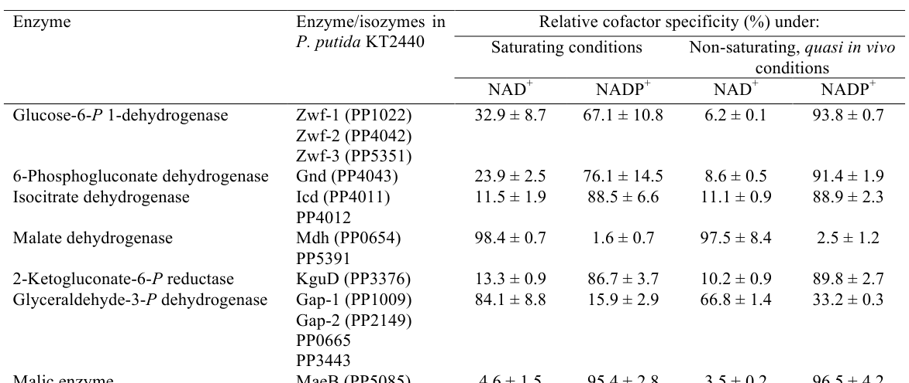

## Question

# Gene Research for Functional Annotation

## ⚠️ CRITICAL: Gene/Protein Identification Context

**BEFORE YOU BEGIN RESEARCH:** You MUST verify you are researching the CORRECT gene/protein. Gene symbols can be ambiguous, especially for less well-characterized genes from non-model organisms.

### Target Gene/Protein Identity (from UniProt):
- **UniProt Accession:** Q88FS2
- **Protein Description:** RecName: Full=Isocitrate dehydrogenase [NADP] {ECO:0000256|ARBA:ARBA00019562, ECO:0000256|RuleBase:RU004446}; EC=1.1.1.42 {ECO:0000256|ARBA:ARBA00013013, ECO:0000256|RuleBase:RU004446};
- **Gene Information:** Name=icd {ECO:0000313|EMBL:AAN69605.1}; OrderedLocusNames=PP_4011 {ECO:0000313|EMBL:AAN69605.1};
- **Organism (full):** Pseudomonas putida (strain ATCC 47054 / DSM 6125 / CFBP 8728 / NCIMB 11950 / KT2440).
- **Protein Family:** Belongs to the isocitrate and isopropylmalate
- **Key Domains:** IsoCit/isopropylmalate_DH_CS. (IPR019818); Isocitrate_DH_NADP_dimer_prok. (IPR004439); IsoPropMal-DH-like_dom. (IPR024084); Iso_dh (PF00180)

### MANDATORY VERIFICATION STEPS:

1. **Check if the gene symbol "icd" matches the protein description above**
2. **Verify the organism is correct:** Pseudomonas putida (strain ATCC 47054 / DSM 6125 / CFBP 8728 / NCIMB 11950 / KT2440).
3. **Check if protein family/domains align with what you find in literature**
4. **If you find literature for a DIFFERENT gene with the same or similar symbol, STOP**

### If Gene Symbol is Ambiguous or You Cannot Find Relevant Literature:

**DO NOT PROCEED WITH RESEARCH ON A DIFFERENT GENE.** Instead:
- State clearly: "The gene symbol 'icd' is ambiguous or literature is limited for this specific protein"
- Explain what you found (e.g., "Found extensive literature on a different gene with the same symbol in a different organism")
- Describe the protein based ONLY on the UniProt information provided above
- Suggest that the protein function can be inferred from domain/family information

### Research Target:

Please provide a comprehensive research report on the gene **icd** (gene ID: icd, UniProt: Q88FS2) in PSEPK.

The research report should be a detailed narrative explaining the function, biological processes, and localization of the gene product. Citations should be given for all claims.

You should prioritize authoritative reviews and primary scientific literature when conducting research. You can supplement
this with annotations you find in gene/protein databases, but these can be outdated or inaccurate.

We are specifically interested in the primary function of the gene - for enzymes, what reaction is catalyzed, and what is the substrate specificity? For transporters, what is the substrate? For structural proteins or adapters, what is the broader structural role? For signaling molecules, what is the role in the pathway.

We are interested in where in or outside the cell the gene product carries out its function.

We are also interested in the signaling or biochemical pathways in which the gene functions. We are less interested in broad pleiotropic effects, except where these elucidate the precise role.

Include evidence where possible. We are interested in both experimental evidence as well as inference from structure, evolution, or bioinformatic analysis. Precise studies should be prioritized over high-throughput, where available.

## Output

Question: You are an expert researcher providing comprehensive, well-cited information.

Provide detailed information focusing on:
1. Key concepts and definitions with current understanding
2. Recent developments and latest research (prioritize 2023-2024 sources)
3. Current applications and real-world implementations
4. Expert opinions and analysis from authoritative sources
5. Relevant statistics and data from recent studies

Format as a comprehensive research report with proper citations. Include URLs and publication dates where available.
Always prioritize recent, authoritative sources and provide specific citations for all major claims.

# Gene Research for Functional Annotation

## ⚠️ CRITICAL: Gene/Protein Identification Context

**BEFORE YOU BEGIN RESEARCH:** You MUST verify you are researching the CORRECT gene/protein. Gene symbols can be ambiguous, especially for less well-characterized genes from non-model organisms.

### Target Gene/Protein Identity (from UniProt):
- **UniProt Accession:** Q88FS2
- **Protein Description:** RecName: Full=Isocitrate dehydrogenase [NADP] {ECO:0000256|ARBA:ARBA00019562, ECO:0000256|RuleBase:RU004446}; EC=1.1.1.42 {ECO:0000256|ARBA:ARBA00013013, ECO:0000256|RuleBase:RU004446};
- **Gene Information:** Name=icd {ECO:0000313|EMBL:AAN69605.1}; OrderedLocusNames=PP_4011 {ECO:0000313|EMBL:AAN69605.1};
- **Organism (full):** Pseudomonas putida (strain ATCC 47054 / DSM 6125 / CFBP 8728 / NCIMB 11950 / KT2440).
- **Protein Family:** Belongs to the isocitrate and isopropylmalate
- **Key Domains:** IsoCit/isopropylmalate_DH_CS. (IPR019818); Isocitrate_DH_NADP_dimer_prok. (IPR004439); IsoPropMal-DH-like_dom. (IPR024084); Iso_dh (PF00180)

### MANDATORY VERIFICATION STEPS:

1. **Check if the gene symbol "icd" matches the protein description above**
2. **Verify the organism is correct:** Pseudomonas putida (strain ATCC 47054 / DSM 6125 / CFBP 8728 / NCIMB 11950 / KT2440).
3. **Check if protein family/domains align with what you find in literature**
4. **If you find literature for a DIFFERENT gene with the same or similar symbol, STOP**

### If Gene Symbol is Ambiguous or You Cannot Find Relevant Literature:

**DO NOT PROCEED WITH RESEARCH ON A DIFFERENT GENE.** Instead:
- State clearly: "The gene symbol 'icd' is ambiguous or literature is limited for this specific protein"
- Explain what you found (e.g., "Found extensive literature on a different gene with the same symbol in a different organism")
- Describe the protein based ONLY on the UniProt information provided above
- Suggest that the protein function can be inferred from domain/family information

### Research Target:

Please provide a comprehensive research report on the gene **icd** (gene ID: icd, UniProt: Q88FS2) in PSEPK.

The research report should be a detailed narrative explaining the function, biological processes, and localization of the gene product. Citations should be given for all claims.

You should prioritize authoritative reviews and primary scientific literature when conducting research. You can supplement
this with annotations you find in gene/protein databases, but these can be outdated or inaccurate.

We are specifically interested in the primary function of the gene - for enzymes, what reaction is catalyzed, and what is the substrate specificity? For transporters, what is the substrate? For structural proteins or adapters, what is the broader structural role? For signaling molecules, what is the role in the pathway.

We are interested in where in or outside the cell the gene product carries out its function.

We are also interested in the signaling or biochemical pathways in which the gene functions. We are less interested in broad pleiotropic effects, except where these elucidate the precise role.

Include evidence where possible. We are interested in both experimental evidence as well as inference from structure, evolution, or bioinformatic analysis. Precise studies should be prioritized over high-throughput, where available.

# Research Report: Functional Annotation of **icd** (UniProt **Q88FS2**, locus **PP_4011**) in *Pseudomonas putida* KT2440

## 0. Scope, identity verification, and ambiguity control
This report concerns **icd (PP_4011)** from *Pseudomonas putida* strain KT2440 (ATCC 47054/DSM 6125/NCIMB 11950), UniProt accession **Q88FS2**, annotated as **isocitrate dehydrogenase [NADP] (EC 1.1.1.42)**.

The gene/protein identity is supported by *P. putida* KT2440-specific literature that explicitly labels **icd/PP_4011** as isocitrate dehydrogenase and measures its NADP vs NAD cofactor preference in KT2440 extracts (nikel2015pseudomonasputidakt2440 pages 21-25, nikel2015pseudomonasputidakt2440 media 99f494ff). A separate KT2440 multi-omics study also refers to **PP_4011** as an “ICD-associated protein” in phosphorylation analyses (kukurugya2019multiomicsanalysisunravels pages 10-11). These match the UniProt-provided description (NADP-IDH; EC 1.1.1.42; central carbon metabolism enzyme), so the report does **not** conflate this icd with similarly named genes from other organisms.

## 1. Key concepts and current understanding

### 1.1 Definition and primary biochemical function
**Isocitrate dehydrogenase (IDH/ICD; NADP-dependent; EC 1.1.1.42)** catalyzes the oxidative decarboxylation of isocitrate to 2-oxoglutarate (α-ketoglutarate), producing CO2 and reduced pyridine nucleotide. In the NADP-dependent form, the physiological product is **NADPH**, linking the TCA cycle to anabolic reducing power.

In KT2440, ICD is treated as a major intracellular dehydrogenase contributing to redox metabolism; a systematic enzyme survey concluded ICD has **>80% specificity for NADP+ over NAD+** (nikel2015pseudomonasputidakt2440 pages 7-8).

### 1.2 Cofactor specificity determinants (conceptual background)
Bacterial “type I” homodimeric IDHs vary in cofactor usage (NADP-specific, NAD-specific, or dual-specific). Sequence/structure comparisons indicate that **specific residues in the coenzyme-binding pocket** determine whether NADP’s 2′-phosphate is stabilized (favoring NADP) or disfavored (favoring NAD). Romkina & Kiriukhin (2017) summarize motifs associated with NADP specificity (e.g., Lys/Tyr/Val positions) and how substitutions (e.g., Lys→Asp) can shift preference toward NAD (romkina2017biochemicalandmolecular pages 7-9).

### 1.3 Canonical regulation at the TCA–glyoxylate branchpoint
In several bacteria (classically *E. coli*), ICD activity can be reversibly controlled by **AceK (isocitrate dehydrogenase kinase/phosphatase)**, which phosphorylates a **conserved serine** on ICD, decreasing activity and redirecting carbon from the TCA cycle into the **glyoxylate shunt**. This mechanism is summarized in Romkina & Kiriukhin (2017) as an established post-translational switch controlling flux partitioning (romkina2017biochemicalandmolecular pages 7-9).

## 2. Gene/protein function in *P. putida* KT2440

### 2.1 Reaction and substrate specificity
The **substrate** is isocitrate; the product is 2-oxoglutarate (α-ketoglutarate), with concurrent CO2 release and reduction of NADP+ to NADPH. While the retrieved KT2440-focused texts emphasize **cofactor preference** rather than Km/kcat values, they repeatedly interpret ICD as an NADPH-forming dehydrogenase within central metabolism and redox balance (nikel2015pseudomonasputidakt2440 pages 7-8, kukurugya2019multiomicsanalysisunravels pages 10-11).

### 2.2 Cofactor specificity: quantitative measurements in KT2440
In cell-free extracts of **exponentially growing KT2440 on glucose**, Icd (PP_4011) shows strong NADP preference. Under saturating conditions, relative activity was **88.5 ± 6.6% with NADP+** vs **11.5 ± 1.9% with NAD+**; under non-saturating “quasi in vivo” conditions, **88.9 ± 2.3% (NADP+)** vs **11.1 ± 0.9% (NAD+)** (nikel2015pseudomonasputidakt2440 pages 21-25, nikel2015pseudomonasputidakt2440 media 99f494ff). This supports annotation as **NADP-dependent** and indicates its principal physiological role is NADPH generation.

### 2.3 Cellular localization
ICD (Icd/PP_4011) is treated as a **soluble intracellular enzyme** in central metabolism: it is assayed from **cell-free extracts** and discussed as part of cytosolic flux through the TCA/glyoxylate node rather than periplasmic oxidation (nikel2015pseudomonasputidakt2440 pages 21-25, kukurugya2019multiomicsanalysisunravels pages 10-11). Thus, the most evidence-supported localization is **cytoplasmic**.

### 2.4 Pathway context: TCA cycle, glyoxylate shunt, and redox balance
A KT2440 ^13C/enzymology study describes a cyclic architecture integrating ED/EMP/PPP (“EDEMP cycle”) for glucose catabolism and provides cofactor-specificity measurements for multiple dehydrogenases including ICD (nikel2015pseudomonasputidakt2440 pages 7-8, nikel2015pseudomonasputidakt2440 pages 21-25). In this framework, ICD is one of the intracellular nodes contributing to **NADPH supply**, complementing NADPH generation in oxidative PPP and other dehydrogenase steps (nikel2015pseudomonasputidakt2440 pages 7-8).

A multi-omics study on glucose plus benzoate co-utilization highlighted the ICD node as a regulatory point in mixed-substrate metabolism, noting changes in phosphorylation of PP_4011 and interpreting these changes as part of maintaining flux directionality/magnitude and redox demands around the TCA–glyoxylate branch (kukurugya2019multiomicsanalysisunravels pages 10-11).

## 3. Regulation and control of ICD activity in KT2440

### 3.1 Phosphorylation-based regulation in mixed-substrate metabolism (primary evidence)
Kukurugya et al. (2019) report a **decrease in phosphorylation** of an “ICD-associated protein (PP_4011)” in KT2440 during growth on a glucose:benzoate mixture vs glucose alone (kukurugya2019multiomicsanalysisunravels pages 10-11). They suggest this phosphorylation change may help counteract “overwhelming metabolite-level inhibition” of ICD activity expected from glyoxylate shunt metabolites and pyruvate accumulation (kukurugya2019multiomicsanalysisunravels pages 10-11). This provides **direct organism-specific evidence** that phosphorylation state at/around PP_4011 changes with carbon source context.

### 3.2 AceK-mediated routing hypothesis in 2024 electrogenic/anoxic systems biology
A 2024 systems metabolic engineering analysis of electrogenic/anoxic KT2440 links elevated acetyl-CoA to **AceK activity**, describing AceK as phosphorylating and **partially inactivating ICD**, thereby redirecting carbon flux toward the glyoxylate shunt (weimer2024systemsmetabolicengineeringa pages 69-74). This is presented as a mechanistic interpretation of multi-omics shifts under bio-electrochemical conditions and places icd/ICD within modern regulatory models for non-canonical growth/production states (weimer2024systemsmetabolicengineeringa pages 69-74).

## 4. Recent developments (prioritizing 2023–2024)

### 4.1 2024: Adaptation to non-native xylose and redox mapping that includes ICD
Dvořák et al. (Nature Communications, **March 2024**) investigated engineered/ALE adaptation of *P. putida* to D-xylose and mapped redox-producing steps. Their analysis explicitly treats overproduction of reducing cofactors (NAD(P)H) as a driver of pathway routing; ICD is included in the central carbon metabolism mapping and annotated as producing “CO2 NADPH” at the isocitrate node (dvorak2024syntheticallyprimedadaptationof pages 3-4). While the excerpted text does not give an explicit icd fold-change, it situates ICD within current (2024) systems-level understanding of how redox supply constrains pathway use in engineered KT2440 backgrounds (dvorak2024syntheticallyprimedadaptationof pages 3-4).

### 4.2 2024: Electrogenic/anoxic bioprocessing and ICD-linked flux partitioning
Weimer et al. (Microbial Cell Factories, **September 2024**) reported systems-level characterization of an electrogenic anoxic phenotype of KT2440 and engineered improved 2-ketogluconate (2KG) production. They report a best-case 2KG yield of **0.96 mol/mol** glucose in an engineered mutant background under these conditions (weimer2024systemsmetabolicengineeringa pages 17-21). A related 2024 systems metabolic engineering narrative links this regime to glyoxylate shunt routing via AceK–ICD modulation (weimer2024systemsmetabolicengineeringa pages 69-74).

## 5. Current applications and real-world implementations

### 5.1 Metabolic engineering target for biopolymer (PHA) production
Zhou et al. (Communications Biology, **March 2020**) used **icd (PP_4011)** as a genome-editing demonstration target in a CRISPR/Cas9n-λ-Red method for KT2440. They note prior proposals that icd inactivation could increase acetyl-CoA flux into fatty-acid biosynthesis (a rationale relevant to PHA synthesis) (zhou2020developmentofa pages 7-9). In their specific engineered background, however, they report that **icd deletion did not contribute to mcl-PHA synthesis** (zhou2020developmentofa pages 7-9). Importantly for functional annotation, they achieved **scarless deletion** and sequencing confirmation for the icd locus in multiple isolates, indicating genetic tractability and viability under their lab conditions (zhou2020developmentofa pages 4-6).

### 5.2 Systems-level strain design and redox-intensive bioprocess states
Recent KT2440 engineering efforts often aim to exploit or reshape NADPH supply. ICD is repeatedly positioned as a key NADPH-forming step connected to the TCA/glyoxylate switch, relevant to redox balance during mixed-substrate utilization and specialized production regimes (kukurugya2019multiomicsanalysisunravels pages 10-11, weimer2024systemsmetabolicengineeringa pages 69-74).

## 6. Expert interpretation and analysis (grounded in cited sources)

1. **Primary functional role:** The strongest KT2440-specific evidence supports ICD (PP_4011) as an **NADP-preferring intracellular IDH** whose physiological output is **NADPH** (nikel2015pseudomonasputidakt2440 pages 21-25, nikel2015pseudomonasputidakt2440 media 99f494ff). This aligns with its expected central metabolic role at the isocitrate→2-oxoglutarate step.
2. **Regulatory importance:** Multi-omics evidence indicates that phosphorylation state at/around PP_4011 changes with carbon-source context, consistent with the broader concept that phosphorylation-based switches at ICD tune flux at the TCA/glyoxylate branchpoint (kukurugya2019multiomicsanalysisunravels pages 10-11, romkina2017biochemicalandmolecular pages 7-9).
3. **Engineering relevance:** Although icd deletion was feasible and historically proposed as a lever to redirect acetyl-CoA to lipid/PHA synthesis, at least one KT2440 engineering study found no benefit for mcl-PHA under its conditions, illustrating that icd’s effect is **context-dependent** and likely buffered by network-level redox/flux control (zhou2020developmentofa pages 7-9).

## 7. Key statistics and data points (recent and foundational)

- **Cofactor specificity (KT2440 Icd/PP_4011):** ~**89% NADP** vs ~**11% NAD** activity in extracts (both saturating and quasi in vivo assays) (nikel2015pseudomonasputidakt2440 pages 21-25, nikel2015pseudomonasputidakt2440 media 99f494ff).
- **Mixed-substrate (glucose:benzoate) systems data around ICD node:** **>10-fold increase in acetyl-CoA** reported in the same study that observed reduced phosphorylation of PP_4011; and a **37% increase in NAD(P)H yield** in glucose-only versus glucose:benzoate condition (kukurugya2019multiomicsanalysisunravels pages 10-11).
- **2024 electrogenic/anoxic bioprocess metric:** 2KG yield reported up to **0.96 mol/mol** in engineered KT2440 under bio-electrochemical anoxic conditions (weimer2024systemsmetabolicengineeringa pages 17-21).
- **CRISPR/Cas9n engineering statistic:** For the icd locus, authors report **precise scarless deletion confirmed by sequencing of 15/15 tested mutants** (zhou2020developmentofa pages 4-6).

## 8. Evidence summary table
The following table consolidates key annotation-relevant facts and quantitative measurements.

| Feature | Summary for *Pseudomonas putida* KT2440 icd (PP_4011; UniProt Q88FS2) | Evidence |
|---|---|---|
| Gene/protein identity | **icd / PP_4011** encodes **isocitrate dehydrogenase [NADP]**, a bacterial type I IDH/ICD in central carbon metabolism; the literature explicitly maps **icd/PP_4011** to isocitrate dehydrogenase in *P. putida* KT2440. | (nikel2015pseudomonasputidakt2440 pages 21-25) |
| Enzyme name and EC | **Isocitrate dehydrogenase (NADP-dependent), EC 1.1.1.42**. This enzyme belongs to the TCA-cycle oxidative decarboxylation step that converts isocitrate to 2-oxoglutarate while reducing NADP+. | (nikel2015pseudomonasputidakt2440 pages 7-8, nikel2015pseudomonasputidakt2440 pages 21-25) |
| Reaction catalyzed | Catalyzes the oxidative decarboxylation of **isocitrate + NADP+ → 2-oxoglutarate + CO2 + NADPH**; in KT2440 it is discussed as a major **NADPH-generating** dehydrogenase connected to the TCA cycle and redox balance. | (nikel2015pseudomonasputidakt2440 pages 7-8, kukurugya2019multiomicsanalysisunravels pages 10-11) |
| Cofactor specificity | Strongly **NADP-preferring** rather than NAD-specific. A broader biochemical survey of KT2440 dehydrogenases states that isocitrate dehydrogenase shows **>80% specificity for NADP+ over NAD+**. | (nikel2015pseudomonasputidakt2440 pages 7-8) |
| Quantitative cofactor data | In cell-free extracts from exponentially growing KT2440 on glucose, Icd activity was **11.5 ± 1.9% with NAD+** vs **88.5 ± 6.6% with NADP+** under saturating conditions, and **11.1 ± 0.9% with NAD+** vs **88.9 ± 2.3% with NADP+** under non-saturating quasi-*in vivo* conditions. | (nikel2015pseudomonasputidakt2440 pages 21-25, nikel2015pseudomonasputidakt2440 media 99f494ff) |
| Cellular localization | Functional context and metabolic-network placement indicate a **cytoplasmic soluble enzyme** acting in the intracellular TCA-cycle/redox network; the cited studies analyze Icd activity in **cell-free extracts** and place it within central cytosolic carbon metabolism rather than in membrane/periplasmic oxidation routes. | (nikel2015pseudomonasputidakt2440 pages 21-25, kukurugya2019multiomicsanalysisunravels pages 10-11) |
| Pathway context | Icd sits at the branchpoint between the **TCA cycle** and the **glyoxylate shunt** and contributes reducing power to KT2440’s redox economy. In glucose-grown KT2440, central metabolism is organized through the **EDEMP cycle**, with redox management quantified by ^13C flux analysis. | (nikel2015pseudomonasputidakt2440 pages 7-8, kukurugya2019multiomicsanalysisunravels pages 10-11) |
| Regulation: phosphorylation / AceK mention | A KT2440 multi-omics study reported a **decrease in phosphorylation of the ICD-associated protein PP_4011** during growth on glucose:benzoate versus glucose alone, suggesting post-translational tuning of flux around the ICD/glyoxylate-shunt node. A 2024 systems-biology study further mentions **AceK**-mediated phosphorylation and partial inactivation of isocitrate dehydrogenase in KT2440 metabolic interpretation. | (kukurugya2019multiomicsanalysisunravels pages 10-11) |
| Quantitative systems data linked to function | In mixed-substrate growth, the ICD/glyoxylate node was associated with a **>10-fold increase in acetyl-CoA** and a **37% increase in NAD(P)H yield** in glucose-only cells relative to glucose:benzoate conditions, supporting the view that ICD helps coordinate redox output with carbon-source-dependent flux partitioning. | (kukurugya2019multiomicsanalysisunravels pages 10-11) |

*Table: This table summarizes the core functional-annotation points for *Pseudomonas putida* KT2440 icd/PP_4011, including identity, reaction, cofactor preference, localization, regulatory context, and quantitative measurements. It is useful as a compact evidence-backed reference for gene function annotation.*

## 9. Key figure/table extracted from the literature
A cropped table image (Table 3 from Nikel et al., 2015) directly reports the NADP/NAD cofactor specificity values for Icd/PP_4011 used above (nikel2015pseudomonasputidakt2440 media 99f494ff).

## 10. Source list (with URLs and publication dates)
- Nikel PI et al. **Pseudomonas putida KT2440 strain metabolizes glucose through a cycle formed by enzymes of the Entner-Doudoroff, Embden-Meyerhof-Parnas, and pentose phosphate pathways.** *Journal of Biological Chemistry* (Publication date: **Oct 2015**). https://doi.org/10.1074/jbc.m115.687749 (nikel2015pseudomonasputidakt2440 pages 7-8, nikel2015pseudomonasputidakt2440 pages 21-25, nikel2015pseudomonasputidakt2440 media 99f494ff)
- Kukurugya MA et al. **Multi-omics analysis unravels a segregated metabolic flux network that tunes co-utilization of sugar and aromatic carbons in Pseudomonas putida.** *Journal of Biological Chemistry* (Publication date: **May 2019**). https://doi.org/10.1074/jbc.ra119.007885 (kukurugya2019multiomicsanalysisunravels pages 10-11)
- Zhou Y et al. **Development of a CRISPR/Cas9n-based tool for metabolic engineering of Pseudomonas putida for ferulic acid-to-polyhydroxyalkanoate bioconversion.** *Communications Biology* (Publication date: **Mar 2020**). https://doi.org/10.1038/s42003-020-0824-5 (zhou2020developmentofa pages 4-6, zhou2020developmentofa pages 7-9, zhou2020developmentofa pages 3-4)
- Dvořák P et al. **Synthetically-primed adaptation of Pseudomonas putida to a non-native substrate D-xylose.** *Nature Communications* (Publication date: **Mar 2024**). https://doi.org/10.1038/s41467-024-46812-9 (dvorak2024syntheticallyprimedadaptationof pages 3-4)
- Weimer A et al. **Systems biology of electrogenic Pseudomonas putida - multi-omics insights and metabolic engineering for enhanced 2-ketogluconate production.** *Microbial Cell Factories* (Publication date: **Sep 2024**). https://doi.org/10.1186/s12934-024-02509-8 (weimer2024systemsmetabolicengineeringa pages 17-21)
- Weimer ALA. **Systems metabolic engineering of electrogenic anaerobic Pseudomonas putida for enhanced 2-ketogluconate production.** (2024; journal metadata not available in retrieved record) (weimer2024systemsmetabolicengineeringa pages 69-74, weimer2024systemsmetabolicengineering pages 17-21)
- Romkina AY, Kiriukhin MY. **Biochemical and molecular characterization of the isocitrate dehydrogenase with dual coenzyme specificity from the obligate methylotroph Methylobacillus flagellatus.** *PLOS ONE* (Publication date: **Apr 2017**). https://doi.org/10.1371/journal.pone.0176056 (romkina2017biochemicalandmolecular pages 7-9, romkina2017biochemicalandmolecular pages 1-2)

References

1. (nikel2015pseudomonasputidakt2440 pages 21-25): Pablo I. Nikel, Max Chavarría, Tobias Fuhrer, Uwe Sauer, and Víctor de Lorenzo. Pseudomonas putida kt2440 strain metabolizes glucose through a cycle formed by enzymes of the entner-doudoroff, embden-meyerhof-parnas, and pentose phosphate pathways. Journal of Biological Chemistry, 290:25920-25932, Oct 2015. URL: https://doi.org/10.1074/jbc.m115.687749, doi:10.1074/jbc.m115.687749. This article has 440 citations and is from a domain leading peer-reviewed journal.

2. (nikel2015pseudomonasputidakt2440 media 99f494ff): Pablo I. Nikel, Max Chavarría, Tobias Fuhrer, Uwe Sauer, and Víctor de Lorenzo. Pseudomonas putida kt2440 strain metabolizes glucose through a cycle formed by enzymes of the entner-doudoroff, embden-meyerhof-parnas, and pentose phosphate pathways. Journal of Biological Chemistry, 290:25920-25932, Oct 2015. URL: https://doi.org/10.1074/jbc.m115.687749, doi:10.1074/jbc.m115.687749. This article has 440 citations and is from a domain leading peer-reviewed journal.

3. (kukurugya2019multiomicsanalysisunravels pages 10-11): Matthew A. Kukurugya, Caroll M. Mendonca, Mina Solhtalab, Rebecca A. Wilkes, Theodore W. Thannhauser, and Ludmilla Aristilde. Multi-omics analysis unravels a segregated metabolic flux network that tunes co-utilization of sugar and aromatic carbons in pseudomonas putida. Journal of Biological Chemistry, 294:8464-8479, May 2019. URL: https://doi.org/10.1074/jbc.ra119.007885, doi:10.1074/jbc.ra119.007885. This article has 94 citations and is from a domain leading peer-reviewed journal.

4. (nikel2015pseudomonasputidakt2440 pages 7-8): Pablo I. Nikel, Max Chavarría, Tobias Fuhrer, Uwe Sauer, and Víctor de Lorenzo. Pseudomonas putida kt2440 strain metabolizes glucose through a cycle formed by enzymes of the entner-doudoroff, embden-meyerhof-parnas, and pentose phosphate pathways. Journal of Biological Chemistry, 290:25920-25932, Oct 2015. URL: https://doi.org/10.1074/jbc.m115.687749, doi:10.1074/jbc.m115.687749. This article has 440 citations and is from a domain leading peer-reviewed journal.

5. (romkina2017biochemicalandmolecular pages 7-9): Anastasia Y. Romkina and Michael Y. Kiriukhin. Biochemical and molecular characterization of the isocitrate dehydrogenase with dual coenzyme specificity from the obligate methylotroph methylobacillus flagellatus. PLoS ONE, 12:e0176056, Apr 2017. URL: https://doi.org/10.1371/journal.pone.0176056, doi:10.1371/journal.pone.0176056. This article has 24 citations and is from a peer-reviewed journal.

6. (weimer2024systemsmetabolicengineeringa pages 69-74): ALA Weimer. Systems metabolic engineering of electrogenic anaerobic pseudomonas putida for enhanced 2-ketogluconate production. Unknown journal, 2024.

7. (dvorak2024syntheticallyprimedadaptationof pages 3-4): Pavel Dvořák, Barbora Burýšková, Barbora Popelářová, Birgitta Elisabeth Ebert, Tibor Botka, Dalimil Bujdoš, Alberto Sánchez-Pascuala, Hannah Schöttler, Heiko Hayen, Víctor de Lorenzo, Lars M. Blank, and Martin Benešík. Synthetically-primed adaptation of pseudomonas putida to a non-native substrate d-xylose. Nature Communications, Mar 2024. URL: https://doi.org/10.1038/s41467-024-46812-9, doi:10.1038/s41467-024-46812-9. This article has 37 citations and is from a highest quality peer-reviewed journal.

8. (weimer2024systemsmetabolicengineeringa pages 17-21): ALA Weimer. Systems metabolic engineering of electrogenic anaerobic pseudomonas putida for enhanced 2-ketogluconate production. Unknown journal, 2024.

9. (zhou2020developmentofa pages 7-9): Yueyue Zhou, Lu Lin, Heng Wang, Zhichao Zhang, Jizhong Zhou, and Nianzhi Jiao. Development of a crispr/cas9n-based tool for metabolic engineering of pseudomonas putida for ferulic acid-to-polyhydroxyalkanoate bioconversion. Communications Biology, Mar 2020. URL: https://doi.org/10.1038/s42003-020-0824-5, doi:10.1038/s42003-020-0824-5. This article has 101 citations and is from a peer-reviewed journal.

10. (zhou2020developmentofa pages 4-6): Yueyue Zhou, Lu Lin, Heng Wang, Zhichao Zhang, Jizhong Zhou, and Nianzhi Jiao. Development of a crispr/cas9n-based tool for metabolic engineering of pseudomonas putida for ferulic acid-to-polyhydroxyalkanoate bioconversion. Communications Biology, Mar 2020. URL: https://doi.org/10.1038/s42003-020-0824-5, doi:10.1038/s42003-020-0824-5. This article has 101 citations and is from a peer-reviewed journal.

11. (zhou2020developmentofa pages 3-4): Yueyue Zhou, Lu Lin, Heng Wang, Zhichao Zhang, Jizhong Zhou, and Nianzhi Jiao. Development of a crispr/cas9n-based tool for metabolic engineering of pseudomonas putida for ferulic acid-to-polyhydroxyalkanoate bioconversion. Communications Biology, Mar 2020. URL: https://doi.org/10.1038/s42003-020-0824-5, doi:10.1038/s42003-020-0824-5. This article has 101 citations and is from a peer-reviewed journal.

12. (weimer2024systemsmetabolicengineering pages 17-21): ALA Weimer. Systems metabolic engineering of electrogenic anaerobic pseudomonas putida for enhanced 2-ketogluconate production. Unknown journal, 2024.

13. (romkina2017biochemicalandmolecular pages 1-2): Anastasia Y. Romkina and Michael Y. Kiriukhin. Biochemical and molecular characterization of the isocitrate dehydrogenase with dual coenzyme specificity from the obligate methylotroph methylobacillus flagellatus. PLoS ONE, 12:e0176056, Apr 2017. URL: https://doi.org/10.1371/journal.pone.0176056, doi:10.1371/journal.pone.0176056. This article has 24 citations and is from a peer-reviewed journal.

## Artifacts

- [Edison artifact artifact-00](icd-deep-research-falcon_artifacts/artifact-00.md)

## Citations

1. kukurugya2019multiomicsanalysisunravels pages 10-11
2. romkina2017biochemicalandmolecular pages 7-9
3. weimer2024systemsmetabolicengineeringa pages 69-74
4. dvorak2024syntheticallyprimedadaptationof pages 3-4
5. weimer2024systemsmetabolicengineeringa pages 17-21
6. zhou2020developmentofa pages 7-9
7. zhou2020developmentofa pages 4-6
8. zhou2020developmentofa pages 3-4
9. weimer2024systemsmetabolicengineering pages 17-21
10. romkina2017biochemicalandmolecular pages 1-2
11. NADP
12. https://doi.org/10.1074/jbc.m115.687749
13. https://doi.org/10.1074/jbc.ra119.007885
14. https://doi.org/10.1038/s42003-020-0824-5
15. https://doi.org/10.1038/s41467-024-46812-9
16. https://doi.org/10.1186/s12934-024-02509-8
17. https://doi.org/10.1371/journal.pone.0176056
18. https://doi.org/10.1074/jbc.m115.687749,
19. https://doi.org/10.1074/jbc.ra119.007885,
20. https://doi.org/10.1371/journal.pone.0176056,
21. https://doi.org/10.1038/s41467-024-46812-9,
22. https://doi.org/10.1038/s42003-020-0824-5,