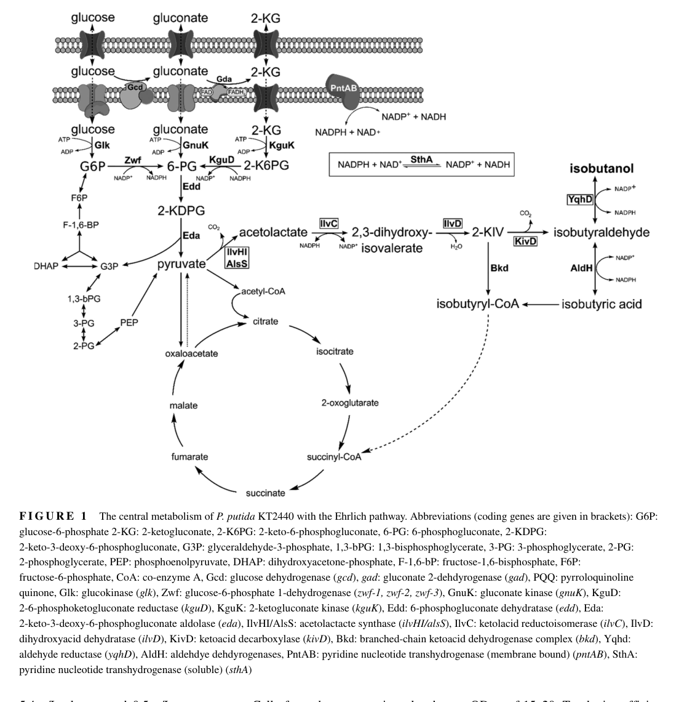

## Question

# Gene Research for Functional Annotation

## ⚠️ CRITICAL: Gene/Protein Identification Context

**BEFORE YOU BEGIN RESEARCH:** You MUST verify you are researching the CORRECT gene/protein. Gene symbols can be ambiguous, especially for less well-characterized genes from non-model organisms.

### Target Gene/Protein Identity (from UniProt):
- **UniProt Accession:** Q88DZ0
- **Protein Description:** RecName: Full=Ketol-acid reductoisomerase (NADP(+)) {ECO:0000255|HAMAP-Rule:MF_00435}; Short=KARI {ECO:0000255|HAMAP-Rule:MF_00435}; EC=1.1.1.86 {ECO:0000255|HAMAP-Rule:MF_00435}; AltName: Full=Acetohydroxy-acid isomeroreductase {ECO:0000255|HAMAP-Rule:MF_00435}; Short=AHIR {ECO:0000255|HAMAP-Rule:MF_00435}; AltName: Full=Alpha-keto-beta-hydroxylacyl reductoisomerase {ECO:0000255|HAMAP-Rule:MF_00435}; AltName: Full=Ketol-acid reductoisomerase type 1 {ECO:0000255|HAMAP-Rule:MF_00435}; AltName: Full=Ketol-acid reductoisomerase type I {ECO:0000255|HAMAP-Rule:MF_00435};
- **Gene Information:** Name=ilvC {ECO:0000255|HAMAP-Rule:MF_00435}; OrderedLocusNames=PP_4678;
- **Organism (full):** Pseudomonas putida (strain ATCC 47054 / DSM 6125 / CFBP 8728 / NCIMB 11950 / KT2440).
- **Protein Family:** Belongs to the ketol-acid reductoisomerase family.
- **Key Domains:** 6-PGluconate_DH-like_C_sf. (IPR008927); KARI. (IPR013023); KARI_C. (IPR000506); KARI_N. (IPR013116); KARI_prok. (IPR014359)

### MANDATORY VERIFICATION STEPS:

1. **Check if the gene symbol "ilvC" matches the protein description above**
2. **Verify the organism is correct:** Pseudomonas putida (strain ATCC 47054 / DSM 6125 / CFBP 8728 / NCIMB 11950 / KT2440).
3. **Check if protein family/domains align with what you find in literature**
4. **If you find literature for a DIFFERENT gene with the same or similar symbol, STOP**

### If Gene Symbol is Ambiguous or You Cannot Find Relevant Literature:

**DO NOT PROCEED WITH RESEARCH ON A DIFFERENT GENE.** Instead:
- State clearly: "The gene symbol 'ilvC' is ambiguous or literature is limited for this specific protein"
- Explain what you found (e.g., "Found extensive literature on a different gene with the same symbol in a different organism")
- Describe the protein based ONLY on the UniProt information provided above
- Suggest that the protein function can be inferred from domain/family information

### Research Target:

Please provide a comprehensive research report on the gene **ilvC** (gene ID: ilvC, UniProt: Q88DZ0) in PSEPK.

The research report should be a detailed narrative explaining the function, biological processes, and localization of the gene product. Citations should be given for all claims.

You should prioritize authoritative reviews and primary scientific literature when conducting research. You can supplement
this with annotations you find in gene/protein databases, but these can be outdated or inaccurate.

We are specifically interested in the primary function of the gene - for enzymes, what reaction is catalyzed, and what is the substrate specificity? For transporters, what is the substrate? For structural proteins or adapters, what is the broader structural role? For signaling molecules, what is the role in the pathway.

We are interested in where in or outside the cell the gene product carries out its function.

We are also interested in the signaling or biochemical pathways in which the gene functions. We are less interested in broad pleiotropic effects, except where these elucidate the precise role.

Include evidence where possible. We are interested in both experimental evidence as well as inference from structure, evolution, or bioinformatic analysis. Precise studies should be prioritized over high-throughput, where available.

## Output

Question: You are an expert researcher providing comprehensive, well-cited information.

Provide detailed information focusing on:
1. Key concepts and definitions with current understanding
2. Recent developments and latest research (prioritize 2023-2024 sources)
3. Current applications and real-world implementations
4. Expert opinions and analysis from authoritative sources
5. Relevant statistics and data from recent studies

Format as a comprehensive research report with proper citations. Include URLs and publication dates where available.
Always prioritize recent, authoritative sources and provide specific citations for all major claims.

# Gene Research for Functional Annotation

## ⚠️ CRITICAL: Gene/Protein Identification Context

**BEFORE YOU BEGIN RESEARCH:** You MUST verify you are researching the CORRECT gene/protein. Gene symbols can be ambiguous, especially for less well-characterized genes from non-model organisms.

### Target Gene/Protein Identity (from UniProt):
- **UniProt Accession:** Q88DZ0
- **Protein Description:** RecName: Full=Ketol-acid reductoisomerase (NADP(+)) {ECO:0000255|HAMAP-Rule:MF_00435}; Short=KARI {ECO:0000255|HAMAP-Rule:MF_00435}; EC=1.1.1.86 {ECO:0000255|HAMAP-Rule:MF_00435}; AltName: Full=Acetohydroxy-acid isomeroreductase {ECO:0000255|HAMAP-Rule:MF_00435}; Short=AHIR {ECO:0000255|HAMAP-Rule:MF_00435}; AltName: Full=Alpha-keto-beta-hydroxylacyl reductoisomerase {ECO:0000255|HAMAP-Rule:MF_00435}; AltName: Full=Ketol-acid reductoisomerase type 1 {ECO:0000255|HAMAP-Rule:MF_00435}; AltName: Full=Ketol-acid reductoisomerase type I {ECO:0000255|HAMAP-Rule:MF_00435};
- **Gene Information:** Name=ilvC {ECO:0000255|HAMAP-Rule:MF_00435}; OrderedLocusNames=PP_4678;
- **Organism (full):** Pseudomonas putida (strain ATCC 47054 / DSM 6125 / CFBP 8728 / NCIMB 11950 / KT2440).
- **Protein Family:** Belongs to the ketol-acid reductoisomerase family.
- **Key Domains:** 6-PGluconate_DH-like_C_sf. (IPR008927); KARI. (IPR013023); KARI_C. (IPR000506); KARI_N. (IPR013116); KARI_prok. (IPR014359)

### MANDATORY VERIFICATION STEPS:

1. **Check if the gene symbol "ilvC" matches the protein description above**
2. **Verify the organism is correct:** Pseudomonas putida (strain ATCC 47054 / DSM 6125 / CFBP 8728 / NCIMB 11950 / KT2440).
3. **Check if protein family/domains align with what you find in literature**
4. **If you find literature for a DIFFERENT gene with the same or similar symbol, STOP**

### If Gene Symbol is Ambiguous or You Cannot Find Relevant Literature:

**DO NOT PROCEED WITH RESEARCH ON A DIFFERENT GENE.** Instead:
- State clearly: "The gene symbol 'ilvC' is ambiguous or literature is limited for this specific protein"
- Explain what you found (e.g., "Found extensive literature on a different gene with the same symbol in a different organism")
- Describe the protein based ONLY on the UniProt information provided above
- Suggest that the protein function can be inferred from domain/family information

### Research Target:

Please provide a comprehensive research report on the gene **ilvC** (gene ID: ilvC, UniProt: Q88DZ0) in PSEPK.

The research report should be a detailed narrative explaining the function, biological processes, and localization of the gene product. Citations should be given for all claims.

You should prioritize authoritative reviews and primary scientific literature when conducting research. You can supplement
this with annotations you find in gene/protein databases, but these can be outdated or inaccurate.

We are specifically interested in the primary function of the gene - for enzymes, what reaction is catalyzed, and what is the substrate specificity? For transporters, what is the substrate? For structural proteins or adapters, what is the broader structural role? For signaling molecules, what is the role in the pathway.

We are interested in where in or outside the cell the gene product carries out its function.

We are also interested in the signaling or biochemical pathways in which the gene functions. We are less interested in broad pleiotropic effects, except where these elucidate the precise role.

Include evidence where possible. We are interested in both experimental evidence as well as inference from structure, evolution, or bioinformatic analysis. Precise studies should be prioritized over high-throughput, where available.

## Research report: Functional annotation of *Pseudomonas putida* KT2440 **ilvC** (UniProt Q88DZ0; locus PP_4678)

### 0) Target verification (critical disambiguation)
The requested target (UniProt Q88DZ0) corresponds to *Pseudomonas putida* KT2440 **ilvC** (locus **PP_4678**), which encodes **ketol-acid reductoisomerase** (KARI; also called **acetohydroxyacid isomeroreductase**, AHAIR; EC **1.1.1.86**) and is part of the branched-chain amino-acid (BCAA) biosynthesis machinery. This identity is supported by KT2440 gene-essentiality screening explicitly listing **PP4678 = ilvC** and by multiple KT2440 metabolic-engineering studies that identify the native **ilvCD** locus and use it as the ketol-acid reductoisomerase (ilvC) and dihydroxyacid dehydratase (ilvD) module. (molina‐henares2010identificationofconditionally pages 2-3, nitschel2020engineeringpseudomonasputida pages 7-8)

### 1) Key concepts and current understanding
#### 1.1 Definitions and enzyme class
**Ketol-acid reductoisomerase (KARI; IlvC/AHAIR)** is a conserved bacterial enzyme family within the 6-phosphogluconate dehydrogenase (6PGDH)-type superfamily that performs a chemically coupled **alkyl-migration (isomerization)** and **NADP(H)-dependent reduction** step in BCAA biosynthesis. (verdel‐aranda2015molecularannotationof pages 2-4)

#### 1.2 Reaction and pathway position
In the canonical bacterial BCAA pathway, IlvC/AHAIR is the **second** enzyme in the pyruvate-to-2-ketoisovalerate segment (AHAS → AHAIR/IlvC → DHAD/IlvD). AHAS produces the IlvC substrates **2-acetolactate** (valine/leucine branch) and **2-aceto-2-hydroxybutyrate (acetohydroxybutyrate)** (isoleucine branch), and IlvC converts these toward the corresponding dihydroxy-acid intermediates for subsequent dehydration by IlvD. (lu2015characterizationandmodification pages 1-5)

A detailed mechanistic description from biochemical work indicates IlvC requires **NADPH** for the reduction half-reaction and a **divalent metal ion (most commonly Mg²⁺)** to support the alkyl-migration/isomerization chemistry, which is mechanistically integrated in a single catalytic cycle for most KARIs. (lu2015characterizationandmodification pages 5-9)

#### 1.3 Substrate specificity and promiscuity
KARI substrate space is broader than a single physiological substrate pair; comparative enzyme studies emphasize that KARIs can show **substrate promiscuity** and that paralogs/orthologs can differ substantially in catalytic efficiencies across related keto/hydroxy-acid substrates relevant to valine and isoleucine precursor chemistry. (verdel‐aranda2015molecularannotationof pages 1-2, verdel‐aranda2015molecularannotationof pages 4-6)

#### 1.4 Cofactor dependence (NADPH) and metal requirement
Primary biochemical assays for IlvC commonly use **α-acetolactate** as substrate and quantify activity by following **NADPH oxidation** at 340 nm, while including **MgCl₂** in the reaction mixture. (lu2015characterizationandmodification pages 9-13)

A representative purified bacterial IlvC (from *Ralstonia eutropha* H16) shows Michaelis–Menten parameters: **K\_M(α-acetolactate) ≈ 6.2 mM**, **K\_M(NADPH) ≈ 12.5 µM**, and **V\_max ≈ 191 ± 3 mU/mg**. (lu2015characterizationandmodification pages 34-39)

#### 1.5 Cellular localization
No direct subcellular-localization experiment was retrieved for *P. putida* KT2440 IlvC specifically; however, a Gram-negative bacterial IlvC homolog was reported as a **soluble protein** that could be purified without detergents, consistent with a **cytosolic enzyme** (as expected for a central-metabolism biosynthetic enzyme operating on cytosolic intermediates). This provides supporting evidence for inferring cytosolic localization for KT2440 IlvC. (lu2015characterizationandmodification pages 13-17)

### 2) *Pseudomonas putida* KT2440-specific functional evidence
#### 2.1 Conditional essentiality and auxotrophy phenotypes
A genome-wide knockout screen on glucose minimal medium identified **ilvC (PP4678)** among genes whose disruption prevents growth on M9 minimal medium, i.e., conditionally essential in that environment. (molina‐henares2010identificationofconditionally pages 2-3)

Phenotypic follow-up reported that **ilvC** (and **ilvD**) mutants show BCAA-related auxotrophies: ilvC/ilvD mutants were described as requiring **valine and leucine** for growth in one context and being classified under **isoleucine auxotrophs** with partial rescue by L-isoleucine in another table-based summary, indicating that loss of IlvC disrupts multiple branches of BCAA supply under minimal conditions. (molina‐henares2010identificationofconditionally pages 7-9, molina‐henares2010identificationofconditionally pages 6-7)

#### 2.2 Integration in KT2440 redox and carbon-flux engineering
Because IlvC is NADPH-dependent, its activity becomes a key constraint when KT2440 is engineered to overproduce **2-ketoisovalerate (2-KIV)** or **isobutanol**. In engineered KT2440 isobutanol pathways, IlvC functions alongside AlsS (AHAS substitute) and IlvD to generate 2-KIV, which is then decarboxylated and reduced to isobutanol; the pathway is explicitly described as **NADPH-consuming**, and KT2440 engineering includes redox-balancing steps such as deleting soluble transhydrogenase **sthA**. (nitschel2020engineeringpseudomonasputida pages 8-10, nitschel2020engineeringpseudomonasputida pages 7-8)

### 3) Recent developments (prioritizing 2023–2024)
#### 3.1 2023: Tunable growth/product “metabolic valve” in *P. putida* KT2440
A 2023 *Metabolic Engineering* study implemented a tunable **PDH (pyruvate dehydrogenase) valve** to control growth while enabling overflow of pyruvate, and coupled this with a 2-KIV module containing **alsS-ilvC-ilvD** (native ilvC/ilvD plus heterologous alsS) under inducible control. This work highlights ilvC as a core lever for converting pyruvate into BCAA-derived platform intermediates in KT2440. (batianis2023atunablemetabolic pages 4-5)

#### 3.2 2024: Authoritative review synthesis for isobutanol pathways
A 2024 review (Applied Microbiology and Biotechnology) positions **ilvC/KARI (AHAIR)** as the second enzymatic step converting 2-acetolactate to 2,3-dihydroxyisovalerate in BCAA-derived isobutanol pathways and emphasizes that **redox/cofactor engineering** is a recurring requirement for improving isobutanol production (cofactor deficiency/redox imbalance is widely treated as a bottleneck), alongside pathway overexpression and blocking competing routes. (Published Jan 2024; https://doi.org/10.1007/s00253-023-12821-9) (nawab2024microbialhostengineering pages 1-3, nawab2024microbialhostengineering pages 6-8)

#### 3.3 2024: Cofactor rewiring of IlvC to shift NADPH → NADH usage
A 2024 *Microbial Cell Factories* study demonstrates modern cofactor-engineering directly targeting ilvC/AHAIR: a triple mutant **L67E/R68F/K75E** (AHAIRM) was described as shifting preference from NADPH toward **NADH**, and increasing expression of this NADH-utilizing AHAIR increased carbon flux to α-ketoisovalerate (including an increase of diverted carbon ratio from 32.9% to 48.4%) and enabled high KIV titers (e.g., 18.8 g/L from 60 g/L glucose in 21 h; and up to ~40.7 g/L from whey powder in fed-batch with yield ~0.418 g/g lactose). Although this is not in *Pseudomonas*, it is directly relevant to interpreting ilvC/KARI as a redox bottleneck and a design target. (Published Oct 2024; https://doi.org/10.1186/s12934-024-02545-4) (sun2024productionofαketoisovalerate pages 6-8, sun2024productionofαketoisovalerate pages 8-9)

### 4) Current applications and real-world implementations
#### 4.1 Industrial biotechnology: BCAA-pathway-derived chemicals in *P. putida*
In KT2440, ilvC is widely used as part of engineered modules for producing **isobutanol**, a next-generation biofuel/solvent. A representative KT2440 study overexpressed native **ilvC/ilvD** and incorporated heterologous steps to convert 2-KIV to isobutanol, achieving **22 ± 2 mg isobutanol per g glucose** under aerobic conditions. (Published Feb 2020; https://doi.org/10.1002/elsc.201900151) (nitschel2020engineeringpseudomonasputida pages 1-2)

A subsequent KT2440 bioprocess study scaled production and showed that shifting to **micro-aerobic production** conditions can improve conversion yield and reduce undesired carbon loss, reporting **3.35 g/L** isobutanol in a two-stage process and an integral yield of **60 mg/g glucose** under micro-aerobic production conditions. (Published Mar 2021; https://doi.org/10.1002/elsc.202000116) (ankenbauer2021micro‐aerobicproductionof pages 1-2, ankenbauer2021micro‐aerobicproductionof pages 8-10)

#### 4.2 Systems metabolic engineering: growth-coupled production control (2023)
The 2023 “metabolic valve” approach explicitly treats the ilvC-containing 2-KIV module as a controllable sink for pyruvate, enabling engineered coupling between growth control (via PDH modulation) and production potential for BCAA-derived intermediates. (Published Jan 2023; https://doi.org/10.1016/j.ymben.2022.10.002) (batianis2023atunablemetabolic pages 4-5)

### 5) Expert opinions / analysis (authoritative synthesis)
#### 5.1 IlvC as a predictable redox bottleneck
Across engineered BCAA-derived alcohol/ketoacid pathways, IlvC/KARI is repeatedly implicated as a **redox-limited node** because it uses NADPH, while many central metabolic processes regenerate NADH more readily. The 2024 review frames “cofactor engineering” as a standard strategy to overcome these limitations alongside enzyme overexpression and competing-pathway deletions. (nawab2024microbialhostengineering pages 1-3, nawab2024microbialhostengineering pages 6-8)

#### 5.2 Practical interpretation for KT2440 functional annotation
For annotation purposes, the strongest KT2440-specific evidence supports: (i) IlvC is essential for de novo BCAA synthesis in minimal conditions (auxotrophy/conditional essentiality), and (ii) IlvC is a high-leverage enzyme for redirecting carbon from pyruvate into 2-KIV/isobutanol modules, with system-level consequences driven by NADPH availability and transhydrogenase activity. (molina‐henares2010identificationofconditionally pages 2-3, nitschel2020engineeringpseudomonasputida pages 7-8)

### 6) Key quantitative statistics and data points
The table below consolidates the most directly supported functional-annotation and application data for KT2440 ilvC and closely related IlvC biochemistry.

| Aspect | Key findings | Evidence type | Best citations |
|---|---|---|---|
| Identity | PP_4678 in *Pseudomonas putida* KT2440 is annotated as **ilvC**, encoding ketol-acid reductoisomerase/acetohydroxyacid isomeroreductase (KARI/AHAIR; EC 1.1.1.86). Independent *P. putida* engineering studies place native ilvC in the ilvCD locus used for branched-chain ketoacid formation, matching UniProt Q88DZ0. | Experimental, engineering, inference | (nitschel2020engineeringpseudomonasputida pages 7-8, molina‐henares2010identificationofconditionally pages 2-3) |
| Reaction | IlvC/KARI catalyzes the coupled **isomerization plus reduction** step of branched-chain amino-acid biosynthesis, converting AHAS products toward dihydroxy-acid intermediates on the route to 2-ketoisovalerate and related branched-chain precursors. | Experimental, inference | (verdel‐aranda2015molecularannotationof pages 2-4, lu2015characterizationandmodification pages 1-5) |
| Substrates/cofactors | Physiological substrates include acetolactate/acetohydroxybutyrate pathway intermediates; assays for bacterial IlvC use α-acetolactate as substrate and monitor **NADPH** oxidation. KARI generally requires a divalent metal ion, usually **Mg²⁺**, for the alkyl-migration step. | Experimental, inference | (lu2015characterizationandmodification pages 9-13, lu2015characterizationandmodification pages 5-9) |
| Pathway role | IlvC is the second step in the pyruvate-to-2-ketoisovalerate segment of **branched-chain amino-acid biosynthesis**. It supports synthesis of valine and isoleucine directly and leucine indirectly via 2-oxoisovalerate-derived metabolism. | Experimental, inference | (lu2015characterizationandmodification pages 1-5, molina‐henares2010identificationofconditionally pages 7-9) |
| Localization | No direct localization study was found for *P. putida* IlvC, but bacterial IlvC/AHAIR is characterized as a **soluble/cytosolic** enzyme in related Gram-negative bacteria, with purification from soluble lysate and no detergent requirement; this supports a cytosolic localization inference for KT2440 IlvC. | Experimental in homolog, inference for *P. putida* | (lu2015characterizationandmodification pages 13-17, lu2015characterizationandmodification pages 9-13) |
| Genetics/phenotype in *P. putida* | In a genome-wide mutant screen, **ilvC (PP4678)** was identified as conditionally essential for growth on glucose minimal medium. *ilvC* mutants showed branched-chain amino-acid auxotrophy, with reported requirements involving isoleucine and valine/leucine supplementation depending on the assay context. | Experimental genetics | (molina‐henares2010identificationofconditionally pages 2-3, molina‐henares2010identificationofconditionally pages 7-9, molina‐henares2010identificationofconditionally pages 6-7) |
| Engineering applications | Native *P. putida* **ilvC** has been repeatedly overexpressed with **ilvD** (and often **alsS**) to channel pyruvate into 2-ketoisovalerate and isobutanol production. Recent KT2440 work also embeds ilvC in tunable metabolic-valve designs that connect growth control with ketoacid overproduction. | Engineering | (nitschel2020engineeringpseudomonasputida pages 1-2, batianis2023atunablemetabolic pages 6-7, batianis2023atunablemetabolic pages 4-5) |
| Quantitative data | Engineered *P. putida* KT2440 strains overexpressing native **ilvC/ilvD** produced isobutanol at **22 ± 2 mg/g glucose** aerobically, while microaerobic processing improved glucose-to-isobutanol yield to **60 mg/g glucose** and a 30 L process reached **3.35 g/L**. For a characterized bacterial IlvC homolog, reported kinetics include **K\_M ~6.2 mM** for α-acetolactate, **K\_M 12.5 µM** for NADPH, and **V\_max 191 ± 3 mU/mg**. | Engineering, experimental biochemistry | (nitschel2020engineeringpseudomonasputida pages 1-2, lu2015characterizationandmodification pages 34-39, lu2015characterizationandmodification pages 13-17) |

*Table: This table summarizes the main functional annotation evidence for *Pseudomonas putida* KT2440 ilvC (Q88DZ0/PP_4678), including biochemical role, pathway context, localization inference, genetics, and engineering relevance. It is useful as a compact evidence map linking species-specific findings to broader KARI knowledge.*

Additional visual support: Nitschel et al. include a pathway schematic showing the engineered module **alsS–ilvC–ilvD** and a strain table listing **Y\_Iso/S** values (mg/g glucose) for KT2440 engineered strains. (nitschel2020engineeringpseudomonasputida media 681e76b1, nitschel2020engineeringpseudomonasputida media 2f7b9801)

### 7) Consolidated functional annotation (recommended)
**Gene:** ilvC (PP_4678) in *P. putida* KT2440.

**Protein function (primary):** Cytosolic ketol-acid reductoisomerase/acetohydroxyacid isomeroreductase (KARI/AHAIR; EC 1.1.1.86) catalyzing the NADPH-dependent isomerization+reduction of acetohydroxy-acid intermediates (from AHAS/AlsS) to dihydroxy-acid products in the BCAA pathway. (verdel‐aranda2015molecularannotationof pages 2-4, lu2015characterizationandmodification pages 5-9)

**Substrate specificity (physiological):** Acts on intermediates arising from 2-acetolactate and acetohydroxybutyrate branches that feed valine/isoleucine (and indirectly leucine) biosynthesis; KARI family members can show promiscuity among related keto/hydroxy-acid substrates. (lu2015characterizationandmodification pages 1-5, verdel‐aranda2015molecularannotationof pages 1-2)

**Cofactors/requirements:** NADPH is the primary hydride donor; many KARIs require Mg²⁺ (or another divalent metal) for the isomerization step. (lu2015characterizationandmodification pages 5-9, lu2015characterizationandmodification pages 9-13)

**Biological process/pathway:** Branched-chain amino-acid biosynthesis; supplies precursors for valine/isoleucine (and leucine via downstream steps). (molina‐henares2010identificationofconditionally pages 7-9, lu2015characterizationandmodification pages 1-5)

**Cellular localization:** No KT2440-specific localization experiment was retrieved, but homolog evidence supports IlvC as a soluble/cytosolic enzyme; consistent with its function in cytosolic amino-acid biosynthesis. (lu2015characterizationandmodification pages 13-17)

**Genetic evidence in KT2440:** ilvC is conditionally essential for growth on glucose minimal medium and its disruption yields BCAA auxotrophy (reported requirements include isoleucine and valine/leucine supplementation). (molina‐henares2010identificationofconditionally pages 2-3, molina‐henares2010identificationofconditionally pages 7-9, molina‐henares2010identificationofconditionally pages 6-7)

### 8) Limitations of this evidence set
A direct, *P. putida* KT2440-specific purified-enzyme kinetic characterization and an in vivo localization assay for Q88DZ0 were not retrieved in the available corpus; thus, enzyme kinetics and localization are supported by KT2440 pathway-engineering/phenotype data and by biochemical/localization data from closely related bacteria and IlvC homologs rather than by a KT2440-specific biochemical study. (lu2015characterizationandmodification pages 13-17, lu2015characterizationandmodification pages 34-39)

References

1. (molina‐henares2010identificationofconditionally pages 2-3): M. Antonia Molina‐Henares, Jesús De La Torre, Adela García‐Salamanca, A. Jesús Molina‐Henares, M. Carmen Herrera, Juan L. Ramos, and Estrella Duque. Identification of conditionally essential genes for growth of <i>pseudomonas putida</i> kt2440 on minimal medium through the screening of a genome‐wide mutant library. Environmental Microbiology, 12:1468-1485, Jun 2010. URL: https://doi.org/10.1111/j.1462-2920.2010.02166.x, doi:10.1111/j.1462-2920.2010.02166.x. This article has 89 citations and is from a domain leading peer-reviewed journal.

2. (nitschel2020engineeringpseudomonasputida pages 7-8): Robert Nitschel, Andreas Ankenbauer, Ilona Welsch, Nicolas T. Wirth, Christoph Massner, Naveed Ahmad, Stephen McColm, Frédéric Borges, Ian Fotheringham, Ralf Takors, and Bastian Blombach. Engineering pseudomonas putida kt2440 for the production of isobutanol. Engineering in Life Sciences, 20:148-159, Feb 2020. URL: https://doi.org/10.1002/elsc.201900151, doi:10.1002/elsc.201900151. This article has 32 citations and is from a peer-reviewed journal.

3. (verdel‐aranda2015molecularannotationof pages 2-4): Karina Verdel‐Aranda, Susana T. López‐Cortina, David A. Hodgson, and Francisco Barona‐Gómez. Molecular annotation of ketol-acid reductoisomerases from streptomyces reveals a novel amino acid biosynthesis interlock mediated by enzyme promiscuity. Microbial Biotechnology, 8:239-252, Oct 2015. URL: https://doi.org/10.1111/1751-7915.12175, doi:10.1111/1751-7915.12175. This article has 22 citations and is from a peer-reviewed journal.

4. (lu2015characterizationandmodification pages 1-5): Jingnan Lu, Christopher J. Brigham, Jens K. Plassmeier, and Anthony J. Sinskey. Characterization and modification of enzymes in the 2-ketoisovalerate biosynthesis pathway of ralstonia eutropha h16. Applied Microbiology and Biotechnology, 99:761-774, Aug 2015. URL: https://doi.org/10.1007/s00253-014-5965-3, doi:10.1007/s00253-014-5965-3. This article has 21 citations and is from a domain leading peer-reviewed journal.

5. (lu2015characterizationandmodification pages 5-9): Jingnan Lu, Christopher J. Brigham, Jens K. Plassmeier, and Anthony J. Sinskey. Characterization and modification of enzymes in the 2-ketoisovalerate biosynthesis pathway of ralstonia eutropha h16. Applied Microbiology and Biotechnology, 99:761-774, Aug 2015. URL: https://doi.org/10.1007/s00253-014-5965-3, doi:10.1007/s00253-014-5965-3. This article has 21 citations and is from a domain leading peer-reviewed journal.

6. (verdel‐aranda2015molecularannotationof pages 1-2): Karina Verdel‐Aranda, Susana T. López‐Cortina, David A. Hodgson, and Francisco Barona‐Gómez. Molecular annotation of ketol-acid reductoisomerases from streptomyces reveals a novel amino acid biosynthesis interlock mediated by enzyme promiscuity. Microbial Biotechnology, 8:239-252, Oct 2015. URL: https://doi.org/10.1111/1751-7915.12175, doi:10.1111/1751-7915.12175. This article has 22 citations and is from a peer-reviewed journal.

7. (verdel‐aranda2015molecularannotationof pages 4-6): Karina Verdel‐Aranda, Susana T. López‐Cortina, David A. Hodgson, and Francisco Barona‐Gómez. Molecular annotation of ketol-acid reductoisomerases from streptomyces reveals a novel amino acid biosynthesis interlock mediated by enzyme promiscuity. Microbial Biotechnology, 8:239-252, Oct 2015. URL: https://doi.org/10.1111/1751-7915.12175, doi:10.1111/1751-7915.12175. This article has 22 citations and is from a peer-reviewed journal.

8. (lu2015characterizationandmodification pages 9-13): Jingnan Lu, Christopher J. Brigham, Jens K. Plassmeier, and Anthony J. Sinskey. Characterization and modification of enzymes in the 2-ketoisovalerate biosynthesis pathway of ralstonia eutropha h16. Applied Microbiology and Biotechnology, 99:761-774, Aug 2015. URL: https://doi.org/10.1007/s00253-014-5965-3, doi:10.1007/s00253-014-5965-3. This article has 21 citations and is from a domain leading peer-reviewed journal.

9. (lu2015characterizationandmodification pages 34-39): Jingnan Lu, Christopher J. Brigham, Jens K. Plassmeier, and Anthony J. Sinskey. Characterization and modification of enzymes in the 2-ketoisovalerate biosynthesis pathway of ralstonia eutropha h16. Applied Microbiology and Biotechnology, 99:761-774, Aug 2015. URL: https://doi.org/10.1007/s00253-014-5965-3, doi:10.1007/s00253-014-5965-3. This article has 21 citations and is from a domain leading peer-reviewed journal.

10. (lu2015characterizationandmodification pages 13-17): Jingnan Lu, Christopher J. Brigham, Jens K. Plassmeier, and Anthony J. Sinskey. Characterization and modification of enzymes in the 2-ketoisovalerate biosynthesis pathway of ralstonia eutropha h16. Applied Microbiology and Biotechnology, 99:761-774, Aug 2015. URL: https://doi.org/10.1007/s00253-014-5965-3, doi:10.1007/s00253-014-5965-3. This article has 21 citations and is from a domain leading peer-reviewed journal.

11. (molina‐henares2010identificationofconditionally pages 7-9): M. Antonia Molina‐Henares, Jesús De La Torre, Adela García‐Salamanca, A. Jesús Molina‐Henares, M. Carmen Herrera, Juan L. Ramos, and Estrella Duque. Identification of conditionally essential genes for growth of <i>pseudomonas putida</i> kt2440 on minimal medium through the screening of a genome‐wide mutant library. Environmental Microbiology, 12:1468-1485, Jun 2010. URL: https://doi.org/10.1111/j.1462-2920.2010.02166.x, doi:10.1111/j.1462-2920.2010.02166.x. This article has 89 citations and is from a domain leading peer-reviewed journal.

12. (molina‐henares2010identificationofconditionally pages 6-7): M. Antonia Molina‐Henares, Jesús De La Torre, Adela García‐Salamanca, A. Jesús Molina‐Henares, M. Carmen Herrera, Juan L. Ramos, and Estrella Duque. Identification of conditionally essential genes for growth of <i>pseudomonas putida</i> kt2440 on minimal medium through the screening of a genome‐wide mutant library. Environmental Microbiology, 12:1468-1485, Jun 2010. URL: https://doi.org/10.1111/j.1462-2920.2010.02166.x, doi:10.1111/j.1462-2920.2010.02166.x. This article has 89 citations and is from a domain leading peer-reviewed journal.

13. (nitschel2020engineeringpseudomonasputida pages 8-10): Robert Nitschel, Andreas Ankenbauer, Ilona Welsch, Nicolas T. Wirth, Christoph Massner, Naveed Ahmad, Stephen McColm, Frédéric Borges, Ian Fotheringham, Ralf Takors, and Bastian Blombach. Engineering pseudomonas putida kt2440 for the production of isobutanol. Engineering in Life Sciences, 20:148-159, Feb 2020. URL: https://doi.org/10.1002/elsc.201900151, doi:10.1002/elsc.201900151. This article has 32 citations and is from a peer-reviewed journal.

14. (batianis2023atunablemetabolic pages 4-5): Christos Batianis, Rik P. van Rosmalen, Monika Major, Cheyenne van Ee, Alexandros Kasiotakis, Ruud A. Weusthuis, and Vitor A.P. Martins dos Santos. A tunable metabolic valve for precise growth control and increased product formation in pseudomonas putida. Metabolic Engineering, 75:47-57, Jan 2023. URL: https://doi.org/10.1016/j.ymben.2022.10.002, doi:10.1016/j.ymben.2022.10.002. This article has 19 citations and is from a domain leading peer-reviewed journal.

15. (nawab2024microbialhostengineering pages 1-3): Said Nawab, YaFei Zhang, Muhammad Wajid Ullah, Adil Farooq Lodhi, Syed Bilal Shah, Mujeeb Ur Rahman, and Yang-Chun Yong. Microbial host engineering for sustainable isobutanol production from renewable resources. Applied Microbiology and Biotechnology, 108:1-18, Jan 2024. URL: https://doi.org/10.1007/s00253-023-12821-9, doi:10.1007/s00253-023-12821-9. This article has 12 citations and is from a domain leading peer-reviewed journal.

16. (nawab2024microbialhostengineering pages 6-8): Said Nawab, YaFei Zhang, Muhammad Wajid Ullah, Adil Farooq Lodhi, Syed Bilal Shah, Mujeeb Ur Rahman, and Yang-Chun Yong. Microbial host engineering for sustainable isobutanol production from renewable resources. Applied Microbiology and Biotechnology, 108:1-18, Jan 2024. URL: https://doi.org/10.1007/s00253-023-12821-9, doi:10.1007/s00253-023-12821-9. This article has 12 citations and is from a domain leading peer-reviewed journal.

17. (sun2024productionofαketoisovalerate pages 6-8): Weikang Sun, Shuo Wang, Xiaoxu Tan, Leilei Guo, Wei Liu, Wenjia Tian, Hui Zhang, Tianyi Jiang, Wensi Meng, Yidong Liu, Zhaoqi Kang, Chuanjuan Lü, Chao Gao, Ping Xu, and Cuiqing Ma. Production of α-ketoisovalerate with whey powder by systemic metabolic engineering of klebsiella oxytoca. Microbial Cell Factories, Oct 2024. URL: https://doi.org/10.1186/s12934-024-02545-4, doi:10.1186/s12934-024-02545-4. This article has 2 citations and is from a peer-reviewed journal.

18. (sun2024productionofαketoisovalerate pages 8-9): Weikang Sun, Shuo Wang, Xiaoxu Tan, Leilei Guo, Wei Liu, Wenjia Tian, Hui Zhang, Tianyi Jiang, Wensi Meng, Yidong Liu, Zhaoqi Kang, Chuanjuan Lü, Chao Gao, Ping Xu, and Cuiqing Ma. Production of α-ketoisovalerate with whey powder by systemic metabolic engineering of klebsiella oxytoca. Microbial Cell Factories, Oct 2024. URL: https://doi.org/10.1186/s12934-024-02545-4, doi:10.1186/s12934-024-02545-4. This article has 2 citations and is from a peer-reviewed journal.

19. (nitschel2020engineeringpseudomonasputida pages 1-2): Robert Nitschel, Andreas Ankenbauer, Ilona Welsch, Nicolas T. Wirth, Christoph Massner, Naveed Ahmad, Stephen McColm, Frédéric Borges, Ian Fotheringham, Ralf Takors, and Bastian Blombach. Engineering pseudomonas putida kt2440 for the production of isobutanol. Engineering in Life Sciences, 20:148-159, Feb 2020. URL: https://doi.org/10.1002/elsc.201900151, doi:10.1002/elsc.201900151. This article has 32 citations and is from a peer-reviewed journal.

20. (ankenbauer2021micro‐aerobicproductionof pages 1-2): Andreas Ankenbauer, Robert Nitschel, Attila Teleki, Tobias Müller, Lorenzo Favilli, Bastian Blombach, and Ralf Takors. Micro‐aerobic production of isobutanol with engineered pseudomonas putida. Engineering in Life Sciences, 21:475-488, Mar 2021. URL: https://doi.org/10.1002/elsc.202000116, doi:10.1002/elsc.202000116. This article has 19 citations and is from a peer-reviewed journal.

21. (ankenbauer2021micro‐aerobicproductionof pages 8-10): Andreas Ankenbauer, Robert Nitschel, Attila Teleki, Tobias Müller, Lorenzo Favilli, Bastian Blombach, and Ralf Takors. Micro‐aerobic production of isobutanol with engineered pseudomonas putida. Engineering in Life Sciences, 21:475-488, Mar 2021. URL: https://doi.org/10.1002/elsc.202000116, doi:10.1002/elsc.202000116. This article has 19 citations and is from a peer-reviewed journal.

22. (batianis2023atunablemetabolic pages 6-7): Christos Batianis, Rik P. van Rosmalen, Monika Major, Cheyenne van Ee, Alexandros Kasiotakis, Ruud A. Weusthuis, and Vitor A.P. Martins dos Santos. A tunable metabolic valve for precise growth control and increased product formation in pseudomonas putida. Metabolic Engineering, 75:47-57, Jan 2023. URL: https://doi.org/10.1016/j.ymben.2022.10.002, doi:10.1016/j.ymben.2022.10.002. This article has 19 citations and is from a domain leading peer-reviewed journal.

23. (nitschel2020engineeringpseudomonasputida media 681e76b1): Robert Nitschel, Andreas Ankenbauer, Ilona Welsch, Nicolas T. Wirth, Christoph Massner, Naveed Ahmad, Stephen McColm, Frédéric Borges, Ian Fotheringham, Ralf Takors, and Bastian Blombach. Engineering pseudomonas putida kt2440 for the production of isobutanol. Engineering in Life Sciences, 20:148-159, Feb 2020. URL: https://doi.org/10.1002/elsc.201900151, doi:10.1002/elsc.201900151. This article has 32 citations and is from a peer-reviewed journal.

24. (nitschel2020engineeringpseudomonasputida media 2f7b9801): Robert Nitschel, Andreas Ankenbauer, Ilona Welsch, Nicolas T. Wirth, Christoph Massner, Naveed Ahmad, Stephen McColm, Frédéric Borges, Ian Fotheringham, Ralf Takors, and Bastian Blombach. Engineering pseudomonas putida kt2440 for the production of isobutanol. Engineering in Life Sciences, 20:148-159, Feb 2020. URL: https://doi.org/10.1002/elsc.201900151, doi:10.1002/elsc.201900151. This article has 32 citations and is from a peer-reviewed journal.

## Artifacts

- [Edison artifact artifact-00](ilvC-deep-research-falcon_artifacts/artifact-00.md)

## Citations

1. lu2015characterizationandmodification pages 1-5
2. lu2015characterizationandmodification pages 5-9
3. lu2015characterizationandmodification pages 9-13
4. lu2015characterizationandmodification pages 34-39
5. lu2015characterizationandmodification pages 13-17
6. batianis2023atunablemetabolic pages 4-5
7. nitschel2020engineeringpseudomonasputida pages 1-2
8. nitschel2020engineeringpseudomonasputida pages 7-8
9. nitschel2020engineeringpseudomonasputida pages 8-10
10. nawab2024microbialhostengineering pages 1-3
11. nawab2024microbialhostengineering pages 6-8
12. batianis2023atunablemetabolic pages 6-7
13. https://doi.org/10.1007/s00253-023-12821-9
14. https://doi.org/10.1186/s12934-024-02545-4
15. https://doi.org/10.1002/elsc.201900151
16. https://doi.org/10.1002/elsc.202000116
17. https://doi.org/10.1016/j.ymben.2022.10.002
18. https://doi.org/10.1111/j.1462-2920.2010.02166.x,
19. https://doi.org/10.1002/elsc.201900151,
20. https://doi.org/10.1111/1751-7915.12175,
21. https://doi.org/10.1007/s00253-014-5965-3,
22. https://doi.org/10.1016/j.ymben.2022.10.002,
23. https://doi.org/10.1007/s00253-023-12821-9,
24. https://doi.org/10.1186/s12934-024-02545-4,
25. https://doi.org/10.1002/elsc.202000116,