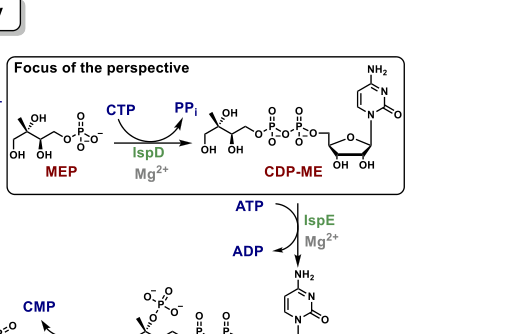

## Question

# Gene Research for Functional Annotation

## ⚠️ CRITICAL: Gene/Protein Identification Context

**BEFORE YOU BEGIN RESEARCH:** You MUST verify you are researching the CORRECT gene/protein. Gene symbols can be ambiguous, especially for less well-characterized genes from non-model organisms.

### Target Gene/Protein Identity (from UniProt):
- **UniProt Accession:** Q88MF7
- **Protein Description:** RecName: Full=2-C-methyl-D-erythritol 4-phosphate cytidylyltransferase {ECO:0000255|HAMAP-Rule:MF_00108}; EC=2.7.7.60 {ECO:0000255|HAMAP-Rule:MF_00108}; AltName: Full=4-diphosphocytidyl-2C-methyl-D-erythritol synthase {ECO:0000255|HAMAP-Rule:MF_00108}; AltName: Full=MEP cytidylyltransferase {ECO:0000255|HAMAP-Rule:MF_00108}; Short=MCT {ECO:0000255|HAMAP-Rule:MF_00108};
- **Gene Information:** Name=ispD {ECO:0000255|HAMAP-Rule:MF_00108}; OrderedLocusNames=PP_1614;
- **Organism (full):** Pseudomonas putida (strain ATCC 47054 / DSM 6125 / CFBP 8728 / NCIMB 11950 / KT2440).
- **Protein Family:** Belongs to the IspD/TarI cytidylyltransferase family. IspD
- **Key Domains:** IspD. (IPR001228); IspD/TarI. (IPR034683); IspD/TarI_cytidylyltransf_bact. (IPR050088); ISPD_synthase_CS. (IPR018294); Nucleotide-diphossugar_trans. (IPR029044)

### MANDATORY VERIFICATION STEPS:

1. **Check if the gene symbol "ispD" matches the protein description above**
2. **Verify the organism is correct:** Pseudomonas putida (strain ATCC 47054 / DSM 6125 / CFBP 8728 / NCIMB 11950 / KT2440).
3. **Check if protein family/domains align with what you find in literature**
4. **If you find literature for a DIFFERENT gene with the same or similar symbol, STOP**

### If Gene Symbol is Ambiguous or You Cannot Find Relevant Literature:

**DO NOT PROCEED WITH RESEARCH ON A DIFFERENT GENE.** Instead:
- State clearly: "The gene symbol 'ispD' is ambiguous or literature is limited for this specific protein"
- Explain what you found (e.g., "Found extensive literature on a different gene with the same symbol in a different organism")
- Describe the protein based ONLY on the UniProt information provided above
- Suggest that the protein function can be inferred from domain/family information

### Research Target:

Please provide a comprehensive research report on the gene **ispD** (gene ID: ispD, UniProt: Q88MF7) in PSEPK.

The research report should be a detailed narrative explaining the function, biological processes, and localization of the gene product. Citations should be given for all claims.

You should prioritize authoritative reviews and primary scientific literature when conducting research. You can supplement
this with annotations you find in gene/protein databases, but these can be outdated or inaccurate.

We are specifically interested in the primary function of the gene - for enzymes, what reaction is catalyzed, and what is the substrate specificity? For transporters, what is the substrate? For structural proteins or adapters, what is the broader structural role? For signaling molecules, what is the role in the pathway.

We are interested in where in or outside the cell the gene product carries out its function.

We are also interested in the signaling or biochemical pathways in which the gene functions. We are less interested in broad pleiotropic effects, except where these elucidate the precise role.

Include evidence where possible. We are interested in both experimental evidence as well as inference from structure, evolution, or bioinformatic analysis. Precise studies should be prioritized over high-throughput, where available.

## Output

Question: You are an expert researcher providing comprehensive, well-cited information.

Provide detailed information focusing on:
1. Key concepts and definitions with current understanding
2. Recent developments and latest research (prioritize 2023-2024 sources)
3. Current applications and real-world implementations
4. Expert opinions and analysis from authoritative sources
5. Relevant statistics and data from recent studies

Format as a comprehensive research report with proper citations. Include URLs and publication dates where available.
Always prioritize recent, authoritative sources and provide specific citations for all major claims.

# Gene Research for Functional Annotation

## ⚠️ CRITICAL: Gene/Protein Identification Context

**BEFORE YOU BEGIN RESEARCH:** You MUST verify you are researching the CORRECT gene/protein. Gene symbols can be ambiguous, especially for less well-characterized genes from non-model organisms.

### Target Gene/Protein Identity (from UniProt):
- **UniProt Accession:** Q88MF7
- **Protein Description:** RecName: Full=2-C-methyl-D-erythritol 4-phosphate cytidylyltransferase {ECO:0000255|HAMAP-Rule:MF_00108}; EC=2.7.7.60 {ECO:0000255|HAMAP-Rule:MF_00108}; AltName: Full=4-diphosphocytidyl-2C-methyl-D-erythritol synthase {ECO:0000255|HAMAP-Rule:MF_00108}; AltName: Full=MEP cytidylyltransferase {ECO:0000255|HAMAP-Rule:MF_00108}; Short=MCT {ECO:0000255|HAMAP-Rule:MF_00108};
- **Gene Information:** Name=ispD {ECO:0000255|HAMAP-Rule:MF_00108}; OrderedLocusNames=PP_1614;
- **Organism (full):** Pseudomonas putida (strain ATCC 47054 / DSM 6125 / CFBP 8728 / NCIMB 11950 / KT2440).
- **Protein Family:** Belongs to the IspD/TarI cytidylyltransferase family. IspD
- **Key Domains:** IspD. (IPR001228); IspD/TarI. (IPR034683); IspD/TarI_cytidylyltransf_bact. (IPR050088); ISPD_synthase_CS. (IPR018294); Nucleotide-diphossugar_trans. (IPR029044)

### MANDATORY VERIFICATION STEPS:

1. **Check if the gene symbol "ispD" matches the protein description above**
2. **Verify the organism is correct:** Pseudomonas putida (strain ATCC 47054 / DSM 6125 / CFBP 8728 / NCIMB 11950 / KT2440).
3. **Check if protein family/domains align with what you find in literature**
4. **If you find literature for a DIFFERENT gene with the same or similar symbol, STOP**

### If Gene Symbol is Ambiguous or You Cannot Find Relevant Literature:

**DO NOT PROCEED WITH RESEARCH ON A DIFFERENT GENE.** Instead:
- State clearly: "The gene symbol 'ispD' is ambiguous or literature is limited for this specific protein"
- Explain what you found (e.g., "Found extensive literature on a different gene with the same symbol in a different organism")
- Describe the protein based ONLY on the UniProt information provided above
- Suggest that the protein function can be inferred from domain/family information

### Research Target:

Please provide a comprehensive research report on the gene **ispD** (gene ID: ispD, UniProt: Q88MF7) in PSEPK.

The research report should be a detailed narrative explaining the function, biological processes, and localization of the gene product. Citations should be given for all claims.

You should prioritize authoritative reviews and primary scientific literature when conducting research. You can supplement
this with annotations you find in gene/protein databases, but these can be outdated or inaccurate.

We are specifically interested in the primary function of the gene - for enzymes, what reaction is catalyzed, and what is the substrate specificity? For transporters, what is the substrate? For structural proteins or adapters, what is the broader structural role? For signaling molecules, what is the role in the pathway.

We are interested in where in or outside the cell the gene product carries out its function.

We are also interested in the signaling or biochemical pathways in which the gene functions. We are less interested in broad pleiotropic effects, except where these elucidate the precise role.

Include evidence where possible. We are interested in both experimental evidence as well as inference from structure, evolution, or bioinformatic analysis. Precise studies should be prioritized over high-throughput, where available.

# Research report: ispD (UniProt Q88MF7; PP_1614) in *Pseudomonas putida* KT2440

## Executive summary
UniProt Q88MF7 (gene **ispD**, locus **PP_1614**) in *Pseudomonas putida* KT2440 encodes **2-C-methyl-D-erythritol 4-phosphate cytidylyltransferase** (also called **MEP cytidylyltransferase** or **CDP-ME synthase**, **EC 2.7.7.60**), a conserved cytidylyltransferase-family enzyme of the **methylerythritol phosphate (MEP/DOXP) pathway** for isoprenoid precursor biosynthesis. IspD catalyzes the third pathway step: **CTP-dependent cytidylyl transfer to MEP**, producing **CDP-ME** and **pyrophosphate (PPi)**. Mechanistic and structural knowledge is largely derived from bacterial and eukaryotic homologs, and supports an ordered binding mechanism (CTP first), requirement for divalent cations (Mg2+ preferred), dimeric assembly, and a Rossmann-like nucleotide-binding architecture with highly conserved active-site residues. These features align with the UniProt family/domain annotation provided by the user (IspD/TarI family).

*P. putida* KT2440-specific literature retrieved here supports the organism-level context that KT2440 relies on the endogenous MEP pathway for isoprenoid precursors, and that altering MEP-pathway precursor supply strongly impacts engineered isoprenoid outputs (e.g., lycopene, isoprenol). However, in the retrieved full texts, no direct biochemical characterization, essentiality measurement, or localization experiment was found for **PP_1614/Q88MF7 itself**. 

Recent research (prioritizing 2023–2024) emphasizes IspD as an antimicrobial/antiparasitic target: a 2024 *Journal of Medicinal Chemistry* study reports a new **urea-based** inhibitor chemotype with **nanomolar enzyme inhibition** and **low-micromolar whole-cell** antimalarial activity; a 2024 *Frontiers in Microbiology* paper identifies IspD as the molecular target of an anti-mycobacterial compound (M6) using MIC testing, enzyme inhibition constants, and CRISPR knockdown sensitization.

## 1. Target verification (gene/protein identity)
The symbol **ispD** is used across bacteria for the MEP-pathway enzyme **2-C-methyl-D-erythritol 4-phosphate cytidylyltransferase** (also called **MEP cytidyltransferase** or **ygbp** in some bacterial naming conventions). Authoritative syntheses describe IspD as the **third enzyme** of the MEP pathway catalyzing conversion of **MEP + CTP** to **CDP-ME + diphosphate/pyrophosphate** (PPi). This definition matches the user-provided UniProt description for Q88MF7 (EC 2.7.7.60; IspD/TarI family). (willocx2025targetingispdfor pages 1-2, saggu2016newinsightinto pages 7-8)

## 2. Key concepts and definitions (current understanding)

### 2.1 The MEP/DOXP pathway context
The MEP pathway synthesizes the universal C5 isoprenoid precursors **IPP** and **DMAPP** in many bacteria and in plant plastids/apicoplasts, but is absent in humans—an important rationale for drug targeting of its enzymes. Within this pathway, **IspD** performs a cytidylyltransfer step that activates the phosphorylated sugar intermediate for subsequent kinase/cyclization steps. (willocx2025targetingispdfor pages 1-2, saggu2016newinsightinto pages 7-8)

### 2.2 Enzymatic function and reaction catalyzed by IspD (EC 2.7.7.60)
IspD catalyzes cytidylyl transfer from **CTP** onto **2-C-methyl-D-erythritol 4-phosphate (MEP)** to form **4-diphosphocytidyl-2C-methyl-D-erythritol (CDP-ME)**, releasing **PPi**:

**MEP + CTP → CDP-ME + PPi**. (willocx2025targetingispdfor pages 2-4, willocx2025targetingispdfor pages 1-2, saggu2016newinsightinto pages 7-8)

This reaction is explicitly depicted in a scheme extracted from the 2025 J. Med. Chem. perspective (visual evidence). (willocx2025targetingispdfor media e5c65318)

### 2.3 Substrate specificity
Evidence synthesized in recent perspectives supports that the binding site is highly tuned for **cytidine** (cytosine specificity) due to a “tight cytidine pocket.” This supports that the physiological nucleotide donor is CTP. (willocx2025targetingispdfor pages 4-6)

### 2.4 Mechanism and catalytic requirements
Mechanistic proposals include metaphosphate-like vs. associative (pentavalent) transition-state models; structural and biochemical evidence summarized in recent work favors stabilization of a pentavalent transition state. Ordered/bi–bi binding has been reported, where **CTP binds before MEP**. (willocx2025targetingispdfor pages 2-4, willocx2025targetingispdfor pages 4-6)

IspD requires a divalent cation, with **Mg2+** giving maximal activity; **Mn2+** and **Co2+** can support catalysis while many other divalent cations inactivate the enzyme. (willocx2025targetingispdfor pages 4-6, saggu2016newinsightinto pages 7-8)

### 2.5 Structure, domains, and conserved residues
IspD is described as a **homodimer**, with each monomer comprising subdomains including a **Rossmann-like fold** for nucleotide binding plus a β-arm region. (willocx2025targetingispdfor pages 4-6, saggu2016newinsightinto pages 7-8)

Conserved residues implicated in catalysis and binding (reported across homologs) include Lys residues that stabilize the transition state (e.g., Lys27 and Lys213 in *E. coli* numbering) and a set of conserved motifs/residues summarized in the J. Med. Chem. perspective. (willocx2025targetingispdfor pages 4-6, saggu2016newinsightinto pages 7-8)

## 3. Quantitative kinetics and binding data (representative; largely from homologs)
A table extracted from the 2025 J. Med. Chem. perspective summarizes Michaelis constants across homologs; one explicit example provided in the text for **E. coli IspD** is **Km(CTP) = 84 ± 9 μM** and **Km(MEP) = 40 ± 7 μM**. (willocx2025targetingispdfor pages 2-4, willocx2025targetingispdfor media e5c65318)

Binding affinity for MEP is reported to tighten upon CTP pre-binding: **Kd(MEP) ≈ 265 μM** to apo-IspD versus **≈ 20 μM** to the IspD–CTP complex, consistent with ordered binding. (willocx2025targetingispdfor pages 2-4, willocx2025targetingispdfor pages 4-6)

## 4. Cellular localization and where the gene product acts
No retrieved *P. putida* KT2440 study directly measured subcellular localization of PP_1614/Q88MF7. Functionally, IspD operates in the **intracellular MEP pathway**, and KT2440 engineering studies treat MEP-pathway enzymes as soluble metabolic activities supplying intracellular IPP/DMAPP precursors for terpenoid/isoprenoid synthesis. (hernandezarranz2019engineeringpseudomonasputida pages 1-2, wang2022engineeringisoprenoidsproduction pages 1-3)

## 5. *Pseudomonas putida* KT2440-specific pathway context and applications

### 5.1 KT2440 uses the endogenous MEP pathway for isoprenoids
In *P. putida* KT2440, isoprenoid precursors are produced by the endogenous **MEP pathway** from pyruvate and glyceraldehyde-3-phosphate, and engineering efforts often focus on boosting precursor supply through MEP or introducing heterologous alternatives (MVA pathway). (hernandezarranz2019engineeringpseudomonasputida pages 1-2, hernandezarranz2019engineeringpseudomonasputida pages 2-4, wang2022engineeringisoprenoidsproduction pages 1-3)

### 5.2 Real-world implementations: metabolic engineering and bioproduction
A KT2440 study using lycopene as a reporter engineered MEP precursor supply by overexpressing endogenous MEP genes (notably upstream control points) and alternative precursor shunts, achieving up to a **~50-fold increase** in lycopene levels under their conditions—demonstrating strong leverage of MEP flux on product formation. (hernandezarranz2019engineeringpseudomonasputida pages 1-2, hernandezarranz2019engineeringpseudomonasputida pages 2-4)

A separate KT2440 engineering study compared endogenous MEP vs. heterologous MVA routes for isoprenol production and reported **104 mg/L isoprenol** in batch flask culture after strain optimization. (wang2022engineeringisoprenoidsproduction pages 1-3)

**Relevance to ispD (PP_1614):** while these studies do not directly manipulate or characterize **ispD** specifically in the excerpts retrieved here, they demonstrate that *P. putida* KT2440’s endogenous MEP pathway (of which IspD is a core enzyme) is an actionable engineering module and supports the functional annotation that PP_1614 contributes to intracellular isoprenoid precursor supply. (hernandezarranz2019engineeringpseudomonasputida pages 1-2, wang2022engineeringisoprenoidsproduction pages 1-3)

## 6. Recent developments and latest research (priority 2023–2024)

### 6.1 IspD as an antimicrobial target: inhibitor discovery and validation
A 2024 *Journal of Medicinal Chemistry* primary study reports a **urea-based inhibitor series** targeting **Plasmodium falciparum IspD**, with biochemical potencies reaching **IC50 = 41 ± 7 nM** (example compound 8) and whole-cell antimalarial activity in the **low micromolar range** (e.g., Pf NF54 IC50 = 2.7 ± 0.2 μM for compound 32). (willocx2024targetingplasmodiumfalciparum pages 4-5, willocx2024targetingplasmodiumfalciparum pages 2-4)

Notably, the authors introduced a **mass spectrometry-based direct enzymatic assay** for IspD activity measurement that avoids auxiliary enzymes, and used **IDP rescue** (supplementation) as a target/pathway engagement strategy in cells. (willocx2024targetingplasmodiumfalciparum pages 1-2, willocx2024targetingplasmodiumfalciparum pages 4-5)

A 2024 *Frontiers in Microbiology* paper identified IspD as a target of compound **M6** in a mycobacterial context, reporting MIC values including **0.5 μg/mL** against MTB H37Rv, and enzyme inhibition constants against purified IspD (for MEP: **Ki = 81.33 μM**, aKi = 609.58 μM; for CTP: **Ki = 40.07 μM**, aKi = 657.89 μM). CRISPR knockdown of ispD in *M. smegmatis* sensitized cells to M6 (MIC shift **32 → 4 μg/mL**, 8-fold). (dong2024identificationofispd pages 1-2, dong2024identificationofispd pages 7-9)

A recent 2025 J. Med. Chem. perspective (published Jan 2025; summarizing the field including 2023–2024) emphasizes why IspD inhibitor discovery is challenging: the active site is unusually polar (reflecting phosphorylated substrates), motivating exploration of **allosteric pockets** that may be more hydrophobic and druggable; it highlights that allosteric inhibition has been demonstrated for plant IspD homologs. (willocx2025targetingispdfor pages 6-7, willocx2025targetingispdfor pages 1-2)

## 7. Expert analysis and synthesis

### 7.1 Functional annotation confidence for Q88MF7 (PP_1614)
Given the strong conservation of IspD across bacteria and the close agreement between (i) UniProt-provided description/domains and (ii) multiple independent literature syntheses defining IspD’s reaction, mechanism, and fold, the primary function of *P. putida* KT2440 PP_1614 is best annotated as **MEP cytidylyltransferase** producing CDP-ME from MEP and CTP. (willocx2025targetingispdfor pages 2-4, willocx2025targetingispdfor pages 4-6, willocx2025targetingispdfor pages 1-2, saggu2016newinsightinto pages 7-8)

### 7.2 Translational relevance
The 2024 inhibitor studies illustrate two complementary translational angles: (i) antiparasitic discovery where IspD inhibition can yield nanomolar biochemical potency and micromolar whole-cell activity with new assay innovations; and (ii) antibacterial/anti-mycobacterial target validation where IspD inhibition is tied to MIC shifts and genetic sensitization. Together, they reinforce IspD as a tractable (though challenging) target due to active-site polarity and species-specific permeability/target engagement constraints. (willocx2024targetingplasmodiumfalciparum pages 1-2, willocx2024targetingplasmodiumfalciparum pages 4-5, dong2024identificationofispd pages 1-2, dong2024identificationofispd pages 7-9, willocx2025targetingispdfor pages 1-2)

## 8. Limitations and data gaps specific to *P. putida* ispD (PP_1614)
Within the retrieved full-text evidence set, the following *P. putida* KT2440-specific details could not be substantiated and should be considered open gaps for PP_1614/Q88MF7 annotation: (i) direct enzyme purification/kinetics for the KT2440 protein, (ii) essentiality or fitness measurements in KT2440 transposon-seq datasets, (iii) direct experimental subcellular localization, and (iv) detailed regulation or operon context for PP_1614. This report therefore relies on conserved-function inference for catalytic/structural features and uses KT2440 literature mainly for pathway-level context and applications. (hernandezarranz2019engineeringpseudomonasputida pages 1-2, wang2022engineeringisoprenoidsproduction pages 1-3)

## Key evidence tables
The following tables consolidate core mechanistic knowledge and 2024 developments.

| Aspect | Finding | Quantitative detail | Evidence scope | Citation |
|---|---|---:|---|---|
| Verified identity | UniProt Q88MF7 corresponds to **ispD** / **PP_1614** from *Pseudomonas putida* KT2440; the literature-supported functional identity for **IspD/MCT** is **2-C-methyl-D-erythritol 4-phosphate cytidylyltransferase** (also called **4-diphosphocytidyl-2C-methyl-D-erythritol synthase**), **EC 2.7.7.60**, the third enzyme of the MEP pathway. The reviewed evidence explicitly uses the names IspD, MEP cytidyltransferase, and ygbp for this enzyme family. | — | Family/function assignment inferred from authoritative IspD literature; organism/gene accession from target specification, not directly studied in the cited papers | (willocx2025targetingispdfor pages 1-2, saggu2016newinsightinto pages 7-8) |
| Pathway role | IspD catalyzes the **third step** of the methylerythritol phosphate (**MEP/DOXP**) pathway for isoprenoid precursor biosynthesis. | Step 3 of pathway | Inferred from homologs/general pathway literature | (willocx2025targetingispdfor pages 1-2, saggu2016newinsightinto pages 7-8) |
| Catalyzed reaction | **MEP + CTP → CDP-ME + PPi**; specifically, 2-C-methyl-D-erythritol 4-phosphate is cytidylylated by CTP to form **4-diphosphocytidyl-2C-methyl-D-erythritol (CDP-ME)** and pyrophosphate. | Substrates: MEP, CTP; products: CDP-ME, PPi | Inferred from homologs/general IspD evidence | (willocx2025targetingispdfor pages 2-4, willocx2025targetingispdfor pages 1-2, saggu2016newinsightinto pages 7-8, willocx2025targetingispdfor media e5c65318) |
| Localization/function context | In bacteria such as *P. putida*, the MEP pathway is the endogenous route for IPP/DMAPP precursor synthesis; engineering studies in KT2440 treat these reactions as part of central **intracellular** isoprenoid precursor metabolism. | — | *P. putida*-specific pathway context, but not direct localization experiment for PP_1614 | (hernandezarranz2019engineeringpseudomonasputida pages 1-2, hernandezarranz2019engineeringpseudomonasputida pages 2-4, wang2022engineeringisoprenoidsproduction pages 1-3) |
| Quaternary structure | IspD is a **homodimer**. | Dimeric enzyme | Inferred from homolog structures | (willocx2025targetingispdfor pages 4-6) |
| Fold/domain architecture | Each monomer contains two subdomains, including a **Rossmann-like fold** involved in nucleotide binding and a **β-arm**. | — | Inferred from homolog structures | (willocx2025targetingispdfor pages 4-6, saggu2016newinsightinto pages 7-8) |
| Mechanistic model | The enzyme follows an **ordered/sequential binding** mechanism in which **CTP binds before MEP**. Structural and biochemical data favor a mechanism involving stabilization of a **pentavalent transition state** rather than a free metaphosphate intermediate. | MEP binds more tightly after CTP is bound | Inferred from homologs | (willocx2025targetingispdfor pages 2-4, willocx2025targetingispdfor pages 4-6) |
| Metal/cofactor preference | IspD requires divalent metal ions; **Mg²⁺** gives the highest activity, while **Mn²⁺** and **Co²⁺** can also support product formation; many other divalent cations are inactive/inhibitory. | Qualitative preference: Mg²⁺ > Mn²⁺/Co²⁺ | Inferred from homologs | (willocx2025targetingispdfor pages 4-6, saggu2016newinsightinto pages 7-8) |
| Conserved active-site/signature features | Conserved/signature elements include an N-terminal **GXG** motif and conserved active-site residues. Highly conserved residues reported include **Pro13, Ala14, Ala15, Gly16, Arg19, Ser88, Ala107, Ala163**; strictly conserved residues reported include **Gly18, Arg20, Lys27, Gly82, Asp106, Arg109, Lys213**. Lys27 and Lys213 have been implicated in stabilization of the pentavalent transition state in *E. coli* numbering. | Residue set as reported in homolog analyses | Inferred from homologs | (willocx2025targetingispdfor pages 4-6, saggu2016newinsightinto pages 7-8) |
| Representative kinetics (explicit *E. coli* values) | Representative Michaelis constants reported for **E. coli IspD** are **Km(CTP) = 84 ± 9 μM** and **Km(MEP) = 40 ± 7 μM**. | 84 ± 9 μM; 40 ± 7 μM | Inferred from homologs; not *P. putida*-specific | (willocx2025targetingispdfor pages 2-4, willocx2025targetingispdfor media e5c65318) |
| Binding constants | Dissociation constant for **MEP** binding to **apo-IspD** is reported as **265 μM**, whereas binding to the **IspD–CTP complex** is much tighter at **20 μM**. | Kd(apo) = 265 μM; Kd(IspD–CTP) = 20 μM | Inferred from homologs; not *P. putida*-specific | (willocx2025targetingispdfor pages 2-4, willocx2025targetingispdfor pages 4-6) |
| *P. putida* KT2440-specific evidence | KT2440 natively uses the **MEP pathway** for isoprenoid precursor synthesis, and metabolic-engineering studies showed precursor supply through this pathway can strongly affect product formation. Overexpression of upstream MEP genes such as **dxs** increased lycopene output, and combinations of pathway interventions achieved up to **~50-fold** lycopene improvement in one study; a separate study reported **104 mg/L** isoprenol using engineered pathway configurations. However, the retrieved evidence does **not** provide a direct biochemical characterization, essentiality test, localization experiment, or kinetic constants for **PP_1614/Q88MF7** itself. | ~50-fold lycopene increase; 104 mg/L isoprenol | *P. putida*-specific pathway/engineering context only; no direct PP_1614 experiment found | (hernandezarranz2019engineeringpseudomonasputida pages 1-2, hernandezarranz2019engineeringpseudomonasputida pages 2-4, wang2022engineeringisoprenoidsproduction pages 1-3, wang2022engineeringisoprenoidsproduction pages 3-4) |

*Table: This table summarizes the verified functional identity, reaction, mechanism, structure, and representative quantitative parameters for the IspD/MCT enzyme relevant to UniProt Q88MF7. It also distinguishes what is directly supported in Pseudomonas putida KT2440 from what is inferred from homologous IspD enzymes.*

| Study (year, journal) | Organism/enzyme | Main contribution | Key quantitative results | URL/DOI | Notes |
|---|---|---|---|---|---|
| Willocx et al. (2024, *Journal of Medicinal Chemistry*) | *Plasmodium falciparum* IspD; discovery initiated via HTS on *P. vivax* IspD | Identified a new urea-based IspD inhibitor class; carried out SAR on 34 derivatives; established direct enzymatic and whole-cell antiplasmodial activity; introduced a direct MS-based IspD assay | Example biochemical potencies: compound 8, Pf IspD IC50 = 41 ± 7 nM; compound 11, 91 ± 19 nM; compound 6, 370 ± 80 nM; compound 23, 395 ± 60 nM; initial hit 4, 17 ± 2 μM. Example whole-cell activities: compound 32, Pf NF54 IC50 = 2.7 ± 0.2 μM; compound 10, 10 ± 1 μM. Reported as low-nanomolar on-target potency with low-micromolar whole-cell activity overall. (willocx2024targetingplasmodiumfalciparum pages 1-2, willocx2024targetingplasmodiumfalciparum pages 4-5, willocx2024targetingplasmodiumfalciparum pages 2-4) | https://doi.org/10.1021/acs.jmedchem.4c00212 | Notable methods: MS-based direct IspD activity assay avoiding auxiliary enzymes; IDP rescue assay supported pathway/target engagement; no Pf IspD crystal structure available, limiting structure-based optimization. SAR notes: sulfonyl linker important; urea methylation abolished activity; thiourea reduced potency; para electron-withdrawing substituents improved potency. (willocx2024targetingplasmodiumfalciparum pages 1-2, willocx2024targetingplasmodiumfalciparum pages 4-5, willocx2024targetingplasmodiumfalciparum pages 2-4) |
| Dong et al. (2024, *Frontiers in Microbiology*) | Mycobacterial IspD (target validation in *Mycobacterium tuberculosis* / *M. smegmatis*) | Identified compound M6 as an anti-mycobacterial lead targeting IspD using reverse docking, enzyme assays, and CRISPR knockdown | MICs: 0.5 μg/mL against MTB H37Rv; 1.0 μg/mL against clinically isolated drug-resistant MTB; 32 μg/mL against *M. smegmatis*. Enzyme inhibition parameters: for MEP, aKi = 609.58 μM and Ki = 81.33 μM; for CTP, aKi = 657.89 μM and Ki = 40.07 μM. CRISPRi/knockdown effect: MIC dropped 8-fold from 32 to 4 μg/mL upon ispD suppression. HeLa IC50 was ~20 μg/mL. (dong2024identificationofispd pages 1-2, dong2024identificationofispd pages 7-9) | https://doi.org/10.3389/fmicb.2024.1461227 | Notable methods: reverse molecular docking (IspD highest LibDock score 142.50), purified-enzyme absorbance assay, two-fold dilution MIC testing, dCas9/sgRNA knockdown validation. Limitation: species-dependent MIC variation and need for deeper structural/enzymatic follow-up. (dong2024identificationofispd pages 1-2, dong2024identificationofispd pages 7-9) |
| Willocx et al. (2025, *Journal of Medicinal Chemistry* perspective summarizing 2023-2024 progress) | IspD across pathogens/plants | Synthesized current state of IspD druggability, highlighting active-site polarity, emerging allosteric opportunities, and assay/validation strategies | No new primary potency dataset in the cited excerpt, but emphasizes that substrate/cofactor pockets are highly polar while some allosteric pockets are more hydrophobic and potentially more tractable; notes prior Arabidopsis allosteric inhibitors reached nanomolar activity. (willocx2025targetingispdfor pages 6-7, willocx2025targetingispdfor pages 1-2) | https://doi.org/10.1021/acs.jmedchem.4c01146 | Useful methodological context for recent work: cellular rescue assays, HTS, virtual docking, substrate-mimic approaches, and the challenge that IspD has a highly polar, flexible active site; confirms IspD remains underexplored despite promising selectivity opportunities. (willocx2025targetingispdfor pages 6-7, willocx2025targetingispdfor pages 1-2) |

*Table: This table summarizes key 2024 IspD-targeting primary studies and a 2025 perspective that contextualizes the field. It highlights organisms studied, experimental advances, and quantitative potency or MIC data most relevant to current functional and translational understanding of IspD.*

## Visual evidence (figures/tables extracted)
A reaction scheme and kinetic-parameter table were extracted from the 2025 J. Med. Chem. IspD perspective and support the stated reaction and representative kinetic constants. (willocx2025targetingispdfor media e5c65318, willocx2025targetingispdfor media d5baa16f)

## References (URLs and publication dates)
- Willocx D, Diamanti E, Hirsch A-K. *Targeting IspD for Anti-infective and Herbicide Development: Exploring Its Role, Mechanism, and Structural Insights.* **Journal of Medicinal Chemistry**. **2025-01**. https://doi.org/10.1021/acs.jmedchem.4c01146 (willocx2025targetingispdfor pages 1-2, willocx2025targetingispdfor pages 2-4, willocx2025targetingispdfor pages 4-6, willocx2025targetingispdfor media e5c65318, willocx2025targetingispdfor media d5baa16f)
- Willocx D, et al. *Targeting Plasmodium falciparum IspD in the MEP pathway: urea-based compounds…* **Journal of Medicinal Chemistry**. **2024-09**. https://doi.org/10.1021/acs.jmedchem.4c00212 (willocx2024targetingplasmodiumfalciparum pages 1-2, willocx2024targetingplasmodiumfalciparum pages 4-5, willocx2024targetingplasmodiumfalciparum pages 2-4)
- Dong L, et al. *Identification of IspD as a novel target for tuberculosis treatment using compound M6.* **Frontiers in Microbiology**. **2024-11**. https://doi.org/10.3389/fmicb.2024.1461227 (dong2024identificationofispd pages 1-2, dong2024identificationofispd pages 7-9)
- Hernandez-Arranz S, et al. *Engineering Pseudomonas putida for isoprenoid production…* **Microbial Cell Factories**. **2019-09**. https://doi.org/10.1186/s12934-019-1204-z (hernandezarranz2019engineeringpseudomonasputida pages 1-2, hernandezarranz2019engineeringpseudomonasputida pages 2-4)
- Wang X, et al. *Engineering isoprenoids production in metabolically versatile microbial host Pseudomonas putida.* **Biotechnology for Biofuels and Bioproducts**. **2022-12**. https://doi.org/10.1186/s13068-022-02235-6 (wang2022engineeringisoprenoidsproduction pages 1-3, wang2022engineeringisoprenoidsproduction pages 3-4)
- Saggu GS, et al. *New insight into isoprenoids biosynthesis process and future prospects for drug designing in Plasmodium.* **Frontiers in Microbiology**. **2016-09**. https://doi.org/10.3389/fmicb.2016.01421 (saggu2016newinsightinto pages 7-8)

References

1. (willocx2025targetingispdfor pages 1-2): Daan Willocx, Eleonora Diamanti, and Anne-Kathrin Hirsch. Targeting ispd for anti-infective and herbicide development: exploring its role, mechanism, and structural insights. Journal of Medicinal Chemistry, 68:886-901, Jan 2025. URL: https://doi.org/10.1021/acs.jmedchem.4c01146, doi:10.1021/acs.jmedchem.4c01146. This article has 3 citations and is from a highest quality peer-reviewed journal.

2. (saggu2016newinsightinto pages 7-8): Gagandeep S. Saggu, Zarna R. Pala, Shilpi Garg, and Vishal Saxena. New insight into isoprenoids biosynthesis process and future prospects for drug designing in plasmodium. Frontiers in Microbiology, Sep 2016. URL: https://doi.org/10.3389/fmicb.2016.01421, doi:10.3389/fmicb.2016.01421. This article has 30 citations and is from a peer-reviewed journal.

3. (willocx2025targetingispdfor pages 2-4): Daan Willocx, Eleonora Diamanti, and Anne-Kathrin Hirsch. Targeting ispd for anti-infective and herbicide development: exploring its role, mechanism, and structural insights. Journal of Medicinal Chemistry, 68:886-901, Jan 2025. URL: https://doi.org/10.1021/acs.jmedchem.4c01146, doi:10.1021/acs.jmedchem.4c01146. This article has 3 citations and is from a highest quality peer-reviewed journal.

4. (willocx2025targetingispdfor media e5c65318): Daan Willocx, Eleonora Diamanti, and Anne-Kathrin Hirsch. Targeting ispd for anti-infective and herbicide development: exploring its role, mechanism, and structural insights. Journal of Medicinal Chemistry, 68:886-901, Jan 2025. URL: https://doi.org/10.1021/acs.jmedchem.4c01146, doi:10.1021/acs.jmedchem.4c01146. This article has 3 citations and is from a highest quality peer-reviewed journal.

5. (willocx2025targetingispdfor pages 4-6): Daan Willocx, Eleonora Diamanti, and Anne-Kathrin Hirsch. Targeting ispd for anti-infective and herbicide development: exploring its role, mechanism, and structural insights. Journal of Medicinal Chemistry, 68:886-901, Jan 2025. URL: https://doi.org/10.1021/acs.jmedchem.4c01146, doi:10.1021/acs.jmedchem.4c01146. This article has 3 citations and is from a highest quality peer-reviewed journal.

6. (hernandezarranz2019engineeringpseudomonasputida pages 1-2): Sofía Hernandez-Arranz, Jordi Perez-Gil, Dominic Marshall-Sabey, and Manuel Rodriguez-Concepcion. Engineering pseudomonas putida for isoprenoid production by manipulating endogenous and shunt pathways supplying precursors. Microbial Cell Factories, Sep 2019. URL: https://doi.org/10.1186/s12934-019-1204-z, doi:10.1186/s12934-019-1204-z. This article has 38 citations and is from a peer-reviewed journal.

7. (wang2022engineeringisoprenoidsproduction pages 1-3): Xi Wang, Edward E. K. Baidoo, Ramu Kakumanu, Silvia Xie, Aindrila Mukhopadhyay, and Taek Soon Lee. Engineering isoprenoids production in metabolically versatile microbial host pseudomonas putida. Biotechnology for Biofuels and Bioproducts, Dec 2022. URL: https://doi.org/10.1186/s13068-022-02235-6, doi:10.1186/s13068-022-02235-6. This article has 30 citations and is from a domain leading peer-reviewed journal.

8. (hernandezarranz2019engineeringpseudomonasputida pages 2-4): Sofía Hernandez-Arranz, Jordi Perez-Gil, Dominic Marshall-Sabey, and Manuel Rodriguez-Concepcion. Engineering pseudomonas putida for isoprenoid production by manipulating endogenous and shunt pathways supplying precursors. Microbial Cell Factories, Sep 2019. URL: https://doi.org/10.1186/s12934-019-1204-z, doi:10.1186/s12934-019-1204-z. This article has 38 citations and is from a peer-reviewed journal.

9. (willocx2024targetingplasmodiumfalciparum pages 4-5): Daan Willocx, Lorenzo Bizzarri, Alaa Alhayek, Deepika Kannan, Patricia Bravo, Boris Illarionov, Katharina Rox, Jonas Lohse, Markus Fischer, Andreas M. Kany, Hannes Hahne, Matthias Rottmann, Matthias Witschel, Audrey Odom John, Mostafa M. Hamed, Eleonora Diamanti, and Anna K. H. Hirsch. Targeting plasmodium falciparum ispd in the methyl-d-erythritol phosphate pathway: urea-based compounds with nanomolar potency on target and low-micromolar whole-cell activity. Journal of Medicinal Chemistry, 67:17070-17086, Sep 2024. URL: https://doi.org/10.1021/acs.jmedchem.4c00212, doi:10.1021/acs.jmedchem.4c00212. This article has 7 citations and is from a highest quality peer-reviewed journal.

10. (willocx2024targetingplasmodiumfalciparum pages 2-4): Daan Willocx, Lorenzo Bizzarri, Alaa Alhayek, Deepika Kannan, Patricia Bravo, Boris Illarionov, Katharina Rox, Jonas Lohse, Markus Fischer, Andreas M. Kany, Hannes Hahne, Matthias Rottmann, Matthias Witschel, Audrey Odom John, Mostafa M. Hamed, Eleonora Diamanti, and Anna K. H. Hirsch. Targeting plasmodium falciparum ispd in the methyl-d-erythritol phosphate pathway: urea-based compounds with nanomolar potency on target and low-micromolar whole-cell activity. Journal of Medicinal Chemistry, 67:17070-17086, Sep 2024. URL: https://doi.org/10.1021/acs.jmedchem.4c00212, doi:10.1021/acs.jmedchem.4c00212. This article has 7 citations and is from a highest quality peer-reviewed journal.

11. (willocx2024targetingplasmodiumfalciparum pages 1-2): Daan Willocx, Lorenzo Bizzarri, Alaa Alhayek, Deepika Kannan, Patricia Bravo, Boris Illarionov, Katharina Rox, Jonas Lohse, Markus Fischer, Andreas M. Kany, Hannes Hahne, Matthias Rottmann, Matthias Witschel, Audrey Odom John, Mostafa M. Hamed, Eleonora Diamanti, and Anna K. H. Hirsch. Targeting plasmodium falciparum ispd in the methyl-d-erythritol phosphate pathway: urea-based compounds with nanomolar potency on target and low-micromolar whole-cell activity. Journal of Medicinal Chemistry, 67:17070-17086, Sep 2024. URL: https://doi.org/10.1021/acs.jmedchem.4c00212, doi:10.1021/acs.jmedchem.4c00212. This article has 7 citations and is from a highest quality peer-reviewed journal.

12. (dong2024identificationofispd pages 1-2): Lijun Dong, Hui Qi, Yue Zhu, Yuma Yang, Yue Zhao, Sihan Zhang, Yongqiang Su, Taiyun Yue, Xiancai Du, Hetian Lei, and Yanhui Yang. Identification of ispd as a novel target for tuberculosis treatment using compound m6. Frontiers in Microbiology, Nov 2024. URL: https://doi.org/10.3389/fmicb.2024.1461227, doi:10.3389/fmicb.2024.1461227. This article has 0 citations and is from a peer-reviewed journal.

13. (dong2024identificationofispd pages 7-9): Lijun Dong, Hui Qi, Yue Zhu, Yuma Yang, Yue Zhao, Sihan Zhang, Yongqiang Su, Taiyun Yue, Xiancai Du, Hetian Lei, and Yanhui Yang. Identification of ispd as a novel target for tuberculosis treatment using compound m6. Frontiers in Microbiology, Nov 2024. URL: https://doi.org/10.3389/fmicb.2024.1461227, doi:10.3389/fmicb.2024.1461227. This article has 0 citations and is from a peer-reviewed journal.

14. (willocx2025targetingispdfor pages 6-7): Daan Willocx, Eleonora Diamanti, and Anne-Kathrin Hirsch. Targeting ispd for anti-infective and herbicide development: exploring its role, mechanism, and structural insights. Journal of Medicinal Chemistry, 68:886-901, Jan 2025. URL: https://doi.org/10.1021/acs.jmedchem.4c01146, doi:10.1021/acs.jmedchem.4c01146. This article has 3 citations and is from a highest quality peer-reviewed journal.

15. (wang2022engineeringisoprenoidsproduction pages 3-4): Xi Wang, Edward E. K. Baidoo, Ramu Kakumanu, Silvia Xie, Aindrila Mukhopadhyay, and Taek Soon Lee. Engineering isoprenoids production in metabolically versatile microbial host pseudomonas putida. Biotechnology for Biofuels and Bioproducts, Dec 2022. URL: https://doi.org/10.1186/s13068-022-02235-6, doi:10.1186/s13068-022-02235-6. This article has 30 citations and is from a domain leading peer-reviewed journal.

16. (willocx2025targetingispdfor media d5baa16f): Daan Willocx, Eleonora Diamanti, and Anne-Kathrin Hirsch. Targeting ispd for anti-infective and herbicide development: exploring its role, mechanism, and structural insights. Journal of Medicinal Chemistry, 68:886-901, Jan 2025. URL: https://doi.org/10.1021/acs.jmedchem.4c01146, doi:10.1021/acs.jmedchem.4c01146. This article has 3 citations and is from a highest quality peer-reviewed journal.

## Artifacts

- [Edison artifact artifact-00](ispD-deep-research-falcon_artifacts/artifact-00.md)
- [Edison artifact artifact-01](ispD-deep-research-falcon_artifacts/artifact-01.md)

## Citations

1. willocx2025targetingispdfor pages 4-6
2. wang2022engineeringisoprenoidsproduction pages 1-3
3. saggu2016newinsightinto pages 7-8
4. willocx2025targetingispdfor pages 1-2
5. willocx2025targetingispdfor pages 2-4
6. hernandezarranz2019engineeringpseudomonasputida pages 1-2
7. hernandezarranz2019engineeringpseudomonasputida pages 2-4
8. willocx2024targetingplasmodiumfalciparum pages 4-5
9. willocx2024targetingplasmodiumfalciparum pages 2-4
10. willocx2024targetingplasmodiumfalciparum pages 1-2
11. dong2024identificationofispd pages 1-2
12. dong2024identificationofispd pages 7-9
13. willocx2025targetingispdfor pages 6-7
14. wang2022engineeringisoprenoidsproduction pages 3-4
15. https://doi.org/10.1021/acs.jmedchem.4c00212
16. https://doi.org/10.3389/fmicb.2024.1461227
17. https://doi.org/10.1021/acs.jmedchem.4c01146
18. https://doi.org/10.1186/s12934-019-1204-z
19. https://doi.org/10.1186/s13068-022-02235-6
20. https://doi.org/10.3389/fmicb.2016.01421
21. https://doi.org/10.1021/acs.jmedchem.4c01146,
22. https://doi.org/10.3389/fmicb.2016.01421,
23. https://doi.org/10.1186/s12934-019-1204-z,
24. https://doi.org/10.1186/s13068-022-02235-6,
25. https://doi.org/10.1021/acs.jmedchem.4c00212,
26. https://doi.org/10.3389/fmicb.2024.1461227,