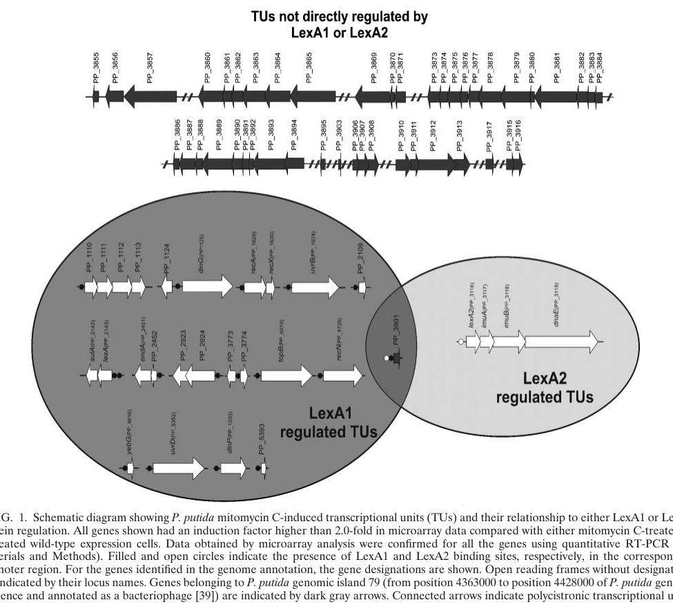

## Question

# Gene Research for Functional Annotation

## ⚠️ CRITICAL: Gene/Protein Identification Context

**BEFORE YOU BEGIN RESEARCH:** You MUST verify you are researching the CORRECT gene/protein. Gene symbols can be ambiguous, especially for less well-characterized genes from non-model organisms.

### Target Gene/Protein Identity (from UniProt):
- **UniProt Accession:** P59479
- **Protein Description:** RecName: Full=LexA repressor 2 {ECO:0000255|HAMAP-Rule:MF_00015}; EC=3.4.21.88 {ECO:0000255|HAMAP-Rule:MF_00015};
- **Gene Information:** Name=lexA2 {ECO:0000255|HAMAP-Rule:MF_00015}; Synonyms=lexA-2; OrderedLocusNames=PP_3116;
- **Organism (full):** Pseudomonas putida (strain ATCC 47054 / DSM 6125 / CFBP 8728 / NCIMB 11950 / KT2440).
- **Protein Family:** Belongs to the peptidase S24 family. {ECO:0000255|HAMAP-
- **Key Domains:** LexA. (IPR006200); LexA-like. (IPR039418); LexA/Signal_pep-like_sf. (IPR036286); LexA_DNA-bd_dom. (IPR006199); LexA_repressor. (IPR050077)

### MANDATORY VERIFICATION STEPS:

1. **Check if the gene symbol "lexA2" matches the protein description above**
2. **Verify the organism is correct:** Pseudomonas putida (strain ATCC 47054 / DSM 6125 / CFBP 8728 / NCIMB 11950 / KT2440).
3. **Check if protein family/domains align with what you find in literature**
4. **If you find literature for a DIFFERENT gene with the same or similar symbol, STOP**

### If Gene Symbol is Ambiguous or You Cannot Find Relevant Literature:

**DO NOT PROCEED WITH RESEARCH ON A DIFFERENT GENE.** Instead:
- State clearly: "The gene symbol 'lexA2' is ambiguous or literature is limited for this specific protein"
- Explain what you found (e.g., "Found extensive literature on a different gene with the same symbol in a different organism")
- Describe the protein based ONLY on the UniProt information provided above
- Suggest that the protein function can be inferred from domain/family information

### Research Target:

Please provide a comprehensive research report on the gene **lexA2** (gene ID: lexA2, UniProt: P59479) in PSEPK.

The research report should be a detailed narrative explaining the function, biological processes, and localization of the gene product. Citations should be given for all claims.

You should prioritize authoritative reviews and primary scientific literature when conducting research. You can supplement
this with annotations you find in gene/protein databases, but these can be outdated or inaccurate.

We are specifically interested in the primary function of the gene - for enzymes, what reaction is catalyzed, and what is the substrate specificity? For transporters, what is the substrate? For structural proteins or adapters, what is the broader structural role? For signaling molecules, what is the role in the pathway.

We are interested in where in or outside the cell the gene product carries out its function.

We are also interested in the signaling or biochemical pathways in which the gene functions. We are less interested in broad pleiotropic effects, except where these elucidate the precise role.

Include evidence where possible. We are interested in both experimental evidence as well as inference from structure, evolution, or bioinformatic analysis. Precise studies should be prioritized over high-throughput, where available.

## Output

Question: You are an expert researcher providing comprehensive, well-cited information.

Provide detailed information focusing on:
1. Key concepts and definitions with current understanding
2. Recent developments and latest research (prioritize 2023-2024 sources)
3. Current applications and real-world implementations
4. Expert opinions and analysis from authoritative sources
5. Relevant statistics and data from recent studies

Format as a comprehensive research report with proper citations. Include URLs and publication dates where available.
Always prioritize recent, authoritative sources and provide specific citations for all major claims.

# Gene Research for Functional Annotation

## ⚠️ CRITICAL: Gene/Protein Identification Context

**BEFORE YOU BEGIN RESEARCH:** You MUST verify you are researching the CORRECT gene/protein. Gene symbols can be ambiguous, especially for less well-characterized genes from non-model organisms.

### Target Gene/Protein Identity (from UniProt):
- **UniProt Accession:** P59479
- **Protein Description:** RecName: Full=LexA repressor 2 {ECO:0000255|HAMAP-Rule:MF_00015}; EC=3.4.21.88 {ECO:0000255|HAMAP-Rule:MF_00015};
- **Gene Information:** Name=lexA2 {ECO:0000255|HAMAP-Rule:MF_00015}; Synonyms=lexA-2; OrderedLocusNames=PP_3116;
- **Organism (full):** Pseudomonas putida (strain ATCC 47054 / DSM 6125 / CFBP 8728 / NCIMB 11950 / KT2440).
- **Protein Family:** Belongs to the peptidase S24 family. {ECO:0000255|HAMAP-
- **Key Domains:** LexA. (IPR006200); LexA-like. (IPR039418); LexA/Signal_pep-like_sf. (IPR036286); LexA_DNA-bd_dom. (IPR006199); LexA_repressor. (IPR050077)

### MANDATORY VERIFICATION STEPS:

1. **Check if the gene symbol "lexA2" matches the protein description above**
2. **Verify the organism is correct:** Pseudomonas putida (strain ATCC 47054 / DSM 6125 / CFBP 8728 / NCIMB 11950 / KT2440).
3. **Check if protein family/domains align with what you find in literature**
4. **If you find literature for a DIFFERENT gene with the same or similar symbol, STOP**

### If Gene Symbol is Ambiguous or You Cannot Find Relevant Literature:

**DO NOT PROCEED WITH RESEARCH ON A DIFFERENT GENE.** Instead:
- State clearly: "The gene symbol 'lexA2' is ambiguous or literature is limited for this specific protein"
- Explain what you found (e.g., "Found extensive literature on a different gene with the same symbol in a different organism")
- Describe the protein based ONLY on the UniProt information provided above
- Suggest that the protein function can be inferred from domain/family information

### Research Target:

Please provide a comprehensive research report on the gene **lexA2** (gene ID: lexA2, UniProt: P59479) in PSEPK.

The research report should be a detailed narrative explaining the function, biological processes, and localization of the gene product. Citations should be given for all claims.

You should prioritize authoritative reviews and primary scientific literature when conducting research. You can supplement
this with annotations you find in gene/protein databases, but these can be outdated or inaccurate.

We are specifically interested in the primary function of the gene - for enzymes, what reaction is catalyzed, and what is the substrate specificity? For transporters, what is the substrate? For structural proteins or adapters, what is the broader structural role? For signaling molecules, what is the role in the pathway.

We are interested in where in or outside the cell the gene product carries out its function.

We are also interested in the signaling or biochemical pathways in which the gene functions. We are less interested in broad pleiotropic effects, except where these elucidate the precise role.

Include evidence where possible. We are interested in both experimental evidence as well as inference from structure, evolution, or bioinformatic analysis. Precise studies should be prioritized over high-throughput, where available.

# Research report: Functional annotation of **lexA2 (PP_3116; UniProt P59479)** in *Pseudomonas putida* KT2440

## Executive summary
*Pseudomonas putida* KT2440 encodes **two distinct LexA-family repressors**, **LexA1** and **LexA2**, that recognize different operator motifs and control **different regulons**. The target protein **LexA2** (gene **lexA2**, locus **PP_3116**, UniProt **P59479**) is experimentally supported to be a **LexA-family DNA-binding transcriptional repressor** with a **very small, asymmetric regulon**: it primarily regulates the **lexA2–imuA–imuB–dnaE2** cassette (PP_3116–PP_3119) and one additional prophage-associated gene (**PP_3901**) that is also controlled by LexA1. (abella2007cohabitationoftwo pages 1-2, abella2007cohabitationoftwo pages 2-4, abella2007cohabitationoftwo pages 4-4)

## 0) Mandatory target verification (identity consistency)
The target gene symbol **lexA2** is **not used here as a generic LexA**; it is specifically the second LexA paralog **PP_3116** in *P. putida* KT2440. In KT2440, PP_3116 is explicitly described as **lexA2** and is in a single transcriptional unit with **PP_3117 (imuA)**, **PP_3118 (imuB)**, and **PP_3119 (dnaE2)**. (abella2007cohabitationoftwo pages 4-4)

A key distinguishing feature is operator specificity: KT2440 LexA1 recognizes the **E. coli-like SOS box** (CTGTN8ACAG), whereas LexA2 recognizes a **divergent motif** (reported as GTACN4GTGC). (abella2007cohabitationoftwo pages 2-4, abella2007cohabitationoftwo pages 1-2)

## 1) Key concepts & definitions (current understanding)

### 1.1 LexA/SOS response module
**LexA** is the master transcriptional repressor of the canonical bacterial **SOS DNA damage response**. In the prevailing model, DNA damage generates ssDNA that promotes **RecA filament** formation; activated RecA stimulates **LexA autoproteolytic self-cleavage**, reducing LexA DNA binding and thereby de-repressing SOS genes (e.g., DNA repair, recombination, mutagenesis, and cell-division checkpoint functions). (butala2009thebacteriallexa pages 1-2, butala2009thebacteriallexa pages 2-4)

LexA proteins are **self-cleaving repressors**: in *E. coli*, the reaction is mediated by a conserved **Ser/Lys catalytic dyad** (Ser119/Lys156) that cleaves the peptide bond between Ala84 and Gly85; cleavage weakens binding to operators by ~10–1000-fold, and cleaved fragments are rapidly degraded (reported fragment half-lives ~4 min and ~1 min for N- and C-terminal fragments, respectively). (butala2009thebacteriallexa pages 5-7)

### 1.2 LexA2 as a specialized paralog in KT2440
The defining concept for **lexA2** in KT2440 is **regulon partitioning**: two LexA-family proteins coexist but govern different gene sets, with LexA2 controlling a **limited module** rather than the broad SOS network controlled by LexA1. (abella2007cohabitationoftwo pages 2-4, abella2007cohabitationoftwo pages 1-2)

## 2) Primary function of lexA2 (PP_3116 / P59479)

### 2.1 Molecular function
**Primary function (evidence-supported):** LexA2 is a **sequence-specific DNA-binding transcriptional repressor** that controls transcription of a small set of DNA damage–responsive loci in KT2440. (abella2007cohabitationoftwo pages 2-4, abella2007cohabitationoftwo pages 1-2)

**Catalytic function (inferred with strong family-level support):** LexA-family proteins belong to an autoprotease family (often described as peptidase S24/LexA-like) and undergo **RecA-stimulated self-cleavage** as a regulatory switch. While KT2440 LexA2’s exact catalytic residues and cleavage kinetics were not mapped in the KT2440-focused regulon paper, structural/biochemical work in *Pseudomonas* LexA homologs supports a conserved autoproteolysis mechanism involving a Ser/Lys dyad and a specific scissile bond (e.g., *P. aeruginosa* LexA reported Ser125/Lys162; cleavage at A90–G91). (vascon2024snapshotsofpseudomonas pages 1-4, vascon2024snapshotsofpseudomonas pages 4-6)

### 2.2 Substrate specificity / “reaction” description
For LexA-family repressors, the relevant “reaction” is **intramolecular/auto-proteolysis** of LexA itself (not cleavage of exogenous substrates), triggered by RecA activation. (butala2009thebacteriallexa pages 1-2, vascon2024snapshotsofpseudomonas pages 1-4)

## 3) Biological processes and pathway context

### 3.1 LexA2-centered pathway module: the imuA–imuB–dnaE2 cassette
In KT2440, lexA2 (PP_3116) is in an operon with **imuA, imuB, dnaE2** (PP_3117–PP_3119), which is widely discussed as a DNA damage tolerance/mutagenesis cassette (translesion synthesis-like). The KT2440 regulon mapping supports that **LexA2 directly governs this cassette** by controlling its own transcriptional unit. (abella2007cohabitationoftwo pages 4-4, abella2007cohabitationoftwo pages 1-2)

### 3.2 Crosstalk with prophage control via PP_3901
The only experimentally supported overlap between LexA1 and LexA2 regulons in KT2440 is **PP_3901**, which has promoter motifs recognized by both repressors; both proteins bind its promoter in vitro (EMSA), and transcriptional evidence indicates **LexA1 plays the leading role**, with PP_3901 being the only gene upregulated in both lexA1 and lexA2 mutants. (abella2007cohabitationoftwo pages 4-6)

## 4) Cellular localization (where LexA2 acts)
LexA-family proteins act as **intracellular (cytosolic) DNA-binding regulators** at **chromosomal promoter/operator regions**. The KT2440 evidence for LexA2 function comes from promoter binding (EMSA) and transcript changes of chromosomal/prophage loci, consistent with a **nucleoid-associated regulatory role** rather than any extracellular or membrane localization. (abella2007cohabitationoftwo pages 4-6, butala2009thebacteriallexa pages 2-4)

## 5) KT2440-specific regulon scope, motifs, and evidence base

### 5.1 Regulon size and composition
Genome-wide expression and binding evidence in KT2440 supports:
* **LexA1 regulates 18 transcriptional units**.
* **LexA2 regulates 2 transcriptional units**: (i) its own operon **PP_3116–PP_3119** and (ii) **PP_3901** (also LexA1-regulated). (abella2007cohabitationoftwo pages 2-4, abella2007cohabitationoftwo pages 1-2)

The underlying microarray analysis defined induction as **>2.0-fold change** with **P ≤ 0.01** and was validated by qRT-PCR; data were deposited in ArrayExpress (**E-MEXP-1187**). (abella2007cohabitationoftwo pages 2-2)

### 5.2 DNA-binding motifs (operator sequences)
KT2440 LexA paralogs have distinct binding specificities:
* **LexA1 motif:** CTGTN8ACAG. (abella2007cohabitationoftwo pages 2-4)
* **LexA2 motif:** GTACN4GTGC (divergent). (abella2007cohabitationoftwo pages 1-2)

### 5.3 Key experimental methods (why the conclusions are credible)
The KT2440 lexA1/lexA2 study used a multi-pronged strategy:
* Construction of **lexA1 and lexA2 insertion mutants** (both viable; no growth/survival differences under tested conditions). (abella2007cohabitationoftwo pages 2-2)
* **Whole-genome oligonucleotide microarrays** ± mitomycin C with statistical thresholds (above). (abella2007cohabitationoftwo pages 2-2)
* **qRT-PCR validation** of array findings. (abella2007cohabitationoftwo pages 2-4, abella2007cohabitationoftwo pages 4-6)
* **EMSA** with purified LexA1 and LexA2 to demonstrate specific promoter binding (including PP_3901). (abella2007cohabitationoftwo pages 4-6)
* **RT-PCR mapping** to define PP_3116–PP_3119 as one transcriptional unit. (abella2007cohabitationoftwo pages 4-4)

**Visual evidence:** The LexA1 vs LexA2 regulon partitioning and the overlap at PP_3901 are depicted in the paper’s schematic and gene list. (abella2007cohabitationoftwo media 999d7f2c, abella2007cohabitationoftwo media 4f9ef61b)

## 6) Recent developments (prioritizing 2023–2024) relevant to LexA biology and implications for lexA2
Direct 2023–2024 papers specifically about *P. putida* KT2440 LexA2 remain limited in the retrieved corpus; however, several 2024 advances update the mechanistic and systems context for LexA-family proteins, strengthening inference about LexA2’s autoprotease-regulator behavior.

### 6.1 Structural and biochemical advances in *Pseudomonas* LexA activation (2024)
A 2024 preprint reports **structural snapshots of a *Pseudomonas aeruginosa* RecA–LexA activation complex** and details that LexA autoproteolysis involves a Ser/Lys dyad and conformational switching between cleavage-incompetent (“open”) and cleavage-prone (“closed”) states. It also provides species-comparative SOS regulon sizes (e.g., **15 genes in *P. aeruginosa*** vs **57 in *E. coli***), emphasizing clade-specific network architecture. (Vascon et al., 2024-03; https://doi.org/10.1101/2024.03.22.585941) (vascon2024snapshotsofpseudomonas pages 1-4)

Although this is not LexA2-specific, it is directly relevant because LexA2 is annotated as a LexA-family repressor/autoprotease and likely shares the key RecA-triggered cleavage mechanism. (vascon2024snapshotsofpseudomonas pages 1-4, abella2007cohabitationoftwo pages 1-2)

### 6.2 Multi-omics revision of SOS temporal logic (2024)
A 2024 multi-omics study in *E. coli* reports that both error-free and error-prone SOS genes can be **transcriptionally induced rapidly** after damage and that temporal separation of mutagenesis appears to be **post-transcriptionally regulated**; it also links the LexA-box “heterology index” (binding affinity proxy) to the **magnitude** of induction rather than induction timing. (Bergum et al., 2024-03; https://doi.org/10.3389/fmicb.2024.1373344) (bergum2024sosgenesare pages 1-2)

This is relevant to lexA2 because LexA2 regulates the imu/dnaE2 cassette: timing and strength of induction may be governed not only by LexA2 binding but also by downstream post-transcriptional controls. (bergum2024sosgenesare pages 1-2, abella2007cohabitationoftwo pages 1-2)

### 6.3 Updated transcriptional network complexity of DNA damage responses (2024)
A 2024 PNAS study revisiting the *E. coli* DNA damage response under replication inhibition reports that many LexA-dependent loci lack clear LexA boxes and identifies additional regulators (e.g., SspA) that shape damage-response outputs, emphasizing indirect regulatory layers and condition-specific modules. (Sass & Lovett, 2024-06; https://doi.org/10.1073/pnas.2407832121) (sass2024thednadamage pages 1-2)

This supports a modern view that even LexA-centered networks can have **substantial indirect components**, consistent with KT2440 where LexA2’s direct regulon is small and overlaps a prophage regulatory node (PP_3901) that can propagate broader effects through prophage gene expression. (sass2024thednadamage pages 1-2, abella2007cohabitationoftwo pages 4-6)

## 7) Current applications and real-world implementations

### 7.1 Anti-evolution / antibiotic-adjunctive strategies targeting SOS
LexA/RecA-mediated SOS induction is widely discussed as contributing to bacterial adaptation, including mutagenesis and the evolution of antimicrobial resistance; structural resolution of RecA–LexA engagement is framed as groundwork for designing **anti-SOS therapeutic strategies** (e.g., inhibiting LexA cleavage or RecA–LexA interaction) as adjuncts to antibiotics. (vascon2024snapshotsofpseudomonas pages 1-4)

### 7.2 Genome stability and biotechnological strain engineering relevance (KT2440 context)
KT2440 is a chassis for biotechnology, and the existence of a LexA2-regulated **imuA–imuB–dnaE2** cassette implies a dedicated regulatory “valve” for an error-prone tolerance system that can influence evolvability under DNA damage. Practically, understanding lexA2 can inform strategies to either:
* **limit hypermutability** during industrial cultivation (by ensuring repression of imu/dnaE2), or
* **enable adaptive evolution** protocols by controlled derepression of the cassette.

This application logic is grounded in the fact that LexA2’s direct regulon includes the imu/dnaE2 cassette. (abella2007cohabitationoftwo pages 1-2, abella2007cohabitationoftwo pages 4-4)

## 8) Expert analysis and interpretation (authoritative, evidence-grounded)

1. **LexA2 is not the primary global SOS repressor in KT2440.** The strong asymmetry—**18 LexA1-controlled transcriptional units vs 2 LexA2-controlled**—indicates LexA2 is a specialized regulator rather than a second copy performing the same global role. (abella2007cohabitationoftwo pages 2-4)

2. **LexA2 likely persists to maintain tight control of a mutagenic cassette.** The lexA2 operon organization (lexA2–imuA–imuB–dnaE2) and the extremely small regulon are consistent with selection for dedicated control over translesion synthesis-like genes, rather than broad DNA repair. (abella2007cohabitationoftwo pages 1-2, abella2007cohabitationoftwo pages 4-4)

3. **PP_3901 suggests a regulatory bridge between SOS control and prophage biology.** PP_3901 is co-regulated by LexA1 and LexA2, and prophage gene induction in the cited experiments required PP_3901 plus DNA damage (mitomycin C), consistent with SOS–prophage coupling through specific nodes. (abella2007cohabitationoftwo pages 6-7, abella2007cohabitationoftwo pages 4-6)

## 9) Relevant statistics and data points (from cited studies)
* KT2440 regulon partitioning: **LexA1 = 18 transcriptional units; LexA2 = 2 transcriptional units** (lexA2 operon and PP_3901). (abella2007cohabitationoftwo pages 2-4)
* Microarray criteria used in KT2440 regulon definition: **induction >2.0-fold** and **P ≤ 0.01**; dataset deposited as **ArrayExpress E-MEXP-1187**. (abella2007cohabitationoftwo pages 2-2)
* *E. coli* LexA mechanistic quantitative details: **~7200 RecA molecules** per non-induced cell; LexA cleavage increases ~50-fold with RecA co-protease activity; cleavage fragments have short half-lives (order of minutes). (butala2009thebacteriallexa pages 2-4, butala2009thebacteriallexa pages 5-7)
* Example of SOS regulon size variability (species comparison): **57 genes (*E. coli*), 33 (*B. subtilis*), 48 (*S. enterica*), 15 (*P. aeruginosa*)**. (vascon2024snapshotsofpseudomonas pages 1-4)

## 10) Evidence-centered functional annotation statement (recommended)
**lexA2 (PP_3116; UniProt P59479) encodes a LexA-family, RecA-cleavable transcriptional repressor that binds a noncanonical LexA2 operator motif (GTACN4GTGC) to repress a small, specialized DNA-damage tolerance module in *P. putida* KT2440. Its direct regulon comprises the lexA2–imuA–imuB–dnaE2 operon (PP_3116–PP_3119) and the prophage-associated gene PP_3901 (also LexA1-regulated), indicating functional partitioning of SOS control between LexA1 (global) and LexA2 (cassette-specific).** (abella2007cohabitationoftwo pages 1-2, abella2007cohabitationoftwo pages 2-4, abella2007cohabitationoftwo pages 4-4, abella2007cohabitationoftwo pages 4-6)

## Structured summary table
| Category | Evidence-backed details | Key citations |
|---|---|---|
| Verified identity (accession, gene names) | Target matches the provided UniProt record: **P59479**, annotated as **LexA repressor 2**, gene **lexA2** / **lexA-2**, ordered locus **PP_3116**, from **Pseudomonas putida KT2440**. In the KT2440 literature, PP_3116 is explicitly identified as **lexA2**, distinct from the canonical **lexA1** locus. PP_3116 is cotranscribed with **PP_3117 (imuA)**, **PP_3118 (imuB)**, and **PP_3119 (dnaE2)**. | (abella2007cohabitationoftwo pages 2-4, abella2007cohabitationoftwo pages 4-4) |
| Protein family/domains and catalytic mechanism (S24, Ser/Lys dyad, self-cleavage) | Direct KT2440 papers support annotation of PP_3116 as a **LexA-family SOS repressor** with a distinct operator specificity from LexA1. More broadly, LexA proteins belong to the **peptidase S24 / LexA-like autoprotease family** and act as DNA-binding repressors that undergo **RecA-stimulated autocleavage** after DNA damage. Canonical LexA mechanism uses a **Ser/Lys catalytic dyad** and cleavage inactivates DNA binding, derepressing SOS genes; this mechanism is strongly conserved across bacterial LexA homologs, but the exact catalytic residues have **not been experimentally mapped for P. putida LexA2 specifically** in the cited KT2440 studies. | (abella2007cohabitationoftwo pages 1-2, vascon2024snapshotsofpseudomonas pages 1-4, butala2009thebacteriallexa pages 2-4, butala2009thebacteriallexa pages 5-7) |
| Cellular localization | LexA-family repressors function as **cytosolic DNA-binding transcription factors** that act at **chromosomal promoter/operator regions**; no evidence suggests secretion or membrane localization. For PP_3116/lexA2, function is inferred to be intracellular and nucleoid-associated through promoter binding and transcriptional regulation of its target operons. | (abella2007cohabitationoftwo pages 4-6, butala2009thebacteriallexa pages 2-4) |
| DNA-binding motif(s) recognized | In **P. putida KT2440**, **LexA1** recognizes the canonical E. coli-like SOS box **CTGTN8ACAG**, whereas **LexA2** recognizes a **divergent motif** reported as **GTACN4GTGC**. The promoter of **PP_3901** contains motifs for **both LexA1 and LexA2**, explaining dual regulation. This confirms that the two repressors do **not** recognize the same operator sequence. | (abella2007cohabitationoftwo pages 1-2, abella2007cohabitationoftwo pages 4-6, abella2007cohabitationoftwo pages 2-4, abella2007cohabitationoftwo media 999d7f2c) |
| Regulon scope in KT2440 (number of transcriptional units, specific genes/operons) | In KT2440, **LexA1 controls 18 transcriptional units**, whereas **LexA2 controls only 2 transcriptional units**: **(i)** its own operon **PP_3116-PP_3119 (lexA2-imuA-imuB-dnaE2)** and **(ii) PP_3901**, a prophage-associated gene also regulated by LexA1. Thus, LexA2 has a **small, asymmetric regulon** centered on the **imuA-imuB-dnaE2 mutagenesis cassette** plus one overlapping prophage target. | (abella2007cohabitationoftwo pages 1-2, abella2007cohabitationoftwo pages 2-4, abella2007cohabitationoftwo pages 4-4, abella2007cohabitationoftwo media 999d7f2c) |
| Key experimental evidence and methods (microarray, qRT-PCR, EMSA, mutants) | KT2440-specific evidence comes from **lexA1 and lexA2 insertion mutants**, **genome-wide oligonucleotide microarrays**, **qRT-PCR validation**, **RT-PCR mapping of transcriptional units**, and **EMSA/DNA-binding assays** with purified LexA1 and LexA2. Differential expression was called at **>2.0-fold** with **P ≤ 0.01** in the microarray analysis; results were deposited in **ArrayExpress E-MEXP-1187**. EMSA showed specific binding of both repressors to the **PP_3901** promoter and confirmed distinct operator recognition. | (abella2007cohabitationoftwo pages 4-6, abella2007cohabitationoftwo pages 2-4, abella2007cohabitationoftwo pages 2-2) |
| Phenotypes/physiology | **lexA2 mutants were viable** and, under tested conditions, showed **no obvious growth or mitomycin C survival defect** versus wild type, indicating LexA2 is not the main global SOS repressor in KT2440. Physiologically, LexA2 is thought to preserve control over the **imuA-imuB-dnaE2 error-prone DNA damage tolerance/mutagenesis cassette**. Later work on P. putida described the species as having a relatively weak SOS response overall and noted that **LexA2 has its own limited regulon**, consistent with the earlier KT2440 regulon mapping. | (abella2007cohabitationoftwo pages 6-7, abella2007cohabitationoftwo pages 2-2, sass2024thednadamage pages 1-2) |
| Notes on ambiguity/limitations | The symbol **lexA2** is potentially ambiguous across bacteria, but for **P. putida KT2440** the identity of **PP_3116** as the second LexA paralog is well supported. Important limitations remain: there is **little direct biochemical characterization** of **P. putida LexA2** itself compared with LexA1 or LexA from other species; mechanistic details such as exact catalytic residues, cleavage kinetics, and structure are mostly **inferred from conserved LexA-family biology** rather than measured directly for PP_3116. The evidence therefore supports a **high-confidence functional annotation as a cytosolic LexA-family transcriptional repressor/autoprotease with a very small regulon**, but not a fully resolved protein-level mechanism specific to this paralog. | (abella2007cohabitationoftwo pages 1-2, abella2007cohabitationoftwo pages 2-4, vascon2024snapshotsofpseudomonas pages 1-4, butala2009thebacteriallexa pages 2-4) |

*Table: This table summarizes the evidence-backed functional annotation of lexA2 (PP_3116 / UniProt P59479) in Pseudomonas putida KT2440, emphasizing its validated identity, limited regulon, and the distinction between direct KT2440 evidence and broader LexA-family inference.*

## Key source URLs (with publication dates)
* Abella et al. **2007-12**. “Cohabitation of Two Different *lexA* Regulons in *Pseudomonas putida*.” *Journal of Bacteriology*. https://doi.org/10.1128/jb.01213-07 (abella2007cohabitationoftwo pages 1-2)
* Butala et al. **2009** (published online **2008-08**, journal year **2009**). “The bacterial LexA transcriptional repressor.” *Cellular and Molecular Life Sciences*. https://doi.org/10.1007/s00018-008-8378-6 (butala2009thebacteriallexa pages 1-2)
* Sass & Lovett. **2024-06**. “The DNA damage response of *E. coli*, revisited…” *PNAS*. https://doi.org/10.1073/pnas.2407832121 (sass2024thednadamage pages 1-2)
* Bergum et al. **2024-03**. “SOS genes are rapidly induced…” *Frontiers in Microbiology*. https://doi.org/10.3389/fmicb.2024.1373344 (bergum2024sosgenesare pages 1-2)
* Vascon et al. **2024-03**. “Snapshots of *Pseudomonas aeruginosa* SOS response activation complex…” *bioRxiv* preprint. https://doi.org/10.1101/2024.03.22.585941 (vascon2024snapshotsofpseudomonas pages 1-4)

References

1. (abella2007cohabitationoftwo pages 1-2): Marc Abella, Susana Campoy, Ivan Erill, Fernando Rojo, and Jordi Barbé. Cohabitation of two different<i>lexa</i>regulons in<i>pseudomonas putida</i>. Dec 2007. URL: https://doi.org/10.1128/jb.01213-07, doi:10.1128/jb.01213-07. This article has 44 citations and is from a peer-reviewed journal.

2. (abella2007cohabitationoftwo pages 2-4): Marc Abella, Susana Campoy, Ivan Erill, Fernando Rojo, and Jordi Barbé. Cohabitation of two different<i>lexa</i>regulons in<i>pseudomonas putida</i>. Dec 2007. URL: https://doi.org/10.1128/jb.01213-07, doi:10.1128/jb.01213-07. This article has 44 citations and is from a peer-reviewed journal.

3. (abella2007cohabitationoftwo pages 4-4): Marc Abella, Susana Campoy, Ivan Erill, Fernando Rojo, and Jordi Barbé. Cohabitation of two different<i>lexa</i>regulons in<i>pseudomonas putida</i>. Dec 2007. URL: https://doi.org/10.1128/jb.01213-07, doi:10.1128/jb.01213-07. This article has 44 citations and is from a peer-reviewed journal.

4. (butala2009thebacteriallexa pages 1-2): M. Butala, D. Žgur-Bertok, and S. J. W. Busby. The bacterial lexa transcriptional repressor. Cellular and Molecular Life Sciences, 66:82-93, Aug 2009. URL: https://doi.org/10.1007/s00018-008-8378-6, doi:10.1007/s00018-008-8378-6. This article has 420 citations and is from a domain leading peer-reviewed journal.

5. (butala2009thebacteriallexa pages 2-4): M. Butala, D. Žgur-Bertok, and S. J. W. Busby. The bacterial lexa transcriptional repressor. Cellular and Molecular Life Sciences, 66:82-93, Aug 2009. URL: https://doi.org/10.1007/s00018-008-8378-6, doi:10.1007/s00018-008-8378-6. This article has 420 citations and is from a domain leading peer-reviewed journal.

6. (butala2009thebacteriallexa pages 5-7): M. Butala, D. Žgur-Bertok, and S. J. W. Busby. The bacterial lexa transcriptional repressor. Cellular and Molecular Life Sciences, 66:82-93, Aug 2009. URL: https://doi.org/10.1007/s00018-008-8378-6, doi:10.1007/s00018-008-8378-6. This article has 420 citations and is from a domain leading peer-reviewed journal.

7. (vascon2024snapshotsofpseudomonas pages 1-4): Filippo Vascon, Sofia De Felice, Matteo Gasparotto, Stefan T. Huber, Claudio Catalano, Monica Chinellato, Alessandro Grinzato, Francesco Filippini, Lorenzo Maso, Arjen J. Jakobi, and Laura Cendron. Snapshots of pseudomonas aeruginosa sos response activation complex reveal structural prerequisites for lexa engagement and cleavage. bioRxiv, Mar 2024. URL: https://doi.org/10.1101/2024.03.22.585941, doi:10.1101/2024.03.22.585941. This article has 0 citations.

8. (vascon2024snapshotsofpseudomonas pages 4-6): Filippo Vascon, Sofia De Felice, Matteo Gasparotto, Stefan T. Huber, Claudio Catalano, Monica Chinellato, Alessandro Grinzato, Francesco Filippini, Lorenzo Maso, Arjen J. Jakobi, and Laura Cendron. Snapshots of pseudomonas aeruginosa sos response activation complex reveal structural prerequisites for lexa engagement and cleavage. bioRxiv, Mar 2024. URL: https://doi.org/10.1101/2024.03.22.585941, doi:10.1101/2024.03.22.585941. This article has 0 citations.

9. (abella2007cohabitationoftwo pages 4-6): Marc Abella, Susana Campoy, Ivan Erill, Fernando Rojo, and Jordi Barbé. Cohabitation of two different<i>lexa</i>regulons in<i>pseudomonas putida</i>. Dec 2007. URL: https://doi.org/10.1128/jb.01213-07, doi:10.1128/jb.01213-07. This article has 44 citations and is from a peer-reviewed journal.

10. (abella2007cohabitationoftwo pages 2-2): Marc Abella, Susana Campoy, Ivan Erill, Fernando Rojo, and Jordi Barbé. Cohabitation of two different<i>lexa</i>regulons in<i>pseudomonas putida</i>. Dec 2007. URL: https://doi.org/10.1128/jb.01213-07, doi:10.1128/jb.01213-07. This article has 44 citations and is from a peer-reviewed journal.

11. (abella2007cohabitationoftwo media 999d7f2c): Marc Abella, Susana Campoy, Ivan Erill, Fernando Rojo, and Jordi Barbé. Cohabitation of two different<i>lexa</i>regulons in<i>pseudomonas putida</i>. Dec 2007. URL: https://doi.org/10.1128/jb.01213-07, doi:10.1128/jb.01213-07. This article has 44 citations and is from a peer-reviewed journal.

12. (abella2007cohabitationoftwo media 4f9ef61b): Marc Abella, Susana Campoy, Ivan Erill, Fernando Rojo, and Jordi Barbé. Cohabitation of two different<i>lexa</i>regulons in<i>pseudomonas putida</i>. Dec 2007. URL: https://doi.org/10.1128/jb.01213-07, doi:10.1128/jb.01213-07. This article has 44 citations and is from a peer-reviewed journal.

13. (bergum2024sosgenesare pages 1-2): Olaug Elisabeth Torheim Bergum, Amanda Holstad Singleton, Lisa Marie Røst, Antoine Bodein, Marie-Pier Scott-Boyer, Morten Beck Rye, Arnaud Droit, Per Bruheim, and Marit Otterlei. Sos genes are rapidly induced while translesion synthesis polymerase activity is temporally regulated. Frontiers in Microbiology, Mar 2024. URL: https://doi.org/10.3389/fmicb.2024.1373344, doi:10.3389/fmicb.2024.1373344. This article has 10 citations and is from a peer-reviewed journal.

14. (sass2024thednadamage pages 1-2): Thalia H. Sass and Susan T. Lovett. The dna damage response of escherichia coli, revisited: differential gene expression after replication inhibition. Proceedings of the National Academy of Sciences of the United States of America, Jun 2024. URL: https://doi.org/10.1073/pnas.2407832121, doi:10.1073/pnas.2407832121. This article has 22 citations and is from a highest quality peer-reviewed journal.

15. (abella2007cohabitationoftwo pages 6-7): Marc Abella, Susana Campoy, Ivan Erill, Fernando Rojo, and Jordi Barbé. Cohabitation of two different<i>lexa</i>regulons in<i>pseudomonas putida</i>. Dec 2007. URL: https://doi.org/10.1128/jb.01213-07, doi:10.1128/jb.01213-07. This article has 44 citations and is from a peer-reviewed journal.

## Artifacts

- [Edison artifact artifact-00](lexA2-deep-research-falcon_artifacts/artifact-00.md)

## Citations

1. abella2007cohabitationoftwo pages 4-4
2. butala2009thebacteriallexa pages 5-7
3. abella2007cohabitationoftwo pages 4-6
4. abella2007cohabitationoftwo pages 2-2
5. abella2007cohabitationoftwo pages 2-4
6. abella2007cohabitationoftwo pages 1-2
7. vascon2024snapshotsofpseudomonas pages 1-4
8. bergum2024sosgenesare pages 1-2
9. sass2024thednadamage pages 1-2
10. butala2009thebacteriallexa pages 1-2
11. butala2009thebacteriallexa pages 2-4
12. vascon2024snapshotsofpseudomonas pages 4-6
13. abella2007cohabitationoftwo pages 6-7
14. https://doi.org/10.1101/2024.03.22.585941
15. https://doi.org/10.3389/fmicb.2024.1373344
16. https://doi.org/10.1073/pnas.2407832121
17. https://doi.org/10.1128/jb.01213-07
18. https://doi.org/10.1007/s00018-008-8378-6
19. https://doi.org/10.1128/jb.01213-07,
20. https://doi.org/10.1007/s00018-008-8378-6,
21. https://doi.org/10.1101/2024.03.22.585941,
22. https://doi.org/10.3389/fmicb.2024.1373344,
23. https://doi.org/10.1073/pnas.2407832121,