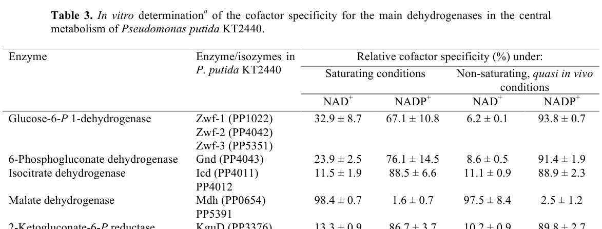

## Question

# Gene Research for Functional Annotation

## ⚠️ CRITICAL: Gene/Protein Identification Context

**BEFORE YOU BEGIN RESEARCH:** You MUST verify you are researching the CORRECT gene/protein. Gene symbols can be ambiguous, especially for less well-characterized genes from non-model organisms.

### Target Gene/Protein Identity (from UniProt):
- **UniProt Accession:** Q88Q44
- **Protein Description:** RecName: Full=Probable malate dehydrogenase {ECO:0000305}; EC=1.1.1.37 {ECO:0000250|UniProtKB:P61889};
- **Gene Information:** Name=mdh; OrderedLocusNames=PP_0654;
- **Organism (full):** Pseudomonas putida (strain ATCC 47054 / DSM 6125 / CFBP 8728 / NCIMB 11950 / KT2440).
- **Protein Family:** Belongs to the LDH/MDH superfamily. .
- **Key Domains:** L-lactate/malate_DH. (IPR001557); Lactate/malate_DH_C. (IPR022383); Lactate/malate_DH_N. (IPR001236); Lactate_DH/Glyco_Ohase_4_C. (IPR015955); Malate_DH_type3. (IPR011275)

### MANDATORY VERIFICATION STEPS:

1. **Check if the gene symbol "mdh" matches the protein description above**
2. **Verify the organism is correct:** Pseudomonas putida (strain ATCC 47054 / DSM 6125 / CFBP 8728 / NCIMB 11950 / KT2440).
3. **Check if protein family/domains align with what you find in literature**
4. **If you find literature for a DIFFERENT gene with the same or similar symbol, STOP**

### If Gene Symbol is Ambiguous or You Cannot Find Relevant Literature:

**DO NOT PROCEED WITH RESEARCH ON A DIFFERENT GENE.** Instead:
- State clearly: "The gene symbol 'mdh' is ambiguous or literature is limited for this specific protein"
- Explain what you found (e.g., "Found extensive literature on a different gene with the same symbol in a different organism")
- Describe the protein based ONLY on the UniProt information provided above
- Suggest that the protein function can be inferred from domain/family information

### Research Target:

Please provide a comprehensive research report on the gene **mdh** (gene ID: mdh, UniProt: Q88Q44) in PSEPK.

The research report should be a detailed narrative explaining the function, biological processes, and localization of the gene product. Citations should be given for all claims.

You should prioritize authoritative reviews and primary scientific literature when conducting research. You can supplement
this with annotations you find in gene/protein databases, but these can be outdated or inaccurate.

We are specifically interested in the primary function of the gene - for enzymes, what reaction is catalyzed, and what is the substrate specificity? For transporters, what is the substrate? For structural proteins or adapters, what is the broader structural role? For signaling molecules, what is the role in the pathway.

We are interested in where in or outside the cell the gene product carries out its function.

We are also interested in the signaling or biochemical pathways in which the gene functions. We are less interested in broad pleiotropic effects, except where these elucidate the precise role.

Include evidence where possible. We are interested in both experimental evidence as well as inference from structure, evolution, or bioinformatic analysis. Precise studies should be prioritized over high-throughput, where available.

## Output

Question: You are an expert researcher providing comprehensive, well-cited information.

Provide detailed information focusing on:
1. Key concepts and definitions with current understanding
2. Recent developments and latest research (prioritize 2023-2024 sources)
3. Current applications and real-world implementations
4. Expert opinions and analysis from authoritative sources
5. Relevant statistics and data from recent studies

Format as a comprehensive research report with proper citations. Include URLs and publication dates where available.
Always prioritize recent, authoritative sources and provide specific citations for all major claims.

# Gene Research for Functional Annotation

## ⚠️ CRITICAL: Gene/Protein Identification Context

**BEFORE YOU BEGIN RESEARCH:** You MUST verify you are researching the CORRECT gene/protein. Gene symbols can be ambiguous, especially for less well-characterized genes from non-model organisms.

### Target Gene/Protein Identity (from UniProt):
- **UniProt Accession:** Q88Q44
- **Protein Description:** RecName: Full=Probable malate dehydrogenase {ECO:0000305}; EC=1.1.1.37 {ECO:0000250|UniProtKB:P61889};
- **Gene Information:** Name=mdh; OrderedLocusNames=PP_0654;
- **Organism (full):** Pseudomonas putida (strain ATCC 47054 / DSM 6125 / CFBP 8728 / NCIMB 11950 / KT2440).
- **Protein Family:** Belongs to the LDH/MDH superfamily. .
- **Key Domains:** L-lactate/malate_DH. (IPR001557); Lactate/malate_DH_C. (IPR022383); Lactate/malate_DH_N. (IPR001236); Lactate_DH/Glyco_Ohase_4_C. (IPR015955); Malate_DH_type3. (IPR011275)

### MANDATORY VERIFICATION STEPS:

1. **Check if the gene symbol "mdh" matches the protein description above**
2. **Verify the organism is correct:** Pseudomonas putida (strain ATCC 47054 / DSM 6125 / CFBP 8728 / NCIMB 11950 / KT2440).
3. **Check if protein family/domains align with what you find in literature**
4. **If you find literature for a DIFFERENT gene with the same or similar symbol, STOP**

### If Gene Symbol is Ambiguous or You Cannot Find Relevant Literature:

**DO NOT PROCEED WITH RESEARCH ON A DIFFERENT GENE.** Instead:
- State clearly: "The gene symbol 'mdh' is ambiguous or literature is limited for this specific protein"
- Explain what you found (e.g., "Found extensive literature on a different gene with the same symbol in a different organism")
- Describe the protein based ONLY on the UniProt information provided above
- Suggest that the protein function can be inferred from domain/family information

### Research Target:

Please provide a comprehensive research report on the gene **mdh** (gene ID: mdh, UniProt: Q88Q44) in PSEPK.

The research report should be a detailed narrative explaining the function, biological processes, and localization of the gene product. Citations should be given for all claims.

You should prioritize authoritative reviews and primary scientific literature when conducting research. You can supplement
this with annotations you find in gene/protein databases, but these can be outdated or inaccurate.

We are specifically interested in the primary function of the gene - for enzymes, what reaction is catalyzed, and what is the substrate specificity? For transporters, what is the substrate? For structural proteins or adapters, what is the broader structural role? For signaling molecules, what is the role in the pathway.

We are interested in where in or outside the cell the gene product carries out its function.

We are also interested in the signaling or biochemical pathways in which the gene functions. We are less interested in broad pleiotropic effects, except where these elucidate the precise role.

Include evidence where possible. We are interested in both experimental evidence as well as inference from structure, evolution, or bioinformatic analysis. Precise studies should be prioritized over high-throughput, where available.

## Research Report: Functional Annotation of *Pseudomonas putida* KT2440 **mdh** (UniProt Q88Q44; locus **PP_0654**) — probable malate dehydrogenase (EC 1.1.1.37)

### 0) Executive summary
The UniProt target **Q88Q44** corresponds to *Pseudomonas putida* KT2440 **Mdh** encoded by **mdh / PP_0654**, a soluble, NAD-dependent malate dehydrogenase positioned at the **malate ⇌ oxaloacetate** node of central carbon metabolism. Experimental evidence in KT2440 cell-free extracts demonstrates **strong NAD+ preference** (~98% NAD+ vs ~2% NADP+ under multiple assay regimes). Recent 2023–2024 multi-omics studies in *P. putida* metabolic engineering and adaptation track **Mdh (PP_0654)** abundance/flux and show that removing or down-modulating this node can re-route malate away from oxaloacetate, engage the glyoxylate shunt, and reshape redox/cofactor demands—strategies leveraged for **bioproduction** and **non-native substrate utilization**. (nikel2015pseudomonasputidakt2440 pages 21-25, eng2023ensembleanditerative pages 11-13, dvorak2023genomicandmetabolic pages 41-45, dvorak2023genomicandmetabolic pages 20-22)

---

### 1) Target verification (mandatory identity checks)
**Gene symbol ambiguity resolution.** “mdh” can denote different malate dehydrogenase types (cytosolic/mitochondrial in eukaryotes; NAD- vs quinone-dependent oxidoreductases; D-malate dehydrogenases). For this request, multiple independent *P. putida* KT2440/EM42 studies explicitly refer to **malate dehydrogenase Mdh (PP_0654)** in central metabolism, matching the UniProt identity and avoiding cross-organism symbol confusion. (dvorak2023genomicandmetabolic pages 41-45, eng2023ensembleanditerative pages 11-13)

**Consistency with UniProt annotation.** Experimental cofactor specificity for **Mdh (PP_0654)** in KT2440 supports classification as a **canonical NAD-dependent malate dehydrogenase (EC 1.1.1.37)**, consistent with UniProt’s “probable malate dehydrogenase” assignment. (nikel2015pseudomonasputidakt2440 pages 21-25, nikel2015pseudomonasputidakt2440 media 2fe70d77)

---

### 2) Key concepts and current understanding
#### 2.1 Core definition and reaction
Malate dehydrogenase (MDH; EC 1.1.1.37) catalyzes the reversible reaction:

**L-malate + NAD+ ⇌ oxaloacetate + NADH + H+**. (lorenzo2024catalyticmechanismand pages 1-2)

This enzyme is ubiquitous and central to metabolism; it is commonly positioned to supply **oxaloacetate** (OAA) to the TCA cycle and to generate **NADH** that feeds respiratory energy metabolism. (lorenzo2024catalyticmechanismand pages 1-2)

#### 2.2 Mechanism and substrate/cosubstrate specificity (authoritative 2024 synthesis)
A recent mechanistic review (Essays in Biochemistry, 2024) summarizes MDH as following an **ordered Bi–Bi (compulsory order)** kinetic mechanism (NAD+ binds before malate; products released oxaloacetate then NADH) and highlights active-site loop closure as a key determinant of specificity and catalysis. (lorenzo2024catalyticmechanismand pages 5-7, lorenzo2024catalyticmechanismand pages 7-8)

The review also details conserved catalytic features: a **His–Asp catalytic dyad** and multiple **Arg residues** that recognize substrate carboxylates, and reports a large discrimination against non-cognate substrates (e.g., oxaloacetate reduced far faster than pyruvate). (lorenzo2024catalyticmechanismand pages 2-5, lorenzo2024catalyticmechanismand pages 1-2)

Thermodynamically, the equilibrium can strongly favor **L-malate/NAD+** under physiological conditions (example values in the review: Keq′ ≈ 2.9×10−5 at 38°C, pH 7; ΔG ≈ +27 kJ/mol), reinforcing that cellular directionality is often set by network context (substrate/product levels and coupling), not just intrinsic enzyme preference. (lorenzo2024catalyticmechanismand pages 1-2)

---

### 3) Biochemical function of *P. putida* Mdh (PP_0654): cofactors and specificity
#### 3.1 Cofactor preference measured in *P. putida* KT2440
In *P. putida* KT2440, Mdh was assayed in cell-free extracts from exponential-phase cultures grown on glucose minimal medium. Under saturating conditions, **Mdh (PP_0654)** showed **98.4 ± 0.7%** relative specificity for **NAD+** vs **1.6 ± 0.7%** for **NADP+**; under quasi in vivo/non-saturating conditions, **97.5 ± 8.4% NAD+** vs **2.5 ± 1.2% NADP+**. (nikel2015pseudomonasputidakt2440 pages 21-25, nikel2015pseudomonasputidakt2440 media 2fe70d77)

These data strongly support that the physiological cofactor for PP_0654 is **NAD(H)** rather than NADP(H), consistent with canonical TCA-cycle-linked MDH activity. (nikel2015pseudomonasputidakt2440 pages 21-25)

#### 3.2 Kinetic expectations (general MDH literature; not PP_0654-specific)
While direct kinetic constants (Km, kcat) for *P. putida* PP_0654 were not found in the retrieved pages, the 2024 review compiles representative MDH kinetics across organisms and emphasizes typical patterns: **KM(OAA) is commonly lower than KM(L-malate)**, and **KM(NADH) is lower than KM(NAD+)**, consistent with cellular metabolite availability and the common practice of studying OAA reduction in vitro. (lorenzo2024catalyticmechanismand pages 5-7)

---

### 4) Biological role and pathway context in *Pseudomonas putida*
#### 4.1 Placement in central metabolism (TCA cycle; malate/OAA node)
Recent *P. putida* studies explicitly annotate **Mdh (PP_0654)** as part of the **TCA cycle** and track its abundance as a central node enzyme during adaptation to non-native carbon sources. (dvorak2023genomicandmetabolic pages 41-45)

In a 13C-metabolic flux analysis (MFA) of engineered *P. putida* grown on D-xylose, malate dehydrogenase is identified among high-flux **central dehydrogenase reactions**, alongside Zwf/Gnd and pyruvate dehydrogenase, with discussion of flux through the malate/OAA node in relation to the glyoxylate shunt and redox demands. (dvorak2023genomicandmetabolic pages 20-22)

#### 4.2 Coupling to glyoxylate shunt and redox balancing (2023–2024 systems evidence)
During xylose metabolism adaptation in *P. putida*, MFA and proteomics indicate engagement of the **glyoxylate shunt** (AceA/GlcB) and suggest interplay between **redox balance** and shunt activity; different evolved lineages show different patterns of TCA vs glyoxylate usage, with Mdh abundance changing modestly in one lineage and increasing in another where it is argued to support TCA-cycle functioning. (dvorak2023genomicandmetabolic pages 20-22, dvorak2023genomicandmetabolic pages 41-45)

In the 2024 Nature Communications xylose study, the authors explicitly state that **upregulation of … malate dehydrogenase Mdh** (with other TCA enzymes) “supported functioning of the TCA cycle,” consistent with an adaptive shift toward oxidative metabolism when the glyoxylate shunt is downregulated (e.g., AceA down in the gnd− lineage). (dvorak2024syntheticallyprimedadaptationof pages 11-12)

#### 4.3 Cellular localization
No direct localization experiment for PP_0654 was found in the retrieved sources. However, the KT2440 evidence comes from **cell-free extract enzyme assays** and central metabolism mapping, supporting the inference that PP_0654 encodes a **soluble cytosolic (cytoplasmic) enzyme**, typical for bacterial NAD-dependent MDH participating in the TCA cycle. This should be treated as an inference rather than experimentally proven localization within the cited texts. (nikel2015pseudomonasputidakt2440 pages 5-6, lorenzo2024catalyticmechanismand pages 1-2)

---

### 5) Recent developments (2023–2024 prioritized): systems biology and metabolic engineering involving PP_0654
#### 5.1 2024: engineered + evolved *P. putida* for D-xylose utilization (real-world implementation)
A 2024 *Nature Communications* study used metabolic engineering plus adaptive laboratory evolution to enable and improve *P. putida* growth on the lignocellulosic sugar D-xylose, with multi-level analysis (including proteomics). In this context, Mdh is part of the tracked central metabolism and is discussed as supporting TCA cycle operation in one evolved lineage. (dvorak2024syntheticallyprimedadaptationof pages 10-11, dvorak2024syntheticallyprimedadaptationof pages 11-12)

Quantitative phenotype data relevant to central rewiring (though not uniquely attributable to mdh alone) show dramatic lag-phase improvements depending on regulatory-genotype context: an engineered strain PD855 exhibited lag phase **4.94 ± 0.39 h**, whereas a comparable strain with functional hexR showed lag phase **20.80 ± 0.31 h**. This provides a concrete example of how central carbon regulation reshapes the growth phenotype in the metabolic network in which Mdh operates. (dvorak2024syntheticallyprimedadaptationof pages 11-12)

#### 5.2 2023: growth-coupled bioproduction (indigoidine from para-coumarate) exploits the malate/OAA node
A 2023 systems engineering preprint analyzed growth-coupling designs for producing the blue pigment **indigoidine** from lignin-related carbon (p-coumarate) in *P. putida* KT2440. In Design 1 strains, proteomics explicitly reported **zero protein counts** for **Mdh/PP_0654**, consistent with engineered deletions affecting the malate→oxaloacetate step. (eng2023ensembleanditerative pages 11-13)

Quantitative multi-omics in these strains indicate compensatory rerouting at adjacent nodes: for example, a fumarate→malate isozyme (PP_0897) was **25–30% higher** than WT while Mqo3 was reduced to **9–26%** of WT; malic enzyme MaeB (malate→pyruvate) was reported at **~2-fold higher** protein abundance, consistent with diverting malate away from oxaloacetate production; the glyoxylate shunt enzymes AceA and GlcB were strongly upregulated (reported as multiple-fold changes). (eng2023ensembleanditerative pages 11-13)

Metabolomics further support bottlenecks or rerouting around the fumarate/malate/OAA region (e.g., **fumarate 2.7-fold higher** in one strain vs WT) with downstream shifts in TCA-linked metabolites and nitrogen assimilation precursors (e.g., AKG and glutamate changes) relevant to indigoidine biosynthesis. (eng2023ensembleanditerative pages 13-16)

---

### 6) Statistics and data highlights (recent studies)
#### 6.1 Quantitative cofactor specificity (direct biochemical assay)
The strongest quantitative functional data directly tied to PP_0654 in this evidence set are the NAD-vs-NADP specificity measurements in KT2440 extracts (Table 3 in Nikel et al., 2015). (nikel2015pseudomonasputidakt2440 pages 21-25, nikel2015pseudomonasputidakt2440 media 2fe70d77)

#### 6.2 Quantitative proteomics/metabolomics when Mdh is absent
In the indigoidine engineering context, quantitative proteomics showed Mdh/PP_0654 undetectable (zero counts) and reported numeric relative changes in neighboring nodes (percent-of-WT and ~2-fold values) and glyoxylate shunt upregulation; metabolomics reported a **2.7-fold** fumarate increase and multiple fold-changes in central metabolites (e.g., AKG, glutamate, glutamine). (eng2023ensembleanditerative pages 11-13, eng2023ensembleanditerative pages 13-16)

#### 6.3 Expert synthesis: kinetics and thermodynamics
The 2024 MDH review provides representative kinetic constants across MDH isoforms (e.g., OAA KM in the tens of µM and L-malate KM in the hundreds-to-thousands of µM in some cited examples) and highlights that equilibrium/thermodynamics can oppose OAA formation at physiological conditions, reinforcing that MDH flux in vivo is often driven by pathway coupling. (lorenzo2024catalyticmechanismand pages 5-7, lorenzo2024catalyticmechanismand pages 1-2)

---

### 7) Interpretation and expert analysis (evidence-based)
1. **Functional assignment confidence is high**: PP_0654 is repeatedly annotated as Mdh in *P. putida* KT2440-derived strains, and biochemical assay data show dominant NAD dependence consistent with EC 1.1.1.37 activity. (nikel2015pseudomonasputidakt2440 pages 21-25, dvorak2023genomicandmetabolic pages 41-45)
2. **Physiological role is context-dependent**: While MDH is formally reversible, modern enzymology emphasizes that cellular directionality is set by metabolite ratios and coupling; the strong thermodynamic bias toward malate under some conditions implies that producing OAA may require pulling flux (e.g., downstream consumption or anaplerotic demands). (lorenzo2024catalyticmechanismand pages 1-2)
3. **Engineering leverage point**: 2023–2024 studies illustrate that *P. putida* engineers can exploit the malate/OAA node by lowering Mdh abundance/activity (e.g., eliminating detectable Mdh/PP_0654) to reroute malate carbon (via MaeB) and engage the glyoxylate shunt, consistent with growth-coupled production strategies. (eng2023ensembleanditerative pages 11-13)

---

### 8) Evidence summary table
| Claim/Field | Evidence summary | Organism/strain context | Year | Source (DOI/URL) | Citation id(s) |
|---|---|---|---|---|---|
| Gene/protein identifiers | Target identity is consistent across sources as **Mdh**, locus **PP_0654**, in *Pseudomonas putida* KT2440/EM42-derived strains; recent proteomics papers explicitly annotate **Mdh (PP_0654)**, matching UniProt **Q88Q44** and the annotation “probable malate dehydrogenase.” | *P. putida* KT2440 and derivatives (including EM42-derived xylose-engineered strains) | 2015, 2023, 2024 | Nikel et al., JBC, 2015, https://doi.org/10.1074/jbc.m115.687749; Dvořák et al., bioRxiv, 2023, https://doi.org/10.1101/2023.05.19.541448; Dvořák et al., Nat Commun, 2024, https://doi.org/10.1038/s41467-024-46812-9 | (nikel2015pseudomonasputidakt2440 pages 21-25, dvorak2023genomicandmetabolic pages 41-45, dvorak2024syntheticallyprimedadaptationof pages 10-11) |
| Reaction/EC | By family annotation and authoritative MDH review, the enzyme catalyzes the reversible reaction **L-malate + NAD+ ⇌ oxaloacetate + NADH + H+** (**EC 1.1.1.37**). The 2024 review describes canonical MDH chemistry as NAD+-dependent, ordered Bi-Bi, with strong specificity for L-malate/oxaloacetate. | General MDH definition applied to bacterial Mdh; consistent with *P. putida* PP_0654 annotation | 2024 | de Lorenzo et al., Essays Biochem, 2024, https://doi.org/10.1042/EBC20230086 | (lorenzo2024catalyticmechanismand pages 5-7, lorenzo2024catalyticmechanismand pages 2-5, lorenzo2024catalyticmechanismand pages 1-2, lorenzo2024catalyticmechanismand pages 7-8) |
| Cofactor specificity (quantitative) | In *P. putida* KT2440 cell-free extracts, **Mdh (PP_0654)** is strongly **NAD+-specific**. Under saturating conditions: **98.4 ± 0.7% NAD+** vs **1.6 ± 0.7% NADP+**. Under quasi in vivo/non-saturating conditions: **97.5 ± 8.4% NAD+** vs **2.5 ± 1.2% NADP+**. | *P. putida* KT2440, exponential phase, M9 + 20 mM glucose, enzyme assays from cell-free extracts | 2015 | Nikel et al., JBC, 2015, Table 3, https://doi.org/10.1074/jbc.m115.687749 | (nikel2015pseudomonasputidakt2440 pages 21-25, nikel2015pseudomonasputidakt2440 pages 7-8, nikel2015pseudomonasputidakt2440 media 2fe70d77) |
| Pathway roles | Evidence places Mdh at the **malate/oxaloacetate node of central carbon metabolism**, principally the **TCA cycle**, with links to **glyoxylate shunt engagement** and **redox balancing**. 13C-MFA during xylose growth identified high dehydrogenase flux including MDH and an active glyoxylate shunt; proteomics in evolved xylose strains showed Mdh abundance changes consistent with altered TCA use. In indigoidine-engineering strains, deletion/loss of **Mdh/PP_0654** rerouted malate away from oxaloacetate toward pyruvate while glyoxylate shunt proteins increased. | *P. putida* EM42-derived xylose strains (PD310, PD584, PD584 L3, PD689 tt L1); KT2440-derived indigoidine strains | 2023, 2024 | Dvořák et al., bioRxiv, 2023, https://doi.org/10.1101/2023.05.19.541448; Dvořák et al., Nat Commun, 2024, https://doi.org/10.1038/s41467-024-46812-9; Eng et al., bioRxiv, 2023, https://doi.org/10.1101/2023.03.16.532821 | (eng2023ensembleanditerative pages 11-13, dvorak2023genomicandmetabolic pages 41-45, dvorak2023genomicandmetabolic pages 22-26, dvorak2023genomicandmetabolic pages 20-22, dvorak2024syntheticallyprimedadaptationof pages 10-11) |
| Systems/engineering contexts | **Xylose adaptation:** MDH was tracked by **13C-metabolic flux analysis** and **proteomics** as part of rewiring central metabolism for growth on non-native D-xylose; Mdh abundance decreased slightly in one evolved lineage and increased in another, indicating alternative adaptation routes. **Indigoidine production:** **proteomics** showed **Mdh/PP_0654 had zero protein counts** in engineered deletion backgrounds, supporting deliberate rerouting of the malate→oxaloacetate step to improve product coupling. | Xylose-adapted EM42 derivatives; para-coumarate/indigoidine KT2440 engineering backgrounds | 2023, 2024 | Dvořák et al., bioRxiv, 2023, https://doi.org/10.1101/2023.05.19.541448; Dvořák et al., Nat Commun, 2024, https://doi.org/10.1038/s41467-024-46812-9; Eng et al., bioRxiv, 2023, https://doi.org/10.1101/2023.03.16.532821 | (eng2023ensembleanditerative pages 11-13, dvorak2023genomicandmetabolic pages 41-45, dvorak2023genomicandmetabolic pages 22-26, dvorak2023genomicandmetabolic pages 20-22, dvorak2024syntheticallyprimedadaptationof pages 10-11) |
| Localization inference | No direct localization experiment for PP_0654 was retrieved here. For bacterial central carbon MDH, the evidence supports a **cytosolic/cytoplasmic enzyme** acting in soluble metabolism rather than a membrane or periplasmic oxidoreductase. This is an **inference** from canonical MDH function, assay context using cell-free extracts, and pathway placement; localization should therefore be treated as probable rather than directly demonstrated in the cited *P. putida* papers. | *P. putida* KT2440/derivatives; inference from bacterial central metabolism | 2015, 2024 | Nikel et al., JBC, 2015, https://doi.org/10.1074/jbc.m115.687749; de Lorenzo et al., Essays Biochem, 2024, https://doi.org/10.1042/EBC20230086 | (nikel2015pseudomonasputidakt2440 pages 21-25, lorenzo2024catalyticmechanismand pages 1-2, lorenzo2024catalyticmechanismand pages 7-8) |

*Table: This table summarizes the strongest evidence supporting the functional annotation of Pseudomonas putida KT2440 Mdh (PP_0654; UniProt Q88Q44). It integrates foundational biochemical evidence with 2023-2024 systems studies showing how the enzyme participates in central metabolism and metabolic engineering contexts.*

---

### 9) Key sources (with URLs and publication dates)
- Nikel PI et al. *J Biol Chem.* **2015-10**. “*Pseudomonas putida* KT2440 Strain Metabolizes Glucose…” https://doi.org/10.1074/jbc.m115.687749 (nikel2015pseudomonasputidakt2440 pages 21-25, nikel2015pseudomonasputidakt2440 media 2fe70d77)
- Eng TT et al. *bioRxiv* **2023-03**. “Ensemble and Iterative Engineering…” https://doi.org/10.1101/2023.03.16.532821 (eng2023ensembleanditerative pages 11-13, eng2023ensembleanditerative pages 13-16)
- Dvořák P et al. *bioRxiv* **2023-05**. “Genomic and metabolic plasticity…” https://doi.org/10.1101/2023.05.19.541448 (dvorak2023genomicandmetabolic pages 41-45, dvorak2023genomicandmetabolic pages 20-22)
- Dvořák P et al. *Nature Communications* **2024-03**. “Synthetically-primed adaptation…” https://doi.org/10.1038/s41467-024-46812-9 (dvorak2024syntheticallyprimedadaptationof pages 11-12)
- de Lorenzo L et al. *Essays in Biochemistry* **2024-10**. “Catalytic mechanism and kinetics of malate dehydrogenase” https://doi.org/10.1042/ebc20230086 (lorenzo2024catalyticmechanismand pages 1-2, lorenzo2024catalyticmechanismand pages 5-7)

---

### 10) Limitations of this evidence set
- **Direct enzymatic kinetics (Km/kcat) for *P. putida* PP_0654** were not located in the retrieved texts; claims about kinetics beyond cofactor preference are therefore supported by general MDH literature rather than PP_0654-specific enzymology. (lorenzo2024catalyticmechanismand pages 5-7, nikel2015pseudomonasputidakt2440 pages 21-25)
- **Subcellular localization** for PP_0654 was not experimentally demonstrated in the retrieved papers; localization is inferred from soluble assays and canonical bacterial MDH roles. (nikel2015pseudomonasputidakt2440 pages 5-6)
- **Essentiality** of mdh/PP_0654 in KT2440 was not directly extracted here; thus, no essentiality claim is made.

References

1. (nikel2015pseudomonasputidakt2440 pages 21-25): Pablo I. Nikel, Max Chavarría, Tobias Fuhrer, Uwe Sauer, and Víctor de Lorenzo. Pseudomonas putida kt2440 strain metabolizes glucose through a cycle formed by enzymes of the entner-doudoroff, embden-meyerhof-parnas, and pentose phosphate pathways. Journal of Biological Chemistry, 290:25920-25932, Oct 2015. URL: https://doi.org/10.1074/jbc.m115.687749, doi:10.1074/jbc.m115.687749. This article has 440 citations and is from a domain leading peer-reviewed journal.

2. (eng2023ensembleanditerative pages 11-13): Thomas T Eng, Deepanwita Banerjee, Javier Menasalvas, Yan Chen, Jennifer Gin, Hemant Choudhary, Edward Baidoo, Jian Hua Chen, Axel Ekman, Ramu Kakumanu, Yuzhong Liu Diercks, Alex Codik, Carolyn Larabell, John Gladden, Blake A Simmons, Jay D Keasling, Christopher J Petzold, and Aindrila Mukhopadhyay. Ensemble and iterative engineering for maximized bioconversion to the blue pigment, indigoidine from non-canonical sustainable carbon sources. bioRxiv, Mar 2023. URL: https://doi.org/10.1101/2023.03.16.532821, doi:10.1101/2023.03.16.532821. This article has 1 citations.

3. (dvorak2023genomicandmetabolic pages 41-45): Pavel Dvořák, Barbora Burýšková, Barbora Popelářová, Birgitta Ebert, Tibor Botka, Dalimil Bujdoš, Alberto Sánchez-Pascuala, Hannah Schöttler, Heiko Hayen, Víctor de Lorenzo, Lars M. Blank, and Martin Benešík. Genomic and metabolic plasticity drive alternative scenarios for adapting pseudomonas putida to non-native substrate d-xylose. bioRxiv, May 2023. URL: https://doi.org/10.1101/2023.05.19.541448, doi:10.1101/2023.05.19.541448. This article has 0 citations.

4. (dvorak2023genomicandmetabolic pages 20-22): Pavel Dvořák, Barbora Burýšková, Barbora Popelářová, Birgitta Ebert, Tibor Botka, Dalimil Bujdoš, Alberto Sánchez-Pascuala, Hannah Schöttler, Heiko Hayen, Víctor de Lorenzo, Lars M. Blank, and Martin Benešík. Genomic and metabolic plasticity drive alternative scenarios for adapting pseudomonas putida to non-native substrate d-xylose. bioRxiv, May 2023. URL: https://doi.org/10.1101/2023.05.19.541448, doi:10.1101/2023.05.19.541448. This article has 0 citations.

5. (nikel2015pseudomonasputidakt2440 media 2fe70d77): Pablo I. Nikel, Max Chavarría, Tobias Fuhrer, Uwe Sauer, and Víctor de Lorenzo. Pseudomonas putida kt2440 strain metabolizes glucose through a cycle formed by enzymes of the entner-doudoroff, embden-meyerhof-parnas, and pentose phosphate pathways. Journal of Biological Chemistry, 290:25920-25932, Oct 2015. URL: https://doi.org/10.1074/jbc.m115.687749, doi:10.1074/jbc.m115.687749. This article has 440 citations and is from a domain leading peer-reviewed journal.

6. (lorenzo2024catalyticmechanismand pages 1-2): Laura de Lorenzo, Tyler M.M. Stack, Kristin M. Fox, and Katherine M. Walstrom. Catalytic mechanism and kinetics of malate dehydrogenase. Essays in Biochemistry, 68:73-82, Oct 2024. URL: https://doi.org/10.1042/ebc20230086, doi:10.1042/ebc20230086. This article has 22 citations and is from a peer-reviewed journal.

7. (lorenzo2024catalyticmechanismand pages 5-7): Laura de Lorenzo, Tyler M.M. Stack, Kristin M. Fox, and Katherine M. Walstrom. Catalytic mechanism and kinetics of malate dehydrogenase. Essays in Biochemistry, 68:73-82, Oct 2024. URL: https://doi.org/10.1042/ebc20230086, doi:10.1042/ebc20230086. This article has 22 citations and is from a peer-reviewed journal.

8. (lorenzo2024catalyticmechanismand pages 7-8): Laura de Lorenzo, Tyler M.M. Stack, Kristin M. Fox, and Katherine M. Walstrom. Catalytic mechanism and kinetics of malate dehydrogenase. Essays in Biochemistry, 68:73-82, Oct 2024. URL: https://doi.org/10.1042/ebc20230086, doi:10.1042/ebc20230086. This article has 22 citations and is from a peer-reviewed journal.

9. (lorenzo2024catalyticmechanismand pages 2-5): Laura de Lorenzo, Tyler M.M. Stack, Kristin M. Fox, and Katherine M. Walstrom. Catalytic mechanism and kinetics of malate dehydrogenase. Essays in Biochemistry, 68:73-82, Oct 2024. URL: https://doi.org/10.1042/ebc20230086, doi:10.1042/ebc20230086. This article has 22 citations and is from a peer-reviewed journal.

10. (dvorak2024syntheticallyprimedadaptationof pages 11-12): Pavel Dvořák, Barbora Burýšková, Barbora Popelářová, Birgitta Elisabeth Ebert, Tibor Botka, Dalimil Bujdoš, Alberto Sánchez-Pascuala, Hannah Schöttler, Heiko Hayen, Víctor de Lorenzo, Lars M. Blank, and Martin Benešík. Synthetically-primed adaptation of pseudomonas putida to a non-native substrate d-xylose. Nature Communications, Mar 2024. URL: https://doi.org/10.1038/s41467-024-46812-9, doi:10.1038/s41467-024-46812-9. This article has 37 citations and is from a highest quality peer-reviewed journal.

11. (nikel2015pseudomonasputidakt2440 pages 5-6): Pablo I. Nikel, Max Chavarría, Tobias Fuhrer, Uwe Sauer, and Víctor de Lorenzo. Pseudomonas putida kt2440 strain metabolizes glucose through a cycle formed by enzymes of the entner-doudoroff, embden-meyerhof-parnas, and pentose phosphate pathways. Journal of Biological Chemistry, 290:25920-25932, Oct 2015. URL: https://doi.org/10.1074/jbc.m115.687749, doi:10.1074/jbc.m115.687749. This article has 440 citations and is from a domain leading peer-reviewed journal.

12. (dvorak2024syntheticallyprimedadaptationof pages 10-11): Pavel Dvořák, Barbora Burýšková, Barbora Popelářová, Birgitta Elisabeth Ebert, Tibor Botka, Dalimil Bujdoš, Alberto Sánchez-Pascuala, Hannah Schöttler, Heiko Hayen, Víctor de Lorenzo, Lars M. Blank, and Martin Benešík. Synthetically-primed adaptation of pseudomonas putida to a non-native substrate d-xylose. Nature Communications, Mar 2024. URL: https://doi.org/10.1038/s41467-024-46812-9, doi:10.1038/s41467-024-46812-9. This article has 37 citations and is from a highest quality peer-reviewed journal.

13. (eng2023ensembleanditerative pages 13-16): Thomas T Eng, Deepanwita Banerjee, Javier Menasalvas, Yan Chen, Jennifer Gin, Hemant Choudhary, Edward Baidoo, Jian Hua Chen, Axel Ekman, Ramu Kakumanu, Yuzhong Liu Diercks, Alex Codik, Carolyn Larabell, John Gladden, Blake A Simmons, Jay D Keasling, Christopher J Petzold, and Aindrila Mukhopadhyay. Ensemble and iterative engineering for maximized bioconversion to the blue pigment, indigoidine from non-canonical sustainable carbon sources. bioRxiv, Mar 2023. URL: https://doi.org/10.1101/2023.03.16.532821, doi:10.1101/2023.03.16.532821. This article has 1 citations.

14. (nikel2015pseudomonasputidakt2440 pages 7-8): Pablo I. Nikel, Max Chavarría, Tobias Fuhrer, Uwe Sauer, and Víctor de Lorenzo. Pseudomonas putida kt2440 strain metabolizes glucose through a cycle formed by enzymes of the entner-doudoroff, embden-meyerhof-parnas, and pentose phosphate pathways. Journal of Biological Chemistry, 290:25920-25932, Oct 2015. URL: https://doi.org/10.1074/jbc.m115.687749, doi:10.1074/jbc.m115.687749. This article has 440 citations and is from a domain leading peer-reviewed journal.

15. (dvorak2023genomicandmetabolic pages 22-26): Pavel Dvořák, Barbora Burýšková, Barbora Popelářová, Birgitta Ebert, Tibor Botka, Dalimil Bujdoš, Alberto Sánchez-Pascuala, Hannah Schöttler, Heiko Hayen, Víctor de Lorenzo, Lars M. Blank, and Martin Benešík. Genomic and metabolic plasticity drive alternative scenarios for adapting pseudomonas putida to non-native substrate d-xylose. bioRxiv, May 2023. URL: https://doi.org/10.1101/2023.05.19.541448, doi:10.1101/2023.05.19.541448. This article has 0 citations.

## Artifacts

- [Edison artifact artifact-00](mdh-deep-research-falcon_artifacts/artifact-00.md)

## Citations

1. lorenzo2024catalyticmechanismand pages 1-2
2. lorenzo2024catalyticmechanismand pages 5-7
3. dvorak2023genomicandmetabolic pages 41-45
4. dvorak2023genomicandmetabolic pages 20-22
5. dvorak2024syntheticallyprimedadaptationof pages 11-12
6. eng2023ensembleanditerative pages 11-13
7. eng2023ensembleanditerative pages 13-16
8. lorenzo2024catalyticmechanismand pages 7-8
9. lorenzo2024catalyticmechanismand pages 2-5
10. dvorak2024syntheticallyprimedadaptationof pages 10-11
11. dvorak2023genomicandmetabolic pages 22-26
12. https://doi.org/10.1074/jbc.m115.687749;
13. https://doi.org/10.1101/2023.05.19.541448;
14. https://doi.org/10.1038/s41467-024-46812-9
15. https://doi.org/10.1042/EBC20230086
16. https://doi.org/10.1074/jbc.m115.687749
17. https://doi.org/10.1038/s41467-024-46812-9;
18. https://doi.org/10.1101/2023.03.16.532821
19. https://doi.org/10.1101/2023.05.19.541448
20. https://doi.org/10.1042/ebc20230086
21. https://doi.org/10.1074/jbc.m115.687749,
22. https://doi.org/10.1101/2023.03.16.532821,
23. https://doi.org/10.1101/2023.05.19.541448,
24. https://doi.org/10.1042/ebc20230086,
25. https://doi.org/10.1038/s41467-024-46812-9,