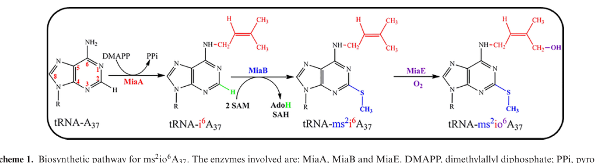

## Question

# Gene Research for Functional Annotation

## ⚠️ CRITICAL: Gene/Protein Identification Context

**BEFORE YOU BEGIN RESEARCH:** You MUST verify you are researching the CORRECT gene/protein. Gene symbols can be ambiguous, especially for less well-characterized genes from non-model organisms.

### Target Gene/Protein Identity (from UniProt):
- **UniProt Accession:** Q88KV1
- **Protein Description:** RecName: Full=tRNA 2-(methylsulfanyl)-N(6)-isopentenyladenosine(37) hydroxylase {ECO:0000305}; EC=1.14.99.69 {ECO:0000269|PubMed:32785618}; AltName: Full=2-methylthio-N6-isopentenyladenosine(37)-tRNA monooxygenase {ECO:0000250|UniProtKB:Q08015}; AltName: Full=tRNA-(ms[2]io[6]A37)-hydroxylase {ECO:0000250|UniProtKB:Q08015};
- **Gene Information:** Name=miaE {ECO:0000303|PubMed:32785618}; OrderedLocusNames=PP_2188 {ECO:0000312|EMBL:AAN67801.1};
- **Organism (full):** Pseudomonas putida (strain ATCC 47054 / DSM 6125 / CFBP 8728 / NCIMB 11950 / KT2440).
- **Protein Family:** Belongs to the MiaE family. .
- **Key Domains:** Ferritin-like. (IPR012347); Ferritin-like_SF. (IPR009078); tRNA-Hydrxlase_MiaE. (IPR010386); MiaE (PF06175)

### MANDATORY VERIFICATION STEPS:

1. **Check if the gene symbol "miaE" matches the protein description above**
2. **Verify the organism is correct:** Pseudomonas putida (strain ATCC 47054 / DSM 6125 / CFBP 8728 / NCIMB 11950 / KT2440).
3. **Check if protein family/domains align with what you find in literature**
4. **If you find literature for a DIFFERENT gene with the same or similar symbol, STOP**

### If Gene Symbol is Ambiguous or You Cannot Find Relevant Literature:

**DO NOT PROCEED WITH RESEARCH ON A DIFFERENT GENE.** Instead:
- State clearly: "The gene symbol 'miaE' is ambiguous or literature is limited for this specific protein"
- Explain what you found (e.g., "Found extensive literature on a different gene with the same symbol in a different organism")
- Describe the protein based ONLY on the UniProt information provided above
- Suggest that the protein function can be inferred from domain/family information

### Research Target:

Please provide a comprehensive research report on the gene **miaE** (gene ID: miaE, UniProt: Q88KV1) in PSEPK.

The research report should be a detailed narrative explaining the function, biological processes, and localization of the gene product. Citations should be given for all claims.

You should prioritize authoritative reviews and primary scientific literature when conducting research. You can supplement
this with annotations you find in gene/protein databases, but these can be outdated or inaccurate.

We are specifically interested in the primary function of the gene - for enzymes, what reaction is catalyzed, and what is the substrate specificity? For transporters, what is the substrate? For structural proteins or adapters, what is the broader structural role? For signaling molecules, what is the role in the pathway.

We are interested in where in or outside the cell the gene product carries out its function.

We are also interested in the signaling or biochemical pathways in which the gene functions. We are less interested in broad pleiotropic effects, except where these elucidate the precise role.

Include evidence where possible. We are interested in both experimental evidence as well as inference from structure, evolution, or bioinformatic analysis. Precise studies should be prioritized over high-throughput, where available.

## Output

Question: You are an expert researcher providing comprehensive, well-cited information.

Provide detailed information focusing on:
1. Key concepts and definitions with current understanding
2. Recent developments and latest research (prioritize 2023-2024 sources)
3. Current applications and real-world implementations
4. Expert opinions and analysis from authoritative sources
5. Relevant statistics and data from recent studies

Format as a comprehensive research report with proper citations. Include URLs and publication dates where available.
Always prioritize recent, authoritative sources and provide specific citations for all major claims.

# Gene Research for Functional Annotation

## ⚠️ CRITICAL: Gene/Protein Identification Context

**BEFORE YOU BEGIN RESEARCH:** You MUST verify you are researching the CORRECT gene/protein. Gene symbols can be ambiguous, especially for less well-characterized genes from non-model organisms.

### Target Gene/Protein Identity (from UniProt):
- **UniProt Accession:** Q88KV1
- **Protein Description:** RecName: Full=tRNA 2-(methylsulfanyl)-N(6)-isopentenyladenosine(37) hydroxylase {ECO:0000305}; EC=1.14.99.69 {ECO:0000269|PubMed:32785618}; AltName: Full=2-methylthio-N6-isopentenyladenosine(37)-tRNA monooxygenase {ECO:0000250|UniProtKB:Q08015}; AltName: Full=tRNA-(ms[2]io[6]A37)-hydroxylase {ECO:0000250|UniProtKB:Q08015};
- **Gene Information:** Name=miaE {ECO:0000303|PubMed:32785618}; OrderedLocusNames=PP_2188 {ECO:0000312|EMBL:AAN67801.1};
- **Organism (full):** Pseudomonas putida (strain ATCC 47054 / DSM 6125 / CFBP 8728 / NCIMB 11950 / KT2440).
- **Protein Family:** Belongs to the MiaE family. .
- **Key Domains:** Ferritin-like. (IPR012347); Ferritin-like_SF. (IPR009078); tRNA-Hydrxlase_MiaE. (IPR010386); MiaE (PF06175)

### MANDATORY VERIFICATION STEPS:

1. **Check if the gene symbol "miaE" matches the protein description above**
2. **Verify the organism is correct:** Pseudomonas putida (strain ATCC 47054 / DSM 6125 / CFBP 8728 / NCIMB 11950 / KT2440).
3. **Check if protein family/domains align with what you find in literature**
4. **If you find literature for a DIFFERENT gene with the same or similar symbol, STOP**

### If Gene Symbol is Ambiguous or You Cannot Find Relevant Literature:

**DO NOT PROCEED WITH RESEARCH ON A DIFFERENT GENE.** Instead:
- State clearly: "The gene symbol 'miaE' is ambiguous or literature is limited for this specific protein"
- Explain what you found (e.g., "Found extensive literature on a different gene with the same symbol in a different organism")
- Describe the protein based ONLY on the UniProt information provided above
- Suggest that the protein function can be inferred from domain/family information

### Research Target:

Please provide a comprehensive research report on the gene **miaE** (gene ID: miaE, UniProt: Q88KV1) in PSEPK.

The research report should be a detailed narrative explaining the function, biological processes, and localization of the gene product. Citations should be given for all claims.

You should prioritize authoritative reviews and primary scientific literature when conducting research. You can supplement
this with annotations you find in gene/protein databases, but these can be outdated or inaccurate.

We are specifically interested in the primary function of the gene - for enzymes, what reaction is catalyzed, and what is the substrate specificity? For transporters, what is the substrate? For structural proteins or adapters, what is the broader structural role? For signaling molecules, what is the role in the pathway.

We are interested in where in or outside the cell the gene product carries out its function.

We are also interested in the signaling or biochemical pathways in which the gene functions. We are less interested in broad pleiotropic effects, except where these elucidate the precise role.

Include evidence where possible. We are interested in both experimental evidence as well as inference from structure, evolution, or bioinformatic analysis. Precise studies should be prioritized over high-throughput, where available.

## Research report: **miaE** (PP_2188; UniProt **Q88KV1**) in *Pseudomonas putida* KT2440

### 0) Identity verification (mandatory disambiguation)
The UniProt target **Q88KV1** corresponds to **PP_2188** in *Pseudomonas putida* KT2440 and was experimentally validated to encode **MiaE**, a tRNA 2-(methylthio)-N6-isopentenyladenosine(37) hydroxylase/monooxygenase that converts **ms2i6A37 → ms2io6A37** in tRNA (Carpentier et al., *Nucleic Acids Research*, Aug 2020; https://doi.org/10.1093/nar/gkaa667). (carpentier2020structuralbiochemicaland pages 4-5, carpentier2020structuralbiochemicaland pages 1-2)

### 1) Key concepts and definitions (current understanding)
#### 1.1 tRNA position 37 hypermodifications
Position **37** in tRNA is the purine immediately 3′ of the anticodon (position 36). Modifications at/near the anticodon (positions 34 and 37) are widely understood to enhance codon-decoding specificity, increase ribosomal binding affinity, maintain the translational reading frame, and promote correct tRNA/mRNA translocation. (carpentier2020structuralbiochemicaland pages 1-2)

A key set of A37 modifications involves a three-step pathway:
1) **MiaA** installs **i6A37** (N6-isopentenyladenosine) by transferring an isopentenyl group from DMAPP to A37.
2) **MiaB** converts i6A37 to **ms2i6A37** by methylthiolation (radical-SAM/Fe–S enzyme).
3) **MiaE** hydroxylates **ms2i6A37 → ms2io6A37** in an O2-dependent reaction.
This ordering and enzymology are summarized explicitly for the ms2io6A37 pathway. (carpentier2020structuralbiochemicaland pages 1-2)

#### 1.2 Definition of MiaE activity
MiaE is defined as an **O2-dependent tRNA monooxygenase/hydroxylase** that performs **allylic hydroxylation** of the isopentenyl side chain of **ms2i6A37** (in selected tRNAs), yielding **ms2io6A37**. (carpentier2020structuralbiochemicaland pages 1-2, carpentier2020structuralbiochemicaland pages 10-12)

### 2) Primary function: reaction, substrate specificity, and mechanism
#### 2.1 Catalyzed reaction (EC 1.14.99.69)
For *P. putida* KT2440, MiaE (PP_2188/Q88KV1) catalyzes the O2-dependent hydroxylation reaction:

**tRNA-A37(ms2i6A) + O2 + reducing equivalents → tRNA-A37(ms2io6A) + H2O (overall monooxygenase chemistry)**

Direct evidence in *P. putida* MiaE work shows conversion of **ms2i6A** to **ms2io6A** in vivo (chromatographic and MS-based detection of substrate depletion and product formation). (carpentier2020structuralbiochemicaland pages 5-7, carpentier2020structuralbiochemicaland media e79c89a5)

#### 2.2 Substrate specificity
*P. putida* MiaE **strongly prefers ms2i6A37 over i6A37** as a substrate. (carpentier2020structuralbiochemicaland pages 2-3, carpentier2020structuralbiochemicaland pages 1-2)

The Carpentier et al. study used a bacterial system naturally lacking miaE to demonstrate functional specificity: expressing PP_2188 in *E. coli* (which lacks miaE and accumulates ms2i6A37) led to **appearance of ms2io6A37**, demonstrating that ms2i6A37-containing tRNAs are physiological substrates. (carpentier2020structuralbiochemicaland pages 4-5, carpentier2020structuralbiochemicaland pages 5-7)

#### 2.3 Cofactors and active-site metal center
MiaE is a **non-heme diiron enzyme**. Spectroscopic evidence (including EPR features consistent with mixed-valent FeII/FeIII states characteristic of oxygen-activating diiron enzymes) and crystallography support a **dinuclear iron center** (with an oxo bridge) as the catalytic core. (carpentier2020structuralbiochemicaland pages 4-5, carpentier2020structuralbiochemicaland pages 1-2, carpentier2020structuralbiochemicaland pages 7-9)

Crystallographic ligation details in *P. putida* MiaE include iron coordination by histidines and glutamates (carboxylate-bridged non-heme diiron architecture), consistent with the assigned ferritin-like/non-heme diiron superfamily fold. (carpentier2020structuralbiochemicaland pages 5-7)

#### 2.4 Oxygen access and catalytic architecture
A conserved **hydrophobic tunnel** leading from solvent to the diiron center was identified by krypton-pressurization experiments and structural analysis, supporting the enzyme’s **O2-dependent** chemistry and providing a concrete mechanistic feature for oxygen delivery. (carpentier2020structuralbiochemicaland pages 1-2, carpentier2020structuralbiochemicaland pages 7-9)

### 3) Structure, domains, and determinants of tRNA recognition
#### 3.1 Overall fold and oligomeric state
*P. putida* MiaE structure (1.7 Å) shows a compact, predominantly α-helical protein with a **canonical four-α-helix bundle** that houses the diiron active site (a ferritin-like diiron fold). Pp-MiaE forms a **stable homodimer** in solution with a substantial interface. (carpentier2020structuralbiochemicaland pages 1-2, carpentier2020structuralbiochemicaland pages 10-12, carpentier2020structuralbiochemicaland pages 5-7)

A structural view of the dimeric architecture and the diiron active-site region is shown in the paper’s structural figures. (carpentier2020structuralbiochemicaland media 098a18df)

#### 3.2 tRNA docking/recognition features
Computational docking plus mutagenesis supports that MiaE recognizes the tRNA anticodon stem-loop region via a **positively charged concave surface/loop**. Specific basic residues were implicated (e.g., **Lys35, Lys40, Lys51, Arg100, Arg101, Lys110**), positioned to contact anticodon-loop nucleotides in the docking model. (carpentier2020structuralbiochemicaland pages 10-12, carpentier2020structuralbiochemicaland pages 7-9)

Quantitative binding/functional data (statistics):
- Wild-type MiaE binds tRNA with an apparent **KD ~7 µM (±0.7 µM)**.
- Mutations **K40D** and **R100E** increased apparent KD to **~32 µM (±4 µM)** and **~58 µM (±7 µM)**, respectively, and abolished ms2io6A37 production in vivo, arguing these residues contribute directly to productive tRNA engagement rather than global folding. (carpentier2020structuralbiochemicaland pages 7-9)

The docking model depicting how the tRNA anticodon region approaches the enzyme active site is shown in the paper’s docking figure. (carpentier2020structuralbiochemicaland media 598ddbc8)

### 4) Cellular localization and where the function is carried out
No direct subcellular localization assay (e.g., fractionation or microscopy) was retrieved for Pp-MiaE. However, the enzyme’s function—post-transcriptional modification of cytosolic tRNA—and the reported production of soluble recombinant protein and in vivo tRNA modification activity together support that MiaE functions as a **soluble cytosolic enzyme** acting on cellular tRNAs. (carpentier2020structuralbiochemicaland pages 4-5, carpentier2020structuralbiochemicaland pages 3-4)

### 5) Biological processes, pathway context, and phenotypes
#### 5.1 Role in the A37 modification network
MiaE is the terminal enzyme in the A37 hypermodification branch leading to **ms2io6A37**. The pathway context explicitly links MiaA (prenyltransferase), MiaB (radical-SAM methylthiotransferase), and MiaE (diiron monooxygenase). (carpentier2020structuralbiochemicaland pages 1-2)

#### 5.2 Phenotypes and physiological relevance
Direct *P. putida* phenotypes for miaE disruption were not retrieved in the evidence set; the strongest direct functional evidence is biochemical/structural.

However, in *Salmonella typhimurium* (a MiaE-containing organism discussed in the MiaE primary paper), miaE knockout strains were reported to be unable to grow aerobically on **succinate, fumarate, or malate**, suggesting MiaE-dependent tRNA hydroxylation can influence central metabolic physiology (likely through translation of specific codon-biased/stress-linked proteins). (carpentier2020structuralbiochemicaland pages 1-2, carpentier2020structuralbiochemicaland pages 2-3)

#### 5.3 Connection to translation fidelity and stress/virulence (contextual evidence)
While evidence directly linking **MiaE** to translation fidelity was not retrieved here, extensive authoritative evidence links the upstream i6A37/ms2i6A37 pathway (MiaA/MiaB) to decoding accuracy and stress/virulence phenotypes:
- A37 isopentenyl and methylthio derivatives influence decoding behavior; loss of the ms2 moiety was associated with increased P-site slippage (reported as **3–9×** in *S. typhimurium* mia mutants in a review summary). (schweizer2017themodifiedbase pages 3-5)
- MiaA/MiaB-dependent ms2i6A37 is described as promoting stronger tRNA–UNN codon interactions, aiding reading-frame maintenance and translational fidelity, and MiaA abundance can function as a tunable “rheostat” shaping global translation during stress. (fleming2022atrnamodifying pages 1-2)

### 6) Recent developments (prioritizing 2023–2024) and real-world implementations
#### 6.1 2024: antibacterial target discovery in the same pathway (MiaA)
Although 2023–2024 MiaE-specific primary literature was not retrieved by the current searches, a 2024 preprint demonstrates translationally critical **A37 modification enzymes** can be targeted with covalent small molecules—supporting real-world interest in this pathway for antibiotic discovery.

In a 2024 bioRxiv study (Jan 2024; https://doi.org/10.1101/2024.01.22.576576), the covalent compound **10-F05** was reported to target MiaA near the tRNA-binding site and:
- Increased unbound tRNA fraction in a mobility-shift assay (**64% → 87%** unbound tRNATrp_34).
- Reduced MiaA initial velocity (~**1.7-fold** decrease).
- Reduced cellular ms2i6A by ~**24%** at 100 µM compound.
- Increased translation error in wild-type but not in a miaA knockout background, supporting on-target engagement.
These data provide a concrete recent example of **pathway-level application** (chemical biology/antibiotic lead discovery) relevant to MiaE’s functional neighborhood, even though MiaE itself was not the drug target in that preprint. (jin2024phenotypicscreeningof pages 16-19)

#### 6.2 Expert synthesis from authoritative sources
A highly cited review emphasizes that i6A37 and derivatives affect translational fidelity, speed, codon-context sensitivity, and nonsense suppression, and provides cross-domain context (bacteria to mammals), reinforcing the broad functional importance of A37 chemistry. (Schweizer et al., Mar 2017; https://doi.org/10.1080/15476286.2017.1294309). (schweizer2017themodifiedbase pages 6-7)

### 7) Visual evidence from primary structural/biochemical study
Key visuals from Carpentier et al. (2020) include:
- **Pathway schematic** showing the MiaA→MiaB→MiaE sequence to ms2io6A37. (carpentier2020structuralbiochemicaland media ea27ce44)
- **In vivo activity evidence** (HPLC/MS) showing ms2i6A depletion and ms2io6A formation upon MiaE expression. (carpentier2020structuralbiochemicaland media e79c89a5)
- **Protein structure/active site** highlighting the diiron center and overall architecture. (carpentier2020structuralbiochemicaland media 098a18df)
- **tRNA docking model** illustrating proposed enzyme–tRNA interface near the anticodon loop. (carpentier2020structuralbiochemicaland media 598ddbc8)

### 8) Summary table (direct vs contextual evidence)
The following table consolidates direct functional annotation for Pp-MiaE (Q88KV1) versus broader pathway context.

| Category | Direct for MiaE (P. putida KT2440 PP_2188 / Q88KV1) | Pathway context / related evidence |
|---|---|---|
| Identity | PP_2188 in *Pseudomonas putida* KT2440 was experimentally validated as **MiaE**, a tRNA monooxygenase/hydroxylase acting at A37 in selected tRNAs; belongs to the non-heme diiron MiaE family (Carpentier 2020, NAR, doi: https://doi.org/10.1093/nar/gkaa667) (carpentier2020structuralbiochemicaland pages 4-5, carpentier2020structuralbiochemicaland pages 1-2) | Reviews place MiaE in the A37 hypermodification pathway restricted to some bacteria/facultative anaerobes rather than universally conserved (Schweizer 2017, doi: https://doi.org/10.1080/15476286.2017.1294309) (schweizer2017themodifiedbase pages 3-5, carpentier2020structuralbiochemicaland pages 1-2) |
| Reaction/EC | Catalyzes O2-dependent allylic hydroxylation of **ms2i6A37 → ms2io6A37** in tRNA; UniProt assigns EC **1.14.99.69**; in vivo complementation in *E. coli* lacking miaE produced ms2io6A37 (Carpentier 2020, doi: https://doi.org/10.1093/nar/gkaa667) (carpentier2020structuralbiochemicaland pages 4-5, carpentier2020structuralbiochemicaland pages 1-2, carpentier2020structuralbiochemicaland pages 5-7) | Pathway order: MiaA makes i6A37, MiaB converts i6A37 to ms2i6A37, MiaE hydroxylates to ms2io6A37 (Carpentier 2020; Schweizer 2017) (carpentier2020structuralbiochemicaland pages 1-2, schweizer2017themodifiedbase pages 3-5) |
| Substrate specificity | Strong preference for **ms2i6A37 over i6A37**; tRNASer(CGA) used as substrate/model in binding studies; anticodon stem-loop carrying position 37 is the functional substrate element (Carpentier 2020, doi: https://doi.org/10.1093/nar/gkaa667) (carpentier2020structuralbiochemicaland pages 2-3, carpentier2020structuralbiochemicaland pages 3-4) | A37 isopentenyl/methylthio modifications generally occur in tRNAs reading codons beginning with U and modulate decoding/frameshifting (Schweizer 2017; Fleming 2022) (schweizer2017themodifiedbase pages 6-7, fleming2022atrnamodifying pages 1-2, schweizer2017themodifiedbase pages 3-5) |
| Cofactors/metal center | **Non-heme diiron enzyme** with oxygen-bridged dinuclear iron center; mixed-valent FeII/FeIII EPR features and diferric structural state reported; O2 reaches active site via hydrophobic tunnel (Carpentier 2020, doi: https://doi.org/10.1093/nar/gkaa667) (carpentier2020structuralbiochemicaland pages 4-5, carpentier2020structuralbiochemicaland pages 1-2, carpentier2020structuralbiochemicaland pages 7-9) | Distinct from upstream **MiaB**, which is a radical-SAM Fe-S methylthiotransferase rather than a monooxygenase (Carpentier 2020; Fleming 2022) (carpentier2020structuralbiochemicaland pages 1-2, fleming2022atrnamodifying pages 17-18) |
| Structure/domains | Crystal structure (1.7 Å) shows catalytic **four-α-helix bundle/ferritin-like diiron domain**, N-terminal region plus linker/insert and C-terminal helix; stable **homodimer** in solution; PDB 6ZMA/6ZMB/6ZMC (Carpentier 2020, doi: https://doi.org/10.1093/nar/gkaa667) (carpentier2020structuralbiochemicaland pages 1-2, carpentier2020structuralbiochemicaland pages 10-12, carpentier2020structuralbiochemicaland pages 5-7, carpentier2020structuralbiochemicaland pages 3-4) | Family-level context: MiaE is unusual among tRNA-modifying enzymes because it belongs to the carboxylate-bridged non-heme diiron protein superfamily (Carpentier 2020) (carpentier2020structuralbiochemicaland pages 10-12) |
| tRNA recognition determinants | Docking/mutagenesis implicate a **positively charged loop/concave surface**; residues **Lys35, Lys40, Lys51, Arg100, Arg101, Lys110** contact anticodon-loop region; **K40D** and **R100E** abolished in vivo ms2io6A37 formation and weakened tRNA binding (~7 µM WT vs ~32 and ~58 µM mutants) (Carpentier 2020, doi: https://doi.org/10.1093/nar/gkaa667) (carpentier2020structuralbiochemicaland pages 10-12, carpentier2020structuralbiochemicaland pages 7-9, carpentier2020structuralbiochemicaland pages 3-4) | Related tRNA-modifying enzymes such as MiaA are also regulated at the substrate-recognition step and can be chemically perturbed, supporting tRNA-binding interfaces as functional control points (Jin 2024, bioRxiv, doi: https://doi.org/10.1101/2024.01.22.576576) (jin2024phenotypicscreeningof pages 16-19) |
| Cellular localization | No direct localization experiment reported; evidence supports a **soluble cytosolic bacterial enzyme** acting on cellular tRNAs (soluble recombinant protein; tRNA substrate; no membrane/secreted role indicated) (Carpentier 2020) (carpentier2020structuralbiochemicaland pages 4-5, carpentier2020structuralbiochemicaland pages 3-4) | Consistent with pathway enzymes MiaA/MiaB functioning on mature/processing tRNAs in the bacterial cytosol (Fleming 2022; Schweizer 2017) (schweizer2017themodifiedbase pages 6-7, fleming2022atrnamodifying pages 1-2) |
| Biological roles/phenotypes | Directly establishes the final step producing **ms2io6A37**, a hypermodified base adjacent to the anticodon that is expected to influence decoding; in *Salmonella*, miaE mutants reportedly cannot grow aerobically on succinate, fumarate, or malate (Carpentier 2020, doi: https://doi.org/10.1093/nar/gkaa667) (carpentier2020structuralbiochemicaland pages 1-2, carpentier2020structuralbiochemicaland pages 2-3) | Broader pathway evidence links A37 modifications to translational fidelity, frameshifting control, stress adaptation, and virulence-related protein expression; MiaA inhibition lowered ms2i6A by ~24% and increased translation error in 2024 chemical-genetic work (Fleming 2022; Jin 2024; Schweizer 2017) (fleming2022atrnamodifying pages 1-2, jin2024phenotypicscreeningof pages 16-19, schweizer2017themodifiedbase pages 3-5, fleming2022atrnamodifying pages 14-16) |
| Key references | **Carpentier et al. 2020**, *Nucleic Acids Research* — direct biochemical/structural validation of Pp-MiaE. DOI: https://doi.org/10.1093/nar/gkaa667 (carpentier2020structuralbiochemicaland pages 4-5, carpentier2020structuralbiochemicaland pages 1-2) | **Schweizer et al. 2017**, *RNA Biology* — review of i6A/ms2i6A derivatives. DOI: https://doi.org/10.1080/15476286.2017.1294309; **Fleming et al. 2022**, *Nucleic Acids Research* — stress/virulence nexus for MiaA pathway. DOI: https://doi.org/10.1093/nar/gkac116; **Jin et al. 2024**, *bioRxiv* — MiaA as antibiotic-relevant target. DOI: https://doi.org/10.1101/2024.01.22.576576 (schweizer2017themodifiedbase pages 6-7, fleming2022atrnamodifying pages 1-2, jin2024phenotypicscreeningof pages 16-19) |

*Table: This table summarizes the experimentally supported functional annotation of *Pseudomonas putida* KT2440 MiaE (PP_2188 / UniProt Q88KV1), separating direct evidence for MiaE from broader pathway context. It is useful for rapid verification of gene identity, reaction chemistry, structural basis, and biological significance.*

### 9) Evidence gaps and recommended next steps (bounded to this target)
- **2023–2024 MiaE-specific literature:** The tool-based search did not retrieve MiaE-focused 2023–2024 primary studies; current mechanistic/structural grounding in this report therefore relies on the 2020 NAR MiaE study and pathway-context sources including a 2024 MiaA chemical-biology preprint. (carpentier2020structuralbiochemicaland pages 1-2, jin2024phenotypicscreeningof pages 16-19)
- **Localization:** No direct cellular localization experiment was retrieved; cytosolic localization is inferred from function and experimental setup. (carpentier2020structuralbiochemicaland pages 4-5, carpentier2020structuralbiochemicaland pages 3-4)
- **P. putida phenotypes:** Direct KT2440 miaE knockout phenotypes were not retrieved in the evidence set; only *Salmonella* miaE phenotypes were mentioned in the MiaE primary paper. (carpentier2020structuralbiochemicaland pages 1-2)

### Key references (with dates and URLs)
- Carpentier P. et al. **Aug 2020**. *Nucleic Acids Research*. “Structural, biochemical and functional analyses of tRNA-monooxygenase enzyme MiaE from *Pseudomonas putida* provide insights into tRNA/MiaE interaction.” https://doi.org/10.1093/nar/gkaa667 (carpentier2020structuralbiochemicaland pages 1-2)
- Fleming B.A. et al. **Feb 2022**. *Nucleic Acids Research*. “A tRNA modifying enzyme as a tunable regulatory nexus for bacterial stress responses and virulence.” https://doi.org/10.1093/nar/gkac116 (fleming2022atrnamodifying pages 1-2)
- Jin Y. et al. **Jan 2024**. *bioRxiv* preprint. “Phenotypic screening of covalent compound libraries identifies chloromethyl ketone antibiotics and MiaA as a new target.” https://doi.org/10.1101/2024.01.22.576576 (jin2024phenotypicscreeningof pages 16-19)
- Schweizer U. et al. **Mar 2017**. *RNA Biology*. “The modified base isopentenyladenosine and its derivatives in tRNA.” https://doi.org/10.1080/15476286.2017.1294309 (schweizer2017themodifiedbase pages 6-7)

References

1. (carpentier2020structuralbiochemicaland pages 4-5): Philippe Carpentier, Chloé Leprêtre, Christian Basset, Thierry Douki, Stéphane Torelli, Victor Duarte, Djemel Hamdane, Marc Fontecave, and Mohamed Atta. Structural, biochemical and functional analyses of trna-monooxygenase enzyme miae from pseudomonas putida provide insights into trna/miae interaction. Nucleic Acids Research, 48:9918-9930, Aug 2020. URL: https://doi.org/10.1093/nar/gkaa667, doi:10.1093/nar/gkaa667. This article has 17 citations and is from a highest quality peer-reviewed journal.

2. (carpentier2020structuralbiochemicaland pages 1-2): Philippe Carpentier, Chloé Leprêtre, Christian Basset, Thierry Douki, Stéphane Torelli, Victor Duarte, Djemel Hamdane, Marc Fontecave, and Mohamed Atta. Structural, biochemical and functional analyses of trna-monooxygenase enzyme miae from pseudomonas putida provide insights into trna/miae interaction. Nucleic Acids Research, 48:9918-9930, Aug 2020. URL: https://doi.org/10.1093/nar/gkaa667, doi:10.1093/nar/gkaa667. This article has 17 citations and is from a highest quality peer-reviewed journal.

3. (carpentier2020structuralbiochemicaland pages 10-12): Philippe Carpentier, Chloé Leprêtre, Christian Basset, Thierry Douki, Stéphane Torelli, Victor Duarte, Djemel Hamdane, Marc Fontecave, and Mohamed Atta. Structural, biochemical and functional analyses of trna-monooxygenase enzyme miae from pseudomonas putida provide insights into trna/miae interaction. Nucleic Acids Research, 48:9918-9930, Aug 2020. URL: https://doi.org/10.1093/nar/gkaa667, doi:10.1093/nar/gkaa667. This article has 17 citations and is from a highest quality peer-reviewed journal.

4. (carpentier2020structuralbiochemicaland pages 5-7): Philippe Carpentier, Chloé Leprêtre, Christian Basset, Thierry Douki, Stéphane Torelli, Victor Duarte, Djemel Hamdane, Marc Fontecave, and Mohamed Atta. Structural, biochemical and functional analyses of trna-monooxygenase enzyme miae from pseudomonas putida provide insights into trna/miae interaction. Nucleic Acids Research, 48:9918-9930, Aug 2020. URL: https://doi.org/10.1093/nar/gkaa667, doi:10.1093/nar/gkaa667. This article has 17 citations and is from a highest quality peer-reviewed journal.

5. (carpentier2020structuralbiochemicaland media e79c89a5): Philippe Carpentier, Chloé Leprêtre, Christian Basset, Thierry Douki, Stéphane Torelli, Victor Duarte, Djemel Hamdane, Marc Fontecave, and Mohamed Atta. Structural, biochemical and functional analyses of trna-monooxygenase enzyme miae from pseudomonas putida provide insights into trna/miae interaction. Nucleic Acids Research, 48:9918-9930, Aug 2020. URL: https://doi.org/10.1093/nar/gkaa667, doi:10.1093/nar/gkaa667. This article has 17 citations and is from a highest quality peer-reviewed journal.

6. (carpentier2020structuralbiochemicaland pages 2-3): Philippe Carpentier, Chloé Leprêtre, Christian Basset, Thierry Douki, Stéphane Torelli, Victor Duarte, Djemel Hamdane, Marc Fontecave, and Mohamed Atta. Structural, biochemical and functional analyses of trna-monooxygenase enzyme miae from pseudomonas putida provide insights into trna/miae interaction. Nucleic Acids Research, 48:9918-9930, Aug 2020. URL: https://doi.org/10.1093/nar/gkaa667, doi:10.1093/nar/gkaa667. This article has 17 citations and is from a highest quality peer-reviewed journal.

7. (carpentier2020structuralbiochemicaland pages 7-9): Philippe Carpentier, Chloé Leprêtre, Christian Basset, Thierry Douki, Stéphane Torelli, Victor Duarte, Djemel Hamdane, Marc Fontecave, and Mohamed Atta. Structural, biochemical and functional analyses of trna-monooxygenase enzyme miae from pseudomonas putida provide insights into trna/miae interaction. Nucleic Acids Research, 48:9918-9930, Aug 2020. URL: https://doi.org/10.1093/nar/gkaa667, doi:10.1093/nar/gkaa667. This article has 17 citations and is from a highest quality peer-reviewed journal.

8. (carpentier2020structuralbiochemicaland media 098a18df): Philippe Carpentier, Chloé Leprêtre, Christian Basset, Thierry Douki, Stéphane Torelli, Victor Duarte, Djemel Hamdane, Marc Fontecave, and Mohamed Atta. Structural, biochemical and functional analyses of trna-monooxygenase enzyme miae from pseudomonas putida provide insights into trna/miae interaction. Nucleic Acids Research, 48:9918-9930, Aug 2020. URL: https://doi.org/10.1093/nar/gkaa667, doi:10.1093/nar/gkaa667. This article has 17 citations and is from a highest quality peer-reviewed journal.

9. (carpentier2020structuralbiochemicaland media 598ddbc8): Philippe Carpentier, Chloé Leprêtre, Christian Basset, Thierry Douki, Stéphane Torelli, Victor Duarte, Djemel Hamdane, Marc Fontecave, and Mohamed Atta. Structural, biochemical and functional analyses of trna-monooxygenase enzyme miae from pseudomonas putida provide insights into trna/miae interaction. Nucleic Acids Research, 48:9918-9930, Aug 2020. URL: https://doi.org/10.1093/nar/gkaa667, doi:10.1093/nar/gkaa667. This article has 17 citations and is from a highest quality peer-reviewed journal.

10. (carpentier2020structuralbiochemicaland pages 3-4): Philippe Carpentier, Chloé Leprêtre, Christian Basset, Thierry Douki, Stéphane Torelli, Victor Duarte, Djemel Hamdane, Marc Fontecave, and Mohamed Atta. Structural, biochemical and functional analyses of trna-monooxygenase enzyme miae from pseudomonas putida provide insights into trna/miae interaction. Nucleic Acids Research, 48:9918-9930, Aug 2020. URL: https://doi.org/10.1093/nar/gkaa667, doi:10.1093/nar/gkaa667. This article has 17 citations and is from a highest quality peer-reviewed journal.

11. (schweizer2017themodifiedbase pages 3-5): Ulrich Schweizer, Simon Bohleber, and Noelia Fradejas-Villar. The modified base isopentenyladenosine and its derivatives in trna. RNA Biology, 14:1197-1208, Mar 2017. URL: https://doi.org/10.1080/15476286.2017.1294309, doi:10.1080/15476286.2017.1294309. This article has 156 citations and is from a peer-reviewed journal.

12. (fleming2022atrnamodifying pages 1-2): Brittany A Fleming, Matthew G Blango, Alexis A Rousek, William M Kincannon, Alexander Tran, Adam J Lewis, Colin W Russell, Qin Zhou, Lisa M Baird, Amelia E Barber, John R Brannon, Connor J Beebout, Vahe Bandarian, Maria Hadjifrangiskou, Michael T Howard, and Matthew A Mulvey. A trna modifying enzyme as a tunable regulatory nexus for bacterial stress responses and virulence. Nucleic Acids Research, 50:7570-7590, Feb 2022. URL: https://doi.org/10.1093/nar/gkac116, doi:10.1093/nar/gkac116. This article has 17 citations and is from a highest quality peer-reviewed journal.

13. (jin2024phenotypicscreeningof pages 16-19): Yizhen Jin, Sadhan Jana, Mikail E. Abbasov, and Hening Lin. Phenotypic screening of covalent compound libraries identifies chloromethyl ketone antibiotics and miaa as a new target. bioRxiv, Jan 2024. URL: https://doi.org/10.1101/2024.01.22.576576, doi:10.1101/2024.01.22.576576. This article has 1 citations.

14. (schweizer2017themodifiedbase pages 6-7): Ulrich Schweizer, Simon Bohleber, and Noelia Fradejas-Villar. The modified base isopentenyladenosine and its derivatives in trna. RNA Biology, 14:1197-1208, Mar 2017. URL: https://doi.org/10.1080/15476286.2017.1294309, doi:10.1080/15476286.2017.1294309. This article has 156 citations and is from a peer-reviewed journal.

15. (carpentier2020structuralbiochemicaland media ea27ce44): Philippe Carpentier, Chloé Leprêtre, Christian Basset, Thierry Douki, Stéphane Torelli, Victor Duarte, Djemel Hamdane, Marc Fontecave, and Mohamed Atta. Structural, biochemical and functional analyses of trna-monooxygenase enzyme miae from pseudomonas putida provide insights into trna/miae interaction. Nucleic Acids Research, 48:9918-9930, Aug 2020. URL: https://doi.org/10.1093/nar/gkaa667, doi:10.1093/nar/gkaa667. This article has 17 citations and is from a highest quality peer-reviewed journal.

16. (fleming2022atrnamodifying pages 17-18): Brittany A Fleming, Matthew G Blango, Alexis A Rousek, William M Kincannon, Alexander Tran, Adam J Lewis, Colin W Russell, Qin Zhou, Lisa M Baird, Amelia E Barber, John R Brannon, Connor J Beebout, Vahe Bandarian, Maria Hadjifrangiskou, Michael T Howard, and Matthew A Mulvey. A trna modifying enzyme as a tunable regulatory nexus for bacterial stress responses and virulence. Nucleic Acids Research, 50:7570-7590, Feb 2022. URL: https://doi.org/10.1093/nar/gkac116, doi:10.1093/nar/gkac116. This article has 17 citations and is from a highest quality peer-reviewed journal.

17. (fleming2022atrnamodifying pages 14-16): Brittany A Fleming, Matthew G Blango, Alexis A Rousek, William M Kincannon, Alexander Tran, Adam J Lewis, Colin W Russell, Qin Zhou, Lisa M Baird, Amelia E Barber, John R Brannon, Connor J Beebout, Vahe Bandarian, Maria Hadjifrangiskou, Michael T Howard, and Matthew A Mulvey. A trna modifying enzyme as a tunable regulatory nexus for bacterial stress responses and virulence. Nucleic Acids Research, 50:7570-7590, Feb 2022. URL: https://doi.org/10.1093/nar/gkac116, doi:10.1093/nar/gkac116. This article has 17 citations and is from a highest quality peer-reviewed journal.

## Artifacts

- [Edison artifact artifact-00](miaE-deep-research-falcon_artifacts/artifact-00.md)

## Citations

1. carpentier2020structuralbiochemicaland pages 1-2
2. carpentier2020structuralbiochemicaland pages 5-7
3. carpentier2020structuralbiochemicaland pages 7-9
4. schweizer2017themodifiedbase pages 3-5
5. fleming2022atrnamodifying pages 1-2
6. jin2024phenotypicscreeningof pages 16-19
7. schweizer2017themodifiedbase pages 6-7
8. carpentier2020structuralbiochemicaland pages 10-12
9. carpentier2020structuralbiochemicaland pages 4-5
10. carpentier2020structuralbiochemicaland pages 2-3
11. carpentier2020structuralbiochemicaland pages 3-4
12. fleming2022atrnamodifying pages 17-18
13. fleming2022atrnamodifying pages 14-16
14. 2
15. 6
16. https://doi.org/10.1093/nar/gkaa667
17. https://doi.org/10.1101/2024.01.22.576576
18. https://doi.org/10.1080/15476286.2017.1294309
19. https://doi.org/10.1080/15476286.2017.1294309;
20. https://doi.org/10.1093/nar/gkac116;
21. https://doi.org/10.1093/nar/gkac116
22. https://doi.org/10.1093/nar/gkaa667,
23. https://doi.org/10.1080/15476286.2017.1294309,
24. https://doi.org/10.1093/nar/gkac116,
25. https://doi.org/10.1101/2024.01.22.576576,