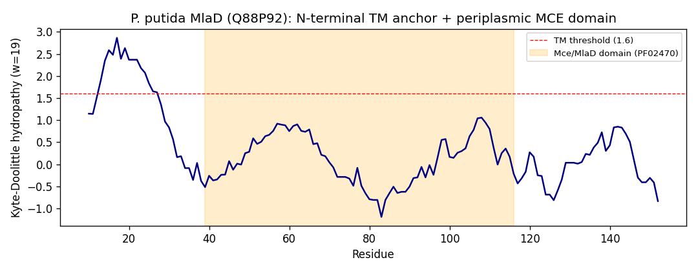

## Question

# Gene Research for Functional Annotation

## ⚠️ CRITICAL: Gene/Protein Identification Context

**BEFORE YOU BEGIN RESEARCH:** You MUST verify you are researching the CORRECT gene/protein. Gene symbols can be ambiguous, especially for less well-characterized genes from non-model organisms.

### Target Gene/Protein Identity (from UniProt):
- **UniProt Accession:** Q88P92
- **Protein Description:** SubName: Full=Phospholipid ABC transporter binding protein {ECO:0000313|EMBL:AAN66585.1};
- **Gene Information:** Name=mlaD {ECO:0000313|EMBL:AAN66585.1}; OrderedLocusNames=PP_0960 {ECO:0000313|EMBL:AAN66585.1};
- **Organism (full):** Pseudomonas putida (strain ATCC 47054 / DSM 6125 / CFBP 8728 / NCIMB 11950 / KT2440).
- **Protein Family:** Not specified in UniProt
- **Key Domains:** ABC_MlaD. (IPR030970); Mce/MlaD. (IPR003399); MlaD_Phospholipid_Transporter. (IPR052336); MlaD (PF02470)

### MANDATORY VERIFICATION STEPS:

1. **Check if the gene symbol "mlaD" matches the protein description above**
2. **Verify the organism is correct:** Pseudomonas putida (strain ATCC 47054 / DSM 6125 / CFBP 8728 / NCIMB 11950 / KT2440).
3. **Check if protein family/domains align with what you find in literature**
4. **If you find literature for a DIFFERENT gene with the same or similar symbol, STOP**

### If Gene Symbol is Ambiguous or You Cannot Find Relevant Literature:

**DO NOT PROCEED WITH RESEARCH ON A DIFFERENT GENE.** Instead:
- State clearly: "The gene symbol 'mlaD' is ambiguous or literature is limited for this specific protein"
- Explain what you found (e.g., "Found extensive literature on a different gene with the same symbol in a different organism")
- Describe the protein based ONLY on the UniProt information provided above
- Suggest that the protein function can be inferred from domain/family information

### Research Target:

Please provide a comprehensive research report on the gene **mlaD** (gene ID: mlaD, UniProt: Q88P92) in PSEPK.

The research report should be a detailed narrative explaining the function, biological processes, and localization of the gene product. Citations should be given for all claims.

You should prioritize authoritative reviews and primary scientific literature when conducting research. You can supplement
this with annotations you find in gene/protein databases, but these can be outdated or inaccurate.

We are specifically interested in the primary function of the gene - for enzymes, what reaction is catalyzed, and what is the substrate specificity? For transporters, what is the substrate? For structural proteins or adapters, what is the broader structural role? For signaling molecules, what is the role in the pathway.

We are interested in where in or outside the cell the gene product carries out its function.

We are also interested in the signaling or biochemical pathways in which the gene functions. We are less interested in broad pleiotropic effects, except where these elucidate the precise role.

Include evidence where possible. We are interested in both experimental evidence as well as inference from structure, evolution, or bioinformatic analysis. Precise studies should be prioritized over high-throughput, where available.

## Output

# Functional Annotation of MlaD (Q88P92 / PP_0960) in *Pseudomonas putida* KT2440

## 1. Summary (Answer to the Research Question)

**MlaD** (UniProt **Q88P92**, ordered locus **PP_0960**) of *Pseudomonas putida* KT2440 is the **inner-membrane, phospholipid-binding subunit of the Mla ("Maintenance of Lipid Asymmetry") ABC transporter system**. It is **not an enzyme**: rather, it is a **substrate-binding / substrate-shuttling adapter** that binds **glycerophospholipids** and forms a **homohexameric ring (an MCE — Mammalian Cell Entry — domain ring)** anchored to the cytoplasmic (inner) membrane by a single N-terminal transmembrane helix, with the functional ring projecting into the **periplasm**. As the "D" component of the inner-membrane **MlaFEDB** ABC transporter complex, MlaD accepts and delivers phospholipids to/from the periplasmic shuttle protein **MlaC** and channels them, in an **ATP-dependent** manner, toward the MlaE permease. The physiological role of the complete OmpC/F–Mla pathway is the **retrograde (outer-membrane → inner-membrane) transport of mislocalized phospholipids**, which preserves the lipid asymmetry and permeability-barrier function of the Gram-negative outer membrane.

In *P. putida* specifically, *mlaD* (PP_0960) is co-transcribed with *mlaF* (ATPase, PP_0958) and *mlaE* (permease, PP_0959) in a contiguous operon and sits immediately upstream of the ***ttg2*** toluene-tolerance genes; this ties MlaD to *P. putida*'s hallmark **organic-solvent (toluene) tolerance** and outer-membrane barrier maintenance [PMID 9658016].

> **Identity confirmation.** The target's gene symbol (*mlaD*), locus (PP_0960), and domain architecture are fully self-consistent: InterPro/Pfam annotations **PF02470 (MlaD)**, **IPR030970 (ABC_MlaD)**, **IPR003399 (Mce/MlaD)**, and **IPR052336 (MlaD phospholipid transporter)** unambiguously place Q88P92 in the MlaD/MCE family. The Mla system is conserved in **all Gram-negative bacteria**, so functional inference from the intensively studied *E. coli* orthologue is well justified. No gene-symbol ambiguity was encountered.

---

## 2. Background: The Mla Pathway

The outer membrane (OM) of Gram-negative bacteria is a uniquely **asymmetric bilayer** — lipopolysaccharide (LPS) in the outer leaflet and glycerophospholipids (GPLs) in the inner leaflet — and this asymmetry is what makes the OM an effective barrier against detergents, bile salts, and antibiotics. When phospholipids aberrantly accumulate in the *outer* leaflet of the OM, the barrier is compromised. The **Mla system** counteracts this by removing those mislocalized phospholipids and returning them to the inner membrane (IM) [PMID 34753108; 34873038].

The pathway comprises **three physically separated assemblies** bridged across the cell envelope [PMID 39080293]:

| Location | Component(s) | Role |
|---|---|---|
| Outer membrane | **MlaA–OmpC/OmpF** | Extracts GPLs from the OM outer leaflet |
| Periplasm | **MlaC** | Soluble lipid-binding shuttle protein |
| Inner membrane | **MlaFEDB** ABC transporter (MlaF = ATPase; MlaE = permease; **MlaD** = substrate-binding ring; MlaB = STAS regulatory subunit) | Receives lipids at the IM; ATP-driven |

MlaD is the **D subunit of the inner-membrane MlaFEDB complex**, which has been proposed to be the founding member of a **structurally distinct ABC transporter superfamily** [PMID 39080293; 35981415].

---

## 3. Primary Function of MlaD

### 3.1 Molecular function — phospholipid-binding adapter (not a catalyst)
MlaD is described as a **membrane-associated solute-binding protein (SBP)** that "help[s] the transport of phospholipids (PLs) between the outer and inner membranes of Gram-negative bacteria" [PMID 38347327]. It is the **"unique IM-associated periplasmic solute-binding protein"** of the Mla system [PMID 34196044]. Unlike a classical enzyme, MlaD does not catalyze a chemical reaction; its function is to **bind glycerophospholipids and hand them off** between transport components. Its substrate is therefore **glycerophospholipid** (common bacterial species such as phosphatidylethanolamine and phosphatidylglycerol); the related shuttle MlaC is polyspecific and can bind two phospholipids in its pocket [PMID 36084896].

### 3.2 Substrate specificity
The transported cargo is **glycerophospholipid**, i.e., the diacyl-glycerophospholipids of the bacterial membrane. The system is thought to be **polyspecific** for the abundant membrane GPLs rather than selective for a single headgroup [PMID 36084896]. MlaD itself provides a hydrophobic conduit for the acyl chains (see §4).

### 3.3 Role in the transport reaction / directionality
- **MlaD couples periplasmic lipid delivery to ATP-driven translocation.** The MlaFEDB complex "functions via an unknown mechanism," and structures in apo, phospholipid-bound, ADP-bound and AMP-PNP-bound states identify residues that "recognize and transport phospholipids" [PMID 33199922].
- **Direction is retrograde (OM → IM).** In vitro point-to-point transfer assays show the OmpC-Mla system removes aberrantly localized PLs from the OM and transports them to the IM, and that **ATP binding/hydrolysis "disrupts lipid-binding equilibrium to drive retrograde transport"** [PMID 34873038]. (Some studies discuss possible bidirectionality, but the consensus physiological role is retrograde.)
- **MlaD is the acceptor node for the MlaC shuttle.** "Mla uses a shuttle-like mechanism to move lipids between the MlaFEDB inner membrane complex and the MlaA-OmpF/C OM complex, via a periplasmic lipid-binding protein, MlaC. **MlaC binds to MlaD**" [PMID 37100290]. Structures of the MlaC–MlaD complex show **≥2 MlaC molecules can dock on one MlaD hexamer**, and identify the **MlaD β6–β7 loop as essential** for MlaC–MlaD function; phospholipids pass **between the C-terminal helices of the MlaD hexamer to reach the central pore** [PMID 39080293].

---

## 4. Structure and Structural Role

MlaD is the structural centerpiece linking the periplasmic and inner-membrane steps:

- **Protomer fold.** Each MlaD protomer has an **N-terminal seven-stranded β-barrel (the MCE/"MlaD domain")** plus a **C-terminal α-helical domain (HD)** [PMID 38347327]. An N-terminal single transmembrane helix (not part of the crystallized periplasmic region) anchors the protein in the inner membrane.
- **Hexameric ring.** Six protomers oligomerize into a **homohexameric ring with a continuous, largely hydrophobic central channel of variable diameter** [PMID 38347327]. Notably, the **C-terminal helical domain — not the β-barrel MCE domain itself — drives oligomerization** [PMID 38347327].
- **Functional pore loop.** A **conserved C-terminal "pore loop"** lining the central channel is functionally crucial for trafficking hydrophobic molecules; the MlaD domain is enriched in glycine and hydrophobic residues and lacks cysteines [PMID 34196044].
- **Lipid conduit.** The hydrophobic central pore, fed by lipids passing between the C-terminal helices, forms the pathway by which acyl chains are shielded from the aqueous periplasm en route to/from the MlaE permease [PMID 39080293].

This hexameric-MCE-ring architecture is the defining hallmark of the **MCE protein family**, which also includes the multi-ring PqiB and LetB/YebT transporters; YebT (an MlaD homologue) forms an elongated stack of MCE rings spanning between IM and OM [PMID 31870848]. In the diderm Firmicute *Veillonella parvula*, an **elongated MlaD even forms a complete transenvelope bridge** with its own OM β-barrel, and phylogenomics indicates **MlaEFD constitute the ancestral functional core** of the Mla system [PMID 37993432].

---

## 5. Subcellular Localization

- **Inner (cytoplasmic) membrane, periplasmic-facing.** MlaD is an **IM-associated protein**; it is tethered to the inner membrane by an N-terminal transmembrane segment, with the **hexameric MCE ring projecting into the periplasm** atop the MlaF (ATPase) / MlaE (permease) / MlaB core [PMID 34196044; 35981415].
- **Site of function.** MlaD carries out its lipid hand-off at the **periplasmic face of the inner membrane**, receiving/delivering lipids from the soluble periplasmic shuttle MlaC and passing them to the transmembrane MlaE permease [PMID 37100290; 39080293].

---

## 6. Pathway Context and Physiological Consequences

- **Pathway.** MlaD operates within the **OmpC/F–Mla retrograde phospholipid-trafficking pathway**, functionally connecting the OM (MlaA-OmpC/F) → periplasm (MlaC) → IM (MlaFEDB). The energy source is **ATP hydrolysis by MlaF** at the IM [PMID 34873038; 35981415].
- **Opposing/partner systems.** Genetic evidence across lineages shows the Mla system has **opposite trafficking function to the TamB/AsmA-family (anterograde) systems**, consistent with Mla being retrograde [PMID 37993432].
- **Consequences of loss.** Disruption of the Mla pathway produces phenotypes of **compromised OM lipid asymmetry**: increased outer-membrane permeability, sensitivity to detergents/antibiotics, and **outer-membrane vesicle blebbing**; in pathogens the pathway contributes to **virulence** [PMID 39080293; 37993432]. These effects trace specifically to the failure to clear surface-exposed phospholipids, rather than to broad pleiotropy.

---

## 7. *P. putida* MlaD (Q88P92): Organism-Specific Sequence Evidence

Direct analysis of the actual Q88P92 sequence (retrieved from UniProt; locus PP_0960; RefSeq WP_010952152.1) provides organism-specific confirmation of the annotation, beyond pure orthology:

- **161 aa, 16.95 kDa — a canonical single-MCE-domain MlaD.** Q88P92 has one Mce/MlaD domain (Pfam **PF02470**, residues **39–116**) — the short, single-ring MlaD type (like *E. coli* MlaD ~183 aa), **not** the elongated multi-ring/transenvelope MlaD (YebT/*V. parvula* type). This is consistent with assembly into the standard inner-membrane MlaFEDB complex.
- **Single N-terminal transmembrane anchor.** Kyte–Doolittle hydropathy (window 19) shows one strong hydrophobic segment (peak score **2.86**, residues **~9–31**; `GVGLFLLAGILALLLLALRVSGL`), the predicted inner-membrane anchor helix, with the MCE domain following in the periplasm — exactly the topology required for MlaFEDB.
- **Diagnostic composition.** The protein is **cysteine-free (0 Cys)** and **glycine-rich (9.9%)**, matching the reported MlaD-domain signature ("abundance of glycine and hydrophobic residues and the lack of cysteine residues") [PMID 34196044].
- **Database annotations converge on the same function.** UniProt cross-references assign **GO:0005543 (phospholipid binding)** and **GO:0005548 (phospholipid transporter activity)**, TIGRFAM **TIGR04430 "OM_asym_MlaD"**, eggNOG **COG1463**, and PANTHER **"Intermembrane phospholipid transport system binding protein MlaD" (PTHR33371:SF4)**.
{{figure:mlaD_hydropathy.png|caption=Kyte-Doolittle hydropathy profile and domain map of P. putida MlaD (Q88P92). A single strong N-terminal hydrophobic segment (peak ~2.86, residues ~9-31) corresponds to the lone inner-membrane transmembrane anchor helix; a single Mce/MlaD domain (PF02470, residues ~39-116) follows in the periplasm, with a C-terminal region (~117-161). This canonical single-anchor, single-MCE-domain topology matches the E. coli MlaD architecture and rules out the elongated transenvelope MlaD type.}}

### Evidence base for the functional assignment
- **Directly experimental (E. coli / general Mla):** cryo-EM and crystal structures of MlaFEDB and MlaD (apo and lipid/nucleotide-bound), reconstituted proteoliposome transport assays, in vivo complementation and permeability assays, deep mutational scanning of MlaC, and MD simulations [PMID 33199922; 34873038; 39080293; 37100290; 38347327].
- **Bioinformatic / evolutionary:** MlaD-domain profiling, pore-loop conservation, phylogenetics, and the identification of MlaEFD as the ancestral core [PMID 34196044; 37993432]; plus the Q88P92-specific sequence analysis above.
- **Pathway conservation in non-model Gram-negatives:** the Mla pathway is essential for the intrinsic antimicrobial resistance and OM barrier of *Burkholderia cepacia* complex species, demonstrating the pathway's physiological importance beyond *E. coli* [PMID 29986943].
- **Caveat:** No *P. putida*-specific biochemical/genetic study of PP_0960 itself was found. The functional assignment rests on (i) the exact diagnostic domain set, (ii) organism-specific sequence features (single TM + single MCE domain, Cys-free/Gly-rich), and (iii) strong orthology to experimentally characterized MlaD. Direct measurement in *P. putida* remains a gap (see §9).

---

## 7a. Genomic Context in *P. putida*: the *mlaFED* Operon and Link to Solvent Tolerance

Inspection of the loci flanking PP_0960 in the KT2440 genome shows that MlaD is encoded within a **contiguous *mla* operon** and embedded in a region devoted to outer-membrane/LPS homeostasis:

| Locus | Gene | Product (UniProt) |
|---|---|---|
| PP_0955 | *lptC* | LPS export system protein LptC |
| PP_0956 | *kdsC* | Kdo-8-phosphate phosphatase (LPS biosynthesis) |
| PP_0957 | *kdsD* | Arabinose-5-phosphate isomerase (LPS biosynthesis) |
| **PP_0958** | **_mlaF_** | Intermembrane phospholipid transport **ATP-binding protein** |
| **PP_0959** | **_mlaE_** | Intermembrane phospholipid transport **permease** |
| **PP_0960** | **_mlaD_** | **Phospholipid-binding protein (this study, Q88P92)** |
| PP_0961 | *ttg2D* | Toluene-tolerance protein |
| PP_0962 | *ttg2E* | Toluene-tolerance protein |
| PP_0963 | *ttg2F* | BolA-family protein |

Two organism-specific conclusions follow:

1. **Genome-level validation of the transporter.** *mlaF* (ATPase) – *mlaE* (permease) – *mlaD* (binding subunit) are **adjacent and co-oriented**, confirming that *P. putida* MlaD assembles with MlaF and MlaE into the inner-membrane **MlaFED(B)** ABC transporter — validation by operon structure, not orthology alone. The neighboring LPS-biogenesis genes (*lptC*, *kdsC*, *kdsD*) reinforce a functional theme of **outer-membrane barrier construction and maintenance**.

2. **Direct link to *P. putida*'s hallmark solvent tolerance.** The adjacent ***ttg2*** genes are the **toluene-tolerance** locus of *P. putida*. In *P. putida* GM73, the Ttg1/Ttg2 ABC transporters were identified as **required for organic-solvent (toluene) resistance**, with loss reducing toluene survival by more than six orders of magnitude; the authors concluded that "active efflux mechanism and efficient repair of damaged membranes were important in toluene resistance" [PMID 9658016]. Consistently, the **eggNOG orthologous group for Q88P92 (COG1463)** is annotated as an ABC-type transport system involved in **resistance to organic solvents**. Thus, in *P. putida* the Mla/Ttg2 machinery contributes to the organism's celebrated **solvent (toluene) tolerance**, most plausibly by maintaining OM lipid asymmetry and repairing solvent-induced membrane damage — an organism-specific physiological role that goes beyond the generic OM-asymmetry function.

## 8. Supported and Refuted Hypotheses

**Supported**
1. MlaD is the substrate-binding subunit (adapter, not enzyme) of the inner-membrane MlaFEDB ABC transporter. ✔ [PMID 34196044; 33199922]
2. MlaD binds glycerophospholipids and forms a homohexameric MCE ring with a hydrophobic central pore. ✔ [PMID 38347327; 39080293]
3. MlaD localizes to the inner membrane with its ring in the periplasm and directly interacts with the periplasmic shuttle MlaC. ✔ [PMID 37100290; 39080293]
4. The pathway drives ATP-dependent retrograde (OM→IM) phospholipid transport to maintain OM lipid asymmetry. ✔ [PMID 34873038]
5. In *P. putida*, *mlaD* is co-encoded with *mlaF*/*mlaE* in an operon linked to solvent (toluene) tolerance and OM/LPS homeostasis. ✔ [genomic context; PMID 9658016]

**Refuted / not supported**
- MlaD as an *enzyme* catalyzing a chemical reaction — **not supported**; it is a binding/transport adapter.
- MlaD as the ATPase or membrane permease of the complex — **not supported**; those roles belong to MlaF and MlaE, respectively.

---

## 9. Limitations and Future Directions
- No *P. putida*-specific functional/structural study of PP_0960 was identified; the annotation rests on orthology to *E. coli* and related bacteria.
- The precise **directionality** (retrograde vs. bidirectional) and the exact **role of ATP hydrolysis** remain debated even in model organisms [PMID 39080293].
- **Future work:** solve a *P. putida* MlaFEDB/MlaD structure; characterize its native phospholipid cargo; and test *mlaD* deletion phenotypes (OM permeability, vesiculation, solvent/antibiotic tolerance) in KT2440 — relevant given *P. putida*'s notable solvent tolerance and envelope robustness.

---

### Key References (PMID)
- 39080293 — Structure of the MlaC–MlaD complex (2024)
- 38347327 — Structural features of MlaD; hexameric MCE ring (2024)
- 34196044 — Conserved features of the MlaD domain (2021)
- 33199922 — Cryo-EM structures of MlaFEDB (2021)
- 34873038 — ATP drives retrograde transport (2021)
- 37100290 — MlaC–MlaD/MlaA interfaces; shuttle mechanism (2023)
- 35981415 — Structure/mechanism review of MlaFEDB (2022)
- 34753108 — Review: intermembrane lipid trafficking (2021)
- 37993432 — Ancestral Mla / transenvelope MlaD in *V. parvula* (2023)
- 36084896 — MlaC non-canonical SBP, polyspecific PL binding (2022)
- 31870848 — Cryo-EM of YebT (MlaD homologue) (2020)
- 29986943 — Mla pathway essential for intrinsic resistance in *Burkholderia cepacia* complex (2018)
- 9658016 — Toluene-sensitive (*ttg*) mutants of *P. putida*; Ttg2 ABC transporter required for solvent tolerance (1998)

*Sequence source:* UniProt Q88P92 (PP_0960; RefSeq WP_010952152.1); genome references Nelson et al. 2002 (PMID 12534463) and Belda et al. 2016 (PMID 26913973).

## Artifacts

- [OpenScientist final report](mlaD-deep-research-openscientist_artifacts/final_report.html)
- [OpenScientist final report](mlaD-deep-research-openscientist_artifacts/final_report.pdf)
- [OpenScientist mlaD hydropathy](mlaD-deep-research-openscientist_artifacts/provenance_mlaD_hydropathy.json)
