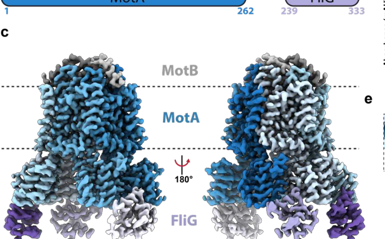

## Question

# Gene Research for Functional Annotation

## ⚠️ CRITICAL: Gene/Protein Identification Context

**BEFORE YOU BEGIN RESEARCH:** You MUST verify you are researching the CORRECT gene/protein. Gene symbols can be ambiguous, especially for less well-characterized genes from non-model organisms.

### Target Gene/Protein Identity (from UniProt):
- **UniProt Accession:** Q88DC2
- **Protein Description:** SubName: Full=Flagellar motor rotation protein {ECO:0000313|EMBL:AAN70472.1};
- **Gene Information:** Name=motA {ECO:0000313|EMBL:AAN70472.1}; OrderedLocusNames=PP_4905 {ECO:0000313|EMBL:AAN70472.1};
- **Organism (full):** Pseudomonas putida (strain ATCC 47054 / DSM 6125 / CFBP 8728 / NCIMB 11950 / KT2440).
- **Protein Family:** Belongs to the MotA family.
- **Key Domains:** Flag_MotA_CS. (IPR000540); Flagellar_motor_stator_MotA. (IPR022522); MotA-like. (IPR047055); MotA_ExbB_proton_chnl. (IPR002898); MotA_N. (IPR046786)

### MANDATORY VERIFICATION STEPS:

1. **Check if the gene symbol "motA" matches the protein description above**
2. **Verify the organism is correct:** Pseudomonas putida (strain ATCC 47054 / DSM 6125 / CFBP 8728 / NCIMB 11950 / KT2440).
3. **Check if protein family/domains align with what you find in literature**
4. **If you find literature for a DIFFERENT gene with the same or similar symbol, STOP**

### If Gene Symbol is Ambiguous or You Cannot Find Relevant Literature:

**DO NOT PROCEED WITH RESEARCH ON A DIFFERENT GENE.** Instead:
- State clearly: "The gene symbol 'motA' is ambiguous or literature is limited for this specific protein"
- Explain what you found (e.g., "Found extensive literature on a different gene with the same symbol in a different organism")
- Describe the protein based ONLY on the UniProt information provided above
- Suggest that the protein function can be inferred from domain/family information

### Research Target:

Please provide a comprehensive research report on the gene **motA** (gene ID: motA, UniProt: Q88DC2) in PSEPK.

The research report should be a detailed narrative explaining the function, biological processes, and localization of the gene product. Citations should be given for all claims.

You should prioritize authoritative reviews and primary scientific literature when conducting research. You can supplement
this with annotations you find in gene/protein databases, but these can be outdated or inaccurate.

We are specifically interested in the primary function of the gene - for enzymes, what reaction is catalyzed, and what is the substrate specificity? For transporters, what is the substrate? For structural proteins or adapters, what is the broader structural role? For signaling molecules, what is the role in the pathway.

We are interested in where in or outside the cell the gene product carries out its function.

We are also interested in the signaling or biochemical pathways in which the gene functions. We are less interested in broad pleiotropic effects, except where these elucidate the precise role.

Include evidence where possible. We are interested in both experimental evidence as well as inference from structure, evolution, or bioinformatic analysis. Precise studies should be prioritized over high-throughput, where available.

## Output

Question: You are an expert researcher providing comprehensive, well-cited information.

Provide detailed information focusing on:
1. Key concepts and definitions with current understanding
2. Recent developments and latest research (prioritize 2023-2024 sources)
3. Current applications and real-world implementations
4. Expert opinions and analysis from authoritative sources
5. Relevant statistics and data from recent studies

Format as a comprehensive research report with proper citations. Include URLs and publication dates where available.
Always prioritize recent, authoritative sources and provide specific citations for all major claims.

# Gene Research for Functional Annotation

## ⚠️ CRITICAL: Gene/Protein Identification Context

**BEFORE YOU BEGIN RESEARCH:** You MUST verify you are researching the CORRECT gene/protein. Gene symbols can be ambiguous, especially for less well-characterized genes from non-model organisms.

### Target Gene/Protein Identity (from UniProt):
- **UniProt Accession:** Q88DC2
- **Protein Description:** SubName: Full=Flagellar motor rotation protein {ECO:0000313|EMBL:AAN70472.1};
- **Gene Information:** Name=motA {ECO:0000313|EMBL:AAN70472.1}; OrderedLocusNames=PP_4905 {ECO:0000313|EMBL:AAN70472.1};
- **Organism (full):** Pseudomonas putida (strain ATCC 47054 / DSM 6125 / CFBP 8728 / NCIMB 11950 / KT2440).
- **Protein Family:** Belongs to the MotA family.
- **Key Domains:** Flag_MotA_CS. (IPR000540); Flagellar_motor_stator_MotA. (IPR022522); MotA-like. (IPR047055); MotA_ExbB_proton_chnl. (IPR002898); MotA_N. (IPR046786)

### MANDATORY VERIFICATION STEPS:

1. **Check if the gene symbol "motA" matches the protein description above**
2. **Verify the organism is correct:** Pseudomonas putida (strain ATCC 47054 / DSM 6125 / CFBP 8728 / NCIMB 11950 / KT2440).
3. **Check if protein family/domains align with what you find in literature**
4. **If you find literature for a DIFFERENT gene with the same or similar symbol, STOP**

### If Gene Symbol is Ambiguous or You Cannot Find Relevant Literature:

**DO NOT PROCEED WITH RESEARCH ON A DIFFERENT GENE.** Instead:
- State clearly: "The gene symbol 'motA' is ambiguous or literature is limited for this specific protein"
- Explain what you found (e.g., "Found extensive literature on a different gene with the same symbol in a different organism")
- Describe the protein based ONLY on the UniProt information provided above
- Suggest that the protein function can be inferred from domain/family information

### Research Target:

Please provide a comprehensive research report on the gene **motA** (gene ID: motA, UniProt: Q88DC2) in PSEPK.

The research report should be a detailed narrative explaining the function, biological processes, and localization of the gene product. Citations should be given for all claims.

You should prioritize authoritative reviews and primary scientific literature when conducting research. You can supplement
this with annotations you find in gene/protein databases, but these can be outdated or inaccurate.

We are specifically interested in the primary function of the gene - for enzymes, what reaction is catalyzed, and what is the substrate specificity? For transporters, what is the substrate? For structural proteins or adapters, what is the broader structural role? For signaling molecules, what is the role in the pathway.

We are interested in where in or outside the cell the gene product carries out its function.

We are also interested in the signaling or biochemical pathways in which the gene functions. We are less interested in broad pleiotropic effects, except where these elucidate the precise role.

Include evidence where possible. We are interested in both experimental evidence as well as inference from structure, evolution, or bioinformatic analysis. Precise studies should be prioritized over high-throughput, where available.

## Research report: *Pseudomonas putida* KT2440 **motA** (UniProt Q88DC2; locus PP_4905)

### Executive summary
The target protein is **MotA**, the A-subunit of the **MotAB flagellar stator** in *Pseudomonas putida* KT2440 (UniProt **Q88DC2**, ordered locus **PP_4905**). Literature that explicitly maps **PP4905 → motA** and labels it as a **stator gene** confirms that this report addresses the correct gene/protein identity. (martinez‐garcia2014themetaboliccost pages 4-7, martinez‐garcia2014themetaboliccost pages 1-4)

MotA is a **cytoplasmic (inner) membrane** multipass protein that oligomerizes (currently best-supported as a **MotA pentamer** in the active stator) and partners with MotB (dimer) to form an **ion-driven torque generator** that powers rotation of the polar flagellum. In current mechanistic models (largely developed in other bacteria but broadly conserved), ion flow (H+ for MotAB systems) is coupled to conformational changes/rotation within the stator, and MotA’s cytoplasmic domains transmit torque to the rotor via direct contact with **FliG**. (nakamura2024structureanddynamics pages 10-12, nakamura2024structureanddynamics pages 12-14, johnson2024structuralbasisof pages 1-5)

### 1) Target identity verification (critical)
**Gene symbol and locus mapping (KT2440):** A genomic/functional study of *P. putida* KT2440 explicitly reports “two extra copies of the stator genes **motA (PP4905)** and **motB (PP4904)**,” distinguishing these stator genes from the large primary flagellar gene region (PP4329–PP4397). (martinez‐garcia2014themetaboliccost pages 1-4)

**Operon/genomic context in Pseudomonas:** A detailed transcriptional organization study across Pseudomonas notes that **motA and motB are adjacent (motAB)** and (by RNA-seq continuity) **co-transcribed as a bicistronic operon** in *P. putida* KT2440. It also emphasizes that motAB is atypically located outside the canonical flagellar cluster in many Pseudomonas genomes. (leal‐morales2022transcriptionalorganizationand pages 4-5, leal‐morales2022transcriptionalorganizationand pages 4-4)

**Conclusion:** These two independent sources verify that the symbol **motA** in KT2440 corresponds to a **flagellar stator gene** and matches UniProt’s description of Q88DC2 as a MotA-family flagellar motor rotation protein. (martinez‐garcia2014themetaboliccost pages 1-4, leal‐morales2022transcriptionalorganizationand pages 4-5)

### 2) Key concepts and definitions (current understanding)
#### 2.1 Flagellar stator and rotor
The bacterial flagellar motor is commonly conceptualized as a **rotor** (including the cytoplasmic C-ring/switch complex) and multiple **stator units** that act as transmembrane ion channels converting ion motive force into mechanical torque. MotA (A subunit) and MotB (B subunit) form the canonical **H+-driven stator**, MotAB. (nakamura2024structureanddynamics pages 1-3)

#### 2.2 MotA family proteins
MotA-family proteins are **inner-membrane multipass** proteins that form the **torque-generating interface** on the cytoplasmic side and participate in an ion channel together with MotB. Structural and evolutionary analyses consistently treat MotA as the A-subunit component of a conserved A/B stator architecture (e.g., MotA/MotB for H+-motors and PomA/PomB for Na+-motors). (hu2023ionselectivityand pages 1-2, puentelelievre2025evolutionandstructural pages 1-2)

#### 2.3 Ion coupling and the conserved MotB Asp
A conserved acidic residue in MotB (classically **Asp32/Asp33 in *E. coli***; numbering differs across species) is a key ion-binding/protonation site central to stator function and gating/coupling models. (nakamura2024structureanddynamics pages 10-12, nakamura2024structureanddynamics pages 9-10)

### 3) Functional annotation for *P. putida* KT2440 MotA (Q88DC2)
#### 3.1 Primary biological function
**Primary function:** MotA is required for **stator-dependent torque generation** that powers **flagellar rotation** (swimming motility). In KT2440, motA (PP4905) is specifically described as a **stator gene** together with motB (PP4904), placing it in the canonical stator function class. (martinez‐garcia2014themetaboliccost pages 1-4, martinez‐garcia2014themetaboliccost pages 4-7)

**What does it “do,” mechanistically?** Cross-species structural and mechanistic evidence supports that MotA forms the **A-subunit ring** of the stator complex and provides the **cytoplasmic interface to the rotor** (FliG) that converts ion-driven conformational changes into rotor torque. (nakamura2024structureanddynamics pages 10-12, johnson2024structuralbasisof pages 1-5)

#### 3.2 Cellular localization and topology
MotA is an **inner-membrane protein**. High-resolution stator structures (in other bacteria) show that MotA protomers contain **multiple transmembrane helices** with substantial **cytoplasmic helices/domains** that protrude into the cytoplasm to engage the rotor. A cryo-EM-derived stator architecture reports MotA protomers having **four transmembrane helices** and multiple cytoplasmic helices, consistent with the canonical MotA annotation as a multipass inner-membrane stator subunit. (onoe2025cryoemstructureof pages 4-6)

Thus, for KT2440 MotA (Q88DC2), the best-supported annotation is:
- **Subcellular location:** cytoplasmic membrane (inner membrane)
- **Topology:** multipass (MotA-like) transmembrane protein with cytoplasmic torque-generating domains. (onoe2025cryoemstructureof pages 4-6, islam2023ancestralsequencereconstructions pages 85-88)

#### 3.3 Protein complex membership and key interaction partners
**MotB:** MotA forms a stator complex with MotB; MotB anchors the stator (via a peptidoglycan-binding domain) and contributes the conserved ion-binding residue and gating elements. (nakamura2024structureanddynamics pages 9-10)

**FliG (rotor/C-ring):** Torque generation involves electrostatic contacts between MotA and the rotor protein **FliG**; in a 2024 Nature Microbiology cryo-EM study, the **MotA5B2 stator was solved in complex with the C-terminal domain of FliG**, providing direct structural evidence of the stator–rotor interface that MotA participates in. (johnson2024structuralbasisof pages 1-5)

**FliL (accessory):** A 2024 review summarizes evidence that FliL (a single-pass membrane protein with a large periplasmic domain) can form a ring-like assembly associated with the stator region and may stabilize/house the MotA–MotB complex in some systems; while not demonstrated specifically for KT2440 here, this is relevant for MotA-family functional context and potential interaction annotations. (nakamura2024structureanddynamics pages 10-12, nakamura2024structureanddynamics pages 9-10)

### 4) Recent developments and latest research (prioritizing 2023–2024)
#### 4.1 Revised stator stoichiometry: MotA5B2 (not MotA4B2)
A major recent advance is a **revised, cryo-EM-supported stator stoichiometry**: many functional stators are best described as **MotA5–MotB2**, i.e., a MotA pentameric ring encircling a MotB dimer. This update is emphasized in 2024 synthesis/review literature and supported by cryo-EM structures and rotor-interface models. (nakamura2024structureanddynamics pages 10-12, nakamura2024structureanddynamics pages 12-14)

#### 4.2 Stator as a rotary motor; mechanochemical coupling and stepping
A 2024 computational/simulation study (built on recent cryo-EM structures) proposes a concrete **protonation-state-dependent rotation pathway**, in which MotA rotation is coupled to proton uptake/transfer and export. In this model, the MotA pentamer rotates in **~36° increments per protonation update**, and key residues are suggested to be critical for function (e.g., MotB conserved Asp; MotA proton-carrying site in the model). Although the study is not in *P. putida*, it provides mechanistic hypotheses directly relevant to annotating MotA-family proteins as ion-coupled mechanochemical transducers. (kubo2024theoreticalinsightsinto pages 10-14)

#### 4.3 Direct MotA–FliG interface and directional switching model (2024)
The 2024 Nature Microbiology study provides high-resolution structural evidence of a **MotA5B2–FliG_C complex** and proposes a mechanism for how **uni-directional ion flow** can support **bi-directional flagellar rotation** by changing the rotor’s engagement geometry with the stator during switching. It further emphasizes **mechano-sensitive stator recruitment**: under high load, motors can recruit up to **~11 stators**. (johnson2024structuralbasisof pages 1-5)

**Visual evidence (cropped figures):** Panels showing the MotA5B2 stator bound to FliG_C and the switching model are available from the paper’s figures. (johnson2024structuralbasisof media 004cee08, johnson2024structuralbasisof media 0580e6fc, johnson2024structuralbasisof media ee3d7bb7, johnson2024structuralbasisof media 3d9c2e66)

#### 4.4 Stator dynamics and load-dependent remodeling
A 2024 review summarizes that stator assembly is **dynamic and load dependent**, with stators exchanging between the motor and a membrane pool even during rotation. It reports that near-zero load conditions can involve as few as **one stator**, while experiments show a near-unconstrained rotor can be driven by **~5 stators**, with additional units recruited under stall/high-load conditions; it also highlights that disrupting H+ channel activity can reduce stator binding affinity. (nakamura2024structureanddynamics pages 9-10, nakamura2024structureanddynamics pages 8-9)

### 5) Pathways and biological processes involving KT2440 MotA
#### 5.1 Flagellar motility pathway
In KT2440, motA (PP4905) is part of the **flagellar motility machinery** as a stator gene; deletion of the main flagellar operon abolishes flagellar filaments and swimming, establishing the centrality of the flagellar system for motility (even though motAB itself is outside that large operon). (martinez‐garcia2014themetaboliccost pages 1-4)

#### 5.2 Coupling to chemotaxis (directional switching)
MotA participates in torque generation at the rotor–stator interface; directional switching is regulated by chemotaxis signaling (CheY-P binding to switch components such as FliM) and involves large conformational rearrangements of rotor proteins (including reorientation of the FliG interface that MotA contacts). This provides the pathway-level context for MotA function: MotA supplies torque; chemotaxis signaling changes how that torque results in CW vs CCW rotation. (johnson2024structuralbasisof pages 1-5, nakamura2024structureanddynamics pages 12-14)

### 6) Quantitative/statistical data relevant to functional annotation
Because KT2440-specific single-gene motA biophysical parameters were not retrieved in the available corpus, the most robust quantitative benchmarks come from cross-species stator/motor studies and remain highly informative for annotation:
- **Stator stoichiometry:** MotA:MotB = **5:2** (MotA5B2) in many resolved systems. (nakamura2024structureanddynamics pages 10-12, nakamura2024structureanddynamics pages 12-14)
- **Load-dependent stator recruitment:** up to **~11 stators** under higher load (reported for *Salmonella*). (johnson2024structuralbasisof pages 1-5)
- **Lower-load operating counts:** near-unconstrained rotor rotated by **~5 stators** in some experimental contexts. (nakamura2024structureanddynamics pages 9-10)
- **Accessory ring assembly:** FliL reported as forming a **decameric ring** associated with the stator region in some systems. (nakamura2024structureanddynamics pages 10-12)
- **Stepping/rotation increments:** computational model suggests **~36° per protonation update**; review literature discusses **~72°** step relationships in some geometric/structural interpretations. (kubo2024theoreticalinsightsinto pages 10-14, nakamura2024structureanddynamics pages 12-14)

### 7) Current applications and real-world implementations
#### 7.1 Structure-guided motility inhibition / antibiotic concepts
A cryo-EM stator study reports that a hydrophobic detergent-like ligand (LMNG) can bind at a conserved **A–B subunit interface**, deforming the MotA ring and displacing gating elements, suggesting a plausible route for **small-molecule inhibition of stator function** (i.e., anti-motility strategies) guided by conserved hydrophobic pockets. The authors explicitly propose that such conserved interfaces could be exploited in **antibiotic development** targeting motility/infection processes, and they provide PDB/EMDB depositions to support structure-guided design. (onoe2025cryoemstructureof pages 10-11)

#### 7.2 Optogenetic and synthetic-biology control of MotA/MotB-mediated motility
A 2024 dissertation demonstrates practical, quantitative implementations to control stator-dependent motility:
- Complementation of ΔmotA/ΔmotB with a MotA5MotB2 construct yields swim diameters **24.4 ± 6.1 mm** in the dark versus **7.7 ± 2.8 mm** under blue light in an optogenetic configuration; with a light-responsive regulator (EL222), dark vs blue swim diameters shift **24.7 ± 1.9 → 14.4 ± 3.3 mm**.
- Complemented strains show measurable motor function (e.g., tethered-cell rotation **~2.1 ± 0.6 Hz**) and free-swim speeds **~4.9 ± 0.8 µm/s** (or **6.2 ± 0.2 µm/s** with a regulator).
These provide concrete benchmarks for engineered MotA/MotB control in biohybrid systems and for experimental pipelines to test MotA-family variants. (gurung2024separationflowcharacterisation pages 155-159)

#### 7.3 Microfluidic separation and biohybrid micro-actuators
The same thesis reports a **Y-shaped microfluidic device** enabling rapid separation of motile cells, and discusses “microbial stir bar” concepts where tethered bacteria act as rotating micro-mixers/actuators whose flow fields can be characterized by micro-PIV and controlled remotely by light. (gurung2024separationflowcharacterisation pages 95-97, gurung2024separationflowcharacterisation pages 13-17)

#### 7.4 Engineering for load/viscosity: dual stators in Pseudomonas (context)
While not KT2440-specific, a 2024 mBio study in *Pseudomonas aeruginosa* shows that different stator systems can have distinct mechanical behaviors (MotAB “slip-bond” vs MotCD “catch-bond”) and demonstrates experimental regimes (Ficoll viscosities) for tuning load; this informs how MotA-family stators can be engineered or selected for different mechanical environments. (wu2024torquespeedrelationshipof pages 13-15)

### 8) Expert synthesis and interpretation (authoritative sources)
Authoritative 2024 synthesis emphasizes that the key conceptual update for stator annotation is **structural and mechanistic**: MotA/MotAB stators are not static “channels” but **dynamic, load-adaptive mechanochemical transducers**, with (i) a now better-supported **MotA5B2 architecture**, (ii) direct structural evidence of the **MotA–FliG** torque interface, and (iii) explicit coupling between ion flux, stator conformational changes/rotation, and rotor switching geometry. (nakamura2024structureanddynamics pages 10-12, johnson2024structuralbasisof pages 1-5)

### 9) Evidence-focused functional annotation (recommended wording)
For genome annotation or functional description of *P. putida* KT2440 MotA (Q88DC2/PP_4905), the following evidence-backed description is appropriate:
- **Protein:** Flagellar motor stator protein MotA (MotA family)
- **Function:** A-subunit of the MotAB stator complex; converts ion motive force (H+) into torque to power flagellar rotation via interaction with rotor protein FliG. (martinez‐garcia2014themetaboliccost pages 1-4, nakamura2024structureanddynamics pages 10-12)
- **Complex:** MotA (pentamer) + MotB (dimer) → MotA5B2 stator (cross-species consensus). (nakamura2024structureanddynamics pages 10-12, nakamura2024structureanddynamics pages 12-14)
- **Localization:** Cytoplasmic/inner membrane multipass protein with cytoplasmic torque-generating domains. (onoe2025cryoemstructureof pages 4-6)
- **Pathway:** Flagellar motility; functionally coupled to chemotaxis-controlled switching via changes in rotor (FliG) conformation/engagement. (johnson2024structuralbasisof pages 1-5)

### 10) Limitations and gaps specific to KT2440
The retrieved corpus provides strong identity verification for PP_4905 and strong cross-species mechanistic/structural grounding for MotA-family function, but it does **not** include (within obtained papers) KT2440-specific measurements such as motA knockout phenotypes, MotAB vs MotCD partitioning in KT2440, or direct biochemical/structural characterization of KT2440 MotA. KT2440-specific stator-composition studies exist but were not obtainable in the current retrieval set (notably a 2022 mBio paper on “Role of the two flagellar stators in swimming motility of *Pseudomonas putida*”). Therefore, KT2440-specific quantitative performance should be treated as an open retrieval gap rather than inferred here. (martinez‐garcia2014themetaboliccost pages 1-4)

---

### Synthesis table
| Category | Specific details for MotA/KT2440 | Evidence/notes | Key citations (with year) | URL/DOI |
|---|---|---|---|---|
| Identity | **motA / PP_4905 / UniProt Q88DC2** in *Pseudomonas putida* KT2440; annotated as a flagellar motor rotation protein and member of the MotA family | KT2440 literature explicitly identifies **motA (PP4905)** and **motB (PP4904)** as stator genes outside the main flagellar cluster; this matches the UniProt target and distinguishes it from unrelated same-symbol genes in other organisms (martinez‐garcia2014themetaboliccost pages 4-7, martinez‐garcia2014themetaboliccost pages 1-4, leal‐morales2022transcriptionalorganizationand pages 4-4) | Martínez-García et al., 2014; Leal-Morales et al., 2022 | https://doi.org/10.1111/1462-2920.12309 ; https://doi.org/10.1111/1462-2920.15857 |
| Function | MotA is the **A subunit of the MotAB flagellar stator**, an ion-driven torque-generating complex that powers flagellar rotation rather than flagellar assembly itself | Functional annotation is inferred from direct KT2440 stator assignment plus broad MotA-family structural/mechanistic evidence showing MotA converts ion flow into mechanical work at the motor (martinez‐garcia2014themetaboliccost pages 4-7, nakamura2024structureanddynamics pages 1-3, hu2023ionselectivityand pages 1-2) | Martínez-García et al., 2014; Nakamura & Minamino, 2024; Hu et al., 2023 | https://doi.org/10.1111/1462-2920.12309 ; https://doi.org/10.3390/biom14121488 ; https://doi.org/10.1038/s41467-023-39899-z |
| Mechanism | Current model: MotA forms a **pentameric ring** around a **MotB dimer** (**MotA5B2**); ion translocation through the MotA/MotB channel is coupled to conformational change/rotation in MotA and torque transfer to the rotor | 2023–2024 cryo-EM and reviews revise older 4:2 models to **5:2 stoichiometry**; protonation/deprotonation of the conserved MotB Asp is central to coupling. Computational work suggests proton-transfer-coupled MotA stepping and robust rotation (nakamura2024structureanddynamics pages 10-12, nakamura2024structureanddynamics pages 12-14, johnson2024structuralbasisof pages 1-5, kubo2024theoreticalinsightsinto pages 10-14) | Johnson et al., 2024; Nakamura & Minamino, 2024; Kubo et al., 2024 | https://doi.org/10.1038/s41564-024-01630-z ; https://doi.org/10.3390/biom14121488 ; https://doi.org/10.1101/2024.03.25.586605 |
| Localization/Topology | MotA is an **inner-membrane** protein with **multiple transmembrane helices** and large **cytoplasmic helices/domains** that contact the rotor; MotB provides periplasmic anchoring to peptidoglycan | Structural studies show each MotA protomer contains **4 TM helices** and multiple cytoplasmic helices; MotB contributes the central paired TM helices and peptidoglycan-binding/plug elements. Thus KT2440 MotA is best annotated as a **cytoplasmic-membrane stator subunit** with cytoplasmic torque-transmitting surfaces (onoe2025cryoemstructureof pages 4-6, nakamura2024structureanddynamics pages 10-12, islam2023ancestralsequencereconstructions pages 85-88) | Onoe et al., 2025; Nakamura & Minamino, 2024; Islam, 2023 | https://doi.org/10.3390/biom15030435 ; https://doi.org/10.3390/biom14121488 ; https://doi.org/10.26190/unsworks/24988 |
| Pathways/Regulation | MotA functions in the **flagellar motor** and is indirectly coupled to **chemotaxis-dependent directional switching**; in KT2440, **motAB is outside the main flagellar cluster** and is transcribed as a **bicistronic operon** | In *Pseudomonas*, motAB is atypically separated from the main flagellar cluster and linked to neighboring genes including **rsgA** and **PP_4906**; RNA-seq evidence supports co-transcription of **motA** and **motB**. Direction switching is not executed by MotA itself but by chemotaxis signaling that reorients the rotor interface MotA engages (leal‐morales2022transcriptionalorganizationand pages 4-4, leal‐morales2022transcriptionalorganizationand pages 4-5, johnson2024structuralbasisof pages 1-5) | Leal-Morales et al., 2022; Johnson et al., 2024 | https://doi.org/10.1111/1462-2920.15857 ; https://doi.org/10.1038/s41564-024-01630-z |
| Key Interactions | Core partners: **MotB** (stator B subunit), **FliG** (rotor/C-ring protein), and in some motors **FliL** (stator-associated accessory factor) | 2024 structural work directly visualized a **MotA5B2–FliG_C** interface. Conserved charged contacts implicated in torque transmission include **MotA R90/E98** with acidic/basic FliG residues, while MotB provides the conserved ion-binding Asp and anchoring functions; FliL can stabilize active stator states in some species (johnson2024structuralbasisof pages 1-5, nakamura2024structureanddynamics pages 10-12, puentelelievre2025evolutionandstructural pages 1-2) | Johnson et al., 2024; Nakamura & Minamino, 2024; Puente-Lelievre et al., 2025 | https://doi.org/10.1038/s41564-024-01630-z ; https://doi.org/10.3390/biom14121488 ; https://doi.org/10.1128/mbio.03824-24 |
| Quantitative data | Key current numbers relevant to annotation: **MotA5B2 stoichiometry**; up to **~11 stators** recruited under high load in *Salmonella*; near-free rotor can be driven by **~5 stators**; FliL can form a **decameric ring**; computational stepping suggests **~36° per protonation update**, while geometric/structural models discuss **~72° stator steps** | These are cross-species mechanistic benchmarks rather than KT2440-specific measurements, but they represent the current consensus framework for annotating MotA-family proteins. Conserved ion-coupling residues highlighted include **MotB Asp32/Asp33** and in some models **MotA E151**, **MotB K15** (nakamura2024structureanddynamics pages 12-14, kubo2024theoreticalinsightsinto pages 10-14, nakamura2024structureanddynamics pages 9-10, johnson2024structuralbasisof pages 1-5) | Nakamura & Minamino, 2024; Kubo et al., 2024; Johnson et al., 2024 | https://doi.org/10.3390/biom14121488 ; https://doi.org/10.1101/2024.03.25.586605 ; https://doi.org/10.1038/s41564-024-01630-z |
| Applications | MotA/MotAB knowledge is being applied to **structure-guided motility inhibition**, **optogenetic control of motility**, **microfluidic separation of motile cells**, and **biohybrid micro-actuators/microbial stir bars** | Recent work shows hydrophobic ligand binding at the A–B interface can distort stator architecture, suggesting antibiotic design opportunities; engineering studies modulate MotA/MotB-dependent motility with light and quantify changes in swim diameter and speed; motility is also exploited in Y-channel microfluidic enrichment devices (gurung2024separationflowcharacterisation pages 155-159, gurung2024separationflowcharacterisation pages 13-17, gurung2024separationflowcharacterisation pages 95-97, onoe2025cryoemstructureof pages 10-11) | Gurung, 2024; Onoe et al., 2025 | https://doi.org/10.26190/unsworks/30150 ; https://doi.org/10.3390/biom15030435 |

*Table: This table summarizes the verified identity, function, mechanism, localization, pathway context, interactions, quantitative parameters, and applications for *Pseudomonas putida* KT2440 MotA (Q88DC2/PP_4905). It prioritizes 2023–2024 mechanistic advances while preserving KT2440-specific genomic and operon context for annotation work.*

References

1. (martinez‐garcia2014themetaboliccost pages 4-7): Esteban Martínez‐García, Pablo I. Nikel, Max Chavarría, and Víctor de Lorenzo. The metabolic cost of flagellar motion in pseudomonas putida kt2440. Environmental microbiology, 16 1:291-303, Nov 2014. URL: https://doi.org/10.1111/1462-2920.12309, doi:10.1111/1462-2920.12309. This article has 207 citations and is from a domain leading peer-reviewed journal.

2. (martinez‐garcia2014themetaboliccost pages 1-4): Esteban Martínez‐García, Pablo I. Nikel, Max Chavarría, and Víctor de Lorenzo. The metabolic cost of flagellar motion in pseudomonas putida kt2440. Environmental microbiology, 16 1:291-303, Nov 2014. URL: https://doi.org/10.1111/1462-2920.12309, doi:10.1111/1462-2920.12309. This article has 207 citations and is from a domain leading peer-reviewed journal.

3. (nakamura2024structureanddynamics pages 10-12): Shuichi Nakamura and Tohru Minamino. Structure and dynamics of the bacterial flagellar motor complex. Biomolecules, 14:1488, Nov 2024. URL: https://doi.org/10.3390/biom14121488, doi:10.3390/biom14121488. This article has 25 citations.

4. (nakamura2024structureanddynamics pages 12-14): Shuichi Nakamura and Tohru Minamino. Structure and dynamics of the bacterial flagellar motor complex. Biomolecules, 14:1488, Nov 2024. URL: https://doi.org/10.3390/biom14121488, doi:10.3390/biom14121488. This article has 25 citations.

5. (johnson2024structuralbasisof pages 1-5): Steven Johnson, Justin C. Deme, Emily J. Furlong, Joseph J. E. Caesar, Fabienne F. V. Chevance, Kelly T. Hughes, and Susan M. Lea. Structural basis of directional switching by the bacterial flagellum. Nature microbiology, 9:1282-1292, Mar 2024. URL: https://doi.org/10.1038/s41564-024-01630-z, doi:10.1038/s41564-024-01630-z. This article has 58 citations and is from a highest quality peer-reviewed journal.

6. (leal‐morales2022transcriptionalorganizationand pages 4-5): Antonio Leal‐Morales, Marta Pulido‐Sánchez, Aroa López‐Sánchez, and Fernando Govantes. Transcriptional organization and regulation of the <i>pseudomonas putida</i> flagellar system. Environmental Microbiology, 24:137-157, Dec 2022. URL: https://doi.org/10.1111/1462-2920.15857, doi:10.1111/1462-2920.15857. This article has 31 citations and is from a domain leading peer-reviewed journal.

7. (leal‐morales2022transcriptionalorganizationand pages 4-4): Antonio Leal‐Morales, Marta Pulido‐Sánchez, Aroa López‐Sánchez, and Fernando Govantes. Transcriptional organization and regulation of the <i>pseudomonas putida</i> flagellar system. Environmental Microbiology, 24:137-157, Dec 2022. URL: https://doi.org/10.1111/1462-2920.15857, doi:10.1111/1462-2920.15857. This article has 31 citations and is from a domain leading peer-reviewed journal.

8. (nakamura2024structureanddynamics pages 1-3): Shuichi Nakamura and Tohru Minamino. Structure and dynamics of the bacterial flagellar motor complex. Biomolecules, 14:1488, Nov 2024. URL: https://doi.org/10.3390/biom14121488, doi:10.3390/biom14121488. This article has 25 citations.

9. (hu2023ionselectivityand pages 1-2): Haidai Hu, Philipp F. Popp, Mònica Santiveri, Aritz Roa-Eguiara, Yumeng Yan, Freddie J. O. Martin, Zheyi Liu, Navish Wadhwa, Yong Wang, Marc Erhardt, and Nicholas M. I. Taylor. Ion selectivity and rotor coupling of the vibrio flagellar sodium-driven stator unit. Nature Communications, Jul 2023. URL: https://doi.org/10.1038/s41467-023-39899-z, doi:10.1038/s41467-023-39899-z. This article has 32 citations and is from a highest quality peer-reviewed journal.

10. (puentelelievre2025evolutionandstructural pages 1-2): Caroline Puente-Lelievre, Pietro Ridone, Jordan Douglas, Kaustubh Amritkar, Betül Kaçar, Matthew A. B. Baker, and Nicholas J. Matzke. Evolution and structural diversity of the motab stator: insights into the origins of bacterial flagellar motility. mBio, Oct 2025. URL: https://doi.org/10.1128/mbio.03824-24, doi:10.1128/mbio.03824-24. This article has 1 citations and is from a domain leading peer-reviewed journal.

11. (nakamura2024structureanddynamics pages 9-10): Shuichi Nakamura and Tohru Minamino. Structure and dynamics of the bacterial flagellar motor complex. Biomolecules, 14:1488, Nov 2024. URL: https://doi.org/10.3390/biom14121488, doi:10.3390/biom14121488. This article has 25 citations.

12. (onoe2025cryoemstructureof pages 4-6): Sakura Onoe, Tatsuro Nishikino, Miki Kinoshita, Norihiro Takekawa, Tohru Minamino, Katsumi Imada, Keiichi Namba, Jun-ichi Kishikawa, and Takayuki Kato. Cryo-em structure of the flagellar motor complex from paenibacillus sp. tca20. Biomolecules, 15:435, Mar 2025. URL: https://doi.org/10.3390/biom15030435, doi:10.3390/biom15030435. This article has 1 citations.

13. (islam2023ancestralsequencereconstructions pages 85-88): Ancestral Sequence Reconstructions of Stator Proteins of the Bacterial Flagellar Motor This article has 0 citations.

14. (kubo2024theoreticalinsightsinto pages 10-14): Shintaroh Kubo, Yasushi Okada, and Shoji Takada. Theoretical insights into rotary mechanism of motab in the bacterial flagellar motor. bioRxiv, Mar 2024. URL: https://doi.org/10.1101/2024.03.25.586605, doi:10.1101/2024.03.25.586605. This article has 3 citations.

15. (johnson2024structuralbasisof media 004cee08): Steven Johnson, Justin C. Deme, Emily J. Furlong, Joseph J. E. Caesar, Fabienne F. V. Chevance, Kelly T. Hughes, and Susan M. Lea. Structural basis of directional switching by the bacterial flagellum. Nature microbiology, 9:1282-1292, Mar 2024. URL: https://doi.org/10.1038/s41564-024-01630-z, doi:10.1038/s41564-024-01630-z. This article has 58 citations and is from a highest quality peer-reviewed journal.

16. (johnson2024structuralbasisof media 0580e6fc): Steven Johnson, Justin C. Deme, Emily J. Furlong, Joseph J. E. Caesar, Fabienne F. V. Chevance, Kelly T. Hughes, and Susan M. Lea. Structural basis of directional switching by the bacterial flagellum. Nature microbiology, 9:1282-1292, Mar 2024. URL: https://doi.org/10.1038/s41564-024-01630-z, doi:10.1038/s41564-024-01630-z. This article has 58 citations and is from a highest quality peer-reviewed journal.

17. (johnson2024structuralbasisof media ee3d7bb7): Steven Johnson, Justin C. Deme, Emily J. Furlong, Joseph J. E. Caesar, Fabienne F. V. Chevance, Kelly T. Hughes, and Susan M. Lea. Structural basis of directional switching by the bacterial flagellum. Nature microbiology, 9:1282-1292, Mar 2024. URL: https://doi.org/10.1038/s41564-024-01630-z, doi:10.1038/s41564-024-01630-z. This article has 58 citations and is from a highest quality peer-reviewed journal.

18. (johnson2024structuralbasisof media 3d9c2e66): Steven Johnson, Justin C. Deme, Emily J. Furlong, Joseph J. E. Caesar, Fabienne F. V. Chevance, Kelly T. Hughes, and Susan M. Lea. Structural basis of directional switching by the bacterial flagellum. Nature microbiology, 9:1282-1292, Mar 2024. URL: https://doi.org/10.1038/s41564-024-01630-z, doi:10.1038/s41564-024-01630-z. This article has 58 citations and is from a highest quality peer-reviewed journal.

19. (nakamura2024structureanddynamics pages 8-9): Shuichi Nakamura and Tohru Minamino. Structure and dynamics of the bacterial flagellar motor complex. Biomolecules, 14:1488, Nov 2024. URL: https://doi.org/10.3390/biom14121488, doi:10.3390/biom14121488. This article has 25 citations.

20. (onoe2025cryoemstructureof pages 10-11): Sakura Onoe, Tatsuro Nishikino, Miki Kinoshita, Norihiro Takekawa, Tohru Minamino, Katsumi Imada, Keiichi Namba, Jun-ichi Kishikawa, and Takayuki Kato. Cryo-em structure of the flagellar motor complex from paenibacillus sp. tca20. Biomolecules, 15:435, Mar 2025. URL: https://doi.org/10.3390/biom15030435, doi:10.3390/biom15030435. This article has 1 citations.

21. (gurung2024separationflowcharacterisation pages 155-159): Separation, Flow Characterisation, and Optogenetic Control of Motile Bacteria This article has 0 citations.

22. (gurung2024separationflowcharacterisation pages 95-97): Separation, Flow Characterisation, and Optogenetic Control of Motile Bacteria This article has 0 citations.

23. (gurung2024separationflowcharacterisation pages 13-17): Separation, Flow Characterisation, and Optogenetic Control of Motile Bacteria This article has 0 citations.

24. (wu2024torquespeedrelationshipof pages 13-15): Haolin Wu, Zhengyu Wu, Maojin Tian, Rongjing Zhang, and Junhua Yuan. Torque-speed relationship of the flagellar motor with dual-stator systems in <i>pseudomonas aeruginosa</i>. Dec 2024. URL: https://doi.org/10.1128/mbio.00745-24, doi:10.1128/mbio.00745-24. This article has 3 citations and is from a domain leading peer-reviewed journal.

## Artifacts

- [Edison artifact artifact-00](motA-deep-research-falcon_artifacts/artifact-00.md)

## Citations

1. nakamura2024structureanddynamics pages 1-3
2. onoe2025cryoemstructureof pages 4-6
3. nakamura2024structureanddynamics pages 9-10
4. johnson2024structuralbasisof pages 1-5
5. kubo2024theoreticalinsightsinto pages 10-14
6. nakamura2024structureanddynamics pages 10-12
7. onoe2025cryoemstructureof pages 10-11
8. gurung2024separationflowcharacterisation pages 155-159
9. wu2024torquespeedrelationshipof pages 13-15
10. nakamura2024structureanddynamics pages 12-14
11. hu2023ionselectivityand pages 1-2
12. puentelelievre2025evolutionandstructural pages 1-2
13. islam2023ancestralsequencereconstructions pages 85-88
14. nakamura2024structureanddynamics pages 8-9
15. gurung2024separationflowcharacterisation pages 95-97
16. gurung2024separationflowcharacterisation pages 13-17
17. https://doi.org/10.1111/1462-2920.12309
18. https://doi.org/10.1111/1462-2920.15857
19. https://doi.org/10.3390/biom14121488
20. https://doi.org/10.1038/s41467-023-39899-z
21. https://doi.org/10.1038/s41564-024-01630-z
22. https://doi.org/10.1101/2024.03.25.586605
23. https://doi.org/10.3390/biom15030435
24. https://doi.org/10.26190/unsworks/24988
25. https://doi.org/10.1128/mbio.03824-24
26. https://doi.org/10.26190/unsworks/30150
27. https://doi.org/10.1111/1462-2920.12309,
28. https://doi.org/10.3390/biom14121488,
29. https://doi.org/10.1038/s41564-024-01630-z,
30. https://doi.org/10.1111/1462-2920.15857,
31. https://doi.org/10.1038/s41467-023-39899-z,
32. https://doi.org/10.1128/mbio.03824-24,
33. https://doi.org/10.3390/biom15030435,
34. https://doi.org/10.1101/2024.03.25.586605,
35. https://doi.org/10.1128/mbio.00745-24,