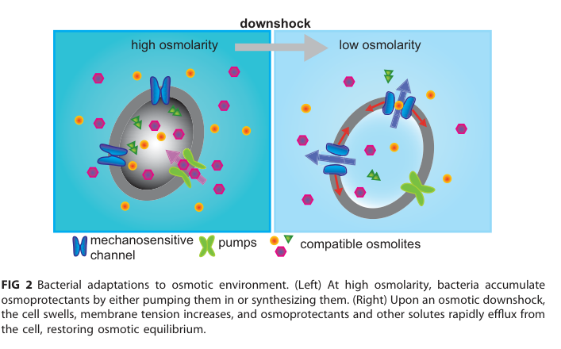

## Question

# Gene Research for Functional Annotation

## ⚠️ CRITICAL: Gene/Protein Identification Context

**BEFORE YOU BEGIN RESEARCH:** You MUST verify you are researching the CORRECT gene/protein. Gene symbols can be ambiguous, especially for less well-characterized genes from non-model organisms.

### Target Gene/Protein Identity (from UniProt):
- **UniProt Accession:** Q88E23
- **Protein Description:** RecName: Full=Large-conductance mechanosensitive channel {ECO:0000255|HAMAP-Rule:MF_00115};
- **Gene Information:** Name=mscL {ECO:0000255|HAMAP-Rule:MF_00115}; OrderedLocusNames=PP_4645;
- **Organism (full):** Pseudomonas putida (strain ATCC 47054 / DSM 6125 / CFBP 8728 / NCIMB 11950 / KT2440).
- **Protein Family:** Belongs to the MscL family. {ECO:0000255|HAMAP-
- **Key Domains:** Mechanosensitive_channel_CS. (IPR019823); MS_channel. (IPR001185); MSC/AndL. (IPR037673); MscL_channel. (IPR036019); MscL (PF01741)

### MANDATORY VERIFICATION STEPS:

1. **Check if the gene symbol "mscL" matches the protein description above**
2. **Verify the organism is correct:** Pseudomonas putida (strain ATCC 47054 / DSM 6125 / CFBP 8728 / NCIMB 11950 / KT2440).
3. **Check if protein family/domains align with what you find in literature**
4. **If you find literature for a DIFFERENT gene with the same or similar symbol, STOP**

### If Gene Symbol is Ambiguous or You Cannot Find Relevant Literature:

**DO NOT PROCEED WITH RESEARCH ON A DIFFERENT GENE.** Instead:
- State clearly: "The gene symbol 'mscL' is ambiguous or literature is limited for this specific protein"
- Explain what you found (e.g., "Found extensive literature on a different gene with the same symbol in a different organism")
- Describe the protein based ONLY on the UniProt information provided above
- Suggest that the protein function can be inferred from domain/family information

### Research Target:

Please provide a comprehensive research report on the gene **mscL** (gene ID: mscL, UniProt: Q88E23) in PSEPK.

The research report should be a detailed narrative explaining the function, biological processes, and localization of the gene product. Citations should be given for all claims.

You should prioritize authoritative reviews and primary scientific literature when conducting research. You can supplement
this with annotations you find in gene/protein databases, but these can be outdated or inaccurate.

We are specifically interested in the primary function of the gene - for enzymes, what reaction is catalyzed, and what is the substrate specificity? For transporters, what is the substrate? For structural proteins or adapters, what is the broader structural role? For signaling molecules, what is the role in the pathway.

We are interested in where in or outside the cell the gene product carries out its function.

We are also interested in the signaling or biochemical pathways in which the gene functions. We are less interested in broad pleiotropic effects, except where these elucidate the precise role.

Include evidence where possible. We are interested in both experimental evidence as well as inference from structure, evolution, or bioinformatic analysis. Precise studies should be prioritized over high-throughput, where available.

## Output

Question: You are an expert researcher providing comprehensive, well-cited information.

Provide detailed information focusing on:
1. Key concepts and definitions with current understanding
2. Recent developments and latest research (prioritize 2023-2024 sources)
3. Current applications and real-world implementations
4. Expert opinions and analysis from authoritative sources
5. Relevant statistics and data from recent studies

Format as a comprehensive research report with proper citations. Include URLs and publication dates where available.
Always prioritize recent, authoritative sources and provide specific citations for all major claims.

# Gene Research for Functional Annotation

## ⚠️ CRITICAL: Gene/Protein Identification Context

**BEFORE YOU BEGIN RESEARCH:** You MUST verify you are researching the CORRECT gene/protein. Gene symbols can be ambiguous, especially for less well-characterized genes from non-model organisms.

### Target Gene/Protein Identity (from UniProt):
- **UniProt Accession:** Q88E23
- **Protein Description:** RecName: Full=Large-conductance mechanosensitive channel {ECO:0000255|HAMAP-Rule:MF_00115};
- **Gene Information:** Name=mscL {ECO:0000255|HAMAP-Rule:MF_00115}; OrderedLocusNames=PP_4645;
- **Organism (full):** Pseudomonas putida (strain ATCC 47054 / DSM 6125 / CFBP 8728 / NCIMB 11950 / KT2440).
- **Protein Family:** Belongs to the MscL family. {ECO:0000255|HAMAP-
- **Key Domains:** Mechanosensitive_channel_CS. (IPR019823); MS_channel. (IPR001185); MSC/AndL. (IPR037673); MscL_channel. (IPR036019); MscL (PF01741)

### MANDATORY VERIFICATION STEPS:

1. **Check if the gene symbol "mscL" matches the protein description above**
2. **Verify the organism is correct:** Pseudomonas putida (strain ATCC 47054 / DSM 6125 / CFBP 8728 / NCIMB 11950 / KT2440).
3. **Check if protein family/domains align with what you find in literature**
4. **If you find literature for a DIFFERENT gene with the same or similar symbol, STOP**

### If Gene Symbol is Ambiguous or You Cannot Find Relevant Literature:

**DO NOT PROCEED WITH RESEARCH ON A DIFFERENT GENE.** Instead:
- State clearly: "The gene symbol 'mscL' is ambiguous or literature is limited for this specific protein"
- Explain what you found (e.g., "Found extensive literature on a different gene with the same symbol in a different organism")
- Describe the protein based ONLY on the UniProt information provided above
- Suggest that the protein function can be inferred from domain/family information

### Research Target:

Please provide a comprehensive research report on the gene **mscL** (gene ID: mscL, UniProt: Q88E23) in PSEPK.

The research report should be a detailed narrative explaining the function, biological processes, and localization of the gene product. Citations should be given for all claims.

You should prioritize authoritative reviews and primary scientific literature when conducting research. You can supplement
this with annotations you find in gene/protein databases, but these can be outdated or inaccurate.

We are specifically interested in the primary function of the gene - for enzymes, what reaction is catalyzed, and what is the substrate specificity? For transporters, what is the substrate? For structural proteins or adapters, what is the broader structural role? For signaling molecules, what is the role in the pathway.

We are interested in where in or outside the cell the gene product carries out its function.

We are also interested in the signaling or biochemical pathways in which the gene functions. We are less interested in broad pleiotropic effects, except where these elucidate the precise role.

Include evidence where possible. We are interested in both experimental evidence as well as inference from structure, evolution, or bioinformatic analysis. Precise studies should be prioritized over high-throughput, where available.

## Comprehensive Research Report: **mscL (PP_4645; UniProt Q88E23)** in *Pseudomonas putida* KT2440

### 1) Target verification (critical identity check)
The target protein specified by UniProt **Q88E23** is annotated as a **large-conductance mechanosensitive channel (MscL family)** encoded by **mscL** with locus **PP_4645** in *Pseudomonas putida* KT2440. This identity is consistent with experimental *P. putida* KT2440 literature that describes **MscL as an “inner-membrane residing rescue valve”** important for coping with low-osmolarity (hypotonic) challenges and specifically manipulated via **mscL inactivation** in KT2440 strains. (pobletecastro2020engineeringtheosmotic pages 1-2)

### 2) Key concepts, definitions, and current understanding
#### 2.1 Mechanosensitive channels and “force-from-lipids” gating
Bacterial mechanosensitive channels are membrane proteins that sense increased **lateral membrane tension** (e.g., during sudden hypoosmotic shock) and open to relieve turgor pressure. MscL is classically described as a **last-ditch “emergency release valve”** that opens when osmotic conditions threaten membrane rupture, permitting rapid efflux of cytoplasmic solutes and thereby preventing cell lysis. (blount2020lifewithbacterial pages 10-12, blount2020lifewithbacterial pages 6-8, blount2020lifewithbacterial pages 4-6)

Mechanistically, MscL is **gated directly by the membrane** (force-from-lipids), and channel activity can be reconstituted with purified protein in lipid bilayers, supporting that the membrane environment is sufficient for gating. (blount2020lifewithbacterial pages 4-6)

#### 2.2 What MscL does (function and substrate specificity)
**Primary function (functional annotation):** MscL is a mechanosensitive pore that provides **non-specific, size-limited efflux** of cytoplasmic contents during acute downshock. It is **not a selective transporter for a particular substrate**, but rather a broad “safety valve” that releases compatible solutes and other cytoplasmic molecules when the channel opens. MscL is described as **size-selective rather than solute-specific**, consistent with an emergency pore rather than a dedicated metabolite transporter. (blount2020lifewithbacterial pages 4-6)

**Substrate/cargo:** Because MscL forms one of the largest gated pores known, it can allow passage not only of small ions but also larger osmolytes and even small proteins in some settings; this broad permeability is part of its emergency-relief role. (blount2020lifewithbacterial pages 8-10)

#### 2.3 Cellular localization
MscL is localized to the **cytoplasmic (inner) membrane**. In *P. putida* KT2440 specifically, the channel is described as an **“inner-membrane residing rescue valve”**. (pobletecastro2020engineeringtheosmotic pages 1-2, blount2020lifewithbacterial pages 2-4)

#### 2.4 Structural family features relevant to functional inference
MscL channels are conserved across bacteria. General architectural features include a predominantly helical subunit with **two transmembrane helices (TM1/TM2)** plus cytoplasmic N- and C-terminal regions, with the **pore lined primarily by TM1**. The biologically relevant oligomeric form is described as **pentameric** in vivo. (blount2020lifewithbacterial pages 6-8, lane2023approachesforthe pages 1-2)

### 3) Quantitative functional parameters (best-supported values)
Most quantitative single-channel parameters available in the retrieved corpus come from cross-species MscL literature (often *E. coli* and other homologs) and are used here as **strong homology-based functional inference** for *P. putida* KT2440 MscL.

* **Single-channel conductance:** MscL is a very large-conductance channel, with a typical reported conductance of **~3.6 nS**. (blount2020lifewithbacterial pages 2-4, blount2020lifewithbacterial pages 8-10, blount2020lifewithbacterial pages 6-8)
* **Open pore size:** The fully open pore is estimated at **~25–30 Å diameter**, consistent with the channel’s ability to pass relatively large solutes. (blount2020lifewithbacterial pages 8-10, blount2020lifewithbacterial pages 6-8)
* **Size cutoff:** MscL is described as passing molecules up to **~30 Å diameter**, emphasizing broad, size-limited permeability. (blount2020lifewithbacterial pages 4-6)

**Note on gating tension/pressure:** Within the retrieved KT2440-specific literature, explicit numeric **gating tension thresholds** for *P. putida* MscL were not found. Instead, general studies emphasize tension dependence and provide structural/energetic descriptions. (blount2020lifewithbacterial pages 4-6, zhang2024mechanosensitivechannelmscl pages 11-13)

### 4) Biological role of mscL in *P. putida* KT2440 (process/pathway context)
#### 4.1 Osmotic downshock survival physiology
The canonical physiological role of MscL is survival of **acute hypoosmotic shock**: when external osmolarity rapidly decreases, water influx increases cytoplasmic turgor pressure and membrane tension. MscL opens to release solutes, thereby rapidly lowering turgor and preventing catastrophic membrane rupture. This role is presented as a core function of bacterial MscL channels and is the basis for describing MscL as an emergency valve. (blount2020lifewithbacterial pages 10-12, blount2020lifewithbacterial pages 6-8)

In *P. putida* KT2440, applied work directly leverages this physiological role: engineering strategies that **inactivate mscL** sensitize cells to osmotic transitions, supporting that MscL normally contributes to robustness under low-osmolarity challenges. (pobletecastro2020engineeringtheosmotic pages 1-2)

#### 4.2 Relationship to other mechanosensitive channels
General bacterial physiology indicates partial redundancy among mechanosensitive channels. In classic genetics, an mscL single mutant can show minimal phenotype under some conditions, whereas combined loss of multiple mechanosensitive channels yields strong downshock sensitivity, consistent with an overlapping “safety valve” network. (blount2020lifewithbacterial pages 4-6)

### 5) Recent developments (prioritizing 2023–2024)

#### 5.1 2023: Modulation strategies, agonists, and antimicrobial/biotech relevance
A 2023 review highlights that the **exact molecular mechanism** by which MscL senses tension remains incompletely resolved, and therefore multiple experimental approaches are used to modulate channel gating.

Key 2023 synthesis points include:
* **Mutational modulation:** substitutions at key residues (e.g., constriction-region variants; classic “gain-of-function” gating mutants) shift activation thresholds and aid mechanistic mapping. (lane2023approachesforthe pages 1-2)
* **Chemical/engineering modulation:** early work used cysteine-reactive reagents and engineered modifications to trigger gating; later work uses **membrane property manipulation** (lipid composition/physical parameters). (lane2023approachesforthe pages 1-2)
* **Direct-binding agonists:** more recent studies (summarized in 2023) describe structurally distinct **agonists that bind directly** to MscL near a **transmembrane pocket** implicated in mechanical gating, providing a path toward MscL-targeting antimicrobials/adjuvants. (lane2023approachesforthe pages 1-2)
* Additional modulation themes summarized include **cyclodextrins** (as “universal activators” via membrane tension changes), **gadolinium ions** (effects on lipid packing/lateral pressure), **host-defense peptides** (altering lipid domains and activation energies), and **photoactivation approaches**; these are positioned as both mechanistic probes and enabling technologies for controlled permeabilization. (lane2023approachesforthe pages 6-7)

These 2023 developments are directly relevant to functional annotation because they clarify that MscL’s “substrate” is not a specific molecule but rather that gating and permeability can be tuned by both protein and membrane determinants. (lane2023approachesforthe pages 1-2, lane2023approachesforthe pages 6-7)

#### 5.2 2024: High-resolution view of gating transitions and energetic/area costs
A 2024 primary mechanistic study (Protein Science) provides quantitative insight into MscL gating transitions, emphasizing that gating may proceed through **closed → expanded (without full opening) → low-conducting substates → fully open**, and that the **effective constriction point shifts** during this pathway toward the cytoplasmic side from **G26 → G22 → L19**. (zhang2024mechanosensitivechannelmscl pages 1-2)

Quantitative thermodynamic/elastic parameters were estimated:
* **Closed → fully open:** ΔE ≈ **52 kT**, ΔA ≈ **20 nm²**. (zhang2024mechanosensitivechannelmscl pages 11-13)
* **Closed → low-conducting substate (S0.13):** ΔE ≈ **45.6 kT**, ΔA ≈ **14.8 nm²**. (zhang2024mechanosensitivechannelmscl pages 11-13)

The same 2024 work identifies constriction residues (e.g., **G26, V23, G22, L19**) and emphasizes that hydrophobic and lipidic interactions at constriction “hot spots” tune the gating energetics, consistent with lipid–protein coupling as a central principle. (zhang2024mechanosensitivechannelmscl pages 11-13, zhang2024mechanosensitivechannelmscl pages 13-14)

### 6) Current applications and real-world implementations (with *P. putida* KT2440 emphasis)

#### 6.1 Industrial biotechnology: osmotic engineering for PHA downstream processing
A concrete KT2440 implementation uses **mscL inactivation** as part of an engineered osmotic-weakening strategy to accelerate cell disruption and recovery of intracellular bioproducts (polyhydroxyalkanoates, PHA).

In *P. putida* KT2440, Poblete-Castro et al. (2020) engineered the osmotic state by **inactivating MscL** and overproducing outer membrane porins (OprF/OprE). Under PHA-producing conditions, single-porin strains showed **no impairment** in growth/biomass/PHA yield after 48 h, while tandem porin expression in the mscL mutant (KTΔmscL-oprFE) produced a modest biomass reduction of **~10%** alongside higher PHA accumulation (%wt). Following an osmotic upshift (1 h) and rapid transfer to hypotonic conditions, KTΔmscL-oprFE exhibited membrane damage and rapid loss of viability; **>95%** of cells were disrupted within **3 h** (CFU, FACS, TEM). PHA recovery reached **94.2%** without significant change in monomer composition. (pobletecastro2020engineeringtheosmotic pages 1-2)

This constitutes a real-world, process-oriented use of mscL functional knowledge: removing an emergency valve increases susceptibility to controlled osmotic lysis, improving downstream recovery economics. (pobletecastro2020engineeringtheosmotic pages 1-2)

#### 6.2 Broader translational framing (expert review perspective)
Authoritative reviews also discuss MscL as a potential **pharmacological target** and as an engineered “nanovalve” concept, because channel modality can be altered and the pore is exceptionally large. This expert framing supports ongoing interest in MscL modulation both for antimicrobial discovery and for engineered delivery/permeabilization technologies. (blount2020lifewithbacterial pages 2-4)

### 7) Expert interpretation and analysis (authoritative perspectives)
Across expert reviews, MscL is positioned as a paradigmatic mechanosensitive channel because it (i) senses membrane tension directly, (ii) undergoes large conformational change, and (iii) provides a clear physiological function (osmotic emergency release). The expert consensus is that MscL’s key biological “pathway” context is **osmoadaptation to acute downshock**, operating at the membrane biophysics interface rather than in a canonical metabolite pathway. (blount2020lifewithbacterial pages 10-12, blount2020lifewithbacterial pages 6-8, blount2020lifewithbacterial pages 4-6)

Recent mechanistic studies continue refining which residues and lipid interactions govern intermediate states and “hydrophobic constriction” behavior, reinforcing that functional annotation should include: (a) emergency-release physiology, (b) force-from-lipids gating, and (c) broad size-limited permeability. (zhang2024mechanosensitivechannelmscl pages 11-13, zhang2024mechanosensitivechannelmscl pages 13-14)

### 8) Evidence-based functional annotation for *P. putida* KT2440 mscL (UniProt Q88E23)
**Molecular function:** Mechanosensitive channel activity; tension-gated pore permitting rapid, non-specific efflux of cytoplasmic solutes during hypoosmotic stress. (blount2020lifewithbacterial pages 10-12, blount2020lifewithbacterial pages 4-6)

**Biological process:** Osmotic downshock response / protection from lysis; contributes to surviving low-osmolarity challenges. (pobletecastro2020engineeringtheosmotic pages 1-2, blount2020lifewithbacterial pages 6-8)

**Cellular component:** Inner (cytoplasmic) membrane. (pobletecastro2020engineeringtheosmotic pages 1-2, blount2020lifewithbacterial pages 2-4)

**Quantitative characteristics (best-supported):** Large conductance (~3.6 nS), very large pore (~25–30 Å diameter), broad size cutoff (~30 Å). (blount2020lifewithbacterial pages 8-10, blount2020lifewithbacterial pages 6-8)

### 9) Visual evidence (figures)
Key figures from an authoritative review illustrate: (i) MscL as an emergency release valve during osmotic downshock, (ii) pentameric architecture, and (iii) gating-related conformational changes linked to a large open pore. (blount2020lifewithbacterial media 93fdecdb, blount2020lifewithbacterial media 9449b2c3, blount2020lifewithbacterial media 3a0679a3)

### 10) Summary table (quantitative and KT2440-specific phenotype highlights)
| Aspect | Key points (include numbers) | Evidence type (review/primary/engineering) | Source (author year journal) | DOI/URL | Citation ID |
|---|---|---|---|---|---|
| Verified identity | Target is **mscL / PP_4645** from **Pseudomonas putida KT2440**; annotated as a **large-conductance mechanosensitive channel** in the **MscL family**. Experimental P. putida literature explicitly describes MscL as the **inner-membrane rescue valve** used to withstand low-osmolarity stress, matching the UniProt description for Q88E23. | Engineering + review-supported functional annotation | Poblete-Castro et al. 2020 *Frontiers in Bioengineering and Biotechnology*; Blount & Iscla 2020 *MMBR* | https://doi.org/10.3389/fbioe.2020.00161 ; https://doi.org/10.1128/mmbr.00055-19 | (pobletecastro2020engineeringtheosmotic pages 1-2, blount2020lifewithbacterial pages 10-12) |
| Cellular localization | MscL is a **cytoplasmic/inner membrane** mechanosensitive channel; P. putida study calls it an **inner-membrane residing rescue valve**. | Review + engineering | Blount & Iscla 2020 *MMBR*; Poblete-Castro et al. 2020 *Frontiers in Bioengineering and Biotechnology* | https://doi.org/10.1128/mmbr.00055-19 ; https://doi.org/10.3389/fbioe.2020.00161 | (blount2020lifewithbacterial pages 2-4, pobletecastro2020engineeringtheosmotic pages 1-2) |
| Primary biological function | Functions as an **emergency release valve** that opens in response to **membrane tension** during **acute hypoosmotic/downshock**, releasing accumulated cytoplasmic solutes to prevent lysis; MscL is generally the principal channel for surviving **large osmotic downshocks**. | Review | Blount & Iscla 2020 *MMBR* | https://doi.org/10.1128/mmbr.00055-19 | (blount2020lifewithbacterial pages 10-12, blount2020lifewithbacterial pages 6-8, blount2020lifewithbacterial pages 4-6) |
| Structural organization | Conserved MscL architecture: **pentameric** channel, subunits with **two transmembrane helices (TM1/TM2)** plus N- and C-terminal cytoplasmic regions; pore is lined mainly by **TM1**. | Review | Blount & Iscla 2020 *MMBR*; Lane & Pliotas 2023 *Frontiers in Chemistry* | https://doi.org/10.1128/mmbr.00055-19 ; https://doi.org/10.3389/fchem.2023.1162412 | (blount2020lifewithbacterial pages 6-8, lane2023approachesforthe pages 1-2, blount2020lifewithbacterial media 93fdecdb) |
| Open-pore diameter | Estimated **open pore diameter ~25–30 Å**. This very large pore underlies broad efflux capacity. | Review | Blount & Iscla 2020 *MMBR* | https://doi.org/10.1128/mmbr.00055-19 | (blount2020lifewithbacterial pages 8-10, blount2020lifewithbacterial pages 6-8, blount2020lifewithbacterial media 93fdecdb) |
| Single-channel conductance | Typical MscL single-channel conductance is **~3.6 nS** (contrasted with smaller MscS conductance). | Review | Blount & Iscla 2020 *MMBR* | https://doi.org/10.1128/mmbr.00055-19 | (blount2020lifewithbacterial pages 2-4, blount2020lifewithbacterial pages 8-10, blount2020lifewithbacterial pages 6-8) |
| Solute size cutoff / cargo release | MscL is **size-selective rather than solute-specific** and can pass molecules **up to ~30 Å diameter**; reported to release osmolytes, metabolites, and even small proteins. | Review | Blount & Iscla 2020 *MMBR* | https://doi.org/10.1128/mmbr.00055-19 | (blount2020lifewithbacterial pages 8-10, blount2020lifewithbacterial pages 4-6) |
| Physiological process in P. putida KT2440 | In P. putida KT2440, MscL is used to cope with **low-osmolarity challenge**; inactivation sensitizes cells to osmotic manipulation when combined with porin engineering, supporting its role as an osmotic safety valve. | Engineering | Poblete-Castro et al. 2020 *Frontiers in Bioengineering and Biotechnology* | https://doi.org/10.3389/fbioe.2020.00161 | (pobletecastro2020engineeringtheosmotic pages 1-2) |
| P. putida engineering phenotype | In **KTΔmscL-oprFE**, tandem porin overexpression in the mscL mutant caused **~10% biomass reduction**, but after osmotic upshift then hypotonic transfer, **>95% cell disruption within 3 h**; **PHA recovery = 94.2%** with no significant monomer-composition change. | Engineering primary study | Poblete-Castro et al. 2020 *Frontiers in Bioengineering and Biotechnology* | https://doi.org/10.3389/fbioe.2020.00161 | (pobletecastro2020engineeringtheosmotic pages 1-2) |
| 2023 modulation approaches | 2023 review summarizes modulation by **mutations**, **cysteine-reactive post-translational modifications**, **membrane/lipid composition changes**, and **direct-binding agonists** to a transmembrane pocket; also notes **cyclodextrins** as universal activators, **gadolinium** as an inhibitor affecting lipid packing, **host-defense peptides**, and **photoactivation** strategies. | Review | Lane & Pliotas 2023 *Frontiers in Chemistry* | https://doi.org/10.3389/fchem.2023.1162412 | (lane2023approachesforthe pages 1-2, lane2023approachesforthe pages 6-7) |
| 2024 gating transition mechanism | 2024 work supports a gating pathway with constriction-point shift **G26 → G22 → L19** as channel expands from closed to low-conducting substates and then toward full opening; hydrophobic/lipid interactions at constriction “hot spots” regulate the transitions. | Primary mechanistic study | Zhang et al. 2024 *Protein Science* | https://doi.org/10.1002/pro.4965 | (zhang2024mechanosensitivechannelmscl pages 1-2, zhang2024mechanosensitivechannelmscl pages 11-13) |
| 2024 gating energetics and area changes | Quantified energetic/area changes: **closed → fully open ΔE ≈ 52 kT, ΔA ≈ 20 nm²**; **closed → low-conducting substate (S0.13) ΔE ≈ 45.6 kT, ΔA ≈ 14.8 nm²**. | Primary mechanistic study | Zhang et al. 2024 *Protein Science* | https://doi.org/10.1002/pro.4965 | (zhang2024mechanosensitivechannelmscl pages 11-13) |
| Constriction residues and mechanosensitivity determinants | Constriction-region residues include **G26, V23, G22, L19**; mutations such as **G26S, V23D, G22E** are strong gain-of-function variants with reduced gating thresholds; TM1 residues **V17/V21** interact with TM2 residues **I92/I96** in a hydrophobic pocket influenced by lipid penetration. | Primary mechanistic study | Zhang et al. 2024 *Protein Science* | https://doi.org/10.1002/pro.4965 | (zhang2024mechanosensitivechannelmscl pages 11-13, zhang2024mechanosensitivechannelmscl pages 13-14) |

*Table: This table verifies the identity of Pseudomonas putida KT2440 MscL and summarizes core functional annotation, quantitative channel properties, engineering phenotypes, and recent 2023–2024 mechanistic/modulator findings with source-linked citations.*

### References (URLs and publication dates)
* Blount P, Iscla I. **Life with Bacterial Mechanosensitive Channels, from Discovery to Physiology to Pharmacological Target.** *Microbiology and Molecular Biology Reviews* (Published Feb 2020). https://doi.org/10.1128/mmbr.00055-19 (blount2020lifewithbacterial pages 2-4, blount2020lifewithbacterial pages 10-12, blount2020lifewithbacterial pages 8-10, blount2020lifewithbacterial pages 6-8, blount2020lifewithbacterial pages 4-6)
* Lane BJ, Pliotas C. **Approaches for the modulation of mechanosensitive MscL channel pores.** *Frontiers in Chemistry* (Published Mar 2023). https://doi.org/10.3389/fchem.2023.1162412 (lane2023approachesforthe pages 1-2, lane2023approachesforthe pages 6-7)
* Zhang M, Tang S, Wang X, Fang S, Li Y. **Mechanosensitive channel MscL gating transitions coupling with constriction point shift.** *Protein Science* (Published Mar 2024). https://doi.org/10.1002/pro.4965 (zhang2024mechanosensitivechannelmscl pages 11-13, zhang2024mechanosensitivechannelmscl pages 13-14, zhang2024mechanosensitivechannelmscl pages 1-2)
* Poblete-Castro I, Aravena-Carrasco C, Orellana-Saez M, et al. **Engineering the Osmotic State of Pseudomonas putida KT2440 for Efficient Cell Disruption and Downstream Processing of Poly(3-Hydroxyalkanoates).** *Frontiers in Bioengineering and Biotechnology* (Published Mar 2020). https://doi.org/10.3389/fbioe.2020.00161 (pobletecastro2020engineeringtheosmotic pages 1-2)

References

1. (pobletecastro2020engineeringtheosmotic pages 1-2): Ignacio Poblete-Castro, Carla Aravena-Carrasco, Matias Orellana-Saez, Nicolás Pacheco, Alex Cabrera, and José Manuel Borrero-de Acuña. Engineering the osmotic state of pseudomonas putida kt2440 for efficient cell disruption and downstream processing of poly(3-hydroxyalkanoates). Frontiers in Bioengineering and Biotechnology, Mar 2020. URL: https://doi.org/10.3389/fbioe.2020.00161, doi:10.3389/fbioe.2020.00161. This article has 27 citations.

2. (blount2020lifewithbacterial pages 10-12): Paul Blount and Irene Iscla. Life with bacterial mechanosensitive channels, from discovery to physiology to pharmacological target. Microbiology and Molecular Biology Reviews, Feb 2020. URL: https://doi.org/10.1128/mmbr.00055-19, doi:10.1128/mmbr.00055-19. This article has 77 citations and is from a domain leading peer-reviewed journal.

3. (blount2020lifewithbacterial pages 6-8): Paul Blount and Irene Iscla. Life with bacterial mechanosensitive channels, from discovery to physiology to pharmacological target. Microbiology and Molecular Biology Reviews, Feb 2020. URL: https://doi.org/10.1128/mmbr.00055-19, doi:10.1128/mmbr.00055-19. This article has 77 citations and is from a domain leading peer-reviewed journal.

4. (blount2020lifewithbacterial pages 4-6): Paul Blount and Irene Iscla. Life with bacterial mechanosensitive channels, from discovery to physiology to pharmacological target. Microbiology and Molecular Biology Reviews, Feb 2020. URL: https://doi.org/10.1128/mmbr.00055-19, doi:10.1128/mmbr.00055-19. This article has 77 citations and is from a domain leading peer-reviewed journal.

5. (blount2020lifewithbacterial pages 8-10): Paul Blount and Irene Iscla. Life with bacterial mechanosensitive channels, from discovery to physiology to pharmacological target. Microbiology and Molecular Biology Reviews, Feb 2020. URL: https://doi.org/10.1128/mmbr.00055-19, doi:10.1128/mmbr.00055-19. This article has 77 citations and is from a domain leading peer-reviewed journal.

6. (blount2020lifewithbacterial pages 2-4): Paul Blount and Irene Iscla. Life with bacterial mechanosensitive channels, from discovery to physiology to pharmacological target. Microbiology and Molecular Biology Reviews, Feb 2020. URL: https://doi.org/10.1128/mmbr.00055-19, doi:10.1128/mmbr.00055-19. This article has 77 citations and is from a domain leading peer-reviewed journal.

7. (lane2023approachesforthe pages 1-2): Benjamin J. Lane and Christos Pliotas. Approaches for the modulation of mechanosensitive mscl channel pores. Frontiers in Chemistry, Mar 2023. URL: https://doi.org/10.3389/fchem.2023.1162412, doi:10.3389/fchem.2023.1162412. This article has 12 citations.

8. (zhang2024mechanosensitivechannelmscl pages 11-13): Mingfeng Zhang, Siyang Tang, Xiaomin Wang, Sanhua Fang, and Yuezhou Li. Mechanosensitive channel mscl gating transitions coupling with constriction point shift. Protein Science, Mar 2024. URL: https://doi.org/10.1002/pro.4965, doi:10.1002/pro.4965. This article has 2 citations and is from a peer-reviewed journal.

9. (lane2023approachesforthe pages 6-7): Benjamin J. Lane and Christos Pliotas. Approaches for the modulation of mechanosensitive mscl channel pores. Frontiers in Chemistry, Mar 2023. URL: https://doi.org/10.3389/fchem.2023.1162412, doi:10.3389/fchem.2023.1162412. This article has 12 citations.

10. (zhang2024mechanosensitivechannelmscl pages 1-2): Mingfeng Zhang, Siyang Tang, Xiaomin Wang, Sanhua Fang, and Yuezhou Li. Mechanosensitive channel mscl gating transitions coupling with constriction point shift. Protein Science, Mar 2024. URL: https://doi.org/10.1002/pro.4965, doi:10.1002/pro.4965. This article has 2 citations and is from a peer-reviewed journal.

11. (zhang2024mechanosensitivechannelmscl pages 13-14): Mingfeng Zhang, Siyang Tang, Xiaomin Wang, Sanhua Fang, and Yuezhou Li. Mechanosensitive channel mscl gating transitions coupling with constriction point shift. Protein Science, Mar 2024. URL: https://doi.org/10.1002/pro.4965, doi:10.1002/pro.4965. This article has 2 citations and is from a peer-reviewed journal.

12. (blount2020lifewithbacterial media 93fdecdb): Paul Blount and Irene Iscla. Life with bacterial mechanosensitive channels, from discovery to physiology to pharmacological target. Microbiology and Molecular Biology Reviews, Feb 2020. URL: https://doi.org/10.1128/mmbr.00055-19, doi:10.1128/mmbr.00055-19. This article has 77 citations and is from a domain leading peer-reviewed journal.

13. (blount2020lifewithbacterial media 9449b2c3): Paul Blount and Irene Iscla. Life with bacterial mechanosensitive channels, from discovery to physiology to pharmacological target. Microbiology and Molecular Biology Reviews, Feb 2020. URL: https://doi.org/10.1128/mmbr.00055-19, doi:10.1128/mmbr.00055-19. This article has 77 citations and is from a domain leading peer-reviewed journal.

14. (blount2020lifewithbacterial media 3a0679a3): Paul Blount and Irene Iscla. Life with bacterial mechanosensitive channels, from discovery to physiology to pharmacological target. Microbiology and Molecular Biology Reviews, Feb 2020. URL: https://doi.org/10.1128/mmbr.00055-19, doi:10.1128/mmbr.00055-19. This article has 77 citations and is from a domain leading peer-reviewed journal.

## Artifacts

- [Edison artifact artifact-00](mscL-deep-research-falcon_artifacts/artifact-00.md)

## Citations

1. pobletecastro2020engineeringtheosmotic pages 1-2
2. blount2020lifewithbacterial pages 4-6
3. blount2020lifewithbacterial pages 8-10
4. lane2023approachesforthe pages 1-2
5. lane2023approachesforthe pages 6-7
6. zhang2024mechanosensitivechannelmscl pages 1-2
7. zhang2024mechanosensitivechannelmscl pages 11-13
8. blount2020lifewithbacterial pages 2-4
9. blount2020lifewithbacterial pages 10-12
10. blount2020lifewithbacterial pages 6-8
11. zhang2024mechanosensitivechannelmscl pages 13-14
12. https://doi.org/10.3389/fbioe.2020.00161
13. https://doi.org/10.1128/mmbr.00055-19
14. https://doi.org/10.3389/fchem.2023.1162412
15. https://doi.org/10.1002/pro.4965
16. https://doi.org/10.3389/fbioe.2020.00161,
17. https://doi.org/10.1128/mmbr.00055-19,
18. https://doi.org/10.3389/fchem.2023.1162412,
19. https://doi.org/10.1002/pro.4965,