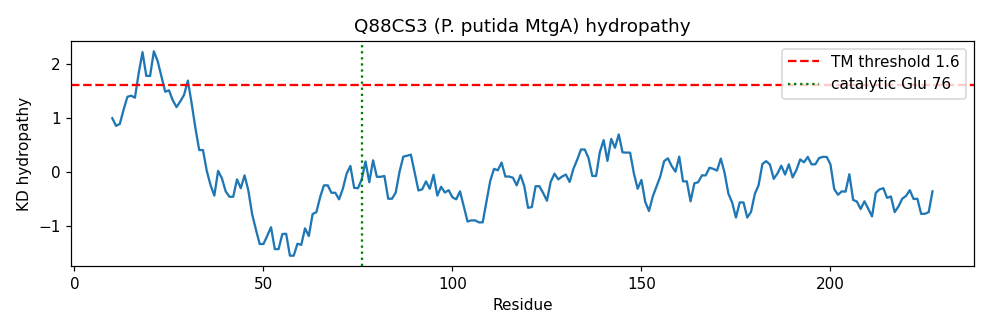

## Question

# Gene Research for Functional Annotation

## ⚠️ CRITICAL: Gene/Protein Identification Context

**BEFORE YOU BEGIN RESEARCH:** You MUST verify you are researching the CORRECT gene/protein. Gene symbols can be ambiguous, especially for less well-characterized genes from non-model organisms.

### Target Gene/Protein Identity (from UniProt):
- **UniProt Accession:** Q88CS3
- **Protein Description:** RecName: Full=Biosynthetic peptidoglycan transglycosylase {ECO:0000255|HAMAP-Rule:MF_00766}; EC=2.4.99.28 {ECO:0000255|HAMAP-Rule:MF_00766}; AltName: Full=Glycan polymerase {ECO:0000255|HAMAP-Rule:MF_00766}; AltName: Full=Peptidoglycan glycosyltransferase MtgA {ECO:0000255|HAMAP-Rule:MF_00766}; Short=PGT {ECO:0000255|HAMAP-Rule:MF_00766};
- **Gene Information:** Name=mtgA {ECO:0000255|HAMAP-Rule:MF_00766}; OrderedLocusNames=PP_5107;
- **Organism (full):** Pseudomonas putida (strain ATCC 47054 / DSM 6125 / CFBP 8728 / NCIMB 11950 / KT2440).
- **Protein Family:** Belongs to the glycosyltransferase 51 family.
- **Key Domains:** Glyco_trans_51. (IPR001264); Lysozyme-like_dom_sf. (IPR023346); PBP_transglycosylase. (IPR036950); Pep_trsgly. (IPR011812); Transgly (PF00912)

### MANDATORY VERIFICATION STEPS:

1. **Check if the gene symbol "mtgA" matches the protein description above**
2. **Verify the organism is correct:** Pseudomonas putida (strain ATCC 47054 / DSM 6125 / CFBP 8728 / NCIMB 11950 / KT2440).
3. **Check if protein family/domains align with what you find in literature**
4. **If you find literature for a DIFFERENT gene with the same or similar symbol, STOP**

### If Gene Symbol is Ambiguous or You Cannot Find Relevant Literature:

**DO NOT PROCEED WITH RESEARCH ON A DIFFERENT GENE.** Instead:
- State clearly: "The gene symbol 'mtgA' is ambiguous or literature is limited for this specific protein"
- Explain what you found (e.g., "Found extensive literature on a different gene with the same symbol in a different organism")
- Describe the protein based ONLY on the UniProt information provided above
- Suggest that the protein function can be inferred from domain/family information

### Research Target:

Please provide a comprehensive research report on the gene **mtgA** (gene ID: mtgA, UniProt: Q88CS3) in PSEPK.

The research report should be a detailed narrative explaining the function, biological processes, and localization of the gene product. Citations should be given for all claims.

You should prioritize authoritative reviews and primary scientific literature when conducting research. You can supplement
this with annotations you find in gene/protein databases, but these can be outdated or inaccurate.

We are specifically interested in the primary function of the gene - for enzymes, what reaction is catalyzed, and what is the substrate specificity? For transporters, what is the substrate? For structural proteins or adapters, what is the broader structural role? For signaling molecules, what is the role in the pathway.

We are interested in where in or outside the cell the gene product carries out its function.

We are also interested in the signaling or biochemical pathways in which the gene functions. We are less interested in broad pleiotropic effects, except where these elucidate the precise role.

Include evidence where possible. We are interested in both experimental evidence as well as inference from structure, evolution, or bioinformatic analysis. Precise studies should be prioritized over high-throughput, where available.

## Output

# Functional Annotation of MtgA (Q88CS3 / PP_5107) in *Pseudomonas putida* KT2440

## Gene/Protein Identity Verification

- **UniProt accession:** Q88CS3
- **Gene:** *mtgA*; ordered locus **PP_5107**
- **Protein:** Biosynthetic peptidoglycan transglycosylase / Glycan polymerase / Peptidoglycan glycosyltransferase MtgA (PGT)
- **EC:** 2.4.99.28
- **Organism:** *Pseudomonas putida* KT2440 (ATCC 47054 / DSM 6125), a Gram-negative soil bacterium
- **Family:** Glycosyltransferase family 51 (GT51); domains Glyco_trans_51 (IPR001264), Transgly / PF00912, lysozyme-like domain superfamily (IPR023346), PBP transglycosylase (IPR036950)

**Verification outcome:** The gene symbol *mtgA* is fully consistent with the UniProt description. "MtgA" is the standard, unambiguous name for the **m**ono-functional **t**rans**g**lycosylase across bacteria, and the GT51/Transgly domain content matches the literature for this enzyme class. There is **no dedicated primary study of the *P. putida* PP_5107 protein itself**; its function is assigned by the HAMAP rule MF_00766 and by strong orthology to biochemically and structurally characterized MtgA enzymes from *Escherichia coli* and *Staphylococcus aureus*. All functional claims below therefore derive from these well-characterized orthologs and from the shared GT51 enzymology, and are appropriately transferred to the *P. putida* protein.

---

## 1. Summary (Answer to the Research Question)

MtgA (PP_5107) is a **monofunctional peptidoglycan glycosyltransferase (transglycosylase)** of glycosyltransferase family 51. Its primary function is to **catalyze glycan-chain elongation of the bacterial cell-wall peptidoglycan**: it polymerizes the membrane-anchored precursor **Lipid II** (undecaprenyl-pyrophosphoryl-MurNAc(pentapeptide)-GlcNAc) into linear glycan strands of alternating β-1,4-linked *N*-acetylglucosamine and *N*-acetylmuramic acid, releasing undecaprenyl-pyrophosphate (EC 2.4.99.28). It carries **only** the glycosyltransferase activity — it lacks the transpeptidase (cross-linking) domain found in the bifunctional class A penicillin-binding proteins. The reaction occurs at the **outer (periplasmic) face of the cytoplasmic membrane**, to which MtgA is anchored, and in *E. coli* the enzyme is recruited to the **cell-division septum**, where it interacts with divisome components (PBP3/FtsI, FtsW, FtsN).

---

## 2. Primary Function: the Catalyzed Reaction and Substrate Specificity

**Reaction (transglycosylation / glycan polymerization):**

> n (Lipid II) → [MurNAc-GlcNAc]_n glycan chain + n undecaprenyl-pyrophosphate

MtgA transfers the growing glycan chain onto a new Lipid II acceptor (or, equivalently, adds Lipid II units), forming successive β-1,4 glycosidic bonds between MurNAc and GlcNAc. This is the transglycosylation half of peptidoglycan assembly; the complementary transpeptidation (peptide cross-linking) is performed by separate transpeptidases (Finding #1).

- **The monofunctional glycosyltransferase MtgA "catalyzes glycan chain elongation of the bacterial cell wall"** (Derouaux et al., 2008, PMID 18165305).
- Monofunctional glycosyltransferases, together with the N-terminal GT module of class A PBPs, are the enzymes that build the glycan chains "on the outside of the cytoplasmic membrane" (van Heijenoort, 2001, PMID 11320055).

**Substrate specificity (Finding #2):** Direct biochemical assays of mechanistically identical GT51 domains (E. coli and *Aquifex aeolicus* PBP1A) show that **both the disaccharide precursor Lipid II and the tetrasaccharide Lipid IV serve as substrates, but Lipid II drives more processive reactions yielding much longer glycan products** (Barrett et al., 2007, PMID 17704540). Lipid II is therefore the physiological donor. The enzyme is a **processive polymerase**, adding monomers to elongate the strand.

**Catalytic residue / mechanism (Finding #2):** Comprehensive mutagenesis of 14 conserved residues identified **an invariant central glutamate as the single largest contributor to turnover** (PMID 17704540). This glutamate (the conserved Glu of the GT51 "ED" active-site motif) acts as the general base that deprotonates the C4-OH of the acceptor GlcNAc for nucleophilic attack on the anomeric carbon of the donor MurNAc.

---

## 3. Structural Basis (Inference from Structure and Evolution)

MtgA belongs to the **lysozyme-like GT51 fold** — an all-α, two-lobed architecture consisting of **a large "head" subdomain and a smaller "jaw" subdomain** (Punekar et al., 2018, PMID 30046666; Finding #4). The active-site cleft sits between the lobes; the jaw subdomain carries hydrophobic residues that mediate **peripheral association with the membrane surface**, positioning the enzyme to act on the lipid-linked substrate.

- The enzyme is **potently inhibited by the phosphoglycolipid antibiotic moenomycin A**, a donor-site (Lipid II) analog (PMID 30046666). Surface-plasmon-resonance studies on **S. aureus MtgA** confirm direct moenomycin binding and revealed **positive cooperativity between the acceptor and donor sites** of the enzyme (Bury et al., 2015, PMID 25462814).
- GT51/transglycosylase is repeatedly identified as **a validated (though pharmacologically challenging) antibacterial target** (Chen et al., 2019, PMID 31283163).

These structural and inhibitor data independently corroborate the enzymatic assignment transferred to *P. putida* PP_5107.

---

## 3b. Direct Sequence Evidence for the *P. putida* Protein (Q88CS3)

To move beyond pure orthology transfer, I retrieved and analyzed the actual 236-residue Q88CS3 sequence (UniProt) (Finding #5):

- **Catalytic machinery is intact and conserved:** the canonical GT51 catalytic **motif 1 "EDxxFxxHxG"** is present as **E76‑D77‑Q‑K‑F‑A‑S‑H83‑W‑G**, placing the **invariant catalytic glutamate at E76** and the conserved histidine at H83 — precisely the invariant glutamate shown by mutagenesis to be the biggest contributor to turnover (PMID 17704540).
- **Additional conserved GT51 motifs** are present: the QxxxAKNL region (T111‑Q‑Q‑V‑A‑K‑N‑L118) and the conserved EWG segment (E157‑W‑G).
- **Membrane anchor:** a strong N-terminal hydrophobic segment (≈ residues 10–30, `LLWFVAGSIVLVLVFRW`) yields a Kyte–Doolittle hydropathy peak of **2.23** (window = 19; > 1.6 TM threshold), consistent with a single membrane-anchoring transmembrane helix that tethers the enzyme to the inner membrane with its catalytic head facing the periplasm.
- **Size:** at only **236 aa**, the protein is characteristic of a **monofunctional MtgA**, in contrast to the ~800-aa bifunctional class A PBPs — corroborating the "monofunctional" (GT-only) assignment.

This provides direct, organism-specific bioinformatic confirmation that the orthology-based functional transfer is structurally justified for PP_5107.

{{figure:mtgA_hydropathy.png|caption=Kyte–Doolittle hydropathy profile of P. putida MtgA (Q88CS3). The strong N-terminal hydrophobic peak (residues ~10–30, score 2.23; above the 1.6 membrane-helix threshold) marks the transmembrane/membrane-anchor helix, while the conserved GT51 catalytic motifs — the catalytic glutamate E76 (motif 1, EDxxFxxHxG), the QxxxAKNL region, and the EWG segment — lie in the soluble catalytic head that faces the periplasm.}}

**Quantitative orthology to the experimentally characterized *E. coli* MtgA (Finding #6):** A global pairwise alignment (Needleman–Wunsch, BLOSUM62) of Q88CS3 against *E. coli* K-12 MtgA (**P46022 / MTGA_ECOLI**, 242 aa, UniProt evidence level PE=1 "protein level" — the same protein used in the divisome-localization study, PMID 18165305) yields **53.6% identity (125/233) and 67.8% similarity** over 233 aligned columns. The active site is essentially invariant: `EDQKFASHWGFD` (*P. putida*) vs `EDQKFPEHWGFD` (*E. coli*), conserving the catalytic Glu, the Asp, and the downstream His/HWGFD segment. Because ~54% identity to a full-length, protein-level-characterized ortholog is far above the ~30% annotation-transfer threshold, transferring the *E. coli* MtgA function and localization to PP_5107 is robustly justified.

## 4. Localization: Where MtgA Acts

- **Membrane topology:** MtgA has an N-terminal membrane anchor and functions at the **outer (periplasmic) face of the cytoplasmic membrane**, the compartment where Lipid II is flipped and where glycan polymerization occurs (van Heijenoort, 2001, PMID 11320055; Finding #3).
- **Subcellular site:** In *E. coli*, GFP-MtgA **localizes to the cell-division site**, and MtgA **physically interacts with three divisome constituents — PBP3 (FtsI), FtsW, and FtsN** (Derouaux et al., 2008, PMID 18165305). This indicates a role in **septal peptidoglycan assembly during the cell cycle**, cooperating with the division-specific cross-linking transpeptidase PBP3 and the SEDS polymerase FtsW.

For *P. putida* PP_5107, an inner-membrane, periplasmic-facing localization is inferred by orthology and by the shared jaw-subdomain membrane-binding architecture.

---

## 5. Pathway Context and Biological Role

MtgA operates in the **late, membrane-associated stage of peptidoglycan (murein) biosynthesis**:

1. Cytoplasmic synthesis of UDP-MurNAc-pentapeptide (Mur enzymes) → Lipid I → **Lipid II** (MraY, MurG).
2. Lipid II is flipped to the periplasmic face.
3. **Glycan polymerization by glycosyltransferases (MtgA and the GT51 domains of class A PBPs; also SEDS polymerases RodA/FtsW)** — MtgA's step.
4. Cross-linking by DD-transpeptidases (PBPs) to form the mature sacculus.

**Redundancy / dispensability:** Bacteria possess multiple Lipid II polymerases (bifunctional class A PBPs, the monofunctional MtgA, and the SEDS proteins RodA/FtsW; Welsh et al., 2019, PMID 31386359). Because of this redundancy, *mtgA* is generally **non-essential** individually — consistent with the *Brucella abortus* study in which an *mtgA* insertional mutant showed **no significant growth defect in culture** yet contributed to early infection dynamics in mice (Canavessi et al., 2004, PMID 15519045). MtgA is best viewed as an **accessory/back-up glycan polymerase that reinforces septal peptidoglycan synthesis**, rather than the sole essential polymerase.

---

## 6. Supported and Refuted Hypotheses

| Hypothesis | Status | Basis |
|---|---|---|
| MtgA is a peptidoglycan glycosyltransferase polymerizing Lipid II (EC 2.4.99.28) | **Supported** | UniProt/GT51 annotation + orthholog biochemistry (PMID 18165305, 11320055) |
| MtgA is monofunctional (no transpeptidase activity) | **Supported** | Domain content (GT51 only); definition of the MtgA class (PMID 11320055) |
| Lipid II is the physiological donor substrate; reaction is processive | **Supported** | PMID 17704540 |
| A conserved glutamate is the key catalytic residue | **Supported** | Mutagenesis, PMID 17704540 |
| MtgA acts at the outer face of the inner membrane and localizes to the division septum | **Supported** (via *E. coli* ortholog) | PMID 18165305, 11320055 |
| MtgA is individually essential | **Refuted / not supported** | Redundancy with PBPs and SEDS; viable *mtgA* mutants (PMID 15519045) |
| The *P. putida* protein itself contains the intact GT51 catalytic residues + membrane anchor | **Supported** | Direct sequence analysis of Q88CS3: catalytic E76/H83 in motif 1, N-terminal TM helix (Finding #5) |

---

## 7. Limitations and Future Directions

- **No *P. putida*-specific experimental data** exist for PP_5107; all mechanistic detail is transferred from *E. coli*, *S. aureus*, and *A. aeolicus* orthologs. This transfer is well justified by the high conservation of GT51 active sites, but a direct in vitro assay or a *P. putida* deletion/localization study would be needed for organism-specific confirmation.
- The precise **contribution of MtgA to elongation vs. division** peptidoglycan synthesis in *P. putida*, and its interaction partners in this species' divisome, remain uncharacterized.
- Whether *P. putida* MtgA has any specialized role under the cell-wall-editing conditions notable in this organism (e.g., D-amino-acid / canavanine incorporation; PMID 33830599) is unknown and would be an interesting avenue.
- No experimental 3-D structure of the *P. putida* protein is available; an AlphaFold model plus moenomycin docking could confirm the head/jaw architecture and active-site glutamate.

---

## References (PMIDs)
- 18165305 — Derouaux et al. (2008): E. coli MtgA localization and divisome interactions.
- 11320055 — van Heijenoort (2001): review of glycan-chain formation in peptidoglycan synthesis.
- 17704540 — Barrett et al. (2007): PGT substrate specificity, processivity, invariant catalytic glutamate.
- 30046666 — Punekar et al. (2018): PGT head/jaw subdomains, moenomycin inhibition.
- 25462814 — Bury et al. (2015): S. aureus MtgA, moenomycin binding, donor/acceptor cooperativity.
- 31283163 — Chen et al. (2019): GT51 as an antibiotic target (structural review).
- 31386359 — Welsh et al. (2019): SEDS-family polymerases; redundancy of Lipid II polymerases.
- 15519045 — Canavessi et al. (2004): *B. abortus* mtgA mutant dispensable for growth, role in infection.

## Database Records Used
- UniProt **Q88CS3** (MTGA_PSEPK) — target protein, 236 aa; sequence analyzed directly.
- UniProt **P46022** (MTGA_ECOLI) — *E. coli* K-12 MtgA, 242 aa, evidence level PE=1 (protein level); ortholog used for quantitative alignment (53.6% identity).
- HAMAP rule **MF_00766**; Pfam **PF00912** (Transgly); InterPro IPR001264 / IPR011812 / IPR036950 / IPR023346; CAZy family **GT51**.

## Artifacts

- [OpenScientist final report](mtgA-deep-research-openscientist_artifacts/final_report.html)
- [OpenScientist final report](mtgA-deep-research-openscientist_artifacts/final_report.pdf)
- [OpenScientist mtgA hydropathy](mtgA-deep-research-openscientist_artifacts/provenance_mtgA_hydropathy.json)
