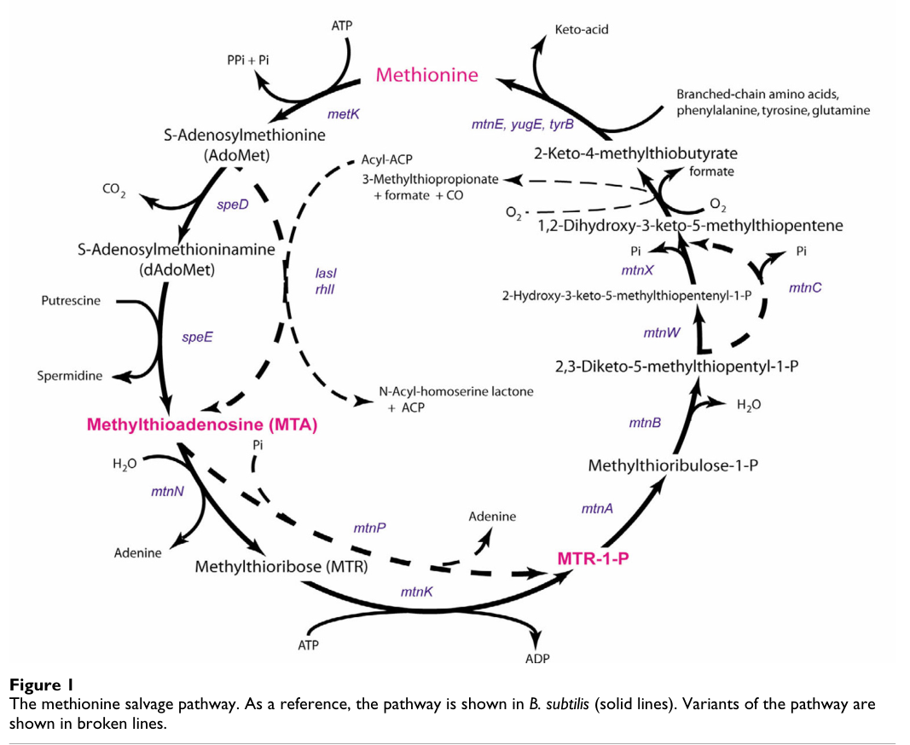

## Question

# Gene Research for Functional Annotation

## ⚠️ CRITICAL: Gene/Protein Identification Context

**BEFORE YOU BEGIN RESEARCH:** You MUST verify you are researching the CORRECT gene/protein. Gene symbols can be ambiguous, especially for less well-characterized genes from non-model organisms.

### Target Gene/Protein Identity (from UniProt):
- **UniProt Accession:** Q88M09
- **Protein Description:** RecName: Full=Methylthioribose-1-phosphate isomerase {ECO:0000255|HAMAP-Rule:MF_01678}; Short=M1Pi {ECO:0000255|HAMAP-Rule:MF_01678}; Short=MTR-1-P isomerase {ECO:0000255|HAMAP-Rule:MF_01678}; EC=5.3.1.23 {ECO:0000255|HAMAP-Rule:MF_01678}; AltName: Full=S-methyl-5-thioribose-1-phosphate isomerase {ECO:0000255|HAMAP-Rule:MF_01678};
- **Gene Information:** Name=mtnA {ECO:0000255|HAMAP-Rule:MF_01678}; OrderedLocusNames=PP_1766;
- **Organism (full):** Pseudomonas putida (strain ATCC 47054 / DSM 6125 / CFBP 8728 / NCIMB 11950 / KT2440).
- **Protein Family:** Belongs to the eIF-2B alpha/beta/delta subunits family.
- **Key Domains:** IF-2B-related. (IPR000649); IF-M1Pi. (IPR005251); IF_2B-like_C. (IPR042529); Initiation_fac_2B_a/b/d. (IPR011559); M1Pi_N. (IPR027363)

### MANDATORY VERIFICATION STEPS:

1. **Check if the gene symbol "mtnA" matches the protein description above**
2. **Verify the organism is correct:** Pseudomonas putida (strain ATCC 47054 / DSM 6125 / CFBP 8728 / NCIMB 11950 / KT2440).
3. **Check if protein family/domains align with what you find in literature**
4. **If you find literature for a DIFFERENT gene with the same or similar symbol, STOP**

### If Gene Symbol is Ambiguous or You Cannot Find Relevant Literature:

**DO NOT PROCEED WITH RESEARCH ON A DIFFERENT GENE.** Instead:
- State clearly: "The gene symbol 'mtnA' is ambiguous or literature is limited for this specific protein"
- Explain what you found (e.g., "Found extensive literature on a different gene with the same symbol in a different organism")
- Describe the protein based ONLY on the UniProt information provided above
- Suggest that the protein function can be inferred from domain/family information

### Research Target:

Please provide a comprehensive research report on the gene **mtnA** (gene ID: mtnA, UniProt: Q88M09) in PSEPK.

The research report should be a detailed narrative explaining the function, biological processes, and localization of the gene product. Citations should be given for all claims.

You should prioritize authoritative reviews and primary scientific literature when conducting research. You can supplement
this with annotations you find in gene/protein databases, but these can be outdated or inaccurate.

We are specifically interested in the primary function of the gene - for enzymes, what reaction is catalyzed, and what is the substrate specificity? For transporters, what is the substrate? For structural proteins or adapters, what is the broader structural role? For signaling molecules, what is the role in the pathway.

We are interested in where in or outside the cell the gene product carries out its function.

We are also interested in the signaling or biochemical pathways in which the gene functions. We are less interested in broad pleiotropic effects, except where these elucidate the precise role.

Include evidence where possible. We are interested in both experimental evidence as well as inference from structure, evolution, or bioinformatic analysis. Precise studies should be prioritized over high-throughput, where available.

## Output

Question: You are an expert researcher providing comprehensive, well-cited information.

Provide detailed information focusing on:
1. Key concepts and definitions with current understanding
2. Recent developments and latest research (prioritize 2023-2024 sources)
3. Current applications and real-world implementations
4. Expert opinions and analysis from authoritative sources
5. Relevant statistics and data from recent studies

Format as a comprehensive research report with proper citations. Include URLs and publication dates where available.
Always prioritize recent, authoritative sources and provide specific citations for all major claims.

# Gene Research for Functional Annotation

## ⚠️ CRITICAL: Gene/Protein Identification Context

**BEFORE YOU BEGIN RESEARCH:** You MUST verify you are researching the CORRECT gene/protein. Gene symbols can be ambiguous, especially for less well-characterized genes from non-model organisms.

### Target Gene/Protein Identity (from UniProt):
- **UniProt Accession:** Q88M09
- **Protein Description:** RecName: Full=Methylthioribose-1-phosphate isomerase {ECO:0000255|HAMAP-Rule:MF_01678}; Short=M1Pi {ECO:0000255|HAMAP-Rule:MF_01678}; Short=MTR-1-P isomerase {ECO:0000255|HAMAP-Rule:MF_01678}; EC=5.3.1.23 {ECO:0000255|HAMAP-Rule:MF_01678}; AltName: Full=S-methyl-5-thioribose-1-phosphate isomerase {ECO:0000255|HAMAP-Rule:MF_01678};
- **Gene Information:** Name=mtnA {ECO:0000255|HAMAP-Rule:MF_01678}; OrderedLocusNames=PP_1766;
- **Organism (full):** Pseudomonas putida (strain ATCC 47054 / DSM 6125 / CFBP 8728 / NCIMB 11950 / KT2440).
- **Protein Family:** Belongs to the eIF-2B alpha/beta/delta subunits family.
- **Key Domains:** IF-2B-related. (IPR000649); IF-M1Pi. (IPR005251); IF_2B-like_C. (IPR042529); Initiation_fac_2B_a/b/d. (IPR011559); M1Pi_N. (IPR027363)

### MANDATORY VERIFICATION STEPS:

1. **Check if the gene symbol "mtnA" matches the protein description above**
2. **Verify the organism is correct:** Pseudomonas putida (strain ATCC 47054 / DSM 6125 / CFBP 8728 / NCIMB 11950 / KT2440).
3. **Check if protein family/domains align with what you find in literature**
4. **If you find literature for a DIFFERENT gene with the same or similar symbol, STOP**

### If Gene Symbol is Ambiguous or You Cannot Find Relevant Literature:

**DO NOT PROCEED WITH RESEARCH ON A DIFFERENT GENE.** Instead:
- State clearly: "The gene symbol 'mtnA' is ambiguous or literature is limited for this specific protein"
- Explain what you found (e.g., "Found extensive literature on a different gene with the same symbol in a different organism")
- Describe the protein based ONLY on the UniProt information provided above
- Suggest that the protein function can be inferred from domain/family information

### Research Target:

Please provide a comprehensive research report on the gene **mtnA** (gene ID: mtnA, UniProt: Q88M09) in PSEPK.

The research report should be a detailed narrative explaining the function, biological processes, and localization of the gene product. Citations should be given for all claims.

You should prioritize authoritative reviews and primary scientific literature when conducting research. You can supplement
this with annotations you find in gene/protein databases, but these can be outdated or inaccurate.

We are specifically interested in the primary function of the gene - for enzymes, what reaction is catalyzed, and what is the substrate specificity? For transporters, what is the substrate? For structural proteins or adapters, what is the broader structural role? For signaling molecules, what is the role in the pathway.

We are interested in where in or outside the cell the gene product carries out its function.

We are also interested in the signaling or biochemical pathways in which the gene functions. We are less interested in broad pleiotropic effects, except where these elucidate the precise role.

Include evidence where possible. We are interested in both experimental evidence as well as inference from structure, evolution, or bioinformatic analysis. Precise studies should be prioritized over high-throughput, where available.

# Research Report: Functional Annotation of **mtnA** (UniProt: **Q88M09**) in *Pseudomonas putida* KT2440 (PSEPK)

## 0) Target identity verification (mandatory)

### Verified target (do not conflate with other “mtnA” genes)
The requested target corresponds (per UniProt context supplied by the user) to *Pseudomonas putida* strain KT2440 locus **PP_1766**, encoding **methylthioribose-1-phosphate isomerase** (MTR-1-P isomerase; **M1Pi**), **EC 5.3.1.23**, annotated as belonging to the **eIF-2B alpha/beta/delta–like family** (IF-2B-related) (target identity provided by user; family consistency supported by pathway literature noting eIF-2B similarity) (sekowska2004bacterialvariationson pages 5-9).

### Consistency checks against authoritative literature
* **Gene symbol ↔ function match:** In the proposed bacterial methionine-salvage nomenclature, **mtnA** encodes **MTR-1-P isomerase** (sekowska2004bacterialvariationson pages 9-12).
* **Reaction match:** MtnA catalyzes **5-methylthio-D-ribose-1-phosphate (MTR1P) → 5-methylthio-D-ribulose-1-phosphate (MTRu1P)** (sekowska2004bacterialvariationson pages 2-5, murkin2024methylthiodribose1phosphateisomeraseuses pages 1-2).
* **Protein family/domain match:** Comparative sequence analysis in MSP literature highlights that MtnA proteins (e.g., *B. subtilis* ykrS renamed mtnA) were annotated as similar to **eukaryotic initiation factor eIF-2B (α subunit)**, cautioning against overinterpretation but confirming the evolutionary relationship between MtnA and eIF2B-like proteins (sekowska2004bacterialvariationson pages 5-9).

**Limitation:** In the retrieved literature corpus, there was **no direct primary-literature statement mapping KT2440 mtnA to locus tag PP_1766**. Therefore, the PP_1766 mapping is treated as **database/curation-based identity** (from UniProt) rather than a literature-derived mapping.

---

## 1) Key concepts and definitions (current understanding)

### 1.1 Methionine salvage pathway (MSP; “MTA cycle”/Yang-cycle analogs)
Many organisms recycle sulfur-containing metabolites back to methionine through the **methionine salvage pathway (MSP)**. In bacteria, MSP is classically described as processing **5′-methylthioadenosine (MTA)** (a byproduct of S-adenosyl-L-methionine/SAM-dependent reactions) into intermediates that ultimately regenerate methionine (sekowska2004bacterialvariationson pages 1-2, sekowska2019revisitingthemethionine pages 7-9).

**Entry to the common MSP segment:** different organisms convert MTA into **MTR-1-P (methylthioribose-1-phosphate)** either by:
* **phosphorolysis** (MtnP) producing MTR-1-P directly, or
* **nucleosidase + kinase** steps (MtnN then MtnK) producing MTR then MTR-1-P (sekowska2019revisitingthemethionine pages 7-9, sekowska2004bacterialvariationson pages 1-2).

Once MTR-1-P is formed, the “common” MSP segment begins; the nomenclature proposal explicitly defines **mtnA** as the gene encoding the **MTR-1-P isomerase** step at the start of that common segment (sekowska2004bacterialvariationson pages 9-12).

A pathway schematic depicting this MSP organization and variants is shown in the Sekowska et al. pathway figure (sekowska2004bacterialvariationson media 7fbe191f, sekowska2004bacterialvariationson media d8fb324a).

### 1.2 MtnA (MTR-1-P isomerase; EC 5.3.1.23)
**MtnA** is an **aldose–ketose isomerase** that interconverts **MTR1P (aldose)** to **MTRu1P (ketose)** in the MSP (sekowska2004bacterialvariationson pages 2-5, murkin2024methylthiodribose1phosphateisomeraseuses pages 1-2). This isomerization is highlighted as a pivotal transformation because MTR1P does not readily access a free aldehyde form (due to the phosphate ester), posing a mechanistic challenge compared with canonical aldose–ketose isomerases (murkin2024methylthiodribose1phosphateisomeraseuses pages 1-2, veeramachineni2022covalentadductformation pages 1-2).

### 1.3 Relationship to eIF2B-like protein family
A widely noted bioinformatic theme is the structural/evolutionary relationship between bacterial MtnA enzymes and the regulatory subunits of the eukaryotic translation factor **eIF2B**. Early MSP work explicitly remarked that the B. subtilis mtnA sequence had been annotated as similar to eIF-2B (α subunit) (sekowska2004bacterialvariationson pages 5-9). This is consistent with the user-provided domain/family information for Q88M09.

---

## 2) Primary function: biochemical reaction and substrate specificity

### 2.1 Reaction catalyzed
MtnA (MTR-1-P isomerase) catalyzes:

**5-methylthio-D-ribose-1-phosphate (MTR1P) ⇌ 5-methylthio-D-ribulose-1-phosphate (MTRu1P)**

This reaction definition appears in both the MSP nomenclature/variation analysis and the recent mechanistic literature (sekowska2004bacterialvariationson pages 2-5, murkin2024methylthiodribose1phosphateisomeraseuses pages 1-2).

### 2.2 Substrate specificity and promiscuity (inference across organisms)
The MSP review emphasizes that **MtnA can be promiscuous** in some organisms, with an archaeal example (Methanocaldococcus jannaschii) where MtnA acts both in MSP and a paralogous **5′-deoxyadenosine catabolism** pathway (sekowska2019revisitingthemethionine pages 7-9). This supports the expectation that MtnA-family enzymes may accept related sugar-phosphate substrates in some taxa.

Consistent with this broader theme, a 2024 study on *E. coli* DHAP shunt metabolism annotated MtnA as **“5-methylthioribose-1-phosphate/5-deoxyribose-1-phosphate isomerase (EC 5.3.1.23)”**, implying functional activity on closely related 5-deoxy sugar-phosphate substrates in that pathway context (huening2024escherichiacolipossessing pages 2-5). While not specific to *P. putida*, it supports a plausible biochemical capacity of MtnA-family enzymes for related 5-deoxy-pentose-1-phosphate isomerizations.

---

## 3) Mechanism and structure-function insights (authoritative primary literature)

### 3.1 Active-site residues and catalytic logic
Mechanistic work on MtnA highlights conserved residues including **Cys160** and **Asp240** as critical for catalysis and substrate interaction.

* In a **peer-reviewed Biochemistry (2022)** study, mutating **Cys160 (C160S)** or **Asp240 (D240N)** reduced activity by ~10^7 (order-of-magnitude reported in the excerpt) and the findings were interpreted as supporting a mechanism where **Cys160 participates in proton transfer between C-2 and C-1** during isomerization (veeramachineni2022covalentadductformation pages 1-2).
* The same 2022 work reports steady-state kinetics (Table 1 in the paper) including **kcat ≈ 6.8 ± 0.5 s⁻¹** and **kcat/KM ≈ (4.1 ± 0.1) × 10^4 M⁻¹ s⁻¹**, and a **bell-shaped pH-rate profile** with apparent pKa values **~6.68** and **~8.89** (veeramachineni2022covalentadductformation pages 5-6).

These results collectively support that MtnA activity depends on appropriately protonated/deprotonated catalytic groups and that the conserved cysteine is a central catalytic base/relay.

### 3.2 2024 mechanistic development (novel aldose–ketose isomerization mechanism)
A **ChemRxiv preprint (Apr 2024)** proposes that MtnA uses an **E2 elimination–tautomerization sequence** (a “third mechanism” beyond the two canonical aldose–ketose isomerization mechanisms). This is supported by kinetic isotope effects (2H and 13C), solvent isotope effects, and solvent viscosity effects; the authors again implicate **Cys160** as the catalytic base shuttling a proton between C-1 and C-2 (murkin2024methylthiodribose1phosphateisomeraseuses pages 1-2).

**Caveat:** This 2024 source is a **preprint** (not peer reviewed) and should be interpreted as a cutting-edge but provisional mechanistic model.

---

## 4) Biological role and pathway placement in *Pseudomonas putida* KT2440

### 4.1 Most likely biological process
Given the conserved definition of **mtnA** across bacteria as the **MTR-1-P isomerase** at the start of the common MSP segment (sekowska2004bacterialvariationson pages 9-12), the most defensible primary functional annotation for Q88M09 (PP_1766) is:

*Participation in **methionine salvage** from MTA-derived intermediates via isomerization of MTR-1-P to MTRu-1-P* (sekowska2004bacterialvariationson pages 9-12, sekowska2004bacterialvariationson pages 2-5).

### 4.2 Evidence that Pseudomonas spp. carry functional methionine salvage genes
While KT2440-specific experimental studies were not retrieved, genus-level evidence exists:

* In *Pseudomonas aeruginosa*, the 2004 MSP variation paper maps **mtnA** to a specific locus (**PA-3169**) and reports methionine-salvage gene clusters; moreover, mutants in methionine salvage genes (mtnP and mtnB in the reported experiments) lose the ability to use MTA as a sulfur source, supporting that *Pseudomonas* can encode a functional MSP (sekowska2004bacterialvariationson pages 12-13, sekowska2004bacterialvariationson pages 2-5).

This supports inference that *P. putida* KT2440 mtnA likely performs the canonical MSP role, though it is not a substitute for direct KT2440 experimental validation.

---

## 5) Subcellular localization and where the protein acts

No retrieved source provided a direct subcellular localization experiment for bacterial MtnA. However, MtnA functions in **small-molecule central metabolism** converting soluble sugar phosphates (MTR1P to MTRu1P) (sekowska2004bacterialvariationson pages 2-5, veeramachineni2022covalentadductformation pages 1-2). Such reactions are typically **cytosolic** in bacteria, and MSP discussions treat the enzymes as intracellular metabolic functions (e.g., cytoplasmic nucleosidase context is discussed in MSP reviews) (sekowska2019revisitingthemethionine pages 7-9). 

**Functional annotation inference:** MtnA is most plausibly a **cytosolic enzyme** acting on intracellular MTR-1-P generated from MTA salvage. This remains an inference from pathway biochemistry rather than direct localization evidence.

---

## 6) Recent developments (prioritizing 2023–2024)

### 6.1 New physiological role of MtnA-containing pathways: carbon/energy metabolism in pathogenic *E. coli* (2024)
A 2024 **Microbiology Spectrum** study demonstrates that a **DHAP shunt** gene cluster comprising **Pfs (MtnN-like), MtnK, MtnA, and Ald2** enables extraintestinal pathogenic *E. coli* to **utilize MTA and 5′-deoxyadenosine (5dAdo) (and derived sugars) as growth substrates**, reframing certain “methionine salvage–related” modules as **carbon and energy metabolism** pathways in specific niches (huening2024escherichiacolipossessing pages 1-2, huening2024escherichiacolipossessing pages 2-5).

Key quantitative findings from that study:
* Prevalence of the DHAP shunt cluster: **~42%** in sequenced UTI/blood infection isolate datasets vs **<0.1% (1/1,376)** in pathogenic intestinal isolate datasets (huening2024escherichiacolipossessing pages 1-2).
* Toxicity threshold: MTA/5dAdo/SAH (SAM byproducts) are inhibitory; concentrations **>1 mM** inhibit *E. coli* growth (huening2024escherichiacolipossessing pages 1-2, huening2024escherichiacolipossessing pages 2-5).

**Relevance to *P. putida* mtnA:** Although this is not *P. putida*, it is a recent, authoritative demonstration that MtnA-family enzymes can be components of alternative, ecologically relevant pathways processing SAM byproducts beyond strict sulfur recycling.

### 6.2 Mechanistic advances on MtnA catalysis (2024)
The 2024 mechanistic preprint proposes a distinct mechanistic paradigm (E2 elimination–tautomerization) for MtnA-catalyzed aldose–ketose isomerization in the face of the “no-free-aldehyde” constraint imposed by a phosphate ester (murkin2024methylthiodribose1phosphateisomeraseuses pages 1-2). This development refines how experts may think about enzyme engineering/inhibitor design for this family.

---

## 7) Current applications and real-world implementations

### 7.1 Metabolic engineering and biocatalysis implications (expert synthesis)
The MSP review literature explicitly frames nucleoside phosphorolysis and salvage enzymes (including those feeding MSP) as a “rich mine” for **metabolic engineering** and **novel drug target** discovery, emphasizing the diversity of pathways that process MTA and related metabolites (sekowska2019revisitingthemethionine pages 7-9). While this statement is general, the 2024 DHAP-shunt work provides a concrete example where such pathways influence growth substrate utilization in clinically relevant lineages (huening2024escherichiacolipossessing pages 1-2).

### 7.2 Infection/colonization ecology
The DHAP shunt study concludes that this pathway is likely relevant in **oxic or TMAO-rich extraintestinal environments** based on condition-dependent growth phenotypes (aerobic and TMAO-respiring conditions, but not fermentation/nitrate respiration) (huening2024escherichiacolipossessing pages 1-2). This constitutes a real-world ecological implementation of MtnA-containing salvage modules.

---

## 8) Expert opinions / authoritative interpretations

* The 2004 BMC Microbiology paper provides an expert-driven synthesis proposing a standardized nomenclature and emphasizing that **mtnA** defines the common MSP segment starting from MTR-1-P, highlighting conservation across taxa and aligning MtnA with eIF2B-like sequence features (sekowska2004bacterialvariationson pages 9-12, sekowska2004bacterialvariationson pages 5-9).
* The 2019 Microbial Biotechnology review explicitly identifies **MTRu-1-P** as a “pivotal” MSP metabolite and frames MtnA as a widely conserved enzyme with possible promiscuity, embedding the enzyme in an evolutionary narrative of MSP diversification and recruitment for processing ubiquitous SAM byproducts (sekowska2019revisitingthemethionine pages 7-9).

---

## 9) Statistics and quantitative data (recent studies)

Key quantitative values directly extracted from the retrieved literature include:

* **Enzyme kinetics (MtnA):** kcat ≈ **6.8 ± 0.5 s⁻¹**; kcat/KM ≈ **(4.1 ± 0.1) × 10^4 M⁻¹ s⁻¹**; pH-rate apparent pKa values ≈ **6.68** and **8.89** (Biochemistry 2022) (veeramachineni2022covalentadductformation pages 5-6).
* **DHAP shunt prevalence in *E. coli* clinical isolate datasets (2024):** **~42%** in UTI/blood infection isolates vs **<0.1% (1/1,376)** in pathogenic intestinal isolates (huening2024escherichiacolipossessing pages 1-2).
* **Growth inhibition threshold for SAM byproducts (2024, *E. coli*):** concentrations **>1 mM** inhibitory (huening2024escherichiacolipossessing pages 1-2, huening2024escherichiacolipossessing pages 2-5).

---

## 10) Summary functional annotation for Q88M09 (PP_1766) in *P. putida* KT2440

### Recommended primary annotation (most evidence-supported)
**mtnA (Q88M09; PP_1766)** encodes a **cytosolic methylthioribose-1-phosphate isomerase (EC 5.3.1.23)** that catalyzes **MTR-1-P → MTRu-1-P**, functioning in the **methionine salvage pathway** recycling MTA-derived intermediates toward methionine (sekowska2004bacterialvariationson pages 9-12, sekowska2004bacterialvariationson pages 2-5, sekowska2004bacterialvariationson pages 1-2).

### Mechanistic notes useful for functional annotation
The enzyme’s catalysis relies on conserved active-site features including **Cys160** (catalytic base/proton shuttle) and **Asp240** (substrate interaction), with reported steady-state parameters and pH dependence from biochemical studies (veeramachineni2022covalentadductformation pages 1-2, veeramachineni2022covalentadductformation pages 5-6). A 2024 preprint proposes a novel E2 elimination–tautomerization mechanism consistent with isotope-effect measurements (murkin2024methylthiodribose1phosphateisomeraseuses pages 1-2).

### Evidence gaps specific to KT2440
No retrieved primary study directly tested **PP_1766/mtnA** mutants or operon context in KT2440. Therefore, KT2440-specific phenotypes and regulation remain **unverified in this evidence set**; annotation rests on strong cross-bacterial conservation of mtnA function in MSP and family/domain coherence.

---

## Quick evidence summary table

| Protein/gene target | Organism / identifier | Enzymatic function / reaction | Pathway context | Mechanistic / kinetic findings | 2024 quantitative stats |
|---|---|---|---|---|---|
| **mtnA** | **Pseudomonas putida** KT2440; UniProt **Q88M09**; locus **PP_1766** (UniProt-curated target identity) | Methylthioribose-1-phosphate isomerase; **EC 5.3.1.23**; catalyzes **5-methylthio-D-ribose-1-phosphate (MTR1P) → 5-methylthio-D-ribulose-1-phosphate (MTRu1P)** (sekowska2004bacterialvariationson pages 9-12, murkin2024methylthiodribose1phosphateisomeraseuses pages 1-2, sekowska2004bacterialvariationson pages 2-5) | Canonical role is in the **methionine salvage pathway (MSP)** downstream of MTA conversion to MTR-1-P; MtnA is the common-pathway isomerase. In some bacteria, related **DHAP shunt** pathways also use **MtnA** together with MtnK and aldolase to process MTA/5dAdo-derived sugars (sekowska2004bacterialvariationson pages 9-12, sekowska2019revisitingthemethionine pages 7-9, huening2024escherichiacolipossessing pages 1-2, huening2024escherichiacolipossessing pages 2-5) | Conserved active-site residues implicated include **Cys160** (proton shuttle / catalytic base) and **Asp240**; reported steady-state values **kcat ≈ 6.8 ± 0.5 s⁻¹** and **kcat/KM ≈ 4.1 ± 0.1 × 10⁴ M⁻¹ s⁻¹**; bell-shaped pH-rate profile with apparent **pKa ≈ 6.68** and **8.89**; 2024 work proposes a **novel E2 elimination–tautomerization** mechanism rather than canonical aldose–ketose isomerization routes (veeramachineni2022covalentadductformation pages 1-2, veeramachineni2022covalentadductformation pages 5-6, murkin2024methylthiodribose1phosphateisomeraseuses pages 2-3, murkin2024methylthiodribose1phosphateisomeraseuses pages 1-2) | In ExPEC **E. coli** carrying a DHAP shunt, prevalence was **~42%** in sequenced UTI/blood isolates versus **<0.1% (1/1,376)** in pathogenic intestinal isolates; SAM byproducts including MTA/5dAdo/SAH were reported inhibitory to growth at **>1 mM** (huening2024escherichiacolipossessing pages 1-2, huening2024escherichiacolipossessing pages 2-5) |

*Table: This table condenses the verified identity, biochemical role, pathway placement, mechanistic evidence, and recent quantitative findings most relevant to functional annotation of mtnA/Q88M09. It is useful as a quick-reference evidence summary before the full narrative report.*

---

## Key sources (with URLs and publication dates)

* Sekowska A, et al. **Bacterial variations on the methionine salvage pathway**. *BMC Microbiology*. **Mar 2004**. https://doi.org/10.1186/1471-2180-4-9 (sekowska2004bacterialvariationson pages 9-12, sekowska2004bacterialvariationson pages 2-5, sekowska2004bacterialvariationson media 7fbe191f)
* Sekowska A, Ashida H, Danchin A. **Revisiting the methionine salvage pathway and its paralogues**. *Microbial Biotechnology*. **Oct 2019**. https://doi.org/10.1111/1751-7915.13324 (sekowska2019revisitingthemethionine pages 7-9)
* Veeramachineni VM, et al. **Covalent adduct formation in methylthio-D-ribose-1-phosphate isomerase: reaction intermediate or artifact?** *Biochemistry*. **May 2022**. https://doi.org/10.1021/acs.biochem.2c00142 (veeramachineni2022covalentadductformation pages 1-2, veeramachineni2022covalentadductformation pages 5-6)
* Huening KA, et al. **E. coli possessing the DHAP shunt utilize 5′-deoxynucleosides for growth**. *Microbiology Spectrum*. **Published 5 Mar 2024** (Apr 2024 issue). https://doi.org/10.1128/spectrum.03086-23 (huening2024escherichiacolipossessing pages 1-2, huening2024escherichiacolipossessing pages 2-5)
* Murkin A, Ubayawardhana S. **Methylthio-D-ribose-1-phosphate isomerase uses a novel mechanism for aldose–ketose isomerization**. *ChemRxiv* (preprint). **Apr 2024**. https://doi.org/10.26434/chemrxiv-2024-jfd46 (murkin2024methylthiodribose1phosphateisomeraseuses pages 1-2)

References

1. (sekowska2004bacterialvariationson pages 5-9): Agnieszka Sekowska, Valérie Dénervaud, Hiroki Ashida, Karine Michoud, Dieter Haas, Akiho Yokota, and Antoine Danchin. Bacterial variations on the methionine salvage pathway. BMC Microbiology, Mar 2004. URL: https://doi.org/10.1186/1471-2180-4-9, doi:10.1186/1471-2180-4-9. This article has 203 citations and is from a peer-reviewed journal.

2. (sekowska2004bacterialvariationson pages 9-12): Agnieszka Sekowska, Valérie Dénervaud, Hiroki Ashida, Karine Michoud, Dieter Haas, Akiho Yokota, and Antoine Danchin. Bacterial variations on the methionine salvage pathway. BMC Microbiology, Mar 2004. URL: https://doi.org/10.1186/1471-2180-4-9, doi:10.1186/1471-2180-4-9. This article has 203 citations and is from a peer-reviewed journal.

3. (sekowska2004bacterialvariationson pages 2-5): Agnieszka Sekowska, Valérie Dénervaud, Hiroki Ashida, Karine Michoud, Dieter Haas, Akiho Yokota, and Antoine Danchin. Bacterial variations on the methionine salvage pathway. BMC Microbiology, Mar 2004. URL: https://doi.org/10.1186/1471-2180-4-9, doi:10.1186/1471-2180-4-9. This article has 203 citations and is from a peer-reviewed journal.

4. (murkin2024methylthiodribose1phosphateisomeraseuses pages 1-2): Andrew Murkin and Subashi Ubayawardhana. Methylthio-d-ribose-1-phosphate isomerase uses a novel mechanism for aldose–ketose isomerization. ChemRxiv, Apr 2024. URL: https://doi.org/10.26434/chemrxiv-2024-jfd46, doi:10.26434/chemrxiv-2024-jfd46. This article has 1 citations.

5. (sekowska2004bacterialvariationson pages 1-2): Agnieszka Sekowska, Valérie Dénervaud, Hiroki Ashida, Karine Michoud, Dieter Haas, Akiho Yokota, and Antoine Danchin. Bacterial variations on the methionine salvage pathway. BMC Microbiology, Mar 2004. URL: https://doi.org/10.1186/1471-2180-4-9, doi:10.1186/1471-2180-4-9. This article has 203 citations and is from a peer-reviewed journal.

6. (sekowska2019revisitingthemethionine pages 7-9): Agnieszka Sekowska, Hiroki Ashida, and Antoine Danchin. Revisiting the methionine salvage pathway and its paralogues. Microbial Biotechnology, 12:77-97, Oct 2019. URL: https://doi.org/10.1111/1751-7915.13324, doi:10.1111/1751-7915.13324. This article has 77 citations and is from a peer-reviewed journal.

7. (sekowska2004bacterialvariationson media 7fbe191f): Agnieszka Sekowska, Valérie Dénervaud, Hiroki Ashida, Karine Michoud, Dieter Haas, Akiho Yokota, and Antoine Danchin. Bacterial variations on the methionine salvage pathway. BMC Microbiology, Mar 2004. URL: https://doi.org/10.1186/1471-2180-4-9, doi:10.1186/1471-2180-4-9. This article has 203 citations and is from a peer-reviewed journal.

8. (sekowska2004bacterialvariationson media d8fb324a): Agnieszka Sekowska, Valérie Dénervaud, Hiroki Ashida, Karine Michoud, Dieter Haas, Akiho Yokota, and Antoine Danchin. Bacterial variations on the methionine salvage pathway. BMC Microbiology, Mar 2004. URL: https://doi.org/10.1186/1471-2180-4-9, doi:10.1186/1471-2180-4-9. This article has 203 citations and is from a peer-reviewed journal.

9. (veeramachineni2022covalentadductformation pages 1-2): Vamsee M. Veeramachineni, Subashi T. Ubayawardhana, and Andrew S. Murkin. Covalent adduct formation in methylthio-d-ribose-1-phosphate isomerase: reaction intermediate or artifact? Biochemistry, 61:1124-1135, May 2022. URL: https://doi.org/10.1021/acs.biochem.2c00142, doi:10.1021/acs.biochem.2c00142. This article has 2 citations and is from a peer-reviewed journal.

10. (huening2024escherichiacolipossessing pages 2-5): Katherine A. Huening, Joshua T Groves, John A. Wildenthal, F. Tabita, Justin A. North, and Silvia Cardona. <i>escherichia coli</i> possessing the dihydroxyacetone phosphate shunt utilize 5′-deoxynucleosides for growth. Microbiology Spectrum, Apr 2024. URL: https://doi.org/10.1128/spectrum.03086-23, doi:10.1128/spectrum.03086-23. This article has 9 citations and is from a domain leading peer-reviewed journal.

11. (veeramachineni2022covalentadductformation pages 5-6): Vamsee M. Veeramachineni, Subashi T. Ubayawardhana, and Andrew S. Murkin. Covalent adduct formation in methylthio-d-ribose-1-phosphate isomerase: reaction intermediate or artifact? Biochemistry, 61:1124-1135, May 2022. URL: https://doi.org/10.1021/acs.biochem.2c00142, doi:10.1021/acs.biochem.2c00142. This article has 2 citations and is from a peer-reviewed journal.

12. (sekowska2004bacterialvariationson pages 12-13): Agnieszka Sekowska, Valérie Dénervaud, Hiroki Ashida, Karine Michoud, Dieter Haas, Akiho Yokota, and Antoine Danchin. Bacterial variations on the methionine salvage pathway. BMC Microbiology, Mar 2004. URL: https://doi.org/10.1186/1471-2180-4-9, doi:10.1186/1471-2180-4-9. This article has 203 citations and is from a peer-reviewed journal.

13. (huening2024escherichiacolipossessing pages 1-2): Katherine A. Huening, Joshua T Groves, John A. Wildenthal, F. Tabita, Justin A. North, and Silvia Cardona. <i>escherichia coli</i> possessing the dihydroxyacetone phosphate shunt utilize 5′-deoxynucleosides for growth. Microbiology Spectrum, Apr 2024. URL: https://doi.org/10.1128/spectrum.03086-23, doi:10.1128/spectrum.03086-23. This article has 9 citations and is from a domain leading peer-reviewed journal.

14. (murkin2024methylthiodribose1phosphateisomeraseuses pages 2-3): Andrew Murkin and Subashi Ubayawardhana. Methylthio-d-ribose-1-phosphate isomerase uses a novel mechanism for aldose–ketose isomerization. ChemRxiv, Apr 2024. URL: https://doi.org/10.26434/chemrxiv-2024-jfd46, doi:10.26434/chemrxiv-2024-jfd46. This article has 1 citations.

## Artifacts

- [Edison artifact artifact-00](mtnA-deep-research-falcon_artifacts/artifact-00.md)

## Citations

1. sekowska2004bacterialvariationson pages 5-9
2. sekowska2004bacterialvariationson pages 9-12
3. sekowska2019revisitingthemethionine pages 7-9
4. huening2024escherichiacolipossessing pages 2-5
5. veeramachineni2022covalentadductformation pages 1-2
6. veeramachineni2022covalentadductformation pages 5-6
7. huening2024escherichiacolipossessing pages 1-2
8. sekowska2004bacterialvariationson pages 2-5
9. sekowska2004bacterialvariationson pages 1-2
10. sekowska2004bacterialvariationson pages 12-13
11. https://doi.org/10.1186/1471-2180-4-9
12. https://doi.org/10.1111/1751-7915.13324
13. https://doi.org/10.1021/acs.biochem.2c00142
14. https://doi.org/10.1128/spectrum.03086-23
15. https://doi.org/10.26434/chemrxiv-2024-jfd46
16. https://doi.org/10.1186/1471-2180-4-9,
17. https://doi.org/10.26434/chemrxiv-2024-jfd46,
18. https://doi.org/10.1111/1751-7915.13324,
19. https://doi.org/10.1021/acs.biochem.2c00142,
20. https://doi.org/10.1128/spectrum.03086-23,